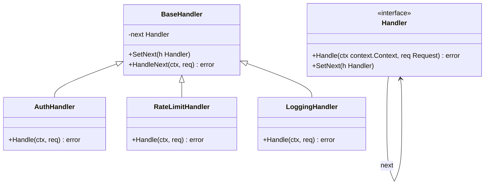
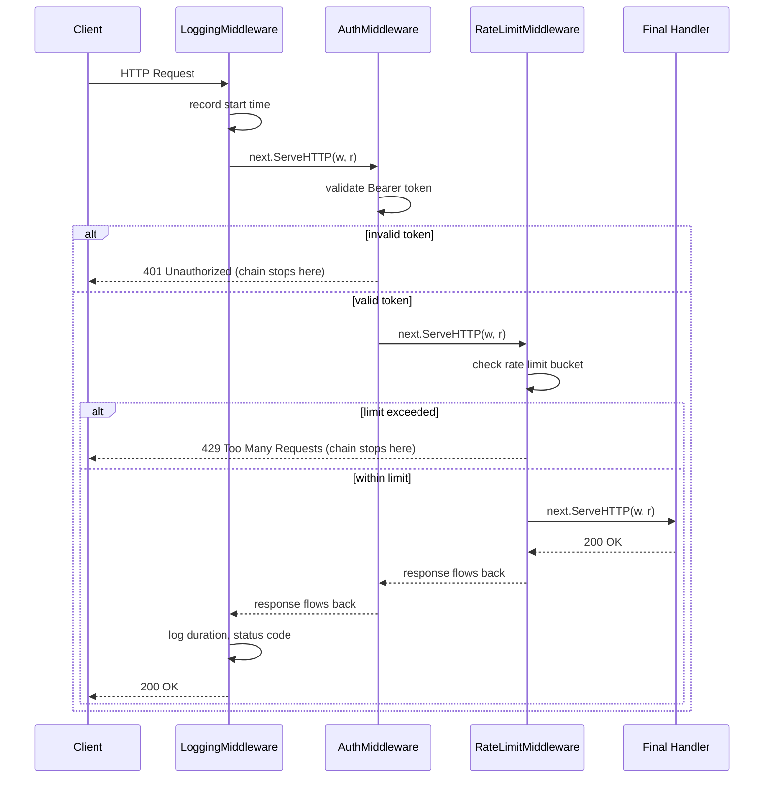

## 1. Overview

You write an HTTP handler in Go. Then you add authentication. Then rate limiting. Then request logging. Then distributed tracing. Suddenly your handler is doing six things and none of them well. The Chain of Responsibility pattern exists to solve exactly this problem.

Chain of Responsibility passes a request along a chain of handlers. Each handler decides: process this request myself, pass it to the next handler, or reject it entirely. The sender never knows which handler in the chain processes its request.

**Mental model:** Think of a corporate expense approval workflow. A $50 expense goes to the team lead. A $500 expense goes to the manager. A $5,000 expense goes to the VP. Each approver either handles the request or escalates to the next level. The requester submits and waits — they do not know which approver actually approved it. The chain handles routing.

In Go, you already use this pattern every day. Every `func(http.Handler) http.Handler` middleware is a Chain of Responsibility handler. Every gRPC interceptor is a link in the chain. Every Kong API gateway plugin is a node. You are not learning a new pattern — you are naming something you already use.

In this article you will learn:

- How Chain of Responsibility works and how it maps to Go's middleware model
- The idiomatic Go middleware pattern versus the classical GoF structure
- Why handler ordering is a security concern, not just an architecture concern
- The four failure modes that silently break middleware chains in production

---

## 2. Core Concepts (Step-by-Step)

### Step 1: Classical Structure vs. Go Idiomatic Structure

There are two ways to implement Chain of Responsibility in Go. Both are valid; you should know both.

**Classical GoF:** Each handler holds a reference to the next handler via a `SetNext` method.

```go
type Handler interface {
    Handle(ctx context.Context, req *Request) error
    SetNext(Handler)
}
```

**Idiomatic Go middleware:** Each middleware wraps the next handler using a closure. This is `func(http.Handler) http.Handler`.

```go
type Middleware func(http.Handler) http.Handler
```

The idiomatic Go form is more composable and has zero boilerplate. Use it for HTTP and gRPC. Use the classical form when you need dynamic chain modification at runtime.

### Step 2: Classical Structure Diagram



*BaseHandler provides the `SetNext` plumbing. Concrete handlers only implement `Handle`.*

### Step 3: The Request Flow



*Each middleware wraps the next. When a middleware returns early (401, 429), the request stops propagating. When it passes the check, it calls `next.ServeHTTP` and the chain continues.*

### Step 4: The Idiomatic Go Pattern

Go's `net/http` package makes Chain of Responsibility a first-class citizen:

```go
// Each middleware is a function that wraps the next handler
type Middleware func(http.Handler) http.Handler

// Chain composes multiple middlewares left-to-right
func Chain(h http.Handler, middlewares ...Middleware) http.Handler {
    for i := len(middlewares) - 1; i >= 0; i-- {
        h = middlewares[i](h)
    }
    return h
}

// Usage: Chain wraps handler with logging → auth → rate limit (outermost first)
handler := Chain(finalHandler, Logging, Auth, RateLimit)
```

The request hits `Logging` first, then `Auth`, then `RateLimit`, then `finalHandler`. Responses flow back in reverse order through the same chain.

### Step 5: gRPC Interceptors Follow the Same Pattern

Go's gRPC interceptor is Chain of Responsibility for RPC calls:

```go
// Unary server interceptor — same concept, different type signature
type UnaryServerInterceptor func(
    ctx context.Context,
    req interface{},
    info *grpc.UnaryServerInfo,
    handler grpc.UnaryHandler,
) (interface{}, error)
```

Every gRPC interceptor wraps the next call. The `handler` parameter is `next.ServeHTTP` in the HTTP world. The pattern is identical.

**Side-by-side comparison — the same Chain of Responsibility structure, two type systems:**

|                      | HTTP Middleware                           | gRPC Unary Interceptor                                        |
| -------------------- | ----------------------------------------- | ------------------------------------------------------------- |
| **Type**             | `func(http.Handler) http.Handler`         | `func(ctx, req, *UnaryServerInfo, UnaryHandler) (any, error)` |
| **"next"**           | `http.Handler`                            | `grpc.UnaryHandler`                                           |
| **Call next**        | `next.ServeHTTP(w, r)`                    | `return handler(ctx, req)`                                    |
| **Stop chain**       | `http.Error(w, msg, code); return`        | `return nil, status.Error(code, msg)`                         |
| **Context**          | `r.Context()` / `r.WithContext(ctx)`      | `ctx` parameter directly                                      |
| **Response**         | Written to `http.ResponseWriter` in place | Returned as `(interface{}, error)`                            |
| **Chaining library** | `gorilla/mux`, `chi`, `alice`             | `grpc.ChainUnaryInterceptor`                                  |

*Despite the type-signature differences, the mental model is identical: each handler receives a "call next" function, runs its logic before and/or after, and can short-circuit the chain by returning without calling it.*

---

## 3. Use Cases

### 1. Go net/http Middleware (Every Go Web Service)

Every production Go HTTP service uses Chain of Responsibility: logging, authentication, authorization, rate limiting, request ID injection, distributed tracing context propagation, CORS headers, panic recovery — each implemented as a separate middleware. Libraries like `gorilla/mux`, `chi`, and `echo` all provide `Use(middleware)` methods that build this chain.

[**HashiCorp Vault**](https://github.com/hashicorp/vault/blob/main/http/handler.go) is a well-documented public example: its Go HTTP server wraps every API request in a chain of middleware that includes audit logging, request namespace resolution, performance standby detection, and rate limiting — each as an independent `http.Handler` wrapper. You can read the exact chain construction in `vault/http/handler.go` in their open-source repository. The order is deliberate and security-critical: audit logging runs before namespace resolution so that even malformed namespace requests are logged.

The pattern is so fundamental to Go web services that most engineers implement it without ever thinking of it as "Chain of Responsibility."

### 2. Kong API Gateway Plugins

Kong's plugin system is Chain of Responsibility at the infrastructure level. Each request through Kong traverses a configurable plugin chain: authentication plugin → rate limiting plugin → transformation plugin → logging plugin → upstream proxy. Each plugin can terminate the request or pass it forward. Plugins are ordered explicitly in Kong's configuration — an incorrect order can create security vulnerabilities (more on this in Gotchas).

### 3. AWS Lambda Authorizers + API Gateway

AWS API Gateway with Lambda Authorizers is distributed Chain of Responsibility. A request to an API endpoint first hits the Lambda Authorizer (AuthHandler), which validates the token and returns an IAM policy. API Gateway then either forwards the request to the Lambda function (next handler) or rejects it with a 403, depending on the policy. The Lambda function never needs to implement authentication logic — the chain handles it before the request arrives.

---

## 4. Gotchas

### Gotcha 1: A Handler Silently Swallowing an Error

```go
// DANGEROUS: auth validation failed but the function continues
func (a *AuthMiddleware) Handle(ctx context.Context, req *Request) error {
    if err := a.validate(req.Token); err != nil {
        // Developer meant to return here but forgot
        log.Printf("auth warning: %v", err) // logs but continues!
    }
    return a.next.Handle(ctx, req) // request proceeds without authentication
}
```

This is the most dangerous Chain of Responsibility bug. The auth handler logs a warning and passes the request forward as if authentication succeeded. The endpoint processes an unauthenticated request. At best, a data leak. At worst, a security breach.

**Fix:** Every handler that detects a failure condition **must** return immediately without calling `next`. Code review gatekeeping: auth handlers specifically must be reviewed for this mistake. Add integration tests that verify a bad token gets a 401, not a 200.

### Gotcha 2: Handler Ordering Is a Security Vulnerability

Consider:

```
Chain: RateLimit → Auth → Handler   ← WRONG
Chain: Auth → RateLimit → Handler   ← CORRECT
```

With the wrong order, an attacker can exhaust your rate limit buckets by sending unauthenticated requests. The rate limiter counts each request against a per-IP bucket before authentication runs. A DDoS attacker can fill every bucket anonymously, blocking legitimate authenticated users.

The correct order: **Auth first**, then rate limiting (now keyed on an authenticated user ID, not just IP), then the handler.

**Fix:** Document the canonical middleware order for your system. Make it a code review checklist item. Write an integration test that verifies the chain order by checking that unauthenticated requests are rejected before rate limit headers appear in the response.

### Gotcha 3: Infinite Chain — No Terminal Handler

```go
// BUG: LoggingHandler passes to next, which passes to next, which is nil
func (l *LoggingHandler) Handle(ctx context.Context, req *Request) error {
    log.Print(req)
    return l.next.Handle(ctx, req) // panics if next is nil
}
```

If you forget to set a terminal handler (one that processes the request and returns without calling next), the chain runs until it hits a nil pointer dereference or infinite loop.

**Fix:** Always add a terminal handler that processes the request and never calls next. Implement a `nil` guard in `BaseHandler.HandleNext`: if next is nil, log an error and return `ErrNoTerminalHandler`. This surfaces the configuration error at startup, not at request time.

### Gotcha 4: A Middleware Mutating the Request in Breaking Ways

```go
// Middleware A normalizes the path: /orders/%7B123%7D → /orders/{123}
// Middleware B validates the path against an allowlist using the ORIGINAL format
// Middleware B runs AFTER A — it receives the normalized path, no match, blocks everything
```

Middleware B was written expecting the path in its original encoded form. After Middleware A transforms it, Middleware B always rejects it. This is a handler-ordering + mutation bug. All requests return 403 and the root cause is not obvious from the response.

**Fix:** Treat the request object as largely immutable in middleware — add fields, attach to context, but think carefully before modifying existing fields. When a middleware must transform the request (e.g., body decryption), document it explicitly and place it at a fixed position in the chain. Integration tests must run the full chain, not individual handlers in isolation.

---

## 5. Where to Use (and Where NOT to Use)

**Use Chain of Responsibility when:**

- Multiple independent concerns need to process the same request (auth, rate limiting, logging, tracing)
- Concerns should be composable and reorderable without modifying each other
- Each handler should be independently testable
- You need to dynamically add or remove processing steps (feature flags, A/B middleware configurations)

**Do NOT use Chain of Responsibility when:**

- The handlers need to share complex state at runtime — prefer a single handler with extracted helpers
- You need guaranteed processing by a specific handler — Chain can reject early; use explicit function calls instead
- The "chain" is just two steps that will never change — over-engineering
- You need the result of one handler to be used as input by the next — this is a Pipeline, not Chain of Responsibility

> 💡 **Staff-level insight:** In Go, Chain of Responsibility and middleware are the same pattern under different names. Every time you write a `func(http.Handler) http.Handler`, you are implementing GoF Chain of Responsibility. The naming distinction matters in conversations with non-Go engineers or in system design interviews where you cite the pattern by its canonical name. Knowing the GoF name gives you a shared vocabulary across language boundaries — Java, Python, .NET engineers will understand "Chain of Responsibility" even if they have never written Go middleware.

---

## 6. Versus (Comparisons)

### Chain of Responsibility vs. Decorator

| Aspect            | Chain of Responsibility                                 | Decorator                                                                |
| ----------------- | ------------------------------------------------------- | ------------------------------------------------------------------------ |
| Purpose           | Pass request down a chain; any handler can stop it      | Wrap an object to add behavior; always calls the wrapped object          |
| Early termination | Yes — handlers can reject without calling next          | No — decorator always calls the wrapped implementation                   |
| Use case          | Request processing pipelines with validations/guards    | Adding capabilities (logging, caching) without conditional short-circuit |
| Go example        | `func(http.Handler) http.Handler` that may return early | `func(http.Handler) http.Handler` that always calls next                 |

Technically, Go middleware that always calls next is a Decorator. When it can short-circuit (auth rejection, rate limit), it is Chain of Responsibility. In practice, "middleware" conflates both.

### Chain of Responsibility vs. Pipeline

| Aspect                 | Chain of Responsibility              | Pipeline                           |
| ---------------------- | ------------------------------------ | ---------------------------------- |
| Early termination      | Yes — any handler can stop the chain | No — every stage always processes  |
| Output carries forward | Only in context                      | Stage N output is Stage N+1 input  |
| Use case               | Request validation and filtering     | Data transformation and enrichment |
| Go example             | HTTP middleware                      | ETL pipeline, streaming processor  |

**Choose Chain of Responsibility** for request handling where guards and validators need to reject requests early.

**Choose Pipeline** when every stage always runs and the output of one stage feeds the next (e.g., a data enrichment pipeline that adds fields to a struct at each stage).

---

## 7. Code Example

```go
package chainofresponsibility

import (
	"context"
	"errors"
	"log"
	"net/http"
	"time"
)

// --- Idiomatic Go middleware pattern ---

// Middleware is the canonical Go type for Chain of Responsibility handlers.
type Middleware func(http.Handler) http.Handler

// Chain wraps handler with the given middlewares.
// Order matters: middlewares are applied outermost-first (left to right).
// Example: Chain(h, Logging, Auth, RateLimit) — request hits Logging first.
func Chain(h http.Handler, mw ...Middleware) http.Handler {
	for i := len(mw) - 1; i >= 0; i-- {
		h = mw[i](h)
	}
	return h
}

// LoggingMiddleware records request method, path, status, and duration.
// Always calls next — it is a passthrough observer.
func LoggingMiddleware(next http.Handler) http.Handler {
	return http.HandlerFunc(func(w http.ResponseWriter, r *http.Request) {
		start := time.Now()
		rw := &responseWriter{ResponseWriter: w, statusCode: http.StatusOK}
		defer func() {
			log.Printf("method=%s path=%s status=%d duration=%s",
				r.Method, r.URL.Path, rw.statusCode, time.Since(start))
		}()
		next.ServeHTTP(rw, r)
	})
}

// AuthMiddleware validates the Bearer token in the Authorization header.
// Terminates the chain with 401 if the token is invalid — does NOT call next.
func AuthMiddleware(validator TokenValidator) Middleware {
	return func(next http.Handler) http.Handler {
		return http.HandlerFunc(func(w http.ResponseWriter, r *http.Request) {
			token := r.Header.Get("Authorization")
			claims, err := validator.ValidateBearer(r.Context(), token)
			if err != nil {
				// IMPORTANT: return here; never fall through to next on auth failure
				http.Error(w, "unauthorized", http.StatusUnauthorized)
				return
			}
			// Propagate claims downstream via context — safe; immutable.
			ctx := context.WithValue(r.Context(), claimsKey{}, claims)
			next.ServeHTTP(w, r.WithContext(ctx))
		})
	}
}

// RateLimitMiddleware enforces per-user request rate limits.
// Must run AFTER AuthMiddleware so it keys on user ID, not anonymous IP.
func RateLimitMiddleware(limiter RateLimiter) Middleware {
	return func(next http.Handler) http.Handler {
		return http.HandlerFunc(func(w http.ResponseWriter, r *http.Request) {
			claims, ok := r.Context().Value(claimsKey{}).(Claims)
			if !ok {
				// Should never happen if chain order is correct — log and reject
				http.Error(w, "missing auth context", http.StatusInternalServerError)
				return
			}
			if !limiter.Allow(r.Context(), claims.UserID) {
				w.Header().Set("Retry-After", "60")
				http.Error(w, "rate limit exceeded", http.StatusTooManyRequests)
				return
			}
			next.ServeHTTP(w, r)
		})
	}
}

// RecoveryMiddleware catches panics in handlers and returns 500 instead of crashing.
// Should always be the outermost middleware in the chain.
func RecoveryMiddleware(next http.Handler) http.Handler {
	return http.HandlerFunc(func(w http.ResponseWriter, r *http.Request) {
		defer func() {
			if rec := recover(); rec != nil {
				log.Printf("panic recovered: %v", rec)
				http.Error(w, "internal server error", http.StatusInternalServerError)
			}
		}()
		next.ServeHTTP(w, r)
	})
}

// TokenValidator is the interface AuthMiddleware needs — injectable and testable.
type TokenValidator interface {
	ValidateBearer(ctx context.Context, token string) (Claims, error)
}

// RateLimiter is the interface RateLimitMiddleware needs.
type RateLimiter interface {
	Allow(ctx context.Context, userID string) bool
}

// Claims represents the authenticated user's identity.
type Claims struct {
	UserID string
	Roles  []string
}

type claimsKey struct{}

// responseWriter wraps http.ResponseWriter to capture the status code for logging.
type responseWriter struct {
	http.ResponseWriter
	statusCode int
}

func (rw *responseWriter) WriteHeader(code int) {
	rw.statusCode = code
	rw.ResponseWriter.WriteHeader(code)
}

// Wiring it together — canonical chain order:
// Recovery (outermost) → Logging → Auth → RateLimit → Handler (innermost)
func NewRouter(validator TokenValidator, limiter RateLimiter) http.Handler {
	finalHandler := http.HandlerFunc(func(w http.ResponseWriter, r *http.Request) {
		w.Write([]byte(`{"status":"ok"}`))
	})

	return Chain(finalHandler,
		RecoveryMiddleware,                 // catch panics first
		LoggingMiddleware,                  // log every request including auth failures
		AuthMiddleware(validator),          // reject unauthenticated requests
		RateLimitMiddleware(limiter),       // rate limit authenticated users
	)
}

// ErrNoTerminalHandler is returned when a classical chain has no terminal node.
var ErrNoTerminalHandler = errors.New("chain: no terminal handler configured")

// --- Classical GoF handler chain ---

// Handler is the interface every classical chain node must implement.
type Handler interface {
	Handle(ctx context.Context, req *Request) error
	SetNext(h Handler)
}

// Request is a generic inbound request — replace with your domain type.
type Request struct {
	Token   string
	UserID  string
	Payload []byte
}

// BaseHandler provides SetNext/HandleNext plumbing.
// Embed BaseHandler in concrete handlers to avoid reimplementing next-chain logic.
type BaseHandler struct {
	next Handler
}

func (b *BaseHandler) SetNext(h Handler) {
	b.next = h
}

// HandleNext forwards to the next handler in the chain.
// Returns ErrNoTerminalHandler when no next handler is configured —
// surfaces misconfigured chains at request time rather than panicking on nil.
func (b *BaseHandler) HandleNext(ctx context.Context, req *Request) error {
	if b.next == nil {
		return ErrNoTerminalHandler
	}
	return b.next.Handle(ctx, req)
}
```

---

## 8. Scale Discussion

**At 10x (high request throughput):**

Each middleware adds a function call overhead — nanoseconds. At 10,000 req/s with a 5-middleware chain, the middleware overhead is negligible compared to network I/O or DB latency. Profile first. The real concern at this scale is lock contention in middleware state (the rate limiter's token bucket, the authentication cache).

**At 100x (distributed tracing, wide fan-out):**

Middleware now needs to propagate distributed trace context across service calls. The tracing middleware extracts the trace context from incoming headers and injects it into the request context. Every downstream HTTP call made from handler code must extract and re-inject this context. OpenTelemetry's Go SDK provides middleware that handles this — use it rather than building your own.

**At 1000x (API gateway, multi-tenant, global):**

The middleware chain moves from application code to infrastructure: Kong, Envoy, or AWS API Gateway. Individual middleware is replaced by declarative configuration. Chain ordering is managed by operators, not developers. The operational risk at this scale is misconfigured plugin order — a security review of the gateway configuration becomes as important as a code review for authentication logic.

> 💡 **Staff-level insight:** When scaling Chain of Responsibility to infrastructure (Envoy, Kong, API Gateway), you are trading code flexibility for operational simplicity. You gain: centralized auth and rate limiting that applies to all services uniformly, without each service implementing it. You lose: the ability to customize per-route or per-tenant behavior within application code. The inflection point is usually around 5–10 services — below that, in-process middleware is simpler; above that, a gateway pays for itself.

---

## 9. Monitoring & Observability

| Metric                                   | Type                             | Alert Condition                                                |
| ---------------------------------------- | -------------------------------- | -------------------------------------------------------------- |
| `http.requests_total`                    | Counter per handler, status code | 401 spike → auth failures (attack or token expiry)             |
| `http.request_duration_seconds`          | Histogram per handler            | p99 spike in early middleware → systemic issue                 |
| `middleware.auth_failures_total`         | Counter                          | Sudden spike → credential stuffing or token rotation issue     |
| `middleware.rate_limit_rejections_total` | Counter per user                 | High per user → abuse; high globally → bucket config too tight |
| `middleware.panic_recoveries_total`      | Counter                          | Any value → bugs in handlers reaching production               |
| `middleware.chain_depth`                 | Gauge                            | Increases unexpectedly → middleware being added at runtime     |

**For every request, log:**

- `request_id` (injected by RequestID middleware — always first thing to inject)
- Auth outcome (authenticated/unauthenticated, user ID on success)
- Rate limit status (allowed/rejected, remaining quota)
- Total duration broken down per middleware phase if latency budget requires it

---

## 10. Interview Questions

### Q1: How would you design an API gateway with pluggable middleware for a multi-tenant SaaS platform where different tenants have different rate limits, auth methods, and feature flags?

**Key points to cover:**

- Global middleware chain: RequestID → Logging → RecoveryMiddleware → Auth → TenantResolution
- Per-tenant chain: tenant-specific rate limiter → tenant-specific feature flag checker → handler
- Auth middleware resolves tenant from JWT claims; injects tenant config into context
- Use the classical GoF form (dynamic chain building) rather than static `Chain()` — the per-tenant chain is built at request time from the tenant's configuration
- Rate limiter must be per-tenant, not global — use tenant ID as the rate limit key
- Configuration changes (new tenant, updated rate limit) must apply without service restart — store tenant configs in Redis/database, reload on context change

**Common mistake:** Proposing a giant switch statement inside one monolithic handler that branches per tenant. Does not scale, is not testable per tenant, and couples all tenant logic together.

**What the interviewer wants:** Evidence that you can decompose cross-cutting concerns into composable, independently deployable units — and that you understand the difference between static chain composition (good for homogeneous traffic) and dynamic chain building (necessary for per-tenant customization). Bonus points for calling out that per-tenant configuration must be hot-reloadable and for naming a concrete mechanism (Redis, etcd, or a config service) rather than leaving it abstract.

### Q2: What is the correct middleware order for a typical Go API server? Why does order matter?

**Key points:**

1. **RecoveryMiddleware** (outermost) — must wrap everything; if auth panics, we must still return 500
2. **RequestID** — inject request correlation ID before any logging
3. **LoggingMiddleware** — logs after RequestID is available; must see the final status code
4. **TracingMiddleware** — extract/inject distributed trace context
5. **AuthMiddleware** — reject unauthenticated requests before any business logic
6. **RateLimitMiddleware** — key on authenticated user ID; runs after auth
7. **AuthorizationMiddleware** — role/permission check; runs after auth resolves identity
8. **Handler** (innermost) — business logic

**Why order matters:** Rate limiting before auth → anonymous DDoS can exhaust buckets. Auth before rate limiting → rate limit is keyed on identity, not IP (which can be spoofed). Recovery before logging → panics in any middleware are caught and logged.

**Common mistakes:** Placing `RecoveryMiddleware` anywhere other than the outermost position (panics in logging or auth middleware would then crash the process). Placing rate limiting before auth, opening the DDoS vector described in Gotcha 2. Omitting `RequestID` middleware entirely, making distributed log correlation impossible. Treating the list as a suggestion rather than a security-enforced constraint.

**What the interviewer wants:** Not just memorization of the list — they want to hear you reason through *why* each item is in its position using security and observability arguments. A strong answer explains the consequence of every ordering violation, not just the correct order. Staff-level signal: volunteering that the canonical order should be documented, code-reviewed, and enforced by a linter or integration test — not just convention.

### Q3: How does Chain of Responsibility differ from the Decorator pattern? Are Go HTTP middlewares one or the other?

**Key points:**

- Decorator adds behavior but always calls the wrapped implementation — no early termination
- Chain of Responsibility can terminate the chain at any handler — early return without calling next
- Go HTTP middleware is *both*: when a middleware always calls `next.ServeHTTP` (logging, tracing), it is a Decorator. When it can short-circuit (auth, rate limit), it is Chain of Responsibility.
- Practically: the distinction rarely matters in Go; the `func(http.Handler) http.Handler` pattern handles both semantics with the same type
- What matters is *behavior*: always-calls-next middleware should be placed early; can-short-circuit middleware must be ordered by security priority

**What the interviewer wants:** Nuanced understanding that these are related but distinct patterns, and the ability to reason about the behavioral difference rather than just the structural difference.

---

## 11. Staff-Level Preparation Tips

**What to build:**

- Build a complete middleware chain for a REST API with: RequestID injection, structured logging (zerolog or zap), JWT authentication, per-user rate limiting (token bucket), distributed tracing (OpenTelemetry), and recovery. Write integration tests that verify: (1) bad JWT returns 401, (2) over-limit returns 429 with correct `Retry-After`, (3) panic in handler returns 500 (not 200 or crashing).
- Implement the same chain using gRPC interceptors. Note the type differences (`UnaryServerInterceptor` vs `func(http.Handler) http.Handler`) but identical conceptual structure.

**What to study:**

- [OpenTelemetry Go instrumentation](https://opentelemetry.io/docs/instrumentation/go/) — the tracing middleware is Chain of Responsibility + context propagation
- [chi router middleware](https://github.com/go-chi/chi) — excellent examples of idiomatic Go middleware composition
- [Envoy proxy filter chains](https://www.envoyproxy.io/docs/envoy/latest/intro/arch_overview/http/http_filters) — Chain of Responsibility at infrastructure scale using configuration instead of code

**System design connections:**

- **API Gateway design:** the gateway IS a Chain of Responsibility — every plugin/filter is a handler in the chain
- **Service mesh (Istio/Envoy):** sidecar proxy intercepts all traffic and applies a middleware chain before proxying
- **Lambda authorizers:** distributed Chain of Responsibility where each service is a handler node with its own compute boundary

**How to demonstrate staff-level thinking:**

When someone proposes "add an auth check inside the handler," correct it: "Auth should be in middleware, shared by all routes, not duplicated in each handler. But more importantly — what layer should own auth? Application middleware, gateway, or service mesh?" That question — which layer owns cross-cutting concerns — is the staff-level conversation.

---

## 12. References

- **Book:** *Design Patterns: Elements of Reusable Object-Oriented Software* — Gamma et al. Chain of Responsibility chapter, pp. 223–232
- **Docs:** [net/http package](https://pkg.go.dev/net/http) — `http.Handler` and `http.HandlerFunc` — the foundation of Go middleware
- **Blog:** [Mat Ryer — Writing middleware in #golang and how Go makes it so much fun](https://medium.com/@matryer/writing-middleware-in-golang-and-how-go-makes-it-so-much-fun-4375c1246e81) — canonical Go middleware article
- **Docs:** [gRPC Go interceptors](https://pkg.go.dev/google.golang.org/grpc#UnaryServerInterceptor) — Chain of Responsibility for RPC
- **Blog:** [Kong — Plugin Architecture](https://docs.konghq.com/gateway/latest/plugin-development/) — Chain of Responsibility at API gateway scale
- **Docs:** [chi router middleware](https://github.com/go-chi/chi#middleware) — idiomatic Go middleware library examples
- **Talk:** [GopherCon 2019 — Practical Go (middleware section)](https://youtu.be/EXrEd2-b048) — Dave Cheney on middleware composition in production Go services
- **Blog:** [Envoy proxy filter chains](https://www.envoyproxy.io/docs/envoy/latest/intro/arch_overview/http/http_filters) — infrastructure-level Chain of Responsibility
