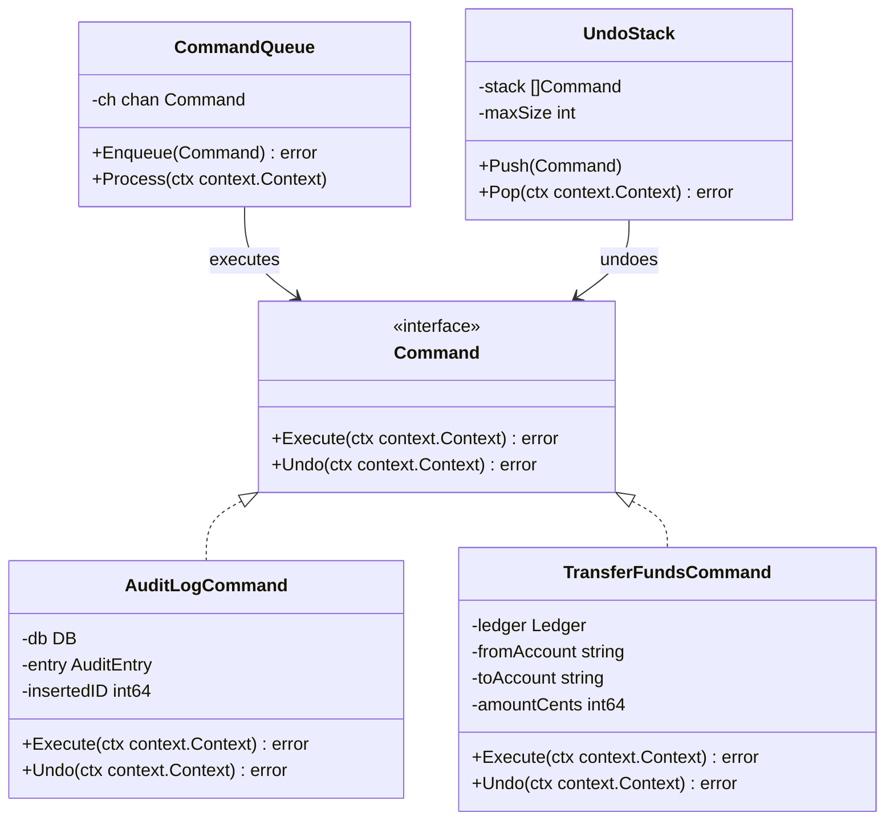
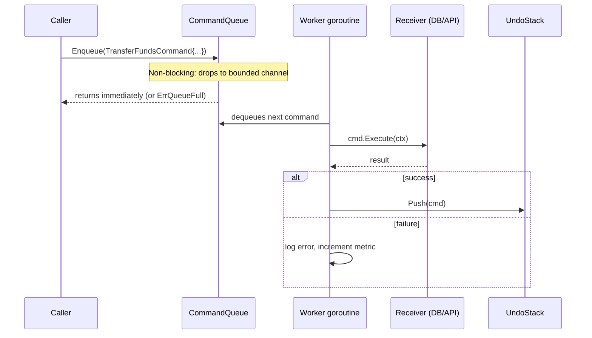

## 1. Overview

What does a restaurant order ticket, a Git commit, a database migration, and a Kafka message have in common? They are all Commands. Each one encapsulates everything needed to perform an action — and, critically, also everything needed to *undo* it.

The Command pattern encapsulates a request as an object. This sounds simple. The consequences are extraordinary: requests can be queued, logged, retried, scheduled, and reversed — because the request is now a first-class value you can store, inspect, and replay.

**Mental model:** Think of a restaurant. You tell the waiter what you want. The waiter writes it on a ticket (the Command object). The ticket goes into a queue. The kitchen executes tickets in order when capacity allows. The waiter does not cook; the chef does not know who ordered. The ticket carries everything needed: what to cook, how to cook it, and any notes. If something is wrong, the ticket is the audit trail. That is Command.

In this article you will learn:

- How Command decouples the invoker from the receiver
- How to implement an undo stack and a bounded command queue in Go
- Why distributed message queues are the Command pattern at infrastructure scale
- The four failure modes that turn Command from a solution into a problem

---

## 2. Core Concepts (Step-by-Step)

### Step 1: The Four Participants

1. **Command** (interface) — declares `Execute(ctx) error` and `Undo(ctx) error`
2. **ConcreteCommand** — encapsulates the action and all state needed to execute and reverse it
3. **Invoker** — triggers execution; holds the command queue and undo stack; does not know what commands do
4. **Receiver** — the actual service, DB, or API that does the work; it is called by the concrete command

### Step 2: Structure



*The Invoker (CommandQueue, UndoStack) only knows the Command interface — it never imports or references concrete commands.*

### Step 3: Command Execution Sequence



*The caller never waits for execution. The worker goroutine processes at its own pace. This decoupling is the key value of Command.*

### Step 4: Why This Matters for Distributed Systems

A Kafka message is a distributed Command. The producer is the Invoker. The Kafka topic is the durable CommandQueue. Each consumer group is a Worker goroutine pool. The consumer's processing logic is the Execute method. Kafka adds durability, partitioning, and replay — but the structure is identical.

| Command Pattern Role | Kafka Equivalent                                  |
| -------------------- | ------------------------------------------------- |
| Command interface    | Message schema / Avro contract                    |
| ConcreteCommand      | Specific event type (OrderCreated, PaymentFailed) |
| Invoker              | Producer                                          |
| CommandQueue         | Kafka topic with retention                        |
| Worker goroutine     | Consumer group instance                           |
| Execute()            | Consumer processing logic                         |
| Undo()               | Compensating transaction (saga rollback)          |

Understanding Command makes distributed workflow systems (Temporal, Kafka + Flink) immediately intuitive.

---

## 3. Use Cases

### 1. Git Commits

Every Git commit is a Command. `git commit` captures the diff (the action). `git revert` is `Undo()`. The Git log is an append-only CommandQueue persisted to disk. `git rebase` reorders Commands. `git cherry-pick` copies a Command to a different branch. Git is perhaps the most widely used implementation of Command in engineering history — 100M+ developers use it daily.

### 2. Database Migrations

Each database migration is a Command with an explicit `Up()` (`Execute`) and `Down()` (`Undo`). Migration frameworks (Flyway, golang-migrate) maintain an ordered CommandQueue of migration files. They execute them in order on `migrate up`, and reverse them on `migrate down`. The migration history table is the audit log of every Command ever executed against the schema.

### 3. Workflow Engines (Temporal/Cadence)

Temporal workflows are a durable, distributed CommandQueue. Each step in a workflow is a Command that Temporal persists before executing. If the worker crashes mid-workflow, Temporal replays Commands from the beginning to reconstruct state. This is Command + Event Sourcing combined — the workflow history is the complete audit trail of every Command, its result, and any retries.

---

## 4. Gotchas

### Gotcha 1: Unbounded Command Queues

```go
// DANGEROUS: unbounded channel = unbounded memory
q := make(chan Command)
```

If the producer enqueues faster than the worker processes, memory grows without bound. At peak load, the process OOM-kills. In a payment service, this means lost commands during the outage window.

**Fix:** Always use a bounded channel. On overflow, return an explicit `ErrQueueFull` — the caller can retry with backoff or apply back-pressure. Never silently drop or infinitely buffer.

### Gotcha 2: Commands That Are Not Serializable

```go
// BAD: captures a live *sql.Tx — cannot be persisted or retried
type PaymentCommand struct {
    tx        *sql.Tx    // non-serializable
    amount    int64
}
```

If you cannot serialize a Command to JSON or protobuf, you cannot persist it for retry on crash, replay on failure, or hand it to a distributed queue. The Command becomes ephemeral — its value is lost on process restart.

**Fix:** Commands must carry only serializable data: IDs, amounts, strings, timestamps. The Command's `Execute` method creates its own DB connection or transaction. Never embed live resources in a Command struct.

### Gotcha 3: Undo Operations That Are Not Truly Invertible

Deleting a file is easy. Undoing the deletion requires that you saved the file before deleting it. Sending an email cannot be unsent — `Undo` for an email command means logging "undo requested" and sending a follow-up correction email. Charging a credit card requires a refund — not a charge reversal.

**Fix:** Before implementing `Undo`, ask: "Is this operation truly reversible?" If not, design a *compensating action* rather than a true undo. Document this clearly. In financial systems, compensating actions must themselves be Commands in the audit trail.

### Gotcha 4: Commands That Accumulate State Indefinitely

```go
// BUG: UndoStack grows without bound; every executed command is retained
undoStack = append(undoStack, cmd) // no size cap
```

In a text editor processing millions of keystrokes, retaining every command forever means the undo stack grows to gigabytes. In a workflow engine processing thousands of jobs per minute, the pending command queue retains in-memory references to completed command objects.

**Fix:** Enforce a max depth on `UndoStack` (e.g., last 100 commands). After successful execution, drop the reference to any heavy resources in the command struct — keep the command skeleton for undo, discard the payload. Set command expiry TTLs in workflow engines.

---

## 5. Where to Use (and Where NOT to Use)

**Use Command when:**

- You need undo/redo functionality
- You need an audit trail of every action taken (financial transactions, security events)
- You need to queue, schedule, or retry operations asynchronously
- You need to support transactional workflows that can be rolled back

**Do NOT use Command when:**

- The action is simple, immediate, and requires no history — a direct function call is clearer
- You need synchronous feedback from the receiver — Command is asynchronous by nature
- Commands are so tightly coupled to a specific receiver type that they can never be reused — you have over-abstracted
- The codebase is small and the undo requirement doesn't exist — do not pre-optimize for flexibility you will never use

> 💡 **Staff-level insight:** Command is the foundation of three major system design concepts: event sourcing (the event log is an immutable append-only CommandQueue), CQRS (commands are the write side), and distributed saga pattern (saga steps are Commands with compensating actions as Undo). When an interviewer asks "how would you implement distributed transactions?", the answer involves Commands at every step. Understanding Command deeply unlocks these advanced patterns simultaneously.

---

## 6. Versus (Comparisons)

### Command vs. Message Queue

| Aspect     | Command (in-process)     | Message Queue (distributed)   |
| ---------- | ------------------------ | ----------------------------- |
| Durability | Lost on process crash    | Persisted to broker disk      |
| Ordering   | FIFO via channel         | Ordered per partition (Kafka) |
| Retry      | Manual in-process logic  | Built-in with DLQ             |
| Undo       | `Undo()` method          | Compensating message          |
| Scale      | Single process           | Multi-service, multi-node     |
| Latency    | Microseconds             | Milliseconds                  |
| Examples   | In-process command queue | Kafka, SQS, RabbitMQ          |

**Choose in-process Command when** the operation is within one service, latency is critical, and durability within the process is sufficient.

**Choose message queue when** commands cross service boundaries, durability across restarts is required, or multiple services need to react to the same command.

### Command vs. Strategy

| Aspect        | Command                                           | Strategy                                |
| ------------- | ------------------------------------------------- | --------------------------------------- |
| Purpose       | Encapsulate a *request* as an object              | Encapsulate an *algorithm* as an object |
| State         | Carries the data needed for execution             | Usually stateless or carries config     |
| Lifetime      | Executed once (or retried) then optionally stored | Lives for the duration of the context   |
| Reversibility | Has `Undo()` concept                              | No undo concept                         |

**Choose Command when** you need deferred execution, queuing, or undo.

**Choose Strategy when** you need to swap the algorithm used in an ongoing operation.

---

## 7. Code Example

```go
package command

import (
	"context"
	"errors"
	"sync"
	"time"
)

// Command is the core interface. Every action in the system implements it.
// Execute performs the action. Undo reverses it — or executes a compensating action.
type Command interface {
	Execute(ctx context.Context) error
	Undo(ctx context.Context) error
}

// CommandQueue is a bounded, concurrent-safe command processor.
// Bounded size prevents unbounded memory growth under producer back-pressure.
type CommandQueue struct {
	ch chan Command
}

// NewCommandQueue creates a queue with the given maximum pending capacity.
// Choose capacity based on: (max acceptable latency) × (commands per second).
func NewCommandQueue(capacity int) *CommandQueue {
	return &CommandQueue{ch: make(chan Command, capacity)}
}

// Enqueue submits a command for async execution.
// Returns ErrQueueFull if the queue is at capacity — caller should back-pressure.
func (q *CommandQueue) Enqueue(cmd Command) error {
	select {
	case q.ch <- cmd:
		return nil
	default:
		return errors.New("command queue full: apply back-pressure to caller")
	}
}

// Process drains the queue, executing each command until ctx is cancelled.
// Run this in a goroutine: go queue.Process(ctx)
func (q *CommandQueue) Process(ctx context.Context, onSuccess func(Command), onError func(Command, error)) {
	for {
		select {
		case cmd, ok := <-q.ch:
			if !ok {
				return
			}
			if err := cmd.Execute(ctx); err != nil {
				if onError != nil {
					onError(cmd, err)
				}
				continue
			}
			if onSuccess != nil {
				onSuccess(cmd)
			}
		case <-ctx.Done():
			return
		}
	}
}

// UndoStack maintains the history of executed commands for undo support.
// Older commands are evicted when maxSize is reached (rolling window).
type UndoStack struct {
	mu      sync.Mutex
	stack   []Command
	maxSize int
}

// NewUndoStack creates a stack that retains at most maxSize commands.
func NewUndoStack(maxSize int) *UndoStack {
	return &UndoStack{stack: make([]Command, 0, maxSize), maxSize: maxSize}
}

// Push adds a successfully-executed command to the undo history.
func (u *UndoStack) Push(cmd Command) {
	u.mu.Lock()
	defer u.mu.Unlock()
	if len(u.stack) >= u.maxSize {
		u.stack = u.stack[1:] // evict oldest — rolling window
	}
	u.stack = append(u.stack, cmd)
}

// Pop undoes the most recently executed command.
func (u *UndoStack) Pop(ctx context.Context) error {
	u.mu.Lock()
	defer u.mu.Unlock()
	if len(u.stack) == 0 {
		return errors.New("undo stack empty: nothing to undo")
	}
	cmd := u.stack[len(u.stack)-1]
	u.stack = u.stack[:len(u.stack)-1]
	return cmd.Undo(ctx)
}

// AuditEntry is the data an audit command persists.
type AuditEntry struct {
	UserID    string
	Action    string
	ResourceID string
	Timestamp time.Time
}

// AuditLogCommand inserts an audit record and can delete it on undo.
// This demonstrates a command that carries the inserted ID for true reversibility.
type AuditLogCommand struct {
	DB         DB         // DB is an interface — injectable for testing
	Entry      AuditEntry
	insertedID int64 // populated by Execute; used by Undo
}

// DB is the minimal interface AuditLogCommand needs from its receiver.
// Defining it here keeps the command package independent of any DB library.
type DB interface {
	InsertAuditEntry(ctx context.Context, e AuditEntry) (int64, error)
	DeleteAuditEntry(ctx context.Context, id int64) error
}

func (a *AuditLogCommand) Execute(ctx context.Context) error {
	id, err := a.DB.InsertAuditEntry(ctx, a.Entry)
	if err != nil {
		return err
	}
	a.insertedID = id // save for Undo
	return nil
}

// Undo removes the audit entry created by Execute.
// Note: in regulated systems, audit records may be immutable — Undo would
// insert a "reversal" record instead of deleting. Document this design choice.
func (a *AuditLogCommand) Undo(ctx context.Context) error {
	if a.insertedID == 0 {
		return errors.New("cannot undo: command was never executed")
	}
	return a.DB.DeleteAuditEntry(ctx, a.insertedID)
}
```

**Wiring it together:**

```go
func main() {
	queue := command.NewCommandQueue(256)
	undo := command.NewUndoStack(100)

	ctx, cancel := context.WithCancel(context.Background())
	defer cancel()

	go queue.Process(ctx,
		func(cmd command.Command) { undo.Push(cmd) },     // on success: save for undo
		func(cmd command.Command, err error) {             // on failure: log and alert
			log.Printf("command failed: %v", err)
		},
	)

	cmd := &command.AuditLogCommand{
		DB:    db,
		Entry: command.AuditEntry{UserID: "usr_123", Action: "login", Timestamp: time.Now()},
	}
	if err := queue.Enqueue(cmd); err != nil {
		// queue full — apply back-pressure (rate limit caller)
	}
}
```

---

## 8. Scale Discussion

**At 10x (high command throughput, single process):**

A bounded channel of 256 is usually enough for burst absorption. Monitor queue depth with `len(q.ch)`. If it stays above 80% capacity during normal operation, your worker pool is undersized — add more worker goroutines calling `queue.Process` concurrently.

**At 100x (worker pool, multi-worker processing):**

Multiple worker goroutines drain the same buffered channel safely in Go — the channel is the natural work-steal queue. Scale workers horizontally within the process until CPU-bound. For I/O-bound commands (DB writes, HTTP calls), 10–50 goroutines per channel are common at medium scale.

**At 1000x (cross-service, distributed):**

Commands cross service boundaries. The in-process channel becomes a Kafka topic. Each command type gets its own topic partition key for ordering guarantees. `Execute` becomes the consumer's message handler. `Undo` becomes a compensating event on a separate topic. Temporal or Cadence manages the entire workflow lifecycle — retries, timeouts, and rollback — as a durable distributed CommandQueue with full observability.

> 💡 **Staff-level insight:** The moment you put a Command in a Kafka message, you have made an implicit guarantee: the command will execute *at least once* (Kafka's delivery guarantee). Does your `Execute` method handle this? Idempotency — the property that executing a command twice produces the same result as executing it once — is mandatory for distributed Commands. Always design `Execute` to be idempotent by keying on a command ID and checking for prior execution before acting.

---

## 9. Monitoring & Observability

| Metric                               | Type                       | Alert Condition                                               |
| ------------------------------------ | -------------------------- | ------------------------------------------------------------- |
| `command.queue_depth`                | Gauge                      | > 80% of capacity → worker undersized or downstream degraded  |
| `command.enqueue_failures_total`     | Counter                    | Any value → queue full; caller receiving back-pressure        |
| `command.executed_total`             | Counter per command type   | Sudden drop → worker goroutine crashed                        |
| `command.execution_duration_seconds` | Histogram per command type | p99 spike → slow receiver (DB, external API)                  |
| `command.undo_stack_depth`           | Gauge                      | At max size → undo history being evicted; consider increasing |
| `command.undo_failures_total`        | Counter                    | Any value → non-invertible operations leaking                 |
| `command.execution_errors_total`     | Counter per command type   | Any value → commands failing; check DLQ                       |

**What to log per command execution:**

- Command type, command ID (for deduplication), caller ID, timestamp
- Execution duration, success/failure, error message on failure
- Undo availability (was the command pushed to undo stack?)

---

## 10. Interview Questions

### Q1: How would you implement undo/redo in a collaborative text editor shared by multiple concurrent users?

**Key points to cover:**

- Each keystroke or edit is a Command with `Execute` (apply the change) and `Undo` (reverse it)
- Each user has their own UndoStack — user A's undo does not affect user B's document
- Concurrent edits require Operational Transformation (OT) or CRDTs: commands from different users must be transformed relative to each other before Undo can work correctly
- The document's full history is an append-only CommandQueue (event log); you can reconstruct the document at any point in time by replaying commands from the beginning
- For Google Docs scale: commands are persisted to a distributed log (similar to Kafka) before being applied; each client maintains a local undo stack; server-side command log is the source of truth

**Common mistake:** Proposing a single shared undo stack. In a collaborative editor, this would let user A undo user B's changes — a major UX and correctness bug.

**What the interviewer wants:** Recognition that Command + Event Sourcing are deeply related; that distributed shared state introduces transformation complexity; and that undo semantics change fundamentally in collaborative contexts.

### Q2: How does the Command pattern relate to database migrations?

**Key points:**

- Each migration file is a ConcreteCommand: `Up()` is `Execute`, `Down()` is `Undo`
- The migration framework is the Invoker: it reads the CommandQueue from the filesystem
- The `schema_migrations` table is the audit log: every successfully executed command is recorded with its version ID and timestamp
- Running `migrate up` = Process(CommandQueue); `migrate down` = UndoStack.Pop() N times
- The design constraint: every migration must be idempotent (running it twice should be safe) — this is the distributed command idempotency requirement applied to schema changes

**What the interviewer wants:** Evidence that you see design patterns in production tooling, not just toy examples.

### Q3: How would you implement a retry mechanism for failed commands in a distributed system?

**Key points:**

- Failed commands go to a dead-letter queue (DLQ) — a separate CommandQueue for failures
- A retry worker reads from the DLQ and re-enqueues commands with exponential backoff
- Commands must carry: attempt count, first-attempt timestamp, max-attempt limit, error history
- Commands must be idempotent — the system must handle executing the same command twice safely (check-then-act pattern keyed on command ID)
- After max retries, escalate: alert on-call, page, move to permanent DLQ for manual inspection
- For Kafka: set consumer group max retries, publish to `{topic}.DLQ` on failure, write a separate DLQ consumer service

**What the interviewer wants:** Production operational thinking — not just the happy path, but the failure handling, observability, and recovery path.

---

## 11. Staff-Level Preparation Tips

**What to build:**

- Build a job processing system with: `CommandQueue` (bounded), worker pool, `UndoStack`, a DLQ for failed commands, and a CLI to inspect queue depth, list recent commands, replay from the DLQ, and manually trigger undo. This is a realistic interview project that demonstrates Command + operational thinking.
- Implement the same command interface as a Kafka consumer: replace the in-process queue with a Kafka consumer group. Same Command interface, different Invoker. Demonstrate that the concrete commands need zero changes.

**What to study:**

- Event Sourcing: the event store is an immutable CommandQueue; every state is derived by replaying commands
- CQRS: commands are the write side of CQRS; queries are read-only views rebuilt from Command events
- Temporal Workflows: build one simple workflow; understand how Temporal persists and replays commands
- Outbox Pattern: a Command that durably writes to DB and then publishes an event without dual-write risk

**System design connections:**

- **Saga Pattern:** a distributed transaction is a sequence of Commands; rollback is executing each command's `Undo` in reverse order
- **Event Sourcing:** the aggregate state is derived by replaying all Commands against the starting state
- **CQRS + Command:** commands are the write model; events emitted by commands build read models

**How to demonstrate staff-level thinking:**

In system design discussions, when commands are proposed: immediately ask "is Execute idempotent?", "what is the retry strategy?", "where is the DLQ?", and "how do we replay on crash?" These are the questions that separate someone who has used commands from someone who has operated them in production at 3 AM.

---

## 12. References

- **Book:** *Design Patterns: Elements of Reusable Object-Oriented Software* — Gamma et al. Command chapter, pp. 233–242
- **Book:** *Implementing Domain-Driven Design* — Vaughn Vernon. Commands and events in DDD
- **Book:** *Designing Data-Intensive Applications* — Martin Kleppmann. Chapter 11 covers stream processing as distributed Command execution
- **Talk:** [GopherCon 2017 — Building a Job Queue in Go](https://www.youtube.com/watch?v=F6pLgQtGtCI) — practical bounded command queues in Go
- **Blog:** [Temporal.io — What is Temporal?](https://docs.temporal.io/concepts/what-is-temporal) — Command pattern at distributed workflow scale
- **Blog:** [Martin Fowler — Event Sourcing](https://martinfowler.com/eaaDev/EventSourcing.html) — canonical article connecting Command to Event Sourcing
- **Blog:** [Martin Fowler — CQRS](https://martinfowler.com/bliki/CQRS.html) — Commands as the write side of CQRS
- **Go:** [context package](https://pkg.go.dev/context) — timeout propagation for command execution boundaries
