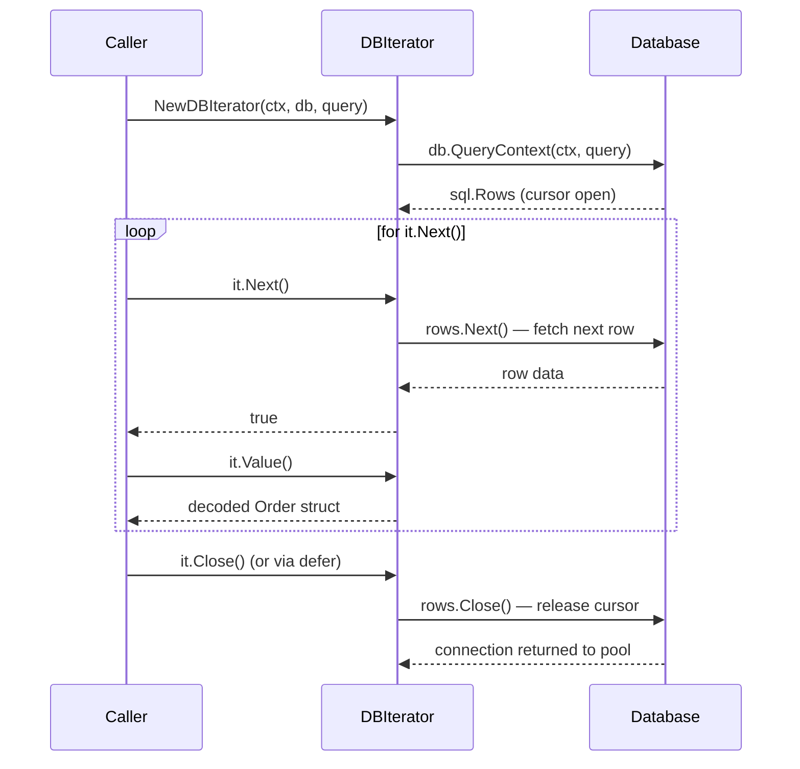
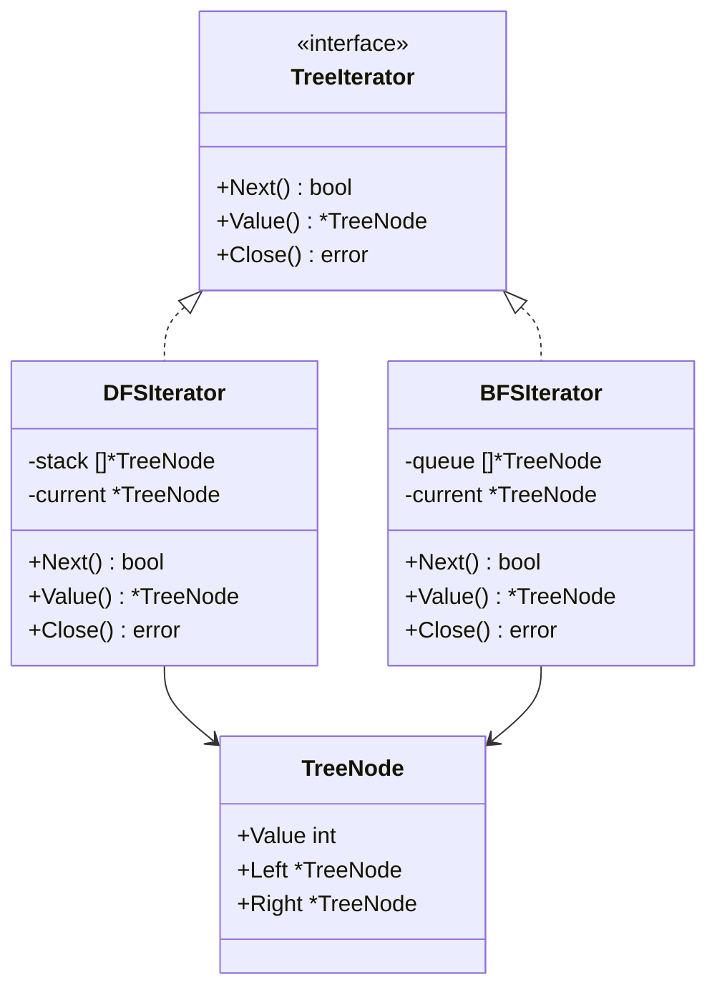

## 1. Overview

Go's `range` keyword handles 90% of iteration needs. You iterate over slices, maps, channels, and strings — it just works. So why does the Iterator pattern matter for a staff engineer?

Because `range` requires the entire collection to exist in memory first. And some collections are too large for that, too slow to build upfront, or their next element is not known until you ask for it.

The Iterator pattern provides sequential access to elements of a collection without exposing its internal representation. The caller only ever knows: "give me the next element" and "are there more elements?" The collection's structure — whether it is an array, a database cursor, a tree, a Kafka topic, or a remote API paginating with continuation tokens — is invisible to the traversal code.

**Mental model:** Think of a SQL database cursor. You have a query that matches 10 million rows. You do not load all 10 million rows into memory. You ask the database: "give me the next 1000 rows." Process them. Ask again. Repeat. The database tracks where you are. You just keep asking "next, next, next" until the cursor is exhausted. That is an explicit Iterator. `range` over a slice is Iterator over an in-memory collection — it is the same abstraction, different backing store.

In this article you will learn:

- When Go's `range` is sufficient and when you need an explicit Iterator
- How to build a lazy, context-cancellable database cursor Iterator in Go
- How to build a tree Iterator that supports depth-first and breadth-first traversal
- The four failure modes: holding locks during iteration, concurrent modification, non-terminating iterators, and resource leaks from unclosed iterators

---

## 2. Core Concepts (Step-by-Step)

### Step 1: When You Need Explicit Iterator

| Situation                           | Use `range`?                               | Use Explicit Iterator?     |
| ----------------------------------- | ------------------------------------------ | -------------------------- |
| Iterate over in-memory slice or map | ✅ Yes                                      | ❌ No — overkill            |
| Fetch from DB: 10M rows             | ❌ Cannot fit in memory                     | ✅ Yes — database cursor    |
| Traverse a tree depth-first         | ❌ range doesn't know trees                 | ✅ Yes — custom traversal   |
| Kafka consumer poll loop            | ❌ Kafka SDK is not rangeable (pre-Go 1.23) | ✅ Yes — poll iterator      |
| API with pagination cursors         | ❌ Page boundary not known upfront          | ✅ Yes — paginated iterator |
| Large file line-by-line             | ✅ bufio.Scanner handles this               | ✅ Both                     |

The rule: use `range` for in-memory, bounded, immediately-available collections. Use an explicit Iterator when the collection is lazy, large, remote, or requires custom traversal.

### Step 2: The Go Iterator Interface

Go does not have a built-in generic Iterator interface (before Go 1.23 range-over-function). The idiomatic pattern uses a struct with four methods:

```go
type Iterator[T any] interface {
    Next() bool     // advances and returns true if a value is available
    Value() T       // returns the current value
    Err() error     // returns the first non-EOF error encountered during iteration
    Close() error   // releases resources (DB cursor, file handle, HTTP connection)
}
```

The usage is:

```go
it := NewDBIterator(ctx, db, "SELECT * FROM orders WHERE status = 'pending'")
defer it.Close()
for it.Next() {
    order := it.Value()
    process(order)
}
if err := it.Err(); err != nil {
    return fmt.Errorf("iteration failed: %w", err)
}
```

This maps directly to how SQL cursors work in every database driver.

> ⚠️ **Why three methods are not enough:** `Next()` returns `false` for two very different reasons — the collection is exhausted (success) and an error occurred (failure). Without `Err()`, the caller cannot distinguish between "I processed all 10M rows" and "I processed 5M rows and then the database connection dropped." This is the same design `sql.Rows`, `bufio.Scanner`, and Go's standard library iterators all use. Omitting `Err()` is the single most common mistake when first implementing the pattern.

### Step 3: Database Cursor Iterator — Sequence



*The database cursor is kept open across all iterations. The connection is not returned to the pool until `Close()` is called. Always `defer it.Close()`.*

### Step 4: Go 1.23 Range-Over-Function (the Future of Iterator in Go)

Go 1.23 introduced range-over-function — a way to make custom types work with `range`:

```go
// Go 1.23+: yield-based iterator
func Orders(ctx context.Context, db *sql.DB) iter.Seq[Order] {
    return func(yield func(Order) bool) {
        rows, _ := db.QueryContext(ctx, "SELECT * FROM orders")
        defer rows.Close()
        for rows.Next() {
            var o Order
            rows.Scan(&o.ID, &o.Status)
            if !yield(o) { // yield returns false when caller breaks
                return
            }
        }
    }
}

// Usage: now works with range
for order := range Orders(ctx, db) {
    process(order)
}
```

This is the direction Go is moving. Build explicit Iterator interfaces today; be ready to migrate to `iter.Seq` as Go 1.23+ adoption increases in your codebase.

### Step 5: Tree Iterator — Depth-First vs. Breadth-First as Strategy



*Same `TreeIterator` interface, two traversal strategies. Caller code is identical regardless of which iterator is injected.*

---

## 3. Use Cases

### 1. SQL Cursors for Large Result Sets

PostgreSQL cursors are the canonical Iterator use case. When a query might return millions of rows (financial reports, data exports, audit log queries), loading the full result set into memory would exhaust heap. The cursor fetches a configurable batch size (typically 100–1000 rows), processes them, then fetches the next batch. Go's `database/sql` package exposes `sql.Rows` — this is a cursor-based Iterator. The pattern wraps this in a typed Iterator to give callers a clean domain-level interface.

### 2. Kafka Consumer Poll Loop

The Kafka consumer's polling mechanism is an explicit Iterator. The `Consume()` loop is `Next()` — it blocks until a message is available or a timeout occurs. The message is `Value()`. The consumer loop runs until the context is cancelled. Each call to `Poll()` fetches the next batch from Kafka's broker. This is Iterator over a distributed, durable, unbounded stream — the most scaled form of the pattern.

### 3. Pagination Cursor (Continuation Token Pattern)

REST APIs with large result sets use pagination cursors: `GET /orders?after=cursor_xyz`. The server returns a page of results and a `next_cursor` token. The client uses the token in the next request. Implemented as an Iterator, the caller loops with `it.Next()` which makes the HTTP call and updates the internal cursor token. The caller never manages HTTP pagination logic — they just iterate. GitHub's API, Stripe's API, and most modern REST APIs use this pattern.

---

## 4. Gotchas

### Gotcha 1: Holding a Lock During Iteration

```go
// DANGEROUS: holding a mutex across a long iteration
mu.Lock()
defer mu.Unlock()
for it.Next() {
    process(it.Value()) // long operation — holds lock the entire time
}
```

If each `process()` call takes 10ms and you have 10,000 elements, the lock is held for 100 seconds. Any goroutine attempting to acquire the lock is blocked for 100 seconds. This is a deadlock-in-slow-motion.

**Fix:** Copy the collection under the lock, release the lock, then iterate over the copy. Or design the iterator to snapshot data under lock at construction, then iterate over the snapshot without holding the lock.

```go
mu.RLock()
snapshot := make([]Item, len(items))
copy(snapshot, items)
mu.RUnlock()
// Iterate snapshot without any lock
for _, item := range snapshot {
    process(item)
}
```

### Gotcha 2: Concurrent Modification During Iteration

```go
// RACE CONDITION: another goroutine deletes elements while we iterate
for _, id := range orderIDs {
    order, _ := cache.Get(id)
    process(order)
    // Another goroutine calls cache.Delete(someID) here → slice underrun, map panic
}
```

In Go, mutating a map while ranging over it panics. Mutating a slice while iterating by index produces corrupted results. In database terms, this is a "phantom read" — rows matching the initial query condition appear or disappear mid-iteration because another transaction modifies them.

**Fix:** Use snapshot isolation for in-memory collections (copy before iterating). For database iterators, open the cursor within a repeatable-read transaction (`SET TRANSACTION ISOLATION LEVEL REPEATABLE READ`) to prevent phantom reads during long-running iterations.

### Gotcha 3: Iterator That Never Terminates

```go
// BUG: conditional in Next() never becomes false — infinite loop
func (it *InfiniteIterator) Next() bool {
    it.current = it.generateNext() // always generates a next value
    return true // always returns true — caller loops forever
}
```

In production, this exhausts CPU, fills the goroutine stack, or runs until the process is killed. Common sources: cyclic graphs iterated without visited-node tracking, generators that always produce the next item without a terminal condition, or pagination iterators that loop on the last page with an empty cursor token.

**Fix:** All iterators must have a terminal condition. For generators, define a maximum item count or a stop condition. For graph traversal, maintain a `visited` set. For pagination, check if the response's `next_cursor` is empty and return `false` from `Next()`. Every iterator must also respect `ctx.Done()` so it can be externally terminated.

### Gotcha 4: Forgetting to Close Iterators That Hold Resources

```go
// RESOURCE LEAK: iterator opened but never closed
func processOrders(ctx context.Context, db *sql.DB) {
    it := NewDBIterator(ctx, db, "SELECT * FROM orders")
    // No defer it.Close() — database connection held until GC
    for it.Next() {
        process(it.Value())
        if someCondition {
            return // early return without closing — connection leaked
        }
    }
}
```

`sql.Rows` holds a live database connection from the connection pool. If not closed, the connection is never returned to the pool. After enough leaks, the pool is exhausted; all new queries block waiting for a connection. System grinds to a halt.

**Fix:** Always `defer it.Close()` immediately after creating any resource-holding iterator. This follows the Go idiom for any resource with a `Close()` — files, HTTP responses, database cursors. Never rely on garbage collection to close iterators; GC timing is unpredictable and connection pools deplete long before GC runs.

---

## 5. Where to Use (and Where NOT to Use)

**Use explicit Iterator when:**

- The collection is too large to fit entirely in memory (database cursor, file iterator)
- The collection is lazily generated — the next element is computed on demand
- You need custom traversal order over a data structure (DFS/BFS over trees or graphs)
- The collection is unbounded or streamed in real-time (Kafka, WebSocket messages)
- Iteration must be interruptible — the caller can stop midway without processing everything

**Do NOT use explicit Iterator when:**

- You have an in-memory slice or map — just use `range` (far simpler)
- You need parallel processing — an Iterator is inherently sequential; use goroutines + channels or `sync.WaitGroup` with a slice
- You need random access — Iterator is sequential by design; use a slice with index access
- The collection always fits in memory and is fully known upfront — no lazy loading needed

> 💡 **Staff-level insight:** The Iterator pattern is deceptively simple, but its resource management contract is what makes or breaks production systems. Every database cursor, file handle, and network connection held by an iterator is rented from a finite pool. The contract is: open, use, close, always. When you design an Iterator API for other teams, make `Close()` impossible to forget — build it into the constructor (return the iterator and a cleanup function), accept a `context.Context` for auto-cancellation, or use the Go 1.23 range-over-function pattern where the cleanup is invoked automatically when the iteration ends. The safest iterator is one that cannot leak.

---

## 6. Versus (Comparisons)

### Explicit Iterator vs. Go `range`

| Aspect               | Explicit Iterator                            | Go `range`                         |
| -------------------- | -------------------------------------------- | ---------------------------------- |
| Collection in memory | Not required — lazily fetches                | Must be fully in memory            |
| Custom traversal     | Yes — DFS, BFS, custom                       | No — always sequential / map order |
| Interruptibility     | Return `false` from `Next()`                 | `break` exits the range loop       |
| Resource management  | Holds connection/cursor; MUST call `Close()` | No external resources to manage    |
| When to use          | Large/lazy/external collections              | In-memory, bounded, immediate      |

**Choose `range` for** anything in memory. **Choose explicit Iterator for** anything that requires external resources or lazy fetching.

### Iterator vs. Channel-Based Fan-Out

| Aspect        | Iterator (sequential)            | Channel (concurrent fan-out)              |
| ------------- | -------------------------------- | ----------------------------------------- |
| Concurrency   | Sequential — one consumer        | Concurrent — multiple goroutines          |
| Ordering      | Maintained by Iterator           | Not guaranteed across goroutines          |
| Back-pressure | Natural — `Next()` controls pace | Channel buffer; drop on overflow          |
| Use case      | One consumer processing in order | Parallel workers processing independently |

**Choose Iterator when** processing is sequential and order matters.

**Choose channels when** you need parallel fan-out to multiple workers and can tolerate or manage unordered processing.

### Iterator vs. Cursor (SQL)

These are the same concept at different abstraction levels. A SQL cursor IS an Iterator — `FETCH NEXT FROM cursor` is `it.Next()`, `CLOSE cursor` is `it.Close()`. The Iterator pattern in application code wraps the SQL cursor to give it a typed, Go-idiomatic interface rather than exposing raw `*sql.Rows`.

---

## 7. Code Example

### Part 1: Database Cursor Iterator (lazy, context-cancellable)

```go
package iterator

import (
	"context"
	"database/sql"
	"fmt"
)

// Order is the domain type this iterator produces.
type Order struct {
	ID     string
	Status string
	Total  int64
}

// DBIterator provides lazy, page-at-a-time iteration over an orders query.
// It holds a live database connection — always call Close() when done.
// Use: it := NewDBIterator(ctx, db, q); defer it.Close(); for it.Next() { ... }
type DBIterator struct {
	ctx     context.Context
	rows    *sql.Rows
	current Order
	err     error
}

// NewDBIterator opens a database cursor for the given query.
// The cursor is held open until Close() is called — never skip the defer.
func NewDBIterator(ctx context.Context, db *sql.DB, query string, args ...any) (*DBIterator, error) {
	rows, err := db.QueryContext(ctx, query, args...)
	if err != nil {
		return nil, fmt.Errorf("dbiterator: query failed: %w", err)
	}
	return &DBIterator{ctx: ctx, rows: rows}, nil
}

// Next advances the iterator to the next row.
// Returns false when exhausted, when an error occurs, or when context is cancelled.
// Always check Err() after the loop to distinguish exhaustion from failure.
func (it *DBIterator) Next() bool {
	// Respect context cancellation — stop iteration if caller cancelled.
	select {
	case <-it.ctx.Done():
		it.err = it.ctx.Err()
		return false
	default:
	}

	if !it.rows.Next() {
		return false
	}
	it.err = it.rows.Scan(&it.current.ID, &it.current.Status, &it.current.Total)
	return it.err == nil
}

// Value returns the most recently fetched Order.
// Only valid after a successful Next() call.
func (it *DBIterator) Value() Order {
	return it.current
}

// Err returns any error encountered during iteration.
// Call after the iteration loop, before calling Close.
func (it *DBIterator) Err() error {
	if it.err != nil {
		return it.err
	}
	return it.rows.Err()
}

// Close releases the database cursor and returns the connection to the pool.
// MUST be called — always use defer: defer it.Close()
func (it *DBIterator) Close() error {
	return it.rows.Close()
}
```

### Part 2: Tree Iterator — DFS and BFS as Strategy

```go
// TreeNode is a simple binary tree node.
type TreeNode struct {
	Value int
	Left  *TreeNode
	Right *TreeNode
}

// TreeIterator is the common interface for all traversal strategies.
type TreeIterator interface {
	Next() bool
	Value() int
}

// DFSIterator traverses the tree using depth-first search (in-order: left, node, right).
type DFSIterator struct {
	stack   []*TreeNode
	current *TreeNode
}

// NewDFSIterator creates an iterator starting from root using in-order DFS.
func NewDFSIterator(root *TreeNode) *DFSIterator {
	it := &DFSIterator{}
	it.pushLeft(root)
	return it
}

func (it *DFSIterator) pushLeft(node *TreeNode) {
	for node != nil {
		it.stack = append(it.stack, node)
		node = node.Left
	}
}

// Next advances to the next in-order node.
func (it *DFSIterator) Next() bool {
	if len(it.stack) == 0 {
		return false
	}
	top := it.stack[len(it.stack)-1]
	it.stack = it.stack[:len(it.stack)-1]
	it.current = top
	it.pushLeft(top.Right) // push all left children of the right subtree
	return true
}

func (it *DFSIterator) Value() int { return it.current.Value }

// BFSIterator traverses the tree level-by-level (breadth-first).
type BFSIterator struct {
	queue   []*TreeNode
	current *TreeNode
}

// NewBFSIterator creates an iterator starting from root using BFS.
func NewBFSIterator(root *TreeNode) *BFSIterator {
	it := &BFSIterator{}
	if root != nil {
		it.queue = append(it.queue, root)
	}
	return it
}

// Next advances to the next level-order node.
func (it *BFSIterator) Next() bool {
	if len(it.queue) == 0 {
		return false
	}
	it.current = it.queue[0]
	it.queue = it.queue[1:]
	if it.current.Left != nil {
		it.queue = append(it.queue, it.current.Left)
	}
	if it.current.Right != nil {
		it.queue = append(it.queue, it.current.Right)
	}
	return true
}

func (it *BFSIterator) Value() int { return it.current.Value }
```

**Usage — caller code is identical regardless of traversal strategy:**

```go
// Process all pending orders lazily from the database
it, err := iterator.NewDBIterator(ctx, db,
    "SELECT id, status, total FROM orders WHERE status = 'pending'")
if err != nil {
    return fmt.Errorf("failed to open order iterator: %w", err)
}
defer it.Close() // ALWAYS defer — prevents connection leak

for it.Next() {
    order := it.Value()
    if err := processOrder(ctx, order); err != nil {
        log.Printf("failed to process order %s: %v", order.ID, err)
    }
}
if err := it.Err(); err != nil {
    return fmt.Errorf("order iteration error: %w", err)
}

// --- Tree traversal — swap DFS for BFS without changing the loop ---
root := buildTree() // returns *TreeNode
var treeIt iterator.TreeIterator

treeIt = iterator.NewDFSIterator(root)  // in-order depth-first
// treeIt = iterator.NewBFSIterator(root) // swap to BFS — zero changes below

values := []int{}
for treeIt.Next() {
    values = append(values, treeIt.Value())
}
```

---

## 8. Scale Discussion

**At 10x (10K–100K rows in a single query):**

Fetching 100K rows into a `[]Order` slice requires ~50MB of memory (at ~500 bytes per order). For most services this is acceptable. For batch jobs or services with many concurrent requests, it is not. The cursor iterator keeps memory usage constant at `(page size) × (row bytes)` regardless of total row count. Profile memory first; switch to cursor iterator when heap allocation spikes during large queries.

**At 100x (millions of rows, data export service):**

The database cursor's connection stays open for the duration of the export. At 1M rows × 1ms per row = 1000 seconds. A database connection is held for 1000 seconds. Connection pool exhaustion is a real risk. Fix: use server-side cursors with periodic `FETCH 1000` batches; set aggressive `statement_timeout`; close and reopen the cursor at checkpoint intervals so the connection is returned to the pool periodically.

**At 1000x (Kafka-scale, infinite stream):**

The Iterator never terminates. `it.Next()` always returns `true` (until context cancellation). The collection is not a finite DB table — it is a continuously appended Kafka topic. Memory usage per iterator stays constant (one message at a time). The challenge is throughput — iterating at Kafka consumer speed (100K msgs/sec per partition) requires zero allocations per `Next()` call. Use object pools for the `Value()` type; avoid JSON deserialization on the hot path; use binary encoding (protobuf/Avro).

> 💡 **Staff-level insight:** At scale, iterator performance comes down to one thing: allocations per `Next()` call. Every heap allocation in the hot loop adds GC pressure. Profile with `go tool pprof` and look for unexpected allocations in `Next()` and `Value()`. The ideal high-throughput iterator allocates nothing per call — it deserializes into a reused struct, iterates over a fixed-size pre-fetched batch, and applies back-pressure by blocking `Next()` when the processing goroutine is behind. This is exactly how Kafka's consumer SDK achieves >100K messages/second per consumer goroutine.

---

## 9. Monitoring & Observability

| Metric                              | Type                   | Alert Condition                                         |
| ----------------------------------- | ---------------------- | ------------------------------------------------------- |
| `iterator.rows_fetched_total`       | Counter per query      | Should match expected data size                         |
| `iterator.open_cursors`             | Gauge                  | Unbounded growth → unclosed iterators (connection leak) |
| `iterator.next_duration_seconds`    | Histogram              | Spike → slow DB query or network latency                |
| `iterator.early_terminations_total` | Counter                | Spike → context cancellations, back-pressure, or bugs   |
| `iterator.errors_total`             | Counter per error type | Any scan errors → schema mismatch                       |
| `iterator.batch_size`               | Histogram              | Consistently < target → DB batching misconfigured       |
| `db.connection_pool_wait_seconds`   | Histogram              | Spike correlating with open cursors → connection leak   |

**Critical operational check:**

Instrument a `LeakDetector` in development and staging: at `Close()`, record the open duration. If an iterator's open duration exceeds 60 seconds, log the stack trace of where it was created. This surfaces long-running cursors before they become pool exhaustion incidents in production.

---

## 10. Interview Questions

### Q1: You have a table with 500 million rows that needs to be processed by a batch job. The job runs on a 4GB RAM machine. How do you design the data access layer?

**Key points to cover:**

- Loading 500M rows into memory is not feasible — use a cursor-based Iterator
- Open a database cursor with `QueryContext`; iterate with `rows.Next()`; process one row at a time
- Memory usage stays constant: `(1 row) × (row size)` — typically a few hundred bytes
- Connection management: the cursor holds a DB connection for the job's duration; use a dedicated connection (not the shared pool) for long-running jobs, OR batch with `LIMIT/OFFSET` or `WHERE id > :last_seen_id` to periodically release the connection
- Context cancellation: the iterator must respect `ctx.Done()` so the job can be gracefully stopped
- Error handling: distinguish `io.EOF` (exhausted) from scan errors (schema mismatch) from query errors (connection failure)
- Checkpointing: for extremely long jobs, checkpoint the last processed ID to file/DB so the job can resume after a crash

**Common mistake:** Proposing `SELECT * FROM table` with `rows.Scan(...)` in a loop without mentioning connection pool management or context cancellation. Demonstrates awareness of the API but not the operational concerns.

### Q2: How does Go's `sql.Rows` implement the Iterator pattern? What resource management responsibility does it impose on the caller?

**Key points:**

- `sql.Rows` is the Iterator: `rows.Next()` is `Next()`, `rows.Scan()` is `Value()` (with deserialization), `rows.Close()` is `Close()`
- Resource: `sql.Rows` holds a live database connection from the pool. The connection is not returned to the pool until `rows.Close()` is called.
- If `rows.Close()` is not called (early return, panic, forgotten defer), the connection is leaked. The pool eventually exhausts. All new queries wait indefinitely for a connection.
- `rows.Err()` must be checked after the loop — if `rows.Next()` returns false due to an error (not just exhaustion), the error is only exposed via `rows.Err()`
- Go idiom: `defer rows.Close()` immediately after the query call — this guarantees closure even on early returns and panics

**What the interviewer wants:** Knowledge of `sql.Rows` internals, not just the API surface. Operational awareness of connection pool management.

### Q3: Implement a paginated HTTP API iterator that fetches pages of results using continuation tokens and transparently presents them to the caller as a single sequential iterator.

**Key points to cover:**

- The Iterator hides the pagination: `Next()` transparently fetches the next page when the current page is exhausted
- State: current page items (buffered), current item index, current continuation token
- `Next()` logic: if current buffer has more items → return true. If buffer exhausted → fetch next page using current token. If next page is empty or token is nil → return false.
- HTTP calls: each page fetch is an HTTP GET with the continuation token as a query parameter; respect `ctx.Done()` before making the HTTP call
- Error handling: HTTP fetch errors are stored and returned via `Err()`; the caller checks `Err()` after the loop
- Rate limiting: include retry-after handling in the HTTP call within `Next()`

**What the interviewer wants:** Understanding that Iterator abstracts away pagination complexity from the caller, and that the iterator itself must handle the boundary between pages transparently.

---

## 11. Staff-Level Preparation Tips

**What to build:**

- Build a database export service that uses a cursor Iterator to stream 10M rows to a file (JSON lines or CSV). Test with a 10M-row dataset. Profile heap usage — it should stay near-constant. Time it. Then add context cancellation: the export should stop cleanly when the caller cancels. This is a complete production Iterator story.
- Build a GitHub API Iterator that paginates through all repositories for an organization using continuation tokens (`Link: <...>; rel="next"` header parsing). The caller just sees `for it.Next() { repo := it.Value() }` — all HTTP and pagination logic is hidden.

**What to study:**

- [database/sql package](https://pkg.go.dev/database/sql) — `sql.Rows` is the canonical Go database cursor Iterator; read the source
- [bufio.Scanner](https://pkg.go.dev/bufio#Scanner) — Iterator over file/stream lines; elegant example of the pattern with small-buffer efficiency
- [Go 1.23 range-over-function proposal](https://go.dev/blog/range-functions) — the future of Iterator in Go; understand `iter.Seq[T]`
- [pgx — PostgreSQL cursor support](https://pkg.go.dev/github.com/jackc/pgx/v5) — how production Go code uses server-side DB cursors

**System design connections:**

- **Kafka consumer:** the poll loop is an Iterator over an infinite stream; consumer group rebalancing is a reconfiguration of which Iterator instances own which partitions
- **ETL pipelines:** the Extract phase is an Iterator (source cursor); Transform iterates over extracted values; Load writes iteratively to the destination
- **Pagination API design:** cursor-based pagination (continuation tokens) is the Iterator pattern for REST APIs; offset-based pagination is like indexing a slice — simpler but does not handle concurrent modifications well

**How to demonstrate staff-level thinking:**

When someone proposes `SELECT * FROM table` to load data for batch processing, immediately ask: "How many rows might this return? What is the memory profile at peak load? What happens if the batch job runs for 30 minutes — is the DB connection held the whole time?" Then propose the cursor Iterator approach and explain the resource management tradeoffs. This moves the conversation from "does the code work?" to "will the code scale safely in production?"

---

## 12. References

- **Book:** *Design Patterns: Elements of Reusable Object-Oriented Software* — Gamma et al. Iterator chapter, pp. 257–271
- **Docs:** [database/sql package](https://pkg.go.dev/database/sql) — `sql.Rows` is the canonical production Iterator in Go
- **Docs:** [bufio.Scanner](https://pkg.go.dev/bufio#Scanner) — elegant file-line Iterator example
- **Blog:** [Go 1.23 Range-Over-Function](https://go.dev/blog/range-functions) — the future of user-defined Iterators in Go
- **Docs:** [pgx CopyFrom / cursor support](https://pkg.go.dev/github.com/jackc/pgx/v5) — server-side PostgreSQL cursors in production Go
- **Blog:** [Stripe API Pagination](https://stripe.com/docs/api/pagination) — REST API cursor pagination; the Iterator pattern over HTTP
- **Talk:** [GopherCon 2022 — Iterators in Go](https://www.youtube.com/watch?v=LHZwH0vMnBk) — community discussion on idiomatic iteration in Go before 1.23
- **Blog:** [Confluent Kafka Go client — Consumer Poll Loop](https://docs.confluent.io/kafka-clients/go/current/overview.html) — Iterator over a distributed stream at production scale
