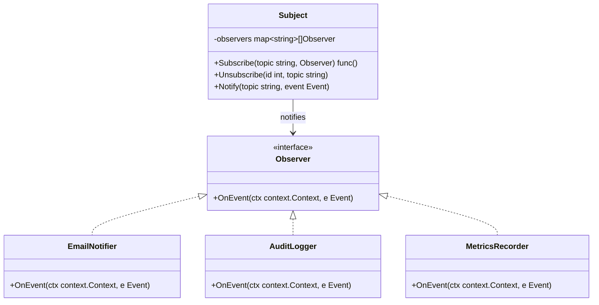
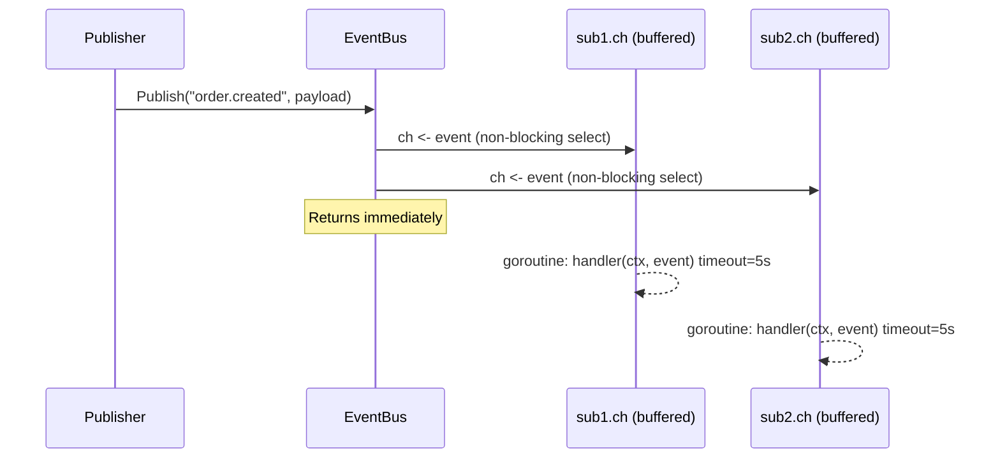

## 1. Overview

Every notification system, every event-driven architecture, every reactive UI framework — they all trace back to one pattern: Observer.

The Observer pattern defines a one-to-many dependency between objects. When one object (the **Subject**) changes state, all its dependents (**Observers**) are notified automatically. You define the relationship once; the Subject never needs to know who's listening.

**Mental model:** Think of a newspaper subscription service. The publisher doesn't know who reads it — it just prints and ships each edition. Subscribers receive every copy automatically. Cancel your subscription and notifications stop. The publisher's process never changes — it just manages a subscriber list and ships to it.

In this article you will learn:

- How Observer works and why it is the foundation of every event-driven system
- How Go channels natively implement Observer
- Why Kafka is Observer at planetary scale
- The four failure modes that will wake you up at 2 AM

---

## 2. Core Concepts (Step-by-Step)

### Step 1: The Three Participants

The pattern has three roles:

1. **Subject (Observable)** — maintains a list of observers and calls `Notify()` on state change
2. **Observer** (interface) — defines `OnEvent(ctx, event)`, the contract every observer must fulfill
3. **ConcreteObserver** — implements the interface and reacts to each notification

### Step 2: Structure



*Subject knows observers only through the interface — concrete types are invisible to Subject.*

### Step 3: The Critical Decision — Synchronous vs. Asynchronous Notification

This is the design decision most engineers get wrong on the first implementation.

**Synchronous:** Subject calls each observer inline.

```
Subject.Notify() → Observer1.OnEvent() → Observer2.OnEvent() → Observer3.OnEvent()
```

Simple. Ordered. But if Observer2 does a slow DB write (500ms), Observer3 waits. In a high-throughput system, one degraded downstream service cascades into publisher latency spikes everywhere.

**Asynchronous (production recommendation):** Subject drops each event into a buffered channel per subscriber and returns immediately. Each subscriber has its own goroutine draining its channel at its own pace.

```
Subject.Notify() → drop in sub1.ch → drop in sub2.ch → return (microseconds)
                        ↓                    ↓
              goroutine: sub1           goroutine: sub2
              processes at own pace     processes at own pace
```

Ordering is lost but isolation is gained. One slow subscriber can never affect others.

### Step 4: Go Channels ARE Observer

Go's channel abstraction is the Observer pattern built into the language:

| Observer Concept | Go Channel Equivalent                   |
| ---------------- | --------------------------------------- |
| Subscribe        | `ch := make(chan Event, 64)`            |
| Publish          | `ch <- event`                           |
| Observer loop    | `for e := range ch { process(e) }`      |
| Unsubscribe      | `close(ch)` — goroutine exits via range |

An `EventBus` adds explicit topic routing and multi-subscriber fan-out on top of this primitive. Kafka takes this further — it is the Observer pattern running across a distributed cluster, persisting events to disk, and supporting replay.

### Step 5: Async Notification Sequence



*Publisher fans out to all subscriber channels in O(n) and returns immediately. Each subscriber processes at its own pace.*

---

## 3. Use Cases

### 1. AWS SNS Fan-Out

When an order is placed, a single SNS publish fans out to: an SQS queue for the warehouse, a Lambda for fraud detection, an email service, and an analytics pipeline — all simultaneously. SNS is the Subject. Each SQS queue or Lambda is an Observer. This is Observer with durability added by SQS's at-least-once guarantee.

### 2. Kafka Consumer Groups

Each Kafka consumer group is an Observer on a topic partition stream. When a producer writes to `order.created`, every consumer group subscribed receives the event independently with its own maintained offset. Group A falling behind doesn't affect Group B. Netflix uses this to fan tens of millions of viewing events per hour to encoding, recommendation, and analytics pipelines — simultaneously.

### 3. React Component Re-rendering

React's state system is Observer. A component subscribes to state (Subject). When state updates, React notifies the component (Observer) to re-render. The `useEffect` cleanup function IS the unsubscribe closure. Every React developer uses Observer daily without knowing its name.

---

## 4. Gotchas

### Gotcha 1: Slow Observers Block the Subject

Synchronous notification means Observer3 waits while Observer2 does a 500ms database write. In production, one downstream service degradation cascades into latency spikes everywhere upstream.

**Fix:** Use buffered channels per subscriber. Publish is a non-blocking channel send. Observers process independently. Never call external services synchronously in a notification path.

### Gotcha 2: Memory Leaks from Unregistered Observers

You subscribe a handler. You forget to call the unsubscribe closure. The Subject holds a reference to the subscription forever. The spawned goroutine keeps running, blocked on `range s.ch`. Neither the goroutine nor the closure variables can be garbage collected — the GC sees them as reachable.

**Fix:** Always return an unsubscribe function from `Subscribe`. Document that callers MUST call it. Enforce with `defer unsubscribe()`. Alert on `subscription_count` growing monotonically.

### Gotcha 3: Circular Notification Chains

Observer A handles events from Subject. Observer A's handler publishes to Topic B. Some component subscribed to Topic B publishes back to the original topic. Infinite loop. Goroutine stacks grow until OOM kill.

**Fix:** Events carry a correlation ID and chain depth. If depth > 10, drop and alert. Never publish synchronously from inside a handler — enqueue for deferred async processing.

### Gotcha 4: Ordering Assumptions in Observers

Your code assumes Observer1 (inventory deduction) runs before Observer2 (shipping label generation). With async notification, Observer2 fires first. Shipping label generated for un-deducted inventory. P0 incident.

With async notification, goroutine scheduling order is determined by the Go runtime scheduler, not insertion order — different subscriber channel buffer sizes cause non-deterministic delivery ordering: a subscriber with a larger buffer drains faster and its goroutine gets scheduled sooner, overtaking a subscriber registered earlier with a smaller buffer.

**Fix:** Never encode ordering requirements between Observers. Use Chain of Responsibility or a Saga for ordered workflows. Document explicitly that Observer notification order is undefined.

---

## 5. Where to Use (and Where NOT to Use)

**Use Observer when:**

- You have a one-to-many relationship where the Subject should not know its consumers
- Observers are added or removed at runtime without modifying the Subject
- The event source and consumers are in the same process
- Loose coupling between components is a first-class requirement

**Do NOT use Observer when:**

- You have exactly one consumer — just call it directly (over-engineering)
- Processing order matters strictly — use Chain of Responsibility or a Saga
- You need guaranteed delivery — Observer drops events on buffer overflow; use a message queue
- Observers need to return results to the Subject — wrong pattern; use Command or a direct callback

> 💡 **Staff-level insight:** Observer is the gateway drug to distributed systems. When your in-process EventBus can't handle load, you extract it to a message broker. When one broker machine is not enough, you shard it across nodes. The same pattern — Subject, Observer, Notify — just with durability, ordering guarantees, and horizontal scale added. Understanding Observer deeply means understanding WHY Kafka exists. Every distributed event architecture is Observer at scale with infrastructure filling the Subject role.

---

## 6. Versus (Comparisons)

### Observer vs. Pub/Sub

| Aspect     | Observer                                        | Pub/Sub                                                                  |
| ---------- | ----------------------------------------------- | ------------------------------------------------------------------------ |
| Coupling   | Subject holds direct references to Observers    | Decoupled via broker; publisher and subscriber are unknown to each other |
| Delivery   | In-process, synchronous or async goroutine      | Broker-mediated, async, often persisted                                  |
| Durability | Events lost if observer crashes or buffer fills | Broker retains messages (Kafka: configurable retention)                  |
| Ordering   | Undefined with async; sequential with sync      | Ordered per partition (Kafka); unordered cross-partition                 |
| Scale      | Single-process fan-out                          | Cross-service, multi-node, multi-region                                  |
| Latency    | Sub-millisecond                                 | Milliseconds to tens of milliseconds                                     |
| Examples   | EventBus, DOM events, React state               | Kafka, AWS SNS/SQS, Google Cloud Pub/Sub                                 |

**Choose Observer when** you are within a single process, latency must be sub-millisecond, and you do not need durability or cross-service fan-out.

**Choose Pub/Sub when** producers and consumers are in different services, events must survive process restarts, or you need replay and audit capability.

### Observer vs. Mediator

| Aspect                  | Observer                                                            | Mediator                                                                                                                                                                                                                                                                |
| ----------------------- | ------------------------------------------------------------------- | ----------------------------------------------------------------------------------------------------------------------------------------------------------------------------------------------------------------------------------------------------------------------- |
| Communication direction | Subject → many Observers (one-way)                                  | Components ↔ Mediator ↔ Components (bidirectional)                                                                                                                                                                                                                      |
| Coupling                | Observers know which Subject to watch                               | Components only know the Mediator                                                                                                                                                                                                                                       |
| Use case                | Broadcasting state change notifications                             | Coordinating complex interactions between many objects                                                                                                                                                                                                                  |
| Real-world example      | Kafka consumer groups; React's state system; DOM `addEventListener` | Kubernetes `controller-manager` (coordinates Deployment, ReplicaSet, and Pod controllers so they never reference each other directly); air traffic control systems where the tower (Mediator) sequences every aircraft (Component) without planes talking to each other |

**Choose Observer when** broadcasting state changes to independent, decoupled consumers.

**Choose Mediator when** multiple objects need to coordinate complex interactions that would otherwise create a tangled web of references.

---

## 7. Code Example

```go
package observer

import (
	"context"
	"sync"
	"time"
)

// Event is the notification payload sent from Subject to all Observers.
type Event struct {
	Topic   string
	Payload any
}

// Handler processes a single event. Context carries the handler's timeout budget.
// Always check ctx.Done() inside long-running handlers.
type Handler func(ctx context.Context, e Event)

// subscription pairs a unique ID with its buffered delivery channel.
// The channel isolates this subscriber from all others — a slow handler
// only fills its own buffer; it never stalls the publisher or siblings.
type subscription struct {
	id int
	ch chan Event
}

// EventBus is a thread-safe in-process Observer implementation.
// Design choices:
//   - One buffered channel per subscriber for full isolation
//   - Non-blocking publish: drops event if buffer full (fast path always wins)
//   - Per-handler goroutine with context timeout prevents runaway observers
type EventBus struct {
	mu   sync.RWMutex
	subs map[string][]*subscription
	seq  int // monotonic subscription counter; protected by mu
}

// NewEventBus returns an EventBus ready for use.
func NewEventBus() *EventBus {
	return &EventBus{subs: make(map[string][]*subscription)}
}

// Subscribe registers a handler for the given topic.
// Returns an unsubscribe function. Callers MUST call it to prevent memory leaks.
// Recommended usage: unsub := bus.Subscribe(...); defer unsub()
func (eb *EventBus) Subscribe(topic string, h Handler) (unsubscribe func()) {
	eb.mu.Lock()
	eb.seq++
	id := eb.seq
	s := &subscription{
		id: id,
		ch: make(chan Event, 64), // buffered: publisher never blocks on individual send
	}
	eb.subs[topic] = append(eb.subs[topic], s)
	eb.mu.Unlock()

	// Dedicated goroutine per subscriber for isolation.
	// 5s handler timeout: a runaway observer cannot exceed this budget.
	go func() {
		for e := range s.ch {
			// Wrap each invocation in an IIFE so defer applies per-event,
			// not per-goroutine. A panicking handler must not kill the
			// drain goroutine and leak the channel.
			func() {
				ctx, cancel := context.WithTimeout(context.Background(), 5*time.Second)
				defer cancel()
				defer func() {
					if r := recover(); r != nil {
						// Log the panic and continue draining subsequent events.
						// In production, increment observer.handler_panics_total here.
						_ = r // log.Printf("observer: handler panic: %v\n%s", r, debug.Stack())
					}
				}()
				h(ctx, e)
			}()
		}
	}()

	return func() {
		eb.mu.Lock()
		defer eb.mu.Unlock()
		list := eb.subs[topic]
		for i, existing := range list {
			if existing.id == id {
				close(existing.ch) // signals the drain goroutine to exit
				eb.subs[topic] = append(list[:i], list[i+1:]...)
				return
			}
		}
	}
}

// Publish fans out event to all subscribers of topic.
// Non-blocking: events are dropped if a subscriber's buffer is full.
// In production, increment a dropped_events counter on the default branch.
func (eb *EventBus) Publish(topic string, payload any) {
	e := Event{Topic: topic, Payload: payload}
	eb.mu.RLock()
	// Copy slice under read lock; send outside the lock to minimize contention.
	subs := make([]*subscription, len(eb.subs[topic]))
	copy(subs, eb.subs[topic])
	eb.mu.RUnlock()

	for _, s := range subs {
		select {
		case s.ch <- e:
			// delivered to subscriber buffer
		default:
			// subscriber overwhelmed — in production: droppedEventsCounter.Inc()
		}
	}
}

// SubscriberCount returns the current subscriber count for a topic.
// Use this in health checks and to alert on subscription leaks.
func (eb *EventBus) SubscriberCount(topic string) int {
	eb.mu.RLock()
	defer eb.mu.RUnlock()
	return len(eb.subs[topic])
}
```

**Usage in a service:**

```go
func NewOrderService(bus *observer.EventBus, db *sql.DB) *OrderService {
	svc := &OrderService{bus: bus, db: db}

	// Always capture and defer the unsubscribe closure.
	svc.unsubAudit = bus.Subscribe("order.created", func(ctx context.Context, e observer.Event) {
		order := e.Payload.(Order)
		auditLog(ctx, "order_created", order.ID)
	})
	svc.unsubEmail = bus.Subscribe("order.created", func(ctx context.Context, e observer.Event) {
		order := e.Payload.(Order)
		sendConfirmationEmail(ctx, order.CustomerEmail)
	})
	return svc
}

func (svc *OrderService) Close() {
	svc.unsubAudit() // MUST be called — prevents goroutine and map entry leaks
	svc.unsubEmail()
}

func (svc *OrderService) PlaceOrder(ctx context.Context, o Order) error {
	if err := svc.db.Save(ctx, o); err != nil {
		return err
	}
	// Always publish AFTER the durable write succeeds, never before.
	// "Publish then fail to save" is the classic dual-write bug.
	//
	// ⚠️  This is still the unsafe dual-write pattern: if Publish fails
	// (bus buffer full, panic, or process crash between Save and Publish),
	// the event is silently lost with no retry. The production-safe
	// alternative is the Outbox Pattern — write the event row to the same
	// DB transaction as the Save, then relay it asynchronously via a
	// separate relay process. See "Staff-Level Preparation Tips" below.
	svc.bus.Publish("order.created", o)
	return nil
}
```

---

## 8. Scale Discussion

**At 10x (10–50 subscribers per topic):**

Synchronous notification at 50 observers × 5ms each = 250ms publisher block. The buffered async model eliminates this entirely. Publish latency stays constant at O(n) non-blocking channel sends, which is microseconds per subscriber. Monitor goroutine count — one goroutine per subscriber is now your baseline.

**At 100x (hundreds of subscribers):**

The `for _, s := range subs` loop in `Publish` becomes measurable. Consider topic sharding: split into N shards, route by `hash(subscriberID) % N`, assign a goroutine per shard. This is how the Kubernetes API server fans out watch events to hundreds of concurrent controller goroutines — each watcher gets its own channel.

**At 1000x (thousands of subscribers or cross-process):**

You have outgrown in-process Observer. This is the exact inflection point where infrastructure-level Pub/Sub (Kafka, AWS SNS) takes over. A single process cannot manage thousands of goroutines plus read-write locked subscriber maps without meaningful lock contention and memory pressure.

> 💡 **Staff-level insight:** When someone asks "how do I make my EventBus handle 10,000 subscribers efficiently?" — the correct answer is not "optimize the EventBus." It is "why are there 10,000 subscribers in the same process?" The architecture needs rethinking before the implementation. This is the conversation that separates a staff engineer from a senior.

---

## 9. Monitoring & Observability

| Metric                              | Type                 | Alert Condition                              |
| ----------------------------------- | -------------------- | -------------------------------------------- |
| `observer.subscription_count`       | Gauge per topic      | Growing monotonically → subscription leak    |
| `observer.events_published_total`   | Counter per topic    | Sudden drop → publisher stopped              |
| `observer.events_dropped_total`     | Counter per topic    | Any value > 0/min → subscriber overwhelmed   |
| `observer.handler_duration_seconds` | Histogram p50/p99    | p99 > 4s → approaching 5s timeout            |
| `observer.active_goroutines`        | Gauge                | Unbounded growth → goroutine leak            |
| `observer.channel_utilization_pct`  | Gauge per subscriber | > 80% → buffer too small or handler too slow |
| `observer.handler_errors_total`     | Counter              | Any nonzero → handlers failing silently      |

**Key log events to capture:**

- Event dropped (buffer full): log `topic`, `subscriber_id`, current buffer depth
- Handler panicked: always recover in the drain goroutine; log full stack trace; never let a panic kill the bus goroutine
- Double-unsubscribe called: log a warning — indicates a lifecycle management bug upstream

---

## 10. Interview Questions

### Q1: Design a real-time price update system that pushes ticker prices to 50,000 connected web clients the moment a price changes.

**Key points to cover:**

- Each client holds a WebSocket connection — each connection is an Observer
- At 50,000 connections, a single goroutine looping synchronously is too slow: 50,000 × ~100μs per socket write ≈ 5 seconds end-to-end latency
- Solution: shard clients into N groups by hash; each shard managed by one goroutine; a fan-out coordinator receives the price event and dispatches to each shard channel
- For horizontal scaling across multiple server instances: use Redis Pub/Sub or Kafka as the Subject; each server instance is an Observer that receives the event and fans out to its local client shard
- Must address: connection drops (subscriber cleanup on disconnect), slow clients (back-pressure via channel drop or forced disconnect), reconnect (last-value cache or event replay window)

**Common mistake:** Proposing one goroutine looping over all 50,000 connections behind a single mutex. Does not account for per-socket write latency or lock contention under concurrent disconnects.

**What the interviewer wants:** Recognition that Observer does not scale past a single process without infrastructure, and a natural progression from EventBus → Redis Pub/Sub → Kafka as requirements grow.

### Q2: What is the difference between the Observer pattern and the Pub/Sub pattern? Where does Kafka fit?

**Key points:**

- Observer: Subject holds direct object references to its Observers. Publisher and subscribers are coupled — they live in the same process; Subject manages the subscriber list explicitly.
- Pub/Sub: A broker decouples publisher from subscriber entirely. Publisher sends to a topic name; it has no knowledge of who is subscribed. Subscribers register independently with the broker.
- Kafka is Pub/Sub at the infrastructure layer — producers write to topics without knowing consumers. But at the application layer, the consumer group abstraction echoes Observer semantics: each group "subscribes" to a topic and receives every event independently.

**Common mistake:** Saying "Kafka is Observer." Kafka is Pub/Sub. The whole reason Kafka was built was to decouple producers from consumers at infrastructure scale, which in-process Observer cannot do.

### Q3: How do you prevent memory leaks in a Go EventBus? Walk through the leak mechanism and the fix.

**Key points:**

- Leak mechanism: `Subscribe` appends to a map slice, holding a reference to the handler closure and the subscription channel. Without `Unsubscribe`, this entry is never removed. The drain goroutine is blocked on `range s.ch` — Go goroutines are not garbage collected while they are running, regardless of whether they are referenced elsewhere.
- The closure can hold references to heavyweight objects (DB connections, service clients, entire structs), keeping them alive indefinitely.
- Fix 1: `Subscribe` returns an unsubscribe func; document that callers must call it; enforce with `defer`.
- Fix 2: accept a `context.Context` in `Subscribe`; auto-unsubscribe when the context is cancelled.
- Fix 3: alert on `subscription_count` growing past an expected ceiling.
- Advanced: per-topic subscription TTL — if no events published to a topic in N minutes, garbage collect all subscriptions.

**What the interviewer wants:** Concrete understanding of Go's goroutine lifecycle and GC model, not just pattern theory.

---

## 11. Staff-Level Preparation Tips

**What to build:**

- Build an `EventBus` with topic routing, wildcard subscriptions (`order.*`), at-least-once delivery with exponential backoff retry on handler error, and a dead-letter queue for repeated failures. Write benchmarks comparing sync vs async fan-out at 10, 100, and 1000 subscribers.
- Implement the same `EventBus` interface with three backends: in-memory channels, Redis Pub/Sub, and Kafka. Demo runtime backend swapping via a config flag. This demonstrates staff-level abstraction thinking.

**What to study:**

- Go runtime internals: goroutine scheduling, channel implementation, `sync.RWMutex` vs `sync.Map` under different read/write ratios
- The Reactive Extensions (Rx) specification — formally generalizes Observer with composable operators: `filter`, `map`, `flatMap`, `merge`, `debounce`
- Kafka's consumer group rebalance protocol — understanding what happens when Observers (consumer instances) are added or removed at scale

**System design connections:**

- **CQRS:** the read model IS an Observer consuming write-side domain events
- **[Outbox Pattern](../distributed/outbox-pattern.md):** ensures events are durably committed to the DB before being published — prevents the "publish then crash" dual-write bug demonstrated by the `PlaceOrder` example above; the relay process reads from the outbox table and calls `Publish` with at-least-once semantics
- **Circuit Breaker:** implemented as an Observer monitoring an error rate metric; trips when threshold is exceeded

**How to demonstrate staff-level thinking:**

When Observer is proposed in a design review, immediately ask: "What is the scale? Same process or cross-service? Do we need durability? What happens if a subscriber is down for 10 minutes?" These four questions determine whether in-process Observer is appropriate or whether Pub/Sub infrastructure is needed. A senior engineer implements Observer. A staff engineer scopes whether Observer is even the right tool.

---

## 12. References

- **Book:** *Design Patterns: Elements of Reusable Object-Oriented Software* — Gamma, Helm, Johnson, Vlissides. Observer chapter, pp. 293–303
- **Book:** *Head First Design Patterns* — Freeman & Robson. Chapter 2 (best visual Observer explanation in print)
- **Talk:** [GopherCon 2018 — Rethinking Classical Concurrency Patterns](https://www.youtube.com/watch?v=5zXAHh5tJqQ) — Bryan C. Mills on Go concurrency patterns that map directly to Observer
- **Blog:** [Netflix Tech Blog — Keystone Real-time Stream Processing Platform](https://netflixtechblog.com/keystone-real-time-stream-processing-platform-a3ee651812a) — Observer at Netflix scale
- **Docs:** [Apache Kafka Introduction](https://kafka.apache.org/intro) — how Kafka formalizes Pub/Sub; the evolution from application-level Observer
- **Paper:** [The Reactive Manifesto](https://www.reactivemanifesto.org/) — the formal specification that the Observable pattern enables
- **Go:** [sync package](https://pkg.go.dev/sync), [context package](https://pkg.go.dev/context) — the primitives behind production-grade EventBus in Go
- **Blog:** [Uber Engineering — Reliable Reprocessing](https://www.uber.com/blog/reliable-reprocessing/) — Uber's approach to event reliability and dead-letter queues at scale
