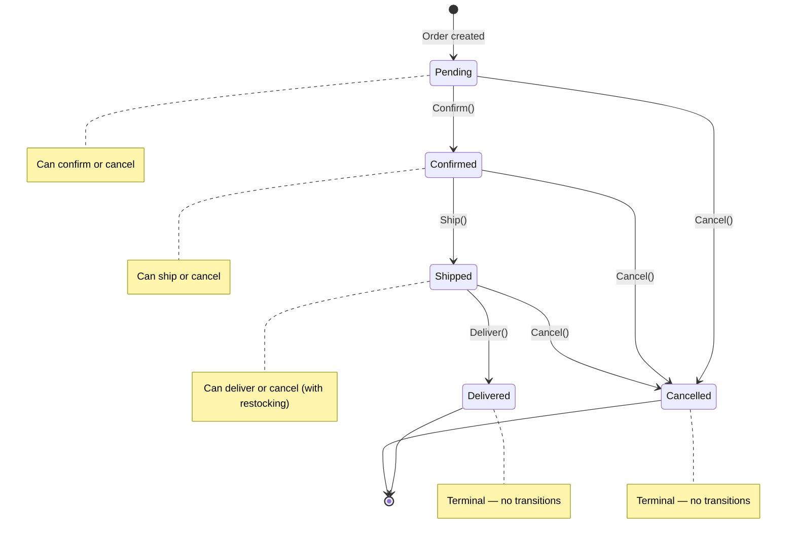
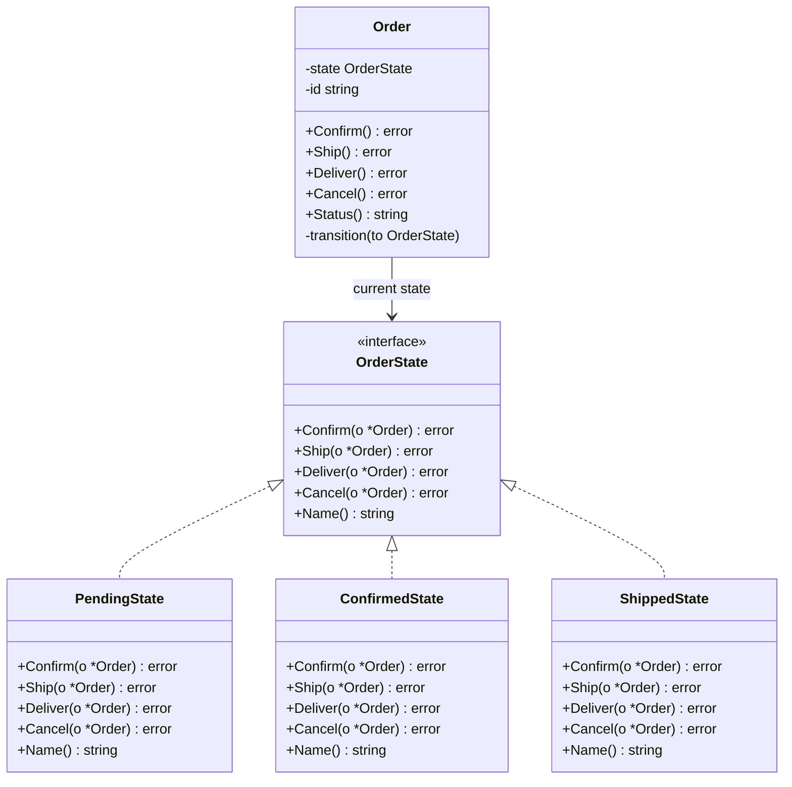

## 1. Overview

Every object that behaves differently depending on where it is in its lifecycle is a state machine. An order that can be placed, confirmed, shipped, and delivered. A TCP connection that goes through SYN_SENT, ESTABLISHED, and CLOSE_WAIT. A vending machine that accepts coins in one state and dispenses products in another.

The State pattern encodes each state as a struct that implements a common interface. Transitions between states are explicit. The object that "has" a state delegates all behavior to its current state object. When the state changes, behavior changes automatically.

**Mental model:** Think of a traffic light. It has three states: Red, Yellow, Green. In the Red state, `DriveThrough()` returns an error — you cannot drive through a red light. In the Green state, `DriveThrough()` succeeds. Transitioning from Red to Green changes the behavior without changing the traffic light controller itself. The controller just says "change state." All behavior flows from the current state.

Without State pattern: one large switch statement in every method, checking the current status field. Every time you add a new state, you edit every method. At N states × M methods, you have N×M branches to maintain. At five states and six operations, that is thirty branches. One missing check causes a production bug.

In this article you will learn:

- How State eliminates runaway switch-statement complexity
- How to implement an order lifecycle state machine in Go
- Why invalid state transitions must be explicit guard errors, not silent no-ops
- The four failure modes that surface when state machines grow in production

---

## 2. Core Concepts (Step-by-Step)

### Step 1: The Three Participants

1. **Context** — holds a reference to the current state object; delegates all behavior calls to it
2. **State** (interface) — declares all operations that vary by state (`Confirm()`, `Ship()`, `Cancel()`)
3. **ConcreteState** — implements `State`; performs the operation if valid in this state; transitions to the next state if appropriate

### Step 2: Order State Machine Diagram



*Each state has explicit allowed transitions. Any other transition is an error — not a silent no-op.*

### Step 3: The Class Structure



*Order delegates every operation to its current OrderState. Swapping the state object changes all behavior simultaneously.*

### Step 4: Why Switch Statements Break at Scale

Without State pattern, the order service looks like this:

```go
// WITHOUT State pattern — the switch statement antipattern
func (o *Order) Ship() error {
    switch o.status {
    case "pending":
        return errors.New("cannot ship a pending order")
    case "confirmed":
        o.status = "shipped"
        return nil
    case "shipped":
        return errors.New("order already shipped")
    case "delivered":
        return errors.New("order already delivered")
    case "cancelled":
        return errors.New("order is cancelled")
    default:
        return errors.New("unknown status")
    }
}

// Imagine this same switch in: Confirm(), Cancel(), Deliver(), Refund(),
// Hold(), Reopen(), Archive()... 5 states × 7 operations = 35 switch cases.
// Adding a new state (e.g., "OnHold") means editing all 7 functions.
```

With State pattern, adding an `OnHoldState` is: one new struct, test it in isolation, add it to the transitions from `ConfirmedState`. Zero changes to `PendingState`, `ShippedState`, or `Order`.

### Step 5: TCP Connection State — A Classic Real-World Example

TCP connections are a textbook state machine:

```
CLOSED → SYN_SENT → ESTABLISHED → FIN_WAIT_1 → FIN_WAIT_2 → TIME_WAIT → CLOSED
```

Each state defines what packets are valid, what actions are allowed, and what the next state is. A SYN packet in ESTABLISHED state is invalid (connection already open). A FIN packet in CLOSED state is an error (nothing to close). The Linux kernel implements TCP connection state as a state machine — each state is an explicit case with explicit valid transitions. Invalid transitions are errors, not silent ignoring.

---

## 3. Use Cases

### 1. E-commerce Order Lifecycle (Shopify, Amazon)

Shopify's order management system has states: draft → open → fulfilled → archived (and refunded, cancelled as alternatives). Each state restricts operations — you cannot refund a draft order; you cannot archive an unfulfilled order. Shopify's Order resource exposes `transitions` in its API response so clients know which actions are currently valid rather than discovering invalid moves via 422 errors.

### 2. TCP Connection State (Linux Kernel)

The TCP finite state machine has 11 states (CLOSED, LISTEN, SYN-SENT, SYN-RECEIVED, ESTABLISHED, FIN-WAIT-1, FIN-WAIT-2, CLOSE-WAIT, CLOSING, LAST-ACK, TIME-WAIT). Each state defines exactly which packets can be received and which actions can be taken. This is the State pattern implemented in C at the operating system level — running on every Linux machine in the world, billions of connections per day. You can observe live TCP state counts on any server with `ss -s` (socket statistics) or `netstat -an | awk '/^tcp/ {print $6}' | sort | uniq -c` — watching CLOSE_WAIT or TIME_WAIT pile up during a traffic spike is the fastest way to build intuition for why terminal states matter.

### 3. Temporal/Cadence Workflow Engine

Temporal workflows are explicit state machines persisted to a database. Each workflow execution lives in a state: Running, Completed, Failed, TimedOut, Cancelled. Workflow activities are like sub-states. Temporal makes the state transitions durable — if the worker crashes in the middle of a transition, Temporal recovers the workflow to its last valid state and retries from there. This is State pattern with durability and distributed recovery.

---

## 4. Gotchas

### Gotcha 1: State Explosion — N States × M Events

A simple order workflow starts with 5 states and 4 operations: 20 transition functions. You add refunds, holds, partial fulfillment, back-order, fraud-hold: now 12 states × 8 operations = 96 transition functions. The State pattern organized this beautifully — until you realize that most state/operation combinations are "invalid transition" errors with identical implementations.

**Fix:** Extract an `InvalidTransition` base behavior. Most states embed it and override only the transitions they support. The 70 invalid combinations share one implementation. Only the 26 valid transitions are explicitly implemented.

```go
// BaseState provides default "invalid transition" for all operations.
type BaseState struct{ name string }
func (b BaseState) Confirm(o *Order) error { return invalidTransition(b.name, "confirm") }
func (b BaseState) Ship(o *Order) error    { return invalidTransition(b.name, "ship") }
// PendingState embeds BaseState and overrides only Confirm and Cancel
type PendingState struct{ BaseState }
func (p PendingState) Confirm(o *Order) error { o.transition(&ConfirmedState{}); return nil }
func (p PendingState) Cancel(o *Order) error  { o.transition(&CancelledState{}); return nil }
```

### Gotcha 2: Concurrent State Transitions Causing Races

Two goroutines, two API requests: "confirm" and "cancel" arrive simultaneously for the same order. Without synchronization:

- Goroutine 1 reads state = Pending, calls `Confirm`, begins writing
- Goroutine 2 reads state = Pending simultaneously, calls `Cancel`, begins writing
- Both succeed; the order ends up in an inconsistent final state

**Fix:** State transitions must be protected by a mutex (in-process) or an optimistic lock / compare-and-swap in the database (distributed). The database is the source of truth for order state — always do state transitions as atomic DB operations, not in-memory first. Use pessimistic row locking (`SELECT FOR UPDATE`) or optimistic concurrency (version counter).

### Gotcha 3: Invalid Transitions as Silent No-Ops

```go
// DANGEROUS: invalid transition is silently ignored
func (d *DeliveredState) Cancel(o *Order) error {
    // Delivered orders cannot be cancelled — just return nil silently
    return nil
}
```

The caller thinks cancellation succeeded. No error returned. The order is not cancelled. The customer's refund is never initiated. Silent no-ops for invalid transitions are a major source of production bugs.

**Fix:** Invalid transitions must always return an explicit, specific error: `&InvalidTransitionError{From: "delivered", Op: "cancel"}`. Callers must handle this error and inform the user that this operation is not available in the current state. Use `errors.As` to detect it programmatically — e.g., `var e *InvalidTransitionError; if errors.As(err, &e) { ... }`. Never silently ignore an operation.

### Gotcha 4: State Objects That Accumulate in Memory

In a high-throughput system where millions of orders are processed daily, each `Order` object holds a `OrderState` interface. If `Order` objects are cached in memory (e.g., in a local LRU cache), the state objects they hold are never garbage collected — even for terminal states (Delivered, Cancelled).

**Fix:** Terminal states should not hold references to any resources. When an order reaches a terminal state, it should be immediately evicted from any in-memory caches and persisted only to the database. The state machine should be reconstructed from DB when needed, not kept alive in memory for completed orders.

---

## 5. Where to Use (and Where NOT to Use)

**Use State when:**

- An object's behavior varies significantly based on its current lifecycle position
- You have (or anticipate having) more than 3–4 distinct states with different allowed operations
- Adding new states should not require modifying existing state code (Open/Closed)
- State transitions must be explicit, guard-checked, and auditable

**Do NOT use State when:**

- You have exactly two modes (enabled/disabled) — a boolean flag is simpler
- State transitions are always linear and never branch — a pipeline is clearer
- The behavior difference between states is trivial — a simple condition is not a state machine
- Your "state" is just UI presentation logic — do not bring domain state pattern into the view layer
- Transitions depend on external async events with unknown timing (e.g., "wait for payment webhook, but it might arrive in 2 ms or 2 hours") — use a workflow engine like Temporal instead; it is designed for durable, time-aware state machines
- The state machine must be shared across polyglot services (Go backend, Python data pipeline, Java consumer) — serialize to DB strings (`"pending"`, `"confirmed"`), not Go interface types; the State pattern lives inside one service boundary, not across them

> 💡 **Staff-level insight:** The State pattern forces you to make your state machine explicit — which states exist, which transitions are valid, and which operations are allowed in each state. This explicitness is the real value. In domain-driven design, the aggregate's state machine IS the business rules. When a business analyst says "you cannot ship an unconfirmed order," that constraint lives as an error return in `PendingState.Ship()` — not in a comment, not in a validation helper, not in a dream. Always ask in design reviews: "What states can this entity be in, and which transitions are valid?" If the answer is complex and branching, State pattern is the right tool.

---

## 6. Versus (Comparisons)

### State vs. Strategy

| Aspect                    | State                                                          | Strategy                                                |
| ------------------------- | -------------------------------------------------------------- | ------------------------------------------------------- |
| Who changes the algorithm | The state machine itself transitions internally                | The caller externally swaps the strategy                |
| Purpose                   | Model lifecycle — behavior varies by entity lifecycle position | Algorithm selection — caller needs different algorithms |
| Awareness                 | State objects usually know about each other (transitions)      | Strategies are independent; don't know about siblings   |
| Example                   | Order: Pending → Confirmed → Shipped                           | PricingEngine: StandardPricing ↔ SurgePricing           |

**Choose State when** the behavior change is triggered by the object's own internal events and lifecycle transitions.

**Choose Strategy when** the caller externally selects which algorithm to use, and the subject has no concept of "state progression."

### State vs. FSM Library

| Aspect        | Hand-coded State (interfaces)                                     | FSM Library (looplab/fsm, stateless)                             |
| ------------- | ----------------------------------------------------------------- | ---------------------------------------------------------------- |
| Clarity       | Business logic in code; operations are typed methods              | Transitions in configuration maps or fluent API                  |
| Type safety   | Full Go type safety; compile errors for missing interface methods | Usually string-keyed; runtime errors for invalid states          |
| Visualization | Must build or generate                                            | Many libraries generate Mermaid/graphviz diagrams                |
| Persistence   | Manual                                                            | Some libraries support state serialization                       |
| When to use   | < 10 states, team knows State pattern                             | > 10 states, need visualization, or team unfamiliar with pattern |

**Choose hand-coded State when** you have 3–8 states and want full type safety and IDE support.

**Choose an FSM library when** you have a complex machine (10+ states), need autogenerated documentation, or need configuration-driven state machines.

---

## 7. Code Example

```go
package state

import (
	"errors"
	"fmt"
	"sync"
)

// OrderState defines all operations an order can attempt in any state.
// Implementors return ErrInvalidTransition for disallowed operations.
type OrderState interface {
	Confirm(o *Order) error
	Ship(o *Order) error
	Deliver(o *Order) error
	Cancel(o *Order) error
	Name() string
}

// Order is the Context — holds and delegates to the current state.
// All public methods are a thin delegation layer.
type Order struct {
	mu    sync.Mutex
	id    string
	state OrderState
}

func NewOrder(id string) *Order {
	return &Order{id: id, state: &PendingState{}}
}

// transition safely swaps the current state (call only from within state methods).
func (o *Order) transition(next OrderState) {
	o.state = next
}

// Status returns the name of the current state — useful for APIs and logging.
func (o *Order) Status() string {
	o.mu.Lock()
	defer o.mu.Unlock()
	return o.state.Name()
}

func (o *Order) Confirm() error {
	o.mu.Lock()
	defer o.mu.Unlock()
	return o.state.Confirm(o)
}

func (o *Order) Ship() error {
	o.mu.Lock()
	defer o.mu.Unlock()
	return o.state.Ship(o)
}

func (o *Order) Deliver() error {
	o.mu.Lock()
	defer o.mu.Unlock()
	return o.state.Deliver(o)
}

func (o *Order) Cancel() error {
	o.mu.Lock()
	defer o.mu.Unlock()
	return o.state.Cancel(o)
}

// InvalidTransitionError is returned for any disallowed state operation.
// Use errors.As in callers to detect and branch on invalid transitions programmatically:
//
//	var e *InvalidTransitionError
//	if errors.As(err, &e) {
//		http.Error(w, "operation not allowed in state: "+e.From, http.StatusConflict)
//	}
type InvalidTransitionError struct {
	From string // state the order was in
	Op   string // operation that was attempted
}

func (e *InvalidTransitionError) Error() string {
	return fmt.Sprintf("invalid transition: cannot %s an order in %s state", e.Op, e.From)
}

// invalidTransition is the package-internal helper used by all ConcreteState methods.
// NEVER return nil for invalid transitions — callers depend on explicit errors.
func invalidTransition(fromState, operation string) error {
	return &InvalidTransitionError{From: fromState, Op: operation}
}

// ---- Concrete States ----

// PendingState: order created but not yet confirmed by merchant.
// Allowed: Confirm, Cancel. Disallowed: Ship, Deliver.
type PendingState struct{}

func (p *PendingState) Name() string { return "pending" }
func (p *PendingState) Confirm(o *Order) error {
	o.transition(&ConfirmedState{})
	return nil
}
func (p *PendingState) Cancel(o *Order) error {
	o.transition(&CancelledState{})
	return nil
}
func (p *PendingState) Ship(o *Order) error {
	return invalidTransition("pending", "ship") // cannot ship unconfirmed order
}
func (p *PendingState) Deliver(o *Order) error {
	return invalidTransition("pending", "deliver")
}

// ConfirmedState: merchant confirmed; awaiting fulfillment.
// Allowed: Ship, Cancel. Disallowed: Confirm, Deliver.
type ConfirmedState struct{}

func (c *ConfirmedState) Name() string { return "confirmed" }
func (c *ConfirmedState) Ship(o *Order) error {
	o.transition(&ShippedState{})
	return nil
}
func (c *ConfirmedState) Cancel(o *Order) error {
	o.transition(&CancelledState{})
	return nil
}
func (c *ConfirmedState) Confirm(o *Order) error {
	return invalidTransition("confirmed", "confirm") // double-confirm is an error
}
func (c *ConfirmedState) Deliver(o *Order) error {
	return invalidTransition("confirmed", "deliver")
}

// ShippedState: package dispatched to carrier.
// Allowed: Deliver, Cancel (with carrier recall). Disallowed: Confirm, Ship.
type ShippedState struct{}

func (s *ShippedState) Name() string { return "shipped" }
func (s *ShippedState) Deliver(o *Order) error {
	o.transition(&DeliveredState{})
	return nil
}
func (s *ShippedState) Cancel(o *Order) error {
	// Real system: initiate carrier recall before transitioning
	o.transition(&CancelledState{})
	return nil
}
func (s *ShippedState) Confirm(o *Order) error {
	return invalidTransition("shipped", "confirm")
}
func (s *ShippedState) Ship(o *Order) error {
	return invalidTransition("shipped", "ship") // already shipped
}

// DeliveredState: terminal state — package delivered. No further transitions.
type DeliveredState struct{}

func (d *DeliveredState) Name() string                    { return "delivered" }
func (d *DeliveredState) Confirm(o *Order) error          { return invalidTransition("delivered", "confirm") }
func (d *DeliveredState) Ship(o *Order) error             { return invalidTransition("delivered", "ship") }
func (d *DeliveredState) Deliver(o *Order) error          { return invalidTransition("delivered", "deliver") }
func (d *DeliveredState) Cancel(o *Order) error           { return invalidTransition("delivered", "cancel") }

// CancelledState: terminal state. No further transitions.
type CancelledState struct{}

func (c *CancelledState) Name() string                    { return "cancelled" }
func (c *CancelledState) Confirm(o *Order) error          { return invalidTransition("cancelled", "confirm") }
func (c *CancelledState) Ship(o *Order) error             { return invalidTransition("cancelled", "ship") }
func (c *CancelledState) Deliver(o *Order) error          { return invalidTransition("cancelled", "deliver") }
func (c *CancelledState) Cancel(o *Order) error           { return invalidTransition("cancelled", "cancel") }

// NewOrderStateFromDB reconstructs the concrete state from a DB-persisted string.
// Call this when loading an order from the database to avoid the nil-state bug:
//
//	state, err := NewOrderStateFromDB(row.State)
//	if err != nil { return nil, fmt.Errorf("corrupt DB state %q: %w", row.State, err) }
//	order := &Order{id: row.ID, state: state}
func NewOrderStateFromDB(name string) (OrderState, error) {
	switch name {
	case "pending":
		return &PendingState{}, nil
	case "confirmed":
		return &ConfirmedState{}, nil
	case "shipped":
		return &ShippedState{}, nil
	case "delivered":
		return &DeliveredState{}, nil
	case "cancelled":
		return &CancelledState{}, nil
	default:
		return nil, fmt.Errorf("unknown order state %q: possible data corruption or schema migration issue", name)
	}
}
```

**Testing state transitions:**

```go
func TestOrderLifecycle(t *testing.T) {
	o := state.NewOrder("ord_123")
	assert.Equal(t, "pending", o.Status())

	// Valid path: pending → confirmed → shipped → delivered
	assert.NoError(t, o.Confirm())
	assert.Equal(t, "confirmed", o.Status())
	assert.NoError(t, o.Ship())
	assert.NoError(t, o.Deliver())
	assert.Equal(t, "delivered", o.Status())

	// Delivered is terminal — all transitions return errors
	assert.Error(t, o.Cancel(), "must not silently ignore cancel on delivered order")
}

func TestInvalidTransition(t *testing.T) {
	o := state.NewOrder("ord_456")
	// Cannot ship a pending (unconfirmed) order
	err := o.Ship()
	assert.ErrorContains(t, err, "pending")
	assert.Equal(t, "pending", o.Status(), "state must not change on invalid transition")

	// Callers can detect invalid transitions programmatically with errors.As
	var transErr *state.InvalidTransitionError
	assert.True(t, errors.As(err, &transErr))
	assert.Equal(t, "pending", transErr.From)
	assert.Equal(t, "ship", transErr.Op)
}

func TestNewOrderStateFromDB(t *testing.T) {
	// Closing the serialization loop: DB string → concrete state
	for _, tc := range []struct{ name string }{
		{"pending"}, {"confirmed"}, {"shipped"}, {"delivered"}, {"cancelled"},
	} {
		s, err := state.NewOrderStateFromDB(tc.name)
		assert.NoError(t, err)
		assert.Equal(t, tc.name, s.Name())
	}
	// Unknown DB value — should never be silently nil
	_, err := state.NewOrderStateFromDB("unknown_state")
	assert.Error(t, err)
}
```

---

## 8. Scale Discussion

**At 10x (many concurrent orders):**

The `sync.Mutex` in `Order` provides safety for in-process concurrent access. But Order state is typically persisted in a database — the database is the source of truth. For distributed state transitions, use database-level locking: `SELECT FOR UPDATE` (PostgreSQL) or optimistic locking with a `version` column. The in-memory state machine becomes a way to model valid transitions in code; the database enforces them durably.

**At 100x (high-throughput order processing, multiple service instances):**

Multiple service instances process orders concurrently. Instance A and Instance B both read order `ord_123` as "confirmed" and both try to ship it. Without distributed locking, both succeed — the order has two shipping records. Use database optimistic concurrency:

```sql
UPDATE orders
   SET state = 'shipped', version = version + 1
 WHERE id = $1 AND state = 'confirmed' AND version = $2
```

If `rows_affected = 0`, another process won the race — return a conflict error and retry or return HTTP 409 to the caller.

**At 1000x (global distributed workflows):**

State transitions span multiple services and take seconds or minutes. An order state machine now includes payment authorization (external payment processor), inventory reservation (inventory service), and shipping label generation (carrier API). Each step is a distributed transaction. Temporal or Cadence manages the durable state machine — it persists the current state and which activities have completed, and can recover a workflow after a crash by replaying from the last known good state.

> 💡 **Staff-level insight:** In distributed systems, "state" is always in the database — never in process memory. The in-memory state machine is a validation and modeling tool. The authoritative state lives in your datastore with optimistic or pessimistic concurrency control. Staff-level engineers always ask: "What happens if two requests hit this state transition concurrently? Where is the atomic write?" At scale, that question determines whether you have a race condition or a correct system.

---

## 9. Monitoring & Observability

| Metric                                        | Type                                    | Alert Condition                                          |
| --------------------------------------------- | --------------------------------------- | -------------------------------------------------------- |
| `order.state_transitions_total`               | Counter per from/to state               | Unexpected transition paths → business logic bug         |
| `order.invalid_transitions_total`             | Counter per state/operation             | Spike → API clients calling wrong operations             |
| `order.state_duration_seconds`                | Histogram per state                     | Orders stuck in "confirmed" too long → fulfillment issue |
| `order.terminal_state_total`                  | Counter per state (delivered/cancelled) | Cancellation rate spike → product or pricing issue       |
| `order.concurrent_transition_conflicts_total` | Counter                                 | Any value → concurrent update races hitting the DB       |
| `order.state_machine_panics_total`            | Counter                                 | Any value → nil state pointer or uninitialized order     |

**What to log on every state transition:**

- Order ID, previous state, new state, operation, timestamp, actor (user ID or service)
- Duration in previous state (useful for SLA monitoring — orders should not sit in "confirmed" for > 24h)
- Event correlation ID (links the state transition to the originating API request or Kafka message)

---

## 10. Interview Questions

### Q1: Design an order management system that handles the full order lifecycle: placed, confirmed, shipped, delivered, cancelled, and refunded. How do you prevent invalid state transitions?

**Key points to cover:**

- Model each state as a struct implementing `OrderState` interface
- Invalid transitions return explicit errors — never silent no-ops
- The database is the source of truth; use `UPDATE ... WHERE state = $expected AND version = $v` for optimistic concurrency
- Terminal states (Delivered, Cancelled, Refunded) have no valid transitions — all operations return errors
- Refunded is a new state: `Delivered → Refunded` is valid; `Cancelled → Refunded` might be valid for partial prepayments
- Expose `available_transitions` in the API response so clients know what actions are valid without trial and error

**Common mistake:** Implementing state as a string field with switch statements. Does not enforce transition validity, duplicates logic across methods, and breaks Open/Closed.

### Q2: How does the State pattern differ from the Strategy pattern?

**Key points:**

- State: the object transitions between states based on its own internal events; states know about each other (Confirmed knows it can transition to Shipped or Cancelled); the behavior change is driven by the object's lifecycle
- Strategy: the caller externally selects the algorithm; strategies do not know about each other; there is no concept of "progressing" from one strategy to another
- Subtle but important: in State, the state object itself decides when to transition (Confirmed.Ship() decides to transition to Shipped). In Strategy, the caller calls `engine.Swap(newStrategy)`.
- In Go, both use interfaces — the difference is behavioral, not structural

**What the interviewer wants:** Clear articulation of the behavioral difference, not just a structural description.

### Q3: How would you implement a distributed saga for an e-commerce order that involves payment authorization, inventory reservation, and shipping label generation — all of which can fail?

**Key points:**

- A saga is a sequence of Commands with compensating transactions (Command Pattern + State Pattern)
- Order state machine: PlacingOrder → PaymentAuthorizing → InventoryReserving → LabelGenerating → Confirmed
- Each state has a forward transition (success) and a backward transition (compensation): PaymentAuthorized → inventory fails → release payment hold
- Use Temporal (or a saga orchestrator) to persist which state the saga is in; recover after crash
- Compensating transactions must be idempotent — the payment release might be called twice if the orchestrator crashes during compensation
- Timeout handling: PaymentAuthorizing with no response after 30s → transition to PaymentTimedOut → compensate and cancel

**What the interviewer wants:** Understanding that distributed saga IS a state machine; ability to reason about failure modes and compensating transactions at each state.

---

## 11. Staff-Level Preparation Tips

**What to build:**

- Build the complete order state machine with all states, invalid transition errors, optimistic DB concurrency via version column, and a REST API that returns `allowed_transitions` in the response. Add Prometheus metrics for state duration and invalid transition counts. This is a complete real-world State pattern implementation.
- Implement a TCP-like connection state machine (CLOSED, CONNECTING, CONNECTED, CLOSING) with a network simulation that sends packets and observes state transitions. This builds intuition for the canonical computing State pattern.

**What to study:**

- [looplab/fsm](https://github.com/looplab/fsm) — Go FSM library that generates Mermaid diagrams from your state machine definition
- [Temporal documentation on workflows](https://docs.temporal.io/workflows) — durable State pattern at distributed scale
- Domain-Driven Design aggregates — the aggregate's lifecycle IS the state machine; its invariants are the transition guards

**System design connections:**

- **Saga pattern:** a saga is a distributed state machine; each step transitions the saga state forward; failures trigger compensating transitions backward
- **Event Sourcing:** instead of persisting the current state, persist every state transition event; reconstruct current state by replaying events
- **Circuit Breaker pattern:** a circuit breaker IS a three-state state machine: Closed → Open → HalfOpen → Closed

**How to demonstrate staff-level thinking:**

When "state" is mentioned in a design review, immediately ask: "What are all the valid states? What transitions are allowed between them? What prevents invalid transitions at the database level?" Visualize it as a state diagram before writing any code. Drawing the state diagram in a design review is a strong staff signal — you are thinking formally before coding.

---

## 12. References

- **Book:** *Design Patterns: Elements of Reusable Object-Oriented Software* — Gamma et al. State chapter, pp. 305–313
- **Book:** *Domain-Driven Design* — Eric Evans. Aggregates and lifecycle modeling — the theory behind order state machines
- **Book:** *Designing Data-Intensive Applications* — Martin Kleppmann. Distributed transaction patterns and sagas
- **Blog:** [Martin Fowler — State Machine](https://martinfowler.com/bliki/StateMachine.html) — concise overview of state machines in software
- **Library:** [looplab/fsm](https://github.com/looplab/fsm) — Go FSM library with Mermaid diagram generation
- **Docs:** [Temporal Workflows](https://docs.temporal.io/workflows) — durable distributed state machines in production
- **Blog:** [Shopify Engineering — Order state machine](https://shopify.engineering/) — real-world e-commerce state machine design
- **Talk:** [QCon 2018 — Saga Pattern for distributed transactions](https://www.infoq.com/presentations/saga-microservices/) — State + Command in distributed transactions
