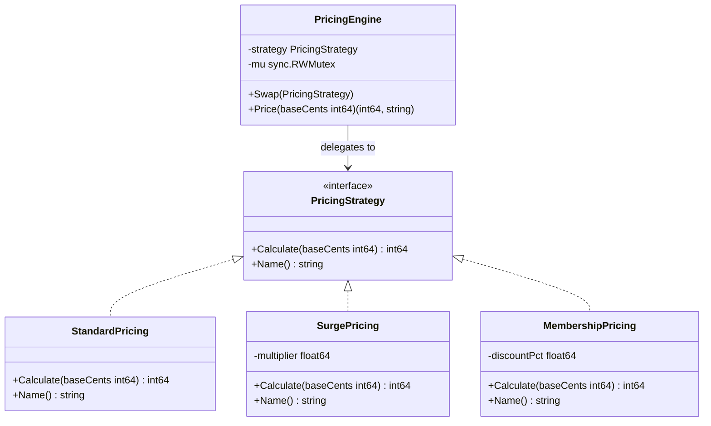
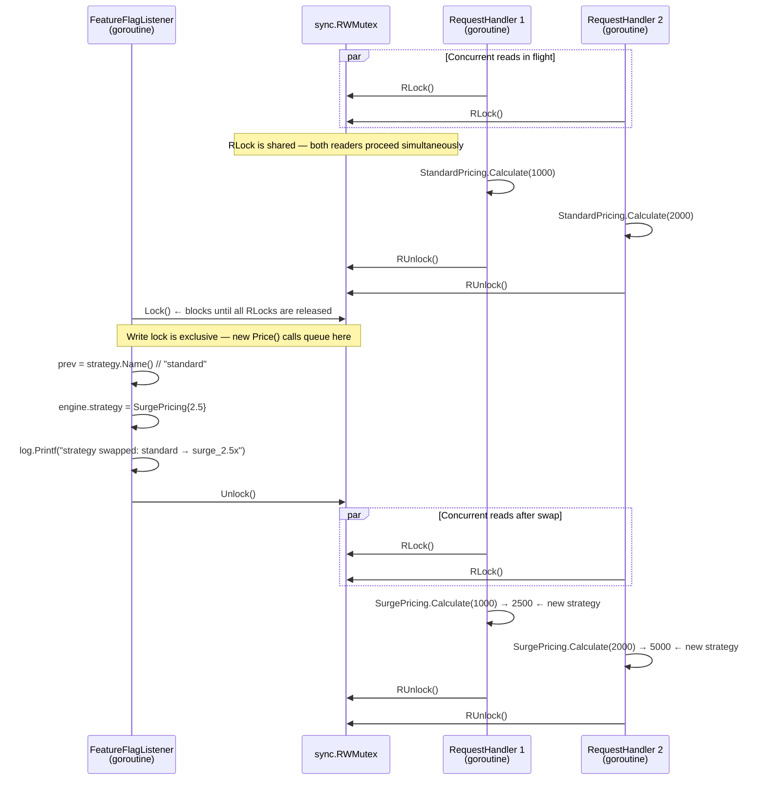

## 1. Overview

Every time you write an `if/else` block that chooses between two algorithms, you are one refactoring away from Strategy. When those algorithms grow to five, diverge significantly, and need to be swapped at runtime — Strategy is not optional, it is mandatory.

The Strategy pattern defines a family of algorithms, encapsulates each one behind a common interface, and makes them interchangeable. The caller selects a strategy; the engine executes it. Changing the algorithm never touches the caller.

**Mental model:** Think of a GPS navigation app. You enter a destination. The app offers: fastest route, shortest distance, avoid tolls, scenic route. You pick one. The navigation engine does not rewrite itself — it swaps which routing algorithm it calls. The "route us from A to B" request is identical. Only the algorithm computing the path changes. That is Strategy.

In this article you will learn:

- How Strategy decouples algorithm selection from algorithm execution
- How Go's interface system makes Strategy idiomatic and cheap
- How Uber, Stripe, and Go's own standard library use it in production
- The four failure modes that will cause Strategy to hurt more than help

---

## 2. Core Concepts (Step-by-Step)

### Step 1: The Three Participants

1. **Strategy** (interface) — defines the algorithm contract; every concrete strategy must implement it
2. **ConcreteStrategy** — encapsulates one specific algorithm (`StandardPricing`, `SurgePricing`, `MembershipPricing`)
3. **Context** — holds a reference to the current strategy; delegates execution to it; provides `Swap()` for runtime replacement

### Step 2: Structure



*PricingEngine holds the interface, not a concrete type. Adding a new pricing model is one new struct — zero changes to PricingEngine.*

### Step 3: The Open/Closed Principle in Practice

This is where Strategy pays off at scale. Without Strategy:

```go
func Price(baseCents int64, mode string) int64 {
    switch mode {
    case "standard":   return baseCents
    case "surge":      return int64(float64(baseCents) * 2.5)
    case "membership": return int64(float64(baseCents) * 0.85)
    // Every new pricing model requires editing this function
    }
}
```

Every new pricing tier means editing the switch statement, adding a test for a function that already has tests, and risking a regression in the existing cases. The function is open for modification, which is the problem.

With Strategy, adding `HolidayPricing` is: create one new struct, write its tests in isolation, register it. `PricingEngine` never changes.

### Step 4: Runtime Strategy Swapping

The most powerful aspect of Strategy is that the algorithm can be selected at runtime — not just at compile time. A feature flag listener goroutine can call `Swap()` when a flag flips. No restart needed. No code change deployment.

```
Feature flag service: "surge_pricing" → true
        ↓
Feature flag listener goroutine
        ↓
pricingEngine.Swap(SurgePricing{Multiplier: 2.5})
        ↓
Next price calculation uses surge pricing
```

This is exactly how Uber's demand-based pricing transitions happen without service restarts.

The tricky part is not the swap itself — it is doing the swap *safely while requests are in flight*. The sequence diagram below shows why `sync.RWMutex` is the right tool: it lets concurrent `Price()` calls share the read lock while `Swap()` waits for all readers to finish before taking an exclusive write lock.



*`Price()` uses `RLock` — many goroutines can read concurrently. `Swap()` uses `Lock` — exclusive write blocks all readers until the new strategy is installed. No request ever sees a half-swapped state.*

### Step 5: Go's sort Package Is Strategy

Go's standard library demonstrates Strategy in `sort.Slice`:

```go
// The less function IS the strategy — the sorting algorithm stays the same
sort.Slice(orders, func(i, j int) bool {
    return orders[i].CreatedAt.Before(orders[j].CreatedAt)
})

// Swap to a different strategy without changing the caller
sort.Slice(orders, func(i, j int) bool {
    return orders[i].TotalCents > orders[j].TotalCents // sort by value descending
})
```

The sort algorithm (introsort) is fixed. The comparison Strategy is injectable. That is the pattern.

---

## 3. Use Cases

### 1. Uber Surge Pricing

Uber maintains a demand monitoring service that samples supply/demand ratios every 30 seconds per geographic cell. When the ratio crosses a threshold, the pricing service's active strategy flips from `StandardPricing` to `SurgePricing{Multiplier: X}`. When demand normalizes, it flips back. The fare calculation code itself never changes — only the active strategy does. This is Strategy enabling real-time dynamic pricing at scale.

### 2. Stripe Payment Processor Routing

Stripe routes payment attempts through multiple acquiring banks. The primary processor gets the first attempt. On failure (decline, timeout, connectivity error), the routing engine swaps to a secondary processor strategy and retries. On international transactions, a specific regional processor strategy is selected. Each processor is a `PaymentStrategy` implementation. Stripe's checkout engine delegates to whichever strategy is active — it has no conditional logic about processors.

### 3. Go Sort Package and ML Model Selection

Netflix's experimentation platform ([It's All A/Bout Testing: The Netflix Experimentation Platform](https://netflixtechblog.com/its-all-a-bout-testing-the-netflix-experimentation-platform-4e1ca458c15b)) uses this exact pattern for recommendation model A/B testing. `ModelA` and `ModelB` implement the same `RecommendationStrategy` interface. The platform routes user X to `ModelA.Recommend()` and user Y to `ModelB.Recommend()`. Metrics are collected per strategy. The winning strategy is rolled out to 100% by retiring the losing one — again, zero changes to the caller code.

---

## 4. Gotchas

### Gotcha 1: Strategy Interface That Is Too Specific

```go
// BEFORE: Interface is tightly coupled to one caller's data model
type PricingStrategy interface {
    Calculate(req UberRideRequest) int64
}
// Problems:
// - UberRideRequest changes → every strategy must change
// - SurgePricing cannot be reused in a DeliveryPricing service
// - Unit tests require constructing a full UberRideRequest fixture
```

```go
// AFTER: Interface accepts primitives only
type PricingStrategy interface {
    Calculate(baseCents int64) int64
    Name() string
}
// The caller extracts what the algorithm needs before delegating:
//   price, name := engine.Price(req.FareCents)
// SurgePricing now works in any service that has a price in cents.
// Unit tests need no UberRideRequest — just pass 1000.
```

If `UberRideRequest` changes, every strategy must change. If you want to use `SurgePricing` in a different service that uses a `DeliveryRequest`, you cannot — the types don't match.

**Fix:** Keep strategy interfaces as narrow as possible. Pass primitives where you can. If the algorithm needs multiple inputs, define a dedicated input struct, not your domain's request object.

### Gotcha 2: Strategies That Access Global State

```go
// BAD: Strategy reads global configuration — hidden coupling
func (s SurgePricing) Calculate(base int64) int64 {
    multiplier := globalConfig.Get("surge_multiplier") // race condition risk
    return int64(float64(base) * multiplier)
}
```

Global state access makes strategies non-deterministic, hard to test (you must configure globals), and dangerous in concurrent execution (race conditions). The strategy calculation in a benchmark cannot be reproduced.

**Fix:** Inject all dependencies at construction time. `SurgePricing{Multiplier: 2.5}` is fully self-contained and testable with zero external dependencies.

### Gotcha 3: Using Strategy Where a Simple If/Else Suffices

Three pricing modes that will never change, called from one place in the codebase — three new files, one new interface, a Context struct with a Swap method — this is over-engineering. The complexity cost exceeds the flexibility benefit.

**Fix:** Apply the Rule of Three. When the algorithm needs to be swapped at runtime, or when you have three or more variants that are growing, or when the strategy needs to be tested in complete isolation — then use Strategy. Not before.

### Gotcha 4: Strategies Sharing Mutable State Through the Context

```go
// BAD: Context carries mutable shared state; strategies mutate it
type PricingContext struct {
    BaseCents  int64
    LastResult int64  // strategies write here
    Audit      *AuditLog // strategies append here
}
```

Now two concurrent `Price()` calls share mutable context. You need locks everywhere in every strategy. The isolation that makes Strategy testable is destroyed.

**Fix:** Keep strategy execution pure — input in, result out. No mutations on shared structures. If you need audit logging, do it in the Context (caller) after receiving the strategy result.

---

## 5. Where to Use (and Where NOT to Use)

**Use Strategy when:**

- You have two or more algorithms that can be swapped at runtime
- Adding a new algorithm variant should not require modifying existing code (Open/Closed)
- Algorithms need to be tested in complete isolation
- Algorithm selection is driven by configuration, feature flags, or runtime conditions

**Do NOT use Strategy when:**

- You have one algorithm that never changes — just write the function
- You have a simple two-branch conditional that is stable — `if/else` is not a code smell
- The "strategies" share so much setup code that they are nearly identical — consider Template Method instead
- You need the strategies to communicate results back to each other — the pattern does not support inter-strategy coordination

> 💡 **Staff-level insight:** The critical question is: "Who owns the decision of which strategy to use?" If the caller always decides at construction time, you just need dependency injection. If the system decides at runtime based on dynamic conditions (demand, flags, user cohort, error codes), you need Strategy plus a selection mechanism. The selection mechanism — the part that decides *which* strategy to use — is often the most complex and highest-value code in the system. At Stripe, their payment routing rules engine that selects routing strategies is more complex than any individual processor strategy. Do not forget to design the selector.

---

## 6. Versus (Comparisons)

### Strategy vs. Template Method

| Aspect       | Strategy                                             | Template Method                                                  |
| ------------ | ---------------------------------------------------- | ---------------------------------------------------------------- |
| Mechanism    | Composition — context delegates to a strategy object | Structure — base method defines skeleton, subtype fills in steps |
| Granularity  | Replaces the entire algorithm                        | Replaces specific steps within a fixed skeleton                  |
| Go idiom     | Natural — Go interfaces and struct composition       | Requires embedding; no inheritance; awkward if misapplied        |
| Runtime swap | Yes — call `Swap()`                                  | No — the "template" is selected at construction                  |
| Use case     | Multiple algorithms with same contract               | One algorithm skeleton with variable steps                       |

**Choose Strategy when** you need to swap the entire algorithm, especially at runtime.

**Choose Template Method when** the algorithm structure is fixed but specific steps (parsing, formatting, validation hooks) vary by concrete type.

### Strategy vs. Function Parameter (Simple Callback)

| Aspect      | Strategy (Interface)                                      | Function Parameter                          |
| ----------- | --------------------------------------------------------- | ------------------------------------------- |
| Type safety | Compile-time via interface                                | Compile-time via func signature             |
| State       | Strategy carries state (`SurgePricing{Multiplier: 2.5}`)  | Stateless unless closure captures variables |
| Testability | Mock via interface                                        | Pass a test function directly               |
| When to use | Multiple methods, or strategy needs its own identity/name | Single function, no state needed            |

Go's `sort.Slice` uses a function parameter because the comparison is stateless. `PricingEngine` uses an interface because each pricing strategy carries configuration state and needs a `Name()` for logging. Use the simplest mechanism that meets the need.

---

## 7. Code Example

```go
package strategy

import (
	"fmt"
	"sync"
)

// PricingStrategy is the Strategy interface.
// All pricing algorithms implement this contract.
// The interface is narrow: two methods, no domain types in the signature.
type PricingStrategy interface {
	Calculate(baseCents int64) int64
	Name() string // for logging, metrics, and audit trails
}

// StandardPricing returns the base price unchanged.
type StandardPricing struct{}

func (s StandardPricing) Calculate(base int64) int64 { return base }
func (s StandardPricing) Name() string               { return "standard" }

// SurgePricing multiplies the base price by a demand-driven factor.
// Uber uses this pattern during peak hours and low driver supply.
type SurgePricing struct {
	Multiplier float64 // e.g., 2.5 means 2.5x the base fare
}

func (s SurgePricing) Calculate(base int64) int64 {
	return int64(float64(base) * s.Multiplier)
}
func (s SurgePricing) Name() string {
	return fmt.Sprintf("surge_%.1fx", s.Multiplier)
}

// MembershipPricing applies a percentage discount for subscribed users.
type MembershipPricing struct {
	DiscountPct float64 // e.g., 15.0 = 15% off the base fare
}

func (m MembershipPricing) Calculate(base int64) int64 {
	discount := int64(float64(base) * m.DiscountPct / 100.0)
	return base - discount
}
func (m MembershipPricing) Name() string {
	return fmt.Sprintf("membership_%.0fpct_off", m.DiscountPct)
}

// PricingEngine is the Context in Strategy terms.
// It holds the current strategy and delegates price calculation to it.
// Thread-safe: Swap() can be called concurrently from a feature flag goroutine
// while Price() is being called from request-handling goroutines.
type PricingEngine struct {
	mu       sync.RWMutex
	strategy PricingStrategy
}

// NewPricingEngine creates an engine with the given initial strategy.
func NewPricingEngine(initial PricingStrategy) *PricingEngine {
	if initial == nil {
		initial = StandardPricing{}
	}
	return &PricingEngine{strategy: initial}
}

// Swap replaces the active pricing strategy at runtime.
// Safe to call from a feature flag listener goroutine while requests are in flight.
// All Price() calls after Swap() returns will use the new strategy.
// Returns the name of the previous strategy — use it to log the transition.
func (pe *PricingEngine) Swap(next PricingStrategy) string {
	pe.mu.Lock()
	defer pe.mu.Unlock()
	prev := pe.strategy.Name()
	pe.strategy = next
	return prev
}

// Price calculates the final price using the current strategy.
// Returns both the price and strategy name — callers should include
// strategy name in audit logs so pricing decisions are always traceable.
func (pe *PricingEngine) Price(baseCents int64) (finalCents int64, strategyName string) {
	pe.mu.RLock()
	defer pe.mu.RUnlock()
	return pe.strategy.Calculate(baseCents), pe.strategy.Name()
}

// ActiveStrategy returns the name of the currently active strategy.
// Use in health endpoints and dashboards.
func (pe *PricingEngine) ActiveStrategy() string {
	pe.mu.RLock()
	defer pe.mu.RUnlock()
	return pe.strategy.Name()
}
```

**Feature flag-driven runtime swap:**

```go
// FeatureFlagListener watches a flag and swaps the strategy when it changes.
// Run this as a background goroutine; it owns the engine's strategy lifecycle.
func FeatureFlagListener(ctx context.Context, engine *PricingEngine, flagSvc FlagService) {
	ticker := time.NewTicker(10 * time.Second)
	defer ticker.Stop()
	for {
		select {
		case <-ctx.Done():
			return
		case <-ticker.C:
			multiplier, surgeActive := flagSvc.Float("surge_multiplier")
			var next PricingStrategy
			if surgeActive && multiplier > 1.0 {
				next = SurgePricing{Multiplier: multiplier}
			} else {
				next = StandardPricing{}
			}
			prev := engine.Swap(next)
			// Log every strategy transition for audit purposes.
			// When a customer disputes a charge, this log answers
			// "what pricing was active at 14:32:07?" in seconds.
			log.Printf("strategy swapped: %s → %s", prev, next.Name())
		}
	}
}
```

**Testing a strategy in complete isolation:**

```go
func TestSurgePricing(t *testing.T) {
	s := SurgePricing{Multiplier: 2.5}
	got := s.Calculate(1000) // 1000 cents = $10.00
	want := int64(2500)      // $25.00
	if got != want {
		t.Errorf("SurgePricing.Calculate(1000) = %d, want %d", got, want)
	}
}
// No engine, no feature flags, no HTTP — pure unit test. This is why Strategy wins.
```

---

## 8. Scale Discussion

**At 10x (high request throughput, single engine):**

The `sync.RWMutex` in `PricingEngine` is the only contention point. Read-heavy workloads (many `Price()` calls, rare `Swap()` calls) are efficient — `RLock` allows concurrent reads. Monitor `mutex_wait_time` metrics. If `Swap()` is called frequently (every second), consider `sync/atomic` storing an interface value instead of a mutex.

**At 100x (many engines, many strategies, microservices):**

Strategy selection itself becomes a latency concern. Fetching the active strategy from a remote feature flag service on each request is too slow. Solution: cache the strategy locally; refresh asynchronously via a background goroutine with a TTL. This is what LaunchDarkly's SDK does — local caching of flag evaluations with a streaming update channel.

**At 1000x (global strategy selection, multi-region):**

Strategy selection is now a distributed systems problem. You need: global consistency of which strategy is active (Kafka-based config propagation), strategy rollout percentage (route 10% of traffic to `SurgePricing`, 90% to `StandardPricing`), and instant rollback. This is the architecture of Uber's demand-pricing system — a dedicated service computes the active strategy per geo-cell and broadcasts it to all fare engines via Kafka.

> 💡 **Staff-level insight:** At scale, the bottleneck is never the strategy execution itself — it is always the strategy *selection* mechanism. The algorithm runs in nanoseconds. Deciding *which* algorithm to run can take milliseconds if you are making a remote call. Design the selection path for your traffic scale from the beginning.

---

## 9. Monitoring & Observability

| Metric                                  | Type                         | Alert Condition                                          |
| --------------------------------------- | ---------------------------- | -------------------------------------------------------- |
| `pricing.strategy_name`                 | Label on all pricing metrics | Unexpected strategy active (e.g., surge during off-peak) |
| `pricing.calculations_total`            | Counter per strategy         | Unexpected strategy distribution shift                   |
| `pricing.calculation_duration_seconds`  | Histogram                    | p99 spike → expensive strategy introduced                |
| `pricing.strategy_swaps_total`          | Counter                      | High frequency → flag service instability or thrashing   |
| `pricing.revenue_per_calculation_cents` | Histogram                    | Sudden drop → wrong strategy active                      |
| `pricing.nil_strategy_errors_total`     | Counter                      | Any value → nil strategy guard missing                   |

**Log the strategy name on every pricing decision.** Include it in the audit trail. When a customer disputes a charge, the first question is: "What strategy was active when this was priced?" Without strategy name in the log, that question takes hours to answer. With it, seconds.

---

## 10. Interview Questions

### Q1: Design Uber's surge pricing system. How do you transition from standard to surge pricing without a service restart?

**Key points to cover:**

- Define a `PricingStrategy` interface; `StandardPricing` and `SurgePricing{Multiplier}` are concrete implementations
- `PricingEngine` holds the active strategy behind a `sync.RWMutex`
- A demand monitoring service computes the multiplier per geographic cell every 30 seconds and publishes to Kafka
- Each fare service instance consumes this Kafka topic and calls `engine.Swap(SurgePricing{Multiplier: x})` on change
- Audit: every `Price()` call logs the strategy name; enables retrospective analysis of pricing decisions

**Common mistake:** Hardcoding the surge multiplier in a configuration file and requiring a restart to change it. Does not scale to per-cell dynamic pricing.

**What the interviewer wants:** Evidence that you think about the full lifecycle: strategy definition, runtime swap mechanism, distributed propagation, and observability.

### Q2: What is the difference between Strategy and Template Method? When do you use each in Go?

**Key points:**

- Strategy replaces the *entire* algorithm via delegation to an interface. The caller selects the algorithm.
- Template Method defines the algorithm skeleton in a base "template" method; specific steps are deferred to a concrete type via interface hooks.
- In Go: Strategy maps naturally to interfaces and struct composition. Template Method requires the embedding pattern (a struct embedding an interface for the hooks).
- Rule of thumb: if the algorithm steps are fixed but one or two steps vary → Template Method. If the entire algorithm changes → Strategy.

**Common mistake:** Using Template Method in Go by trying to translate Java inheritance. Go has no class inheritance. The correct Go idiom for Template Method is struct composition with an embedded interface — not the same as Java's `extends`.

### Q3: How would you implement a payment routing system that automatically falls back to a secondary processor when the primary fails?

**Key points:**

- Define `PaymentStrategy` interface with `Charge(ctx, req) (Result, error)`
- `PrimaryProcessorStrategy` and `SecondaryProcessorStrategy` are concrete implementations
- `FallbackRouter` is a composite strategy: try primary, on specific error codes (timeout, decline), swap to secondary
- Circuit breaker around each strategy: if primary fails too often, mark it as open and route directly to secondary
- Log strategy name on every transaction for reconciliation and dispute resolution

**What the interviewer wants:** Recognition that Strategy composes — a `FallbackRouter` is itself a Strategy that wraps other Strategies. This is polymorphic composition, which is a staff-level architectural pattern.

---

## 11. Staff-Level Preparation Tips

**What to build:**

- Build a payment routing system with three strategies (Stripe, Braintree, PayPal), a health-check-aware router that demotes a failing strategy, and a canary rollout mechanism that sends N% of traffic to a new strategy. This demonstrates Strategy + Circuit Breaker + feature flags together.
- Implement the same sorting interface with three strategies: quicksort, mergesort, and radix sort. Write a benchmark that selects the optimal strategy based on input size. This is how a production sort utility should work.

**What to study:**

- Go interface internals: how interface values are stored (type pointer + data pointer); why interface dispatch is cheap but not free
- Feature flag systems: LaunchDarkly SDK internals, Unleash, or Flipt — all implement Strategy selection at scale
- Functional options pattern in Go — a related pattern that uses Strategy-style function injection for configuration

**System design connections:**

- **Load balancer routing algorithms** (round-robin, least connections, weighted): each is a Strategy
- **Cache eviction policies** (LRU, LFU, FIFO): each is a Strategy; Redis implements this with a configurable eviction strategy
- **Retry policies** (exponential backoff, linear, no retry): each is a Strategy; AWS SDK implements this as a `RetryerV2` interface

**How to demonstrate staff-level thinking:**

When Strategy is proposed in a design review, immediately ask: "What drives strategy selection — compile-time, configuration, runtime conditions, or user cohort?" The answer determines how complex your selection mechanism needs to be and whether you need distributed coordination for strategy consistency across instances.

---

## 12. References

- **Book:** *Design Patterns: Elements of Reusable Object-Oriented Software* — Gamma et al. Strategy chapter, pp. 315–323
- **Book:** *Clean Code* — Robert C. Martin. Chapter on Open/Closed Principle — the theoretical foundation Strategy implements
- **Blog:** [Stripe Engineering — Smart Retries](https://stripe.com/blog/smart-retries-fraud-prevention) — Strategy applied to payment routing
- **Talk:** [GopherCon 2016 — Go's sort package](https://youtu.be/5KYNbFosStA) — how Go's standard library uses Strategy via function values
- **Docs:** [LaunchDarkly Go SDK](https://docs.launchdarkly.com/sdk/server-side/go) — production strategy selection via feature flags
- **Blog:** [Uber Engineering — Demand and Pricing](https://www.uber.com/blog/uber-demand-prediction-model/) — real-world system that uses Strategy at scale
- **Go:** [sort package](https://pkg.go.dev/sort) — canonical Strategy in the standard library via `sort.Interface` and `sort.Slice`
- **Paper:** [Algorithms as Configuration: The Strategy Pattern at Scale](https://dl.acm.org/doi/10.1145/1532581) — academic treatment of runtime algorithm selection
