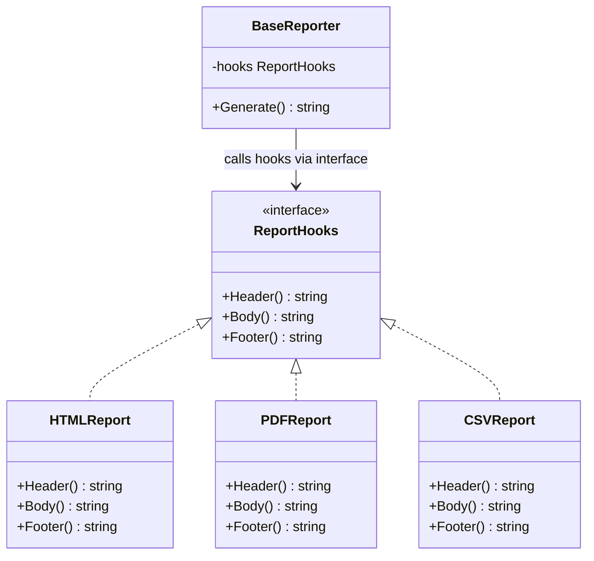
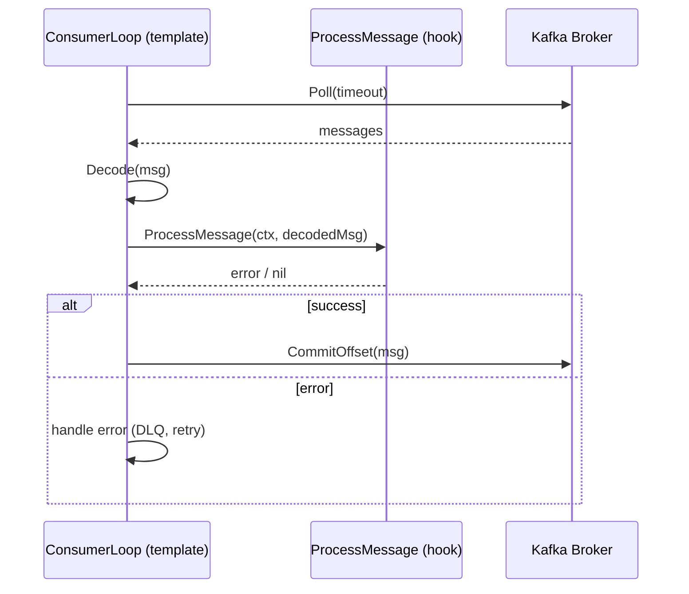

## 1. Overview

You have three report formats: HTML, PDF, and CSV. Each report follows the same structure: render a header, render the body, render a footer. The structure is identical. The rendering of each part is completely different. Writing `GenerateHTMLReport()`, `GeneratePDFReport()`, and `GenerateCSVReport()` as three independent functions means you define the structure three times — and when the structure changes, you change three places.

Template Method solves this. It defines the skeleton of an algorithm in one place — the template method. The specific steps of the algorithm are deferred to types that implement the hooks. The structure is fixed. The details are variable.

**Mental model:** Think of a franchise restaurant. Every McDonald's follows the same process: greet customer, take order, prepare food, package, deliver. This is the template. The specific food preparation varies by item (burger vs. salad vs. fries) — those are the hooks. McDonald's corporate defines the skeleton. Each kitchen implements the food-specific steps. The overall customer experience is consistent; the production details vary.

**The critical Go note:** In Java, Template Method uses class inheritance — the base class defines the template method and calls abstract methods overridden by subclasses. Go has no class inheritance. The Go idiom for Template Method is **composition with an embedded interface**: a struct with a `Generate()` template method that calls methods on an embedded interface (the hooks). This is idiomatic, testable, and avoids the Java inheritance trap.

In this article you will learn:

- How Template Method works and how its Go idiom differs from Java/Python
- Why the composition-based approach is strictly superior in Go
- The four production failure modes: the fragile base method, unordered hooks, Java translation bugs, and undocumented optional hooks
- How Kafka consumer loops use Template Method for the "process message" hook

---

## 2. Core Concepts (Step-by-Step)

### Step 1: The Three Participants

1. **AbstractClass (interface in Go)** — defines the hook methods that concrete types must implement (`Header()`, `Body()`, `Footer()`)
2. **ConcreteClass** — implements the hooks for a specific variant (`HTMLReport`, `PDFReport`)
3. **Template Method** — the `Generate()` function on the base struct that calls the hooks in the defined order; this is the skeleton; it never changes

### Step 2: The Go Idiomatic Structure



*`BaseReporter.Generate()` is the template method — it defines the order: Header → Body → Footer. It never changes. The three concrete types implement the format-specific details.*

### Step 3: The Java Approach vs. The Go Approach

**Java approach (classic GoF — DO NOT translate this to Go):**

```java
// Java: base class holds the template method; abstract methods are the hooks
abstract class BaseReport {
    // Template method — defines the skeleton
    public final String generate() {
        return header() + body() + footer();
    }
    abstract String header(); // hook
    abstract String body();   // hook
    abstract String footer(); // hook
}

class HTMLReport extends BaseReport {
    String header() { return "<html><head>..."; }
    // ...
}
```

**Go approach (composition with embedded interface — the correct idiomatic form):**

```go
// Go: interface defines hooks; base struct holds the interface and the template method
type ReportHooks interface {
    Header() string
    Body() string
    Footer() string
}

type BaseReporter struct {
    hooks ReportHooks // the "subclass" is injected at construction time
}

// Generate is the template method — the skeleton; never changes
func (b *BaseReporter) Generate() string {
    return b.hooks.Header() + "\n" + b.hooks.Body() + "\n" + b.hooks.Footer()
}

type HTMLReport struct{} // implements ReportHooks
```

The Go approach is better in every measurable way: it is injectable, mockable in tests (pass any struct implementing `ReportHooks`), and has no inheritance hierarchy to navigate.

### Step 4: Template Method in the Real World — Kafka Consumer Loop

Kafka's consumer polling loop is Template Method in disguise. The structure is fixed:

```
for {
    1. Poll for messages (fixed — Kafka SDK does this)
    2. Decode the message (fixed — schema registry or JSON unmarshal)
    3. Process the message (VARIABLE — this is your hook)
    4. Commit the offset (fixed — SDK does this, after successful process)
}
```

Step 3 is the hook. Steps 1, 2, and 4 are the skeleton. Every Kafka consumer you write is a concrete implementation of `ProcessMessage(msg *kafka.Message) error`. The loop structure is the template method.



*The loop structure (poll, decode, process, commit) is fixed. The process step is your hook. This is Template Method at the infrastructure level.*

### Step 5: The `testing.T` Idiom Is Template Method

Go's `testing.T` also follows Template Method thinking. `go test` defines the test runner template: discover test functions, run each, capture output, report pass/fail. Your test functions are the hooks — `func TestSomething(t *testing.T)` is the hook method that you implement. The testing framework provides the skeleton.

---

## 3. Use Cases

### 1. Report Generation Pipelines (Salesforce, JIRA)

Salesforce generates reports in HTML, PDF, Excel, and CSV. The algorithm skeleton is: build the metadata header, fetch and format the data rows, build the footer with totals/timestamps. Each format implements the three hooks differently — HTML renders `<table>`, Excel writes `.xlsx` cells, CSV writes comma-delimited lines. The data fetching and metadata logic are identical across all formats. Template Method ensures this shared logic lives in one place.

### 2. Kafka Consumer Applications

Every Kafka consumer framework provides a Template Method abstraction. Confluent's Go client provides `Consume()` — a loop that polls, delivers messages to your callback, handles partition rebalancing, and manages offsets. Your `MessageHandler` is the hook. Spring Kafka's `@KafkaListener` is Template Method — the Spring framework owns the polling loop; you implement the annotated method body (the hook).

### 3. Go's testing.T and Table-Driven Tests

`testing.T` is Template Method at the framework level. The test runner defines the skeleton: discover `Test*` functions, set up goroutine, call function with `*testing.T`, record result, handle panics. Your test function is the hook. `t.Helper()`, `t.Fatal()`, and `t.Run()` are utilities the template provides to hooks. The subtlety is that Go's testing framework uses function values (callbacks) as hooks rather than interface methods — another valid form of Template Method.

---

## 4. Gotchas

### Gotcha 1: Translating Java Inheritance to Go

The most common mistake: taking a Java Template Method implementation and translating it literally to Go using struct embedding for "inheritance."

```go
// WRONG: attempting inheritance via embedding — Go does not work this way
type BaseReport struct{}
func (b *BaseReport) Header() string { return "" } // "default" implementation

type HTMLReport struct {
    BaseReport // embedded — hoping to "override" Header
}
func (h *HTMLReport) Header() string { return "<html>" }

reporter := &BaseReport{}
reporter.Generate() // PROBLEM: BaseReport.header() calls BaseReport.Header(),
                    // NOT HTMLReport.Header(), even when embedded.
                    // Go method dispatch is not polymorphic on embedded types.
```

Go's struct embedding is NOT inheritance. Method calls on the embedded struct always resolve to the embedded struct's type, not the outer struct's type. Template Method built on inheritance semantics will silently call the wrong method and produce subtly wrong output — or worse, empty output with no errors.

**Fix:** Use the interface injection pattern shown above. The `BaseReporter` holds a `ReportHooks` interface. The hook is resolved polymorphically through the interface — this is how Go achieves the Template Method effect correctly.

### Gotcha 2: Hooks Called in Unexpected Order

The power of Template Method is that the hook order is defined once in the template. But if developers add new hooks over time without documenting their position in the sequence, the order becomes tribal knowledge.

```go
// Template method grew over time; hook order is now unclear
func (b *BaseReporter) Generate() string {
    return b.hooks.Header() +
           b.hooks.Watermark() +  // added in sprint 3
           b.hooks.Body() +
           b.hooks.Disclaimer() + // added in sprint 7
           b.hooks.Footer()
}
```

`PDFReport.Watermark()` places the watermark before the body. `HTMLReport.Watermark()` places it after. Both implement the same interface, but semantic assumptions about position differ. Silent data corruption in the generated output.

**Fix:** Document the exact hook call order in the template method's godoc comment. Add an integration test that generates output with a known concrete implementation and asserts the correct section ordering.

### Gotcha 3: Template Methods That Call Too Many Hooks (Fragile Base Method)

A template method with 10 hook calls is brittle. Any new concrete implementation that forgets to implement one non-obvious hook correctly gets a silent wrong result. The more hooks, the more cognitive load on every implementor.

**Fix:** Keep the template skeleton to 3–5 hooks maximum. If you need more variation, split into two template methods or consider Strategy (replace the entire algorithm rather than individual steps). The optimal Template Method is one where a new implementor can read the interface definition and immediately understand what they need to implement.

### Gotcha 4: Not Distinguishing Required vs. Optional Hooks

```go
type ReportHooks interface {
    Header() string  // required: every report needs a header
    Body() string    // required: every report needs a body
    Footer() string  // required: every report needs a footer
    Watermark() string // optional: only some reports need watermarks
}
```

If `Watermark()` is in the interface, every concrete report must implement it — even if they return an empty string. The interface pollutes every implementor with a no-op method. Worse, a developer accidentally returns something from `Watermark()` when they should not, adding unintended content.

**Fix:** Split optional hooks into a separate interface. In the template method, use a type assertion to check if the hook implements the optional interface:

```go
// Optional hook — not every implementation needs it
type WatermarkProvider interface {
    Watermark() string
}

func (b *BaseReporter) Generate() string {
    result := b.hooks.Header() + b.hooks.Body() + b.hooks.Footer()
    if wp, ok := b.hooks.(WatermarkProvider); ok {
        result = wp.Watermark() + result // only add if implemented
    }
    return result
}
```

---

## 5. Where to Use (and Where NOT to Use)

**Use Template Method when:**

- Multiple implementations share the same algorithmic skeleton but differ in specific steps
- The steps must always execute in a defined order — the structure is not flexible
- You want to define the invariant part of an algorithm once and let implementations vary the details
- You need a hook-based extension point for a framework or library consumer

**Do NOT use Template Method when:**

- The entire algorithm varies — use Strategy instead (replace the whole algorithm)
- You only have one implementation — no pattern needed; just write the function
- The hooks have no natural ordering — use Strategy or a collection of function callbacks
- You are trying to emulate Java inheritance in Go — this is always wrong; use interface composition

> 💡 **Staff-level insight:** Template Method is the pattern that underpins every SDK and framework hook system you have ever used: Kafka consumer callbacks, HTTP middleware hooks (before_action, after_action in Rails), database migration Up/Down methods, and test lifecycle hooks (Before/After/Setup/Teardown). When you build an SDK for other teams to implement, you are designing Template Methods. The quality of your hook interface design — how many hooks, what they are named, what order they are called in, which are required vs. optional — determines how easy or painful it will be for teams to extend your framework correctly. This is high-leverage staff-level API design work.

---

## 6. Versus (Comparisons)

### Template Method vs. Strategy

| Aspect              | Template Method                                    | Strategy                                                  |
| ------------------- | -------------------------------------------------- | --------------------------------------------------------- |
| What varies         | Specific steps within a fixed skeleton             | The entire algorithm                                      |
| Structure           | Fixed skeleton with variable steps                 | No fixed skeleton; caller chooses the whole algorithm     |
| Extension mechanism | Implement the hook interface                       | Implement the strategy interface                          |
| Runtime swap        | No — selected at construction                      | Yes — `Swap()` at runtime                                 |
| When to use         | Same algorithm structure, different step details   | Completely different algorithms serving the same contract |
| Go example          | `BaseReporter` with `HTMLReport`/`PDFReport` hooks | `PricingEngine` with `StandardPricing`/`SurgePricing`     |

**Choose Template Method when** the algorithm structure (order and composition of steps) is fixed and only the step implementations vary.

**Choose Strategy when** a caller needs to select between fundamentally different algorithms at runtime.

### Template Method vs. Function Callbacks

| Aspect          | Template Method (interface)                    | Function Callbacks                                             |
| --------------- | ---------------------------------------------- | -------------------------------------------------------------- |
| State           | Concrete type carries state                    | Closures can capture state                                     |
| Multiple hooks  | Interface groups them; one type implements all | Individual function parameters; more flexible but less grouped |
| Discoverability | IDE shows interface methods                    | Must read function signature documentation                     |
| When to use     | Related set of hooks on one type               | One or two simple hooks, especially in isolated contexts       |

Go's `sort.Interface` (Len, Less, Swap) is Template Method via interface.
Go's `sort.Slice` is Template Method via a single function callback — simpler because only one hook varies.

Use the interface form when your concrete type needs to implement three or more related hooks. Use callbacks when you need one simple hook.

---

## 7. Code Example

```go
package templatemethod

import (
	"fmt"
	"strings"
	"time"
)

// ReportHooks defines the hooks that concrete report formats must implement.
// All three are required — every report format must produce a header, body, and footer.
// Document the expected content of each hook so implementors know what to produce.
type ReportHooks interface {
	// Header returns the opening section: title, metadata, format-specific preamble.
	Header() string
	// Body returns the data section: the actual report content.
	Body() string
	// Footer returns the closing section: totals, timestamps, legal notices.
	Footer() string
}

// Titled is an optional hook for reports that include a display title.
// BaseReporter checks for this interface via type assertion — not required.
type Titled interface {
	Title() string
}

// ReportData carries the data the report needs to render.
// Passed to each concrete type at construction — not via global state.
type ReportData struct {
	Title     string
	Rows      [][]string
	Headers   []string
	Timestamp time.Time
}

// BaseReporter is the Context that holds the template method.
// It owns the algorithm skeleton: title (optional) → header → body → footer.
type BaseReporter struct {
	hooks ReportHooks
}

// NewBaseReporter constructs a reporter with the given hooks implementation.
// This is the injection point — tests can pass mock implementations.
func NewBaseReporter(hooks ReportHooks) *BaseReporter {
	return &BaseReporter{hooks: hooks}
}

// Generate is the template method — the algorithm skeleton.
// It defines the order: optional title → header → body → footer.
// This method never changes. Concrete types implement only the hooks.
func (b *BaseReporter) Generate() string {
	var sb strings.Builder

	// Optional hook: only add title if the concrete type implements Titled.
	if t, ok := b.hooks.(Titled); ok {
		sb.WriteString(fmt.Sprintf("=== %s ===\n\n", t.Title()))
	}

	sb.WriteString(b.hooks.Header())
	sb.WriteString("\n")
	sb.WriteString(b.hooks.Body())
	sb.WriteString("\n")
	sb.WriteString(b.hooks.Footer())

	return sb.String()
}

// ---- Concrete Implementations ----

// HTMLReport renders the report as an HTML table.
// Implements: ReportHooks, Titled (optional hook).
type HTMLReport struct {
	data ReportData
}

func NewHTMLReport(data ReportData) *HTMLReport {
	return &HTMLReport{data: data}
}

// Title implements the optional Titled interface.
func (h *HTMLReport) Title() string { return h.data.Title }

func (h *HTMLReport) Header() string {
	headers := make([]string, len(h.data.Headers))
	for i, hdr := range h.data.Headers {
		headers[i] = fmt.Sprintf("<th>%s</th>", hdr)
	}
	return fmt.Sprintf("<html><body><table><thead><tr>%s</tr></thead>", strings.Join(headers, ""))
}

func (h *HTMLReport) Body() string {
	var rows []string
	for _, row := range h.data.Rows {
		cells := make([]string, len(row))
		for i, cell := range row {
			cells[i] = fmt.Sprintf("<td>%s</td>", cell)
		}
		rows = append(rows, fmt.Sprintf("<tr>%s</tr>", strings.Join(cells, "")))
	}
	return fmt.Sprintf("<tbody>%s</tbody>", strings.Join(rows, ""))
}

func (h *HTMLReport) Footer() string {
	return fmt.Sprintf("<tfoot><tr><td colspan='%d'>Generated: %s</td></tr></tfoot></table></body></html>",
		len(h.data.Headers), h.data.Timestamp.Format(time.RFC3339))
}

// CSVReport renders the report as comma-separated values.
// Does NOT implement Titled — CSV has no standard title section.
type CSVReport struct {
	data ReportData
}

func NewCSVReport(data ReportData) *CSVReport {
	return &CSVReport{data: data}
}

func (c *CSVReport) Header() string {
	return strings.Join(c.data.Headers, ",")
}

func (c *CSVReport) Body() string {
	rows := make([]string, len(c.data.Rows))
	for i, row := range c.data.Rows {
		rows[i] = strings.Join(row, ",")
	}
	return strings.Join(rows, "\n")
}

func (c *CSVReport) Footer() string {
	return fmt.Sprintf("# Generated: %s", c.data.Timestamp.Format(time.RFC3339))
}
```

**Usage — same template method, different formats:**

```go
data := templatemethod.ReportData{
	Title:     "Q1 Sales Report",
	Headers:   []string{"Region", "Revenue", "Units"},
	Rows:      [][]string{{"APAC", "$2.4M", "8400"}, {"EMEA", "$1.9M", "6200"}},
	Timestamp: time.Now(),
}

// HTML output: includes optional title section
htmlOut := templatemethod.NewBaseReporter(templatemethod.NewHTMLReport(data)).Generate()

// CSV output: no title (CSVReport does not implement Titled)
csvOut := templatemethod.NewBaseReporter(templatemethod.NewCSVReport(data)).Generate()

// To add a PDFReport: implement ReportHooks — zero changes to BaseReporter.Generate()
```

**Testing with a mock hook (demonstrates testability of the injection approach):**

```go
type mockHooks struct {
	header, body, footer string
}
func (m *mockHooks) Header() string { return m.header }
func (m *mockHooks) Body() string   { return m.body }
func (m *mockHooks) Footer() string { return m.footer }

func TestGenerate_CallsHooksInOrder(t *testing.T) {
	hooks := &mockHooks{header: "H", body: "B", footer: "F"}
	reporter := templatemethod.NewBaseReporter(hooks)
	result := reporter.Generate()
	// Verify order: Header before Body, Body before Footer
	assert.Contains(t, result, "H")
	assert.Less(t, strings.Index(result, "H"), strings.Index(result, "B"))
	assert.Less(t, strings.Index(result, "B"), strings.Index(result, "F"))
}
```

---

## 8. Scale Discussion

**At 10x (many report types, high generation volume):**

Each `Generate()` call is cheap — string concatenation. The concern is the data fetching inside `Body()` — that is where N+1 query problems or missing pagination will surface. `Body()` should receive pre-fetched data (as in the `ReportData` struct approach), not make database calls internally. At high volume, profile `Body()` first.

**At 100x (report generation as a service, parallel generation):**

`BaseReporter` is stateless — it holds only the hooks interface, which itself only holds `ReportData`. Creating thousands of reporters concurrently is safe with no synchronization needed. The bottleneck moves to data fetching (the DB query that populates `ReportData`) and output streaming (writing large HTML/PDF responses without buffering the entire document in memory).

**At 1000x (streaming report generation, multi-format pipeline):**

`Header()`/`Body()`/`Footer()` returning strings breaks down when `Body()` contains millions of rows. The hooks must return `io.Reader` or use a streaming writer pattern (`io.Writer` passed to each hook) rather than building strings in memory. This is the Template Method pattern applied to a streaming pipeline — the skeleton still defines the order, but each hook writes to a stream rather than returning a value.

> 💡 **Staff-level insight:** The `ReportHooks` interface returning `string` works for small reports. For large datasets, the hooks should take a `context.Context` and an `io.Writer` — `Header(ctx, w io.Writer) error`. The template method calls each hook with the same writer. Hooks stream output directly without buffers. This is how production report generators and ETL pipelines work — Template Method with streaming hooks. Design your hook interfaces to support streaming from the start if the dataset might exceed a few hundred megabytes.

---

## 9. Monitoring & Observability

| Metric                               | Type                                    | Alert Condition                                     |
| ------------------------------------ | --------------------------------------- | --------------------------------------------------- |
| `report.generation_duration_seconds` | Histogram per format                    | p99 spike → data fetch in Body() is slow            |
| `report.generation_errors_total`     | Counter per format                      | Any value → hook panicking or returning error       |
| `report.output_size_bytes`           | Histogram per format                    | Sudden growth → unexpected data explosion in Body() |
| `report.hook_duration_seconds`       | Histogram per hook (header/body/footer) | body p99 >> header p99 → query bottleneck in Body() |
| `report.nil_hooks_total`             | Counter                                 | Any value → BaseReporter constructed with nil hooks |

**Instrumentation approach:**

Wrap `BaseReporter.Generate()` with timing at the top level. For per-hook timing, wrap each hook call with a `defer time.Since(start)` inside `Generate()`. This gives you full hook-level breakdown without modifying any concrete implementation.

---

## 10. Interview Questions

### Q1: How would you design a data export system that supports HTML, PDF, CSV, and JSON formats — and makes it trivial to add a new format in the future?

**Key points to cover:**

- Define `ExportHooks` interface: `Header() string`, `Body() string`, `Footer() string` (or streaming variants with `io.Writer`)
- `ExportEngine.Generate()` is the template method — defines the skeleton: validate data → render header → render body → render footer → write output
- Adding JSON format: implement `JSONExporter` with the three hooks; zero changes to `ExportEngine`
- Format selection: factory function that takes format string and returns the appropriate hooks implementation — this is Strategy for format selection + Template Method for format execution
- For large exports: hooks should write to `io.Writer` (streaming) rather than return strings (buffered in memory)

**Common mistake:** Separate `GenerateHTML()`, `GeneratePDF()`, `GenerateCSV()` functions with duplicated skeleton logic. Cannot be unit-tested without generating the full output.

### Q2: What is the difference between Template Method and Strategy? Give a concrete scenario where you would choose one over the other.

**Key points:**

- Template Method: the algorithm structure is fixed; only specific steps vary. You implement the variable steps by implementing hook methods on a type.
- Strategy: the entire algorithm is replaceable. The caller injects which algorithm to use at runtime.
- Concrete scenario: **Report generation** → Template Method: same structure (header/body/footer), different rendering per format. **Pricing algorithm** → Strategy: completely different calculation logic; caller selects surge vs. standard vs. membership; structure is not shared.
- The key question: "Is the structure fixed and only the details vary (Template Method), or is the entire computation replaceable (Strategy)?"

**What the interviewer wants:** Clear behavioral distinction with a concrete example that demonstrates you can apply the distinction in practice.

### Q3: How is Go's testing framework an example of Template Method? How would you apply this thinking when building an SDK for other teams?

**Key points:**

- `go test` discovers `Test*` functions (heuristic: functions are hooks), calls them with `*testing.T` (the template method context), captures pass/fail, reports results. Your test function IS the hook.
- Applying this to SDK design: define the lifecycle hooks your framework controls (init, before-request, process, after-request, teardown), expose them as an interface or function parameters, implement the skeleton in the SDK, let consumers implement the hooks.
- The quality metric for your hooks: can a new team implement the hooks correctly by reading only the interface definition? If they need to read the template method source code to understand what to return or when each hook is called — the interface is too ambiguous.
- Document: hook call order, whether hooks are called once or per-request, input/output types, error handling expectations, which hooks are optional

**What the interviewer wants:** SDK design thinking — understanding that Template Method is the pattern that makes frameworks extensible, and that designing good hook interfaces is high-leverage engineering work.

---

## 11. Staff-Level Preparation Tips

**What to build:**

- Build a Kafka consumer framework using Template Method: `ConsumerLoop` struct with a `MessageHandlerHooks` interface (`OnMessage(ctx, msg) error`, `OnError(ctx, err) bool`, `OnPartitionRebalance(partitions []int) error`). Implement three message handlers: one that writes to Postgres, one that calls an HTTP endpoint, one that forwards to another Kafka topic. Demonstrate that the loop structure (poll, decode, dispatch, commit/DLQ) lives in exactly one place.
- Build a database migration tool where each migration file implements an `Up(db DB) error` and `Down(db DB) error` hook. The migration runner is the template method: discover files → sort by version → check migration log → execute Up → record in log.

**What to study:**

- [Kafka Consumer Java API](https://kafka.apache.org/documentation/#consumerapi) — `ConsumerRebalanceListener` is Template Method for partition rebalancing hooks
- [Go testing package internals](https://pkg.go.dev/testing) — understand `T.Run` and how `TestMain` provides lifecycle hooks
- [golang-migrate library](https://github.com/golang-migrate/migrate) — a real Go migration tool built on Template Method
- Function options pattern in Go — a related extension point pattern that gives consumers hooks via function parameters

**System design connections:**

- **ETL pipeline design:** Extract-Transform-Load is Template Method — the ETL runner defines the order; each stage (extract from source, transform, load to target) is a hook
- **Plugin architectures:** any extensible system has a template method (the engine/framework) and hook points (the plugins)
- **A/B testing frameworks:** the test runner is the template method; the experiment implementation is the hook; metrics collection is wired into the template

**How to demonstrate staff-level thinking:**

When designing a framework or SDK for other teams, draw the Template Method boundary explicitly: "Here is the skeleton I own. Here are the hooks you implement. Here is the contract for each hook." Then validate: give the hook interface to a team that did not design it and ask them to implement it without reading your code. If they cannot, your hooks are not well-defined enough. This is the test of a well-designed Template Method.

---

## 12. References

- **Book:** *Design Patterns: Elements of Reusable Object-Oriented Software* — Gamma et al. Template Method chapter, pp. 325–330
- **Book:** *Head First Design Patterns* — Freeman & Robson. Chapter 8 (Template Method and Hollywood Principle)
- **Blog:** [Dave Cheney — Functional options for friendly APIs](https://dave.cheney.net/2014/10/17/functional-options-for-friendly-apis) — related extension point pattern in Go
- **Docs:** [golang-migrate](https://github.com/golang-migrate/migrate) — real Template Method implementation for database migrations
- **Docs:** [Go testing package](https://pkg.go.dev/testing) — Template Method at the framework level
- **Blog:** [Confluent Go Kafka consumer](https://docs.confluent.io/kafka-clients/go/current/overview.html) — Template Method in Kafka consumer patterns
- **Talk:** [GopherCon 2015 — Embrace the Interface](https://youtu.be/xyDkyFjzFVc) — idiomatic Go interface usage that underpins Template Method
- **Blog:** [Martin Fowler — Template Method refactoring](https://refactoring.com/catalog/formTemplateMethod.html) — when and how to extract Template Method from duplicated code
