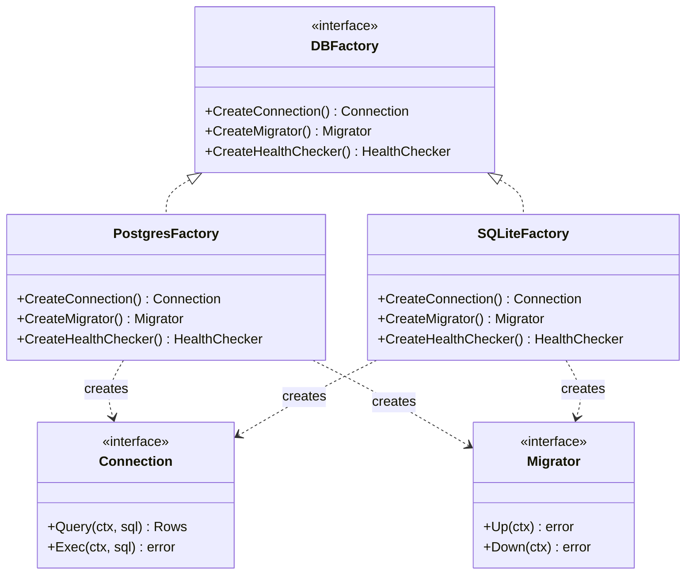

## 1. Overview

You're building a system that needs to work with two different databases: Postgres in production and SQLite in tests. Each database needs the same set of related objects: a connection, a migrator, and a health-checker. These three objects must be *compatible with each other* — you can't mix a Postgres connection with an SQLite migrator.

You could use individual Factory Methods for each object, but then nothing enforces that all three come from the same backend. Someone could accidentally pair a production connection with a test migrator.

**Abstract Factory** solves this: it provides an interface for creating *families of related objects* that are guaranteed to be compatible. You pick one factory — `PostgresFactory` or `SQLiteFactory` — and everything you create from it is consistent.

The key distinction from Factory Method: **Factory Method creates one product. Abstract Factory creates a compatible family.**

Mental model: Think of it as a furniture store theme. If you buy a "Modern" theme set, you get a modern sofa, modern table, and modern lamp — all guaranteed to match. You can't accidentally pick a Victorian lamp from the Modern factory. The factory enforces the family constraint.

By the end of this guide you'll know:
- When Abstract Factory is justified vs when Factory Method suffices
- How to implement it idiomatically in Go
- How to use it as a test/production infrastructure swap
- The N×M class explosion problem it solves

---

## 2. Core Concepts

### The Structure



*The `DBFactory` interface defines the family. `PostgresFactory` and `SQLiteFactory` each create a complete, internally compatible set of objects.*

### Why It Solves N×M Class Explosion

Without Abstract Factory, if you have 3 product types (Connection, Migrator, HealthChecker) and 2 backends (Postgres, SQLite), you have 6 concrete classes. If you add a 3rd backend (MySQL), you get 9. If you add a 4th product type, you get 12.

The Abstract Factory structures this growth: you add one factory implementation per backend (not N×M permutations). Adding MySQL means implementing one `MySQLFactory` that creates all 3 product types.

---

## 3. Use Cases

### Test Infrastructure Swapping

The most common use in production Go code: your integration tests use a `SQLiteFactory` (fast, in-memory, no Postgres required) while production uses `PostgresFactory`. The service under test only knows about the `DBFactory` interface — it never knows whether it's talking to Postgres or SQLite.

### Cloud Provider Abstraction

A system that targets multiple clouds uses a `CloudFactory` interface that creates `StorageClient`, `QueueClient`, and `ComputeClient`. `AWSFactory` creates S3, SQS, and EC2 clients. `GCPFactory` creates GCS, Pub/Sub, and GCE clients. Teams can run locally using a `LocalFactory` that creates filesystem, goroutine-based queue, and mock compute clients.

### UI Theme Engines

The GoF canonical example: a GUI toolkit creates platform-specific widgets (Windows, macOS, Linux). Each `UIFactory` creates a consistent `Button`, `Checkbox`, and `ScrollBar` that all render correctly on their platform. Mixing Windows buttons with macOS checkboxes would break the UI consistency.

---

## 4. Gotchas

### Gotcha 1 — Adding a New Product Type Breaks All Factories

If you add a `CreateAuditor() Auditor` to the `DBFactory` interface, you must update every implementation. `PostgresFactory`, `SQLiteFactory`, `MySQLFactory` — all of them. This is the main cost of Abstract Factory: the interface is the coupling point.

**Mitigation**: Keep the factory interface small. Only include products that are truly coupled (must be from the same family). Products that can stand alone don't belong in the factory.

### Gotcha 2 — Abstract Factory Where Factory Method Suffices

If you only need one type of product (just a `Connection`), Abstract Factory is overkill. Use Factory Method: a function that returns a `Connection` based on a config string.

Abstract Factory is justified when you need *multiple products that must be compatible*. If there's only one product, or products are independent, Factory Method is the right tool.

### Gotcha 3 — Factory That Does Business Logic

A factory should only create objects. If your factory is reading config files, making HTTP calls, or applying business rules, it has too many responsibilities. Construction logic belongs in the factory. Business logic belongs elsewhere.

### Gotcha 4 — Partial Product Family Compatibility

In Go, you can't enforce at compile time that a caller creates all products from the same factory. Someone can call `factory.CreateConnection()` and then create a `Migrator` from a different factory. Document this clearly. If it's a critical constraint, add a constructor that takes the full factory and immediately creates all products together.

---

## 5. Where to Use (and Where NOT to Use)

### Use When

- You need to create **multiple related objects** that must be **compatible with each other**
- You want to **swap families** of related objects (production vs test, cloud A vs cloud B)
- You want to **enforce the family constraint** at a structural level, not just by convention

### Do NOT Use When

- You only need one type of product — use Factory Method
- Your "family" only has one member — just use a constructor function
- The products are independent and don't need to be from the same source

> 💡 **Staff-level insight:** The most practical use of Abstract Factory in Go is the test/production infrastructure swap. `PostgresFactory` in main. `SQLiteFactory` (or `MockFactory`) in tests. This pattern enables fast, parallel, isolated integration tests without a Postgres container — which pays dividends every time you run CI. The pattern earns its abstraction cost here because the alternative (conditional logic scattered across test setup) is genuinely worse.

---

## 6. Versus (Comparisons)

| Dimension                   | Abstract Factory                   | Factory Method               |
| --------------------------- | ---------------------------------- | ---------------------------- |
| **Products created**        | Family of related products         | One product                  |
| **Family consistency**      | Enforced by the factory interface  | Not enforced                 |
| **Adding new product type** | Update all factory implementations | N/A                          |
| **Adding new variant**      | Add one new factory implementation | Add one new function         |
| **Complexity**              | Higher (more interfaces)           | Lower                        |
| **Right for**               | Multiple interdependent products   | Single product with variants |

> **Choose Abstract Factory** when you have multiple products that must be family-consistent (DB connection + migrator + health check all from same backend).
> **Choose Factory Method** when you have one product type with multiple implementations.

---

## 7. Code Examples

```go
package dbfactory

import (
    "context"
    "database/sql"
    "fmt"

    _ "github.com/mattn/go-sqlite3"
    _ "github.com/lib/pq"
)

// --- Abstract Factory interface ---

// DBFactory creates a compatible family of database infrastructure objects.
// Every object created by the same factory is guaranteed to work together.
type DBFactory interface {
    CreateConnection(ctx context.Context) (Connection, error)
    CreateMigrator() Migrator
    CreateHealthChecker() HealthChecker
}

// --- Product interfaces ---

type Connection interface {
    QueryContext(ctx context.Context, query string, args ...interface{}) (*sql.Rows, error)
    ExecContext(ctx context.Context, query string, args ...interface{}) (sql.Result, error)
    Close() error
}

type Migrator interface {
    Up(ctx context.Context) error
    Down(ctx context.Context) error
}

type HealthChecker interface {
    Check(ctx context.Context) error
}

// --- Postgres factory (production) ---

type PostgresFactory struct {
    DSN string
}

func (f *PostgresFactory) CreateConnection(ctx context.Context) (Connection, error) {
    db, err := sql.Open("postgres", f.DSN)
    if err != nil {
        return nil, fmt.Errorf("postgres connect: %w", err)
    }
    if err := db.PingContext(ctx); err != nil {
        db.Close()
        return nil, fmt.Errorf("postgres ping: %w", err)
    }
    return db, nil
}

func (f *PostgresFactory) CreateMigrator() Migrator {
    return &postgresMigrator{dsn: f.DSN}
}

func (f *PostgresFactory) CreateHealthChecker() HealthChecker {
    return &postgresHealthChecker{dsn: f.DSN}
}

// --- SQLite factory (testing) ---

// SQLiteFactory creates an in-memory SQLite database.
// Use in tests: fast, isolated, no external dependencies required.
type SQLiteFactory struct{}

func (f *SQLiteFactory) CreateConnection(ctx context.Context) (Connection, error) {
    db, err := sql.Open("sqlite3", ":memory:")
    if err != nil {
        return nil, err
    }
    return db, nil
}

func (f *SQLiteFactory) CreateMigrator() Migrator {
    return &sqliteMigrator{}
}

func (f *SQLiteFactory) CreateHealthChecker() HealthChecker {
    return &sqliteHealthChecker{}
}

// --- Application bootstrap ---

// App uses only the DBFactory interface — never knows if it's Postgres or SQLite.
type App struct {
    db      Connection
    migrate Migrator
    health  HealthChecker
}

func NewApp(ctx context.Context, factory DBFactory) (*App, error) {
    conn, err := factory.CreateConnection(ctx)
    if err != nil {
        return nil, err
    }
    return &App{
        db:      conn,
        migrate: factory.CreateMigrator(),
        health:  factory.CreateHealthChecker(),
    }, nil
}

// --- Stub implementations (would be real in production) ---

type postgresMigrator struct{ dsn string }
func (m *postgresMigrator) Up(ctx context.Context) error   { return nil }
func (m *postgresMigrator) Down(ctx context.Context) error { return nil }

type postgresHealthChecker struct{ dsn string }
func (h *postgresHealthChecker) Check(ctx context.Context) error { return nil }

type sqliteMigrator struct{}
func (m *sqliteMigrator) Up(ctx context.Context) error   { return nil }
func (m *sqliteMigrator) Down(ctx context.Context) error { return nil }

type sqliteHealthChecker struct{}
func (h *sqliteHealthChecker) Check(ctx context.Context) error { return nil }
```

*In `main.go`: `factory = &PostgresFactory{DSN: os.Getenv("DATABASE_URL")}`. In tests: `factory = &SQLiteFactory{}`. The `App` struct never changes.*

---

## 8. Scale Discussion

### 10x Load

Abstract Factory creates objects at startup (or connection pool setup), not per request. Scale doesn't change factory behavior — it changes the objects the factory creates. At 10x load, ensure `CreateConnection()` creates a pool with enough connections, not a single connection.

### 100x Load

At high load, factory creation itself is not the bottleneck. The products created by the factory (connection pools, clients) are. Abstract Factory's value at scale is in enabling environment parity: production uses the same factory interface as staging, which uses the same one as integration tests.

### 1000x Load

At massive scale, the factory abstraction may become too rigid. Cloud-specific connection pooling (e.g., AWS RDS Proxy vs direct Postgres connections) has different configuration models. An overly uniform `DBFactory` interface may prevent leveraging cloud-specific optimizations. At this scale, reevaluate whether the abstraction layer is still serving you or constraining you.

---

## 9. Monitoring & Observability

| Metric                                   | Type        | Alert Condition                   |
| ---------------------------------------- | ----------- | --------------------------------- |
| `db_connection_pool_size{factory}`       | Gauge       | Alert if near max pool size       |
| `db_connection_acquire_duration_seconds` | Histogram   | Alert if p99 > 100ms              |
| `db_health_check_status{factory}`        | Gauge (0/1) | Alert if 0 (health check failing) |
| `db_migration_status{version}`           | Gauge       | Alert on migration failure        |

---

## 10. Interview Questions

**Q1: "What's the difference between Factory Method and Abstract Factory?"**

Key points: Factory Method creates one product; Abstract Factory creates a compatible family. The key is "family consistency" — all products from the same factory are guaranteed compatible. When you need multiple products that must come from the same backend, Abstract Factory enforces that constraint.

Common mistake: Saying Abstract Factory is "just Factory Method with more types." The distinction is the compatibility guarantee and the structural enforcement of the family.

---

**Q2: "How would you use Abstract Factory to make your service testable without a real database?"**

Key points: `DBFactory` interface with `PostgresFactory` (production) and `SQLiteFactory` or `MockFactory` (tests). The service under test only receives the interface — it doesn't know which backend it's using. This eliminates the need for Postgres in unit/integration tests. Tests run faster, can be parallelized, and don't require external services.

Interviewer wants: Evidence that you design for testability from the start, not as an afterthought.

---

**Q3: "What's the cost of Abstract Factory? When would you avoid it?"**

Key points: Adding a new product type to the factory interface requires updating every implementation. For a simple system with one product type, Factory Method is simpler. Abstract Factory earns its complexity cost only when multiple interdependent products must come from the same family.

---

## 11. Staff-Level Preparation Tips

### What to Build

Implement the test/production infrastructure swap for a real service: create a `DBFactory` for your service, implement `PostgresFactory` (production) and `SQLiteFactory` (tests), and migrate your test setup to use the factory. Measure test speed before and after. The speedup from eliminating Postgres setup/teardown in tests is the concrete payoff that makes this pattern worth understanding.

### How This Connects to Broader System Design

Abstract Factory at the infrastructure level (the DB factory above) is the same principle as cloud-provider abstraction at the architectural level. AWS vs GCP vs Azure each provide Storage, Queue, and Compute — a `CloudFactory` interface is how you avoid cloud lock-in, at least at the application layer.

---

## 12. References

- **"Design Patterns: Elements of Reusable Object-Oriented Software"** — Gamma et al. (GoF). The original. [Pearson](https://www.pearson.com/en-us/subject-catalog/p/design-patterns-elements-of-reusable-object-oriented-software/P200000009480)
- **"Effective Go"**: https://go.dev/doc/effective_go — idiomatic Go patterns including interface-based factory design
- **Dave Cheney — "SOLID Go Design"**: https://dave.cheney.net/2016/08/20/solid-go-design
