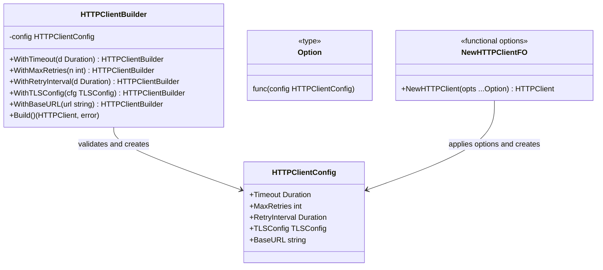

## 1. Overview

The Builder pattern constructs complex objects step by step, separating the construction process from the final object. Instead of a constructor with 12 parameters (half of which are optional), you build the object piece by piece and call `Build()` when you're done.

The mental model: building a custom PC. You don't order one pre-configured model. You choose the CPU, then the RAM, then the storage, then the GPU. Each choice is independent. You "build" the final PC when all choices are made. If you try to boot it before adding storage, the build step validates and rejects it.

In Go, there are two flavors: the classic **Builder struct** (with a `Build()` method that validates the final product) and **Functional Options** (the idiomatic Go alternative, popularized by Dave Cheney). Knowing which to use and why is a staff-level judgment call.

---

## 2. Core Concepts (Step-by-Step)

### Functional Options vs Builder Struct

Both solve the "complex object construction" problem. They differ in how they handle validation:

- **Functional Options**: immediate, one-option-at-a-time configuration. No final validation step. Used for 90% of Go configuration needs.
- **Builder Struct**: deferred validation at `Build()` time. Required when validation must cross multiple fields (e.g., "timeout must be less than retry interval × max retries").



*Both produce an `HTTPClient` from `HTTPClientConfig`. Builder validates cross-field constraints at `Build()` time. Functional Options apply each option immediately — cross-field validation must happen at first use.*

### The Key Decision

**Use Functional Options when:**
- No validation is needed across options (each option is independently valid)
- You want idiomatic Go ergonomics: `NewClient(WithTimeout(5*time.Second), WithRetry(3))`
- The object is always in a valid state after each option is applied

**Use Builder when:**
- Cross-field validation is required at construction time: "If TLS is disabled, BaseURL must not be https"
- Partial construction must not be usable — callers must explicitly call `Build()`
- The object is invalid in an intermediate state (before all required fields are set)

---

## 3. Use Cases

### 1. gRPC Dial Options — Functional Options at Scale

gRPC's client connection API uses functional options:

```go
conn, err := grpc.Dial(
    "localhost:50051",
    grpc.WithTransportCredentials(creds),
    grpc.WithTimeout(5 * time.Second),
    grpc.WithBlock(),
    grpc.WithKeepaliveParams(keepalive.ClientParameters{...}),
)
```

This is `grpc.DialOption` — a functional option type. The gRPC library has 40+ dial options. Without functional options, the `Dial()` function would need a 40-field struct or a 40-parameter constructor. Functional options make this extensible without breaking callers when new options are added.

### 2. SQL Query Builders (squirrel, GORM)

Go's `squirrel` library is a classic Builder:

```go
sql, args, err := squirrel.
    Select("id", "name", "email").
    From("users").
    Where(squirrel.Eq{"status": "active"}).
    OrderBy("created_at DESC").
    Limit(20).
    ToSql()
```

Each method call on the builder returns a new builder with the addition applied. `ToSql()` is the `Build()` call — it validates the final query and serializes it. The builder ensures you can't call `ToSql()` with a missing table name.

Here is a concrete end-to-end example that uses the result in a real database query:

```go
import (
    sq "github.com/Masterminds/squirrel"
    "database/sql"
    "fmt"
)

func activeUsers(db *sql.DB, tenantID int64) ([]User, error) {
    query, args, err := sq.Select("id", "name", "email").
        From("users").
        Where(sq.And{
            sq.Eq{"tenant_id": tenantID},
            sq.Eq{"status": "active"},
            sq.Gt{"login_count": 0},
        }).
        OrderBy("created_at DESC").
        Limit(50).
        PlaceholderFormat(sq.Dollar). // $1 placeholders for PostgreSQL
        ToSql()
    if err != nil {
        return nil, fmt.Errorf("build query: %w", err)
    }
    rows, err := db.Query(query, args...)
    // ... scan rows
    return nil, err
}
```

`PlaceholderFormat(sq.Dollar)` is itself a builder option that switches from `?` (MySQL) to `$1` (PostgreSQL) placeholders — the same functional-option idiom applied inside a query builder.

### 3. Kubernetes Object Builders

The Kubernetes Go client library uses builders extensively for constructing manifest objects. When writing controllers, you use `appsv1.DeploymentApplyConfiguration` builders to construct deployments piece by piece rather than filling in a 200-field struct at once. AWS CDK (Cloud Development Kit) uses the same pattern for constructing infrastructure resources.

---

## 4. Gotchas

### Gotcha 1: Builder That Doesn't Validate the Final Product

```go
func (b *HTTPClientBuilder) Build() *HTTPClient {
    return &HTTPClient{
        timeout: b.timeout,  // what if timeout is 0? Invalid — but Build() returns it silently
        baseURL: b.baseURL,  // what if baseURL is empty? Requests will fail confusingly
    }
}
```

A `Build()` that doesn't validate is just a constructor with extra steps. The builder's main value is catching invalid combinations before the object is used.

**Fix**: `Build()` must return `(*HTTPClient, error)`. Validate all required fields, validate cross-field constraints, return a descriptive error if anything is wrong.

### Gotcha 2: Builder That Allows Partial Construction to Be Used

```go
builder := NewHTTPClientBuilder()
builder.WithTimeout(5 * time.Second)
// Forgot to call Build()!
client := &HTTPClient{timeout: builder.timeout} // bypassing Build() and its validation
```

If the builder's fields are exported or the struct can be used directly without calling `Build()`, the validation is bypassed.

**Fix**: Keep builder fields unexported. The only way to get a valid product is through `Build()`.

### Gotcha 3: Functional Options vs Builder — Picking the Wrong One

Using a Builder struct when Functional Options would suffice adds ceremony without value:

```go
// Overkill — no cross-field validation needed
client, err := NewHTTPClientBuilder().
    WithTimeout(5 * time.Second).
    WithMaxRetries(3).
    Build()

// Idiomatic Go — Functional Options are simpler here
client := NewHTTPClient(
    WithTimeout(5 * time.Second),
    WithRetries(3),
)
```

Conversely, using Functional Options when cross-field validation is required means the validation lives in the first method call that uses the object — far from the construction site, where the error is hard to trace.

### Gotcha 4: Builder That Returns `nil` on Error Without a Clear Error Message

```go
func (b *HTTPClientBuilder) Build() *HTTPClient {
    if b.baseURL == "" {
        return nil // ← silent nil, no error
    }
    ...
}
```

All callers get a nil client. When they eventually call `client.Get()`, they get a nil pointer panic with a stack trace pointing to the call site, not the construction site. Debugging is painful.

**Fix**: Always return `(*Product, error)`. Never return `nil` without an error.

---

## 5. Where to Use (and Where NOT to Use)

### Use Functional Options When

- You're building a Go library or SDK that others will use (idiomatic, additive API)
- Each option is independently valid — no cross-field constraints
- You want zero boilerplate for callers using defaults (zero options = zero code overhead)
- The object is always valid after each option is applied

### Use Builder When

- Cross-field validation is required at construction time
- Some fields are required and the object is invalid without them
- You want to make partial construction impossible — callers must explicitly commit with `Build()`

### Do NOT Use Either When

- You have a simple struct with 1–3 fields — just use a `New...()` constructor
- All fields are required and there are no optional configurations — no builder needed, just list the parameters

> 💡 **Staff-level insight:** Dave Cheney's functional options pattern is the most widely adopted way to construct complex objects in Go. It's used by gRPC, AWS SDK v2, zerolog, OTEL, and hundreds of major Go libraries. When you're designing a Go library API, functional options are the default choice. Reserve the Builder struct with `Build()` for cases where construction validity depends on the combination of all options — not just each in isolation. Getting this distinction right is what separates well-designed Go APIs from verbose over-engineered ones.

---

## 6. Versus (Comparisons)

| Aspect                      | Builder                                            | Functional Options                    | Constructor (New...())                   |
| --------------------------- | -------------------------------------------------- | ------------------------------------- | ---------------------------------------- |
| Go idiom                    | Moderate                                           | High — idiomatic Go                   | High — basic Go                          |
| Cross-field validation      | Yes — at Build() time                              | No — per-option only                  | Limited — at call time                   |
| Partial construction safety | Yes — Build() is gatekeeper                        | No — each option valid immediately    | No                                       |
| Callers                     | `NewBuilder().WithX().Build()`                     | `New(WithX(), WithY())`               | `New(x, y)`                              |
| Optional params             | Handled elegantly                                  | Handled elegantly (designed for this) | Awkward (too many params)                |
| Extend API without breaking | Hard — requires new With methods on builder struct | Easy — add new Option functions       | Hard — changing signature breaks callers |
| When to use                 | Required fields + cross-field constraints          | Optional settings, library APIs       | 1–4 required params, no optional         |

**Choose Functional Options** for most Go library and service construction. **Choose Builder** only when cross-field validation at `Build()` time is a requirement.

> ⚠️ **`WithBaseURL` validation — an important nuance:** In the Functional Options approach, `WithBaseURL` simply stores the string. There is no central gate that validates URL format (scheme, host, port) or cross-field constraints like "if `tlsConfig` is nil, `baseURL` must not use `https`." That validation responsibility must be explicitly assigned elsewhere:
>
> | Where validation lives | When it runs | Risk |
> | ---------------------- | ------------ | ---- |
> | First HTTP call that uses the client | At request time | Silent misconfiguration ships to production |
> | HTTP middleware / transport wrapper | At request time | Same — but at least it's one centralised place |
> | Explicit `Validate() error` function | Caller must remember to call it | Better — but opt-in, not enforced |
> | Builder `Build()` method | At construction time | Best — fails loudly at startup |
>
> For security-sensitive configurations — TLS endpoints, auth base URLs, mTLS — **prefer the Builder** so that a misconfigured URL fails at startup rather than at the first customer request. Functional Options shift the URL-validation burden onto the caller.

---

## 7. Code Examples

```go
package builder

import (
	"crypto/tls"
	"fmt"
	"net/http"
	"time"
)

// --- Approach 1: Functional Options (idiomatic Go, for most cases) ---

type httpClientConfig struct {
	timeout       time.Duration
	maxRetries    int
	retryInterval time.Duration
	tlsConfig     *tls.Config
	baseURL       string
}

type Option func(*httpClientConfig)

func WithTimeout(d time.Duration) Option {
	return func(c *httpClientConfig) { c.timeout = d }
}

func WithMaxRetries(n int) Option {
	return func(c *httpClientConfig) { c.maxRetries = n }
}

func WithRetryInterval(d time.Duration) Option {
	return func(c *httpClientConfig) { c.retryInterval = d }
}

func WithTLSConfig(cfg *tls.Config) Option {
	return func(c *httpClientConfig) { c.tlsConfig = cfg }
}

func WithBaseURL(url string) Option {
	return func(c *httpClientConfig) { c.baseURL = url }
}

// NewHTTPClient creates an HTTP client with the given options.
// Defaults apply for any option not specified.
func NewHTTPClient(opts ...Option) *http.Client {
	cfg := &httpClientConfig{
		timeout:       30 * time.Second, // sensible default
		maxRetries:    3,
		retryInterval: 1 * time.Second,
	}
	for _, opt := range opts {
		opt(cfg)
	}
	transport := &http.Transport{}
	if cfg.tlsConfig != nil {
		transport.TLSClientConfig = cfg.tlsConfig
	}
	return &http.Client{Timeout: cfg.timeout, Transport: transport}
}

// --- Approach 2: Builder Struct (for cross-field validation) ---

// HTTPClientBuilder builds an HTTP client with validation at Build() time.
// Use this when you need to enforce constraints across multiple options:
// e.g., "retry interval must be less than timeout"
type HTTPClientBuilder struct {
	config httpClientConfig
}

func NewHTTPClientBuilder() *HTTPClientBuilder {
	return &HTTPClientBuilder{
		config: httpClientConfig{
			timeout:       30 * time.Second,
			maxRetries:    3,
			retryInterval: 1 * time.Second,
		},
	}
}

func (b *HTTPClientBuilder) WithTimeout(d time.Duration) *HTTPClientBuilder {
	b.config.timeout = d
	return b
}

func (b *HTTPClientBuilder) WithMaxRetries(n int) *HTTPClientBuilder {
	b.config.maxRetries = n
	return b
}

func (b *HTTPClientBuilder) WithRetryInterval(d time.Duration) *HTTPClientBuilder {
	b.config.retryInterval = d
	return b
}

func (b *HTTPClientBuilder) WithBaseURL(url string) *HTTPClientBuilder {
	b.config.baseURL = url
	return b
}

// Build validates cross-field constraints and returns the configured client.
// Returns an error if the configuration is invalid.
func (b *HTTPClientBuilder) Build() (*http.Client, error) {
	// Cross-field validation: retry interval must be < timeout
	if b.config.maxRetries > 0 && b.config.retryInterval >= b.config.timeout {
		return nil, fmt.Errorf(
			"retryInterval (%s) must be less than timeout (%s)",
			b.config.retryInterval, b.config.timeout,
		)
	}
	if b.config.baseURL == "" {
		return nil, fmt.Errorf("baseURL is required")
	}
	return &http.Client{Timeout: b.config.timeout}, nil
}
```

*`NewHTTPClient` (functional options) is the right choice when each option is independently valid. `HTTPClientBuilder` is the right choice when the timeout/retry relationship must be validated before the client is used.*

---

## 8. Scale Discussion

**10x load**: Builders and functional options are called at object creation time — typically once at startup or per-connection initialization. No runtime concern.

**100x load**: If you're creating objects per-request (e.g., a per-request HTTP client), the option function allocations add up. Consider creating the client once at startup (Singleton + DI pattern) rather than constructing per-request.

**1000x load**: At 1M RPS, any per-request object construction is suspect. Use the builder/functional options pattern once at startup to create a pool of objects or a single shared object; distribute the objects via DI. The builder pattern informs construction; at scale, construction frequency is the concern.

---

## 9. Monitoring & Observability

### Build-time metrics (startup health)

| Metric                                               | Type      | Alert Condition                                      |
| ---------------------------------------------------- | --------- | ---------------------------------------------------- |
| `builder.build.errors.total` (labeled by error type) | Counter   | Any value > 0 (misconfiguration at startup)          |
| `builder.build.duration_ms`                          | Histogram | p99 > 1000ms (slow initialization — impacts startup) |

### Runtime client metrics (operational health)

Once the client is built and serving traffic, these are the signals that tell you whether the configuration was actually correct:

| Metric                                       | Type      | Labels                          | Alert Condition                                                         |
| -------------------------------------------- | --------- | ------------------------------- | ----------------------------------------------------------------------- |
| `http_client_request_duration_seconds`       | Histogram | `method`, `status_code`, `host` | p99 > configured timeout × 0.8 (risk of timeout storm)                  |
| `http_client_retry_attempts_total`           | Counter   | `attempt` (1, 2, 3), `host`     | attempt=3 spike > 1% of requests (upstream degraded, budget depleting)  |
| `http_client_connections_active`             | Gauge     | `host`                          | Sustained at `MaxIdleConnsPerHost` ceiling (connection pool exhaustion) |
| `http_client_tls_handshake_duration_seconds` | Histogram | `host`                          | p99 > 500ms (TLS misconfiguration or certificate renewal under way)     |

> 💡 **Staff-level insight:** `http_client_connections_active` at its ceiling is a silent killer. The pool is full, new requests block waiting for a free connection, and latency spikes — but error rates look normal. Add this gauge to your runbook for any latency regression involving outbound HTTP calls.

To instrument these in Go, wrap your transport:

```go
type instrumentedTransport struct {
    base    http.RoundTripper
    active  prometheus.Gauge
    latency *prometheus.HistogramVec
}

func (t *instrumentedTransport) RoundTrip(req *http.Request) (*http.Response, error) {
    t.active.Inc()
    defer t.active.Dec()
    start := time.Now()
    resp, err := t.base.RoundTrip(req)
    t.latency.WithLabelValues(req.Method, statusCode(resp, err)).Observe(time.Since(start).Seconds())
    return resp, err
}
```

This transport wrapper composes cleanly with the functional options pattern — pass it via `WithTransport(&instrumentedTransport{...})`.

---

## 10. Interview Questions

### Q1: "What's the difference between the Builder pattern and Functional Options in Go? When do you use each?"

**Key points to cover:**
- Functional Options: idiomatic Go, each option independently valid, no mandatory Build() call
- Builder: deferred validation at Build() time, required for cross-field constraints
- `grpc.Dial()` with `grpc.DialOption` is the canonical Go Functional Options example
- Builder's key value: preventing invalid partial construction with a compile-enforced `Build()` gate
- Default recommendation: Functional Options for Go libraries; Builder for configs with constraints

**Common mistake:** "Builder is the 'better' pattern." Neither is better — they solve different constraints. The question is about cross-field validation requirements.

---

### Q2: "You're designing the configuration API for a new Go library that other teams will use. It has 20 optional configuration parameters. How do you design it?"

**Key points to cover:**
- Functional Options is the right choice: extensible, additive, idiomatic Go
- Define `type Option func(*config)` — each option is a function that mutates an internal config struct
- Apply defaults first, then apply user-provided options in order
- API: `NewClient(opts ...Option)` — zero options = sensible defaults, some options = override only those
- Adding new options is backward-compatible (new functions, no changes to existing signatures)
- Test each option function independently — they're just functions

**What the interviewer wants:** Evidence that you know Go API design conventions and can design a public API that evolves without breaking callers.

---

### Q3: "Walk me through validating a complex configuration object. Where does the validation live in a Builder vs Functional Options approach?"

**Key points to cover:**
- Builder: validation lives in `Build()` — cross-field, all-or-nothing, must call `Build()` to proceed
- Functional Options: validation lives in the first method that *uses* the config — not at construction time
- For security-critical configs (TLS, auth): prefer Builder — invalid config should fail loudly at startup, not at first request
- For operational config (timeout, retry): Functional Options + sensible defaults handle it well
- Integration tests should always construct the object with default config and assert no error from `Build()` or usage

---

## 11. Staff-Level Preparation Tips

1. **Read gRPC's dial options implementation** — look at `google.golang.org/grpc/dialoptions.go`. Count the number of `DialOption` types. Understand how `grpc.Dial()` applies each one to an internal `options` struct. This is the gold standard for Functional Options in production Go.

2. **Implement the squirrel pattern** — build a simple SQL query builder where each method returns `*QueryBuilder` (fluent interface). Add a `Build()` that validates table name and returns an error if the query is incomplete. This teaches you the fluent interface pattern that most Go builders use.

3. **Profile option application cost** — benchmark `NewHTTPClient(WithTimeout(5s), WithRetry(3))` vs. direct struct initialization. The option function calls have trivial overhead, but quantifying it gives you confidence in the pattern under load.

4. **Read Dave Cheney's original functional options post** — the 2014 article "Functional options for friendly APIs" is the origin of this Go idiom. Understanding the evolution from API design with `Config` structs, to variadic options, to functional options gives you the "why" behind the pattern.

5. **Design a Builder for a security context** — create a `TLSConfigBuilder` that validates that private key and certificate are both present, that the CA cert is set for mTLS, and that weak cipher suites are not enabled. This is real-world builder validation with security stakes.

---

## 12. References

- [Dave Cheney — Functional options for friendly APIs](https://dave.cheney.net/2014/10/17/functional-options-for-friendly-apis)
- [gRPC Go dial options](https://pkg.go.dev/google.golang.org/grpc#DialOption)
- [squirrel — SQL query builder](https://pkg.go.dev/github.com/Masterminds/squirrel)
- [GORM — Go ORM with builder pattern](https://gorm.io/docs/query.html)
- [AWS SDK Go v2 — functional options pattern](https://aws.github.io/aws-sdk-go-v2/docs/configuring-sdk/)
- [Design Patterns: Elements of Reusable Object-Oriented Software (GoF)](https://www.oreilly.com/library/view/design-patterns-elements/0201633612/)
- [Uber Go Style Guide](https://github.com/uber-go/guide/blob/master/style.md)
- [Kubernetes — Client-go builder patterns](https://pkg.go.dev/k8s.io/client-go)
