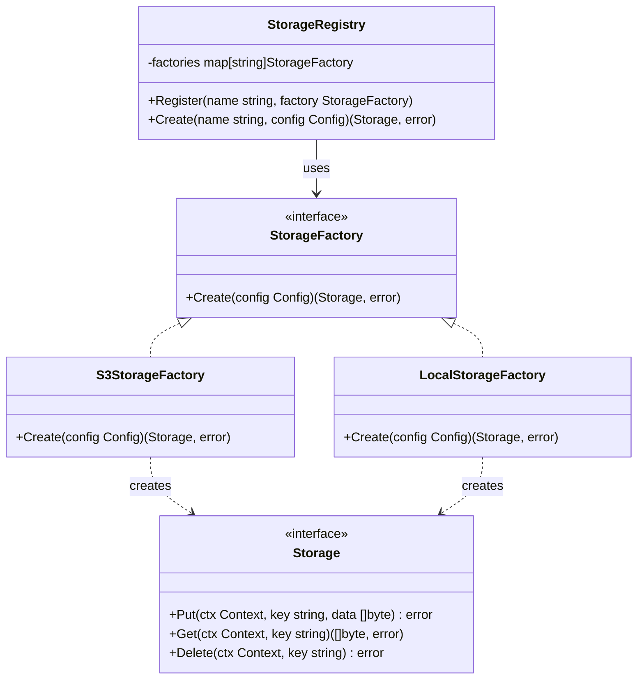

## 1. Overview

The Factory Method pattern defines an interface for creating an object but lets implementing code decide which concrete type to instantiate. The creator defers the "what to create" decision to a factory function — typically driven by configuration, environment, or user input.

The mental model: a vending machine. You press a button ("s3", "local", "gcs"). The machine decides which product to dispense. You get a `Storage` interface back. You don't know which concrete type was created, and you don't need to — you just use the interface.

In Go, the Factory Method is idiomatic: a `New...()` function that returns an interface. The `database/sql` package is the most widely used example in the entire Go ecosystem — `sql.Open("postgres", dsn)` returns a `*sql.DB` by looking up the registered driver by name. Every Kubernetes plugin, every Go CLI tool with pluggable backends, and every testing framework that needs to swap implementations uses this pattern.

---

## 2. Core Concepts (Step-by-Step)

### The Problem Without Factory Method

```go
// Without Factory Method — caller must know all concrete types
func NewStorage(config Config) *Storage {
    if config.Type == "s3" {
        return &S3Storage{bucket: config.Bucket, region: config.Region}
    } else if config.Type == "gcs" {
        return &GCSStorage{bucket: config.Bucket, project: config.Project}
    } else if config.Type == "local" {
        return &LocalStorage{path: config.Path}
    }
    panic("unknown storage type")
}
```

Every time you add a new storage backend, you edit this function. It violates the Open/Closed Principle. It creates a compilation dependency between the caller and every concrete type. It cannot be extended by external packages.

### The Solution: Factory Method + Registry



*The `StorageRegistry` maps string names to `StorageFactory` implementations. Callers call `registry.Create("s3", config)`. New backends register themselves — the registry never changes.*

---

## 3. Use Cases

### 1. `database/sql` — The Canonical Go Factory Method

Go's `database/sql.Open("postgres", dsn)` is a Factory Method. Drivers register themselves with `sql.Register("postgres", &pq.Driver{})` in an `init()` function. `sql.Open()` looks up the registered factory by name and calls it to create the driver-specific connection.

This is the plugin model: the `database/sql` package never imports `github.com/lib/pq`. The driver registers itself; `sql.Open()` calls the registered factory. The same factory registry pattern appears in Go's `image.RegisterFormat()`, `crypto.RegisterHash()`, and `log/slog` handler factories.

### 2. Plugin Architectures — Kubernetes CSI Drivers

Kubernetes uses Factory Method extensively for its storage plugin system (CSI — Container Storage Interface). Each storage vendor implements the `StoragePlugin` interface and registers their factory in the plugin registry. Kubernetes never imports the vendor's code directly — it calls the registered factory. Adding VMware storage support means creating a new plugin package, not modifying Kubernetes.

This is the key leverage of the pattern: **the framework doesn't change when new implementations are added.**

### 3. Testing Infrastructure — Swapping Real for Fake

At Stripe, services that depend on external APIs (Twilio, S3, Segment) use factory functions that return the interface:

```go
func NewNotificationClient(cfg Config) NotificationClient {
    if cfg.UseTestClient {
        return &FakeNotificationClient{} // injected in tests
    }
    return &TwilioClient{apiKey: cfg.TwilioKey}
}
```

The factory function — driven by configuration — makes the test/production swap invisible to the service code. No type checks, no build tags, no `if os.Getenv("TEST") != ""`.

---

## 4. Gotchas

### Gotcha 1: Factory That Returns a Concrete Type

```go
// WRONG: returns *S3Storage, not Storage — defeats the purpose
func NewStorage(config Config) *S3Storage {
    return &S3Storage{...}
}
```

Now callers depend on `*S3Storage` specifically. You can't swap it with `LocalStorage` in tests. You can't add a different backend without changing callers. **Factory methods must return interfaces, not concrete types.**

### Gotcha 2: The 500-Line Switch Statement Factory

A factory that started clean:

```go
func NewStorage(name string, cfg Config) (Storage, error) {
    switch name {
    case "s3":    return NewS3Storage(cfg)
    case "gcs":   return NewGCSStorage(cfg)
    case "local": return NewLocalStorage(cfg)
    }
    return nil, fmt.Errorf("unknown storage: %s", name)
}
```

Six months later: 35 cases, each with initialization complexity, validation, and nested config parsing. The factory is now the most complex function in the codebase.

**Fix**: Use a registry (as shown in Section 7). Each backend registers its own factory function. The central dispatcher is a simple map lookup — always O(1) and always small.

### Gotcha 3: Factory That Does Business Logic

A factory should only create objects — it should not validate business rules, call external services, or apply domain logic:

```go
// WRONG: factory doing business logic
func NewOrderProcessor(cfg Config) (OrderProcessor, error) {
    if cfg.MaxOrderValue > 100000 {
        // WRONG: business rule in a factory
        return nil, errors.New("max order value cannot exceed $100,000")
    }
    return &StandardOrderProcessor{maxValue: cfg.MaxOrderValue}, nil
}
```

Business validation belongs in the domain service. The factory's job is construction only.

### Gotcha 4: Factory That Leaks Concrete Types Through the Interface

```go
storage := storageFactory.Create("s3", cfg)

// This type assertion breaks the abstraction
if s3, ok := storage.(*S3Storage); ok {
    s3.SetPresignedURLExpiry(time.Hour) // S3-specific method
}
```

If callers type-assert to the concrete type, the factory's abstraction is broken. If `S3Storage`-specific behavior is needed, add it to the `Storage` interface or create a specialized `PresignedURLStorage` interface.

### Gotcha 5: Factory Init Opening Network Connections at Cold Start

```go
// DANGEROUS: this dials the network during factory creation
func NewPostgresStorageFactory() StorageFactoryFunc {
    return func(config map[string]string) (Storage, error) {
        db, err := sql.Open("postgres", config["dsn"])
        if err != nil {
            return nil, err
        }
        // Ping() dials the network — happens at factory creation time,
        // which is during Lambda cold start or pod init, before any request.
        if err := db.Ping(); err != nil {
            return nil, fmt.Errorf("factory init: failed to connect: %w", err)
        }
        return &PostgresStorage{db: db}, nil
    }
}
```

**Why this bites you in production:**

In AWS Lambda, every cold start budget matters. A factory that dials a database, fetches remote config from AWS SSM/Secrets Manager, or validates TLS certificates adds 200–800ms to every cold start. At low traffic (10 req/min), Lambda cold starts are frequent — your p99 latency spikes are entirely factory-init latency.

In Kubernetes, a pod that takes 3+ seconds to initialize (factory network calls blocking `main()`) fails readiness probes and gets killed before serving traffic. Under a traffic surge triggering rapid scale-out, you get restart loops and cascading failures across the new pods.

**The fix — lazy initialization with `sync.Once`:**

```go
type PostgresStorage struct {
    dsn  string
    once sync.Once
    db   *sql.DB
    err  error
}

// connect dials only on the first actual use, not at construction time.
func (s *PostgresStorage) connect() (*sql.DB, error) {
    s.once.Do(func() {
        db, err := sql.Open("postgres", s.dsn)
        if err != nil {
            s.err = err
            return
        }
        s.err = db.Ping()
        s.db = db
    })
    return s.db, s.err
}

func (s *PostgresStorage) Get(ctx context.Context, key string) ([]byte, error) {
    db, err := s.connect()
    if err != nil {
        return nil, fmt.Errorf("storage unavailable: %w", err)
    }
    // ... execute query using db
    return nil, nil
}

// Factory captures config only — zero network activity.
func NewPostgresStorageFactory() StorageFactoryFunc {
    return func(config map[string]string) (Storage, error) {
        return &PostgresStorage{dsn: config["dsn"]}, nil // fast — no network
    }
}
```

> 💡 **Staff-level insight:** Every network call in a factory is startup latency charged to your cold-start budget. The rule is: **factories configure, they do not connect.** Defer all network I/O to first use via `sync.Once`. This applies uniformly to database pools, Redis clients, gRPC channel setup, and remote config fetches. At Google and Amazon, this pattern is a mandatory checkpoint in service readiness reviews for any workload deployed on Lambda or Kubernetes with aggressive scale-to-zero requirements.

---

## 5. Where to Use (and Where NOT to Use)

### Use When

- Object creation requires choosing between multiple implementations based on config, environment, or user input
- You want to decouple the caller from the concrete type — callers use the interface, not the implementation
- You're building an extensible plugin system where third parties can register new implementations
- You need to swap implementations in tests without changing production code

### Do NOT Use When

- You always create the same concrete type — just use a `New...()` constructor directly
- The "factory" logic is one line — don't add indirection for its own sake
- You're trying to build a factory for 30+ types — consider whether the design needs simplification first
- Callers need to customize behavior that can't be expressed through the interface — use Builder instead

> 💡 **Staff-level insight:** The Factory Method pattern is the foundation of every plugin architecture in Go. `database/sql`, `image`, `crypto`, `net/http`'s transport layer — all use factory registration. When you design a system that should be extensible by third parties (other teams, external contributors), Factory Method with a registry is the standard answer. It gives you extension without modification. For staff-level design reviews: proposing a factory registry when the team is about to add a third switch-case in a factory function shows you're thinking about the next three years of the codebase, not just today's requirement.

---

## 6. Versus (Comparisons)

| Aspect               | Factory Method                        | Abstract Factory                                  | Constructor (New...())                |
| -------------------- | ------------------------------------- | ------------------------------------------------- | ------------------------------------- |
| Creates              | One product type                      | A family of related products                      | One specific concrete type            |
| Extensibility        | High — new factories registered       | Medium — all factories must implement all methods | Low — callers depend on concrete type |
| Configuration-driven | Yes — factory selected by name/config | Yes — factory selected by environment             | No — hardcoded at call site           |
| Go idiom             | Factory function returning interface  | Interface with multiple Create methods            | `NewFoo() *Foo` pattern               |
| When to use          | Pluggable single product type         | Compatible product families                       | Fixed, non-swappable types            |

**Choose Factory Method when** you need to create one type of product with multiple potential implementations, selected at runtime.

**Choose Abstract Factory when** you need to create a family of related objects that must be mutually compatible (e.g., `PostgresFactory` creates a `PostgresConnection`, `PostgresMigrator`, and `PostgresHealthChecker` that all work together).

---

## 7. Code Examples

```go
package factory

import (
	"context"
	"fmt"
	"sync"
)

// --- Product interface ---

type Storage interface {
	Put(ctx context.Context, key string, data []byte) error
	Get(ctx context.Context, key string) ([]byte, error)
	Delete(ctx context.Context, key string) error
}

// --- Factory function type ---

type StorageFactoryFunc func(config map[string]string) (Storage, error)

// --- Registry: maps names to factory functions ---

type StorageRegistry struct {
	mu        sync.RWMutex
	factories map[string]StorageFactoryFunc
}

func NewStorageRegistry() *StorageRegistry {
	return &StorageRegistry{factories: make(map[string]StorageFactoryFunc)}
}

func (r *StorageRegistry) Register(name string, factory StorageFactoryFunc) {
	r.mu.Lock()
	defer r.mu.Unlock()
	r.factories[name] = factory
}

func (r *StorageRegistry) Create(name string, config map[string]string) (Storage, error) {
	r.mu.RLock()
	factory, ok := r.factories[name]
	r.mu.RUnlock()
	if !ok {
		return nil, fmt.Errorf("unknown storage type: %q (registered: %v)", name, r.registeredNames())
	}
	return factory(config)
}

func (r *StorageRegistry) registeredNames() []string {
	r.mu.RLock()
	defer r.mu.RUnlock()
	names := make([]string, 0, len(r.factories))
	for name := range r.factories {
		names = append(names, name)
	}
	return names
}

// --- Concrete implementations ---

type LocalStorage struct {
	mu       sync.RWMutex
	basePath string
	store    map[string][]byte
}

func (s *LocalStorage) Put(_ context.Context, key string, data []byte) error {
	s.mu.Lock()
	defer s.mu.Unlock()
	s.store[key] = data
	return nil
}

func (s *LocalStorage) Get(_ context.Context, key string) ([]byte, error) {
	s.mu.RLock()
	defer s.mu.RUnlock()
	d, ok := s.store[key]
	if !ok {
		return nil, fmt.Errorf("key not found: %s", key)
	}
	return d, nil
}

func (s *LocalStorage) Delete(_ context.Context, key string) error {
	s.mu.Lock()
	defer s.mu.Unlock()
	delete(s.store, key)
	return nil
}

// NewLocalStorageFactory returns the factory function for local storage.
// Register it in an init() function or explicitly at startup.
func NewLocalStorageFactory() StorageFactoryFunc {
	return func(config map[string]string) (Storage, error) {
		path, ok := config["path"]
		if !ok {
			return nil, fmt.Errorf("local storage requires 'path' config key")
		}
		return &LocalStorage{basePath: path, store: make(map[string][]byte)}, nil
	}
}

// --- Registration and usage ---

func BuildRegistry() *StorageRegistry {
	registry := NewStorageRegistry()
	registry.Register("local", NewLocalStorageFactory())
	// registry.Register("s3", s3.NewStorageFactory())  // registered by s3 package
	// registry.Register("gcs", gcs.NewStorageFactory()) // registered by gcs package
	return registry
}
```

*The registry never changes when a new backend is added. New backends call `registry.Register()` from their own package — following the same pattern as `database/sql.Register()`.*

---

## 8. Scale Discussion

**10x load**: Factory methods are called once per object creation — typically at startup or per-request initialization. The factory itself has no scalability concern.

**100x load**: The registry's `sync.RWMutex` allows concurrent reads with minimal contention. If registrations only happen at startup (before requests begin), the read path is contention-free after initialization. Consider using a read-only map (no mutex needed) if registrations are truly one-time at startup.

**1000x load**: At 1M RPS, factory registration is a startup-time event, not a runtime event. The factory-created objects (Storage, DB pools, etc.) are what scale — the factory's performance is irrelevant at runtime. The key concern is factory initialization time: if creating a factory object opens network connections or fetches remote config, this slows startup and cold-start time (relevant for AWS Lambda and Kubernetes pod scale-out).

---

## 9. Monitoring & Observability

| Metric                                                  | Type      | Alert Condition                                               |
| ------------------------------------------------------- | --------- | ------------------------------------------------------------- |
| `factory.create.duration_ms` (labeled by factory type)  | Histogram | p99 > 1000ms (slow factory init — impacts startup time)       |
| `factory.create.errors.total` (labeled by factory type) | Counter   | Any value > 0 (factory initialization failures)               |
| `factory.registry.unknown_type.total`                   | Counter   | Any value > 0 (unknown factory type requested — config error) |
| `factory.instance.count` (labeled by type)              | Gauge     | Unexpected growth (factory creating too many instances)       |

---

## 10. Interview Questions

### Q1: "Explain the Factory Method pattern. How does Go's `database/sql` package implement it?"

**Key points to cover:**
- Factory Method: define an interface for creating an object, defer the concrete type decision to a factory function
- `sql.Register("postgres", driver)` — registers a named factory
- `sql.Open("postgres", dsn)` — calls the registered factory, returns `*sql.DB`
- The `database/sql` package never imports the driver directly — drivers register themselves in `init()`
- This is the plugin architecture model: extensible without modifying the framework

**Common mistake:** Saying that `sql.Open()` creates the database connection. It does not — it calls the registered driver's factory to construct a `*sql.DB` (a lazy connection pool wrapper). No network dial happens at `sql.Open()`. The actual connection is established on the first `db.Ping()` or `db.Query()`. Conflating "opens a connection" with "calls the registered factory" signals that the candidate has used `database/sql` but never read past the surface.

**What the interviewer is looking for:** Real-world pattern recognition — connecting a classic GoF pattern to production Go code you use every day. Bonus signal: explaining that `database/sql` never imports driver packages directly (zero compile-time coupling), and that blank imports (`_ "github.com/lib/pq"`) trigger the driver's `init()` self-registration. That's the plugin architecture insight.

---

### Q2: "You have a storage factory with 3 implementations today. How do you design it so adding a 4th implementation requires zero changes to existing code?"

**Key points to cover:**
- Define a `Storage` interface and a `StorageFactoryFunc` type
- Use a registry: `Register(name string, factory StorageFactoryFunc)`
- New implementations call `Register()` — no changes to the registry, no changes to callers
- This is the Open/Closed Principle: open for extension (new registrations), closed for modification (registry never changes)
- Model after `database/sql.Register()` — well-known, production-proven

**Common mistake:** Describing the registry implementation correctly but never naming the principle it embodies. Saying "I'll use a map of factory functions" is mechanically right but shows pattern-matching skill, not design vocabulary. Interviewers at staff level listen for the name of the principle.

**What the interviewer is looking for:** Explicit articulation of the Open/Closed Principle — the "O" in SOLID. The clearest answer names it directly: *"The registry is open for extension — new implementations register themselves — and closed for modification — the dispatch logic in `Create()` never changes."* Closing with *"this is the same model `database/sql` uses"* connects the theory to production-proven Go design and earns strong positive signal.

---

### Q4: "A colleague's code calls a factory, gets back a `Storage` interface, then immediately type-asserts to `*S3Storage` to call `SetPresignedURLExpiry()`. What's wrong, and how do you fix it?"

**Key points to cover:**
- The type assertion breaks the factory abstraction: the caller now depends on the concrete type, defeating the purpose of returning an interface
- This is the top code-review failure mode for the factory pattern — the abstraction was added in form but not in function
- Three correct fixes, in order of preference:
  1. **Extend the interface**: if presigned URL behavior is general to all storage backends, add a `PresignedURLStorage` sub-interface that embeds `Storage` and adds `SetPresignedURLExpiry(d time.Duration)`; check for it with an interface assertion, not a type assertion — `if p, ok := storage.(PresignedURLStorage); ok { ... }`
  2. **Inject config at construction**: pass the expiry duration as a factory config key — `config["presigned_url_expiry"] = "1h"` — so the S3 factory sets it at creation time and callers never need post-construction mutation
  3. **Return a richer type from the S3 factory directly**: the S3 factory function returns an `S3Storage` interface (which embeds `Storage` and adds the presigned method) so callers that know they need S3-specific behavior get the right interface from the factory itself
- The worst non-fix: wrapping the type assertion in a helper function — the coupling is still there, just hidden

**Common mistake:** Proposing an `ok` guard on the type assertion as the fix: `if s3, ok := storage.(*S3Storage); ok { ... }`. The `ok` check prevents a panic but does not fix the design problem — the caller is still coupled to `*S3Storage`. If `LocalStorage` is ever returned by the same factory, the presigned expiry is silently skipped with no error, which is arguably worse than a panic.

**What the interviewer is looking for:** Interface design judgment. The interviewer is testing whether you understand the factory's core purpose — making callers independent of concrete types — and whether you can identify that any type assertion through a factory-returned interface is a design smell requiring a redesign, not a patch. Staff-level answer: redesign the interface to express the capability, don't route around the coupling.

---

### Q3: "What mistakes do engineers typically make when implementing a factory in Go?"

**Key points to cover:**
1. Returning a concrete type (`*S3Storage`) instead of the interface (`Storage`) — callers couple to the concrete type
2. Factory methods growing to 500 lines of switch-case logic — use a registry instead
3. Doing business logic in the factory — factories create, services validate and apply rules
4. Not handling factory initialization errors properly — factory errors often silently return nil, causing nil pointer dereferences later
5. Not registering the factory before calling it — `init()` ordering issues in packages with circular dependencies

---

## 11. Staff-Level Preparation Tips

1. **Read `database/sql.Register()` and `sql.Open()` source** — trace a call from `db.Query()` to the `pq.Driver.Open()` implementation. Understand how the factory registry, the driver interface, and the connection pool interact. This is production-grade Go factory design.

2. **Build a plugin registry from scratch** — implement a `Register()` / `Create()` pattern for a real use case in your codebase (storage backends, notification channels, analytics sinks). This exercise forces you to design error handling, registration ordering, and test doubles.

3. **Add `init()`-based self-registration** — implement a backend that registers itself in `init()`, like `database/sql` drivers do. Understand the blank import pattern (`_ "github.com/lib/pq"`) and its implications for build-time dependency resolution.

4. **Compare with Abstract Factory** — implement both patterns for the same use case (database infrastructure). See concretely how Factory Method creates one product, while Abstract Factory creates a compatible family. The hands-on difference clarifies the distinction better than any article.

5. **Design for testability at the factory level** — create a `TestStorageFactory` that returns an in-memory `LocalStorage`. Register it in test files. Show how this pattern enables unit tests that don't touch real infrastructure — zero network calls, deterministic behavior, fast.

---

## 12. References

- [Go database/sql — Register and Open](https://pkg.go.dev/database/sql#Register)
- [Go lib/pq — PostgreSQL driver factory](https://pkg.go.dev/github.com/lib/pq)
- [Go image package — RegisterFormat (factory registry)](https://pkg.go.dev/image#RegisterFormat)
- [Kubernetes — CSI Plugin Architecture](https://kubernetes.io/docs/concepts/storage/volumes/#csi)
- [Design Patterns: Elements of Reusable Object-Oriented Software (GoF)](https://www.oreilly.com/library/view/design-patterns-elements/0201633612/)
- [Refactoring.guru — Factory Method](https://refactoring.guru/design-patterns/factory-method)
- [Dave Cheney — Practical Go](https://dave.cheney.net/practical-go/presentations/qcon-china.html)
