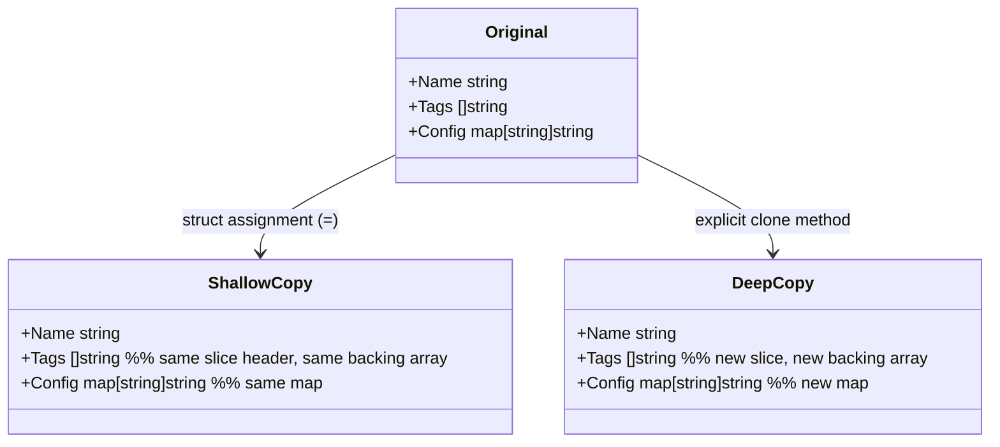

## 1. Overview

Creating objects from scratch is expensive when the initialization involves: reading a config file, making network calls, loading templates, or computing a complex default state. If you need 1,000 instances of the same base configuration, creating each one from scratch means 1,000 identical expensive initializations.

The **Prototype pattern** solves this by creating new objects by cloning an existing instance — the "prototype." You create the expensive object once, then clone it as many times as you need. Cloning is almost always cheaper than initialization.

Beyond performance, Prototype is also useful when you want to create variations of a known-good base state: clone the base configuration and apply environment-specific overrides.

Mental model: **Prototype is copy-paste for objects.** You have a working original. You copy it. You make changes to the copy. The original is untouched.

The subtlety — and where most bugs live — is in the difference between **shallow copy** and **deep copy**:
- **Shallow copy**: copy the struct fields by value, but reference types (slices, maps, pointers) still point to the original's data
- **Deep copy**: recursively copy everything, so the clone is completely independent of the original

Go's struct assignment is a shallow copy by default. This is the source of most Prototype bugs.

---

## 2. Core Concepts

### Shallow vs Deep Copy



*Shallow copy: value types (string, int, bool) are independent. Reference types (slices, maps, pointers) share the backing storage. Mutation in the copy affects the original.*

### The Bug in Shallow Copy

```go
type Config struct {
    Name string
    Tags []string
}

original := Config{Name: "base", Tags: []string{"prod", "us-east-1"}}
clone := original // shallow copy — Tags slice header is copied, but backing array is shared

clone.Tags = append(clone.Tags, "eu-west-1") // may modify original.Tags if capacity allows
clone.Name = "clone"                          // safe — strings are immutable in Go

fmt.Println(original.Tags) // might now include "eu-west-1" depending on slice capacity
```

*This is the Prototype gotcha. String assignment is safe. Slice mutation is not — unless you explicitly copy the backing array.*

---

## 3. Use Cases

### Kubernetes Manifest Cloning

Kubernetes operators create many Pods from a base PodSpec — the PodSpec is the prototype. The operator clones it, then applies per-replica modifications (name suffix, node affinity, environment-specific variables). Without Prototype-style cloning, every Pod's spec would need to be constructed from zero.

### Configuration Templates

A service with multiple deployment environments (dev, staging, prod) shares 90% of its configuration. The base config is the prototype. Each environment clones it and overrides the 10% that differs. The alternative — maintaining three separate full config files — creates drift and maintenance burden.

### Load Testing Client Setup

Load testing tools create one HTTP client with all the right settings (timeouts, TLS config, connection pool), then clone it for each worker goroutine. Initialization (TLS handshake, connection establishment) happens once; the cloned clients share the base settings.

---

## 4. Gotchas

### Gotcha 1 — Shallow Copy Sharing Mutable State

The most common Prototype bug. Any field that is a pointer, slice, or map is shared between original and clone after a shallow copy. Appending to the clone's slice, deleting from the clone's map, or modifying via a pointer — all of these affect the original.

**Rule**: Always implement an explicit `Clone()` method that deep copies every reference-type field. Never rely on raw struct assignment for Prototype usage.

```go
// BAD: tags is shared
clone := *original

// GOOD: explicit deep copy
func (c *Config) Clone() *Config {
    tags := make([]string, len(c.Tags))
    copy(tags, c.Tags)
    env := make(map[string]string, len(c.Env))
    for k, v := range c.Env {
        env[k] = v
    }
    return &Config{Name: c.Name, Tags: tags, Env: env}
}
```

### Gotcha 2 — Unexported Fields Are Not Cloned via Reflection

JSON marshal/unmarshal (a common shortcut for deep copy) only copies exported fields. If your struct has unexported fields that carry state, the clone will be missing them — silently.

```go
type Config struct {
    Name    string
    mu      sync.Mutex // unexported — NOT copied via JSON
}

// JSON clone misses mu state — which is fine for Mutex (you want a fresh one),
// but problematic for unexported fields that are meaningful state.
```

### Gotcha 3 — JSON Deep Copy Is Slow for High-Frequency Cloning

JSON marshal + unmarshal is an easy way to deep copy any JSON-serializable struct. But it's slow: memory allocation, reflection, encoding/decoding overhead. For objects cloned once or occasionally, it's fine. For objects cloned in a hot path (per-request, per-message), the allocation pressure is measurable.

Benchmarks: for a mid-size struct at 100k/second, JSON copy allocates ~500 bytes per call = 50MB/sec of allocation pressure. Explicit field-by-field copy allocates only the fields you copy.

### Gotcha 4 — Forgetting That Interface Values and Function Pointers Are Shallow

An interface value in Go is a (type, value) pair. Copying an interface copies the pair but still points to the same underlying value. A function field in a struct is a reference — cloning the struct doesn't clone the function's captured closure state.

For structs containing interfaces or functions as fields, document whether the clone shares the implementation with the original or requires a fresh implementation.

---

## 5. Where to Use (and Where NOT to Use)

### Use When

- Object initialization is expensive (network calls, file I/O, complex computation) and you need many similar instances
- You need isolated copies for mutation without affecting the original (configuration override pattern)
- The base object is a "template" or "default" that many derived objects start from

### Do NOT Use When

- Object creation is cheap — Prototype adds complexity for no benefit when `New...()` is fast
- The object has significant unexported state that can't be copied — your clone will be incomplete
- You need true independence but have deeply nested reference types — the deep copy implementation becomes complex and error-prone

> 💡 **Staff-level insight:** In Go, you almost never need to formally "implement the Prototype pattern." Go's struct copy semantics, `copy()` for slices, and explicit map copying give you prototype functionality naturally. The important thing to know is when *not* to use shallow copy — and that's a Go fundamentals question, not a pattern question. The reason Prototype is in the GoF catalog is that languages like Java require explicit `clone()` interface implementation. In Go, you just write a `Clone()` method and it's done.

---

## 6. Versus (Comparisons)

| Dimension               | Prototype                               | Builder                        |
| ----------------------- | --------------------------------------- | ------------------------------ |
| **Starting point**      | Clones an existing object               | Constructs from scratch        |
| **Base configuration**  | The prototype IS the base               | Builder's default values       |
| **Variation mechanism** | Clone then override                     | Set fields before Build()      |
| **Validation**          | Applied to the clone after modification | Applied at Build() time        |
| **Right for**           | When base is expensive to create        | When creation logic is complex |

> **Choose Prototype** when the base object is expensive to create and you need many similar variations.
> **Choose Builder** when you need validation across fields during construction from scratch.

---

## 7. Code Examples

```go
package prototype

import (
    "encoding/json"
    "fmt"
)

// ServiceConfig is a complex configuration struct that is expensive to initialize.
// In production it would be loaded from Vault, a config service, or a YAML file.
type ServiceConfig struct {
    Name        string
    Region      string
    Tags        []string          // reference type — must be explicitly copied
    Env         map[string]string // reference type — must be explicitly copied
    MaxConns    int
    TimeoutMs   int
    TLSEnabled  bool
}

// Clone returns a deep copy of ServiceConfig.
// Safe to modify the returned config without affecting the original.
func (c *ServiceConfig) Clone() *ServiceConfig {
    // Copy value types by struct embedding
    clone := *c // copies Name, Region, MaxConns, TimeoutMs, TLSEnabled (value types)

    // Deep copy the slice — without this, appending to clone.Tags may modify original
    clone.Tags = make([]string, len(c.Tags))
    copy(clone.Tags, c.Tags)

    // Deep copy the map — without this, mutations to clone.Env modify original
    clone.Env = make(map[string]string, len(c.Env))
    for k, v := range c.Env {
        clone.Env[k] = v
    }

    return &clone
}

// DeepCopyViaJSON is a convenient but slower alternative.
// Works for any JSON-serializable struct. Does NOT copy unexported fields.
// Use for occasional copies (config load). Avoid in hot paths.
func DeepCopyViaJSON[T any](src *T) (*T, error) {
    data, err := json.Marshal(src)
    if err != nil {
        return nil, fmt.Errorf("marshal: %w", err)
    }
    var dst T
    if err := json.Unmarshal(data, &dst); err != nil {
        return nil, fmt.Errorf("unmarshal: %w", err)
    }
    return &dst, nil
}

// Example: base prototype used across multiple environments
func ExamplePrototype() {
    // Create the expensive base once
    base := &ServiceConfig{
        Name:       "payment-service",
        Region:     "us-east-1",
        Tags:       []string{"service:payment", "team:platform"},
        Env:        map[string]string{"LOG_LEVEL": "info", "DB_POOL": "10"},
        MaxConns:   100,
        TimeoutMs:  3000,
        TLSEnabled: true,
    }

    // Clone for staging — only change what differs
    staging := base.Clone()
    staging.Name = "payment-service-staging"
    staging.Env["LOG_LEVEL"] = "debug"
    staging.Tags = append(staging.Tags, "env:staging") // does NOT modify base.Tags

    // Clone for prod EU — different region
    prodEU := base.Clone()
    prodEU.Region = "eu-west-1"
    prodEU.Tags = append(prodEU.Tags, "region:eu")

    // base.Tags is still ["service:payment", "team:platform"]
    fmt.Println("base tags:", base.Tags)
    fmt.Println("staging tags:", staging.Tags)
    fmt.Println("prodEU tags:", prodEU.Tags)
}
```

---

## 8. Scale Discussion

### 10x Load

At 10x request volume, if you're cloning configuration per request, measure the allocation cost. For a 500-byte struct, 10,000 clones/second = 5MB/second of allocation. This is measurable but rarely the bottleneck.

### 100x Load

At high request volume, per-request cloning should be reconsidered. The common pattern at scale: clone configurations at startup (once per environment, not once per request). Use `sync.Pool` to reuse temporary clone buffers if you must clone in the hot path.

### 1000x Load

At extreme scale, prototypes live in a factory or registry that pre-creates N copies. Workers pull from the pool rather than cloning. `sync.Pool` is the Go standard library's answer to this — it allows re-use of allocated objects across goroutines with GC-aware pooling.

---

## 9. Monitoring & Observability

| Metric                   | Type      | Alert Condition                                      |
| ------------------------ | --------- | ---------------------------------------------------- |
| `clone_duration_seconds` | Histogram | Alert if p99 > 1ms in hot paths                      |
| `heap_alloc_bytes`       | Gauge     | Watch for growth from frequent cloning               |
| `gc_pause_seconds`       | Histogram | Alert if GC pause > 10ms (clone allocation pressure) |

*Most of the time, Prototype doesn't need its own metrics. If cloning is in a hot path and you see GC pressure, that's the signal to optimize or switch to `sync.Pool`.*

---

## 10. Interview Questions

**Q1: "What's the difference between a shallow copy and a deep copy in Go?"**

Key points: struct assignment (`b := a`) copies value types (int, string, bool, arrays with fixed size) by value; reference types (slices, maps, channels, pointers, interfaces) are copied as references — both variables share the same underlying data. Deep copy requires explicit allocation and copying of each reference-type field.

Common mistake: Thinking `string` requires special deep copy handling. Strings in Go are immutable — a copied string field is always independent.

---

**Q2: "When would you use the Prototype pattern in production Go code?"**

Key points: When object initialization is expensive (config from Vault, credentials from AWS Secrets Manager, TLS configuration); when you need many similar objects with small variations; for configuration templates across environments. In Go, this is just "write a `Clone()` method" — it's idiomatic rather than a ceremony.

Common mistake: Implementing JSON-based deep copy in a 100k RPS hot path and wondering why GC is under pressure.

---

**Q3: "A colleague's code is producing unexpected behavior: modifying a config in one goroutine is affecting the config used by another goroutine, even though they received separate config structs. What's likely wrong?"**

Key points: Almost certainly a shallow copy issue. The configs were copied with struct assignment rather than a proper deep copy. The slice or map field both goroutines are modifying points to the same backing memory. Fix: add a `Clone()` method with explicit deep copying of reference-type fields. Add a race detector run (`go test -race`) to catch this in tests.

Interviewer wants: Immediate recognition of shared-memory aliasing and the Go-specific mechanics of value vs reference semantics.

---

## 11. Staff-Level Preparation Tips

### What to Build

Write a benchmark in Go that compares: (1) construction from scratch, (2) shallow struct copy, (3) explicit deep copy via `Clone()`, (4) JSON marshal/unmarshal deep copy. Run it with `go test -bench -benchmem`. The allocation numbers will make the trade-offs concrete and give you real data to quote.

### What to Study Deeper

- **Go specification — Assignability**: https://go.dev/ref/spec#Assignability — formally defines what struct assignment copies
- **Go `sync.Pool`**: https://pkg.go.dev/sync#Pool — the Go standard library's answer to frequent object cloning in hot paths
- **"100 Go Mistakes and How to Avoid Them"** — Teiva Harsanyi. Chapter on slices and maps covers the shallow copy pitfalls in depth.

### How This Connects to Broader System Design

Prototype is primarily a tactical code-level pattern. At the system design level, the equivalent concept is **configuration templating**: base configs promoted to environments with overrides. Tools like Helm (Kubernetes), Terraform modules, and AWS CloudFormation templates are Prototype at the infrastructure level — a base template, cloned and parameterized per environment.

---

## 12. References

- **"Design Patterns: Elements of Reusable Object-Oriented Software"** — Gamma et al. (GoF). [Pearson](https://www.pearson.com/en-us/subject-catalog/p/design-patterns-elements-of-reusable-object-oriented-software/P200000009480)
- **Go Blog — "Arrays, slices (and strings): The mechanics of 'append'"**: https://go.dev/blog/slices-intro
- **"100 Go Mistakes"** — Teiva Harsanyi: https://100go.co
- **Go `sync.Pool` documentation**: https://pkg.go.dev/sync#Pool
