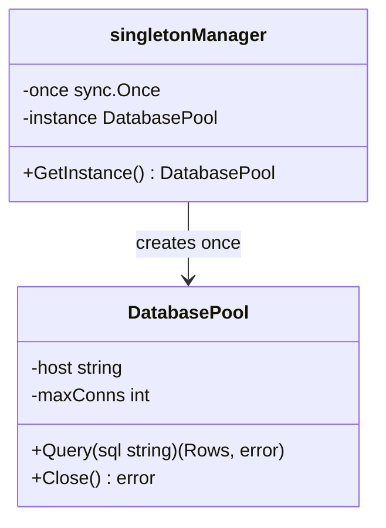

## 1. Overview

The Singleton pattern ensures that a class has only one instance and provides a global point of access to it. It sounds simple. It is simple in theory and dangerous in practice. The Singleton is the most misused GoF pattern — and in Go, where testing with parallelism is a first-class concern, global mutable state (which most Singletons are) is a first-class problem.

The mental model: the electrical grid. There's one power grid for a city. Every house taps into it through the same connection. You don't create a new power grid for each house. That single, shared resource — one instance, globally accessible — is a Singleton.

In Go, the Singleton is implemented with `sync.Once`. Everything else is a data race waiting to happen. You'll use Singletons for three legitimate things: database connection pools, config loaders, and logger initialization. For everything else, prefer dependency injection.

---

## 2. Core Concepts (Step-by-Step)

### The Problem Without Proper Synchronization

The naive implementation has a data race:

```go
var instance *DB

// UNSAFE: two goroutines can both see instance == nil, both initialize
func GetDB() *DB {
    if instance == nil {
        instance = &DB{conn: openConnection()}
    }
    return instance
}
```

Run this with `go test -race` and it will flag the race immediately.

### The Double-Checked Locking Trap

Java developers sometimes port the double-checked locking pattern to Go:

```go
var mu sync.Mutex
var instance *DB

// STILL UNSAFE in Go without memory barriers
func GetDB() *DB {
    if instance == nil {      // first check (no lock)
        mu.Lock()
        if instance == nil {  // second check (with lock)
            instance = &DB{}
        }
        mu.Unlock()
    }
    return instance
}
```

This is technically safe in Go (Go's memory model with `sync.Mutex` provides the required barriers), but it's verbose and there's a better way.

### The Correct Go Implementation: sync.Once



*`sync.Once.Do()` guarantees the initialization function runs exactly once, regardless of how many goroutines call it concurrently. This is the only correct Singleton implementation in Go.*

---

## 3. Use Cases

### 1. Database Connection Pool

A database connection pool is the canonical Singleton use case. Opening a new TCP connection to Postgres for every request would take 50–100ms and exhaust the server's file descriptor limit in seconds. The pool — created once, shared across all goroutines — amortizes the connection cost and enforces limits.

At companies like Stripe, the database pool is initialized in `main()` and injected via dependency injection into services — a hybrid approach: Singleton construction at the boundary, DI everywhere else.

### 2. Config Loader (Loaded Once at Startup)

Configuration loaded from environment variables, a config file, or AWS SSM Parameter Store should be loaded once at startup. Every call to `GetConfig()` after that returns the same, immutable struct. Netflix's configuration library (Archaius) follows this model — config is loaded once, updated through a background refresh goroutine, and the `Get*()` methods are read-only.

### 3. Global Logger (zerolog, zap)

Uber's `zap` logger and `zerolog` are both typically initialized once at startup and accessed globally. The logger is a Singleton: `logger := zap.L()` returns the global logger registered with `zap.ReplaceGlobals()`. This is a safe Singleton because the logger is immutable after initialization — reads are lock-free.

---

## 4. Gotchas

### Gotcha 1: The Data Race Without sync.Once

Any initialization pattern that isn't `sync.Once` or a `sync.Mutex`-protected write has a potential data race. The race detector will catch it:

```bash
go test -race ./...
# DATA RACE: Read at 0x00c000118000 by goroutine 8
# Previous write at 0x00c000118000 by goroutine 7
```

**Fix**: Always use `sync.Once`. No exceptions. The initialization overhead is nanoseconds. The production incident from a data race can be hours.

### Gotcha 2: Singleton Hiding a Connection Pool That Silently Exhausts

```go
var db = mustInitDB() // global DB singleton

func HandleRequest(w http.ResponseWriter, r *http.Request) {
    // db.Query() blocks waiting for a connection from the pool
    // If the pool is exhausted, every request blocks here — invisible in traces
    rows, _ := db.Query("SELECT ...")
}
```

If `maxOpenConns` is not set (the default in `database/sql` is unlimited), the pool can open so many connections that Postgres rejections spike. If it's set too low, requests queue silently.

**Fix**: Always configure `db.SetMaxOpenConns()`, `db.SetMaxIdleConns()`, and `db.SetConnMaxLifetime()`. Monitor `sql_open_connections`, `sql_in_use_connections`, and `sql_wait_duration`.

### Gotcha 3: Testing Difficulty — Global State Poisons Parallel Tests

```go
var globalCache = newCache() // Singleton

func TestOrderFlow(t *testing.T) {
    globalCache.Set("user:123", testUser)
    // Another test running in parallel also modifies globalCache
    // Result: flaky tests, order-dependent test failures
}
```

`go test -parallel` makes global state failures more likely, not less. This is why Go test files often fail when run with `-count=2` but pass with `-count=1`.

**Fix**: Never rely on global state in tests. Inject the dependency. `TestOrderFlow(t *testing.T)` should accept a `cache Cache` parameter, or the function under test should accept a `Cache` interface.

### Gotcha 4: Lock Contention at High RPS on Mutable Singletons

A Singleton struct with a mutex that protects mutable state becomes a global bottleneck at high RPS:

```go
var registry = &MetricsRegistry{mu: sync.Mutex{}, counters: map[string]int64{}}

func IncrementCounter(name string) {
    registry.mu.Lock()  // every request acquires this lock
    registry.counters[name]++
    registry.mu.Unlock()
}
```

At 100k RPS all hitting `IncrementCounter()`, the single mutex serializes all operations. This is a throughput cliff.

**Fix**: Use lock-free atomic operations (`sync/atomic`), sharded maps, or a library like `prometheus/client_golang` that uses per-counter atomics.

### Gotcha 5: The `-count=2` Test Reveals Hidden Singleton Coupling

`go test -count=2` runs every test function **twice inside the same process**. This is the most revealing test for Singleton bugs because `sync.Once` guarantees the initializer runs exactly once — across *both* runs. Global state accumulated in the first pass carries silently into the second pass.

```go
var cache = newInMemoryCache() // Singleton — initialized once at package load

func TestUserLookup(t *testing.T) {
    cache.Set("user:1", "alice")
    name, _ := cache.Get("user:1")
    assert.Equal(t, "alice", name)
    // First run: passes — cache is empty, "alice" is set and retrieved correctly
    // Second run (-count=2): cache STILL has "user:1" from the first run
    // If the test asserts on cache size, calls Delete, or checks "not found" — it breaks
}
```

The failure modes `-count=2` exposes:

- **Corrupted initial state**: the Singleton holds data from run 1 when run 2 starts — tests that assume an empty state silently fail
- **Silent skips**: initialization that was expected to fire again does nothing (`sync.Once` already fired)
- **Assertion drift**: state-dependent assertions pass on run 1 and produce wrong results on run 2, which appears as a flaky test rather than a Singleton bug

**The false fix**: Adding a `TestMain` that resets state via `init()` logic won't work. `init()` runs once at program startup — `-count=2` does not re-invoke it between iterations.

**The real fix**: Inject the dependency. Each test constructs a fresh instance. `sync.Once` is correct for process-global infrastructure (DB pool, logger) — not for anything a test needs to control.

> 💡 **Staff-level insight:** `-count=2` is the cheapest test you can add to CI that will surface hidden Singleton coupling. Make `go test -race -count=2 -parallel=4 ./...` a permanent gate. If it passes, your tests are stateless between runs. If it fails and you've never run it before, expect to find several Singletons that nobody knew were shared.

---

## 5. Where to Use (and Where NOT to Use)

### Use When (The Short List)

- Database connection pool initialized once at startup
- Config loaded once at startup, read-only after that
- Global logger initialized once at startup
- Metrics registry shared across the process (use a library like Prometheus that handles this correctly)

### Do NOT Use When (The Long List)

- Any state that needs to differ between tests — use DI instead
- Any state that changes after initialization — use DI with a mutable struct instead
- Business services (`UserService`, `OrderService`, etc.) — these should be injected, not global
- Feature flags, A/B test state — needs per-request context, not global
- Caches with expiry — stateful, needs injection for testability

> 💡 **Staff-level insight:** The right rule at staff level is: **Singleton for infrastructure bootstrapping only. Dependency injection for everything else.** In production Go code at Google, Stripe, and Uber, you'll find `sync.Once`-based Singletons in `main.go` or `cmd/server/main.go` — exactly one place — creating database pools, loading configs, and initializing loggers. Those instances are then passed as constructor arguments to every service. There is no `GetDB()` function in the service code. This pattern combines the legitimate use of Singleton (you do need one connection pool) with the testability of DI (you can inject a mock DB in tests). It's not one or the other.

---

## 6. Versus (Comparisons)

| Aspect                   | Singleton                              | Dependency Injection                | Global Variable           |
| ------------------------ | -------------------------------------- | ----------------------------------- | ------------------------- |
| Initialization guarantee | Once via sync.Once                     | Framework or constructor            | None                      |
| Testability              | Poor — global state contaminates tests | Excellent — inject mocks            | Very poor                 |
| Hidden coupling          | Yes — callers import the package       | No — explicit constructor arguments | Yes                       |
| Concurrency safety       | Safe with sync.Once                    | Depends on injected type            | Unsafe without protection |
| Swappable in tests       | No                                     | Yes                                 | No                        |
| Appropriate for          | Infra bootstrapping (DB pool, logger)  | All business services               | Never in production code  |

**Choose Singleton when** you have a process-global resource that must only be created once (connection pool, logger, config) and it is initialized in `main()`, not in service code.

**Choose DI when** the dependency is needed by a service — pass it as a constructor argument. Every service is testable in isolation.

---

## 7. Code Examples

```go
package singleton

import (
	"database/sql"
	"fmt"
	"sync"

	_ "github.com/lib/pq"
)

// --- Safe Singleton using sync.Once ---

type DatabasePool struct {
	db *sql.DB
}

func (p *DatabasePool) Query(query string, args ...any) (*sql.Rows, error) {
	return p.db.Query(query, args...)
}

var (
	dbOnce     sync.Once
	dbInstance *DatabasePool
	dbInitErr  error
)

// GetDatabasePool returns the single database pool instance.
// Safe for concurrent use. Panics if initialization failed.
// NOTE: Call this only in infrastructure code (main.go, server setup).
// In service code, inject *DatabasePool as a constructor argument.
func GetDatabasePool(dsn string) (*DatabasePool, error) {
	dbOnce.Do(func() {
		db, err := sql.Open("postgres", dsn)
		if err != nil {
			dbInitErr = fmt.Errorf("open database: %w", err)
			return
		}
		db.SetMaxOpenConns(25)
		db.SetMaxIdleConns(5)
		dbInstance = &DatabasePool{db: db}
	})
	return dbInstance, dbInitErr
}

// --- The DI alternative: how to use the pool correctly ---

// UserService demonstrates correct usage: pool is injected, not called globally.
type UserService struct {
	db *DatabasePool
}

// NewUserService is called once from main.go with the initialized pool.
// In tests, inject a mock or a test database pool.
func NewUserService(db *DatabasePool) *UserService {
	return &UserService{db: db}
}

func (s *UserService) GetUserName(id string) (string, error) {
	rows, err := s.db.Query("SELECT name FROM users WHERE id = $1", id)
	if err != nil {
		return "", fmt.Errorf("GetUserName query: %w", err)
	}
	defer rows.Close()
	if rows.Next() {
		var name string
		if err := rows.Scan(&name); err != nil {
			return "", err
		}
		return name, nil
	}
	return "", fmt.Errorf("user %s not found", id)
}

// --- main.go pattern: Singleton at the boundary ---
//
// func main() {
//     pool, err := singleton.GetDatabasePool(os.Getenv("DATABASE_URL"))
//     if err != nil { log.Fatal(err) }
//
//     userSvc := singleton.NewUserService(pool)       // DI from here on
//     orderSvc := order.NewOrderService(userSvc, ...)  // DI all the way down
//     server.Run(userSvc, orderSvc, ...)
// }
```

*The Singleton (`GetDatabasePool`) lives at the infrastructure boundary. All service code uses DI. This is the only production-safe pattern.*

---

## 8. Scale Discussion

**10x load (10k RPS)**: `sync.Once` adds zero overhead after the first call — it's a boolean check and a memory load. The Singleton itself (the connection pool, logger) is the throughput concern, not the pattern.

**100x load (100k RPS)**: The Singleton connection pool must be sized correctly:
- `SetMaxOpenConns(25)` at 100k RPS means each connection handles 4,000 queries/second — only achievable for fast queries
- Increase `MaxOpenConns` based on your DB server's connection limit and per-connection overhead
- Use `pgbouncer` or `pgpool` to multiplex connections at the DB layer

**1000x load (1M RPS)**: At 1M RPS:
- A single process-global connection pool cannot scale to 1M RPS alone
- Multiple instances of the service, each with their own pool, load-balanced by the infrastructure
- The "Singleton per process" is correct — but the system has many processes
- Global state (true global state shared across processes) shifts to Redis, distributed caches, and consistent hashing

> 💡 **Staff-level insight:** The "one instance per process" guarantee of `sync.Once` is correct in a single-process context. In a distributed system with 100 replicas, you have 100 Singleton instances — one per process. This is intentional and correct for connection pools and loggers. When you need true system-wide singleton behavior (e.g., one distributed lock holder, one leader), you need distributed coordination: etcd leader election, DynamoDB conditional writes, or Redis `SET NX`. `sync.Once` handles the local guarantee; distributed coordination handles the global guarantee.

---

## 9. Monitoring & Observability

| Metric                         | Type      | Alert Condition                                                                                          |
| ------------------------------ | --------- | -------------------------------------------------------------------------------------------------------- |
| `db.pool.open_connections`     | Gauge     | > 80% of MaxOpenConns (pool near exhaustion)                                                             |
| `db.pool.idle_connections`     | Gauge     | = 0 consistently (all connections in use, saturation signal)                                             |
| `db.pool.wait_duration_ms`     | Histogram | p99 > 10ms (requests waiting for connections)                                                            |
| `db.pool.wait_count`           | Counter   | Increasing trend (pool consistently undersized)                                                          |
| `db.pool.max_idle_time_closed` | Counter   | Rapidly increasing (ConnMaxIdleTime too short — connection churn; map to `db.Stats().MaxIdleTimeClosed`) |
| `singleton.init.duration_ms`   | Histogram | p99 > 5000ms (slow initialization — blocks first requests)                                               |
| `process.start.duration_ms`    | Histogram | Regression after adding new Singletons                                                                   |

---

## 10. Interview Questions

### Q1: "Implement a safe Singleton in Go. What are the common mistakes?"

**Key points to cover:**
- `sync.Once` is the canonical Go implementation — show the `Do()` call
- Common mistakes: unprotected nil check (data race), double-checked locking without `sync.Once`, not handling initialization errors
- Demo: a function that returns `(*Instance, error)` rather than panicking on failure
- Test for safety: run `go test -race ./...` and verify no data races
- The deeper mistake: using Singleton for testable business logic — mention DI as the alternative

**What the interviewer wants:** Go-specific knowledge (`sync.Once`), awareness of data races, and the wisdom to know when NOT to use Singleton.

---

### Q2: "How does global state in a Singleton affect test correctness and parallelism?"

**Key points to cover:**
- Global state is shared across all goroutines, including `go test -parallel` test goroutines
- Test A modifies global state → Test B reads stale or unexpected state → flaky test
- `-count=2` runs tests twice in the same process, reusing global state between runs — many Singletons fail this
- Fix: inject dependencies as interfaces; use `t.Cleanup()` to reset global state when Singleton is unavoidable
- Detection: `go test -race -count=2 -parallel=4` — the most aggressive test for global state bugs

**Common mistake**: assuming that resetting global state in a `TestMain` or package-level `init()` will re-run between `-count=2` iterations. `init()` runs exactly once at program startup — it does not fire again between the first and second test pass. Singletons initialized via `sync.Once` are equally silent: the initializer has already run on iteration one, so iteration two starts with the mutated state left behind by the first pass.

**What the interviewer is looking for**: explicit knowledge that `go test -race -count=2 -parallel=4` is the canonical command for surfacing exactly this class of bug — not just knowing the flags, but understanding *why* each one contributes. `-race` catches concurrent writes to shared memory, `-count=2` exposes state that survives between test runs (the true Singleton coupling detector), and `-parallel=4` maximises goroutine interleaving so timing-dependent races surface reliably. A candidate who cites all three flags and can explain what each one reveals signals staff-level production awareness.

---

### Q3: "At 100k RPS, requests are timing out while waiting for database connections. The DB pool is a Singleton. How do you diagnose and fix it?"

**Key points to cover:**
- Check `db.Stats()`: `OpenConnections`, `InUse`, `Idle`, `WaitCount`, `WaitDuration`
- If `WaitDuration` is high: pool is undersized — increase `MaxOpenConns`
- If `InUse == MaxOpenConns` with no idle: DB is the bottleneck, not the pool — need read replicas or query optimization
- If connections are opened but idle: `MaxIdleConns` is too low — connections are being created and destroyed per request
- Add `pgbouncer` transaction-mode pooling to multiplex Go's pool against a smaller number of Postgres connections
- Set `SetConnMaxLifetime` to rotate connections and prevent stale connections from TCP-level timeouts
- Set `SetConnMaxIdleTime` — the fourth pool parameter most candidates miss: closes connections that have been idle longer than this duration. Critical in environments with aggressive idle-connection firewalls (AWS RDS Proxy, GCP Cloud SQL Auth Proxy, NAT gateways) that silently drop idle TCP connections after a fixed timeout. If `db.Stats().MaxIdleTimeClosed` is spiking, either your `ConnMaxIdleTime` is shorter than your inter-request gap (causing constant connection churn) or your infrastructure firewall is shorter than your setting (causing silent half-open connections). The fix: set `ConnMaxIdleTime` to slightly less than the infrastructure's idle timeout.

---

## 11. Staff-Level Preparation Tips

1. **Write the unsafe Singleton, catch it with the race detector** — implement the naive `if instance == nil { instance = init() }` version, write a concurrent test, run `go test -race`. See the data race report. Then fix it with `sync.Once`. This muscle memory prevents the mistake in production code reviews.

2. **Read `sync.Once` source code** — it's 25 lines in the Go standard library. Understanding how it uses an atomic flag and a mutex for the slow path teaches you about Go's memory model, acquire/release semantics, and why it's correct.

3. **Refactor a Singleton to DI** — find a global variable in any codebase (your own or open source). Refactor it to be injected via a constructor argument. Write the tests that prove the function is now independently testable. Practice this until it's automatic.

4. **Measure initialization time** — add timing metrics around your `sync.Once` initialization blocks. Cold starts in Lambda, Kubernetes pod startup, and canary deployments all suffer when Singleton initialization is slow. Knowing your p99 init time is a prod readiness requirement.

5. **Study `database/sql` pool internals** — `SetMaxOpenConns`, `SetMaxIdleConns`, `SetConnMaxLifetime`, `SetConnMaxIdleTime`. Understanding all four parameters and how they interact under load is a question you should be able to answer in any database-related system design interview.

---

## 12. References

- [Go sync.Once documentation](https://pkg.go.dev/sync#Once)
- [Go sync.Once source code](https://cs.opensource.google/go/go/+/refs/tags/go1.22.0:src/sync/once.go)
- [Go database/sql — Connection Pool configuration](https://pkg.go.dev/database/sql#DB.SetMaxOpenConns)
- [Go Race Detector](https://go.dev/doc/articles/race_detector)
- [Uber Zap — Global Logger](https://pkg.go.dev/go.uber.org/zap#ReplaceGlobals)
- [The Go Memory Model](https://go.dev/ref/mem)
- [Google Testing Blog — Singletons are Pathological Liars](https://testing.googleblog.com/2008/08/by-miko-hevery-so-you-join-new-project.html)
- [Dave Cheney — Practical Go: Real world advice for writing maintainable Go programs](https://dave.cheney.net/practical-go/presentations/qcon-china.html)
