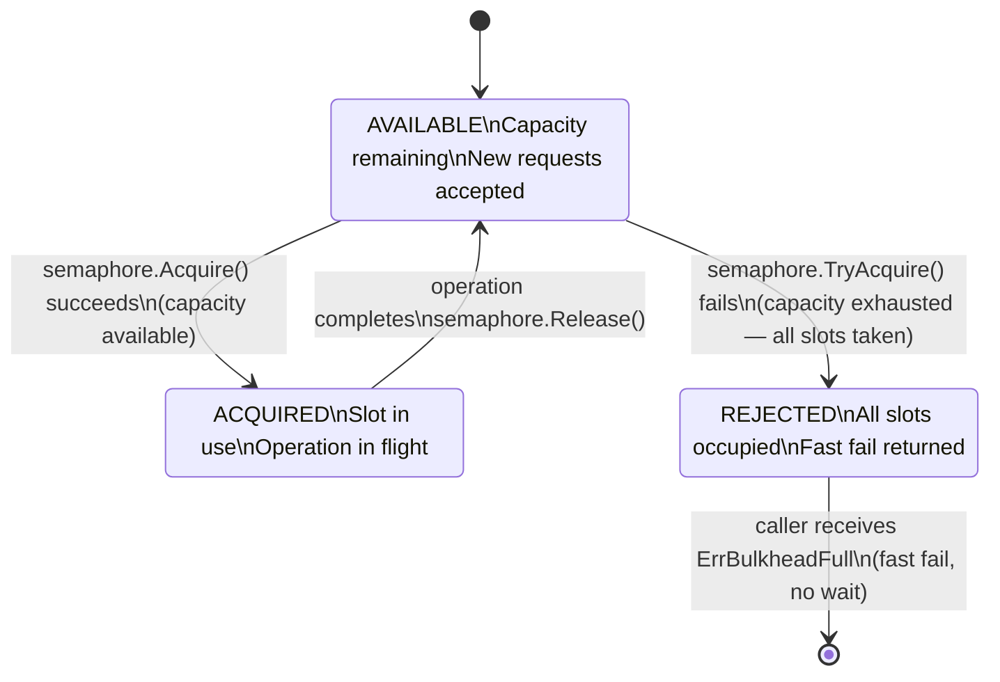

## 1. Overview

On April 14, 1912, the RMS Titanic struck an iceberg. The ship's designers had built it with 16 watertight compartments — a safety architecture called a **bulkhead system**. The theory: if one or two compartments flooded, the others would stay dry and the ship would stay afloat. The theory was sound. The flaw: the bulkheads didn't extend high enough, so water spilled over the top as the bow sank. The compartments failed because they weren't truly isolated.

The lesson isn't that bulkheads don't work — it's that **partial isolation is worse than none** because it creates false confidence.

In distributed systems, the Bulkhead pattern is exactly this: isolate resource pools so that a failure in one downstream service cannot exhaust the resources (threads, connections, goroutines, semaphore slots) used by calls to other services. Unlike the Titanic's bulkheads, well-designed software bulkheads work — *if* you give each compartment a strict ceiling.

The mental model: **a ship with watertight compartments that actually reach the ceiling**. When the payment service is slow, your thread pool for payment calls fills up and rejects new payment calls. The thread pool for recommendation calls is a completely separate compartment — it stays unaffected. Your A/B test feature that calls a new ML service can fill its tiny semaphore and fail; it cannot touch the goroutines serving your core checkout path.

By the end of this guide you'll understand:

- Why shared resource pools are a single point of failure under load
- How to isolate using semaphores, goroutine pools, and connection pools
- Why over-isolation creates its own problems
- How Netflix, AWS, and Kubernetes apply this pattern
- How to implement a semaphore-based bulkhead in Go with full observability

---

## 2. Core Concepts

### The Problem: Shared Pool as a Blast Radius

Consider a Go service that calls three downstream services: `payments`, `recommendations`, and `fraud-detection`. Without bulkheads, all three calls share the same goroutine pool (Go's runtime scheduler), the same database connection pool, and the same HTTP client.

```
                   ┌─────────────────────────┐
  Incoming         │   Your Service           │
  Requests ───────►│                          │
                   │  Single HTTP client      │──► payments (SLOW)
                   │  shared across all       │──► recommendations (OK)
                   │  downstream calls        │──► fraud-detection (OK)
                   │                          │
                   │  All calls ──────────────────► MaxConns=100 shared pool
                   └─────────────────────────┘

  When payments is slow:
  - All 100 connections waiting on payments
  - recommendations calls: "connection pool exhausted" — FAIL
  - fraud-detection calls: "connection pool exhausted" — FAIL
  - Your service: complete outage, caused by ONE slow downstream
```

*Without bulkheads, one slow downstream serially starves your entire resource pool.*

### The Fix: Isolated Resource Pools

```
                   ┌─────────────────────────────────────────┐
  Incoming         │   Your Service                           │
  Requests ───────►│                                          │
                   │  ┌──────────────────────────────────┐    │
                   │  │ Payments pool: max 30 connections │──►│ payments
                   │  └──────────────────────────────────┘    │
                   │  ┌──────────────────────────────────┐    │
                   │  │ Recommendations pool: max 20 conn │──►│ recommendations
                   │  └──────────────────────────────────┘    │
                   │  ┌──────────────────────────────────┐    │
                   │  │ Fraud pool: max 20 connections    │──►│ fraud-detection
                   │  └──────────────────────────────────┘    │
                   └─────────────────────────────────────────┘

  When payments is slow:
  - All 30 connections in the payments pool are busy
  - Payments calls: rejected (fast fail)
  - recommendations calls: 20 available connections — UNAFFECTED
  - fraud-detection calls: 20 available connections — UNAFFECTED
  - Your service: degrades payments gracefully; everything else continues
```

*With bulkheads, the failure blast radius is limited to the failing downstream's compartment.*

### Three Isolation Mechanisms

**1. Semaphore Bulkhead (for in-process calls)**
A counting semaphore limits the number of concurrent operations. `Acquire()` blocks or returns an error if the semaphore is at capacity. This is the lightest-weight option — it adds almost no latency when capacity is available.

Use this in Go with `golang.org/x/sync/semaphore`. It's non-blocking (you can use `TryAcquire`) and context-aware.

**2. Thread/Goroutine Pool Bulkhead (for CPU-bound work or isolation by priority)**
A dedicated goroutine pool processes a specific task type. High-priority requests get a pool with more goroutines; background processing gets a smaller pool. If the background pool is saturated, background tasks queue or drop — never affecting the high-priority pool.

**3. Connection Pool Bulkhead (for downstream HTTP/DB calls)**
Each downstream service gets its own `http.Client` with `MaxConnsPerHost` set. A slow downstream fills *its* connection pool, not the shared one.

### Bulkhead State Flow



*The key property: Rejected is a fast path — it returns immediately instead of blocking. This is what prevents resource exhaustion from propagating.*

---

## 3. Use Cases

### Netflix — Thread Pool Per Dependency

Netflix's Hystrix library, built for their JVM microservices, popularized the Bulkhead pattern. Every downstream dependency — `AccountService`, `RecommendationService`, `PlaybackLicenseService` — gets its own thread pool of configurable size.

The insight from Netflix's engineering blog: in a service with 40 downstream dependencies, a single dependency going slow without bulkheads would gradually consume all threads. With Hystrix thread pools, the slow dependency fills *its* pool (say, 10 threads). The other 39 dependencies continue operating normally, each with their own pool of 10 threads.

Critically, Netflix pairs this with a **fallback**: when a thread pool is full, instead of failing, the service returns cached content. "Unable to load personalized recommendations — showing trending instead."

### AWS SDK — Connection Pool Isolation

The AWS SDK configures separate HTTP clients with separate connection pools for each AWS service. Your DynamoDB client has a dedicated pool; your S3 client has a separate pool. A slow DynamoDB table cannot exhaust the connections used to talk to S3.

In practice, this means: when your DynamoDB table is throttled and all DynamoDB connections are in use, your S3 uploads continue unaffected. Without this isolation, a DynamoDB throttle would block all AWS API calls.

### Kubernetes — Resource Limits Per Namespace

Kubernetes implements bulkheads at the infrastructure level through `ResourceQuota` and `LimitRange` per namespace. Each team's namespace can use up to N CPU cores and M gigabytes of memory. A runaway pod in team A's namespace cannot starve team B's namespace.

This is the same pattern applied at the cluster level: isolated compartments, each with a ceiling. A pod that has a memory leak grows until it hits its `limits.memory` and is OOM-killed. The other pods in the same namespace, in other namespaces, are unaffected.

---

## 4. Gotchas

### Gotcha 1 — Over-Isolation: Too Many Pools, Not Enough Memory

Creating a separate goroutine pool or semaphore for every downstream call sounds like perfect isolation. In practice, if you have 50 downstream calls each with a pool of 100 goroutines, you've just reserved 5,000 goroutines by default — whether or not they're needed.

Each Go goroutine starts at 2KB–8KB of stack space. 5,000 goroutines = 10MB–40MB just for idle pool overhead. That's before they do any work.

**Rule of thumb**: Group downstream calls by *failure domain*, not by individual endpoint. Call groupings: critical path (checkout, payment), enrichment (recommendations, personalization), background (analytics, logging). You need 3 pools, not 50.

### Gotcha 2 — Under-Isolation: Shared Pool Defeats the Purpose

A common mistake: creating a bulkhead but still using a shared HTTP client underneath. Two goroutine pools, both using the same `http.DefaultClient` with its default `MaxIdleConnsPerHost: 2`. The pool isolation is real; the connection pool isolation is not. At scale, the shared connection pool is the bottleneck.

Always pair isolated goroutine pools with isolated HTTP clients. Each bulkhead should have its own `http.Transport` with its own connection pool settings.

### Gotcha 3 — Pool Size Tuning Is Not Intuitive

Setting pool sizes requires understanding your concurrency requirements.

For a downstream with:
- Average latency: 50ms
- Max acceptable concurrent calls: 200 QPS

You need: `200 QPS × 0.050s = 10 concurrent calls`. A semaphore of 10–15 gives real headroom without excessive resource allocation.

The formula: `concurrency = throughput × latency` (Little's Law). Know your target throughput per downstream and the downstream's P99 latency. Size the pool accordingly.

Setting pool sizes too large defeats the purpose (no isolation). Setting them too small causes unexpected rejections under normal load.

### Gotcha 4 — Deadlock When Bulkheads Interact

Consider: Service A calls Service B using the A→B bulkhead. Service B calls Service C using the B→C bulkhead. Service C's response requires calling Service A back (callback pattern). Service A's bulk head is full because A is waiting for B.

This creates a circular wait — a deadlock — where both bulkheads are full waiting for each other. This is especially common in event-driven systems where "service B processes an event and calls back."

**Avoid synchronous callbacks across bulkheads**. Use async patterns (events, queues) for cross-service responses. Never have A→B→A as a synchronous call chain.

### Gotcha 5 — Not Distinguishing Queue vs. Reject

Two behaviors when a bulkhead is full:
- **Queue**: requests wait for a slot to free up. Under sustained overload, the queue grows indefinitely. Memory exhaustion replaces thread exhaustion.
- **Reject**: requests get an immediate error. Callers see fast failures; load is shed.

Always prefer Reject for latency-sensitive operations. The worst outcome in a degraded system is requests piling up in a queue making the recovery time longer. A fast failure lets the caller retry later or show a degraded experience. A queued request holds a goroutine (even if not holding a bulkhead slot), delays the response, and often times out anyway — but after waiting.

---

## 5. Where to Use (and Where NOT to Use)

### Use the Bulkhead pattern when:

- **You have multiple downstream dependencies with different reliability profiles** — one flaky, one rock-solid. You need to ensure the flaky one doesn't affect the rock-solid one.
- **You have mixed-priority traffic** — user-facing latency-sensitive requests and background batch jobs in the same service. Separate pools prevent batch jobs from starving user requests.
- **Your service calls N downstream services and any one of them can become slow** — without bulkheads, any downstream can cause a full service outage.
- **You're already using Circuit Breakers** — add Bulkheads too. They solve different problems and complement each other perfectly.

### Do NOT use Bulkheads when:

- **You have a single downstream dependency** — there's nothing to isolate *from*. A Circuit Breaker is sufficient here.
- **All calls are in-process (no network)** — bulkheads are for network I/O isolation. Pure CPU-bound in-process work rarely needs this pattern.
- **Your service is simple and the operational overhead isn't justified** — a simple proxy microservice with two downstream calls and predictable traffic doesn't need four isolation pools. A plain `http.Client` with a sensible timeout is enough.
- **You haven't measured your concurrency needs first** — don't add bulkheads speculatively. Add them when you've observed a resource exhaustion incident in production or in load tests.

> 💡 **Staff-level insight:** The Bulkhead pattern is most valuable not for preventing individual failures — that's the Circuit Breaker's job — but for **blast radius containment**. Every bulkhead boundary is a decision about "how bad can this get?" A well-designed bulkheading strategy means that when your new ML-inference feature misbehaves at 2 AM, it degrades that feature — not your entire service. The question to ask in design reviews: "If this downstream service saturates, what else breaks?" If the answer is "everything," you need bulkheads.

---

## 6. Versus: Comparisons

### Bulkhead vs Circuit Breaker

| Aspect                   | Bulkhead                                      | Circuit Breaker                                                           |
| ------------------------ | --------------------------------------------- | ------------------------------------------------------------------------- |
| What it prevents         | Resource exhaustion from slow calls           | Sending calls to a known-failing service                                  |
| How it works             | Limits concurrent calls                       | Tracks failure rate, opens/closes                                         |
| Response to overload     | Rejects new calls immediately (fast fail)     | Fails immediately when open (open state)                                  |
| Response to slow service | Limits ongoing concurrency                    | Doesn't protect against slow (only errors) unless latency threshold added |
| State                    | Stateless (semaphore count only)              | Stateful (Closed/Open/Half-Open)                                          |
| Failure mode it fixes    | Thread exhaustion, connection pool exhaustion | Cascading failure from error propagation                                  |
| Complexity               | Low — just a semaphore                        | Medium — state machine + threshold tuning                                 |

**Choose Bulkhead when**: You need to prevent *concurrent resource exhaustion* — one slow downstream filling up all your threads.

**Choose Circuit Breaker when**: You need to *stop sending calls* to a downstream that's already failing — fast-fail without even trying.

**Use both**: They are complementary. The Bulkhead limits how many concurrent calls are in-flight to a downstream. The Circuit Breaker stops making calls when the downstream's error rate is too high. Together they handle both slow (Bulkhead) and failing (Circuit Breaker) downstreams.

### Bulkhead vs Rate Limiter

| Aspect         | Bulkhead                              | Rate Limiter                            |
| -------------- | ------------------------------------- | --------------------------------------- |
| What it limits | Concurrent outstanding requests       | Requests per time window                |
| Direction      | Outbound (how many calls in flight)   | Inbound (how fast callers can call you) |
| Protects       | Your service from downstream slowness | Downstream from your overload           |
| State          | Semaphore count                       | Token bucket / sliding window counter   |
| Use case       | Resource isolation per downstream     | Preventing overload of one service      |

**Choose Bulkhead** for outbound isolation. **Choose Rate Limiter** for inbound protection.

---

## 7. Code Examples

```go
package bulkhead

import (
	"context"
	"errors"
	"fmt"
	"net/http"
	"time"

	"golang.org/x/sync/semaphore"
)

// ErrBulkheadFull is returned when the bulkhead is at capacity.
// Callers should treat this as a fast fail — no retry, show degraded UX.
var ErrBulkheadFull = errors.New("bulkhead capacity exhausted")

// Bulkhead limits the number of concurrent operations using a semaphore.
// Each downstream dependency should have its own Bulkhead instance — NOT shared.
type Bulkhead struct {
	name string
	sem  *semaphore.Weighted
	// metrics would be injected here in production — omitted for clarity
}

// NewBulkhead creates a Bulkhead for the given downstream with maxConcurrent slots.
// Rule of thumb for sizing: maxConcurrent ≈ targetQPS × p99LatencySeconds
// e.g., 200 QPS × 0.05s p99 = 10 concurrent slots (add 50% headroom → 15)
func NewBulkhead(name string, maxConcurrent int64) *Bulkhead {
	return &Bulkhead{
		name: name,
		sem:  semaphore.NewWeighted(maxConcurrent),
	}
}

// Execute runs fn inside the bulkhead.
// If the bulkhead is full (all slots taken), it returns ErrBulkheadFull immediately
// without waiting — this is the "reject" behavior, not "queue" behavior.
// Callers should NOT retry immediately; they should fail fast or use a fallback.
func (b *Bulkhead) Execute(ctx context.Context, fn func(ctx context.Context) error) error {
	// TryAcquire returns false immediately if capacity is exhausted.
	// Do NOT use Acquire here — that blocks, which defeats the purpose.
	if !b.sem.TryAcquire(1) {
		// In production: increment bulkhead_rejected_total{bulkhead=b.name}
		return fmt.Errorf("%w: %s", ErrBulkheadFull, b.name)
	}
	defer b.sem.Release(1) // Always release — use defer to be safe

	return fn(ctx)
}

// ─── Isolated HTTP Clients Per Downstream ────────────────────────────────────
//
// Pairing each Bulkhead with its own http.Transport is MANDATORY.
// Two goroutine pools sharing one http.DefaultClient = the connection pool
// is still shared = blast radius not actually contained.

func newIsolatedHTTPClient(maxConns int, timeout time.Duration) *http.Client {
	return &http.Client{
		Timeout: timeout,
		Transport: &http.Transport{
			// MaxConnsPerHost caps this client's connection pool to this downstream.
			// Other clients have their own pools — this one cannot steal from them.
			MaxConnsPerHost:     maxConns,
			MaxIdleConnsPerHost: maxConns / 2, // Keep half the connections warm
			IdleConnTimeout:     30 * time.Second,
		},
	}
}

// ─── Service with Multiple Isolated Downstream Clients ───────────────────────

// CheckoutService calls three downstreams: payments, recommendations, fraud.
// Each has its own Bulkhead and its own HTTP client.
// Failure blast radius: isolated per compartment.
type CheckoutService struct {
	paymentsBulkhead        *Bulkhead
	recommendationsBulkhead *Bulkhead
	fraudBulkhead           *Bulkhead

	paymentsClient        *http.Client
	recommendationsClient *http.Client
	fraudClient           *http.Client
}

func NewCheckoutService() *CheckoutService {
	return &CheckoutService{
		// Payments: critical path, small but reliable pool.
		// 20 QPS × 0.100s p99 = 2 concurrent; set to 10 for headroom.
		paymentsBulkhead: NewBulkhead("payments", 10),

		// Recommendations: non-critical, larger pool, higher latency p99 allowed.
		recommendationsBulkhead: NewBulkhead("recommendations", 20),

		// Fraud: moderate priority, medium pool.
		fraudBulkhead: NewBulkhead("fraud", 15),

		// Each downstream gets its own HTTP client — isolated connection pools.
		paymentsClient:        newIsolatedHTTPClient(10, 5*time.Second),
		recommendationsClient: newIsolatedHTTPClient(20, 2*time.Second),
		fraudClient:           newIsolatedHTTPClient(15, 3*time.Second),
	}
}

// ProcessCheckout calls all three downstreams.
// Recommendations uses a fallback — non-critical, safe to degrade.
// Payments and fraud are critical — no fallback, error returned.
func (s *CheckoutService) ProcessCheckout(ctx context.Context, orderID string) error {
	// Critical path: fraud check
	if err := s.fraudBulkhead.Execute(ctx, func(ctx context.Context) error {
		return s.callFraud(ctx, orderID)
	}); err != nil {
		if errors.Is(err, ErrBulkheadFull) {
			// In production: you might allow this through with extra logging
			// rather than failing the entire checkout. Business decision.
			return fmt.Errorf("fraud check unavailable: %w", err)
		}
		return err
	}

	// Critical path: payment
	if err := s.paymentsBulkhead.Execute(ctx, func(ctx context.Context) error {
		return s.callPayments(ctx, orderID)
	}); err != nil {
		return err // Payment failure is always fatal
	}

	// Non-critical: recommendations. If bulkhead is full, use fallback silently.
	recErr := s.recommendationsBulkhead.Execute(ctx, func(ctx context.Context) error {
		return s.callRecommendations(ctx, orderID)
	})
	if recErr != nil {
		// Recommendations failure is non-fatal — degrade gracefully.
		// Log it, increment a counter, but don't fail the checkout.
		_ = recErr // In production: log + metric here
	}

	return nil
}

// stub implementations — in production these make real HTTP calls
func (s *CheckoutService) callPayments(_ context.Context, orderID string) error {
	return nil
}
func (s *CheckoutService) callFraud(_ context.Context, orderID string) error {
	return nil
}
func (s *CheckoutService) callRecommendations(_ context.Context, orderID string) error {
	return nil
}

// ─── Goroutine Pool Bulkhead (for CPU-bound or priority isolation) ────────────

// WorkerPool is a fixed-size goroutine pool for processing tasks.
// Use this when you need to isolate CPU-bound work by priority,
// not just limit concurrent I/O calls.
type WorkerPool struct {
	tasks chan func()
}

// NewWorkerPool creates a goroutine pool with workerCount goroutines
// and a task queue of depth queueDepth.
// When the queue is full, Submit returns false (reject, not queue further).
func NewWorkerPool(workerCount, queueDepth int) *WorkerPool {
	p := &WorkerPool{
		tasks: make(chan func(), queueDepth),
	}
	for i := 0; i < workerCount; i++ {
		go func() {
			for task := range p.tasks { // goroutine waits for tasks
				task()
			}
		}()
	}
	return p
}

// Submit enqueues a task. Returns false if the queue is full.
// Non-blocking — callers should handle the false case as a fast fail.
func (p *WorkerPool) Submit(task func()) bool {
	select {
	case p.tasks <- task:
		return true
	default:
		// Queue full — reject immediately. Don't block the caller's goroutine.
		return false
	}
}
```

*The critical pairing: each `Bulkhead` (semaphore) is backed by its own `http.Client` with its own `Transport`. Both the goroutine concurrency and the TCP connection pool are isolated. One without the other is incomplete.*

---

## 8. Scale Discussion

### At 10x Load

Bulkhead pool sizes that worked at baseline will start to exhaust at 10x. Symptoms: `bulkhead_rejected_total` climbing on your non-critical downstreams. This is the bulkhead working correctly — it's protecting your critical path. But watch that rejection rate — if it's above 5%, your pool is too small or the downstream is too slow.

Revisit pool sizes with Little's Law at this point: `new_concurrency = new_QPS × p99_latency`. The formula tells you exactly how large the pool needs to be.

### At 100x Load

At 100x, Bulkheads alone can't save a service that's consuming a shared physical resource like a database. One database connection pool, even isolated per downstream service, has a ceiling from the database's side (`max_connections` in PostgreSQL).

This is where you add a connection proxy (PgBouncer, RDS Proxy) in front of the database. The proxy multiplexes connections, and your service-side pool remains isolated — but now the ceiling is the proxy's capacity, not the DB's.

### At 1000x Load

At this scale, you need bulkheads at the infrastructure layer, not just the code layer. Kubernetes namespace resource quotas, separate node pools for critical vs. non-critical workloads, separate database clusters per service domain. The software Bulkhead pattern is insufficient — the isolation needs to be physical (separate nodes, separate networks).

Netflix's multi-region active-active architecture is this pattern applied at the broadest scale: if `us-east-1` is a failing "compartment," all traffic routes to `us-west-2`. The regions are bulkheads for each other.

---

## 9. Monitoring & Observability

| Metric                                          | Type      | Alert Condition                               |
| ----------------------------------------------- | --------- | --------------------------------------------- |
| `bulkhead_queue_depth{bulkhead}`                | Gauge     | > 80% of max capacity — warn                  |
| `bulkhead_rejected_total{bulkhead}`             | Counter   | Rate > 1% of total calls — warn; > 5% — page  |
| `bulkhead_acquired_current{bulkhead}`           | Gauge     | > 90% of max capacity sustained > 30s         |
| `bulkhead_execution_duration_seconds{bulkhead}` | Histogram | p99 > 2× expected downstream latency          |
| `goroutine_pool_utilization{pool}`              | Gauge     | > 85% sustained — pool may be undersized      |
| `http_client_connections_in_use{client}`        | Gauge     | > 90% of MaxConnsPerHost                      |
| `bulkhead_errors_total{bulkhead, error}`        | Counter   | Any non-zero rate for critical path bulkheads |

**Dashboard to build**: One panel per bulkhead showing current utilization % (acquired/max). When payments bulkhead shows 100% utilization, drop what you're doing — that's a live incident indicator. At 80%, it's a capacity planning signal.

Set up a **rejection ratio alert**: `rate(bulkhead_rejected_total[5m]) / rate(bulkhead_calls_total[5m]) > 0.05`. More than 5% rejections on any non-trivial bulkhead means either the downstream is degraded or the pool is undersized.

---

## Interview Questions

### Question 1: "Your checkout service calls 8 downstream services. One of those services starts timing out at Black Friday scale. How would you prevent it from taking down your other 7 downstream calls?"

**Key points to cover:**
- Bulkhead pattern: give each downstream service its own semaphore or connection pool with a cap
- Pair each bulkhead with its own HTTP client (isolated transport/connection pool)
- The timing out service fills its pool first — fast-fail new calls to that service, leave others unaffected
- Size pools with Little's Law: concurrency = QPS × latency. Factor in p99 latency, not average.
- Add a fallback for non-critical downstreams (recommendations, personalization) — degrade gracefully

**Common mistake:** Only talking about Circuit Breakers. A Circuit Breaker cuts calls when a service is *already failing*. But before the Circuit Breaker trips, slow calls are blocking threads. The Bulkhead limits that damage during the window before the Circuit Breaker opens.

**What the interviewer wants:** To see that you understand the difference between "stop calling a failed service" (Circuit Breaker) and "limit damage while a service is degrading" (Bulkhead). Real incidents don't have instant Circuit Breaker trips — there's a window of slow responses that exhaust resources.

### Question 2: "How do you size your bulkhead pools? Walk me through your reasoning."

**Key points to cover:**
- Little's Law: L = λW. Concurrency (L) = arrival rate (λ) × average service time (W).
- Use p99 latency, not average latency — you're sizing for the worst realistic case
- Add headroom: 1.5× to 2× the calculated concurrency
- Separate pool sizing per downstream based on its own QPS and latency profile
- Review and retune after major traffic changes or downstream SLA changes
- Start by measuring in production with alerts before tuning (don't guess, observe)

**Common mistake:** Using instinct or copying defaults from a README ("just set it to 100"). Pool sizes that are too large negate the isolation; too small cause unnecessary rejections at normal load.

**What the interviewer wants:** That you know Little's Law and can apply it. Staff engineers size systems analytically, not by feel.

### Question 3: "What's the difference between Bulkhead and Circuit Breaker? Are they redundant? Would you use both?"

**Key points to cover:**
- Bulkhead: limits *concurrency* — how many calls can be in-flight simultaneously. Prevents resource exhaustion.
- Circuit Breaker: limits *call attempts* — stops making calls when a downstream is known-bad. Prevents call amplification.
- They address *different failure modes*: Bulkhead handles slow downstreams before the circuit trips; Circuit Breaker handles sustained failure after the circuit trips.
- Use both: during the window when a downstream is starting to degrade (Circuit Breaker threshold not yet hit), Bulkhead limits the damage. Once the CB opens, no calls are made and the Bulkhead becomes irrelevant.

**Common mistake:** Saying they're redundant or that you'd only use one. They're designed for different phases of a downstream degradation event.

**What the interviewer wants:** Systems thinking. The ability to reason about *sequences* of failures, not just individual failure modes.

---

## Staff-Level Preparation Tips

**What to build:**
- Add `bulkhead.Execute()` wrapping to an existing service that makes 3–4 external calls. Use different semaphore sizes per call. Run a load test where you artificially slow one downstream (sleep injection) and verify the others degrade gracefully.
- Build a simple goroutine pool with the `Submit()` pattern above. Benchmark its overhead vs. spawning goroutines on demand.
- Read your HTTP client configuration. Does your production service use `http.DefaultClient`? If yes, that's a shared connection pool — add isolation.

**What to study:**
- Netflix's Hystrix conceptual overview: explains thread pool isolation, semaphore isolation, fallbacks all in one model
- `golang.org/x/sync/semaphore` source code — it's short and illuminating
- Little's Law: a 5-minute read that will permanently change how you size resource pools

**How it connects to broader system design:**
- Bulkheads at the infrastructure level: Kubernetes resource quotas, separate node groups for critical workloads
- Combine with Circuit Breaker and Retry: these three form the core of resilience patterns in distributed systems
- At staff level, the broader question is: "What's the blast radius if X fails?" Bulkheads are your answer to limiting that blast radius at the service level

---

## References

- [Netflix Tech Blog — Introducing Hystrix for Resilience Engineering](https://netflixtechblog.com/introducing-hystrix-for-resilience-engineering-13531c1ab362)
- [Martin Fowler — Bulkhead Pattern](https://martinfowler.com/bliki/BulkheadPattern.html)
- [golang.org/x/sync/semaphore documentation](https://pkg.go.dev/golang.org/x/sync/semaphore)
- [Release It! — Michael Nygard (Book)](https://pragprog.com/titles/mnee2/release-it-second-edition/) — the original source for Bulkhead, Circuit Breaker and other stability patterns
- [AWS Architecture Blog — Circuit Breaker, Bulkhead, and Retry](https://aws.amazon.com/blogs/architecture/exponential-backoff-and-jitter/)
- [Little's Law — Wikipedia](https://en.wikipedia.org/wiki/Little%27s_law)
- [Resilience4j — Java Bulkhead documentation](https://resilience4j.readme.io/docs/bulkhead) — best practical reference even for non-Java engineers
