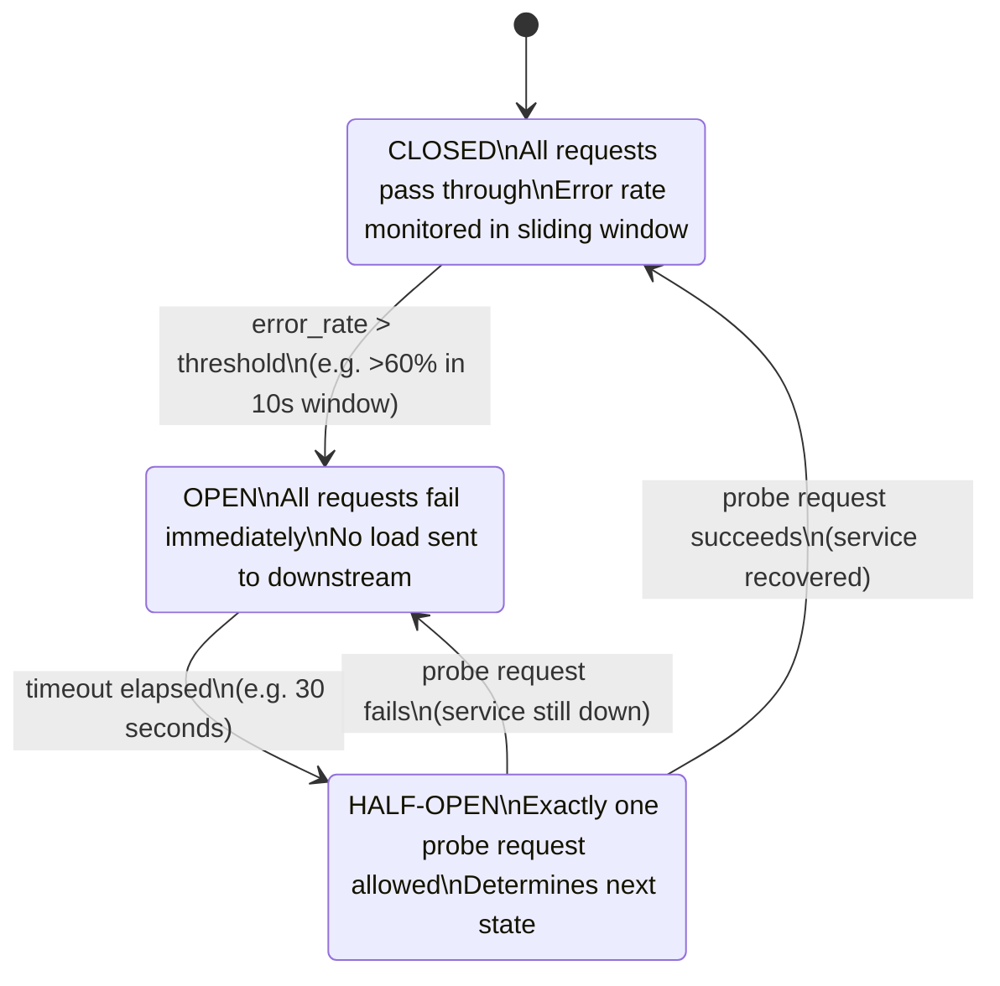

## 1. Overview

In 2012, Netflix engineers noticed something alarming: when one upstream service started responding slowly, the calling service's thread pool filled up waiting for those slow responses. Within seconds, the calling service stopped serving requests entirely — even though it had nothing to do with the upstream problem. One slow service had cascaded into a full outage.

The fix was the **Circuit Breaker pattern**, soon packaged as Netflix Hystrix.

The analogy is exactly what it sounds like: an electrical circuit breaker in your home. When a circuit draws too much current, the breaker trips — it disconnects the faulty circuit before the overload burns your house down. It doesn't fix the problem, but it contains it. When the problem is fixed, you reset the breaker and normal flow resumes.

In distributed systems, the Circuit Breaker wraps a remote call. When that call starts failing beyond a threshold, the circuit "opens" — subsequent calls fail immediately without touching the downstream service. After a configurable timeout, the circuit enters a "half-open" state and lets one probe request through. If the probe succeeds, the circuit closes and normal operation resumes.

By the end of this guide you'll know:

- The three-state machine: Closed, Open, Half-Open
- How to tune thresholds for your actual QPS — not just "50% error rate"
- Why latency-based Circuit Breakers matter as much as error-rate-based ones
- How to implement one from scratch in Go and use `sony/gobreaker` in production
- The monitoring you must have before you deploy one
- Why the Half-Open state is the most dangerous state you're not thinking about

---

## 2. Core Concepts

### The Mental Model

Think of it as a proxy with memory. Every request passes through the Circuit Breaker. The breaker watches the outcomes. When it sees too many failures, it decides: "I'm going to stop sending requests downstream. I'll give the downstream service time to recover."

Without a Circuit Breaker, a failing downstream service consumes your threads, your connection pool, your timeouts — and eventually your entire service. With one, the failure is contained at the circuit boundary.

### The Three States

```
CLOSED ──(error rate > threshold)──► OPEN
  ▲                                    │
  │                                    │ (timeout elapsed)
  │                                    ▼
  └──(probe succeeds)────────── HALF-OPEN
          (probe fails)──────────────► OPEN
```

**CLOSED** — Normal operation. Every request goes through. The breaker counts successes and failures in a sliding window.

**OPEN** — The circuit has tripped. Every request fails immediately — no downstream call is made. The breaker holds this state for a configurable timeout (e.g., 30 seconds), giving the downstream service time to recover.

**HALF-OPEN** — The timeout has elapsed. The breaker allows exactly one probe request through. If it succeeds, the circuit closes and normal operation resumes. If it fails, the circuit reopens and the timeout restarts.

### The State Machine in Mermaid



*Circuit Breaker state machine. Half-Open is the recovery state — it prevents thundering herd when a service recovers by only allowing one probe rather than a flood of requests.*

### The Sliding Window

The most critical implementation detail is *how you count failures*. Two approaches:

**Count-based window**: Trip when X% of the last N requests fail. `sony/gobreaker` uses this: if 6 of the last 10 requests fail, that's 60% — trip.

**Time-based window**: Trip when X% of requests in the last T seconds fail. Netflix Hystrix uses this: 50% failure rate in the last 10 seconds.

Count-based is simpler but has an edge case: at very low QPS, 2 failures in 10 requests is 20% — not alarming. At high QPS, those same 2 failures in 1000 requests is 0.2% — statistically meaningless noise.

The choice matters enormously at scale. More on this in the Scale section.

---

## 3. Use Cases

### Netflix — Preventing Cascading Failures at Scale

Netflix's microservices architecture has hundreds of services calling each other. Their DependencyCommand wrapper (later the Hystrix library) wraps every downstream call. When their recommendations service degraded in 2012, Hystrix prevented it from taking down the entire streaming pipeline.

The key insight from their engineering blog: without Hystrix, a 30-second timeout on a degraded downstream meant 30 seconds × (number of concurrent requests) threads were blocked waiting. At 10,000 RPS, that's a massive thread pool exhaustion in under a second.

### AWS SDK — Built-in Retry + Circuit Breaker

The AWS SDK has configurable retry policies and, in some language versions, built-in circuit breaking. When a DynamoDB table is throttled, the SDK won't hammer it with retries — it backs off. This is Circuit Breaker behavior at the SDK layer, below your application code.

### API Gateways — Kong, Envoy

Modern API gateways implement Circuit Breakers at the traffic-routing layer. Envoy's outlier detection is effectively a distributed Circuit Breaker: if a service instance returns too many 5xx responses, Envoy ejects it from the load balancer pool for a configurable duration — exactly the Open state behavior.

### Payment Systems — Graceful Degradation

A payment platform calling an external fraud-detection service wraps that call in a Circuit Breaker. When the fraud service is down, the circuit opens. The payment service falls back to a local rule-based check rather than failing the entire transaction. This is the key design principle: **an open circuit should trigger a fallback, not just a failure**.

---

## 4. Gotchas

### Gotcha 1 — Threshold Tuning Is Not One-Size-Fits-All

The most common mistake: copying a Circuit Breaker configuration from a blog post without tuning it for your QPS.

A breaker with `MinimumNumberOfRequests: 10` and `FailureRateThreshold: 60%` means: open if 6 of 10 requests fail.

At 100 RPS, those 10 requests are sampled in 100ms — fast feedback.

At 10,000 RPS, 10 requests is 1ms of traffic. Six failures in 1ms could be a momentary network hiccup. Your circuit will open on noise.

**Rule of thumb**: `MinimumNumberOfRequests` should be roughly 1–5 seconds of your baseline QPS. At 10,000 RPS, set minimum to 10,000–50,000 requests.

### Gotcha 2 — Latency Isn't Covered by Error Rate

A vanilla error-rate Circuit Breaker will not open if the downstream service is responding slowly but not returning errors. A service that takes 28 seconds to respond (just under your 30s timeout) will hold all your threads open without tripping the circuit.

Always pair error-rate thresholds with latency thresholds. Netflix Hystrix tracks both. `sony/gobreaker` only tracks errors — you need to add timeout wrapping externally.

```go
// Wrap your call in a context with timeout BEFORE the circuit breaker.
// This converts slow responses into cancellation errors that the CB tracks.
func callWithTimeout(ctx context.Context, timeout time.Duration, fn func() error) error {
    ctx, cancel := context.WithTimeout(ctx, timeout)
    defer cancel()

    done := make(chan error, 1)
    go func() {
        done <- fn()
    }()

    select {
    case err := <-done:
        return err
    case <-ctx.Done():
        return fmt.Errorf("downstream timeout after %v: %w", timeout, ctx.Err())
    }
}
```

*This converts latency into errors. The Circuit Breaker then counts the timeout as a failure and will open on repeated latency spikes — not just hard errors.*

### Gotcha 3 — Half-Open Is a Race Condition

When the circuit transitions from Open to Half-Open, a well-implemented breaker allows exactly one probe request. A poorly implemented one allows concurrent probes — if 100 goroutines are waiting and the circuit opens, all 100 send probe requests simultaneously. This is a thundering herd: your recovering downstream service gets hit with a burst of traffic precisely when it's most fragile.

`sony/gobreaker` handles this correctly. If you're rolling your own, use a mutex and a flag to ensure only one goroutine executes the probe.

### Gotcha 4 — Forgetting Fallback Logic

A Circuit Breaker without a fallback is just a faster way to return an error. The pattern's real value is enabling graceful degradation:

- Payment service unavailable → fall back to queuing the charge for retry
- Recommendations service unavailable → return trending content
- Fraud detection unavailable → run local rule-based checks

```go
result, err := ChargeCustomer(ctx, customerID, amount)
if errors.Is(err, gobreaker.ErrOpenState) {
    // Circuit is open — queue for async processing rather than failing the user
    return queueChargeForRetry(ctx, customerID, amount)
}
```

### Gotcha 5 — Static Circuit Breakers in Dynamic Systems

Circuit Breakers are initialized at startup. If you deploy a new downstream service at 5x the load, your Circuit Breaker thresholds are still calibrated for the old load. Threshold review should be part of every capacity planning cycle.

---

## 5. Where to Use (and Where NOT to Use)

### Use When

- Any synchronous call to an external service you don't control (payment processor, SMS gateway, fraud detection, third-party APIs)
- The downstream service has a history of latency spikes or partial availability
- You can define a meaningful fallback when the circuit is open
- Your service's availability SLA is higher than the downstream service's SLA

### Do NOT Use When

- Calling in-process functions — the overhead of state tracking is not justified
- The operation is a local database query on a connection pool you own — use connection timeouts and pool limits instead
- The operation is inherently idempotent and fast-failing already covers the failure case
- You cannot define a fallback — an open circuit without a fallback is a slightly faster error, not resilience

> 💡 **Staff-level insight:** The question I ask in design reviews is: "What happens when the circuit opens?" If the answer is "we return an error," the Circuit Breaker is providing limited value. The pattern earns its complexity cost when you have a real degraded-mode behavior to fall back to.

---

## 6. Versus (Comparisons)

### Circuit Breaker vs Retry with Backoff

| Dimension            | Circuit Breaker                   | Retry with Backoff                   |
| -------------------- | --------------------------------- | ------------------------------------ |
| **Primary goal**     | Prevent cascading failures        | Handle transient errors              |
| **Downstream load**  | Reduces load when circuit is open | Can increase load (multiple retries) |
| **When to use**      | Sustained failures or latency     | Occasional transient errors          |
| **State**            | Stateful (tracks error rates)     | Stateless per request                |
| **Failure response** | Immediate fail-fast               | Delayed — waits between retries      |
| **Combination**      | Use both together                 | Use both together                    |

> **Choose Circuit Breaker** when you need to protect the downstream service and your own thread pool from sustained failures. **Choose Retry** for transient errors (network blip, brief service restart). In production, always use both together.

### Circuit Breaker vs Timeout

| Dimension        | Circuit Breaker             | Timeout                  |
| ---------------- | --------------------------- | ------------------------ |
| **Scope**        | Aggregate across requests   | Per-request              |
| **Recovery**     | Automatic (Half-Open probe) | Manual                   |
| **Overhead**     | State tracking per-breaker  | Minimal                  |
| **Failure type** | Sustained failure patterns  | Individual slow requests |

> **Always use timeouts.** Circuit Breakers catch sustained failure patterns. Timeouts catch individual slow requests. They solve different problems; both are necessary.

### sony/gobreaker vs Custom Implementation

| Dimension                 | sony/gobreaker       | Custom                |
| ------------------------- | -------------------- | --------------------- |
| **Implementation effort** | Drop-in              | 2–4 days to get right |
| **Sliding window**        | Count-based          | Your choice           |
| **Latency threshold**     | Not built-in         | Can build in          |
| **Metrics hooks**         | `OnStateChange` only | Full control          |
| **Battle-tested**         | Yes                  | No                    |

> **Choose `gobreaker`** for 95% of cases. Build custom only if you need time-based sliding windows or latency-based thresholds built in.

---

## 7. Code Examples

### From-Scratch Implementation in Go

Build this before using a library. Understanding the state machine is critical for tuning it in production.

```go
package circuitbreaker

import (
    "errors"
    "sync"
    "time"
)

// ErrCircuitOpen is returned when the circuit is in Open state.
var ErrCircuitOpen = errors.New("circuit breaker is open")

// State represents the three states of the circuit breaker.
type State int

const (
    StateClosed   State = iota // Normal — requests pass through
    StateOpen                  // Tripped — requests fail immediately
    StateHalfOpen              // Recovery probe — one request allowed
)

func (s State) String() string {
    switch s {
    case StateClosed:
        return "closed"
    case StateOpen:
        return "open"
    case StateHalfOpen:
        return "half-open"
    default:
        return "unknown"
    }
}

// Counts tracks request outcomes in the current window.
type Counts struct {
    Requests             uint32
    TotalSuccesses       uint32
    TotalFailures        uint32
    ConsecutiveSuccesses uint32
    ConsecutiveFailures  uint32
}

// Settings configures the circuit breaker behavior.
type Settings struct {
    // MinRequests: minimum requests before the circuit can open.
    // Set to ~1-5 seconds of your baseline QPS.
    MinRequests uint32

    // FailureRatio: fraction of failures that triggers opening.
    // 0.6 = 60% failure rate trips the circuit.
    FailureRatio float64

    // OpenTimeout: how long to stay Open before moving to Half-Open.
    OpenTimeout time.Duration

    // OnStateChange is called on every state transition.
    // Wire this to your metrics system.
    OnStateChange func(from, to State)
}

// CircuitBreaker implements the three-state circuit breaker pattern.
type CircuitBreaker struct {
    mu        sync.Mutex
    settings  Settings
    state     State
    counts    Counts
    openedAt  time.Time
}

// NewCircuitBreaker creates a new circuit breaker with the given settings.
func NewCircuitBreaker(s Settings) *CircuitBreaker {
    return &CircuitBreaker{
        settings: s,
        state:    StateClosed,
    }
}

// Execute runs fn through the circuit breaker.
// Returns ErrCircuitOpen immediately if the circuit is open.
func (cb *CircuitBreaker) Execute(fn func() error) error {
    if err := cb.beforeRequest(); err != nil {
        return err
    }

    err := fn()
    cb.afterRequest(err)
    return err
}

func (cb *CircuitBreaker) beforeRequest() error {
    cb.mu.Lock()
    defer cb.mu.Unlock()

    switch cb.state {
    case StateClosed:
        cb.counts.Requests++
        return nil
    case StateOpen:
        // Check if enough time has passed to try Half-Open
        if time.Since(cb.openedAt) > cb.settings.OpenTimeout {
            cb.toState(StateHalfOpen)
            cb.counts.Requests++
            return nil
        }
        return ErrCircuitOpen
    case StateHalfOpen:
        // Half-Open: allow exactly one probe request.
        // If a request is already in-flight (Requests > 0), block.
        if cb.counts.Requests > 0 {
            return ErrCircuitOpen
        }
        cb.counts.Requests++
        return nil
    }
    return nil
}

func (cb *CircuitBreaker) afterRequest(err error) {
    cb.mu.Lock()
    defer cb.mu.Unlock()

    if err != nil {
        cb.counts.TotalFailures++
        cb.counts.ConsecutiveFailures++
        cb.counts.ConsecutiveSuccesses = 0
    } else {
        cb.counts.TotalSuccesses++
        cb.counts.ConsecutiveSuccesses++
        cb.counts.ConsecutiveFailures = 0
    }

    switch cb.state {
    case StateClosed:
        // Check if we should open
        if cb.counts.Requests >= cb.settings.MinRequests {
            failureRatio := float64(cb.counts.TotalFailures) / float64(cb.counts.Requests)
            if failureRatio >= cb.settings.FailureRatio {
                cb.toState(StateOpen)
            }
        }
    case StateHalfOpen:
        if err != nil {
            // Probe failed — reopen the circuit
            cb.toState(StateOpen)
        } else {
            // Probe succeeded — close the circuit
            cb.toState(StateClosed)
        }
    }
}

func (cb *CircuitBreaker) toState(to State) {
    from := cb.state
    cb.state = to

    // Reset counts on every state change
    cb.counts = Counts{}

    if to == StateOpen {
        cb.openedAt = time.Now()
    }

    if cb.settings.OnStateChange != nil {
        cb.settings.OnStateChange(from, to)
    }
}

// State returns the current state (safe for concurrent access).
func (cb *CircuitBreaker) State() State {
    cb.mu.Lock()
    defer cb.mu.Unlock()
    return cb.state
}
```

### Production Configuration with sony/gobreaker + Prometheus

```go
package main

import (
    "errors"
    "fmt"
    "net/http"
    "time"

    "github.com/prometheus/client_golang/prometheus"
    "github.com/prometheus/client_golang/prometheus/promauto"
    "github.com/sony/gobreaker"
)

var (
    // Gauge: current state (0=closed, 1=open, 2=half-open).
    // Alert: state > 0 for more than 60 seconds
    cbState = promauto.NewGaugeVec(prometheus.GaugeOpts{
        Name: "circuit_breaker_state",
        Help: "Current state of circuit breaker (0=closed, 1=open, 2=half-open)",
    }, []string{"name"})

    // Counter: state transitions.
    // Alert: any transition TO open state
    cbTransitions = promauto.NewCounterVec(prometheus.CounterOpts{
        Name: "circuit_breaker_transitions_total",
        Help: "Total state transitions by circuit breaker",
    }, []string{"name", "from", "to"})

    // Counter: requests by outcome (success, failure, rejected).
    // Alert: rejected_ratio > 0.01 (1% of requests rejected means circuit is frequently open)
    cbRequests = promauto.NewCounterVec(prometheus.CounterOpts{
        Name: "circuit_breaker_requests_total",
        Help: "Total requests through the circuit breaker by result",
    }, []string{"name", "result"})
)

// newPaymentBreaker creates a Circuit Breaker tuned for a payment service
// handling 500 RPS. Adjust MinimumNumberOfRequests proportionally for your QPS.
func newPaymentBreaker() *gobreaker.CircuitBreaker {
    return gobreaker.NewCircuitBreaker(gobreaker.Settings{
        Name: "payment-service",

        // At 500 RPS, 500 requests = 1 second of traffic.
        // Do NOT open on fewer than 500 requests — prevents false opens at cold start.
        MinimumNumberOfRequests: 500,

        // Open if 60% of requests in the current window fail.
        // Lower = more sensitive (more false opens). Higher = slower to detect failures.
        ReadyToTrip: func(counts gobreaker.Counts) bool {
            if counts.Requests < 500 {
                return false
            }
            failureRatio := float64(counts.TotalFailures) / float64(counts.Requests)
            return failureRatio >= 0.60
        },

        // Stay Open for 30 seconds before trying a probe.
        // This gives your downstream service time to recover and your alerting time to fire.
        Timeout: 30 * time.Second,

        // Wire to Prometheus — this is non-negotiable in production.
        OnStateChange: func(name string, from gobreaker.State, to gobreaker.State) {
            fromStr := stateToString(from)
            toStr := stateToString(to)
            cbTransitions.WithLabelValues(name, fromStr, toStr).Inc()
            cbState.WithLabelValues(name).Set(float64(to))
            fmt.Printf("[circuit-breaker] %s: %s → %s\n", name, fromStr, toStr)
        },
    })
}

func stateToString(s gobreaker.State) string {
    switch s {
    case gobreaker.StateClosed:
        return "closed"
    case gobreaker.StateOpen:
        return "open"
    case gobreaker.StateHalfOpen:
        return "half-open"
    default:
        return "unknown"
    }
}

var paymentBreaker = newPaymentBreaker()

// ChargeCustomer wraps the payment HTTP call in the Circuit Breaker.
// When the circuit is open, this fails immediately — no downstream call made.
func ChargeCustomer(customerID string, amount float64) error {
    _, err := paymentBreaker.Execute(func() (interface{}, error) {
        // Always wrap with a timeout. Without this, slow responses don't trip the CB.
        resp, err := (&http.Client{Timeout: 5 * time.Second}).Post(
            "https://payment-service/charge",
            "application/json",
            nil, // use a real encoded body in production
        )
        if err != nil {
            cbRequests.WithLabelValues("payment-service", "failure").Inc()
            return nil, err
        }
        defer resp.Body.Close()

        if resp.StatusCode >= 500 {
            cbRequests.WithLabelValues("payment-service", "failure").Inc()
            return nil, fmt.Errorf("payment service 5xx: %d", resp.StatusCode)
        }
        cbRequests.WithLabelValues("payment-service", "success").Inc()
        return resp, nil
    })

    if errors.Is(err, gobreaker.ErrOpenState) {
        cbRequests.WithLabelValues("payment-service", "rejected").Inc()
        // Fallback: queue for async retry rather than failing the user
        return fmt.Errorf("payment service circuit open — charge queued: %w", err)
    }

    return err
}
```

*This is a production-grade Circuit Breaker. The `OnStateChange` → Prometheus wiring is the piece most teams skip and then regret at 2 AM.*

---

## 8. Scale Discussion

### 10x Load (5,000 RPS)

At 5,000 RPS, your `MinimumNumberOfRequests` of 10 now represents 2ms of traffic. Six failures arrive every 2 milliseconds during a bad deploy — your circuit will open constantly from noise. Recalibrate: set minimum to 5,000 (1 second of traffic).

### 100x Load (50,000 RPS)

At 50,000 RPS, a fixed-time window Circuit Breaker becomes important. Count-based windows evaluate the last N requests — at this scale you need to reason about requests per second, not just count. Consider switching to a time-based sliding window implementation.

Also at this scale: a single Circuit Breaker instance becomes a hot mutex path. If every request acquires the same lock, you're serializing 50,000 requests/second through one point. Consider per-instance Circuit Breakers with aggregated metrics rather than a global singleton.

### 1000x Load (500,000 RPS)

At 500,000 RPS, Circuit Breakers live in the service mesh layer (Envoy/Istio), not in application code. Application-level Circuit Breakers at this scale create lock contention that dominates your latency profile. The pattern stays the same; the implementation layer shifts to the infrastructure.

---

## 9. Monitoring & Observability

| Metric                                                    | Type                                  | Alert Condition                                                    |
| --------------------------------------------------------- | ------------------------------------- | ------------------------------------------------------------------ |
| `circuit_breaker_state{name}`                             | Gauge (0=closed, 1=open, 2=half-open) | Alert if state ≥ 1 for > 60s                                       |
| `circuit_breaker_requests_total{name, result="rejected"}` | Counter                               | Alert if rejected > 1% of total for same name                      |
| `circuit_breaker_transitions_total{name, to="open"}`      | Counter                               | Alert on any increment (every open transition)                     |
| `circuit_breaker_transitions_total{name, to="half-open"}` | Counter                               | Watch in dashboards — frequent cycles indicate chronic instability |

**Dashboard to build**: Plot `state` as a time-series alongside `requests_total` by result. The moment the circuit opens, `rejected` requests spike and `success`/`failure` drop to zero — this pattern is unmistakable.

**Chaos testing**: Use `toxiproxy` or Chaos Monkey to periodically inject failures into your downstream dependency in staging. Verify: the circuit opens, the fallback triggers, the circuit recovers. Do this before you go to production, not during an incident.

---

## 10. Interview Questions

**Q1: "Explain the Circuit Breaker pattern and when you'd use it."**

Key points to cover:
- The three-state machine (Closed/Open/Half-Open) — draw it if you can
- The electrical circuit breaker analogy: contains the fault, doesn't fix it
- When: any synchronous call to an external service you don't control
- What the fallback looks like: not just "return an error" — degraded mode behavior
- Monitoring: `OnStateChange` → Prometheus → PagerDuty

Common mistake: Saying "it retries automatically" — Circuit Breakers do not retry. That's the Retry pattern. Circuit Breakers *prevent* retries when the downstream is unhealthy.

Interviewer wants: Evidence you've thought about what happens when the circuit opens, not just when it trips.

---

**Q2: "Your service calls a payment provider. The payment provider starts timing out at 28 seconds (just under your 30s timeout). Your error rate is 0%. But your service is degraded. Why isn't your Circuit Breaker helping?"**

Key points:
- A vanilla error-rate Circuit Breaker only tracks errors. Timeouts that succeed before the threshold don't register as failures.
- At 28s latency, all threads are blocked for 28 seconds each. Thread pool exhaustion is the real failure mode.
- Solution: Always wrap downstream calls in a context timeout that converts latency → cancellation error. That error then registers in the Circuit Breaker.
- Production fix: Set a per-call timeout of 2–3s on the HTTP client, not a 30s timeout. The 30s is a fallback, not the expected latency budget.

Interviewer wants: Understanding that Circuit Breakers need latency coverage, not just error coverage.

---

**Q3: "How do you set Circuit Breaker thresholds? Walk me through the reasoning."**

Key points:
- Start with: what is my baseline QPS for the calls this CB wraps?
- `MinimumNumberOfRequests` = 1–5 seconds of baseline QPS (not an arbitrary number like 10)
- `FailureRatio` = 60% is a conservative starting point; tune down if the downstream is very critical, tune up if the downstream is noisy
- `Timeout` (Open duration) = how long does the downstream typically take to recover? Check historical incident data. If recovery takes 5 minutes, a 30s timeout means you're probing every 30s for 10 minutes — 20 probe requests during a 10-minute outage
- Always validate thresholds against load test data, not intuition

Common mistake: Copying default settings from a blog post (minimum 10, 50% threshold, 30s timeout) without understanding what those mean at your traffic level.

Interviewer wants: Systematic reasoning, not rule-of-thumb answers.

---

## 11. Staff-Level Preparation Tips

### What to Build

1. **Implement a Circuit Breaker from scratch in Go** (the code above is a starting point, not the end point). Add a time-based sliding window. Handle the edge case where the probe request in Half-Open is itself very slow. Compare your implementation to `sony/gobreaker` and document the differences.

2. **Set up `toxiproxy`** to inject latency and errors into a local HTTP service. Wire your Circuit Breaker to it. Observe: what QPS does it take before false opens? What latency threshold tripped the CB before the error rate did? This hands-on experience is what interviewers cannot fake-check.

3. **Build the Prometheus dashboard**: `circuit_breaker_state` over time, overlaid with `requests_total{result}`. Set up alerts for Open state transitions. Then deliberately trigger them to verify your alerting works.

### What to Study Deeper

- **Netflix Tech Blog — Fault Tolerance in a High Volume, Distributed System**: the original Hystrix article. Understanding why they built it, what they observed, and what problems the pattern solved is the foundation.
- **Envoy outlier detection**: how the pattern manifests at the infrastructure layer vs. application layer.
- **Go's `context` package**: understanding context cancellation is prerequisite for understanding how to make latency-based failures register in Circuit Breakers.

### How This Connects to Broader System Design

Circuit Breakers are almost always paired with other patterns:

- **Retry with Backoff**: Circuit Breakers stop retries during sustained failures; Retry handles transient ones. Always pair them.
- **Bulkhead**: Circuit Breakers cut calls when failure rate is high; Bulkheads isolate thread pools so one failing dependency doesn't exhaust resources for all. They're complementary.
- **Fallback / graceful degradation**: An open circuit without a fallback is a faster error, not resilience. The Circuit Breaker enables the fallback — it doesn't implement it.

> 💡 **Staff-level insight:** In design reviews, the most valuable thing you can say about a Circuit Breaker isn't what it does — everyone knows the pattern. It's: "And when this circuit opens, here's our degraded mode behavior, here's the metric that pages us, and here's the runbook for the on-call." That's the difference between knowing a pattern and owning it.

---

## 12. References

### Books

- **"Release It! Second Edition"** — Michael Nygard. This is where the Circuit Breaker pattern for software was popularized. Chapter 5 is essential. [O'Reilly](https://www.oreilly.com/library/view/release-it-2nd/9781680504552/)
- **"Designing Data-Intensive Applications"** — Martin Kleppmann. Chapter 8 covers the failure modes in distributed systems that Circuit Breakers address. [O'Reilly](https://www.oreilly.com/library/view/designing-data-intensive-applications/9781491903063/)

### Engineering Blogs

- **Netflix Tech Blog — Fault Tolerance in a High Volume, Distributed System**: https://netflixtechblog.com/fault-tolerance-in-a-high-volume-distributed-system-91ab4faae74a
- **Martin Fowler — Circuit Breaker**: https://martinfowler.com/bliki/CircuitBreaker.html
- **Microsoft Azure Architecture — Circuit Breaker Pattern**: https://learn.microsoft.com/en-us/azure/architecture/patterns/circuit-breaker

### Libraries & Tools

- **sony/gobreaker** (Go): https://github.com/sony/gobreaker
- **failsafe-go** (Go, supports time-based windows): https://github.com/failsafe-go/failsafe-go
- **Envoy outlier detection**: https://www.envoyproxy.io/docs/envoy/latest/intro/arch_overview/upstream/outlier
- **toxiproxy** (fault injection for testing): https://github.com/Shopify/toxiproxy

### Conference Talks

- **"Practical Fault Tolerance With Hystrix"** — Ben Christensen (Netflix), QCon SF 2014
- **"Building Resilient Microservices"** — Strange Loop: https://www.youtube.com/c/StrangeLoopConf
