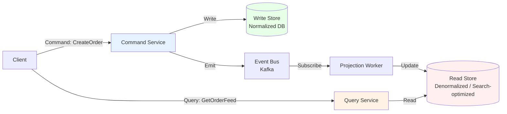

## 1. Overview

Imagine you're building LinkedIn's news feed. It is read hundreds of millions of times a day. It is written (new posts, likes, shares) far less often. A naive system uses one data model for both: when someone writes a post, the write updates the normalized tables. When someone reads the feed, the read queries those same normalized tables with complex JOINs.

At scale, this breaks. The write model (normalized, transactionally safe) and the read model (denormalized, pre-computed, highly optimized for query patterns) have completely different structural requirements. Optimizing for one actively harms the other.

**CQRS** is the pattern that separates them. **Commands** (writes that change state) are handled by one model. **Queries** (reads that return data) are served from a separate, independently optimized model. The two models are eventually consistent.

CQRS is often misunderstood as "just use two databases." It's more specific than that: it is a deliberate architectural decision to have **separate models** for writes and reads, with **explicit synchronization** between them. The synchronization is typically event-driven.

By the end of this guide you'll know:

- When CQRS earns its complexity (and when it absolutely doesn't)
- How projection workers synchronize the read model
- The stale-read bugs that every CQRS system produces and how to mitigate them
- A full Go implementation with Postgres write model and a denormalized read store
- Monitoring for projection lag — the metric that determines whether your read model is trustworthy

---

## 2. Core Concepts

### The Mental Model

Think of a retail store. The cashier's register (write model) records every transaction with full detail — item, quantity, price, timestamp, payment method. The inventory dashboard on the wall (read model) shows a summary: "T-shirts: 42 remaining." The dashboard doesn't participate in every transaction. It gets updated periodically — eventually consistent — but it's optimized for the question being asked: "How many are left?"

CQRS separates these two responsibilities at the code and data model level.

### The Architecture



*CQRS architecture: Commands go to the write service and write store. Events from the write store flow through Kafka to the projection worker. The projection worker maintains a denormalized read store. Queries read from the read store only.*

### Key Components

**Command**: An intent to change state — `PlaceOrder`, `CancelOrder`, `UpdateProfile`. Commands are validated and processed by the write side. They return success/failure, not query results.

**Query**: A request for data — `GetOrderHistory`, `GetUserFeed`. Queries are served entirely from the read side. They must never touch the write store.

**Projection Worker**: Consumes events from the event bus and updates the read store to reflect the latest write-side state. This is the synchronization mechanism. Its lag is the measure of how "stale" the read model is.

**Projection Lag**: The time between an event being emitted by the command side and the read model reflecting that change. In normal operation: milliseconds. Under load spikes: seconds to minutes. This is the key operational metric.

---

## 3. Use Cases

### LinkedIn — Home Feed

LinkedIn's feed aggregates connections' posts, job changes, articles, and comments. The write model is normalized: posts, connections, reactions are stored in transactionally consistent tables. The read model is a pre-computed, denormalized feed per user — essentially a sorted list of feed items with all needed display data pre-fetched.

CQRS enables LinkedIn to scale reads (hundreds of millions/day) independently of writes. The feed read model is served from a cache backed by a key-value store (not relational). The write model remains relational for consistency.

### Twitter (X) — Timeline

Twitter's timeline is classic CQRS. When you post a tweet, the write side records it. Fan-out workers (projection workers) distribute it to your followers' timeline stores. Reads come from these pre-computed stores — no query-time JOINs, no follower count lookups.

The classic Twitter architecture used a "fan-out on write" approach for most users and "fan-out on read" for celebrity accounts with millions of followers (a hybrid to avoid write amplification).

### E-commerce — Order Analytics

An order management system uses CQRS to separate: the transactional write model (each order, each item, each payment) from the analytics read model (daily GMV, top products, refund rates). The write model is normalized Postgres. The read model is a columnar store or a pre-aggregated cache. Updates are event-driven — each order event updates the analytics projection.

---

## 4. Gotchas

### Gotcha 1 — Stale Read After Write (The "404 Not Found" Bug)

The most common CQRS bug: a user creates a resource, then immediately tries to read it. The write completed. The event was emitted. The projection worker hasn't processed it yet (100ms lag). The read store returns "not found."

This appears as:
- User creates a profile → immediately navigates to their profile page → "Profile not found"
- User places an order → immediately checks order status → "Order not found"

**Mitigations**:
1. **Return the resource from the write path**: after a create command, return the created object directly in the HTTP response. Don't redirect the user to the read model for their own just-created entity.
2. **Read-your-writes token**: the command returns a version number or timestamp. The query service uses this to wait until the read model has caught up to at least that version. Example: `GET /orders/123?min_version=7`
3. **Grace period**: show optimistic UI immediately (the data the user just sent) while the read model catches up — don't immediately query the read store after a write.

### Gotcha 2 — Projection Worker as Single Point of Failure

If the projection worker stops, the read model falls behind. The more it falls behind, the more stale reads users see. A single projection worker instance is a reliability risk.

**Production requirement**: Run multiple projection workers in a consumer group (Kafka consumer groups provide partition-based distribution). Each worker owns a subset of partitions. If one worker crashes, the group rebalances.

### Gotcha 3 — Schema Changes on Both Sides

When you change the read model schema (add a field to the feed projection), you may need to rebuild the entire projection from scratch. This means replaying all historical events. At 10 million events, a replay might take hours.

**Plan for this from day one**: design the read model to support incremental updates. Keep the event log (Kafka topic or event store) long enough to allow full rebuilds. Build the projection worker to support backfill mode.

### Gotcha 4 — Two Models, Double the Maintenance

CQRS doubles your model count. Every feature touches both:
- Add a new field to orders → update command model, update projection worker, update read model schema, update query service

Teams underestimate this overhead. For small teams or CRUD applications, CQRS is a net negative: the complexity it adds exceeds the scaling problem it solves.

### Gotcha 5 — Eventual Consistency Breaks Certain UX Patterns

"Update my preferences and show me the updated preferences" — this is a read-after-write pattern that CQRS struggles with by default. The user does not understand eventual consistency. They expect the write to be immediately reflected.

Not all UX patterns are compatible with eventual consistency. Before choosing CQRS, audit your application's most common user workflows. If the majority involve "write then immediately read," you'll spend most of your engineering effort building read-your-writes mitigations.

---

## 5. Where to Use (and Where NOT to Use)

### Use When

- Read traffic is **10x+ write traffic** and the read access pattern differs structurally from the write model
- Read and write **scalability requirements are fundamentally different** (write: ACID relational; read: denormalized, cached, full-text searchable)
- The domain already has **separate read and write services or teams**
- You need to support **multiple read representations** of the same data (order list, order analytics, order audit log) — CQRS lets each read model be independently optimized
- Eventual consistency is **explicitly acceptable** for the use case

### Do NOT Use When

- Your application is a **basic CRUD service** — CQRS doubles your model count for zero benefit
- Your **team is small** (< 5 engineers) — the operational overhead is too high for the team size
- You need **strong consistency** — CQRS defaults to eventual consistency; you can add read-your-writes mitigations but they add significant complexity
- The read model would be **identical to the write model** — if you'd project the same schema, just use the write model

> 💡 **Staff-level insight:** I've reviewed designs where engineers proposed CQRS for a product with 100,000 users and a 3:1 read:write ratio. That's a CRUD app with a slight read skew — nothing that a read replica and a few indexes can't handle. CQRS doesn't solve scaling problems at low scale; it creates operational problems. The pattern earns its complexity when your read and write models genuinely have different structural requirements, not just different load levels.

---

## 6. Code Examples

### Command Side — Write Handler in Go

```go
package command

import (
    "context"
    "database/sql"
    "time"

    "github.com/google/uuid"
)

// OrderCommand represents an intent to create an order.
// Commands are validated — they must be well-formed before reaching the handler.
type CreateOrderCommand struct {
    UserID string
    Items  []OrderItem
    Amount float64
}

type OrderItem struct {
    SKU      string
    Quantity int
    Price    float64
}

// Order is the write-side model — normalized, ACID-safe.
type Order struct {
    ID        string
    UserID    string
    Amount    float64
    Status    string
    CreatedAt time.Time
}

// CommandHandler processes commands and writes to the normalized store.
// It emits events to Kafka via the Outbox Pattern for reliability.
type CommandHandler struct {
    db     *sql.DB
    outbox OutboxWriter // See Outbox Pattern article
}

// Handle creates an order and emits OrderCreated to the event bus.
// Returns the created order ID for the caller to use in the HTTP response —
// don't make the caller query the read model for a resource they just created.
func (h *CommandHandler) Handle(ctx context.Context, cmd CreateOrderCommand) (string, error) {
    order := &Order{
        ID:        uuid.New().String(),
        UserID:    cmd.UserID,
        Amount:    cmd.Amount,
        Status:    "pending",
        CreatedAt: time.Now(),
    }

    tx, err := h.db.BeginTx(ctx, nil)
    if err != nil {
        return "", err
    }
    defer tx.Rollback()

    // Write the order to the write store (normalized)
    _, err = tx.ExecContext(ctx,
        `INSERT INTO orders (id, user_id, amount, status, created_at)
         VALUES ($1, $2, $3, $4, $5)`,
        order.ID, order.UserID, order.Amount, order.Status, order.CreatedAt,
    )
    if err != nil {
        return "", err
    }

    // Write items
    for _, item := range cmd.Items {
        _, err = tx.ExecContext(ctx,
            `INSERT INTO order_items (order_id, sku, quantity, price) VALUES ($1, $2, $3, $4)`,
            order.ID, item.SKU, item.Quantity, item.Price,
        )
        if err != nil {
            return "", err
        }
    }

    // Emit event via outbox (same transaction = atomic with write)
    err = h.outbox.Write(ctx, tx, "orders.created", order.ID, OrderCreatedEvent{
        OrderID:   order.ID,
        UserID:    order.UserID,
        Amount:    order.Amount,
        Items:     cmd.Items,
        CreatedAt: order.CreatedAt,
    })
    if err != nil {
        return "", err
    }

    return order.ID, tx.Commit()
}

type OrderCreatedEvent struct {
    OrderID   string       `json:"order_id"`
    UserID    string       `json:"user_id"`
    Amount    float64      `json:"amount"`
    Items     []OrderItem  `json:"items"`
    CreatedAt time.Time    `json:"created_at"`
}

type OutboxWriter interface {
    Write(ctx context.Context, tx *sql.Tx, topic, key string, payload interface{}) error
}
```

### Projection Worker — Sync Read Model

```go
package projection

import (
    "context"
    "database/sql"
    "encoding/json"
    "log"
    "time"
)

// OrderFeedProjection maintains the denormalized read store for order feeds.
// The read model is optimized for "show me this user's recent orders" — a query
// that would require joins and aggregation on the normalized write model.
type OrderFeedProjection struct {
    readDB *sql.DB
}

// OrderReadModel is the denormalized representation optimized for the feed query.
// All data needed for display is pre-computed — no JOINs at read time.
type OrderReadModel struct {
    OrderID      string
    UserID       string
    Amount       float64
    Status       string
    ItemCount    int
    ItemSummary  string // e.g., "T-shirt x2, Mug x1"
    CreatedAt    time.Time
}

// HandleOrderCreated processes the OrderCreated event and upserts the read model.
// This is idempotent — if the event is delivered twice, the upsert is a no-op.
func (p *OrderFeedProjection) HandleOrderCreated(ctx context.Context, raw []byte) error {
    var event OrderCreatedEvent
    if err := json.Unmarshal(raw, &event); err != nil {
        return err
    }

    summary := buildItemSummary(event.Items)

    // Upsert: safe for at-least-once delivery from the outbox
    _, err := p.readDB.ExecContext(ctx, `
        INSERT INTO order_feed (order_id, user_id, amount, status, item_count, item_summary, created_at)
        VALUES ($1, $2, $3, 'pending', $4, $5, $6)
        ON CONFLICT (order_id) DO UPDATE SET
            status = EXCLUDED.status,
            item_count = EXCLUDED.item_count,
            item_summary = EXCLUDED.item_summary
    `, event.OrderID, event.UserID, event.Amount,
        len(event.Items), summary, event.CreatedAt,
    )
    return err
}

// HandleOrderStatusUpdated keeps the read model current when order status changes.
func (p *OrderFeedProjection) HandleOrderStatusUpdated(ctx context.Context, raw []byte) error {
    var event OrderStatusUpdatedEvent
    if err := json.Unmarshal(raw, &event); err != nil {
        return err
    }
    _, err := p.readDB.ExecContext(ctx, `
        UPDATE order_feed SET status = $2 WHERE order_id = $1
    `, event.OrderID, event.NewStatus)
    return err
}

func buildItemSummary(items []OrderItem) string {
    // Simplified — in production use a loop building "SKU x Qty" strings
    if len(items) == 0 {
        return "No items"
    }
    return items[0].SKU + " x" + string(rune('0'+items[0].Quantity)) // simplified
}

// --- Consumer wiring (Kafka consumer group) ---

type Consumer struct {
    projection *OrderFeedProjection
    // In production: kafka.ConsumerGroup from segmentio/kafka-go or confluent-kafka-go
}

func (c *Consumer) ProcessMessage(ctx context.Context, topic string, payload []byte) error {
    switch topic {
    case "orders.created":
        return c.projection.HandleOrderCreated(ctx, payload)
    case "orders.status_updated":
        return c.projection.HandleOrderStatusUpdated(ctx, payload)
    default:
        log.Printf("[projection] unknown topic: %s", topic)
        return nil
    }
}
```

### Query Side — Serve from Read Model

```go
package query

import (
    "context"
    "database/sql"
    "time"
)

// QueryService reads exclusively from the denormalized read store.
// Never touches the write store — this is the CQRS discipline.
type QueryService struct {
    readDB *sql.DB
}

type OrderSummary struct {
    OrderID     string
    Amount      float64
    Status      string
    ItemCount   int
    ItemSummary string
    CreatedAt   time.Time
}

// GetUserOrders returns the paginated order feed for a user.
// This query is fast because order_feed is denormalized — no JOINs needed.
func (q *QueryService) GetUserOrders(ctx context.Context, userID string, limit, offset int) ([]OrderSummary, error) {
    rows, err := q.readDB.QueryContext(ctx, `
        SELECT order_id, amount, status, item_count, item_summary, created_at
        FROM order_feed
        WHERE user_id = $1
        ORDER BY created_at DESC
        LIMIT $2 OFFSET $3
    `, userID, limit, offset)
    if err != nil {
        return nil, err
    }
    defer rows.Close()

    var orders []OrderSummary
    for rows.Next() {
        var o OrderSummary
        if err := rows.Scan(&o.OrderID, &o.Amount, &o.Status,
            &o.ItemCount, &o.ItemSummary, &o.CreatedAt); err != nil {
            return nil, err
        }
        orders = append(orders, o)
    }
    return orders, rows.Err()
}
```

---

## 7. Scale Discussion

### 10x Load (100 writes/second → Projection Worker)

At 100 writes/second, a single Postgres-backed projection worker keeps up with sub-second lag. This is the sweet spot for polling-based CQRS.

### 100x Load (1,000 writes/second)

At 1,000 writes/second, a single projection worker struggles. The write-side emits 1,000 events/second; the worker must process all of them. Consider:
- **Multiple projection workers in a Kafka consumer group** — partition the event topic by entity (e.g., by user ID), and run N workers each owning N/P partitions
- **Batch processing in the projection worker** — instead of one DB write per event, accumulate 100 events and write in a single batch INSERT

### 1000x Load (10,000 writes/second)

At this scale, projection lag becomes a latency SLA. The read model is minutes behind the write model during peak load. Mitigations:
- Pre-partition the read model (shard by user ID)
- Use a cache (Redis) as the read model hot layer, backed by Postgres as the durable layer
- Project only deltas, not full records, to reduce the write amplification of the projection worker

---

## 8. Monitoring & Observability

| Metric                                               | Type      | Alert Condition                             |
| ---------------------------------------------------- | --------- | ------------------------------------------- |
| `projection_lag_events{projection}`                  | Gauge     | Alert if > 10,000 events behind             |
| `projection_lag_seconds{projection}`                 | Gauge     | Alert if > 30s for user-visible projections |
| `projection_errors_total{projection, event_type}`    | Counter   | Alert immediately on any error              |
| `projection_processing_duration_seconds{projection}` | Histogram | Alert if p99 > 500ms (worker struggling)    |
| `command_side_events_total{type}`                    | Counter   | Compare to projection worker consumed rate  |

**Dashboard to build**: Plot `projection_lag_seconds` alongside the command-side event emission rate. When write load spikes, watch whether the projection worker's lag increases. Set an alert threshold that gives the on-call enough time to act before users notice stale data.

---

## 9. Interview Questions

**Q1: "When would you use CQRS? What are the downsides?"**

Key points:
- Use when: read traffic is 10x+ write, read and write models require different structures, you need multiple read representations of the same data
- Downsides: eventual consistency (stale reads), two models to maintain, projection lag under load, read-after-write UX bugs
- Knowing when NOT to use it is the staff-level signal: for a basic CRUD app, CQRS doubles complexity with zero benefit

Common mistake: Recommending CQRS for any service with more reads than writes. The ratio isn't the trigger — the structural difference between the read and write models is.

---

**Q2: "A user creates an order and immediately checks the order status page. It shows 'Not Found.' Why?"**

Key points:
- This is the stale-read-after-write bug
- The command committed successfully; the event was emitted; the projection worker hasn't processed it yet (100ms lag is normal)
- Mitigation 1: Return the order object directly from the command response, don't redirect to a read-model query
- Mitigation 2: Read-your-writes consistency token — the command returns a version, the query waits for that version
- Mitigation 3: Optimistic UI — show what the user just submitted without querying the read model

Interviewer wants: Evidence that you've actually seen and debugged this in production.

---

**Q3: "How do you handle projection schema changes when you have 100M historical events?"**

Key points:
- Schema change requires rebuilding the projection from event history (event replay)
- 100M events × 10ms per event ≈ 11 days of replay time
- Mitigation: Keep the read model schema backwards compatible where possible
- For unavoidable breaking changes: build a new projection alongside the old one, replay into the new one, cut over traffic when caught up
- This is why the event log retention period matters — if Kafka events expire after 7 days and the replay takes 11 days, you can't rebuild

Interviewer wants: Understanding of the full lifecycle of a CQRS system, not just the happy path.

---

## 10. Staff-Level Preparation Tips

### What to Build

1. **Implement CQRS with a projection lag simulator**: write a toy order service with a Postgres write store and a second Postgres read store. Write 1,000 orders/second. Measure projection lag. Observe when it starts to increase. This gives you real numbers to quote in interviews.

2. **Reproduce the stale-read bug**: in your toy system, write an order and immediately query the read model. Add a 200ms sleep in the projection worker. See the "Not Found" response. Then implement the read-your-writes mitigation. This is the gotcha converted into a solved exercise.

3. **Build a projection rebuild**: change the read model schema (add a column). Write a replay script that consumes all historical Kafka events and rebuilds the projection. Observe the lag during rebuild. This experience is directly transferable to production.

### What to Study Deeper

- **Martin Fowler — CQRS**: https://martinfowler.com/bliki/CQRS.html — concise and authoritative
- **"CQRS Journey"** — Microsoft Patterns & Practices: https://github.com/microsoftarchive/cqrs-journey — a detailed case study
- **Greg Young — CQRS and Event Sourcing**: https://www.youtube.com/watch?v=JHGkaShoyNs — the original thought leader on this topic

### How This Connects to Broader System Design

- **CQRS + Event Sourcing**: frequently combined. Event Sourcing is the write side (events are the source of truth). CQRS is how you build read models from those events. They have different value propositions and can be used independently.
- **CQRS + Outbox**: the command side uses the Outbox Pattern to reliably emit events. The projection worker consumes those events. This is the standard production setup.
- **CQRS + Saga**: the Saga generates state-change events that feed CQRS projections. This is how order status is reflected in the order feed in real time.

> 💡 **Staff-level insight:** At every company where I've seen CQRS succeed, there was someone who owned the projection lag metric and treated it as an SLA. At every company where it failed, that metric didn't exist or nobody was paged when it degraded. The operational discipline around projection lag is what separates a CQRS system that works from one that silently serves stale data until a customer complaint reveals it.

---

## 11. References

### Books

- **"Designing Data-Intensive Applications"** — Martin Kleppmann. Chapter 11 for event-driven architectures, Chapter 12 for derived data. [O'Reilly](https://www.oreilly.com/library/view/designing-data-intensive-applications/9781491903063/)
- **"Microservices Patterns"** — Chris Richardson. Dedicated chapter on CQRS. [Manning](https://www.manning.com/books/microservices-patterns)

### Engineering Blogs & Talks

- **Martin Fowler — CQRS**: https://martinfowler.com/bliki/CQRS.html
- **Greg Young — CQRS and Event Sourcing (GOTO 2014)**: https://www.youtube.com/watch?v=JHGkaShoyNs
- **Microsoft CQRS Journey**: https://github.com/microsoftarchive/cqrs-journey
- **LinkedIn Engineering — Feed Architecture**: https://engineering.linkedin.com/blog
