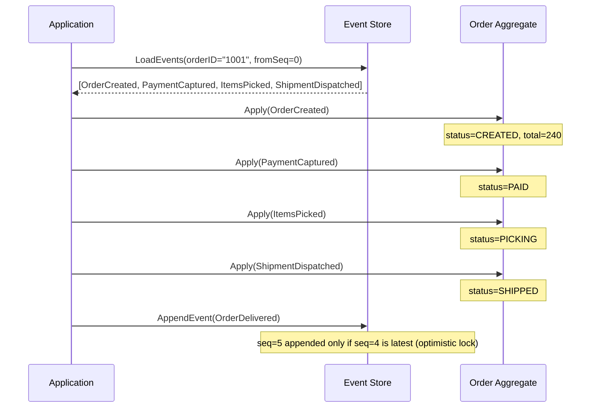

## 1. Overview

Most databases store the current state of the world. You create a row, you update it, you delete it. At any point in time, you can query the row and see what it looks like *right now*. But you have no idea how it got there.

Event Sourcing flips this model on its head. Instead of storing current state, you store the **history of changes** — a sequence of immutable events — and derive current state by replaying those events from the beginning.

Think of it like a bank account. Your bank doesn't store a single row that says "balance: $1,200." Your bank stores every transaction that ever happened to your account: "deposited $500 on Jan 1", "withdrew $200 on Jan 5", "transferred $100 on Jan 10." Your current balance is derived by replaying all those transactions. If your bank's database were a single mutable row, you'd never be able to explain a fraud dispute. Events are the source of truth.

The mental model: **Event Sourcing is Git for your data.** Just as Git stores every commit instead of just the current file contents, your event store stores every change instead of just the current row. You can checkout any point in history, diff two states, and audit every modification.

By the end of this guide you'll understand:

- Why storing events instead of state fundamentally changes what your system can do
- How to design an append-only event store that scales
- Why snapshotting is mandatory once your aggregate has more than ~1,000 events
- Why schema evolution — not the pattern itself — is what kills event sourcing implementations
- How projections work and why they're your read model
- What Event Sourcing is *not* (it's not CQRS, even though they're often used together)

---

## 2. Core Concepts

### The Mental Model in Detail

In a traditional CRUD system, your database is a snapshot machine — it only shows you the present. In an event-sourced system, your event store is a time machine — it shows you every moment in history.

```
CRUD System:
  orders table:
  +----------+--------+----------+
  | order_id | status | total    |
  +----------+--------+----------+
  | 1001     | SHIPPED| $240.00  |   ← you can see WHAT it is, not HOW it got here
  +----------+--------+----------+

Event Sourced System:
  order_events table:
  +----------+-----+-------------------+----------------------------+
  | order_id | seq | event_type        | payload                    |
  +----------+-----+-------------------+----------------------------+
  | 1001     | 1   | OrderCreated      | {items: [...], total: 240} |
  | 1001     | 2   | PaymentCaptured   | {amount: 240, method: cc}  |
  | 1001     | 3   | ItemsPicked       | {warehouse: "DEN-1"}       |
  | 1001     | 4   | ShipmentDispatched| {tracking: "1Z999AA10..."}|
  +----------+-----+-------------------+----------------------------+
  ← current state is computed by replaying events 1→4
```

*In CRUD the current row overwrites history. In Event Sourcing, every transition is permanently recorded.*

### Key Terminology

**Aggregate** — The domain object whose state is reconstructed by replaying events. An Order, a BankAccount, a User. Each aggregate has a unique ID. Events in the event store are scoped to an aggregate ID.

**Event** — An immutable fact that something happened. Past tense by convention: `OrderCreated`, `PaymentCaptured`, not `CreateOrder` or `CapturePayment`. An event happened — it cannot be un-happened.

**Event Store** — An append-only log keyed by aggregate ID, with sequence numbers ensuring ordering. The only operations: append an event, read events for an aggregate since sequence N.

**Projection** — A read model derived by processing events. You might have a projection that answers "what are all the open orders for user 42?" by processing all `OrderCreated` and `OrderCancelled` events and maintaining a denormalized query table.

**Snapshot** — A periodically saved checkpoint of aggregate state at a given sequence number. Instead of replaying 10,000 events to reconstruct an aggregate, load the snapshot at seq 9,950 and replay only the last 50 events.

### How Aggregate Reconstruction Works



*Aggregate reconstruction: load events, replay them one by one, then append new events. Optimistic concurrency prevents two writers from appending at the same sequence number.*

### Optimistic Concurrency Control

This is critical and often glossed over. When multiple processes try to modify the same aggregate simultaneously, you need to prevent lost updates. The solution: **expected sequence number**.

When you load an aggregate, you note the last sequence number you loaded. When you append a new event, you assert: "this should be the next event, i.e., the current last sequence number must still be what I saw." If someone else appended between your load and your write, the assertion fails and you retry.

This is exactly how Git handles concurrent commits to the same branch.

### Snapshotting

Imagine an e-commerce order with 10,000 events — unlikely, but a bank account with 10,000 transactions is common. Replaying 10,000 events on every read is unacceptable.

The solution: periodically save the current aggregate state alongside the sequence number that produced it. On load, find the latest snapshot first, then replay only events *after* the snapshot sequence.

```
Load Algorithm:
  1. FindLatestSnapshot(aggregateID)
     → Snapshot{seq: 9,950, state: {balance: $1,200}}
  2. LoadEvents(aggregateID, fromSeq: 9,951)
     → [Deposit $50, Withdraw $25]  (only 2 events)
  3. Apply events to snapshot state
     → current state: {balance: $1,225}

  Without snapshot: replay all 10,000 events.
  With snapshot: replay 2 events. 5,000x speedup.
```

### Event Store Design (Append-Only Write)

The core invariant: **events are never updated or deleted**. Corrections are new events. If you accidentally charged someone twice, you don't edit the `PaymentCaptured` event — you append a `PaymentRefunded` event.

The write path must enforce:
1. **Append-only** — no UPDATE, no DELETE on events
2. **Ordered per aggregate** — sequence numbers must be monotonically increasing per aggregate
3. **Atomic append** — one event at a time, with the expected sequence number check

The read path must support:
1. **Load all events for an aggregate** (the most common read)
2. **Load events after a given sequence** (for catch-up projections)
3. **Load events for all aggregates in time order** (for rebuilding global projections)

---

## 3. Use Cases

### Financial Systems — Trading and Audit Logs

Every financial system—from Goldman Sachs's trading platform to a modern fintech like Stripe—has a regulatory requirement to store every transaction. Event Sourcing is a natural fit: every change to a position, a balance, a trade, is an immutable event.

At trading firms like Jane Street or Citadel, the order lifecycle is modeled as events: `OrderSubmitted`, `OrderAcknowledged`, `PartialFill`, `FullFill`, `OrderCancelled`. The current state of a position is the sum of all fills. An audit of any position at any point in time is simply a replay of events up to that timestamp.

This is why CQRS/ES shops in fintech rarely migrate *away* from the pattern — the audit trail is now a regulatory asset, not just an implementation detail.

### E-Commerce Order Lifecycle

Amazon's order management system tracks an order through many states: placed, payment pending, payment captured, fulfillment started, items picked, shipped, delivered, returned. A bug in the "returned" state? You can replay the exact sequence of events for that order to debug it in staging.

More importantly, at Amazon's scale, projections built from the same event stream power multiple views:
- The customer-facing order status page (projection: "latest status per order")
- The warehouse fulfillment dashboard (projection: "orders pending picking")
- The finance ledger (projection: "revenue by day from PaymentCaptured events")

The events are written once. The read models are derived independently.

### Axon Framework Use Cases at CQRS/ES Shops

Axon Framework (Java) is the leading Event Sourcing framework for JVM applications. Companies like Travelport, bol.com (a Dutch Amazon equivalent), and dozens of financial services firms use it. One common pattern: using the Axon event store to build a "temporal query" capability — "what did the system believe about customer X at 09:00:00 on Jan 3rd?" — by replaying just the events before that timestamp.

This kind of temporal query is impossible with CRUD databases unless you build explicit audit tables. With Event Sourcing, it's a loop.

---

## 4. Gotchas

### Gotcha 1 — Schema Evolution at 1 Billion Events

This is the gotcha that kills Event Sourcing implementations in year two.

You ship `OrderCreated` with payload `{itemIds: [1, 2, 3]}`. Six months later, business logic requires storing item quantities: `{items: [{id: 1, qty: 2}]}`. What do you do with the billion `OrderCreated` events already in the store?

Option A — **Upcasting**: When you load an old event, a transformation function upgrades its schema to the latest version on the fly. This works but adds latency to every aggregate load. With many schema versions, you chain transformations, and bugs in upcasting code are catastrophic.

Option B — **Weak schema / Avro or Protobuf with schema registry**: Use Avro or Protobuf for your event payload, not raw JSON. Both support backwards-compatible evolution (add optional fields, don't remove required ones). With a schema registry (Confluent or AWS Glue), your deserializer always knows what schema version a given event uses.

**Never use raw JSON for event payloads in a production Event Sourcing system.** JSON has no schema. You will accumulate technical debt in your deserializer code as fast as you accumulate features. Use Protobuf or Avro from day one.

### Gotcha 2 — Replay Cost Without Snapshots

At launch, your orders have 10 events. Replay cost: negligible. After 2 years of a complex order lifecycle with state machine transitions, edge cases, and re-schedules, an order might have 200–500 events. Replay cost: still manageable.

But a bank account, a user profile with 5 years of changes, or a gaming character with every action logged? Without snapshotting, you are replaying thousands of events per request. This will hit you in production at scale.

**Rule of thumb**: Implement snapshotting before you need it. Set the snapshot interval at aggregate creation time (e.g., snapshot every 100 events). The cost of writing a snapshot is negligible. The cost of not having one when your aggregate has 50,000 events is very, very high.

### Gotcha 3 — Projections That Fall Behind

Projections are eventually consistent. If your projection builder processes 10,000 events/second and you emit 20,000 events/second during a peak, your projection is falling behind. A "what orders are ready for picking" projection that's 5 minutes behind will cause warehouses to be picking already-cancelled orders.

Monitor projection lag. Alert at 10 seconds behind. Page at 60 seconds behind. And design your UI to show staleness indicators (Dynamo's "read your own writes" consistency is relevant here).

### Gotcha 4 — Deleting Events (GDPR)

The EU's GDPR grants users the "right to be forgotten." Your immutable event log now has a regulatory problem.

The cleanest solution: **Crypto-shredding**. Encrypt personal data in event payloads with a per-user key stored in a separate key store. When the user requests deletion, delete their key. All their events are now unreadable (the data is there but the key is gone). This satisfies GDPR without actually deleting events.

Do **not** delete events. The event store invariant — append-only — is the foundation of the entire pattern. Once events are deleteable, your audit trail is no longer trustworthy.

### Gotcha 5 — Treating Event Sourcing as a Message Queue

Event Sourcing stores events for **replay**. Kafka and RabbitMQ carry events for **consumption**. They solve different problems.

A common anti-pattern: using Kafka as your event store and having consumers track offsets as aggregate state. This breaks when you need to replay a specific aggregate from the beginning — Kafka's offset model doesn't let you efficiently load "all events for order 1001 since the beginning."

Use a proper event store (EventStoreDB, a PostgreSQL append table, or DynamoDB) for persistence. Use Kafka or SNS/SQS for fan-out notification that events occurred. These two roles should not be conflated.

---

## 5. Where to Use (and Where NOT to Use)

### Use Event Sourcing when:

- **Audit and compliance are mandatory** — financial transactions, healthcare records, legal document changes. The event log is your audit trail.
- **You need temporal queries** — "what did the system look like at 9:00 AM last Tuesday?"
- **Complex domain with many state transitions** — order lifecycle, payment processing, insurance claims. Events naturally model the workflow.
- **Multiple read models from the same write model** — you need the same data shaped differently for different consumers.
- **Debugging production bugs** — replaying the exact sequence of events that caused a bug to a test environment is enormously valuable.

### Do NOT use Event Sourcing when:

- **Simple CRUD with no audit needs** — a settings page, a user preference table. The overhead is not justified.
- **High-write, low-read aggregates with simple state** — a counter, a rate limiter. Use Redis.
- **Your team is not prepared for eventual consistency** — projections are not synchronously consistent with writes. If your team isn't ready for that mental model, the operational complexity will hurt you.
- **You need to query across aggregates in complex ways** — Event Sourcing gives you easy temporal queries per aggregate; joins across aggregates require projection engineering. If your core use case is "give me all orders for customers in Ohio who spent more than $500" from day one, start with CRUD and add Event Sourcing selectively.
- **Strict schema evolution practices aren't paired with it** — without Avro/Protobuf and a schema registry, Event Sourcing becomes a schema archaeology nightmare.

> 💡 **Staff-level insight:** Event Sourcing's biggest return on investment is not the audit trail or the projections. It's **debugging**. When a production incident occurs, you replay the exact stream of events that led to the broken state in a staging environment. You can step through events one by one. This turns 4 AM debugging from "what happened?" to "let me replay the timeline." At PayPal, Goldman Sachs, and other financial firms, this capability alone justifies the pattern.

---

## 6. Versus: Comparisons

### Event Sourcing vs CRUD

| Aspect              | CRUD                       | Event Sourcing                   |
| ------------------- | -------------------------- | -------------------------------- |
| Storage model       | Current state only         | Full history of changes          |
| Audit trail         | Requires extra audit table | Built-in                         |
| Temporal queries    | Complex / impossible       | Native                           |
| Schema changes      | ALTER TABLE + migration    | Schema evolution in deserializer |
| Query flexibility   | Any SQL JOIN               | Only per-aggregate or projection |
| Complexity          | Low                        | High                             |
| Debugging           | "What is it now?"          | "How did it get here?"           |
| GDPR delete         | DELETE row                 | Crypto-shredding required        |
| Team learning curve | Near zero                  | High                             |

**Choose CRUD when:** Your domain is simple, you don't need audit, and your team doesn't have Event Sourcing experience. Most web applications should start here.

**Choose Event Sourcing when:** You need audit trails, temporal queries, or multiple read models, and your team can absorb the operational complexity.

### Event Sourcing vs CQRS

This is the most common confusion. **They are not the same thing. They are not interchangeable. They are complementary.**

| Aspect               | Event Sourcing                             | CQRS                                                      |
| -------------------- | ------------------------------------------ | --------------------------------------------------------- |
| What it is           | Storage strategy: store events, not state  | Query strategy: separate read and write models            |
| What it solves       | Audit, replay, temporal queries            | Read/write performance imbalance, read model flexibility  |
| Requires the other?  | No — you can use ES without CQRS           | No — you can use CQRS without ES                          |
| Often used together? | Yes — events from ES feed CQRS read models | Yes — CQRS read models are often projections of ES events |
| Core invariant       | Events are immutable facts                 | Commands mutate write model; queries hit read model       |

You can have CQRS on top of a plain CRUD write model (separate DB tables for reads and writes, synchronized via CDC or triggers). You can have Event Sourcing without separate read models (rarely wise, but valid). In practice, they pair naturally: ES provides the event stream; CQRS consumes it to build read models.

**Choose Event Sourcing + CQRS when:** You need audit, multiple read models, and you can invest in the infrastructure. This is the pattern for serious domain-driven design shops.

---

## 7. Code Examples

```go
package eventsourcing

import (
	"context"
	"encoding/json"
	"errors"
	"fmt"
	"time"
)

// ─── Domain Events ─────────────────────────────────────────────────────────

// Event is the base type for all domain events.
// Using a typed envelope avoids magic string parsing in Apply().
type Event struct {
	AggregateID string          `json:"aggregate_id"`
	Sequence    int64           `json:"sequence"`
	Type        string          `json:"type"`
	OccurredAt  time.Time       `json:"occurred_at"`
	Payload     json.RawMessage `json:"payload"`
}

// In production, use Protobuf or Avro for Payload — not json.RawMessage.
// json.RawMessage has no schema; you will regret it on schema migration.

type OrderCreatedPayload struct {
	CustomerID string  `json:"customer_id"`
	Total      float64 `json:"total"`
}

type PaymentCapturedPayload struct {
	Amount    float64 `json:"amount"`
	Reference string  `json:"reference"`
}

type OrderShippedPayload struct {
	TrackingNumber string `json:"tracking_number"`
}

// ─── Aggregate ─────────────────────────────────────────────────────────────

type OrderStatus string

const (
	StatusCreated   OrderStatus = "CREATED"
	StatusPaid      OrderStatus = "PAID"
	StatusShipped   OrderStatus = "SHIPPED"
)

// OrderAggregate holds the in-memory state rebuilt from events.
// Notice: no database annotations. This is pure domain logic.
type OrderAggregate struct {
	ID             string
	Status         OrderStatus
	Total          float64
	TrackingNumber string
	// lastSequence is the sequence number of the last event applied.
	// Used for optimistic concurrency: when we append, we pass this as
	// "expectedSequence" to the event store. If someone else appended
	// in the meantime, their sequence will be higher and our append fails.
	lastSequence int64
}

// Apply is the ONLY place where aggregate state changes.
// It is called both during replay (loading from store) and
// after a command is validated and a new event is created.
func (o *OrderAggregate) Apply(event Event) error {
	switch event.Type {
	case "OrderCreated":
		var p OrderCreatedPayload
		if err := json.Unmarshal(event.Payload, &p); err != nil {
			return fmt.Errorf("unmarshal OrderCreated: %w", err)
		}
		o.ID = event.AggregateID
		o.Status = StatusCreated
		o.Total = p.Total

	case "PaymentCaptured":
		if o.Status != StatusCreated {
			// Invariant guard: payment can only be captured on a created order.
			// In a replay this should never happen if events were stored correctly.
			return fmt.Errorf("cannot capture payment on order in status %s", o.Status)
		}
		o.Status = StatusPaid

	case "OrderShipped":
		var p OrderShippedPayload
		if err := json.Unmarshal(event.Payload, &p); err != nil {
			return fmt.Errorf("unmarshal OrderShipped: %w", err)
		}
		o.Status = StatusShipped
		o.TrackingNumber = p.TrackingNumber

	default:
		// Unknown events are silently skipped during replay.
		// This forward-compatibility is intentional: old code replaying
		// events produced by new code should not crash.
	}
	o.lastSequence = event.Sequence
	return nil
}

// ─── Event Store Interface ─────────────────────────────────────────────────

// EventStore is the storage abstraction. Define it as an interface
// so you can swap PostgreSQL for EventStoreDB or an in-memory store in tests.
type EventStore interface {
	// AppendEvents appends events to the aggregate's stream.
	// expectedSequence is the optimistic concurrency check:
	// if the current last sequence != expectedSequence, return ErrConcurrencyConflict.
	AppendEvents(ctx context.Context, aggregateID string, expectedSequence int64, events []Event) error

	// LoadEvents loads all events for an aggregate from fromSequence onward.
	// fromSequence=0 means load all events from the beginning.
	LoadEvents(ctx context.Context, aggregateID string, fromSequence int64) ([]Event, error)

	// SaveSnapshot saves an aggregate snapshot at a given sequence number.
	SaveSnapshot(ctx context.Context, snap Snapshot) error

	// LoadLatestSnapshot loads the most recent snapshot for an aggregate.
	// Returns nil, nil if no snapshot exists.
	LoadLatestSnapshot(ctx context.Context, aggregateID string) (*Snapshot, error)
}

var ErrConcurrencyConflict = errors.New("concurrency conflict: sequence mismatch")

// ─── Snapshot ──────────────────────────────────────────────────────────────

type Snapshot struct {
	AggregateID string          `json:"aggregate_id"`
	Sequence    int64           `json:"sequence"`
	State       json.RawMessage `json:"state"`
	CreatedAt   time.Time       `json:"created_at"`
}

// ─── Repository (Load + Save) ───────────────────────────────────────────────

const snapshotInterval = 50 // Save a snapshot every 50 events

// OrderRepository loads and saves OrderAggregates via the event store.
type OrderRepository struct {
	store EventStore
}

func NewOrderRepository(store EventStore) *OrderRepository {
	return &OrderRepository{store: store}
}

// Load reconstructs an OrderAggregate from the event store.
// It first checks for a snapshot to avoid replaying all events from seq=0.
func (r *OrderRepository) Load(ctx context.Context, orderID string) (*OrderAggregate, error) {
	order := &OrderAggregate{}
	fromSeq := int64(0)

	// Try to find a snapshot first — this is the performance-critical path.
	snap, err := r.store.LoadLatestSnapshot(ctx, orderID)
	if err != nil {
		return nil, fmt.Errorf("load snapshot: %w", err)
	}
	if snap != nil {
		// Restore state from snapshot
		if err := json.Unmarshal(snap.State, order); err != nil {
			return nil, fmt.Errorf("unmarshal snapshot state: %w", err)
		}
		fromSeq = snap.Sequence + 1 // only load events AFTER the snapshot
	}

	// Load only the events the snapshot doesn't cover
	events, err := r.store.LoadEvents(ctx, orderID, fromSeq)
	if err != nil {
		return nil, fmt.Errorf("load events: %w", err)
	}

	// Replay events to bring aggregate to current state
	for _, e := range events {
		if err := order.Apply(e); err != nil {
			return nil, fmt.Errorf("apply event seq=%d type=%s: %w", e.Sequence, e.Type, err)
		}
	}

	return order, nil
}

// Save appends new events to the event store, with a snapshot check.
func (r *OrderRepository) Save(ctx context.Context, order *OrderAggregate, newEvents []Event) error {
	if err := r.store.AppendEvents(ctx, order.ID, order.lastSequence, newEvents); err != nil {
		return err
	}

	// After appending, check if we should take a snapshot.
	// We snapshot every snapshotInterval events to cap future replay cost.
	lastSeq := order.lastSequence + int64(len(newEvents))
	if lastSeq%snapshotInterval == 0 {
		state, err := json.Marshal(order)
		if err != nil {
			// Snapshot failure is non-fatal — log it, but don't fail the write.
			// The event store is the source of truth; the snapshot is an optimization.
			_ = fmt.Errorf("snapshot marshal failed (non-fatal): %w", err)
		} else {
			snap := Snapshot{
				AggregateID: order.ID,
				Sequence:    lastSeq,
				State:       state,
				CreatedAt:   time.Now(),
			}
			// Also non-fatal; failure just means next load replays more events
			_ = r.store.SaveSnapshot(ctx, snap)
		}
	}
	return nil
}

// ─── Projection ────────────────────────────────────────────────────────────

// OpenOrdersProjection is a read model: a denormalized view of all open orders.
// It is rebuilt by consuming all OrderCreated and OrderShipped events.
// This is your CQRS query side — separate from the write model above.
type OpenOrdersProjection struct {
	OpenOrders map[string]float64 // orderID → total
}

func NewOpenOrdersProjection() *OpenOrdersProjection {
	return &OpenOrdersProjection{OpenOrders: make(map[string]float64)}
}

// HandleEvent processes a single event to update the projection.
// In production, this is called by a Kafka consumer or event store subscription.
func (p *OpenOrdersProjection) HandleEvent(event Event) {
	switch event.Type {
	case "OrderCreated":
		var payload OrderCreatedPayload
		if err := json.Unmarshal(event.Payload, &payload); err != nil {
			return
		}
		p.OpenOrders[event.AggregateID] = payload.Total
	case "OrderShipped":
		// Shipped orders are no longer "open"
		delete(p.OpenOrders, event.AggregateID)
	}
}
```

*The separation between `Apply` (write-side aggregate reconstruction) and `HandleEvent` (read-side projection) is the core of the Event Sourcing + CQRS split. Apply is called during command handling; HandleEvent is called by a background consumer.*

---

## 8. Scale Discussion

### At 10x Load (moderate scale — millions of events)

Aggregate load is the bottleneck. Without snapshotting, loading a high-activity aggregate (a bank account with years of transactions) becomes O(n) in the number of events. At 10x load, the tail latency for these "hot aggregates" starts showing up in your p99 metrics.

Start snapshotting at this stage. The snapshot interval of 50–100 events per snapshot is a good starting point. Monitor `snapshot_lag_events` (how many events since the last snapshot) and alert when it exceeds 500.

### At 100x Load (large scale — billions of events)

Your event store is now large. A PostgreSQL event table with 1 billion rows needs careful partitioning. Partition by `aggregate_id % N` where N is the number of shards, or use range partitioning by `aggregate_id` hash if your UUID distribution is uniform.

Projection rebuild becomes expensive. Rebuilding an "all open orders" projection from scratch across billion events is a batch job, not an online operation. At this scale, projections are rebuilt incrementally — you don't replay from seq=0, you replay from "last known good seq" and only process the delta.

Schema evolution is your biggest risk. With 1 billion events and multiple schema versions in flight, your upcasting chain must be correct. A bug in version 3→4 upcasting corrupts the aggregate state for every event produced in the version-3 era. Test upcasting logic exhaustively.

### At 1000x Load (web scale — tens of billions of events)

No single PostgreSQL instance handles the write load. You need a purpose-built event store: **EventStoreDB** (purpose-built, available as open source or cloud), **Axon Server**, or a horizontally sharded custom store on DynamoDB.

DynamoDB as an event store: `aggregateId` as partition key, `sequence` as sort key. This gives you O(1) reads per aggregate (DynamoDB partition scan from seq N), near-unlimited write throughput via partition distribution, and atomic conditional writes (`ConditionExpression: sequence = :expectedSeq`) for optimistic concurrency. Netflix and Amazon teams have used DynamoDB-backed event stores at this scale.

Projection fan-out from millions of events per second requires a distributed stream processor — Kafka Streams, Flink, or Spark Streaming — not a single consumer loop.

---

## 9. Monitoring & Observability

| Metric                                | Type      | Alert Condition                                                         |
| ------------------------------------- | --------- | ----------------------------------------------------------------------- |
| `event_store_append_duration_seconds` | Histogram | p99 > 50ms                                                              |
| `event_store_load_duration_seconds`   | Histogram | p99 > 100ms                                                             |
| `replay_duration_seconds`             | Histogram | p99 > 500ms                                                             |
| `snapshot_lag_events`                 | Gauge     | > 500 events since last snapshot                                        |
| `event_store_size_rows`               | Gauge     | Log only — use for capacity planning                                    |
| `projection_lag_seconds`              | Gauge     | > 10s — warn; > 60s — page                                              |
| `projection_errors_total`             | Counter   | Any non-zero rate                                                       |
| `concurrency_conflicts_total`         | Counter   | Sustained rate > 5/min (indicates hot aggregates)                       |
| `snapshot_save_failures_total`        | Counter   | Any non-zero rate (snapshot failures silently degrade load performance) |
| `upcasting_errors_total`              | Counter   | Any non-zero rate — schema evolution bug                                |

**Key dashboard to build**: Projection lag per projection name. If `open-orders-projection` is 45 seconds behind during peak, warehouse operations are affected. This needs its own dashboard panel, not buried in aggregate metrics.

---

## Interview Questions

### Question 1: "Your order management system uses Event Sourcing. An order aggregate has accumulated 50,000 events over 3 years. Describe how you'd address the performance problem."

**Key points to cover:**
- Snapshotting: periodically serialize the aggregate state and save it alongside the sequence number that produced it. On load, find the latest snapshot and replay only subsequent events.
- Snapshot interval selection: balance snapshot write cost vs. replay cost. 50–100 events per snapshot is typical.
- Snapshot invalidation: if your Apply logic changes (bug fix or feature), old snapshots must be invalidated or rebuilt. Version your snapshot schema.
- Archival: events before a certain date can be cold-archived (S3 Glacier). If you never need pre-2020 events for real-time use, move them to cold storage and only restore for audit requests.

**Common mistake:** Candidates propose "just compacting events" — i.e., replacing old events with their net effect. This is not valid. Events are immutable. Compaction destroys the audit trail, which is commonly the core reason for using Event Sourcing.

**What the interviewer wants:** To see that you distinguish snapshot optimization (valid) from event deletion (invalid). To see that you've thought about snapshot versioning when Apply logic changes.

### Question 2: "You've been using raw JSON for event payloads. You have 200 million events in the store. The business needs to add a quantity field to OrderCreated. How do you handle this?"

**Key points to cover:**
- The problem: existing 200M events don't have the quantity field. You cannot add it retroactively without touching every event (which violates append-only).
- Upcasting: write a transformer that, when deserializing an old `OrderCreated` event, adds `quantity: 1` as a default. This is forward-compatible schema evolution.
- Schema registry: migrate to Protobuf or Avro with schema versioning. New events are written at schema version 2; old events are read with version 1 and upcasted.
- Testing: test upcasting with actual archived event snapshots, not just unit tests.
- Prevention: the lesson is to never use raw JSON. Use Protobuf from day one.

**Common mistake:** Proposing to UPDATE old events. This is the wrong answer — it violates the append-only invariant and destroys the audit trail.

**What the interviewer wants:** Schema evolution maturity. Have you done this in production? Do you know about Avro/Protobuf? Do you understand that you cannot mutate events?

### Question 3: "Explain the difference between Event Sourcing and CQRS. Are they the same? Must they be used together?"

**Key points to cover:**
- Event Sourcing is a **storage strategy**: store events, not current state. It answers the write side question: "how do you persist domain changes?"
- CQRS is a **query strategy**: separate read and write models. It answers the read side question: "how do you expose data for different use cases?"
- They are not the same. CQRS can be implemented on top of CRUD (separate read DB, updated by triggers or CDC). Event Sourcing can exist without separate read models (rarely wise, but valid).
- They are naturally complementary: the event stream from Event Sourcing is the ideal feed for building CQRS read models (projections).
- Real-world: most Event Sourcing implementations add CQRS read models on top, because querying the event store directly for complex queries is impractical.

**Common mistake:** Treating them as synonyms or saying "they must be used together." This shows shallow understanding.

**What the interviewer wants:** To see that you understand each pattern individually before combining them. Senior engineers know the pieces. Staff engineers know when to combine them and what the combination costs.

---

## Staff-Level Preparation Tips

**What to build:**
- Implement a minimal event store in PostgreSQL: one table (`aggregate_id`, `sequence`, `type`, `payload`, `occurred_at`), append-only with optimistic concurrency via `WHERE sequence = expectedSeq`.
- Build a projection that rebuilds from seq=0. Then add snapshotting. Measure the replay latency difference.
- Deliberately break your schema by adding a field to a payload type, then write the upcasting logic. Feel the pain — it will make you reach for Protobuf immediately.

**What to study:**
- Greg Young's CQRS/ES videos (YouTube, 2010–2016) — he coined the term and his explanations are still the best
- EventStoreDB documentation: the purpose-built event store with the most production usage
- "Implementing Domain-Driven Design" by Vaughn Vernon — chapters on Event Sourcing and CQRS
- Confluent schema registry documentation for Avro evolution rules

**How it connects to broader system design:**
- Event Sourcing feeds naturally into event-driven architecture: your events are your integration events, published to Kafka or SNS for other services to consume
- It pairs with Domain-Driven Design: aggregates, bounded contexts, domain events all fit together
- At staff level, know when NOT to use it: simple CRUD services don't need it, and forcing it on your entire system is a trap many DDD enthusiasts fall into

---

## References

- [Greg Young — CQRS and Event Sourcing (Talk, 2014)](https://www.youtube.com/watch?v=JHGkaShoyNs)
- [Martin Fowler — Event Sourcing (Pattern)](https://martinfowler.com/eaaDev/EventSourcing.html)
- [EventStoreDB Documentation](https://developers.eventstore.com/)
- [Confluent Schema Registry — Avro Compatibility](https://docs.confluent.io/platform/current/schema-registry/avro.html)
- [Vaughn Vernon — Implementing Domain-Driven Design (Book)](https://www.oreilly.com/library/view/implementing-domain-driven-design/9780133039900/)
- [AWS Architecture Blog — CQRS and Event Sourcing on AWS](https://aws.amazon.com/blogs/architecture/cqrs-and-event-sourcing-with-amazon-dynamodb/)
- [Axon Framework Documentation](https://docs.axoniq.io/reference-guide/)
- [Udi Dahan — Clarified CQRS](https://udidahan.com/2009/12/09/clarified-cqrs/)
