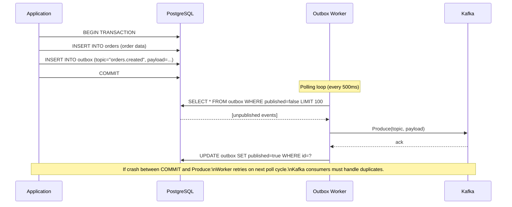

## 1. Overview

You have a microservice that processes an order. When an order is created, two things must happen: the order is saved to Postgres, and an `order.created` event is published to Kafka. You write the code:

```go
db.Save(order)           // Step 1
kafka.Publish(event)     // Step 2
```

The process crashes between step 1 and step 2. The order is in the database. The event was never published. The downstream services (inventory, notification, billing) don't know the order exists. Your system is now in an inconsistent state — silently.

This is the **dual-write problem**. Anytime you write to two different systems (a database and a message broker), you face it. You cannot make two separate writes atomic without distributed coordination — and distributed coordination at scale is exactly what you're trying to avoid.

The **Transactional Outbox Pattern** solves this: write both the domain record AND the event to the same database, in the same transaction. A separate process reads the events from the database and publishes them to Kafka. The database transaction is atomic; if the process crashes, the unpublished event survives in the database and will be published on the next attempt.

The pattern trades **synchronous Kafka publishing** for **eventual Kafka publishing**. The event is guaranteed to be delivered eventually (at-least-once). You lose the ability to guarantee immediate delivery — but you gain consistency.

By the end of this guide you'll know:

- The two delivery mechanisms: polling and CDC (Change Data Capture)
- How to implement the outbox in Go with Postgres and Kafka
- The operations you must build from day one (cleanup, monitoring)
- The differences from 2PC and why this is almost always the better choice
- When NOT to use it

---

## 2. Core Concepts

### The Mental Model

The outbox is a staging table in your database. Your service writes there. A relay process reads from there and forwards to Kafka. Think of it as a reliable postal outbox on your desk: you put letters in it, a carrier picks them up. Even if you're not watching, the carrier will come.

The key insight: your database becomes the source of truth for "events that need to be published." The message broker (Kafka) is downstream of the database, not co-equal with it.

### The Flow



*The outbox worker runs as a background goroutine (or separate service). The database transaction atomically writes both the domain record and the outbox event. The worker provides at-least-once delivery — never exactly-once.*

### Two Delivery Mechanisms

**Polling**: The outbox worker periodically queries `WHERE published = false`. Simple to implement. Adds some latency (poll interval). Works with any database.

**CDC (Change Data Capture)**: A CDC tool like Debezium reads the Postgres WAL (Write-Ahead Log) and streams changes to Kafka. The outbox row appearing in the WAL triggers an immediate Kafka publish. Near-real-time latency. More infrastructure. No polling overhead.

| Dimension                  | Polling                          | CDC (Debezium)                          |
| -------------------------- | -------------------------------- | --------------------------------------- |
| **Latency**                | Poll interval (500ms–5s typical) | Near-real-time (<100ms)                 |
| **Infrastructure**         | None extra beyond the worker     | Debezium, Kafka Connect                 |
| **Complexity**             | Low                              | High                                    |
| **Database compatibility** | Any                              | Postgres, MySQL, SQL Server, MongoDB    |
| **Double-publish risk**    | Worker restart can republish     | Offset tracking prevents double-publish |
| **Right for**              | Most use cases                   | When latency < 1s is a requirement      |

> **Choose Polling** for 90% of cases. It works, it's simple, it's debuggable. Choose CDC when you need sub-second event delivery latency as a hard requirement — e.g., real-time analytics pipelines or payment event feeds.

---

## 3. Use Cases

### Stripe — Payment Events

Stripe must guarantee that every `charge.succeeded` and `charge.failed` event reaches their internal Kafka bus AND their webhook delivery system. A process crash between database write and event publish would cause silent data loss — a missed event could mean a customer's order status is never updated.

Stripe uses the Outbox Pattern (or a close analogue): the payment record and the event are committed together. The relay process — which they operate with careful at-least-once → exactly-once semantics on the consumer side — delivers the event.

### Debezium + PostgreSQL

The Debezium Postgres connector watches the WAL for changes to the `outbox` table. Every INSERT is immediately streamed to a Kafka topic. This is CDC-based outbox: zero polling latency, no separate worker process, but it requires Debezium and Kafka Connect infrastructure.

The Debezium team formally documented the Outbox Pattern with their tooling: https://debezium.io/documentation/reference/stable/transformations/outbox-event-router.html

### Order Management Systems

Any order management system that must reliably notify downstream services (inventory, fulfillment, billing, notifications) without data loss uses the Outbox Pattern. The pattern is so common in e-commerce that most modern OMS frameworks support it natively.

---

## 4. Gotchas

### Gotcha 1 — The Outbox Table Will Grow Forever

The single most common production failure with this pattern. A developer implements the outbox, ships it, and forgets to write a cleanup job. The `outbox` table grows without bound. At 1 million events/day, you hit 365 million rows in a year. The `SELECT WHERE published=false` query becomes a full table scan.

**Day-1 requirements**:
1. A background job that deletes rows where `published=true AND created_at < NOW() - INTERVAL '24 hours'`
2. A metric: `outbox_table_size_rows` — alert when it exceeds your retention threshold
3. A partial index: `CREATE INDEX outbox_published_idx ON outbox(published) WHERE published = false` — makes the poll query efficient even at millions of rows

```sql
-- The outbox table
CREATE TABLE outbox (
    id          BIGSERIAL PRIMARY KEY,
    topic       TEXT NOT NULL,
    payload     JSONB NOT NULL,
    published   BOOLEAN NOT NULL DEFAULT false,
    created_at  TIMESTAMPTZ NOT NULL DEFAULT NOW()
);

-- Critical: partial index on unpublished rows only.
-- This index stays small even as the table grows.
CREATE INDEX outbox_pending_idx ON outbox (created_at ASC)
    WHERE published = false;

-- Cleanup: run this as a cron job or pg_cron task
DELETE FROM outbox
WHERE published = true
  AND created_at < NOW() - INTERVAL '24 hours';
```

### Gotcha 2 — At-Least-Once Means Duplicates

The outbox worker publishes to Kafka, then marks the row as published. If the worker crashes after publishing but before marking, on restart it will publish the event again. Consumers will see the same event twice.

Every consumer downstream of an outbox-produced topic must be idempotent. Use an event ID (`outbox.id` or an application-level UUID) and deduplicate at the consumer:

```go
// Consumer-side deduplication using Redis or a Postgres dedupe table
func processEvent(ctx context.Context, eventID string, payload []byte) error {
    // Check if already processed
    if s.dedupe.IsProcessed(ctx, eventID) {
        return nil // idempotent skip
    }

    // Process the event
    if err := s.handlePayload(ctx, payload); err != nil {
        return err
    }

    // Mark as processed (best-effort — idempotent if stored atomically with processing)
    return s.dedupe.MarkProcessed(ctx, eventID)
}
```

### Gotcha 3 — Ordering Is Maintained Per Partition, Not Globally

The outbox worker publishes events in the order they appear in the `outbox` table (`ORDER BY created_at`). If two events for different Kafka partitions are published, their relative ordering in the final consumer is determined by Kafka partitioning, not outbox publish order.

For domains where ordering matters (e.g., all events for a single order must be consumed in order), always use a partition key that routes all events for the same entity to the same partition:

```go
// Use the order ID as the Kafka partition key.
// All events for the same order go to the same partition → ordered delivery.
err = producer.Publish(ctx, topic, partitionKey(event.OrderID), payload)
```

### Gotcha 4 — Multiple Workers = Duplicate Publishing

If you run two instances of the outbox worker for redundancy, both will query for unpublished events and potentially publish the same event twice before marking it published.

Fix this with a `FOR UPDATE SKIP LOCKED` query in Postgres — it acquires a row-level lock during the poll, preventing concurrent workers from claiming the same rows:

```sql
-- Atomic claim: only one worker gets these rows, even with multiple workers running
SELECT id, topic, payload
FROM outbox
WHERE published = false
ORDER BY created_at
LIMIT 100
FOR UPDATE SKIP LOCKED;
```

### Gotcha 5 — Kafka Producer Failure Blocks the Queue

If the Kafka producer fails for 5 consecutive minutes and the outbox accumulates 50,000 unpublished events, the next successful publish will attempt to push 50,000 events in rapid succession. This can overwhelm the Kafka cluster.

Implement backpressure in your polling loop: use exponential backoff when Kafka is unavailable, and respect your configured publish batch size even during catch-up.

---

## 5. Where to Use (and Where NOT to Use)

### Use When

- Your service writes to a database AND needs to publish an event to a message broker for the same operation
- You require at-least-once event delivery with guaranteed consistency between your DB and your event bus
- The downstream consumers can tolerate eventual delivery (100ms to a few seconds of lag)
- You've accepted the operational cost: cleanup jobs, deduplication on consumers, worker monitoring

### Do NOT Use When

- Events are ephemeral and data loss is acceptable — use direct Kafka publishing
- Your database is not relational — the pattern relies on ACID transactions and doesn't work with eventually-consistent stores
- Downstream consumers require exactly-once delivery AND low latency simultaneously — this would require more complex CDC + Kafka Streams idempotent producer setup beyond the basic Outbox
- The rate of events overwhelms your database write capacity — at 100,000 events/second, the outbox table itself becomes the write bottleneck

> 💡 **Staff-level insight:** The Outbox Pattern is not free. It adds a database write on every event-generating operation, a background worker to operate, a cleanup job to maintain, and a deduplication requirement on every consumer. Know these costs before you propose it. For most services writing hundreds to thousands of events/second, the cost is trivial. For a service generating 100k+ events/second, measure first.

---

## 6. Code Examples

### Full Outbox Implementation in Go

```go
package outbox

import (
    "context"
    "database/sql"
    "encoding/json"
    "fmt"
    "log"
    "time"
)

// Event is a row in the outbox table.
type Event struct {
    ID           int64
    Topic        string
    PartitionKey string // Used as Kafka message key for ordering
    Payload      json.RawMessage
    CreatedAt    time.Time
}

// Writer writes events into the outbox table atomically within a transaction.
type Writer struct {
    db *sql.DB
}

// Write inserts an outbox event. Must be called within the same transaction
// that writes the domain record. Pass the tx, not the db.
func (w *Writer) Write(ctx context.Context, tx *sql.Tx, topic, partitionKey string, payload interface{}) error {
    encoded, err := json.Marshal(payload)
    if err != nil {
        return fmt.Errorf("outbox marshal: %w", err)
    }
    _, err = tx.ExecContext(ctx,
        `INSERT INTO outbox (topic, partition_key, payload, published, created_at)
         VALUES ($1, $2, $3, false, NOW())`,
        topic, partitionKey, encoded,
    )
    return err
}

// SaveOrderWithEvent writes the order and the outbox event in one atomic transaction.
func SaveOrderWithEvent(ctx context.Context, db *sql.DB, obw *Writer, order Order) error {
    tx, err := db.BeginTx(ctx, nil)
    if err != nil {
        return err
    }
    defer tx.Rollback()

    // Step 1: write domain record
    _, err = tx.ExecContext(ctx,
        `INSERT INTO orders (id, user_id, amount, status) VALUES ($1, $2, $3, 'pending')`,
        order.ID, order.UserID, order.Amount,
    )
    if err != nil {
        return err
    }

    // Step 2: write outbox event — same transaction, guaranteed atomic
    err = obw.Write(ctx, tx, "orders.created", order.ID, map[string]interface{}{
        "order_id": order.ID,
        "user_id":  order.UserID,
        "amount":   order.Amount,
    })
    if err != nil {
        return err
    }

    return tx.Commit()
}

// Worker polls for unpublished events and forwards to Kafka.
// Run as a background goroutine — one instance per service is sufficient
// because FOR UPDATE SKIP LOCKED prevents concurrent duplicate publishing.
type Worker struct {
    db       *sql.DB
    producer KafkaProducer
    interval time.Duration
    batchSize int
}

func NewWorker(db *sql.DB, producer KafkaProducer) *Worker {
    return &Worker{
        db:        db,
        producer:  producer,
        interval:  500 * time.Millisecond,
        batchSize: 100,
    }
}

func (w *Worker) Run(ctx context.Context) {
    for {
        select {
        case <-ctx.Done():
            return
        case <-time.After(w.interval):
            if err := w.publishBatch(ctx); err != nil {
                log.Printf("[outbox] publish error: %v", err)
                // Back off on repeated failures — don't hammer a down Kafka
                time.Sleep(5 * time.Second)
            }
        }
    }
}

func (w *Worker) publishBatch(ctx context.Context) error {
    tx, err := w.db.BeginTx(ctx, nil)
    if err != nil {
        return err
    }
    defer tx.Rollback()

    // FOR UPDATE SKIP LOCKED: safe for multiple worker instances.
    // Rows locked by one worker are skipped by others.
    rows, err := tx.QueryContext(ctx, `
        SELECT id, topic, partition_key, payload
        FROM outbox
        WHERE published = false
        ORDER BY created_at
        LIMIT $1
        FOR UPDATE SKIP LOCKED
    `, w.batchSize)
    if err != nil {
        return err
    }

    var events []Event
    for rows.Next() {
        var e Event
        if err := rows.Scan(&e.ID, &e.Topic, &e.PartitionKey, &e.Payload); err != nil {
            rows.Close()
            return err
        }
        events = append(events, e)
    }
    rows.Close()

    if len(events) == 0 {
        return tx.Rollback()
    }

    // Publish to Kafka — outside the DB transaction to avoid holding the lock
    // while waiting for Kafka acks. The trade-off: must handle re-publish on crash.
    for _, e := range events {
        if err := w.producer.Publish(ctx, e.Topic, e.PartitionKey, e.Payload); err != nil {
            // Don't update published=true — event will be retried on next poll
            return fmt.Errorf("kafka publish (id=%d): %w", e.ID, err)
        }
    }

    // Mark all published atomically
    ids := make([]int64, len(events))
    for i, e := range events {
        ids[i] = e.ID
    }
    _, err = tx.ExecContext(ctx,
        `UPDATE outbox SET published = true WHERE id = ANY($1)`,
        ids,
    )
    if err != nil {
        return err
    }

    return tx.Commit()
}

// Cleanup deletes old published events. Run as a cron job.
func (w *Worker) Cleanup(ctx context.Context, retentionPeriod time.Duration) error {
    cutoff := time.Now().Add(-retentionPeriod)
    result, err := w.db.ExecContext(ctx,
        `DELETE FROM outbox WHERE published = true AND created_at < $1`,
        cutoff,
    )
    if err != nil {
        return err
    }
    n, _ := result.RowsAffected()
    log.Printf("[outbox] cleanup: deleted %d published events older than %v", n, retentionPeriod)
    return nil
}

// KafkaProducer interface — swap for testing
type KafkaProducer interface {
    Publish(ctx context.Context, topic, key string, payload []byte) error
}

type Order struct {
    ID     string
    UserID string
    Amount float64
}
```

---

## 7. Scale Discussion

### 10x Load (1,000 events/second)

At 1,000 events/second with a 500ms poll interval, each batch processes up to 500 events. The `FOR UPDATE SKIP LOCKED` query is fast if the partial index is in place. Total database write amplification: 2× per event (INSERT on write, UPDATE on publish). Plan your write IOPS accordingly.

### 100x Load (10,000 events/second)

At 10,000 events/second, the polling approach may start creating write contention on the `outbox` table. Consider:
- Multiple outbox workers with `FOR UPDATE SKIP LOCKED` — they naturally parallelize without stepping on each other
- Or: Switch to CDC (Debezium) — eliminates the poll query entirely, streams directly from WAL, lower DB overhead

Also at this scale: the cleanup job must run frequently (hourly, not daily) to prevent the table from backlogging.

### 1000x Load (100,000+ events/second)

At this scale, the `outbox` table is a write bottleneck. The database cannot absorb 100k writes/second in a single table efficiently. Alternatives:
- Partition the outbox table by time (Postgres table partitioning) so each partition is small
- Use Redis Streams as a fast outbox buffer, with a secondary relay to Kafka
- Switch fully to CDC: the WAL is already capturing every write; add a Debezium transformer that routes outbox rows to Kafka without a separate table

---

## 8. Monitoring & Observability

| Metric                         | Type    | Alert Condition                                                |
| ------------------------------ | ------- | -------------------------------------------------------------- |
| `outbox_unpublished_count`     | Gauge   | Alert if > 1,000 (worker behind or Kafka down)                 |
| `outbox_poll_lag_seconds`      | Gauge   | Alert if > 5s (frequent occurrence indicates throughput issue) |
| `outbox_publish_errors_total`  | Counter | Alert on any increment                                         |
| `outbox_table_size_rows`       | Gauge   | Alert if > 10M rows (cleanup job failing)                      |
| `outbox_cleanup_deleted_total` | Counter | Watch for unexpected drops to zero (cleanup job stopped)       |

**Dashboard to build**: `outbox_unpublished_count` over time. In normal operation this should be near zero — a spike indicates Kafka is unavailable or the worker has stopped.

---

## 9. Interview Questions

**Q1: "How do you guarantee that a database write and a Kafka event publish are always consistent?"**

Key points:
- Describe the dual-write problem: writing to DB and Kafka separately is not atomic
- Describe the Outbox Pattern: write both to the DB in the same transaction; relay publishes to Kafka
- Address at-least-once: consumers must be idempotent (the event can be delivered more than once)
- Mention the two relay mechanisms: polling (simple) and CDC/Debezium (lower latency)

Common mistake: "Use a Kafka transaction" — Kafka transactions only guarantee the Kafka side. They can't make a Kafka publish and a Postgres write atomic without 2PC.

---

**Q2: "What are the operational requirements for the Outbox Pattern?"**

Key points:
- Cleanup job: without it, the table grows forever and the query degrades
- Partial index: `WHERE published = false` makes the poll query efficient even at millions of rows
- Worker health monitoring: if the worker stops, events accumulate silently — need alerting on unpublished count
- Consumer idempotency: the outbox guarantees at-least-once, never exactly-once
- Multiple workers: need `FOR UPDATE SKIP LOCKED` for concurrent polling without duplicates

Interviewer wants: Evidence that you've run this in production. Anyone who has actually deployed the Outbox Pattern has learned about table growth the hard way.

---

**Q3: "When would you use CDC instead of polling for the outbox relay?"**

Key points:
- Polling latency floor: minimum latency = poll interval (500ms typical). If your SLA requires < 100ms event delivery, polling won't work.
- CDC (Debezium + Postgres WAL) delivers events in near-real-time (< 100ms typically)
- CDC adds infrastructure overhead: Kafka Connect cluster, Debezium connector, WAL retention configuration
- CDC is operationally harder: WAL replication slot must be monitored (slot lag can stop WAL cleanup → disk full)
- For most services (99%), polling is sufficient. Choose CDC when event latency < 500ms is a hard requirement.

---

## 10. Staff-Level Preparation Tips

### What to Build

1. **Implement the full outbox**: write the Postgres schema, the writer, the polling worker, and the cleanup job. Connect it to a real Kafka instance (or Redpanda for local dev). Kill the worker mid-batch and verify the events are re-delivered on restart. Verify consumers receive duplicates and handle them idempotently.

2. **Test table growth**: let the cleanup job be "disabled" and observe the poll query performance as the table grows to 1M rows. Add the partial index. Observe the improvement. This is the experiment that makes the index choice unforgettable.

3. **Set up Debezium** against Postgres locally (Docker Compose). Create the outbox table and observe how the WAL-based approach contrasts with polling. Understand what a replication slot is and what happens when the slot falls behind.

### What to Study Deeper

- **Debezium Outbox Pattern documentation**: https://debezium.io/documentation/reference/stable/transformations/outbox-event-router.html
- **Postgres SKIP LOCKED**: https://www.postgresql.org/docs/current/sql-select.html#SQL-FOR-UPDATE-SHARE
- **WAL and replication slots** in Postgres: understanding these is prerequisite for CDC-based outbox

### How This Connects to Broader System Design

- **Outbox + Saga**: almost always used together. The Saga step commits its local state and writes an outbox event in the same transaction. The outbox relay publishes the event to Kafka. This is the only way to guarantee that Saga events are published reliably.
- **Outbox + CQRS**: write side commits an outbox event; the relay publishes to Kafka; the projection worker consumes and updates the read model. This is the standard CQRS + event-driven architecture.

> 💡 **Staff-level insight:** The Outbox Pattern is deceptively simple in the happy path. The complexity shows up in operations: table maintenance, consumer idempotency, and worker health monitoring. When I interview candidates about this, I listen for: "And the cleanup job must run from day one" and "consumers must deduplicate." Those two details separate people who have run this in production from people who have only read about it.

---

## 11. References

### Books

- **"Designing Data-Intensive Applications"** — Martin Kleppmann. Chapter 11 (Stream Processing) covers the motivations for exactly this problem. [O'Reilly](https://www.oreilly.com/library/view/designing-data-intensive-applications/9781491903063/)
- **"Microservices Patterns"** — Chris Richardson. The definitive book treatment of the Outbox Pattern. [Manning](https://www.manning.com/books/microservices-patterns)

### Engineering Blogs & Documentation

- **microservices.io — Transactional Outbox**: https://microservices.io/patterns/data/transactional-outbox.html
- **Debezium — Outbox Event Router**: https://debezium.io/documentation/reference/stable/transformations/outbox-event-router.html
- **Stripe Engineering Blog**: https://stripe.com/blog/engineering (event delivery architecture)

### Tools

- **Debezium** — CDC platform for Postgres/MySQL: https://debezium.io
- **Redpanda** — Kafka-compatible broker for local development: https://redpanda.com
