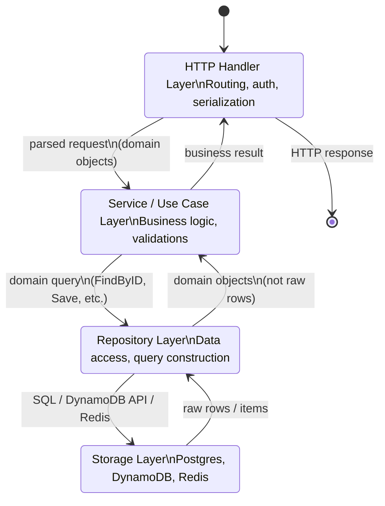

## 1. Overview

In 2015, a senior engineer at a payment startup was asked to migrate their Postgres database to a new schema. Simple request. The problem: their domain objects were plain SQL queries embedded directly in HTTP handler functions. `SELECT * FROM orders WHERE id = $1` scattered across 40 handler files. Every handler was its own data access layer.

The migration took 3 months. Not because the data was hard to move — because the queries were impossible to find, understand, or change systematically.

The Repository pattern solves exactly this. It sits between your domain logic and your storage engine, providing a clean collection-like interface — `Find`, `Save`, `Delete` — behind which any storage implementation can live. Your business logic never sees SQL; it sees `OrderRepository.FindByID(id)`. Change your storage backend, and you change one file — the implementation.

The mental model: **a library's card catalog (for those old enough to remember card catalogs)**. When you ask the librarian for a book, you don't care which floor it's on, which shelf, or how the library's dewey decimal system works internally. You say "I want this book" and the librarian finds it. The Repository is the librarian. Your business logic is you. The database is the stacks.

In Go, this pattern is everywhere. Almost every production Go service that handles data storage implements it, often without explicitly naming it. Understanding it deeply — especially its failure modes — separates engineers who write maintainable Go services from those who produce query-spaghetti.

By the end of this guide you'll know:

- Why the Repository interface is Go's primary tool for decoupling domain from storage
- How the in-memory implementation enables unit tests that actually test behavior
- Why the N+1 query problem is the single most common Repository bug in production
- Why mocking the Repository in tests hides real query bugs — and why integration tests are mandatory
- How to implement batch queries and avoid the N+1 trap explicitly

---

## 2. Core Concepts

### The Core Problem Without Repository

```go
// Without Repository — the anti-pattern
func (h *OrderHandler) GetOrder(w http.ResponseWriter, r *http.Request) {
    orderID := r.PathValue("id")

    // SQL embedded directly in HTTP handler — untestable, non-reusable, non-migratable
    var order Order
    err := h.db.QueryRowContext(r.Context(),
        "SELECT id, user_id, status, total FROM orders WHERE id = $1",
        orderID).Scan(&order.ID, &order.UserID, &order.Status, &order.Total)
    if err != nil {
        http.Error(w, "not found", 404)
        return
    }

    // N+1 query lurking here — fetching items for the order
    rows, _ := h.db.QueryContext(r.Context(),
        "SELECT product_id, quantity FROM order_items WHERE order_id = $1",
        orderID)
    // ... scan rows into order.Items ...

    json.NewEncoder(w).Encode(order)
}
// Problems:
// 1. To test this handler, you need a real database
// 2. To change the SQL, you must find and update every handler
// 3. The N+1 query is embedded — it's invisible until load testing
// 4. No way to swap Postgres for DynamoDB without rewriting every handler
```

### The Repository Interface

The Repository defines what your domain can do with storage, using domain language (not SQL):

```
Domain Logic              Repository Interface         Storage Implementation
                                                       (can be swapped)
┌─────────────────┐      ┌───────────────────────┐   ┌─────────────────────┐
│                 │      │ OrderRepository        │   │ PostgresOrderRepo   │
│ OrderService    │─────►│                        │──►│ (real SQL queries)  │
│                 │      │ FindByID(id) Order      │   └─────────────────────┘
│ "Give me order  │      │ FindByUserID(uid) []Order│
│  12345"         │      │ Save(order) error       │   ┌─────────────────────┐
│                 │      │ Delete(id) error        │──►│ InMemoryOrderRepo   │
│ No SQL. No DB.  │      │ FindOpenOrders() []Order│   │ (map, for tests)    │
│ Pure logic.     │      └───────────────────────┘   └─────────────────────┘
└─────────────────┘
```

*The interface is the contract. The implementations are interchangeable. The domain logic is ignorant of storage details.*

### The N+1 Query Problem — The Most Common Repository Bug

Named "N+1" because it makes N+1 queries where 1 query would have sufficed.

**The trap**:
```
Request: "Give me all orders for user 42"

Query 1: SELECT * FROM orders WHERE user_id = 42  → 50 orders returned

For each of 50 orders:
  Query 2:  SELECT * FROM order_items WHERE order_id = 1
  Query 3:  SELECT * FROM order_items WHERE order_id = 2
  Query 4:  SELECT * FROM order_items WHERE order_id = 3
  ...
  Query 51: SELECT * FROM order_items WHERE order_id = 50

Total: 51 queries. For 50 orders.
At 1,000 orders: 1,001 queries. At 10,000 orders: 10,001 queries.
Latency: 51 × 2ms per query = 102ms for what could be done in 2ms with one JOIN.
```

The fix is a JOIN or an IN clause that fetches all related records in one query:
```sql
-- N+1 (bad): one query per order
SELECT * FROM order_items WHERE order_id = $1

-- One query for all orders (good)
SELECT oi.* FROM order_items oi WHERE oi.order_id = ANY($1::int[])
-- Pass $1 as the array of all order IDs from the first query
```

### Repository State Flow (What "Layer" It Lives In)



*The Repository is the boundary between the domain layer and the storage layer. Nothing above the Repository knows what SQL looks like.*

---

## 3. Use Cases

### Production Go Services — Almost Everywhere

Nearly every production Go service that stores data implements this pattern. At Stripe, each domain object (Customer, Charge, PaymentIntent) has a corresponding repository. The repositories handle Postgres queries; the service layer handles business rules. Testing a new billing rule doesn't require a database — the test uses an in-memory repository.

At Uber, the trip domain service has repositories for Trips, Riders, Drivers. The trip dispatch algorithm works against repository interfaces. When Uber migrated some data from MySQL to DynamoDB, the dispatch algorithm didn't need to change — only the repository implementation did.

### Spring Data Repository (Java — for contrast)

Java's Spring Data provides auto-generated repository implementations. You define:
```java
public interface OrderRepository extends JpaRepository<Order, Long> {
    List<Order> findByUserId(Long userId);
    List<Order> findByStatusAndCreatedAtAfter(Status status, Instant after);
}
```

Spring generates the SQL at startup. Nothing in your service code touches SQL. The trade-off: Spring's magic hides N+1 queries when you access lazy-loaded collections. This is where Java ORMs become dangerous at scale.

Go favors explicit: you write the SQL. The Repository pattern still applies — the interface/implementation split — but the SQL is always visible and deliberate.

### GORM's Generic Repository (and Its Trap)

`gorm.io/gorm` provides a DB handle that can be passed around as a repository substitute. The trap: passing `*gorm.DB` around instead of an interface couples your domain code to GORM. Every function that takes `*gorm.DB` is now untestable without a real database, and unmigrateable to any non-GORM storage.

The correct approach: use GORM inside your repository implementation, but expose only the domain interface. Your service layer never sees `*gorm.DB`.

---

## 4. Gotchas

### Gotcha 1 — The N+1 Query Trap (The Most Common Bug)

Already described above, but worth emphasizing: this is **the single most common production performance problem in Repository-based codebases**. It's invisible in development (5 orders = 6 queries, fast), catastrophic in production (10,000 orders = 10,001 queries, slow).

The rule: **any method that returns a slice of domain objects must fetch their sub-objects in a single batched query**. Never iterate over a slice and call the repository per item.

```go
// THIS IS THE BUG — N+1 pattern
orders, _ := repo.FindByUserID(ctx, userID)         // Query 1
for _, o := range orders {
    items, _ := itemRepo.FindByOrderID(ctx, o.ID)   // N more queries
    o.Items = items
}

// THIS IS THE FIX — one batched query
orders, _ := repo.FindByUserID(ctx, userID)         // Query 1
orderIDs := extractIDs(orders)                      // collect all IDs
items, _ := itemRepo.FindByOrderIDs(ctx, orderIDs) // Query 2 — fetches all
attachItemsToOrders(orders, items)                  // in-memory grouping
```

### Gotcha 2 — Over-Abstracting the Repository

A repository that leaks its underlying implementation destroys the abstraction:

```go
// BAD — leaking GORM into the interface
type OrderRepository interface {
    FindWithScopes(db *gorm.DB, scopes ...func(*gorm.DB) *gorm.DB) []Order
    // ^ This is GORM-specific. Your domain code now depends on GORM.
}

// ALSO BAD — exposing raw SQL in the interface
type OrderRepository interface {
    Query(sql string, args ...any) ([]Order, error)
    // ^ This is a thin wrapper over the DB driver, not a Repository.
    //   What does Query("SELECT 1") do? Drop table? Nothing prevents it.
}

// GOOD — domain-language methods only
type OrderRepository interface {
    FindByID(ctx context.Context, id int64) (*Order, error)
    FindByUserID(ctx context.Context, userID int64) ([]Order, error)
    FindOpenOrders(ctx context.Context) ([]Order, error)
    Save(ctx context.Context, order *Order) error
    Delete(ctx context.Context, id int64) error
}
```

### Gotcha 3 — Repositories That Don't Batch

Related to N+1: some repositories are designed for single-object access (`FindByID`) and never provide batch access (`FindByIDs`). Service code that needs multiple objects is forced to either call `FindByID` N times (N+1) or work around the repository with a custom query.

Every repository that supports `FindByID` should also support `FindByIDs`. This is not premature optimization — it's a completeness requirement that prevents N+1 bugs at the call site.

### Gotcha 4 — Unit Tests That Only Mock Repositories

When you mock the OrderRepository in your service tests, you're testing your service logic against a mock that always returns the objects you tell it to. This is correct for testing business logic.

But it's wrong for testing that your Postgres implementation returns the correct orders. If your SQL `SELECT ... WHERE user_id = $1` has a typo (`WHERE userid = $1` — missing underscore), the mock-based test passes. The integration test (running against real Postgres) catches it.

Rule: **unit tests with in-memory repositories test business logic; integration tests with a real database test the repository implementation**. Both are required. Neither replaces the other.

Use Docker (via `testcontainers-go`) to run a real Postgres instance in your integration tests. `go test -tags=integration ./...` runs them in CI.

### Gotcha 5 — Transaction Boundaries Across Repositories

A service operation that modifies two domain objects (debit account A, credit account B) must happen in one database transaction. But your `AccountRepository` doesn't expose transactions — it just has `Save(account)`.

The cleanest Go solution: pass the transaction as a context value (using `context.WithValue`), and have the repository implementation extract it:

```go
// Service creates the transaction, passes it to repos via context
tx, _ := db.BeginTx(ctx, nil)
txCtx := storage.ContextWithTx(ctx, tx)

if err := accountRepo.Debit(txCtx, accountA, amount); err != nil {
    tx.Rollback()
    return err
}
if err := accountRepo.Credit(txCtx, accountB, amount); err != nil {
    tx.Rollback()
    return err
}
tx.Commit()
```

Alternatively, use the Unit of Work pattern to coordinate transactions across multiple repositories. Either way: never let a repository create its own transaction when you need atomicity across multiple operations.

---

## 5. Where to Use (and Where NOT to Use)

### Use Repository when:

- **Your service accesses a storage system** — Postgres, MySQL, DynamoDB, Redis, external APIs with persistence. Any time you have "data access code," the Repository pattern applies.
- **You need testable business logic** — the in-memory implementation lets you test all branches of your service code without a database.
- **You're likely to change storage backends** — Postgres now, might add a read replica, DynamoDB for specific entity types, Redis for caching. Repository boundaries make this straightforward.
- **Multiple team members write different service features** — the interface acts as a contract, enabling parallel development (one engineer builds the Postgres implementation, another builds the service using the in-memory mock).

### Do NOT use Repository when:

- **It's a script, not a service** — a one-off data migration script that runs once doesn't need a Repository layer. Write the SQL directly.
- **Your data access is trivially simple** — a single table, two queries, never changing. The abstraction overhead (interface definition, struct implementation, tests) might not be justified for a microservice that reads one config table.
- **You're building a read-heavy analytics service** — analytics queries are often complex aggregations that don't map to domain objects. An analytics service might want a `QueryService` that accepts query parameters, not a conventional `FindBy*` Repository.
- **The underlying system has no viable alternative** — if you will *never* swap Postgres for anything else, and your queries are highly Postgres-specific (CTEs, window functions, full-text search), the abstraction may hide more than it helps. But: the testability benefit alone often justifies the interface.

> 💡 **Staff-level insight:** The Repository pattern in Go is valuable primarily for one reason that gets undersold: **it makes your service layer independently testable at a unit level**. The ability to run `go test ./service/...` in 50ms with no database, no network, no Docker — just in-memory implementations of every interface — is worth the overhead of defining an interface and writing an in-memory mock. Every minute saved in the inner test loop compounds across an entire engineering team's workday. In a team of 10 engineers, trimming the test suite from 30s to 2s saves 187 hours per year. That's the real return on the Repository pattern.

---

## 6. Versus: Comparisons

### Repository vs Active Record

| Aspect                        | Repository                            | Active Record                              |
| ----------------------------- | ------------------------------------- | ------------------------------------------ |
| Where SQL lives               | Repository implementation             | On the domain object itself                |
| Domain object purity          | Domain object has NO DB methods       | Domain object has `Save()`, `Find()`, etc. |
| Testability                   | In-memory implementation → unit tests | Need DB or complex mocking                 |
| Coupling                      | Low — service doesn't know about DB   | High — domain object IS the DB row         |
| N+1 risk                      | Present but manageable                | High — lazy loading on collections         |
| Idiomatic in Go?              | Yes — interfaces and explicit SQL     | No — Rails/Django/Laravel idiom            |
| Idiomatic in Rails/Python/PHP | No — Repository is the Go pattern     | Yes                                        |

**Choose Repository in Go**: Go has no ORM magic and favors explicit dependencies. Active Record requires implicit magic (a field update triggers a database write) that fights Go's explicit style.

**Choose Active Record** only if you're in a Rails/Django/Laravel ecosystem where the framework's tooling is built around it. Trying to use Active Record-style patterns in Go is swimming upstream.

### Repository vs DAO (Data Access Object)

These are often used interchangeably. The subtle difference:

| Aspect            | Repository                           | DAO                                                |
| ----------------- | ------------------------------------ | -------------------------------------------------- |
| Abstraction level | Domain language (`FindOpenOrders()`) | Database language (`SELECT WHERE status = 'open'`) |
| Returns           | Domain objects                       | Often raw data structures or DTOs                  |
| Aggregates        | Often includes aggregation logic     | Usually one-table CRUD                             |
| Original context  | Domain-Driven Design                 | J2EE / Java Enterprise patterns                    |

In practice in modern Go codebases, they're functionally equivalent. The name "Repository" signals domain-oriented abstraction; the name "DAO" signals closer-to-SQL operation. Go teams overwhelmingly use "Repository" terminology.

---

## 7. Code Examples

```go
package repository

import (
	"context"
	"database/sql"
	"errors"
	"fmt"
	"strings"
	"time"

	_ "github.com/lib/pq" // postgres driver
)

// ─── Domain Types ─────────────────────────────────────────────────────────────

type OrderStatus string

const (
	StatusOpen      OrderStatus = "open"
	StatusFulfilled OrderStatus = "fulfilled"
	StatusCancelled OrderStatus = "cancelled"
)

// Order is the domain object. It has NO database methods on it.
// No GORM annotations. No database tags (those belong in the storage layer).
// This is a pure domain type.
type Order struct {
	ID         int64
	UserID     int64
	Status     OrderStatus
	TotalCents int64
	Items      []OrderItem
	CreatedAt  time.Time
}

type OrderItem struct {
	ProductID int64
	Quantity  int
	PriceCents int64
}

// ─── Repository Interface ──────────────────────────────────────────────────────

// OrderRepository defines data access operations in domain language.
// It is the contract that the service layer depends on — not any implementation.
// Define this in the domain/service package, not the storage package.
// Go's "interfaces belong where they are used" principle: the service defines what
// it needs; storage implements it.
type OrderRepository interface {
	FindByID(ctx context.Context, id int64) (*Order, error)
	// FindByIDs fetches multiple orders in a single query.
	// Every repo that has FindByID MUST have FindByIDs to prevent N+1 at call sites.
	FindByIDs(ctx context.Context, ids []int64) ([]Order, error)
	FindByUserID(ctx context.Context, userID int64) ([]Order, error)
	FindOpenOrders(ctx context.Context) ([]Order, error)
	Save(ctx context.Context, order *Order) error
	Delete(ctx context.Context, id int64) error
}

var ErrOrderNotFound = errors.New("order not found")

// ─── Postgres Implementation ───────────────────────────────────────────────────

// PostgresOrderRepository implements OrderRepository against a real PostgreSQL database.
// All SQL is in this file — nowhere else in the codebase.
type PostgresOrderRepository struct {
	db *sql.DB
}

func NewPostgresOrderRepository(db *sql.DB) *PostgresOrderRepository {
	return &PostgresOrderRepository{db: db}
}

func (r *PostgresOrderRepository) FindByID(ctx context.Context, id int64) (*Order, error) {
	order := &Order{}
	err := r.db.QueryRowContext(ctx,
		`SELECT id, user_id, status, total_cents, created_at
		 FROM orders WHERE id = $1`,
		id).Scan(&order.ID, &order.UserID, &order.Status, &order.TotalCents, &order.CreatedAt)

	if errors.Is(err, sql.ErrNoRows) {
		return nil, ErrOrderNotFound
	}
	if err != nil {
		return nil, fmt.Errorf("query order by id %d: %w", id, err)
	}

	// Fetch items for this single order.
	// Note: for a single order, this is NOT N+1 — it's 1+1.
	// N+1 only occurs when iterating a slice and calling per item.
	if err := r.loadItemsForOrders(ctx, []*Order{order}); err != nil {
		return nil, err
	}
	return order, nil
}

func (r *PostgresOrderRepository) FindByIDs(ctx context.Context, ids []int64) ([]Order, error) {
	if len(ids) == 0 {
		return nil, nil
	}

	// Build a parameterized IN clause: $1, $2, $3 ...
	// Never use string concatenation with IDs — SQL injection risk.
	placeholders := make([]string, len(ids))
	args := make([]any, len(ids))
	for i, id := range ids {
		placeholders[i] = fmt.Sprintf("$%d", i+1)
		args[i] = id
	}

	query := fmt.Sprintf(
		`SELECT id, user_id, status, total_cents, created_at
		 FROM orders WHERE id IN (%s)`,
		strings.Join(placeholders, ", "))

	rows, err := r.db.QueryContext(ctx, query, args...)
	if err != nil {
		return nil, fmt.Errorf("query orders by ids: %w", err)
	}
	defer rows.Close()

	orders, err := r.scanOrders(rows)
	if err != nil {
		return nil, err
	}

	// Batch load all items for all orders in ONE query.
	// This is the N+1 fix: fetch items for ALL orders at once, not per-order.
	orderPtrs := make([]*Order, len(orders))
	for i := range orders {
		orderPtrs[i] = &orders[i]
	}
	if err := r.loadItemsForOrders(ctx, orderPtrs); err != nil {
		return nil, err
	}
	return orders, nil
}

func (r *PostgresOrderRepository) FindByUserID(ctx context.Context, userID int64) ([]Order, error) {
	rows, err := r.db.QueryContext(ctx,
		`SELECT id, user_id, status, total_cents, created_at
		 FROM orders WHERE user_id = $1 ORDER BY created_at DESC`,
		userID)
	if err != nil {
		return nil, fmt.Errorf("query orders by user %d: %w", userID, err)
	}
	defer rows.Close()

	orders, err := r.scanOrders(rows)
	if err != nil {
		return nil, err
	}

	orderPtrs := make([]*Order, len(orders))
	for i := range orders {
		orderPtrs[i] = &orders[i]
	}
	// One batched query for all items — NOT N queries. This is the pattern.
	if err := r.loadItemsForOrders(ctx, orderPtrs); err != nil {
		return nil, err
	}
	return orders, nil
}

// loadItemsForOrders fetches all order items for the given orders IN A SINGLE QUERY
// and attaches them to the corresponding order.
// This function is the explicit anti-N+1 mechanism — it MUST be used wherever
// we return a slice of orders that need their items populated.
func (r *PostgresOrderRepository) loadItemsForOrders(ctx context.Context, orders []*Order) error {
	if len(orders) == 0 {
		return nil
	}

	// Extract all order IDs
	ids := make([]any, len(orders))
	idToOrder := make(map[int64]*Order, len(orders))
	for i, o := range orders {
		ids[i] = o.ID
		idToOrder[o.ID] = o
	}

	// Build parameterized query for ANY($1::bigint[]) — Postgres array syntax
	// This is cleaner than a dynamic IN clause for large ID sets.
	placeholders := make([]string, len(ids))
	for i := range ids {
		placeholders[i] = fmt.Sprintf("$%d", i+1)
	}
	query := fmt.Sprintf(
		`SELECT order_id, product_id, quantity, price_cents
		 FROM order_items WHERE order_id IN (%s)`,
		strings.Join(placeholders, ", "))

	rows, err := r.db.QueryContext(ctx, query, ids...)
	if err != nil {
		return fmt.Errorf("load order items: %w", err)
	}
	defer rows.Close()

	for rows.Next() {
		var orderID int64
		var item OrderItem
		if err := rows.Scan(&orderID, &item.ProductID, &item.Quantity, &item.PriceCents); err != nil {
			return fmt.Errorf("scan order item: %w", err)
		}
		// Attach to the correct order in memory
		if o, ok := idToOrder[orderID]; ok {
			o.Items = append(o.Items, item)
		}
	}
	return rows.Err()
}

func (r *PostgresOrderRepository) FindOpenOrders(ctx context.Context) ([]Order, error) {
	rows, err := r.db.QueryContext(ctx,
		`SELECT id, user_id, status, total_cents, created_at
		 FROM orders WHERE status = 'open' ORDER BY created_at ASC`)
	if err != nil {
		return nil, fmt.Errorf("query open orders: %w", err)
	}
	defer rows.Close()
	return r.scanOrders(rows)
}

func (r *PostgresOrderRepository) Save(ctx context.Context, order *Order) error {
	_, err := r.db.ExecContext(ctx,
		`INSERT INTO orders (user_id, status, total_cents, created_at)
		 VALUES ($1, $2, $3, $4)
		 ON CONFLICT (id) DO UPDATE
		 SET status = EXCLUDED.status, total_cents = EXCLUDED.total_cents`,
		order.UserID, order.Status, order.TotalCents, order.CreatedAt)
	return err
}

func (r *PostgresOrderRepository) Delete(ctx context.Context, id int64) error {
	_, err := r.db.ExecContext(ctx, `DELETE FROM orders WHERE id = $1`, id)
	return err
}

func (r *PostgresOrderRepository) scanOrders(rows *sql.Rows) ([]Order, error) {
	var orders []Order
	for rows.Next() {
		var o Order
		if err := rows.Scan(&o.ID, &o.UserID, &o.Status, &o.TotalCents, &o.CreatedAt); err != nil {
			return nil, fmt.Errorf("scan order: %w", err)
		}
		orders = append(orders, o)
	}
	return orders, rows.Err()
}

// ─── In-Memory Implementation (for unit tests) ────────────────────────────────

// InMemoryOrderRepository implements OrderRepository using a plain Go map.
// Use this in unit tests for your service layer — zero database dependency.
// IMPORTANT: this does NOT replace integration tests.
// Integration tests run against a real Postgres instance and test the SQL.
// Unit tests with this implementation test business logic only.
type InMemoryOrderRepository struct {
	orders map[int64]*Order
	nextID int64
}

func NewInMemoryOrderRepository() *InMemoryOrderRepository {
	return &InMemoryOrderRepository{
		orders: make(map[int64]*Order),
		nextID: 1,
	}
}

func (r *InMemoryOrderRepository) FindByID(_ context.Context, id int64) (*Order, error) {
	o, ok := r.orders[id]
	if !ok {
		return nil, ErrOrderNotFound
	}
	// Return a copy to prevent tests from mutating the stored state
	orderCopy := *o
	return &orderCopy, nil
}

func (r *InMemoryOrderRepository) FindByIDs(_ context.Context, ids []int64) ([]Order, error) {
	var result []Order
	for _, id := range ids {
		if o, ok := r.orders[id]; ok {
			result = append(result, *o)
		}
	}
	return result, nil
}

func (r *InMemoryOrderRepository) FindByUserID(_ context.Context, userID int64) ([]Order, error) {
	var result []Order
	for _, o := range r.orders {
		if o.UserID == userID {
			result = append(result, *o)
		}
	}
	return result, nil
}

func (r *InMemoryOrderRepository) FindOpenOrders(_ context.Context) ([]Order, error) {
	var result []Order
	for _, o := range r.orders {
		if o.Status == StatusOpen {
			result = append(result, *o)
		}
	}
	return result, nil
}

func (r *InMemoryOrderRepository) Save(_ context.Context, order *Order) error {
	if order.ID == 0 {
		order.ID = r.nextID
		r.nextID++
	}
	orderCopy := *order
	r.orders[order.ID] = &orderCopy
	return nil
}

func (r *InMemoryOrderRepository) Delete(_ context.Context, id int64) error {
	delete(r.orders, id)
	return nil
}

// ─── Service Layer (uses only the interface — never an implementation) ─────────

// OrderService implements business logic. It depends on the interface, not
// PostgresOrderRepository or InMemoryOrderRepository. This is what makes
// it testable: inject InMemoryOrderRepository in tests, PostgresOrderRepository in prod.
type OrderService struct {
	orders OrderRepository
}

func NewOrderService(orders OrderRepository) *OrderService {
	return &OrderService{orders: orders}
}

// GetOrdersWithItems demonstrates the correct batching pattern.
// It calls the repo's FindByUserID which internally batches item loading.
// Business logic (filtering, sorting) is here — not in the repository.
func (s *OrderService) GetOrdersWithItems(ctx context.Context, userID int64) ([]Order, error) {
	orders, err := s.orders.FindByUserID(ctx, userID)
	if err != nil {
		return nil, fmt.Errorf("get orders for user %d: %w", userID, err)
	}

	// Business logic: filter out cancelled orders for the active view
	var activeOrders []Order
	for _, o := range orders {
		if o.Status != StatusCancelled {
			activeOrders = append(activeOrders, o)
		}
	}
	return activeOrders, nil
}
```

*The interface is defined in terms of domain operations (`FindOpenOrders`), not storage terms (`SELECT WHERE status = 'open'`). The `loadItemsForOrders` function is the explicit batching mechanism that prevents N+1 queries. The in-memory implementation enables fast unit tests; the Postgres implementation is tested separately against a real database.*

---

## 8. Scale Discussion

### At 10x Load

The N+1 query problem that you didn't notice in development becomes visible at 10x. If `FindByUserID` returns 100 orders and each fetches items individually (99 extra queries), at 10x load that's 99 extra queries per request. PostgreSQL's query throughput caps out. Response times climb.

First optimization: implement `loadItemsForOrders` (as shown above). This collapses N+1 queries to 2 queries regardless of how many orders are returned.

Second optimization: add database indexes. `CREATE INDEX idx_orders_user_id ON orders(user_id)` and `CREATE INDEX idx_order_items_order_id ON order_items(order_id)`. Without indexes, your queries do full table scans.

### At 100x Load

At 100x, even 2-query patterns may be slow if those 2 queries hit the primary database for every read request. Introduce a read replica: redirect all `FindBy*` calls to the replica, all `Save` and `Delete` to the primary.

The Repository interface makes this clean: inject a primary-writable `PostgresOrderRepository` for write operations and a replica-backed `PostgresOrderRepository` (same interface, different connection string) for read operations. The service layer doesn't know which replica is being used.

### At 1000x Load

At 1000x, even read replicas may be insufficient for popular queries. Introduce a read-through cache: Redis as a caching layer in front of Postgres. The Repository interface allows this: create a `CachedOrderRepository` that wraps `PostgresOrderRepository`, checking Redis on read and invalidating on write.

```go
type CachedOrderRepository struct {
	cache  *redis.Client
	source OrderRepository // The real Postgres implementation underneath
	ttl    time.Duration
}

func (r *CachedOrderRepository) FindByID(ctx context.Context, id int64) (*Order, error) {
	// Check cache first; fall through to source on miss
	// ...
}
```

The service layer sees only `OrderRepository`. Whether the implementation is Postgres direct, Postgres + cache, or DynamoDB is invisible. This is the Repository pattern paying off at scale.

---

## 9. Monitoring & Observability

| Metric                                                 | Type      | Alert Condition                                                    |
| ------------------------------------------------------ | --------- | ------------------------------------------------------------------ |
| `repository_query_duration_seconds{operation, repo}`   | Histogram | p99 > 100ms for any operation — add index or optimize query        |
| `repository_errors_total{operation, repo, error_type}` | Counter   | Any non-zero rate for `ErrOrderNotFound` on critical paths         |
| `slow_query_count{threshold="100ms", repo}`            | Counter   | > 0 per minute — investigate execution plan                        |
| `repository_queries_per_request{endpoint}`             | Histogram | p99 > 5 — N+1 queries likely — needs investigation                 |
| `db_connection_pool_in_use`                            | Gauge     | > 80% of `sql.SetMaxOpenConns` limit                               |
| `db_connection_pool_wait_duration_seconds`             | Histogram | p99 > 10ms — connection pool exhausted, increase pool size         |
| `cache_hit_rate{repo}`                                 | Gauge     | < 90% — cache miss rate too high, TTL too short or cache too small |

**The key metric many teams miss**: `repository_queries_per_request`. Instrument your HTTP handler to record how many repository calls are made per request. If a request that "should" make 2 queries makes 52 — that's 50 orders each making 1 item query — you've found your N+1. Fix it before it hits production scale.

**Dashboard to build**: A "slow queries" panel showing repository operations where p99 exceeds 100ms, broken by operation name. This surfaces index-missing and N+1 bugs in real traffic patterns. Combine with `EXPLAIN ANALYZE` output in your runbooks so on-call engineers can diagnose without a DBA.

---

## Interview Questions

### Question 1: "Walk me through the Repository pattern. Why use it over embedding SQL queries in service code?"

**Key points to cover:**
- Separation of concerns: business logic (service layer) is independent from data access (repository). A query change doesn't touch service tests; a business logic change doesn't require understanding SQL.
- Testability: in-memory implementation allows fast, isolated unit tests of the service layer
- Replaceability: swap Postgres for DynamoDB by writing a new implementation — service code unchanged
- Single responsibility: one place to find all SQL for a given domain entity
- Readability: `repo.FindOpenOrders(ctx)` is clearer intent than a SELECT statement in a handler

**Common mistake:** Saying "it's just a design pattern for OOP languages." In Go, the interface-based Repository is idiomatic and heavily used. The judge of its value in Go is pragmatic, not theoretical.

**What the interviewer wants:** Concrete benefits with concrete examples — testability is typically the most compelling Go-specific benefit.

### Question 2: "You have a Users endpoint that fetches all users and, for each user, fetches their latest order. In production you have 50,000 users. The endpoint times out. How do you diagnose and fix it?"

**Key points to cover:**
- Diagnosis: check repository query metrics. If `repository_queries_per_request` is 50,001 — that's the N+1 bug
- Root cause: `FindByUserID` returns 50,000 users; for each user the code calls `FindLatestOrderByUserID` — 50,000 queries
- Fix: introduce `FindLatestOrdersByUserIDs(ids []int64) map[int64]*Order` — one query with `ORDER BY created_at DESC` and a GROUP BY, fetching the latest order for all user IDs in one pass
- Alternative fix: a SQL JOIN with DISTINCT ON (user_id): `SELECT DISTINCT ON (user_id) * FROM orders ORDER BY user_id, created_at DESC`
- Schema-level fix: add `ORDER BY created_at DESC` and a composite index on `(user_id, created_at)`

**Common mistake:** Proposing to add caching. Caching masks the N+1 problem without fixing it. If 50,000 entries don't fit in cache (or have short TTL), you're back to 50,001 queries.

**What the interviewer wants:** Ability to trace a latency problem to a specific query pattern and propose both a diagnostic path and a structural fix.

### Question 3: "Your repository interface is defined. One engineer writes a mock implementation (always returns fixed data) for unit tests. Another engineer writes Postgres integration tests. Are both necessary? What does each test?"

**Key points to cover:**
- **Mock/in-memory tests** (unit tests): test business logic in the service layer. If `OrderService.GetOpenOrdersForUser()` applies a business filter (exclude cancelled), the unit test verifies that filter logic is correct — fast, no DB required.
- **Integration tests**: test the SQL in `PostgresOrderRepository`. Does `FindByUserID` return the correct rows? Does `Save` handle conflict correctly? Does the correct index kick in? These can only be verified with a real database.
- **Both are necessary**: unit tests catch business logic bugs early and fast; integration tests catch SQL bugs, index misses, and schema drift.
- The failure mode of only having mocks: you ship a `FindByUserID` with a typo in the WHERE clause. All service tests pass (the mock doesn't run real SQL). The integration test catches it before production.

**What the interviewer wants:** Understanding of the testing pyramid and why each layer tests different things. "Just use mocks" and "just use real DB" are both wrong answers.

---

## Staff-Level Preparation Tips

**What to build:**
- Implement the full `OrderRepository` interface above with both the Postgres implementation and the in-memory implementation. Write unit tests for an `OrderService` using the in-memory implementation. Write integration tests for the Postgres implementation using `testcontainers-go`.
- Deliberately introduce an N+1 bug (iterate over orders, call repo per order for items). Add the `repository_queries_per_request` metric. Watch it spike in your load test. Fix it with `loadItemsForOrders`. Watch the metric drop from 51 to 2.
- Implement the `CachedOrderRepository` wrapping the Postgres implementation. Verify that reads are served from cache after first load.

**What to study:**
- "Patterns of Enterprise Application Architecture" by Martin Fowler — Chapter on Repository and Data Mapper. These patterns were defined here; understanding the original description makes the tradeoffs clear.
- `database/sql` package documentation — Go's standard library provides everything you need. Understand `QueryRowContext`, `QueryContext`, `ExecContext`, prepared statements, and connection pool settings.
- `testcontainers-go` — the standard way to run Docker-based databases in Go tests. No more "you must have Postgres installed locally to run tests."
- PostgreSQL EXPLAIN ANALYZE — mandatory knowledge for anyone writing Postgres repository implementations. Know how to read query plans and identify sequential scans that should be index scans.

**How it connects to broader system design:**
- The Repository pattern is the foundation for CQRS: your CommandRepository (write model) and QueryRepository (read model) are separate implementations of different interfaces, backed by different databases or the same database with different query strategies
- At staff level, the conversation is about data access layer design across a team: how do you enforce the "define interfaces in the domain package" rule? How do you prevent junior engineers from passing `*gorm.DB` into service functions? Code review guidelines and linting rules are the organizational mechanisms.
- The caching layer as a Repository implementation (`CachedOrderRepository`) is a microcosm of the Decorator pattern — a general principle for adding behavior without modifying existing code.

---

## References

- [Martin Fowler — Repository Pattern](https://martinfowler.com/eaaCatalog/repository.html)
- [Martin Fowler — Patterns of Enterprise Application Architecture (Book)](https://www.martinfowler.com/books/eaa.html)
- [Go database/sql Tutorial](https://go.dev/doc/tutorial/database-access)
- [testcontainers-go Documentation](https://golang.testcontainers.org/)
- [GORM Documentation — when to use and when not to](https://gorm.io/docs/)
- [PostgreSQL EXPLAIN Documentation](https://www.postgresql.org/docs/current/sql-explain.html)
- [Dave Cheney — Practical Go: Real World Advice for Writing Maintainable Go Programs](https://dave.cheney.net/practical-go/presentations/qcon-china.html) — see the section on interfaces
- [Jon Calhoun — Structuring Go Applications (Blog)](https://www.calhoun.io/structuring-applications-in-go/)
