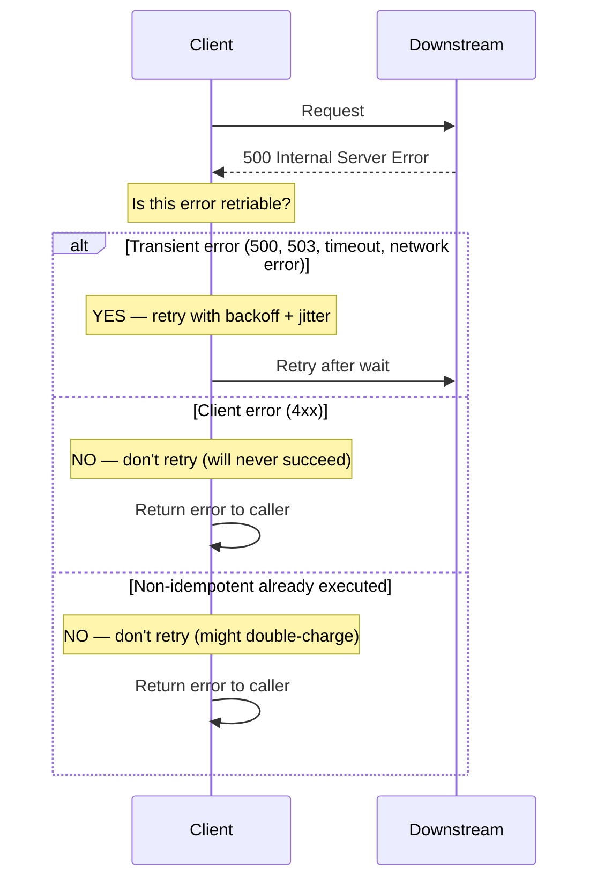

## 1. Overview

In 2012, AWS had a cascading failure caused by an insufficiently considered factor: clients retrying. When a backend service started degrading, thousands of clients simultaneously started retrying at the same interval. The retry wave hit the already-struggling backend harder than the original load. The retries made the outage worse.

This anti-pattern has a name: **thundering herd**. And it's almost entirely preventable with one addition to naive retry logic: **jitter**.

Most engineers know to "retry with exponential backoff." Far fewer know *why* the exponential matters, why bare exponential isn't enough without jitter, which errors should never be retried, and why a missing max elapsed time can cause a retry loop that outlives the service itself.

The mental model: **a crowded emergency room**. When you arrive and the wait is long, a smart patient checks back every 30 minutes. A stupid policy has everyone checking at the exact same time — they all rush the receptionist at once, making the bottleneck worse. Jitter is the "come back at a random time between 20 and 40 minutes" instruction that prevents the stampede.

By the end of this guide you'll know:

- The exact math behind `wait = min(cap, base × 2^attempt) × random(0, 1)` and what each term does
- The difference between full jitter, equal jitter, and decorrelated jitter — and which to use
- Why retrying 4xx errors is wrong and potentially dangerous
- Why not having a `maxElapsedTime` is a slow-motion service killer
- How AWS, Stripe, and gRPC handle retries in production
- How to implement a context-aware, fully configurable retry function in Go

---

## 2. Core Concepts

### The Naive Retry (and Why It Fails)

The most common retry code:

```go
for attempt := 0; attempt < maxRetries; attempt++ {
    err := callDownstream()
    if err == nil {
        return nil
    }
    time.Sleep(1 * time.Second) // fixed backoff
}
```

Problems with this:
1. **Fixed interval creates thundering herd**: 1,000 clients each fail at T=0, sleep 1 second, then all retry at T=1. The downstream gets hit with 1,000 concurrent requests simultaneously. If it was struggling with 1,000 requests, 1,000 synchronized retries will finish it off.
2. **No max elapsed time**: this runs for `maxRetries × 1s` regardless of context. If called from a user-facing request with a 5-second SLA, your retry loop might run well past the user's timeout.
3. **No distinction between retriable and non-retriable errors**: retrying a 401 Unauthorized will never succeed and wastes time.

### The Formula: Exponential Backoff with Jitter

The AWS architecture team published this in their blog. It remains the industry standard:

$$\text{wait} = \min(\text{cap},\ \text{base} \times 2^{\text{attempt}}) \times \text{random}(0,\ 1)$$

Each term explained:

- **`base`**: The initial wait time. Typically 100ms–500ms. This is the minimum possible wait on the first retry.
- **`2^attempt`**: The exponential growth factor. After 1 failure: 1×base. After 2 failures: 2×base. After 3: 4×base. 4: 8×base. This gives the downstream *exponentially more recovery time* with each successive failure.
- **`cap`**: Maximum wait time. Without this, after 20 attempts with base=100ms, wait = 100ms × 2^20 = 104 seconds. The cap prevents insanely long waits. Typically 30s–60s.
- **`random(0, 1)`**: The jitter multiplier. This randomizes the actual wait so clients don't all retry simultaneously. This is **full jitter** — the wait is anywhere from 0 to `min(cap, base × 2^attempt)`.

For attempt 3 with base=100ms and cap=30s:
$$\text{wait} = \min(30000,\ 100 \times 2^3) \times \text{random}(0,\ 1) = \min(30000,\ 800) \times \text{random}(0,\ 1) = 800 \times \text{random}(0,\ 1)$$

The actual wait: somewhere between 0ms and 800ms, randomly chosen independently by each client.

### Jitter Variants

**Full Jitter** (`random(0, cap)` — same as the formula above):
- Best for reducing thundering herd
- Downside: can retry almost immediately (near-zero wait if the random hits low), which means retries might cluster

**Equal Jitter** (`cap/2 + random(0, cap/2)`):
- Guarantees at least half the calculated wait
- Better minimum spacing between retries, slightly less jitter effectiveness
- A reasonable default for most services

**Decorrelated Jitter** (AWS recommendation for highest variance):
- `wait = min(cap, random(base, previousWait × 3))`
- Each retry's wait is based on the previous wait, creating high variance across clients
- Best for maximizing spread when you have thousands of concurrent retrying clients

For most production services, **Equal Jitter** provides a good balance. For high-scale systems (thousands of simultaneous retrying clients), use **Decorrelated Jitter**.

### The Retry Decision Tree

Not every error should be retried. Getting this wrong has serious consequences.



*The retry decision: only retry errors that are transient AND where the operation is idempotent (or you have idempotency keys).*

**Retry these:**
- `500 Internal Server Error` (might be transient)
- `503 Service Unavailable`
- `504 Gateway Timeout`
- Network-level errors: connection refused, connection reset, deadline exceeded
- `429 Too Many Requests` (with the `Retry-After` header's guidance)

**Never retry these:**
- `400 Bad Request` — your request is malformed, retry won't fix it
- `401 Unauthorized` — credentials are wrong, retry won't fix it
- `403 Forbidden` — permission denied, retry won't fix it
- `404 Not Found` — the resource doesn't exist, retry won't fix it
- `409 Conflict` — business logic conflict, needs human/application resolution
- Any 4xx error — client-side problem, retry will never help

**Retry carefully (idempotency is required):**
- `POST /charges` — creates a charge. Retrying might charge twice. Use idempotency keys.
- `PUT /orders/{id}/cancel` — idempotent by design (cancelling an already-cancelled order is fine). Safe to retry.

### Max Retries vs Max Elapsed Time

**Max retries** caps the number of attempts. Problem: if the downstream is slow and retries take variable time, max retries doesn't guarantee a response by any particular deadline.

**Max elapsed time** caps total wall-clock time across all attempts. This is what you want for SLA compliance. If your API has a 10s SLA, set `maxElapsedTime: 8s` on your retry logic.

Use both: `maxRetries` as a hard cap on attempts, `maxElapsedTime` as a wall clock cap. Stop when either is hit.

Always respect `context.Done()` — if the caller's context is cancelled (user abandoned the request, SLA exceeded), stop retrying immediately. This is where `context`-awareness in your retry implementation pays off.

---

## 3. Use Cases

### AWS SDK — Built-In Retry Policies

The AWS SDK for Go (v2) has retry logic built in at the SDK level. By default it uses exponential backoff with jitter for transient errors (connection errors, throttling, 500s from AWS services).

The `RetryMaxAttempts` configuration sets the maximum number of retries. The default adaptive retry mode dynamically adjusts the retry rate based on observed throttling responses — if DynamoDB is returning `ProvisionedThroughputExceededException`, the SDK backs off across all concurrent calls, not just the one that failed. This is collective backoff — a more sophisticated form of jitter.

### gRPC — Retry Interceptor and Service Config

gRPC supports transparent retries via service configuration (a JSON/proto file). You configure which methods are retriable, the max attempts, and the backoff parameters. The gRPC framework handles the retry loop — your service code doesn't need to implement it.

From the gRPC service config:
```json
{
  "retryPolicy": {
    "maxAttempts": 4,
    "initialBackoff": "0.1s",
    "maxBackoff": "1s",
    "backoffMultiplier": 2,
    "retryableStatusCodes": ["UNAVAILABLE"]
  }
}
```

Key gotcha: gRPC only retries requests that haven't been committed — requests where the server hasn't started processing yet. Once the server starts executing (retryable budget exhausted or server sent a partial response), gRPC won't retry to avoid double-processing.

### Stripe — 72-Hour Retry Window for Webhooks

Stripe's webhook delivery is one of the most production-battle-tested retry implementations in the industry. When a webhook delivery fails (your endpoint returns non-2xx or times out), Stripe retries with exponential backoff over **72 hours**.

The 72-hour window is deliberate: your service might be down for maintenance, deploying, or having an incident that takes hours to resolve. 72 hours gives you time to fix it without losing the event.

The spacing: roughly 5 minutes, 30 minutes, 1 hour, 4 hours, 8 hours. Not exact exponential — Stripe adds jitter and caps the maximum retry interval.

Lesson: your webhook consumers must be **idempotent**. Stripe will deliver a webhook multiple times (even after success, due to network conditions). If you're not idempotent, you double-process charges. Stripe provides an `event_id` as an idempotency key — always check this.

---

## 4. Gotchas

### Gotcha 1 — Thundering Herd Without Jitter

This is the most catastrophic retry mistake. Without jitter, all clients fail at approximately the same time, sleep for the same duration, and retry simultaneously.

Example: 500 clients each send a request. The backend crashes at T=0. All 500 clients receive an error. They all sleep exactly 1 second (linear backoff). At T=1, all 500 send retries simultaneously. The backend (still recovering) receives a burst of 500 requests — often worse than the original load. The backend crashes again. They all sleep 2 seconds. At T=3, another synchronized burst. The backend never recovers.

With jitter: at T=1, clients retry at random intervals between 0.5s and 1.5s. Instead of 500 simultaneous requests, the backend receives a smooth flow of ~25 requests per 100ms over 2 seconds. The backend recovers. QED.

**Always add jitter. This is not optional.**

### Gotcha 2 — Retrying Non-Idempotent Operations

A 2019 production incident at a payment company: their retry logic retried all 5xx errors, including `POST /payments`. A payment backend returned a 500 after successfully creating the charge (the response was lost in transit). The client retried. The charge was created twice. Customers saw double charges.

The rule: **only retry operations that are idempotent — or where you've added idempotency keys**.

Idempotency keys: generate a UUID on the client before making the call. Pass it as a header (`Idempotency-Key: <uuid>`). The server stores the UUID and the result. If it sees the same UUID again, it returns the previous result without re-executing. Stripe, Twilio, and most modern payment APIs support this. Implement it in your own services for any non-GET endpoint that might be retried.

### Gotcha 3 — No Max Elapsed Time

A service with `maxRetries: 10` and exponential backoff can spin for a very long time:
- Attempt 1: immediate
- Attempt 2: +100ms
- Attempt 3: +200ms
- Attempt 4: +400ms … (but capped at 30s)
- Attempts 5-10: each up to 30s
- Total potential wait: up to ~3 minutes

If this retry call is nested inside a user-facing request with a 5s SLA, the user has already timed out. You're burning resources retrying a call whose result will be discarded.

Always pass the calling context and check `ctx.Done()`. Set `maxElapsedTime` to a fraction of your caller's SLA.

### Gotcha 4 — Retrying 4xx Errors

`400 Bad Request` means your request is malformed. Retrying it 10 times will not make it less malformed. You're just burning 10× the resources and adding 10× the latency for the same inevitable failure.

An automatic retry of 4xx errors is a good signal that there's a bug in your retry logic — probably a missing error classifier.

Worst case: retrying a `401 Unauthorized` with an expired token 10 times, each time triggering authentication logging on the server. At scale, this can DoS your own auth service.

### Gotcha 5 — Retry Amplification at Scale

At 10,000 RPS, if 1% of requests fail and each failed request retries 3 times, your effective load on the downstream is:
- `10,000 × 1% = 100 retried requests/s`
- `100 × 3 retries = 300 extra requests/s`
- Total: `10,000 original + 300 from retries = 10,300 RPS`

At 10% failure rate:
- `10,000 × 10% = 1,000 × 3 retries = 3,000 extra requests`
- Total: `13,000 RPS` — 30% more load added to an already-struggling service

This is why Circuit Breakers and Bulkheads pair with Retry: CB stops retrying when the service is known-bad; Bulkhead limits concurrent retries from amplifying into a total resource exhaust.

---

## 5. Where to Use (and Where NOT to Use)

### Use Retry with Backoff when:

- **Transient failures are expected** — network hiccups, brief unavailability, rate limiting (429), overloaded servers (503). These are genuinely intermittent.
- **The operation is idempotent** — reads, deletes, or writes with idempotency keys. Safe to execute multiple times.
- **The downstream has a known flaky behavior** — a third-party API with occasional timeouts. Retry gives it a second chance.
- **Interacting with eventually consistent systems** — a record you just wrote might not be immediately visible. Retry with backoff until it appears.

### Do NOT use Retry when:

- **The error is a 4xx** — client-side problem, retry will never succeed and wastes resources.
- **The operation is non-idempotent and no idempotency key is available** — you risk double-processing (double charge, double message, double record).
- **The downstream is known-down (Circuit Breaker should be open)** — if the Circuit Breaker has tripped, retrying is pointless. The CB is already fast-failing; don't pile retries on top.
- **You're inside a user-facing request with a tight SLA** — retries add latency. A 3-retry strategy with 100ms backoff adds at least 200ms before the final failure. If your SLA is 500ms, that might be the whole budget.
- **The error is resource exhaustion** — `429 Too Many Requests` with a `Retry-After: 3600` (retry after 1 hour). Your retry logic should parse and respect `Retry-After` rather than using its own exponential schedule.

> 💡 **Staff-level insight:** Retry logic is **not free**. Every retry is a second (or third, or fourth) request to an already-stressed downstream. The question isn't "should I retry?" — it's "what is my total retry budget, and does it respect my caller's deadline?" The best retry implementations are *conservative by default* (few retries, long waits) and *configurable per call site* (a background job can retry aggressively; a user-facing request cannot). Context propagation — passing the deadline through every layer — is the mechanism that enforces this discipline.

---

## 6. Versus: Comparisons

### Retry vs Circuit Breaker

| Aspect           | Retry with Backoff                          | Circuit Breaker                             |
| ---------------- | ------------------------------------------- | ------------------------------------------- |
| What it handles  | Transient failures (brief unavailability)   | Sustained failures (service is down)        |
| How it responds  | Try again after a wait                      | Stop trying for a period                    |
| When to use      | First line of defense for occasional errors | Second line when errors are persistent      |
| Risk             | Retry amplification, thundering herd        | Over-opening on noise, latency on Half-Open |
| State            | Stateless (just a counter and clock)        | Stateful (Closed/Open/Half-Open)            |
| Timeout handling | Cancels on context deadline                 | Opens based on error rate threshold         |

**Use Retry when**: the error is likely transient and will resolve in milliseconds to seconds.

**Use Circuit Breaker when**: the downstream has been failing consistently (minutes) and sending more requests is making things worse.

**Use both**: Retry handles the first 1–3 transient errors. If the error persists, the Circuit Breaker trips after observing a pattern of failures across all calls. The CB then stops the retry amplification problem — when the CB is open, retries don't happen.

### Retry vs Idempotent Design

| Aspect                               | Retry                         | Idempotent Design                |
| ------------------------------------ | ----------------------------- | -------------------------------- |
| What it is                           | Client-side resilience        | Server-side contract             |
| Who implements                       | Caller                        | Receiver                         |
| What it requires from the other side | Nothing (dangerous)           | Client sends idempotency key     |
| Protection against double-processing | None by itself                | Yes — server deduplicates        |
| When to use together                 | Always for non-GET operations | Always when retries are possible |

You cannot safely retry non-GET operations without idempotency keys on the server. The two work together: Retry handles transient failures; Idempotency Keys ensure retries are safe.

---

## 7. Code Examples

```go
package retry

import (
	"context"
	"errors"
	"fmt"
	"math"
	"math/rand"
	"net/http"
	"time"
)

// RetryConfig controls retry behavior. Every field has production-safe defaults.
// Do not copy-paste this config universally — tune maxAttempts and maxElapsedTime
// to the calling context's SLA.
type RetryConfig struct {
	// MaxAttempts is the maximum number of total attempts (including the first).
	// 3–5 is typical for user-facing paths; up to 10 for background jobs.
	MaxAttempts int

	// MaxElapsedTime is the hard wall-clock deadline for all attempts.
	// Set this to a fraction of your caller's SLA (e.g., 80% of the caller's timeout).
	// When elapsed, the last error is returned regardless of remaining attempts.
	MaxElapsedTime time.Duration

	// BaseDelay is the initial wait before the first retry. 100ms is a good default.
	BaseDelay time.Duration

	// MaxDelay caps the wait duration. Without this, large attempt numbers produce
	// absurdly large waits. 30s is a typical cap.
	MaxDelay time.Duration

	// IsRetriable is a function that classifies errors as retriable or not.
	// ALWAYS provide this — never retry all errors blindly.
	// Default: retries errors that are not 4xx HTTP errors.
	IsRetriable func(err error) bool
}

// DefaultConfig provides safe, conservative defaults.
// Override MaxElapsedTime and MaxAttempts at call sites as appropriate.
func DefaultConfig() RetryConfig {
	return RetryConfig{
		MaxAttempts:    3,
		MaxElapsedTime: 10 * time.Second,
		BaseDelay:      100 * time.Millisecond,
		MaxDelay:       30 * time.Second,
		IsRetriable:    defaultIsRetriable,
	}
}

// defaultIsRetriable returns true for errors that are worth retrying.
// It explicitly excludes 4xx HTTP errors — these will never succeed on retry.
func defaultIsRetriable(err error) bool {
	if err == nil {
		return false
	}
	var httpErr *HTTPError
	if errors.As(err, &httpErr) {
		// 4xx = client error. Never retriable.
		// 5xx = server error. Potentially retriable.
		// 429 = too many requests. Retriable (but respect Retry-After if present).
		return httpErr.StatusCode >= 500 || httpErr.StatusCode == 429
	}
	// Non-HTTP errors (network failures, timeouts) are generally retriable.
	return true
}

// HTTPError wraps an HTTP response error with its status code.
// Using a typed error (not fmt.Errorf("http 404")) allows IsRetriable to make
// precise decisions without fragile string parsing.
type HTTPError struct {
	StatusCode int
	Message    string
}

func (e *HTTPError) Error() string {
	return fmt.Sprintf("http %d: %s", e.StatusCode, e.Message)
}

// ─── The Core Retry Function ─────────────────────────────────────────────────

// Do executes fn with retry logic defined by cfg.
// Key design choices:
//   1. Context-aware — stops immediately on ctx.Done(). Caller's SLA rules.
//   2. MaxElapsedTime enforced — no unbounded retry loops.
//   3. Full jitter on backoff — prevents thundering herd among concurrent callers.
//   4. Typed IsRetriable — never retries 4xx errors.
func Do(ctx context.Context, cfg RetryConfig, fn func(ctx context.Context) error) error {
	start := time.Now()
	var lastErr error

	for attempt := 0; attempt < cfg.MaxAttempts; attempt++ {
		// Check context cancellation before each attempt.
		// This respects the caller's deadline (e.g., HTTP request context).
		select {
		case <-ctx.Done():
			return fmt.Errorf("context cancelled after %d attempts: %w", attempt, ctx.Err())
		default:
		}

		lastErr = fn(ctx)
		if lastErr == nil {
			return nil // Success — stop immediately
		}

		// Check if this error is even worth retrying.
		// Non-retriable errors (4xx, business logic) return immediately — no wait.
		if !cfg.IsRetriable(lastErr) {
			return lastErr
		}

		// On last attempt, don't wait — just return the error.
		if attempt == cfg.MaxAttempts-1 {
			break
		}

		// Calculate wait with exponential backoff + full jitter.
		// The formula: wait = min(cap, base * 2^attempt) * random(0, 1)
		wait := computeWait(cfg.BaseDelay, cfg.MaxDelay, attempt)

		// Check if waiting would exceed our MaxElapsedTime budget.
		elapsed := time.Since(start)
		remaining := cfg.MaxElapsedTime - elapsed
		if remaining <= 0 {
			// Already exceeded max elapsed time — don't wait, don't retry.
			break
		}
		if wait > remaining {
			// The next wait would blow the elapsed budget. Cap it.
			wait = remaining
		}

		// Wait for either the backoff duration to elapse or context cancellation.
		select {
		case <-ctx.Done():
			return fmt.Errorf("context cancelled during backoff: %w", ctx.Err())
		case <-time.After(wait):
			// Continue to next attempt
		}
	}

	return fmt.Errorf("all attempts exhausted after %v: %w", time.Since(start), lastErr)
}

// computeWait returns the backoff duration for the given attempt number.
// Formula: min(maxDelay, base * 2^attempt) * random(0, 1)
// This is "full jitter" — the wait is uniformly random between 0 and the
// exponential limit. It provides maximum client spread to prevent thundering herd.
func computeWait(base, maxDelay time.Duration, attempt int) time.Duration {
	// Exponential component: base * 2^attempt
	// Use math.Min to avoid integer overflow on large attempt numbers.
	exp := float64(base) * math.Pow(2, float64(attempt))

	// Cap at maxDelay (the "cap" in the formula)
	capped := math.Min(exp, float64(maxDelay))

	// Full jitter: multiply by a random value in [0, 1)
	// rand.Float64() is safe for this purpose — we don't need crypto randomness.
	jittered := capped * rand.Float64() //nolint:gosec // non-security random is fine

	return time.Duration(jittered)
}

// ─── Example: Retry an HTTP Call ─────────────────────────────────────────────

// CallExternalAPI demonstrates real-world retry usage.
// Note how the IsRetriable function is customized for this specific endpoint.
func CallExternalAPI(ctx context.Context, client *http.Client, url string) error {
	cfg := DefaultConfig()
	cfg.MaxAttempts = 4
	cfg.MaxElapsedTime = 8 * time.Second // Must fit within caller's 10s SLA

	// Override IsRetriable: this endpoint returns 409 for transient conflicts,
	// which is normally not retriable. Business logic says: retry 409 here.
	cfg.IsRetriable = func(err error) bool {
		var httpErr *HTTPError
		if errors.As(err, &httpErr) {
			// 409 is retriable for this specific endpoint (transient conflict)
			// 5xx is always retriable
			return httpErr.StatusCode == 409 || httpErr.StatusCode >= 500
		}
		return true
	}

	return Do(ctx, cfg, func(ctx context.Context) error {
		req, err := http.NewRequestWithContext(ctx, http.MethodGet, url, nil)
		if err != nil {
			return err // Request construction error — not retriable (will fail same way)
		}

		resp, err := client.Do(req)
		if err != nil {
			return err // Network error — retriable
		}
		defer resp.Body.Close()

		if resp.StatusCode >= 400 {
			return &HTTPError{StatusCode: resp.StatusCode, Message: resp.Status}
		}
		return nil
	})
}
```

*The three non-negotiables in production retry code: (1) context-awareness — always check `ctx.Done()`, (2) typed error classification — `IsRetriable` should never be `err != nil`, (3) `maxElapsedTime` enforced relative to the caller's deadline, not as an absolute number.*

---

## 8. Scale Discussion

### At 10x Load

The thundering herd problem becomes visible. At baseline, if 1 in 1,000 requests fails and retries, the retry rate is 0.1% extra traffic — negligible. At 10x load with 1% failure rate, you're adding 10% extra traffic from retries alone. Monitor retry amplification factor: `rate(retry_attempts_total) / rate(initial_calls_total)`. Should stay below 1.1 (10% overhead).

### At 100x Load

At 100,000 RPS with a 2% failure rate: 2,000 failed requests per second. Each retries up to 3 times. Retry overhead: 6,000 extra requests per second — 6% amplification. This is manageable but means your downstream must be provisioned for 106% of baseline.

More critically: if the downstream failure rate climbs to 20% (degraded, not fully down), retry amplification is: 20,000 failures × 3 retries = 60,000 extra requests per second. Total load: 160,000 instead of 100,000. Circuit Breakers must open before this happens.

### At 1000x Load

At this scale, retry logic must be rate-limited at the global level, not just per-client. Netflix's adaptive load shedding and AWS's adaptive retry mode both track aggregate retry rates across all clients (via a shared token bucket or rate limiter). If the global retry rate exceeds a threshold, the system stops retrying — it accepts that the downstream is in an incident and prioritizes not amplifying the failure.

Individual per-client retry logic is insufficient at 1000x. You need coordinated backoff, which typically means: using a Circuit Breaker (which stops retries globally when it opens), sharing state across clients (via a distributed rate limiter or the Circuit Breaker itself), or using a load balancer with retry budgets.

---

## 9. Monitoring & Observability

| Metric                                                   | Type      | Alert Condition                                                 |
| -------------------------------------------------------- | --------- | --------------------------------------------------------------- |
| `retry_attempts_total{result="success", attempt_number}` | Counter   | Info — monitor attempt distribution                             |
| `retry_attempts_total{result="failure"}`                 | Counter   | Rate climbing — downstream degrading                            |
| `retry_exhausted_total`                                  | Counter   | Any non-zero — max retries hit, operation failed                |
| `retry_delay_seconds`                                    | Histogram | p99 > MaxDelay — jitter implementation bug                      |
| `retry_non_retriable_errors_total{error_type}`           | Counter   | Spike indicates a bug upstream (sending 4xx that should be 2xx) |
| `retry_elapsed_seconds`                                  | Histogram | p99 > MaxElapsedTime × 0.8 — budget being consumed              |
| `retry_amplification_factor`                             | Gauge     | `retries / initial_calls` > 1.1 — investigate downstream health |

**Key insight**: the `retry_attempts_total` histogram broken by `attempt_number` tells you the shape of your retry distribution. If 95% of successful retries succeed on attempt 2, your base delay might be calibrated correctly. If 50% of retries exhaust all 5 attempts without success, your downstream has a sustained problem — the Circuit Breaker should be opening.

**Dashboard to build**: A "retry pressure" panel showing retry amplification factor over the last 30 minutes, broken by downstream. A spike in amplification factor for a specific downstream is a leading indicator of a developing incident — often visible 5–10 minutes before error rates climb for users.

---

## Interview Questions

### Question 1: "You have a service calling a downstream API. The downstream starts returning 503s during peak traffic. Your retry logic retries 3 times, but the problem keeps getting worse. What's happening and how do you fix it?"

**Key points to cover:**
- Thundering herd: without jitter, all clients retry at the same time, doubling or tripling load on an already-struggling downstream
- Fix: add jitter to decorrelate retry timing across clients
- Retry amplification: at high QPS, even a small retry rate adds significant load
- Circuit Breaker pairing: once the CB observes sustained 503s, it opens and stops retrying entirely — giving the downstream recovery time
- Backoff caps: ensure there's a `maxElapsedTime` so retries don't outlive the caller's deadline

**Common mistake:** Proposing to remove retries entirely. That's overcorrection — transient errors are real and retries handle them. The fix is jitter + Circuit Breaker, not removing retries.

**What the interviewer wants:** Understanding of the full retry lifecycle — not just "add backoff." The cascade of failure → thundering herd → more failure → Circuit Breaker → recovery.

### Question 2: "When should you NOT retry an operation? Give me a concrete list."

**Key points to cover:**
- Never retry 4xx errors — they're client errors, will never succeed
- Never retry non-idempotent operations without idempotency keys (double-charge, double-send)
- Don't retry when the Circuit Breaker is open — the CB is already stopping calls
- Don't retry when the calling context deadline is exceeded — the result will be discarded anyway
- Don't retry after receiving a `Retry-After` header with a long delay (> your deadline) — respect the downstream's signal
- Don't retry at high concurrency without jitter — you'll cause thundering herd

**Common mistake:** A vague answer like "errors that won't work on retry." The interviewer expects specific, enumerated cases with reasoning.

### Question 3: "Walk me through the exponential backoff + jitter formula. What is each term for? Why is jitter necessary?"

**Key points to cover:**
- Formula: `wait = min(cap, base × 2^attempt) × random(0, 1)`
- `base`: initial minimum wait
- `2^attempt`: exponential growth — each failure gives the downstream more recovery time
- `cap`: prevents absurdly large waits at high attempt numbers
- `random(0, 1)`: jitter — randomizes the wait so clients don't retry simultaneously
- Why jitter is necessary: synchronized retries from many clients recreate the exact load spike that caused the failure
- Full jitter vs equal jitter vs decorrelated jitter: tradeoffs between minimum wait guarantee and client spread

**Common mistake:** Explaining backoff correctly but omitting jitter, or treating jitter as optional. Jitter is mandatory for any system with >1 concurrent client.

---

## Staff-Level Preparation Tips

**What to build:**
- Implement the `Do()` function above and test it with a mock downstream that fails the first 2 attempts and succeeds on the 3rd. Verify timing with logs.
- Write a load test that sends 1,000 concurrent requests with failures. Compare retry timings with and without jitter — plot the histogram. This makes the thundering herd effect visually obvious.
- Add retry metrics to an existing service. Measure the retry amplification factor. You'll likely find it higher than expected.

**What to study:**
- AWS blog post "Exponential Backoff and Jitter" (2015) — the definitive reference, written by the team that debugged the thundering herd problem in production
- `google/go-retry` and `avast/retry-go` source code — practical production implementations
- Stripe's API idempotency documentation — best public documentation of idempotency keys in practice
- gRPC retry service configuration documentation

**How it connects to broader system design:**
- Retry is never standalone: it pairs with Circuit Breaker (stops retrying on sustained failure), Bulkhead (limits concurrent retries), and Idempotency Keys (makes retries safe for non-GET operations)
- At staff level, the design question is: "What is my system's retry budget?" — total extra load from retries across all services, not just one client. This connects to capacity planning: provision for 110–120% of baseline to absorb retry overhead.

---

## References

- [AWS Architecture Blog — Exponential Backoff and Jitter (2015)](https://aws.amazon.com/blogs/architecture/exponential-backoff-and-jitter/)
- [gRPC Retry Design Document](https://github.com/grpc/proposal/blob/master/A6-client-retries.md)
- [Stripe API — Idempotent Requests](https://stripe.com/docs/api/idempotent_requests)
- [Google Cloud — Transient fault handling](https://cloud.google.com/apis/design/errors#handling_errors)
- [Release It! — Michael Nygard (Book)](https://pragprog.com/titles/mnee2/release-it-second-edition/) — chapters on timeouts and retries
- [Marc Brooker — Exponential Backoff and Jitter Deep Dive](https://brooker.co.za/blog/2015/03/21/backoff.html)
- [golang.org/x/sync — Go concurrency primitives](https://pkg.go.dev/golang.org/x/sync)
