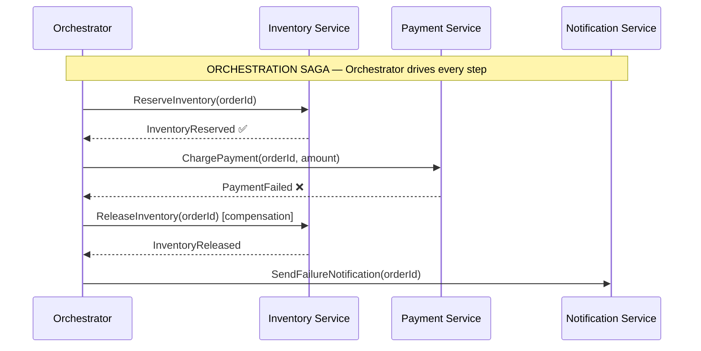
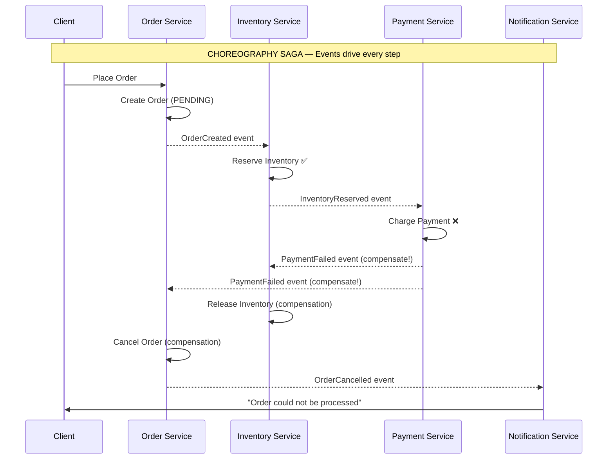

## 1. Overview

Distributed transactions are one of the hardest problems in microservices. You have 4 services that each need to do their part of a business operation. If step 3 fails, steps 1 and 2 need to be undone. In a single database, a transaction handles this automatically. Across services, there is no such thing as a cross-service ACID transaction — at least not one you'd want to run at scale.

The naive solution is Two-Phase Commit (2PC): a coordinator asks all participants to "prepare," then "commit." It works. It also holds locks across multiple services for the entire duration of the transaction — catastrophic at the scale of millions of transactions per hour.

The **Saga pattern** is the practical solution: break the distributed transaction into a sequence of local transactions. Each step publishes an event or triggers the next step. If any step fails, previously completed steps are undone using **compensating transactions** — explicit rollback operations that reverse the work.

The Saga pattern doesn't give you ACID consistency. It gives you eventual consistency with defined compensation semantics. That's a trade-off. At staff level, your job is to know when that trade-off is acceptable and when it isn't.

By the end of this guide you'll know:

- The two Saga styles: Choreography (event-driven) and Orchestration (command-driven)
- How to implement both in Go with Kafka
- The failure modes that aren't obvious until you're debugging at 2 AM
- Why compensation logic is the hardest part — and how to not let it rot
- When to use Saga vs a database transaction

---

## 2. Core Concepts

### The Mental Model

Think of booking a vacation package: flight + hotel + car rental. Each is a separate service. You want all three or none. A Saga books each one sequentially. If the car rental is sold out, it cancels the hotel and refunds the flight. Each cancellation is a **compensating transaction**.

Sagas are:
- **Forward**: steps execute in sequence; each step commits locally
- **Backward**: if any step fails, compensating transactions run in reverse order

This is not a rollback in the database sense. Compensating transactions are application-level operations — they call the hotel API to cancel, call the airline API to request a refund. They can fail independently. They require their own error handling.

### Choreography vs Orchestration

These are the two styles for coordinating a Saga. The choice matters deeply for observability and maintainability.

**Choreography**: Each service listens for events and knows what to do next. There is no central coordinator. Services are autonomous.

**Orchestration**: A central orchestrator service directs each step. It sends commands to services, waits for responses, and decides what to do next.



*Orchestration Saga: the orchestrator has full visibility into every step. When payment fails, it directly commands the inventory service to compensate. The flow is explicit and debuggable.*



*Choreography Saga: each service reacts to events and knows its own compensation. No central coordinator. The flow is distributed across services — harder to trace, but no single point of failure.*

### Choreography vs Orchestration — When to Choose

| Dimension                   | Choreography                                               | Orchestration                                               |
| --------------------------- | ---------------------------------------------------------- | ----------------------------------------------------------- |
| **Control**                 | Distributed — each service decides its next step           | Centralized — orchestrator directs every step               |
| **Coupling**                | Services coupled via events (event schema is the contract) | Services decoupled from each other; coupled to orchestrator |
| **Observability**           | Hard — distributed tracing required to reconstruct flow    | Easy — orchestrator holds full Saga state                   |
| **Failure handling**        | Each service emits compensating events                     | Orchestrator commands compensation                          |
| **Single point of failure** | None                                                       | The orchestrator                                            |
| **Right for**               | Simple flows, ≤ 4 steps, team autonomy valued              | Complex flows, human approval steps, debugging matters      |
| **Adding a new step**       | Requires updating all event listeners                      | Requires updating only the orchestrator                     |

> **Choose Choreography** when teams want autonomy, the flow is simple, and you have distributed tracing in place.
> **Choose Orchestration** when the flow is complex (5+ steps), requires conditional branching, involves human approval, or when debugging the flow is operationally critical.

> 💡 **Staff-level insight:** Choreography looks elegant in diagrams. In production, reconstructing "what happened to order #12345?" across 6 services' event logs at 3 AM is where elegance becomes a liability. At companies with strong platform teams (distributed tracing, event correlation), choreography scales well. Without that infrastructure, orchestration is far easier to operate.

---

## 3. Use Cases

### Uber — Trip Lifecycle

When a customer requests a ride, 4+ services must coordinate: payment pre-authorization, driver assignment, routing (ETA calculation), and notification. This is a textbook Saga:

1. Pre-authorize payment
2. Assign driver
3. Calculate route  
4. Notify driver and rider

If step 2 fails (no drivers available), step 1 is compensated (payment authorization released). No global lock. No 2PC. Each step commits locally and publishes an event.

At Uber's scale (millions of trips/hour), 2PC across 4 services would hold locks for the combined duration of all 4 steps — roughly 200–500ms. At 1 million trips/hour, that's 1 million long-held distributed locks per hour. A Saga holds each lock for the duration of its own local transaction — typically 1–10ms.

### Stripe — Payment Processing

A payment at Stripe involves: fraud check, balance verification, charge attempt, ledger update, and event publish. Any step can fail. Stripe's compensation logic: reverse the ledger entry, reverse the charge, notify the customer.

Stripe uses the Outbox Pattern alongside the Saga to guarantee that the final payment event reaches their Kafka bus atomically with the database write — the Saga step itself uses the Outbox as its event-publish step.

### Amazon — Order Fulfillment

Amazon's order fulfillment is a long-running Saga that spans days: payment captured → warehouse picking → shipping → delivery. Each transition is a Saga step. If the warehouse can't fulfill an item, a compensating transaction cancels that item and optionally re-runs the payment step for a partial order.

This is an important pattern: Sagas don't have to complete in milliseconds. Long-running Sagas (minutes to days) are valid. The Orchestration style is almost always better for long-running flows because you need durable state between steps.

---

## 4. Gotchas

### Gotcha 1 — Compensation Logic Rot

Compensation code is written once in a sprint and almost never touched again. The service it compensates may change its API. The team that wrote the compensation may have moved on.

Six months later, in a production incident, the compensation fires for the first time in months. It calls a deprecated API endpoint. It fails silently. Your Saga is now stuck in a partial state.

**Production rule**: Compensation transactions are first-class code. They must be:
- Unit tested (test that compensation reverses the forward step)
- Integration tested monthly in staging (run the compensation deliberately)
- Monitored: any failed compensation must go to a dead-letter queue and alert on-call

### Gotcha 2 — Non-Reversible Operations ("Saga-Unsafe" Domains)

Some operations cannot be compensated:
- Sending an email
- An SMS already delivered
- A physical warehouse pick that's already been packed

Compensation logic for "undo sent email" is: send another email saying "ignore the previous email." That's not a rollback. It's a business-level correction.

**Rule**: Before choosing Saga, walk through every forward step and ask: "Can this be compensated?" If the answer is "it's messy," that's acceptable if the business accepts it. If the answer is "no," the operation is outside the Saga boundary — model it as a terminal step with its own failure handling.

### Gotcha 3 — Idempotency in Compensations

Compensation steps can be executed more than once. Network retries, worker restarts, and event bus at-least-once delivery all mean the same compensation may fire twice.

Every compensation must be idempotent: "release inventory for order #123" should succeed on the second call even if the inventory was already released on the first.

```go
// Idempotent inventory release
func ReleaseInventory(ctx context.Context, orderID string) error {
    // Check if inventory is already released for this order
    reservation, err := db.GetReservation(ctx, orderID)
    if errors.Is(err, ErrNotFound) {
        // Already released (or never reserved) — idempotent success
        return nil
    }
    if reservation.Status == StatusReleased {
        // Already compensated — idempotent success
        return nil
    }
    return db.ReleaseReservation(ctx, orderID)
}
```

### Gotcha 4 — Partial Failure at the Compensation Step

Compensation itself can fail. What happens when "release inventory" is down? Your Saga is now stuck: forward step failed, backward step also failed.

Every Saga implementation needs:
- A **dead-letter mechanism** for failed compensations
- A **Saga state store** (a table in Postgres or a dedicated store) tracking the current state of every Saga instance
- An **operator runbook** for manually resolving stuck Sagas
- An **alert** for Sagas that have been in a non-terminal state beyond SLA

### Gotcha 5 — Ordering Guarantees in Choreography

In a Choreography Saga, events are consumed by multiple services. If `InventoryReserved` and `PaymentFailed` arrive out of order at the Inventory Service, it might try to release inventory it hasn't reserved yet.

Design choreography Sagas with optimistic locking or version numbers. Check the current Saga state before applying a compensation event.

---

## 5. Where to Use (and Where NOT to Use)

### Use When

- A business process spans 3+ microservices and requires rollback semantics if any step fails
- Eventual consistency is acceptable for the use case (order creation, trip booking, account provisioning)
- You can define explicit compensating operations for every forward step
- Your team is committed to: testing compensation logic, monitoring stuck Sagas, handling DLQ entries

### Do NOT Use When

- A single database transaction can cover all the data — use ACID. Don't introduce Saga complexity where a transaction suffices.
- The operations genuinely cannot be compensated — don't model non-reversible operations as Saga steps
- Your team won't maintain the compensation logic — a Saga with unmaintained compensation is a production time bomb
- You need strong consistency — Sagas are eventually consistent. During a failure and recovery period, different parts of the system see different states.

> 💡 **Staff-level insight:** The most common Saga mistake I see is teams using it for 2-service flows where a database transaction would work. "We have two services" is not a reason to use Saga. "We have two services AND we've accepted eventual consistency AND we've written compensation logic AND we have monitoring for stuck Sagas" is.

---

## 6. Code Examples

### Orchestration Saga in Go

```go
package saga

import (
    "context"
    "fmt"
    "log"
)

// OrderSagaState tracks the current step and compensation history.
// Persisted to Postgres so the orchestrator survives restarts.
type OrderSagaState struct {
    OrderID           string
    Status            string // pending, inventory_reserved, payment_charged, completed, failed
    CompensatedSteps  []string
}

// OrderSagaOrchestrator drives the order placement saga.
// Each step is a blocking call — use async workers for long-running sagas.
type OrderSagaOrchestrator struct {
    inventorySvc InventoryService
    paymentSvc   PaymentService
    notifySvc    NotificationService
    sagaStore    SagaStore
}

// Execute runs the saga to completion or compensates on failure.
func (o *OrderSagaOrchestrator) Execute(ctx context.Context, order Order) error {
    state := &OrderSagaState{OrderID: order.ID, Status: "pending"}
    if err := o.sagaStore.Save(ctx, state); err != nil {
        return fmt.Errorf("saga store save: %w", err)
    }

    // Step 1: Reserve inventory
    if err := o.inventorySvc.Reserve(ctx, order.ID, order.Items); err != nil {
        state.Status = "failed"
        o.sagaStore.Save(ctx, state)
        return fmt.Errorf("inventory reserve failed: %w", err)
    }
    state.Status = "inventory_reserved"
    o.sagaStore.Save(ctx, state)

    // Step 2: Charge payment
    if err := o.paymentSvc.Charge(ctx, order.ID, order.Amount); err != nil {
        log.Printf("[saga] payment failed for order %s — compensating inventory", order.ID)

        // Compensate Step 1
        if compErr := o.inventorySvc.Release(ctx, order.ID); compErr != nil {
            // Compensation itself failed — alert on-call, send to DLQ
            log.Printf("[saga] COMPENSATION FAILED for order %s: %v", order.ID, compErr)
            o.sagaStore.MarkStuck(ctx, state.OrderID, "compensation_failed: inventory_release")
            return fmt.Errorf("saga stuck — compensation failed: %w", compErr)
        }

        state.Status = "failed"
        state.CompensatedSteps = append(state.CompensatedSteps, "inventory_reserved")
        o.sagaStore.Save(ctx, state)

        o.notifySvc.SendFailure(ctx, order.UserID, order.ID)
        return fmt.Errorf("payment failed, order cancelled: %w", err)
    }
    state.Status = "payment_charged"
    o.sagaStore.Save(ctx, state)

    // Step 3: Confirm order
    state.Status = "completed"
    o.sagaStore.Save(ctx, state)
    o.notifySvc.SendSuccess(ctx, order.UserID, order.ID)

    return nil
}

// SagaStore persists saga state for crash recovery.
// Use Postgres — the same database you use for your domain.
type SagaStore interface {
    Save(ctx context.Context, state *OrderSagaState) error
    MarkStuck(ctx context.Context, orderID, reason string) error
    GetStuck(ctx context.Context) ([]*OrderSagaState, error)
}

type InventoryService interface {
    Reserve(ctx context.Context, orderID string, items []Item) error
    Release(ctx context.Context, orderID string) error // compensation
}

type PaymentService interface {
    Charge(ctx context.Context, orderID string, amount float64) error
    Refund(ctx context.Context, orderID string) error // compensation
}

type NotificationService interface {
    SendSuccess(ctx context.Context, userID, orderID string)
    SendFailure(ctx context.Context, userID, orderID string)
}

type Order struct {
    ID     string
    UserID string
    Amount float64
    Items  []Item
}

type Item struct {
    SKU      string
    Quantity int
}
```

### Choreography Saga with Kafka

```go
package choreography

import (
    "context"
    "encoding/json"
    "log"
)

// OrderService listens for commands and publishes events.
// It does NOT know about inventory or payment — it only reacts to events it cares about.
type OrderService struct {
    db       OrderRepository
    producer KafkaProducer
}

// HandleOrderPlaced creates the order and emits the first event.
// Other services will react to "orders.created".
func (s *OrderService) HandleOrderPlaced(ctx context.Context, req PlaceOrderRequest) error {
    order := &Order{ID: req.OrderID, Status: "pending", UserID: req.UserID}
    if err := s.db.Save(ctx, order); err != nil {
        return err
    }

    event := OrderCreatedEvent{OrderID: order.ID, Items: req.Items, Amount: req.Amount}
    return s.producer.Publish(ctx, "orders.created", mustMarshal(event))
}

// HandlePaymentFailed listens for the payment failure event and compensates.
// This is the compensation step for the order service.
func (s *OrderService) HandlePaymentFailed(ctx context.Context, event PaymentFailedEvent) error {
    order, err := s.db.Get(ctx, event.OrderID)
    if err != nil {
        return err
    }

    // Idempotency: if already cancelled, this is a no-op
    if order.Status == "cancelled" {
        return nil
    }

    order.Status = "cancelled"
    if err := s.db.Save(ctx, order); err != nil {
        return err
    }

    cancelEvent := OrderCancelledEvent{OrderID: order.ID, Reason: "payment_failed"}
    return s.producer.Publish(ctx, "orders.cancelled", mustMarshal(cancelEvent))
}

// Consumer wiring — in production, use a Kafka consumer group
func (s *OrderService) StartConsumer(ctx context.Context, consumer KafkaConsumer) {
    consumer.Subscribe("payments.failed", func(msg []byte) error {
        var event PaymentFailedEvent
        if err := json.Unmarshal(msg, &event); err != nil {
            log.Printf("bad message: %v", err)
            return nil // don't retry bad messages
        }
        return s.HandlePaymentFailed(ctx, event)
    })
}

// --- Event types ---

type OrderCreatedEvent struct {
    OrderID string  `json:"order_id"`
    Items   []Item  `json:"items"`
    Amount  float64 `json:"amount"`
}

type PaymentFailedEvent struct {
    OrderID string `json:"order_id"`
    Reason  string `json:"reason"`
}

type OrderCancelledEvent struct {
    OrderID string `json:"order_id"`
    Reason  string `json:"reason"`
}

func mustMarshal(v interface{}) []byte {
    b, err := json.Marshal(v)
    if err != nil {
        panic(err)
    }
    return b
}

// Interfaces (swap implementations for testing)
type KafkaProducer interface {
    Publish(ctx context.Context, topic string, payload []byte) error
}

type KafkaConsumer interface {
    Subscribe(topic string, handler func([]byte) error)
}

type OrderRepository interface {
    Save(ctx context.Context, order *Order) error
    Get(ctx context.Context, orderID string) (*Order, error)
}

type Order struct {
    ID     string
    UserID string
    Status string
}

type Item struct {
    SKU      string
    Quantity int
}

type PlaceOrderRequest struct {
    OrderID string
    UserID  string
    Items   []Item
    Amount  float64
}
```

*Note: The Choreography Saga requires each service to understand which events trigger what. The `HandlePaymentFailed` function in `OrderService` is the compensation — it doesn't call PaymentService directly, it reacts to an event that PaymentService emitted.*

---

## 7. Scale Discussion

### 10x Load (Compensation Traffic)

At 100 TPS and a 0.1% failure rate, compensation fires ~0.1 times/second — invisible. At 1,000 TPS, compensation fires ~1 time/second. At 10,000 TPS, you have ~10 compensations/second. Compensation is a traffic pattern that grows with load and spikes during incidents — load test it separately.

### 100x Load (Saga State Store)

The Saga state store (the Postgres table tracking Saga progress) receives a write on every state transition. A 5-step Saga generates 5 writes per order. At 10,000 orders/second, that's 50,000 writes/second to the saga_state table. Plan this as a separate table (or separate database) with its own connection pool.

### 1000x Load (Long-Running Sagas)

At massive scale, Sagas that span minutes (e.g., order fulfillment) accumulate millions of in-flight records. The `GetStuck` query that scans for non-terminal Sagas becomes expensive. Add a `last_updated` index and a background worker that processes stuck Sagas in batches, not a full-table scan.

---

## 8. Monitoring & Observability

| Metric                                          | Type      | Alert Condition                                           |
| ----------------------------------------------- | --------- | --------------------------------------------------------- |
| `saga_executions_total{saga, status}`           | Counter   | —                                                         |
| `saga_compensation_triggered_total{saga, step}` | Counter   | Alert if > 0.5% of sagas trigger compensation             |
| `saga_compensation_failed_total{saga, step}`    | Counter   | Alert immediately on any increment                        |
| `saga_stuck_count{saga}`                        | Gauge     | Alert immediately if > 0                                  |
| `saga_duration_seconds{saga}`                   | Histogram | Alert if p99 > your SLA                                   |
| `saga_dlq_depth{saga}`                          | Gauge     | Alert if > 0 (something is failing and not auto-retrying) |

**Dashboard to build**: Stage funnel for each Saga type — how many Sagas entered each step, how many completed, how many were compensated. A spike in step-2 compensation is immediately visible as an inventory or payment issue.

---

## 9. Interview Questions

**Q1: "How would you implement distributed transactions across 3 microservices?"**

Key points:
- Lead with: why 2PC doesn't scale (locks held across network boundaries for the full transaction duration)
- Describe the Saga approach: each service commits locally, events trigger next steps
- Choose a style: Choreography for simple flows, Orchestration for complex ones — justify the choice
- Address compensation: walk through what happens at each failure point
- Address idempotency: events can be delivered more than once

Common mistake: Recommending 2PC. If you say 2PC in a FAANG interview, expect a follow-up about lock contention and network failure semantics that will expose the gap.

---

**Q2: "What happens when your compensation logic fails?"**

Key points:
- This is the hardest part of the Saga pattern — acknowledge that
- Dead-letter queue for failed compensations
- Saga state store: every Saga instance must have persisted state so it can be recovered
- Alert on `saga_compensation_failed_total` — every failure needs a human in the loop
- Operator runbook: the on-call must know how to manually unblock a stuck Saga
- Business decision: Is partial recovery acceptable? (e.g., order cancelled but inventory still reserved for 1 hour)

Interviewer wants: Evidence you've thought about the unhappy paths, not just the happy path.

---

**Q3: "When would you choose Choreography over Orchestration?"**

Key points:

- Choreography: teams value autonomy, flow is simple (≤ 4 steps), no conditional branching, you have distributed tracing
- Orchestration: complex flows, conditional logic, human approval steps, debugging is critical, new team members need to understand the flow quickly
- The real trade-off is observability vs coupling — draw the comparison table

Common mistake: Saying "Choreography is always better because it's decoupled." Coupling to events vs. coupling to an orchestrator are both forms of coupling. The question is which is easier to manage for your specific case.

---

## 10. Staff-Level Preparation Tips

### What to Build

1. **Implement a 3-step Orchestration Saga in Go**: inventory reserve → payment charge → order confirm. Persist Saga state to Postgres. Deliberately inject failures at each step (return errors from mock implementations). Verify that compensation fires correctly for every failure permutation: fail at step 1, fail at step 2, fail at step 3.

2. **Implement compensation failure handling**: make the compensation for step 2 fail. Verify that the stuck Saga appears in your monitoring. Implement the recovery runbook manually. This exercise is what separates candidates who understand Saga from candidates who can describe it.

3. **Run a Choreography Saga with Kafka**: use three separate goroutines acting as separate services. Introduce a message ordering issue (consume `PaymentFailed` before `InventoryReserved`). Observe the bug. Fix it with idempotency checks. This is the choreography gotcha that only shows up in production.

### What to Study Deeper

- **Martin Fowler — "Saga"**: https://martinfowler.com/articles/microservices-grpc-saga.html — the canonical reference
- **Chris Richardson — Saga pattern**: https://microservices.io/patterns/data/saga.html — includes the orchestration vs choreography deep-dive
- **Temporal.io**: a workflow engine purpose-built for long-running Sagas with durable execution. Understanding Temporal's model gives you a deep appreciation of the state management problem that Sagas impose.

### How This Connects to Broader System Design

- **Saga + Outbox**: the two patterns are usually deployed together. The Saga generates events; the Outbox guarantees those events are published to Kafka atomically with the database write. Never use Saga without thinking about how events are published.
- **Saga + CQRS**: the Saga's events can feed a CQRS projection to build the read model. Each Saga step event updates the order status in the read store.
- **Saga vs Event Sourcing**: Event Sourcing stores the sequence of events as the source of truth. Sagas use events for coordination. They can coexist: the Saga steps generate events that are stored in an event store and also drive the compensation logic.

> 💡 **Staff-level insight:** The tell-tale sign of a staff-level answer in a Saga discussion is when the candidate proactively brings up stuck Sagas: "And here's what happens when compensation fails, and here's how we detect it, and here's the runbook." That moves the conversation from pattern knowledge to operational maturity — which is exactly what FAANG staff-level interviews are looking for.

---

## 11. References

### Books

- **"Designing Data-Intensive Applications"** — Martin Kleppmann. Chapter 7 (Transactions) provides the foundation for understanding what Saga trades away from ACID. [O'Reilly](https://www.oreilly.com/library/view/designing-data-intensive-applications/9781491903063/)
- **"Microservices Patterns"** — Chris Richardson. Chapters 4 and 5 are the most comprehensive treatment of the Saga pattern in print. [Manning](https://www.manning.com/books/microservices-patterns)

### Engineering Blogs

- **Martin Fowler — Saga**: https://martinfowler.com/articles/microservices-grpc-saga.html
- **microservices.io — Saga pattern**: https://microservices.io/patterns/data/saga.html
- **Uber Engineering — Orchestrating Microservices**: https://www.uber.com/blog/microservice-architecture/
- **Temporal.io Blog — Sagas with Durable Execution**: https://temporal.io/blog

### Conference Talks

- **"Managing Data in Microservices"** — Randy Shoup, GOTO 2017
- **"Distributed Sagas: A Protocol for Coordinating Microservices"** — Caitie McCaffrey, QCon SF 2015: https://www.youtube.com/watch?v=0UTOLRTwOX0

### Tools

- **Temporal.io** — durable workflow engine for long-running Sagas: https://temporal.io
- **Conductor** (Netflix) — orchestration engine: https://conductor.netflix.com
