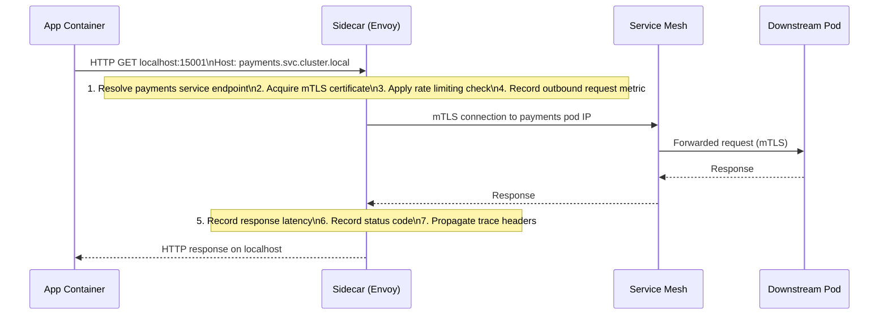

## 1. Overview

In the 1920s, motorcycle manufacturers solved a problem: how do you carry a passenger on a motorcycle without making the motorcycle a different vehicle? The answer: attach a small compartment — a sidecar — to the side. The motorcycle remains unchanged; the passenger gets their own space; the combination can do things neither could do alone.

In distributed systems, the Sidecar pattern solves: **how do you add cross-cutting capabilities (mutual TLS, observability, service discovery, rate limiting) to every microservice without modifying every microservice's code?**

The answer: deploy a small proxy container alongside every application container, in the same Kubernetes Pod. The application container talks to the sidecar on localhost. The sidecar handles all network complexity. The application thinks it's talking to localhost; in reality, it's talking to a full service mesh.

This is how Lyft built Envoy, how Google built Istio, how Microsoft built Dapr. The sidecar is the enabler of service meshes — it moves networking concerns from application code into infrastructure.

The mental model: **a motorcycle sidecar**. The motorcycle (app) does what it's built to do. The sidecar carries the extra gear (TLS, observability, retries, rate limiting) without weighing down the motorcycle.

By the end of this guide you'll know:

- What belongs in a sidecar and what should stay in the app
- The actual latency cost of a sidecar (it's ~1ms, and it matters at high QPS)
- Why pod shutdown ordering in Kubernetes is a real production problem
- How Envoy, Istio, and Dapr implement the sidecar differently
- How to implement a Go service that correctly uses a local sidecar for outbound traffic
- The version drift problem that bites large Kubernetes clusters

---

## 2. Core Concepts

### The Architecture

The sidecar is deployed in the same Pod but as a separate container. Because they share a Pod, they share a network namespace — they can communicate over `localhost` or `127.0.0.1` without any external network hops.

```
┌──────────────────────────────────────────────────────────┐
│                   Kubernetes Pod                          │
│                                                          │
│  ┌──────────────────┐    ┌──────────────────────────┐   │
│  │  App Container   │    │  Sidecar Container       │   │
│  │                  │    │  (e.g., Envoy Proxy)     │   │
│  │  Go service:     │    │                          │   │
│  │  listens :8080   │    │  Inbound: :15001         │   │
│  │                  │    │  Outbound: :15001        │   │
│  │  Outbound calls: │    │  mTLS termination        │   │
│  │  → localhost:    │    │  Observability           │   │
│  │    15001         │    │  Load balancing          │   │
│  │  (Envoy handles  │    │  Service discovery       │   │
│  │  the real dest)  │    │  Rate limiting           │   │
│  └──────────────────┘    └──────────────────────────┘   │
│                                                          │
│         Shared network namespace (localhost)             │
└──────────────────────────────────────────────────────────┘
           │ Inbound mTLS           │ Outbound mTLS
           ▼                        ▼
      Other Pod                Other Pod
      (via mesh)               (via mesh)
```

*App container and sidecar share the network namespace. Traffic redirection (iptables rules) intercepts the app's outbound traffic and routes it through the sidecar without any code changes in the app.*

### Traffic Interception — The Magic of iptables

How does the app's TCP connection to, say, `payments.svc.cluster.local:8080` get transparently redirected to the sidecar proxy? **iptables rules injected by an init container.**

When Istio injects a sidecar, it also injects an `istio-init` init container that runs before the app starts. This init container adds iptables rules that intercept all outbound TCP traffic (except traffic from the sidecar's own process) and redirect it to the sidecar's port. The sidecar then handles the connection, performs mTLS, consults service discovery, and forwards to the actual destination.

The app never knows. It calls `payments.svc.cluster.local:8080` and gets a response. The entire mTLS handshake, retry logic, and telemetry collection happened in the sidecar, invisibly.

### What Belongs in a Sidecar

**Good candidates for sidecar:**
- **Mutual TLS (mTLS)**: certificate rotation, TLS termination, certificate validation — identical across all services, zero code changes
- **Observability**: distributed tracing (inject trace IDs into headers, send spans to Jaeger/Zipkin), metrics collection (requests, latency, error rates)
- **Service discovery**: resolve `payments.svc.cluster.local` to healthy pod IPs, load balance across replicas
- **Rate limiting**: inbound rate limiting based on caller identity (Envoy's rate limit filter)
- **Circuit breaking**: Envoy has a built-in circuit breaker that integrates with its healthcheck system
- **Retry logic**: simple retry on connection failure (not for business-logic retries)

**Should stay in the app:**
- **Business logic retries**: whether to retry a payment that returned 402 is a business decision, not a networking decision
- **Authentication and authorization of business operations**: did user X have permission to view order Y? The sidecar can verify that the *service* is who it says it is (mTLS); it cannot verify business-layer authorization
- **Request validation**: validating that a request body conforms to your schema belongs in the app
- **Application-level caching**: caching business data belongs in the app, not the proxy
- **Domain errors**: translating database errors to HTTP 404 belongs in the app

### The Sidecar Request Flow



*One outbound call from the app = two network hops: app → sidecar, sidecar → downstream. Each hop adds ~0.5ms latency.*

### Sidecar Implementations

**Envoy Proxy** — the open-source proxy at the core of every major service mesh. Written in C++, it's the data plane for Istio, AWS App Mesh, and Google Traffic Director. Configurable via xDS API.

**Istio (with Envoy)** — Istio is the control plane that programs Envoy sidecars across your cluster. You write `VirtualService`, `DestinationRule`, and `PeerAuthentication` resources; Istio translates them into Envoy xDS configuration.

**Dapr (Distributed Application Runtime)** — Microsoft's sidecar runtime. Instead of being a networking proxy, Dapr is an API-oriented sidecar: it provides building blocks for service invocation, pub/sub, state management, secrets. Your app calls `localhost:3500` (HTTP or gRPC) to access any building block. Dapr handles the protocol, service discovery, and infrastructure.

---

## 3. Use Cases

### Istio at Lyft and Google

Lyft built Envoy in 2015 to solve their service-to-service communication problems at scale: no unified observability, no mTLS, no circuit breaking, inconsistent retry policies across 100+ services written in different languages.

Rather than rewriting 100+ services, they deployed Envoy as a sidecar. Every service got mTLS and distributed tracing without a single line of application code changing. Google adopted Envoy and built Istio around it, contributing the control plane that makes cluster-wide policy management possible.

At Lyft's scale (thousands of services, millions of requests per minute), this pattern enables a single security policy (`require mTLS for all service-to-service communication`) to be enforced across the entire fleet without involving application teams. One Kubernetes `PeerAuthentication` resource → all sidecars enforce mTLS.

### AWS App Mesh

AWS App Mesh is Amazon's managed service mesh built on Envoy. Every service in the mesh gets an Envoy sidecar. Traffic routing, health checking, and observability are managed via App Mesh resources (VirtualService, VirtualNode) rather than Kubernetes native resources.

The integration with CloudWatch Container Insights gives you per-service request rates, error rates, and latency histograms without adding any logging code to your services. This is the observability dividend of the sidecar pattern.

### Dapr at Microsoft Azure

Dapr was designed by Microsoft Azure to solve a specific problem: cloud-native applications that need to interact with many Azure services (queues, state stores, pub/sub topics) should not be tightly coupled to Azure-specific SDKs. The Dapr sidecar provides a language-agnostic API — `localhost:3500/v1.0/invoke/{service}/{method}` — that works for any application regardless of language or framework.

For polyglot teams (Go, Python, Node.js, Java all in the same cluster), Dapr eliminates the need to maintain 4 different SDK versions for the same infrastructure interaction. The sidecar is the SDK.

---

## 4. Gotchas

### Gotcha 1 — Latency Addition Adds Up

Each sidecar hop adds approximately 0.5–1ms of latency. For a simple request that goes app → sidecar-A → sidecar-B → downstream app, that's two extra network hops = 1–2ms of pure sidecar overhead.

At low QPS with typical service latencies of 50–100ms, 2ms is negligible. At high QPS with latency-sensitive operations (a recommendation service with a 5ms SLA), 2ms is 40% of your budget.

Measure your sidecar overhead before and after enabling the mesh. The metric to watch is `envoy_upstream_rq_time` — Envoy's histogram of request latency. If p99 of this metric matches your application's p99 end-to-end latency, the sidecar overhead is negligible. If sidecar latency is 20%+ of total latency, investigate Envoy's configuration for performance issues (connection pooling, HTTP/2 multiplexing, buffer sizes).

### Gotcha 2 — Pod Shutdown Ordering (The Most Common K8s Bug)

When Kubernetes terminates a Pod, it sends SIGTERM to all containers simultaneously. The app container receives SIGTERM and starts graceful shutdown — draining in-flight requests. But if the sidecar (Envoy) shuts down first, any requests the app is still processing that need to call a downstream service will fail — the sidecar is gone.

This is a real production nightmare. Symptoms: 502 errors, connection refused errors, or `upstream connect error` in logs — only during deployments.

The fix in Kubernetes 1.28+ is the `terminationGracePeriodSeconds` and container ordering with `lifecycle.preStop` hooks:

```yaml
containers:
  - name: envoy
    lifecycle:
      preStop:
        exec:
          command: ["/bin/sh", "-c", "sleep 5"]  # Wait 5s before Envoy stops
  - name: app
    lifecycle:
      preStop:
        exec:
          command: ["/bin/sh", "-c", "sleep 2"]  # App drains first, then Envoy
```

This gives the app 2 seconds to drain in-flight requests, then Envoy drains its connections, then both stop. Without this: race condition on every deployment.

### Gotcha 3 — Sidecar Version Drift

In a cluster with 200 services, deployed at different times, sidecar versions drift. Service A has Envoy 1.20, Service B has Envoy 1.24, Service C has Envoy 1.19. Envoy 1.24 added a breaking change in TLS handling. Service A cannot establish mTLS with Service C because they're too far apart in version.

Maintaining sidecar version consistency across a large cluster requires:
- A policy that blocks deployment of new application versions without a matching sidecar version
- Regular cluster-wide sidecar upgrades (infrastructure team's responsibility)
- Monitoring of sidecar versions: `count(distinct sidecar_version) by (cluster)` should always be 1 or 2 (during upgrade window)

### Gotcha 4 — Resource Overhead at 1,000 Pods

Envoy sidecar at baseline consumes approximately 50MB of memory and 0.1 CPU cores. At 1,000 pods, that's 50GB of memory and 100 CPU cores consumed purely by sidecars — none of it serving application traffic.

This is real. At Lyft's scale, sidecar resource overhead is a significant cost factor. Optimizations:
- Use CPU and memory limits/requests tuned for your actual Envoy usage (`resources.requests.cpu: 100m, memory: 64Mi`)
- Profile your Envoy configuration — complex filter chains (many auth filters, rate limiters) increase CPU usage
- Consider whether every service needs a full service mesh sidecar — coarser ingress-level policies might suffice for some services

### Gotcha 5 — Cascading Sidecar Failure

If the Envoy sidecar crashes (OOM killed, SIGSEGV from a configuration error), the application container continues running but has no network proxy. All outbound calls fail. Inbound calls are not intercepted (or also fail, depending on the iptables setup).

The application often can't tell the difference between "the downstream service is down" and "my sidecar is down." Both look like connection failures. Symptom: sudden 100% error rate on all downstream calls from a pod, while other pods remain healthy.

Debugging: `kubectl logs <pod> -c envoy` — check if the sidecar is running and what it's logging. If you see OOM kills, increase memory limits.

---

## 5. Where to Use (and Where NOT to Use)

### Use Sidecar when:

- **You have a polyglot service fleet** — Go, Java, Python, Node.js services. A shared library approach requires maintaining the library in every language. A sidecar is write-once, deploy everywhere.
- **You need cluster-wide security policy** — enforcing mTLS across all services without code changes is the sidecar's killer feature.
- **You need uniform observability** — distributed tracing, request metrics, error rates for every service without instrumentation code.
- **You're operating at 10+ services** — the break-even point where the operational overhead of a sidecar infrastructure is justified by the benefit of not adding cross-cutting code to every service.

### Do NOT use Sidecar when:

- **You have 1–3 services** — the operational overhead (service mesh control plane, sidecar version management, resource costs) is not justified at small scale.
- **Latency is extremely tight** (sub-millisecond SLAs) — adding 1–2ms per request is unacceptable. Use a library approach instead.
- **Your protocol is not supported** — sidecars handle HTTP/1.1, HTTP/2, gRPC natively. MySQL wire protocol, Redis protocol, and proprietary binary protocols require custom Envoy filters or won't work at all.
- **You can't afford the resource overhead** — on memory-constrained devices (IoT, edge compute), 50MB per sidecar is untenable.

> 💡 **Staff-level insight:** The sidecar pattern is a manifestation of the single responsibility principle applied to infrastructure. Your application code should be responsible for business logic. Your network proxy should be responsible for networking. When you embed TLS, tracing, and retry logic into your application library, you've coupled these concerns — a TLS certificate rotation requires a code change and a deployment. With a sidecar, certificate rotation is a sidecar configuration change — no app deployment needed. At staff level, evaluating whether to use a shared library vs a sidecar is fundamentally a question about **coupling and deployment independence**. The sidecar maximizes deployment independence at the cost of a network hop. The library maximizes performance at the cost of coupling. Neither is universally right.

---

## 6. Versus: Comparisons

### Sidecar vs Shared Library

| Aspect                               | Sidecar                                   | Shared Library                    |
| ------------------------------------ | ----------------------------------------- | --------------------------------- |
| Network overhead                     | ~1ms per hop (2 hops per request)         | Zero — in-process call            |
| Language support                     | Language-agnostic                         | One library per language          |
| Update deployment                    | Sidecar restart (no app redeploy)         | App code change + redeploy        |
| Coupling                             | Loose — separate process                  | Tight — same process, same memory |
| Cross-cutting concern implementation | Once (in proxy)                           | N times (per language)            |
| Debugging                            | Harder (separate process, different logs) | Easier (same process, same trace) |
| Memory overhead                      | ~50MB per pod (Envoy)                     | Minimal                           |
| Failure isolation                    | Sidecar crash ≠ app crash (usually)       | Library bug crashes app           |

**Choose Sidecar when**: polyglot fleet, 10+ services, security/observability policy must be centrally enforced.

**Choose Shared Library when**: single language, latency-critical (sub-5ms SLA), small fleet (< 5 services), or you need deep integration with application-level context (e.g., user ID for per-user rate limiting).

### Sidecar vs Service Mesh (Clarification)

A common confusion: the sidecar *is* the data plane of a service mesh. The service mesh consists of:
- **Data plane**: sidecar proxies (Envoy) deployed in every pod
- **Control plane**: Istio, Linkerd, Consul Connect — programs the data plane with configuration

You can use an Envoy sidecar without a full service mesh. You can't have an Istio service mesh without Envoy sidecars (or similar). The sidecar pattern is the building block; the service mesh is the system built from those building blocks.

---

## 7. Code Examples

```go
package sidecar

import (
	"context"
	"fmt"
	"net/http"
	"time"
)

// When using a Dapr sidecar, your Go service calls localhost:3500 for all
// inter-service communication. The sidecar handles:
//   - Service discovery (resolving app IDs to pod IPs)
//   - mTLS
//   - Retries
//   - Distributed tracing (trace headers injected by Dapr)
//
// Your code has ZERO networking infrastructure — it just calls localhost.

const daprSidecarPort = 3500

// DaprClient is a thin wrapper over HTTP calls to the Dapr sidecar.
// In production, use the official Dapr Go SDK (github.com/dapr/go-sdk).
// This illustrates the localhost call pattern explicitly.
type DaprClient struct {
	httpClient *http.Client
	baseURL    string
}

func NewDaprClient() *DaprClient {
	return &DaprClient{
		httpClient: &http.Client{
			// Keep timeout short — sidecar is local (< 1ms overhead)
			Timeout: 5 * time.Second,
		},
		// All calls go to localhost — the sidecar intercepts and routes them
		baseURL: fmt.Sprintf("http://localhost:%d", daprSidecarPort),
	}
}

// InvokeService calls another service via the Dapr sidecar.
// The app ID ("payment-service") is the Kubernetes service name.
// The sidecar resolves it to the actual pod IPs and load balances.
// mTLS is handled by the sidecar — this HTTP call is plaintext to localhost.
func (c *DaprClient) InvokeService(ctx context.Context, appID, method string, body []byte) (*http.Response, error) {
	url := fmt.Sprintf("%s/v1.0/invoke/%s/method/%s", c.baseURL, appID, method)

	req, err := http.NewRequestWithContext(ctx, http.MethodPost, url, nil)
	if err != nil {
		return nil, fmt.Errorf("build dapr invoke request: %w", err)
	}
	req.Header.Set("Content-Type", "application/json")

	// Dapr automatically propagates W3C trace context headers.
	// No tracing code needed in your application.

	return c.httpClient.Do(req)
}

// PublishEvent publishes a message to a pub/sub topic via the Dapr sidecar.
// The sidecar translates this to the underlying message broker (Kafka, Redis Streams, etc.)
// without your code knowing which broker is configured.
func (c *DaprClient) PublishEvent(ctx context.Context, pubsubName, topic string, payload []byte) error {
	url := fmt.Sprintf("%s/v1.0/publish/%s/%s", c.baseURL, pubsubName, topic)

	req, err := http.NewRequestWithContext(ctx, http.MethodPost, url, nil)
	if err != nil {
		return fmt.Errorf("build dapr publish request: %w", err)
	}
	req.Header.Set("Content-Type", "application/json")

	resp, err := c.httpClient.Do(req)
	if err != nil {
		return fmt.Errorf("dapr publish: %w", err)
	}
	defer resp.Body.Close()

	if resp.StatusCode >= 400 {
		return fmt.Errorf("dapr publish status %d", resp.StatusCode)
	}
	return nil
}
```

```yaml
# Kubernetes Pod spec showing app container + Envoy sidecar.
# In a real Istio cluster, the sidecar is injected automatically via
# the mutating admission webhook — you don't write this manually.
# This YAML illustrates what Istio injects for understanding.

apiVersion: v1
kind: Pod
metadata:
  name: order-service
  annotations:
    sidecar.istio.io/inject: "true"  # Tells Istio to inject the sidecar
spec:
  # initContainers run before app containers start
  initContainers:
    - name: istio-init
      image: docker.io/istio/proxyv2:1.20.0
      # This init container sets up iptables rules that redirect all
      # inbound and outbound traffic through the Envoy sidecar proxy.
      # Without these rules, the app's traffic bypasses Envoy entirely.
      args: ["istio-iptables", "-p", "15001", "-u", "1337"]
      securityContext:
        capabilities:
          add: ["NET_ADMIN"]

  containers:
    # ─── Application Container ───────────────────────────────────────────────
    - name: order-service
      image: myregistry/order-service:v1.2.0
      ports:
        - containerPort: 8080
      resources:
        requests:
          cpu: "500m"
          memory: "256Mi"
        limits:
          cpu: "1"
          memory: "512Mi"
      # Graceful shutdown: give the app 2s to drain before Envoy stops
      lifecycle:
        preStop:
          exec:
            command: ["/bin/sleep", "2"]

    # ─── Envoy Sidecar Container ─────────────────────────────────────────────
    - name: istio-proxy
      image: docker.io/istio/proxyv2:1.20.0
      ports:
        # Port 15001: Envoy's inbound/outbound proxy port
        # Port 15090: Prometheus metrics endpoint (Envoy exposes /metrics here)
        - containerPort: 15001
        - containerPort: 15090
      resources:
        # Size these carefully — at 1,000 pods these add up fast
        requests:
          cpu: "100m"     # ~0.1 CPU cores per pod
          memory: "64Mi"  # 64MB per sidecar
        limits:
          cpu: "200m"
          memory: "128Mi"
      # Envoy must stay alive until after the app finishes draining.
      # Sleep 5s so app (sleeping 2s) completes before Envoy stops.
      lifecycle:
        preStop:
          exec:
            command: ["/bin/sleep", "5"]
      env:
        - name: PILOT_CERT_PROVIDER
          value: istiod  # Use Istio's built-in CA for mTLS certificates
```

*The `preStop` lifecycle hook ordering is critical: app sleeps 2s, Envoy sleeps 5s. This ensures the app drains in-flight connections before Envoy stops accepting new ones. Without this, rolling deployments produce 502 errors.*

---

## 8. Scale Discussion

### At 10x Load

Memory and CPU overhead of sidecars starts to matter. At 100 pods, 64MB per sidecar = 6.4GB dedicated to proxy overhead. Monitor cluster-wide resource usage with `sum(container_memory_working_set_bytes{container="istio-proxy"}) by (namespace)`. If sidecar memory is >10% of your total cluster memory budget, right-size the sidecar limits.

### At 100x Load

At 1,000 pods, the Istio control plane (istiod) is now distributing configuration to 1,000 Envoy instances. Every policy change (a new DestinationRule, a certificate rotation) pushes xDS configuration to 1,000 sidecars. This push fan-out creates istiod CPU spikes. At this scale:

- Tune istiod's concurrency: `--concurrency` flag for xDS pushes
- Enable push throttling to stagger configuration updates
- Consider namespacing your mesh: separate istiod instances per namespace zone to reduce fan-out

### At 1000x Load

At 10,000 pods, managing a monolithic service mesh becomes operationally complex. Large organizations at this scale (Google, Lyft) shard their mesh: different Istio control planes per cluster, per region, or per environment. Traffic between mesh segments uses gateway-level routing, not per-pod sidecars.

The sidecar pattern itself remains valid; the control plane architecture requires federation. Google's Traffic Director provides a managed control plane that eliminates the istiod scaling concern.

---

## 9. Monitoring & Observability

| Metric                                                        | Type      | Alert Condition                                                            |
| ------------------------------------------------------------- | --------- | -------------------------------------------------------------------------- |
| `envoy_upstream_rq_time`                                      | Histogram | p99 > 2× expected downstream latency — routing issue                       |
| `envoy_upstream_rq_xx{response_code_class="5xx"}`             | Counter   | Rate climbing — downstream degrading                                       |
| `sidecar_latency_overhead_ms` (derived)                       | Gauge     | `(end_to_end_p99 - app_processing_p99)`. > 5ms — sidecar overhead too high |
| `istio_requests_total{destination_service, response_code}`    | Counter   | Per-service error rate alert                                               |
| `container_memory_working_set_bytes{container="istio-proxy"}` | Gauge     | > 128Mi per pod — sidecar memory leak or undersized                        |
| `envoy_server_live`                                           | Gauge     | 0 = sidecar down — page immediately                                        |
| `pilot_xds_push_time`                                         | Histogram | p99 > 30s — control plane slow to push updates                             |
| `pilot_xds_pushes`                                            | Counter   | Spike > 100/min — configuration storm (misconfigured operator)             |

**Key dashboard to build**: A service topology map showing per-service error rates and latencies as reported by Envoy. Kiali (the Istio dashboard) provides this out of the box. Every application error becomes visible in the mesh topology without any application-level logging changes.

**The hidden metric**: `envoy_server_live` per pod. When an Envoy sidecar OOM-crashes, this metric goes to 0. A pod with a dead sidecar will appear healthy (Kubernetes liveness probe hits the app, which is still running) but will fail all outbound calls silently. Alert on `envoy_server_live = 0` with a 30-second window.

---

## Interview Questions

### Question 1: "Your team runs 50 microservices. You need to enforce mTLS for all service-to-service communication by next quarter. How do you do it without code changes in 50 services?"

**Key points to cover:**
- Sidecar injection via admission webhook: add `sidecar.istio.io/inject: "true"` annotation (or namespace-level default) — Kubernetes injects Envoy on every pod deployment
- `PeerAuthentication` resource in Istio with `mtls.mode: STRICT` — no `PERMISSIVE` since that allows non-mTLS traffic
- Rolling out to permissive first, then strict, to avoid breaking existing connections
- Certificate management: Istio's CA (istiod) issues short-lived certs (24h) and rotates automatically — zero ops overhead
- Monitoring: use Kiali to visualize which services are communicating over mTLS vs plaintext

**Common mistake:** Proposing to add TLS code to each service. This requires touching 50 codebases, testing 50 services, coordinating 50 deployments. The sidecar approach is literally a one-line annotation and a single `PeerAuthentication` resource.

**What the interviewer wants:** The ability to solve infrastructure problems at the platform level, not the application level. Staff engineers think in policies, not point solutions.

### Question 2: "After enabling Istio in your cluster, you see brief 502 errors during rolling deployments that didn't happen before. Root cause and fix?"

**Key points to cover:**
- Pod shutdown ordering: Kubernetes sends SIGTERM to all containers simultaneously; app starts draining, but Envoy might stop before the app finishes handling in-flight requests
- During a rolling deployment, the old pod is terminated while the new pod is starting. If Envoy in the old pod exits before the app drains, in-flight requests get 502s
- Fix: `lifecycle.preStop` sleep on the sidecar container (5s) and the app container (2s), staggered so Envoy outlives the app
- Additional fix: ensure your ingress/load balancer supports graceful connection draining (Kubernetes `terminationGracePeriodSeconds` > preStop duration)
- Long-term: configure Envoy's DRAIN delay via `MINIMUM_DRAIN_DURATION` environment variable

**Common mistake:** Blaming the new service version. If errors only appear during the deployment window (not before/after), the issue is shutdown ordering, not the application code.

### Question 3: "Explain the trade-off between a sidecar proxy approach and a shared library approach for implementing distributed tracing across 20 services in 3 different languages (Go, Python, Node.js)."

**Key points to cover:**
- **Shared library** approach: implement OpenTelemetry SDK in Go, Python, and Node.js versions. Requires maintaining 3 libraries, 3 upgrade cycles, coordination with 20 teams. Every trace context propagation change requires a code change in 20 services.
- **Sidecar** approach: deploy Envoy with tracing configured (Jaeger/Zipkin). Trace headers are injected by Envoy on every request. No code changes needed for basic tracing. However: for custom span attributes (e.g., `user_id`, `order_id` in spans), the app still needs to write to trace context — sidecar can't know business-layer identifiers.
- **The hybrid** (what production systems actually do): sidecar for infrastructure-level tracing (request/response, latency, error codes), application code for business context (custom span attributes). OpenTelemetry provides the SDK; Envoy provides the transport.
- Performance: one extra network hop per traced request vs zero overhead in-process library call. For very high frequency calls (health checks, internal chatter), this matters.

**What the interviewer wants:** Understanding that neither is a complete solution alone. The best answer acknowledges both approaches and articulates when to use each.

---

## Staff-Level Preparation Tips

**What to build:**
- Deploy a 3-service Kubernetes application with Istio sidecar injection. Enable `PeerAuthentication: STRICT`. Verify mTLS is working by checking Kiali. Deliberately misconfigure one service's ports and observe the mesh topology showing 502 errors.
- Reproduce the pod shutdown ordering bug: deploy a service, enable Istio, and run `kubectl rollout restart deployment` while watching error rates. See the 502s. Then add the `preStop` hooks and verify they disappear.
- Explore Dapr: deploy a Go service that calls another service via the Dapr sidecar. Observe that your Go code has no service discovery or TLS — it just calls `localhost:3500`.

**What to study:**
- Envoy documentation on xDS API — the configuration mechanism that powers all service meshes
- Istio's "Traffic Management" documentation — VirtualService, DestinationRule, Gateway
- "The Service Mesh: What Every Engineer Needs to Know" — William Morgan (CEO, Buoyant/Linkerd)
- Dapr documentation — specifically the "Service Invocation" and "Pub/Sub" building blocks

**How it connects to broader system design:**
- The sidecar pattern is foundational to zero-trust networking — every service-to-service connection uses mTLS with a workload identity certificate (SPIFFE/SPIRE is the underlying standard)
- It enables progressive delivery at the infrastructure level: Istio VirtualService can route 5% of traffic to a canary deployment without application code changes — the same Strangler Fig routing mechanism, but managed by the mesh
- At staff level, knowing when a service mesh is overkill is as important as knowing how to deploy one. A two-service system does not need Istio.

---

## References

- [Envoy Proxy Documentation](https://www.envoyproxy.io/docs/envoy/latest/)
- [Istio Service Mesh Documentation](https://istio.io/latest/docs/)
- [Dapr — Distributed Application Runtime](https://docs.dapr.io/)
- [AWS App Mesh Documentation](https://aws.amazon.com/app-mesh/)
- [CNCF Service Mesh Landscape](https://landscape.cncf.io/?group=projects-and-products&tag=service-mesh)
- [Lyft Engineering Blog — Envoy Proxy](https://eng.lyft.com/announcing-envoy-c-l4-l7-proxy-and-communication-bus-92520340ef6c)
- [Google Traffic Director](https://cloud.google.com/traffic-director/docs/overview)
- [SPIFFE — Secure Production Identity Framework](https://spiffe.io/)
- [William Morgan — The Service Mesh (InfoQ Talk)](https://www.infoq.com/presentations/service-mesh-microservices/)
