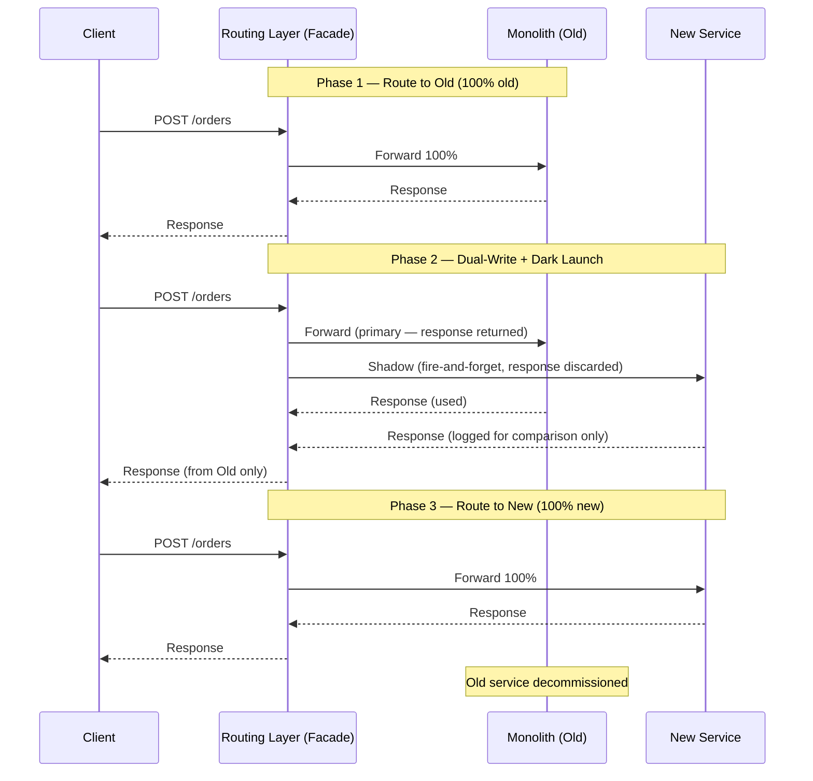

## 1. Overview

A strangler fig is a tropical plant that germinates in the canopy of a host tree, sends roots down to the ground, and slowly grows around the original tree. Over decades, the fig entirely encases the host. The host tree eventually dies or rots away from the inside, leaving the fig tree standing in its place — built around the dead host's scaffold.

Martin Fowler used this as a metaphor for software migration in 2004: **instead of replacing a system in one dangerous big bang, grow the new system around the old one, routing traffic to it feature by feature, until the old system is empty and can be removed**.

The mental model: **building a new airport while keeping the existing one operating**. You don't close the airport, demolish it, and then build the new one. You build the new terminals alongside the old ones, gradually move gates to the new terminal, and only shut down the old terminal when the last flight has moved over.

This pattern is the reason Amazon, Netflix, and every large tech company that started with a monolith was able to migrate to microservices without taking a weekend-long outage to rewrite everything.

By the end of this guide you'll know:

- How to implement the routing layer that's the core of this pattern
- How to manage the dual-write period when both old and new services need to be consistent
- How to implement dark launches (sending traffic to the new service but not returning its response)
- Why the routing layer itself becomes a problem if you don't discipline the migration
- How to define "done" — the exit criteria that tell you when to remove the old system

---

## 2. Core Concepts

### The Migration Arc

A Strangler Fig migration has three phases. Understanding each phase prevents the most common mistakes.



*The migration arc: Phase 1 = all traffic to old. Phase 2 = shadow traffic to new (dark launch). Phase 3 = all traffic to new, old retired.*

### The Routing Layer Is the Key Component

The routing layer sits in front of both the monolith and the new service. It intercepts every request and makes a routing decision: send to old, send to new, or dark-launch (send to both, return old's response).

The routing decision can be based on:
- **Feature flags**: "If `order_service_v2_enabled` flag is true, route to new service"
- **A/B percentage**: "Route 10% of requests to new service, 90% to old"
- **User cohort**: "Users in the `beta_testers` group go to new service"
- **Request attribute**: "Orders with `type=subscription` go to new service first"

The routing layer must be **non-functional from the client's perspective** — clients should see identical behavior whether routed to old or new.

### The Dual-Write Period

When you have a database shared between monolith and new service (or two separate databases being migrated), there's a period where writes must happen to both. This is the dual-write period — and it's where most Strangler Fig migrations encounter consistency bugs.

```
              ┌──────────────┐
              │ Routing Layer │
              └──────────────┘
                 │         │
         writes  ▼         ▼  writes
       ┌─────────────┐  ┌──────────────┐
       │  Old DB      │  │  New DB      │
       │  (Postgres)  │  │  (Postgres)  │
       └─────────────┘  └──────────────┘

  Problem: A write to Old DB succeeds.
  A write to New DB fails (timeout, network error).
  Now: Old DB has the record. New DB does not.
  Read from Old: ✓ exists. Read from New: ✗ not found.
  → CONSISTENCY BUG.
```

Options for managing dual-write:

**Option A — Old is authoritative**: Write to old first. If old write succeeds, write to new asynchronously (background job, event-driven). New DB may lag by seconds. Accept eventual consistency.

**Option B — Synchronous dual-write with compensation**: Write to both synchronously. If one fails, roll back or compensate the other. Complex, fragile, avoid if possible.

**Option C — Change Data Capture (CDC)**: Only write to the old DB. Use Debezium or AWS DMS to replicate changes from old DB to new DB via the transaction log. New DB is eventually consistent with old DB. This is the cleanest approach.

**Recommendation**: Use CDC (Option C) for the migration period. It decouples the write path from the migration and eliminates dual-write consistency bugs in application code.

### Dark Launch (Shadow Traffic)

A dark launch sends production traffic to the new service but discards its response. The client gets the old service's response. You log (or compare) both responses to verify the new service's correctness before committing to it.

Why this is powerful: you can find bugs in the new service using real production traffic at production scale, without risking production users seeing errors. Every discrepancy between old and new response is caught before cutover.

Implementation detail: the dark launch must be **fire-and-forget** — the request to the new service must not block the response to the client. Run it in a goroutine. Set a separate timeout. If the dark launch call fails or times out, log it, but return the old service's response immediately.

---

## 3. Use Cases

### Amazon — Splitting the Pets.com Monolith (2001–2007)

Amazon's transition from a monolithic C++ application to services is one of the most cited examples in systems design literature. The migration took years and was done entirely via the Strangler Fig approach — no weekend rewrites, no big bang.

The routing layer started as a simple HTTP proxy (an Apache VirtualHost with `ProxyPass` rules). As individual services were extracted (catalog, search, recommendations, checkout), the routing rules directed those paths to the new services while everything else continued going to the monolith. The monolith shrank over years as the new services grew around it.

Jeff Bezos's famous 2002 "API Mandate" memo (all teams must expose their data and functionality through APIs, with no back doors) was the policy counterpart to the Strangler Fig technical pattern — it forced services to be designed with clean interfaces so they could be decomposed.

### Real Estate Fintech — Property Listing Migration

A real estate platform had a Rails monolith handling property listings, search, and user accounts. The engineering team wanted to extract the search service (to use Elasticsearch) without touching the listings and user account code.

They introduced an Nginx router: `/search/*` went to the new Go search service backed by Elasticsearch; everything else continued to the Rails monolith. The dual-write period used CDC (Debezium reading the listings Postgres DB, syncing to Elasticsearch).

Timeline: 3 months of dark launch (comparing search results, fixing ranking bugs), 1 month of 10% → 50% → 100% rollout. Rails monolith's search code was deleted on month 5. Zero production incidents during cutover.

### Martin Fowler's Original Essay

Martin Fowler coined the term in his 2004 essay "Strangler Application." He observed the pattern in a heritage insurance system — the migration took 5 years. The routing facade was an HTTP gateway; as each feature was moved to the new system, the routing rule flipped. By year 5, the facade was routing 100% to the new system and the old system was switched off.

The pattern scales: from a 3-month migration to a 5-year migration, the mechanics are the same. The routing layer is the invariant. The pace of extraction is determined by team capacity and risk tolerance.

---

## 4. Gotchas

### Gotcha 1 — The Routing Layer Becomes a New Monolith

The Strangler Fig requires discipline to complete. The most common failure mode: the routing layer accumulates feature flags, business logic, and custom routing rules over years, until it's as complex as the original monolith — but without the original monolith's tests and institutional knowledge.

Routing layers must be **policy-driven, not logic-driven**. They should not contain if/else business logic — only routing rules keyed by feature flags or request attributes. If you find yourself adding a 50-line function to the router that computes whether a user should go to the old or new service based on their account type, subscription tier, and past order history — stop. That logic belongs in the new service as a feature toggle, not in the router.

Rule of thumb: the routing layer should be replaceable in a day. If it would take a week to rewrite, it has too much logic.

### Gotcha 2 — Dual-Write Consistency Bugs

Dual-write is the most technically dangerous period of the migration. An order placed during dual-write period ends up in the old DB but not the new one. A customer who is now being served by the new service sees their order history as empty. Support tickets spike.

The CDC approach (Change Data Capture) doesn't eliminate this — CDC has replication lag. During high write volume, new DB can lag old DB by seconds. A user who just placed an order and immediately refreshes the page might be served by the new service (after cutover) and not see their order because CDC hasn't replicated it yet.

Mitigations: read-your-own-writes consistency (route the same user to the same service for a session); replication lag monitoring (alert when lag > 5 seconds); delay cutover until replication lag is consistently < 1 second.

### Gotcha 3 — Never Defining "Done"

The pattern only works if you have explicit exit criteria: what does "fully migrated" look like? Without this, the routing layer runs in production forever, darkening every request to both old and new services, with the dual-write database sync running in the background, all for a migration that's "95% complete" indefinitely.

Before starting a migration, define:
- **Exit criteria**: "Old service receives 0% of requests for 30 consecutive days"
- **Decommission checklist**: "Old service's database has no writes for 30 days; old service's deployment is removed; routing rule for this feature is deleted"
- **Owner**: one person is accountable for reaching done — not a committee

### Gotcha 4 — Dark Launch Timeout Contamination

If your dark launch is not fully fire-and-forget, a slow new service can delay the old service's response. The client's SLA is now affected by the new service, even though the new service's response is discarded.

Symptom: p99 latency increases after enabling dark launch. Diagnosis: the dark launch goroutine is holding a reference that delays request completion, or there's a shared resource (connection pool) being contended.

Fix: use a separate goroutine with its own context and timeout. Never share the calling request's context with the dark launch goroutine — if the original request times out, the dark launch goroutine should be independent of that.

### Gotcha 5 — Data Migration Without Schema Alignment

The old DB schema evolved over 8 years and has columns like `orders.flag1` (no one knows what it does), `users.field_extra` (JSON blob with undocumented structure), and nullable columns with implicit business meaning ("null means unverified").

Before migrating, you need a schema mapping exercise: for every field in the old schema, what is its meaning in the new service? Often this requires reading old code, talking to the original authors (good luck), and making judgment calls.

This is not a routing problem — it's a data archaeology problem. Budget significant time for it. Undocumented schema semantics are the hidden cost of every monolith migration.

---

## 5. Where to Use (and Where NOT to Use)

### Use Strangler Fig when:

- **Migrating a monolith to microservices** — this is the textbook use case
- **Migrating between technology stacks** — Rails monolith to Go services, Java EE to Spring Boot
- **Replacing a vendor product with an in-house system** — you introduce the routing layer in front of the vendor; gradually route features to your new system
- **Database migration** — migrating from MySQL to Postgres by routing writes to both via CDC, then cutting over reads
- **Any time you need to replace a live, customer-facing system** — you cannot take downtime and you cannot guarantee the new system is bug-free

### Do NOT use Strangler Fig when:

- **The system is truly small enough for a big rewrite** — a single microservice with 2,000 lines of code and full test coverage can reasonably be rewritten in a week. Don't introduce a routing layer for this.
- **The protocol makes routing impractical** — binary protocols, WebSockets, bidirectional gRPC streaming, stateful connections. HTTP is easy to proxy; stateful protocols are much harder.
- **There's no clean routing boundary** — if the monolith is so tightly coupled that there's no way to route "orders" separately from "inventory" (they share the same HTTP handlers, DB transactions, and in-process calls), you need to decouple internally first before extracting externally.

> 💡 **Staff-level insight:** The Strangler Fig pattern's biggest benefit isn't technical — it's **organizational**. It lets teams migrate incrementally rather than requiring a lengthy freeze on feature development. The routing layer gives you a safety valve: if the new service has a critical bug, you flip one feature flag and 100% of traffic returns to the old service in 30 seconds. No rollback required, no incident. This is why the Strangler Fig is the standard migration approach at every large tech company — not because it's the technically simplest approach, but because it's the organizationally safest one. The alternative — a big bang rewrite — requires a feature freeze, a long parallel development period, and a high-stakes cutover that puts all your eggs in one basket.

---

## 6. Versus: Comparisons

### Strangler Fig vs Big Bang Rewrite

| Aspect                               | Strangler Fig                                | Big Bang Rewrite                              |
| ------------------------------------ | -------------------------------------------- | --------------------------------------------- |
| Risk                                 | Low — incremental, reversible                | Extreme — all-or-nothing                      |
| Feature development during migration | Continues normally                           | Frozen or forked                              |
| Time to first production traffic     | Days/weeks (routing layer)                   | Months/years (full rewrite)                   |
| Data consistency management          | Needed (dual-write / CDC)                    | Needed only at cutover                        |
| Discovery of unknown requirements    | Gradual — old code reveals constraints       | All at once — often wrong                     |
| Rollback strategy                    | Feature flag → traffic back to old           | Full rollback of the entire release           |
| Team morale                          | Steady (progress visible)                    | Low during dark months of no visible progress |
| Success rate at scale                | High (Google, Netflix, Amazon all used this) | Low — "The Second System Effect"              |

**Choose Strangler Fig always** for non-trivial migrations. The Big Bang Rewrite is a famous failure mode — Joel Spolsky's essay "Things You Should Never Do" (2000) is still required reading. Netscape's complete rewrite took 3 years and nearly killed the company.

**Choose Big Bang Rewrite only when**: the system is small (< 5,000 lines of code, well-tested, no live traffic at rewrite time), or when the existing codebase is so corrupt that it cannot safely run in production alongside a new one.

### Strangler Fig vs Branch by Abstraction

| Aspect                | Strangler Fig                           | Branch by Abstraction                |
| --------------------- | --------------------------------------- | ------------------------------------ |
| Where routing happens | At the network layer (HTTP proxy)       | Inside the codebase (interface/flag) |
| Protocol requirement  | HTTP or gRPC (proxiable protocols)      | Any — it's a code pattern            |
| When to use           | Extracting services (process isolation) | Refactoring within a single service  |
| Operational overhead  | Routing layer infrastructure            | Code complexity only                 |
| Feature flag location | Router config                           | Application code                     |

**Choose Strangler Fig** when extracting to a separate network service.
**Choose Branch by Abstraction** when refactoring within a monolith before extracting — it's the step before Strangler Fig.

---

## 7. Code Examples

```go
package strangerfig

import (
	"context"
	"io"
	"log/slog"
	"net/http"
	"net/http/httptest"
	"net/http/httputil"
	"net/url"
	"time"
)

// FeatureFlagChecker determines if a feature is enabled.
// In production, this wraps LaunchDarkly, AWS AppConfig, or a simple KV store.
// Using an interface makes the router testable without real flag infrastructure.
type FeatureFlagChecker interface {
	IsEnabled(ctx context.Context, flagName string) bool
}

// RoutingRule maps a feature flag to routing destinations.
type RoutingRule struct {
	FlagName   string   // "order_service_v2_enabled"
	OldURL     *url.URL // http://monolith.internal:8080
	NewURL     *url.URL // http://order-service.internal:8081
	DarkLaunch bool     // if true: route to old, shadow to new
}

// StranglerRouter is an HTTP reverse proxy that routes traffic based
// on feature flags. It supports:
//  - Route to old service (migration not started)
//  - Route to new service (migration complete)
//  - Dark launch: serve from old, shadow to new (validation phase)
type StranglerRouter struct {
	rules []RoutingRule
	flags FeatureFlagChecker
	log   *slog.Logger
}

func NewStranglerRouter(rules []RoutingRule, flags FeatureFlagChecker, log *slog.Logger) *StranglerRouter {
	return &StranglerRouter{rules: rules, flags: flags, log: log}
}

// ServeHTTP implements http.Handler. It is the entry point for all requests.
func (r *StranglerRouter) ServeHTTP(w http.ResponseWriter, req *http.Request) {
	rule := r.findRule(req)
	if rule == nil {
		// No rule matches — this path isn't being migrated yet. Route to old by default.
		http.Error(w, "no routing rule found", http.StatusBadGateway)
		return
	}

	migrated := r.flags.IsEnabled(req.Context(), rule.FlagName)

	switch {
	case migrated && !rule.DarkLaunch:
		// Migration complete for this feature — route to new service, old is retired.
		r.proxyTo(w, req, rule.NewURL, "new")

	case rule.DarkLaunch:
		// Dark launch phase: serve response from old, shadow the request to new.
		// The new service is exercised under real production traffic but its response
		// is discarded. Any errors from new service are logged but don't affect users.
		r.darkLaunch(w, req, rule)

	default:
		// Migration not started or flag disabled. Route everything to old service.
		r.proxyTo(w, req, rule.OldURL, "old")
	}
}

// proxyTo forward the request to the target URL and streams the response back.
func (r *StranglerRouter) proxyTo(w http.ResponseWriter, req *http.Request, target *url.URL, destination string) {
	proxy := httputil.NewSingleHostReverseProxy(target)
	proxy.ErrorHandler = func(w http.ResponseWriter, req *http.Request, err error) {
		r.log.Error("proxy error",
			"destination", destination,
			"url", req.URL.String(),
			"error", err)
		// In production: increment routing_errors_total{destination} counter here
		http.Error(w, "upstream error", http.StatusBadGateway)
	}
	// In production: record routing_rule_hits_total{feature=rule.FlagName, destination}
	proxy.ServeHTTP(w, req)
}

// darkLaunch serves the response from old while shadowing to new.
// The critical property: the new service call is completely non-blocking.
// It MUST NOT affect the latency or correctness of the old service's response.
func (r *StranglerRouter) darkLaunch(w http.ResponseWriter, req *http.Request, rule *RoutingRule) {
	// Clone the request body so we can read it twice (once for old, once for new).
	// http.Request.Body is a one-time reader — after old reads it, it's empty.
	bodyBytes, err := io.ReadAll(req.Body)
	if err != nil {
		http.Error(w, "failed to read request body", http.StatusInternalServerError)
		return
	}

	// Fire the shadow request to the new service in a separate goroutine.
	// IMPORTANT: use a fresh context, NOT req.Context().
	// If the original request is cancelled (user timeout), this shadow goroutine
	// should still complete independently — we want to capture its response for
	// comparison logging, even if the user's request is already done.
	go r.shadowRequest(req, bodyBytes, rule)

	// Serve the real response from the OLD service.
	// Restore the body so old service can read it.
	req.Body = io.NopCloser(io.NewReader(bodyBytes))
	r.proxyTo(w, req, rule.OldURL, "old")
}

// shadowRequest sends a cloned request to the new service and logs the response
// for comparison. Errors here never affect production users.
func (r *StranglerRouter) shadowRequest(originalReq *http.Request, body []byte, rule *RoutingRule) {
	// Independent context with a timeout — shadow requests should not run indefinitely.
	ctx, cancel := context.WithTimeout(context.Background(), 5*time.Second)
	defer cancel()

	shadowReq, err := http.NewRequestWithContext(ctx, originalReq.Method,
		rule.NewURL.String()+originalReq.RequestURI, io.NewReader(body))
	if err != nil {
		r.log.Error("shadow request creation failed", "error", err)
		return
	}

	// Copy headers from original request (auth, content-type, trace IDs).
	for key, values := range originalReq.Header {
		for _, v := range values {
			shadowReq.Header.Add(key, v)
		}
	}
	// Mark as shadow so new service can log/treat differently if needed.
	shadowReq.Header.Set("X-Shadow-Request", "true")

	client := &http.Client{Timeout: 5 * time.Second}
	resp, err := client.Do(shadowReq)
	if err != nil {
		r.log.Warn("shadow request failed", "feature", rule.FlagName, "error", err)
		// In production: increment dark_launch_errors_total{feature=rule.FlagName}
		return
	}
	defer resp.Body.Close()

	r.log.Info("shadow request completed",
		"feature", rule.FlagName,
		"status", resp.StatusCode,
	)
	// In production: compare resp body against old service's response (if captured),
	// log discrepancies to a comparison queue for offline analysis.
}

func (r *StranglerRouter) findRule(req *http.Request) *RoutingRule {
	// In production, this matches on path prefix, HTTP method, or request attributes.
	// Keeping it simple here: first matching rule wins.
	for i := range r.rules {
		// Real implementation: r.rules[i].PathPrefix matches req.URL.Path, etc.
		// For this example, all requests match the first rule.
		return &r.rules[i]
	}
	return nil
}

// io.NewReader is not in stdlib — this is a convenience shim
// In practice use bytes.NewReader(bodyBytes) from "bytes" package
func io_NewReader(b []byte) io.Reader {
	return &bytesReader{b: b}
}

type bytesReader struct{ b []byte; pos int }
func (r *bytesReader) Read(p []byte) (int, error) {
	if r.pos >= len(r.b) { return 0, io.EOF }
	n := copy(p, r.b[r.pos:])
	r.pos += n
	return n, nil
}

// ─── Example Usage ────────────────────────────────────────────────────────────

// In production, this would be your main.go:
//
// oldURL, _ := url.Parse("http://monolith.internal:8080")
// newURL, _ := url.Parse("http://order-service.internal:8081")
//
// router := NewStranglerRouter(
//     []RoutingRule{{
//         FlagName:   "order_service_v2_enabled",
//         OldURL:     oldURL,
//         NewURL:     newURL,
//         DarkLaunch: true,  // Dark launch first; flip to false when confident
//     }},
//     launchDarklyClient,
//     slog.Default(),
// )
// http.ListenAndServe(":8080", router)
```

*The dark launch goroutine uses a completely independent context — not the original request's context. This ensures shadow traffic continues even if the original request is cancelled. Shadow request failures logged but never returned to users. A `bytes.NewReader` replaces `io.NewReader` from stdlib.*

---

## 8. Scale Discussion

### At 10x Load

The routing layer becomes a bottleneck at 10x. An HTTP reverse proxy that inspects feature flags on every request adds latency — typically 1–3ms for a local flag check, more if the flag is fetched from a remote service.

At 10x load, the routing layer must:
- Cache feature flags locally (in-memory cache, refreshed every 5–30 seconds). Never call the flag service on every request.
- Use connection pooling in the reverse proxy (don't create a new TCP connection per request). `httputil.ReverseProxy` handles this via `http.Transport`.
- Run with sufficient goroutine headroom — size `GOMAXPROCS` and request handling concurrency for the expected RPS.

### At 100x Load

At 100x, the routing layer deserves its own autoscaling group or Kubernetes deployment, separate from both the old and new services. If the routing layer and the monolith share a host, scaling the routing layer for traffic means scaling the monolith unnecessarily.

Dark launches at 100x multiply your upstream load by ~2 (old + new both receive traffic). Account for this in capacity planning during the dark launch period.

### At 1000x Load

At 1000x, consider replacing the custom routing layer with a production-grade API gateway or service mesh:

- **Nginx/Envoy** with dynamic configuration: routing rules stored in a config store (Consul, etcd), updated without restarts
- **Kubernetes Gateway API**: native Kubernetes traffic management with canary weights and header-based routing
- **Istio VirtualService**: fine-grained traffic splitting with observability built in

At 1000x, the routing overhead per request must be sub-millisecond. Custom Go code is efficient; an Envoy sidecar adds ~0.5ms. Either works. A multi-hop Python routing service does not.

---

## 9. Monitoring & Observability

| Metric                                            | Type      | Alert Condition                                                               |
| ------------------------------------------------- | --------- | ----------------------------------------------------------------------------- |
| `routing_rule_hits_total{feature, destination}`   | Counter   | Tracks migration progress (% to new service)                                  |
| `routing_errors_total{feature, destination}`      | Counter   | Any non-zero rate on critical-path features                                   |
| `routing_latency_seconds{destination}`            | Histogram | p99 for "new" destination > 2× p99 for "old" — new service slower than old    |
| `dark_launch_errors_total{feature}`               | Counter   | Sustained rate — new service has bugs                                         |
| `dark_launch_response_discrepancy_total{feature}` | Counter   | Any non-zero — new service returns different responses than old               |
| `feature_migration_completion_percent{feature}`   | Gauge     | Track: 0% (not started) → 100% (complete). Alert if stuck at same % > 30 days |
| `replication_lag_seconds`                         | Gauge     | (CDC lag) > 5s — warn; > 30s — page (dual-write period)                       |
| `routing_layer_latency_seconds`                   | Histogram | p99 > 5ms — routing layer overhead too high                                   |

**The most important dashboard**: `routing_rule_hits_total{destination="new"} / routing_rule_hits_total` per feature. This is your migration progress graph. When it hits 100% and stays there for a week, trigger the decommission checklist.

**Discrepancy alerts**: `dark_launch_response_discrepancy_total` should drive a comparison queue where you log the old response, the new response, and the diff. A weekly review of discrepancies catches bugs in the new service before you commit to it.

---

## Interview Questions

### Question 1: "Your team needs to migrate a 500,000-line Rails monolith to microservices. The system processes $1M/day in transactions and can have at most 1 hour of downtime per year. How do you approach this?"

**Key points to cover:**
- Strangler Fig is non-negotiable at this scale — no big bang rewrite
- Start with the routing layer: an Nginx/Envoy proxy in front of the monolith
- Identify the first service to extract: pick one with a clean HTTP boundary, manageable data scope, and high business value
- Data migration: use CDC (Debezium/DMS) to replicate the relevant DB tables to the new service's DB during the dual-write period
- Dark launch first: 100% shadow, compare responses, fix discrepancies over 2–4 weeks
- Canary rollout: 1% → 5% → 20% → 50% → 100%, with monitoring at each stage
- Exit criteria: define before starting, enforce ruthlessly

**Common mistake:** Starting with the data layer (trying to split the database first) instead of the routing layer (splitting the HTTP surface). Split the HTTP surface first; split the database after the service is proven.

**What the interviewer wants:** A phased plan with explicit risk management at each phase. Can you enumerate the decision points and failure scenarios?

### Question 2: "You're running a dark launch — shadow traffic to the new service. Your p99 latency has gone up 20%. What do you investigate?"

**Key points to cover:**
- The dark launch goroutine must be fully independent of the original request context — check for shared resources (connection pool, mutex, channel)
- Check if `io.ReadAll(req.Body)` is blocking (reading a large body before forwarding) — add a body size limit
- Check if the shadow goroutine is using the same `http.Transport` as the main proxy — connection contention
- Check the routing layer itself: is feature flag checking adding latency per request?
- Deep check: is the dark launch hitting the same database as the old service (adding DB load)?
- Rule out: are all the percentile increases, or are specific endpoints significantly slower?

**Common mistake:** Blaming the new service. The new service's response is discarded — if the latency is in the *client response* (not the shadow call's latency), the root cause is in the routing layer or the shadow goroutine's interaction with the main path.

### Question 3: "After 6 months of migration, your Strangler Fig routing layer now has 3,000 lines of Go code, including business logic that determines whether a user should go to the new service based on 5 different criteria. What's the problem and how do you fix it?"

**Key points to cover:**
- The routing layer has become a new monolith — it contains business logic that doesn't belong there
- The routing layer's job is: "given a request, which upstream handles it?" — not "what is the correct answer for this user?"
- Fix: move business logic out of the router into the services themselves (feature flags in the service code, not the router)
- The router should only hold routing rules (paths, header matches, percentage splits) — no conditional business logic
- Establish an architectural principle: the routing layer is configuration-driven (a YAML/JSON file), not code-driven
- Timeline: schedule a cleanup sprint to extract the business logic before it becomes load-bearing

**What the interviewer wants:** To see that you recognize architectural debt early and have a principled view of what belongs in infrastructure vs. application code.

---

## Staff-Level Preparation Tips

**What to build:**
- Implement the routing layer from the code example above. Add feature flag-based routing using a simple in-memory map, then replace it with a real LaunchDarkly or AWS AppConfig integration.
- Implement the dark launch comparison: capture old and new service responses, diff them, log discrepancies. Build a simple dashboard showing discrepancy rate over time.
- Practice a full migration: migrate a simple Go monolith to two extracted services using this pattern. Run chaos testing during the dark launch phase (inject failures into the new service and verify the old service continues serving).

**What to study:**
- Martin Fowler — "Strangler Fig Application" (the original essay): https://martinfowler.com/bliki/StranglerFigApplication.html
- "Monolith to Microservices" by Sam Newman — the definitive book on migration strategy
- AWS Migration Hub documentation — commercial tooling built around the Strangler Fig pattern
- Joel Spolsky — "Things You Should Never Do" (2000) — why big bang rewrites fail

**How it connects to broader system design:**
- The Strangler Fig pattern requires mature CI/CD: feature flags, canary deployments, blue-green deployments, automated rollback. Build these capabilities before starting a migration.
- Data migration strategy (CDC, dual-write, eventual consistency) is the hardest part of the Strangler Fig. Study Debezium and AWS DMS for CDC tooling.
- At staff level, the Strangler Fig is a project management pattern as much as a technical one: you need to define scope boundaries, track migration progress, and enforce exit criteria across multiple teams.

---

## References

- [Martin Fowler — Strangler Fig Application (2004)](https://martinfowler.com/bliki/StranglerFigApplication.html)
- [Sam Newman — Monolith to Microservices (Book, 2019)](https://www.oreilly.com/library/view/monolith-to-microservices/9781492047834/)
- [Joel Spolsky — Things You Should Never Do (2000)](https://www.joelonsoftware.com/2000/04/06/things-you-should-never-do-part-i/)
- [Debezium — Change Data Capture](https://debezium.io/documentation/)
- [AWS Database Migration Service](https://aws.amazon.com/dms/)
- [Envoy Proxy — Traffic Management](https://www.envoyproxy.io/docs/envoy/latest/intro/arch_overview/http/http_routing)
- [Kubernetes Gateway API — Traffic Splitting](https://gateway-api.sigs.k8s.io/guides/traffic-splitting/)
- [Netflix Tech Blog — Migrating to Microservices at Netflix](https://netflixtechblog.com/tagged/microservices)
