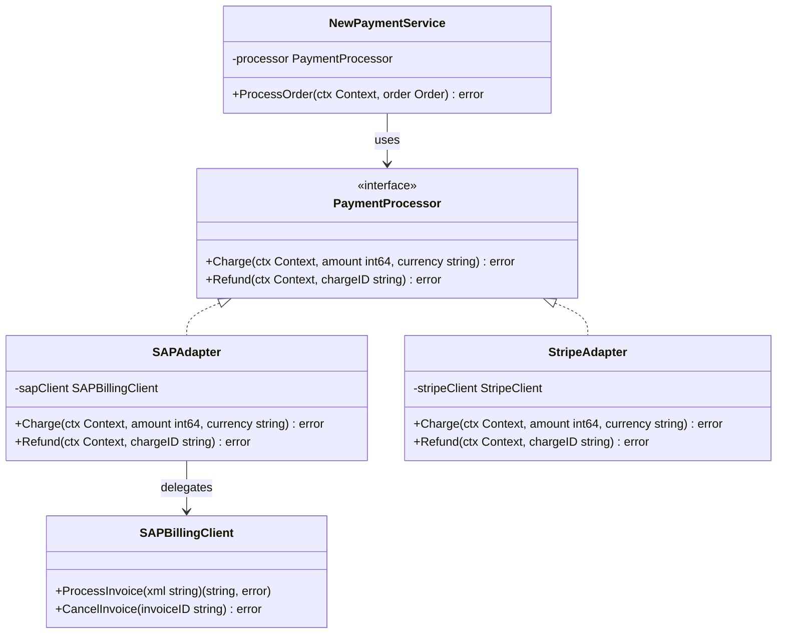

## 1. Overview

The Adapter pattern translates one interface into another. Think of it as a power adapter when you travel internationally: your laptop has a US plug, the wall socket is a UK socket, and the adapter sits between them making things compatible. Your laptop doesn't change. The wall socket doesn't change. The adapter handles the translation.

In software, the Adapter lets you use existing code that has the wrong interface alongside new code that expects a different interface. It's the canonical solution for integrating legacy systems, third-party SDKs, and external APIs without rewriting either side.

For staff engineers: the Adapter is essential vocabulary in system design. It maps directly to the **Anti-Corruption Layer (ACL)** in Domain-Driven Design — the boundary that prevents a legacy system's design decisions from leaking into your clean domain model.

---

## 2. Core Concepts (Step-by-Step)

### The Mental Model

You're building a new payment service. Your code uses a clean `PaymentProcessor` interface with `Charge(ctx, amount, currency)`. But your company has a legacy SAP billing system with a SOAP API: `ProcessInvoice(xml string) (xml string, error)`. You can't change SAP. You can't change your new code's interface. The Adapter sits in the middle, translating between the two worlds.



*`NewPaymentService` only knows about `PaymentProcessor`. Both `SAPAdapter` and `StripeAdapter` implement that interface while hiding their incompatible underlying APIs.*

### Key Rules

1. **The Adapter implements the target interface** — the interface your new code expects.
2. **The Adapter wraps the adaptee** — the existing object with the incompatible interface.
3. **The Adapter translates** — it converts method signatures, data formats, and error types.
4. **The Adapter does not add behavior** — translation only. If you're adding logic, that belongs in a service layer.

---

## 3. Use Cases

### 1. Go's `database/sql` — The Most Famous Adapter in the Ecosystem

Go's `database/sql` package is a textbook Adapter. The package defines the target interface — `DB.Query()`, `DB.Exec()`, `DB.Begin()` — for working with any SQL database. The actual drivers (`github.com/lib/pq` for Postgres, `go-sql-driver/mysql` for MySQL) are the Adapters. Each driver adapts the specific wire protocol of its database to the standard `database/sql` interface.

Your code imports `database/sql` once and works against the standard interface. You can swap Postgres for MySQL by changing one import. The adapter hides the incompatibility entirely — connection negotiation, query escaping, type conversion, and error wrapping are all inside the driver adapter.

### 2. gRPC Adapter Wrapping REST APIs

During Uber's internal service migration from REST to gRPC, they had hundreds of REST services that couldn't be rewritten simultaneously. The solution: write gRPC server implementations that internally called the existing REST endpoints. The gRPC handler was the Adapter — it translated incoming protobuf requests to REST calls, got back JSON, translated back to protobuf. Old REST services ran untouched. New gRPC clients worked immediately. The adapter bought 18 months of safe, incremental migration.

### 3. Cloud Storage Abstraction Across Environments

Stripe uses a `Storage` interface for blob operations. Adapters (`S3Adapter`, `GCSAdapter`, `LocalFSAdapter`) each implement the interface. Developer environments use `LocalFSAdapter` — no cloud credentials needed. Staging uses `GCSAdapter`. Production uses `S3Adapter` with IAM roles. Application code has zero conditional logic based on environment. Adapter selection happens at startup via config injection.

---

## 4. Gotchas

### Gotcha 1: Adapters That Hide Performance Characteristics

The most dangerous adapter anti-pattern: making a remote call look like a local operation:

```go
// This looks like a simple in-memory lookup...
type UserRepository interface {
    GetUser(id string) (*User, error)
}

// ...but this adapter makes a 50ms network call!
func (a *RemoteUserAdapter) GetUser(id string) (*User, error) {
    return a.httpClient.Get("/users/" + id)
}
```

Callers see `UserRepository.GetUser()` and assume it's fast. They call it in a loop. At 10k iterations, that's 500 seconds of latency. **Document adapters that wrap network calls in both the type name and the interface comment.** Put "NOTE: This makes a network call" in the godoc.

### Gotcha 2: Silent Data Loss from Field Mapping

When translating between two data formats, it's easy to drop fields:

```go
func (a *LegacyAdapter) ToNewUser(old *LegacyUser) *User {
    return &User{
        ID:    old.UserID,
        Email: old.Email,
        // SILENT BUG: old.Permissions and old.PIIData dropped entirely
    }
}
```

Dropped permissions is a silent authorization bug. Dropped PII fields can violate compliance requirements. **Write tests that construct a fully-populated source struct and assert every field appears in the destination.** Use code generation (protobuf, sqlc) where possible to prevent handwritten mapping mistakes.

### Gotcha 3: Two Adapters in Series (Double Translation)

When you have `NewSystem → AdapterA → OldSystem → AdapterB → VeryOldSystem`, every translation adds:
- Another failure mode
- Another place where data can be subtly transformed
- Additional latency
- Another file to update when either interface changes

If you find yourself writing an adapter of an adapter, stop. Two adapters in series is a signal to invest in a direct migration path rather than layering translations.

### Gotcha 4: The God Adapter

Adapters that start small tend to grow. You add one method, then another, then helper logic, then validation, then caching. Six months later, the "adapter" is 800 lines with embedded business logic, and it's impossible to test or replace.

**Fix**: Adapters should be thin and mechanical. Business logic belongs in a service layer that *uses* the adapter. The adapter's only job is translation. If a method can't be implemented with a direct translation, that's a sign the interface design needs revision.

---

## 5. Where to Use (and Where NOT to Use)

### Use When

- Integrating a third-party library whose interface doesn't match yours
- Wrapping a legacy system you cannot modify
- Creating an anti-corruption layer in DDD — preventing legacy types and naming from bleeding into your domain model
- Writing tests that need to swap a real external system (S3, Stripe, Twilio) for a controllable fake

### Do NOT Use When

- The interfaces are already compatible — don't add indirection for its own sake
- You need to add behavior, not just translate — use Decorator instead
- The adaptee interface changes frequently — every external change breaks your adapter
- You need to translate many incompatible interfaces from many systems — at that point, a message queue with defined schemas (Kafka with protobuf) is a better architectural answer than a proliferation of adapters

> 💡 **Staff-level insight:** In DDD, the Adapter pattern maps directly to the **Anti-Corruption Layer (ACL)**. When your clean bounded context depends on a messy external system (legacy monolith, third-party API), the ACL prevents that system's types, naming conventions, and error semantics from polluting your domain model. At Stripe, every external dependency sits behind an ACL. It's not optional — it's a standard engineering requirement. The payoff: when the external system changes or is replaced, only the adapter changes. The domain model stays clean.

---

## 6. Versus (Comparisons)

| Aspect                 | Adapter                                             | Facade                                              | Proxy                                |
| ---------------------- | --------------------------------------------------- | --------------------------------------------------- | ------------------------------------ |
| Purpose                | Translate one interface to another incompatible one | Simplify a complex subsystem behind a new interface | Control access to an object          |
| Changes the interface? | Yes — target differs from adaptee                   | Yes — simplified new interface                      | No — same interface as real subject  |
| Wraps                  | One object (the adaptee)                            | Multiple objects (the subsystem)                    | One object (the real subject)        |
| Adds behavior?         | No — translation only                               | No — simplification only                            | Sometimes (caching, auth, lazy init) |
| DDD concept            | Anti-Corruption Layer                               | Application Service / Facade                        | Infrastructure Proxy                 |

**Choose Adapter when** you have an existing object with the wrong interface and cannot modify either the caller or the object.

**Choose Facade when** you have multiple complex objects forming a subsystem, and you want to simplify access behind a single unified interface.

**Choose Proxy when** you want to control access to an object through the *same* interface — for caching, access control, or lazy initialization.

---

## 7. Code Examples

```go
package adapter

import (
	"context"
	"encoding/xml"
	"fmt"
)

// --- Target interface: what the new payment service expects ---

type PaymentProcessor interface {
	Charge(ctx context.Context, amount int64, currency string) (string, error)
	Refund(ctx context.Context, chargeID string) error
}

// --- Adaptee: legacy SAP billing system (incompatible interface) ---

type sapInvoiceRequest struct {
	XMLName  xml.Name `xml:"InvoiceRequest"`
	Amount   float64  `xml:"Amount"`
	Currency string   `xml:"Currency"`
}

type sapInvoiceResponse struct {
	XMLName   xml.Name `xml:"InvoiceResponse"`
	InvoiceID string   `xml:"InvoiceID"`
	Status    string   `xml:"Status"`
}

type SAPBillingClient struct {
	endpoint string
}

// ProcessInvoice is the legacy SOAP interface. It speaks XML, not clean Go types.
func (c *SAPBillingClient) ProcessInvoice(xmlPayload string) (string, error) {
	// In production: HTTP POST to SAP SOAP endpoint
	fmt.Printf("SAP SOAP call to %s\n", c.endpoint)
	return `<InvoiceResponse><InvoiceID>SAP-12345</InvoiceID><Status>SUCCESS</Status></InvoiceResponse>`, nil
}

func (c *SAPBillingClient) CancelInvoice(invoiceID string) error {
	fmt.Printf("SAP cancel: %s\n", invoiceID)
	return nil
}

// --- Adapter: translates PaymentProcessor calls to SAPBillingClient ---
// NOTE: This adapter makes network calls to a remote SAP system.
// Do not use in tight loops without caching.

type SAPPaymentAdapter struct {
	sapClient *SAPBillingClient
}

func NewSAPPaymentAdapter(endpoint string) *SAPPaymentAdapter {
	return &SAPPaymentAdapter{sapClient: &SAPBillingClient{endpoint: endpoint}}
}

func (a *SAPPaymentAdapter) Charge(ctx context.Context, amount int64, currency string) (string, error) {
	// Translate: int64 cents (our domain) -> float64 dollars (SAP's format)
	req := sapInvoiceRequest{
		Amount:   float64(amount) / 100.0,
		Currency: currency,
	}
	xmlBytes, err := xml.Marshal(req)
	if err != nil {
		return "", fmt.Errorf("SAPPaymentAdapter.Charge marshal: %w", err)
	}
	respXML, err := a.sapClient.ProcessInvoice(string(xmlBytes))
	if err != nil {
		return "", fmt.Errorf("SAPPaymentAdapter.Charge ProcessInvoice: %w", err)
	}
	var resp sapInvoiceResponse
	if err := xml.Unmarshal([]byte(respXML), &resp); err != nil {
		return "", fmt.Errorf("SAPPaymentAdapter.Charge unmarshal: %w", err)
	}
	return resp.InvoiceID, nil
}

func (a *SAPPaymentAdapter) Refund(ctx context.Context, chargeID string) error {
	return a.sapClient.CancelInvoice(chargeID)
}

// --- Cloud Storage Adapter example ---

type Storage interface {
	Put(ctx context.Context, key string, data []byte) error
	Get(ctx context.Context, key string) ([]byte, error)
}

// LocalStorageAdapter is used in dev/test environments — no cloud credentials required.
type LocalStorageAdapter struct {
	store map[string][]byte
}

func NewLocalStorage() *LocalStorageAdapter {
	return &LocalStorageAdapter{store: make(map[string][]byte)}
}

func (l *LocalStorageAdapter) Put(_ context.Context, key string, data []byte) error {
	l.store[key] = data
	return nil
}

func (l *LocalStorageAdapter) Get(_ context.Context, key string) ([]byte, error) {
	data, ok := l.store[key]
	if !ok {
		return nil, fmt.Errorf("key not found: %s", key)
	}
	return data, nil
}
```

*Both `SAPPaymentAdapter` and `LocalStorageAdapter` translate between two incompatible interfaces. The translation includes data format conversion (cents to dollars), protocol translation (Go types to XML), and error wrapping to the domain's error vocabulary.*

---

## 8. Scale Discussion

**10x load (10k RPS)**: Adapters are function calls with translation overhead. At 10k RPS, the translation cost is negligible. The only concern is if the adaptee itself is a slow external system.

**100x load (100k RPS)**: If the adapter wraps a network call, you'll see latency amplification. Add connection pooling inside the adapter. Use `context.Context` for cancellation. Add circuit breakers — the adapter is the perfect place for them, since it's already the system boundary.

**1000x load (1M RPS)**: At this scale, evaluate whether the adapter is on the hot path. Consider:
- Caching adapter responses where the underlying data is stable and has acceptable staleness
- Batching calls if the adaptee supports batch operations (reduces N network calls to 1)
- Whether the adapter introduces a fan-out (1 logical call → N adaptee calls), which can trigger thundering herd problems

> 💡 **Staff-level insight:** At very high scale, adapters that wrap external systems often need to become async. Rather than adapting a synchronous remote call, you enqueue a message (Kafka, SQS) and the adapter processes it in a worker. The adapter now translates both the data format *and* the interaction model (sync → async). This is a bigger change — design it with the team, not as a quick fix.

---

## 9. Monitoring & Observability

| Metric                                               | Type                     | Alert Condition                                           |
| ---------------------------------------------------- | ------------------------ | --------------------------------------------------------- |
| `adapter.call.duration_ms` (labeled by adaptee name) | Histogram                | p99 > 200ms for any external adapter                      |
| `adapter.call.errors.total` (labeled by error type)  | Counter                  | Error rate > 0.1% for payment adapters                    |
| `adapter.translation.failures.total`                 | Counter                  | Any value > 0 (translation failure = potential data loss) |
| `adapter.circuit_breaker.state`                      | Gauge (0=closed, 1=open) | State = 1 (adaptee unavailable, traffic being shed)       |
| `adapter.cache.hit_ratio`                            | Gauge                    | < 0.8 for caching adapters (cache is ineffective)         |
| `adapter.request.timeout.total`                      | Counter                  | Spike in 5-min window (adaptee SLA degradation)           |

---

## 10. Interview Questions

### Q1: "Explain the difference between Adapter and Facade. Give a Go example of each."

**Key points to cover:**
- Adapter translates one incompatible interface into another. It takes one existing object and changes how you call it.
- Facade simplifies multiple complex objects into one clean interface. It takes many objects and unifies access to them.
- Go example: `database/sql` drivers are Adapters (each driver translates its DB protocol to the `database/sql` interface). The AWS SDK's `s3.Client` is a Facade (it hides dozens of HTTP operations behind clean Go methods).

**Common mistake:** Saying "both hide complexity so they're the same." The distinction matters — Adapter is about interface incompatibility, Facade is about subsystem simplification. Interviewers want precision.

**What the interviewer wants:** Vocabulary clarity and the ability to recognize both patterns in production code you've read or written.

---

### Q2: "You're designing an anti-corruption layer between your microservice and a legacy monolith's database (direct SQL access). How do you structure it?"

**Key points to cover:**
- Define your domain's repository interface first, in your domain's vocabulary — never in the legacy schema's vocabulary
- The adapter translates between your domain types and the legacy schema types
- Keep translation logic in explicit mapping functions (`toLegacyRow()`, `toDomainUser()`), not embedded inside the adapter struct methods
- Write integration tests against the real legacy schema (not just mocks) — these catch schema drift before it reaches production
- Version the adapter: when the legacy schema changes, the adapter is the blast radius boundary, not your domain

**Common mistake:** Letting the monolith's table names and column names appear in your domain model. That's the ACL failing at its job. You'll know it's happening when your domain struct has fields like `UserRec`, `AcctId`, or `LegacyStatusCode`.

---

### Q3: "How do you detect and prevent silent data loss when an adapter maps between two data formats?"

**Key points to cover:**
- Write a test that constructs a fully-populated source struct and asserts every field is present in the destination
- Use code generation where possible (protobuf mappers, sqlc) to eliminate handwritten field-by-field mapping
- For security-critical fields (permissions, user roles), add post-translation validation that fails loudly if critical fields are zero/empty
- Add audit logging for the translation of sensitive fields (who mapped what, when)

**What the interviewer wants:** Evidence of defense-in-depth thinking — multiple layers preventing silent failure, not just hoping the translator is correct.

---

## 11. Staff-Level Preparation Tips

1. **Read `database/sql` source code** — it's the best real-world Adapter in Go's standard library. Study `sql.Register()`, the `driver.Driver` interface, and how `sql.Open()` uses the registry to find the right adapter. This pattern — registry of named adapters — appears everywhere in production systems.

2. **Implement an ACL for a real external dependency** — take a third-party API (Stripe, Twilio, Sendgrid) and build a proper adapter with your own interface and types. Write tests that swap the real adapter for a `FakeAdapter`. This is standard practice at FAANG companies — every external dependency is behind an interface with a test double.

3. **Study DDD's Anti-Corruption Layer** — Eric Evans' "Domain-Driven Design" Chapter 14 explains why the ACL is not optional for long-lived systems. The technical implementation is the Adapter. The architectural principle is the ACL. Knowing both names makes you fluent in two communities.

4. **Audit your current codebase for implicit adapters** — look for structs that hold an external client and expose your own method signatures. Those are adapters, whether or not they're named that way. Formalizing them helps you reason about the blast radius of external changes.

5. **Prepare the "blast radius" argument** — in your next design review, map the blast radius of each external dependency: "If Stripe changes their API, exactly this adapter changes, nothing else." Staff engineers make change management concrete and bounded.

---

## 12. References

- [Go database/sql package](https://pkg.go.dev/database/sql)
- [Go database/sql tutorial](https://go.dev/doc/database/open)
- [Eric Evans — Domain-Driven Design (Anti-Corruption Layer, Chapter 14)](https://www.oreilly.com/library/view/domain-driven-design-tackling/0321125215/)
- [Martin Fowler — Anti-Corruption Layer](https://martinfowler.com/eaaCatalog/antiCorruptionLayer.html)
- [Uber Engineering — gRPC migration](https://www.uber.com/en-US/blog/introducing-hesper/)
- [AWS SDK for Go v2](https://aws.github.io/aws-sdk-go-v2/docs/)
- [Design Patterns: Elements of Reusable Object-Oriented Software (GoF)](https://www.oreilly.com/library/view/design-patterns-elements/0201633612/)
- [GopherCon 2019 — How I Write HTTP Web Services after Eight Years](https://www.youtube.com/watch?v=rWBSMsLG8po)
