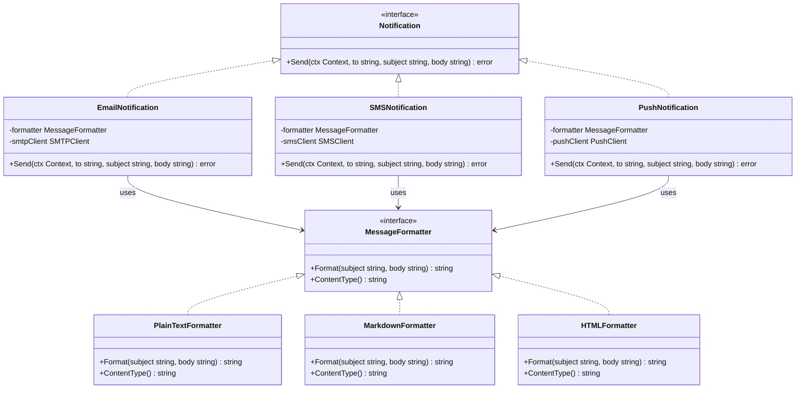

## 1. Overview

The Bridge pattern decouples an abstraction from its implementation so that both can vary independently. Without Bridge, adding a new variation on either dimension creates a combinatorial explosion of concrete classes — N abstractions × M implementations = N×M types. Bridge reduces this to N + M.

The mental model: a TV remote (abstraction) and a TV (implementation). There are many remote control types (basic, universal, smart) and many TV brands (Samsung, LG, Sony). Without Bridge, you'd need `SamsungBasicRemote`, `SamsungUniversalRemote`, `LGBasicRemote`, `LGUniversalRemote` — 3×3=9 classes. With Bridge, you have 3 remote types + 3 TV implementations = 6 classes. The remote holds a reference to the TV interface and delegates hardware operations through it.

For staff engineers: the Bridge pattern is why you add an interface layer between your business logic and your infrastructure. When your notification system can send Email, SMS, or Push AND format messages as PlainText, Markdown, or HTML, Bridge prevents the 3×3=9 concrete struct explosion.

---

## 2. Core Concepts (Step-by-Step)

### The Problem Without Bridge

Suppose you need to send notifications via Email, SMS, and Push. And messages can be formatted as PlainText, Markdown, or HTML. Without Bridge:

```
EmailPlainTextNotification
EmailMarkdownNotification
EmailHTMLNotification
SMSPlainTextNotification
SMSMarkdownNotification
SMSHTMLNotification
PushPlainTextNotification
PushMarkdownNotification
PushHTMLNotification
```

9 concrete types. Now add Slack as a fourth channel: you add 3 more. Add JSON format: you add 4 more. This is the N×M explosion Bridge prevents.

### The Solution

The Bridge pattern introduces two independent hierarchies:
- **Abstraction**: the high-level control layer (Notification channel — Email, SMS, Push)
- **Implementation**: the low-level operations (MessageFormatter — PlainText, Markdown, HTML)

The Abstraction holds a reference to the Implementation interface. Adding a new channel adds 1 struct. Adding a new formatter adds 1 struct. 3+3=6 instead of 3×3=9.



*The Abstraction (`Notification`) holds a reference to the Implementation (`MessageFormatter`). Three notification types × three formatters = 6 structs instead of 9. Add Slack: 7 structs. Add JSON format: 7 structs.*

### Key Principle

**The abstraction owns the high-level behavior. The implementation provides the low-level mechanism.** The abstraction calls the implementation but is not aware of which concrete implementation it has — only the interface.

---

## 3. Use Cases

### 1. Go's `io.Writer` / `io.Reader` — Bridge in the Standard Library

Go's `io.Writer` interface is an implementation interface in the Bridge pattern. An `os.File` implements it. A `bytes.Buffer` implements it. A `gzip.Writer` implements it (and wraps another `io.Writer`). The abstraction layer — the code that produces output — writes to `io.Writer` without knowing whether the output goes to a file, a network connection, a buffer, or a compressed stream.

`fmt.Fprintf(w io.Writer, ...)` is the canonical Go Bridge. You inject the implementation at runtime — `os.Stdout`, a file, a test buffer — and the abstraction (the format logic) doesn't change. This is idiomatic Go Bridge.

### 2. JDBC Drivers — The Original Bridge

Java's JDBC (Java Database Connectivity) is a textbook Bridge. The `Connection`, `Statement`, and `ResultSet` interfaces are the implementation abstraction. PostgreSQL, MySQL, Oracle, and SQLite all provide implementations. Application code uses the JDBC interfaces — the abstraction — and never imports a specific driver. The same pattern lives in Go as `database/sql`.

### 3. Dependency Injection — Bridge in Constructor Form

When a DI framework or constructor injects a `MessageFormatter` at startup, that is Bridge enabling test-vs-production substitutability. In production, the wiring calls `NewEmailNotification(htmlFormatter)`. In a unit test, it calls `NewEmailNotification(&mockFormatter{})` — and `EmailNotification` never knows the difference. The substitutability is guaranteed by the interface contract, not by the test framework.

This is why Go's interface system is the natural home for the Bridge pattern. Go has no built-in DI framework, but idiomatic Go uses constructor injection (`func NewX(dep Interface) *X`) everywhere. Every time you write a constructor that accepts an interface, you are implementing half a Bridge. The second half — the independent implementation hierarchy — appears when the second dimension of variation arrives.

> 💡 **Staff-level insight:** In Java or C#, the Bridge pattern is often associated with DI containers like Spring or Dagger. In Go, they are the same mechanism — interfaces and struct fields. When you see `NewEmailNotification(formatter MessageFormatter)`, that *is* the Bridge, no framework required. Understanding this equivalence helps you explain Go's composition model to engineers from OOP backgrounds: "Go doesn't need a DI framework because the language already provides the Bridge pattern natively through interfaces and constructors."

### 4. Device Drivers in Operating System Kernels

OS kernels use Bridge extensively. The VFS (Virtual File System) layer in Linux is an abstraction over file system implementations: ext4, XFS, NTFS, NFS, tmpfs. A read operation on a file goes through the VFS abstraction, which delegates to the actual file system driver (the implementation). Adding a new file system driver adds one implementation without touching the VFS abstraction.

---

## 4. Gotchas

### Gotcha 1: Bridge Overkill for Simple Variation

Bridge is justified when you have two *independent* dimensions of variation where combinations of both are needed. If you only have one dimension of variation, just use an interface:

```go
// Don't use Bridge for this — just use an interface directly:
type Notifier interface {
    Send(to, subject, body string) error
}
// EmailNotifier, SMSNotifier, PushNotifier implement Notifier.
// Bridge would be overkill here — there's only one dimension of variation.
```

If you start with Bridge before both dimensions of variation are clear, you're adding complexity without benefit. Add the implementation interface only when the second dimension of variation appears.

### Gotcha 2: Implementation Hierarchy That Diverges

The Bridge pattern assumes the implementation interface is stable. If every new implementation needs new methods added to the interface (breaking existing implementations), the bridge is not a good fit. You'll spend more time maintaining the interface than you save from the pattern.

**Fix**: Design the implementation interface conservatively. If implementations need to expose implementation-specific features, accept that callers needing those features must use the concrete type directly, not the interface.

### Gotcha 3: Forgetting Bridge Leads to N×M Concrete Classes

The most common gotcha is not using Bridge when you should. Engineers new to a codebase discover 9 concrete types with similar logic and ask "why are these not composed?" The answer is usually "nobody thought of Bridge early enough."

The smell: 3+ concrete types that differ only in a pluggable behavior + 3+ concrete types with the same pluggable behavior but different outer behavior. Open your codebase and grep for compound struct names: `EmailHTMLNotifier`, `SMSMarkdownSender`, `PushPlainTextAlert` — if the results form a grid where the first word is a delivery channel and the second is a format, you are staring at N×M in the wild. Crack open `EmailHTMLNotifier` and `SMSHTMLNotifier` side by side and the HTML-formatting logic will be copy-pasted between them, the only difference being the send mechanism. That duplicated code is the exact cost you pay when two dimensions of variation are fused into one hierarchy instead of bridged. When you see that N×M texture, reach for Bridge.

---

## 5. Where to Use (and Where NOT to Use)

### Use When

- You have two independent dimensions of variation where the cross-product would create N×M types
- You want to switch implementations at runtime (e.g., NotificationService uses MarkdownFormatter in production, PlainTextFormatter in tests)
- You want to add new abstractions or new implementations without touching the other side
- You're implementing infrastructure abstraction (`io.Writer`, `database/sql` driver model)

### Do NOT Use When

- You only have one dimension of variation — use a plain interface
- The implementation interface is unstable and changes frequently — the bridge breaks all implementations on every change
- Abstraction and implementation are not truly independent — the abstraction has too many assumptions about the implementation's internals
- You're fighting the pattern to make it fit — if it feels forced, use Strategy instead

> 💡 **Staff-level insight:** Bridge and Strategy have nearly identical structure in Go — both use an interface field on a struct. The difference is *intent* and *timing*. Bridge decouples at design time: "I'm building a notification system that will always have both channels and formatters." Strategy swaps algorithms at runtime: "I'm building a sorter that can use different sorting strategies depending on input size." If you're explaining Bridge in a design review, lead with the N×M problem it solves. That framing makes the value immediately obvious to any engineer who's seen a codebase full of `XYZAbcImpl` class names.

---

## 6. Versus (Comparisons)

| Aspect            | Bridge                                                  | Strategy                                      | Adapter                                  |
| ----------------- | ------------------------------------------------------- | --------------------------------------------- | ---------------------------------------- |
| Intent            | Decouple abstraction from implementation — prevent N×M  | Swap algorithms at runtime                    | Translate an incompatible interface      |
| Structure         | Abstraction holds reference to Implementation interface | Context holds reference to Strategy interface | Adapter wraps Adaptee, implements Target |
| Two hierarchies?  | Yes — Abstraction + Implementation                      | No — one Strategy hierarchy                   | No — Adapter wraps one Adaptee           |
| Design vs runtime | Design-time structure decision                          | Runtime selection                             | Integration-time translation             |
| When to use       | Multiple orthogonal variation dimensions                | Multiple interchangeable algorithms           | Incompatible interfaces to integrate     |

**Choose Bridge when** you have two independent dimensions of variation and the cross-product creates too many types.

**Choose Strategy when** you have one dimension of variation (the algorithm) and need to swap it at runtime based on context.

### Bridge vs. Strategy: Same Structure, Different Intent

In Go code, Bridge and Strategy look nearly identical. Here is side-by-side proof — read the comments carefully.

```go
// ============================================================
// BRIDGE — Two independent hierarchies, design-time composition
// "I need Notification channels AND Message formatters to vary
//  independently. Both dimensions will grow over time."
// ============================================================

// Implementation interface (Bridge side 1)
type MessageFormatter interface {
	Format(subject, body string) string
}

type HTMLFormatter struct{}
func (f *HTMLFormatter) Format(subject, body string) string {
	return fmt.Sprintf("<h1>%s</h1><p>%s</p>", subject, body)
}

// Abstraction (Bridge side 2) — holds a reference to the implementation
type EmailNotification struct {
	formatter MessageFormatter // injected at construction time, fixed for the object's lifetime
}

func (n *EmailNotification) Send(to, subject, body string) error {
	content := n.formatter.Format(subject, body)
	// ... deliver email with content
	return nil
}
// Wire at startup: both hierarchies grow independently
// email := &EmailNotification{formatter: &HTMLFormatter{}}
// sms   := &SMSNotification{formatter: &PlainTextFormatter{}}


// ============================================================
// STRATEGY — Single hierarchy, runtime algorithm swap
// "I need one Sorter whose algorithm changes based on input size.
//  There is no second independent dimension."
// ============================================================

// Strategy interface (single hierarchy — only one set of types)
type SortStrategy interface {
	Sort(data []int)
}

type QuickSort struct{}
func (s *QuickSort) Sort(data []int) { /* ... */ }

type MergeSort struct{}
func (s *MergeSort) Sort(data []int) { /* ... */ }

// Context — holds a reference to the strategy, swaps it at runtime
type Sorter struct {
	strategy SortStrategy // swapped at runtime based on input or context
}

func (s *Sorter) SetStrategy(strategy SortStrategy) {
	s.strategy = strategy // QuickSort → MergeSort when len(data) > 10_000
}

func (s *Sorter) Sort(data []int) {
	s.strategy.Sort(data)
}

// ============================================================
// THE STRUCTURAL DIFFERENCE (everything above looks the same)
//
// Bridge:   Two interface hierarchies. EmailNotification is one
//           hierarchy; MessageFormatter is the other. You expect
//           MULTIPLE types on BOTH sides (Email/SMS/Push ×
//           PlainText/Markdown/HTML). Composition is fixed at
//           construction: an HTML email stays an HTML email.
//
// Strategy: One interface hierarchy. Sorter is not a hierarchy —
//           it is one struct. The strategy field is a swappable
//           algorithm, not a second independent system. The swap
//           happens at runtime based on input or context.
//
// Key question: "Do I have TWO dimensions that independently grow?"
//   YES → Bridge.   NO → Strategy.
// ============================================================
```

*The Go code for both patterns is structurally identical — a struct holding an interface field. What differs is intent: Bridge is a two-hierarchy design-time composition; Strategy is a single-hierarchy runtime swap.*

---

## 7. Code Examples

```go
package bridge

import (
	"context"
	"fmt"
	"strings"
)

// --- Implementation interface: the low-level mechanism ---

// MessageFormatter defines how a message body is formatted.
// This is the "implementation" side of the Bridge.
type MessageFormatter interface {
	Format(subject, body string) string
	ContentType() string
}

// PlainTextFormatter formats messages as plain text.
type PlainTextFormatter struct{}

func (f *PlainTextFormatter) Format(subject, body string) string {
	return fmt.Sprintf("Subject: %s\n\n%s", subject, body)
}
func (f *PlainTextFormatter) ContentType() string { return "text/plain" }

// MarkdownFormatter formats messages with Markdown syntax.
type MarkdownFormatter struct{}

func (f *MarkdownFormatter) Format(subject, body string) string {
	return fmt.Sprintf("# %s\n\n%s", subject, body)
}
func (f *MarkdownFormatter) ContentType() string { return "text/markdown" }

// HTMLFormatter formats messages as HTML.
type HTMLFormatter struct{}

func (f *HTMLFormatter) Format(subject, body string) string {
	escapedSubject := strings.ReplaceAll(subject, "<", "&lt;")
	escapedBody := strings.ReplaceAll(body, "<", "&lt;")
	return fmt.Sprintf("<h1>%s</h1><p>%s</p>", escapedSubject, escapedBody)
}
func (f *HTMLFormatter) ContentType() string { return "text/html" }

// --- Abstraction interface: the high-level channel ---

// Notification is the high-level abstraction for sending messages.
// Each implementation bridges to a different delivery channel.
type Notification interface {
	Send(ctx context.Context, to, subject, body string) error
}

// --- Concrete Abstractions: Email, SMS, Push ---
// Each holds a MessageFormatter — the bridge to the implementation.

type EmailNotification struct {
	formatter MessageFormatter
}

func NewEmailNotification(f MessageFormatter) *EmailNotification {
	return &EmailNotification{formatter: f}
}

func (n *EmailNotification) Send(ctx context.Context, to, subject, body string) error {
	formatted := n.formatter.Format(subject, body)
	contentType := n.formatter.ContentType()
	fmt.Printf("EMAIL to=%s content-type=%s\n%s\n", to, contentType, formatted)
	return nil
}

type SMSNotification struct {
	formatter MessageFormatter
}

func NewSMSNotification(f MessageFormatter) *SMSNotification {
	return &SMSNotification{formatter: f}
}

func (n *SMSNotification) Send(ctx context.Context, to, subject, body string) error {
	// SMS doesn't support rich formatting — trim to plain text even if formatter is Markdown/HTML
	formatted := n.formatter.Format(subject, body)
	if len(formatted) > 160 {
		formatted = formatted[:157] + "..."
	}
	fmt.Printf("SMS to=%s: %s\n", to, formatted)
	return nil
}

// --- Wire it together ---

func BuildProductionNotifications() []Notification {
	html := &HTMLFormatter{}
	plain := &PlainTextFormatter{}

	return []Notification{
		NewEmailNotification(html),  // Email with HTML formatting
		NewSMSNotification(plain),   // SMS with plain text (HTML would be noise on mobile)
	}
}

// Adding a new formatter (e.g., JSONFormatter) requires:
//   - One new struct implementing MessageFormatter
//   - Zero changes to EmailNotification, SMSNotification, or PushNotification
//
// Adding a new channel (e.g., SlackNotification) requires:
//   - One new struct implementing Notification
//   - Zero changes to PlainTextFormatter, MarkdownFormatter, or HTMLFormatter
```

*Adding a new formatter requires only one new struct. Adding a new channel requires only one new struct. This is the Bridge promise: N + M types instead of N × M.*

---

## 8. Scale Discussion

**10x load (10k RPS)**: Bridge adds no meaningful overhead at 10k RPS. Interface dispatch in Go is a virtual method lookup — nanosecond overhead. The formatter is stateless and can be shared across all goroutines.

**100x load (100k RPS)**: Formatters should be stateless — avoid any shared mutable state in the implementation side. At 100k RPS, multiple goroutines call the same `formatter.Format()` concurrently. If the formatter holds state (e.g., a template cache), protect it with `sync.RWMutex` or use `sync.Pool` for formatter instances.

**1000x load (1M RPS)**: At 1M RPS, the Bridge itself is not the bottleneck — the channel clients (SMTP, SMS gateway, push notification service) are. The pattern helps here: you can swap `SMSNotification`'s underlying client for a batching client, or swap `EmailNotification` for an async queue-based sender, without touching the abstraction interface or the formatters.

---

## 9. Monitoring & Observability

| Metric                                                                 | Type      | Alert Condition                                            |
| ---------------------------------------------------------------------- | --------- | ---------------------------------------------------------- |
| `notification.send.duration_ms` (labeled by channel: email, sms, push) | Histogram | p99 > 500ms for any channel                                |
| `notification.send.errors.total` (labeled by channel, error_type)      | Counter   | Error rate > 0.5% for any channel                          |
| `notification.formatter.duration_ms` (labeled by formatter type)       | Histogram | p99 > 5ms (formatter should be near-zero cost)             |
| `notification.channel.queue_depth`                                     | Gauge     | > 10,000 pending (channel throughput is lagging)           |
| `notification.delivery.failures.total`                                 | Counter   | Spike > 2x baseline (downstream delivery service degraded) |

---

## 10. Interview Questions

### Q1: "Explain the Bridge pattern. What problem does it solve? Give a concrete Go example."

**Key points to cover:**
- Bridge solves the N×M class explosion when you have two independent dimensions of variation
- Structure: Abstraction holds a reference to the Implementation interface; both hierarchies vary independently
- Go example: Notification channels (Email, SMS, Push) × Message formatters (PlainText, Markdown, HTML) = Bridge
- Real-world example: `io.Writer` is the implementation interface; `fmt.Fprintf`, `json.NewEncoder`, etc. are abstractions that write to it

**Common mistake:** Confusing Bridge with Adapter. Adapter solves incompatible interfaces (translation). Bridge solves combinatorial class explosion (composition). Different problems, different intent.

---

### Q2: "How do Bridge and Strategy differ? When would you use each in a Go codebase?"

**Key points to cover:**
- Both patterns use an interface field on a struct — the structure in Go code looks nearly identical
- Bridge: design-time composition, two hierarchies varying independently
- Strategy: runtime algorithm selection, single dimension of variation
- Use Bridge when you're building a system with two orthogonal concerns that will both grow over time
- Use Strategy when you have one pluggable algorithm that changes based on input/context at runtime
- Concrete example: Bridge for notification × format; Strategy for sorting algorithm selection based on collection size

**What the interviewer wants:** You understand that patterns are about intent, not structure. Two patterns can look identical in code; what distinguishes them is why they were designed that way.

---

### Q3: "You're designing an alerting system that supports 4 delivery channels and 3 severity levels. Each severity uses different formatting and routing rules. How do you design this?"

**Key points to cover:**
- Bridge is the right pattern: Delivery Channel (Pagerduty, Slack, Email, SMS) × Message Formatter (CriticalFormatter, WarningFormatter, InfoFormatter)
- Start by defining the two independent interface hierarchies
- Severity routing logic belongs in a separate `AlertRouter` that selects the right combination
- Each channel can have its own rate limiting (SMS is expensive per message; deduplicate before sending)
- At scale: async delivery via a queue; guaranteed delivery with retry; correlation IDs for deduplication

---

## 11. Staff-Level Preparation Tips

1. **Audit your current codebase for N×M class smells** — look for structs named `XYZAbcImpl`, `EmailHTMLNotifier`, `SmsMarkdownSender`. Count the pattern: how many types exist just because N concepts × M variations weren't bridged? This is a concrete improvement opportunity for your next refactoring conversation.

2. **Read Go's `io` package** — `io.Writer`, `io.Reader`, `io.ReadWriter`, `io.ReadWriteCloser` are a layered implementation interface system. Every type in `bufio`, `bytes`, `crypto`, `compress` that wraps `io.Writer` is using the Bridge pattern. Understanding this gives you fluency in Go's composition model.

3. **Build the notification system example** — implement Email + SMS + Push × PlainText + Markdown + HTML fully. Add a new channel (Slack) and a new formatter (JSON). Verify you only touch one file each time. Add unit tests by injecting a mock formatter and asserting it's called correctly.

4. **Study JDBC and `database/sql`** — these are the most widely used Bridge patterns in software history. Understanding how `database/sql.Register()` brings implementations into the system, and how the abstraction (`*sql.DB`) calls them through the `driver.Driver` interface, gives you a concrete model.

5. **Connect to the Open/Closed Principle** — Bridge is the Open/Closed Principle made structural. "Open for extension, closed for modification" is precisely what Bridge achieves by allowing new implementations and new abstractions without modifying either side. Articulating this connection shows depth.

---

## 12. References

- [Go io package — Writer and Reader interfaces](https://pkg.go.dev/io)
- [Go database/sql — Bridge with driver system](https://pkg.go.dev/database/sql)
- [JDBC API — java.sql package documentation (Oracle)](https://docs.oracle.com/en/java/javase/21/docs/api/java.sql/java/sql/package-summary.html)
- [Design Patterns: Elements of Reusable Object-Oriented Software (GoF)](https://www.oreilly.com/library/view/design-patterns-elements/0201633612/)
- [Refactoring.guru — Bridge Pattern](https://refactoring.guru/design-patterns/bridge)
- [GopherCon 2019 — How I Write HTTP Web Services after Eight Years](https://www.youtube.com/watch?v=rWBSMsLG8po)
- [Go Blog — Laws of Reflection (interface internals)](https://go.dev/blog/laws-of-reflection)
- [Linux Kernel VFS — Bridge in OS design](https://www.kernel.org/doc/html/latest/filesystems/vfs.html)
