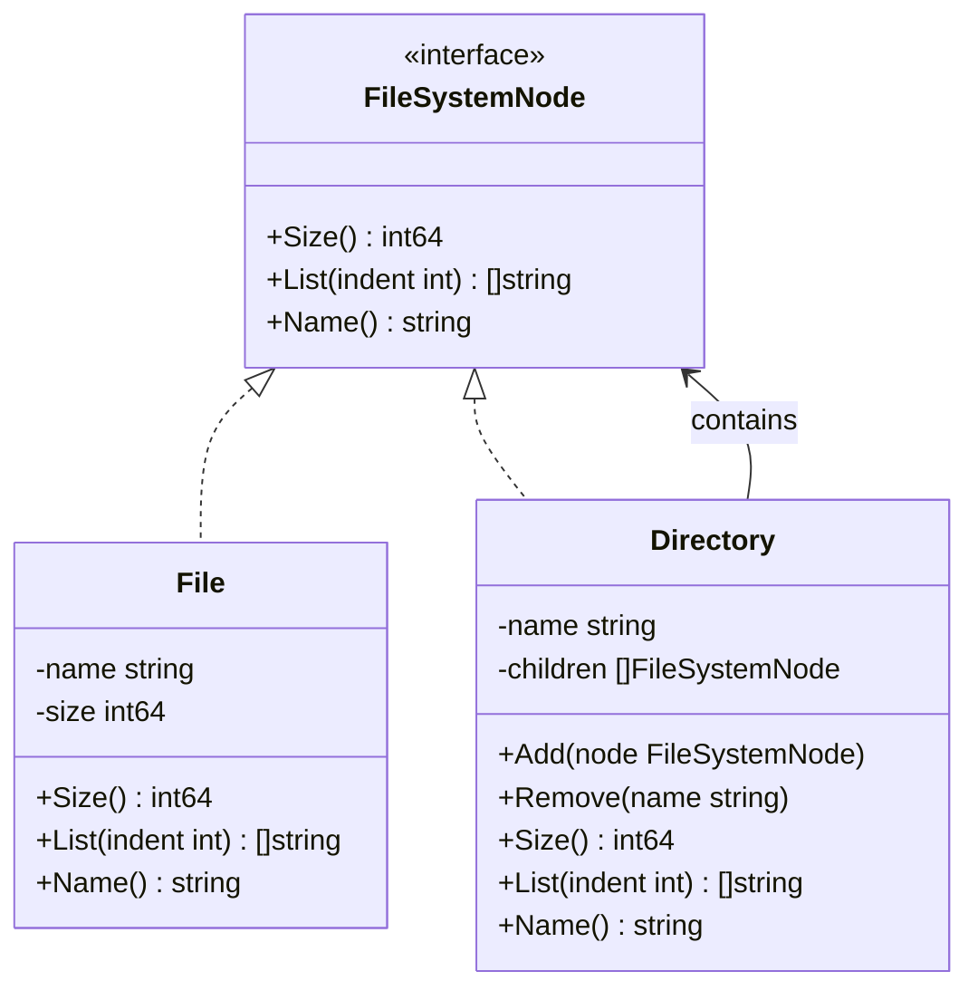

## 1. Overview

The Composite pattern lets you compose objects into tree structures to represent part-whole hierarchies, and then treat individual objects (leaves) and groups of objects (composites) uniformly through the same interface.

The mental model: a file system. A file is a leaf — it has a size, a name, it can be read. A directory is a composite — it contains files and other directories. Both a file and a directory respond to `Size()` and `List()`. You don't need to check "is this a file or directory?" before calling `Size()`. The interface is uniform regardless of what's underneath.

This matters for staff engineers because it appears in system design constantly: UI component trees, AWS Organizations hierarchies, Kubernetes resource trees, permission trees in authorization systems. The pattern is simple. The production pitfalls — stack overflows, cycle detection, memory pressure — are not.

---

## 2. Core Concepts (Step-by-Step)

### The Mental Model

Consider AWS Organizations: at the root is the Management Account, under it are Organizational Units (OUs), and under those are member accounts. Billing rollup works the same way: get the cost of a member account (leaf), or get the cost of an OU (composite that recursively sums its children). The same `GetCost()` interface works for leaves and composites uniformly.



*`File` (leaf) and `Directory` (composite) both implement `FileSystemNode`. `Directory` recursively calls `Size()` and `List()` on its children — which can be other `Directory` nodes.*

### Key Rules

1. **Uniform interface**: Leaves and composites implement the same interface — callers never need a type assertion.
2. **Recursive operations**: Composite methods naturally recurse into children — `Size()` on a directory returns the sum of `Size()` on all children.
3. **Leaf primitiveness**: Leaf nodes have no children. If your leaf needs a `children` field set to `nil`, that's a design smell — use the interface cleanly.

---

## 3. Use Cases

### 1. File System Hierarchies (ls, du — the canonical examples)

Every Unix `du` command recursively walks the file system tree using the Composite pattern conceptually. Files report their own size; directories report the sum of their children. The command doesn't care whether it's looking at a file or a directory — it calls `Size()` uniformly.

Git's object model uses the same pattern: blobs (files) are leaves, trees (directories) are composites, commits point to trees. `git log --stat` traverses this composite tree to compute the diff.

### 2. UI Component Trees — React's Virtual DOM

React's virtual DOM is a Composite. A `Button` component is a leaf (it renders itself). A `Form` component is a composite (it contains `Input`, `Button`, and `Label` children). The rendering engine calls `render()` on the root and lets the composite recursively render its children. Adding a new component type doesn't change the rendering engine — it just implements the component interface.

This is also how SwiftUI and Flutter's widget trees work. The pattern is universal in UI frameworks.

### 3. AWS Organizations — Billing and Policy Hierarchies

AWS Organizations models accounts and OUs in a Composite tree. When you apply a Service Control Policy (SCP) to an OU, AWS evaluates it recursively for every account under that OU. Billing rollup computes cost from leaves (accounts) up through OUs to the root. The API is uniform — `GetCostAndUsage()` works for an account or an OU — because the service implements the Composite pattern internally.

---

## 4. Gotchas

### Gotcha 1: Stack Overflow on Deep Trees

Recursive `Size()` on a directory tree 10,000 levels deep will hit Go's default goroutine stack limit. Go grows stacks dynamically, but extreme recursion is still a risk — and in adversarial environments (user-uploaded file archives), attackers can craft deeply nested structures to cause stack exhaustion.

**Fix**: Track depth as a field set at `Add` time. Each `Directory.Size()` checks its own depth and calls all children uniformly through the `FileSystemNode` interface — no type switch, no parent knowing about child internals:

```go
const maxTreeDepth = 1000

type Directory struct {
    name     string
    children []FileSystemNode
    depth    int // set by parent during Add; root defaults to 0
}

// Add propagates depth to child Directories at construction time.
// This keeps traversal methods free of type assertions.
func (d *Directory) Add(node FileSystemNode) {
    if child, ok := node.(*Directory); ok {
        child.depth = d.depth + 1
    }
    d.children = append(d.children, node)
}

// Size guards against runaway recursion using the depth field.
// The guard lives here, in Directory's own implementation — not in the parent's loop.
// All children are called via child.Size() uniformly: no type switch.
func (d *Directory) Size() (int64, error) {
    if d.depth >= maxTreeDepth {
        return 0, fmt.Errorf("tree depth exceeds limit %d at %q", maxTreeDepth, d.name)
    }
    var total int64
    for _, child := range d.children {
        s, err := child.Size() // uniform: interface call, no special-casing for *Directory
        if err != nil {
            return 0, err
        }
        total += s
    }
    return total, nil
}
```

Or use iterative traversal with an explicit stack (`[]FileSystemNode`) instead of recursive calls — the best choice for adversarial (user-supplied) input.

### Gotcha 2: Cycles Causing Infinite Loops

If a composite node can reference another composite node that eventually references the first, recursive traversal loops forever:

```go
dir1 := &Directory{name: "dir1"}
dir2 := &Directory{name: "dir2"}
dir1.Add(dir2)
dir2.Add(dir1) // cycle! dir1.Size() loops forever
```

**Fix**: Track visited nodes during traversal using a `map[string]bool` (keyed by node ID or pointer) and return an error when a cycle is detected.

### Gotcha 3: Composite as a General-Purpose Graph

When developers see that Composite handles tree operations elegantly, they try to extend it to handle general graphs (nodes with multiple parents). It doesn't map cleanly. A general graph needs a graph traversal algorithm with visited-node tracking everywhere. Composite is for part-whole hierarchies — each node has exactly one parent, and the structure is acyclic.

**Fix**: If your use case allows multiple parents or cycles, model it as a graph explicitly (adjacency list) with a proper graph traversal function. Don't force Composite onto it.

### Gotcha 4: Large Composite Trees Exhausting Memory

A composite tree of 10M nodes held in process memory doesn't scale. File system trees can have millions of files; UI component trees for rich dashboards can have thousands of nodes; permission trees in enterprise authorization systems can be enormous.

**Fix**: Consider lazy loading (Virtual Proxy on composite children — only load children when first accessed), external storage (walk the tree from a database), or streaming traversal (process nodes one at a time instead of loading the whole tree).

### Gotcha 5: Concurrent Traversal Race Conditions

Gotcha 2 recommended tracking visited nodes in a `map[string]bool` to detect cycles. A common mistake is storing that `visited` set as a field on the `Directory` struct. The moment two goroutines traverse the same tree concurrently — exactly what happens in production request handlers — you have a data race:

```go
// WRONG: visited map stored on the node — data race under concurrent traversal
type Directory struct {
    name     string
    children []FileSystemNode
    visited  map[string]bool // ← BUG: shared across all goroutines reading this node
}

func (d *Directory) Size() (int64, error) {
    if d.visited[d.name] { // goroutine A reads while goroutine B writes → DATA RACE
        return 0, fmt.Errorf("cycle detected at %q", d.name)
    }
    d.visited[d.name] = true
    // ...
}
```

**Fix**: Traversal state is call-scoped, not node-scoped. Allocate the `visited` set as a local variable at the entry point and thread it through the call stack. Each goroutine gets its own:

```go
// CORRECT: visited is a local variable — one map per goroutine call, never shared
func sizeWithCycleCheck(node FileSystemNode, visited map[string]bool) (int64, error) {
    id := node.Name()
    if visited[id] {
        return 0, fmt.Errorf("cycle detected at %q", id)
    }
    visited[id] = true
    dir, ok := node.(*Directory)
    if !ok {
        return node.Size() // leaf: no children to recurse into
    }
    var total int64
    for _, child := range dir.children {
        s, err := sizeWithCycleCheck(child, visited) // same map, same goroutine's stack
        if err != nil {
            return 0, err
        }
        total += s
    }
    return total, nil
}

// Public entry point: allocates a fresh visited map per call — never shared between goroutines.
func (d *Directory) Size() (int64, error) {
    return sizeWithCycleCheck(d, make(map[string]bool))
}
```

**When is concurrent traversal safe without locks?**

| Scenario                                              | Safe? | Why                                                                         |
| ----------------------------------------------------- | ----- | --------------------------------------------------------------------------- |
| Multiple goroutines traversing, no mutations          | ✅ Yes | Go's memory model allows unlimited concurrent reads on the same data        |
| Read-only after construction (pointer published once) | ✅ Yes | Once the tree is built and the pointer is shared, reads need no sync        |
| One goroutine traversing, another calling `Add()`     | ❌ No  | `Add()` writes to the `children` slice while traversal reads it — data race |
| Concurrent mutations during construction              | ❌ No  | Protect `Add()` and all reads with `sync.RWMutex` on the children slice     |

The safe pattern: build the entire tree in a single goroutine, then publish the root pointer. After publication, all goroutines traverse safely with zero locks — the same reason Go's immutable string values can be shared freely across goroutines.

> 💡 **Staff-level insight:** The difference between "read-only after construction" and "mutation-concurrent" is the same principle behind a plain `map` vs. `sync.Map`. If you build a Composite tree once at startup and serve it read-only across thousands of request goroutines, you need zero synchronization in traversal. Design `Build() *Tree` to return exactly once; ensure all public methods are read-only. Immutability by design is cheaper than any lock.

---

## 5. Where to Use (and Where NOT to Use)

### Use When

- You have a natural part-whole hierarchy — things that contain other things of the same type
- You want operations to work uniformly on individual objects and collections of objects
- You need recursive aggregate operations (total size, total cost, combined permissions)
- The hierarchy is finite, non-cyclic (true tree structure), and doesn't grow unboundedly in depth

### Do NOT Use When

- The hierarchy allows cycles or multiple parents — model it as a graph instead
- The tree can grow to millions of nodes and must be held in memory — use lazy loading or streaming
- You only have 2 levels of hierarchy (things and collections of things) — a slice suffices
- Leaves and composites have genuinely different behaviors that don't fit a common interface — forced uniformity creates awkward empty implementations

> 💡 **Staff-level insight:** The Composite pattern works elegantly for trees of shallow-to-medium depth with known, bounded size. The moment a Composite tree is user-supplied or adversarially influenced — a submitted JSON document, a user's uploaded ZIP archive, a query plan tree in a database — you need depth limits, cycle detection, and memory budgets. The pattern is clean in theory; in production, the safety constraints are mandatory. Building them in from the beginning, not as an afterthought, is what separates a staff engineer's implementation from a junior's.

---

## 6. Versus (Comparisons)

| Aspect               | Composite                                            | Iterator                           | Decorator                     | Plain Recursive Struct                             |
| -------------------- | ---------------------------------------------------- | ---------------------------------- | ----------------------------- | -------------------------------------------------- |
| Purpose              | Represent part-whole tree structure                  | Traverse a collection sequentially | Add behavior to an object     | Model a homogeneous tree in-process                |
| Structure            | Tree (recursive containment)                         | Linear sequence                    | Linear chain (wrapping)       | Typed `[]*Node` with concrete children             |
| Interface uniformity | Leaves and composites same interface                 | All collections same interface     | Wrapped object same interface | Caller knows the concrete type directly            |
| Multiple leaf types  | ✅ Natural — each type implements interface           | N/A                                | N/A                           | ❌ Requires union struct or `any` field             |
| Adding new types     | ✅ Open/closed: new struct, zero changes to traversal | N/A                                | N/A                           | ❌ Must update every traversal site                 |
| Performance          | One interface dispatch per call                      | —                                  | —                             | Direct field access, easier for compiler to inline |
| Typical use          | File systems, UI trees, org hierarchies              | Slices, maps, queues, trees        | Logging, auth, caching layers | Config trees, single-type AST nodes                |
| Recursive            | Yes — naturally                                      | No — iterative walk                | No — linear chain             | Yes — typed recursion                              |

**Choose Composite when** you have a tree structure where individual elements and groups of elements must be treated uniformly with recursive aggregate operations.

**Choose Iterator when** you need to traverse a collection without exposing its internal structure — but the collection itself doesn't need to be recursive.

### Composite vs. Plain Recursive Struct

A plain recursive struct stores children as a typed slice — no interface, no dispatch overhead:

```go
// Plain recursive struct — direct field access, no interface indirection
type Node struct {
    Name     string
    Size     int64
    Children []*Node
}

func totalSize(n *Node) int64 {
    total := n.Size
    for _, c := range n.Children {
        total += totalSize(c) // no interface dispatch, no type assertion
    }
    return total
}
```

| Aspect              | Composite (interface)                                             | Plain Recursive Struct                                       |
| ------------------- | ----------------------------------------------------------------- | ------------------------------------------------------------ |
| Multiple leaf types | ✅ `File`, `Symlink`, `MountPoint` each implement `FileSystemNode` | ❌ Requires a union struct with optional fields or `any`      |
| Uniform operations  | ✅ Caller never needs a type assertion                             | ❌ Caller must handle each node type explicitly               |
| Adding node types   | ✅ New struct, zero changes to existing traversal code             | ❌ Must update every traversal site                           |
| Performance         | One pointer indirection per call (vtable dispatch)                | Direct struct field access — more inlinable by the compiler  |
| Simplicity          | Slight overhead for small, homogeneous trees                      | ✅ Clearer for a single-type tree; less abstraction to follow |
| Testability         | Mock the interface per node type in isolation                     | No interface needed — pass concrete structs directly         |

**Choose Composite (interface) when** you have two or more concrete leaf types that must respond to the same operations, and adding new types without changing traversal logic is a real requirement. The interface indirection pays for itself the moment you have heterogeneous children.

**Choose a plain recursive struct when** all nodes are the same concrete type (a config tree, a JSON AST, or an arithmetic expression tree with one node variant), the tree is internal to a single package, and raw performance or readability matters more than extensibility.

> 💡 **Staff-level insight:** Most Composite over-engineering happens when someone applies the interface pattern to a single-type tree "for future extensibility." If you have one node type today, start with a plain struct. The refactor to an interface when a second type arrives is a handful of lines. Premature abstraction costs readability every day; the refactor costs one afternoon once.

---

## 7. Code Examples

```go
package composite

import (
	"fmt"
	"strings"
)

const maxDepth = 100 // prevent stack overflow on adversarial input

// FileSystemNode is the component interface — implemented by both File and Directory.
type FileSystemNode interface {
	Name() string
	Size() (int64, error)
	List(indent int) []string
}

// --- Leaf: File ---

type File struct {
	name string
	size int64
}

func NewFile(name string, size int64) *File {
	return &File{name: name, size: size}
}

func (f *File) Name() string            { return f.name }
func (f *File) Size() (int64, error)    { return f.size, nil }
func (f *File) List(indent int) []string {
	return []string{fmt.Sprintf("%s%s (%d bytes)", strings.Repeat("  ", indent), f.name, f.size)}
}

// --- Composite: Directory ---

type Directory struct {
	name     string
	children []FileSystemNode
	depth    int // set by parent on Add; root defaults to 0
}

func NewDirectory(name string) *Directory {
	return &Directory{name: name}
}

func (d *Directory) Name() string { return d.name }

// Add appends a child and propagates depth to any child Directory.
// Doing this at construction time keeps traversal methods free of type assertions.
func (d *Directory) Add(node FileSystemNode) {
	if child, ok := node.(*Directory); ok {
		child.depth = d.depth + 1
	}
	d.children = append(d.children, node)
}

// Size guards against runaway recursion using the depth field set at Add time.
// The guard lives in Directory's own implementation — not delegated to the parent's loop.
// All children are called via child.Size() through the FileSystemNode interface: no type switch.
func (d *Directory) Size() (int64, error) {
	if d.depth >= maxDepth {
		return 0, fmt.Errorf("directory tree depth exceeds limit %d at %q", maxDepth, d.name)
	}
	var total int64
	for _, child := range d.children {
		s, err := child.Size() // uniform: all children called through the interface
		if err != nil {
			return 0, err
		}
		total += s
	}
	return total, nil
}

func (d *Directory) List(indent int) []string {
	lines := []string{fmt.Sprintf("%s%s/", strings.Repeat("  ", indent), d.name)}
	for _, child := range d.children {
		lines = append(lines, child.List(indent+1)...)
	}
	return lines
}

// --- Usage ---

func BuildExampleTree() FileSystemNode {
	root := NewDirectory("root")

	src := NewDirectory("src")
	src.Add(NewFile("main.go", 1024))
	src.Add(NewFile("handler.go", 2048))

	docs := NewDirectory("docs")
	docs.Add(NewFile("README.md", 512))
	docs.Add(NewFile("API.md", 768))

	root.Add(src)
	root.Add(docs)
	root.Add(NewFile("go.mod", 128))

	return root
}
```

*`Directory.Size()` guards against runaway recursion using a `depth` field set at `Add` time, not as a recursive parameter. The guard lives in the `Directory` implementation — no type switch in the parent loop, preserving the interface-uniformity guarantee of the Composite pattern.*

---

## 8. Scale Discussion

**10x load**: Composite traversal is O(N) where N is the number of nodes. At 10x load, traversal 10x more frequently. For read-heavy operations, cache the aggregate result at interior nodes (memoized `Size()` that invalidates on child mutation).

**100x load**: If composite traversal is synchronous and blocks a request, consider pre-computing aggregates on mutation:
- When a file is added, propagate the size addition up the tree (parent tracking)
- Store aggregate sizes in a cache (Redis) alongside the tree, invalidated on writes
- This trades traversal time for write-time complexity

The simplest in-process version of this is **dirty-bit memoization**: cache the aggregate result on each interior node and recompute only when the subtree has been mutated:

```go
type Directory struct {
    name       string
    children   []FileSystemNode
    depth      int
    cachedSize int64
    dirty      bool // true whenever a child is added or removed
}

func (d *Directory) Add(node FileSystemNode) {
    if child, ok := node.(*Directory); ok {
        child.depth = d.depth + 1
    }
    d.children = append(d.children, node)
    d.dirty = true // invalidate this node's cached aggregate
}

func (d *Directory) Size() (int64, error) {
    if d.depth >= maxDepth {
        return 0, fmt.Errorf("tree depth exceeds limit %d at %q", maxDepth, d.name)
    }
    if !d.dirty {
        return d.cachedSize, nil // cache hit: O(1) instead of O(subtree size)
    }
    var total int64
    for _, child := range d.children {
        s, err := child.Size()
        if err != nil {
            return 0, err
        }
        total += s
    }
    d.cachedSize, d.dirty = total, false
    return total, nil
}
```

*At 100x read load with infrequent writes, cache hit rate approaches 100% — `Size()` on a stable subtree drops from O(N) to O(1). Note: this is single-threaded safe only; for concurrent mutation add a `sync.RWMutex` to guard `Add` and the dirty-check in `Size`.*

**1000x load**: At this scale, the Composite tree is almost certainly backed by a database. Hierarchical queries in PostgreSQL (`WITH RECURSIVE`) or specialized graph databases (Neo4j) handle tree traversal. The in-process Composite pattern becomes a programming model for local object manipulation, not the primary storage and query mechanism.

> 💡 **Staff-level insight:** PostgreSQL's `WITH RECURSIVE` CTE is the Composite pattern at the database layer. `SELECT id, parent_id, name FROM org_units` with `WITH RECURSIVE` is how AWS, GitHub, and Stripe model their organizational hierarchies at scale — not in-memory trees. Knowing when to push the tree structure into the database (vs. keeping it in process) is a landmark staff-level design judgment.

---

## 9. Monitoring & Observability

| Metric                                                   | Type      | Alert Condition                                               |
| -------------------------------------------------------- | --------- | ------------------------------------------------------------- |
| `composite.traversal.duration_ms` (labeled by tree type) | Histogram | p99 > 100ms (tree too large for synchronous traversal)        |
| `composite.tree.depth.max`                               | Gauge     | > 500 (potential stack overflow risk)                         |
| `composite.tree.node.count`                              | Gauge     | > 1,000,000 (memory pressure risk)                            |
| `composite.cycle.detected.total`                         | Counter   | Any value > 0 (data integrity issue — cycles shouldn't exist) |
| `composite.depth_limit.exceeded.total`                   | Counter   | Any value > 0 (adversarial input or unreasonably deep tree)   |

---

## 10. Interview Questions

### Q1: "Explain the Composite pattern and give an example of where you've seen it in production."

**Key points to cover:**
- Leaves and composites implement the same interface
- Operations like `Size()` or `Cost()` recursively delegate to children in composites
- Real examples: file systems, UI component trees, AWS Organizations, React virtual DOM, Kubernetes resource hierarchies
- Key benefit: callers don't need type checks — the interface is uniform

**Common mistake:** Confusing Composite with a generic tree data structure. The Composite pattern specifically models part-whole hierarchies where the same operations apply to leaves and composites uniformly. A binary search tree is not a Composite.

---

### Q2: "Your Composite tree implementation is causing stack overflows in production when processing user-uploaded archives. How do you fix it?"

**Key points to cover:**
- Add a depth counter parameter to recursive methods, return an error at the limit
- Alternatively, convert recursive traversal to iterative traversal using an explicit stack (`[]FileSystemNode`)
- Validate depth limit at the input boundary (when the tree is first constructed from user data)
- Log and alert on depth-limit exceeded events
- Consider whether user-supplied tree depth should have a lower limit than the technical maximum

**Common mistake:** "Increase Go's stack size." The goroutine stack grows dynamically to about 1GB, but deeply recursive calls will still exhaust it eventually. The real fix is bounding the input.

---

### Q3: "How would you model an organization's permission hierarchy (user → team → department → company) so that permission aggregation is efficient?"

**Key points to cover:**
- Composite pattern for the hierarchy: each node is a permission scope
- Aggregation can go top-down (effective permissions for a user = all permissions at their level plus inherited from ancestors) or bottom-up
- For large organizations: cache effective permissions per user, invalidate on any ancestor permission change
- For write-heavy permission systems: event-driven invalidation via Kafka (permission changed → fan-out to all affected users)
- Database representation: closure table or nested set model for efficient ancestor queries
- Role-based access control (RBAC) layered on top of the hierarchy

---

## 11. Staff-Level Preparation Tips

1. **Implement a file system walker** — write a `du`-like tool in Go that traverses a real directory tree, shows sizes, handles symlinks safely (symlink cycles = the composite cycle problem), and respects a depth limit. This is a concrete, deployable version of the pattern.

2. **Study PostgreSQL recursive CTEs** — write a query that traverses a hierarchical table (`WITH RECURSIVE category_tree AS (...)`) for a product category tree or org hierarchy. This is how the pattern lives at scale.

3. **Build a UI component renderer** — implement a tiny Go template renderer that takes a tree of components (similar to React's virtual DOM), renders leaves directly, and recursively renders composite components. This connects the pattern to front-end architecture.

4. **Read Go's AST package** — Go's Abstract Syntax Tree (`go/ast`) package is a Composite. `ast.Node`, `ast.Expr`, `ast.Stmt`, `ast.Decl` are all node types. Tools like `gopls` and `staticcheck` traverse the AST using the Composite pattern.

5. **Connect to security** — permission hierarchies (RBAC, ABAC) use Composite. Understanding how Google's Zanzibar authorization system models the tuple graph (`user:alice → editor → doc:123`) gives you a real-world distributed implementation of Composite thinking.

---

## 12. References

- [Go ast package — Composite tree example](https://pkg.go.dev/go/ast)
- [PostgreSQL — Recursive Queries (WITH RECURSIVE)](https://www.postgresql.org/docs/current/queries-with.html)
- [React — Reconciliation and the Virtual DOM](https://reactjs.org/docs/reconciliation.html)
- [AWS Organizations — Policy Inheritance](https://docs.aws.amazon.com/organizations/latest/userguide/orgs_manage_policies_inheritance.html)
- [Google Zanzibar — Authorization at Scale](https://research.google/pubs/pub48190/)
- [Design Patterns: Elements of Reusable Object-Oriented Software (GoF)](https://www.oreilly.com/library/view/design-patterns-elements/0201633612/)
- [Go filepath.Walk — Standard library composite traversal](https://pkg.go.dev/path/filepath#Walk)
