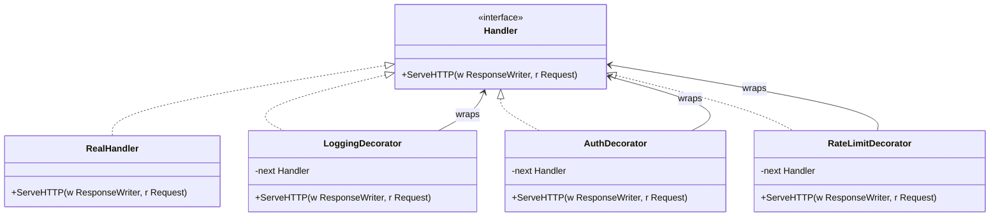

## 1. Overview

The Decorator pattern wraps an object to add new behavior without modifying the original. Think of it like the security checkpoint at an airport: a traveler passes through a rate-limiting gate, a document check, and a baggage scanner before reaching the gate agent. Each checkpoint is independent, can stop or pass the traveler through, and — crucially — every layer sees exactly the same "traveler" at the same interface. Add or remove a checkpoint without touching anything else.

In Go, this pattern is everywhere. Every time you write an `http.Handler` middleware, you're writing a Decorator. Every time you wrap an `io.Writer` with a `bufio.Writer`, you're using a Decorator. This is arguably the most commonly used GoF pattern in production Go code.

For staff engineers: the Decorator pattern is how Go achieves composition without inheritance. Understanding it deeply means understanding Go's composition model — the foundation of idiomatic Go design.

---

## 2. Core Concepts (Step-by-Step)

### The Mental Model

Imagine a security checkpoint at an airport. The traveler goes through:

1. **Rate limiting gate** — how many travelers per minute?
2. **Document check** — are you authenticated?
3. **Baggage scanner** — is the request valid?
4. **Gate agent** — the actual destination

Each checkpoint wraps the "proceed to the next step" action. Each can stop the traveler or let them through. This is exactly how an HTTP middleware chain works — each decorator either handles the request or passes it to the next handler.

### Structure

The key rule: **every decorator must implement the same interface as the wrapped object**.



*Each decorator implements `Handler` and holds a reference to another `Handler`. The real handler sits at the center of the chain.*

### The Three Rules

1. **Same interface**: The decorator implements the exact same interface as the object it wraps.
2. **Forward by default**: If the decorator doesn't handle the call, it must forward to the wrapped object.
3. **Composability**: Decorators must be stackable — `Auth(RateLimit(Logging(handler)))` must work.

---

## 3. Use Cases

### 1. HTTP Middleware in Go (net/http, Gin, Echo)

Every Go web framework is built on the Decorator pattern. When you write:

```go
router.Use(AuthMiddleware, RateLimitMiddleware, LoggingMiddleware)
```

You're building a decorator chain. Gin, Echo, Gorilla Mux — they all implement this using `http.Handler` wrapping. Netflix's Zuul API gateway used a filter chain before they moved to reactive streams — same concept, different language.

### 2. AWS SDK Retry Decorator

The AWS SDK wraps every API call with retry logic. When you call `s3.PutObject()`, the SDK decorator intercepts the call, retries on transient failures with exponential backoff, and only returns to you after exhausting retries or succeeding. You never see the retries. The decorator handles them transparently between your code and the S3 endpoint.

### 3. Caching Decorator for Database Reads

Stripe's payment read path uses a caching layer in front of the database. A `CachedUserRepository` implements the same `UserRepository` interface as `PostgresUserRepository`. The cache decorator checks Redis, returns on hit, falls through to Postgres on miss, then populates the cache. Application code sees only the `UserRepository` interface — it never knows whether it's talking to Redis or Postgres.

---

## 4. Gotchas

### Gotcha 1: Allocation Storm at High QPS

Every decorator that creates a struct adds one heap allocation per request. At 100k RPS with 5 decorators, that's 500k allocations/second. Each allocation also increases GC pressure. Profile with `pprof` before adding decorators in a hot path.

**Fix**: Make decorators stateless singletons where possible — one instance shared by all goroutines, all per-request data flowing through `context.Context`. For decorators that genuinely need per-request structs, `sync.Pool` is the primary defence: pool the wrapper, reset it on checkout, return it in a deferred `Put`. See **Staff-Level Preparation Tips §2** for a benchmark exercise that puts concrete numbers on this.

### Gotcha 2: Decorator Order Matters — and Breaks Silently at 2 AM

```go
Auth(Logging(handler))   // logs every request, including auth failures
Logging(Auth(handler))   // only logs requests that pass auth
```

These are functionally different. Which one is correct depends on your security requirements — but if someone changes the order during a refactor, you get a silent bug. No compile error. No test failure unless you test the full chain.

**Fix**: Document the intended order explicitly. Use a named constructor that enforces the correct sequence:

```go
func BuildProductionChain(base http.Handler) http.Handler {
    // Order is intentional: rate limit first to protect auth compute
    return RateLimit(Auth(Logging(base)))
}
```

### Gotcha 3: Decorators That Break Interface Contracts

A decorator that only partially forwards interface methods is a silent contract violation. If your `LoggingDecorator` wraps a `ReadWriter` but only forwards `Write` and not `Read`, callers expecting `ReadWriter` behavior get a nil pointer panic or wrong behavior.

**Fix**: Use Go struct embedding to forward all methods automatically, then override only what you need.

```go
import (
	"io"
	"log"
)

// --- BROKEN: manual wrapping — easy to forget a method ---

type BrokenLoggingReadWriter struct {
	rw io.ReadWriter
}

func (b *BrokenLoggingReadWriter) Write(p []byte) (int, error) {
	log.Printf("writing %d bytes", len(p))
	return b.rw.Write(p)
}

// Read() is never defined. BrokenLoggingReadWriter does NOT satisfy io.ReadWriter.
// The compiler flags this only when you assign to an io.ReadWriter variable —
// if you use it as a concrete type, the missing method silently breaks callers
// deep in a call chain, far from the point of construction.

// --- CORRECT: struct embedding auto-forwards every unoverridden method ---

type LoggingReadWriter struct {
	io.ReadWriter // embedding promotes Read, Write, and any future methods
}

// Only override Write. Read() is NOT defined here —
// it is forwarded automatically to the embedded io.ReadWriter.
func (l *LoggingReadWriter) Write(p []byte) (int, error) {
	log.Printf("writing %d bytes", len(p))
	return l.ReadWriter.Write(p)
}

// Return the interface type so callers can't accidentally depend on the concrete type.
func NewLoggingReadWriter(rw io.ReadWriter) io.ReadWriter {
	return &LoggingReadWriter{ReadWriter: rw}
}
```

*The key property: if `io.ReadWriter` ever gains a third method, `LoggingReadWriter` forwards it automatically. `BrokenLoggingReadWriter` silently breaks.*

### Gotcha 4: The "Decorator Tax" on Stack Traces

When something fails in a 7-deep decorator chain, the stack trace looks like:

```
AuthDecorator.ServeHTTP(...)
LoggingDecorator.ServeHTTP(...)
RateLimitDecorator.ServeHTTP(...)
TimeoutDecorator.ServeHTTP(...)
TracingDecorator.ServeHTTP(...)
CORSDecorator.ServeHTTP(...)
CompressionDecorator.ServeHTTP(...)
RealHandler.ServeHTTP(...)
```

Finding which decorator injected a bad header or swallowed an error is hard. Add structured logging in each decorator with a `decorator_name` field so traces are identifiable.

---

## 5. Where to Use (and Where NOT to Use)

### Use When

- You need to add cross-cutting concerns (logging, auth, tracing, rate limiting) without modifying the original object
- You need combinations of behaviors (some handlers need auth AND rate limiting; others just logging)
- You're working with interfaces and want to add behavior while keeping the Open/Closed Principle
- You need to compose behaviors independently — each decorator can be tested in isolation

### Do NOT Use When

- You need to change the interface of the wrapped object — use Adapter instead
- You have a single, fixed behavior to add — just add a method to the struct
- The decorator chain would be more than 5–6 deep — at that point it's an abstraction problem, not a solution
- You're wrapping concrete types (not interfaces) — you'll couple yourself to the concrete type forever

> 💡 **Staff-level insight:** In Go, the Decorator pattern and the Middleware pattern are the *same pattern*. GoF called it "Decorator" in 1994 in the context of GUI toolkits. The web framework world calls it "Middleware." Same structure, same rules, different domain. When someone in a design review says "let's add a middleware," they're proposing a Decorator. Use the right vocabulary for the audience — and when you name it, show you know where it comes from.

---

## 6. Versus (Comparisons)

| Aspect              | Struct Decorator                             | Middleware (Framework)             | Closure-based Middleware                |
| ------------------- | -------------------------------------------- | ---------------------------------- | --------------------------------------- |
| Mechanism           | Struct wrapping an interface                 | Plug-in to framework handler chain | Function returning `http.HandlerFunc`   |
| Holds state         | Yes — struct fields (rate limiter, CB state) | Framework or context scope         | Closure capture only (read-only config) |
| Runtime composition | Yes                                          | Yes                                | Yes                                     |
| Go idiom            | Native                                       | Framework-dependent                | Native — idiomatic for stateless layers |
| Order control       | Explicit at construction                     | Framework-managed                  | Explicit at construction                |
| Testability         | High — mock the wrapped interface            | High — framework test helpers      | High — plain function call              |
| Stack depth         | Grows with each decorator                    | Same                               | Grows with each closure                 |
| Allocation cost     | Per decorator struct                         | Depends on framework               | Closure allocated once at registration  |

The closure-based middleware pattern looks like this:

```go
// Stateless — no struct needed. The closure captures config once at registration.
func WithLogging(next http.Handler) http.Handler {
	return http.HandlerFunc(func(w http.ResponseWriter, r *http.Request) {
		log.Printf("method=%s path=%s", r.Method, r.URL.Path)
		next.ServeHTTP(w, r)
	})
}

// Composed the same way as struct decorators:
handler := WithLogging(WithAuth(realHandler))
```

**Choose Struct Decorator when** you need to hold mutable state across requests — a rate limiter counter, a circuit breaker state machine, or a metrics histogram. State lives in the struct, safely shared by all goroutines.

**Choose Closure-based Middleware when** the layer is stateless — logging, tracing, request-ID injection. Less code, no extra type to name, and just as composable.

**Choose Middleware (framework-managed)** when you're inside an existing framework (Gin, Echo, gRPC interceptors) and want to plug into its established chain mechanism.

---

## 7. Code Examples

```go
package main

import (
	"fmt"
	"log"
	"net/http"
	"time"

	"golang.org/x/time/rate"
)

// --- Target interface ---

type Handler interface {
	ServeHTTP(w http.ResponseWriter, r *http.Request)
}

// RealHandler contains the actual business logic.
type RealHandler struct{}

func (h *RealHandler) ServeHTTP(w http.ResponseWriter, r *http.Request) {
	fmt.Fprintln(w, "Hello from the real handler")
}

// --- Logging Decorator ---

type LoggingDecorator struct {
	next   Handler
	logger *log.Logger
}

func NewLoggingDecorator(next Handler, logger *log.Logger) *LoggingDecorator {
	return &LoggingDecorator{next: next, logger: logger}
}

func (d *LoggingDecorator) ServeHTTP(w http.ResponseWriter, r *http.Request) {
	start := time.Now()
	d.logger.Printf("START method=%s path=%s", r.Method, r.URL.Path)
	d.next.ServeHTTP(w, r)
	d.logger.Printf("END method=%s path=%s duration=%s", r.Method, r.URL.Path, time.Since(start))
}

// --- Auth Decorator ---

type AuthDecorator struct {
	next Handler
}

func NewAuthDecorator(next Handler) *AuthDecorator {
	return &AuthDecorator{next: next}
}

func (d *AuthDecorator) ServeHTTP(w http.ResponseWriter, r *http.Request) {
	token := r.Header.Get("Authorization")
	if token == "" {
		http.Error(w, "unauthorized", http.StatusUnauthorized)
		return // short circuit — do NOT call next
	}
	d.next.ServeHTTP(w, r)
}

// --- Rate Limit Decorator ---

type RateLimitDecorator struct {
	next    Handler
	limiter *rate.Limiter
}

func NewRateLimitDecorator(next Handler, rps float64) *RateLimitDecorator {
	return &RateLimitDecorator{
		next:    next,
		limiter: rate.NewLimiter(rate.Limit(rps), int(rps)),
	}
}

func (d *RateLimitDecorator) ServeHTTP(w http.ResponseWriter, r *http.Request) {
	if !d.limiter.Allow() {
		http.Error(w, "rate limit exceeded", http.StatusTooManyRequests)
		return
	}
	d.next.ServeHTTP(w, r)
}

// --- Building the decorator chain ---
// Order: outermost runs first.
// RateLimit -> Auth -> Logging -> Real
// Rate limit protects auth compute from abuse.
func BuildChain(rps float64) Handler {
	base := &RealHandler{}
	logger := log.Default()
	return NewRateLimitDecorator(
		NewAuthDecorator(
			NewLoggingDecorator(base, logger),
		),
		rps,
	)
}

func main() {
	handler := BuildChain(1000)
	http.Handle("/", http.HandlerFunc(handler.ServeHTTP))
	log.Fatal(http.ListenAndServe(":8080", nil))
}
```

*The outermost decorator runs first. Rate limiting before auth prevents unauthenticated requests from consuming authentication compute resources — a subtle but important security and performance decision.*

---

## 8. Scale Discussion

**10x load (10k RPS)**: Decorator chains are cheap. At 10k RPS with 5 decorators, GC pressure from allocations is negligible. No tuning required.

**100x load (100k RPS)**: Allocations matter. Five decorators per request = 500k small allocations/second. GC pause times increase. Run `go tool pprof` on a heap profile. Consider `sync.Pool` for frequently-allocated decorators, or redesign decorators to be stateless singletons.

**1000x load (1M RPS)**: At 1M RPS, per-request allocations on the hot path are unacceptable. Pre-allocate the decorator chain once at startup and share it across all requests. Decorators at this scale **must be stateless**. Any per-request state passes through `context.Context`, not decorator fields. Consider whether the decorator chain is the right abstraction at this speed — sometimes static configuration with compiled dispatch is faster.

> 💡 **Staff-level insight:** The `net/http` default mux builds the handler chain once at startup and reuses it for every request. This is intentional. At scale, decorators must be designed as **stateless singletons**: built once, shared by all goroutines, passing all per-request state through `context.Context`. This is the design that makes Go's HTTP server handle 100k+ RPS on a single node.

---

## 9. Monitoring & Observability

| Metric                                                        | Type      | Alert Condition                                     |
| ------------------------------------------------------------- | --------- | --------------------------------------------------- |
| `decorator.request.duration_ms` (per decorator label)         | Histogram | p99 > 50ms for any single decorator                 |
| `decorator.short_circuit.total` (auth, rate limit rejections) | Counter   | Spike > 2x baseline in 5-min window                 |
| `go_gc_duration_seconds`                                      | Histogram | p99 GC pause > 10ms (allocation pressure signal)    |
| `go_memstats_alloc_bytes_total`                               | Counter   | Growth rate > 2x baseline (allocation storm signal) |
| `decorator.chain.depth`                                       | Gauge     | > 8 (overcomplicated chain, refactor signal)        |
| `http.request.error.rate`                                     | Gauge     | > 1% (detect decorators swallowing errors silently) |

---

## 10. Interview Questions

### Q1: "How does Go implement the Decorator pattern? Give a concrete example."

**Key points to cover:**
- Go uses interface composition, not inheritance
- A struct that holds an interface field and implements the same interface IS a decorator
- `http.Handler` middleware is the canonical Go example — show the `ServeHTTP` forwarding pattern
- Contrast with Java/C++ where you'd use inheritance or abstract classes

**Common mistake:** Describing inheritance-based decoration ("in Java you'd extend the class..."). Interviewers at FAANG want Go-idiomatic answers.

**What the interviewer wants:** Evidence that you understand Go's composition model and can design extensible systems without inheritance.

---

### Q2: "At 500k RPS, you notice increased GC pauses. Your team recently added 3 new HTTP middleware decorators. How do you diagnose and fix this?"

**Key points to cover:**
- Use `pprof` heap profile to identify allocation hot spots (`go tool pprof http://localhost:6060/debug/pprof/heap`)
- Check if decorators are creating per-request structs
- Use `sync.Pool` to reuse decorator wrapper structs if they hold per-request state
- Make decorators stateless and shared (single instance handles all requests)
- Consider middleware that passes context instead of creating wrapper objects
- Verify with `go test -bench=. -benchmem` before and after the fix

**Common mistake:** Jumping to "remove the middleware" without profiling first.

**What the interviewer wants:** Systematic debugging approach, knowledge of Go memory model and GC, understanding of trade-offs between clean code and performance.

---

### Q3: "What are the risks of changing middleware order in production?"

**Key points to cover:**
- Order determines which middleware sees what: logging before auth sees all requests including unauthorized ones — that's your audit log
- Silent behavioral changes — no compile error, no test failure unless tests validate the full chain order
- Security implications: changing auth position changes what gets logged; could violate compliance requirements
- Testing strategy: integration tests that validate the full chain, not just individual middleware units in isolation
- Use named constructors that document and enforce the intended order

**Common mistake:** "Just document it." Documentation is passive — it doesn't prevent the runtime failure when someone ignores it during an incident.

**What the interviewer wants:** Security awareness, systems thinking (what breaks downstream), and a concrete mitigation strategy beyond comments.

---

## 11. Staff-Level Preparation Tips

1. **Build a middleware framework from scratch** — implement `http.Handler`-style chaining with context propagation, panic recovery, and response writer wrapping. Read how gin and echo actually implement it (`gin/context.go`, `echo/echo.go`). The subtleties — writing to a buffered response writer, capturing status codes — reveal real production concerns.

2. **Profile decorator allocations** — take any application with 5 middleware, run `go test -bench=. -benchmem`, and see the allocation count. Then refactor one decorator to use `sync.Pool` and compare. This gives you concrete numbers for the "allocation cost" argument in design reviews.

3. **Study Go's `io` package** — `bufio.Writer`, `gzip.Writer`, `crypto/cipher` streams are all real Decorators in the standard library. Reading their source shows how production-grade decorators handle error propagation, flushing, and resource cleanup.

4. **Implement a distributed tracing decorator** — create a decorator that starts a span, propagates trace context via `context.Context`, annotates errors, and finishes the span. This connects the pattern directly to OTEL/Jaeger/Zipkin observability infrastructure.

5. **Connect to broader patterns**: Decorator → Middleware → Filter Chain → AOP (Aspect-Oriented Programming). Staff engineers recognize the same pattern across multiple paradigms and can name it precisely in any context.

---

## 12. References

- [Go net/http — Handler interface](https://pkg.go.dev/net/http#Handler)
- [Effective Go — Interfaces and composition](https://go.dev/doc/effective_go#interfaces)
- [Design Patterns: Elements of Reusable Object-Oriented Software (GoF)](https://www.oreilly.com/library/view/design-patterns-elements/0201633612/)
- [Gin Middleware documentation](https://gin-gonic.com/docs/examples/using-middleware/)
- [Dave Cheney — Functional options for friendly APIs](https://dave.cheney.net/2014/10/17/functional-options-for-friendly-apis)
- [GopherCon 2018 — How Do You Structure Your Go Apps](https://www.youtube.com/watch?v=oL6JBUk6tj0)
- [Google SRE Book — Monitoring Distributed Systems](https://sre.google/sre-book/monitoring-distributed-systems/)
- [OpenTelemetry Go SDK](https://opentelemetry.io/docs/instrumentation/go/)
