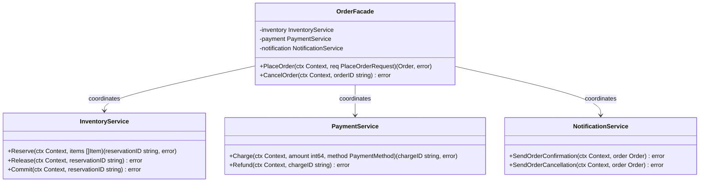

## 1. Overview

The Facade pattern provides a simplified interface to a complex subsystem. Instead of callers knowing about and coordinating a dozen internal components, they interact with a single clean entry point — the Facade — that handles the coordination internally.

The mental model: think of a hotel concierge. You don't book the restaurant, arrange the taxi, call the spa, and handle the room charge separately. You tell the concierge "dinner reservation at 7, taxi at 6:30, spa at 3." The concierge coordinates all of it. The complexity is real — it doesn't disappear — but you don't see it.

For staff engineers: the Facade is the pattern behind every "orchestrator service" in a microservices architecture. When you write a BFF (Backend for Frontend) that calls five internal services to assemble a user dashboard, that BFF *is* a Facade. Named or not, you're building this constantly.

---

## 2. Core Concepts (Step-by-Step)

### The Mental Model

You have an e-commerce platform with separate services: `InventoryService`, `PaymentService`, and `NotificationService`. Placing an order requires all three in the right sequence. Without a Facade, every client (mobile app, web frontend, CLI) must know the sequence, handle partial failures across services, and coordinate the calls. With a Facade, they call `OrderFacade.PlaceOrder(ctx, req)` and the Facade handles everything.



*`OrderFacade` hides a 3-service coordination sequence. Callers call `PlaceOrder()` — they don't know about reservations, charge IDs, or notification payloads.*

### Key Principles

1. **The Facade delegates, it does not duplicate** — logic stays in the subsystem services; the Facade only orchestrates.
2. **The Facade does not add behavior** — it simplifies access. If you're adding business logic in the Facade, you're building a Service, not a Facade.
3. **The subsystem stays accessible** — callers who need fine-grained control can still call subsystem services directly. The Facade is not a gatekeeper.

---

## 3. Use Cases

### 1. AWS SDK — One Facade, Hundreds of APIs

The AWS SDK is the most widely used Facade in the software industry. Behind `s3.Client.PutObject()` are HTTP request signing (AWS SigV4), endpoint resolution, retry logic with exponential backoff, checksum calculation, multipart upload for large objects, and error parsing from XML responses. You call one method. The SDK's facade handles all of it.

Every AWS service SDK follows the same pattern: a clean `ServiceClient` struct with straightforward method names, hiding network, auth, and protocol complexity.

### 2. gRPC Service Orchestrating Internal Microservices

At Netflix, the API layer that assembles a movie page calls the Catalog service (metadata), CDN service (video URLs), Personalization service (recommendations), and User service (account details). The gRPC handler is the Facade — it coordinates parallel calls to four services and assembles a single `MoviePageResponse`. Callers (the Netflix app) make one call.

This is the BFF (Backend for Frontend) pattern, and it's architecturally a Facade.

### 3. Package-Level Functions in Go

Go's standard library uses Facades extensively. `http.Get(url)` is a Facade over creating an `http.Client`, building a `*http.Request`, executing it, and reading the status. `json.Marshal(v)` is a Facade over creating an `Encoder` and writing to a buffer. These package-level functions hide internal complexity behind a one-liner.

---

## 4. Gotchas

### Gotcha 1: The Facade Becoming a God Object

Facades attract code. You add one method, then another, then error handling, then retry logic, then caching, then business rules. A year later the `OrderFacade` is 1,200 lines with 30 methods and owns logic that belongs in the subsystem services.

**Fix**: When a Facade needs to add conditional logic to determine *how* to coordinate services (not just *that* it coordinates them), stop. That logic belongs in the service layer. Keep Facade methods thin orchestration: call A, call B, call C, assemble result.

> **Code review rule:** If your Facade has an `if`-statement that changes *which* services are called, that conditional logic belongs in the subsystem, not the Facade.

### Gotcha 2: Facade That Swallows Important Errors

A naive Facade catches errors from subsystems and returns a generic error:

```go
func (f *OrderFacade) PlaceOrder(ctx context.Context, req PlaceOrderRequest) (*Order, error) {
    if err := f.inventory.Reserve(ctx, req.Items); err != nil {
        return nil, errors.New("order failed") // ← swallows the reason
    }
    ...
}
```

Now callers can't distinguish "out of stock" from "payment declined" from "notification timeout." Retry strategies, error displays, and monitoring all depend on the specific error type.

**Fix**: Wrap errors with context: `fmt.Errorf("PlaceOrder inventory reserve: %w", err)`. Preserve error types for known cases using sentinel errors or custom error types.

### Gotcha 3: Facade That Removes Necessary Configurability

In the rush to simplify, Facades sometimes hard-code values that should be configurable:

```go
func (f *OrderFacade) PlaceOrder(ctx context.Context, req PlaceOrderRequest) (*Order, error) {
    timeout, _ := time.ParseDuration("5s") // hard-coded — what about bulk orders that take 30s?
    ctx, cancel := context.WithTimeout(ctx, timeout)
    defer cancel()
    ...
}
```

The Facade should accept configuration at construction time, not bake assumptions into method bodies.

### Gotcha 4: Facade That Introduces Tight Coupling Between Independent Subsystems

If `OrderFacade` imports `InventoryService`, `PaymentService`, and `NotificationService` directly, it now couples all four packages. In a monorepo, a change to `NotificationService`'s package signature breaks the Facade's compilation. In a microservices context, the Facade service depends on three other services' availability.

**Fix**: Inject subsystem dependencies as interfaces, not concrete types. This keeps the Facade testable and keeps subsystems independently deployable.

### Gotcha 5: Idempotency Gap in Facade Orchestration

A Facade that orchestrates multi-step sequences is vulnerable to double-execution on retries. Consider this timeline:

```
t=0ms   Client → PlaceOrder(req)
t=10ms  Facade: Reserve inventory   ✓  reservationID="res-1"
t=20ms  Facade: Charge payment      ✓  chargeID="chr-1"  ← card charged
t=5000ms Client timeout fires — no response received
t=5001ms Client retries → PlaceOrder(req) again
t=5010ms Facade: Reserve inventory   ✓  reservationID="res-2"
t=5020ms Facade: Charge payment      ✓  chargeID="chr-2"  ← card charged AGAIN
```

The customer gets charged twice. This happens even with correct error handling — the first call *succeeded*; the client just never got the response.

**Fix**: The Facade should accept a caller-supplied idempotency key, check a deduplication store before executing, and return the cached result if the key was already processed.

```go
type PlaceOrderRequest struct {
	IdempotencyKey string   // Required. Caller generates a UUID per logical attempt.
	Items          []string
	Amount         int64
	Currency       string
	Email          string
}

// IdempotencyStore is a short-lived cache (Redis, DynamoDB, etc.) keyed by the
// caller-supplied idempotency key. TTL should match the retry window (e.g., 24h).
type IdempotencyStore interface {
	Get(ctx context.Context, key string) (*Order, error)
	Set(ctx context.Context, key string, result *Order, ttl time.Duration) error
}

func (f *OrderFacade) PlaceOrder(ctx context.Context, req PlaceOrderRequest) (*Order, error) {
	if req.IdempotencyKey == "" {
		return nil, errors.New("PlaceOrder: IdempotencyKey is required")
	}

	// Check deduplication store first — return cached result for replays.
	if cached, err := f.idempotencyStore.Get(ctx, req.IdempotencyKey); err == nil {
		return cached, nil // safe replay: no charge, no reservation
	}

	order, err := f.executePlaceOrder(ctx, req)
	if err != nil {
		return nil, err
	}

	// Persist result before returning — so a concurrent retry sees it.
	_ = f.idempotencyStore.Set(ctx, req.IdempotencyKey, order, 24*time.Hour)
	return order, nil
}
```

**What this protects against:**
- Network timeouts that cause client retries
- Client-side retry loops (exponential backoff hitting the same endpoint)
- Load balancer re-routing a request to a second Facade instance mid-flight

**What it does NOT protect against:** Two different callers submitting the same order with different idempotency keys (that's a business-layer deduplication problem, not a Facade problem).

> 💡 **Staff-level insight:** Stripe made idempotency keys a first-class API concept — every mutating API call accepts an `Idempotency-Key` header, and Stripe stores results for 24 hours. The response is identical whether it's the first call or the 100th retry. This is the production reference for this pattern. When you design internal microservice APIs that involve money or state changes, require an idempotency key at the Facade boundary — not as an optional convenience, but as a contract.

---

## 5. Where to Use (and Where NOT to Use)

### Use When

- You have multiple subsystem components that callers must coordinate in sequence
- You want to provide a simple, default entry point while keeping the full subsystem accessible for advanced callers
- You're building a BFF (Backend for Frontend) that assembles data from multiple internal services
- You want to isolate callers from changes in the subsystem (if the subsystem refactors, only the Facade changes)

### Do NOT Use When

- The subsystem has only one or two components — a Facade over one service is just a wrapper
- You're trying to prevent access to the subsystem — use a Protection Proxy instead
- The "simplification" would hide important configurability that callers legitimately need
- You're adding business logic — business logic belongs in use case / service classes, not a Facade

> 💡 **Staff-level insight:** In microservices architecture, every service that calls multiple downstream services is implicitly a Facade. Naming it explicitly ("this is our Order Facade — it orchestrates Inventory, Payment, and Notification") makes design discussions cleaner. When the team asks "should this service own this logic?", the answer is usually "if it's orchestration, yes. If it's business rules, push it down to the subsystem that owns that domain." Facade thinking helps you enforce that boundary.

---

## 6. Versus (Comparisons)

| Aspect                 | Facade                                    | Adapter                                   | Mediator                                        |
| ---------------------- | ----------------------------------------- | ----------------------------------------- | ----------------------------------------------- |
| Purpose                | Simplify access to a complex subsystem    | Translate an incompatible interface       | Centralize communication between objects        |
| Direction              | One-to-many (one facade, many subsystems) | One-to-one (adapter wraps one adaptee)    | Many-to-many (all communicate through mediator) |
| Interface              | New simplified interface                  | New interface matching caller expectation | New interface for coordination                  |
| Changes existing code? | No — subsystem unchanged                  | No — adaptee unchanged                    | No — objects use mediator instead of each other |
| Typical use            | BFF, SDK, orchestration service           | Legacy integration, ACL                   | Event bus, pub/sub, chat room                   |

**Choose Facade when** you have multiple complex components that callers must coordinate, and you want to provide a simple default entry point.

**Choose Adapter when** you have a single existing object with the wrong interface that you cannot modify.

**Choose Mediator when** you have many objects that need to communicate with each other in complex ways, and you want to prevent a web of direct dependencies.

---

## 7. Code Examples

```go
package facade

import (
	"context"
	"fmt"
)

// --- Subsystem interfaces (each owns its own domain) ---

type InventoryService interface {
	Reserve(ctx context.Context, items []string) (string, error)
	Commit(ctx context.Context, reservationID string) error
	Release(ctx context.Context, reservationID string) error
}

type PaymentService interface {
	Charge(ctx context.Context, amount int64, currency string) (string, error)
	Refund(ctx context.Context, chargeID string) error
}

type NotificationService interface {
	SendOrderConfirmation(ctx context.Context, orderID, email string) error
	SendOrderCancellation(ctx context.Context, orderID, email string) error
}

// --- Facade types ---

type PlaceOrderRequest struct {
	Items    []string
	Amount   int64
	Currency string
	Email    string
}

type Order struct {
	ID            string
	ReservationID string
	ChargeID      string
}

// OrderFacade simplifies order placement across three independent subsystems.
// It handles the 3-step commit sequence: reserve → charge → confirm.
// On any failure, it rolls back prior steps to avoid partial state.
type OrderFacade struct {
	inventory    InventoryService
	payment      PaymentService
	notification NotificationService
}

func NewOrderFacade(inv InventoryService, pay PaymentService, notif NotificationService) *OrderFacade {
	return &OrderFacade{inventory: inv, payment: pay, notification: notif}
}

func (f *OrderFacade) PlaceOrder(ctx context.Context, req PlaceOrderRequest) (*Order, error) {
	// Step 1: Reserve inventory
	reservationID, err := f.inventory.Reserve(ctx, req.Items)
	if err != nil {
		return nil, fmt.Errorf("PlaceOrder: reserve inventory: %w", err)
	}

	// Step 2: Charge payment — rollback reservation if this fails
	chargeID, err := f.payment.Charge(ctx, req.Amount, req.Currency)
	if err != nil {
		_ = f.inventory.Release(ctx, reservationID) // best-effort rollback
		return nil, fmt.Errorf("PlaceOrder: charge payment: %w", err)
	}

	// Step 3: Commit inventory (non-reversible)
	if err := f.inventory.Commit(ctx, reservationID); err != nil {
		_ = f.payment.Refund(ctx, chargeID)         // best-effort rollback
		_ = f.inventory.Release(ctx, reservationID) // best-effort rollback
		return nil, fmt.Errorf("PlaceOrder: commit inventory: %w", err)
	}

	order := &Order{
		ID:            fmt.Sprintf("order-%s-%s", reservationID, chargeID),
		ReservationID: reservationID,
		ChargeID:      chargeID,
	}

	// Step 4: Notify (async-safe — order is complete even if notification fails)
	if err := f.notification.SendOrderConfirmation(ctx, order.ID, req.Email); err != nil {
		fmt.Printf("WARNING: notification failed for order %s: %v\n", order.ID, err)
		// Do not return error — order is successfully placed
	}

	return order, nil
}

func (f *OrderFacade) CancelOrder(ctx context.Context, chargeID, reservationID, email string) error {
	if err := f.payment.Refund(ctx, chargeID); err != nil {
		return fmt.Errorf("CancelOrder: refund: %w", err)
	}
	if err := f.inventory.Release(ctx, reservationID); err != nil {
		return fmt.Errorf("CancelOrder: release inventory: %w", err)
	}
	_ = f.notification.SendOrderCancellation(ctx, reservationID, email)
	return nil
}
```

*The Facade handles the reservation→charge→commit sequence and rolls back prior steps on failure. Callers never know about reservation IDs, charge IDs, or the commit protocol. Note the notification step is fire-and-forget — the order succeeds even if the email fails.*

---

## 8. Scale Discussion

**10x load (10k RPS)**: A Facade service adds one extra network hop (if it's a separate microservice) or one function call chain (if it's in-process). The coordination overhead is negligible at 10k RPS. Monitor each subsystem call independently.

**100x load (100k RPS)**: The Facade becomes a potential bottleneck as all traffic flows through it. If subsystem calls can be parallelized (e.g., inventory reservation and payment validation are independent), use `errgroup` to run them concurrently. This halves the end-to-end latency of the Facade.

```go
// PlaceOrder: parallel fan-out for steps with no data dependency on each other.
// Reserve inventory and charge payment run concurrently; both outputs are needed
// before Commit can run — so Commit stays sequential after the errgroup.
func (f *OrderFacade) PlaceOrder(ctx context.Context, req PlaceOrderRequest) (*Order, error) {
	var (
		reservationID string
		chargeID      string
	)

	// Step 1 & 2 in parallel: neither depends on the other's output.
	g, gctx := errgroup.WithContext(ctx)

	g.Go(func() error {
		var err error
		reservationID, err = f.inventory.Reserve(gctx, req.Items)
		if err != nil {
			return fmt.Errorf("reserve inventory: %w", err)
		}
		return nil
	})

	g.Go(func() error {
		var err error
		chargeID, err = f.payment.Charge(gctx, req.Amount, req.Currency)
		if err != nil {
			return fmt.Errorf("charge payment: %w", err)
		}
		return nil
	})

	if err := g.Wait(); err != nil {
		// Roll back whichever step succeeded before returning.
		if reservationID != "" {
			_ = f.inventory.Release(ctx, reservationID)
		}
		if chargeID != "" {
			_ = f.payment.Refund(ctx, chargeID)
		}
		return nil, fmt.Errorf("PlaceOrder: parallel step failed: %w", err)
	}

	// Step 3: Commit — requires reservationID from Step 1. Must stay sequential.
	if err := f.inventory.Commit(ctx, reservationID); err != nil {
		_ = f.payment.Refund(ctx, chargeID)
		_ = f.inventory.Release(ctx, reservationID)
		return nil, fmt.Errorf("PlaceOrder: commit inventory: %w", err)
	}

	order := &Order{
		ID:            fmt.Sprintf("order-%s-%s", reservationID, chargeID),
		ReservationID: reservationID,
		ChargeID:      chargeID,
	}

	// Step 4: Notify — fire-and-forget; order is complete regardless of email outcome.
	if err := f.notification.SendOrderConfirmation(ctx, order.ID, req.Email); err != nil {
		fmt.Printf("WARNING: notification failed for order %s: %v\n", order.ID, err)
	}

	return order, nil
}
```

*Parallelising Reserve and Charge cuts latency from `Reserve + Charge + Commit` to `max(Reserve, Charge) + Commit`. At p99 = 50ms each, that's 150 ms → 100 ms — a 33% reduction with zero infrastructure change. Before optimising, trace with Jaeger to confirm which steps are actually slow.*

**1000x load (1M RPS)**: At this scale, the synchronous orchestration model breaks. PlaceOrder involves 3+ sequential network calls — with 10ms each, that's 30ms+ latency per request. At 1M RPS, consider:
- Pre-validating inputs before the Facade call to fail fast
- Async orchestration via a workflow engine (Temporal, AWS Step Functions)
- Breaking the Facade into a pipeline with queues between steps (more resilient to partial failures)

> 💡 **Staff-level insight:** The Facade's rollback logic (as shown in the code) is inherently fragile — it's "best-effort." If the network drops after inventory commit but before the rollback refund request arrives, you have inconsistent state. This is why high-scale systems replace Facade-based orchestration with the **Saga pattern** (with compensating transactions managed by a durable orchestrator). The Facade pattern is right for < 1,000 RPS. Beyond that, the failure modes demand a more durable approach.

---

## 9. Monitoring & Observability

| Metric                                                                     | Type      | Alert Condition                                                             |
| -------------------------------------------------------------------------- | --------- | --------------------------------------------------------------------------- |
| `facade.operation.duration_ms` (labeled by operation: PlaceOrder, Cancel)  | Histogram | p99 > 500ms (subsystem calls taking too long)                               |
| `facade.operation.errors.total` (labeled by step: reserve, charge, commit) | Counter   | Any non-zero at payment step (revenue loss signal)                          |
| `facade.rollback.total` (labeled by failed step)                           | Counter   | Spike in 5-min window (upstream instability)                                |
| `facade.partial_commit.total`                                              | Counter   | Any value > 0 (commit succeeded but rollback also ran — data inconsistency) |
| `facade.notification.failures.total`                                       | Counter   | > 1% of operations (email pipeline degraded)                                |
| `facade.subsystem.latency_ms` (per subsystem)                              | Histogram | p99 > 200ms for any subsystem (latency source identification)               |

---

## 10. Interview Questions

### Q1: "Describe the Facade pattern and explain when you'd use it in a microservices architecture."

**Key points to cover:**
- Facade simplifies multi-component orchestration behind one interface
- In microservices: BFF services, API gateway orchestration, workflow coordinators are all Facades
- Benefit: callers don't need to know the sequence, error handling, or rollback logic
- Risk: Facade becomes the single point of failure and potential God object

**Common mistake:** "The Facade hides services from callers for security." That's the wrong intent — that's a Gateway or Protection Proxy. Facade is about simplification, not access control.

---

### Q2: "Your OrderFacade coordinates three services sequentially. At peak load, p99 latency is 800ms. How do you reduce it to under 200ms?"

**Key points to cover:**
- Identify which steps are sequential by constraint (payment requires reservation ID) vs. choice
- Parallelize independent steps with `errgroup` (Go's idiomatic fan-out tool)
- Add caching where subsystem data is stable (catalog prices, user payment methods)
- Async defer notification — don't make the order wait for email delivery
- Circuit breakers on each subsystem call — fail fast instead of waiting for timeouts
- Profile with Jaeger traces to see per-step latency breakdown before optimizing

**What the interviewer wants:** You diagnose before optimizing, you know `errgroup`, and you understand that parallelization requires understanding data dependencies.

---

### Q3: "How do you test an OrderFacade that calls three real external services?"

**Key points to cover:**
- Inject all subsystem dependencies as interfaces (as shown in the code)
- Unit test the Facade with mock/fake implementations of each interface
- Test each failure path explicitly: what happens when payment fails after inventory is reserved?
- Integration test (not unit test) against real services — use test containers for Postgres, real test API keys for sandboxed Stripe
- Assert rollback behavior: verify inventory was released when payment failed

**Common mistake:** Testing only the happy path. The Facade's most important logic is the rollback sequence — if you don't test the failure paths, you won't discover that your rollback code has a bug until 2 AM in production.

---

## 11. Staff-Level Preparation Tips

1. **Read AWS SDK source** — pick any service (`s3`, `dynamodb`, `sqs`), read how the client struct methods translate to HTTP calls. This is production Facade code used by millions of developers. Notice the retry logic, error parsing, and retry budget configuration.

2. **Design a workflow with compensating transactions** — take your Facade pattern code and replace the best-effort rollbacks with a proper Saga using a step log. This exercise shows you exactly where Facade rollback logic breaks down and why Saga exists.

3. **Map every "orchestration function" in your current codebase** — functions that call 3+ other services are implicit Facades. Name them explicitly in your next design doc. This clarity helps the team reason about responsibility boundaries.

4. **Study BFF (Backend for Frontend)** — read Sam Newman's "Building Microservices" chapter on API gateway patterns. The BFF is the architectural-level Facade. Understanding when to create a dedicated BFF vs. a general API gateway is a staff-level design decision.

5. **Practice the "God object" refactoring** — find an existing Facade or service class in your codebase that has grown too large. Generate a dependency graph. Identify what belongs in the subsystems vs. in the Facade. Practice the speech for why the refactoring is worth the investment — staff engineers make the technical case to non-technical stakeholders.

---

## 12. References

- [AWS SDK for Go v2 — S3 Client](https://pkg.go.dev/github.com/aws/aws-sdk-go-v2/service/s3)
- [Go errgroup — Parallel fan-out](https://pkg.go.dev/golang.org/x/sync/errgroup)
- [Sam Newman — Building Microservices, Chapter 13 (API Gateways/BFF)](https://www.oreilly.com/library/view/building-microservices-2nd/9781492047834/)
- [Martin Fowler — BFF Pattern](https://samnewman.io/patterns/architectural/bff/)
- [Design Patterns: Elements of Reusable Object-Oriented Software (GoF)](https://www.oreilly.com/library/view/design-patterns-elements/0201633612/)
- [Google Cloud — Microservices Architecture Guide](https://cloud.google.com/architecture/microservices-architecture-introduction)
- [Stripe Engineering Blog](https://stripe.com/blog/engineering)
