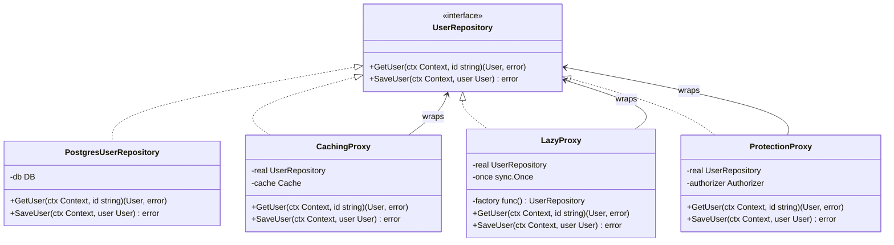

## 1. Overview

The Proxy pattern provides a surrogate — a stand-in — for another object. The proxy controls access to the real object and implements the exact same interface. Callers interact with the proxy thinking they're talking directly to the real thing.

Think of it like a receptionist at a company. You don't walk directly into the CEO's office. You go through the receptionist, who might check if you have an appointment (Protection Proxy), look up your answer in a Rolodex (Caching Proxy), or tell you the CEO will call you back when available (Virtual Proxy). Same outcome — access to the CEO — but controlled, augmented, or deferred.

For staff engineers: the Proxy is the pattern behind service meshes (Envoy), database connection pools, gRPC stubs, and every cache layer in distributed systems. Understanding it deeply means understanding how access control, latency hiding, and lazy initialization work at the infrastructure level.

---

## 2. Core Concepts (Step-by-Step)

### Three Types of Proxies

**Virtual Proxy** — defers expensive object creation until it's needed. Useful for objects that are costly to construct or initialize (database connections, large data structures).

**Remote Proxy** — hides the fact that the real object is on a different machine. A gRPC stub is a remote proxy: it looks like a local function call but makes a network request.

**Protection Proxy** — controls access to the real object based on permissions. The proxy checks authorization before forwarding the call.



*Each proxy implements the same `UserRepository` interface as the real implementation. Callers see no difference.*

### The Key Principle

**The proxy implements the same interface as the real subject.** This is what separates the Proxy from the Adapter (which translates to a *different* interface) and from the Decorator (which adds behavior but the intent is different — more on this in Section 6).

---

## 3. Use Cases

### 1. Envoy as a Remote Proxy in Kubernetes Service Mesh

In a Kubernetes cluster running Istio, every pod has an Envoy sidecar. When Service A calls Service B, the call actually goes to A's Envoy sidecar, which routes it to B's Envoy sidecar, which delivers it to Service B. From Service A's application code, it looks like a direct call — same HTTP/gRPC interface. Envoy is a Remote Proxy: it implements the same interface, hides the network, adds retries, circuit breaking, mTLS, and observability transparently.

This is Proxy at infrastructure scale: neither the client nor the server knows the proxy is there.

### 2. Database Connection Pool as a Virtual Proxy

`database/sql`'s `*sql.DB` is a Virtual Proxy for database connections. You call `db.Query()` and it looks like a direct call. Underneath, `*sql.DB` manages a connection pool — lazy-opening connections, reusing idle ones, enforcing `MaxOpenConns`. You never manage connections manually. The pool proxy handles all of it transparently behind the same `DB.Query()` interface.

### 3. gRPC Stubs as Remote Proxies

When you generate Go code from a protobuf file, the generated client struct is a Remote Proxy. `UserServiceClient.GetUser(ctx, req)` looks like a local method call. Under the hood it serializes `req` to protobuf, makes an HTTP/2 connection to the remote server, deserializes the response, and returns it. The network is completely hidden. That's a Remote Proxy.

### 4. Remote Proxy in Go's Standard Library: `net/http/httputil.ReverseProxy`

Go ships a production-ready Remote Proxy in its standard library: `httputil.ReverseProxy`. It implements `http.Handler`, transparently forwarding every incoming request to a backend origin. The caller sees one HTTP endpoint; the proxy silently talks to another machine — same interface, different host.

```go
package main

import (
	"net/http"
	"net/http/httputil"
	"net/url"
)

func newReverseProxy(targetURL string) http.Handler {
	origin, _ := url.Parse(targetURL)
	return httputil.NewSingleHostReverseProxy(origin)
}

func main() {
	// All traffic to :8080 is forwarded transparently to the backend at :9090
	http.ListenAndServe(":8080", newReverseProxy("http://localhost:9090"))
}
```

*`httputil.NewSingleHostReverseProxy` is the Go standard library's canonical Remote Proxy — it exposes an `http.Handler` interface while the real object lives on a different host.*

For production use, set `ReverseProxy.Transport` to tune connection pool limits, and hook `ModifyResponse` or `ErrorHandler` for observability. This same primitive underlies Go-based API gateways (Traefik, Caddy) and many internal load balancers.

---

## 4. Gotchas

### Gotcha 1: Remote Proxy Masking Latency

The most common production incident with Remote Proxies: a developer writes a loop calling what looks like a local operation, not realizing it's a remote call:

```go
for _, userID := range userIDs {
    user, _ := userServiceClient.GetUser(ctx, &pb.GetUserRequest{Id: userID})
    // This is a gRPC call! 100 users = 100 network round trips
}
```

At 100 users this is acceptable. At 10,000 users this is a P0 incident. **Always document in the type name and method comment that the proxy makes network calls.** Consider adding batch operations to the interface when fan-out is expected.

### Gotcha 2: Protection Proxy That Can Be Bypassed

If your protection proxy is constructed inconsistently:

```go
// Safe: constructed with protection proxy
repo := NewProtectionProxy(realRepo, authorizer) // ✓

// Bypass: caller directly constructs the real repo
repo := NewPostgresUserRepository(db) // ✗ bypasses protection
```

The Go idiom to make bypass *impossible* by construction — keep the concrete type unexported and expose only a factory that returns the interface:

```go
// unexported: callers outside this package cannot instantiate it directly
type postgresUserRepository struct{ db *sql.DB }

// NewUserRepository always wires the protection proxy — bypass is impossible
func NewUserRepository(db *sql.DB, auth Authorizer) UserRepository {
	return NewProtectionProxy(&postgresUserRepository{db: db}, auth)
}
```

File a dependency injection requirement: the real implementation must not be exported, or the DI container must enforce that the proxy is always used. Otherwise, the protection proxy provides a false sense of security.

### Gotcha 3: Virtual Proxy Race Condition on Initialization

Naive lazy initialization has a race condition:

```go
// UNSAFE: two goroutines can both see realRepo == nil and both initialize
func (p *LazyProxy) GetUser(ctx context.Context, id string) (*User, error) {
    if p.realRepo == nil {  // ← data race here
        p.realRepo = p.factory()
    }
    return p.realRepo.GetUser(ctx, id)
}
```

Run `go test -race` and it will catch this immediately. The fix is `sync.Once` — shown in Section 7.

### Gotcha 4: Caching Proxy Serving Stale Data After Mutation

A classic cache invalidation bug:

```go
user, _ := proxy.GetUser(ctx, "123")  // returns from cache: user.Role = "viewer"
proxy.SaveUser(ctx, updatedUser)       // writes to DB with Role = "admin"
user, _ = proxy.GetUser(ctx, "123")   // BUG: still returns cached Role = "viewer"
```

The cache proxy only invalidates the cache in `SaveUser` for the exact key saved. But if another service updates the user directly, or if the cache TTL is too long, the proxy serves stale data. **Always invalidate the cache in every write path. Consider write-through caching for consistency.** For critical data (permissions, auth), use a short TTL or skip the cache entirely.

### Gotcha 5: Cache Stampede on Hot Key Expiry

When a popular key expires, every in-flight goroutine simultaneously sees a cache miss and thunders into the real repository. With 100 concurrent requests for `"celebrity-123"`, you get 100 parallel DB queries for the same row:

```go
// All 100 goroutines reach this line at the same moment after TTL expiry
user, err := p.real.GetUser(ctx, id) // 100 simultaneous DB hits for one key
```

Fix: wrap the cache miss in a `singleflight.Group`. Regardless of how many goroutines call `GetUser` for the same key concurrently, only **one** real call is made; the rest wait and share the result:

```go
import "golang.org/x/sync/singleflight"

var group singleflight.Group

func (p *CachingProxy) GetUser(ctx context.Context, id string) (*User, error) {
	if u := p.getCached(id); u != nil { return u, nil } // fast path
	v, err, _ := group.Do(id, func() (any, error) { return p.real.GetUser(ctx, id) })
	if err != nil { return nil, err }
	u := v.(*User); p.setCached(id, u); return u, nil
}
```

*`singleflight.Group.Do` coalesces all concurrent callers for the same key into one real call — the rest wait and share the result.*

> 💡 **Staff-level insight:** `singleflight` eliminates the thundering herd for the *first* miss after expiry. For sustained hot-key load (celebrity profile, viral content), combine it with a **background refresh strategy**: refresh the cache entry *before* it expires so the key is never cold. This is how CDNs implement stale-while-revalidate.

---

## 5. Where to Use (and Where NOT to Use)

### Use When

- You need lazy initialization for expensive objects (database connections, large in-memory indexes)
- You need transparent caching that callers shouldn't know about
- You need access control without modifying the real object
- You need to hide the fact that an object is remote (gRPC stubs, HTTP client wrappers)
- You need pre/post hooks (logging, metrics) without changing the real object — though Decorator is often a better fit here

### Do NOT Use When

- You need to translate the interface — use Adapter instead
- You need to add composable, stackable behavior — use Decorator instead
- The proxy would be bypassed in practice (protection proxies that aren't enforced by construction)
- The caching is too complex to keep consistent — at that point, use an explicit caching service, not a transparent proxy

> 💡 **Staff-level insight:** The Proxy pattern is most powerful at the *infrastructure* level, not the application level. Envoy, NGINX, database connection pools, and gRPC stubs are all Proxies implemented at the infrastructure layer, transparent to application code. When you see a proposal to add a "transparent caching layer" or "auto-retry" in application code, ask: "Should this be at the infrastructure level instead?" A service mesh proxy adds retry and circuit-breaking to every service without a single line of application code change. That's leverage.

---

## 6. Versus (Comparisons)

| Aspect                    | Proxy                                                                                                                                                                           | Decorator                    | Adapter                                 |
| ------------------------- | ------------------------------------------------------------------------------------------------------------------------------------------------------------------------------- | ---------------------------- | --------------------------------------- |
| Interface change          | No — same interface as real subject                                                                                                                                             | No — same interface          | Yes — translates to different interface |
| Intent                    | Control access to real subject                                                                                                                                                  | Add behavior to object       | Translate between interfaces            |
| Knows about real subject? | Yes — manages it                                                                                                                                                                | Yes — wraps it               | Yes — wraps adaptee                     |
| Composable chains?        | Rarely                                                                                                                                                                          | Yes — designed for stacking  | No                                      |
| Typical uses              | Cache, lazy init, auth, remote                                                                                                                                                  | Logging, tracing, rate limit | Legacy integration, ACL                 |
| Can be both?              | Yes, structurally — but structural overlap ≠ intent overlap: Proxy manages access to *one specific* subject; Decorator adds reusable behavior to *any* subject of the same type | Yes                          | No                                      |

**Choose Proxy when** you need to control access to a specific real object — lazy init, caching, protection, or hiding a remote call behind a local interface.

**Choose Decorator when** you need to add stackable, composable cross-cutting behaviors (logging, tracing, rate limiting) where the same behavior applies to many objects.

---

## 7. Code Examples

```go
package proxy

import (
	"context"
	"fmt"
	"sync"
	"time"
)

// --- Target interface ---

type UserRepository interface {
	GetUser(ctx context.Context, id string) (*User, error)
	SaveUser(ctx context.Context, user *User) error
}

type User struct {
	ID    string
	Email string
	Role  string
}

// --- Real implementation ---

type PostgresUserRepository struct{}

func (r *PostgresUserRepository) GetUser(_ context.Context, id string) (*User, error) {
	// Simulates a DB query
	return &User{ID: id, Email: id + "@example.com", Role: "viewer"}, nil
}

func (r *PostgresUserRepository) SaveUser(_ context.Context, user *User) error {
	fmt.Printf("DB: saving user %s\n", user.ID)
	return nil
}

// --- Caching Proxy ---

type cachedEntry struct {
	user      *User
	expiresAt time.Time
}

// CachingProxy caches GetUser results. Automatically invalidates on SaveUser.
// NOTE: This does NOT protect against external writes bypassing this proxy.
type CachingProxy struct {
	real  UserRepository
	cache map[string]cachedEntry
	ttl   time.Duration
	mu    sync.RWMutex
}

func NewCachingProxy(real UserRepository, ttl time.Duration) *CachingProxy {
	return &CachingProxy{real: real, cache: make(map[string]cachedEntry), ttl: ttl}
}

func (p *CachingProxy) GetUser(ctx context.Context, id string) (*User, error) {
	p.mu.RLock()
	entry, ok := p.cache[id]
	p.mu.RUnlock()

	if ok && time.Now().Before(entry.expiresAt) {
		return entry.user, nil // cache hit
	}

	// Cache miss — fetch from real repository
	user, err := p.real.GetUser(ctx, id)
	if err != nil {
		return nil, err
	}

	p.mu.Lock()
	p.cache[id] = cachedEntry{user: user, expiresAt: time.Now().Add(p.ttl)}
	p.mu.Unlock()

	return user, nil
}

func (p *CachingProxy) SaveUser(ctx context.Context, user *User) error {
	if err := p.real.SaveUser(ctx, user); err != nil {
		return err
	}
	// Invalidate cache on write
	p.mu.Lock()
	delete(p.cache, user.ID)
	p.mu.Unlock()
	return nil
}

// --- Lazy Initialization Proxy ---
// Uses sync.Once for race-safe initialization.

type LazyProxy struct {
	factory func() UserRepository
	real    UserRepository
	once    sync.Once
}

func NewLazyProxy(factory func() UserRepository) *LazyProxy {
	return &LazyProxy{factory: factory}
}

func (p *LazyProxy) init() {
	// sync.Once guarantees this runs exactly once, even under concurrent access
	p.once.Do(func() {
		p.real = p.factory()
	})
}

func (p *LazyProxy) GetUser(ctx context.Context, id string) (*User, error) {
	p.init()
	return p.real.GetUser(ctx, id)
}

func (p *LazyProxy) SaveUser(ctx context.Context, user *User) error {
	p.init()
	return p.real.SaveUser(ctx, user)
}
```

*`sync.Once` in `LazyProxy` guarantees safe concurrent initialization — the factory runs exactly once, no locks required by callers. The `CachingProxy` uses `sync.RWMutex` to allow concurrent reads while serializing writes.*

---

## 8. Scale Discussion

**10x load (10k RPS)**: Caching proxies shine here. If cache hit rate is > 90%, you're absorbing 9x of the load in memory without touching the database. Monitor hit rate — a sudden drop means cache invalidation is broken or TTL is too short.

**100x load (100k RPS)**: The proxy's `sync.RWMutex` becomes a bottleneck for high-read workloads. Consider:
- Sharded caches (by key hash) to reduce lock contention
- Lock-free cache implementations (`sync.Map` for read-heavy, stable keyspaces)
- Moving the cache out of process to Redis — now a Remote Proxy wrapping both the cache and DB

**1000x load (1M RPS)**: An in-process caching proxy cannot scale to 1M RPS. At this scale:
- The proxy becomes a sidecar service (like Envoy) — a separate process
- Or the caching proxy pattern is abandoned in favor of CDN-level caching (Cloudflare, Fastly) for read-heavy data
- Local proxy caches (per-instance) combined with a distributed cache (Redis cluster) for write-through consistency

> 💡 **Staff-level insight:** When a service mesh proxy (Envoy) handles retries and circuit breaking, it can retry *without* the caller knowing. At 1M RPS, this retry amplification — a brief upstream degradation causing every request to retry — can turn a 5% error rate into a 200% load spike that cascades into a full outage. Configure max retries on the proxy with a retry budget (e.g., no more than 10% of traffic can be retries). This is one of the most important configurations in production service meshes and is often missed.

---

## 9. Monitoring & Observability

| Metric                          | Type      | Alert Condition                                                           |
| ------------------------------- | --------- | ------------------------------------------------------------------------- |
| `proxy.cache.hit_ratio`         | Gauge     | < 0.80 for a warm cache (cache is not effective)                          |
| `proxy.cache.size` (entries)    | Gauge     | > memory_limit / avg_entry_size (eviction pressure)                       |
| `proxy.real.call.duration_ms`   | Histogram | p99 > 100ms (real subject is slow, cache isn't helping)                   |
| `proxy.lazy.init.duration_ms`   | Histogram | p99 > 1000ms (factory initialization is slow — could block first request) |
| `proxy.auth.rejections.total`   | Counter   | Spike > 3x baseline (potential unauthorized access attempt)               |
| `proxy.cache.stale_reads.total` | Counter   | Any value > 0 (stale data was served — requires investigation)            |

---

## 10. Interview Questions

### Q1: "Explain the three types of Proxy patterns and give a real-world Go example of each."

**Key points to cover:**
- Virtual Proxy: `sync.Once`-based lazy initialization for expensive objects; `database/sql` connection pool
- Remote Proxy: gRPC generated client stubs; Envoy sidecar in a service mesh
- Protection Proxy: a wrapper that checks authorization before calling the real repository

**Common mistake:** Mixing up Proxy and Decorator. The key difference: Proxy controls access to a *specific* real subject. Decorator adds behavior generically — it doesn't care which specific implementation is wrapped.

**What the interviewer wants:** Pattern recognition in production systems, not just textbook definitions.

---

### Q2: "A Virtual Proxy for an expensive initialization is causing intermittent panics in production. How do you debug and fix this?"

**Key points to cover:**
- Run `go test -race` — an unprotected `if real == nil { real = init() }` is a data race
- The race: two goroutines can both see `nil`, both call `init()`, one uses a partially-initialized object
- Fix with `sync.Once` — guarantees initialization runs exactly once across all goroutines
- Verify the fix: run the test suite with `go test -race ./...` and check for clean output
- Production: add a metric for initialization duration and alert on slow initialization (slow init = first-request latency spike)

**Common mistake:** Using a mutex around the nil check without protecting the initialization itself — still allows two goroutines to initialize concurrently.

---

### Q3: "Design a caching proxy for a user profile service that handles 100k RPS. What consistency guarantees can you provide, and where do they break down?"

**Key points to cover:**
- In-process cache with TTL: eventual consistency, reads lag writes by up to TTL
- Write-through invalidation: strong consistency for writes through this proxy, but not for external writes
- Cache stampede risk: many parallel cache misses hitting the DB simultaneously (use `singleflight` package to coalesce)
- At 100k RPS: hot keys (celebrity user profiles) concentrate on single cache entries — consider local + distributed cache hierarchy
- Consistency breakdown: another service writes directly to the DB bypassing the proxy — solution: event-driven cache invalidation via Kafka/CDC

**What the interviewer wants:** Honest assessment of where consistency breaks, not just describing the happy path.

---

## 11. Staff-Level Preparation Tips

1. **Read `database/sql` internals** — `*sql.DB` is a masterclass in Virtual Proxy design. Study `maxOpenConns`, `maxIdleConns`, `connWaitTimeout`. Understand how it manages the connection pool lifecycle.

2. **Study Envoy's retry and circuit breaking configuration** — read the Envoy proxy documentation on retry policies and outlier detection. Understanding what happens when a remote proxy retries adds precision to your service mesh conversations.

3. **Study `singleflight` beyond the basics** — Gotcha 5 covers the core pattern. Extend it with a background-refresh strategy so hot keys never expire cold. Run `go test -bench` to compare naive miss, singleflight, and background-refresh latencies side by side.

4. **Build a Protection Proxy for testing** — create a protection proxy that enforces different access rules based on a role in the context. Write tests that verify unauthorized access is blocked. This connects directly to how AWS IAM, Kubernetes RBAC, and OPA work.

5. **Study the `sync` package deeply** — `sync.Once`, `sync.RWMutex`, `sync.Map`, and `sync.Pool` are the building blocks of safe proxies in Go. You can't design safe concurrent proxies without knowing which tool to reach for and why.

---

## 12. References

- [Go sync package — sync.Once](https://pkg.go.dev/sync#Once)
- [Go sync package — sync.RWMutex](https://pkg.go.dev/sync#RWMutex)
- [Go database/sql (Connection Pool as Virtual Proxy)](https://pkg.go.dev/database/sql)
- [golang.org/x/sync/singleflight — Preventing Cache Stampede](https://pkg.go.dev/golang.org/x/sync/singleflight)
- [Envoy Proxy Documentation — Retry Policy](https://www.envoyproxy.io/docs/envoy/latest/configuration/http/http_filters/router_filter#x-envoy-retry-on)
- [Istio — Traffic Management](https://istio.io/latest/docs/concepts/traffic-management/)
- [Martin Fowler — Patterns of Enterprise Application Architecture (Lazy Load)](https://martinfowler.com/eaaCatalog/lazyLoad.html)
- [Design Patterns: Elements of Reusable Object-Oriented Software (GoF)](https://www.oreilly.com/library/view/design-patterns-elements/0201633612/)
