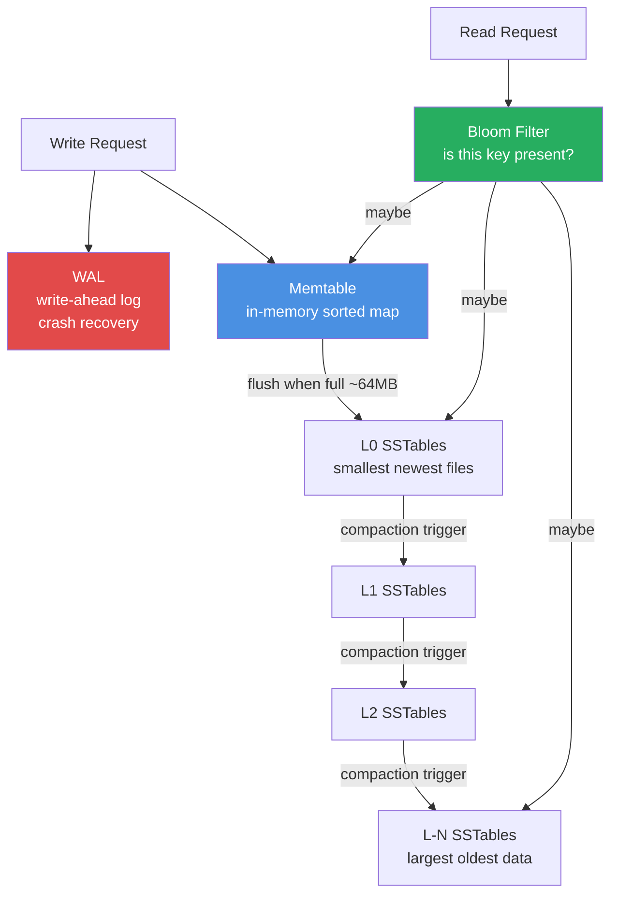
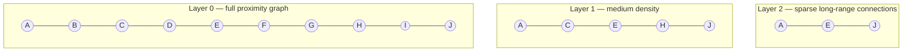
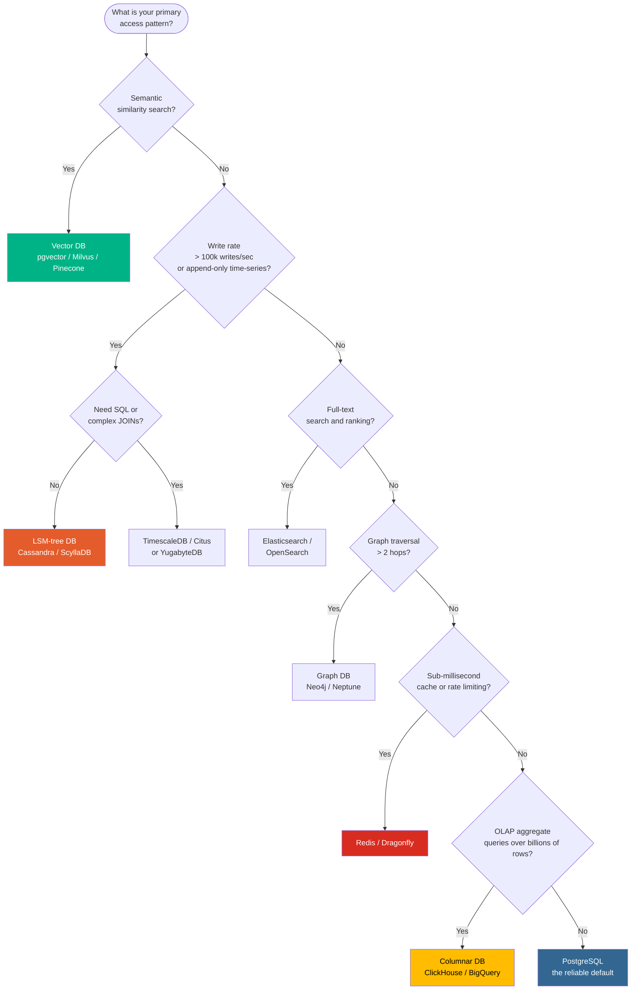
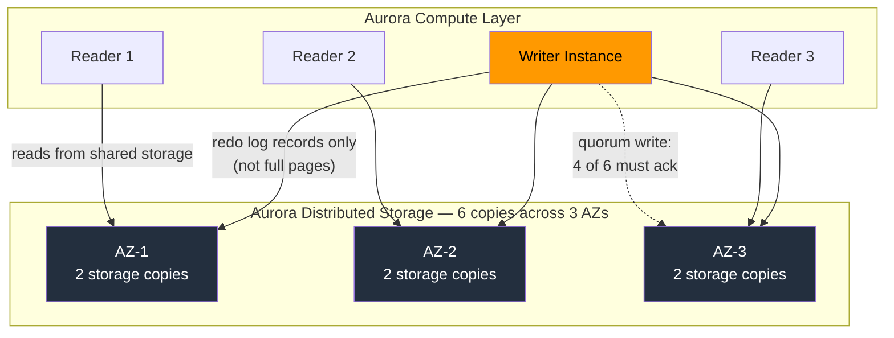
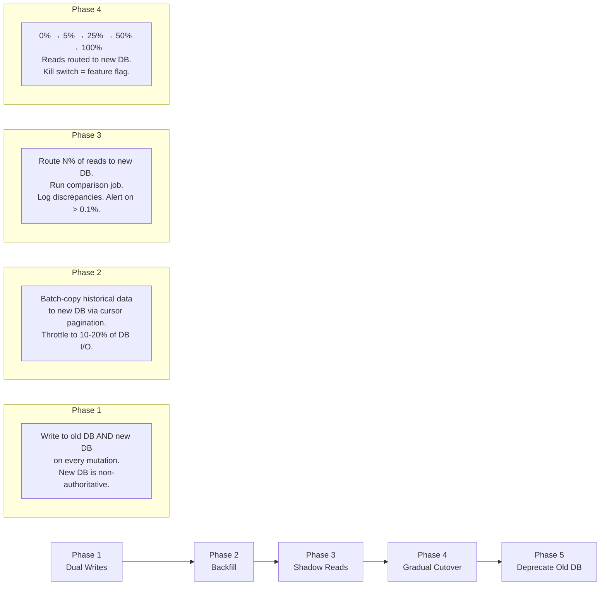

## 1. Overview

Every staff-level system design interview eventually comes down to the same moment: you've described a service, drawn some boxes, and then the interviewer asks: *"What database are you using — and why?"*

The wrong answer is a brand name. The right answer starts with your access patterns.

This guide teaches you to select databases the way engineers at Google, Uber, and Discord do: by understanding the data structures underneath, the failure modes in production, and the trade-offs that don't appear in vendor documentation. By the end, you'll know how LSM trees give Cassandra its write throughput, why Discord migrated away from Cassandra to ScyllaDB (it wasn't about features), how to execute a zero-downtime 50TB migration, and how to give a model answer to every database question asked at L6/L7 FAANG interviews.

---

## 2. Core Concepts: The Data Structures That Drive Everything

The most important insight about databases is this: **a database is a data structure with a network API.** Every performance characteristic — write throughput, read latency, range scan cost, space amplification — flows directly from the underlying data structure. Learn the structure and you can derive the behavior from first principles in an interview room without memorizing benchmarks.

### 2.1 B-Trees: The Workhorse of OLTP

B-trees are the default storage structure for PostgreSQL, MySQL InnoDB, and Oracle. Every leaf page is ~8 KB (Postgres default). A write updates the page in-place, acquires a write lock, and journals the change in the WAL (Write-Ahead Log) for durability.

**Mental model:** A B-tree is like a sorted filing cabinet. Reading a record means navigating the cabinet from the top drawer down. Updating means opening the drawer, finding the paper, and modifying it in place — fast for random point reads, but expensive for write-heavy workloads because random page updates cause random I/O.

**Where it breaks:** At ~50k–100k writes/sec sustained on commodity hardware, B-tree page splits and lock contention become the bottleneck. When Instagram was growing to 50 million users in 2012, their single Postgres instance needed read replicas and table partitioning to survive the write pressure before they eventually moved some workloads off it.

### 2.2 LSM Trees: The Write Machine

Log-Structured Merge trees (used by Cassandra, ScyllaDB, RocksDB, LevelDB, TiKV) trade read performance for extraordinary write throughput by making every write sequential. Here's the path a write takes:

```
Write → memtable (in-memory sorted buffer, e.g. a red-black tree)
      → WAL (for crash recovery — written first)

Flush → immutable SSTable file on disk when memtable hits size threshold

Background → compaction: merge + sort + deduplicate SSTables across levels
```



*LSM tree write path: writes hit memory first and are sequentially flushed to immutable SSTables. Bloom filters (one per SSTable) short-circuit most negative reads so you don't scan every level for a missing key.*

**Three compaction strategies — pick based on your workload:**

| Strategy | Full Name              | Best For                   | Key Trade-off                             |
| -------- | ---------------------- | -------------------------- | ----------------------------------------- |
| STCS     | Size-Tiered Compaction | Write-heavy, few reads     | High space amplification (~2x disk usage) |
| LCS      | Leveled Compaction     | Read-heavy, mixed workload | High write amplification (~10–30x)        |
| TWCS     | Time-Window Compaction | Time-series data with TTLs | Only correct when writes are time-ordered |

> 💡 **Staff-level insight:** Write amplification is the hidden cost of LSM trees. In LCS, a single logical write may result in 10–30 physical disk writes after compaction cascades through levels. At Spotify, engineers discovered their Cassandra cluster was writing ~15x more bytes than application-level metrics showed — burning through SSD write endurance 15x faster than modeled. Always instrument `compaction_bytes_written` alongside your application write rate metrics. The delta is your write amplification factor.

**Read performance:** A read in an LSM system must check the memtable, then potentially every SSTable level. Bloom filters eliminate most false positives, but a non-existent key still touches all levels. Deleted records leave a **tombstone** (see Section 4 Gotchas) that must be scanned over on every read until compaction removes it. This is why Cassandra's worst-case reads are slow on delete-heavy tables.

**Go snippet — tunable consistency write with the Cassandra Go driver:**

```go
package main

import (
	"fmt"
	"log"

	"github.com/gocql/gocql"
)

func main() {
	cluster := gocql.NewCluster("cassandra-node-1", "cassandra-node-2", "cassandra-node-3")
	cluster.Keyspace = "user_events"

	// Consistency: QUORUM requires (RF/2 + 1) replicas to ack.
	// Use LOCAL_QUORUM in multi-DC to avoid cross-DC latency on every write.
	// Use ONE only for non-critical counters where you can tolerate data loss.
	cluster.Consistency = gocql.LocalQuorum

	session, err := cluster.CreateSession()
	if err != nil {
		log.Fatalf("failed to connect: %v", err)
	}
	defer session.Close()

	// Cassandra writes are O(1) regardless of row size — no read-before-write,
	// just an append to the memtable + WAL. TTL of 30 days avoids tombstone buildup.
	err = session.Query(
		`INSERT INTO events (user_id, event_time, action) VALUES (?, ?, ?) USING TTL 2592000`,
		"user-123", gocql.TimeUUID(), "page_view",
	).Exec()
	if err != nil {
		log.Fatalf("write failed: %v", err)
	}
	fmt.Println("write ok")
}
```

### 2.3 Inverted Indexes: The Engine Behind Search

Elasticsearch and OpenSearch use inverted indexes for full-text search. The structure maps every unique term to the sorted list of documents containing it:

```
Term Dictionary     Postings List
──────────────────────────────────
"kafka"          →  [doc3, doc7, doc12, doc19]
"stream"         →  [doc1, doc3, doc7]
"consumer"       →  [doc3, doc5, doc7]
"group"          →  [doc2, doc3, doc9]
```

A query for `"kafka consumer"` becomes: intersect the posting lists for "kafka" and "consumer" → `[doc3, doc7]`. This intersection is fast because both lists are sorted — it's a linear merge, not a scan.

**BM25 (Best Match 25)** is the default ranking function. It scores documents by term frequency (TF) normalized by document length, weighted by inverse document frequency (IDF — rarer terms get higher weight). In practice: a document containing "kafka" 10 times scores higher than one containing it once, but not 10x higher (TF is log-scaled).

> 💡 **Staff-level insight:** Elasticsearch is often architecturally used as a read-model cache, not a primary store. The real data lives in Postgres; Elasticsearch is synced via CDC or dual writes. Many teams discover this design decision was implicit — they never made it explicit — and discover it when Elasticsearch falls behind during a full reindex and the search API starts returning 3-day-old results. Always design your Elasticsearch pipeline with a documented source-of-truth and a tested catch-up reindex procedure. Know your reindex time for your data volume before you need to do it at 2 AM.

### 2.4 R-Trees and PostGIS: Spatial Queries

An R-tree partitions 2D space into hierarchically nested bounding rectangles. A query like "find all drivers within 5 km of lat/lng X,Y" navigates the tree top-down, pruning any branch whose bounding box doesn't intersect the search circle.

**Real-world scale:** Uber's dispatch system uses a spatial index to find available drivers for each rider. At peak (6 million concurrent trips globally), a naïve O(N) scan of all driver locations is impossible — 6 million comparisons per dispatch request at thousands of dispatches per second. The R-tree reduces each query from 6M candidates to ~50 in under a millisecond.

PostgreSQL with PostGIS uses **GiST** (Generalized Search Tree) as the index type — a framework that generalizes B-trees for non-Euclidean search spaces, including geometries, ranges, and full-text.

**Redis alternative:** For simpler use cases (radius queries, no polygon intersections), Redis `GEOADD` / `GEORADIUS` stores coordinates in a sorted set using geohash encoding. Simpler to operate than PostGIS, but lacks polygon queries and topological predicates.

```go
package main

import (
	"context"
	"fmt"

	"github.com/redis/go-redis/v9"
)

func findNearbyDrivers(ctx context.Context, rdb *redis.Client, lat, lng float64) {
	// Redis GEO uses geohash internally — stored in a sorted set.
	// GEORADIUS is O(N+log(M)) where N = matches, M = total items in the set.
	results, err := rdb.GeoRadius(ctx, "drivers:online", lng, lat, &redis.GeoRadiusQuery{
		Radius:   5,
		Unit:     "km",
		WithDist: true,
		Count:    50,
		Sort:     "ASC",
	}).Result()
	if err != nil {
		panic(err)
	}
	for _, r := range results {
		fmt.Printf("driver=%s dist=%.2fkm\n", r.Name, r.Dist)
	}
}
```

### 2.5 HNSW: Vector Search for AI-Native Applications

Hierarchical Navigable Small World (HNSW) is the algorithm behind pgvector, Milvus, Weaviate, and Pinecone. It builds a layered proximity graph: upper layers have sparse long-range connections for fast navigation; lower layers have dense short-range connections for precise recall.



*HNSW layered graph: a query enters at Layer 2 and navigates to the approximate neighborhood quickly via long-range edges, then descends through layers for precise nearest-neighbor retrieval.*

**Key tuning knobs:**
- `ef_construction` — neighbors examined during index build. Higher = better recall, slower index build.
- `m` — bidirectional links per node. Higher = better recall, more memory (`m × 8 bytes × N vectors`).
- `ef_search` — neighbors checked at query time. The runtime recall/latency dial — increase without rebuilding the index.

**Go snippet — pgvector semantic nearest-neighbor search:**

```go
package main

import (
	"context"
	"fmt"
	"log"

	"github.com/jackc/pgx/v5"
	pgvector "github.com/pgvector/pgvector-go"
)

func findSimilarDocuments(ctx context.Context, conn *pgx.Conn, queryEmbedding []float32) {
	// <=> is cosine distance. Use for normalized embeddings (OpenAI, Cohere).
	// <-> is L2 (Euclidean) distance. Use for raw, un-normalized embeddings.
	// Bump ef_search per-session for higher recall at the cost of latency.
	_, err := conn.Exec(ctx, "SET LOCAL hnsw.ef_search = 100")
	if err != nil {
		log.Fatalf("set ef_search: %v", err)
	}

	rows, err := conn.Query(ctx, `
		SELECT id, content, embedding <=> $1 AS distance
		FROM documents
		ORDER BY embedding <=> $1
		LIMIT 10
	`, pgvector.NewVector(queryEmbedding))
	if err != nil {
		log.Fatalf("query failed: %v", err)
	}
	defer rows.Close()

	for rows.Next() {
		var id int
		var content string
		var distance float64
		if err := rows.Scan(&id, &content, &distance); err != nil {
			log.Fatal(err)
		}
		fmt.Printf("id=%d distance=%.4f snippet=%q\n", id, distance, content[:min(50, len(content))])
	}
}

func min(a, b int) int {
	if a < b {
		return a
	}
	return b
}
```

### 2.6 Columnar Storage: OLAP at Speed

Row-oriented databases (Postgres, MySQL) store all columns of a row together. Columnar databases (ClickHouse, BigQuery, DuckDB, Parquet/Iceberg files) store each column separately as a contiguous run.

For an analytics query like `SELECT region, sum(revenue) WHERE date > '2025-01-01' GROUP BY region`, a row store must read every column from every row. A column store reads only `revenue`, `region`, and `date` — often 50–200x less I/O.

**Three optimizations that compound:**

1. **Compression** — same-type, often-correlated values compress 5–50x better than mixed-type rows. ClickHouse's LZ4 + dictionary encoding routinely achieves 10:1 compression on event logs.
2. **Vectorized execution** — SIMD CPU instructions process 256-bit chunks at a time, aggregating thousands of values per CPU cycle.
3. **Late materialization** — apply filters first, reconstruct full rows only for the surviving fraction. A query selecting 0.1% of rows never touches 99.9% of the data.

### 2.7 Graph Storage: Adjacency Lists vs. Index-Free Adjacency

In Postgres, a social graph is an `edges(from_id, to_id)` table — an **adjacency list**. Finding 2nd-degree connections requires two self-joins over potentially millions of rows. At LinkedIn's scale (1 billion profiles), even 2nd-degree traversal this way is prohibitive.

Graph databases like Neo4j use **index-free adjacency**: each node stores physical pointers to its neighboring nodes. Traversal is O(1) per hop regardless of total graph size. The trade-off: global aggregates (e.g., "count all nodes with degree > 100") require scanning every node, and horizontal scale beyond ~100 billion edges requires specialized clustering.

---

## 3. Use Cases: Access Patterns → Database Choice



*Use this tree as a starting point. Validate every branch with your actual query patterns — access pattern assumptions are the most common source of wrong database choices.*

| Use Case                                 | Access Pattern                                      | Primary Choice           | Why                                                                           |
| ---------------------------------------- | --------------------------------------------------- | ------------------------ | ----------------------------------------------------------------------------- |
| Rideshare dispatch (Uber/Lyft)           | 2D radius queries, frequent location updates        | PostGIS / Redis Geo      | R-tree O(log N) spatial lookups; Redis Geo for sub-ms driver location updates |
| Social feed at scale (Twitter/Meta)      | Append-heavy, fan-out reads, time-ordered           | Cassandra / ScyllaDB     | LSM write throughput; wide rows model a user's feed naturally                 |
| Full-text product search (Shopify)       | Term matching + faceted filters + ranking           | Elasticsearch            | Inverted index + BM25 ranking out of the box                                  |
| AI semantic search / RAG                 | k-NN vector similarity                              | pgvector / Pinecone      | HNSW recall at low latency                                                    |
| Financial transactions (Stripe)          | ACID, referential integrity, audit trail            | PostgreSQL / CockroachDB | Serializable isolation; WAL = audit log                                       |
| Rate limiting (Cloudflare)               | Atomic increment + TTL per key                      | Redis                    | `INCR` + `EXPIRE` is sub-microsecond and atomic                               |
| Ad analytics (Meta)                      | Aggregate scans over billions of events, no updates | ClickHouse / BigQuery    | Columnar compression + vectorized execution                                   |
| Fraud graph / knowledge graph (LinkedIn) | Multi-hop relationship traversal                    | Neo4j / Neptune          | Index-free adjacency O(1) per hop                                             |

---

## 4. Gotchas: What Bites You in Production

### 4.1 PostgreSQL: VACUUM and XID Wraparound

Postgres uses MVCC (Multi-Version Concurrency Control). Old row versions remain in the heap until `VACUUM` removes them. The transaction ID (XID) is a 32-bit counter — after ~2.1 billion transactions, it wraps around. If `autovacuum` can't keep up with write volume, Postgres enters **emergency wraparound protection mode** and refuses all writes until manual intervention.

**Detect it before it kills your database:**

```sql
SELECT datname,
       age(datfrozenxid)                      AS xid_age,
       2147483647 - age(datfrozenxid)         AS xids_remaining
FROM   pg_database
ORDER  BY xid_age DESC;
```

Set a PagerDuty alert at `xids_remaining < 200_000_000`. The Instagram engineering team hit this in 2012; their Postgres cluster refused writes at 3 AM during peak hours. They blogged about it. Read that post.

**Secondary trap:** Long-running transactions hold back the oldest XID horizon, meaning VACUUM cannot clean pages even if autovacuum runs continuously. Monitor `pg_stat_user_tables.n_dead_tup` and kill transactions older than 30 minutes on write-heavy OLTP tables.

### 4.2 Cassandra: Tombstone Accumulation

When you delete a row in Cassandra, it writes a **tombstone** — a deletion marker — rather than removing data immediately. On reads, Cassandra must scan through tombstones to find live data. With the default 10-day `gc_grace_seconds`, a `SELECT` on a delete-heavy table can accumulate millions of tombstones per partition and trigger `TombstoneOverwhelmingException`, causing read timeouts that cascade across the cluster.

**Production rules:**
- If your delete rate is > 10% of writes, reconsider Cassandra for this access pattern.
- Use TTLs (`USING TTL`) instead of explicit deletes wherever possible.
- Monitor `tombstone_scanned_histogram` in `nodetool tpstats`.
- Never design a schema with unbounded partition growth (e.g., all events for a user in one partition).

### 4.3 Redis: Hot Keys and Cluster Resharding

Redis Cluster assigns keys to one of 16,384 hash slots across shards. A "celebrity" key — a viral tweet's like counter, a product launch's inventory key — can funnel 200k req/sec to a single shard, melting it while the other shards idle at 2% CPU.

**Three mitigations in order of invasiveness:**

1. **Local application cache** — cache the hot key in application memory with a 50–100ms TTL. For read-heavy counters, this eliminates 95% of Redis traffic with one line of code.
2. **Key salting** — split the logical key into N physical keys: `tweet:123:likes:0` through `tweet:123:likes:9`. Write to a random shard; read all 10 and sum. Transparent to callers behind a helper function.
3. **Redis read replicas** — available in Redis 7.0+ and Redis Enterprise. Route read traffic to replicas; writes go to the primary shard.

> 💡 **Staff-level insight:** Cluster resharding in Redis is not free and not fast. Moving a hash slot uses `MIGRATE`, which is single-threaded per slot and blocks the source shard for each key transfer. At Slack, resharding a 50M-key cluster took 4+ hours and caused elevated P99 latency for the entire duration. Plan resharding for low-traffic maintenance windows, test your client's behavior during slot migration exhaustively, and always throttle the migration speed with `--cluster-throttle`. Budget a full week for the operation at scale.

### 4.4 Elasticsearch: Mapping Explosions

Elasticsearch's **dynamic mapping** auto-detects field types on the first document insert. If you ingest JSON with unpredictable or user-supplied keys (e.g., metadata fields from a multi-tenant system), you can accumulate thousands of field mappings in a single index. The entire cluster state — including all mappings — is held in heap memory on every node. A mapping explosion can cause heap exhaustion, full GC pauses, and a cluster-wide outage.

**Fix:** Always use explicit mappings in production. Set `"dynamic": "strict"` so unknown fields cause a rejection error rather than silent auto-mapping. For user-supplied metadata, store it as a serialized `keyword` or use `"enabled": false` on an object field.

### 4.5 DynamoDB: Hot Partitions and the Adaptive Capacity Delay

DynamoDB distributes data across partitions by hash key. A hot partition — one key receiving a disproportionate share of requests — gets throttled even if the table's overall provisioned capacity is under-utilized. DynamoDB's **Adaptive Capacity** automatically boosts throughput to hot partitions, but it takes 5–30 minutes to activate. That delay is the difference between a 5-minute degraded incident and a 30-minute outage on Black Friday.

**Prevention:** Design partition keys with high cardinality. For event sourcing, use composite keys like `{user_id}#{year-month}` to spread writes across time windows. For hot global counters, use a Redis `INCR` as the write path and sync to DynamoDB asynchronously.

### 4.6 pgvector: Recall Degradation at Scale

pgvector defaults to `hnsw.ef_search = 40`. At this setting, recall (the fraction of true nearest neighbors in the returned top-10) can drop to 82–88% for 1536-dimension OpenAI embeddings on datasets larger than 1M vectors. If your RAG application starts returning irrelevant context chunks, low recall is likely the cause before you suspect the LLM.

**Tuning levers:**

```sql
-- Tune per-session — no index rebuild needed
SET LOCAL hnsw.ef_search = 100;

-- Verify recall by comparing against an exact brute-force scan:
-- Use ivfflat with lists=1 as exact-scan ground truth
CREATE INDEX ON documents USING ivfflat (embedding vector_cosine_ops) WITH (lists = 1);
-- Then compare top-10 results from both indexes on a sample of queries.
```

A jump from `ef_search=40` to `ef_search=100` typically recovers 5–8% recall at the cost of 2–3x query latency. At < 5M vectors that latency is still under 20ms P99. Beyond 10M vectors, switch to Milvus or a dedicated vector service.

---

## 5. Where to Use (and Where NOT to Use)

| Database                  | Use When                                                                          | Do NOT Use When                                                                         |
| ------------------------- | --------------------------------------------------------------------------------- | --------------------------------------------------------------------------------------- |
| **PostgreSQL**            | ACID required, complex JOINs, team has SQL expertise, write rate < 50k/sec        | You need > 500k writes/sec, or horizontal write scale across multiple regions           |
| **Cassandra / ScyllaDB**  | > 100k writes/sec, time-series, multi-DC active-active, no complex aggregations   | You need JOINs, ad-hoc queries, or strong consistency by default                        |
| **Redis**                 | Sub-millisecond reads, rate limiting, pub/sub, distributed locks, caching         | You need durable primary storage of critical data you cannot afford to lose             |
| **Elasticsearch**         | Full-text search, log analytics, faceted navigation                               | You need ACID semantics, strong consistency, or it's your only datastore                |
| **DynamoDB**              | AWS-native, fully serverless, massive unbounded scale, simple key-range access    | Complex multi-attribute access patterns, frequent scans, or tight cost budgets          |
| **ClickHouse / BigQuery** | Petabyte-scale analytics, aggregate-heavy dashboards, time-series event data      | OLTP workloads, frequent updates/deletes, or datasets under 10M rows (Postgres is fine) |
| **Neo4j / Neptune**       | Relationship-first data model, traversal depth > 3 hops                           | Simple foreign-key relationships better served by Postgres + indexed joins              |
| **pgvector**              | < 5M vectors, already on Postgres, recall > 90% acceptable, ops simplicity valued | > 10M vectors at < 10ms P99 latency — use Milvus or Pinecone at that scale              |

> 💡 **Staff-level insight:** The most expensive database decision isn't the one you make at the start — it's the one you're too afraid to reverse later. The right time to move a write-heavy logging service from Postgres to Cassandra is at 20k writes/sec (when you have runway), not at 200k writes/sec when you're already on fire. Build migration readiness into your architecture reviews, not your incident retrospectives.

---

## 6. Versus: Head-to-Head Comparisons

### 6.1 PostgreSQL vs. DynamoDB

| Aspect             | PostgreSQL                                                   | DynamoDB                                                                          |
| ------------------ | ------------------------------------------------------------ | --------------------------------------------------------------------------------- |
| Consistency        | Serializable ACID                                            | Eventually consistent (default); strongly consistent reads available at +50% cost |
| Query model        | Full SQL — JOINs, window functions, CTEs, aggregates         | Key-value + range scan on sort key; no JOINs                                      |
| Write throughput   | ~50k writes/sec single node; ~500k with Citus sharding       | Virtually unlimited with well-distributed partition keys                          |
| Horizontal scale   | Citus sharding, application-level sharding                   | Native and fully managed                                                          |
| Operational burden | High — VACUUM, partitioning, connection pooling, replica lag | Near-zero — serverless mode requires no capacity planning                         |
| Cost model         | Predictable (instance-based; ~$0.10/hr for db.m5.large)      | Unpredictable at scale: 1M writes/sec ≈ $50k+/month on-demand                     |
| P99 latency        | 1–10ms (single region)                                       | 1–5ms (single region)                                                             |

**Choose PostgreSQL when:** You have relational data with complex access patterns, need ACID for financial or compliance workloads, or your team has strong SQL expertise and your write rate is under control.

**Choose DynamoDB when:** You're building on AWS, need infinite horizontal write scale with zero operational overhead, and your access patterns are well-defined key-value or key-range lookups from the start. The cost model punishes late schema changes on DynamoDB; design your access patterns before you write a line of code.

### 6.2 Cassandra vs. ScyllaDB (The Discord Migration Story)

In 2022–2023, Discord migrated their messages database from Cassandra to ScyllaDB. The proximate cause: their Cassandra cluster had grown to 177 nodes, was experiencing JVM garbage collection stop-the-world pauses (up to 8 seconds at P99.9), and required 20% more nodes every quarter to keep up with message volume growth. ScyllaDB is a C++ reimplementation of the Cassandra storage engine and wire protocol with a **shard-per-core** architecture — no JVM, no global GC, no shared locks between cores.

| Aspect                | Cassandra                                | ScyllaDB                                       |
| --------------------- | ---------------------------------------- | ---------------------------------------------- |
| Runtime               | Java (JVM)                               | C++                                            |
| GC pauses             | Yes — JVM GC, P99.9 can reach 8s+        | None — manual memory management, no GC         |
| CPU efficiency        | ~40% effective (JVM overhead, GC cycles) | ~80% effective (shard-per-core, no contention) |
| Node count at Discord | 177 nodes                                | 72 nodes (59% reduction)                       |
| Wire protocol         | CQL                                      | CQL-compatible — drop-in replacement           |
| Operational tooling   | Very mature: nodetool, Cassandra Reaper  | Growing: Scylla Manager, scyllatop             |
| Community size        | Large, 10+ years mature                  | Smaller, rapidly growing                       |

**Choose Cassandra when:** Your team has years of operational muscle memory, you're not experiencing JVM GC pain, and the cost of migration (engineering time, risk) outweighs the efficiency gains.

**Choose ScyllaDB when:** You're starting fresh, experiencing JVM GC latency spikes under load, or running at Discord/Roblox scale where a 60% node reduction saves millions annually in infrastructure cost.

### 6.3 pgvector vs. Pinecone vs. Milvus

| Aspect                         | pgvector                             | Pinecone                              | Milvus                            |
| ------------------------------ | ------------------------------------ | ------------------------------------- | --------------------------------- |
| Deployment                     | Self-hosted (your Postgres instance) | Fully managed SaaS                    | Self-hosted or Zilliz Cloud       |
| Practical scale limit          | ~5M vectors at < 20ms P99            | 100M+ (managed)                       | 1B+                               |
| Recall at default settings     | ~82–92% (ef_search=40)               | ~95%+ (vendor-managed tuning)         | ~95%+ (tunable)                   |
| P99 latency (1M vectors)       | 5–20ms                               | 1–5ms                                 | 2–10ms                            |
| Ops overhead                   | None — already in Postgres           | None — SaaS                           | High — distributed system on K8s  |
| Cost                           | Marginal (existing Postgres cost)    | ~$0.096/1M reads — expensive at scale | Infrastructure + engineering time |
| Hybrid search (sparse + dense) | Via ParadeDB pg_search               | Yes (metadata filtering)              | Yes (sparse + dense)              |

**Choose pgvector when:** Your dataset is under 5M vectors, you already operate Postgres, and ops simplicity is the priority. This is the right call for 90% of RAG applications.

**Choose Pinecone when:** You want zero operational burden and the SaaS cost fits your budget.

**Choose Milvus when:** You're at 50M+ vectors, need maximum query throughput, and have an infrastructure team capable of operating a distributed system.

### 6.4 Redis vs. Memcached

| Aspect          | Redis                                                                | Memcached                              |
| --------------- | -------------------------------------------------------------------- | -------------------------------------- |
| Data structures | Strings, Hashes, Lists, Sets, Sorted Sets, Streams, HyperLogLog, Geo | Strings only                           |
| Persistence     | RDB snapshots + AOF (optional, configurable)                         | None — purely in-memory, no durability |
| Clustering      | Redis Cluster (16,384 hash slots), Sentinel for HA                   | Client-side consistent hashing only    |
| Pub/Sub         | Yes — Streams API, legacy Pub/Sub                                    | No                                     |
| Threading model | Single-threaded command loop; I/O threads from v6.0                  | Multi-threaded throughout              |
| Memory overhead | ~30% over raw data                                                   | ~20% over raw data                     |

**Choose Redis when:** You need any data structure beyond plain strings, pub/sub messaging, optional persistence, or cluster-native partitioning with failover. This is nearly always the right choice for new systems.

**Choose Memcached when:** You're caching large uniform blobs (e.g., serialized HTML fragments), need maximum raw multi-threaded throughput, and your ops team has existing Memcached expertise.

### 6.5 Aurora vs. RDS PostgreSQL vs. Vitess

| Aspect            | Aurora (PostgreSQL)                                  | RDS (PostgreSQL)                                | Vitess                                      |
| ----------------- | ---------------------------------------------------- | ----------------------------------------------- | ------------------------------------------- |
| Architecture      | Storage-compute separation; distributed log          | Standard Postgres on managed EC2                | Sharded MySQL with a proxy layer            |
| Failover time     | < 30 seconds                                         | 60–120 seconds (Multi-AZ)                       | Manual / orchestrated (minutes)             |
| Read replicas     | Up to 15; near-zero replication lag (shared storage) | Up to 5; replication lag varies with write load | Unlimited (each shard has its own replicas) |
| Max storage       | 128 TiB (auto-scales in 10 GB increments)            | 64 TiB                                          | Unlimited (add shards)                      |
| Write scale       | Vertical only (up to db.r6g.16xlarge)                | Vertical only                                   | Horizontal (as many shards as needed)       |
| Cost vs RDS       | ~2–3x RDS for equivalent instance                    | Baseline                                        | High operational cost                       |
| SQL compatibility | Full PostgreSQL                                      | Full PostgreSQL                                 | MySQL dialect                               |

Aurora's key architectural insight: it replicates the **redo log** — not full data pages — across 6 copies in 3 Availability Zones. A failover doesn't need to replay a WAL from a replica; the new primary instance simply mounts the existing shared storage volume. This is why Aurora's failover is 4x faster than standard Multi-AZ RDS.



*Aurora sends only redo log records to storage — not full pages. Storage nodes reconstruct pages on demand. Readers share the same storage as the writer, so there is no data replication lag — only minimal log propagation lag (~10ms).*

**Choose Aurora when:** You're AWS-native, need fast failover and easy read scaling, and the 2–3x cost premium over RDS is offset by reduced operational toil.

**Choose RDS when:** Cost is the primary constraint and standard Multi-AZ failover (< 2 minutes) is acceptable.

**Choose Vitess when:** You're already on MySQL and need horizontal write scale beyond what a single Aurora instance can provide — as YouTube and GitHub did at petabyte scale.

---

## 7. Zero-Downtime Migration Playbook

This is Interview Question #2 — answered in full. The principle: **never do a hard cutover. Always have a kill switch to roll back to the old database in under 1 second.**



*Five-phase migration: dual writes keep both databases in sync during backfill. Shadow reads validate correctness before any traffic moves. Feature-flag kill switch allows instant rollback at every phase.*

**Kill switch implementation:** Use a feature flag (LaunchDarkly, AWS AppConfig, or a Redis key). When the comparison job in Phase 3 detects > 0.1% discrepancy between old and new DB responses, flip the flag — all reads immediately revert to the old database in under 1 second.

> 💡 **Staff-level insight:** The comparison job in Phase 3 is where migrations succeed or fail silently. It needs to handle: timestamp precision differences (microseconds vs milliseconds), NULL vs empty string semantics, floating-point normalization, and array ordering. Invest a full week building and validating it. Teams that skip this discover data divergence six months after the old database is decommissioned — when it's too late to roll back.

**Backfill rate limiting:** Cursor-paginate through the source table in batches of 1,000–10,000 rows. Add a `time.Sleep` between batches to keep the backfill I/O below 20% of the source database's capacity. A 50TB migration at 100MB/s sustained I/O takes ~6 days — plan the timeline accordingly.

---

## 8. Monitoring & Observability: What to Look at First at 3 AM

### PostgreSQL

| Metric                                  | Alert Threshold       | Why It Matters                                                 |
| --------------------------------------- | --------------------- | -------------------------------------------------------------- |
| `pg_stat_replication.write_lag`         | > 10 seconds          | Replica falling behind; read traffic may be serving stale data |
| `age(datfrozenxid)` per database        | > 1.5 billion         | XID wraparound danger zone — emergency VACUUM needed           |
| `pg_stat_user_tables.n_dead_tup`        | > 20% of `n_live_tup` | Autovacuum not keeping up; table bloat and slow scans imminent |
| Cache hit ratio                         | < 99%                 | `shared_buffers` is undersized for your working set            |
| `pg_stat_activity` long-running queries | > 30 minutes          | Holding XID horizon back; blocking autovacuum                  |

### Cassandra / ScyllaDB

| Metric                          | Alert Threshold                   |
| ------------------------------- | --------------------------------- |
| `tombstone_scanned` P99         | > 1,000 per query                 |
| `compaction_pending_tasks`      | Sustained > 32                    |
| `jvm_gc_time` (Cassandra only)  | > 5 seconds                       |
| `read_latency_p99`              | > 50ms                            |
| `dropped_messages.READ_TIMEOUT` | Any non-zero value                |
| `disk_usage` per node           | > 70% (compaction needs headroom) |

### Redis

| Metric                            | Alert Threshold                                   |
| --------------------------------- | ------------------------------------------------- |
| `evicted_keys` rate               | > 0 (data eviction means your cache is too small) |
| `keyspace_hits / (hits + misses)` | < 85%                                             |
| `blocked_clients`                 | > 5                                               |
| `rdb_last_bgsave_status`          | `err`                                             |
| `cluster_state`                   | Not `ok`                                          |
| `used_memory` / `maxmemory`       | > 85%                                             |

### Elasticsearch

| Metric                             | Alert Threshold                  |
| ---------------------------------- | -------------------------------- |
| JVM heap used                      | > 75% (GC pressure, risk of OOM) |
| `search.query_time_in_millis` P99  | > 200ms                          |
| `indexing.throttle_time_in_millis` | Rising trend                     |
| `unassigned_shards`                | > 0                              |
| `fielddata_evictions`              | > 0                              |

---

## 9. Scale: Where Each Database Breaks

| Database               | Baseline           | 10x                           | 100x                      | 1000x                                    | First Bottleneck                                                    |
| ---------------------- | ------------------ | ----------------------------- | ------------------------- | ---------------------------------------- | ------------------------------------------------------------------- |
| Postgres (single node) | 10k writes/sec     | Add PgBouncer + read replicas | Partitioning required     | Requires Citus or migration to Cassandra | Lock contention, XID bloat, VACUUM lag                              |
| Cassandra              | 50k writes/sec     | Add nodes linearly            | Linear scale              | Linear scale                             | Tombstone accumulation; compaction debt on delete-heavy tables      |
| Redis (single)         | 100k ops/sec       | Redis Cluster (hash slots)    | Cluster + read replicas   | Hot key bottleneck on a single slot      | Single shard CPU for hot key                                        |
| Elasticsearch          | 10k docs/sec       | Add shards and replicas       | Cross-cluster replication | Expensive, complex to operate            | JVM heap exhaustion, mapping explosion                              |
| DynamoDB               | Unlimited*         | Unlimited*                    | Unlimited*                | Unlimited*                               | Hot partitions at design time; cost at $50k+/month at 1M writes/sec |
| ClickHouse             | 1M rows/sec ingest | Distributed engine (sharded)  | Native sharding           | ClickHouse Cloud                         | Slow point lookups; complex multi-table joins                       |

*DynamoDB's "infinite" scale is real but has a linear cost curve. Design your access patterns to minimize `Scan` operations — each full-table scan at 1M items costs ~$0.25 and can be catastrophic at scale if triggered in a hot path.

---

## 10. Interview Questions

### Q1: Consolidation vs. Specialization

**"When do you move a service out of Postgres into a dedicated NoSQL store?"**

**Key points to cover:**
- Signal #1: Write rate approaching 70% of Postgres capacity headroom — migrate *before* you're in pain, not during it.
- Signal #2: Query patterns diverging from relational (pure key-value access, no JOINs, time-series appends).
- Signal #3: Postgres operational toil (VACUUM tuning, replica lag management) consuming > 1 engineer-hour/week.
- Framework: this is a "two-way door" decision only if you build the migration infrastructure. Without it, NoSQL migrations are effectively one-way. Always write an ADR documenting what you gain, what you lose, and the migration plan.

**Common candidate mistakes:**
- Saying "use MongoDB for schema flexibility" without mentioning that schema-on-read makes debugging production issues significantly harder.
- Not considering whether Postgres partitioning + PgBouncer would extend the runway by 18–24 months (it often does).
- Describing the database choice without a migration plan. The choice is 10% of the work; the migration is 90%.

**What interviewers look for at L6/L7:** An opinionated framework with named thresholds, not hedging. A strong answer says: "At 70% write capacity headroom with a diverging access pattern and > 1 hour/week of operational toil, I'd start a dual-write pilot. Here's how I'd structure it." That's staff-level. "It depends" is not.

---

### Q2: Zero-Downtime Migration

**"How do you migrate 50TB of data with a kill switch and zero customer impact?"**

See Section 7 for the full playbook. In an interview, structure your answer as: dual writes → throttled backfill → shadow reads with comparison job → gradual percentage cutover → deprecate.

**Key points to cover:** Feature-flag kill switch with < 1 second rollback SLA. Comparison job as the safety net. Backfill rate limiting to stay under 20% source DB I/O. Dark traffic phase before any cutover.

**Common mistake:** Describing a `pg_dump` / restore procedure. This has hours of downtime and no rollback path. A strong candidate immediately asks: "What is the tolerated downtime?" and then designs a migration that has zero observable downtime with a rollback at every step.

**What interviewers look for:** Can you design a process that is never in an inconsistent observable state, with a reversible escape hatch at every stage? That is the distinguishing mark between a senior and a staff engineer in this domain.

---

### Q3: Hot Partitions

**"How do you handle a 'celebrity' key in a Redis cluster that causes uneven load?"**

**Key points to cover:** Detection via per-key metrics (`redis-cli --hotkeys` or keyspace sampling). Three mitigations: local app-level cache (quickest), key salting across N shards (scalable), read replicas (infrastructure investment). Always address detection before mitigation.

**Common mistake:** Only describing key salting without mentioning the need to detect the hot key in the first place. Staff engineers instrument first, fix second. "How do you know it's a hot key problem?" is the follow-up question.

**What interviewers look for:** Do you have a mental model of where the bottleneck actually is (single shard CPU), and do you select the mitigation most appropriate for the read/write pattern of the specific key?

---

### Q4: Storage-Compute Separation

**"How does Aurora's architecture differ from standard RDS in terms of failover and replication?"**

**Key points to cover:** Aurora replicates the redo log, not data pages. 6-way replication across 3 AZs. Quorum writes: 4/6 copies must acknowledge. Failover < 30 seconds because no WAL replay required — new primary mounts existing storage. Readers share physical storage with the writer, eliminating traditional replication lag for page reads.

See the Aurora diagram in Section 6.5 — be able to draw this from memory.

**Common mistake:** "Aurora is managed Postgres with more read replicas." It is a fundamentally different storage architecture with different failure characteristics and a different performance envelope.

---

### Q5: Real-Time Analytics (OLTP → OLAP)

**"How do you bridge OLTP and OLAP workloads without affecting production traffic?"**

**Approaches in order of increasing complexity:**

1. **Read replica + DuckDB/pg_analytics** — for < 1TB, dashboard queries with 1-hour acceptable staleness. Zero new infrastructure.
2. **CDC (Debezium) → Kafka → ClickHouse** — real-time streaming ETL, sub-minute latency, fully decoupled OLAP load.
3. **Zero-ETL (Aurora → Redshift)** — AWS-native, near real-time, no Kafka required. Limited transformation flexibility.
4. **HTAP (TiDB, SingleStore)** — same database serves both workloads. Elegant but niche.

> 💡 **Staff-level insight:** The CDC-to-ClickHouse pattern is the one I recommend for most teams at 10M+ rows/day. It completely decouples analytical query load from production Postgres. A 30-second OLAP query that caused lock contention on Postgres runs in 50ms in ClickHouse. The cost: Kafka operational overhead + schema evolution management. Invest in a solid schema registry from day one — schema drift between Postgres and ClickHouse is the #1 source of silent data quality issues in this architecture.

---

### Q6: CAP Theorem Applied

**"Classify PostgreSQL, Cassandra, DynamoDB, and Redis under CAP. When do you choose CP over AP?"**

| Database      | Classification    | Practical Behavior                                                    |
| ------------- | ----------------- | --------------------------------------------------------------------- |
| PostgreSQL    | CP                | Refuses writes during partition rather than risk divergence           |
| Cassandra     | AP (configurable) | `QUORUM` consistency moves toward CP; `ONE` is AP                     |
| DynamoDB      | AP (default)      | Strongly consistent reads flip it toward CP at +50% cost              |
| Redis Cluster | AP                | Split-brain possible during partition; Sentinel setup is CP-leaning   |
| CockroachDB   | CP                | Raft consensus on every write; ~5ms cross-region coordination latency |

**Choose CP when:** Money, inventory, seat reservations — any domain where a stale read causes a real-world inconsistency that is expensive to correct (double-booking, overdraft).

**Choose AP when:** Recommendations, activity feeds, view counts — where serving a slightly stale value is orders of magnitude better than showing an error.

> 💡 **Staff-level insight:** CAP is frequently misapplied because network partitions are rare. Daniel Abadi's **PACELC** model is more useful: Partition → Availability vs Consistency; **Else (no partition)** → Latency vs Consistency. DynamoDB optimizes for low latency (E→L) by default. CockroachDB optimizes for consistency (E→C) at the cost of 5ms+ cross-region latency per write. When you're choosing a database for a normally-operating system, PACELC tells you more than CAP does.

---

### Q7: Multi-Region Active-Active

**"Design a multi-region active-active database architecture for a payments system."**

**Key points to cover:**
- **Why it's hard:** Active-active with strong consistency requires cross-region coordination on every write. US-East to EU-West round trip = 100ms+. A write to a shared account balance would block on that round trip on every transaction.
- **Conflict-free design (preferred):** Shard by user geography. US users' data lives in US-East; EU users' data lives in EU-West. Cross-region writes only happen for users who travel — a small fraction.
- **Conflict resolution for shared data:** CRDTs for commutative operations (counters, sets). Last-write-wins with vector clocks for profile updates. Saga pattern or 2PC for cross-region transactions.
- **Technologies:** CockroachDB Global Tables, Google Spanner (TrueTime), DynamoDB Global Tables (AP), Cassandra with `NetworkTopologyStrategy`.

**Common mistake:** Proposing active-active without addressing conflict resolution. Every system that accepts concurrent writes to the same logical record across regions will eventually receive conflicting updates. The question is not whether it happens — it will. The question is how your system detects and converges.

---

### Q8: Consistency Models

**"Explain linearizability, sequential consistency, and eventual consistency with a concrete example of where each matters."**

- **Linearizability (strongest):** Every operation appears to execute instantaneously at a single moment in time. If write W completes before read R starts, R *must* see W's value. Required for: bank balances, inventory counters, distributed locks.
- **Sequential consistency:** Operations within each process appear in order, but there is no real-time guarantee between concurrent processes from different clients.
- **Eventual consistency:** All replicas converge to the same value eventually, assuming no new writes. DNS propagation is eventually consistent.

**Concrete bug from eventual consistency:** User updates their email address. Write goes to replica A. User immediately hits refresh — read goes to replica B. User sees their old email, panics, submits a duplicate update. This is the missing "read-your-own-writes" guarantee, absent in eventually consistent systems by default.

**What interviewers look for:** A specific scenario where the weaker guarantee causes an observable bug for an end user. Generic definitions fail. A concrete production bug succeeds.

---

## 11. References

- **[Designing Data-Intensive Applications](https://dataintensive.net/)** — Martin Kleppmann. Read Chapters 3 (storage engines), 5 (replication), 6 (partitioning), and 9 (consistency) before any staff interview.
- **[CMU 15-445/645 Database Systems](https://15445.courses.cs.cmu.edu/)** — Andy Pavlo. Free lectures covering storage engines, buffer management, concurrency control, and recovery.
- **[Discord: How Discord Stores Trillions of Messages](https://discord.com/blog/how-discord-stores-trillions-of-messages)** — The Cassandra → ScyllaDB migration case study with production numbers.
- **[Figma: How Figma's Databases Team Lived to Tell the Scale](https://www.figma.com/blog/how-figmas-databases-team-lived-to-tell-the-scale/)** — Horizontal and vertical sharding strategies in Postgres at product scale.
- **[Amazon Aurora SIGMOD Paper](https://dl.acm.org/doi/10.1145/3035918.3056101)** — "Amazon Aurora: Design Considerations for High Throughput Cloud-Native Relational Databases."
- **[Dynamo: Amazon's Highly Available Key-Value Store](https://dl.acm.org/doi/10.1145/1294261.1294281)** — The 2007 SOSP paper that defined eventual consistency for distributed systems and influenced DynamoDB, Cassandra, and Riak.
- **[Bigtable: A Distributed Storage System for Structured Data](https://dl.acm.org/doi/10.1145/1365815.1365816)** — Google's 2006 paper. The data model behind HBase and the inspiration for Cassandra's wide-column storage.
- **[MIT 6.824 Distributed Systems](https://pdos.csail.mit.edu/6.824/)** — Raft, Zookeeper, Spanner. Free course materials. Required reading for consistency model questions.
- **[The PACELC Theorem](https://dl.acm.org/doi/10.1145/2360276.2360543)** — Daniel Abadi's CAP extension. More useful for practical database selection than CAP alone.
- **[The Internals of PostgreSQL](https://www.interdb.jp/pg/)** — Free online book. Deep internals: MVCC, buffer manager, WAL mechanics.
- **[pgvector GitHub and Documentation](https://github.com/pgvector/pgvector)** — HNSW and IVFFlat index internals, tuning parameters, and benchmarks.
- **[Jepsen Analyses](https://jepsen.io/analyses)** — Kyle Kingsbury's real-world consistency bug findings in production databases.
- **[RocksDB Tuning Guide](https://github.com/facebook/rocksdb/wiki/RocksDB-Tuning-Guide)** — Detailed explanation of LSM compaction strategies with production tuning advice.

---

## 12. Staff-Level Preparation Tips

### What to Study Deeper

1. **LSM tree internals** — Read the RocksDB Wiki on compaction strategies. Run a local ScyllaDB instance and observe `nodetool compactionstats` during a sustained write load test. Watch write amplification climb as you vary the compaction strategy.
2. **Postgres internals** — Work through *The Internals of PostgreSQL* ([interdb.jp](https://www.interdb.jp/pg/)). Understand MVCC at the page level, the buffer manager's clock-sweep algorithm, and how WAL segments are recycled. This depth is what separates "I use Postgres" from "I understand Postgres."
3. **Consistency models in the wild** — Work through 3–4 Jepsen analyses ([jepsen.io](https://jepsen.io)). They are real production bugs in real databases. Reading them trains your intuition for consistency failure modes faster than any textbook.
4. **Aurora's storage architecture** — Read the SIGMOD paper (30 minutes). Be able to draw the 6-copy storage layout and explain quorum writes, log-only replication, and failover mechanics from memory in an interview.
5. **Vector database tuning** — Load 1M OpenAI embeddings into a local pgvector instance. Benchmark recall at `ef_search=40`, `ef_search=100`, and `ef_search=200`. The recall numbers will give you concrete figures to cite in interviews.

### What to Build

- **Migration harness** — Build a dual-write + shadow-read comparison tool in Go that can sit in front of any two databases. This is the most directly interview-applicable project in this guide.
- **LSM compaction visualizer** — Write a Go program that simulates STCS vs LCS compaction and plots space amplification and write amplification over time. Understanding it through code is faster than reading papers.
- **Hot key detector middleware** — Build a Redis client middleware in Go that tracks per-key hit rates using a sliding window counter and logs an alert when any key exceeds N% of total ops.

### How to Demonstrate Staff-Level Thinking in Interviews

In every database design question, answer in this order:

1. **Access patterns first.** Never say a database name until you have described the access pattern it needs to serve. "This service needs sub-10ms point reads on a user ID key and append-only writes at 200k/sec with no JOINs" leads to the right database. "I'll use Cassandra" does not.
2. **Failure modes second.** "This works at 10k req/sec. At 100k, here's where it breaks — tombstone accumulation on the delete path — and here's how I'd address that by switching to TTLs."
3. **Operational cost third.** "Adding Elasticsearch here means a permanent on-call rotation for a 3-node cluster, a reindex procedure for every mapping change, and heap tuning expertise. Is that trade-off worth it versus a Postgres GIN index with a 500ms tolerable search latency?"

> 💡 **Staff-level insight:** In every database decision I've participated in as a staff engineer, the winning argument was never about raw performance numbers. It was about who would be paged at 3 AM when it broke, what the runbook looked like, and whether the team had successfully operated it before. **The best database is the one your team can operate reliably at 3 AM — after six months of boring, uneventful stability.**

---

*Follow me on Medium for more staff-level system design deep dives in the Distributed Systems Deep Dive series.*