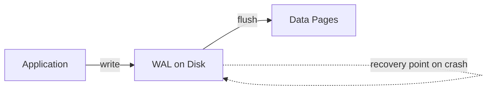
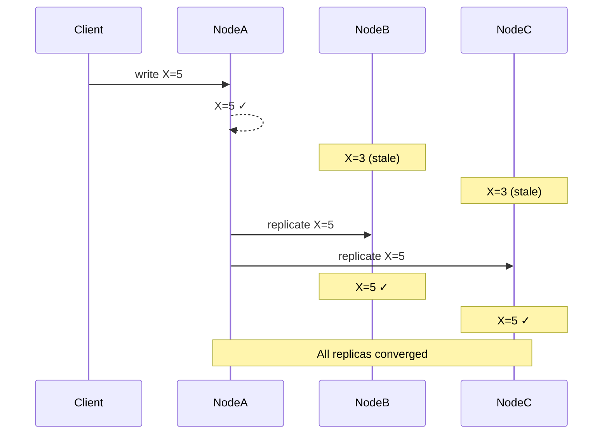
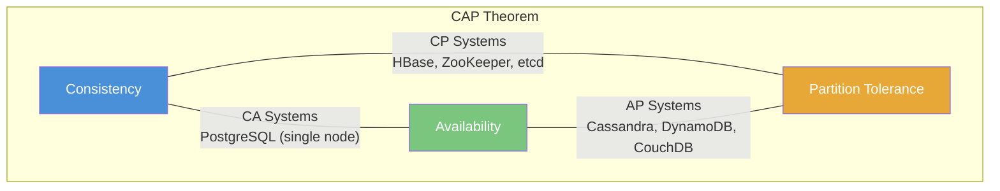
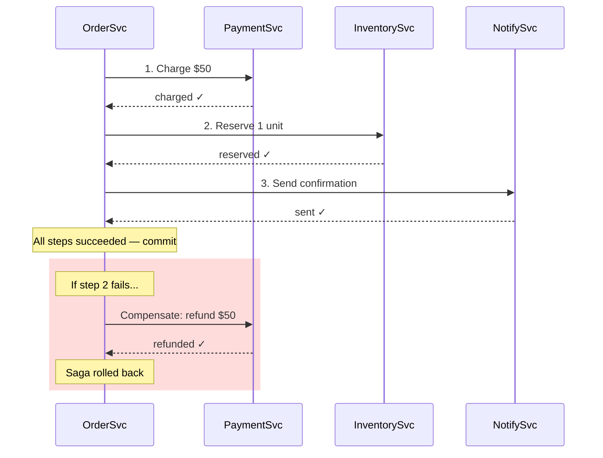

## 1. Overview

Every database system makes a fundamental promise: *how consistent will your data be under failure?*

ACID and BASE are two opposing answers to that question. ACID says: "always consistent, no matter what." BASE says: "usually available, eventually consistent." Neither is wrong — they're optimized for different realities.

If you design systems without understanding this trade-off, you will either build a banking app on a database that loses money, or a social network that grinds to a halt under load. This article gives you the mental model, the internals, and the judgment to choose right every time.

---

## 2. Core Concepts (Step-by-Step)

### Mental Model First

Think of a **bank** vs a **scoreboard**.

A bank must never show you $500 when you have $200. Two concurrent withdrawals must not both succeed if funds are insufficient. Correctness beats everything.

A scoreboard (think live sports score) can show slightly stale data. If you see "42-38" and the real score is "42-40", that's fine — you'll get the update in a second. Availability and speed beat perfect accuracy.

ACID = bank. BASE = scoreboard.

---

### ACID — Atomicity, Consistency, Isolation, Durability

```
┌──────────────────────────────────────────────────────────┐
│                       ACID Properties                    │
│                                                          │
│  A — Atomicity    All or nothing. No partial writes.     │
│  C — Consistency  DB moves from valid state → valid state│
│  I — Isolation    Concurrent txns don't see each other   │
│  D — Durability   Committed data survives crashes        │
└──────────────────────────────────────────────────────────┘
```

#### Atomicity

A transaction is a unit. Either all operations commit, or none do.

```go
// Transfer $100 from Alice to Bob
// Both operations succeed or both fail — never partial
tx, err := db.Begin()
if err != nil { return err }

_, err = tx.Exec("UPDATE accounts SET balance = balance - 100 WHERE id = $1", aliceID)
if err != nil { tx.Rollback(); return err }

_, err = tx.Exec("UPDATE accounts SET balance = balance + 100 WHERE id = $1", bobID)
if err != nil { tx.Rollback(); return err }

return tx.Commit()
```

Without atomicity: Alice loses $100, Bob gets nothing. Database in corrupt state.

#### Consistency

The DB enforces invariants. Foreign key constraints, CHECK constraints, uniqueness — all upheld before and after every transaction.

Consistency is not a database-only concern. Application-level invariants (e.g., "an order can't have negative items") are *your* job to enforce in code.

> 💡 **Staff-level insight:** The "C" in ACID is the weakest property — it's mostly enforced by the application, not the DB engine. Many papers argue ACID should really be "AID". The DB only enforces schema-level constraints. **Concrete example:** Nothing in PostgreSQL prevents your code from inserting `INSERT INTO orders (quantity) VALUES (-5)` — the DB commits it happily because both states (before and after) are "valid" according to the schema. Unless *you* add `CHECK (quantity > 0)`, the invariant doesn't exist. Consistency in ACID means "the DB won't violate constraints that are defined" — not "the DB prevents all bad data."

#### Isolation

Concurrent transactions behave as if they ran serially.

SQL standard defines 4 isolation levels:

| Isolation Level  | Dirty Read | Non-Repeatable Read | Phantom Read |
| ---------------- | ---------- | ------------------- | ------------ |
| READ UNCOMMITTED | ✅ possible | ✅ possible          | ✅ possible   |
| READ COMMITTED   | ❌ blocked  | ✅ possible          | ✅ possible   |
| REPEATABLE READ  | ❌ blocked  | ❌ blocked           | ✅ possible   |
| SERIALIZABLE     | ❌ blocked  | ❌ blocked           | ❌ blocked    |

*Higher isolation = fewer anomalies = more locking = lower throughput.*

PostgreSQL default: `READ COMMITTED`. MySQL (InnoDB) default: `REPEATABLE READ`.

#### Durability

Committed data survives crashes. Achieved via **Write-Ahead Log (WAL)**: writes go to disk log before the actual data pages. On crash recovery, replay the log.



*WAL ensures durability at the cost of write amplification (every write hits disk twice).*

---

### BASE — Basically Available, Soft State, Eventually Consistent

BASE was coined by Eric Brewer (CAP theorem, Google) to describe how large-scale distributed systems work in practice.

```
┌──────────────────────────────────────────────────────────────┐
│                        BASE Properties                       │
│                                                              │
│  BA — Basically Available  System stays up even under fault  │
│  S  — Soft State           Data may change without input     │
│  E  — Eventually Consistent Replicas converge over time      │
└──────────────────────────────────────────────────────────────┘
```

#### Basically Available

The system responds to requests even when some nodes are down. Responses may be stale or partial — but not "connection refused."

Example: Amazon DynamoDB serves reads from healthy replicas even if one region is down. You may get old data, but you get *something*.

#### Soft State

The system's state may change over time *without any new input* due to background replication, TTL expiry, or consistency syncing.

Example: Cassandra uses anti-entropy repair to sync replicas. A key's value can change on a node simply because a background sync ran.

#### Eventually Consistent

Given no new writes, all replicas will *eventually* converge to the same value. The window of inconsistency could be milliseconds or seconds.



*"Eventually" is not defined by a clock. Under network partition, "eventually" could be minutes.*

#### Tunable Consistency (The Quorum Math)

Most BASE systems don't force you to be fully eventual. Cassandra and DynamoDB let you **tune** consistency per query using quorum settings.

The key formula:

$$W + R > N \implies \text{strong consistency}$$

Where:
- **N** = number of replicas (typically 3)
- **W** = number of replicas that must acknowledge a write
- **R** = number of replicas that must respond to a read

| Setting             | W   | R   | W+R vs N | Consistency  | Latency             |
| ------------------- | --- | --- | -------- | ------------ | ------------------- |
| `ONE` / `ONE`       | 1   | 1   | 2 ≤ 3    | Eventual     | Lowest              |
| `QUORUM` / `QUORUM` | 2   | 2   | 4 > 3    | Strong       | Medium              |
| `ALL` / `ONE`       | 3   | 1   | 4 > 3    | Strong reads | Write-heavy penalty |
| `ONE` / `ALL`       | 1   | 3   | 4 > 3    | Strong reads | Read-heavy penalty  |

With `QUORUM` on a 3-replica cluster: writes go to 2 nodes, reads from 2 nodes. At least 1 node overlaps → you always get latest value.

```go
// Cassandra Go driver — tuning consistency per query
cluster := gocql.NewCluster("node1", "node2", "node3")
cluster.Consistency = gocql.Quorum // default for session

session, _ := cluster.CreateSession()

// Critical read: use QUORUM
q := session.Query("SELECT balance FROM accounts WHERE id = ?", userID)
q.Consistency(gocql.Quorum)

// Analytics read: ONE is fine, faster
q2 := session.Query("SELECT count FROM page_views WHERE page = ?", pageID)
q2.Consistency(gocql.One)
```

> 💡 **Staff-level insight:** Tunable consistency is the real-world bridge between ACID and BASE. Most production systems don't live at the extremes — they use `QUORUM` for writes to critical data (account balances) and `ONE` for reads of low-stakes data (page views, recommendations). Knowing the quorum math and being able to explain *which consistency level for which operation* is what separates staff candidates from senior ones in system design interviews.

---

### The CAP Theorem Connection



*Under a network partition, you MUST choose: consistency (CP) or availability (AP). You cannot have both. This is why ACID and BASE exist as separate schools.*

> 💡 **Staff-level insight:** CAP is binary and often misapplied. In practice, use **PACELC**: when no Partition (P), choose between Latency (L) and Consistency (C). Real systems tune on a spectrum — Cassandra lets you dial from eventual to strong consistency per-query via `QUORUM` settings.

---

### Scale Behavior: 10x / 100x / 1000x

How the ACID vs BASE decision changes as load grows:

| TPS (writes) | What Works                                                                                                                                                                                | What Breaks                                                                                                                       | Staff-Level Move                                                                                                                                                                                                         |
| ------------ | ----------------------------------------------------------------------------------------------------------------------------------------------------------------------------------------- | --------------------------------------------------------------------------------------------------------------------------------- | ------------------------------------------------------------------------------------------------------------------------------------------------------------------------------------------------------------------------ |
| **1k**       | Single PostgreSQL. `SERIALIZABLE` isolation is fine. Vertical scaling.                                                                                                                    | Nothing yet — enjoy it.                                                                                                           | Focus on schema design, indexing, and connection pooling. Don't over-engineer.                                                                                                                                           |
| **10k**      | PostgreSQL with connection pool tuning (PgBouncer), read replicas for read scale. `READ COMMITTED` preferred over `SERIALIZABLE` for throughput.                                          | Lock contention on hot rows. Connection pool exhaustion if not tuned. Long transactions block others.                             | Partition hot tables. Introduce read replicas. Monitor lock wait times. Consider logical replication for analytics queries.                                                                                              |
| **100k**     | Single PostgreSQL primary can't handle it. Options: **sharded PostgreSQL** (Citus), **distributed SQL** (CockroachDB, Spanner), or move writes to **BASE** systems (Cassandra, DynamoDB). | Single-primary write bottleneck. Cross-shard transactions become expensive. Replication lag on replicas causes stale reads.       | Shard by tenant/customer ID. Use Saga pattern for cross-shard consistency. Evaluate CockroachDB if you need distributed ACID — measure the latency cost.                                                                 |
| **1M+**      | BASE is almost mandatory for writes. Cassandra, DynamoDB, or ScyllaDB for write path. ACID database (PostgreSQL) for financial reconciliation and source-of-truth.                        | Even distributed SQL (Spanner) hits cost ceilings at this scale. Coordination overhead dominates. Network becomes the bottleneck. | **Polyglot persistence**: writes → Cassandra/Kafka; reads → materialized views in PostgreSQL or Elasticsearch. Use event sourcing: ACID log (Kafka) + BASE projections. This is how Uber, Netflix, and LinkedIn operate. |

> 💡 **Staff-level insight:** The 10k → 100k TPS boundary is where most teams are forced from ACID to BASE (or distributed SQL). This is the exact inflection point interviewers probe. Know it cold: "At what scale did you need to move away from a single PostgreSQL primary, and what did you move to?" Have a real answer for this.

---

## 3. Use Cases

### ACID Use Cases

**Financial systems (banks, payments)**
Stripe, PayPal, every bank — double-entry bookkeeping requires atomicity. A debit without a credit = lost money. PostgreSQL with SERIALIZABLE isolation.

**Order management systems**
Amazon orders: inventory decrement + order creation + payment charge must be atomic. Partial success = overselling or unpaid orders.

**Healthcare records**
Medical records require audit trails and strict consistency. Missing a write = misdiagnosis risk.

**Booking systems (airline seats, hotel rooms)**
Two users must not both book the same seat. Requires SERIALIZABLE or `SELECT FOR UPDATE`.

```go
// Pessimistic locking — prevents double booking
tx.QueryRow("SELECT id FROM seats WHERE id=$1 AND status='available' FOR UPDATE", seatID)
tx.Exec("UPDATE seats SET status='booked', user_id=$1 WHERE id=$2", userID, seatID)
tx.Commit()
```

### BASE Use Cases

**Social media feeds (Twitter/X, Instagram)**
Showing slightly stale follower counts or like counts is acceptable. Availability beats perfect accuracy. Cassandra powers Instagram's feed at massive scale.

**DNS**
Classic BASE example. DNS updates propagate over minutes/hours. Worldwide availability matters more than instant consistency.

**Shopping cart / recommendations**
Amazon's Dynamo paper (2007) was written specifically for the shopping cart. Items added to cart should never fail — even if it means seeing slightly stale state.

**Leaderboards, counters, analytics**
Redis with approximate counters (HyperLogLog), Cassandra for time-series data. Exact count at every millisecond not required.

**Event sourcing systems**
Kafka + downstream consumers. Events are written fast; read models build up eventually. Classic BASE pattern.

---

## 4. Gotchas

### ACID Gotchas

**1. SERIALIZABLE is expensive — most teams don't use it**

Most apps use `READ COMMITTED`. This allows non-repeatable reads. If your app reads a balance twice in one request and gets different values, you have a bug. Most devs don't realize this until money disappears.

**2. Long transactions kill performance**

```
Transaction open for 10 minutes → holds row locks → other queries wait → connection pool exhaustion → cascading failure
```

Never hold transactions open across network calls (HTTP requests to external services, user input waits, etc.).

**3. "Consistent" doesn't mean "correct"**

ACID consistency enforces schema constraints, not business logic. If your code has a bug that debits without crediting, the DB commits it happily. Both states (before and after) are "valid" according to the schema.

**4. Durability is only as good as your fsync settings**

PostgreSQL `synchronous_commit = off` gives 3x write speed but risks data loss on crash. Many "ACID" databases in cloud environments are configured for performance, not full durability.

> 💡 **Staff-level insight:** AWS Aurora gives you durability across 3 AZs with 6 storage replicas. Crash recovery in <30s. But it's still `READ COMMITTED` by default. Isolation level is orthogonal to durability — always check both settings.

### BASE Gotchas

**1. "Eventually" has no upper bound**

Under network partition, eventual consistency window is unbounded. Your SLA may say "99.9% of reads return data <500ms old" but Cassandra won't guarantee that.

**2. Conflict resolution is hard and usually wrong**

When two nodes accept concurrent writes to the same key, you need a merge strategy:
- Last-Write-Wins (LWW): data loss if clocks skew
- CRDT (Conflict-free Replicated Data Types): complex, limited to specific data structures
- Application-level merge: your problem, not the DB's

Most teams use LWW and don't realize they're silently dropping writes.

**3. Read-your-writes consistency is often violated**

```
User writes: POST /profile {name: "Alice"}
User reads:  GET /profile → returns "Bob" (stale replica)
```

User sees their own update disappear. Feels like a bug. Requires sticky sessions or `QUORUM` reads.

**4. Transactions in BASE systems are bolted on and limited**

DynamoDB transactions work within a single region. Cassandra's LWT (Lightweight Transactions) use Paxos but are 4-5x slower than regular writes and limited to a single partition. "We added transactions" often means "we added very limited, very slow transactions."

---

## 5. Where to Use (and Where NOT to Use)

### Use ACID When:

- **Money moves (payments, payroll, banking)** — A partial transfer (debit without credit) is unrecoverable data corruption. No eventual consistency window is acceptable when real dollars are in flight.

- **Inventory with hard limits (seats, rooms, licenses)** — Overselling a concert seat means two people show up for one chair. You need `SELECT FOR UPDATE` or SERIALIZABLE — optimistic retries in a BASE system can still double-book under race conditions.

- **Legal/compliance data (audit logs, medical records)** — Regulators audit exact state at exact timestamps. If your audit log is eventually consistent, your compliance report can show the wrong state. HIPAA and SOX don't accept "it'll converge."

- **Data integrity is a hard requirement, not a nice-to-have** — If a data anomaly means a pager goes off and humans scramble, ACID pays for itself. The cost of coordination is less than the cost of repair.

- **Scale is <100k writes/sec** — Modern PostgreSQL on good hardware handles this. Don't pay the BASE complexity tax when you don't need to.

### Do NOT Use ACID When:

- **You need multi-region active-active writes** — ACID commit across regions requires synchronous replication. US-East to EU-West is ~80ms round trip. Every write paying 80ms+ coordination latency makes your P99 unacceptable at scale. BASE systems replicate asynchronously — writes are local-speed.

- **Write throughput is millions/sec** — Row-level locks become global bottlenecks. Even distributed SQL (Spanner) hits cost ceilings above 1M TPS. At this scale, coordination cost dominates.

- **Data model is naturally denormalized** — Documents, time-series, graph data don't benefit from relational ACID. You're paying the transaction overhead for data that doesn't need cross-table joins.

- **Slight staleness is acceptable and cost of coordination is too high** — If showing a like count that's 2 seconds old is fine, don't pay for strong consistency. The engineering complexity and latency cost aren't worth it.

### Use BASE When:

- **Global scale with multi-region writes** — Users in Tokyo and London both write. BASE lets each region accept writes locally and sync asynchronously. DynamoDB Global Tables and Cassandra multi-DC do this natively.

- **High availability is a hard SLA (five 9s)** — Five 9s = 5.26 minutes downtime/year. ACID databases with single primaries can't achieve this — failover takes 30-60 seconds minimum. BASE systems with no single point of failure can.

- **Data is naturally replicated (user profiles, preferences, social graphs)** — User profile reads vastly outnumber writes. Eventual consistency on a profile update (visible in <1s across all replicas) is invisible to the user.

- **Conflict is rare and resolvable** — Shopping carts: if two tabs add different items, merge both. Counters: if two increments conflict, CRDT counter resolves automatically. When conflicts are mechanically resolvable, BASE works.

- **Eventual consistency is transparent to users** — Feeds, recommendations, search indices — users don't notice or care if data is 1-2 seconds stale.

### Do NOT Use BASE When:

- **Financial correctness is required** — LWW conflict resolution can silently drop a payment. No business stakeholder will accept "the transfer was lost because two replicas disagreed and we picked the wrong one."

- **You need cross-entity transactions** — "Create order + decrement inventory + charge payment" atomically. Cassandra can't do this. You'll need Saga pattern on top of BASE, which is significantly more complex than a PostgreSQL transaction.

- **Conflicts cannot be resolved automatically** — Concurrent seat booking: two users book the same seat on different replicas. There's no merge — one loses. BASE systems can't resolve this without coordination, which defeats the purpose.

- **Your team lacks ops expertise to tune replication and repair** — BASE shifts complexity from the DB to the operator. If nobody on your team knows how to run `nodetool repair`, tune consistency levels, and monitor hinted handoff queues, you'll silently lose data.

---

## 6. Versus

### ACID vs BASE Side-by-Side

| Aspect                   | ACID                           | BASE                                  |
| ------------------------ | ------------------------------ | ------------------------------------- |
| Consistency model        | Strong (immediate)             | Eventual (tunable)                    |
| Availability under fault | May reject requests            | Always serves (possibly stale)        |
| Write throughput         | Limited by locking             | Very high (no coordination)           |
| Multi-region writes      | Very hard                      | Native support                        |
| Data loss risk           | Near zero (with WAL + fsync)   | Possible (LWW conflicts, async repl.) |
| Complexity for devs      | Low (DB handles it)            | High (devs handle conflicts)          |
| Transaction support      | Full, cross-table              | Limited, single-partition             |
| Typical databases        | PostgreSQL, MySQL, CockroachDB | Cassandra, DynamoDB, Couchbase        |
| Cost at scale            | High (vertical scale)          | Lower (horizontal scale)              |

### Database Comparison

| Database     | Model | Default Consistency    | Multi-region Writes | Tunable            |
| ------------ | ----- | ---------------------- | ------------------- | ------------------ |
| PostgreSQL   | ACID  | READ COMMITTED         | No (single primary) | No                 |
| MySQL InnoDB | ACID  | REPEATABLE READ        | No                  | No                 |
| CockroachDB  | ACID  | SERIALIZABLE           | Yes (distributed)   | No                 |
| Cassandra    | BASE  | Eventual (tunable)     | Yes                 | Yes (per-query CL) |
| DynamoDB     | BASE  | Eventual (or strong)   | Yes (Global Tables) | Yes (per-read)     |
| MongoDB      | Mixed | Eventual (or ACID txn) | Yes (limited)       | Partial            |
| Redis        | Mixed | Strong (single node)   | Eventual (cluster)  | No                 |

*CockroachDB and Google Spanner are the "have both" options — distributed ACID via atomic clocks / hybrid-logical clocks. Very expensive. Worth it for global financial systems.*

**Choose ACID when:** correctness is non-negotiable and scale fits a single primary or distributed SQL.

**Choose BASE when:** global scale, massive write throughput, and slight staleness is acceptable.

---

## 7. Monitoring & Observability

You picked ACID or BASE. Now you need to *prove* it's working. This section covers what to measure, what to alert on, and what to look at when things break at 2 AM.

### PostgreSQL (ACID) Metrics

| Metric                          | What It Tells You                      | Alert Threshold                         | How to Get It                                       |
| ------------------------------- | -------------------------------------- | --------------------------------------- | --------------------------------------------------- |
| **Replication lag**             | How far replicas are behind primary    | > 1s for sync replicas; > 30s for async | `pg_stat_replication.replay_lag`                    |
| **Lock wait time**              | Transactions blocked waiting for locks | > 5s average                            | `pg_stat_activity` where `wait_event_type = 'Lock'` |
| **Transaction duration**        | Long-running txns holding locks        | > 30s (investigate); > 5min (kill)      | `pg_stat_activity.xact_start`                       |
| **WAL size / generation rate**  | Write volume; disk pressure            | WAL dir > 80% of allocated space        | `pg_stat_wal` (PG14+) or `pg_ls_waldir()`           |
| **Connection pool utilization** | Pool exhaustion risk                   | > 80% of max connections                | PgBouncer `SHOW POOLS` or `pg_stat_activity` count  |
| **Dead tuples / bloat**         | Autovacuum not keeping up              | > 10% dead tuples on hot tables         | `pg_stat_user_tables.n_dead_tup`                    |

```sql
-- Find long-running transactions (kill candidates)
SELECT pid, now() - xact_start AS duration, query, state
FROM pg_stat_activity
WHERE state != 'idle'
  AND xact_start < now() - interval '30 seconds'
ORDER BY duration DESC;

-- Check replication lag
SELECT client_addr, 
       replay_lag, 
       write_lag, 
       flush_lag
FROM pg_stat_replication;
```

### Cassandra (BASE) Metrics

| Metric                          | What It Tells You                      | Alert Threshold                             | How to Get It                                    |
| ------------------------------- | -------------------------------------- | ------------------------------------------- | ------------------------------------------------ |
| **Read/Write latency (per CL)** | Actual consistency cost                | P99 read > 50ms (QUORUM); P99 write > 100ms | JMX: `ReadLatency` / `WriteLatency` per keyspace |
| **Hinted handoff queue depth**  | Pending writes for downed nodes        | > 0 for > 10 minutes                        | JMX: `StorageProxy.TotalHints`                   |
| **Dropped mutations**           | Writes that timed out and were lost    | > 0 (critical)                              | JMX: `DroppedMessage.MUTATION`                   |
| **Repair status**               | Whether anti-entropy has run recently  | Last repair > 7 days ago (gc_grace risk)    | `nodetool repair` logs / repair scheduler        |
| **SSTable count per table**     | Compaction backlog                     | > 32 SSTables on a hot table                | `nodetool cfstats`                               |
| **GC pause duration**           | Stop-the-world pauses causing timeouts | > 500ms (investigate); > 2s (critical)      | GC logs / JMX                                    |

```bash
# Check for dropped mutations (silent data loss)
nodetool tpstats | grep -i mutation

# Check hinted handoff backlog
nodetool status  # look for DN (down) nodes
nodetool info | grep "Hints"

# Verify repair is running
nodetool repair -st <keyspace>
```

**Critical alert: Dropped mutations > 0 means writes are being silently lost.** This is the #1 silent data loss cause in Cassandra. If you see this, either nodes are overloaded or your write timeout is too low.

### Application-Layer Metrics

These metrics are DB-agnostic and are *your* responsibility to instrument:

| Metric                                   | What It Tells You                                                  | Alert Threshold                            |
| ---------------------------------------- | ------------------------------------------------------------------ | ------------------------------------------ |
| **Stale read rate**                      | % of reads returning data older than X seconds                     | > 1% reads stale by > 5s                   |
| **Conflict resolution events**           | Concurrent writes resolved by LWW or merge                         | Sudden spike (> 2x baseline)               |
| **Idempotency key collision rate**       | Retries hitting existing keys (good) vs duplicate processing (bad) | Collision rate > 5% warrants investigation |
| **Transaction retry rate**               | Serialization failures requiring retry (PostgreSQL)                | > 10% of transactions retrying             |
| **Cross-service saga compensation rate** | Sagas that triggered rollback/compensation                         | > 1% of sagas compensating                 |

```go
// Instrumenting stale read detection in Go
func readUser(ctx context.Context, userID string) (*User, error) {
    user, err := cassandraSession.Query(
        "SELECT id, name, updated_at FROM users WHERE id = ?", userID,
    ).WithContext(ctx).Consistency(gocql.One).Scan(...)

    // Measure staleness
    staleness := time.Since(user.UpdatedAt)
    metrics.Histogram("read_staleness_seconds", staleness.Seconds(), 
        "table", "users", "consistency", "ONE")
    
    if staleness > 5*time.Second {
        metrics.Counter("stale_reads_total", 1, "table", "users")
    }
    return user, err
}
```

> 💡 **Staff-level insight:** The monitoring you set up reveals whether your ACID/BASE choice was correct. If your PostgreSQL lock wait time is consistently > 5s and transaction retries > 10%, you've outgrown single-primary ACID — it's time to shard or move to BASE. If your Cassandra dropped mutations are > 0, your BASE system is silently losing data — you need to tune write timeouts or add capacity. The metrics *tell you when to switch strategies.* Staff engineers set up these dashboards before going to production, not after the incident.

---

## 8. References

- [Amazon Dynamo Paper (2007)](https://www.allthingsdistributed.com/files/amazon-dynamo-sosp2007.pdf) — foundational BASE architecture paper
- [Google Spanner Paper (2012)](https://research.google/pubs/pub39966/) — distributed ACID at global scale
- [Brewer's CAP Theorem — A Decade Later](https://www.infoq.com/articles/cap-twelve-years-later-how-the-rules-have-changed/) — Brewer himself revisiting CAP
- [Designing Data-Intensive Applications — Martin Kleppmann](https://dataintensive.net/) — best book on this topic, chapters 7 & 9
- [Pat Helland — Life Beyond Distributed Transactions (2007)](https://queue.acm.org/detail.cfm?id=3025012) — seminal paper on building correct systems without distributed ACID; directly addresses the ACID-to-BASE migration reality in microservices
- [CockroachDB Architecture Overview](https://www.cockroachlabs.com/docs/stable/architecture/overview.html) — best publicly available explanation of how distributed SQL achieves ACID with Raft consensus and MVCC
- [PostgreSQL Isolation Levels Docs](https://www.postgresql.org/docs/current/transaction-iso.html)
- [Cassandra Consistency Levels Docs](https://docs.datastax.com/en/cassandra-oss/3.0/cassandra/dml/dmlConfigConsistency.html)
- [PACELC Model — Daniel Abadi](http://dbmsmusings.blogspot.com/2010/04/problems-with-cap-and-yahoos-little.html) — extends CAP with latency dimension
- [Jepsen Analyses — Kyle Kingsbury](https://jepsen.io/analyses) — real-world consistency testing results for specific databases (Cassandra, MongoDB, CockroachDB, etc.)
- [Strange Loop 2013 — Kyle Kingsbury's Jepsen talks](https://jepsen.io/talks) — real-world consistency failures in production databases

---

## 9. Interview Questions

### Q1: "Walk me through the difference between ACID and BASE, and when you'd use each."

**Key points:**
- ACID = correctness guarantees; BASE = availability guarantees
- CAP theorem context — partition forces a choice
- Concrete examples: ACID for payments, BASE for social feeds
- Trade-offs: ACID limits scale; BASE shifts complexity to application

**Common mistakes:**
- Saying "ACID is better" — no context, no judgment
- Not knowing isolation levels (interviewers probe here)
- Confusing "consistency" in CAP with "consistency" in ACID (they mean different things)

**What interviewers want:** trade-off thinking, not memorized definitions.

---

### Q2: "Design a payment system that handles 100k transactions/sec globally."

**Key points:**
- Single-region ACID DB won't do 100k TPS globally (latency + coordination)
- Options: CockroachDB / Spanner (distributed ACID) vs sharded PostgreSQL
- Saga pattern for cross-service transactions
- Idempotency keys to handle retries safely
- Read replicas for read scaling; writes still single-primary or consensus-based

**Saga pattern in action:**



*Each service has its own ACID database. Cross-service consistency is achieved via compensating transactions, not distributed ACID. This is how Uber and Stripe handle payments at scale.*

**Common mistakes:**
- Picking Cassandra for financial data without addressing conflict resolution
- Not addressing what happens during network partition
- Ignoring the difference between "100k reads" and "100k writes" per second

---

### Q3: "What is eventual consistency, and how do you handle read-your-own-writes in a BASE system?"

**Key points:**
- Define eventual consistency clearly (convergence, not a time SLA)
- Read-your-own-writes solutions:
  1. Sticky session routing (always read from replica you wrote to)
  2. QUORUM read after QUORUM write (Cassandra)
  3. Monotonic reads via version vectors
  4. Client-side caching of last-written value

**Common mistakes:**
- Saying "use QUORUM everywhere" without knowing the latency cost
- Not knowing that even QUORUM doesn't guarantee read-your-own-writes in all failure scenarios

---

### Q4: "Your Cassandra cluster shows split-brain during a partition. What happens to your data, and how do you recover?"

**Key points:**
- Both partitions accept writes → divergent state
- LWW: losing writes based on timestamp skew
- Hinted handoff during partition; anti-entropy repair after rejoin
- Application impact depends on consistency level used
- Prevention: avoid LWW for critical data, use CRDTs or versioning

**What interviewers want:** real production knowledge, not textbook answers.

---

### Q5: "You're running Cassandra with replication factor 3. Walk me through the trade-offs of using ONE vs QUORUM vs ALL for reads and writes."

**Key points:**

| CL       | Replicas Ack | Latency                 | Consistency              | Availability                           |
| -------- | ------------ | ----------------------- | ------------------------ | -------------------------------------- |
| `ONE`    | 1 of 3       | Fastest (local replica) | Weakest — may read stale | Highest — tolerates 2 node failures    |
| `QUORUM` | 2 of 3       | Medium (wait for 2nd)   | Strong if W+R>N          | Tolerates 1 node failure               |
| `ALL`    | 3 of 3       | Slowest (wait for all)  | Strongest                | Zero tolerance — 1 node down = failure |

- `ONE`/`ONE` → eventual consistency. Fast, but stale reads possible. Good for: analytics, recommendations, non-critical reads.
- `QUORUM`/`QUORUM` → strong consistency. `W(2) + R(2) > N(3)`. Read always sees latest write. Good for: user profiles, balances, anything that needs read-your-writes.
- `ALL`/`ONE` → all replicas get write, but fast reads. Good for: write-once data (events, logs). Reads are always fresh but writes fail if any node is down.
- `ONE`/`ALL` → fast writes, but reads hit every replica. Rarely used in practice — expensive reads.

**Common mistakes:**
- Not knowing the quorum math (`W + R > N`)
- Saying "just use QUORUM for everything" without acknowledging the availability trade-off (can't tolerate 2 node failures with QUORUM)
- Not mentioning that QUORUM across data centers means cross-DC latency (use `LOCAL_QUORUM` for local DC consistency)
- Forgetting that `ALL` turns your AP system into a CP system — you lose the availability benefit you chose Cassandra for

**What interviewers want:** you can make *per-operation* consistency decisions, not just a single cluster-wide setting. Staff engineers tune consistency per query based on business criticality.

---

## 10. Staff-Level Preparation Tips

### Study Deeper

1. **Read Kleppmann's DDIA** — chapters 7 (Transactions) and 9 (Consistency and Consensus) are required reading
2. **Read the Dynamo paper** — understand vector clocks, sloppy quorum, anti-entropy. This is the original BASE architecture
3. **Read Pat Helland's "Life Beyond Distributed Transactions"** — this paper addresses the reality of building correct systems in microservice architectures where distributed ACID is impractical. Core insight: entities must manage their own consistency; cross-entity coordination uses workflow (sagas), not transactions
4. **Understand Spanner's TrueTime** — distributed ACID is possible with atomic clocks; know the trade-offs vs Cassandra
5. **Learn CRDT fundamentals** — sets, counters, last-write-wins registers. Riak and Redis use these

### Build & Experiment

- Run Jepsen tests against a local Cassandra cluster — induce partitions and observe divergence
- Build a small Go service that does a bank transfer in PostgreSQL under concurrent load — see where isolation levels matter
- Set up CockroachDB locally; run the same transfer workload; compare performance vs PostgreSQL
- **Build a tunable consistency demo:** write to Cassandra with `ONE`, read with `ONE` → observe stale reads. Switch to `QUORUM`/`QUORUM` → staleness disappears, latency goes up. Measure the exact cost.

### Staff-Level Thinking in Design Reviews

- Never just say "use PostgreSQL" or "use Cassandra" — always justify with write throughput, consistency requirements, and failure mode analysis
- Push teams to define their consistency requirements explicitly: "what's the worst case if a user sees stale data for 5 seconds?"
- Introduce PACELC — show you know CAP is too binary for real decisions
- Ask about conflict resolution in every BASE system proposal: "what happens when two nodes accept concurrent writes to the same key?"
- **Ask about monitoring:** "How will we know if our consistency model is working? What metric will we alert on?" If the team can't answer this, the design isn't ready.

### Connections to Broader System Design

- **Saga Pattern** — how to get atomicity across services without distributed ACID
- **Outbox Pattern** — how to combine ACID DB writes with event publishing reliably
- **CQRS** — read models can be BASE (eventual); write models should be ACID
- **Event Sourcing** — the log is ACID (append-only); projections are BASE (eventually consistent)

> 💡 **Staff-level insight:** The most important skill here is not knowing ACID vs BASE — every senior engineer knows that. The staff-level skill is knowing *where on the spectrum your system needs to sit*, negotiating that with product and business stakeholders, and designing the safeguards (idempotency, compensation transactions, monitoring) when you choose BASE. The DB is a detail. The consistency model is the architecture decision.
