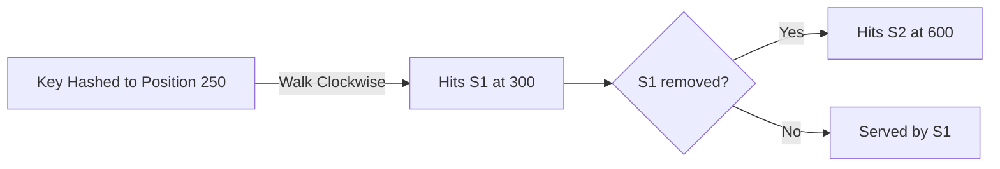
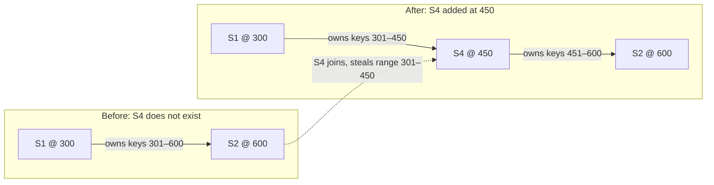
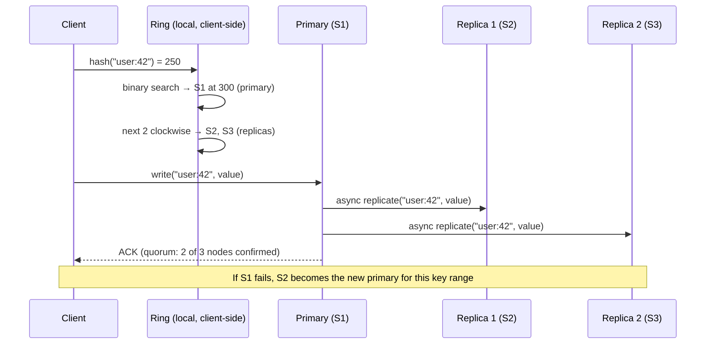

---

## 1. Overview

Every distributed system eventually faces the same hard question: **how do you decide which server handles which data?**

The naive answer — `server = hash(key) % N` — works until you add or remove a server. Then everything reshuffles. At Netflix scale, that means millions of cache misses slamming your database at once. At DynamoDB scale, it means a full data migration. This is the problem consistent hashing solves.

Consistent hashing is a technique that maps data to servers in a way that, when a node is added or removed, **only a small fraction of keys need to be remapped** — roughly `1/N` of total keys. It's the foundational algorithm behind Amazon DynamoDB, Apache Cassandra, Memcached, Akamai's CDN, and Vimeo's load balancers.

By the end of this article, you'll understand how the ring works, why virtual nodes exist, what goes wrong in production, and how to reason about consistent hashing in a system design interview like a staff engineer.

---

## 2. Core Concepts (Step-by-Step)

### 2.1 The Problem: Modulo Hashing Breaks on Rescale

Let's start with what breaks first.

You have 4 cache servers. A key `user:42` hashes to `hash("user:42") = 1829`. You pick a server with `1829 % 4 = 1` → Server 1.

Now you add a 5th server. Same key: `1829 % 5 = 4` → Server 4.

The key moved. But this isn't just one key — it's **almost every key**. When `N` changes to `N+1`, the modulo changes for `N/(N+1)` of all keys — that's ~80% for 4→5 servers.

```
Before (4 servers):   key → hash % 4
After  (5 servers):   key → hash % 5

~80% of all keys now map to a different server.
Cache hit rate drops to near zero. Database gets hammered.
```

This is the **thundering herd problem** triggered by a capacity change. Consistent hashing solves it.

---

### 2.2 The Hash Ring

The core idea: instead of mapping keys to servers directly, **map both keys and servers onto a circular ring**.

The ring spans a fixed hash space, typically `[0, 2^32 - 1]` for a 32-bit hash. Think of it as a clock face with 4 billion positions.

```
                    0 / 2^32
                        │
              S3 ───────┤──────── S0
             /          │          \
           S3           │           S0
           │       Hash Ring        │
           S2           │           S1
             \          │          /
              S2 ───────┤──────── S1
                        │
                   2^32 / 2
```

**Placing servers on the ring:**
- Hash each server's identifier (IP, hostname, ID) → place it at that position on the ring
- `hash("server-0") = 100` → Server 0 sits at position 100
- `hash("server-1") = 300` → Server 1 sits at position 300

**Placing keys on the ring:**
- Hash the key the same way → find its position on the ring
- Walk **clockwise** until you hit a server → that server owns this key

```
Ring positions (simplified, out of 1000):

S0 = 100
S1 = 300  
S2 = 600
S3 = 850

key "user:42" hashes to 250 → walk clockwise → hits S1 at 300
key "order:9" hashes to 700 → walk clockwise → hits S3 at 850
key "item:5"  hashes to  20 → walk clockwise → hits S0 at 100
```

---

### 2.3 Adding and Removing Nodes

This is where consistent hashing shines.

**Adding a node (S4 at position 450):**

```
Before: S2 owns keys [301 → 600]
After:  S4 owns keys [301 → 450]
        S2 owns keys [451 → 600]

Only keys in [301 → 450] move. Everything else stays.
```

**Removing a node (S1 at position 300):**

```
Before: S1 owns keys [101 → 300]
After:  S0 owns keys [101 → 300]  (inherits S1's range)

Only S1's keys move. Everything else stays.
```

In both cases, only `1/N` of keys are affected — not the full keyspace.



*When a node is removed, only its keys cascade to the next node clockwise.*

Here's another way to visualize the key range split when a new node joins:



*Only the keys in the range [301–450] migrate to S4. S2 keeps everything else.*

---

### 2.4 The Problem With Basic Consistent Hashing: Uneven Distribution

Here's the gotcha nobody talks about in intro tutorials.

With only 4 real servers, you need 4 points on the ring. But **hash functions don't guarantee even spacing**. You might end up with:

```
S0 = 50
S1 = 55     ← S1 only owns positions 51–55 (almost nothing)
S2 = 800
S3 = 850    ← S2 owns positions 56–800 (massive range, hotspot)
```

Server S2 handles 75% of traffic. This is exactly the load imbalance you were trying to avoid.

---

### 2.5 Virtual Nodes (vnodes): The Production Fix

The solution: instead of placing each server once on the ring, place it **many times** using multiple hash seeds.

```
Physical server S0 → vnodes at positions: 50, 320, 670, 910, ...
Physical server S1 → vnodes at positions: 90, 410, 750, 180, ...
Physical server S2 → vnodes at positions: 130, 500, 820, 250, ...
```

Now each physical server owns many small, scattered ranges. The distribution evens out as vnode count increases.

```
             0
         ────┬────
        S2   │   S1
       S0    │    S0
      S1     │     S2
     S2      │      S1
    ─────────┼─────────
     S0      │      S0
      S1     │     S2
       S2    │    S1
        S0   │   S0
         ────┴────
           2^32
```

*Each server appears multiple times (vnodes). The ring is now evenly distributed.*

**How many vnodes?** Cassandra uses 256 vnodes per node by default. DynamoDB uses a proprietary variant. More vnodes = better balance, but more metadata overhead.

> 💡 **Staff-level insight:** Virtual nodes also help with **heterogeneous hardware**. If Server A has 2x the RAM/CPU of Server B, give it 2x the vnodes. It'll naturally own 2x the keyspace with no special logic in the lookup path.

---

### 2.6 Go Implementation: The Basics

```go
package consistenthash

import (
	"crypto/sha256"
	"encoding/binary"
	"fmt"
	"sort"
	"sync"
)

type Ring struct {
	mu       sync.RWMutex
	vnodes   int            // number of virtual nodes per physical node
	ring     []uint32       // sorted hash positions on the ring
	nodeMap  map[uint32]string // position → physical node name
}

func New(vnodes int) *Ring {
	return &Ring{
		vnodes:  vnodes,
		nodeMap: make(map[uint32]string),
	}
}

// hash returns a uint32 position on the ring for the given key.
// SHA-256 is used here for clarity. In production, prefer a non-cryptographic
// hash like Murmur3 or xxHash — they are 5–10x faster with equivalent
// distribution quality. Cryptographic strength is not needed for ring routing.
func hash(key string) uint32 {
	h := sha256.Sum256([]byte(key))
	// Use first 4 bytes as uint32
	return binary.BigEndian.Uint32(h[:4])
}

// AddNode places a physical node on the ring as `vnodes` virtual points
func (r *Ring) AddNode(node string) {
	r.mu.Lock()
	defer r.mu.Unlock()

	for i := 0; i < r.vnodes; i++ {
		// Each vnode gets a unique key: "node-0", "node-1", ...
		vnodeKey := fmt.Sprintf("%s-%d", node, i)
		pos := hash(vnodeKey)
		r.ring = append(r.ring, pos)
		// NOTE: If two vnodes hash to the same position, this silently overwrites
		// the previous entry in nodeMap, leaving a phantom position in r.ring.
		// In production, use a uint64 hash space to reduce collision probability,
		// or probe pos+1, pos+2, ... on collision to find a free slot.
		r.nodeMap[pos] = node
	}

	// Keep the ring sorted — binary search requires sorted order
	sort.Slice(r.ring, func(i, j int) bool {
		return r.ring[i] < r.ring[j]
	})
}

// RemoveNode removes all vnodes for a physical node
func (r *Ring) RemoveNode(node string) {
	r.mu.Lock()
	defer r.mu.Unlock()

	for i := 0; i < r.vnodes; i++ {
		vnodeKey := fmt.Sprintf("%s-%d", node, i)
		pos := hash(vnodeKey)
		delete(r.nodeMap, pos)

		// Remove pos from the ring slice
		idx := sort.Search(len(r.ring), func(j int) bool {
			return r.ring[j] >= pos
		})
		if idx < len(r.ring) && r.ring[idx] == pos {
			r.ring = append(r.ring[:idx], r.ring[idx+1:]...)
		}
	}
}

// Get returns the node responsible for the given key.
// It walks clockwise from the key's hash position to find the next node.
func (r *Ring) Get(key string) string {
	r.mu.RLock()
	defer r.mu.RUnlock()

	if len(r.ring) == 0 {
		return ""
	}

	pos := hash(key)

	// Binary search: find the first ring position >= pos
	idx := sort.Search(len(r.ring), func(i int) bool {
		return r.ring[i] >= pos
	})

	// Wrap around: if we're past the last node, go back to the first
	if idx == len(r.ring) {
		idx = 0
	}

	return r.nodeMap[r.ring[idx]]
}
```

```go
// Usage example
func main() {
	ring := consistenthash.New(150) // 150 vnodes per server

	ring.AddNode("server-0")
	ring.AddNode("server-1")
	ring.AddNode("server-2")

	keys := []string{"user:42", "order:9", "item:5", "session:abc"}
	for _, key := range keys {
		fmt.Printf("key %q → %s\n", key, ring.Get(key))
	}

	// Remove a node — only ~33% of keys remap
	ring.RemoveNode("server-1")
	fmt.Println("\nAfter removing server-1:")
	for _, key := range keys {
		fmt.Printf("key %q → %s\n", key, ring.Get(key))
	}
}
```

---

### 2.7 Replication: The Next Layer

Real distributed databases don't just store one copy. DynamoDB and Cassandra use consistent hashing for **replication** too: a key is stored on the `N` clockwise successors of its primary position on the ring (where `N` is the replication factor).

```
Ring: [S0, S1, S2, S3] with replication factor = 3

key "user:42" → primary: S1
                replica 1: S2
                replica 2: S3

If S1 fails, reads/writes automatically go to S2 or S3.
```

This gives you **fault tolerance built directly into the routing layer** — no separate leader election needed for read availability.

Here's what a client request looks like end-to-end with replication:



*The client computes which node to contact entirely client-side — no central coordinator involved.*

---

### 2.8 Behavior at Scale: 10 → 100 → 1000 Nodes

Consistent hashing doesn't behave identically at every scale. Here's what changes:

| Scale            | Ring metadata                      | Gossip overhead                                 | Vnode impact                                     | Notes                                               |
| ---------------- | ---------------------------------- | ----------------------------------------------- | ------------------------------------------------ | --------------------------------------------------- |
| **10 nodes**     | Trivial — 10 × 256 = 2,560 entries | Negligible                                      | Matters less; randomness still helps             | Good match for rendezvous hashing too               |
| **100 nodes**    | 100 × 256 = 25,600 entries         | Low — gossip converges in seconds               | Essential for even distribution                  | Consistent hashing clearly wins over rendezvous     |
| **1,000 nodes**  | 1,000 × 256 = 256,000 entries      | Starts to matter — gossip round trips           | Ring state is MBs; needs efficient serialization | O(N) rendezvous lookup is ~unacceptable here        |
| **10,000 nodes** | Millions of entries                | Significant; partition detection is non-trivial | Vnode count may need tuning downward             | DynamoDB uses a central control plane at this scale |

> 💡 **Staff-level insight:** Cassandra's gossip protocol uses a bounded fanout (each node gossips with 3 peers per round). Even at 1,000 nodes, ring state converges in O(log N) rounds — roughly 10 rounds for 1,000 nodes. But each round carries the full token ring, so the **payload size** is the real concern, not the convergence speed. Cassandra compresses the token metadata and sends diffs. Know this distinction in interviews.

---

## 3. Use Cases

### 3.1 Distributed Caches (Memcached, Redis Cluster)

The original killer use case. When Facebook ran thousands of Memcached servers, they needed a way to route `GET user:42` to the same cache server every time — without a central directory. Consistent hashing let clients independently compute the right server with no coordination.

**Problem it solves:** Cache invalidation is hard. Cache *location* shouldn't be.

### 3.2 Distributed Databases (DynamoDB, Cassandra)

Amazon DynamoDB's 2007 paper (Dynamo: Amazon's Highly Available Key-value Store) is the canonical reference for consistent hashing in production. Each partition key is hashed onto the ring. VNodes (called "preference lists" in Dynamo) determine replication.

Cassandra uses the same model with a configurable partitioner (`Murmur3Partitioner` is default — fast, low collision).

### 3.3 CDNs and Load Balancing (Akamai, Nginx, HAProxy)

When a user requests `video.example.com/clip/123`, the CDN edge needs to route that request to a **consistent** cache node — so the video is already warm. Consistent hashing ensures `clip/123` always goes to the same edge cache server unless topology changes.

**Nginx uses consistent hashing** for upstream load balancing:
```nginx
upstream backend {
    consistent_hash $request_uri;
    server backend1.example.com;
    server backend2.example.com;
    server backend3.example.com;
}
```

**Envoy (used in Kubernetes service meshes)** exposes a `ring_hash` load balancing policy for gRPC and HTTP backends. When session affinity matters — e.g., routing all requests for a given `user_id` to the same upstream for in-memory state — Envoy's `ring_hash` policy applies consistent hashing directly at the sidecar proxy layer, with no application-layer changes needed.

### 3.4 Sharding at the Application Layer

Services that shard Postgres or MySQL often use consistent hashing in the connection pool layer to route `user_id=42` to shard 3 regardless of how many total shards exist, allowing live resharding with minimal disruption.

---

## 4. Gotchas

### 4.1 Hot Spots Despite Vnodes

Even with 150 vnodes, if your key distribution is skewed — e.g., 90% of your traffic is for a single user ID — one physical server still gets hammered. Consistent hashing distributes keys evenly, not traffic. **Hotkeys require application-level mitigation** (key suffix randomization, local fan-out, separate fast path).

> 💡 **Staff-level insight:** Cassandra adds a `BYPASS CACHE` hint for known hotkeys in CQL. DynamoDB has adaptive capacity and DAX for this exact problem. The ring doesn't know about access frequency — only key count.

### 4.2 Cascading Failures During Node Removal

When a node is removed, all its keys shift to its clockwise successor. Under normal conditions this is fine. But if that successor is **already under high load**, the sudden extra load can cause it to fail — which shifts its keys to *its* successor, and so on. This is a **cascade failure** pattern unique to ring topologies.

**Mitigation:** Shed load gracefully with backpressure. In Cassandra, hinted handoff and repair processes handle this. In application-level caches, accept a short window of cache misses rather than overloading successors.

### 4.3 Rebalancing Is Not Instant

Adding a node means you need to **transfer data** from existing nodes to the new one. Until that transfer completes, the new node either serves stale data or causes cache misses. Cassandra calls this "bootstrapping" and it can take minutes to hours for large datasets.

**Implication:** Never add 5 nodes at once to a production ring under pressure. Add one at a time and let rebalancing complete.

To understand *why* this takes so long: Cassandra rate-limits data streaming via `stream_throughput_outbound_megabits_per_sec` (default: 200 Mbps). For a 1 TB node, that's roughly **13 hours** at full speed — and in practice, streaming competes with live traffic, so it's slower. You can raise this limit for faster bootstrapping, but you risk impacting read/write latency during the rebalance window. Always benchmark this in a staging environment first.

### 4.4 Hash Collisions on the Ring

Two different nodes hashing to the same ring position. Rare with 32-bit hashes and a handful of servers, but non-zero. Use 64-bit or higher hash spaces in production, or detect and handle collisions explicitly.

### 4.5 The Monotonic Keys Problem

If your keys are sequential integers (`order:1`, `order:2`, ...) and your hash function maps them sequentially, you can get clustering. Use a hash function that's designed to spread sequential keys (Murmur3, xxHash) rather than MD5 or simple CRC.

### 4.6 Configuration Drift

When your ring configuration is stored separately from application code, different deployments may have different ring states. Client A thinks Server 2 owns key X; Client B thinks Server 3 does. This leads to **split-brain cache** scenarios. Always serialize ring state changes through a single control plane (ZooKeeper, etcd, a config service).

**What does config drift look like in production?** It's subtle. You won't get an error — you'll get a **cache miss spike with no corresponding capacity change**. Client A writes `user:42` to Server 2. Client B (with stale ring state) reads `user:42` from Server 3, gets a miss, falls through to the database. Your cache hit rate drops from 95% to 70%, your database CPU spikes, and nothing in your logs explains why. The tell is correlating the drift timestamp with a deployment that rolled out a new ring config without a coordinated cutover.

### 4.7 Monitoring Your Ring in Production

Consistent hashing is invisible when it works. Here's what to watch so you know when it doesn't:

- **Key distribution std dev per node** — compute the number of keys owned by each physical node every N minutes. Alert when any node holds more than 2× the expected average (`total_keys / node_count`). High std dev with vnodes means a hash function problem or collision clustering.
- **Ring membership change events** — emit an audit log event whenever a node joins or leaves. An unexpected change (not triggered by a deployment) indicates config drift or a rogue client with a different ring state.
- **P99 request latency per node** — consistent hashing distributes *keys*, not *traffic volume*. One node can hold an even share of keys but receive 10× the requests if those keys are hot. P99 divergence between nodes is your hotspot canary.
- **Rebalancing progress during bootstrapping** — track `% of key ranges transferred` for a new node joining. If progress stalls, the new node is likely overloaded or the streaming rate limit is too conservative.
- **Debug it at 2 AM (cascade failure):** A node removal triggers a cascade. Your monitoring shows: (1) Node X disappears from the ring, (2) Node Y's CPU spikes to 100% within 30 seconds, (3) Node Y's P99 latency crosses 500ms, (4) Node Y starts failing health checks and is removed from the ring, (5) Node Z inherits both X's and Y's ranges. Run `nodetool tpstats` on Z immediately — look for `Dropped messages` in `READ` or `MUTATION`. If dropping, shed load via circuit breakers before Z fails too. The fix: re-add X or scale horizontally, not vertically.

---

## 5. Where to Use (and Where NOT to Use)

### Use Consistent Hashing When:

- You need **horizontal scaling** and can't afford full cache invalidation on scale events
- Your data access is **stateful and location-sensitive** (caches, session affinity, sharded databases)
- You need **predictable routing** without a central coordinator
- Your cluster membership **changes dynamically** (nodes join/leave frequently)
- You want **built-in replication routing** in a distributed database

### Do NOT Use Consistent Hashing When:

| Scenario                                 | Why It's Wrong                                          | Better Alternative                                                |
| ---------------------------------------- | ------------------------------------------------------- | ----------------------------------------------------------------- |
| You have 2–3 fixed servers               | The complexity isn't worth it                           | Simple modulo hashing                                             |
| You need strong consistency              | Ring routing doesn't guarantee linearizability          | Raft-based systems (etcd, CockroachDB)                            |
| Access patterns are highly skewed        | Consistent hashing distributes keys, not traffic volume | Application-level shard weights + rate limiting                   |
| Your data has locality requirements      | Ring ignores geographic or rack awareness natively      | DynamoDB's partition key + sort key; Cassandra token-aware policy |
| You need ACID transactions across shards | Consistent hashing routes, it doesn't coordinate        | Two-phase commit, distributed sagas                               |

---

## 6. Versus (Comparisons)

### Consistent Hashing vs. Modulo Hashing

| Aspect                    | Modulo Hashing (`hash % N`) | Consistent Hashing              |
| ------------------------- | --------------------------- | ------------------------------- |
| Key remapping on scale    | ~80–100% of keys            | ~1/N of keys                    |
| Implementation complexity | Trivial                     | Moderate                        |
| Load balance              | Even (for uniform keys)     | Even with vnodes                |
| Replication support       | Manual                      | Built-in (ring successors)      |
| Node weight support       | None                        | Yes (more vnodes = more weight) |
| Best for                  | Fixed cluster size          | Dynamic cluster membership      |

**Choose modulo hashing when** your cluster is static and simplicity matters more than operational flexibility.
**Choose consistent hashing when** your cluster scales dynamically or you need zero-downtime resharding.

---

### Consistent Hashing vs. Rendezvous Hashing (HRW)

Rendezvous hashing (Highest Random Weight) is an alternative invented at the same time as consistent hashing. For each key, every node gets a weight `hash(key, node_id)`, and the node with the highest weight wins.

| Aspect                 | Consistent Hashing                | Rendezvous Hashing (HRW)         |
| ---------------------- | --------------------------------- | -------------------------------- |
| Key remapping on scale | ~1/N keys                         | ~1/N keys (same)                 |
| Load balance           | Requires vnodes for balance       | Naturally uniform without vnodes |
| Lookup cost            | O(log N) binary search            | O(N) — must check all nodes      |
| Replication            | Natural (N successors on ring)    | Needs top-K logic                |
| Operational complexity | Medium (ring state, vnode config) | Low (stateless computation)      |
| Practical adoption     | DynamoDB, Cassandra, Memcached    | Akamai, some CDNs, HAProxy       |

> 💡 **Staff-level insight:** Rendezvous hashing has **no ring state to maintain** — it's a pure calculation. This makes it operationally simpler and eliminates the config drift problem. But at 1000+ nodes, O(N) lookup starts to matter. Consistent hashing scales better for very large clusters. For ≤100 nodes, rendezvous hashing is often the cleaner choice.

**Choose consistent hashing when** your cluster is large (100+ nodes) and you need O(log N) lookups.
**Choose rendezvous hashing when** your cluster is moderate-sized, you want zero ring state management, and lookup latency at scale is acceptable.

---

### Consistent Hashing vs. Directory-Based Sharding

| Aspect                  | Consistent Hashing              | Directory-Based                             |
| ----------------------- | ------------------------------- | ------------------------------------------- |
| Routing mechanism       | Calculated client-side          | Lookup table (central or cached)            |
| Single point of failure | None                            | Central directory is SPOF unless replicated |
| Flexibility             | Limited to hash-based placement | Full control — arbitrary placement          |
| Rebalancing             | Automatic (ring)                | Manual or automated via directory update    |
| Used by                 | Cassandra, DynamoDB             | Vitess (MySQL), Redis Cluster               |

---

### Consistent Hashing vs. Jump Consistent Hashing

Jump consistent hashing (Google, 2014) is a newer algorithm that achieves O(ln N) lookup with **perfect uniform balance** — no vnodes needed.

| Aspect                    | Consistent Hashing              | Jump Consistent Hashing                              |
| ------------------------- | ------------------------------- | ---------------------------------------------------- |
| Lookup cost               | O(log N) binary search          | O(ln N) — ~20 iterations regardless of N             |
| Load balance              | Even with vnodes                | Perfectly uniform by design                          |
| Implementation complexity | Moderate (sorted ring, nodeMap) | Trivial — fits in 10 lines of code                   |
| Node removal flexibility  | **Any** node can be removed     | Only the **most recently added** node can be removed |
| Cluster topology          | Fully dynamic                   | Append-only growth only                              |
| Use case                  | General-purpose, full dynamism  | Scale-out scenarios (cloud auto-scaling)             |

**The key constraint:** Jump consistent hashing only allows removing the highest-numbered node. This makes it unsuitable for arbitrary node failures but excellent for auto-scaling scenarios where you only ever scale up (or scale down from the top).

**Choose jump consistent hashing when** your cluster only grows (or shrinks from the newest node) and you want perfect balance with near-zero implementation overhead.
**Choose ring-based consistent hashing when** any node can fail or be decommissioned at any time.

---

## 7. References

| Resource                                                                                                                          | Type  | Why Read It                                                                   |
| --------------------------------------------------------------------------------------------------------------------------------- | ----- | ----------------------------------------------------------------------------- |
| [Dynamo: Amazon's Highly Available Key-value Store (2007)](https://www.allthingsdistributed.com/files/amazon-dynamo-sosp2007.pdf) | Paper | The canonical production use of consistent hashing. Section 4.2 is must-read. |
| [Consistent Hashing and Random Trees (Karger et al., 1997)](https://dl.acm.org/doi/10.1145/258533.258660)                         | Paper | The original paper that introduced the concept                                |
| [Apache Cassandra Architecture — Partitioners](https://cassandra.apache.org/doc/latest/cassandra/architecture/dynamo.html)        | Docs  | Real-world vnode configuration and tradeoffs                                  |
| [Redis Cluster Specification](https://redis.io/docs/reference/cluster-spec/)                                                      | Docs  | How Redis uses a fixed 16384-slot ring instead of a hash ring                 |
| [Consistent Hashing: Algorithmic Tradeoffs — Dgraph Blog](https://dgraph.io/blog/post/consistent-hashing/)                        | Blog  | Practical comparison of variants                                              |
| [Building a Distributed Cache — GopherCon 2019](https://www.youtube.com/watch?v=MXicpNwF3xI)                                      | Talk  | Go-specific implementation walkthrough                                        |
| [Designing Data-Intensive Applications — Chapter 6](https://dataintensive.net/)                                                   | Book  | Kleppmann's treatment is the clearest I've read                               |

---

## 8. Interview Questions

### Q1: "Design a distributed cache like Memcached. How would you distribute keys across nodes?"

**Key points to cover:**
- Start with modulo hashing → show why it breaks on scale
- Introduce the ring, clockwise lookup, and `1/N` key migration property
- Explain virtual nodes and why they're needed for even distribution
- Discuss replication (N successors) for fault tolerance
- Address hotkeys explicitly — consistent hashing doesn't solve them

**Common mistakes:**
- Jumping to consistent hashing without explaining why modulo hashing fails first
- Forgetting vnodes (interviewers probe this directly)
- Claiming consistent hashing solves hotkeys — it doesn't

**What interviewers are really looking for:** Can you explain *why* the tradeoff exists, not just what the algorithm is? Staff engineers own the reasoning, not just the recipe.

---

### Q2: "What happens to your consistent hashing ring when 30% of nodes go down simultaneously?"

**Key points to cover:**
- Keys owned by failed nodes cascade to their clockwise successors
- With replication factor R, you can tolerate up to R-1 simultaneous failures per key
- Simultaneous mass failure can overload successors → cascade failure
- Mitigations: replication, load shedding, circuit breakers, hinted handoff (Cassandra pattern)
- Monitoring: watch ring health, key distribution metrics, node load variance

**What interviewers are really looking for:** Production failure mode reasoning. Do you think about the steady state or the failure state?

---

### Q3: "Why does Redis Cluster use 16384 hash slots instead of a continuous ring?"

**Key points to cover:**
- 16384 fixed slots = simpler, more predictable rebalancing
- Slot assignments are stored explicitly and gossip-propagated
- Easier to move exactly `N` slots from one node to another
- Trade-off: less granular than a continuous ring, but operationally simpler
- Redis cluster nodes are typically O(10s–100s), not O(1000s), so O(N) slot table is fine

**What interviewers are really looking for:** Depth of knowledge. Anyone can say "consistent hashing." Knowing why Redis chose a different variant shows real understanding.

---

## 9. Staff-Level Preparation Tips

### What to Study Deeper

1. **Read the Dynamo paper in full** — Sections 4.2 (partitioning) and 4.6 (handling failures with hinted handoff). This is the playbook that every distributed database since has copied or adapted.

2. **Understand Cassandra's token ring vs. virtual nodes history** — early Cassandra used manually assigned token ranges. The migration to vnodes is a great case study in operational evolution.

3. **Study rendezvous hashing** — most engineers know consistent hashing but not its alternative. Knowing both lets you demonstrate genuine understanding vs. memorization.

4. **Learn about jump consistent hashing** (Google, 2014) — a newer O(1) algorithm that's simpler than ring-based hashing for certain use cases. [Paper here](https://arxiv.org/abs/1406.2294).

### What to Build

- Implement the ring in Go (the code above is your starting point)
- Simulate adding/removing 1, 5, and 10 nodes and measure what % of keys remap
- Add vnode support and visualize key distribution with different vnode counts (10, 50, 150)
- Build a simple distributed in-memory cache using the ring for routing
- Measure and compare load standard deviation with/without vnodes

### How to Demonstrate Staff-Level Thinking

In design reviews and interviews, staff engineers don't just say "use consistent hashing." They say:

> *"We'll use consistent hashing with 150 vnodes per node because our cluster will scale from 10 to 100 nodes over the next year. The 1/N remapping property means we won't tank our database during scale-out events. We'll need to account for hotkey traffic separately — consistent hashing distributes key count, not request volume — and instrument P99 load per node as a canary for distribution drift. If we hit heterogeneous hardware, we can adjust vnode counts without changing any routing logic."*

That's the level of contextual, trade-off-aware reasoning that separates a staff answer from a senior answer.

### How This Connects to Broader System Design

- **CAP theorem:** Consistent hashing enables AP systems (available + partition tolerant). Understanding which consistency model your ring-based system uses is essential.
- **Data locality:** Vnodes scatter data across the ring, which is great for balance but bad for range queries. This is why Cassandra has a sort key (clustering key) for local ordering within a partition.
- **Gossip protocols:** How does each node know the current ring state? Cassandra uses gossip. DynamoDB uses a centralized control plane. This is a design decision worth discussing.
- **Rebalancing and backpressure:** Rate-limiting data migration during bootstrapping is a real operational concern. Know how your system handles it.

---

*This article is part of the **Distributed Systems Deep Dive** series, covering the foundational algorithms and trade-offs that power systems at Google, Amazon, Netflix, and Stripe scale.*
