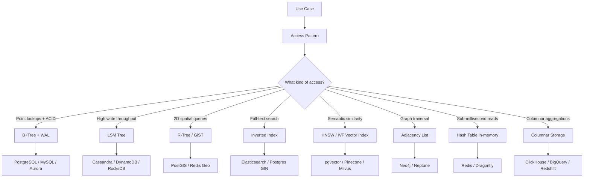
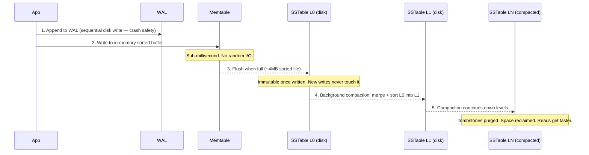
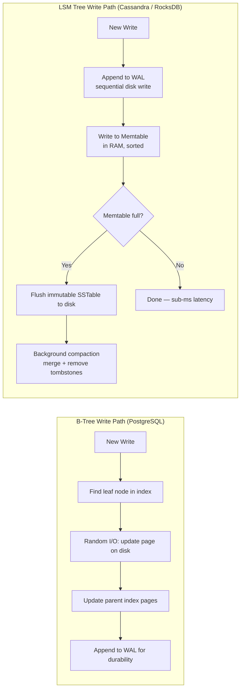

> Every database is built on top of a data structure. Pick the right data structure for your access pattern, and the database choice follows naturally.

---

## Overview

Choosing a database is one of the highest-leverage decisions you will make in a system design. The wrong choice costs months of migration work, 3 AM pages, and performance that no amount of hardware can fix. The right choice makes scaling feel effortless — because the database's fundamental data structure aligns with how your data actually moves.

Most engineers jump straight to "Postgres vs MongoDB?" That is the wrong starting point. Start from the **use case**, identify the **access pattern**, then find the **data structure** that serves that pattern, and let the database choice follow naturally. This guide gives you that repeatable mental model — and pushes you further: for every use case you will see what *bites you in production*, what metrics to watch, and how to defend your choice under pressure in a staff-level system design interview. By the end you will be able to explain not just *which* database to use, but *why* the underlying data structure makes it the right fit, and *when* the operational cost of adding another database to the stack is actually justified.

---

## The Mental Model

Most engineers jump straight to "should I use Postgres or MongoDB?" — that is the wrong starting point. Start from the **use case**, figure out the **access pattern**, then find the **data structure** that serves that pattern best, and finally pick the **database** that implements it well.

```
Use Case → Access Pattern → Data Structure → Database
```

This is the single most important framework for database selection in system design interviews.



*Start from your use case — the data structure determines the database, not the other way around.*

---

## Use Cases, Data Structures, and Databases

### 1. Find the Nearest Driver (Uber, Lyft, DoorDash)

**Access pattern:** Given a GPS coordinate, find all drivers within 2 km — fast.

**Why it is hard:** Regular B-Tree indexes work on one dimension (sort by column A). But location has two dimensions — latitude and longitude. You need to search both at once.

**Data structure: R-Tree (Region Tree)**
- Divides 2D space into nested bounding rectangles
- Each rectangle holds a group of nearby points
- Query "find all points within this box" is O(log n + k) where k is the number of results

**Database choices:**

| Database                    | How it uses R-Tree                                                                                                    |
| --------------------------- | --------------------------------------------------------------------------------------------------------------------- |
| **PostgreSQL + PostGIS**    | `CREATE INDEX ON drivers USING GIST(location)` — GIST index is an R-Tree variant                                      |
| **Redis (with geospatial)** | `GEOADD` / `GEOSEARCH` — uses a sorted set with geohash encoding (not a pure R-Tree, but same idea: spatial indexing) |
| **MongoDB**                 | `2dsphere` index — uses S2 geometry cells internally                                                                  |
| **Elasticsearch**           | `geo_point` field with geo-distance queries                                                                           |

**Interview tip:** Mention PostGIS if strong consistency matters (ride matching). Mention Redis geo if you need sub-millisecond reads and can tolerate eventual consistency.

**Go example — PostGIS nearby driver query:**

```go
package main

import (
	"context"
	"fmt"

	"github.com/jackc/pgx/v5"
)

type Driver struct {
	ID        int64
	Latitude  float64
	Longitude float64
	Distance  float64 // meters
}

// findNearbyDrivers finds all available drivers within radiusMeters of the given point.
// Uses PostGIS ST_DWithin on a GiST index — this is O(log n + k), not a full table scan.
// The GiST index stores R-Tree bounding boxes, so PostGIS prunes entire spatial regions
// before testing individual points. Without the index, this would be a sequential scan
// comparing every driver's location against the query point.
func findNearbyDrivers(ctx context.Context, conn *pgx.Conn, lat, lng, radiusMeters float64) ([]Driver, error) {
	// ST_MakePoint(lng, lat) — PostGIS uses longitude FIRST, then latitude (x, y order).
	// Casting to ::geography means distances are in meters on the Earth's surface.
	// ST_DWithin with geography uses the GiST index automatically.
	query := `
		SELECT
			id,
			ST_Y(location::geometry) AS latitude,
			ST_X(location::geometry) AS longitude,
			ST_DistanceSphere(location::geometry, ST_MakePoint($2, $1)) AS distance_meters
		FROM drivers
		WHERE
			status = 'available'
			AND ST_DWithin(
				location,
				ST_MakePoint($2, $1)::geography,
				$3
			)
		ORDER BY distance_meters ASC
		LIMIT 20`

	rows, err := conn.Query(ctx, query, lat, lng, radiusMeters)
	if err != nil {
		return nil, fmt.Errorf("nearby drivers query: %w", err)
	}
	defer rows.Close()

	var drivers []Driver
	for rows.Next() {
		var d Driver
		if err := rows.Scan(&d.ID, &d.Latitude, &d.Longitude, &d.Distance); err != nil {
			return nil, err
		}
		drivers = append(drivers, d)
	}
	return drivers, rows.Err()
}
```

*The GiST index on the `location` geography column makes this query fast even with millions of drivers. Without it: full sequential scan, O(n). With it: R-Tree prunes to a bounding box first, O(log n + k).*

---

### 2. Twitter Home Timeline (Write-Heavy Social Feed)

**Access pattern:** Millions of users tweet every second. Each tweet fans out to potentially millions of followers. Reads (loading your timeline) should be fast.

**Why it is hard:** A B-Tree-based relational DB would need to update indexes on every write and run expensive joins on every read ("get all tweets from people I follow, sorted by time"). At Twitter scale, this falls apart.

**Data structure: LSM Tree (Log-Structured Merge Tree)**
- Writes go to an in-memory buffer (memtable), then flush to sorted files on disk (SSTables)
- Writes are sequential (append-only), so they are extremely fast — no random disk I/O
- Reads merge results from multiple levels, which is slower than a B-Tree read, but you can add bloom filters to skip irrelevant files
- Trade-off: **fast writes, slightly slower reads** — perfect for write-heavy workloads

**Database choices:**

| Database             | Notes                                                                                   |
| -------------------- | --------------------------------------------------------------------------------------- |
| **Apache Cassandra** | LSM Tree storage, designed for high write throughput, used by Twitter, Netflix, Discord |
| **Amazon DynamoDB**  | Managed LSM-based key-value store, predictable latency at scale                         |
| **ScyllaDB**         | Cassandra-compatible but written in C++ — 10× better throughput per node                |
| **RocksDB**          | Embeddable LSM engine — used as the storage layer inside many other databases           |

**Interview tip:** Twitter actually uses a fan-out-on-write approach — when you tweet, it writes your tweet into every follower's timeline cache (Cassandra/Redis). For celebrities with 50M followers, they switch to fan-out-on-read (pull model) to avoid writing 50M rows.

> 💡 **Staff-level insight:** The fan-out-on-write vs. fan-out-on-read trade-off is not a binary choice — it is a **per-user threshold decision**. Regular users (< ~10K followers) get fan-out-on-write: tweet is written into every follower's timeline cache at write time. Celebrities (50M followers) would generate 50M Cassandra writes per tweet — instead, their tweets are fetched at read time and merged with the pre-built timeline. The switching threshold is tuned per system, typically 10K–500K followers. The non-obvious part: the merge at read time must happen under the read latency budget, which means caching the celebrity's latest tweets separately and doing the merge in application memory, not in the database. Getting this wrong means either massive write amplification (fan-out-on-write for celebrities) or slow timelines (fan-out-on-read for everyone).

**LSM Tree write path — why writes are so fast:**



*The key insight: writes only touch the WAL (sequential) and memtable (in-memory). Disk I/O happens asynchronously during compaction — never in the write hot path.*

**Can we do this in Postgres?** At small scale (a few thousand users), yes — a `tweets` table with a B-Tree index on `(user_id, created_at)` handles timeline reads fine. Postgres can sustain ~5-10K writes/sec on a single node with proper tuning. But Postgres uses a B-Tree (random I/O on writes) while Cassandra uses an LSM tree (sequential I/O). At >50K writes/sec with fan-out, B-Tree write amplification becomes the bottleneck. Once you need multi-node horizontal write scaling, Postgres has no built-in answer — you would need Citus for sharding, and even then, the write pattern (fan-out to millions of timelines) is what LSM trees are specifically built for.

---

### 3. Google Search / Full-Text Search (Elasticsearch Use Case)

**Access pattern:** User types "best pizza near me" and expects ranked results in under 100ms across billions of documents.

**Why it is hard:** You cannot scan every document. You need to instantly find "which documents contain word X?"

**Data structure: Inverted Index**
- Like the index at the back of a textbook — maps each word to the list of documents containing it
- Query "best AND pizza" = intersect the two posting lists
- Add TF-IDF or BM25 scoring for ranking

**Database choices:**

| Database                    | Notes                                                                                                |
| --------------------------- | ---------------------------------------------------------------------------------------------------- |
| **Elasticsearch**           | Distributed inverted index built on Apache Lucene. The default choice for full-text search           |
| **Apache Solr**             | Also built on Lucene, older but battle-tested                                                        |
| **PostgreSQL**              | `tsvector` + `GIN` index — good enough for moderate-scale full-text search without a separate system |
| **Meilisearch / Typesense** | Lightweight alternatives optimized for typo-tolerant instant search                                  |

**Interview tip:** If the question is "add search to an existing system," start with Postgres GIN indexes. If the question is "build a search engine," go Elasticsearch.

**Can we do this in Postgres?** Yes — and for many applications, you should. `tsvector` + `GIN` index gives you full-text search with stemming, ranking (`ts_rank`), phrase matching, and prefix search. For a product catalog with a few million rows, Postgres full-text search performs well and avoids running a separate Elasticsearch cluster. It breaks down when you need: typo tolerance (Elasticsearch handles "pizzza" → "pizza" natively), complex faceted search (filters + aggregations + highlights together), or >10M documents where Lucene's inverted index implementation is simply more optimized. Rule of thumb: if your search box is a feature of your app, Postgres is fine. If search IS your app, use Elasticsearch.

---

### 4. Social Graph (Facebook "People You May Know", LinkedIn Connections)

**Access pattern:** "Find friends of friends," "shortest path between two users," "who are the mutual connections?" — these are **graph traversals**.

**Why it is hard:** In a relational database, "friends of friends" is a self-join on a huge table. "Friends of friends of friends" is a three-way self-join. Each hop multiplies the cost. At Facebook scale (2B+ users), this is a non-starter.

**Data structure: Adjacency List with Index-Free Adjacency**
- Each node stores direct pointers to its neighbors (no index lookup needed to traverse an edge)
- Traversal cost is proportional to the number of edges you visit, not the total graph size
- This is what makes multi-hop queries fast

**Database choices:**

| Database           | Notes                                                                |
| ------------------ | -------------------------------------------------------------------- |
| **Neo4j**          | Most popular graph database, Cypher query language, ACID-compliant   |
| **Amazon Neptune** | Managed graph DB, supports both property graph and RDF               |
| **JanusGraph**     | Open-source, horizontally scalable, built on top of Cassandra/HBase  |
| **Dgraph**         | Distributed graph DB written in Go, uses GraphQL-like query language |

**Interview tip:** Most real companies (including Facebook) use a custom graph layer on top of a relational or key-value store, not a dedicated graph database. But in interviews, Neo4j/Neptune is the right answer because it shows you understand graph access patterns.

**Can we do this in Postgres?** Partially. Postgres supports `WITH RECURSIVE` CTEs, which let you traverse a graph stored in a regular adjacency table (`edges(from_id, to_id)`). For 1-2 hop queries ("friends" or "friends of friends") at moderate scale (<10M edges), this works surprisingly well — add a composite index on `(from_id, to_id)` and you're set. It falls apart at 3+ hops or huge graphs because each hop is a full join, and Postgres has no index-free adjacency — every traversal step hits the B-Tree index. A graph database stores pointers directly on each node, making multi-hop traversal O(edges visited) instead of O(edges visited × log n). For "people you may know" or "shortest path" at LinkedIn/Facebook scale, Postgres is not viable.

---

### 5. Rate Limiter / Leaderboard / Session Store (Redis Use Case)

**Access pattern:** "Has this user exceeded 100 requests in the last minute?" or "Top 10 players by score" — needs microsecond reads/writes on small, frequently updated data.

**Why it is hard:** Disk-based databases add latency (even with SSDs, you're looking at 100μs+). For a rate limiter sitting in the hot path of every API call, you need single-digit microsecond reads.

**Data structure: Hash Table (in-memory) + Skip List (for sorted sets)**
- Hash table gives O(1) key-value lookups
- Skip list gives O(log n) sorted operations — used by Redis for sorted sets (leaderboards, priority queues)
- Everything lives in RAM, so no disk I/O

**Database choices:**

| Database      | Notes                                                                                                                                                                   |
| ------------- | ----------------------------------------------------------------------------------------------------------------------------------------------------------------------- |
| **Redis**     | The standard in-memory data store. Sorted sets, pub/sub, Lua scripting, TTL-based expiry                                                                                |
| **Memcached** | Simpler than Redis — pure key-value cache, no data structures. Use when you only need caching                                                                           |
| **KeyDB**     | Multi-threaded Redis fork — better throughput on multi-core machines                                                                                                    |
| **Dragonfly** | Modern Redis alternative in C++ — uses `io_uring` for kernel-bypass I/O and shared-nothing architecture. Claims 25× better throughput than Redis on multi-core machines |

**Interview tip:** Redis is almost always part of a system design answer — as a cache layer, rate limiter, session store, or pub/sub broker. It is rarely the primary database.

> 💡 **Staff-level insight:** Redis uses a **fork-on-snapshot** model for persistence. When `BGSAVE` runs (RDB snapshot) or AOF rewrite triggers, Redis calls `fork()`. The child process inherits the parent's entire address space via copy-on-write. On a write-heavy instance, every page touched after the fork gets duplicated in physical memory. On a 50GB Redis instance during a write burst, you can instantaneously need close to 100GB of RAM. This is not a Redis bug — it is how Unix `fork()` works. The production fix: deploy on hosts with 2× the Redis dataset size as available RAM, use replicas for snapshotting (not the primary), or run `save ""` to disable RDB and use AOF-only with a smaller `auto-aof-rewrite-percentage`. Missing this causes OOM kills on the Redis primary during peak traffic — one of the most reliable ways to bring down production at 2 AM.

**Go example — Redis sorted set leaderboard:**

```go
package main

import (
	"context"
	"fmt"

	"github.com/redis/go-redis/v9"
)

type GameScore struct {
	PlayerID string
	Score    float64
	Rank     int64
}

// updateScore adds or updates a player's score.
// ZADD is atomic — safe to call from multiple game servers concurrently without a lock.
// The sorted set uses a skip list: O(log n) insert regardless of leaderboard size.
func updateScore(ctx context.Context, rdb *redis.Client, leaderboard, playerID string, score float64) error {
	return rdb.ZAdd(ctx, leaderboard, redis.Z{
		Score:  score,
		Member: playerID,
	}).Err()
}

// getTopN returns the top N players, highest score first.
// ZREVRANGE is O(log n + k) — the skip list index lets Redis jump directly
// to rank 0 without scanning all members, even with 10M players in the set.
func getTopN(ctx context.Context, rdb *redis.Client, leaderboard string, n int64) ([]GameScore, error) {
	results, err := rdb.ZRevRangeWithScores(ctx, leaderboard, 0, n-1).Result()
	if err != nil {
		return nil, fmt.Errorf("leaderboard top %d: %w", n, err)
	}
	scores := make([]GameScore, len(results))
	for i, z := range results {
		scores[i] = GameScore{
			PlayerID: z.Member.(string),
			Score:    z.Score,
			Rank:     int64(i + 1),
		}
	}
	return scores, nil
}

// getPlayerRank returns a specific player's 1-based rank and score.
// ZREVRANK is O(log n) — no full scan needed regardless of leaderboard size.
// This is impossible to replicate efficiently in Postgres without a full window function
// scan, which is O(n) and cannot be indexed.
func getPlayerRank(ctx context.Context, rdb *redis.Client, leaderboard, playerID string) (rank int64, score float64, err error) {
	rank, err = rdb.ZRevRank(ctx, leaderboard, playerID).Result()
	if err != nil {
		return 0, 0, fmt.Errorf("player rank: %w", err)
	}
	score, err = rdb.ZScore(ctx, leaderboard, playerID).Result()
	if err != nil {
		return 0, 0, fmt.Errorf("player score: %w", err)
	}
	return rank + 1, score, nil // convert ZREVRANK 0-based to 1-based
}
```

*The skip list in Redis sorted sets makes `getPlayerRank` O(log n) — retrieving rank from 10M players takes the same time as from 1K players.*

**Can we do this in Postgres?** Not really — this is the one use case where Postgres is the wrong tool. The fundamental problem is latency: Postgres reads go through the buffer pool, disk pages, and MVCC version checks — even with everything cached in shared buffers, you're looking at ~0.5-1ms per query. Redis returns in ~0.1ms because data is always in RAM with no MVCC overhead. For a rate limiter checking every API request, that 5-10× latency difference multiplied by millions of requests matters. Postgres also lacks native TTL (auto-expire keys after N seconds), sorted sets (leaderboards), and pub/sub — which are Redis primitives. You could use `UNLOGGED` tables in Postgres as a crude cache (skip WAL for speed), but you lose durability and still cannot match Redis latency.

---

### 6. Analytics Dashboard (Aggregations Over Billions of Rows)

**Access pattern:** "Total revenue by region for Q3" or "P99 latency per service per hour" — you are reading millions of rows but only a few columns.

**Why it is hard:** Row-oriented databases (MySQL, Postgres) read entire rows from disk even if you only need 2 columns out of 50. For analytics queries that scan millions of rows, this wastes enormous I/O.

**Data structure: Columnar Storage**
- Data is stored column by column instead of row by row
- Query "SUM(revenue) WHERE region = 'US'" only reads the `revenue` and `region` columns — skips all other columns
- Columns compress extremely well because adjacent values are similar (e.g., a column of country codes)

**Database choices:**

| Database            | Notes                                                                                     |
| ------------------- | ----------------------------------------------------------------------------------------- |
| **ClickHouse**      | Open-source columnar DB, extremely fast for aggregation queries, used by Uber, Cloudflare |
| **Apache Druid**    | Real-time analytics on event data, sub-second queries on billions of rows                 |
| **Amazon Redshift** | Managed columnar data warehouse on AWS                                                    |
| **BigQuery**        | Google's serverless columnar warehouse, great for ad-hoc queries                          |
| **DuckDB**          | Embeddable columnar DB — think "SQLite for analytics"                                     |

**Interview tip:** If the question involves dashboards, reporting, or aggregations — say "columnar store." If it involves row-level CRUD — say "row-oriented RDBMS."

**Can we do this in Postgres?** For moderate analytics (millions of rows, a few dashboards), yes. Use materialized views to pre-compute aggregations, `BRIN` indexes for time-range scans (extremely small index for sorted data), and table partitioning by date. Postgres 15+ supports `MERGE` and parallel query execution which helps analytical workloads. But Postgres stores data row-by-row — a query touching 2 columns still reads all 50 columns from disk. ClickHouse stores data column-by-column and compresses each column independently, which means it can scan billions of rows 10-100× faster than Postgres for typical `SELECT col1, SUM(col2) GROUP BY col1` queries. Once your analytics tables exceed ~100M rows or you need sub-second dashboard refreshes across billions of events, move to a columnar store.

---

### 7. Chat Application (WhatsApp, Slack)

**Access pattern:** Messages are written once, read many times, always queried in time order ("show me messages in this chat room from newest to oldest"). Very high write volume.

**Why it is hard:** Messages grow forever. You need fast writes (every message sent by every user) and fast range reads (fetch the latest 50 messages in a chat).

**Data structure: LSM Tree with partition key = chat_id, clustering key = timestamp**
- Same LSM Tree as Twitter use case — fast sequential writes
- Partition by chat_id so all messages in one chat live on the same node
- Cluster by timestamp so time-range queries are a single sequential read

**Database choices:**

| Database      | Notes                                                                         |
| ------------- | ----------------------------------------------------------------------------- |
| **Cassandra** | WhatsApp used Erlang + custom storage, but Cassandra fits the model perfectly |
| **ScyllaDB**  | Discord moved from Cassandra to ScyllaDB for better tail latency              |
| **HBase**     | Facebook Messenger used HBase (LSM-based, runs on HDFS)                       |

**Interview tip:** Mention the partition key design — `(chat_id, message_timestamp)`. This shows you understand data modeling, not just database names.

**Can we do this in Postgres?** For a chat app with <1M users and moderate message volume, Postgres works fine. Create a `messages` table partitioned by `chat_id` range (or hash), with a composite index on `(chat_id, created_at DESC)`. Fetching the latest 50 messages in a chat is a simple index scan. Postgres handles tens of thousands of inserts/sec on good hardware. It starts breaking when: messages grow to billions of rows (B-Tree index maintenance becomes expensive on writes), you need multi-region distribution (Cassandra's leaderless replication handles this natively), or your write throughput consistently exceeds 50K inserts/sec (LSM tree's sequential writes outperform B-Tree's random I/O). Discord started on MongoDB, moved to Cassandra, then to ScyllaDB — not because relational was wrong, but because at trillions of messages the storage engine matters.

---

### 8. E-Commerce Product Catalog (Amazon, Shopify)

**Access pattern:** Products have wildly different attributes — a laptop has RAM and CPU specs, a shirt has size and color, a book has ISBN and author. You need flexible schemas with fast key-value lookups.

**Why it is hard:** In a relational DB, you would either need hundreds of nullable columns (ugly) or an EAV (Entity-Attribute-Value) pattern (slow). You want each product to store only the fields it needs.

**Data structure: B-Tree with document model (JSON/BSON)**
- Documents are stored as flexible JSON-like objects
- B-Tree indexes on common fields (category, price, brand)
- No schema migration needed when you add a new product type

**Database choices:**

| Database               | Notes                                                                                          |
| ---------------------- | ---------------------------------------------------------------------------------------------- |
| **MongoDB**            | Most popular document database, flexible schema, rich query language                           |
| **Amazon DocumentDB**  | MongoDB-compatible managed service on AWS                                                      |
| **Couchbase**          | Document DB with built-in caching layer, good for e-commerce                                   |
| **PostgreSQL (JSONB)** | If you want SQL + flexible schema — `JSONB` columns with GIN indexes are surprisingly powerful |

**Interview tip:** "I would use MongoDB for the product catalog because each product category has different attributes, and a document model handles this naturally without schema migrations." This is a strong, reasoned answer.

**Can we do this in Postgres?** Yes — and this is one of the strongest cases for the Postgres approach. `JSONB` columns with `GIN` indexes give you the same flexible schema as MongoDB while keeping SQL for everything else (transactions, joins, reporting). Store fixed fields as regular columns (`id`, `name`, `price`, `category`) and variable attributes in a `JSONB` column (`specs`). Index specific JSON paths with `CREATE INDEX ON products USING GIN(specs)` or create targeted B-Tree indexes on frequently queried paths like `CREATE INDEX ON products ((specs->>'color'))`. Postgres JSONB is fast for reads and moderate writes. MongoDB's edge shows when: you have very deep or heavily nested documents (BSON handles this more naturally), your write throughput exceeds 100K ops/sec (WiredTiger's LSM-like compression helps), or you want schema validation at the database level (MongoDB's JSON Schema validator is more mature than Postgres CHECK constraints on JSONB).

---

### 9. Time-Series Monitoring (Prometheus, Datadog, IoT Sensors)

**Access pattern:** Write a data point every second for thousands of metrics. Query "average CPU usage for server X between 2pm and 3pm." Old data gets downsampled or deleted.

**Why it is hard:** Traditional databases are not optimized for append-heavy, time-ordered, mostly-immutable data with automatic expiry.

**Data structure: Time-Structured Merge Tree (variation of LSM Tree)**
- Optimized for time-ordered inserts (always appending to the latest time bucket)
- Automatic compaction and downsampling of old data
- Compressed storage — timestamps and metric values compress very well

**Database choices:**

| Database              | Notes                                                                      |
| --------------------- | -------------------------------------------------------------------------- |
| **InfluxDB**          | Purpose-built time-series database, most popular for DevOps metrics        |
| **TimescaleDB**       | PostgreSQL extension — get time-series optimizations with full SQL support |
| **Prometheus**        | Pull-based monitoring system with built-in TSDB, standard for Kubernetes   |
| **QuestDB**           | High-performance TSDB optimized for financial data and IoT                 |
| **Amazon Timestream** | Managed time-series DB on AWS                                              |

**Interview tip:** If the system design question involves monitoring, metrics, or IoT — mention a time-series database. If asked "why not just Postgres?" — explain that TSDB handles automatic data retention, downsampling, and time-bucketed compression out of the box.

**Can we do this in Postgres?** Yes — via TimescaleDB, which is a Postgres extension. You get hypertables (auto-partitioned by time), continuous aggregates (materialized views that refresh incrementally), retention policies (`SELECT drop_chunks('metrics', INTERVAL '30 days')`), and compression (10-20× storage savings on older data). All with full SQL. TimescaleDB handles thousands of inserts/sec and billions of rows comfortably. It breaks when you need >1M inserts/sec sustained — purpose-built TSDBs like QuestDB use memory-mapped append-only storage and column-oriented writes that are fundamentally faster for this pattern. Also, if you don't need SQL and want the simplest monitoring setup, Prometheus with its built-in TSDB is hard to beat for Kubernetes metrics.

---

### 10. URL Shortener / Key-Value Lookups (bit.ly, TinyURL)

**Access pattern:** Write a short-URL → long-URL mapping. Read it back by short URL. Extremely high read volume, simple lookups by key.

**Why it is hard:** It is not hard from a data structure perspective — but at scale (billions of URLs, millions of reads/sec), you need a distributed key-value store that can handle the throughput.

**Data structure: Hash Table (distributed)**
- Simple key → value mapping
- Consistent hashing for distributing keys across nodes
- Read-heavy workload benefits from in-memory caching

**Database choices:**

| Database      | Notes                                                                            |
| ------------- | -------------------------------------------------------------------------------- |
| **DynamoDB**  | Managed, single-digit millisecond reads at any scale                             |
| **Redis**     | In-memory, sub-millisecond reads — use as a cache in front of a persistent store |
| **Cassandra** | If you need both high write and read throughput with tunable consistency         |
| **RocksDB**   | Embedded key-value store, used by many companies as the local storage engine     |

**Can we do this in Postgres?** Easily — and for most URL shorteners, it is the right call. A simple table `urls(short_code VARCHAR PRIMARY KEY, long_url TEXT, created_at TIMESTAMP)` with a B-Tree primary key gives you O(log n) lookups. Postgres handles millions of rows and thousands of reads/sec without breaking a sweat. Add a Redis cache in front for hot URLs and you're covered for most scales. You would only need DynamoDB or Cassandra when: you hit millions of reads/sec that overwhelm a single Postgres node even with read replicas, or you need multi-region active-active writes (DynamoDB global tables handle this natively). For a system design interview, saying "Postgres for storage + Redis as a read-through cache" is a perfectly valid answer for a URL shortener — simpler and easier to operate than DynamoDB.

> 💡 **Staff-level insight:** DynamoDB's throughput is split evenly across partitions. A table provisioned at 1000 WCU with 10 partitions gets 100 WCU per partition. If 80% of your writes land on one partition — because your keys are not uniformly distributed (e.g., all events prefixed with today's date, all orders for a trending product) — that partition becomes a bottleneck even though the table has unused capacity elsewhere. DynamoDB **Adaptive Capacity** detects hot partitions and redistributes capacity automatically, but it is reactive: it takes 5–30 seconds to kick in, which means a traffic spike can still overwhelm a hot partition before Adaptive Capacity responds. The correct fix is key design upfront: add a random suffix (1–10) to hot keys (`product#shoes#3`, `product#shoes#7`), write to all shards, and aggregate on read. This write-sharding pattern is not optional for high-throughput DynamoDB workloads — it is the single most common production failure pattern with DynamoDB.

---

### 11. Payment / Banking System (Stripe, Razorpay)

**Access pattern:** Transfer money from account A to account B. Both the debit and credit must succeed together or both must fail. No partial updates.

**Why it is hard:** You need strong ACID transactions, foreign key constraints, and serializable isolation to prevent double-spending or lost updates.

**Data structure: B+Tree with WAL (Write-Ahead Log)**
- B+Tree keeps data sorted for efficient range scans and exact lookups
- WAL ensures durability — every change is written to the log before it is applied, so the database can recover after a crash
- MVCC (Multi-Version Concurrency Control) allows concurrent readers without blocking writers

**Database choices:**

| Database           | Notes                                                               |
| ------------------ | ------------------------------------------------------------------- |
| **PostgreSQL**     | Gold standard for transactional workloads. ACID, MVCC, extensible   |
| **MySQL (InnoDB)** | Mature, battle-tested, used by Stripe and many banks                |
| **CockroachDB**    | Distributed SQL — Postgres-compatible with global ACID transactions |
| **YugabyteDB**     | Distributed SQL, Postgres-compatible, strong consistency            |
| **Amazon Aurora**  | Managed MySQL/Postgres compatible, 5× throughput of standard RDS    |

**Interview tip:** For anything involving money, always start with a relational database with ACID guarantees. Then explain how you would scale it (read replicas, sharding by user_id, CQRS).

---

### 12. Semantic Search and RAG (AI-Powered Retrieval)

**Access pattern:** User asks "how do I handle authentication in microservices?" and expects results based on **meaning**, not exact keywords. A document about "securing service-to-service calls with JWT tokens" should match — even though it shares no words with the query.

**Why it is hard:** Traditional inverted indexes match words. But "authentication in microservices" and "securing service-to-service calls" share zero keywords. You need to understand that these sentences **mean** the same thing.

**How it works:**
1. An embedding model (like OpenAI's `text-embedding-3-small` or open-source `BGE-M3`) converts text into a high-dimensional vector (e.g., 1536 floats)
2. Similar meanings land near each other in this vector space
3. At query time, convert the question to a vector and find the nearest neighbors

**Data structures:**

- **HNSW (Hierarchical Navigable Small World graph)** — Builds a multi-layer graph where each node connects to its approximate nearest neighbors. Query starts at the top layer (coarse search) and drills down (fine search). Trade-off: high memory usage, but queries are fast (O(log n)) and recall is excellent. Most popular choice.
- **IVF (Inverted File Index)** — Clusters vectors into buckets using k-means. At query time, only search the closest few buckets instead of all vectors. Trade-off: lower memory than HNSW, but you must choose the number of clusters and how many to probe — tuning matters.
- **Flat / brute-force** — Scan every vector. Perfect recall, but O(n). Only works for small datasets (<100K vectors).

**Database choices:**
| Database     | Notes                                                                                                                                                              |
| ------------ | ------------------------------------------------------------------------------------------------------------------------------------------------------------------ |
| **pgvector** | PostgreSQL extension — add `vector` column, create HNSW or IVF index, query with `<=>` (cosine distance). Best when you already run Postgres and have <10M vectors |
| **Pinecone** | Fully managed vector database. Zero operational burden. Pay per query. Good for teams that want to ship fast                                                       |
| **Milvus**   | Open-source, horizontally scalable. Handles billions of vectors. Used by large AI teams                                                                            |
| **Weaviate** | Open-source vector DB with built-in hybrid search (keyword + vector). Good developer experience                                                                    |
| **Qdrant**   | Open-source, written in Rust. Strong filtering support (combine vector search with metadata filters)                                                               |
| **Chroma**   | Lightweight, embedded vector store. Good for prototyping and small RAG applications                                                                                |

**Keyword search vs. Semantic search:**
|                                    | Keyword (Inverted Index)                   | Semantic (Vector Index)                                           |
| ---------------------------------- | ------------------------------------------ | ----------------------------------------------------------------- |
| **Matches on**                     | Exact words                                | Meaning / context                                                 |
| **"authentication microservices"** | Finds docs with those words                | Finds docs about securing services — even with different words    |
| **Precision**                      | High — if words match, it is relevant      | Can return false positives (similar embeddings, different intent) |
| **Best for**                       | Known-term search, log search, code search | Natural language questions, chatbot retrieval, recommendation     |

**Interview tip:** Many modern systems use **hybrid search** — combine BM25 keyword scores with vector similarity scores, then re-rank. This gives you the precision of keyword search and the recall of semantic search. Mention this when designing any search or RAG system.

**Can we do this in Postgres?** Yes — pgvector makes Postgres a legitimate vector database. `CREATE EXTENSION vector`, add a `vector(1536)` column, create an HNSW index (`CREATE INDEX ON docs USING hnsw(embedding vector_cosine_ops)`), and query with `ORDER BY embedding <=> query_vector LIMIT 10`. You get vector search + full-text search + relational joins + ACID transactions in one database. For a RAG application with <5M vectors, pgvector performs well (sub-50ms queries) and eliminates the operational cost of running Pinecone or Milvus. The break point: >10M vectors where HNSW index build time and memory pressure start hurting, >50M vectors where purpose-built vector DBs use quantization (e.g., Product Quantization, binary vectors) and GPU acceleration that pgvector does not support, or when you need multi-tenant vector isolation with per-tenant index tuning. For most RAG prototypes and production apps with moderate corpus sizes, pgvector is the right default.

---

### 13. Real-Time Collaborative Editing (Google Docs, Figma, Notion)

**Access pattern:** Multiple users edit the same document at the same time. Every keystroke must be reflected on all screens within milliseconds. No one's edits should be lost, even if two people edit the same paragraph simultaneously.

**Why it is hard:** This is not a storage problem — it is a **conflict resolution** problem. When User A inserts "hello" at position 10 and User B deletes character at position 5 at the same instant, the system must merge both operations into a consistent result. Traditional database locks (row-level locking, MVCC) cannot handle character-by-character concurrent editing at this speed.

**Data structures / algorithms:**

- **OT (Operational Transformation)** — Each edit is an "operation" (insert char at position X, delete char at position Y). A central server transforms each incoming operation against concurrent ones so they produce the same result regardless of arrival order. Used by Google Docs. Requires a central server to serialize operations — hard to make truly peer-to-peer.

- **CRDTs (Conflict-free Replicated Data Types)** — Each character (or block) gets a unique, globally-ordered ID. Merging is purely mathematical — no central server needed. Any two replicas that have seen the same set of operations will converge to the same state. Used by Figma (custom CRDT), Yjs, Automerge. Trade-off: higher memory overhead (each character carries metadata), but works peer-to-peer and offline.

|                     | OT                                             | CRDT                                                  |
| ------------------- | ---------------------------------------------- | ----------------------------------------------------- |
| **Central server?** | Yes (needed to transform operations)           | No (peer-to-peer possible)                            |
| **Offline editing** | Hard — needs server to resolve                 | Natural — merge when reconnected                      |
| **Memory overhead** | Lower                                          | Higher (metadata per character)                       |
| **Complexity**      | Hard to implement correctly (O(n²) edge cases) | Mathematically sound, but data structures are complex |
| **Used by**         | Google Docs, Microsoft Office Online           | Figma, Yjs, Automerge, Apple Notes                    |

**Database / infrastructure choices:**

| Tool                                  | Role                                                                                             |
| ------------------------------------- | ------------------------------------------------------------------------------------------------ |
| **Yjs**                               | Open-source CRDT library for JavaScript — most popular choice for building collaborative editors |
| **Automerge**                         | CRDT library focused on JSON-like documents — good for structured data collaboration             |
| **Liveblocks**                        | Managed real-time collaboration infrastructure — handles presence, conflict resolution, storage  |
| **Firebase Realtime Database**        | Google's managed real-time sync DB — good for simpler collaborative features (cursors, presence) |
| **Redis Pub/Sub or WebSocket server** | Broadcast layer — every edit goes to all connected clients in real-time                          |

**Storage backend:** The CRDT/OT layer handles real-time conflict resolution, but you still need a persistent store for the document. Common patterns:
- Periodic snapshots to **PostgreSQL** or **S3** (Google Docs approach)
- Append-only operation log in **Kafka** or **Cassandra** with periodic compaction
- Document store like **MongoDB** for the latest merged state

**Interview tip:** The key insight is that collaborative editing needs a **conflict resolution layer** (OT or CRDT) on top of any database. No database alone solves this. When asked about designing Google Docs, spend most time on the OT/CRDT choice, not the storage backend.

**Can we do this in Postgres?** Postgres cannot replace the CRDT/OT layer — no database can, because conflict resolution is an application-level concern. But Postgres is an excellent **storage backend** for collaborative apps. Store document snapshots as `JSONB`, use `LISTEN/NOTIFY` for lightweight real-time change notifications to connected clients (works for <1000 concurrent connections per document), and keep an append-only `operations` table for the OT/CRDT operation log. Yjs has an official `y-postgresql` provider. The combination of Yjs (conflict resolution) + Postgres (persistence) + WebSocket server (broadcast) is a production-ready stack for collaborative editing without introducing Kafka or Cassandra.

---

## The Power of the Extension Ecosystem (Why Postgres Does Everything)

Before you add a new database to your stack, ask: "Can Postgres already do this?"

PostgreSQL has evolved from a relational database into a **platform** with extensions that cover nearly every data model. For many startups and mid-scale systems, a single Postgres instance (or a managed service like Supabase, Neon, or Aurora) can replace 3-4 specialized databases.

### What Postgres Can Replace

| Specialized DB             | Postgres Extension                                 | How                                                                                                                      |
| -------------------------- | -------------------------------------------------- | ------------------------------------------------------------------------------------------------------------------------ |
| **PostGIS** (spatial)      | `CREATE EXTENSION postgis`                         | R-Tree via GiST index. Full geospatial SQL. Can replace a separate geo-database for most location features               |
| **InfluxDB** (time-series) | `CREATE EXTENSION timescaledb`                     | Hypertables auto-partition by time. Continuous aggregates for downsampling. Retention policies. Full SQL                 |
| **MongoDB** (document)     | Native `JSONB` + `GIN` index                       | Store flexible JSON documents. Index any nested field. Query with SQL. No schema migration needed                        |
| **Pinecone** (vector)      | `CREATE EXTENSION vector` (pgvector)               | HNSW and IVF indexes on vector columns. Cosine / L2 distance. Works for RAG and semantic search                          |
| **Elasticsearch** (search) | `tsvector` + `GIN` index                           | Full-text search with ranking, stemming, and fuzzy matching. No separate cluster to manage                               |
| **Redis** (cache)          | `pg_cron` + materialized views, or Unlogged Tables | Not a true replacement, but materialized views pre-compute expensive queries. Unlogged tables trade durability for speed |

### When the All-in-One Approach Breaks

Postgres extensions are not magic. They run inside the same process, share the same memory, and compete for the same CPU. Here are the breaking points:

| Workload                      | Postgres Handles Comfortably                | Consider Specialized DB When                                                                                                                               |
| ----------------------------- | ------------------------------------------- | ---------------------------------------------------------------------------------------------------------------------------------------------------------- |
| **Geospatial (PostGIS)**      | Millions of points, hundreds of queries/sec | Real-time tracking of millions of moving objects (e.g., all Uber drivers globally) — PostGIS cannot keep up with continuous index updates at that velocity |
| **Time-series (TimescaleDB)** | Billions of rows, thousands of inserts/sec  | >1M inserts/sec sustained — dedicated TSDBs like InfluxDB or QuestDB use append-only storage engines tuned for this                                        |
| **Full-text search**          | Millions of documents, moderate query load  | >10M documents with complex ranking, faceted search, fuzzy matching, typo tolerance — Elasticsearch's inverted index is purpose-built for this             |
| **Vector search (pgvector)**  | <5-10M vectors, moderate QPS                | >50M vectors or need <10ms p99 latency — Milvus/Pinecone use GPU acceleration and purpose-built indexes                                                    |
| **Document (JSONB)**          | Flexible schemas with SQL querying          | Schema-less with very deep nesting, >100K writes/sec — MongoDB's WiredTiger engine is optimized for document workloads                                     |

### The Rule of Thumb

- **< 10 engineers, < 1M users:** Postgres + extensions is almost always enough. Less operational overhead, one backup strategy, one monitoring dashboard, one set of connection pools.
- **10-50 engineers, 1M-100M users:** You will probably need 1-2 specialized databases alongside Postgres. Start breaking out the workload that hurts most (usually search or analytics).
- **> 50 engineers, > 100M users:** Polyglot persistence is inevitable. But Postgres often remains the core transactional store.

**Interview tip:** Starting with "I would use Postgres because it covers geospatial via PostGIS and full-text search via GIN indexes, which means fewer operational systems to manage" — then explaining when you would break out a specialized database — is a very strong staff-level answer.

---

## Scaling: Distributed SQL vs. Manual Sharding

When a single Postgres or MySQL node cannot handle your write throughput or data volume, you have two paths: **manually shard** an existing database, or **adopt a natively distributed SQL database**.

### Manual Sharding (Vitess, Citus, ProxySQL)

You take a single-node database and split its data across multiple nodes yourself (or with a sharding middleware layer).

**How it works:**
- Pick a shard key (e.g., `user_id`)
- A proxy layer (Vitess, ProxySQL) or extension (Citus) routes queries to the right shard
- Each shard is a full database instance running the same schema

**Pros:**
- You keep your existing database (MySQL + Vitess, Postgres + Citus) — no migration to a new engine
- Battle-tested at massive scale (YouTube uses Vitess, Microsoft uses Citus for Hyperscale)
- You control the shard key and placement — can optimize for your access patterns

**Cons:**
- Cross-shard queries (JOINs across shard keys) are slow or impossible
- Rebalancing shards when adding nodes is painful
- Schema changes must roll out across all shards
- Application logic may need to be shard-aware
- **Operational tax:** you are now running N database clusters instead of 1

### Natively Distributed SQL (CockroachDB, TiDB, YugabyteDB, Google Spanner)

The database itself handles distribution. You write SQL to a single endpoint and the database takes care of splitting, replicating, and rebalancing data across nodes.

**How it works:**
- Data is automatically split into ranges/regions and distributed across nodes
- Transactions can span any range — the database uses distributed consensus (Raft or Paxos) to coordinate
- Adding a node automatically triggers rebalancing

**Pros:**
- SQL interface — your application code does not change (mostly)
- Cross-shard transactions work (with higher latency due to consensus rounds)
- Automatic rebalancing, node failure recovery
- Global deployments with region-pinned data (e.g., EU data stays in EU nodes)

**Cons:**
- Higher per-query latency due to consensus overhead (typically 2-10ms vs <1ms for single-node Postgres)
- Fewer extensions and ecosystem tools compared to vanilla Postgres/MySQL
- Operational complexity of running a distributed cluster (or pay the managed service premium)
- Edge cases: some SQL features may not work identically (stored procedures, custom types)

### When to Choose Which

| Scenario                                           | Recommended approach                             |
| -------------------------------------------------- | ------------------------------------------------ |
| Existing large MySQL deployment hitting limits     | Vitess — proven MySQL sharding at YouTube scale  |
| Existing Postgres needs horizontal scale           | Citus — transparent sharding extension           |
| New project needing global distribution + ACID     | CockroachDB or Spanner — purpose-built for this  |
| Need Postgres compatibility with distributed scale | YugabyteDB — closest Postgres wire compatibility |
| Analytical + OLTP hybrid (HTAP)                    | TiDB — columnar + row storage in one system      |

### The Operational Tax Calculation

Before choosing distributed SQL, run this mental checklist:

1. **Do you actually need it?** — Postgres on a beefy machine (64 cores, 256GB RAM, NVMe SSD) handles more than most engineers think: 50K+ transactions/sec, 10TB+ of data with partitioning. Read replicas push read-heavy workloads even further.
2. **What is your availability target?** — 99.9% (8.7 hours downtime/year) is achievable with a single leader + standby failover. 99.99% (52 minutes/year) usually needs multi-region. 99.999% (5 minutes/year) almost certainly needs distributed SQL.
3. **What does your team know?** — Running CockroachDB or Spanner well requires distributed systems expertise. If your team has deep Postgres knowledge, Citus might be the better path — familiar tools, fewer surprises at 3am.
4. **Managed or self-hosted?** — CockroachDB Serverless, Spanner, and Aurora remove most operational burden. Self-hosted distributed SQL is genuinely hard — plan for a dedicated infrastructure team.

---

## Quick Reference: Use Case → Database

| Use Case                  | Data Structure             | Primary DB Choice            | Why                               |
| ------------------------- | -------------------------- | ---------------------------- | --------------------------------- |
| Nearest driver / location | R-Tree                     | PostGIS / Redis Geo          | Spatial indexing                  |
| Social feed (write-heavy) | LSM Tree                   | Cassandra / DynamoDB         | Fast sequential writes            |
| Full-text search          | Inverted Index             | Elasticsearch                | Word → document lookup            |
| Semantic search / RAG     | HNSW / IVF vector index    | pgvector / Pinecone / Milvus | Meaning-based similarity          |
| Social graph              | Adjacency List             | Neo4j / Neptune              | Multi-hop traversal               |
| Rate limiter / cache      | Hash Table + Skip List     | Redis                        | In-memory, microsecond ops        |
| Analytics dashboard       | Columnar Storage           | ClickHouse / Redshift        | Scan few columns across many rows |
| Chat messages             | LSM Tree (partitioned)     | Cassandra / ScyllaDB         | Time-ordered writes, range reads  |
| Product catalog           | B-Tree + Document          | MongoDB / Postgres JSONB     | Flexible schema                   |
| Time-series metrics       | Time-Structured Merge Tree | InfluxDB / TimescaleDB       | Append-only, auto-downsampling    |
| URL shortener             | Distributed Hash Table     | DynamoDB / Redis             | Simple key-value at scale         |
| Payments / banking        | B+Tree + WAL               | PostgreSQL / MySQL           | ACID transactions                 |
| Real-time collaboration   | OT / CRDTs                 | Yjs + Postgres snapshots     | Conflict resolution, not storage  |

---

## SQL vs NoSQL: How to Choose

This is the most common trap in system design interviews. The answer is never "always SQL" or "always NoSQL." It depends on your access patterns.

### When to Pick SQL (Relational)

- You need **ACID transactions** (money, inventory, bookings)
- Your data has **clear relationships** and you query across them (joins)
- You need **strong consistency** — every read returns the latest write
- Your schema is **well-defined** and unlikely to change shape often
- You need **complex queries** — aggregations, GROUP BY, window functions
- Your write volume is moderate (thousands to low millions of writes/sec per node)

**Examples:** Payment systems, booking systems, user accounts, inventory management, ERP.

### When to Pick NoSQL

- You need to **scale writes horizontally** (millions of writes/sec across nodes)
- Your data is **denormalized** — you know your query patterns in advance and model data around them
- You can tolerate **eventual consistency** (social feeds, analytics, logs)
- Your schema **varies across records** (product catalogs, user profiles with optional fields)
- You need **specific data models** — documents, graphs, key-value, wide-column, time-series

**Examples:** Social feeds, chat messages, IoT sensor data, product catalogs, session stores, recommendation engines.

### The Decision Checklist

Ask yourself these questions in order:

```
0. Does my team have deep expertise operating this database?
   → YES: Strong reason to start here — operational familiarity
         saves you at 3am when production is on fire
   → NO: Factor in ramp-up time and on-call risk

1. Does my use case involve money or transactions where partial
   failure is unacceptable?
   → YES: Start with SQL (PostgreSQL / MySQL)

2. Do I need to do JOINs across multiple tables in my hot path?
   → YES: SQL is much better at this
   → NO: NoSQL can work

3. Is my write throughput > 100K writes/sec?
   → YES: Consider NoSQL (Cassandra, DynamoDB) or distributed SQL (CockroachDB)
   → NO: SQL can handle this

4. Do I know all my query patterns in advance?
   → YES: NoSQL (model your tables around your queries)
   → NO: SQL (flexible querying with ad-hoc JOINs)

5. Does every record have a different shape?
   → YES: Document store (MongoDB) or JSONB in Postgres
   → NO: Relational schema works fine

6. Do I need sub-millisecond reads?
   → YES: In-memory store (Redis) or add a cache layer
   → NO: Disk-based DB is fine

7. Am I storing time-series or event data?
   → YES: Time-series DB (InfluxDB, TimescaleDB)
   → NO: General-purpose DB

8. Do I need full-text search?
   → YES: Elasticsearch or Postgres with GIN indexes
   → NO: Regular indexes

9. Do I need semantic / meaning-based search?
   → YES: Vector DB (pgvector, Pinecone, Milvus)
   → NO: Keyword search is sufficient
```

### The Honest Truth

Most real-world systems use **multiple databases** — each for what it does best:
- PostgreSQL for transactional data (users, orders, payments)
- Redis for caching and rate limiting
- Elasticsearch for search
- Cassandra or DynamoDB for high-write event streams
- ClickHouse or BigQuery for analytics

This is called **polyglot persistence** — and mentioning it in interviews shows maturity.

---

## Glossary

### ACID

The four guarantees of a reliable database transaction:

- **Atomicity** — All operations in a transaction succeed together or fail together. No partial updates. If step 3 of 5 fails, steps 1 and 2 are rolled back.
- **Consistency** — Every transaction moves the database from one valid state to another. Constraints (foreign keys, unique checks, data types) are always enforced.
- **Isolation** — Concurrent transactions do not interfere with each other. The result is the same as if they ran one after another. Different isolation levels (read committed, serializable) offer different trade-offs between safety and performance.
- **Durability** — Once a transaction is committed, it stays committed — even if the server crashes a millisecond later. Achieved through WAL (Write-Ahead Logging).

**Where it matters:** Any system involving money, inventory, bookings, or user accounts.

### CAP Theorem

In a distributed system, you can only guarantee **two out of three**:

- **Consistency** — Every read returns the most recent write
- **Availability** — Every request gets a response (even if some nodes are down)
- **Partition Tolerance** — The system keeps working even if network links between nodes drop

Since network partitions **will** happen in any distributed system, the real choice is:
- **CP (Consistency + Partition Tolerance)** — System may reject requests during a partition to stay consistent. Examples: ZooKeeper, HBase, MongoDB (with majority write concern).
- **AP (Availability + Partition Tolerance)** — System always responds but may return stale data during a partition. Examples: Cassandra, DynamoDB, CouchDB.

**Interview tip:** CAP is a spectrum, not a binary switch. Most databases let you tune the trade-off per query (e.g., Cassandra's consistency levels: ONE, QUORUM, ALL).

### BASE

The opposite philosophy to ACID — used by many NoSQL databases:

- **Basically Available** — The system guarantees availability (responds to every request)
- **Soft state** — The state of the system may change over time, even without new input (due to eventual consistency)
- **Eventually consistent** — If no new updates are made, all replicas will eventually converge to the same value

**Where it matters:** Social feeds, analytics, recommendation engines — places where showing slightly stale data for a few seconds is acceptable.

### WAL (Write-Ahead Log)

Every change is first written to a sequential log file on disk before being applied to the actual data files. If the database crashes mid-operation, it replays the log on startup to recover.

**Why it matters:** This is what makes ACID "D" (durability) possible. Without WAL, a crash during a write could corrupt your data.

### MVCC (Multi-Version Concurrency Control)

Instead of locking a row when someone reads it, the database keeps multiple versions of each row. Readers see a snapshot of the data as it was when their transaction started. Writers create new versions without blocking readers.

**Why it matters:** This is how PostgreSQL and MySQL handle concurrent access without readers blocking writers or vice versa.

### Sharding

Splitting your data across multiple database nodes. Each node (shard) holds a subset of the data.

- **Hash-based sharding** — hash(user_id) % N gives you the shard number. Even distribution but range queries hit all shards.
- **Range-based sharding** — shard by date range or ID range. Range queries are fast on a single shard but data can become uneven (hot shards).

### Replication

Keeping copies of data on multiple nodes for availability and read performance.

- **Leader-follower** — One node accepts writes, followers replicate and serve reads. Simple but the leader is a bottleneck.
- **Leader-leader (multi-master)** — Multiple nodes accept writes. Higher availability but conflict resolution is hard.
- **Leaderless** — Any node can accept reads and writes. Uses quorum reads/writes (Cassandra, DynamoDB).

### Consistent Hashing

A technique to distribute data across nodes so that when you add or remove a node, only a small fraction of keys need to move (instead of reshuffling everything). Used by DynamoDB, Cassandra, and most distributed caches.

### B-Tree vs LSM Tree

|                 | B-Tree                             | LSM Tree                             |
| --------------- | ---------------------------------- | ------------------------------------ |
| **Read speed**  | Fast (O(log n) direct lookup)      | Slower (may check multiple levels)   |
| **Write speed** | Slower (random I/O to update tree) | Fast (sequential append to memtable) |
| **Space**       | Some wasted space (page splits)    | Compact (compaction reclaims space)  |
| **Use case**    | Read-heavy, transactional          | Write-heavy, append-heavy            |
| **Used by**     | PostgreSQL, MySQL, SQLite          | Cassandra, RocksDB, LevelDB          |



*B-Tree writes require random I/O to update in-place. LSM Tree writes are sequential (WAL + memtable) with compaction deferred to the background — this is why LSM databases dominate write-heavy workloads.*

### Bloom Filter

A probabilistic data structure that answers "is this element in the set?" It can say "definitely not" or "probably yes" — never gives a false negative. Used by LSM-Tree databases to avoid reading SSTables that definitely don't contain the key you are looking for.

### Inverted Index

Maps each word (or term) to the list of documents that contain it. The core data structure behind full-text search engines. Called "inverted" because it inverts the relationship from "document → words" to "word → documents."

### HNSW (Hierarchical Navigable Small World)

A graph-based data structure for approximate nearest neighbor search in high-dimensional vector spaces. Builds a multi-layer graph where top layers are sparse (for fast coarse navigation) and bottom layers are dense (for precise local search). Query time is O(log n). Most vector databases (pgvector, Pinecone, Milvus) use HNSW as their primary index type. Trade-off: high memory usage (stores the full graph in memory) but excellent recall and speed.

### CRDT (Conflict-free Replicated Data Type)

A data structure where any two replicas can be merged automatically without conflicts. If two users edit a document offline and then sync, the CRDT guarantees both edits are preserved and the result is identical on both machines — no manual conflict resolution needed. The math guarantees convergence. Used by Figma, Yjs, and Apple Notes for real-time collaboration.

### OT (Operational Transformation)

An algorithm for real-time collaborative editing. Each edit is an "operation" (insert, delete at position). A central server transforms concurrent operations against each other so all clients converge to the same document state. Used by Google Docs. Simpler than CRDTs for simple text, but harder to scale to peer-to-peer or complex data types.

### io_uring

A Linux kernel interface (since kernel 5.1) for asynchronous I/O without system call overhead. Instead of one syscall per I/O operation, you submit a batch of operations to a ring buffer shared with the kernel. The kernel processes them and puts results in a completion ring. This removes context-switch overhead and is a key reason modern database engines like Dragonfly and ScyllaDB achieve higher throughput than their predecessors. Think of it as "DMA for syscalls."

### Polyglot Persistence

Using different database technologies for different data models within the same system. For example: Postgres for transactions, Redis for caching, Elasticsearch for search, Cassandra for event streams. The trade-off is operational complexity — each database needs its own backup strategy, monitoring, and expertise.

---

## Gotchas

Things that bite you in production. These are not edge cases — every team running these databases at scale eventually hits all of them.

### Cassandra: Tombstone Accumulation

**What causes it:** In Cassandra, deletes are not immediate. When you delete a row, Cassandra writes a **tombstone** — a special marker that says "this key was deleted." The actual data is removed during compaction. Until then, both the tombstone and the original data co-exist on disk.

**How it manifests:** Queries slow down dramatically as the tombstone count grows. Cassandra must scan through tombstones to find live data. The default warning threshold is 1,000 tombstones per read and the failure threshold is 100,000. When you hit the failure threshold, reads start throwing `TombstoneOverwhelmingException` and your service starts timing out — during peak traffic.

**Common scenario:** A chat application that deleted old message threads, or a time-series use case where old data is periodically purged via `DELETE FROM table WHERE time < X`. Every deleted row leaves a tombstone that hangs around until the next major compaction.

**How to fix/prevent it:**
1. Use TTL (`INSERT ... USING TTL 86400`) instead of explicit deletes. TTL expiry generates compaction-friendly markers that are far less expensive than tombstones.
2. Tune compaction strategy: `LeveledCompactionStrategy` handles tombstones better than `SizeTieredCompactionStrategy` for delete-heavy workloads.
3. Run `nodetool compact <keyspace> <table>` manually to force compaction if you are already in trouble.
4. Monitor with `nodetool cfstats` — watch the `SSTable count` and `Tombstone live cells` metrics.

> 💡 **Staff-level insight:** The tombstone problem is often discovered at the worst possible time — when a scheduled batch delete job runs and halves query performance overnight. Always test delete-heavy workloads in a staging environment with production-like data volumes before running them in prod.

---

### DynamoDB: Hot Partition

**What causes it:** DynamoDB distributes data across partitions using the partition key hash. Provisioned throughput (WCU/RCU) is divided evenly. If your access pattern concentrates reads or writes on a small set of partition keys — a trending product, today's date as a key, a single high-traffic user — that partition gets more traffic than its share of the WCU/RCU allows.

**How it manifests:** `ProvisionedThroughputExceededException` on a specific subset of items even though your overall table utilization looks fine in CloudWatch. You add more capacity and the errors persist — because the new capacity is distributed evenly, not to the hot partition.

**How to fix/prevent it:**
1. **Write sharding:** Append a random suffix (`user#42#3`) to hot keys. Write to all shards (`#1` through `#N`). Aggregate on read by querying all shards in parallel.
2. **DAX (DynamoDB Accelerator):** In-memory cache that absorbs read hot spots. Does not help for write hot spots.
3. **Adaptive Capacity:** DynamoDB automatically redistributes throughput to hot partitions, but it is reactive (5–30 second lag). Design to prevent hot spots rather than relying on Adaptive Capacity to rescue you.
4. **Monitor:** `ConsumedWriteCapacityUnits` per partition key prefix (can be approximated via CloudWatch Contributor Insights).

---

### Redis: BGSAVE Memory Doubling

**What causes it:** Redis persistence uses `fork()` to create a child process that writes a point-in-time snapshot (RDB) or rewrites the AOF. After `fork()`, both parent and child share the same memory pages via copy-on-write. On a write-heavy instance, every page the parent touches after the fork gets duplicated in physical memory.

**How it manifests:** Redis memory usage spikes to nearly 2× the dataset size during `BGSAVE`. On a 48GB Redis instance on a 64GB host, this causes an OOM kill — Linux kills the Redis process mid-snapshot. The symptom: Redis restarts unexpectedly; `dmesg` shows `Out of memory: Kill process redis-server`.

**How to fix/prevent it:**
1. Provision hosts with at least 2× the Redis dataset size as available RAM (accounting for OS page cache too).
2. Run `BGSAVE` on a **replica** rather than the primary — replicas absorb the memory spike without affecting the primary's availability.
3. Disable RDB (`save ""`) and rely on AOF-only with a manageable `auto-aof-rewrite-percentage`, or use replicas as your persistence layer.
4. Monitor `used_memory_rss` vs `used_memory` in `redis-cli INFO memory` — a large ratio indicates memory fragmentation or ongoing copy-on-write duplication.

---

### Elasticsearch: Split-Brain and Silent Write Refusals

**What causes it:** Elasticsearch clusters use a quorum to elect a master node. If a network partition isolates nodes, you can end up with two groups each believing they are the active cluster — a split-brain. More insidiously, when a data node's disk crosses the high watermark (95% by default), Elasticsearch silently stops accepting new index writes **without surfacing a clear error** — data just disappears.

**How it manifests (split-brain):** Two masters, conflicting index states, data loss on merge. Immediately detectable if you monitor `cluster.health.status` — it goes `RED`.

**How it manifests (disk watermark):** Write requests return HTTP 200 but documents are never indexed. Queries return stale results. `GET _cluster/settings` shows the flood-stage watermark has been hit.

**How to fix/prevent it:**
1. **Split-brain:** Set `discovery.zen.minimum_master_nodes` (ES 6.x) or use `cluster.initial_master_nodes` (ES 7+) correctly. The formula: `(N/2) + 1` where N is the number of eligible master nodes. Never run even numbers of master-eligible nodes (3 or 5 is standard).
2. **Disk watermarks:** Monitor `/_cat/allocation?v` — watch the `disk.percent` column. Alert at 70%, act at 80%, the default high watermark is 90%. Move or delete indices before hitting 95%.
3. **Always monitor `cluster.health.status`** — `GREEN` (all shards assigned), `YELLOW` (replicas unassigned — data is safe but not redundant), `RED` (primary shards unassigned — data is unavailable).

---

### pgvector: HNSW Index Memory Overhead

**What causes it:** HNSW (Hierarchical Navigable Small World) stores a multi-layer graph in memory. Each vector gets connections to its approximate neighbors at each layer. The memory cost is approximately: `vectors × dimensions × 4 bytes (float32) + vectors × M × layers × 8 bytes (graph edges)` where M is the `m` parameter (default 16) and layers is O(log n).

**How it manifests:** For 10M vectors at 1536 dimensions (OpenAI's `text-embedding-3-small`): the raw vectors alone are ~60GB. The HNSW graph adds another 15–20GB. If your Postgres shared memory and OS page cache cannot hold the entire index, queries start going to disk — and HNSW on disk is catastrophically slow (seconds per query instead of milliseconds).

**How to fix/prevent it:**
1. Use `ivfflat` instead of `hnsw` when memory is constrained. IVFFlat uses cluster centroids and is more memory-efficient, at the cost of recall.
2. Tune `hnsw.ef_search` down (default 40) for faster queries at slightly lower recall.
3. Use `halfvec` (16-bit floats) instead of `vector` (32-bit) — halves memory usage with minimal recall degradation for most embedding models.
4. Monitor `pg_relation_size('your_hnsw_index')` and ensure your Postgres `shared_buffers` + available RAM can comfortably hold the index. If `shared_buffers` is too small, queries will evict each other from the buffer pool and thrash.

---

## Monitoring Cheatsheet

Three metrics per database that tell you what is actually wrong at 2 AM.

### PostgreSQL

| Metric                           | How to check                                                                   | Alert when                         |
| -------------------------------- | ------------------------------------------------------------------------------ | ---------------------------------- |
| **Replication lag**              | `SELECT now() - pg_last_xact_replay_timestamp()` on replica                    | > 30 seconds                       |
| **Active connections vs. limit** | `SELECT count(*) FROM pg_stat_activity` vs `max_connections`                   | > 80% of `max_connections`         |
| **Autovacuum dead tuples**       | `SELECT n_dead_tup, relname FROM pg_stat_user_tables ORDER BY n_dead_tup DESC` | > 10% of live rows on large tables |

> Also watch: `pg_stat_statements` for slow queries (sort by `total_exec_time DESC`), WAL generation rate (sudden spikes indicate missing index on hot path), and `cache_hit_ratio` from `pg_statio_user_tables` (should be > 99% for OLTP).

### Cassandra

| Metric                       | How to check                                                      | Alert when                                                |
| ---------------------------- | ----------------------------------------------------------------- | --------------------------------------------------------- |
| **GC pause time**            | `nodetool gcstats` or JMX `java.lang:type=GarbageCollector`       | > 200ms per pause                                         |
| **Read / Write latency p99** | `nodetool tpstats`, Prometheus `cassandra_client_request_latency` | > 10ms read p99, > 5ms write p99                          |
| **Pending compactions**      | `nodetool compactionstats`                                        | > 32 pending (indicates compaction falling behind writes) |

> Also watch: SSTable count per table (too many = compaction lagging), tombstone per read (warn at 1K, fail at 100K), and `dropped messages` in `nodetool tpstats` (means the threadpool is overwhelmed).

### Redis

| Metric                         | How to check                                        | Alert when                       |
| ------------------------------ | --------------------------------------------------- | -------------------------------- |
| **Memory usage vs. maxmemory** | `redis-cli INFO memory` → `used_memory_rss`         | > 90% of `maxmemory`             |
| **Blocked clients**            | `redis-cli INFO clients` → `blocked_clients`        | > 0 for extended periods         |
| **Keyspace hit ratio**         | `keyspace_hits / (keyspace_hits + keyspace_misses)` | < 95% for a cache-heavy workload |

> Also watch: `rejected_connections` (connection limit hit — tune `maxclients`), `rdb_last_bgsave_status` (last save success/failure), and `used_memory` growth rate (unbounded key growth without TTL).

### Elasticsearch

| Metric                            | How to check                                     | Alert when                                       |
| --------------------------------- | ------------------------------------------------ | ------------------------------------------------ |
| **Cluster health status**         | `GET /_cluster/health` → `status`                | `YELLOW` (investigate), `RED` (page immediately) |
| **Indexing rate vs. queue depth** | `GET /_cat/thread_pool/write?v` → `queue` column | Queue > 10 sustained                             |
| **Disk usage per node**           | `GET /_cat/allocation?v` → `disk.percent`        | > 75% (high watermark is 90%)                    |

> Also watch: JVM heap pressure (`GET /_nodes/stats/jvm` → `heap_used_percent`; > 85% triggers frequent GC), search latency p99 per index, and unassigned shards count in `GET /_cat/shards?h=index,shard,prirep,state,unassigned.reason`.

---

## Staff Engineer's Closing Thoughts

After 15 years of building systems at scale, here is what I have learned about database selection that no benchmark or feature comparison will tell you.

### The Best Database Is the One You Already Know How to Operate

A fancy database you cannot debug at 3am is worse than a boring database you understand deeply. When your pager goes off and the database is at 100% CPU, do you know:

- How to identify the slow query?
- How to read the query execution plan?
- How to check replication lag?
- How to perform an emergency failover?
- Where the configuration knobs are for memory, connections, and I/O?

If the answer is no for a database you are considering, factor in 6-12 months of learning curve. That is real, expensive time.

### The Three Questions That Actually Matter

**1. Observability: Can you debug it?**
- Does your team know how to read `EXPLAIN ANALYZE` (Postgres), `nodetool` (Cassandra), or the slow query log (MySQL)?
- Do you have dashboards for the metrics that matter — replication lag, connection pool usage, cache hit ratio, disk I/O, WAL size?
- When it breaks (and it will), can you tell the difference between "the database is slow" and "the application is sending bad queries"?

**2. Backup & Recovery: What is your RPO/RTO?**
- **RPO (Recovery Point Objective):** How much data can you afford to lose? 0 seconds (synchronous replication)? 5 minutes (async replication)? 1 hour (periodic snapshots)?
- **RTO (Recovery Time Objective):** How fast must you recover? Point-In-Time Recovery (PITR) on Postgres can take hours for a multi-TB database. Restoring a DynamoDB backup is near-instant because AWS manages it.
- Test your restores. A backup you have never restored is not a backup — it is a hope.

**3. Managed vs. Self-Hosted: The Undifferentiated Heavy Lifting Tax**
- **Self-hosted**: You own upgrades, patching, backups, monitoring, failover, scaling, security patches. This is a full-time job for 1-2 people per database technology.
- **Managed (RDS, Aurora, DynamoDB, Elastic Cloud)**: You pay 2-3× more per node but reclaim those 1-2 people for feature work. For most teams, this is the right trade-off.
- **The exception:** If you have strict data residency requirements, need kernel-level tuning, or are at a scale where the managed service bill exceeds a dedicated DBA team — self-host.

### My Heuristic for System Design Interviews

1. **Start with Postgres** for the core data model. Justify it (ACID, mature, extensible).
2. **Add Redis** for caching and rate limiting. Everyone does this. It is boring and correct.
3. **Add a specialized database** only when you can explain why Postgres cannot handle that specific workload (write throughput, search, graph traversal, vector similarity).
4. **Name the data structure**, not just the database. "Cassandra because LSM Tree" beats "Cassandra because it is scalable."
5. **Acknowledge the operational cost** of each database you add. "This adds complexity, so I would only introduce it when we hit [specific threshold]."

That last point is what separates senior engineers from staff engineers in interviews. Anyone can list databases. Staff engineers explain the trade-off of adding each one.

---

## Notes: Cheatsheet

### By Access Pattern

```
Need transactions?          → PostgreSQL / MySQL
Need flexible schema?       → MongoDB / Postgres JSONB
Need fast writes at scale?  → Cassandra / DynamoDB
Need spatial queries?       → PostGIS / Redis Geo
Need full-text search?      → Elasticsearch / Postgres GIN
Need semantic search / RAG? → pgvector / Pinecone / Milvus
Need graph traversal?       → Neo4j / Neptune
Need real-time cache?       → Redis / Dragonfly (io_uring) / KeyDB
Need analytics/OLAP?        → ClickHouse / BigQuery / Redshift
Need time-series?           → InfluxDB / TimescaleDB
Need simple key-value?      → DynamoDB / Redis
Need event streaming?       → Kafka (not a DB, but often in the picture)
Need real-time collab?      → Yjs (CRDT) / Automerge + any persistent store
Need distributed SQL?       → CockroachDB / TiDB / Spanner
Already run Postgres?       → Check extensions first (PostGIS, pgvector, TimescaleDB, JSONB)
```

### By Data Structure

```
B+Tree         → PostgreSQL, MySQL, SQLite (read-heavy, transactional)
LSM Tree       → Cassandra, RocksDB, DynamoDB (write-heavy)
Hash Table     → Redis, Memcached, Dragonfly (key-value, in-memory)
Inverted Index → Elasticsearch, Solr (full-text search)
R-Tree / GiST  → PostGIS, MongoDB 2dsphere (spatial)
Skip List      → Redis sorted sets (leaderboards, priority queues)
Adjacency List → Neo4j, Neptune (graph traversal)
Columnar       → ClickHouse, Parquet, Redshift (analytics)
HNSW / IVF     → pgvector, Pinecone, Milvus (vector / semantic search)
CRDTs / OT     → Yjs, Automerge (collaborative editing conflict resolution)
```

### The "5-Second" Interview Rule

If you can answer "why this database?" in 5 seconds with the data structure reason, you have a strong answer:

- "Cassandra because LSM tree gives us write throughput"
- "PostGIS because R-tree gives us spatial indexing"
- "Redis because in-memory hash table gives us microsecond latency"
- "Elasticsearch because inverted index gives us full-text search"
- "ClickHouse because columnar storage lets us scan billions of rows fast"
- "pgvector because HNSW index gives us semantic similarity search inside Postgres"
- "Yjs because CRDTs give us conflict-free collaborative editing"

---

---

## Interview Questions

Staff-level questions on database selection. These are not trivia — they test whether you have operated these systems in production and can reason through trade-offs under pressure.

---

### Q1: Your system currently uses a single PostgreSQL instance. You're projecting 10× write growth in the next year, primarily from an event-logging pipeline. How do you scale?

**Key points to cover:**
- Start by questioning whether write scaling is actually the problem: a well-tuned single Postgres node (NVMe, connection pooling via PgBouncer, async inserts) handles 10–50K writes/sec. Is the current bottleneck CPU, disk, or lock contention?
- If genuine write volume is the issue: evaluate Timescale for hypertable partitioning (transparent, no app changes), Citus for distributed Postgres (if you need cross-node queries), or migrating the event log specifically to Cassandra/DynamoDB while keeping transactional data in Postgres.
- LSM Tree explanation: Cassandra's sequential writes vs. Postgres's B-Tree random I/O — why LSM wins for append-heavy workloads.
- Address the operational cost: migrating a live system is a multi-month project. What is the actual WPS ceiling you are hitting? How much runway do you have before you need the new architecture running?

**Common candidate mistakes:**
- Immediately jumping to "use Cassandra" without explaining why Postgres cannot handle it at the current scale.
- Ignoring PgBouncer and connection pooling as a first step.
- Not mentioning a zero-downtime migration strategy (dual-write to old and new system, validation period, cutover).

**What the interviewer is testing:** Whether you default to adding complexity vs. exhausting simpler options first. Staff engineers know when *not* to migrate.

---

### Q2: You join a team running 5 databases: Postgres, Cassandra, Redis, Elasticsearch, and MongoDB. The ops team complains about maintenance burden. Your CTO wants to consolidate. How do you approach this?

**Key points to cover:**
- Map each database to its access pattern and explain why it was chosen. The burden of proof is on *removing* a database, not keeping it — each one was presumably added for a reason.
- Postgres + pgvector can often replace a dedicated Cassandra cluster if write volume is moderate (< 50K writes/sec) and you remodel the data. But the migration cost is real.
- Postgres + GIN indexes can replace Elasticsearch for moderate full-text search workloads (< 10M documents). `tsvector` + `ts_rank` covers most application search needs.
- MongoDB is the easiest consolidation candidate if the data is also stored in Postgres or if JSONB can replace the document model.
- Frame it as a cost/benefit: what does removing each DB save vs. what is the risk of migration + remodeling?

**Common candidate mistakes:**
- Proposing "use Postgres for everything" without acknowledging the workload that justified each specialized database.
- Not addressing data migration risk (running two systems in parallel during the cutover period).
- Confusing "can we do this in Postgres?" with "should we do this in Postgres right now?"

**What the interviewer is testing:** Operational maturity and cost-conscious thinking. Simplicity has real value — extra databases mean extra on-call rotations, backup strategies, and expertise. A staff engineer quantifies the trade-off, not just states the options.

---

### Q3: A Cassandra cluster is experiencing severe read timeouts. `nodetool tpstats` shows no dropped messages and the nodes are healthy. What do you investigate?

**Key points to cover:**
- Tombstone accumulation: check `nodetool cfstats` for tombstone live cell counts. If a recent batch delete ran, tombstones are almost certainly the cause.
- Compaction backlog: `nodetool compactionstats`. If compaction is falling behind writes, SSTable count grows, reads must merge more files.
- Consistency level: is the read using `QUORUM` on a cluster with high replication lag? Drop to `LOCAL_QUORUM` for cross-datacenter deployments.
- Secondary index queries: secondary indexes in Cassandra are notoriously slow — they require a scatter-gather query to all nodes. Any query not using the partition key is suspect.
- GC pressure: Java GC pauses on the coordinator node cause read timeouts that look like data node issues. Check coordinator node's GC logs.

**Common candidate mistakes:**
- Only looking at hardware metrics (CPU, disk) and missing application-layer Cassandra problems.
- Not knowing about tombstone thresholds or where to look for them.
- Suggesting "add more nodes" — this doesn't help for tombstone or compaction issues.

**What the interviewer is testing:** Production debugging depth. Have you actually run Cassandra under load, or only designed with it theoretically?

---

### Q4: You're designing the payments ledger for a global financial platform. The business requires that every debit and credit are always consistent, and data must stay in the EU for European customers. What database architecture do you propose?

**Key points to cover:**
- ACID transactions are non-negotiable: Postgres or a distributed SQL database (CockroachDB, Spanner, YugabyteDB).
- Single-region: Postgres on Aurora is the simplest and most operationally sound choice. Aurora Multi-AZ gives 99.99% availability with automatic failover.
- Multi-region (EU data sovereignty): CockroachDB or Spanner support **region-pinned data** — EU customer rows stay on EU nodes while global transactions still work. This is genuinely hard to replicate with vanilla Postgres + manual sharding.
- Consistency level for the ledger: **Serializable isolation** is required to prevent double-spending. `READ COMMITTED` (Postgres default) is not enough — you need `SET TRANSACTION ISOLATION LEVEL SERIALIZABLE` or advisory locks for the critical path.
- Event sourcing consideration: append-only ledger (never update, only insert) makes audit trails trivial and enables point-in-time replay.

**Common candidate mistakes:**
- Proposing eventual consistency for a financial ledger ("DynamoDB with strong reads") — missing that strong reads still do not give you cross-key transactions.
- Not addressing the EU data residency requirement specifically.
- Not mentioning the isolation level — `READ COMMITTED` + "it's a database" is not a sufficient answer for a payments system.

**What the interviewer is testing:** Understanding of consistency models beyond the CAP-theorem-at-a-whiteboard level. Can you translate regulatory requirements (data residency, audit trail) into concrete database properties?

---

### Q5: You need to migrate a 10TB Cassandra cluster to ScyllaDB with zero downtime. How do you approach it?

**Key points to cover:**
- ScyllaDB is wire-compatible with Cassandra — the CQL protocol, driver, and schema work identically. This is the key enabler.
- **Dual-write phase:** Update the application to write to both Cassandra and ScyllaDB simultaneously. All new writes go to both; Cassandra remains the read source.
- **Historical data migration:** Use the `sstableloader` tool (or ScyllaDB's `cassandra-migrator`) to stream existing SSTables from Cassandra to ScyllaDB without downtime. This runs in parallel to the dual-write phase.
- **Validation phase:** Compare row counts, checksums for a sample of partition keys across both clusters. Use a shadow-read approach (read from Cassandra, async-read from ScyllaDB, compare results) to build confidence.
- **Read cutover:** Start sending reads to ScyllaDB (starting with a small percentage via feature flag). Monitor read latency and error rates. Roll back to Cassandra if anything looks wrong.
- **Write cutover:** Once reads are fully on ScyllaDB and stable, stop the Cassandra writes. Decommission the Cassandra cluster.

**Common candidate mistakes:**
- Proposing a big-bang migration with a maintenance window — fails the zero-downtime requirement.
- Not knowing that ScyllaDB is Cassandra-compatible (protocol and driver level).
- Skipping the validation phase — migrating data without verifying correctness is how you lose production data.
- Not accounting for schema differences or Cassandra features that ScyllaDB may handle differently (materialized views, lightweight transactions).

**What the interviewer is testing:** Zero-downtime migration planning. This is a practical staff-level skill — most migrations go wrong because the rollback plan was not designed before the migration started. A good answer has explicit rollback triggers at each phase.

---

## Staff-Level Preparation Tips

Database selection is one of the highest-signal topics in a staff-level system design interview. Here is how to go from "I know which databases exist" to "I can defend any choice under pressure."

### What to Build

- **Implement a toy LSM Tree in Go.** You do not need it to be production-quality — just implement: memtable (use a sorted map), WAL (append to a file), SSTable flush (write sorted to disk), merge read (check memtable, then SSTables in order), and basic compaction (merge two SSTables). This 300–500 line project will make you understand Cassandra's write path, bloom filters, and tombstones at a level that no amount of reading achieves. ([Reference: RocksDB's wiki on the SSTable format](https://github.com/facebook/rocksdb/wiki/SST-file-format))

- **Run PostGIS in Docker and load real location data.** Use the [NYC taxi trip dataset](https://www.nyc.gov/site/tlc/about/tlc-trip-record-data.page) — it has real GPS coordinates. Create a GiST spatial index, run `EXPLAIN ANALYZE` on a `ST_DWithin` query without the index and with it. The difference (often 1000×) is more convincing than any article.

- **Reproduce the Redis BGSAVE memory spike.** Load ~2GB into Redis. Trigger `BGSAVE` manually while running a write-heavy workload. Watch `used_memory_rss` in `redis-cli INFO memory` spike in real time. This makes the fork-on-snapshot behavior visceral.

- **Build a simple vector search app with pgvector.** Generate 100K embeddings (use a local model like `sentence-transformers`), load them into Postgres with pgvector, create an HNSW index, and run cosine similarity queries. Vary `hnsw.ef_search` and observe the recall vs. latency trade-off. This is directly usable in any RAG/AI system design question.

### What to Study Deeper

| Topic                        | Resource                                                                         | Why                                                                                                                                                                                                      |
| ---------------------------- | -------------------------------------------------------------------------------- | -------------------------------------------------------------------------------------------------------------------------------------------------------------------------------------------------------- |
| **Storage engine internals** | Kleppmann, *Designing Data-Intensive Applications*, Chapter 3                    | The definitive explanation of B-Tree vs LSM Tree, SSTables, and compaction. Chapter 3 alone is worth the price of the book.                                                                              |
| **RocksDB internals**        | [RocksDB Wiki](https://github.com/facebook/rocksdb/wiki)                         | RocksDB is the storage engine inside TiKV, MyRocks, CockroachDB, and DynamoDB. Understanding it means understanding a huge chunk of modern databases.                                                    |
| **Cassandra data modeling**  | [DataStax Academy: DS220](https://www.datastax.com/learn/cassandra-fundamentals) | The official Cassandra data modeling course. Teach you to model for access patterns, not for normalization — a fundamental mindset shift.                                                                |
| **Consistency models**       | [Jepsen analyses](https://jepsen.io/analyses)                                    | Kyle Kingsbury's production tests of real databases under network partitions. Nothing makes CAP/consistency tradeoffs more concrete than seeing Postgres, Cassandra, and MongoDB fail in different ways. |
| **PostgreSQL internals**     | [The Internals of PostgreSQL (Hironobu Suzuki)](https://www.interdb.jp/pg/)      | Free online book covering MVCC, WAL, buffer management, and the query executor. Essential for defending any "why Postgres?" argument with depth.                                                         |

### How to Demonstrate Staff-Level Thinking in Design Reviews

1. **Lead with the access pattern, not the database name.** "The feed write path is append-heavy and needs to fan out to millions of timelines — that is a write-throughput problem that LSM trees are purpose-built for. Cassandra fits here." versus "I'd use Cassandra for the feed."

2. **Quantify the operational cost explicitly.** "Adding Elasticsearch here means a 3-node cluster, a separate index pipeline, its own backup strategy, and 6–12 months of on-call learning curve. For a search index with 2M products, Postgres GIN is worth trying first — the migration to Elasticsearch is reversible but the operational investment is not."

3. **Have a breaking-point number.** "Postgres can handle this comfortably up to ~50K writes/sec on Aurora with PgBouncer. When we cross that threshold — which I estimate will happen in Q3 based on current growth — we evaluate Cassandra or Citus sharding. I want to defer that decision until we actually hit it."

4. **Address failure modes before someone asks.** "One risk with Cassandra here is tombstone accumulation if we delete historical data aggressively. I'd use TTL instead of explicit deletes, and we'd monitor `nodetool cfstats` weekly."

### How Database Selection Connects to Broader System Design Themes

- **Consistency models → database choice:** If you need serializability (payments), you need Postgres or a distributed SQL database. If you can tolerate eventual consistency (social feeds, analytics), you unlock Cassandra/DynamoDB's write throughput. CAP theorem is the *theory*; picking the right database based on it is the *practice*.

- **Replication → read scaling vs. consistency:** Postgres leader-follower replication gives you read replicas but replication lag means stale reads. DynamoDB global tables give you multi-region active-active but with eventual consistency. The database choice determines which consistency guarantees you can even promise to your users.

- **Operational cost → system simplicity:** Every database you add is another on-call rotation, another backup strategy, another connection pool, and another set of expertise your team needs when it breaks at 2 AM. Staff engineers measure "total cost of ownership," not just "does it handle the query pattern?"

- **Data modeling → future flexibility:** A Cassandra table modeled around one query pattern is fast for that query and expensive to change. A Postgres schema is flexible but slower under extreme write load. The database choice locks in your data model for years — getting it roughly right at design time saves enormous migration cost later.

- [Designing Data-Intensive Applications (Martin Kleppmann)](https://dataintensive.net/) — The definitive book on database internals and distributed systems
- [CMU Database Group Lectures (Andy Pavlo)](https://www.youtube.com/@CMUDatabaseGroup) — Free university-level database internals course
- [LSM Tree vs B-Tree (RocksDB Wiki)](https://github.com/facebook/rocksdb/wiki) — Deep dive into LSM tree trade-offs
- [Use The Index, Luke](https://use-the-index-luke.com/) — Visual guide to SQL indexing and B-Tree behavior
- [PostGIS Documentation](https://postgis.net/documentation/) — Spatial indexing and R-Tree in PostgreSQL
- [Redis Data Types](https://redis.io/docs/data-types/) — Understanding skip lists, hash tables, and sorted sets in Redis
- [Cassandra Architecture Overview](https://cassandra.apache.org/doc/latest/cassandra/architecture/) — LSM tree, consistent hashing, and replication
- [Elasticsearch: The Definitive Guide](https://www.elastic.co/guide/en/elasticsearch/reference/current/index.html) — Inverted index internals
- [CAP Theorem — Illustrated](https://mwhittaker.github.io/blog/an_illustrated_proof_of_the_cap_theorem/) — Clear visual proof of CAP
- [How Discord Stores Billions of Messages (ScyllaDB)](https://discord.com/blog/how-discord-stores-billions-of-messages) — Real-world Cassandra → ScyllaDB migration story
- [Uber's H3 Geospatial Index](https://www.uber.com/en-IN/blog/h3/) — How Uber indexes location data at scale
- [pgvector: Open-source vector similarity search for Postgres](https://github.com/pgvector/pgvector) — HNSW and IVF indexes inside PostgreSQL
- [HNSW Algorithm Explained](https://www.pinecone.io/learn/series/faiss/hnsw/) — Visual walkthrough of Hierarchical Navigable Small World graphs
- [CRDTs: The Hard Parts (Martin Kleppmann, 2020)](https://martin.kleppmann.com/2020/07/06/crdt-hard-parts-hydra.html) — Deep dive into conflict-free replicated data types
- [Yjs CRDT Framework](https://docs.yjs.dev/) — Build collaborative applications with CRDTs
- [CockroachDB Architecture](https://www.cockroachlabs.com/docs/stable/architecture/overview.html) — How distributed SQL consensus works under the hood
- [Vitess: Database Clustering for MySQL](https://vitess.io/docs/) — MySQL sharding middleware used by YouTube, Slack, GitHub
- [Dragonfly Architecture (io_uring)](https://www.dragonflydb.io/docs/getting-started/architecture) — How Dragonfly uses io_uring for high-throughput in-memory storage
- [What Every Programmer Should Know About Memory (Ulrich Drepper)](https://people.freebsd.org/~lstewart/articles/cpumemory.pdf) — Deep understanding of memory hierarchy matters for database performance tuning
