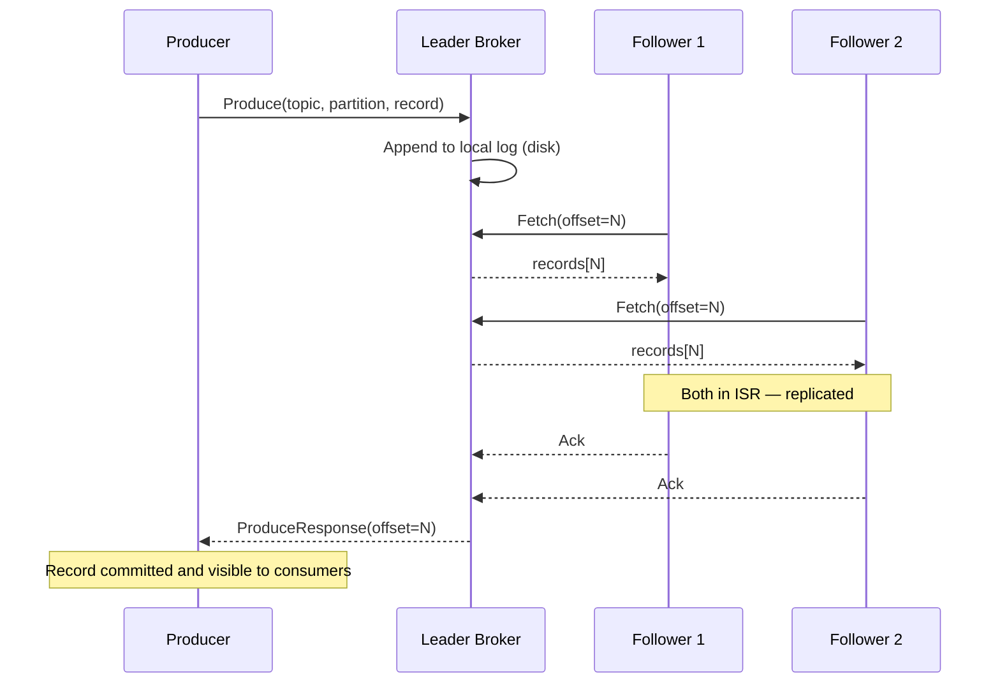
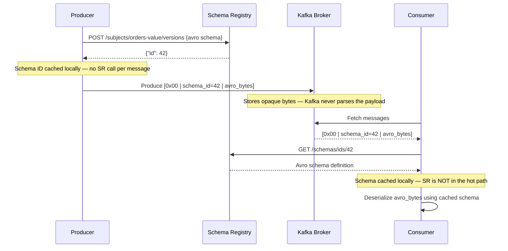

> Written from the perspective of a Staff Engineer with 15+ years in distributed systems.
> Target audience: engineers preparing for Staff/Principal-level interviews at Confluent, FAANG, and top-tier companies.

---

## Table of Contents

1. [What is Kafka and Why Does It Exist?](#1-what-is-kafka-and-why-does-it-exist)
2. [Core Concepts — The Building Blocks](#2-core-concepts--the-building-blocks)
3. [Visual Guide: Topic, Partition, Consumer, Consumer Group](#3-visual-guide-topic-partition-consumer-consumer-group)
4. [How Kafka Works Under the Hood](#4-how-kafka-works-under-the-hood)
5. [Producers Deep Dive](#5-producers-deep-dive)
6. [Consumers Deep Dive](#6-consumers-deep-dive)
7. [Kafka Storage and Log Internals](#7-kafka-storage-and-log-internals)
8. [Replication and Fault Tolerance](#8-replication-and-fault-tolerance)
9. [Kafka Connect](#9-kafka-connect)
10. [Kafka Streams and ksqlDB](#10-kafka-streams-and-ksqldb)
11. [Schema Registry](#11-schema-registry)
12. [Exactly-Once Semantics (EOS)](#12-exactly-once-semantics-eos)
13. [Security in Kafka](#13-security-in-kafka)
14. [Kafka Performance Tuning](#14-kafka-performance-tuning)
15. [Operating Kafka at Scale — 10K+ Topics](#15-operating-kafka-at-scale--10k-topics)
16. [Queue Migration: RabbitMQ to Kafka](#16-queue-migration-rabbitmq-to-kafka)
17. [Kafka vs RabbitMQ vs Amazon SNS/SQS](#17-kafka-vs-rabbitmq-vs-amazon-snssqs)
18. [Where to Use Kafka and Where to Avoid](#18-where-to-use-kafka-and-where-to-avoid)
19. [Best Practices](#19-best-practices)
20. [Gotchas — Things That Will Bite You](#20-gotchas--things-that-will-bite-you)
21. [Case Studies](#21-case-studies)
22. [Interview Questions](#22-interview-questions)
23. [Resources to Prepare](#23-resources-to-prepare)
24. [Kafka Cheatsheet for Interview Revision](#24-kafka-cheatsheet-for-interview-revision)
25. [Staff-Level Preparation Tips](#25-staff-level-preparation-tips)

---

## 1. What is Kafka and Why Does It Exist?

### The Problem

Imagine you work at a large e-commerce company. You have:

- An **Order Service** that creates orders
- A **Payment Service** that charges credit cards
- An **Inventory Service** that tracks stock
- A **Notification Service** that sends emails
- An **Analytics Service** that tracks business metrics

Without Kafka, your Order Service directly calls every downstream service. If the Notification Service is down, your order fails. If you add a new Shipping Service tomorrow, you have to change the Order Service code. This is **tight coupling**, and it doesn't scale.

### The Solution

Apache Kafka is a **distributed event streaming platform**. Think of it as a highly durable, fault-tolerant, ordered log of events that multiple systems can write to and read from independently.

```
┌─────────────┐
│ Order Service│──publishes──▶ ┌──────────────────────────┐
└─────────────┘               │                          │
                              │    KAFKA CLUSTER          │
┌─────────────┐               │                          │
│Payment Svc  │◀──consumes────│  Topic: "orders"         │
└─────────────┘               │  Topic: "payments"       │
                              │  Topic: "notifications"  │
┌─────────────┐               │                          │
│Inventory Svc│◀──consumes────│                          │
└─────────────┘               └──────────────────────────┘
                                        ▲
┌─────────────┐                         │
│Analytics Svc│──────consumes───────────┘
└─────────────┘
```

**Key insight:** The Order Service doesn't know or care who reads its events. Services are completely decoupled.

### Origin Story

Kafka was built at **LinkedIn in 2010** by Jay Kreps, Neha Narkhede, and Jun Rao. They needed a system to handle trillions of messages per day for activity tracking and metrics. It was open-sourced in 2011 and became an Apache top-level project in 2012. Confluent (the company behind Kafka) was founded in 2014.

---

## 2. Core Concepts — The Building Blocks

### Event (Message/Record)

An event is a fact that something happened. It has:

- **Key** — Used to determine which partition the message goes to (can be null)
- **Value** — The actual payload (JSON, Avro, Protobuf, plain text)
- **Timestamp** — When the event was created or ingested
- **Headers** — Optional key-value metadata

```json
{
  "key": "user-123",
  "value": {
    "orderId": "ORD-456",
    "item": "Laptop",
    "amount": 999.99,
    "status": "CREATED"
  },
  "timestamp": 1713264000000,
  "headers": {
    "source": "order-service",
    "correlationId": "abc-def-123"
  }
}
```

### Topic

A topic is a **named feed of messages** — like a table in a database or a folder in a filesystem. Topics are the primary way to organize data in Kafka.

- `orders` — all order events
- `payments` — all payment events
- `user-clicks` — all clickstream data

### Partition

Each topic is split into **partitions**. Partitions are the unit of parallelism in Kafka. Each partition is an ordered, immutable sequence of records.

### Broker

A Kafka broker is a single server in the cluster. Each broker holds some partitions for some topics. A typical production cluster has 3–30+ brokers.

### Consumer Group

A consumer group is a set of consumers that cooperate to consume a topic. Each partition is consumed by exactly one consumer in a group.

### Offset

An offset is a unique, sequential ID for each record within a partition. Consumers track their position using offsets.

### ZooKeeper / KRaft

Historically, Kafka used **ZooKeeper** for metadata management (broker registration, leader election, topic configs). Since Kafka 3.3+, **KRaft** (Kafka Raft) replaces ZooKeeper, making Kafka self-managed. As of Kafka 4.0, ZooKeeper support is fully removed.

---

## 3. Visual Guide: Topic, Partition, Consumer, Consumer Group

This is the most important mental model you need. Let's break it down visually.

### A Topic with 4 Partitions

```
                        Topic: "orders"
    ┌──────────────────────────────────────────────┐
    │                                              │
    │  Partition 0: [msg0][msg1][msg2][msg3]───▶   │
    │  Partition 1: [msg0][msg1][msg2]─────────▶   │
    │  Partition 2: [msg0][msg1][msg2][msg3][msg4]▶│
    │  Partition 3: [msg0][msg1]───────────────▶   │
    │                                              │
    └──────────────────────────────────────────────┘
```

- Each partition is an **independent ordered log**.
- Messages across partitions have **no ordering guarantee**.
- Offset `msg1` in Partition 0 is completely unrelated to `msg1` in Partition 1.

### How Consumers Map to Partitions

```
     Consumer Group A (Order Processing)
    ┌──────────────────────────────────────────────┐
    │                                              │
    │  Consumer A1  ◀── reads ── Partition 0       │
    │  Consumer A1  ◀── reads ── Partition 1       │
    │  Consumer A2  ◀── reads ── Partition 2       │
    │  Consumer A3  ◀── reads ── Partition 3       │
    │                                              │
    └──────────────────────────────────────────────┘

     Consumer Group B (Analytics)
    ┌──────────────────────────────────────────────┐
    │                                              │
    │  Consumer B1  ◀── reads ── Partition 0       │
    │  Consumer B1  ◀── reads ── Partition 1       │
    │  Consumer B1  ◀── reads ── Partition 2       │
    │  Consumer B1  ◀── reads ── Partition 3       │
    │                                              │
    └──────────────────────────────────────────────┘
```

**Key rules:**

- One partition → consumed by exactly **one consumer** in a group.
- One consumer → can consume from **multiple partitions**.
- If consumers > partitions, extra consumers sit **idle** (wasted).
- Different consumer groups get their **own independent copy** of the data.

### The Relationship Visualization

```
┌─────────────────────────────────────────────────────────────┐
│                                                             │
│  PRODUCER                                                   │
│    │                                                        │
│    │  "I write to a TOPIC, Kafka routes to a PARTITION      │
│    │   based on the message KEY (or round-robin if null)"   │
│    │                                                        │
│    ▼                                                        │
│  TOPIC ─── is divided into ──▶ PARTITIONS (1..N)            │
│                                    │                        │
│                                    │ each partition is      │
│                                    │ assigned to exactly    │
│                                    │ one consumer per group │
│                                    ▼                        │
│                              CONSUMER (within a             │
│                              CONSUMER GROUP)                │
│                                                             │
│  Think of it like:                                          │
│  ┌──────────────────────────────────────────┐               │
│  │ Topic     = a book                       │               │
│  │ Partition = a chapter                    │               │
│  │ Consumer  = a reader                     │               │
│  │ Group     = a book club                  │               │
│  │ Each chapter assigned to one reader      │               │
│  │ per club. Multiple clubs read the same   │               │
│  │ book independently.                      │               │
│  └──────────────────────────────────────────┘               │
│                                                             │
└─────────────────────────────────────────────────────────────┘
```

### What Happens During Rebalancing?

```
Before: 3 consumers, 6 partitions
  C1 ← P0, P1
  C2 ← P2, P3
  C3 ← P4, P5

C3 crashes!

After rebalance: 2 consumers, 6 partitions
  C1 ← P0, P1, P2       (picked up P2)
  C2 ← P3, P4, P5       (picked up P4, P5)
```

---

## 4. How Kafka Works Under the Hood

### Kafka's Architecture

```
                    ┌───────────────┐
                    │  Producer(s)  │
                    └──────┬────────┘
                           │
                           ▼
    ┌─────────────────────────────────────────┐
    │           KAFKA CLUSTER                 │
    │                                         │
    │  ┌─────────┐ ┌─────────┐ ┌─────────┐   │
    │  │Broker 1 │ │Broker 2 │ │Broker 3 │   │
    │  │(Leader  │ │(Leader  │ │(Leader  │   │
    │  │ P0,P3)  │ │ P1,P4)  │ │ P2,P5)  │   │
    │  │Follower │ │Follower │ │Follower │   │
    │  │ P1,P5   │ │ P2,P3   │ │ P0,P4   │   │
    │  └─────────┘ └─────────┘ └─────────┘   │
    │                                         │
    │  ┌───────────────────────────────────┐  │
    │  │ KRaft Controller Quorum           │  │
    │  │ (replaces ZooKeeper)              │  │
    │  │ Manages metadata, leader election │  │
    │  └───────────────────────────────────┘  │
    └─────────────────────────────────────────┘
                           │
                           ▼
                    ┌───────────────┐
                    │  Consumer(s)  │
                    └───────────────┘
```

### Write Path



*Write path with `acks=all`. The producer blocks until all ISR replicas confirm. With `acks=1`, the leader responds after local write — followers replicate asynchronously and a leader crash before replication means data loss.*

1. Producer sends a record to the **leader** of a partition.
2. Leader appends the record to its local log (disk).
3. Followers pull the record from the leader (`fetch` requests).
4. Once enough replicas acknowledge (based on `acks` config), the leader responds to the producer.
5. The record is now "committed" and visible to consumers.

### Read Path

1. Consumer sends a `fetch` request to the leader (or a follower, if configured with `rack-aware` fetching).
2. Leader returns records starting from the consumer's current offset.
3. Consumer processes records and commits the offset (either auto or manual).

### Zero-Copy Transfer

Kafka achieves high throughput because it uses the OS `sendfile()` syscall. Data goes directly from the page cache to the network socket without being copied into the JVM heap. This is called **zero-copy** and is a massive performance win.

```
Traditional I/O:
  Disk → Kernel Buffer → User Buffer (JVM) → Socket Buffer → NIC

Kafka (Zero-Copy):
  Disk → Kernel Buffer → NIC
  (skips user space entirely)
```

> 💡 **Staff-level insight:** Zero-copy breaks the moment you enable broker-side compression (`compression.type` on broker config). If the broker must decompress/recompress data, it has to read into user space — which eliminates `sendfile()` entirely. Always compress at the **producer**. This is the correct pattern anyway: producer compresses whole batches (efficient), broker stores them as-is, consumer decompresses. The broker is intentionally "dumb" about payload bytes.

---

## 5. Producers Deep Dive

### Producer Workflow

```
                        ┌─────────────┐
                        │  Application│
                        └──────┬──────┘
                               │ send(topic, key, value)
                               ▼
                        ┌─────────────┐
                        │ Serializer  │  Key + Value serialized
                        └──────┬──────┘
                               │
                               ▼
                        ┌─────────────┐
                        │ Partitioner │  Determines target partition
                        └──────┬──────┘  (hash(key) % numPartitions)
                               │
                               ▼
                        ┌─────────────┐
                        │Record Batch │  Batches records per partition
                        │ Accumulator │  (linger.ms + batch.size)
                        └──────┬──────┘
                               │
                               ▼
                        ┌─────────────┐
                        │   Sender    │  Network I/O thread
                        │   Thread    │  sends batches to brokers
                        └─────────────┘
```

### Key Producer Configs

| Config      | Default            | What It Does                                                             |
| ----------- | ------------------ | ------------------------------------------------------------------------ |
| `acks`      | `all` (Kafka 3.0+) | `0`=fire-and-forget, `1`=leader ack, `all`=all ISR ack                   |
| `retries`   | `MAX_INT`          | Number of retry attempts on failure                                      |
| `linger.ms` | `0`                | Wait time to batch more records (higher = more throughput, more latency) |

> 💡 **Staff-level insight:** `linger.ms=0` is a silent throughput killer in production. At 10K msg/s, you send 10K individual batches per second instead of a few large ones. Setting `linger.ms=10` — a 10ms wait — typically delivers 3–5x throughput improvement with negligible latency impact for async workloads. The default exists for legacy latency-sensitive clients, not modern high-throughput systems.

| `batch.size`                            | `16384`             | Max bytes per batch (per partition)                                                    |
| `max.in.flight.requests.per.connection` | `5`                 | Concurrent unacknowledged requests. Set to `1` for strict ordering without idempotence |
| `enable.idempotence`                    | `true` (Kafka 3.0+) | Prevents duplicate writes on retry                                                     |
| `compression.type`                      | `none`              | `gzip`, `snappy`, `lz4`, `zstd`                                                        |
| `buffer.memory`                         | `33554432` (32MB)   | Total memory available to the producer for buffering                                   |

### Partitioning Strategies

```
1. Key-Based (Default when key != null):
   partition = hash(key) % numPartitions
   → Same key always goes to same partition → ordering guarantee per key

2. Round-Robin (Default when key == null, older Kafka):
   → Distributes evenly across partitions

3. Sticky Partitioner (Default when key == null, Kafka 2.4+):
   → Sticks to one partition until batch is full → better batching

4. Custom Partitioner:
   → Implement the Partitioner interface for business logic
```

### Real-World Example: Ordering Guarantee

You're building an order tracking system. You want all events for the same order to be processed in order.

```go
package main

import (
	"context"
	"log"
	"time"

	kafka "github.com/segmentio/kafka-go"
)

func newProductionWriter() *kafka.Writer {
	return &kafka.Writer{
		Addr:  kafka.TCP("localhost:9092"),
		Topic: "order-events",

		// Hash balancer: routes same key to the same partition always.
		// hash(key) % numPartitions — this is how per-entity ordering is guaranteed.
		// Switch to RoundRobin only if you have no ordering requirements.
		Balancer: &kafka.Hash{},

		// RequireAll = acks=all: wait for all ISR replicas before acknowledging.
		// RequireNone = acks=0: fire-and-forget — never in production.
		// RequireOne = acks=1: only leader ack — risks data loss if leader crashes.
		RequiredAcks: kafka.RequireAll,

		// BatchTimeout is kafka-go's equivalent of linger.ms.
		// Default is 0 (flush immediately) — a silent throughput killer.
		// 10ms is a good production starting point for async workloads.
		BatchTimeout: 10 * time.Millisecond,
		BatchSize:    100,

		// Compression reduces network + disk usage by 40–80% for JSON payloads.
		// Lz4: fast CPU, good ratio — production default.
		// Zstd: better compression ratio, slightly higher CPU.
		// Never set compression on the broker — it breaks zero-copy.
		Compression: kafka.Lz4,
	}
}

func main() {
	w := newProductionWriter()
	defer w.Close()

	// orderId as the key ensures all lifecycle events for this order
	// (CREATED → PAID → SHIPPED → DELIVERED) land on the same partition.
	// Without a key, round-robin distributes events across partitions — ordering lost.
	orderId := "ORD-123"

	err := w.WriteMessages(context.Background(),
		kafka.Message{
			Key:   []byte(orderId),
			Value: []byte(`{"orderId":"ORD-123","status":"CREATED","amount":999.99}`),
			// Headers carry metadata without inflating the value payload.
			// Invisible to Kafka's routing — purely for consumers to inspect.
			Headers: []kafka.Header{
				{Key: "source", Value: []byte("order-service")},
				{Key: "correlationId", Value: []byte("abc-def-123")},
			},
		},
	)
	if err != nil {
		log.Fatal("failed to produce order event:", err)
	}
}
```

If `orderId = "ORD-123"`, all events (CREATED, PAID, SHIPPED, DELIVERED) for this order land in the **same partition**, preserving order.

> 💡 **Staff-level insight:** Adding partitions to a live topic silently breaks key-based ordering for keys that already have in-flight state. If `ORD-123` was routed to partition 3 with 12 partitions, after expanding to 24 partitions it moves to a different partition. In-progress orders will have events split across two partitions. The safe strategy: size your partition count at topic creation time. A rough formula: `partitions ≈ peak_throughput_MB_s / 10`. Once set, treat partition count as immutable.

---

## 6. Consumers Deep Dive

### Consumer Group Protocol

```
Step 1: Consumer joins group
         ──▶ FindCoordinator request to any broker
         ◀── Broker returns the Group Coordinator

Step 2: JoinGroup request
         ──▶ All consumers send JoinGroup to coordinator
         ◀── Coordinator picks a leader consumer

Step 3: SyncGroup
         ──▶ Leader consumer computes partition assignment
         ──▶ Sends assignment via SyncGroup
         ◀── Each consumer receives its partitions

Step 4: Heartbeat loop
         ──▶ Consumers send heartbeats every session.timeout.ms
         If missed → coordinator triggers rebalance
```

### Partition Assignment Strategies

| Strategy                    | Behavior                                            | Use When                                           |
| --------------------------- | --------------------------------------------------- | -------------------------------------------------- |
| `RangeAssignor`             | Assigns partitions per-topic in ranges              | Simple, but can be uneven across topics            |
| `RoundRobinAssignor`        | Distributes partitions round-robin across consumers | Better balance when consuming multiple topics      |
| `StickyAssignor`            | Minimizes partition movements during rebalance      | Production workloads — less disruption             |
| `CooperativeStickyAssignor` | Incremental cooperative rebalance                   | **Recommended for production** — no stop-the-world |

> 💡 **Staff-level insight:** The difference between `StickyAssignor` and `CooperativeStickyAssignor` is architectural, not cosmetic. `StickyAssignor` uses **eager rebalance**: ALL consumers release ALL partitions before any reassignment begins — a stop-the-world pause that can cause 30–60 seconds of zero processing in large groups. `CooperativeStickyAssignor` uses **incremental rebalance**: only the partitions that need to move are revoked; all others keep processing. In a 100-consumer group, a single consumer crashing should disrupt only its 2-3 partitions, not the entire group. Always use `CooperativeStickyAssignor` in new services.

### Offset Management

```
    Partition 0: [0][1][2][3][4][5][6][7][8][9]
                                    ▲        ▲
                                    │        │
                            committed     latest
                            offset (5)    offset (9)

    Consumer resumes from offset 5 after restart.
    It will read messages 5, 6, 7, 8, 9.
```

**Commit strategies:**

- `enable.auto.commit=true` — Offsets committed every `auto.commit.interval.ms` (5000ms default). Simple but can cause duplicates or data loss.
- **Manual Sync** — `consumer.commitSync()` — Blocks until committed. Safest but slowest.
- **Manual Async** — `consumer.commitAsync()` — Non-blocking but no retry on failure.
- **Best Practice** — Use `commitAsync()` in the loop, `commitSync()` in the `finally` block.

### Consumer Lag

Consumer lag is the difference between the latest offset (log end) and the consumer's committed offset. High lag means the consumer is falling behind.

```
Log End Offset:       1,000,000
Consumer Offset:        800,000
─────────────────────────────
Consumer Lag:           200,000  ← Red flag if growing!
```

**Monitor lag using:**

```bash
kafka-consumer-groups.sh --bootstrap-server localhost:9092 \
  --describe --group my-consumer-group
```

---

## 7. Kafka Storage and Log Internals

### Log Segments

Each partition is stored as a directory on disk. Inside, data is split into **log segments**.

```
/kafka-data/orders-0/
├── 00000000000000000000.log       ← Active segment (being written to)
├── 00000000000000000000.index     ← Offset index
├── 00000000000000000000.timeindex ← Timestamp index
├── 00000000000000065432.log       ← Older segment
├── 00000000000000065432.index
├── 00000000000000065432.timeindex
└── leader-epoch-checkpoint
```

- Each `.log` file contains the actual messages.
- `.index` maps offset → physical position in the `.log` file.
- `.timeindex` maps timestamp → offset (for time-based seeking).
- Segment rolls when it reaches `log.segment.bytes` (1GB default) or `log.roll.ms`.

### Retention and Compaction

```
Retention-based (default):
  ┌──────┐ ┌──────┐ ┌──────┐ ┌──────┐
  │DELETE │ │DELETE │ │ KEEP │ │ KEEP │
  │(old)  │ │(old)  │ │      │ │(active)
  └──────┘ └──────┘ └──────┘ └──────┘
  ◀─────── older than retention.ms ────────▶

Compaction (log.cleanup.policy=compact):
  Before:  [A:1] [B:1] [A:2] [C:1] [B:2] [A:3]
  After:                      [C:1] [B:2] [A:3]
  (Only the LATEST value per key is kept)
```

**Use compaction for:** Changelogs, CDC (Change Data Capture), state stores — where you want the "latest state" of each entity.

### Key Retention Configs

| Config                  | Default            | Description                                   |
| ----------------------- | ------------------ | --------------------------------------------- |
| `log.retention.hours`   | `168` (7 days)     | How long to keep data                         |
| `log.retention.bytes`   | `-1` (unlimited)   | Max size per partition                        |
| `log.segment.bytes`     | `1073741824` (1GB) | When to roll a new segment                    |
| `log.cleanup.policy`    | `delete`           | `delete`, `compact`, or `delete,compact`      |
| `min.compaction.lag.ms` | `0`                | Minimum time before a record can be compacted |

---

## 8. Replication and Fault Tolerance

### How Replication Works

```
Topic: orders, Partition 0, Replication Factor: 3

    Broker 1              Broker 2              Broker 3
    ┌──────────┐          ┌──────────┐          ┌──────────┐
    │ P0       │          │ P0       │          │ P0       │
    │ (LEADER) │──copy──▶ │(FOLLOWER)│──copy──▶ │(FOLLOWER)│
    │          │          │          │          │          │
    │ [0,1,2,3]│          │ [0,1,2,3]│          │ [0,1,2]  │
    └──────────┘          └──────────┘          └──────────┘
                                                     ▲
                                                     │
                                              This follower is
                                              behind (not in ISR)
```

### ISR (In-Sync Replicas)

A follower is "in-sync" if it has caught up to the leader within `replica.lag.time.max.ms` (default 30s).

```
All Replicas:     {Broker1, Broker2, Broker3}
ISR:              {Broker1, Broker2}           ← Broker3 is lagging
Leader:           Broker1

If acks=all, producer waits for ALL replicas in ISR to acknowledge.
If Broker1 dies → Broker2 becomes the new leader (from ISR).
```

### Unclean Leader Election

If all ISR replicas are down, Kafka can either:

- **Wait** for an ISR replica to come back (`unclean.leader.election.enable=false` — **default and recommended**)
- **Elect a non-ISR replica** as leader — risks **data loss** (`unclean.leader.election.enable=true`)

### min.insync.replicas

This config defines the **minimum number of replicas** that must acknowledge a write for it to succeed (when `acks=all`).

```
replication.factor = 3
min.insync.replicas = 2
acks = all

→ At least 2 out of 3 replicas must be alive and in-sync for writes to succeed.
→ Can tolerate 1 broker failure.
→ If only 1 replica is alive → writes fail with NotEnoughReplicasException.
```

**The golden formula:**

```
Needs: replication.factor >= min.insync.replicas + 1
  (so you can tolerate at least 1 broker failure)

Common production setup:
  replication.factor = 3
  min.insync.replicas = 2
  acks = all
```

---

## 9. Kafka Connect

Kafka Connect is a framework for streaming data between Kafka and external systems **without writing code**.

```
┌──────────┐     ┌──────────────────┐     ┌──────────┐
│PostgreSQL │────▶│  SOURCE          │────▶│  Kafka   │
│  (CDC)    │     │  CONNECTOR       │     │  Topic   │
└──────────┘     │  (Debezium)      │     └──────────┘
                 └──────────────────┘

┌──────────┐     ┌──────────────────┐     ┌──────────┐
│  Kafka   │────▶│  SINK            │────▶│  Elastic │
│  Topic   │     │  CONNECTOR       │     │  Search  │
└──────────┘     │  (ES Connector)  │     └──────────┘
                 └──────────────────┘
```

### Key Connectors

- **Debezium** — CDC from MySQL, PostgreSQL, MongoDB, SQL Server
- **JDBC Source/Sink** — Generic database integration
- **S3 Sink** — Write to AWS S3 (data lake ingestion)
- **Elasticsearch Sink** — Real-time search indexing
- **BigQuery/Snowflake Sink** — Data warehouse loading

### Connect Concepts

- **Workers** — JVM processes that run connectors (standalone or distributed mode)
- **Tasks** — Units of parallelism within a connector
- **Converters** — Serialize/deserialize data (Avro, JSON, Protobuf)
- **SMTs (Single Message Transforms)** — Lightweight transformations inline

---

## 10. Kafka Streams and ksqlDB

### Kafka Streams

A Java library for building real-time stream processing applications **on top of Kafka**. No separate cluster needed — it runs inside your application.

```
Input Topic         Kafka Streams App         Output Topic
┌──────────┐       ┌─────────────────┐       ┌──────────┐
│ raw-     │──────▶│ filter()        │──────▶│ enriched │
│ events   │       │ map()           │       │ -events  │
└──────────┘       │ groupByKey()    │       └──────────┘
                   │ windowedBy()    │
                   │ aggregate()     │       ┌──────────┐
                   │                 │──────▶│ alerts   │
                   └─────────────────┘       └──────────┘
```

**Key Concepts:**

- **KStream** — An unbounded stream of records (events)
- **KTable** — A changelog stream, represents "current state" (like a table)
- **GlobalKTable** — Like KTable but replicated on every instance
- **State Stores** — Local RocksDB stores for stateful operations
- **Windowing** — Tumbling, Hopping, Sliding, Session windows

### ksqlDB

SQL-like interface on top of Kafka Streams:

```sql
-- Create a stream from a topic
CREATE STREAM orders (
  orderId VARCHAR KEY,
  amount DOUBLE,
  status VARCHAR
) WITH (kafka_topic='orders', value_format='JSON');

-- Continuous query: real-time aggregation
CREATE TABLE order_count AS
  SELECT status, COUNT(*) AS cnt
  FROM orders
  WINDOW TUMBLING (SIZE 1 HOUR)
  GROUP BY status;
```

---

## 11. Schema Registry

Schema Registry provides a central repository for schemas and enforces data contracts between producers and consumers.



*Schema Registry flow. The magic byte `0x00` signals a Schema Registry-encoded payload. Both producer and consumer cache schemas locally after first use — the registry is never in the critical produce/consume path.*

### Compatibility Modes

| Mode       | Rule                                 | Use Case                                     |
| ---------- | ------------------------------------ | -------------------------------------------- |
| `BACKWARD` | New schema can read old data         | **Default**. Safe to upgrade consumers first |
| `FORWARD`  | Old schema can read new data         | Safe to upgrade producers first              |
| `FULL`     | Both backward and forward compatible | Most restrictive, safest                     |
| `NONE`     | No compatibility check               | Dangerous — avoid in production              |

**Example compatibility violation:**

```
Schema V1: { name: string, age: int }
Schema V2: { name: string }               ← Removing 'age' without a default

BACKWARD compatible?  NO — old data has 'age', new schema can't read it
                          (unless 'age' has a default value)
```

---

## 12. Exactly-Once Semantics (EOS)

### The Three Delivery Guarantees

```
At-Most-Once:    Fire and forget. May lose messages.
                 [msg1] [msg2]  [????]  [msg4]
                                  ▲ lost

At-Least-Once:   Retry on failure. May get duplicates.
                 [msg1] [msg2] [msg2]  [msg3]
                                 ▲ duplicate

Exactly-Once:    Every message delivered once and only once.
                 [msg1] [msg2] [msg3] [msg4]
```

### How Kafka Achieves EOS

**1. Idempotent Producer** (per-partition dedup)

```
enable.idempotence=true

Producer assigns each batch a sequence number per partition.
Broker detects duplicates: "I already have seq=5 for this PID, partition — skip."
```

**2. Transactions** (cross-partition atomicity)

```go
package main

import (
	"log"

	"github.com/IBM/sarama"
)

// newTransactionalProducer builds a Sarama producer configured for EOS.
// Three requirements must ALL be met: idempotence + acks=all + max.in.flight=1.
func newTransactionalProducer(transactionalID string) (sarama.SyncProducer, error) {
	config := sarama.NewConfig()
	config.Version = sarama.V3_0_0_0

	// Idempotence assigns a ProducerID + sequence number per partition.
	// The broker deduplicates retried batches: "I have seq=5 for PID 101, skip."
	// Required for transactions — Kafka refuses the connection without it.
	config.Producer.Idempotent = true

	// acks=all is mandatory with idempotence.
	// Kafka enforces this at the broker level — it will reject connections
	// that try to combine idempotence with acks != -1.
	config.Producer.RequiredAcks = sarama.WaitForAll

	// MaxOpenRequests=1 ensures ordering of batches even with retries.
	// Without this, a retry for batch N could arrive after batch N+1,
	// causing reordering that idempotence cannot detect.
	config.Net.MaxOpenRequests = 1

	// TransactionalID uniquely identifies this producer instance.
	// On crash + restart with the same ID, Kafka fences the zombie:
	// any in-flight transaction from the old producer epoch is aborted.
	// This prevents ghost writes from previously crashed instances.
	config.Producer.Transaction.ID = transactionalID

	return sarama.NewSyncProducer([]string{"localhost:9092"}, config)
}

// processWithEOS is the read-process-write pattern with exactly-once semantics.
// Consume from topic A, produce to topic B, commit offset — all atomically.
func processWithEOS(
	producer sarama.SyncProducer,
	inputMsg *sarama.ConsumerMessage,
	consumerGroupID string,
) error {
	// Begin transaction — all writes within are atomic.
	// On crash or abort: none of the writes are visible to read_committed consumers.
	if err := producer.BeginTxn(); err != nil {
		return err
	}

	_, _, err := producer.SendMessage(&sarama.ProducerMessage{
		Topic: "order-notifications",
		Key:   sarama.StringEncoder(string(inputMsg.Key)),
		Value: sarama.StringEncoder(`{"type":"ORDER_CONFIRMED"}`),
	})
	if err != nil {
		// Abort cleans up the transaction on the broker.
		// read_committed consumers never see aborted records.
		_ = producer.AbortTxn()
		return err
	}

	// Commit INPUT offset INSIDE the transaction.
	// This is the key to exactly-once: offset commit + produce are atomic.
	// Without this, crash-after-produce but before-offset-commit causes
	// the consumer to reprocess the same input, producing a duplicate output.
	offsets := map[string][]*sarama.PartitionOffsetMetadata{
		inputMsg.Topic: {
			{Partition: inputMsg.Partition, Offset: inputMsg.Offset + 1},
		},
	}
	if err := producer.SendOffsetsToTxn(offsets, consumerGroupID); err != nil {
		_ = producer.AbortTxn()
		return err
	}

	return producer.CommitTxn()
}
```

**3. Consumer: `isolation.level=read_committed`**

Consumers only see committed transactional records, never aborted ones.

> 💡 **Staff-level insight:** In practice, the right answer is almost never full EOS. The correct production pattern for most systems is: `acks=all` + `enable.idempotence=true` on the producer (for per-partition deduplication) **plus** making your consumer idempotent (e.g., database upserts keyed on `orderId`, or a deduplication store). This gives you practical exactly-once behavior with **zero throughput penalty**. Reserve Kafka transactions for Kafka Streams pipelines or financial systems where cross-partition atomicity is genuinely needed — not as a default setting.

---

## 13. Security in Kafka

```
┌─────────┐                          ┌──────────┐
│ Client  │──── TLS/SSL ────────────▶│  Broker  │
│         │  (encryption in transit)  │          │
│         │                          │          │
│         │──── SASL ────────────────▶│ AuthN    │
│         │  (PLAIN, SCRAM, GSSAPI,  │          │
│         │   OAUTHBEARER)           │          │
│         │                          │          │
│         │──── ACLs ────────────────▶│ AuthZ    │
│         │  (Allow/Deny per         │          │
│         │   resource + principal)   │          │
└─────────┘                          └──────────┘
```

### Security Layers

| Layer          | Mechanism                              | Purpose               |
| -------------- | -------------------------------------- | --------------------- |
| Encryption     | TLS/SSL                                | Data in transit       |
| Authentication | SASL (SCRAM-SHA-512, OAUTHBEARER)      | Identity verification |
| Authorization  | ACLs or RBAC (Confluent)               | Access control        |
| Audit          | Log4j audit logs / Confluent Audit Log | Compliance tracking   |

### ACL Example

```bash
# Allow user 'order-svc' to produce to topic 'orders'
kafka-acls.sh --bootstrap-server localhost:9092 \
  --add --allow-principal User:order-svc \
  --operation Write --topic orders

# Allow group 'analytics-group' to consume from topic 'orders'
kafka-acls.sh --bootstrap-server localhost:9092 \
  --add --allow-principal User:analytics-svc \
  --operation Read --topic orders \
  --group analytics-group
```

---

## 14. Kafka Performance Tuning

### Producer Tuning

```
High Throughput Producer:
  linger.ms = 20               ← Wait 20ms to batch more records
  batch.size = 65536            ← 64KB batches
  compression.type = lz4        ← Fast compression (lz4 or zstd)
  buffer.memory = 67108864      ← 64MB buffer
  acks = all                    ← Don't sacrifice durability

Low Latency Producer:
  linger.ms = 0                 ← Send immediately
  batch.size = 16384            ← Smaller batches
  acks = 1                      ← Only leader ack (trade durability)
```

### Consumer Tuning

```
High Throughput Consumer:
  fetch.min.bytes = 65536       ← Wait for 64KB of data
  fetch.max.wait.ms = 500       ← or 500ms, whichever comes first
  max.poll.records = 1000       ← Process up to 1000 records per poll

Low Latency Consumer:
  fetch.min.bytes = 1           ← Return immediately with any data
  fetch.max.wait.ms = 100       ← Short wait
  max.poll.records = 100        ← Smaller batches for faster processing
```

### Broker Tuning

```
num.io.threads = 8                    ← I/O threads (= number of disks)
num.network.threads = 8               ← Network threads (= CPU cores)
socket.send.buffer.bytes = 1048576    ← 1MB socket send buffer
socket.receive.buffer.bytes = 1048576 ← 1MB socket receive buffer
num.replica.fetchers = 4              ← Parallel replication fetches
log.flush.interval.messages = 10000   ← Flush every 10K messages (OS flush)
```

### Topic-Level Tuning

```bash
# Increase partitions (cannot decrease!)
kafka-topics.sh --alter --topic orders --partitions 12

# Set retention to 3 days
kafka-configs.sh --alter --entity-type topics --entity-name orders \
  --add-config retention.ms=259200000

# Enable compaction
kafka-configs.sh --alter --entity-type topics --entity-name user-profiles \
  --add-config cleanup.policy=compact
```

---

## 15. Operating Kafka at Scale — 10K+ Topics

### The Challenge

At 10K+ topics, you face:

- **Metadata overhead** — Every broker holds metadata for ALL topics/partitions. If you have 10K topics × 10 partitions × 3 replicas = 300K partition replicas. Each metadata update broadcasts to all brokers.
- **Controller bottleneck** — The controller manages all partition state. Massive clusters overwhelm a single controller.
- **Open file handles** — Each partition needs file descriptors for active log segments.
- **Rebalance storms** — Consumer groups subscribing to many topics take forever to rebalance.

### Optimization Strategies

```
Strategy 1: Multi-Cluster Architecture
──────────────────────────────────────────────

  ┌──────────────┐     ┌──────────────┐     ┌──────────────┐
  │ Cluster A    │     │ Cluster B    │     │ Cluster C    │
  │ (Orders)     │     │ (Analytics)  │     │ (Logging)    │
  │ 500 topics   │     │ 3000 topics  │     │ 7000 topics  │
  └──────────────┘     └──────────────┘     └──────────────┘
          │                    │                    │
          └────────────────────┼────────────────────┘
                               │
                    ┌──────────────────┐
                    │ MirrorMaker 2 or │
                    │ Cluster Linking  │
                    │ (data replication│
                    │  across clusters)│
                    └──────────────────┘

  ✓ Isolates failure domains
  ✓ Each cluster handles a manageable number of topics
  ✓ Use Confluent Cluster Linking for real-time cross-cluster replication
```

```
Strategy 2: Topic Consolidation
──────────────────────────────────

  BEFORE (10,000 topics):
    user-clicks-US, user-clicks-UK, user-clicks-DE, ...  (200 topics)
    payments-USD, payments-EUR, payments-GBP, ...         (50 topics)

  AFTER (fewer topics, more partitions):
    user-clicks (single topic, use headers for region)
    payments    (single topic, partition by currency via key)

  Filtering at consumer level:
    consumer.subscribe("user-clicks");
    // Filter by header "region" == "US"
```

```
Strategy 3: Broker and Partition Optimization
─────────────────────────────────────────────────

  Rules of thumb:
  • Max ~4,000 partitions per broker (for HDD)
  • Max ~14,000 partitions per broker (for SSD)
  • Keep partition count per topic reasonable (6-30 for most use cases)
  • Use 3x replication factor (never go below 2 in production)

  File Descriptor Fix:
    ulimit -n 100000    ← Increase open file limit
```

```
Strategy 4: KRaft Mode (Kafka 3.3+)
────────────────────────────────────────

  ZooKeeper was the bottleneck for large-scale metadata.
  KRaft:
  • Metadata stored in an internal Kafka topic (__cluster_metadata)
  • Controller quorum (typically 3 or 5 nodes)
  • Faster leader elections
  • Can handle millions of partitions

  Migration from ZooKeeper to KRaft:
  1. Upgrade to Kafka 3.4+
  2. Run 'kafka-metadata.sh' to snapshot ZooKeeper metadata
  3. Start KRaft controllers
  4. Migrate brokers one at a time
  5. Decommission ZooKeeper
```

```
Strategy 5: Tiered Storage (Confluent / KIP-405)
────────────────────────────────────────────────────

  Hot data → Local broker disk (NVMe/SSD)
  Cold data → Object storage (S3, GCS, Azure Blob)

  ┌──────────────────────────────────────────┐
  │  Broker Disk          Object Storage     │
  │  ┌──────────┐        ┌──────────────┐   │
  │  │ Last 24h │───────▶│ 24h – 90d    │   │
  │  │ (hot)    │ tiered │ (warm/cold)  │   │
  │  └──────────┘ upload └──────────────┘   │
  └──────────────────────────────────────────┘

  → Brokers need much less local disk
  → Keep longer retention cheaply
  → Consumers transparently read from either tier
```

### Monitoring at Scale

Must-have metrics for 10K+ topic clusters:

| Metric                           | Alert Threshold   | Why                          |
| -------------------------------- | ----------------- | ---------------------------- |
| `UnderReplicatedPartitions`      | > 0 for 5 min     | Replicas falling behind      |
| `OfflinePartitionsCount`         | > 0               | Partitions with no leader    |
| `ActiveControllerCount`          | != 1              | Split-brain or no controller |
| `RequestHandlerAvgIdlePercent`   | < 0.3             | Brokers overloaded           |
| `NetworkProcessorAvgIdlePercent` | < 0.3             | Network threads saturated    |
| `LogFlushRateAndTimeMs`          | p99 > 100ms       | Disk I/O bottleneck          |
| `ConsumerLag`                    | Growing over time | Consumer can't keep up       |
| `IsrShrinksPerSec`               | Sustained > 0     | Replication issues           |

### Monitoring & Observability Deep Dive

Running Kafka without structured observability is like driving blind. This section covers the complete observability stack.

#### Prometheus + JMX Exporter Setup

Kafka exposes metrics via JMX. Use the [Prometheus JMX Exporter](https://github.com/prometheus/jmx_exporter) as a Java agent to scrape and expose them:

```yaml
# jmx_exporter_config.yaml — mount this in your Kafka pod/container
startDelaySeconds: 0
ssl: false
lowercaseOutputName: true
lowercaseOutputLabelNames: true
rules:
  # Broker request handler idle — below 30% means broker is saturated
  - pattern: "kafka.server<type=KafkaRequestHandlerPool, name=RequestHandlerAvgIdlePercent><>Value"
    name: kafka_server_request_handler_avg_idle_percent
  # Under-replicated partitions — should always be 0
  - pattern: "kafka.server<type=ReplicaManager, name=UnderReplicatedPartitions><>Value"
    name: kafka_server_under_replicated_partitions
  # Consumer group lag — per consumer group + topic + partition
  - pattern: "kafka.consumer<type=consumer-fetch-manager-metrics, client-id=(.*), topic=(.*), partition=(.*)><>records-lag"
    name: kafka_consumer_records_lag
    labels:
      client_id: "$1"
      topic: "$2"
      partition: "$3"
```

Add to Kafka JVM startup:
```bash
KAFKA_OPTS="-javaagent:/opt/jmx_exporter/jmx_prometheus_javaagent.jar=9404:/opt/jmx_exporter/kafka.yaml"
```

#### Top 5 Grafana Panels to Build First

| Panel                             | Metric                                                   | Why It's Critical                                         |
| --------------------------------- | -------------------------------------------------------- | --------------------------------------------------------- |
| **Consumer Lag (by group/topic)** | `kafka_consumer_records_lag`                             | Your #1 health indicator — are consumers keeping up?      |
| **Under-Replicated Partitions**   | `kafka_server_under_replicated_partitions`               | Non-zero = data durability at risk right now              |
| **Request Handler Idle %**        | `kafka_server_request_handler_avg_idle_percent`          | <30% = broker overloaded, produce latency spikes incoming |
| **Produce Latency p99**           | `kafka_network_request_total_time_ms{request="Produce"}` | Your producer SLA signal                                  |
| **Disk Usage per Broker**         | `kafka_log_size`                                         | Set alert at 70% — full disk = broker goes offline        |

#### Consumer Lag Incident Walkthrough (2 AM Debugging)

```
Step 1: Confirm lag is real and growing
  kafka-consumer-groups.sh --bootstrap-server :9092 \
    --describe --group payment-processing-service

  Look for: LAG column growing across polls (not just a snapshot spike)

Step 2: Identify which partitions are lagging
  Same command — LAG column shows per-partition.
  A single partition at 500K lag but others at 0 → one consumer is sick.
  All partitions lagging → the entire consumer group can't keep up.

Step 3: Check if it's a consumer throughput problem
  a) Look at consumer CPU / memory — GC pressure? OOM?
  b) Check max.poll.records — set too high, processing takes too long?
  c) Check max.poll.interval.ms — is Kafka evicting the consumer?

  # Find recent rebalances in consumer logs:
  grep "Rebalancing" /var/log/payment-service.log | tail -20

Step 4: Check if it's a producer burst (sudden spike)
  Look at produce rate: kafka_server_brokertopicmetrics_messagesinpersec
  A traffic spike will create temporary lag — normal if it resolves.
  Permanent lag = consumer throughput ceiling hit.

Step 5: Emergency remediation
  Option A: Scale out consumers (add pods) — works if partitions > consumers
  Option B: Increase max.poll.records — risky if processing is slow
  Option C: Reduce batch processing complexity (async processing, smaller
            DB transactions)
  Option D: Add partitions to topic + proportionally add consumers
            WARNING: adding partitions breaks key-based routing (see Gotcha #1)
```

> 💡 **Staff-level insight:** Consumer lag is a **lagging indicator** — by the time your alert fires, the problem started minutes ago. Set up a predictive alert: `rate(kafka_consumer_records_lag[5m]) > 1000` (lag growing faster than 1K/s). This fires early enough to act before SLA breach.

---

## 16. Queue Migration: RabbitMQ to Kafka

### Why Migrate?

| Concern        | RabbitMQ                             | Kafka                                      |
| -------------- | ------------------------------------ | ------------------------------------------ |
| Throughput     | ~50K msg/s per node                  | ~1M+ msg/s per broker                      |
| Retention      | Messages deleted after consumption   | Messages retained for days/weeks           |
| Replay         | Not supported natively               | Seek to any offset                         |
| Consumer Model | Push (broker pushes to consumer)     | Pull (consumer fetches from broker)        |
| Ordering       | Per-queue ordering                   | Per-partition ordering                     |
| Multi-consumer | Shared queue → message consumed once | Consumer groups → each group gets all data |

### Migration Strategy — The Dual-Write Bridge Pattern

```
Phase 1: Dual-Write (Parallel Run)
────────────────────────────────────

  ┌──────────┐     ┌──────────────┐     ┌──────────────┐
  │ Producer │────▶│   RabbitMQ   │────▶│ Old Consumer │
  │          │     └──────────────┘     └──────────────┘
  │          │
  │          │     ┌──────────────┐     ┌──────────────┐
  │          │────▶│    Kafka     │────▶│ New Consumer │
  └──────────┘     └──────────────┘     │ (shadow mode)│
                                        └──────────────┘

  → Both systems receive the same messages
  → Validate Kafka consumer output matches RabbitMQ consumer
  → Monitor for data discrepancies


Phase 2: Kafka Primary, RabbitMQ Shadow
─────────────────────────────────────────

  ┌──────────┐     ┌──────────────┐     ┌──────────────┐
  │ Producer │────▶│    Kafka     │────▶│ New Consumer │
  │          │     └──────────────┘     │ (primary)    │
  │          │                          └──────────────┘
  │          │     ┌──────────────┐     ┌──────────────┐
  │          │────▶│   RabbitMQ   │────▶│ Old Consumer │
  └──────────┘     └──────────────┘     │ (shadow)     │
                                        └──────────────┘

  → Kafka consumer is now the source of truth
  → RabbitMQ is fallback only


Phase 3: Cut Over
──────────────────

  ┌──────────┐     ┌──────────────┐     ┌──────────────┐
  │ Producer │────▶│    Kafka     │────▶│ New Consumer │
  └──────────┘     └──────────────┘     └──────────────┘

  → Remove RabbitMQ completely
  → Decommission old consumers
```

### Step-by-Step Migration Checklist

```
1. Inventory
   □ Map all RabbitMQ exchanges, queues, bindings
   □ Identify message formats and contracts
   □ Document throughput per queue (peak/average)
   □ Identify ordering requirements per queue

2. Design Kafka Topology
   □ Map RMQ queues → Kafka topics
   □ Determine partition counts based on throughput
   □ Choose partition keys (message routing key equivalent)
   □ Define retention policies

   Mapping Guide:
   ┌─────────────────────┐     ┌─────────────────────────┐
   │ RabbitMQ            │     │ Kafka                   │
   ├─────────────────────┤     ├─────────────────────────┤
   │ Exchange            │ ──▶ │ Topic                   │
   │ Queue               │ ──▶ │ Consumer Group          │
   │ Routing Key         │ ──▶ │ Message Key / Header    │
   │ Binding             │ ──▶ │ Consumer subscription   │
   │ Consumer            │ ──▶ │ Consumer in a group     │
   │ Publisher Confirms  │ ──▶ │ acks=all + callbacks    │
   │ Dead Letter Queue   │ ──▶ │ DLQ topic + error handler│
   │ Priority Queue      │ ──▶ │ Separate priority topics│
   │ TTL                 │ ──▶ │ retention.ms            │
   └─────────────────────┘     └─────────────────────────┘

3. Handle Key Differences
   □ RMQ push model → Kafka pull model (rewrite consumer logic)
   □ RMQ message acknowledgment → Kafka offset commits
   □ RMQ DLX (Dead Letter Exchange) → Implement DLQ topic with retry logic
   □ RMQ priority queues → Separate Kafka topics or custom partitioning

4. Build the Bridge
   □ Create a bridge service that consumes from RMQ and produces to Kafka
     OR modify producers to dual-write
   □ Ensure exactly-once semantics in the bridge (deduplication)

5. Consumer Migration
   □ Rewrite consumers one at a time
   □ Shadow test: run old + new consumer, compare outputs
   □ Monitor consumer lag, processing time, error rates

6. Cutover
   □ Switch producer to Kafka-only
   □ Drain remaining RMQ messages
   □ Decommission RMQ infrastructure
```

### Common Pitfalls During Migration

- **Message ordering changes** — RMQ has per-queue ordering. Kafka has per-partition ordering. If you had a single queue, you need a single partition (or same key) for the same ordering.
- **No server-side filtering** — RMQ has exchange routing and header-based filtering. In Kafka, consumers read entire partitions and filter client-side. Use header-based filtering or separate topics.
- **Dead Letter handling** — RMQ has built-in DLX. Kafka requires you to build a DLQ pattern manually.
- **Backpressure differences** — RMQ has built-in prefetch/QoS. Kafka requires tuning `max.poll.records` and `max.poll.interval.ms`.

---

## 17. Kafka vs RabbitMQ vs Amazon SNS/SQS

### Architecture Comparison

```
              RabbitMQ                      Kafka                    SNS + SQS
         ┌─────────────────┐          ┌─────────────────┐     ┌─────────────────┐
         │  Erlang-based   │          │  JVM-based      │     │  AWS Managed    │
         │  Message Broker │          │  Distributed    │     │  Pub/Sub + Queue│
         │                 │          │  Commit Log     │     │                 │
         │  Push model     │          │  Pull model     │     │  Push (SNS) +   │
         │                 │          │                 │     │  Pull (SQS)     │
         │  Smart broker,  │          │  Dumb broker,   │     │  Serverless,    │
         │  simple consumer│          │  smart consumer │     │  fully managed  │
         └─────────────────┘          └─────────────────┘     └─────────────────┘
```

### Head-to-Head Comparison

| Feature            | Kafka                                           | RabbitMQ                                           | SNS/SQS                                           |
| ------------------ | ----------------------------------------------- | -------------------------------------------------- | ------------------------------------------------- |
| **Model**          | Distributed log                                 | Message broker                                     | Cloud pub/sub + queue                             |
| **Throughput**     | Millions msg/s                                  | Tens of thousands msg/s                            | Varies (auto-scales)                              |
| **Retention**      | Configurable (days to forever)                  | Until consumed                                     | SQS: 14 days max                                  |
| **Replay**         | Yes (seek to offset/time)                       | No (once consumed, gone)                           | SQS: No / SNS: No                                 |
| **Ordering**       | Per-partition                                   | Per-queue                                          | SQS FIFO: per group ID                            |
| **Delivery**       | At-least-once / Exactly-once                    | At-least-once / At-most-once                       | At-least-once (SQS standard), Exactly-once (FIFO) |
| **Consumer Model** | Pull                                            | Push                                               | SQS: Pull / SNS: Push                             |
| **Routing**        | Topic-based                                     | Exchange bindings (direct, topic, fanout, headers) | SNS filter policies                               |
| **Ops Complexity** | High (self-managed) / Medium (Confluent Cloud)  | Medium                                             | Zero (serverless)                                 |
| **Cost at Scale**  | Low (commodity hardware)                        | Medium                                             | Can get expensive at high volume                  |
| **Ecosystem**      | Kafka Streams, ksqlDB, Connect, Schema Registry | Plugins                                            | Lambda, Step Functions, EventBridge               |
| **Multi-consumer** | Native (consumer groups)                        | Requires exchange fanout                           | SNS → multiple SQS queues                         |
| **Batching**       | Native (producer linger.ms, batch.size)         | Per-message                                        | SQS: Up to 10 messages                            |
| **Backpressure**   | Consumer-controlled (pull)                      | Prefetch count (QoS)                               | SQS: Built-in (polling)                           |

### When To Pick What

```
Choose KAFKA when:
  ✓ High throughput (>100K events/sec)
  ✓ Need event replay / event sourcing
  ✓ Stream processing (Kafka Streams / Flink)
  ✓ Need to fan out to many consumers independently
  ✓ Need long retention (days, weeks, or forever)
  ✓ CDC (Change Data Capture)
  ✓ Event-driven architecture at scale

Choose RABBITMQ when:
  ✓ Complex routing logic (topic exchanges, header routing)
  ✓ Low-latency task queues (job distribution)
  ✓ Request-reply pattern
  ✓ Small to medium throughput
  ✓ Need priority queues
  ✓ Legacy integration (AMQP, STOMP, MQTT)

Choose SNS/SQS when:
  ✓ Already on AWS, want zero operational overhead
  ✓ Simple pub/sub + queue needs
  ✓ Bursty, unpredictable traffic (auto-scales)
  ✓ Lambda-driven event processing
  ✓ Small to medium scale
  ✓ Don't need replay or long retention
```

---

## 18. Where to Use Kafka and Where to Avoid

### Use Kafka For

```
✅ Event Streaming & Event-Driven Architecture
   Real-time processing of business events (orders, payments, user activity)

✅ Log Aggregation
   Centralize logs from thousands of microservices

✅ Change Data Capture (CDC)
   Stream database changes to downstream systems (Debezium + Kafka)

✅ Metrics & Monitoring Pipeline
   High-volume metrics collection (think Datadog, New Relic internally)

✅ Activity Tracking
   LinkedIn's original use case — track user clicks, page views

✅ Stream Processing
   Real-time analytics, fraud detection, recommendation engines

✅ Event Sourcing
   Store all state changes as an immutable log

✅ Data Integration / ETL
   Move data between systems reliably (Kafka Connect)

✅ Microservices Communication
   Loosely coupled async messaging between services

✅ Commit Log / Replication
   Replicate data across data centers
```

### Avoid Kafka For

```
❌ Simple Task Queue (use RabbitMQ or SQS)
   If you just need: "process this job, delete when done" — Kafka is overkill.

❌ Request-Reply Pattern (use gRPC, HTTP, or RabbitMQ RPC)
   Kafka is fire-and-forget. Request-reply requires a reply topic + correlation ID.
   Round-trip latency: 20–200ms (two Kafka round-trips + poll interval).
   gRPC achieves the same in <5ms p99. Kafka is the wrong tool for synchronous RPC.

❌ Very Low Message Volume (<100 msg/day)
   A minimum production Kafka cluster (3 brokers + 3 KRaft controllers) needs
   ~12 vCPUs and ~48GB RAM — roughly $500–1,000/month on AWS.
   For <100 msg/day, a $5/month SQS queue does the same job.
   The operational overhead alone will drain your team's time.

❌ Strict Global Ordering
   Kafka only guarantees ordering within a partition.
   If you need total ordering across all messages, use a single partition
   (but you lose parallelism — throughput is capped at ~100MB/s for that topic).

❌ Small Team, No Ops Capacity
   Self-managed Kafka requires significant operational expertise.
   If you don't have the team, use Confluent Cloud or a simpler system.

❌ Real-Time Chat / WebSocket Communication
   Kafka's pull-based model has an inherent floor latency set by `fetch.max.wait.ms`
   (default 500ms). Even tuned to 10ms, you're adding 10–50ms per hop.
   Redis Pub/Sub and NATS deliver messages in <1ms p99.
   For chat requiring <100ms p99 end-to-end, Kafka will fail your SLA by design.

❌ Binary Large Objects (BLOBs)
   Kafka works best with small messages (under 1MB).
   Sending a 10MB object inflates broker disk, replication bandwidth, and
   consumer fetch memory. Store in S3 and publish a Kafka event with the S3 URL.
```

---

## 19. Best Practices

### Topic Design

1. **Name topics with a convention:** Use `<domain>.<entity>.<event>` (e.g., `orders.payment.completed`).
2. **Avoid too many topics.** Consolidate where possible. Use message headers or keys for sub-filtering.
3. **Start with 6 partitions.** Scale up when needed. You can add partitions but **never remove them**.
4. **Use compacted topics** for entity state (user profiles, configs). Use delete-retention for events.

### Producer Best Practices

5. **Always set a message key** when ordering matters. Same key → same partition → guaranteed order.
6. **Use `acks=all`** in production. Never use `acks=0` unless you truly don't care about data.
7. **Enable idempotence** (`enable.idempotence=true`) to prevent duplicates on retry.
8. **Use compression.** `lz4` for speed, `zstd` for compression ratio. Can reduce network by 50-80%.
9. **Tune `linger.ms`** to 5–20ms in production. The default (0ms) sends tiny batches.
10. **Set `delivery.timeout.ms`** appropriately. This is the upper bound for a produce request to succeed.

### Consumer Best Practices

11. **Use `CooperativeStickyAssignor`** instead of the default. Avoids stop-the-world rebalances.
12. **Commit offsets after processing**, not before. Committing before processing can lose data on crash.
13. **Tune `max.poll.records`** and `max.poll.interval.ms` together. If processing takes long, increase `max.poll.interval.ms` to avoid being kicked from the group.
14. **Handle poison pills.** A malformed message can crash your consumer loop forever. Implement a dead-letter pattern.
15. **Make consumers idempotent.** Kafka guarantees at-least-once by default. Your consumer should handle duplicates gracefully.

### Operational Best Practices

16. **Always use `replication.factor=3`** and `min.insync.replicas=2`. This tolerates 1 broker failure.
17. **Monitor consumer lag** — It's the #1 health indicator. Use Burrow or the built-in consumer group metrics.
18. **Set up alerts for `UnderReplicatedPartitions`** — If this metric is non-zero, something is wrong.
19. **Use rack-aware replication** to survive rack/AZ failures.
20. **Separate ZooKeeper/KRaft nodes** from broker nodes in production.

### Data Management

21. **Use Schema Registry.** Enforce schema evolution rules (at least BACKWARD compatibility).
22. **Prefer Avro or Protobuf over JSON** for production workloads. Smaller, faster, schema-enforced.
23. **Set sensible retention.** Don't keep data forever unless you need it. `retention.ms=604800000` (7 days) is a good default.
24. **Use tiered storage** for long-term retention to reduce broker disk costs.

### Security

25. **Always enable TLS** between clients and brokers, and between brokers (inter-broker).
26. **Use SASL/SCRAM-SHA-512** or OAUTHBEARER for authentication. Never use PLAINTEXT in production.
27. **Apply least-privilege ACLs.** Each service gets its own credentials with access only to its topics.

---

## 20. Gotchas — Things That Will Bite You

### 1. Partition Count Can Not Be Decreased

```
kafka-topics.sh --alter --topic orders --partitions 12   ← WORKS (increase)
kafka-topics.sh --alter --topic orders --partitions 6    ← FAILS (decrease)
```

Once you add partitions, you can't go back. Increasing partitions also **breaks key-based ordering** because `hash(key) % numPartitions` changes.

**Mitigation:** Create a new topic with the correct partition count, use MirrorMaker 2 or a custom consumer to copy existing data, then cut over.

> 💡 **Staff-level insight:** This mistake happens because teams design partition count for *current* throughput, not *peak future* throughput. A better approach: size partitions for 2x your expected peak, treating the number as permanent. A 12-partition topic can handle ~1.2GB/s at 100MB/s per partition. If you need more later, the correct fix is a new topic migration — not `kafka-topics.sh --alter`.

### 2. Rebalance Storms

Every consumer join/leave triggers a rebalance. In large consumer groups, this can cascade:

```
Consumer A leaves → rebalance starts → Consumer B times out → new rebalance → ...
```

**Fix:** Use `CooperativeStickyAssignor`, increase `session.timeout.ms`, and use static group membership (`group.instance.id`).

### 3. Consumer Poll Loop Timeout

If `consumer.poll()` isn't called within `max.poll.interval.ms` (5 min default), the consumer is evicted.

```go
// BAD (Go / kafka-go): processing blocks the poll loop
reader := kafka.NewReader(kafka.ReaderConfig{
	Brokers: []string{"localhost:9092"},
	GroupID: "order-processor",
	Topic:   "orders",
})
for {
	msg, _ := reader.FetchMessage(ctx)
	processMessage(msg)       // Takes 10+ minutes — no heartbeat sent
	// Kafka coordinator declares this consumer dead after max.poll.interval.ms
	// Triggers rebalance. Same message reprocessed. Cascades if processing is always slow.
	reader.CommitMessages(ctx, msg)
}

// GOOD: offload heavy work to goroutines, keep the fetch loop hot
for {
	msg, _ := reader.FetchMessage(ctx)
	go func(m kafka.Message) {
		processMessage(m)
		reader.CommitMessages(ctx, m)
	}(msg)
}
```

**Fix:** Offload slow processing to a goroutine pool. Keep `FetchMessage` / polling in a tight loop. Alternatively, reduce `MaxBytes` to fetch smaller batches, or tune `max.poll.interval.ms` in your client config to match your realistic worst-case processing time.

### 4. Message Size Limit

Default max message size is **1MB**. If a producer sends a larger message, it gets rejected silently or with an error.

**Must match 3 configs:**

```
Producer:  max.request.size = 2097152         (2MB)
Broker:    message.max.bytes = 2097152        (2MB)
Topic:     max.message.bytes = 2097152        (2MB)
Consumer:  max.partition.fetch.bytes = 2097152 (2MB)
```

### 5. Auto-Commit Double Processing

```
auto.commit.interval.ms = 5000 (default)

Timeline:
  T=0s: Poll returns messages [M1, M2, M3]
  T=1s: Process M1
  T=2s: Process M2
  T=3s: Consumer CRASHES
  T=???:Consumer restarts → last committed offset was at M0
  → M1 and M2 are re-processed! DUPLICATE.
```

**Fix:** Use manual offset commit after successful processing.

### 6. Exactly-Once is Not Free

Enabling transactions (EOS) reduces throughput by **20-40%**. Don't enable it unless you actually need it. Most systems are fine with at-least-once + idempotent consumers.

> 💡 **Staff-level insight:** The 20-40% overhead comes from three costs: (1) the `BeginTxn`/`CommitTxn` broker round-trips, (2) the transaction coordinator writes to an internal topic (`__transaction_state`), and (3) consumers with `read_committed` must buffer records until they see the transaction marker. At 500K msg/s, that's 100K–200K msg/s of capacity gone permanently. Benchmark your actual workload first. In 8 out of 10 cases, `acks=all` + idempotent producer + idempotent consumer logic gives you 99.9% of the benefit with 0% of the cost.

### 7. Schema Evolution Gone Wrong

Adding a required field without a default breaks backward compatibility. Old consumers can't deserialize new messages.

```
V1: { name: string, age: int }
V2: { name: string, age: int, email: string }  ← No default for email!

Old consumer with V1 schema tries to read V2 data → CRASH
```

**Fix:** Always add new fields with a default value. Always use Schema Registry with BACKWARD compatibility.

### 8. Partition Skew (Hot Partitions)

If most messages have the same key, one partition gets all the load while others sit empty.

```
Key: "VIP-customer" → 80% of all messages → Partition 3 is overloaded
```

**Fix:** Add a sub-key (e.g., `VIP-customer-{random-suffix}`) or rethink your partitioning strategy.

### 9. Broker Disk Full

Once a broker's disk is full, it goes offline. Aggressive retention and monitoring are essential.

**Fix:** Set `log.retention.bytes` per topic, monitor `kafka.log.Log.Size`, set up disk alerts at 70%.

### 10. Consumer Group Zombies

If a consumer process hangs (GC pause, network issue) but doesn't crash, it holds partitions but doesn't process. The group coordinator eventually evicts it after `session.timeout.ms`, but until then, those partitions are stuck.

**Fix:** Tune `session.timeout.ms` (default 45s, lower for faster detection) and `heartbeat.interval.ms` (default 3s).

---

## 21. Case Studies

### Case Study 1: E-Commerce Platform with 15K Topics

**Problem:** An e-commerce company built microservices where each team created topics freely. They ended up with 15K topics across a single Kafka cluster.

**Symptoms:**

- Controller election taking 30+ seconds
- Broker restart time: 15+ minutes (metadata reload)
- Consumer rebalances timing out
- ZooKeeper sessions expiring randomly

**Solution:**

```
1. Topic Audit & Consolidation
   - Identified 8,000 unused topics (no active producers/consumers)
   - Deleted unused topics in batches of 200 (avoiding metadata storms)
   - Consolidated regional topics: user-clicks-US, user-clicks-EU, ...
     → single topic 'user-clicks' with region in headers

2. Multi-Cluster Split
   - Cluster A: Order/Payment domain (2K topics, critical path)
   - Cluster B: Analytics/Reporting (3K topics, high throughput)
   - Cluster C: Logging/Monitoring (2K topics, high volume, lower SLA)
   - Used MirrorMaker 2 for cross-cluster replication where needed

3. Governance
   - Implemented topic naming convention: <team>.<domain>.<entity>.<version>
   - Required approval for new topic creation (Confluent's topic governance)
   - Set default retention to 7 days (was previously infinite)
   - Automated cleanup of inactive topics after 30 days

Result:
   - Controller election: 30s → 2s
   - Broker restart: 15 min → 90 seconds
   - Saved 40% on infrastructure costs
```

### Case Study 2: Migration from RabbitMQ to Kafka at a FinTech

**Context:** A payment processing company running 200 RabbitMQ queues needed to migrate to Kafka for event replay, higher throughput, and multi-consumer support.

**Timeline: 4 months**

```
Month 1: Discovery & Design
   - Cataloged all 200 queues, their producers, consumers
   - Identified 12 "critical path" queues (payments, refunds, settlements)
   - Designed Kafka topic topology (200 queues → 45 Kafka topics)
   - Set up Kafka cluster (6 brokers, 3 AZs)

Month 2: Non-Critical Queues Migration
   - Migrated logging, notification, and analytics queues first (low risk)
   - Used dual-write pattern: producers write to both RMQ and Kafka
   - Shadow consumers on Kafka validated output against RMQ consumers
   - Zero production issues

Month 3: Critical Path Migration
   - Payment queue migration with dual-write
   - 2-week parallel run with reconciliation scripts
   - Found 3 edge cases where Kafka consumer processed differently:
     1. Message ordering across partitions (fixed by using orderId as key)
     2. Missing DLX equivalent (built a DLQ topic + retry service)
     3. RMQ priority queue → separate Kafka topics (high-priority, normal)
   - Switched Kafka to primary for payments, RMQ as fallback

Month 4: Cutover & Cleanup
   - Removed RMQ writes for all queues
   - Drained remaining RMQ messages
   - Decommissioned RMQ cluster
   - Saved $15K/month in infrastructure
   - Gained event replay (used it 3 times in the first month for debugging!)
```

### Case Study 3: Handling 2M Messages/Second

**Context:** An ad-tech company processing 2 million events per second (bid requests, impressions, clicks).

```
Cluster Setup:
   - 30 brokers on i3.2xlarge instances (NVMe SSD)
   - 5 KRaft controllers (separate instances)
   - 3 topics, 600 partitions each
   - Replication factor: 2 (acceptable for ad-tech SLA)

Producer Optimization:
   - linger.ms=25
   - batch.size=128KB
   - compression.type=lz4 (40% space savings)
   - acks=1 (acceptable data loss for ad impressions)
   - 50 producer instances across 25 app servers

Consumer Optimization:
   - 200 consumers per group (1 per available core)
   - fetch.min.bytes=512KB
   - max.poll.records=5000
   - Auto-commit with 1s interval (acceptable minor duplicates)

Infrastructure:
   - Tiered storage: hot data 24h on NVMe, cold data on S3
   - Retention: 72 hours hot, 30 days cold
   - Network: 25Gbps per broker
   - JVM: G1GC, 6GB heap, 120GB page cache

Result:
   - p99 produce latency: 8ms
   - p99 end-to-end latency: 45ms
   - 99.99% uptime over 12 months
```

---

## 22. Interview Questions

---

### Fundamentals

---

**Q: What is Kafka's storage model, and how does it differ from traditional message brokers?**

**Key points to cover:**
- Kafka is an immutable, append-only distributed commit log partitioned by topic
- Unlike RabbitMQ/ActiveMQ, messages are NOT deleted after consumption — they're retained for a configurable period regardless of whether they've been read
- Consumers track their own position (offset) independently — Kafka has no "delivery state" per message
- Multiple consumer groups each get their own independent cursor into the same data
- Consumers can seek to any offset for replay

**Common mistakes candidates make:**
- Calling Kafka "a message queue" — it's a distributed log; queues delete on consumption
- Saying "messages expire after being read" — retention is time/size based, not consumption based
- Not knowing where offsets are stored (`__consumer_offsets` topic — not ZooKeeper since Kafka 0.10)
- Not knowing the difference between `log.retention.ms` and `log.cleanup.policy=compact`

**What interviewers are really looking for:**
> Can you articulate WHY the log abstraction is architecturally different? The ability to replay enables CDC, audit trails, event sourcing, and multiple independent consumers — things a traditional queue fundamentally cannot do. A "queue" answer means you don't understand Kafka's design philosophy.

---

**Q: Explain the relationship between topics, partitions, and consumer groups.**

**Key points to cover:**
- Topic = logical category; partition = unit of parallelism and ordering; offset = position within a partition
- Each partition is assigned to exactly **one** consumer per consumer group — never more
- One consumer can read multiple partitions; if consumers > partitions, extra consumers sit idle
- Different consumer groups get independent offsets — fanning out to multiple systems from one topic
- Practical sizing: number of consumers should equal number of partitions for maximum parallelism

**Common mistakes candidates make:**
- Thinking two consumers in the same group can share a partition (impossible — one partition : one consumer in a group)
- Not knowing that consumers > partitions doesn't give you more parallelism
- Confusing consumer groups (for parallel consumption) with topic subscriptions (for fan-out)
- Not being able to size a topology: "I have 100K msg/s at 10MB/s, how many partitions?" — answer: start at 6–12, each partition handles ~50–100MB/s

**What interviewers are really looking for:**
> Can you design a topology given throughput requirements? Can you reason about the consumer group as a load-sharing primitive vs multiple groups as a fan-out primitive? Staff-level candidates draw these distinctions clearly without prompting.

---

**Q: How does Kafka guarantee message ordering?**

**Key points to cover:**
- Ordering is guaranteed **within a partition only** — not across partitions
- Use a consistent key to route related messages to the same partition: `hash(key) % numPartitions`
- For strict global ordering: use one partition — but you lose all parallelism and throughput is capped
- Adding partitions later **breaks existing key routing** because the hash-to-partition mapping changes
- `enable.idempotence=true` + `max.in.flight.requests.per.connection=1` gives ordering even with retries within a partition

**Common mistakes candidates make:**
- Claiming Kafka guarantees global ordering — it doesn't, and this is a common misconception
- Not knowing that null keys use round-robin (no ordering guarantee)
- Not knowing the partition count change implication for in-flight keys
- Recommending single partition "for ordering" without acknowledging the throughput sacrifice

**What interviewers are really looking for:**
> This is a classic trade-off question. A senior answer is "per-partition ordering." A staff-level answer adds: "here's how I design my key strategy, here's what happens if I need to scale partitions, and here's when single-partition is acceptable (low-throughput audit logs) vs unacceptable (payments at scale)."

---

### Intermediate

---

**Q: What happens when a consumer fails mid-processing?**

**Key points to cover:**
- With `enable.auto.commit=true`: offset was committed at the last 5s interval; messages processed since then will be re-delivered (at-least-once) or if committed before crash, lost (at-most-once)
- With manual commit after processing: message is redelivered on restart (at-least-once) — safest
- Detection: the group coordinator stops receiving heartbeats from the consumer; after `session.timeout.ms` (default 45s), it triggers a rebalance and reassigns those partitions
- Rebalance with `EagerAssignor`: all consumers pause; `CooperativeStickyAssignor`: only displaced partitions move

**Common mistakes candidates make:**
- Saying the message is "lost" unconditionally — only true with `acks=0` or pre-processing auto-commit
- Not distinguishing between *consumer crash* (heartbeat stops → coordinator detects) vs *consumer hang* (heartbeat continues but `poll()` not called → `max.poll.interval.ms` triggers)
- Not knowing the difference between `session.timeout.ms` (connection timeout) and `max.poll.interval.ms` (processing timeout)
- Recommending `enable.auto.commit=false` without also explaining idempotent consumer design

**What interviewers are really looking for:**
> Two concepts together: the offset commit contract + the heartbeat/rebalance protocol. A staff-level candidate will proactively mention the "zombie consumer" failure mode (session.timeout.ms vs max.poll.interval.ms) and explain idempotent consumer design to handle redelivery.

---

**Q: Explain ISR and why `min.insync.replicas` matters.**

**Key points to cover:**
- ISR = replicas caught up within `replica.lag.time.max.ms` (default 30s) of the leader
- `acks=all` waits for ALL ISR replicas to acknowledge — not all replicas
- `min.insync.replicas` is the minimum ISR size for writes to succeed; below this, `NotEnoughReplicasException`
- The **golden formula**: `replication.factor >= min.insync.replicas + 1` (to survive 1 broker failure)
- Production standard: RF=3, min.insync.replicas=2, acks=all → tolerates 1 broker failure without data loss
- `unclean.leader.election.enable=false` (default) prevents electing an out-of-sync replica (data loss risk)

**Common mistakes candidates make:**
- Confusing `replication.factor` (topic config) with `min.insync.replicas` (topic + broker config)
- Thinking `acks=all` waits for ALL replicas — it waits for all *ISR* replicas only
- Not knowing what happens when ISR shrinks below `min.insync.replicas`: writes fail (availability sacrifice for durability)
- Not explaining the unclean leader election trade-off: data loss vs availability

**What interviewers are really looking for:**
> Can you calculate failure tolerance? RF=3, min.insync.replicas=2: you can lose 1 broker and still write. If 2 brokers die, writes halt — this is the correct CAP trade-off for a payment system. An interviewer wants to see you reason through this trade-off, not just recite the formula.

---

**Q: How does Kafka achieve exactly-once semantics?**

**Key points to cover:**
- Three layers: (1) idempotent producer — PID + sequence number per partition, broker deduplicates retries; (2) transactions — atomic writes across multiple partitions/topics, commit or abort; (3) consumer `isolation.level=read_committed` — only sees committed transactional records
- EOS carries a 20-40% throughput penalty from transaction coordinator overhead
- The correct production default is usually NOT EOS: use `acks=all` + `enable.idempotence=true` + idempotent consumer design
- Full Kafka transactions are appropriate for Kafka Streams pipelines and financial cross-partition atomicity

**Common mistakes candidates make:**
- Thinking `enable.idempotence=true` alone provides exactly-once across topics — it only deduplicates per-partition
- Recommending EOS as the default setting without acknowledging the throughput cost
- Not knowing that consumer `isolation.level=read_committed` is required on the consumer side
- Not explaining the transactional zombie fencing mechanism (TransactionalID epoch)

**What interviewers are really looking for:**
> Do you know WHEN to use EOS vs when it's overkill? The staff answer is: "Most systems don't need EOS. Idempotent producer + idempotent consumer gives practical exactly-once at zero cost. Reserve transactions for Kafka Streams or cases where cross-topic atomicity is genuinely required."

---

### Advanced (Staff/Principal Level)

---

**Q: Design a Kafka-based event sourcing system for an e-commerce order service.**

**Key points to cover:**
- Topic design: `order-commands` (commands), `order-events` (compacted, source of truth), `order-snapshots` (compacted, current state for fast reads)
- Partition by `orderId` so all events for one order are ordered within a partition
- Write path: command → validate → generate events → write to `order-events` in a transaction
- Read path: KTable or snapshot topic for current state; replay `order-events` from offset 0 for full audit trail
- Snapshot topic prevents O(n) event replay on every read — snapshots are materialized views
- Different consumer groups build different projections (analytics, notifications, inventory)

**Go implementation (projection consumer):**

```go
package main

import (
    "context"
    "encoding/json"
    "log"

    kafka "github.com/segmentio/kafka-go"
)

type OrderEvent struct {
    OrderID string  `json:"orderId"`
    Type    string  `json:"type"` // CREATED, PAID, SHIPPED, DELIVERED
    Amount  float64 `json:"amount,omitempty"`
}

func runOrderProjection(ctx context.Context) {
    r := kafka.NewReader(kafka.ReaderConfig{
        Brokers: []string{"localhost:9092"},
        Topic:   "order-events",
        GroupID: "order-projection-service",
        MinBytes: 1,
        MaxBytes: 10e6,
        // FirstOffset: replay entire log on first run to build state from scratch.
        // On restart, Kafka resumes from last committed offset automatically.
        // This is the replay superpower of event sourcing.
        StartOffset: kafka.FirstOffset,
    })
    defer r.Close()

    // In production: Kafka Streams KTable, Redis, or PostgreSQL.
    orderState := make(map[string]OrderEvent)

    for {
        msg, err := r.FetchMessage(ctx)
        if err != nil {
            break
        }

        var event OrderEvent
        if err := json.Unmarshal(msg.Value, &event); err != nil {
            // Never let a poison pill crash the loop. Log, DLQ, continue.
            log.Printf("bad event at offset %d: %v", msg.Offset, err)
            r.CommitMessages(ctx, msg)
            continue
        }

        orderState[event.OrderID] = event // last-write-wins projection

        // Commit AFTER processing — at-least-once. Consumer must be idempotent.
        r.CommitMessages(ctx, msg)
    }
}
```

**Common mistakes candidates make:**
- Not partitioning by `orderId` — leads to out-of-order events across partitions for the same order
- Using a single topic without compaction for the snapshot — snapshot grows unboundedly
- Not explaining the snapshot pattern — every read replaying all events is O(n) and unscalable
- Not knowing how to handle schema evolution in the event store (adding fields must be backward compatible)

**What interviewers are really looking for:**
> This is a systems design question dressed as a Kafka question. They want to see: correct topic topology, partition key choice and why, understanding of compaction for state, the snapshot pattern for read performance, and awareness of the operational complexity (schema evolution, replay time on first boot).

---

**Q: You have a Kafka cluster with 10K topics and 100K partitions. It's becoming unstable. How do you diagnose and fix it?**

**Key points to cover:**
- Diagnosis: check controller election time (>5s is a signal), broker restart time (>5 min), ZooKeeper session expirations, consumer rebalance timeouts
- Root cause 1: metadata overhead (each broker holds ALL topic/partition metadata; 100K partitions = massive broadcast on every change)
- Root cause 2: ZooKeeper bottleneck — ZK can only handle ~50K znodes before it slows; KRaft fixes this
- Immediate fix: audit unused topics (`kafka-topics.sh --describe` + check consumer group activity), delete in batches of 200 (not all at once — metadata storms)
- Strategic fix: multi-cluster split by domain, topic consolidation (regional topics → single topic with headers), KRaft migration, governance (approval process for new topics)
- Numbers: controller election 30s → 2s after cleanup; broker restart 15 min → 90s

**Common mistakes candidates make:**
- Only saying "add more brokers" — more brokers doesn't reduce per-broker metadata load
- Not knowing the metadata broadcast problem — it's the core issue, not topic count per se
- Not knowing the difference between ZooKeeper limitations and KRaft improvements
- Deleting all 8K unused topics at once — triggers a metadata storm that destabilizes the cluster further

**What interviewers are really looking for:**
> Real operational experience. A textbook answer is "split into multi-cluster." A staff-level answer adds the *diagnostic* path (how do you even confirm the hypothesis?), the *sequencing* of fixes (delete in batches, not bulk), and the *governance* to prevent recurrence. The interviewer is checking if you've actually operated Kafka at scale.

---

**Q: How would you migrate from RabbitMQ to Kafka without downtime?**

**Key points to cover:**
- Dual-write bridge pattern: Phase 1 (both systems receive messages, shadow consumer validates Kafka output), Phase 2 (Kafka primary, RMQ shadow), Phase 3 (cut over)
- Key semantic differences to handle: push model → pull model, per-queue ordering → per-partition ordering (requires matching key strategy), built-in DLX → custom DLQ topic + retry service
- Reconciliation scripts during parallel run are non-negotiable — you will find edge cases
- Priority queues in RMQ → separate high-priority and normal-priority Kafka topics
- Migration risk is lowest starting with non-critical queues (logging, notifications) first

**Common mistakes candidates make:**
- Planning a cold cutover (stop RMQ, start Kafka) — never acceptable for a production payment system
- Not addressing the push-to-pull model change: consumer code rewrites are required, not just config changes
- Assuming RMQ and Kafka have equivalent ordering semantics — per-queue vs per-partition is a fundamental difference
- Not building a DLQ equivalent before go-live — first dead-letter in Kafka production will expose this gap

**What interviewers are really looking for:**
> Have you actually migrated messaging systems in production? The dual-write pattern is table stakes. What separates senior from staff is: (1) proactive semantic analysis (what breaks when you change delivery models?), (2) rollback planning (how do you switch back if Kafka has a bug?), (3) validation strategy (reconciliation, not just monitoring).

---

**Q: Compare event-carried state transfer, event sourcing, and CQRS. When would you use each with Kafka?**

**Key points to cover:**
- **Event-carried state transfer**: events embed enough data for consumers to act without calling back. `OrderCreated` includes customer name, address. Eliminates chatty synchronous calls. Risk: event payloads grow large; coupling through shared data structures.
- **Event sourcing**: every state change is an immutable event. Current state = replay of all events. Enables time-travel, audit, undo. Kafka's retention + compaction (snapshot topic) makes this practical. Cost: O(n) replay on cold start without snapshots; schema evolution is complex.
- **CQRS**: separate write model (commands → Kafka events) from read model (materialized views: KTables, Elasticsearch, Redis). Use when read and write patterns have different scaling/consistency requirements.
- Kafka enables all three — they're often used together: events are carried-state, sourced into a log, and projected via CQRS into read models.

**Common mistakes candidates make:**
- Treating these as mutually exclusive choices — in practice they compose naturally
- Conflating event sourcing with event-driven architecture — EDA is about async communication; ES is about using events as the primary state store
- Not knowing the snapshot pattern (Gotcha: O(n) replay at scale)
- Not discussing the schema evolution challenge in long-lived event stores

**What interviewers are really looking for:**
> Can you map architectural patterns to concrete Kafka topic design? The interviewer wants to see: "event-carried state transfer → fat event schema design," "event sourcing → compacted topic + snapshot topic + retention policy," "CQRS → consumer group per materialized view, Kafka Streams KTable or external DB." Vague pattern knowledge without Kafka topology design is a junior answer.

---

**Q: How does Kafka handle backpressure, and what happens when a producer is faster than a broker can accept?**

**Key points to cover:**
- Pull-based model is inherently backpressure-friendly on the consumer side: consumers control fetch rate via `fetch.min.bytes`, `max.poll.records`, poll frequency — lag accumulates safely in Kafka
- Producer side: when broker can't accept fast enough, `RecordAccumulator` (producer buffer) fills up; after `buffer.memory` is exhausted, `send()` blocks for up to `max.block.ms`, then throws `BufferExhaustedException`
- Broker-side signals: `RequestHandlerAvgIdlePercent < 0.3` means broker is saturated; produce latency p99 spikes
- Fix: add brokers, reduce partition count per broker, increase `buffer.memory`, use compression to reduce bytes on the wire

**Common mistakes candidates make:**
- Thinking Kafka "pushes back" to producers like a TCP flow control — Kafka doesn't do that; the client-side buffer absorbs the backpressure
- Not knowing `max.block.ms` — saying `send()` throws immediately when buffer is full
- Not connecting producer-side backpressure to the monitoring signals (broker idle percent, produce latency)

**What interviewers are really looking for:**
> Understanding the full backpressure path: broker saturation → produce latency rises → client buffer fills → `max.block.ms` triggers → application-level backpressure. A staff candidate can describe this chain AND the monitoring signals that indicate each stage.

---

**Q: Explain Kafka's zero-copy optimization and why it matters.**

**Key points to cover:**
- Traditional I/O: disk → kernel buffer → user space (JVM) → socket buffer → NIC (4 copies, 2 context switches)
- Kafka `sendfile()`: disk → kernel buffer → NIC (2 copies, 0 user-space copies, 0 context switches)
- Impact: Kafka saturates a 10Gbps NIC with minimal CPU. Without zero-copy, the JVM would be the bottleneck
- **Broker-side compression breaks zero-copy**: if the broker must decompress + recompress, it reads data into user space, negating `sendfile()`
- Correct pattern: producer compresses whole batches → broker stores opaque bytes → consumer decompresses. Broker is intentionally "dumb."

**Common mistakes candidates make:**
- Not knowing that broker-side compression exists and that it breaks zero-copy
- Thinking zero-copy means "no disk I/O" — it means no copy through user space
- Not connecting zero-copy to the broker hardware requirements: you need NVMe SSDs + sufficient page cache (RAM > hot data size) for zero-copy to be effective

**What interviewers are really looking for:**
> The compression-breaks-zero-copy insight is a genuine litmus test for depth. Most candidates can recite "sendfile() skips user space." Very few know why compression type placement (producer vs broker) matters architecturally. If a candidate knows this, they've either operated Kafka at real scale or studied it at depth.

---

## 23. Resources to Prepare

### Books

| Book                                      | Author                                                | Best For                             |
| ----------------------------------------- | ----------------------------------------------------- | ------------------------------------ |
| **Kafka: The Definitive Guide** (2nd Ed)  | Gwen Shapira, Todd Palino, Rajini Sivaram, Krit Petty | End-to-end Kafka knowledge           |
| **Designing Event-Driven Systems**        | Ben Stopford                                          | Event-driven architecture with Kafka |
| **Designing Data-Intensive Applications** | Martin Kleppmann                                      | Distributed systems fundamentals     |
| **Streaming Systems**                     | Tyler Akidau                                          | Stream processing theory             |

### Online Courses

- **Confluent Developer** — [developer.confluent.io](https://developer.confluent.io) — Free courses with hands-on exercises
- **Confluent Certified Developer** — Industry-recognized Kafka certification
- **Stephane Maarek's Kafka courses** on Udemy — Excellent for interview prep

### Documentation & Blogs

- **Apache Kafka Official Docs** — [kafka.apache.org/documentation](https://kafka.apache.org/documentation)
- **Confluent Blog** — [confluent.io/blog](https://www.confluent.io/blog/) — Deep technical posts
- **Confluent Developer Blog** — Architecture patterns, best practices
- **Jay Kreps' Blog** — The "I Heart Logs" and "The Log" blog posts are required reading

### Papers

- **"The Log: What every software engineer should know"** — Jay Kreps
- **"Kafka: a Distributed Messaging System for Log Processing"** — Original LinkedIn paper
- **"Building LinkedIn's Real-Time Activity Data Pipeline"** — Architecture deep-dive

### Tools for Practice

- **Confluent Cloud Free Tier** — Spin up a managed Kafka cluster in minutes
- **Docker Compose** — Run a local Kafka cluster with `docker-compose up`
- **kcat (formerly kafkacat)** — CLI tool for producing/consuming
- **AKHQ / Redpanda Console** — Web UI for exploring Kafka clusters
- **Conduktor** — Desktop app for Kafka management

### Interview Prep

- **System Design Interview** by Alex Xu — Covers Kafka in multiple designs
- **Grokking the System Design Interview** on Educative — Notification system, rate limiter (uses Kafka)
- **Confluent's Architecture Center** — Reference architectures for common patterns

---

## 24. Kafka Cheatsheet for Interview Revision

```
┌─────────────────────────────────────────────────────────────────────────┐
│                     KAFKA INTERVIEW CHEATSHEET                         │
├─────────────────────────────────────────────────────────────────────────┤
│                                                                        │
│  CORE MODEL                                                            │
│  ─────────                                                             │
│  • Distributed, append-only commit log                                 │
│  • Topic → Partitions → Messages (offset-indexed)                      │
│  • Producers write, Consumers read (pull-based)                        │
│  • Consumer Groups for parallel consumption                            │
│  • Messages retained for configurable time (not deleted on read)       │
│                                                                        │
│  KEY GUARANTEES                                                        │
│  ───────────────                                                       │
│  • Ordering: Per-partition only (not cross-partition)                   │
│  • Durability: acks=all + replication.factor=3 + min.insync.replicas=2 │
│  • Delivery: At-least-once (default), Exactly-once (with EOS)          │
│  • Availability: Tolerate N-1 failures with N replicas                 │
│                                                                        │
│  PRODUCER ESSENTIALS                                                   │
│  ────────────────────                                                  │
│  • acks: 0 (fire-forget), 1 (leader), all (ISR)                       │
│  • idempotence: PID + sequence number → dedup on broker                │
│  • partitioner: hash(key) % N, round-robin, sticky                    │
│  • batching: linger.ms + batch.size                                    │
│  • compression: lz4 (fast), zstd (best ratio)                         │
│                                                                        │
│  CONSUMER ESSENTIALS                                                   │
│  ─────────────────────                                                 │
│  • consumer group = cooperative consumption                            │
│  • 1 partition : 1 consumer (in group). Extra consumers idle.          │
│  • Rebalance on join/leave/crash                                       │
│  • CooperativeStickyAssignor → no stop-the-world                      │
│  • Offset commit: auto (risky) vs manual (safe)                        │
│  • Lag = log end offset - consumer offset                              │
│                                                                        │
│  REPLICATION                                                           │
│  ───────────                                                           │
│  • Leader handles reads/writes; followers replicate                    │
│  • ISR = replicas within replica.lag.time.max.ms                       │
│  • Unclean leader election: allows data loss (disabled by default)     │
│  • Formula: RF=3, min.insync.replicas=2, acks=all → tolerate 1 fail   │
│                                                                        │
│  STORAGE                                                               │
│  ───────                                                               │
│  • Log segments: .log + .index + .timeindex                            │
│  • Retention: time-based or size-based (default: 7 days)               │
│  • Compaction: keeps latest value per key (cleanup.policy=compact)      │
│  • Zero-copy: sendfile() → disk to NIC, bypasses JVM                   │
│                                                                        │
│  EXACTLY-ONCE (EOS)                                                    │
│  ──────────────────                                                    │
│  • Idempotent producer (dedup per partition)                           │
│  • Transactions (atomic cross-partition writes)                        │
│  • Consumer: isolation.level=read_committed                            │
│  • Throughput cost: ~20-40% overhead                                   │
│                                                                        │
│  KAFKA vs RABBITMQ vs SQS                                              │
│  ─────────────────────────                                             │
│  • Kafka: log, pull, replay, high throughput, multi-consumer           │
│  • RabbitMQ: broker, push, no replay, routing, task queues             │
│  • SQS: managed, auto-scale, no replay, 14d retention                  │
│                                                                        │
│  WHEN TO USE KAFKA                                                     │
│  ─────────────────                                                     │
│  ✓ Event streaming, CDC, log aggregation, stream processing            │
│  ✓ Event sourcing, CQRS, data integration                              │
│  ✗ NOT for: simple task queues, request-reply, low volume,             │
│    real-time chat, large files                                         │
│                                                                        │
│  SCALING NUMBERS TO KNOW                                               │
│  ─────────────────────────                                             │
│  • Max partitions per broker: ~4K (HDD), ~14K (SSD)                   │
│  • Recommended partition count per topic: 6-30                         │
│  • Max message size default: 1MB                                       │
│  • Default retention: 7 days                                           │
│  • Segment size: 1GB                                                   │
│  • Consumer session timeout: 45s (default)                             │
│  • max.poll.interval.ms: 5 min (default)                               │
│                                                                        │
│  CRITICAL CONFIGS TO MEMORIZE                                          │
│  ─────────────────────────────                                         │
│  Producer: acks, linger.ms, batch.size, compression.type,              │
│            enable.idempotence, max.in.flight.requests                  │
│  Consumer: max.poll.records, max.poll.interval.ms,                     │
│            session.timeout.ms, auto.offset.reset,                      │
│            partition.assignment.strategy                                │
│  Broker:   replication.factor, min.insync.replicas,                    │
│            num.partitions, log.retention.hours,                        │
│            unclean.leader.election.enable                              │
│                                                                        │
│  MONITORING RED FLAGS                                                  │
│  ─────────────────────                                                 │
│  • UnderReplicatedPartitions > 0                                       │
│  • OfflinePartitions > 0                                               │
│  • Consumer lag growing                                                │
│  • ISR shrinks sustained                                               │
│  • Disk usage > 70%                                                    │
│  • RequestHandlerAvgIdlePercent < 0.3                                  │
│                                                                        │
│  GOTCHA QUICK LIST                                                     │
│  ──────────────────                                                    │
│  1. Can't decrease partitions                                          │
│  2. Rebalance storms (use CooperativeStickyAssignor)                   │
│  3. Auto-commit = potential duplicates                                 │
│  4. Message size must match across producer/broker/consumer            │
│  5. Adding partitions breaks key-based routing                         │
│  6. EOS reduces throughput 20-40%                                      │
│  7. Schema changes need default values                                 │
│  8. Hot partitions from skewed keys                                    │
│  9. No built-in DLQ (build your own)                                   │
│  10. Zero-copy broken by broker-side compression                       │
│                                                                        │
│  MIGRATION RMQ → KAFKA CHEAT                                          │
│  ────────────────────────────                                          │
│  Exchange → Topic, Queue → Consumer Group, Routing Key → Message Key   │
│  Pattern: Dual-write → Shadow validate → Switch primary → Cut over     │
│  Watch: Push→Pull model, No DLX, Ordering per-partition not per-queue  │
│                                                                        │
│  SYSTEM DESIGN PATTERNS WITH KAFKA                                     │
│  ──────────────────────────────────                                     │
│  • Event-Driven Architecture (pub/sub, CQRS)                          │
│  • CDC Pipeline (Debezium → Kafka → downstream)                        │
│  • Real-time Analytics (Kafka Streams / Flink)                         │
│  • Log Aggregation (services → Kafka → Elasticsearch)                  │
│  • Saga Pattern (distributed transactions via events)                  │
│  • Outbox Pattern (DB → Outbox table → CDC → Kafka)                    │
│                                                                        │
└─────────────────────────────────────────────────────────────────────────┘
```

---

*Last updated: April 2026 | Covers Kafka 3.x and 4.x with KRaft*

---

## 25. Staff-Level Preparation Tips

Being able to explain Kafka is table stakes at senior level. Staff-level means you can **own the architectural decision, defend it under adversarial questioning, operate it at 3 AM, and influence how your org uses it**. Here's how to get there.

---

### What to Build (Hands-On Projects)

Theory without implementation is fragile in interviews. Build these, in order:

**1. CDC Pipeline with Debezium → Kafka → PostgreSQL**
```
PostgreSQL → Debezium (Kafka Connect) → Kafka topic → Consumer → read replica DB
```
- Run Debezium in Docker against a live Postgres table
- Observe how INSERT/UPDATE/DELETE each map to Kafka events
- Handle schema changes in Debezium: add a column mid-stream, watch the event structure change
- This teaches you: Kafka Connect internals, SMTs, schema evolution under CDC load

**2. Transactional Outbox Pattern**
```
Service DB ──outbox table──▶ Debezium ──▶ Kafka ──▶ consumers
```
- Write to your service DB and outbox table in the same local transaction
- Debezium reads the outbox table and publishes to Kafka
- This eliminates the dual-write problem without Kafka transactions
- Why it matters: this is the correct pattern for 80% of "we need exactly-once" requests; Kafka transactions are for the other 20%

**3. DLQ Retry Service**
```
primary-topic ──consumer──▶ process ──on failure──▶ dlq-topic
dlq-topic ──retry-consumer──▶ retry with exponential backoff ──▶ primary-topic or dead-letter
```
- Implement in Go with `github.com/segmentio/kafka-go`
- Use message headers to track `retry-count` and `original-timestamp`
- Set max retry = 5, then publish to `dead-letter-topic` for human review
- This teaches you: poison pill handling, offset management under partial failures

**4. Consumer Lag Alert System**
- Build a Go service that polls `kafka-consumer-groups.sh` output (or uses the Admin API)
- Publish lag metrics to Prometheus
- Set up a Grafana alert that fires when lag grows faster than 1K offsets/second
- This teaches you: the Admin client API, the difference between lag snapshot and lag trend

**5. KRaft Migration Lab (Local)**
- Spin up a ZooKeeper-based Kafka cluster in Docker
- Migrate it to KRaft mode following the official migration guide
- Observe: metadata propagation speed before/after, controller election time
- This is a real interview talking point — "I've done this migration" carries weight

---

### How to Demonstrate Staff-Level Thinking in Design Docs

A staff engineer's Kafka section in a design doc is not "we'll use Kafka." It looks like this:

**Message key strategy** — What key are you using? What ordering guarantees does it provide? What breaks if partitions change?

**Partition sizing** — How many partitions? Show the throughput math: `peak_MB_s / throughput_per_partition`. What's your headroom?

**Retention policy** — How long? Size-based override? Compacted or delete? What's the cost at scale (tiered storage vs broker disk)?

**Consumer group design** — One CG or multiple? What fan-out pattern? How do you handle projections that fall behind?

**Failure modes** — What happens if the consumer crashes mid-batch? What if the broker disk fills? What if an upstream producer sends a malformed message? Do you have a DLQ?

**Schema evolution** — What's your Schema Registry compatibility mode? What's the rollout order (consumers before producers for BACKWARD)?

**Observability** — What metric do you alert on? What does your lag debugging runbook look like?

*If your design doc doesn't answer all of these, you're thinking like a senior engineer, not a staff engineer.*

---

### How Kafka Connects to Broader System Design Themes

Kafka is not a standalone technology. At staff level, you should be able to connect it to every major distributed systems pattern:

| Pattern            | How Kafka Fits                                                                                                                                                               |
| ------------------ | ---------------------------------------------------------------------------------------------------------------------------------------------------------------------------- |
| **Outbox Pattern** | DB local transaction writes to outbox table; Debezium reads outbox and publishes to Kafka. Solves dual-write without Kafka transactions.                                     |
| **CQRS**           | Commands write to Kafka; consumer groups build separate materialized views (KTables, Elasticsearch, Redis) for queries.                                                      |
| **Event Sourcing** | Kafka topic as the immutable event store. Compacted topic as snapshot. Replay from offset 0 to rebuild any projection at any point in time.                                  |
| **Saga Pattern**   | Orchestrator or choreography-based distributed transactions via Kafka events. Each service publishes success/failure events; compensating transactions triggered on failure. |
| **CDC Pipeline**   | Debezium → Kafka → downstream systems. The correct pattern for keeping microservice databases in sync without direct DB coupling.                                            |
| **Data Mesh**      | Kafka as the backbone for domain-owned data products. Each domain owns its topics, enforces schemas via Schema Registry, and publishes as a data product.                    |
| **Fan-Out**        | One producer topic → multiple consumer groups. Each system (analytics, notifications, auditing) gets its own independent, non-interfering stream.                            |

> 💡 **Staff-level insight:** In a system design interview, Kafka is rarely the core question — it's an enabler of the correct architecture. The staff-level move is to introduce Kafka as the solution to a specific problem (tight coupling, lack of replay, throughput ceiling) and immediately connect it to the broader pattern it enables. "We'll use Kafka here because we need fan-out to 5 consumers without coupling to the order service — this gives us the event-driven architecture that lets us add the shipping service next quarter without touching the order service code."

---

### What to Study Deeper

| Topic                                    | Why                                                                                                  | Resource                                   |
| ---------------------------------------- | ---------------------------------------------------------------------------------------------------- | ------------------------------------------ |
| **KRaft internals**                      | Controller elections, metadata log, epoch fencing — common interview depth question                  | KIP-500, Kafka source code `raft/` package |
| **Kafka Streams state stores**           | Standby replicas, RocksDB compaction, changelog topics — Kafka Streams is a common follow-up         | *Kafka Streams in Action* (Bejeck)         |
| **Tiered Storage**                       | KIP-405, cost model, client-transparent reads — increasingly asked for cost optimization discussions | Confluent tiered storage docs              |
| **Schema evolution**                     | Avro union types for nullable fields, protobuf field numbering, FULL_TRANSITIVE compatibility        | Confluent Schema Registry docs             |
| **Cooperative rebalancing internals**    | How incremental revocation works in KIP-429 — explains why it's non-trivial                          | KIP-429 on the Kafka wiki                  |
| **Consumer group coordinator internals** | __consumer_offsets topic, heartbeat protocol, generation IDs                                         | Kafka source: `GroupCoordinator.scala`     |

---

### Connecting the Dots for Interviews

Staff-level interviews test **judgment under ambiguity**. Kafka questions will include trade-offs you haven't memorized. Build this instinct:

- **When asked "should we use Kafka?"** → ask: "What's the throughput? Do we need replay? Multiple independent consumers? Is the team able to operate Kafka?" Only then decide.
- **When asked "how many partitions?"** → ask: "What's the peak message rate? What's our consumer processing throughput per instance?" Show the math.
- **When asked "why did lag spike?"** → run through the tree: producer burst? consumer slowdown? rebalance? broker disk I/O saturation? Each has a different fix.
- **When asked "how do you guarantee ordering?"** → respond with: "per-partition ordering with a consistent key — here's the key I'd use and why. Here's what breaks if I add partitions later."

The interviewer is not asking for the right answer. They're asking *how you think*. Show your reasoning, not just your conclusions.
