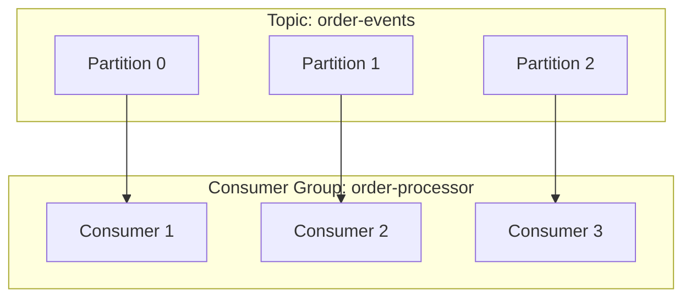
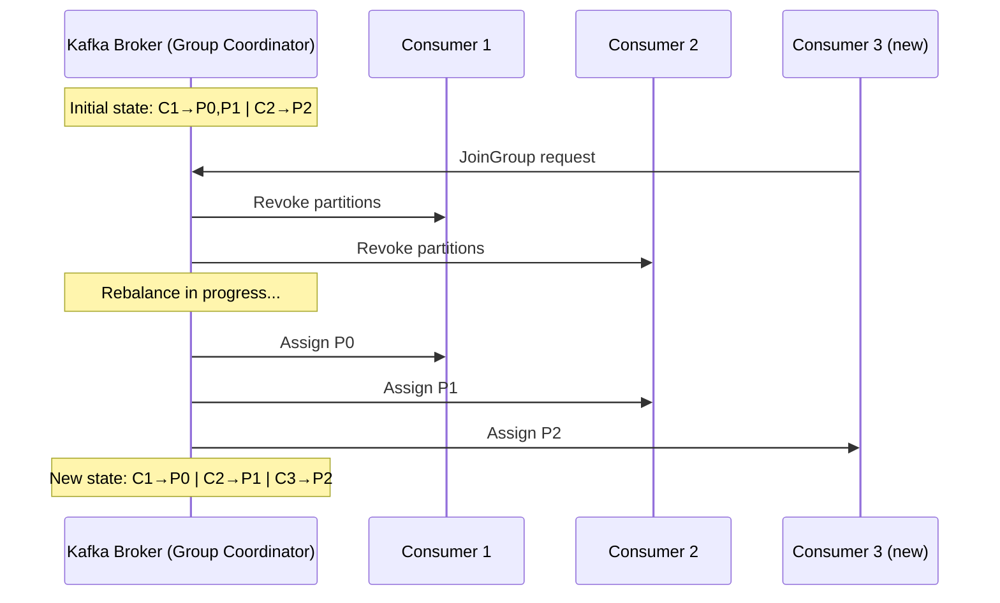

## 1. Overview

A **consumer group** is Kafka's way of letting multiple consumers **share the work** of reading messages from a topic. Think of it like a team at a restaurant — instead of one waiter serving all tables, you split the tables across multiple waiters. Each waiter (consumer) handles a subset of tables (partitions), and together the team handles the full restaurant.

Without consumer groups, every consumer would read **every** message — that's fine for broadcasting. But most systems need **work distribution**, where each message is processed **exactly once** across the group. That's what consumer groups solve.

> 💡 **Staff-level insight:** Consumer groups are Kafka's answer to horizontal scalability on the read path. Understanding how they work under the hood — rebalancing, offset management, partition assignment — separates engineers who "use Kafka" from engineers who "design with Kafka."

---

## 2. Core Concepts (Step-by-Step)

### Step 1: Topics and Partitions (What You Already Know)

A Kafka **topic** is split into **partitions**. Each partition is an ordered, immutable sequence of messages.

```
Topic: order-events (3 partitions)

Partition 0: [msg0, msg1, msg2, msg3, ...]
Partition 1: [msg0, msg1, msg2, ...]
Partition 2: [msg0, msg1, msg2, msg3, msg4, ...]
```

### Step 2: What Is a Consumer Group?

A consumer group is **a set of consumers that share a `group.id`**. Kafka assigns each partition to **exactly one consumer** within the group.



*Each partition is assigned to exactly one consumer in the group. No two consumers in the same group read the same partition.*

### Step 3: The Golden Rule

> **One partition → one consumer per group. But one consumer can read from multiple partitions.**

This means:

- If you have **3 partitions** and **3 consumers** → each gets 1 partition (ideal)
- If you have **3 partitions** and **2 consumers** → one consumer gets 2 partitions
- If you have **3 partitions** and **5 consumers** → 2 consumers sit **idle** (wasted resources)

```
3 partitions, 2 consumers:

Partition 0 ──→ Consumer 1
Partition 1 ──→ Consumer 1   ← handles 2 partitions
Partition 2 ──→ Consumer 2
```

```
3 partitions, 5 consumers:

Partition 0 ──→ Consumer 1
Partition 1 ──→ Consumer 2
Partition 2 ──→ Consumer 3
                Consumer 4   ← IDLE
                Consumer 5   ← IDLE
```

> 💡 **Staff-level insight:** This is why **the number of partitions determines your maximum parallelism** on the consumer side. Choose partition count carefully at topic creation time — increasing partitions later is possible but has operational costs (rebalancing, ordering guarantees change for new partitions).

### Step 4: Offsets — Where Am I?

Each consumer tracks its **offset** — the position of the last message it successfully processed in each partition.

```
Partition 0: [msg0, msg1, msg2, msg3, msg4, msg5]
                                      ^
                              committed offset = 3
                              (next read starts at msg4)
```

Offsets are stored in an **internal Kafka topic** called `__consumer_offsets`. When a consumer commits an offset, it's saying: "I've processed everything up to here."

### Step 5: Rebalancing — What Happens When Consumers Join or Leave

When a consumer joins or leaves the group, Kafka triggers a **rebalance** — it redistributes partitions across the remaining consumers.



*Rebalancing redistributes partitions. During rebalance, **no consumer in the group processes messages** — this is a "stop-the-world" event.*

### Step 6: Go Code — A Basic Consumer Group

```go
package main

import (
	"context"
	"fmt"
	"log"
	"os"
	"os/signal"
	"syscall"

	"github.com/IBM/sarama"
)

// ConsumerGroupHandler implements sarama.ConsumerGroupHandler
type ConsumerGroupHandler struct{}

func (h *ConsumerGroupHandler) Setup(_ sarama.ConsumerGroupSession) error {
	// Called when a new session starts (after rebalance)
	fmt.Println("Partition assigned — consumer ready")
	return nil
}

func (h *ConsumerGroupHandler) Cleanup(_ sarama.ConsumerGroupSession) error {
	// Called when a session ends (before rebalance)
	fmt.Println("Partition revoked — cleaning up")
	return nil
}

func (h *ConsumerGroupHandler) ConsumeClaim(session sarama.ConsumerGroupSession, claim sarama.ConsumerGroupClaim) error {
	// This is where you process messages
	for msg := range claim.Messages() {
		fmt.Printf("Partition: %d | Offset: %d | Value: %s\n",
			msg.Partition, msg.Offset, string(msg.Value))

		// Mark the message as processed — this commits the offset
		session.MarkMessage(msg, "")
	}
	return nil
}

func main() {
	brokers := []string{"localhost:9092"}
	groupID := "order-processor" // All instances with this ID share the work
	topic := "order-events"

	config := sarama.NewConfig()
	config.Consumer.Group.Rebalance.GroupStrategies = []sarama.BalanceStrategy{
		sarama.NewBalanceStrategyRoundRobin(), // How partitions are distributed
	}
	config.Consumer.Offsets.Initial = sarama.OffsetOldest // Start from beginning if no offset committed

	group, err := sarama.NewConsumerGroup(brokers, groupID, config)
	if err != nil {
		log.Fatalf("Failed to create consumer group: %v", err)
	}
	defer group.Close()

	ctx, cancel := context.WithCancel(context.Background())
	defer cancel()

	// Graceful shutdown
	sigchan := make(chan os.Signal, 1)
	signal.Notify(sigchan, syscall.SIGINT, syscall.SIGTERM)
	go func() {
		<-sigchan
		cancel()
	}()

	handler := &ConsumerGroupHandler{}

	// Consume runs in a loop — it handles rebalances automatically
	for {
		if err := group.Consume(ctx, []string{topic}, handler); err != nil {
			log.Printf("Consumer error: %v", err)
		}
		if ctx.Err() != nil {
			return
		}
	}
}
```

### Step 7: Multiple Consumer Groups on the Same Topic

Different groups are **independent**. Each group gets **all** messages from the topic.

```
Topic: order-events

Consumer Group A: "order-processor"
  → processes orders (reads all messages)

Consumer Group B: "analytics-pipeline"
  → feeds analytics (also reads all messages independently)

Consumer Group C: "fraud-detector"
  → checks for fraud (also reads all messages independently)
```

This is how Kafka supports both **work distribution** (within a group) and **fan-out** (across groups).

---

## 3. Use Cases

| Use Case              | How Consumer Groups Help                                                                |
| --------------------- | --------------------------------------------------------------------------------------- |
| **Order processing**  | 10 consumers in one group, each processes a subset of orders in parallel                |
| **Log aggregation**   | Multiple groups: one for search indexing, one for alerting, one for archival            |
| **Event sourcing**    | Each microservice has its own consumer group, reads the same event stream independently |
| **Stream processing** | Kafka Streams uses consumer groups internally for parallel processing                   |

**Real-world examples:**

- **LinkedIn** (where Kafka was born) — consumer groups power news feed generation, activity tracking, and metrics pipelines, each reading from shared topics independently
- **Uber** — uses separate consumer groups for trip pricing, ETA calculation, and surge detection, all consuming from the same ride-event topics
- **Netflix** — consumer groups drive real-time recommendations and A/B test analysis from viewing activity streams

---

## 4. Gotchas

### 1. Rebalance Storms

If consumers take too long to process messages and miss the `session.timeout.ms` heartbeat, Kafka thinks they're dead → triggers rebalance → other consumers get more load → they also timeout → **cascade failure**.

**Fix:** Tune these together:

```
session.timeout.ms = 30000       # How long before broker considers consumer dead
heartbeat.interval.ms = 10000    # How often consumer sends heartbeats (1/3 of session timeout)
max.poll.interval.ms = 300000    # Max time between poll() calls for processing
```

### 2. Idle Consumers Waste Money

If you have 12 consumers but only 6 partitions, 6 consumers are doing nothing but using memory, CPU, and network. **Consumers > partitions = wasted resources.**

### 3. Offset Commit Dangers

- **Auto-commit** (`enable.auto.commit=true`): Commits offsets on a timer. If your app crashes after commit but before processing → **message lost**.
- **Commit before processing**: Same problem — lost messages.
- **Commit after processing**: If you crash after processing but before commit → **message reprocessed** (at-least-once).

> 💡 **Staff-level insight:** There is no exactly-once consumption in Kafka alone. You achieve it by making your processing **idempotent** (safe to repeat) or using Kafka Transactions. In design interviews, always discuss this trade-off.

### 4. Partition Ordering Broken by Rebalance

Messages within a partition are ordered. But after a rebalance, a different consumer picks up the partition. If you haven't committed the offset correctly, you may **reprocess messages out of order**.

### 5. The `__consumer_offsets` Topic

This internal topic stores all consumer group offsets. If it gets corrupted or if the broker hosting its partitions goes down, **all consumer groups lose their position**. Monitor this topic's health.

---

## 5. Where to Use (and Where NOT to Use)

### ✅ Use consumer groups when:

- You need **parallel processing** of a message stream
- You want **multiple independent subscribers** to the same data
- You need **fault tolerance** — if one consumer dies, others pick up its partitions
- Processing order matters **per key** (Kafka guarantees order within a partition)

### ❌ Don't use consumer groups when:

- You need **exactly-once message delivery** without idempotency — use Kafka Transactions or a different system
- Your use case is **simple request-reply** — use RabbitMQ or HTTP instead
- You have very **low throughput** (< 100 msgs/sec) — a single consumer is simpler, no need for groups
- You need **message-level acknowledgment** (individual message retry) — RabbitMQ is better here; Kafka only tracks offsets (sequential position)

---

## 6. Versus (Comparisons)

### Kafka Consumer Group vs. RabbitMQ Competing Consumers

| Aspect                | Kafka Consumer Group                | RabbitMQ Competing Consumers              |
| --------------------- | ----------------------------------- | ----------------------------------------- |
| **Message delivery**  | Pull-based (consumers poll)         | Push-based (broker delivers)              |
| **Ordering**          | Per-partition ordering guaranteed   | No ordering guarantee                     |
| **Acknowledgment**    | Offset-based (sequential)           | Per-message (individual)                  |
| **Reprocessing**      | Easy — reset offset                 | Hard — message already removed from queue |
| **Scaling**           | Add consumers up to partition count | Add consumers freely                      |
| **Message retention** | Messages retained after consumption | Messages removed after ack                |
| **Complexity**        | Higher (partitions, rebalancing)    | Lower (simpler model)                     |

**Choose Kafka consumer groups when:** You need high throughput, message replay, multiple independent consumers on the same data, or ordering per partition.

**Choose RabbitMQ when:** You need per-message acknowledgment, simple retry/dead-letter handling, low latency request-reply, or your throughput is modest.

### Partition Assignment Strategies

| Strategy              | How It Works                                                   | Best For                                |
| --------------------- | -------------------------------------------------------------- | --------------------------------------- |
| **RoundRobin**        | Distributes all partitions across consumers, one by one        | Even distribution across many topics    |
| **Range**             | Assigns contiguous partition ranges to each consumer           | Co-partitioned topics (join scenarios)  |
| **Sticky**            | Like RoundRobin, but minimizes partition movement on rebalance | Reducing rebalance impact               |
| **CooperativeSticky** | Incremental rebalance — only moves what's needed               | Production systems (minimizes downtime) |

> 💡 **Staff-level insight:** In a design interview, mention **CooperativeSticky** (incremental rebalance). It shows you know that "stop-the-world" rebalancing is a real production problem and that Kafka's newer protocol solves it. This is the kind of depth interviewers look for at staff level.

---

## 7. References

- [Kafka Consumer Group Documentation](https://kafka.apache.org/documentation/#consumerconfigs) — Official Apache Kafka docs
- [Confluent: Kafka Consumer Guide](https://docs.confluent.io/platform/current/clients/consumer.html) — Practical consumer configuration guide
- [KIP-429: Incremental Cooperative Rebalancing](https://cwiki.apache.org/confluence/display/KAFKA/KIP-429) — The proposal that fixed stop-the-world rebalancing
- [Designing Data-Intensive Applications](https://dataintensive.net/) — Martin Kleppmann, Chapter 11 (Stream Processing)
- [Kafka: The Definitive Guide](https://www.confluent.io/resources/kafka-the-definitive-guide-v2/) — Chapters 4 & 5 cover consumers in depth
- [Sarama Go Client](https://github.com/IBM/sarama) — The Go library used in the code example above

---

## 8. Interview Questions

### Q1: "Design a system where 3 microservices need to process the same event stream at different speeds."

**Key points:**

- 3 separate consumer groups, one per service — each reads all messages independently
- Each group manages its own offset — slower services don't block faster ones
- Discuss partition count: it should match the highest parallelism needed across all services

**Common mistake:** Proposing 3 separate topics with a fan-out publisher. That duplicates data and adds operational complexity.

**What interviewers look for:** Understanding of consumer group independence and that Kafka's log model naturally supports multi-subscriber patterns.

### Q2: "A consumer is processing messages too slowly and keeps getting kicked out of the group. How do you fix it?"

**Key points:**

- Increase `max.poll.interval.ms` (max time between polls)
- Reduce `max.poll.records` (fewer messages per poll)
- Optimize processing logic (batch DB writes, async I/O)
- Scale out — add more consumers and partitions

**Common mistake:** Only tuning timeouts without addressing the root cause (slow processing).

**What interviewers look for:** Systematic debugging — check metrics first (consumer lag, processing time), then tune, then scale.

### Q3: "How would you handle exactly-once processing with Kafka?"

**Key points:**

- Kafka provides exactly-once **within** Kafka (transactions + idempotent producer)
- For end-to-end exactly-once (Kafka → external system), you need **idempotent consumers** — use a deduplication key stored in your database
- Discuss the performance cost of transactions

**Common mistake:** Saying "Kafka supports exactly-once" without qualifying it. Exactly-once *to an external system* requires application-level idempotency.

---

## 9. Staff-Level Preparation Tips

### What to Study Deeper

- **Kafka's group coordination protocol** — understand `JoinGroup`, `SyncGroup`, `Heartbeat`, and `LeaveGroup` RPCs at the protocol level
- **Incremental cooperative rebalancing** — know why it was introduced and how it differs from eager rebalancing
- **Consumer lag monitoring** — Burrow, Kafka's built-in metrics, and how lag relates to SLOs

### What to Build

- A multi-consumer-group setup where one group does real-time processing and another does batch analytics on the same topic
- A consumer that handles rebalancing gracefully — pausing processing, flushing in-flight work, committing offsets
- A lag monitoring dashboard using Prometheus + Grafana

### How to Demonstrate Staff-Level Thinking

- In design docs: always discuss **rebalancing impact** and how you'll mitigate it
- In interviews: bring up **consumer lag as an operational concern** before the interviewer asks
- When proposing Kafka: explain why not RabbitMQ/SQS and what the **partition count strategy** is
- Talk about **failure modes**: what happens when a consumer crashes mid-processing, how you achieve at-least-once, and when you need exactly-once semantics

### Connection to Broader Themes

Consumer groups connect to: **horizontal scaling**, **fault tolerance**, **backpressure**, **exactly-once semantics**, and **event-driven architecture** — all core topics in staff-level system design interviews.
