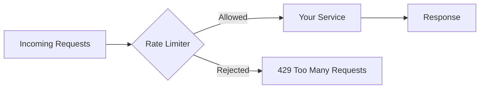
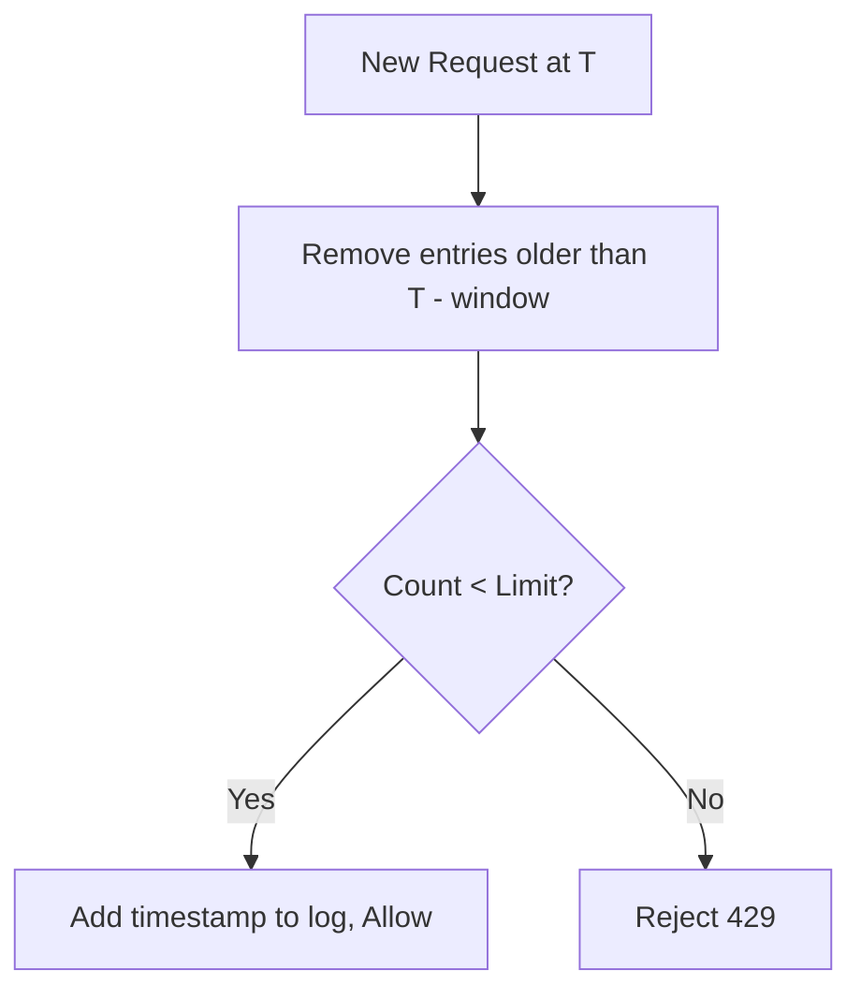
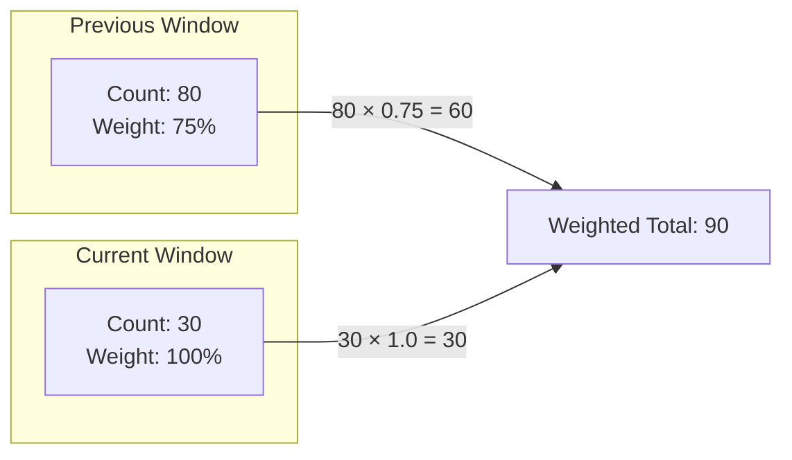
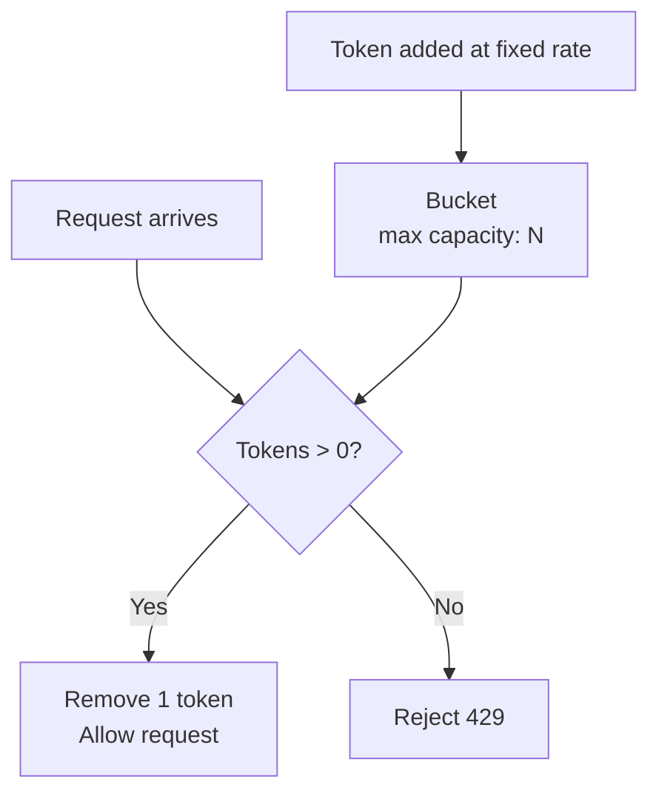
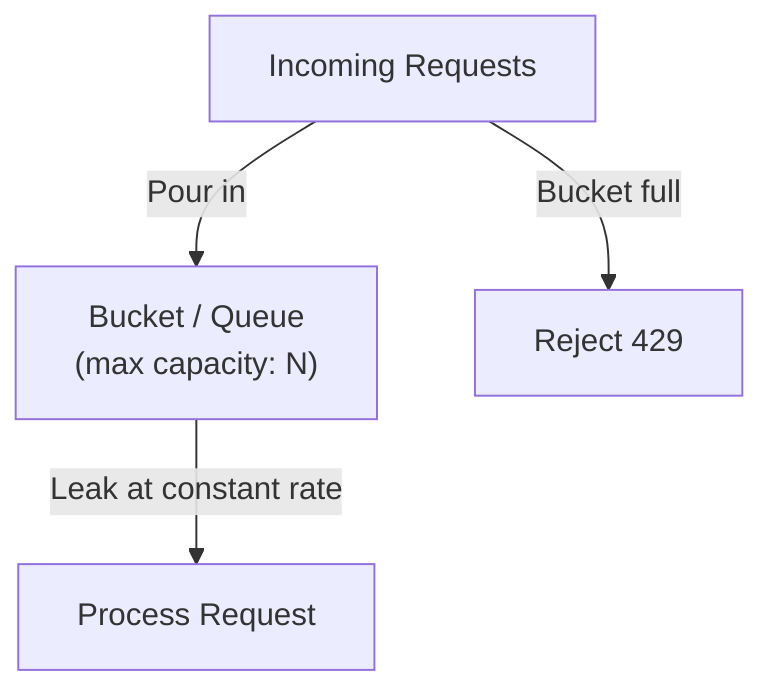
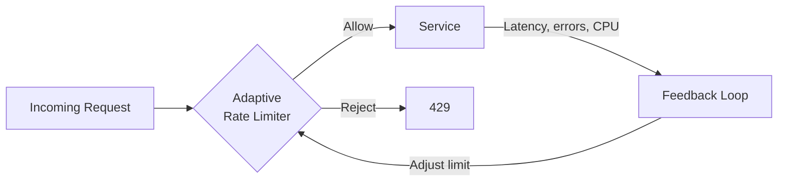
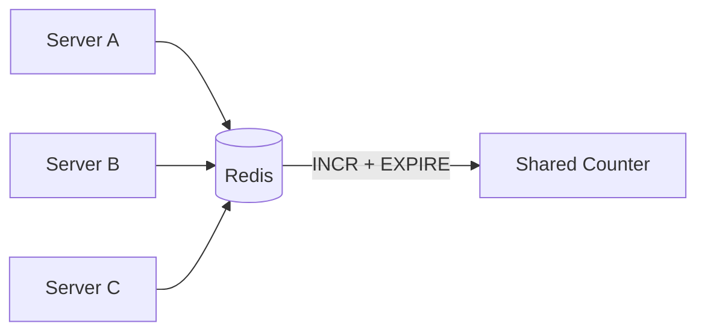
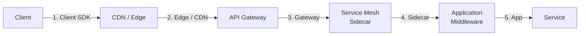

## Overview

Every production system has a breaking point. Rate limiting is the **gatekeeper** that prevents your system from reaching it.

At its core, rate limiting controls **how many requests** a client (user, service, IP) can make in a given time period. It's one of those deceptively simple concepts — easy to understand, surprisingly tricky to implement correctly at scale.

In this article, you'll learn:

- The five major rate limiting algorithms and how each one works internally
- When to pick one algorithm over another (with real-world examples from Stripe, Cloudflare, and AWS)
- How to implement rate limiting in Go with production-grade code
- The gotchas that will bite you at 3 AM — distributed rate limiting, clock skew, race conditions
- Staff-level thinking: designing rate limiters for multi-region, multi-tenant systems

> 💡 **Staff-level insight:** Rate limiting isn't just about protecting your servers. At staff level, you're thinking about **fairness** (one noisy tenant shouldn't degrade service for others), **cost control** (cloud bills scale with traffic), and **graceful degradation** (what happens when limits are hit).

## Core Concepts

### The Mental Model

Think of rate limiting like a **nightclub bouncer**. The club has a maximum capacity (your server's throughput). The bouncer's job is to control the flow of people entering. Different bouncers use different strategies:

- One counts heads per hour (Fixed Window)
- One uses a clicker that resets smoothly (Sliding Window)
- One hands out tokens at the door (Token Bucket)
- One lets people in at a steady pace, no matter how many are in line (Leaky Bucket)

Each strategy has different trade-offs around **burst tolerance**, **fairness**, **memory usage**, and **implementation complexity**.



*Rate limiter sits between clients and your service, acting as the first line of defense.*

Now let's break down each algorithm.

---

### 1. Fixed Window Counter

**How it works:** Divide time into fixed windows (e.g., 1-minute intervals). Count requests in the current window. If the count exceeds the limit, reject the request.

```
Window: 12:00:00 - 12:00:59  |  Limit: 100 requests

12:00:05 → count=1  ✅
12:00:10 → count=2  ✅
...
12:00:45 → count=100 ✅
12:00:46 → count=101 ❌ (rejected)
12:01:00 → count=1  ✅ (new window)
```



```mermaid
gantt
    title Fixed Window Counter (Limit: 100/min)
    dateFormat X
    axisFormat %s

    section Window 1
    100 requests allowed :0, 60
    section Window 2
    100 requests allowed :60, 120
```

*Each fixed window resets the counter to zero.*

**The problem — boundary burst:** A client can send 100 requests at 12:00:59 and another 100 at 12:01:00 — that's **200 requests in 2 seconds** while technically staying within the "100 per minute" limit.

```
         Window 1          |          Window 2
    ...----[100 reqs]------|-[100 reqs]----...
         12:00:59          12:01:00
         
    ← 200 requests in ~2 seconds! →
```

*The boundary burst problem: requests cluster at window edges.*

**Go Implementation:**

```go
package ratelimit

import (
	"sync"
	"time"
)

type FixedWindowLimiter struct {
	mu          sync.Mutex
	limit       int
	window      time.Duration
	counts      map[string]*windowCounter
}

type windowCounter struct {
	count     int
	windowStart time.Time
}

func NewFixedWindowLimiter(limit int, window time.Duration) *FixedWindowLimiter {
	return &FixedWindowLimiter{
		limit:  limit,
		window: window,
		counts: make(map[string]*windowCounter),
	}
}

func (f *FixedWindowLimiter) Allow(key string) bool {
	f.mu.Lock()
	defer f.mu.Unlock()

	now := time.Now()

	wc, exists := f.counts[key]
	if !exists || now.Sub(wc.windowStart) >= f.window {
		// New window — reset counter
		f.counts[key] = &windowCounter{count: 1, windowStart: now.Truncate(f.window)}
		return true
	}

	if wc.count >= f.limit {
		return false // limit exceeded
	}

	wc.count++
	return true
}
```

**When to use:** Simple APIs where occasional boundary bursts are acceptable. Good for internal services where you just need a rough guard rail.

---

### 2. Sliding Window Log

**How it works:** Keep a **log (sorted list) of timestamps** for each request. When a new request arrives, remove all entries older than the window size. If the remaining count is under the limit, allow the request.

```
Limit: 3 requests per 60 seconds
Current time: 12:01:30

Log: [12:00:20, 12:01:10, 12:01:25]

Step 1: Remove entries older than 12:00:30 → Remove 12:00:20
Step 2: Log becomes [12:01:10, 12:01:25] → count = 2
Step 3: 2 < 3 → ✅ Allow, add 12:01:30
Step 4: Log = [12:01:10, 12:01:25, 12:01:30]
```



*Sliding window log evaluates a true rolling window for every request.*

**Pros:** Perfectly accurate. No boundary burst problem.

**Cons:** **Memory-hungry.** You're storing every single request timestamp. At 10,000 requests/sec with a 1-minute window, that's 600,000 timestamps per key in memory. At scale, this kills you.

**Go Implementation:**

```go
package ratelimit

import (
	"sync"
	"time"
)

type SlidingWindowLogLimiter struct {
	mu     sync.Mutex
	limit  int
	window time.Duration
	logs   map[string][]time.Time
}

func NewSlidingWindowLogLimiter(limit int, window time.Duration) *SlidingWindowLogLimiter {
	return &SlidingWindowLogLimiter{
		limit:  limit,
		window: window,
		logs:   make(map[string][]time.Time),
	}
}

func (s *SlidingWindowLogLimiter) Allow(key string) bool {
	s.mu.Lock()
	defer s.mu.Unlock()

	now := time.Now()
	windowStart := now.Add(-s.window)

	// Remove expired entries
	log := s.logs[key]
	idx := 0
	for idx < len(log) && log[idx].Before(windowStart) {
		idx++
	}
	log = log[idx:] // keep only entries within the window

	if len(log) >= s.limit {
		s.logs[key] = log
		return false
	}

	s.logs[key] = append(log, now)
	return true
}
```

**When to use:** Low-traffic APIs where precision matters more than memory (e.g., rate limiting expensive operations like password resets or payment retries).

---

### 3. Sliding Window Counter

**How it works:** A **hybrid** of fixed window and sliding window log. Instead of storing every timestamp, you keep counters for the current and previous window. Then you **weight** the previous window's count based on how far into the current window you are.

```
Previous window count: 80
Current window count:  30
Window size: 60 seconds
Current position: 15 seconds into current window

Weighted count = 80 × ((60-15)/60) + 30
               = 80 × 0.75 + 30
               = 60 + 30
               = 90

If limit = 100 → 90 < 100 → ✅ Allow
```



*Sliding window counter blends two fixed windows using a time-based weight.*

**Why this is clever:** You get most of the accuracy benefits of the sliding window log with the memory efficiency of a fixed window counter — just **two counters per key** instead of thousands of timestamps.

**Go Implementation:**

```go
package ratelimit

import (
	"sync"
	"time"
)

type SlidingWindowCounterLimiter struct {
	mu     sync.Mutex
	limit  int
	window time.Duration
	counts map[string]*slidingCounter
}

type slidingCounter struct {
	prevCount   int
	currCount   int
	currStart   time.Time
}

func NewSlidingWindowCounterLimiter(limit int, window time.Duration) *SlidingWindowCounterLimiter {
	return &SlidingWindowCounterLimiter{
		limit:  limit,
		window: window,
		counts: make(map[string]*slidingCounter),
	}
}

func (s *SlidingWindowCounterLimiter) Allow(key string) bool {
	s.mu.Lock()
	defer s.mu.Unlock()

	now := time.Now()

	sc, exists := s.counts[key]
	if !exists {
		s.counts[key] = &slidingCounter{
			currCount: 1,
			currStart: now.Truncate(s.window),
		}
		return true
	}

	// Check if we've moved to a new window
	elapsed := now.Sub(sc.currStart)
	if elapsed >= s.window {
		// FIX: If more than ONE full window has elapsed since the last request,
		// the "previous" window we'd inherit is actually stale (could be many
		// windows old). In that case, prevCount must be zero — otherwise an
		// idle user reappearing 5 minutes later would be charged for traffic
		// from 5 minutes ago, inflating the weighted count.
		if elapsed >= 2*s.window {
			sc.prevCount = 0
		} else {
			sc.prevCount = sc.currCount
		}
		sc.currCount = 0
		sc.currStart = now.Truncate(s.window)
		elapsed = now.Sub(sc.currStart)
	}

	// Calculate weighted count
	prevWeight := float64(s.window-elapsed) / float64(s.window)
	weightedCount := float64(sc.prevCount)*prevWeight + float64(sc.currCount)

	if weightedCount >= float64(s.limit) {
		return false
	}

	sc.currCount++
	return true
}
```

> 💡 **Staff-level insight:** This is the algorithm **Cloudflare uses** for their rate limiting product. It's the sweet spot — accurate enough for production, cheap enough for millions of keys. When an interviewer asks you to design a rate limiter, this is often the best answer because it shows you understand the trade-off between precision and resource usage.

---

### 4. Token Bucket

**How it works:** Imagine a bucket that holds tokens. Tokens are added at a fixed rate (e.g., 10 tokens/second). Each request consumes one token. If the bucket is empty, the request is rejected. The bucket has a maximum capacity, which controls the **burst size**.

```
Bucket capacity: 10 tokens
Refill rate: 2 tokens/second

T=0:  Bucket = 10  → Request → Bucket = 9  ✅
T=0:  Bucket = 9   → Request → Bucket = 8  ✅
...
T=0:  Bucket = 1   → Request → Bucket = 0  ✅
T=0:  Bucket = 0   → Request → REJECTED    ❌
T=1:  Bucket = 2   → (2 tokens refilled)
T=1:  Bucket = 2   → Request → Bucket = 1  ✅
```



*Token bucket: tokens refill at a steady rate, requests consume tokens.*

**Key property:** The token bucket **allows bursts** up to the bucket capacity while enforcing an average rate. This is ideal for APIs where you want to allow short bursts (e.g., page loads that fire 10 API calls at once) but cap sustained throughput.

**Go Implementation:**

```go
package ratelimit

import (
	"sync"
	"time"
)

type TokenBucketLimiter struct {
	mu         sync.Mutex
	capacity   float64   // max tokens
	rate       float64   // tokens per second
	buckets    map[string]*bucket
}

type bucket struct {
	tokens     float64
	lastRefill time.Time
}

func NewTokenBucketLimiter(capacity int, ratePerSecond float64) *TokenBucketLimiter {
	return &TokenBucketLimiter{
		capacity: float64(capacity),
		rate:     ratePerSecond,
		buckets:  make(map[string]*bucket),
	}
}

func (t *TokenBucketLimiter) Allow(key string) bool {
	t.mu.Lock()
	defer t.mu.Unlock()

	now := time.Now()

	b, exists := t.buckets[key]
	if !exists {
		// Start with a full bucket
		t.buckets[key] = &bucket{
			tokens:     t.capacity - 1, // consume one for this request
			lastRefill: now,
		}
		return true
	}

	// Refill tokens based on elapsed time
	elapsed := now.Sub(b.lastRefill).Seconds()
	b.tokens += elapsed * t.rate
	if b.tokens > t.capacity {
		b.tokens = t.capacity
	}
	b.lastRefill = now

	if b.tokens < 1 {
		return false
	}

	b.tokens--
	return true
}
```

**Real-world usage:**

- **AWS API Gateway** uses token bucket for throttling
- **Stripe** uses a variant of token bucket for API rate limiting
- **Linux kernel** uses token bucket for network traffic shaping (`tc` command)

---

### 5. Leaky Bucket

**How it works:** Think of a bucket with a **hole at the bottom**. Requests pour into the bucket from the top. They "leak" out (are processed) at a **constant rate** from the bottom. If the bucket overflows (queue is full), new requests are rejected.

```
Bucket capacity: 5 (queue size)
Leak rate: 1 request/second (processing rate)

T=0: [R1, R2, R3] pour in → Bucket = [R1, R2, R3]
T=0: R1 leaks out → processed
T=1: R2 leaks out → processed
T=1: [R4, R5, R6, R7] pour in → Bucket = [R3, R4, R5, R6, R7] (full!)
T=1: R8 arrives → REJECTED (bucket overflow)
T=2: R3 leaks out → Bucket has space again
```



*Leaky bucket: requests queue up and drain at a fixed rate. Overflow = rejection.*

**Key difference from Token Bucket:** The leaky bucket **smooths out bursts** — output rate is always constant. Token bucket allows bursts up to capacity. This is a critical distinction.

```
Token Bucket:  ████████░░  →  burst of 8 at once, then wait
Leaky Bucket:  █░█░█░█░█░  →  steady drip, always one at a time
```

*Token bucket allows bursts; leaky bucket enforces a smooth, constant output rate.*

**Go Implementation:**

```go
package ratelimit

import (
	"sync"
	"time"
)

type LeakyBucketLimiter struct {
	mu        sync.Mutex
	capacity  int           // max queue size
	rate      time.Duration // time between each leak (process interval)
	buckets   map[string]*leakyState
}

type leakyState struct {
	queueSize int
	lastLeak  time.Time
}

func NewLeakyBucketLimiter(capacity int, ratePerSecond float64) *LeakyBucketLimiter {
	return &LeakyBucketLimiter{
		capacity: capacity,
		rate:     time.Duration(float64(time.Second) / ratePerSecond),
		buckets:  make(map[string]*leakyState),
	}
}

func (l *LeakyBucketLimiter) Allow(key string) bool {
	l.mu.Lock()
	defer l.mu.Unlock()

	now := time.Now()

	ls, exists := l.buckets[key]
	if !exists {
		l.buckets[key] = &leakyState{
			queueSize: 1,
			lastLeak:  now,
		}
		return true
	}

	// Drain requests that have leaked since last check
	elapsed := now.Sub(ls.lastLeak)
	leaked := int(elapsed / l.rate)
	if leaked > 0 {
		ls.queueSize -= leaked
		if ls.queueSize < 0 {
			ls.queueSize = 0
		}
		ls.lastLeak = now
	}

	if ls.queueSize >= l.capacity {
		return false // bucket overflow
	}

	ls.queueSize++
	return true
}
```

**Real-world usage:**

- **NGINX** uses leaky bucket for its `limit_req` module (the `burst` parameter is the bucket size, `nodelay` switches behavior)
- **Network routers** use leaky bucket for traffic policing and shaping

> 💡 **Staff-level insight:** "Leaky bucket" actually refers to **two different algorithms** in the literature, and confusing them is a common interview trap. The **leaky-bucket-as-a-meter** (what the code above implements) tracks a counter that drains at a fixed rate — it just decides allow/reject. The **leaky-bucket-as-a-queue** is an actual FIFO queue with constant drain rate — requests wait in line and are processed one at a time. NGINX's `limit_req` is the meter variant; traffic shapers in network gear are the queue variant. When asked "how does leaky bucket work," name both and pick one.

---

### 6. Adaptive (Dynamic) Rate Limiting

Everything above assumes **static limits** — "100 requests per second per user" baked into config. In production at scale, that's not enough. What if your service is degraded (high CPU, slow downstream dependency)? A static 100 rps limit might still overwhelm it. What if there's spare capacity? Why reject legitimate traffic?

**Adaptive rate limiting** adjusts limits dynamically based on **system signals**:

- **CPU utilization** (Netflix's Concurrency Limits library)
- **Latency P99** (if latency rises above threshold, lower limits)
- **Downstream error rate** (start shedding when error budget burns)
- **Queue depth** (Little's Law: if queue grows, you're slower than incoming rate)



*Adaptive rate limiting closes the loop between system health and admission control.*

**Real systems:**

- **Netflix's `concurrency-limits`** library uses **TCP-style additive-increase-multiplicative-decrease (AIMD)** — increase concurrency when latency is good, slash it when latency degrades.
- **Google SRE's adaptive throttling** (described in the SRE book, Ch 21) uses a client-side ratio — clients reduce their own request rate when they observe rejections, preventing overload at the server.
- **AWS DynamoDB's adaptive capacity** — automatically rebalances throughput across hot partitions.

> 💡 **Staff-level insight:** Static rate limits are **senior-level**. Adaptive limits are **staff-level**. The leap is from "protect the system from clients" to "the system protects itself with control theory." If you mention AIMD or PID controllers in a design interview, you signal you understand admission control as a feedback problem, not just a counter.

---

### Algorithm Comparison at a Glance


*Accuracy vs memory trade-off for each algorithm.*

---

## Distributed Rate Limiting

Everything above works great on a single server. But in production, you have **multiple instances** behind a load balancer. Now what?

### The Problem

```
Client → Load Balancer ──→ Server A (count=50)
                       ──→ Server B (count=50)
                       ──→ Server C (count=50)

Total actual requests: 150
Per-server limit: 100
Client bypasses the limit!
```

*Without coordination, each server tracks its own count — rates are multiplied by server count.*

### Solution 1: Centralized Store (Redis)

Use **Redis** as a shared counter. Every server checks and increments the counter in Redis.



*Redis as a centralized rate limit store — the most common production pattern.*

**Redis implementation with Lua for atomicity:**

```go
package ratelimit

import (
	"context"
	"fmt"
	"time"

	"github.com/redis/go-redis/v9"
)

type RedisRateLimiter struct {
	client *redis.Client
	limit  int
	window time.Duration
}

// Lua script ensures atomic check-and-increment
// This avoids race conditions between multiple servers
var luaScript = redis.NewScript(`
	local key = KEYS[1]
	local limit = tonumber(ARGV[1])
	local window = tonumber(ARGV[2])

	local current = redis.call("INCR", key)
	if current == 1 then
		redis.call("EXPIRE", key, window)
	end

	if current > limit then
		return 0
	end
	return 1
`)

func NewRedisRateLimiter(client *redis.Client, limit int, window time.Duration) *RedisRateLimiter {
	return &RedisRateLimiter{
		client: client,
		limit:  limit,
		window: window,
	}
}

func (r *RedisRateLimiter) Allow(ctx context.Context, key string) (bool, error) {
	windowKey := fmt.Sprintf("rl:%s:%d", key, time.Now().Unix()/int64(r.window.Seconds()))

	result, err := luaScript.Run(ctx, r.client, []string{windowKey}, r.limit, int(r.window.Seconds())).Int()
	if err != nil {
		// IMPORTANT: On Redis failure, decide on a fail-open or fail-closed policy
		return true, err // fail-open: allow traffic if Redis is down
	}

	return result == 1, nil
}
```

> 💡 **Staff-level insight:** The `fail-open` vs `fail-closed` decision when Redis is unavailable is a **critical design choice**. Stripe and Cloudflare fail-open — they'd rather let some extra traffic through than block legitimate customers. A banking system would fail-closed. In a design interview, explicitly discuss this trade-off. It shows you think about failure modes.

### Distributed Token Bucket with Redis

The simple `INCR` pattern above implements a fixed window. **Token bucket** is harder to distribute because it needs atomic refill + decrement. Here's a production-grade Lua implementation:

```go
package ratelimit

import (
	"context"
	"time"

	"github.com/redis/go-redis/v9"
)

// Atomic token bucket: refill based on elapsed time, then try to consume 1 token.
// Returns 1 if allowed, 0 if rejected. Also returns remaining tokens for headers.
var tokenBucketScript = redis.NewScript(`
	local key       = KEYS[1]
	local capacity  = tonumber(ARGV[1])
	local rate      = tonumber(ARGV[2])  -- tokens per second
	local now_ms    = tonumber(ARGV[3])  -- current time in milliseconds
	local cost      = tonumber(ARGV[4])  -- usually 1

	local data = redis.call("HMGET", key, "tokens", "ts")
	local tokens = tonumber(data[1])
	local ts     = tonumber(data[2])

	if tokens == nil then
		tokens = capacity
		ts = now_ms
	end

	-- Refill based on elapsed time (in seconds)
	local elapsed = math.max(0, (now_ms - ts) / 1000.0)
	tokens = math.min(capacity, tokens + elapsed * rate)

	local allowed = 0
	if tokens >= cost then
		tokens = tokens - cost
		allowed = 1
	end

	redis.call("HMSET", key, "tokens", tokens, "ts", now_ms)
	-- TTL = time for an empty bucket to fully refill, plus slack
	redis.call("PEXPIRE", key, math.ceil(capacity / rate * 1000) + 5000)

	return { allowed, tokens }
`)

type RedisTokenBucket struct {
	client   *redis.Client
	capacity int
	rate     float64 // tokens per second
}

func (r *RedisTokenBucket) Allow(ctx context.Context, key string) (bool, float64, error) {
	nowMs := time.Now().UnixMilli()
	res, err := tokenBucketScript.Run(ctx, r.client,
		[]string{"tb:" + key},
		r.capacity, r.rate, nowMs, 1,
	).Slice()
	if err != nil {
		return true, 0, err // fail-open
	}
	allowed := res[0].(int64) == 1
	remaining, _ := res[1].(float64)
	return allowed, remaining, nil
}
```

The `remaining` return value is exactly what you want for the `X-RateLimit-Remaining` HTTP header.

### Solution 2: Local Rate Limiting with Coordination

Each server maintains a **local rate limiter** but periodically **syncs** with a central store. This avoids the latency hit of checking Redis on every request.

- **Pros:** Lower latency, works even if the central store is briefly unavailable
- **Cons:** Less accurate — limits are approximate. A client might get 10-20% more requests through

**Lyft's Envoy proxy** uses this approach via its `ratelimit` service.

### Solution 3: Sticky Sessions

Route all requests from a single client to the **same server** (via consistent hashing or session affinity). Then local rate limiting is sufficient.

- **Pros:** Simple, no distributed coordination needed
- **Cons:** Uneven load distribution, single point of failure for a given client

---

## Architectural Placement

Before picking an algorithm, answer the more important question: **where does the rate limiter live in your stack?** This is usually the first thing a senior reviewer will probe in a design doc, and it's the question most candidates skip in interviews.



*Five possible placements, ordered from client to service. You can use multiple in combination.*

### The Five Placements

**1. Client-side (SDK):** The client throttles itself before making a request. Used by AWS SDKs, Google Cloud client libraries.

**2. Edge / CDN (Cloudflare, Akamai, AWS WAF):** Rate limits applied at network edge before traffic enters your infrastructure. Best for DDoS mitigation.

**3. API Gateway (Kong, NGINX, AWS API Gateway, Envoy gateway):** Centralized enforcement at the ingress to your platform. Most common production placement.

**4. Service Mesh Sidecar (Envoy + Lyft `ratelimit` service, Istio):** Per-service rate limiting deployed as a sidecar. Good for service-to-service traffic.

**5. Application Middleware (Go middleware, Express middleware):** Rate limit logic inside your application code. Most flexible, most coupled.

### Trade-off Comparison

| Aspect                     | Client SDK             | Edge/CDN           | API Gateway            | Service Mesh            | App Middleware            |
| -------------------------- | ---------------------- | ------------------ | ---------------------- | ----------------------- | ------------------------- |
| **Latency overhead**       | Zero (client side)     | Sub-ms             | 1–5 ms                 | 0.5–2 ms (sidecar)      | <1 ms (in-process)        |
| **Granularity**            | Per-client only        | IP, geo, headers   | Per-route, per-key     | Per-service, per-method | Anything (business rules) |
| **Operational complexity** | Distributed (clients)  | Vendor-managed     | Centralized config     | High (mesh + Redis)     | Per-service code          |
| **Coupling**               | Tied to client version | None               | Loose                  | Loose (sidecar)         | Tight (in app)            |
| **Visibility**             | Client logs only       | Vendor dashboard   | Centralized            | Mesh telemetry          | App metrics               |
| **Best for**               | Quota hints, retries   | DDoS, geo-blocking | Public API throttling  | E-W microservices       | Business-rule limits      |
| **Worst for**              | Untrusted clients      | Per-user fairness  | Internal service calls | Public APIs             | Cross-cutting limits      |

### My Opinion

> **For most teams, start with the API Gateway** (Kong, AWS API Gateway, or Envoy). It gives you centralized config, zero application coupling, decent visibility, and works for the 80% case (public API throttling).
>
> **Add edge/CDN rate limiting** the moment you face DDoS or bot traffic — don't try to absorb attack traffic in your gateway.
>
> **Add application middleware** only for limits that depend on business logic (e.g., "free tier users can only run 3 reports per day" requires DB lookups the gateway doesn't have).
>
> **Add service mesh rate limits** when you're doing 50+ services and need to prevent retry storms between services. This is rarely the first thing you need.
>
> **Avoid client-side as your only line of defense** — clients can be modified, removed, or be malicious.

> 💡 **Staff-level insight:** Rate limits should be **layered**, not single-point. Cloudflare at edge for DDoS, API gateway for per-key quotas, and application middleware for business rules. Each layer protects different things and fails differently. If your design has only one layer, it has only one failure mode — and you've created a single point of failure for your protection mechanism.

---

## Scale Analysis

The overview promised to discuss how behavior changes at 10x, 100x, 1000x scale. Here's the systematic answer.

The **dominant variable** at scale is the number of **unique rate limit keys** (users, API keys, IPs, tenants). It determines memory footprint, hot key risk, and infrastructure choice.

### Memory Footprint per Algorithm (per key)

| Algorithm              | Bytes per key | Why                                 |
| ---------------------- | ------------- | ----------------------------------- |
| Fixed Window           | ~24 B         | int counter + timestamp             |
| Sliding Window Counter | ~40 B         | 2 counters + timestamp              |
| Token Bucket           | ~32 B         | float tokens + timestamp            |
| Leaky Bucket           | ~24 B         | int queue size + timestamp          |
| Sliding Window Log     | **~16 B × N** | one timestamp per request in window |

At 10K req/sec sustained per key with a 1-minute window, sliding window log uses **~10 MB per key**. Multiply by your key count and the math gets ugly fast.

### Behavior at Different Key Cardinalities

| Scale                                    | 1K keys        | 100K keys                      | 10M keys                               | 100M keys                                 |
| ---------------------------------------- | -------------- | ------------------------------ | -------------------------------------- | ----------------------------------------- |
| **Total memory (sliding counter)**       | ~40 KB         | ~4 MB                          | ~400 MB                                | ~4 GB                                     |
| **Total memory (sliding log @ 100 rps)** | ~6 MB          | ~600 MB                        | ~60 GB                                 | impossible                                |
| **In-memory feasible?**                  | Yes (any algo) | Yes (any algo, watch log)      | Counter algos only                     | No (must shard)                           |
| **Single Redis instance OK?**            | Yes            | Yes                            | Borderline (~1M ops/s ceiling)         | No (must cluster)                         |
| **Recommended infra**                    | App memory     | App memory or single Redis     | Redis with replication, batched writes | Redis Cluster, key sharding, edge caching |
| **Recommended algorithm**                | Anything       | Sliding counter / token bucket | Sliding counter / token bucket         | Token bucket (simpler to shard)           |
| **Latency overhead target**              | <0.1 ms        | <0.5 ms                        | <2 ms                                  | <5 ms                                     |

### Inflection Points (When Things Break)

**At ~1M unique keys:** A single Redis instance starts feeling memory pressure. Switch from sliding window log to sliding window counter. Add Redis replicas for read scale.

**At ~10M unique keys:** Network bandwidth between app and Redis becomes the bottleneck (every request = 1 RTT). Two fixes:

- **Local cache + periodic sync** — each app instance keeps a local counter, flushes to Redis every 100ms
- **Pipelined batching** — group multiple rate limit checks into one Redis pipeline

**At ~100M unique keys:** Single Redis can't hold the keyspace. You need:

- **Redis Cluster** with consistent hashing on the rate limit key
- **Hot key protection** — if one key (e.g., a viral user) gets 1M rps, that single Redis shard melts. Use a local cache layer in front for hot keys, or pre-shard hot keys (e.g., `user:123:shard1`, `user:123:shard2`)
- **Edge enforcement** — push rate limiting to CDN/edge so traffic never hits your origin Redis

**At ~1B+ unique keys (Cloudflare/AWS scale):** No central store can keep up. You move to **eventually-consistent regional rate limiters** with periodic sync. You accept that limits are approximate (a client might get 1.1x the limit instead of exactly 1.0x). Cloudflare has written about doing this with **gossip protocols** between PoPs.

> 💡 **Staff-level insight:** The most important number is **how often a key is hit, not how many keys exist**. 100M keys hit once each is easy (long TTL, low write rate). 1M keys hit 1000 times/sec each is **brutal** (1B writes/sec). When sizing, always ask: "What's the access pattern, not just the cardinality?" This is where senior engineers underestimate and staff engineers ask the right question.

### Latency Budget at Scale

If your service has a 50ms P99 latency target, the rate limiter has at most ~2ms budget. At 100K rps:

- **In-process check:** ~0.001 ms (memory map lookup)
- **Local Redis (same DC):** ~0.5–1 ms
- **Cross-AZ Redis:** ~2–5 ms (often blows the budget)
- **Cross-region Redis:** **don't.** Use regional rate limiters with eventual sync.

---

## Use Cases

### 1. API Rate Limiting (Stripe, GitHub)

Every public API needs rate limiting. Stripe limits to 100 requests/sec in live mode. GitHub limits to 5,000 requests/hour for authenticated users. They typically use **token bucket** — it allows short bursts while enforcing overall throughput.

### 2. DDoS Mitigation (Cloudflare)

Cloudflare processes 50+ million requests/second. Their rate limiting uses **sliding window counters** at the edge (in each PoP) with approximate global coordination. The priority is speed — checking rate limits must add sub-millisecond latency.

### 3. Login/Authentication Throttling

Preventing brute force attacks on login endpoints. Use **fixed window** or **sliding window log** with tight limits (e.g., 5 attempts per 15 minutes). Here accuracy matters more than performance since the volume is low.

### 4. Multi-Tenant SaaS (AWS)

AWS uses rate limiting to ensure **fair resource sharing** across tenants. Each service has per-account limits (e.g., DynamoDB: 40,000 RCUs per table by default). This prevents a single noisy customer from impacting others — a core requirement for any multi-tenant platform.

### 5. Microservice-to-Microservice Communication

Internal services rate limit each other to prevent **cascading failures**. If Service A starts flooding Service B with requests due to a retry storm, B's rate limiter prevents it from going down and taking the entire system with it.

---

## Gotchas

### 1. Race Conditions in Distributed Systems

The **check-then-increment** pattern is not atomic without protection:

```
Server A: GET count → 99
Server B: GET count → 99
Server A: SET count → 100 ✅ (allowed)
Server B: SET count → 100 ✅ (should have been rejected!)
```

**Fix:** Use Redis Lua scripts (atomic operations) or `INCR` which is atomic by nature. Never do separate `GET` + `SET`.

### 2. Clock Skew Across Servers

If server A's clock is 2 seconds ahead of server B's, window boundaries differ. A client can exploit this to get extra requests.

**Fix:** Use a **centralized timestamp** source (Redis `TIME` command) or NTP with tight skew bounds. Better yet, use an algorithm like token bucket that doesn't depend on strict window alignment.

### 3. Thundering Herd at Window Reset

Fixed window counters reset simultaneously for all clients. If many clients are being throttled and waiting, they'll **all retry at the window boundary** — creating a spike that's worse than the original load.

**Fix:** Add **jitter** to window boundaries. Or use token bucket / sliding window which don't have hard resets.

### 4. Memory Leaks from Inactive Keys

If you're storing per-user counters in memory, inactive users accumulate forever.

**Fix:** Use TTLs (Redis `EXPIRE`) or run periodic cleanup. In Go, you can use a background goroutine:

```go
func (f *FixedWindowLimiter) cleanup(interval time.Duration) {
	ticker := time.NewTicker(interval)
	for range ticker.C {
		f.mu.Lock()
		now := time.Now()
		for key, wc := range f.counts {
			if now.Sub(wc.windowStart) > f.window*2 {
				delete(f.counts, key)
			}
		}
		f.mu.Unlock()
	}
}
```

### 5. Rate Limiting by the Wrong Key

Rate limiting by IP addresses breaks when traffic comes through a **shared NAT gateway** or **corporate proxy** — thousands of legitimate users share one IP. Rate limiting by API key is better, but what if the key is stolen?

**Fix:** Layer multiple identifiers — IP + API key + user ID. Apply different limits at each layer.

### 6. Fail-Open Under Redis Failure

If Redis goes down and you fail to check the rate limit, you have two bad choices:

- **Fail-open:** Allow all traffic through (risk overload)
- **Fail-closed:** Block all traffic (self-inflicted outage)

**Fix:** Fall back to **local in-memory rate limiting** when Redis is unavailable. It's less accurate but better than either extreme.

> 💡 **Staff-level insight:** At Stripe, the rate limiting system has a **circuit breaker** on the Redis connection. If Redis latency exceeds 5ms, they fall back to local limits. Discuss this pattern in design interviews — it shows you think about the rate limiter's own failure modes, not just the system it protects.

---

## Where to Use (and Where NOT to Use)

### Use Rate Limiting When:

- **Public-facing APIs** — Always. Non-negotiable.
- **Authentication endpoints** — Prevent brute force attacks
- **Expensive operations** — Resource-intensive queries, report generation, file uploads
- **Multi-tenant systems** — Enforce fair usage across tenants
- **Inter-service communication** — Prevent cascading failures and retry storms

### Do NOT Use Rate Limiting When:

- **Internal health checks** — Rate limiting your liveness probe will cause K8s to restart your pods
- **Critical path failover** — If a backup system activates during an outage, don't rate limit its catch-up traffic
- **Idempotent bulk jobs** — Background jobs with natural backpressure don't need rate limits; use queue depth controls instead
- **As a substitute for autoscaling** — Rate limiting is a **safety net**, not a capacity planning strategy. If you're regularly hitting rate limits, you need more capacity, not higher limits

---

## Versus (Comparisons)

| Aspect             | Fixed Window          | Sliding Window Log         | Sliding Window Counter | Token Bucket                 | Leaky Bucket              |
| ------------------ | --------------------- | -------------------------- | ---------------------- | ---------------------------- | ------------------------- |
| **Accuracy**       | Low (boundary burst)  | Highest                    | High                   | High                         | High                      |
| **Memory**         | Very low (1 counter)  | Very high (all timestamps) | Low (2 counters)       | Low (1 float + timestamp)    | Low (1 int + timestamp)   |
| **Burst handling** | Allows 2x at boundary | No bursts leak through     | Minimal burst          | Allows controlled bursts     | No bursts (smooth output) |
| **Complexity**     | Trivial               | Moderate                   | Moderate               | Moderate                     | Moderate                  |
| **Distributed**    | Easy (Redis INCR)     | Hard (sorted sets)         | Easy (two keys)        | Moderate (float sync)        | Moderate                  |
| **Best for**       | Simple internal APIs  | Low-volume critical paths  | General-purpose APIs   | APIs needing burst tolerance | Traffic shaping, queuing  |

**Choose Fixed Window when...** you need the simplest possible implementation and occasional boundary bursts are acceptable.

**Choose Sliding Window Counter when...** you want a good balance of accuracy and memory, and you're at scale (Cloudflare's choice).

**Choose Token Bucket when...** you want to allow legitimate burst traffic while enforcing average rates (Stripe, AWS API Gateway).

**Choose Leaky Bucket when...** you need a perfectly smooth output rate (network traffic shaping, NGINX request limiting).

**Choose Sliding Window Log when...** you need perfect accuracy for low-volume, high-stakes endpoints (payment retries, password resets).

---

## HTTP Response Headers

A well-designed rate limiter communicates its state to clients via headers. This is part of being a good API citizen:

```
HTTP/1.1 429 Too Many Requests
Retry-After: 30
X-RateLimit-Limit: 100
X-RateLimit-Remaining: 0
X-RateLimit-Reset: 1619328060
```

| Header                  | Purpose                                          |
| ----------------------- | ------------------------------------------------ |
| `Retry-After`           | Seconds until the client should retry (RFC 7231) |
| `X-RateLimit-Limit`     | Maximum requests allowed in the window           |
| `X-RateLimit-Remaining` | Requests remaining in the current window         |
| `X-RateLimit-Reset`     | Unix timestamp when the window resets            |

> 💡 **Staff-level insight:** There's an IETF draft ([RFC 6585 successor](https://datatracker.ietf.org/doc/draft-ietf-httpapi-ratelimit-headers/)) standardizing these headers as `RateLimit-Limit`, `RateLimit-Remaining`, `RateLimit-Reset`. Use the standard names in new APIs — it shows you pay attention to interoperability.

---

## Monitoring and Observability

You can't manage what you can't measure. Set up these metrics:

| Metric                                                    | What it tells you                    |
| --------------------------------------------------------- | ------------------------------------ |
| `rate_limit_requests_total` (by status: allowed/rejected) | Overall hit rate and rejection ratio |
| `rate_limit_current_usage` (by key/tenant)                | Which tenants are close to limits    |
| `rate_limit_latency_seconds`                              | Overhead added by rate limiting      |
| `rate_limit_redis_errors_total`                           | Centralized store health             |
| `rate_limit_fallback_active`                              | When local fallback is engaged       |

**Alert on:**

- Rejection rate > 20% sustained (you might need to raise limits or scale)
- Redis latency > 5ms P99 (rate limiter is becoming a bottleneck)
- Any single tenant consuming > 50% of cluster capacity

---

## References

- **Stripe Engineering Blog:** [Scaling your API with Rate Limiters](https://stripe.com/blog/rate-limiters) — Excellent deep dive on token bucket with Redis
- **Cloudflare Blog:** [How We Built Rate Limiting](https://blog.cloudflare.com/counting-things-a-lot-of-different-things/) — Sliding window counter at edge scale
- **Google Cloud Architecture:** [Rate Limiting Strategies](https://cloud.google.com/architecture/rate-limiting-strategies-techniques) — Comprehensive overview with GCP patterns
- **NGINX Documentation:** [Rate Limiting](https://www.nginx.com/blog/rate-limiting-nginx/) — Leaky bucket implementation explained
- **IETF Draft:** [RateLimit Header Fields](https://datatracker.ietf.org/doc/draft-ietf-httpapi-ratelimit-headers/) — Emerging standard for rate limit response headers
- **Kong Gateway:** [Rate Limiting Plugin](https://docs.konghq.com/hub/kong-inc/rate-limiting/) — Production-grade rate limiting in API gateways
- **Google SRE Book — Chapter 21:** [Handling Overload](https://sre.google/sre-book/handling-overload/) — Definitive treatment of admission control, adaptive throttling, and load shedding
- **Go stdlib:** [`golang.org/x/time/rate`](https://pkg.go.dev/golang.org/x/time/rate) — Production-grade token bucket implementation. Read the source — it's a masterclass in lock-free token bucket
- **Netflix concurrency-limits:** [github.com/Netflix/concurrency-limits](https://github.com/Netflix/concurrency-limits) — AIMD-based adaptive concurrency control library
- **Uber `ratelimit`:** [github.com/uber-go/ratelimit](https://github.com/uber-go/ratelimit) — Leaky bucket implementation in Go
- **Envoy Rate Limit Service:** [github.com/envoyproxy/ratelimit](https://github.com/envoyproxy/ratelimit) — Reference implementation for distributed rate limiting in service mesh
- **System Design Interview – Alex Xu:** Chapter 4: Design a Rate Limiter — Great interview walkthrough

---

## Interview Questions

### Q1: "Design a rate limiter for a distributed API serving 1M requests/second."

**Key points to cover:**

- Algorithm choice: Token bucket or sliding window counter (explain why)
- Centralized vs local: Redis with Lua scripts for atomicity
- Failure handling: Fail-open with local fallback
- Multi-tier: IP-level, user-level, and endpoint-level limits
- Headers: Return proper `Retry-After` and `X-RateLimit-*` headers
- Monitoring: Metrics, alerts, dashboards

**Common mistakes:**

- Jumping straight to an algorithm without discussing where the rate limiter sits (API gateway vs middleware vs service mesh)
- Ignoring the distributed coordination problem
- Not discussing what happens when the rate limiter itself fails
- Using sliding window log at this scale (memory explosion)

**What interviewers look for:** Trade-off analysis between accuracy and performance. Understanding of distributed challenges (clock skew, race conditions). Production readiness (monitoring, failure modes, graceful degradation).

### Q2: "How would you implement per-tenant rate limiting in a multi-tenant SaaS?"

**Key points to cover:**

- **Tiered limits:** Different limits per plan (free: 100/min, pro: 1000/min, enterprise: custom). Limits stored in a config service or database, hot-reloaded — not hardcoded.
- **Algorithm choice:** Token bucket with per-tier capacity and refill rate. Capacity = burst tolerance, refill = sustained rate.
- **Key design:** Compose keys as `tenant_id:endpoint_class` so noisy endpoints don't poison the tenant's other quota.
- **Fairness during contention:** Weighted fair queuing — when the system is overloaded, premium tenants get priority. Free tier can be shed first.
- **Quota visibility:** Expose current usage to tenants via API and dashboard (`X-RateLimit-Remaining` headers + a usage endpoint).
- **Billing integration:** Overage handling — do you reject or charge for going over? Stripe lets you both rate-limit and meter for billing.
- **Per-tenant monitoring:** Dashboard showing top-N tenants by usage, with alerts when any tenant approaches their limit.

**Common mistakes:**

- Using a single global limit instead of per-tenant — one noisy customer breaks everyone
- Hardcoding limits in code instead of config (every limit change = deploy)
- Forgetting to scope limits per endpoint class (a tenant burning quota on cheap endpoints shouldn't block their expensive ones, and vice versa)
- Not exposing remaining quota to clients — they'll just retry blindly and amplify the problem
- Treating enterprise customers the same as free tier during overload

**What interviewers look for:** Understanding that multi-tenancy is fundamentally a **fairness problem**, not just a counting problem. Bonus points for discussing how limits are propagated when tenant tiers change, and how you'd handle a tenant moving from free to enterprise mid-billing-cycle.

### Q3: "Your rate limiter is rejecting legitimate traffic. How do you debug this?"

**Key points to cover:**

- **Triage first:** Is it one tenant or widespread? Pull the rejection metric grouped by key. A spike for one key = client problem; a spike across all keys = infrastructure problem.
- **Check infrastructure:** Redis cluster health, latency P99, error rate. A degraded Redis can cause incorrect counts.
- **Verify clock sync:** Run `ntpq -p` or `chronyc tracking` on app servers. Skew > 1 second can cause window-based algorithms to misbehave.
- **Inspect key construction:** Is the key accidentally too coarse? E.g., rate limiting by `/api/v1/*` instead of per-endpoint can group cheap and expensive endpoints together.
- **Look for retry storms:** A failing downstream service can trigger client retries that legitimately exceed limits. Check for correlated 5xx spikes upstream.
- **Check load balancer distribution:** If sticky sessions or hash imbalance routes most traffic to one server, its local limiter trips while others sit idle.
- **Verify the limit itself is correct:** A recent config change may have lowered limits accidentally. Check git blame on the rate limit config.
- **Distinguish 429 vs 503:** 429 means "slow down"; 503 means "system overloaded". If you're returning 429 when the real problem is downstream overload, you're misdiagnosing.

**Common mistakes:**

- Jumping straight to "raise the limit" without root-causing
- Not having per-key rejection metrics in the first place — you need observability before you need debugging
- Ignoring clock skew because "NTP usually works"
- Forgetting that the rate limiter itself can be the bug (off-by-one in window calculation, integer overflow at scale)

**What interviewers look for:** Structured debugging methodology, not guess-and-check. Calling out observability prerequisites (metrics tagged by key/tenant/endpoint). Distinguishing client-side issues, infrastructure issues, and rate-limiter logic bugs.

### Q4: "Where in the architecture should rate limiting live: API gateway, service mesh, or application?"

**Key points to cover:**

- **There's no single answer — rate limiting should be layered:** Edge/CDN for DDoS, API gateway for per-key quotas, application middleware for business-rule limits, service mesh for east-west traffic.
- **API gateway as the default starting point:** Centralized config, no application coupling, works for the 80% case of public API throttling.
- **When to push to edge/CDN:** DDoS, geo-blocking, bot mitigation. Don't try to absorb attack traffic in your gateway — by the time it hits the gateway you've already paid for the bandwidth.
- **When to put it in the application:** Limits that require business context the gateway doesn't have (e.g., "free tier can run 3 reports/day" requires checking the user's plan in the database).
- **When to use service mesh sidecars:** Internal service-to-service rate limiting, especially to prevent retry storms between microservices. Rarely needed below ~50 services.
- **Trade-off matrix:** Latency overhead, granularity, operational complexity, coupling, visibility. Each layer is good at different things.
- **Single point of failure concern:** If your only rate limiter is at the gateway and the gateway has a bug, you have no protection. Layering provides defense in depth.

**Common mistakes:**

- Picking one layer and defending it religiously instead of acknowledging trade-offs
- Putting all rate limiting in application code → tight coupling, every team reinvents the wheel
- Putting all rate limiting at the gateway → can't enforce limits that need business context
- Not considering operational reality ("who owns the rate limit config when it lives in the mesh?")
- Missing the DDoS layer entirely — gateways aren't designed to absorb attack traffic

**What interviewers look for:** Understanding that the question itself is a trap if you pick one answer. Staff engineers think in **layers and trade-offs**, not single solutions. Bonus points for discussing **who owns each layer operationally** (platform team owns gateway, service teams own app middleware) — that's an organizational concern most candidates miss.

---

## Staff-Level Preparation Tips

### 1. Build It End-to-End

Implement a rate limiting middleware in Go with:

- Pluggable algorithms (swap between token bucket and sliding window)
- Redis backend with Lua scripts
- Local fallback with circuit breaker
- Prometheus metrics for all decisions
- HTTP response headers

This is a great portfolio project — it touches distributed systems, Redis, observability, and API design.

### 2. Study These Systems

- Read the **Envoy proxy** rate limiting service source code — it's production-grade and well-documented
- Study how **Kong** and **NGINX** implement rate limiting at the gateway layer
- Read Stripe's engineering blog on their rate limiter evolution

### 3. Think About the Bigger Picture

Rate limiting connects to broader system design themes:

- **Backpressure** — rate limiting is one form of backpressure; others include queue depth limits, circuit breakers, and load shedding
- **Admission control** — at Google, this is part of a broader framework (see the Google SRE book, Chapter 21)
- **Fairness** — weighted fair queuing, priority-based rate limiting, tenant isolation
- **Cost control** — in cloud-native systems, rate limits directly impact your AWS/GCP bill

### 4. Practice the Interview Pattern

When asked "Design a rate limiter" in an interview:

1. **Clarify requirements** — single server vs distributed? What's the QPS? How many unique keys?
2. **Start with the algorithm** — explain 2-3 options with trade-offs, then pick one with reasoning
3. **Address distribution** — Redis, consistency, failure modes
4. **Discuss operations** — monitoring, configuration changes, debugging
5. **Level up** — multi-tier limits, dynamic limits, graceful degradation

> 💡 **Staff-level insight:** The rate limiter question separates senior from staff engineers by **depth of failure analysis**. A senior engineer designs a working rate limiter. A staff engineer asks: "What happens when this rate limiter fails? What happens when Redis has a 50ms latency spike? What if a deploy introduces a new endpoint that's 10x more expensive — do our rate limits still make sense?" Think in failure modes and operational reality.
