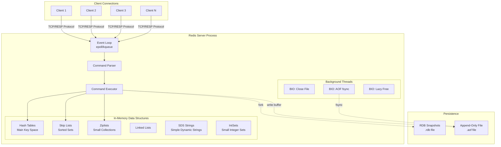
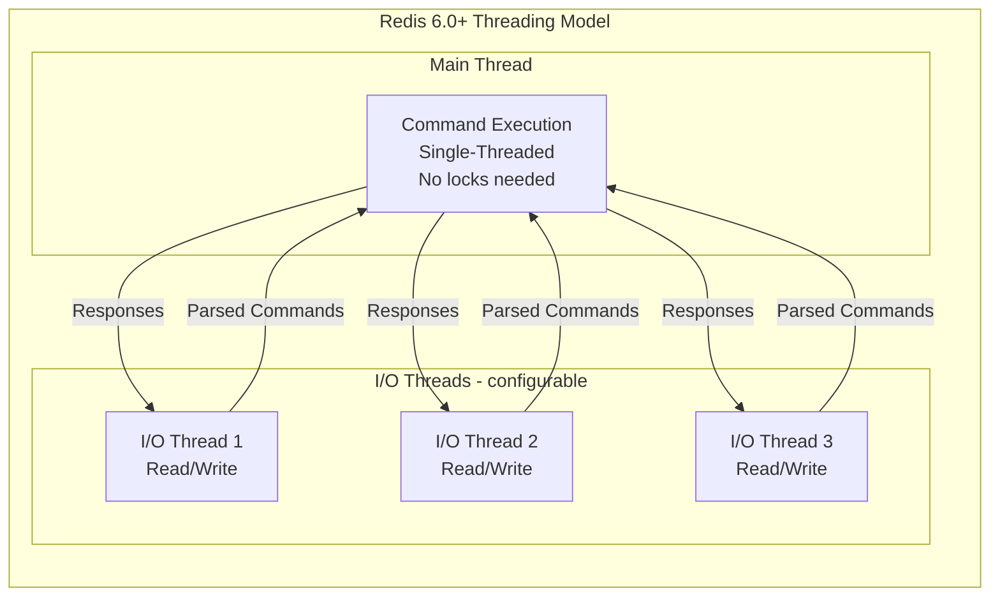
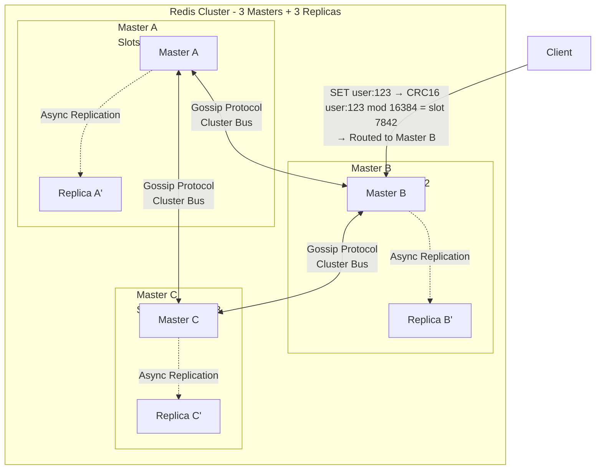
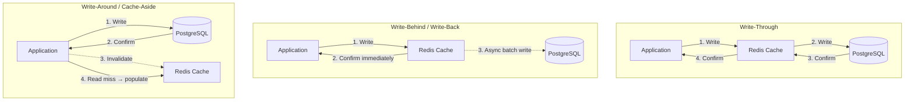
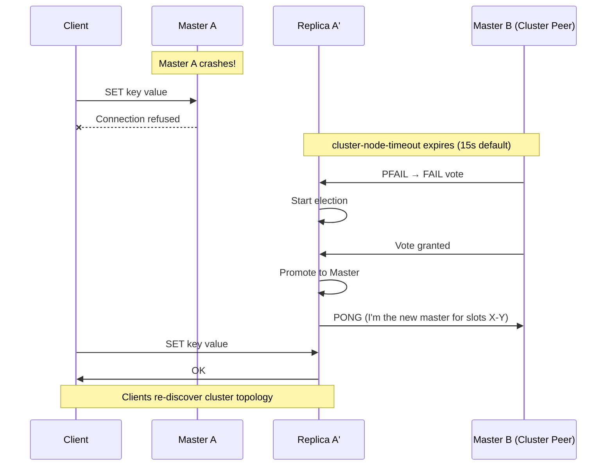
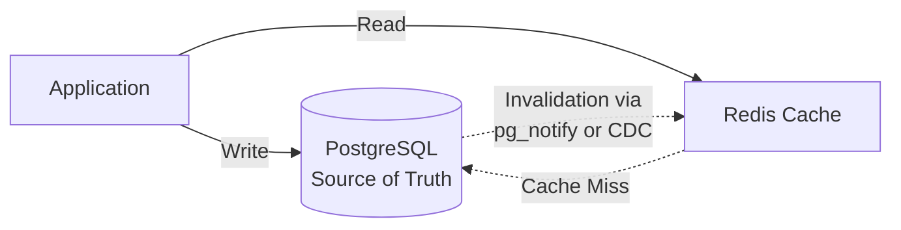

Redis stands behind almost every high-traffic system you've ever used. Twitter uses it for timelines. GitHub uses it for job queues. Stripe uses it for rate limiting. Netflix uses it for session storage across hundreds of millions of users.

Yet most engineers treat Redis as a "fast key-value store" and move on. That's fine for a senior engineer. It's not enough for a staff engineer. At staff level, you need to understand **why** Redis is fast, **how** it persists data, **what** happens when it crashes at 3 AM, and **when** you should reach for something else entirely.

This article takes you from "I use Redis for caching" to "I can design and operate Redis at scale, explain every trade-off in a design review, and ace Redis questions in a staff-level interview."

---

## 2. Core Concepts (Step-by-Step)

### 2.1 How Redis Works — Internal Architecture

Let's start with a mental model. Think of Redis as a **single-threaded waiter in a very fast restaurant**. There's only one waiter (the main thread), but the waiter is extraordinarily efficient — they take orders, serve food, and clear tables faster than a team of ten average waiters. The secret? Everything is within arm's reach (in memory), and the waiter never stands around waiting for the kitchen (no blocking I/O).

Here's what actually happens inside Redis:



*Redis architecture: a single event loop handles all client connections, executes commands against in-memory data structures, and offloads disk I/O to background threads.*

**Key components:**

1. **Event Loop** — Redis uses `epoll` (Linux) or `kqueue` (macOS/BSD) for I/O multiplexing. One thread monitors thousands of sockets simultaneously. When data arrives on any socket, the event loop processes it immediately without blocking.

2. **RESP Protocol** — Redis uses a simple text-based protocol called RESP (REdis Serialization Protocol). It's designed for speed: easy to parse, minimal overhead.

3. **Key Space (Hash Table)** — All keys live in a global hash table. Lookups are O(1). Redis uses **incremental rehashing** — when the table needs to grow, it doesn't stop the world. It rehashes a few buckets on each operation, spreading the cost.

4. **Data Structures** — Redis doesn't just store strings. It has purpose-built data structures optimized for specific access patterns:

| Structure                   | Redis Type                 | Use Case                             | Time Complexity          |
| --------------------------- | -------------------------- | ------------------------------------ | ------------------------ |
| Hash Table                  | Hash                       | Object fields, user profiles         | O(1) get/set             |
| Skip List                   | Sorted Set                 | Leaderboards, priority queues        | O(log N) insert/lookup   |
| Ziplist                     | Small List/Hash/Set        | Memory-efficient small collections   | O(N) but N is tiny       |
| SDS (Simple Dynamic String) | String                     | Counters, cached values, binary data | O(1) length, O(N) append |
| IntSet                      | Small Sets (integers only) | Tag IDs, small numeric sets          | O(log N) binary search   |
| Quicklist                   | List                       | Job queues, activity feeds           | O(1) push/pop at ends    |

5. **Background Threads** — Despite being "single-threaded" for command processing, Redis has background threads (BIO threads) for:
   - Lazy object freeing (`UNLINK` instead of `DEL`)
   - AOF `fsync` to disk
   - Closing file descriptors

> 💡 **Staff-level insight:** Redis's global hash table uses two tables during rehashing — `ht[0]` (old) and `ht[1]` (new). Every operation touches both tables until migration completes. This is why `DBSIZE` is always O(1) — it just sums the entry counts. Understanding incremental rehashing is essential for explaining Redis performance under load.

### 2.2 Why Redis Is Fast

Redis consistently delivers **sub-millisecond latency** for most operations. Here's exactly why:

**1. Everything is in-memory**

Disk access takes ~10ms (HDD) or ~0.1ms (SSD). RAM access takes ~100ns. That's a 1,000x to 100,000x difference. Redis keeps the entire dataset in RAM, so every read and write is a memory operation.

**2. I/O multiplexing (epoll/kqueue)**

Instead of spawning a thread per connection (like traditional databases), Redis uses a single thread with `epoll` to monitor thousands of connections simultaneously. When any socket has data, Redis reads it, processes the command, and writes the response — all without context switching.

**3. No context switching**

A thread context switch costs 1-10 microseconds. With thousands of connections and a thread-per-connection model, context switching becomes a significant cost. Redis avoids this entirely.

**4. Efficient data structures**

Redis doesn't use generic data structures. Every structure is hand-tuned:
- **Ziplist** packs small collections into a contiguous memory block (cache-line friendly)
- **Skip lists** give O(log N) sorted access without the complexity of balanced trees
- **SDS strings** pre-allocate space to reduce reallocations

**5. Single-threaded command execution = no locks**

No locks means no lock contention, no deadlocks, no overhead from lock acquisition. Every command runs to completion without interruption.

**6. RESP protocol is simple to parse**

The protocol is essentially `*3\r\n$3\r\nSET\r\n$3\r\nkey\r\n$5\r\nvalue\r\n`. A simple state machine can parse it in a single pass.

**Putting it in perspective:**

| Operation               | Latency    | Operations/sec (single node) |
| ----------------------- | ---------- | ---------------------------- |
| GET/SET (simple key)    | ~0.1ms     | 100,000–200,000              |
| ZADD (sorted set)       | ~0.2ms     | 80,000–150,000               |
| LPUSH/LPOP              | ~0.1ms     | 100,000–200,000              |
| Pipeline (100 commands) | ~1ms total | 1,000,000+ effective         |

### 2.3 RAM vs Disk — Redis Persistence Deep Dive

One of the most misunderstood aspects of Redis: **"Redis is in-memory only."** This is wrong. Redis stores data in RAM for speed but offers multiple persistence options.

#### RDB (Redis Database Snapshots)

RDB creates point-in-time snapshots of your dataset. Think of it as `pg_dump` but for Redis.

**How it works:**
1. Redis calls `fork()` to create a child process
2. The child process writes the entire dataset to a temporary `.rdb` file
3. Once complete, the temporary file replaces the old `.rdb` file
4. The parent process continues serving requests (using copy-on-write from `fork()`)

**The `fork()` trick:** After `fork()`, the child shares the same memory pages as the parent. Only when the parent modifies a page does the OS create a copy (copy-on-write). This means the snapshot is nearly instant — even for large datasets — as long as write activity is low during the snapshot.

#### AOF (Append-Only File)

AOF logs every write command Redis executes. Think of it as a write-ahead log (WAL) — similar to PostgreSQL's WAL.

**How it works:**
1. Every write command is appended to a buffer
2. The buffer is flushed to the AOF file based on the `appendfsync` policy:
   - `always` — fsync after every command (safest, slowest)
   - `everysec` — fsync once per second (good balance — **recommended**)
   - `no` — let the OS decide (fastest, riskiest)

**AOF Rewrite:** Over time, the AOF file grows. Redis periodically rewrites it to the minimal set of commands needed to reconstruct the dataset. This happens in a background `fork()` process, similar to RDB.

#### Hybrid Persistence (Redis 4.0+)

The best of both worlds. When AOF rewrite happens, Redis writes the RDB snapshot at the beginning of the AOF file, then appends only the commands that arrived during the rewrite. On restart, Redis loads the RDB portion (fast) then replays the AOF tail (minimal commands).

```mermaid
graph LR
    subgraph "Persistence Strategies"
        direction TB
        
        subgraph "RDB Snapshots"
            R1[fork parent process] --> R2[Child writes .rdb]
            R2 --> R3[Point-in-time snapshot]
            R3 --> R4["⚠️ Data loss: up to last<br/>snapshot interval"]
        end

        subgraph "AOF - Append-Only File"
            A1[Every write command] --> A2[Append to buffer]
            A2 --> A3[fsync based on policy]
            A3 --> A4["✅ Minimal data loss<br/>1 sec with everysec"]
        end

        subgraph "Hybrid - RDB + AOF tail"
            H1[AOF rewrite triggers] --> H2[Write RDB header]
            H2 --> H3[Append new commands as AOF]
            H3 --> H4["✅ Fast restart +<br/>minimal data loss"]
        end
    end
```



*Persistence strategies compared: RDB is simplest, AOF is most durable, Hybrid gives you fast restarts with minimal data loss.*

| Aspect                | RDB                          | AOF (everysec)            | Hybrid                           |
| --------------------- | ---------------------------- | ------------------------- | -------------------------------- |
| Data loss risk        | Up to last snapshot interval | ~1 second                 | ~1 second                        |
| Restart speed         | Fast (binary load)           | Slow (replay commands)    | Fast (RDB header + short replay) |
| Disk space            | Compact                      | Larger (commands log)     | Moderate                         |
| CPU impact            | Spiky (during fork)          | Steady                    | Moderate                         |
| **My recommendation** | Dev/testing                  | Production without hybrid | **Production default**           |

> 💡 **Staff-level insight:** The `fork()` used by RDB and AOF rewrite is not free. For a 25 GB dataset on Linux, `fork()` can take 10-20ms and temporarily double memory usage (worst case, if every page gets modified). At 100 GB+, this becomes a serious concern. You need to monitor `latest_fork_usec` in `INFO` stats and ensure your machine has enough free memory to handle copy-on-write peaks. This is a common production incident: Redis OOM-killed during BGSAVE because no one accounted for CoW overhead.

### 2.4 Why Redis Is Single-Threaded

This confuses many engineers: "If multi-threading is faster, why doesn't Redis use it?"

The answer is simple — **Redis's bottleneck is not CPU, it's network I/O and memory bandwidth.**

For most Redis operations (GET, SET, INCR), the command itself takes **nanoseconds**. The time is spent reading from the socket and writing the response back. Adding multiple threads would add:

- **Lock overhead** — Every data structure access would need locking
- **Context switch cost** — OS scheduling overhead
- **Cache line bouncing** — Multiple threads accessing the same data causes CPU cache invalidation
- **Complexity** — More threads = more bugs, harder debugging

In benchmarks, a single Redis thread saturates a ~10 Gbps network link before it saturates a CPU core. The bottleneck is the network, not the processing.

**But wait — Redis 6.0+ has I/O threads!**

Redis 6.0 introduced **threaded I/O** — but only for reading client requests and writing responses. The actual command execution is still single-threaded. This helps when the network is the bottleneck (many clients, large payloads).



*Redis 6.0+ uses multiple threads for network I/O but keeps command execution single-threaded. This preserves simplicity while improving network throughput.*

### 2.5 How Redis Is Fast Despite Being Single-Threaded

Let me connect the dots with a concrete analogy.

Imagine a **toll booth on a highway**. A multi-threaded system opens 8 toll booths. Each booth serves one car at a time, but they serve 8 cars in parallel. The overhead? 8 employees, coordinating lane merges, making sure no two booths charge the same car.

Redis is **one toll booth with no barrier**. Cars fly through at 200 mph because there's nothing blocking them. No barrier arm to raise, no cash handling, no ticket printing. Just a sensor that reads the license plate at wire speed.

The reason this works:

1. **Operations are microsecond-scale** — A `GET` command touches one hash table bucket. That's a pointer dereference and a memory read. Nanoseconds.

2. **Event loop processes commands sequentially but without waiting** — While one client's response is in-flight over the network, Redis is already processing the next command from a different client.

3. **Pipelining** — Clients can send multiple commands without waiting for responses. Redis processes them in sequence and sends all responses at once. This amortizes the network round-trip cost.

4. **The kernel handles connection management** — `epoll` tells Redis exactly which sockets have data. Redis doesn't waste time checking empty sockets.

Here's a Go example showing the difference between naive individual commands and pipelining:

```go
package main

import (
    "context"
    "fmt"
    "time"

    "github.com/redis/go-redis/v9"
)

func main() {
    ctx := context.Background()
    rdb := redis.NewClient(&redis.Options{
        Addr: "localhost:6379",
    })
    defer rdb.Close()

    // --- Naive: 1000 individual SET commands ---
    start := time.Now()
    for i := 0; i < 1000; i++ {
        rdb.Set(ctx, fmt.Sprintf("key:%d", i), fmt.Sprintf("value:%d", i), 0)
    }
    fmt.Printf("Individual SETs: %v\n", time.Since(start))
    // Typical: ~200ms (1000 round trips)

    // --- Pipelined: 1000 SET commands in one batch ---
    start = time.Now()
    pipe := rdb.Pipeline()
    for i := 0; i < 1000; i++ {
        pipe.Set(ctx, fmt.Sprintf("pkey:%d", i), fmt.Sprintf("value:%d", i), 0)
    }
    _, err := pipe.Exec(ctx)
    if err != nil {
        panic(err)
    }
    fmt.Printf("Pipelined SETs:  %v\n", time.Since(start))
    // Typical: ~5ms (1 round trip for 1000 commands)
}
```

The pipeline version isn't just faster — it's fundamentally different. Instead of 1000 network round trips, you make **one**. This is the key to getting millions of operations per second from a single Redis instance.

> 💡 **Staff-level insight:** When someone asks "Redis is single-threaded, how does it handle 100K ops/sec?" — the answer isn't just "memory is fast." It's the combination of: (1) non-blocking I/O via epoll, (2) no lock overhead, (3) no context switching, (4) commands that complete in microseconds, and (5) pipelining that amortizes network latency. If you can explain all five factors clearly in an interview, you're demonstrating systems-level understanding.

### 2.6 How Redis Cluster Works

When a single Redis node isn't enough (either you've exceeded the memory of one machine or you need more throughput), you need Redis Cluster.

**Hash Slots — The Sharding Mechanism**

Redis Cluster divides the key space into **16,384 hash slots**. Every key is mapped to a slot using `CRC16(key) % 16384`. Slots are distributed across nodes.

For example, with 3 master nodes:
- Node A handles slots 0–5460
- Node B handles slots 5461–10922
- Node C handles slots 10923–16383



*Redis Cluster uses 16,384 hash slots distributed across masters. Each master has a replica for failover. Nodes communicate via the Gossip protocol.*

**Key Cluster Concepts:**

1. **MOVED/ASK redirections** — If a client sends a command to the wrong node, that node responds with `MOVED <slot> <correct-node>`. Smart clients (like `go-redis`) cache the slot mapping and route correctly after the first redirect.

2. **Gossip Protocol** — Every node periodically exchanges state information with other nodes. This is how the cluster detects failures and propagates configuration changes. Each node sends heartbeats every second and expects responses within `cluster-node-timeout` (default: 15 seconds).

3. **Replication** — Each master has one or more replicas. Replication is **asynchronous** — writes are acknowledged before replication. This means writes can be lost during failover.

4. **Failover** — When a master is unreachable for `cluster-node-timeout` milliseconds, its replicas initiate an election. The replica with the most up-to-date data wins and becomes the new master.

5. **Hash Tags** — If you need multiple keys on the same node (for multi-key operations), use hash tags: `{user:123}.profile` and `{user:123}.sessions` both hash on `user:123`, so they land on the same slot.

Here's connecting to a Redis Cluster in Go:

```go
package main

import (
    "context"
    "fmt"

    "github.com/redis/go-redis/v9"
)

func main() {
    ctx := context.Background()

    rdb := redis.NewClusterClient(&redis.ClusterOptions{
        Addrs: []string{
            "redis-node-1:6379",
            "redis-node-2:6379",
            "redis-node-3:6379",
        },
        // Route read commands to replicas for read scaling
        RouteByLatency: true,
        // Automatically follow MOVED/ASK redirections
        // (go-redis does this by default)
    })
    defer rdb.Close()

    // Hash tags ensure these keys land on the same slot
    pipe := rdb.Pipeline()
    pipe.HSet(ctx, "{user:42}.profile", "name", "Alice", "role", "engineer")
    pipe.SAdd(ctx, "{user:42}.skills", "go", "redis", "kafka")
    pipe.Expire(ctx, "{user:42}.profile", 3600)
    pipe.Expire(ctx, "{user:42}.skills", 3600)
    _, err := pipe.Exec(ctx)
    if err != nil {
        panic(err)
    }

    // Multi-key operations work because both keys share the {user:42} hash tag
    name, _ := rdb.HGet(ctx, "{user:42}.profile", "name").Result()
    skills, _ := rdb.SMembers(ctx, "{user:42}.skills").Result()
    fmt.Printf("User: %s, Skills: %v\n", name, skills)
}
```

> 💡 **Staff-level insight:** Redis Cluster's asynchronous replication means it provides **at-most-once delivery** for writes during failover. If a master accepts a write, crashes before replicating it, and a replica gets promoted — that write is lost. This is a fundamental trade-off: Redis Cluster chooses **availability and partition tolerance over consistency** (AP in CAP terms). If you need strong consistency, you need Redis with Sentinel and `WAIT` command, or a different system entirely. Know this trade-off cold for interviews.

### 2.7 Redis Write Strategies

When using Redis as a cache in front of a database (like PostgreSQL), you need a strategy for keeping them in sync. There are three main patterns:



*Three write strategies for cache-database synchronization. Each makes a different trade-off between consistency, latency, and complexity.*

| Aspect           | Write-Through                 | Write-Behind                         | Write-Around                   |
| ---------------- | ----------------------------- | ------------------------------------ | ------------------------------ |
| Write latency    | Higher (waits for DB)         | Low (cache only)                     | Moderate (DB write)            |
| Consistency      | Strong                        | Eventual                             | Eventual (read miss)           |
| Data loss risk   | Low                           | **High** (cache crash = lost writes) | Low                            |
| Read-after-write | Consistent                    | Consistent                           | May need cache invalidation    |
| Complexity       | Low                           | High (queue, retry, dedup)           | Low                            |
| **Best for**     | Financial data, user profiles | High-throughput analytics, logs      | Read-heavy, infrequent updates |

**My recommendation:** For most applications, **Write-Around** (also called Cache-Aside) is the safest default. Write to your database, invalidate the cache, let the next read populate it. It's simple, it's safe, and it avoids the data loss risk of Write-Behind. Use Write-Through when you need guaranteed read-after-write consistency with cached reads. Only use Write-Behind when you can tolerate data loss and need maximum write throughput.

> 💡 **Staff-level insight:** The "Cache-Aside" pattern has a subtle race condition: Thread A reads from DB (gets old value), Thread B writes to DB and invalidates cache, Thread A writes old value to cache. Now the cache has stale data. The fix: use short TTLs on cache entries as a safety net, or use write-through with a cache lock. Facebook described this problem and their solutions in their famous [Scaling Memcache at Facebook](https://www.usenix.org/conference/nsdi13/technical-sessions/presentation/nishtala) paper. This exact scenario comes up in staff-level interviews.

---

## 3. Use Cases

### Caching (The Bread and Butter)

The most common use case. Put frequently accessed data in Redis to avoid hitting your database.

**Real-world example:** GitHub caches repository metadata, user sessions, and feature flags in Redis. When you load a GitHub repo page, most of the data comes from Redis, not the database.

```go
func GetUserProfile(ctx context.Context, rdb *redis.Client, db *sql.DB, userID string) (*UserProfile, error) {
    // Try cache first
    cached, err := rdb.Get(ctx, "user:"+userID).Bytes()
    if err == nil {
        var profile UserProfile
        json.Unmarshal(cached, &profile)
        return &profile, nil
    }

    // Cache miss — query database
    profile, err := queryUserFromDB(db, userID)
    if err != nil {
        return nil, err
    }

    // Populate cache with TTL
    data, _ := json.Marshal(profile)
    rdb.Set(ctx, "user:"+userID, data, 15*time.Minute)

    return profile, nil
}
```

### Rate Limiting

Redis's atomic `INCR` and `EXPIRE` commands make it perfect for rate limiting.

**Real-world example:** Stripe uses Redis for API rate limiting across all their payment endpoints. Every API call increments a counter keyed by `rate:{customer_id}:{minute}`.

```go
func IsRateLimited(ctx context.Context, rdb *redis.Client, clientID string, limit int) (bool, error) {
    key := fmt.Sprintf("ratelimit:%s:%d", clientID, time.Now().Unix()/60)

    pipe := rdb.Pipeline()
    incr := pipe.Incr(ctx, key)
    pipe.Expire(ctx, key, 2*time.Minute) // TTL slightly longer than window
    _, err := pipe.Exec(ctx)
    if err != nil {
        return false, err
    }

    return incr.Val() > int64(limit), nil
}
```

### Session Store

HTTP sessions need fast reads on every request and automatic expiration.

**Real-world example:** Netflix stores user sessions in Redis across multiple regions. When you pause a show on your phone and resume on your TV, Redis serves the session data that tracks your progress.

### Distributed Locks

Redis's `SET key value NX EX` (set-if-not-exists with expiry) provides a simple distributed lock mechanism.

**Real-world example:** Payment systems use Redis locks to prevent double-charging. When processing a payment, acquire a lock on the payment ID. If the lock exists, another instance is already processing it.

```go
func AcquireLock(ctx context.Context, rdb *redis.Client, resource string, ttl time.Duration) (bool, error) {
    lockKey := "lock:" + resource
    lockValue := uuid.New().String() // Unique value for safe release

    ok, err := rdb.SetNX(ctx, lockKey, lockValue, ttl).Result()
    if err != nil {
        return false, err
    }
    return ok, nil // true = lock acquired
}

// Use Lua script for safe release (check-and-delete atomically)
var releaseLockScript = redis.NewScript(`
    if redis.call("GET", KEYS[1]) == ARGV[1] then
        return redis.call("DEL", KEYS[1])
    end
    return 0
`)

func ReleaseLock(ctx context.Context, rdb *redis.Client, resource, lockValue string) error {
    _, err := releaseLockScript.Run(ctx, rdb, []string{"lock:" + resource}, lockValue).Result()
    return err
}
```

> 💡 **Staff-level insight:** Simple Redis locks (`SETNX`) have a fundamental problem in distributed systems: if the lock holder crashes, the lock is held until TTL expires. For **correct** distributed locking, use the [Redlock algorithm](https://redis.io/docs/manual/patterns/distributed-locks/) which acquires locks across multiple independent Redis instances. But even Redlock has been debated — Martin Kleppmann's famous [critique](https://martin.kleppmann.com/2016/02/08/how-to-do-distributed-locking.html) argues it's unsafe under certain clock drift scenarios. Know both sides of this debate for interviews.

### Leaderboards

Sorted Sets (`ZADD`, `ZRANGE`, `ZRANK`) are purpose-built for leaderboards.

**Real-world example:** Twitter uses Redis Sorted Sets for trending topics. Each topic is a member with a score based on tweet velocity.

```go
// Add/update player score
rdb.ZAdd(ctx, "leaderboard:weekly", redis.Z{Score: 2500, Member: "player:alice"})

// Get top 10 players
topPlayers, _ := rdb.ZRevRangeWithScores(ctx, "leaderboard:weekly", 0, 9).Result()

// Get a specific player's rank (0-indexed)
rank, _ := rdb.ZRevRank(ctx, "leaderboard:weekly", "player:alice").Result()
```

### Pub/Sub and Event Streaming

Redis Pub/Sub provides fire-and-forget messaging. Redis Streams (5.0+) provide Kafka-like persistent event streaming with consumer groups.

**When to use which:**
- **Pub/Sub** — Real-time notifications where message loss is acceptable (chat, live updates)
- **Streams** — When you need message persistence, replay, and consumer groups (lightweight event sourcing)
- **Kafka** — When you need durable, high-throughput, multi-consumer event streaming at scale

---

## 4. Gotchas

### What Happens If Redis Crashes?

This is the "2 AM production incident" section. Here's what happens and what you should do.

**Scenario 1: Redis crashes, RDB only**
- Data loss: Everything since the last snapshot (could be 5-15 minutes)
- Recovery: Redis loads the last `.rdb` file on restart
- Recovery time: Fast — binary format loads quickly (seconds for GB-scale datasets)

**Scenario 2: Redis crashes, AOF with `everysec`**
- Data loss: Up to ~1 second of writes
- Recovery: Redis replays the AOF file on restart
- Recovery time: Slower — depends on AOF size (can be minutes for large files)

**Scenario 3: Redis Cluster, one master crashes**
- A replica detects the failure (after `cluster-node-timeout`)
- Replica promotes itself to master
- Data loss: Any writes acknowledged by the old master but not yet replicated
- Client impact: Brief interruption (seconds) while failover completes



*Redis Cluster failover sequence: detection takes up to `cluster-node-timeout`, then election and promotion happen within seconds.*

### Best Practices to Keep Redis Fast

1. **Set TTLs on everything** — Keys without TTL are memory leaks. Even "permanent" data should have a long TTL (e.g., 24 hours) with a refresh mechanism.

2. **Use pipelining** — Batch commands to reduce round trips. 100 pipelined commands are 50-100x faster than 100 individual commands.

3. **Avoid large keys** — Keep values under 100 KB. Large values block the event loop during serialization and network transfer.

4. **Use `SCAN` instead of `KEYS`** — `KEYS *` blocks Redis while it iterates the entire keyspace. `SCAN` is cursor-based and non-blocking.

5. **Monitor slow queries** — Enable `slowlog-log-slower-than 10000` (10ms). Check regularly with `SLOWLOG GET 10`.

6. **Size your memory correctly** — Set `maxmemory` and choose an eviction policy. Without `maxmemory`, Redis will use all available RAM and get OOM-killed by the OS.

7. **Use appropriate eviction policies:**

| Policy         | Behavior                        | Best For                       |
| -------------- | ------------------------------- | ------------------------------ |
| `allkeys-lru`  | Evict least recently used keys  | General-purpose caching        |
| `volatile-lru` | Evict LRU keys with TTL only    | Mix of cache + persistent data |
| `allkeys-lfu`  | Evict least frequently used     | Workloads with hot keys        |
| `noeviction`   | Return error on write when full | When data loss is unacceptable |

8. **Monitor these metrics:**
   - `used_memory` vs `maxmemory` — Are you close to the limit?
   - `evicted_keys` — Are you losing data?
   - `keyspace_misses / (keyspace_hits + keyspace_misses)` — Cache hit ratio (target >95%)
   - `connected_clients` — Leak detection
   - `latest_fork_usec` — `fork()` duration for persistence
   - `instantaneous_ops_per_sec` — Throughput baseline

### Bad Practices (Things to Avoid)

1. **Storing large objects** — A 10 MB JSON blob in Redis blocks the event loop for the duration of the transfer. Break it into smaller keys or use hashes.

2. **Using `KEYS *` in production** — This is a blocking O(N) operation. It will freeze your Redis instance. Use `SCAN`.

3. **Not setting `maxmemory`** — Without it, Redis grows unbounded until the OS kills it. Always set `maxmemory` and an eviction policy.

4. **Using Redis as a primary database** — Redis can persist data, but it's not designed as a primary store. Replication is async, there are no transactions with rollback, and recovery from corruption is limited.

5. **Hot keys** — One key receiving 50% of all traffic creates a bottleneck. Even in a cluster, that key lives on one node. Solutions: read replicas, key sharding (split the hot key into `hot-key:{0..N}` and distribute reads).

6. **Lua scripts that run too long** — Redis executes Lua scripts atomically (blocking). A script that takes 100ms blocks all other clients for 100ms. Keep Lua scripts short and simple.

7. **Not using connection pooling** — Creating a new TCP connection per request is expensive. Always use a connection pool (go-redis does this by default, but size it correctly).

8. **Ignoring `transparent_hugepage`** — Linux transparent huge pages cause latency spikes in Redis. Always disable them: `echo never > /sys/kernel/mm/transparent_hugepage/enabled`

> 💡 **Staff-level insight:** The #1 Redis incident I've seen in production: **memory fragmentation**. Redis's `mem_fragmentation_ratio` (from `INFO memory`) should be between 1.0 and 1.5. Above 1.5 means significant fragmentation — Redis is using much more RSS than its logical dataset. The fix: enable `activedefrag yes` (Redis 4.0+) or restart during a maintenance window. Below 1.0 means Redis is swapping to disk — this is an emergency. At 1000x scale, fragmentation monitoring is the difference between a stable cache layer and cascading failures.

---

## 5. Where to Use (and Where NOT to Use)

### Use Redis When:
- You need **sub-millisecond latency** for reads/writes
- Your dataset fits in **memory** (or you can shard across nodes)
- You need **atomic operations** (counters, rate limits, locks)
- You need **ephemeral data** with automatic expiration (sessions, caches)
- You need **sorted sets, HyperLogLog, bitmaps,** or other specialized structures
- You need a fast **pub/sub** layer for real-time features

### Do NOT Use Redis When:

1. **Your dataset exceeds available RAM** — If you have 500 GB of data and can't afford 500 GB of RAM (across cluster nodes), Redis isn't the right choice. Use PostgreSQL, DynamoDB, or a disk-based cache like Memcached with extstore.

2. **You need complex queries** — Redis has no `JOIN`, no `WHERE` clause, no aggregations. If you need `SELECT users WHERE age > 25 AND country = 'US' ORDER BY signup_date`, use PostgreSQL.

3. **You need strong consistency** — Redis replication is async. During network partitions, you can have split-brain scenarios. If you need linearizable reads/writes, use PostgreSQL, etcd, or CockroachDB.

4. **You need multi-key ACID transactions** — Redis has `MULTI/EXEC` which provides atomicity and isolation, but no rollback. If you need transaction rollback on failure, use a relational database.

5. **You're using it as a message queue for critical data** — Redis Pub/Sub drops messages if no subscriber is listening. Redis Streams are better but still not as durable as Kafka. For critical event processing, use Kafka.

6. **You need rich full-text search** — Redis has RediSearch module, but Elasticsearch or PostgreSQL's full-text search are more mature for this use case.

7. **You're storing relational data** — If your data has complex relationships (users → orders → items → reviews), a relational database will serve you much better.

---

## 6. Versus (Comparisons)

### Redis vs Dragonfly

Dragonfly is a modern, multi-threaded, Redis-compatible in-memory datastore. It claims to be 25x faster than Redis with lower memory usage. Let's cut through the marketing.

| Aspect                           | Redis                                              | Dragonfly                                    |
| -------------------------------- | -------------------------------------------------- | -------------------------------------------- |
| **Threading model**              | Single-threaded (I/O threads in 6.0+)              | Multi-threaded (shared-nothing architecture) |
| **Max throughput (single node)** | ~200K ops/sec                                      | ~4M ops/sec (claimed)                        |
| **Memory efficiency**            | ~70 bytes overhead per key                         | ~30 bytes overhead per key (dashtable)       |
| **Clustering**                   | Redis Cluster (multi-node)                         | Single-node scales vertically                |
| **Persistence**                  | RDB, AOF, Hybrid                                   | RDB-compatible snapshots                     |
| **Module ecosystem**             | Massive (RediSearch, RedisJSON, etc.)              | Limited (growing)                            |
| **Maturity**                     | 15+ years, battle-tested at Google/Netflix/Twitter | ~3 years, smaller production footprint       |
| **Protocol compatibility**       | N/A (it IS the protocol)                           | ~95% Redis-compatible                        |
| **Lua scripting**                | Full support                                       | Supported                                    |
| **Cloud managed service**        | AWS ElastiCache, Redis Cloud, Azure Cache          | Dragonfly Cloud (newer)                      |
| **License**                      | SSPL (since 2024, was BSD)                         | BSL 1.1                                      |
| **Community & support**          | Enormous                                           | Growing, smaller                             |

**Choose Redis when:**
- You need the **module ecosystem** (RediSearch, RedisJSON, RedisTimeSeries)
- You need **battle-tested production reliability** with years of operational knowledge
- You're using **managed services** (ElastiCache, Redis Cloud)
- Your team has **existing Redis expertise**
- You need **Redis Cluster** for horizontal sharding

**Choose Dragonfly when:**
- You need **maximum throughput on a single node** and want to avoid cluster complexity
- **Memory cost** is a significant concern (Dragonfly uses ~50% less memory per key)
- You're running on a **large multi-core machine** and want to use all cores
- You're OK with a **newer, less battle-tested** system
- Your usage is limited to **core Redis commands** (no specialized modules)

> 💡 **Staff-level insight:** Dragonfly's architecture is genuinely interesting — it uses a shared-nothing design where each thread owns a slice of the data (like ScyllaDB's approach to Cassandra). No locks needed because threads never touch each other's data. But here's the nuance: in many real-world workloads, the bottleneck is the **network** or the **application logic**, not Redis throughput. Switching from Redis to Dragonfly solves a problem most teams don't actually have. Profile your actual bottleneck before making the switch.

### Redis vs PostgreSQL

This comparison is less obvious but comes up frequently in design discussions.

| Aspect                 | Redis                             | PostgreSQL                                 |
| ---------------------- | --------------------------------- | ------------------------------------------ |
| **Data model**         | Key-value with rich structures    | Relational (tables, rows, columns)         |
| **Query language**     | Commands (GET, SET, ZADD)         | SQL (full query language)                  |
| **Latency (p50)**      | ~0.1ms                            | ~1-5ms (indexed queries)                   |
| **Throughput**         | 100K-200K ops/sec per node        | 10K-50K queries/sec per node               |
| **Storage**            | RAM (with disk persistence)       | Disk (with RAM cache)                      |
| **ACID transactions**  | Limited (MULTI/EXEC, no rollback) | Full ACID                                  |
| **Consistency**        | Eventual (async replication)      | Strong (synchronous replication available) |
| **JOIN support**       | None                              | Full                                       |
| **Data durability**    | Configurable (risk of loss)       | Durable by default (WAL)                   |
| **Schema**             | Schema-less                       | Schema-enforced                            |
| **Horizontal scaling** | Redis Cluster (automatic)         | Manual sharding, Citus, or read replicas   |
| **Cost at scale**      | Expensive (RAM)                   | Cheaper (disk)                             |

**Choose Redis when:**
- You need **sub-millisecond responses** for reads
- Your data is **simple key-value** or fits Redis structures (sorted sets, hashes)
- You need **ephemeral data** (caches, sessions, rate counters)
- You need **atomic counters** or **distributed locks**

**Choose PostgreSQL when:**
- You need **complex queries** (joins, aggregations, filtering)
- You need **strong consistency** and ACID guarantees
- Your **dataset is larger than available RAM**
- You need **schema enforcement** and data integrity
- You need **audit trails** and **transaction rollback**

**The most common architecture:** Use both. PostgreSQL as the source of truth, Redis as a read cache in front of it.



*The standard architecture: PostgreSQL for durability and complex queries, Redis for speed. Invalidation can be event-driven via PostgreSQL notifications or Change Data Capture.*

---

## 7. References

**Official Documentation:**
- [Redis Documentation](https://redis.io/docs/) — Start here. The official docs are excellent.
- [Redis Commands Reference](https://redis.io/commands/) — Every command with complexity analysis
- [Redis Cluster Specification](https://redis.io/docs/reference/cluster-spec/) — Deep technical specification

**Engineering Blogs:**
- [Scaling Memcache at Facebook (NSDI '13)](https://www.usenix.org/conference/nsdi13/technical-sessions/presentation/nishtala) — The definitive paper on caching at scale (applies to Redis too)
- [How Twitter Uses Redis](https://blog.twitter.com/engineering/en_us/topics/infrastructure/2014/building-a-complete-tweet-index) — Tweet indexing and timeline caching
- [Netflix: Application Data Caching using SSDs](https://netflixtechblog.com/application-data-caching-using-ssds-5bf25df851ef) — When RAM-only caching isn't enough
- [Stripe: Rate Limiting](https://stripe.com/blog/rate-limiters) — How Stripe built rate limiting with Redis

**Key Papers & Posts:**
- [Martin Kleppmann: How to do distributed locking](https://martin.kleppmann.com/2016/02/08/how-to-do-distributed-locking.html) — The famous critique of Redlock
- [Antirez: Is Redlock safe?](http://antirez.com/news/101) — Salvatore Sanfilippo's response

**Conference Talks:**
- [Redis Cluster Deep Dive — Salvatore Sanfilippo (RedisConf)](https://www.youtube.com/watch?v=xuFCi7HYsCA) — From the creator of Redis
- [Redis Internals — RailsConf](https://www.youtube.com/watch?v=GEl52XEoMN4) — Excellent walkthrough of Redis internals

**Books:**
- *Redis in Action* by Josiah Carlson — Practical patterns and use cases
- *Designing Data-Intensive Applications* by Martin Kleppmann — Chapter 5 (Replication) and Chapter 6 (Partitioning) directly apply to Redis

---

## 8. Interview Questions

### Q1: "Design a rate limiter using Redis. How would you handle a distributed system with multiple application servers?"

**Key points to cover:**
- Sliding window vs fixed window algorithm
- `INCR` + `EXPIRE` for fixed window (simple but bursty at window boundaries)
- Sorted set with timestamps for sliding window (more accurate, more memory)
- Race conditions between `INCR` and `EXPIRE` — use `pipelining` or Lua scripts for atomicity
- What happens if Redis goes down? (Fail open or fail closed — discuss trade-offs)
- At scale: use local in-memory counters with periodic sync to Redis to reduce load

**Common mistakes:** Not handling the race condition between INCR and EXPIRE. Not discussing what happens when Redis is unavailable. Overcomplicating with distributed algorithms when a simple pipeline suffices.

### Q2: "You're seeing p99 latency spikes in Redis every 5 minutes. How do you diagnose and fix this?"

**Key points to cover:**
- RDB `BGSAVE` every 5 minutes → `fork()` latency spike. Check `latest_fork_usec`
- Solution: switch to AOF-only or stagger persistence schedules
- Other causes: `KEYS` or other O(N) commands in slow log, client-side timeouts, network issues
- Check `SLOWLOG GET`, `INFO memory` (fragmentation), `INFO persistence`
- Transparent huge pages on Linux causing latency
- AOF rewrite happening simultaneously

**Common mistakes:** Jumping to "add more Redis nodes" without diagnosing the root cause. Not knowing about `fork()` overhead. Not checking `SLOWLOG`.

### Q3: "How would you design Redis Cluster for a write-heavy workload with 500K writes/sec?"

**Key points to cover:**
- With ~200K ops/sec per node, you need at least 3-4 masters (with headroom)
- Hash slot distribution across nodes
- Hash tags for multi-key operations (and when they cause hot spots)
- Replication factor (at least 1 replica per master for HA)
- Write amplification from replication
- Consider Dragonfly if the workload fits a single large node
- Pipeline commands for throughput — pipeline size matters

**Common mistakes:** Not calculating the actual node count needed. Forgetting about replication overhead. Not considering the `cluster-node-timeout` impact on failover time.

### Q4: "Your application uses Redis as a cache in front of PostgreSQL. Describe the failure modes and how you'd handle a cache stampede."

**Key points to cover:**
- **Cache stampede/thundering herd**: A hot key expires → 1000 threads simultaneously query the database
- Solutions: mutex/lock per key, stagger TTLs with jitter, background refresh before expiry
- **Cache penetration**: Non-existent keys bypass cache → DB takes all traffic. Solution: cache null results with short TTL, use bloom filter
- **Cache avalanche**: Many keys expire simultaneously. Solution: add random jitter to TTLs
- What happens when Redis goes down entirely? Circuit breaker pattern, graceful degradation

**Common mistakes:** Only discussing cache miss, not cache stampede. Not distinguishing between stampede, penetration, and avalanche. Not having a plan for total Redis failure.

### Q5: "Explain the trade-offs between Redis persistence options. When would you choose each?"

**Key points to cover:**
- RDB: fast recovery, potential data loss, `fork()` overhead
- AOF: minimal data loss, slower recovery, continuous disk I/O
- Hybrid: best of both worlds for production
- `appendfsync always` vs `everysec` vs `no` — when each makes sense
- Impact of persistence on memory (`fork()` + copy-on-write)
- For pure caching with a durable primary database: you might disable persistence entirely

**Common mistakes:** Not explaining the `fork()`/CoW mechanism. Not calculating memory overhead during persistence. Saying "just use AOF" without considering recovery time.

### Q6: "You need a distributed lock across 5 microservices. Would you use Redis? How would you implement it?"

**Key points to cover:**
- Simple `SETNX` with TTL for basic cases
- Redlock algorithm for stronger guarantees (N/2+1 independent Redis instances)
- Martin Kleppmann's critique: clock drift can cause unsafe behavior
- Fencing tokens for correctness
- When to use Redis locks vs etcd/ZooKeeper — Redis is faster but less safe; etcd uses Raft for consensus
- Always set reasonable TTLs and handle lock renewal for long operations

**Common mistakes:** Using `SETNX` without a unique value (unsafe release). Not handling lock extension for long-running operations. Not knowing the Redlock debate.

---

## 9. Staff-Level Preparation Tips

### What to Study Deeper
1. **Read the Redis source code** — Start with `server.c` (the event loop) and `t_zset.c` (skip list implementation). It's clean C code and surprisingly readable.
2. **Understand `epoll` and `kqueue`** — These are the foundations of Redis's performance. Read the Linux `epoll(7)` man page.
3. **Study the Raft consensus protocol** — While Redis uses gossip (not Raft), understanding Raft helps you articulate why Redis Cluster makes different trade-offs.
4. **Read "Scaling Memcache at Facebook"** — The definitive paper on operating a cache tier at massive scale.

### What to Build
1. **Build a mini Redis in Go** — Implement GET, SET, EXPIRE, and the event loop with `net` package. You'll understand the internals deeply.
2. **Set up a 3-node Redis Cluster locally** — Practice failover, observe gossip, trigger `MOVED` redirections.
3. **Implement rate limiting** — Build both fixed-window and sliding-window rate limiters in Go + Redis. Benchmark them.
4. **Simulate a cache stampede** — Write a Go program that expires a hot key and spawns 1000 concurrent requests. Implement the mutex solution and compare.

### How to Demonstrate Staff-Level Thinking in Interviews

1. **Always state trade-offs** — Never say "use Redis for caching." Say "Redis gives us sub-millisecond reads, but we're trading durability and consistency. Here's how we handle cache failures..."

2. **Address failure modes proactively** — Before the interviewer asks "what if Redis goes down?", volunteer: "Let me walk through the failure scenarios..."

3. **Connect to the broader system** — Don't discuss Redis in isolation. Show how it fits with Kafka (for events), PostgreSQL (for durability), and Kubernetes (for deployment).

4. **Quantify** — Don't say "Redis is fast." Say "A single Redis node handles 200K ops/sec at sub-millisecond p50 latency. For our estimated 50K reads/sec, one node with a replica gives us 4x headroom."

5. **Show operational maturity** — Mention monitoring (`INFO` stats, slow log), alerting (memory usage, eviction rate, hit ratio), and runbooks (what to do when Redis memory hits 90%, when replication lag increases).

> 💡 **Staff-level insight:** In design interviews, the most impressive candidates don't just use Redis — they explain **when they'd remove Redis**. "If our dataset is small enough and read latency from PostgreSQL is under 5ms, adding Redis adds operational complexity without meaningful benefit. I'd only introduce Redis when we see p99 latency exceed our SLO, and I'd instrument the caching layer from day one so we can prove its value." That's the kind of judgment that separates staff from senior.
