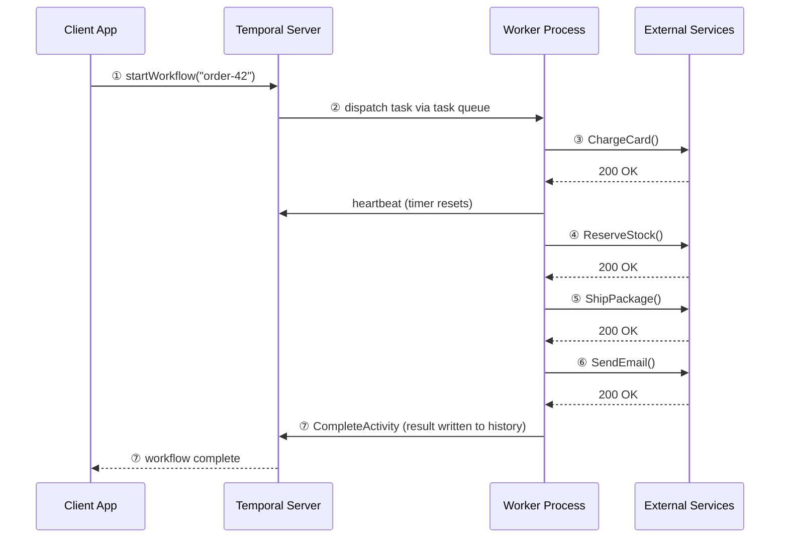
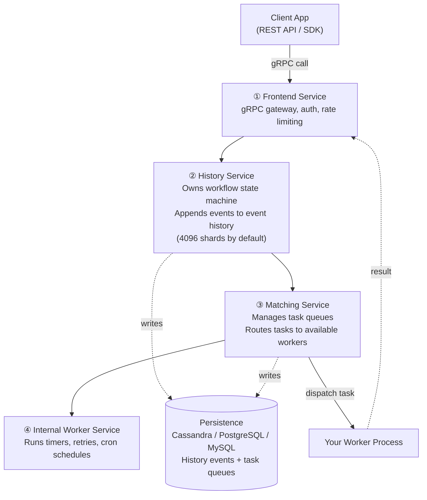
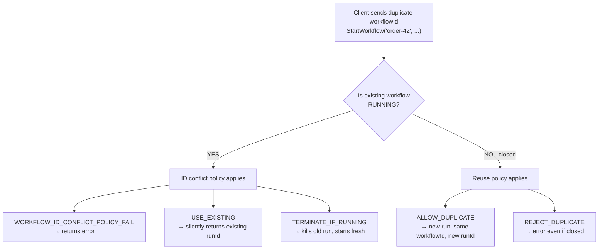
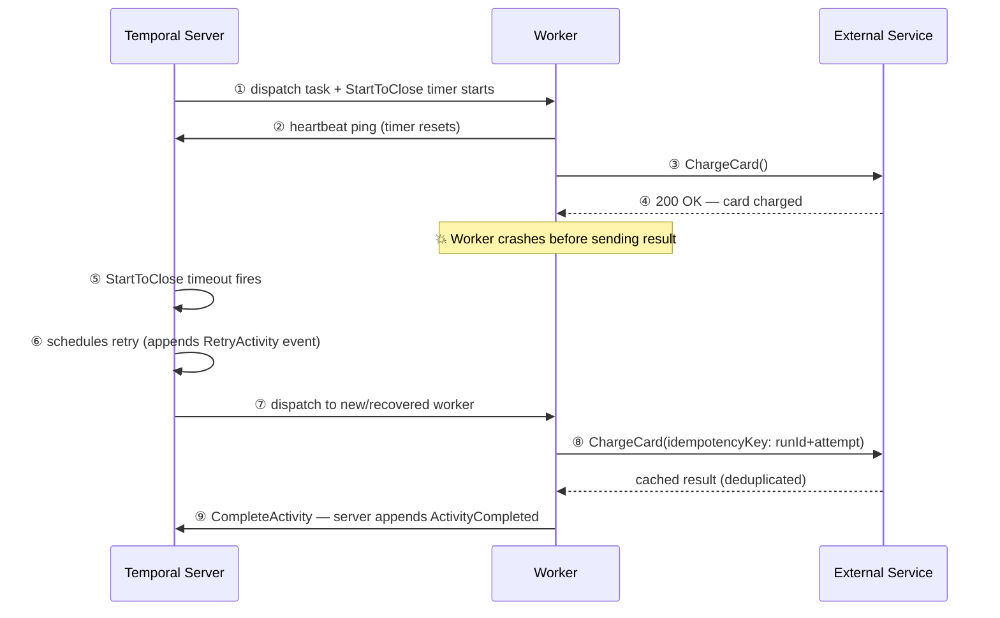
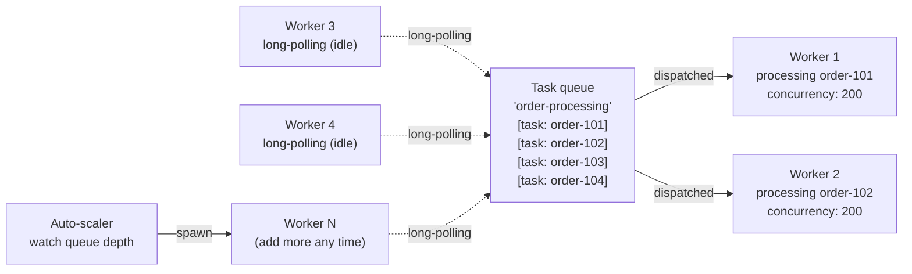
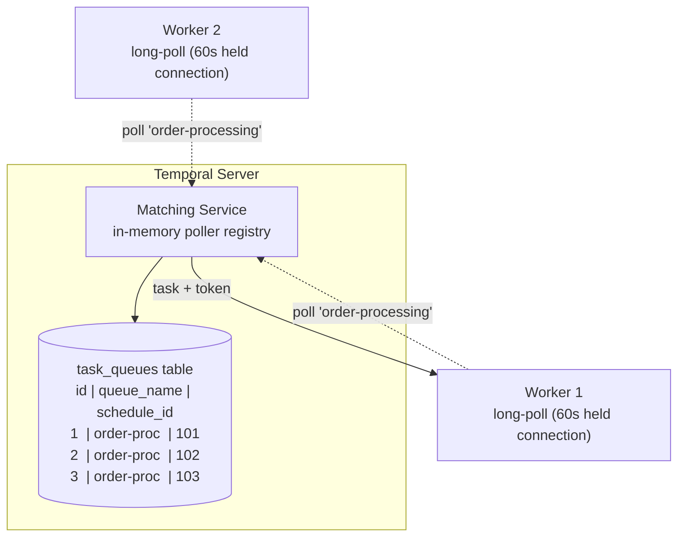
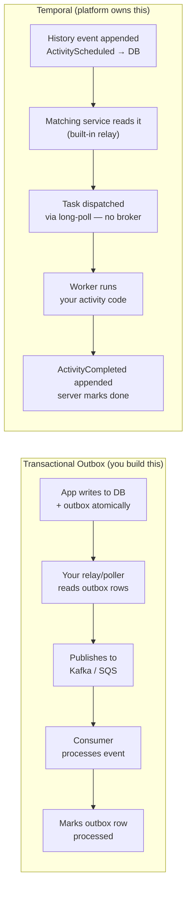
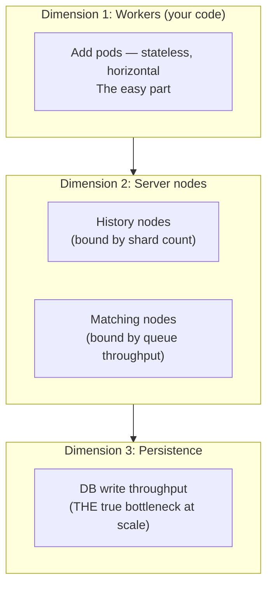

> *A senior architect's guide to Temporal — from workflow basics to internals, task queues, worker scaling, crash recovery, sharding, monitoring, and how it compares to Step Functions, Airflow, and DIY saga patterns.*

---

## Table of Contents

1. [What is Temporal?](#what-is-temporal)
2. [A Simple Example: Order Fulfillment](#a-simple-example-order-fulfillment)
3. [Inside the Temporal Server](#inside-the-temporal-server)
4. [Workflow ID Conflicts: What Happens on Duplicate Starts](#workflow-id-conflicts)
5. [Worker Completes the Job But Fails to Report Back](#worker-completes-but-fails-to-report)
6. [How Many Workers Can Run in Parallel?](#worker-parallelism)
7. [What Queue Does Temporal Use?](#what-queue-does-temporal-use)
8. [How Temporal Tracks 10 Workers Doing 10 Tasks](#how-temporal-tracks-workers)
9. [Is This Just the Outbox Pattern?](#is-this-just-the-outbox-pattern)
10. [Use Cases](#use-cases)
11. [Gotchas](#gotchas)
12. [Where to Use (and Where NOT to Use)](#where-to-use-and-where-not-to-use)
13. [Scaling Temporal](#scaling-temporal)
14. [Monitoring & Observability](#monitoring-and-observability)
15. [Versus (Comparisons)](#versus-comparisons)
16. [The Honest Critique](#the-honest-critique)
17. [References](#references)
18. [Interview Questions](#interview-questions)
19. [Staff-Level Preparation Tips](#staff-level-preparation-tips)

---

## What is Temporal?

Temporal is a **durable execution platform**. It lets you write long-running business logic as plain code — and guarantees it will finish, even if servers crash, networks fail, or the process takes days or weeks.

The core idea is deceptively simple:

> **Your code is the workflow definition. Temporal handles all reliability concerns underneath.**

Without Temporal, building a reliable multi-step process means stitching together job queues, retry logic, state machines, timeout handlers, and idempotency keys — all by hand. With Temporal, you write a normal function and call each step. Temporal makes that function durable.

> 💡 **Staff-level insight:** Temporal's real innovation isn't any single component — it's collapsing the entire "reliable distributed orchestration" stack (event log + relay + broker + retry + timeout + state machine) into a single programming model where `workflow.ExecuteActivity()` replaces hundreds of lines of infrastructure glue.

---

## A Simple Example: Order Fulfillment

Imagine placing an order on an e-commerce site. The process involves four steps:

1. Charge the card
2. Reserve inventory
3. Ship the package
4. Send a confirmation email

Without Temporal, a server crash between steps 2 and 3 leaves you with charged cards and no shipment — and no clean way to recover. With Temporal, the workflow resumes exactly where it left off.

Here is what the workflow code looks like in Go:

```go
func OrderWorkflow(ctx workflow.Context, order Order) error {
    activityOpts := workflow.ActivityOptions{
        StartToCloseTimeout: 30 * time.Second,
        RetryPolicy: &temporal.RetryPolicy{
            InitialInterval:    time.Second,
            BackoffCoefficient: 2.0,
            MaximumAttempts:    5,
        },
    }
    ctx = workflow.WithActivityOptions(ctx, activityOpts)

    if err := workflow.ExecuteActivity(ctx, ChargeCard, order).Get(ctx, nil); err != nil {
        return err
    }
    if err := workflow.ExecuteActivity(ctx, ReserveStock, order).Get(ctx, nil); err != nil {
        return err
    }
    if err := workflow.ExecuteActivity(ctx, ShipPackage, order).Get(ctx, nil); err != nil {
        return err
    }
    return workflow.ExecuteActivity(ctx, SendEmail, order).Get(ctx, nil)
}
```

It looks like normal sequential code. Under the hood, every `ExecuteActivity` is a durable checkpoint.

### The Flow



**① Client calls `StartWorkflow()`** — Your app tells Temporal to start an `OrderWorkflow`. It gets back a workflow ID immediately.

**② Server dispatches via task queue** — The Temporal server places a task on the queue. Your worker long-polls for tasks, picks it up, and begins executing.

**③–⑥ Activities execute sequentially** — Each `ExecuteActivity()` is an **Activity**: a unit of work with configurable retries, timeouts, and heartbeating.

**⑦ Completion written to event history** — Every completed activity is appended to the durable event log before moving on. This is the key to crash recovery.

### Three Key Mental Models

| Concept           | What It Is                   | Analogy                              |
| ----------------- | ---------------------------- | ------------------------------------ |
| **Workflow**      | The orchestration logic      | A recipe — defines the steps         |
| **Activity**      | A single side-effecting step | One cooking action (chop, fry)       |
| **Event history** | Append-only durable log      | A kitchen notepad — survives crashes |

### The Worker Bootstrap (Go)

This is what a production-ready worker setup looks like:

```go
package main

import (
    "log"
    "time"

    "go.temporal.io/sdk/client"
    "go.temporal.io/sdk/worker"
)

func main() {
    c, err := client.Dial(client.Options{
        HostPort: "temporal-server:7233",
    })
    if err != nil {
        log.Fatalln("Unable to create client", err)
    }
    defer c.Close()

    w := worker.New(c, "order-processing", worker.Options{
        MaxConcurrentActivityExecutionSize:     200,
        MaxConcurrentWorkflowTaskExecutionSize: 100,
        // Sticky cache: keeps recent workflow state in memory
        // Default: 10,000 entries per worker
    })
    w.RegisterWorkflow(OrderWorkflow)
    w.RegisterActivity(ChargeCard)
    w.RegisterActivity(ReserveStock)
    w.RegisterActivity(ShipPackage)
    w.RegisterActivity(SendEmail)

    if err := w.Run(worker.InterruptCh()); err != nil {
        log.Fatalln("Unable to start worker", err)
    }
}
```

---

## Inside the Temporal Server

The Temporal server is often treated as a black box. It has **four distinct internal subsystems**, each with a clear responsibility.

> **The server never runs your business logic.** It only tracks what happened, what needs to happen next, and who should do it.



**① Frontend service** — the only public face of the server. Every call from your client app hits this first. It handles gRPC routing, authentication, rate limiting, and namespace isolation. Zero business logic — purely a smart proxy.

**② History service** — the brain. It owns a *workflow state machine* and appends an immutable event for every meaningful transition: `WorkflowStarted`, `ActivityScheduled`, `ActivityCompleted`, `TimerFired`. Current workflow state = replay of event history.

**③ Matching service** — the dispatcher. When History decides "activity A needs to run", it writes a task to Matching, which maintains the task queues your workers long-poll. Matching finds an available worker and delivers the task — completely decoupling execution scale from orchestration.

**④ Internal worker service** — runs Temporal's own housekeeping: timer firing (when a `workflow.Sleep(ctx, 7*24*time.Hour)` expires), retry scheduling, cron job dispatch, and workflow timeouts. Temporal's own workflows, running inside Temporal.

### Sharding: How History Distributes Workflows

The History service divides all workflows into **shards** (default: 4,096 for Cassandra, 512 for PostgreSQL). Each shard is owned by exactly one History node at any time. Shard assignment: `shardId = hash(namespaceId + workflowId) % numShards`.

```
┌───────────────────────────────────────────────────────────────────┐
│                  History Nodes (3 nodes)                            │
├───────────────────┬──────────────────┬────────────────────────────┤
│  Node A           │  Node B          │  Node C                    │
│  Shards 0–1365    │  Shards 1366–2730│  Shards 2731–4095          │
└───────────────────┴──────────────────┴────────────────────────────┘
```

**Shard ownership failover:** When a History node dies, the remaining nodes acquire its shards via a lease-based protocol (backed by the database). The new owner loads in-flight timers from the shard's persistence rows and resumes firing them. Failover latency is typically **2–10 seconds** — bounded by the shard lease TTL.

**Hot shard problem:** If many workflows share a shard (hash collision or workload skew), that shard's owner becomes a bottleneck. Mitigation: use high-cardinality workflow IDs and ensure `numHistoryShards` matches your scale (512 shards for dev, 4K+ for production Cassandra deployments).

> 💡 **Staff-level insight:** `numHistoryShards` is set at cluster creation and **cannot be changed** without data migration to a new cluster. Choose it once, choose it right. Undersizing is the #1 cause of Temporal production scaling pain. Rule of thumb: target fewer than 50 active workflows per shard at peak.

### The Persistence Layer

All four services are stateless compute. The real state lives in the database. Temporal supports Cassandra, PostgreSQL, and MySQL. Two things are persisted:

- The **event history log** — append-only, the source of truth for every workflow
- **Task queue state** — so tasks survive Matching service restarts

### Key Operational Numbers

| Parameter                        | Default                            | Notes                               |
| -------------------------------- | ---------------------------------- | ----------------------------------- |
| History shards                   | 4,096 (Cassandra) / 512 (Postgres) | Immutable after creation            |
| Max event history                | 50,000 events OR 50 MB             | Workflow terminated if exceeded     |
| Default `StartToClose` timeout   | None (must be set explicitly)      | Always set this                     |
| Sticky cache size                | 10,000 workflow entries per worker | Tune per worker memory              |
| Recommended max activity payload | < 2 MB                             | Use external storage for large data |
| Shard lease TTL                  | ~10 seconds                        | Affects failover speed              |
| Long-poll timeout                | 60 seconds                         | Workers re-poll after expiry        |

---

## Workflow ID Conflicts

When a client calls `StartWorkflow()` with an ID that already exists, Temporal's behaviour depends on the **`WorkflowIdReusePolicy`** you configure.

### The Critical Distinction: Workflow ID vs Run ID

| Identifier   | Purpose                                                        |
| ------------ | -------------------------------------------------------------- |
| `workflowId` | Business identity you assign (`"order-42"`). Stable, reusable. |
| `runId`      | UUID Temporal generates per execution. Owns the event history. |

Events are **never appended by re-sending the same workflow ID**. Each run is isolated. History belongs to a `runId`, not the `workflowId`.

### Conflict Policies



**`REJECT_DUPLICATE`** — strict. Returns error. Use for payment processing or anything that must never fire twice concurrently.

**`ALLOW_DUPLICATE_FAILED_ONLY`** (SDK default) — safe for idempotent starts. If the previous run completed successfully, rejects a new start. If it failed, allows a fresh run.

**`TERMINATE_IF_RUNNING`** — the reset. Kill whatever is running and start fresh. Useful when a newer version of a task supersedes the old one.

```go
// Called 5 times — only 1 workflow ever runs
we, err := c.ExecuteWorkflow(ctx, client.StartWorkflowOptions{
    ID:        fmt.Sprintf("order-%s", orderId),
    TaskQueue: "order-processing",
    WorkflowIDReusePolicy: enums.WORKFLOW_ID_REUSE_POLICY_ALLOW_DUPLICATE_FAILED_ONLY,
}, OrderWorkflow, order)
```

---

## Worker Completes the Job But Fails to Report Back

This is one of the most important reliability scenarios. Without Temporal, it's a nightmare: your worker did the work, but the update failed — now you don't know whether to retry (risking double-execution) or skip.

### What Temporal Does



Temporal's side is fully automatic. When a worker picks up a task, the server starts a `StartToClose` timer. If the worker never sends completion within that timeout, Temporal assumes it's dead and schedules a retry — appending `ActivityTaskTimedOut` and a fresh `ActivityTaskScheduled` to the event history.

### The Real Problem: Your Activity Ran Twice

Temporal guarantees **at-least-once execution** for activities, not exactly-once. The work your worker did may get executed again on retry.

**The solution is idempotency keys on your activity side:**

```go
func ChargeCard(ctx context.Context, order Order) error {
    info := activity.GetInfo(ctx)
    idempotencyKey := fmt.Sprintf("%s-%s-%d",
        info.WorkflowExecution.ID,
        info.WorkflowExecution.RunID,
        info.Attempt,
    )

    _, err := stripeClient.Charges.New(&stripe.ChargeParams{
        Amount:         stripe.Int64(order.Total),
        IdempotencyKey: stripe.String(idempotencyKey),
    })
    return err
}
```

> 💡 **Staff-level insight:** Many teams use `workflowId + activityId` as the idempotency key and omit the attempt number. This is wrong — it means a legitimate retry (after a crash) gets deduplicated by the external service and silently returns a cached result. Include the attempt number so retries succeed, while true duplicates (same attempt replayed) are blocked.

### The Three Timers

| Timer              | What It Guards                                                                  | Typical Value |
| ------------------ | ------------------------------------------------------------------------------- | ------------- |
| `ScheduleToStart`  | Time between Temporal dispatching and worker picking up. Guards stuck queues.   | 5–60s         |
| `StartToClose`     | Time between worker starting and completing. Fires in the crash scenario above. | 30s–5m        |
| `ScheduleToClose`  | Total budget across all retry attempts.                                         | 5–30m         |
| `HeartbeatTimeout` | Max silence between heartbeats. Catches zombie workers fast.                    | 10–30s        |

### Heartbeating for Long-Running Activities

```go
func ProcessVideo(ctx context.Context, file string) error {
    chunks := splitIntoChunks(file)
    for i, chunk := range chunks {
        if err := processChunk(chunk); err != nil {
            return err
        }
        // Heartbeat every iteration — crash detected within HeartbeatTimeout
        activity.RecordHeartbeat(ctx, ProgressPayload{ChunkIndex: i})
    }
    return nil
}
```

Configure `HeartbeatTimeout` tightly (e.g., 30 seconds). If the worker dies mid-loop, Temporal detects the missing heartbeat and retries — much faster than waiting for the full `StartToClose` timeout. The heartbeat payload is available to the new worker on retry via `activity.GetHeartbeatDetails()` for resuming mid-task:

```go
func ProcessVideo(ctx context.Context, file string) error {
    chunks := splitIntoChunks(file)
    startIndex := 0

    // Resume from last heartbeat on retry
    if activity.HasHeartbeatDetails(ctx) {
        var progress ProgressPayload
        if err := activity.GetHeartbeatDetails(ctx, &progress); err == nil {
            startIndex = progress.ChunkIndex + 1
        }
    }

    for i := startIndex; i < len(chunks); i++ {
        if err := processChunk(chunks[i]); err != nil {
            return err
        }
        activity.RecordHeartbeat(ctx, ProgressPayload{ChunkIndex: i})
    }
    return nil
}
```

---

## Worker Parallelism

There is **no fixed limit** on the number of workers. Temporal's pull model is what makes scaling clean.

### The Pull Model

Temporal uses **pull, not push**. Workers long-poll the server saying "I'm ready, give me a task." The Matching service only dispatches to a worker that has declared itself available. A busy worker simply stops polling until it has capacity. Zero risk of a worker being overwhelmed.

Each task is dispatched to **exactly one worker** — the Matching service guarantees no double-dispatch.



### Two Levels of Concurrency

**Level 1 — across workers (horizontal scale).** Run as many worker processes as you want on separate pods, VMs, or containers. All listen on the same task queue name.

**Level 2 — within a single worker (goroutine-level).** Each worker has a `MaxConcurrentActivityExecutionSize` setting (default 1,000 in the Go SDK).

```go
w := worker.New(c, "order-processing", worker.Options{
    MaxConcurrentActivityExecutionSize:     200,
    MaxConcurrentWorkflowTaskExecutionSize: 100,
})
```

10 workers × 200 concurrency = **2,000 activities running in parallel**.

### Real Throughput Limits

| Bottleneck                     | What To Do                                                                         |
| ------------------------------ | ---------------------------------------------------------------------------------- |
| Task queue depth growing       | Add more workers or raise per-worker concurrency                                   |
| Database connections exhausted | Pool connections, reduce per-worker concurrency                                    |
| External API rate limits       | Cap workers with `MaxConcurrentActivityExecutionSize`                              |
| Temporal server itself         | Temporal Cloud scales automatically; self-hosted needs more History/Matching nodes |

### Auto-Scaling Pattern

```go
resp, err := c.DescribeTaskQueue(ctx, "order-processing", enums.TASK_QUEUE_TYPE_ACTIVITY)
// Scale workers up/down based on backlog count and poller count
backlog := resp.GetTaskQueueStatus().GetBacklogCountHint()
pollers := len(resp.GetPollers())
```

Workers scale like stateless microservices. No coordination needed. The task queue absorbs bursts, workers drain at their own pace.

---

## What Queue Does Temporal Use?

**Temporal's task queue is not Kafka, not RabbitMQ, not Redis.** It is rows in the same database Temporal already uses for event history.



The row doesn't store the full task payload — it stores a **pointer** (a schedule event reference in the workflow's history). When a worker picks up the task, it fetches the actual task data from the History service. This keeps the queue table lean.

### How Long-Polling Works

Workers make a normal HTTP/2 request: "give me a task from queue `order-processing`". The server holds that connection open for up to 60 seconds. If a task arrives, it responds immediately. If nothing arrives in 60 seconds, it returns empty and the worker re-polls. Workers require **zero inbound networking** — only outbound connections to the Temporal server.

### Two Queue Types

**Activity task queue** — shared pool. Any available worker wins. The Matching service picks whichever worker's long-poll arrived first and sends the task to exactly that one.

**Workflow task queue (sticky queue)** — preferentially routed to the *same worker that last ran that workflow*, since it already has the event history replayed in memory. Falls back to the normal queue automatically if that worker is gone. Default sticky cache: **10,000 workflow entries per worker**. Default `StickyScheduleToStartTimeout`: **5 seconds** (if the preferred worker doesn't pick up within 5s, task goes to any worker).

### Temporal vs External Brokers

|                    | Temporal Task Queue    | Kafka / RabbitMQ      |
| ------------------ | ---------------------- | --------------------- |
| Storage            | Temporal's own DB      | Separate broker infra |
| Delivery           | Pull (long-poll)       | Push or pull          |
| Message payload    | Pointer to history     | Full message          |
| Ordering guarantee | Per-workflow (history) | Per-partition         |
| Deduplication      | Built-in (Matching)    | Manual                |
| Extra infra needed | **None**               | Yes                   |
| Replay             | Via event history      | Via offset (Kafka)    |

---

## How Temporal Tracks 10 Workers Doing 10 Tasks

The mechanism is the **task token** — not worker identity.

### Step 1: Poller Registration

All workers long-poll the Matching service. Matching maintains an **in-memory poller registry**:

```
worker-1  →  idle  →  conn#A  →  polled 2s ago
worker-2  →  idle  →  conn#B  →  polled 1s ago
worker-3  →  idle  →  conn#C  →  polled 3s ago
...
```

No task is assigned yet. The connections just wait.

### Step 2: Task Token Handshake

When a task arrives, Matching picks the first idle connection and generates a **task token** — a small opaque blob:

```
task token = workflowId + runId + scheduleId + attempt#
```

This token is handed to the worker along with the task. The worker holds it for the entire activity duration.

### Step 3: In-Flight Tracking

The History service records every dispatched task in a **persisted table**:

```
task token  |  workflow ID  |  worker identity  |  startToClose deadline
tok_a8f2    |  order-101    |  worker-1          |  T+30s
tok_c3d9    |  order-102    |  worker-2          |  T+28s
tok_e1b7    |  order-103    |  worker-3          |  T+25s
tok_f9a4    |  order-104    |  worker-4          |  T+22s
```

This table survives server restarts. The timer fires if the deadline passes with no heartbeat or completion.

### Step 4: Completion by Token, Not Identity

```go
// Internal: worker SDK calls this when activity completes
client.CompleteActivity(ctx, taskToken, result, nil)
```

The server looks up `tok_a8f2` → finds `order-101` → appends `ActivityCompleted` to event history → deletes the in-flight row → workflow state machine advances.

**Nothing is tracked by connection.** A worker can disconnect and reconnect mid-task — the token still works. This enables **async activity completion**:

```go
// Worker saves token and returns immediately — activity stays "running"
func WebhookActivity(ctx context.Context, orderId string) (string, error) {
    token := activity.GetInfo(ctx).TaskToken
    // Store the token externally (Redis, DB, etc.)
    rdb.Set(ctx, fmt.Sprintf("token:%s", orderId), token, 72*time.Hour)
    // Tell Temporal "I'm not done yet, someone else will complete this"
    return "", activity.ErrResultPending
}

// ... webhook arrives 3 days later from a payment processor ...
func HandleWebhook(w http.ResponseWriter, r *http.Request) {
    orderId := r.URL.Query().Get("order_id")
    token, _ := rdb.Get(ctx, fmt.Sprintf("token:%s", orderId)).Bytes()

    err := temporalClient.CompleteActivity(ctx, token, PaymentResult{Charged: true}, nil)
    if err != nil {
        log.Printf("failed to complete activity: %v", err)
    }
}
```

The worker doesn't need to be alive when the task finishes. The token is all that matters.

> 💡 **Staff-level insight:** Task tokens are unforgeable (server-generated, tied to a specific run + attempt) but are **not encrypted**. If a token leaks, anyone with gRPC access to the Temporal server can complete that activity with arbitrary results. In multi-tenant environments, treat tokens like bearer credentials — don't log them, don't expose them in HTTP responses, and consider encrypting at rest if stored externally.

---

## Is This Just the Outbox Pattern?

**Yes — and no.** They share the same core instinct, but solve different problems at different layers.

### The Shared DNA

Both patterns rest on one insight:

> *If you write the intent to a durable store before doing the work, a crash can never cause you to silently lose a task.*

On recovery, scan the store, find unprocessed rows, retry. This is the outbox pattern. Temporal's event history does exactly this — `ActivityScheduled` is written before the worker ever receives the task.

### Side-by-Side Comparison



### Where They Diverge

|                         | Transactional Outbox         | Temporal                        |
| ----------------------- | ---------------------------- | ------------------------------- |
| **Relay**               | You write and operate it     | Matching service (built-in)     |
| **Broker**              | External (Kafka, SQS…)       | None — DB rows are the queue    |
| **Scope**               | One event, one step          | Entire multi-step workflow      |
| **Retries**             | You implement                | Built-in with backoff + timeout |
| **State between steps** | Stateless — must reconstruct | Full workflow state preserved   |
| **Observability**       | DIY                          | Built into Temporal UI          |

### The Key Difference: Statefulness

The outbox is inherently stateless between steps. After step 1 publishes and step 2 consumes, there's no shared memory — your consumer reconstructs context from the DB.

Temporal's workflow function is a **stateful code execution**. `workflow.ExecuteActivity()` literally suspends and resumes with all local variables intact. There's no reconstruction step, no state hydration — just code that picks up where it left off.

```
Outbox:
  your DB  →  outbox table  →  your relay  →  Kafka  →  your consumer
             (you write and operate every piece of this)

Temporal:
  event history  →  Matching service  →  worker
  (Temporal owns the infrastructure — you write the activity function)
```

Temporal is the outbox pattern, industrialised — generalised across an entire workflow, with the relay, broker, retry, timeout, and observability machinery built into the platform. But it's **not a replacement for the outbox pattern in all cases** — it's not an event bus, not a stream processor, and not suitable when you need fan-out pub/sub semantics.

---

## Use Cases

### Real Companies Running Temporal in Production

**Stripe** — Long-running payment processes. Temporal orchestrates multi-step payment flows that span card authorization, capture, settlement, and dispute handling. When a payment takes days to settle across bank networks, Temporal guarantees the workflow completes even if intermediate services restart.

**Snap (Snapchat)** — CI/CD pipelines. Their deployment system uses Temporal workflows to orchestrate multi-step build, test, canary, and rollout processes across thousands of microservices. A single deploy can take 30+ minutes with multiple approval gates — perfect Temporal territory.

**Datadog** — Data pipeline orchestration. Ingestion pipelines with complex retry, fan-out, and aggregation logic. Temporal replaces fragile cron + queue combinations that previously required manual intervention on failure.

**Coinbase** — Cryptocurrency transaction processing. Workflows orchestrate multi-chain operations where a crash during a token transfer could mean lost funds. Temporal's durable execution guarantees that compensation logic always runs.

**HashiCorp (HCP)** — Cloud Platform provisioning. When a customer provisions a Vault cluster or Consul deployment, dozens of cloud resources must be created in sequence. Temporal orchestrates this multi-minute process reliably across AWS/Azure/GCP.

**Netflix (via Cadence → Temporal lineage)** — The original Cadence project (Temporal's predecessor) was built at Uber and adopted by Netflix for media encoding, content delivery, and operational automation workflows.

### When to Use Temporal

- Multi-step business processes that must complete reliably (order fulfillment, user onboarding)
- Long-running operations (minutes to weeks): provisioning, approval flows, subscription billing cycles
- Saga patterns with compensation logic (if step 3 fails, undo steps 1 and 2)
- Human-in-the-loop workflows (wait for approval signal, then proceed)
- Scheduled + recurring jobs that need more reliability than cron
- Replacing fragile "queue + consumer + dead letter queue + manual retry" architectures

---

## Gotchas

These are the things that bite teams in production — usually after they've already shipped.

### 1. Workflow Determinism Rules

**The #1 operational footgun in Temporal.** Workflow code is replayed from event history to reconstruct state. If replay produces different decisions than the original execution, you get a **non-determinism error** and the workflow is stuck.

**What you CANNOT do in workflow code:**

```go
// ❌ WRONG — time.Now() returns different values on replay
deadline := time.Now().Add(24 * time.Hour)

// ✅ CORRECT — use workflow.Now()
deadline := workflow.Now(ctx).Add(24 * time.Hour)

// ❌ WRONG — rand gives different results on replay
id := rand.Intn(1000)

// ✅ CORRECT — use workflow.SideEffect for non-deterministic values
var id int
encoded := workflow.SideEffect(ctx, func(ctx workflow.Context) interface{} {
    return rand.Intn(1000)
})
encoded.Get(&id)

// ❌ WRONG — map iteration order is non-deterministic in Go
for k, v := range myMap {
    workflow.ExecuteActivity(ctx, ProcessItem, k, v).Get(ctx, nil)
}

// ✅ CORRECT — sort keys first
keys := make([]string, 0, len(myMap))
for k := range myMap {
    keys = append(keys, k)
}
sort.Strings(keys)
for _, k := range keys {
    workflow.ExecuteActivity(ctx, ProcessItem, k, myMap[k]).Get(ctx, nil)
}
```

**The rule:** Anything that could produce a different result on a second call is banned from workflow code. Activities, `SideEffect`, and `MutableSideEffect` are your escape hatches.

### 2. Versioning with `workflow.GetVersion`

When you need to change workflow logic while workflows are already running:

```go
func OrderWorkflow(ctx workflow.Context, order Order) error {
    v := workflow.GetVersion(ctx, "add-fraud-check", workflow.DefaultVersion, 1)
    if v == 1 {
        // New code path — only runs for workflows started after this deploy
        if err := workflow.ExecuteActivity(ctx, FraudCheck, order).Get(ctx, nil); err != nil {
            return err
        }
    }
    // Original logic continues for both old and new workflows...
    return workflow.ExecuteActivity(ctx, ChargeCard, order).Get(ctx, nil)
}
```

Without `GetVersion`, changing workflow logic breaks replay of in-flight workflows. A code change that removes or reorders an activity causes non-determinism errors for every workflow that was already past that point.

**When to remove old version branches:** Only after ALL workflows using the old path have completed. Check via visibility queries: `WorkflowType = "OrderWorkflow" AND CloseTime IS NULL`.

### 3. Event History Size Limit

**Hard limit: ~50,000 events or 50 MB per workflow execution.** When exceeded, Temporal terminates the workflow with no recovery.

For long-lived workflows (e.g., subscription billing that runs indefinitely), use **Continue-As-New**:

```go
func SubscriptionWorkflow(ctx workflow.Context, sub Subscription) error {
    for i := 0; i < 30; i++ { // Process 30 billing cycles, then reset
        if err := workflow.ExecuteActivity(ctx, ChargeCycle, sub).Get(ctx, nil); err != nil {
            return err
        }
        workflow.Sleep(ctx, 30*24*time.Hour) // Each sleep = 1 TimerStarted + 1 TimerFired event
    }
    // Reset history — starts a fresh execution with same workflow ID
    return workflow.NewContinueAsNewError(ctx, SubscriptionWorkflow, sub)
}
```

**Event count math:** Each activity adds ~3 events (Scheduled + Started + Completed). Each timer adds 2 (Started + Fired). A workflow with 10,000 activities hits ~30K events. A workflow with retries can blow through the limit much faster. Design for it from day one.

### 4. Sticky Queue Cache Eviction

Workflow tasks are preferentially routed to the worker that last ran them (sticky queue) because that worker already has the event history replayed in memory. If the sticky cache is full (default: 10,000 entries), the workflow gets evicted and the next task goes to any worker — which must replay the entire history from scratch.

**Symptoms:** Sudden spikes in `temporal_workflow_task_replay_latency` and increased `temporal_sticky_cache_miss` rate.

**Fix:**
- Increase worker count to spread cache across more processes
- Reduce `StickyScheduleToStartTimeout` (default 5s) to fail over faster
- Use `ContinueAsNew` to keep histories short (less replay cost on eviction)

### 5. Large Payload Anti-Pattern

Activity inputs and outputs are serialized and stored in event history. A 5 MB payload means 5 MB written to the DB **per event** — and replayed every time the workflow is resumed on a non-sticky worker.

**Rule of thumb: keep payloads under 2 MB.** For large data, store externally and pass a reference:

```go
// ❌ WRONG — 10MB video blob stored in workflow history forever
workflow.ExecuteActivity(ctx, ProcessVideo, hugeVideoBytes)

// ✅ CORRECT — pass a pointer
ref := S3Ref{Bucket: "videos", Key: fmt.Sprintf("input/%s.mp4", videoId)}
workflow.ExecuteActivity(ctx, ProcessVideo, ref) // ref is ~100 bytes
```

### 6. Non-Deterministic Library Calls

UUID generation, HTTP calls, file I/O, gRPC calls, database queries — all produce different results on replay. **Every side effect must live in an Activity**, never in workflow code.

```go
// ❌ WRONG — in workflow code
resp, _ := http.Get("https://api.example.com/status")

// ✅ CORRECT — wrap in an activity
func CheckStatus(ctx context.Context) (Status, error) {
    resp, err := http.Get("https://api.example.com/status")
    // ... handle response
}
// Call from workflow
workflow.ExecuteActivity(ctx, CheckStatus).Get(ctx, &status)
```

---

## Where to Use (and Where NOT to Use)

### ✅ Use Temporal When

| Scenario                                 | Why Temporal Wins                             |
| ---------------------------------------- | --------------------------------------------- |
| Multi-step business processes (5+ steps) | State management + retries built-in           |
| Long-running (minutes to weeks)          | Durable timers survive server restarts        |
| Saga / compensation patterns             | Native support via workflow error handling    |
| Human-in-the-loop approvals              | Signals + timers handle async waits naturally |
| Replacing fragile cron + DLQ setups      | Single visibility plane for all jobs          |
| Cross-service orchestration              | Decouples services without shared state       |

### ❌ Do NOT Use Temporal When

| Scenario                                                | Why Not                                                             | Use Instead                       |
| ------------------------------------------------------- | ------------------------------------------------------------------- | --------------------------------- |
| High-throughput stateless transforms (100K+ events/sec) | Per-event overhead of history write is too expensive                | Kafka Streams, Flink              |
| Fan-out pub/sub (one event → many consumers)            | Temporal is 1:1 orchestration, not broadcast                        | Kafka, SNS/SQS                    |
| Simple fire-and-forget async jobs (< 3 steps)           | Overkill; adds infra complexity for minimal gain                    | SQS + Lambda, goroutines          |
| Sub-millisecond latency hot paths                       | Each activity adds 5–20ms network round-trip to Temporal server     | In-process logic                  |
| CQRS event sourcing (read-side projections)             | Temporal's event history is per-workflow, not a global event stream | Kafka + custom projectors         |
| Pure batch ETL (process 1M rows as a batch)             | Single workflow ≠ batch processor                                   | Spark, Airflow for DAG scheduling |
| Stateless request/response APIs                         | No long-running state needed                                        | Standard HTTP handlers            |

### Anti-Patterns to Avoid

1. **Workflow-per-request at high QPS** — At 10K workflows/sec, the History service becomes the bottleneck. Batch operations into fewer, longer workflows where possible.
2. **Using Temporal as a database** — Don't query workflow state as your read model. Extract data via activity side effects to your own DB.
3. **Huge fan-out within a single workflow** — 10,000 parallel child workflows from one parent = history explosion. Use partitioned worker patterns and entity workflows instead.
4. **Ignoring workflow history growth** — "It'll never hit 50K events" is what everyone says before the 3 AM page.
5. **Putting business logic in both workflow AND activity** — Keep workflow as pure orchestration. Activities do the work. Mixing creates testing nightmares.

---

## Scaling Temporal

### The Three Scaling Dimensions



### Behavior at Scale

| Scale             | Workflows/sec                    | Challenges                                               | Mitigations                      |
| ----------------- | -------------------------------- | -------------------------------------------------------- | -------------------------------- |
| 10x (100/s)       | Dev/staging baseline             | None — everything works                                  | Single-node Temporal, PostgreSQL |
| 100x (1,000/s)    | Queue depth grows, latency rises | Add workers, scale History nodes to 3+                   |
| 1,000x (10,000/s) | DB write saturation, hot shards  | Cassandra required, 4K+ shards, dedicated Matching nodes |
| 10,000x (100K/s)  | Beyond single-cluster            | Multi-cluster with global namespaces, Temporal Cloud     |

### Cassandra vs PostgreSQL at Scale

| Aspect                   | PostgreSQL                         | Cassandra                          |
| ------------------------ | ---------------------------------- | ---------------------------------- |
| Max practical throughput | ~1,000–3,000 workflows/sec         | 10,000–50,000+ workflows/sec       |
| Operational complexity   | Low (managed RDS works)            | High (tuning, compaction, repairs) |
| Shard count support      | 512 default                        | 4,096+ default                     |
| Multi-region replication | Complex (logical replication)      | Native (multi-DC built-in)         |
| Cost at scale            | Vertical scaling gets expensive    | Linear horizontal scaling          |
| Best for                 | Small-medium deployments, dev/test | Large production, multi-region     |

**Choose PostgreSQL when:** < 2K workflows/sec, team lacks Cassandra expertise, single-region, want simplest ops path.

**Choose Cassandra when:** > 2K workflows/sec, multi-region required, team has NoSQL ops experience, cost-sensitive at scale.

### Multi-Cluster and Global Namespaces

For multi-region deployments, Temporal supports **global namespaces** — a namespace that replicates across clusters. Active-passive failover: one cluster is primary (accepts writes), others are standby (receive replicated history). Failover promotes a standby to primary in seconds.

Use case: EU data residency. Run a Temporal cluster in `eu-west-1` with local Cassandra. Global namespace replicates metadata (not payloads) to a US standby for DR.

### Self-Hosted vs Temporal Cloud

| Aspect                   | Self-Hosted                                           | Temporal Cloud                    |
| ------------------------ | ----------------------------------------------------- | --------------------------------- |
| Ops burden               | You manage everything (upgrades, scaling, monitoring) | Zero infra management             |
| Scaling                  | Manual shard/node sizing                              | Automatic                         |
| Cost (small, < 500 wf/s) | Cheaper (one PostgreSQL instance)                     | ~$200/mo minimum                  |
| Cost (large, > 5K wf/s)  | Expensive (Cassandra ops team needed)                 | Per-action pricing, often cheaper |
| Multi-region             | You build and maintain it                             | Built-in global namespaces        |
| SLA                      | Your problem to guarantee                             | 99.99% contractual                |
| Time to production       | Weeks (infra + monitoring setup)                      | Hours                             |

> 💡 **Staff-level insight:** The decision to self-host vs use Temporal Cloud isn't primarily about money — it's about **organizational capability**. Running Temporal in production means understanding shard rebalancing, DB compaction, history archival, schema migrations during rolling upgrades, and visibility store maintenance. Unless your team already operates stateful distributed infrastructure (Kafka clusters, Cassandra rings), Temporal Cloud eliminates an entire class of operational risk. The real cost of self-hosting is the opportunity cost of your platform engineers maintaining Temporal instead of building product features.

---

## Monitoring & Observability

### SDK Metrics (emitted by your workers)

| Metric                                                     | What It Tells You                                          | Alert When                                                         |
| ---------------------------------------------------------- | ---------------------------------------------------------- | ------------------------------------------------------------------ |
| `temporal_workflow_task_schedule_to_start_latency`         | How long tasks wait in queue before a worker picks them up | p99 > 5s sustained (worker starvation)                             |
| `temporal_activity_schedule_to_start_latency`              | Activity queue backlog — workers not keeping up            | p99 > 10s (need more workers)                                      |
| `temporal_sticky_cache_hit` / `temporal_sticky_cache_miss` | How often workflows replay from scratch vs cached          | miss rate > 30% (cache too small or too many workflows per worker) |
| `temporal_activity_execution_failed`                       | Activity failures before retry succeeds                    | Spike above baseline = downstream outage                           |
| `temporal_workflow_task_replay_latency`                    | Time to replay event history on non-sticky task            | p99 > 500ms (histories too large, need ContinueAsNew)              |
| `temporal_activity_execution_latency`                      | How long activities actually take                          | Upward trend = degrading dependency                                |
| `temporal_worker_task_slots_available`                     | Remaining concurrency capacity on the worker               | Near 0 = worker at max load, scale out                             |

### Server Metrics (Temporal server emits these)

| Metric                                    | What It Tells You                                    | Alert When                                                             |
| ----------------------------------------- | ---------------------------------------------------- | ---------------------------------------------------------------------- |
| `persistence_latency`                     | DB read/write time per operation                     | p99 > 100ms (DB overloaded or slow storage)                            |
| `shard_lock_latency`                      | Time to acquire shard ownership                      | > 5s (lock contention or failover in progress)                         |
| `history_size` (per workflow)             | Event count approaching the 50K limit                | > 40,000 events (approaching forced termination)                       |
| `transfer_task_latency`                   | Internal task propagation between History → Matching | > 1s (server processing backlog)                                       |
| `matching_poll_success_rate`              | % of long-polls that return a task                   | Consistently low = over-provisioned workers (not a problem, just cost) |
| `schedule_to_start_latency` (server-side) | Server's view of task wait time                      | > 5s = Matching service overloaded or workers gone                     |

### Essential Dashboards

```
┌─────────────────────────────────────────────────────────────────────┐
│  TEMPORAL OPERATIONS DASHBOARD                                       │
├─────────────────────────────────────────────────────────────────────┤
│                                                                       │
│  [Schedule-to-Start Latency]       [Activity Failure Rate]           │
│  p50: 12ms  p99: 230ms            0.02% (3 retries in last hour)    │
│                                                                       │
│  [Sticky Cache Hit Rate]           [Workflow Completions/min]        │
│  87% hit / 13% miss               342 workflows/min                 │
│                                                                       │
│  [Persistence Latency]             [Worker Slots Available]          │
│  p50: 4ms  p99: 45ms              1,247 / 2,000 total               │
│                                                                       │
│  [Active Workflows]                [History Size Distribution]       │
│  12,847 running                    p50: 42 events  p99: 8,200       │
│                                                                       │
└─────────────────────────────────────────────────────────────────────┘
```

### Go SDK: Enabling Prometheus Metrics

```go
package main

import (
    "net/http"

    "go.temporal.io/sdk/client"
    sdktally "go.temporal.io/sdk/contrib/tally"
    "github.com/uber-go/tally/v4"
    "github.com/uber-go/tally/v4/prometheus"
    prom "github.com/prometheus/client_golang/prometheus"
    "github.com/prometheus/client_golang/prometheus/promhttp"
)

func newMetricsHandler() client.MetricsHandler {
    reporter := prometheus.NewReporter(prometheus.Options{
        Registerer: prom.DefaultRegisterer,
    })
    scope, _ := tally.NewRootScope(tally.ScopeOptions{
        Prefix:         "temporal",
        CachedReporter: reporter,
        Separator:      "_",
    }, time.Second)

    // Expose /metrics endpoint for Prometheus scraping
    go func() {
        http.Handle("/metrics", promhttp.Handler())
        http.ListenAndServe(":9090", nil)
    }()

    return sdktally.NewMetricsHandler(scope)
}

func main() {
    c, _ := client.Dial(client.Options{
        MetricsHandler: newMetricsHandler(),
    })
    defer c.Close()
    // ... worker setup
}
```

### What to Alert On (Priority Order)

1. **`schedule_to_start_latency` p99 > 5s** — Workers are starved. Scale immediately.
2. **`persistence_latency` p99 > 100ms** — DB is the bottleneck. Check connections, disk I/O, query plans.
3. **`activity_execution_failed` rate spike** — Downstream dependency is down. Check dependent services.
4. **`history_size` > 40K events** — Workflow approaching termination. Needs `ContinueAsNew`.
5. **`sticky_cache_miss` rate > 50%** — Every other workflow task replays from scratch. Performance degrading.

---

## Versus (Comparisons)

### Temporal vs AWS Step Functions

| Aspect                 | Temporal                                                  | AWS Step Functions                           |
| ---------------------- | --------------------------------------------------------- | -------------------------------------------- |
| Programming model      | Code-first (Go, Java, TS, Python)                         | JSON/YAML state machine (ASL)                |
| Debugging              | Step through code with standard debugger                  | JSON diff in AWS Console                     |
| Vendor lock-in         | Portable (self-host or cloud)                             | AWS-only                                     |
| Max execution duration | Unlimited                                                 | 1 year (Express: 5 min)                      |
| State size limit       | 50K events / 50MB                                         | 256 KB per state transition                  |
| Pricing                | Per-action or self-hosted infra cost                      | Per-state-transition ($0.025/1K transitions) |
| Testing                | Standard unit tests, mock activities                      | LocalStack or SAM local (limited fidelity)   |
| Complexity ceiling     | Unlimited (it's code — loops, branching, recursion)       | ASL becomes unreadable beyond ~20 states     |
| Versioning             | `GetVersion` / workflow patching                          | Deploy new state machine version             |
| Local dev              | Full local server available (`temporal server start-dev`) | Limited emulation                            |

**Choose Step Functions when:** Simple 5–10 step AWS-native workflows, team doesn't want to operate infrastructure, tight AWS integration (Lambda triggers, DynamoDB, SQS) is the primary value, and you'll never need to run outside AWS.

**Choose Temporal when:** Complex logic with loops/conditionals, portable across clouds, need standard debugging and testing, workflows exceed 20+ states, team prefers code over YAML, or you need to run the same workflow engine in multiple environments.

### Temporal vs Apache Airflow

| Aspect              | Temporal                                                 | Airflow                                                         |
| ------------------- | -------------------------------------------------------- | --------------------------------------------------------------- |
| Primary use case    | Microservice orchestration, real-time business workflows | Batch data pipelines, scheduled ETL                             |
| Execution model     | Event-sourced, durable per-step                          | DAG scheduling, task retry on failure                           |
| Latency             | Sub-second activity start                                | Minutes (scheduler polling interval, typically 30s–5m)          |
| Dynamic workflows   | Full — loops, conditionals, runtime branching            | Limited — DAGs are defined at parse time, mostly static         |
| Scale model         | Horizontal workers, no single scheduler                  | Single scheduler bottleneck (improved in Airflow 2.x but still) |
| Human-in-the-loop   | Native (signals, queries, updates)                       | Not designed for interactive workflows                          |
| State between tasks | Built-in workflow variables persist across steps         | XCom (limited to ~48KB by default, external storage needed)     |

**Choose Airflow when:** Batch-oriented data pipelines on a schedule, DAG visualization is critical for your team, tasks are independent and retry-able, team already uses it and is productive.

**Choose Temporal when:** Real-time service orchestration, dynamic control flow that can't be expressed as a static DAG, sub-second latency needed, long-running processes with human interaction or external callbacks.

### Temporal vs Cadence

| Aspect           | Temporal                                       | Cadence (Uber)                         |
| ---------------- | ---------------------------------------------- | -------------------------------------- |
| Origin           | Fork of Cadence by the same creators (2020)    | Original project at Uber (2017)        |
| Governance       | Independent company (Temporal Technologies)    | Uber-controlled open source            |
| SDK quality      | First-class Go, Java, TypeScript, Python, .NET | Go, Java (others community-maintained) |
| Cloud offering   | Temporal Cloud (fully managed, multi-tenant)   | None (self-host only)                  |
| Community        | Larger, more active (10K+ Slack members)       | Smaller, primarily Uber-internal       |
| Protocol         | gRPC-native from day one                       | Thrift → migrating to gRPC             |
| Migration path   | From Cadence → straightforward (same concepts) | —                                      |
| Feature velocity | Rapid (Schedules, Updates, Nexus)              | Slower (Uber's internal priorities)    |

**Choose Temporal when:** Starting fresh, want managed cloud option, need multi-language SDK support, want active community and fast feature development.

**Choose Cadence when:** Already running Cadence in production at scale, deeply integrated with Uber's ecosystem, no compelling reason to migrate (if it works, don't fix it).

### Temporal vs DIY Kafka + Saga

| Aspect                     | Temporal                                                      | Kafka + Saga (hand-built)                                                        |
| -------------------------- | ------------------------------------------------------------- | -------------------------------------------------------------------------------- |
| Implementation effort      | Days (workflow function + activities)                         | Weeks–months (consumers, state store, compensation events, DLQ, idempotency)     |
| State visibility           | Temporal UI — full workflow history, searchable               | Custom dashboards + distributed tracing + log correlation                        |
| Compensation logic         | Standard Go error handling in workflow code                   | Explicit compensation events, ordering guarantees, idempotency on every consumer |
| Debugging failed workflows | Click workflow in UI → see exact failure event                | Correlate across multiple consumer logs via trace IDs                            |
| Testing                    | Unit test workflow with mock activities (fast, deterministic) | Integration tests across multiple services (slow, flaky)                         |
| Throughput ceiling         | 10K–50K workflows/sec (Cassandra)                             | 100K+ events/sec (Kafka's strength)                                              |
| Fan-out                    | Weak (1:1 orchestration only)                                 | Native (pub/sub, multiple consumer groups)                                       |
| Learning curve             | Temporal SDK + determinism rules (~1 week)                    | Kafka consumer patterns + saga theory + eventual consistency (~1 month)          |
| Operational overhead       | Temporal cluster (or Cloud)                                   | Kafka cluster + schema registry + consumer group management                      |

**Choose DIY Kafka + Saga when:** Throughput > 50K events/sec is non-negotiable, you need fan-out pub/sub semantics, you already have Kafka expertise and infrastructure, the saga has ≤ 3 steps, or event streaming (not orchestration) is the primary pattern.

**Choose Temporal when:** > 3 orchestration steps with complex compensation, need per-workflow visibility and debugging, compensation logic is genuinely complex (not just "publish a reversal event"), team is tired of debugging distributed state machines across 6 consumer services.

---

## The Honest Critique

Temporal is not free of cost, and adopting it is not a no-brainer for every system.

**Latency overhead.** Every activity adds 5–20ms of network round-trip (worker → Temporal server → DB write → server → worker acknowledgment). For a 10-step workflow, that's 50–200ms of pure orchestration overhead — invisible in a multi-minute process, noticeable in a latency-sensitive hot path.

**Operational complexity.** Self-hosted Temporal is a stateful distributed system. You're now operating the thing that was supposed to simplify your operations. History service shard rebalancing, Cassandra compaction tuning, schema migrations during rolling upgrades, visibility store (Elasticsearch) maintenance, and cross-version compatibility during SDK upgrades are all non-trivial ops tasks. Many teams underestimate this.

**Learning curve.** Determinism rules are unintuitive for most developers. Every Go engineer's first instinct is to call `time.Now()` — and their first Temporal workflow breaks on replay because of it. Debugging non-determinism errors in production (after a code change, with 500 stuck workflows) requires understanding event sourcing internals that most engineers haven't encountered before.

**Debugging replay issues.** When a workflow is stuck with a non-determinism error, diagnosing the root cause means manually comparing the event history with the current code path — reasoning about what the code *would have* done versus what it *did* do during the original execution. This is a learned skill.

**Vendor gravity.** Once you express business logic as Temporal workflows, migrating away means rewriting those workflows in a completely different paradigm. The workflow-as-code model is portable between Temporal Cloud and self-hosted deployments, but not to AWS Step Functions, Airflow, or raw queues without a full rewrite.

---

## References

### Official Documentation
- [Temporal Documentation](https://docs.temporal.io/) — comprehensive SDK guides, concepts, and server operation
- [Temporal Go SDK Reference](https://pkg.go.dev/go.temporal.io/sdk) — Go API documentation
- [Temporal Server GitHub](https://github.com/temporalio/temporal) — source code, architecture decisions, RFCs

### Papers & Foundations
- [Durable Execution: A New Abstraction for Building Reliable Distributed Systems](https://temporal.io/blog/durable-execution) — Temporal's conceptual foundation
- [Cadence: A Workflow Engine for Microservices at Uber](https://docs.temporal.io/blog/workflow-engine-principles) — the original architecture paper from Uber
- *Fault-Tolerant Workflow Scheduling* (related academic work on durable state machines)

### Engineering Blog Posts (Companies in Production)
- [Temporal at Datadog: Building Reliable Pipelines](https://temporal.io/case-studies/datadog) — pipeline orchestration at scale
- [Temporal at Snap: CI/CD Orchestration](https://temporal.io/case-studies/snap) — multi-step deployment workflows
- [Temporal at HashiCorp: Cloud Platform Provisioning](https://temporal.io/case-studies/hashicorp) — infrastructure-as-code orchestration
- [Temporal at Coinbase: Safe Crypto Operations](https://temporal.io/case-studies/coinbase) — financial transaction safety
- [Stripe's Idempotency Patterns](https://stripe.com/blog/idempotency) — the idempotency key pattern used alongside Temporal

### Conference Talks
- Maxim Fateev — *"Designing a Workflow Engine from First Principles"* (Strange Loop 2020)
- Maxim Fateev — *"Durable Execution with Temporal"* (QCon 2023)
- Samar Abbas — *"Temporal: Open Source Durable Execution"* (KubeCon 2022)
- Dominik Tornow — *"Understanding Temporal"* (deep internals walkthrough, YouTube series)

### Books
- *Designing Data-Intensive Applications* (Martin Kleppmann) — Chapters 11–12 cover event sourcing and stream processing patterns that underpin Temporal
- *Enterprise Integration Patterns* (Hohpe, Woolf) — the saga and process manager patterns that Temporal implements

---

## Interview Questions

### Question 1: Design a Reliable Order Processing System

**"Design a system that processes 1M orders/day with exactly-once payment charges and guaranteed delivery — even through service crashes."**

**Key points to cover:**
- Explain why exactly-once is impossible in distributed systems → you need at-least-once delivery + idempotency at the boundary
- Describe the durable execution model: event history as source of truth, replay for recovery
- Discuss idempotency key design: `workflowId + runId + attempt` at the payment gateway
- Address scale: 1M/day ≈ 12 orders/sec — well within single-cluster Temporal capacity on PostgreSQL
- Mention monitoring: `schedule_to_start_latency`, activity failure rates, persistence latency

**Common mistakes:**
- Saying "Temporal gives exactly-once" — it gives at-least-once with tools to achieve effective exactly-once at boundaries
- Forgetting to discuss what happens when the payment succeeds but the worker crashes before reporting (the core crash scenario)
- Not addressing idempotency at the external service boundary (Stripe, bank API)

**What interviewers look for:** Understanding that durability doesn't mean magic — it means careful idempotency design at every system boundary.

---

### Question 2: Workflow Versioning During Live Migration

**"You have 50,000 in-flight workflows. You need to add a new fraud-check step between payment and shipment. How do you deploy this safely?"**

**Key points to cover:**
- Explain the determinism constraint: changing workflow code breaks replay of in-flight workflows
- Use `workflow.GetVersion()` to branch: existing workflows take the old path, new ones take the new path
- Discuss rollout strategy: deploy workers with versioned code, old workflows drain naturally
- Address when to remove old code paths: only after all workflows using that version have completed
- Mention replay testing in CI: `workflow.Replayer` with captured history from production

**Common mistakes:**
- Suggesting "just deploy new code" — this causes non-determinism panics on all in-flight workflows
- Not understanding that replay re-executes workflow code from event 0 to reconstruct state
- Ignoring the testing strategy: replay tests against real production histories

**What interviewers look for:** Deep understanding of event sourcing replay mechanics and safe operational migration patterns.

---

### Question 3: Temporal vs Step Functions for Multi-Region Payment Pipeline

**"Compare Temporal and AWS Step Functions for a payment pipeline that must operate across US and EU regions with independent data residency requirements."**

**Key points to cover:**
- Step Functions are single-region; cross-region requires custom replication or separate deployments
- Temporal global namespaces provide built-in multi-cluster replication with failover
- Data residency: Temporal allows different persistence stores per cluster/region
- Step Functions' 256KB state limit vs Temporal's 50MB history — matters for complex payment data
- Operational cost: Step Functions = zero ops; Temporal = significant ops unless using Temporal Cloud
- Vendor lock-in trade-off: portability vs simplicity

**Common mistakes:**
- Declaring one universally better — both have valid use cases at different scales
- Forgetting data residency compliance (GDPR, PCI-DSS) constraints drive architecture
- Not discussing the cost model difference: per-transition pricing (Step Functions) vs infrastructure cost (Temporal)

**What interviewers look for:** Multi-dimensional trade-off analysis (ops cost, compliance, vendor lock-in, team capability) — not just feature comparison.

---

### Question 4: Scaling to 100K Workflows/Second

**"Your Temporal cluster handles 1K workflows/sec today. Product forecasts 100x growth in 18 months. Design the scaling plan."**

**Key points to cover:**
- Identify the bottleneck chain: workers (easy) → Matching (medium) → History (hard) → Persistence (hardest)
- Workers: stateless, scale linearly — not the challenge
- History shards: `numHistoryShards` is immutable. If current cluster is undersized, must migrate to new cluster
- Persistence: PostgreSQL tops out ~3K workflows/sec → need Cassandra migration
- Consider multi-cluster: global namespaces for geographic distribution of load
- Cost analysis: Temporal Cloud per-action pricing vs self-hosted Cassandra ops team cost

**Common mistakes:**
- Thinking "just add workers" solves everything (workers are rarely the bottleneck at server scale)
- Not mentioning that `numHistoryShards` is immutable — the most painful constraint
- Proposing PostgreSQL for 100K/sec (it fundamentally can't)
- Ignoring the migration plan: how to move from current cluster to a new one without downtime

**What interviewers look for:** Systematic bottleneck identification, understanding of immutable architectural decisions, and realistic migration planning.

---

### Question 5: Debugging a Production Non-Determinism Error

**"A workflow that's been running for 3 days suddenly throws a non-determinism error after a Friday deploy. 200 workflows are stuck. Walk through your debugging and recovery process."**

**Key points to cover:**
- **Immediate:** Assess blast radius (how many workflows affected, which task queues)
- **Root cause:** Code change altered the workflow's decision path, breaking history replay
- **Diagnosis:** Compare event history in Temporal UI with current code — find the divergence point (e.g., removed activity, changed order, new branch without `GetVersion`)
- **Immediate fix:** Revert the deploy to unblock stuck workflows (they'll replay successfully with old code)
- **Proper fix:** Add `GetVersion` gates, redeploy with both paths
- **Prevention:** Replay tests in CI using `workflow.Replayer` with captured production histories
- **Recovery for truly stuck workflows:** `ResetWorkflow` to a known-good event ID (loses work after that point)

**Common mistakes:**
- Suggesting "just restart the workflows" — you'd lose 3 days of accumulated state
- Not knowing about `workflow.Replayer` for pre-deploy testing in CI
- Resetting to the wrong event ID (losing completed payments or shipments)
- Not considering the blast radius before acting

**What interviewers look for:** Production incident methodology: assess → diagnose → mitigate → fix → prevent. Plus deep understanding of replay mechanics.

---

### Question 6: History Growth in Long-Lived Workflows

**"Design a subscription billing workflow that runs indefinitely — charging monthly forever — without hitting the 50K event limit."**

**Key points to cover:**
- Event budget math: each cycle = timer (2 events) + activity (3 events) = ~5 events/month
- At 5 events/month, 50K ÷ 5 = ~10,000 months → seems fine, BUT...
- Real workflows have signals (pause/resume), queries, retries on failure, side effects — grows much faster
- Solution: `ContinueAsNew` after N cycles (e.g., every 12 months or every 5,000 events)
- State carryover: design state to be compact and serializable from day one
- Monitoring: alert when `history_size` > 40K so you have time to react

**Common mistakes:**
- Assuming 50K is "enough" without doing the math for their specific workflow with all edge cases
- Not carrying forward accumulated state across `ContinueAsNew` boundaries (losing billing history)
- Making `ContinueAsNew` state too large (serializing the entire customer record defeats the purpose)
- Forgetting that failed activity retries each add 3+ events (exponential growth during outages)

**What interviewers look for:** Forward-thinking design that accounts for operational limits from the start — not as a "we'll fix it later" afterthought.

---

## Staff-Level Preparation Tips

### What to Study Deeper

1. **Event sourcing fundamentals** — Temporal IS event sourcing applied to workflow state. Read Martin Kleppmann's Chapters 11–12. Understand events → state → projections. Build the mental model of "current state = fold over event history."
2. **Deterministic replay** — This separates "I use Temporal" from "I understand Temporal." Build a toy workflow engine that replays an event log to reconstruct decisions. It's 200 lines of Go and will permanently change how you think about Temporal.
3. **Saga pattern at depth** — Understand compensation semantics, pivot transactions (the point of no return), and when orchestration-based sagas (Temporal) beat choreography-based sagas (events on Kafka).
4. **Database internals of Temporal's persistence** — Read the schema files in the Temporal GitHub repo for both Cassandra and PostgreSQL. Understand how shards map to database partitions, how the transfer queue works, how timers are persisted.
5. **Consensus and leader election** — Temporal's shard ownership is a form of leader election. Understanding Raft / lease-based protocols helps you reason about failover behavior.

### What to Build

1. **A multi-step workflow with compensation** — Order → Payment → Inventory → Shipping. Make payment fail after inventory is reserved. Implement proper saga rollback with compensating activities.
2. **A workflow that uses `ContinueAsNew`** — Build a subscription workflow, verify history doesn't grow, test state carryover across boundaries, inject failures and verify resumption.
3. **Break determinism intentionally** — Add `time.Now()` to a workflow, trigger the error, then fix it with `workflow.Now()`. Add map iteration, see the non-determinism. This cements the mental model permanently.
4. **Set up full monitoring** — Connect the Go SDK to Prometheus, build a Grafana dashboard with all metrics listed above. Simulate worker crashes and dependency failures. Watch the metrics react in real-time.
5. **Implement async activity completion** — Build a workflow that waits for an external webhook via task token. This forces you to understand the token model deeply.

### How to Demonstrate Staff-Level Thinking

In design docs and interviews, staff engineers distinguish themselves by:

- **Leading with the trade-off**, not the solution: "Temporal adds 5–20ms per step and requires operating a stateful cluster, but eliminates all reliability engineering for the workflow layer. Here's when that trade-off makes sense for us..."
- **Naming the failure modes explicitly**: "If a worker crashes after charging the card, Temporal retries the activity. We need idempotency keys at Stripe to prevent double-charges. Here's our key format..."
- **Quantifying the operational limits**: "At our projected 5K workflows/sec, we need Cassandra with 4K+ shards. PostgreSQL won't scale beyond ~3K. Here's the migration plan."
- **Connecting to organizational impact**: "Adopting Temporal reduces the operational burden on 4 teams that each maintain their own retry/state-machine infrastructure, but creates a new platform dependency that needs an owning team. I recommend we form a platform team of 2 engineers."
- **Proposing alternatives with honest comparison**: "We could build this with Kafka + custom saga consumers. It would take 3 months longer but avoid the Temporal dependency. Here's why I recommend Temporal anyway..."

### How This Topic Connects to Broader System Design

| Theme                  | Temporal Connection                                                                             |
| ---------------------- | ----------------------------------------------------------------------------------------------- |
| Event sourcing         | Temporal's event history IS event sourcing — replay events to reconstruct state                 |
| Exactly-once semantics | Temporal proves why it's at-least-once + idempotency, not true exactly-once                     |
| CAP theorem            | Temporal's History service is CP (consistency over availability for workflow state correctness) |
| Saga pattern           | Temporal is the industrial implementation of orchestration-based sagas                          |
| Task queue design      | Temporal's DB-backed queue + long-poll is a masterclass in simple, durable task dispatch        |
| Sharding               | History service sharding teaches hash-based partitioning and the pain of immutable shard counts |
| Leader election        | Shard ownership via lease is a practical leader election pattern                                |
| Idempotency            | Activity retry forces you to design idempotent external interactions                            |

---

*This article explores Temporal's internals from the Matching service and event history to task tokens, worker scaling, sharding, monitoring, and comparisons with Step Functions, Airflow, and DIY saga patterns — written for engineers preparing for staff-level roles.*
