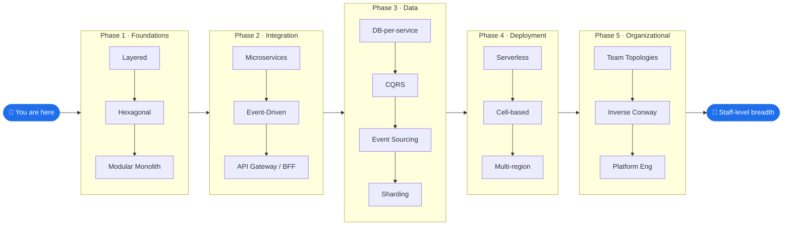
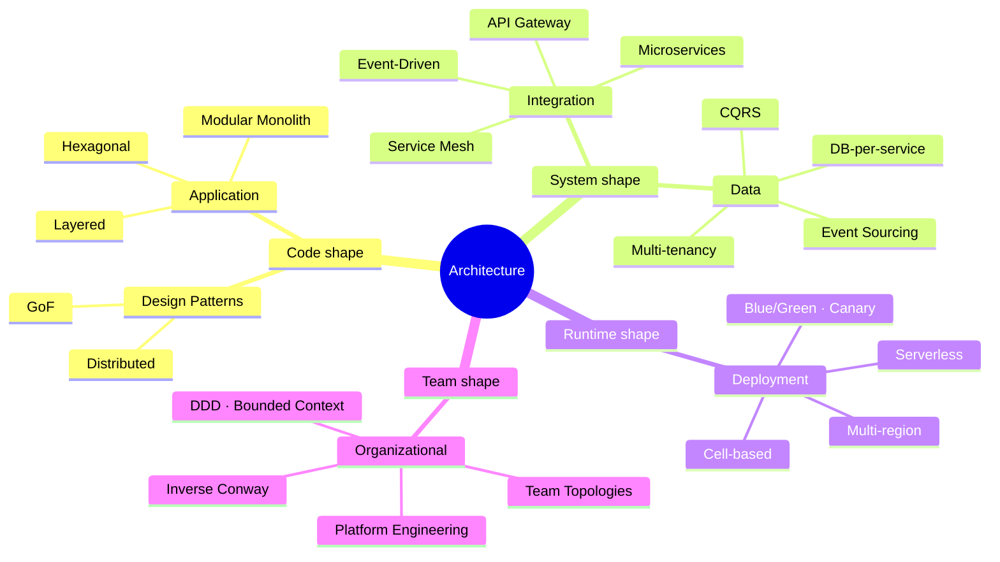
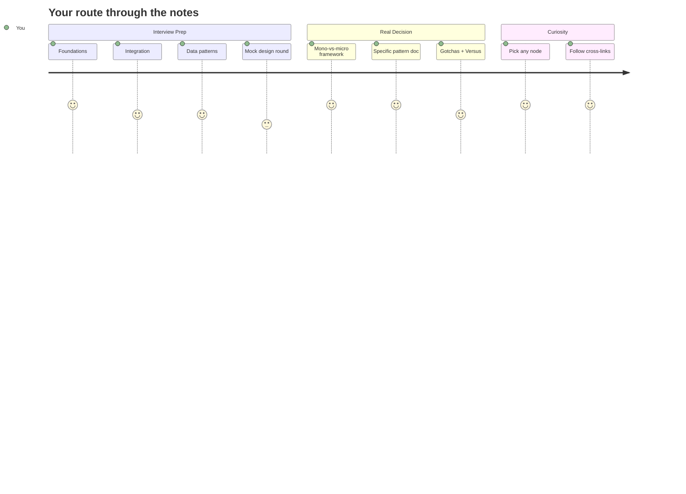

import { Card, CardGrid } from '@astrojs/starlight/components';

## Topics

<CardGrid stagger>
	<Card title="Design Patterns" icon="puzzle">
		<a href="/design-patterns/">GoF and distributed tactical patterns — patterns that shape *code*.</a>
	</Card>
	<Card title="Distributed Systems" icon="seti:terraform">
		<a href="/distributed-systems/">CAP, consensus, replication, and reliability across machines.</a>
	</Card>
	<Card title="Architecture Notes" icon="pencil">
		<a href="/notes/">System-level patterns — application, integration, data, deployment, org topology. Patterns that shape *systems*.</a>
	</Card>
</CardGrid>

## The Staff-Level Roadmap

A 5-phase journey from tactical code patterns to org-shaped architecture.

## The Decision Map

Where each pattern *family* lives in the system.

## Reading Paths

Pick the trail that matches your goal.

## How to Read

- **Going deep on one topic?** Jump straight to the file you need; cross-links sit at the bottom of each note.
- **Prepping for a Staff system-design interview?** Start in [Architecture Notes](/notes/) — Phase 1 (Foundations) → Phase 2 (Integration) → Phase 3 (Data).
- **Making a real architectural decision?** Head to the monolith-vs-microservices decision framework, then drill into the specific pattern.

## Style

Each pattern doc follows the same shape: Overview → Core Concepts → Use Cases → Gotchas → Where to Use / NOT Use → Versus → References → Interview Questions → Staff-Level Prep.
