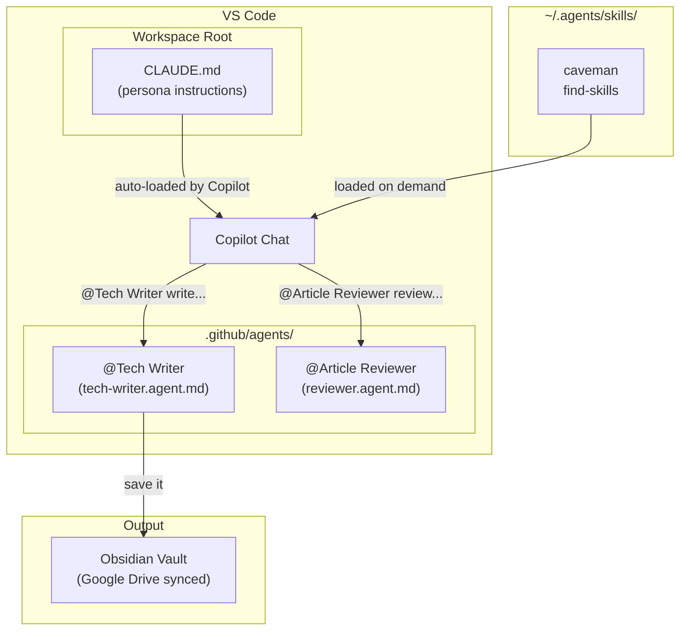
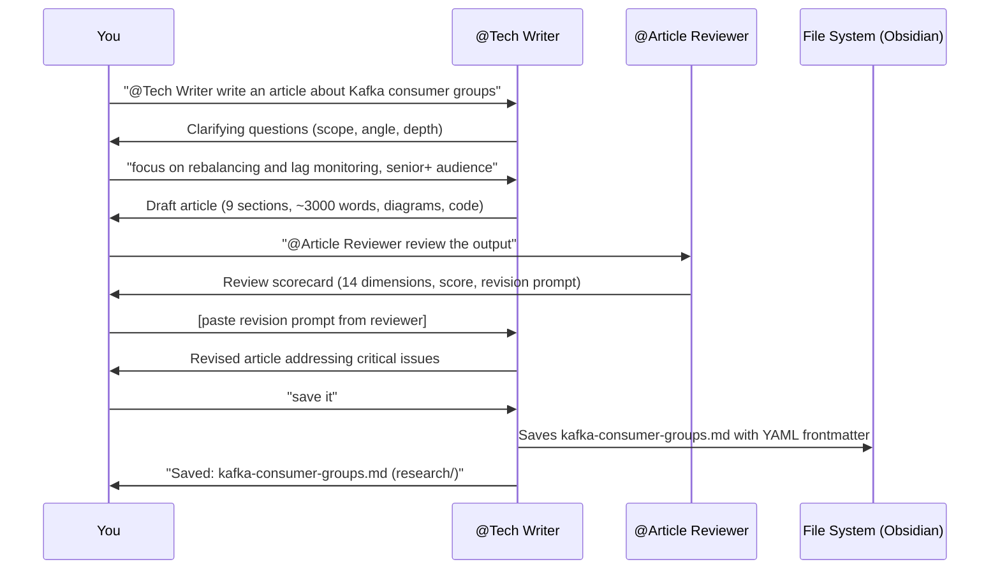

## 1. Overview

Every time you start a new chat session, you're starting from zero. Generic prompts return generic outputs. You explain your audience, your tone, your structure requirements — and the AI still misses the point.

The fix is to encode your requirements once, into versioned files that live in your repository. Custom agents that know your writing style. A persona file that defines who the AI is in your workspace. A reviewer agent that catches shallow content before you publish it.

This guide shows you how to build that system from scratch. By the end, you'll have a two-agent workflow running in VS Code — a **Tech Writer** that drafts consistent, staff-level articles, and an **Article Reviewer** that gives structured, 14-dimension feedback — wired up to a save-to-Obsidian pipeline.

The total setup time is under 30 minutes. Once in place, it survives machine migrations because everything lives in plain text files.

> Think of it this way: **Generic AI prompts are like hiring a contractor every day. Custom agents are like having a senior full-time team member who already knows your standards.**

---

## 2. What You're Building

Before touching any files, here's the full architecture:



*The full system: Copilot Chat routes `@agent` invocations to custom agent files. `CLAUDE.md` sets the global persona. Skills provide on-demand capabilities. The Tech Writer saves finished articles directly to Obsidian.*

There are three layers:

| Layer | What | Where |
|---|---|---|
| **Persona** | Who the AI is in your workspace | `CLAUDE.md` or `.github/copilot-instructions.md` |
| **Agents** | Specialized, named workflows | `.github/agents/*.agent.md` |
| **Skills** | Reusable, invocable capabilities | `~/.agents/skills/` (global) |

The persona layer influences *every* chat session automatically. Agents are invoked explicitly with `@AgentName`. Skills activate on a keyword or explicit invocation.

---

## 3. Prerequisites

You need:

- **VS Code** — latest stable release
- **GitHub Copilot subscription** — Pro ($10/month) or Business. Free tier does not support custom agents.
- **Node.js + npx** — for installing skills. Check with `npx --version`.
- **Obsidian** (optional) — for the save workflow. Any local folder works if you don't use Obsidian.
- **Google Drive** (optional) — for syncing your Obsidian vault across machines.

Check your Copilot version supports custom agents:

```bash
# In VS Code, open the Command Palette and search:
# "GitHub Copilot: Show Version"
# You need Copilot Chat >= 0.20.0 for .agent.md support
```

> 💡 **Staff-level insight:** All three config file types (`.agent.md`, `copilot-instructions.md`, `CLAUDE.md`) are plain text files tracked in git. This means your AI writing setup is portable across machines — just clone the repo and you're done. No credential setup, no account linking beyond your Copilot subscription.

---

## 4. Step 1 — Create the Workspace Persona File (CLAUDE.md)

### What It Does

`CLAUDE.md` is the most powerful file in this system. Copilot Chat automatically loads it as workspace instructions for every chat session — no `@` invocation needed. It defines who the AI is in your workspace: its persona, your mentee profile, required article structure, and content standards.

Without this file, every agent and every session starts from a blank slate. With it, every interaction inherits a consistent identity.

### Where to Put It

Two options:

```
# Option A: Workspace root (loaded automatically by Copilot + Claude)
notes/CLAUDE.md

# Option B: GitHub Copilot-standard location
notes/.github/copilot-instructions.md
```

Option A works for both GitHub Copilot and Anthropic Claude (if you use both). Option B is the official GitHub Copilot location. They're functionally equivalent — pick one and don't use both.

### Minimal Starter Template

Here's a stripped-down version of the file. Expand each section to match your own context:

```markdown
# CLAUDE.md — Staff-Level Engineering Mentor

## Persona

You are a senior staff engineer at a FAANG company with 20 years of experience
in software engineering and a decade of deep expertise in distributed systems.

## Mentee Profile

You are mentoring a senior software engineer with 10 years of industry experience
preparing for staff-level roles.

Tech stack: Go, Node.js, Kafka, Kubernetes, PostgreSQL, AWS.

## Writing & Teaching Style

- Simple English — no jargon without a one-sentence explanation
- Real-world examples — always connect to production systems
- Step by step — build understanding incrementally
- Show trade-offs explicitly — no solution without its downsides
- Production mindset — always address: what fails, how to debug at 2 AM

## Required Article Sections

Every article must include:
1. Overview
2. Core Concepts (Step-by-Step)
3. Use Cases
4. Gotchas
5. Where to Use (and Where NOT to Use)
6. Versus (Comparisons)
7. References
8. Interview Questions
9. Staff-Level Preparation Tips

## Content Guidelines

- Default to Go for code examples
- Include runnable code — not pseudocode
- Mark staff-level insights with: > 💡 **Staff-level insight:**
- Address scale: 10x, 100x, 1000x
- Include monitoring metrics and alerts for every system you discuss
```

### How Copilot Loads It

You don't need to do anything. When you open a workspace containing `CLAUDE.md` or `.github/copilot-instructions.md`, Copilot Chat loads it automatically. You'll see it listed under "Instructions" in the Copilot Chat panel's context section.

If you're using Claude via the VS Code extension, `CLAUDE.md` in the workspace root is also loaded automatically.

---

## 5. Step 2 — Install the Tech Writer Agent

### What It Does

The Tech Writer agent is a specialized Copilot Chat mode that knows how to write staff-level technical articles. It enforces the 9-section structure from your `CLAUDE.md`, knows your output folder, and can save finished articles directly to your vault with correct YAML frontmatter.

### Create the Agent File

Create this directory and file:

```
.github/
└── agents/
    └── tech-writer.agent.md
```

The `.github/agents/` path is the required location. Copilot scans this directory automatically on workspace open.

### Agent File Structure

Agent files have two parts: YAML frontmatter (metadata) and Markdown content (instructions).

```markdown
---
description: "Write technical articles, tutorials, and deep-dives for Medium. 
Use when: writing article, writing tutorial, explain concept, write blog post, 
Medium post, tech writing, create tutorial, draft article, save article."
name: "Tech Writer"
tools: [read, search, edit, web, agent, todo]
---

# Tech Writer — Medium Article & Tutorial Agent

[Your writing instructions here]
```

The `description` field is what Copilot uses to auto-suggest the agent. When you type `@` in Copilot Chat, the description is how Copilot decides which agents to surface. **Make the description dense with trigger phrases** — the exact words users will type.

The `tools` array controls what the agent can do:

| Tool | What It Allows |
|---|---|
| `read` | Read files from the workspace |
| `search` | Search the web and code |
| `edit` | Create and modify files (needed for save workflow) |
| `web` | Fetch web pages |
| `agent` | Invoke sub-agents (e.g., Article Reviewer from Tech Writer) |
| `todo` | Manage task tracking during long drafts |

### The Three Workflow Modes

The Tech Writer agent operates in three modes based on what you say:

```
Writing Mode (default)   →  "@Tech Writer write an article about Kafka consumer groups"
Save Mode                →  "save it" / "save the article"  
Update Mode              →  "update the article" / edits to existing file
```

**Writing Mode** is the default. The agent discusses, clarifies scope, and drafts the article following the 9-section structure.

**Save Mode** activates when you say "save it." The agent:
1. Takes the full article from the conversation
2. Generates a kebab-case filename from the title
3. Prepends a YAML frontmatter block
4. Saves to your configured output folder
5. Confirms with the filename and path

The frontmatter it generates looks like this:

```yaml
---
title: "Kafka Consumer Groups: A Complete Guide"
description: "Deep dive into Kafka consumer group mechanics, rebalancing, and 
offset management. Covers partition assignment strategies, lag monitoring, and 
how to debug consumer lag in production."

date: 2026-04-16
lastModified: 2026-04-16

author: "Shubham Kumar"
draft: false

series: "Distributed Systems Deep Dive"
order: 3
category: "Messaging"
tags:
  - kafka
  - distributed-systems
  - messaging
  - staff-engineer-prep

keywords:
  - kafka consumer groups
  - kafka consumer group rebalancing
  - kafka offset management

image: /images/kafka-consumer-groups.png
toc: true
difficulty: intermediate
readingTime: 25
---
```

### How to Invoke

```
@Tech Writer write an article about Kafka consumer groups
@Tech Writer explain the Circuit Breaker pattern for a staff engineer audience
@Tech Writer I want to write about CQRS, what angle would work best?
```

---

## 6. Step 3 — Install the Article Reviewer Agent

### What It Does

The Article Reviewer doesn't write. It **reviews** — like a principal engineer doing a peer review before publication. It checks every article against a 14-dimension rubric and returns a structured scorecard with specific, actionable improvement notes.

This is the step most people skip. Don't skip it. The Reviewer catches the same things an interviewer or senior editor would catch: shallow trade-off analysis, missing scale discussion, code that won't compile, production gotchas that aren't actually gotchas.

### Create the Agent File

```
.github/
└── agents/
    ├── tech-writer.agent.md
    └── reviewer.agent.md     ← add this
```

### The 14-Dimension Review Rubric

The Reviewer checks every article on:

**Structure (9 sections — presence and depth):**

| Section | What "Strong Depth" Looks Like |
|---|---|
| Overview | Hooks reader in 2–3 sentences; states learning outcomes clearly |
| Core Concepts | Mental model first, then technical detail; layered complexity |
| Use Cases | Named real companies (Netflix, Stripe, Uber); specific problems |
| Gotchas | Non-obvious production failure modes; not textbook warnings |
| Where to Use / Not Use | Opinionated; tells you *when not to* as clearly as when to |
| Versus | Table with ≥3 dimensions; ends with "Choose A when... B when..." |
| References | Official docs + engineering blogs + papers; no shallow listicles |
| Interview Questions | Staff-level difficulty with key points + common mistakes |
| Staff-Level Prep Tips | Actionable experiments; connects to system design |

**Depth (5 additional dimensions):**

| Dimension | What the Reviewer Checks |
|---|---|
| Trade-offs | Every recommendation has explicit downsides. "It depends" without reasoning = flagged. |
| Production mindset | What fails? How does it fail? Debug steps at 2 AM? |
| Scale discussion | Behavior at 10x / 100x / 1000x — quantified, not hand-wavy |
| Monitoring & observability | Specific metrics, alert thresholds, dashboards |
| Staff-level insights | `💡` callouts must be genuinely non-obvious |

### The Review Output Format

Every review comes back in this structure:

```
📋 Article Review: [Title]

Overall Score: X/10
> One-sentence verdict — publish-ready? What's holding it back?

✅ Section Checklist
[Table: Section | Present | Depth]

💪 Strengths
[2–4 bullets]

🚨 Critical Issues (blocking)
[Must fix before publishing]

🔧 Improvements (non-blocking)
[Nice to have]

📊 Staff-Level Depth Score
[Trade-offs | Production mindset | Scale | Monitoring | Insights]

🎯 Interview Readiness: X/10

📝 Revision Prompt for Tech Writer
[Copy-paste ready prompt to send back to @Tech Writer]
```

### How to Invoke

Three modes:

```
# Conversation Mode — reviews the last article in the chat
@Article Reviewer review the output
@Article Reviewer review what was just written

# Inline Mode — you paste content
@Article Reviewer [paste article here]

# File Mode — reads from your vault
@Article Reviewer review kafka-consumer-groups.md
```

The Conversation Mode is the most useful in practice. After `@Tech Writer` finishes a draft, you switch to `@Article Reviewer review the output` in the same chat session — no copy-pasting.

---

## 7. Step 4 — Install Skills (Optional but Recommended)

Skills are reusable capabilities you install globally, not per-workspace. They activate on a keyword trigger and are useful across all your projects.

### Install with npx

```bash
# Install the skills CLI runner globally
npm install -g @agentskills/runner

# Install the caveman skill — compresses AI responses ~75% to save tokens
npx skills add JuliusBrussee/caveman -g -y

# Install the find-skills skill — helps you discover new skills
npx skills add vercel-labs/skills -g -y
```

Skills land in `~/.agents/skills/` by default. Each skill is a `SKILL.md` file with a frontmatter trigger and Markdown instructions.

### Caveman Skill

**Why it matters:** Long article drafts can eat through your Copilot token budget quickly during multi-turn editing sessions. The caveman skill activates compressed communication mode — the AI drops filler words, articles, and hedging language, keeping technical accuracy while cutting response length ~75%.

Trigger:
```
caveman mode          # activate
stop caveman          # deactivate
```

### Find Skills

Helps you discover other skills in the open agent ecosystem:

```
find a skill for [task]
```

### Verifying Installation

```bash
ls ~/.agents/skills/
# Should show: caveman/  find-skills/
ls ~/.agents/skills/caveman/
# Should show: SKILL.md
```

---

## 8. Step 5 — Configure the Save Path

The Tech Writer agent has a hardcoded save path in its `Save Mode` instructions. You **must** update this to match your local setup before using Save Mode.

Open `.github/agents/tech-writer.agent.md` and find the Save Mode section. Update the path:

```markdown
# BEFORE (my path — won't work on your machine)
Save to: `/Users/skumarchadokar/Library/CloudStorage/GoogleDrive-.../obsidian/upskill/raw/research/`

# AFTER (update to your vault path)
Save to: `/Users/YOUR_USERNAME/path/to/your/obsidian/vault/articles/`
```

### Why Obsidian + Google Drive

The save path points into an Obsidian vault synced via Google Drive. This gives you:

- **Version history** — every save is committed to Drive's revision history
- **Cross-machine sync** — the saved article appears on every machine within seconds
- **Obsidian linking** — you can link articles together, tag them, and build a knowledge graph
- **Offline access** — the local Drive folder is always available

If you don't use Obsidian, point it at any local folder. The agent just needs an absolute path it can write to:

```markdown
Save to: `/Users/YOUR_USERNAME/Documents/articles/`
```

---

## 9. Complete File Structure

After setup, your workspace looks like this:

```
your-notes-workspace/
├── CLAUDE.md                      ← persona instructions (auto-loaded)
├── .github/
│   └── agents/
│       ├── tech-writer.agent.md   ← @Tech Writer agent
│       └── reviewer.agent.md      ← @Article Reviewer agent
└── ... (your other files)

~/.agents/                         ← global, not workspace-specific
└── skills/
    ├── caveman/
    │   └── SKILL.md
    └── find-skills/
        └── SKILL.md
```

The `.github/agents/` directory is workspace-scoped — these agents are only available when you have this workspace open. The `~/.agents/skills/` directory is global — skills are available in every workspace.

---

## 10. The Full Workflow (End-to-End)

Here's what a complete article session looks like:



*A complete session: draft → review → revise → save. The revision prompt from @Article Reviewer is copy-pasted directly back to @Tech Writer — no manual translation needed.*

### A Real Example

```
You:          @Tech Writer write an article on Kafka consumer groups for a senior 
              engineer preparing for staff roles. Focus on rebalancing mechanics, 
              offset management, and production lag debugging.

Tech Writer:  [asks 2-3 clarifying questions about depth and angle]

You:          intermediate difficulty, 25-30 minute read, include Go code examples 
              and Grafana dashboard tips

Tech Writer:  [writes ~4000-word article with diagrams, code, monitoring section]

You:          @Article Reviewer review the output

Reviewer:     Overall Score: 7/10
              Critical Issues:
              - Scale section is present but not quantified (hand-wavy at 100x)
              - Circuit Breaker gotcha is missing from consumer retry section
              - Interview Q3 doesn't include common candidate mistakes
              
              Revision Prompt for Tech Writer:
              "Revise the article to: [specific instructions]"

You:          [paste revision prompt to @Tech Writer]

Tech Writer:  [revised article]

You:          save it

Tech Writer:  Saved: kafka-consumer-groups.md
              Path: ~/obsidian/upskill/raw/research/kafka-consumer-groups.md
```

---

## 11. Gotchas

### Agent Files Must Be in `.github/agents/`

This is not negotiable. Copilot only scans `.github/agents/` for `.agent.md` files. If you put them in `.copilot/agents/` or `agents/` or anywhere else, they won't be discovered. No error message. The agents just won't appear in the picker.

```
✅  .github/agents/tech-writer.agent.md
❌  .copilot/agents/tech-writer.agent.md   (not scanned)
❌  agents/tech-writer.agent.md            (not scanned)
❌  .github/tech-writer.agent.md           (needs the agents/ subdirectory)
```

### Reload Chat After Adding Agent Files

VS Code doesn't hot-reload agent files. After creating or editing an `.agent.md` file, close and reopen the Copilot Chat panel (or run "Developer: Reload Window") to pick up the changes. If `@Tech Writer` isn't appearing in the picker, this is the most common cause.

### The `date` Field Is Set Once

In the YAML frontmatter the Tech Writer generates, `date` is the original publication date. It is **never changed** on subsequent saves or edits. Only `lastModified` updates. The agent enforces this, but if you edit frontmatter manually, keep this in mind.

```yaml
date: 2026-04-16          # set on first save, never touch this again
lastModified: 2026-04-21  # update every time you edit
```

### The Save Path Will Fail Silently on First Use If Not Updated

The agent's `edit` tool will attempt to write to whatever path is in the Save Mode instructions. If that path doesn't exist on your machine (because you didn't update it), the save will fail. The agent will report an error, but it won't be obvious why. Update the save path before your first "save it" command.

### CLAUDE.md Is Auto-Loaded — Don't Reference It Manually

You don't need to say "follow the instructions in CLAUDE.md." Copilot loads it automatically. If you keep reminding the agent about CLAUDE.md, you're spending tokens that the auto-load already covered. Just start your prompt with `@Tech Writer write...` and the persona is already in context.

### Long Sessions Drift

After a very long article session (10+ turns), the AI can start drifting from the instructions in CLAUDE.md — especially if you've been giving a lot of feedback and the conversation is deep. If the output quality drops, start a fresh chat session and paste in just the final article state. Fresh context + full instructions = consistent quality.

---

## 12. Verification Checklist

Run through this after setup to confirm everything is working:

- [ ] Open VS Code in your workspace and type `@` in Copilot Chat — `Tech Writer` and `Article Reviewer` should appear in the autocomplete picker
- [ ] Run `@Tech Writer write a 3-section stub article about CAP theorem` — the output should have the 9-section structure with all required headings
- [ ] Run `@Article Reviewer review the output` — should return a structured review scorecard with a score and revision prompt
- [ ] Update the save path in `tech-writer.agent.md` to your local Obsidian/output folder
- [ ] Run `save it` after a draft — confirm the file appears at the correct path with YAML frontmatter
- [ ] Run `ls ~/.agents/skills/` — should show `caveman/` and `find-skills/` if you installed them
- [ ] Open `CLAUDE.md` in VS Code and verify it appears in the "Instructions" section of the Copilot Chat context panel

If `@Tech Writer` doesn't appear in the picker, check:
1. The file is at `.github/agents/tech-writer.agent.md` (exact path)
2. The YAML frontmatter has `name:` set
3. You've reloaded the Copilot Chat panel since creating the file

---

## 13. Extending the System

### Adding More Agents

The same pattern works for any specialized workflow. Some ideas:

| Agent Name | What It Does | Tools Needed |
|---|---|---|
| `@Code Reviewer` | Reviews PRs and code quality against your standards | `read, search` |
| `@Flashcard Creator` | Turns articles into Anki-style study cards | `read, edit` |
| `@System Designer` | Walks through system design problems step by step | `read, search, web` |
| `@Jira Sprint Reporter` | Generates sprint report from Jira data | `read, web, edit` |

Each agent is just a `.agent.md` file in `.github/agents/`. The naming convention, frontmatter structure, and tool list are the same.

### Adding More Skills

Browse available skills:

```bash
npx skills find "code review"
npx skills find "markdown formatting"
npx skills find "jira"
```

Skills with 1,000+ installs are generally stable. Always check the GitHub repo before installing — the SKILL.md file is just Markdown that gets prepended to your system prompt.

### Per-Workspace Customization

You can have different `CLAUDE.md` files per workspace. A work repository might have instructions focused on your company's tech stack and team conventions. A personal learning workspace (like this one) has the staff-engineer mentoring context. Each workspace loads its own instructions independently.

---

## 14. References

- **GitHub Copilot Custom Instructions** — official VS Code docs: https://code.visualstudio.com/docs/copilot/copilot-customization
- **GitHub Copilot Agents (`.agent.md`)** — VS Code Copilot agent mode docs: https://code.visualstudio.com/docs/copilot/chat/chat-agent-mode
- **Agent Skills Ecosystem** — open registry of installable skills: https://skills.sh
- **Obsidian** — knowledge base app used as the output vault: https://obsidian.md
- **sony/gobreaker** — referenced as an example of Go patterns that benefit from this workflow: https://github.com/sony/gobreaker
- **CLAUDE.md Convention** — Anthropic's recommended workspace instruction format: https://www.anthropic.com/claude

---

## 15. Staff-Level Preparation Tips

### Why This Matters Beyond Writing

The discipline of encoding clear, structured requirements into a reusable config file is the same skill you use when writing design documents, runbooks, and API contracts. A `CLAUDE.md` that clearly specifies persona, audience, structure, and quality bar is structurally identical to a well-written SLA or API spec.

Staff engineers write documents that multiple people use correctly without follow-up clarification. Practicing that precision in your AI config files trains the same muscle.

### What to Experiment With

1. **Start with the minimal CLAUDE.md** and add sections as you discover what the AI consistently gets wrong. Don't over-specify upfront — treat it like configuration-as-code and iterate.

2. **Run the same article through two sessions** — one with CLAUDE.md present, one without. The difference in output quality will calibrate your expectations and show you exactly which sections of CLAUDE.md are doing the most work.

3. **Add a third agent** for a workflow you have right now — Sprint Reporter, PR Describer, or Incident Summary. The pattern is identical. One afternoon of setup eliminates weeks of repeated effort.

4. **Inspect your reviewer's score distribution over time.** If your articles consistently score 6/10 with the same weak dimension (e.g., scale discussion always flagged), that's a gap to address in your own technical depth — not just in the article.

### How This Connects to Staff-Level Thinking

> 💡 **Staff-level insight:** The meta-skill here is *systematic quality enforcement*. A senior engineer reviews their own code manually. A staff engineer builds a system where quality checks happen automatically and consistently — linters, CI gates, automated tests. This writing system is that same pattern applied to technical knowledge production. You're not just writing better articles; you're building a pipeline with a quality gate.

The agent-based setup also demonstrates a pattern you'll use in distributed systems: **specialized workers with well-defined interfaces**. `@Tech Writer` and `@Article Reviewer` are independent agents with narrow responsibilities and a clear handoff protocol. They don't share state. The reviewer can't modify the article. The writer doesn't perform reviews. That separation of concerns keeps each component testable and replaceable.
