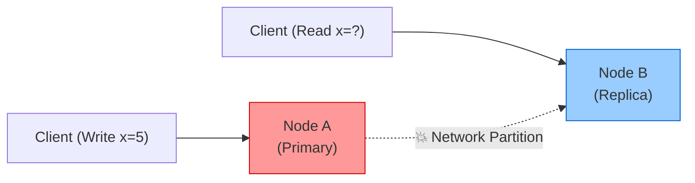
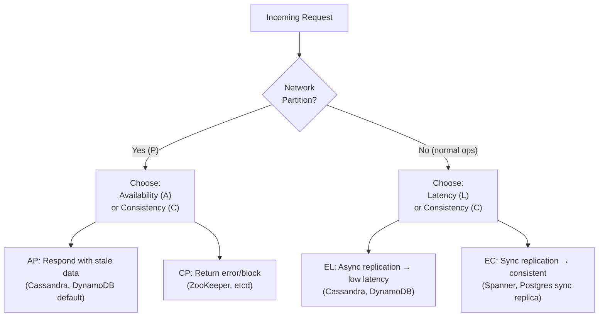
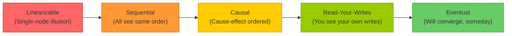
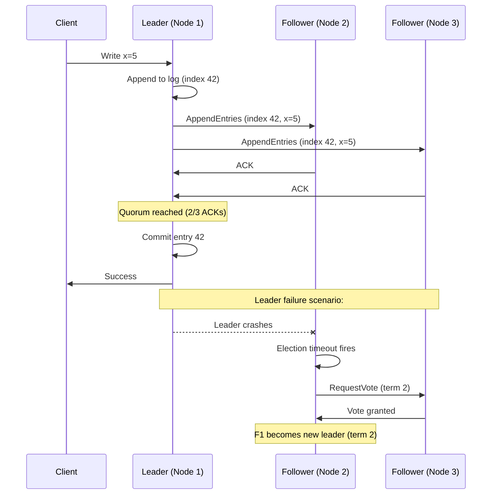
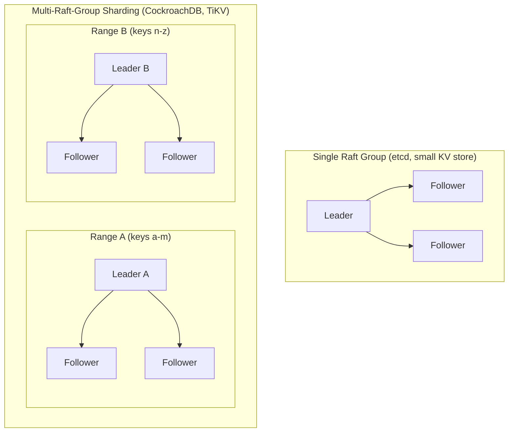
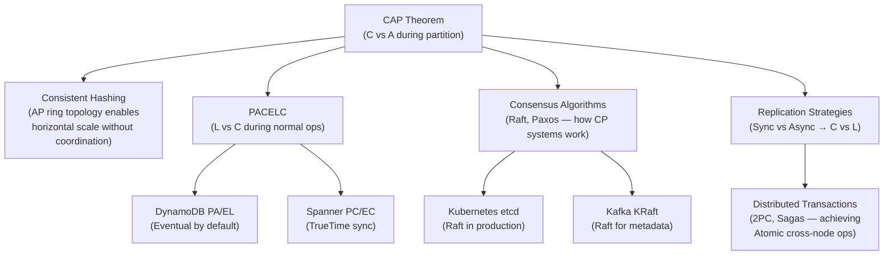

---

> "A distributed system is one in which the failure of a computer you didn't even know existed can render your own computer unusable."  
> — Leslie Lamport

---

## 1. Overview

CAP theorem is one of those concepts that every engineer vaguely knows but most misapply. You'll hear "oh, we chose AP" thrown around in design reviews — often without the speaker understanding what they just gave up or what "AP" actually means in their specific failure scenario.

In 2000, Eric Brewer — then a professor at UC Berkeley — stood at PODC (Symposium on Principles of Distributed Computing) and conjectured that a distributed system cannot simultaneously guarantee all three of:

- **C**onsistency
- **A**vailability
- **P**artition Tolerance

Two years later, Gilbert and Lynch formally proved it.

Since then, the theorem has been both one of the most useful frameworks and one of the most abused. Martin Kleppmann (author of *Designing Data-Intensive Applications*) wrote a blog post called "Please stop calling databases CP or AP" — because the labels paper over nuance that matters in production.

**What you'll learn in this guide:**

1. What CAP actually means (with precise definitions — not the sloppy ones)
2. Why "pick 2 of 3" is a misleading simplification
3. PACELC — the extension that makes CAP actually useful for day-to-day decisions
4. The consistency models spectrum: from linearizability to eventual
5. Raft consensus primer — how CP systems actually work internally
6. Tunable consistency — systems that let you choose
7. Real-world system mappings (Kafka, PostgreSQL, Redis, DynamoDB, Cassandra, Spanner)
8. Interview questions with what interviewers are really testing

Let's build this from the ground up.

---

## 2. Core Concepts (Step-by-Step)

### 2.1 CAP Definitions — With Precision

Before we can reason about trade-offs, we need exact definitions. Vague definitions lead to wrong decisions.

#### Consistency (C) — Linearizability

In CAP, **Consistency means linearizability**. This is NOT the same as the C in ACID.

Linearizability (also called strong consistency or atomic consistency) means:

> After a write completes, every subsequent read — from any node, by any client — returns that value or a newer one. The system appears to behave like a single node.

Think of it this way: if you write `x = 5` and then immediately read `x`, you should get `5`. No matter which node you read from, no matter where in the world the request lands.

**ACID-C vs CAP-C:**

| Term             | What it means                                                                    |
| ---------------- | -------------------------------------------------------------------------------- |
| ACID Consistency | Business rules/constraints stay valid (foreign keys, balances don't go negative) |
| CAP Consistency  | Every read returns the most recent write (linearizability)                       |

These are completely different properties. Conflating them is a source of enormous confusion. A system can have ACID-C without CAP-C (a single-node database after a network split) and vice versa.

#### Availability (A) — Every Non-Failing Node Responds

**Availability in CAP means:** every request sent to a non-failing node receives a response — not necessarily the most up-to-date response, but *some* response (not an error or timeout).

**This is NOT the same as "high availability" (99.999% uptime).**

CAP availability is a theoretical property: no node that's up can reject a request just because it can't reach another node.

#### Partition Tolerance (P) — Survive Network Splits

**Partition Tolerance means:** the system continues operating even when the network drops or delays messages between nodes.

A network partition is when two (or more) groups of nodes cannot communicate with each other, but each group still thinks it's running fine.

```
Network Partition Scenario:

 ┌─────────┐     💥 network split 💥     ┌─────────┐
 │  Node A │ ─────────────X───────────── │  Node B │
 │ writes  │                             │  reads  │
 └─────────┘                             └─────────┘
```

Here's the thing: **you cannot build a distributed system without partition tolerance.** Networks fail. Cables get cut. AWS availability zones lose connectivity. Cloud providers have inter-region incidents every year. If your system isn't partition tolerant, it's not a distributed system — it's a single node with a failover.

> 💡 **Staff-level insight:** The real choice in CAP is not "pick 2 of 3." Partition tolerance is not optional. The real choice is: **when a partition happens, do you sacrifice Consistency or Availability?** This is a much more honest framing — and it's what interviewers at staff level expect you to say.

Now let's see the diagram:



*Figure: Network partition separates Node A (handling writes) from Node B (handling reads). Node B must choose: return stale data (AP) or reject the request (CP).*

---

### 2.2 The Proof — Why You Can't Have All Three During a Partition

Let's walk through why CAP is true. No math needed — just logic.

**Setup:** Two nodes, A and B. A network partition splits them. Client writes to A, then reads from B.

```
Step 1: Normal operation
┌─────────┐  ←—sync—→  ┌─────────┐
│  Node A │             │  Node B │
│  x = 0  │             │  x = 0  │
└─────────┘             └─────────┘

Step 2: Partition happens
┌─────────┐   ✗ no network ✗   ┌─────────┐
│  Node A │                     │  Node B │
│  x = 0  │                     │  x = 0  │
└─────────┘                     └─────────┘

Step 3: Client writes x = 5 to Node A
┌─────────┐   ✗ no network ✗   ┌─────────┐
│  Node A │                     │  Node B │
│  x = 5  │                     │  x = 0  │  ← stale!
└─────────┘                     └─────────┘

Step 4: Client reads from Node B
```

Now Node B has a choice. What does it do?

**Option 1 — Prioritize Consistency (CP):**
Node B says: "I can't reach Node A to verify I have the latest data. I must return an error or block until the partition heals."
- Result: Client gets an error. Availability is sacrificed.

**Option 2 — Prioritize Availability (AP):**
Node B says: "I'll respond with what I have. The client gets a response."
- Result: Client reads `x = 0` (stale). Consistency is sacrificed.

**Option 3 — Have Both:**
Node B would need to return the latest value (`x = 5`) without being able to contact Node A. Impossible. Information cannot travel faster than the network — and the network is broken.

This is why CAP is a theorem, not a preference. During a partition, you **must** choose C or A. There is no third option.

---

### 2.3 CP vs AP Systems — Real-World Mapping

Now let's look at what CP and AP mean in practice.

**CP Systems** refuse to serve stale reads (or writes that might conflict) during a partition. They prioritize data correctness. Under a partition, requests may return errors or block.

**AP Systems** keep serving requests during a partition, accepting that some responses may be stale or that diverging writes will need reconciliation later.

| System                   | Classification | Why                                                                                   |
| ------------------------ | -------------- | ------------------------------------------------------------------------------------- |
| ZooKeeper                | CP             | Uses ZAB (ZooKeeper Atomic Broadcast), refuses reads when can't reach quorum          |
| etcd                     | CP             | Raft-based, leader must have quorum to serve reads                                    |
| HBase                    | CP             | Writes go through HMaster, consistency over availability                              |
| PostgreSQL (replication) | CP             | Synchronous replicas require acknowledgment before commit                             |
| Cassandra                | AP             | Leaderless, eventual consistency by default, accepts writes during partition          |
| DynamoDB                 | AP (default)   | Eventually consistent reads are the default; strongly consistent is optional          |
| Riak                     | AP             | Vector clocks + eventual consistency, designed for availability                       |
| CouchDB                  | AP             | Multi-master replication, conflict resolution via revision IDs                        |
| MongoDB (default config) | AP             | Replication is asynchronous by default; primary can serve reads while secondaries lag |
| Google Spanner           | CP             | TrueTime API + external consistency, globally consistent                              |

> 💡 **Staff-level insight:** These labels are imprecise. MongoDB with `w: majority` and `readConcern: linearizable` behaves like a CP system. Cassandra with `QUORUM` read and write (and N=3) also behaves like CP for that operation. The system's CAP classification depends on configuration, not just technology choice. This is what Kleppmann means when he says "stop calling databases CP or AP."

---

### 2.4 PACELC Theorem — The Extension That Makes CAP Useful Daily

CAP is great for reasoning about partition scenarios. But here's the problem: **network partitions are rare**. In a well-run production system on AWS, you might see a partition once a year. But you deal with consistency vs latency decisions on *every request*.

Daniel Abadi at Yale recognized this gap and introduced **PACELC** in 2012:

> **If Partition (P):** choose between Availability (A) and Consistency (C)  
> **ELse** (no partition, normal ops): choose between Latency (L) and Consistency (C)

PACELC = **P**artition → **A/C**, **EL**se → **L/C**

This is far more useful for day-to-day engineering decisions. Even when everything is healthy, writing to multiple replicas synchronously = higher consistency + higher latency. Writing asynchronously = lower latency + potential staleness.



*Figure: PACELC decision tree — partition scenarios use CAP logic; normal operations use the latency vs consistency trade-off.*

**Real systems mapped to PACELC:**

| System                        | Partition Behavior  | Normal-Ops Behavior                | PACELC Label |
| ----------------------------- | ------------------- | ---------------------------------- | ------------ |
| DynamoDB (default)            | Favors Availability | Favors Latency (async)             | PA / EL      |
| Cassandra (default)           | Favors Availability | Favors Latency (async)             | PA / EL      |
| Spanner                       | Favors Consistency  | Favors Consistency (TrueTime sync) | PC / EC      |
| PostgreSQL (sync replication) | Favors Consistency  | Favors Consistency                 | PC / EC      |
| MongoDB (default)             | Favors Availability | Favors Latency (async replication) | PA / EL      |
| Redis Cluster                 | Favors Availability | Favors Latency                     | PA / EL      |
| Kafka (metadata, KRaft)       | Favors Consistency  | Favors Consistency (Raft)          | PC / EC      |

> 💡 **Staff-level insight:** In interviews, most candidates only talk about CAP. Mentioning PACELC — and explaining that normal-ops latency vs consistency is actually the more frequent design decision — immediately signals staff-level thinking. "Our system is PA/EL, which means during normal ops we accept async replication lag up to ~100ms, and we handle this by..." is a much stronger answer than "we picked AP."

---

### 2.5 Consistency Models Spectrum

CAP treats consistency as binary — you either have linearizability or you don't. Reality is a spectrum. You can choose different points on the spectrum based on your domain's tolerance for staleness.

From strongest to weakest:

```
Strongest ←————————————————————————————————————→ Weakest

Linearizable → Sequential → Causal → Read-Your-Writes → Eventual
```



*Figure: Consistency models spectrum. Stronger = more guarantees, higher latency. Weaker = faster, more staleness risk.*

**Definitions:**

| Model                      | What it guarantees                                                                                                                                  | Latency cost | Examples                                                                                      |
| -------------------------- | --------------------------------------------------------------------------------------------------------------------------------------------------- | ------------ | --------------------------------------------------------------------------------------------- |
| **Linearizable**           | Every read returns most recent write. System looks like one node. Time-ordered.                                                                     | Highest      | Google Spanner, etcd, single-node Postgres                                                    |
| **Sequential Consistency** | All nodes see operations in the same order, but not necessarily real-time ordered                                                                   | High         | ZooKeeper (writes go through leader, reads may be slightly stale)                             |
| **Causal Consistency**     | Operations that are causally related (A happened before B) are seen in that order. Unrelated ops may be seen in different orders by different nodes | Medium       | MongoDB (causal sessions), some versions of Cosmos DB                                         |
| **Read-Your-Writes**       | You always see the effects of your own previous writes. Other clients may still see stale data                                                      | Medium-low   | DynamoDB (when reading from same session with consistent reads), many session-affinity setups |
| **Eventual Consistency**   | Given no new writes, all replicas will converge to the same value. No timing guarantee                                                              | Lowest       | Cassandra (default), DNS, CDN caches                                                          |

**Your stack, mapped:**

- **PostgreSQL (single node or sync replication)** → Linearizable
- **DynamoDB (default)** → Eventually consistent. With `ConsistentRead: true` → strongly consistent (but not linearizable across keys)
- **Redis Cluster** → Eventually consistent (async replication between nodes)
- **Kafka (committed messages)** → Strong consistency for a partition's leader log. Consumers get messages in order after commit.

---

### 2.6 Consensus Basics — Raft Primer

CP systems don't just magically stay consistent. They do it through **consensus** — a protocol that ensures multiple nodes agree on a single value before committing it.

**Mental model:** Imagine a committee where a decision is only final when the majority votes yes. The chair (leader) proposes, the members vote, and only after a quorum agrees does the decision become binding.

That's essentially Raft.

**Raft basics:**

1. **Leader Election:** One node is designated the leader. All writes go through the leader.
2. **Log Replication:** Leader appends entry to its log, sends it to followers. When a majority acknowledges, the leader marks it committed and applies it to state machine.
3. **Quorum:** With N nodes, you need `floor(N/2) + 1` nodes to agree. For 3 nodes: need 2. For 5 nodes: need 3.



*Figure: Raft leader election and log replication. Client writes go to leader. Leader replicates to followers. Commit after quorum. On leader failure, followers elect a new leader.*

**Where you'll encounter Raft in the wild:**
- **etcd** — the key-value store that powers Kubernetes control plane. Every Pod spec, Service, ConfigMap you create goes through Raft consensus in etcd.
- **CockroachDB** — each Raft group manages a range of keys
- **TiKV** — distributed KV store powering TiDB
- **Kafka (KRaft mode)** — Kafka 3.x removed ZooKeeper dependency, now uses Raft internally for metadata management

> 💡 **Staff-level insight:** Kubernetes requires an odd number of etcd nodes (1, 3, 5) for exactly this reason — Raft needs a majority. Running 2 etcd nodes is actually worse than running 1 because you'd need both to be healthy (no fault tolerance). This is why etcd clusters are always 3 or 5 nodes in production. When your K8s control plane goes down, it's often because etcd lost quorum — majority of etcd nodes are unhealthy.

---

### 2.7 Tunable Consistency — Choosing Where to Land on the Spectrum

Some systems let you choose your consistency level per operation. This is powerful because different operations in the same application have different consistency requirements.

**Cassandra's Quorum Formula:**

```
R + W > N  →  Strong (quorum) reads/writes
```

- `N` = replication factor (how many copies of data)
- `W` = how many replicas must acknowledge a write before success
- `R` = how many replicas must respond to a read before returning data

Example with N=3:
- `W=1, R=1` → Fast but eventual. Only 1 replica needs to respond.
- `W=2, R=2` → Quorum. Intersection guarantees you read at least one node that has the latest write.
- `W=3, R=1` → Slow writes, fast reads. All replicas must acknowledge write.

**DynamoDB in Go — Tunable Consistency:**

```go
package main

import (
	"context"
	"fmt"
	"log"

	"github.com/aws/aws-sdk-go-v2/aws"
	"github.com/aws/aws-sdk-go-v2/config"
	"github.com/aws/aws-sdk-go-v2/service/dynamodb"
	"github.com/aws/aws-sdk-go-v2/service/dynamodb/types"
)

func main() {
	cfg, err := config.LoadDefaultConfig(context.TODO())
	if err != nil {
		log.Fatal(err)
	}
	client := dynamodb.NewFromConfig(cfg)

	key := map[string]types.AttributeValue{
		"userId": &types.AttributeValueMemberS{Value: "user-123"},
	}

	// Eventually consistent read (default)
	// - Lower latency (~1-2ms faster)
	// - May return stale data (up to replication lag, typically <1s)
	// - Cost: 0.5 RCU per 4KB
	// - Use for: social feeds, leaderboards, catalog browsing
	eventualResp, err := client.GetItem(context.TODO(), &dynamodb.GetItemInput{
		TableName:      aws.String("UserProfiles"),
		Key:            key,
		ConsistentRead: aws.Bool(false), // default — can omit this
	})
	if err != nil {
		log.Fatal(err)
	}
	fmt.Printf("Eventual read: %v\n", eventualResp.Item)

	// Strongly consistent read
	// - Guaranteed to return the latest committed write
	// - ~2x latency (must reach the leader/majority)
	// - Cost: 1 RCU per 4KB (2x the cost)
	// - Use for: account balances, inventory counts, idempotency checks
	strongResp, err := client.GetItem(context.TODO(), &dynamodb.GetItemInput{
		TableName:      aws.String("UserProfiles"),
		Key:            key,
		ConsistentRead: aws.Bool(true), // pay the latency+cost price for freshness
	})
	if err != nil {
		log.Fatal(err)
	}
	fmt.Printf("Strong read: %v\n", strongResp.Item)
}
```

> The decision isn't "strong vs eventual" globally. It's "which operations require freshness, and can we pay the latency + cost tax for those specific reads?"

**Design pattern:** Use eventual consistency for read-heavy operations where staleness is acceptable (product catalog, user feed). Use strong consistency for operations where correctness is critical (payment confirmation check, inventory deduction check).

---

### 2.8 Scale Analysis — How CAP Trade-offs Change at 10x / 100x / 1000x

CAP and PACELC are theoretical frameworks, but they feel very different at different scales. A 3-node cluster in a single data center behaves nothing like a 50-node cluster spanning 5 regions. Understanding *how* consistency costs grow is a staff-level skill.

#### Quorum Latency Grows with Cluster Size and Geography

Quorum-based systems (Raft, Paxos, Cassandra QUORUM) wait for a majority of nodes to respond. The critical insight: **quorum latency = latency of the slowest node in the majority**.

```
3-node cluster (same region):
  Node A: 1ms
  Node B: 2ms
  Node C: 1ms
  Quorum (2 of 3): 1ms (fastest majority: A + C)

5-node cluster (same region):
  Nodes: 1ms, 2ms, 1ms, 3ms, 2ms
  Quorum (3 of 5): 2ms (fastest majority: 1ms + 1ms + 2ms)

5-node cluster (3 regions: US-East, US-West, EU):
  US-East-1: 1ms
  US-East-2: 2ms
  US-West-1: 60ms (cross-country RTT)
  EU-1: 80ms (transatlantic RTT)
  EU-2: 85ms
  Quorum (3 of 5): 60ms (fastest majority: US-East-1 + US-East-2 + US-West-1)
```

The jump from 2ms to 60ms is a **30x latency increase** — just from geographic spread. At P99, it's worse because network jitter adds variance on long paths.

> 💡 **Staff-level insight:** This is why Google Spanner's TrueTime is remarkable. Spanner achieves global strong consistency with ~7-10ms commit latency because of atomic clocks and GPS receivers in every data center — eliminating the need for multi-round-trip consensus. Without TrueTime, you'd need Paxos/Raft round trips across oceans, pushing commits to 100ms+. Spanner is essentially "buying" consistency with hardware.

#### Cassandra Quorum Cost at Scale

Cassandra's `R + W > N` formula gets expensive as you scale replication:

| Setup  | N   | W (QUORUM) | R (QUORUM) | Write latency (same region) | Write latency (3 regions) | Fault tolerance |
| ------ | --- | ---------- | ---------- | --------------------------- | ------------------------- | --------------- |
| Small  | 3   | 2          | 2          | ~2-5ms                      | ~60-80ms                  | 1 node          |
| Medium | 5   | 3          | 3          | ~3-8ms                      | ~80-120ms                 | 2 nodes         |
| Large  | 7   | 4          | 4          | ~5-15ms                     | ~120-200ms                | 3 nodes         |

Each increase in N buys more fault tolerance but costs latency. At N=7 across 3 regions, quorum writes wait for the 4th-fastest replica — which is almost certainly in a different region.

**The 10x / 100x / 1000x progression:**

- **10x traffic:** Cassandra scales horizontally — add nodes. Quorum latency stays the same because N (replication factor) doesn't change. More vnodes, same replication topology. This is Cassandra's sweet spot.
- **100x traffic:** You might increase N for durability (N=5 or N=7), which increases quorum latency. You'll start feeling cross-region costs. Consider `LOCAL_QUORUM` (quorum within a single data center) to keep latency low — but you sacrifice cross-region consistency.
- **1000x traffic:** At this scale, even LOCAL_QUORUM coordination creates hot partitions. You need careful partition key design, possibly separate Cassandra clusters per region with async reconciliation, effectively becoming a multi-cluster AP architecture.

#### Single-Leader CP Bottleneck → Multi-Raft-Group Sharding

Single-leader systems (etcd, single Raft group) have a fundamental bottleneck: **all writes go through one leader**.

```
10x:   Single Raft leader handles 10K writes/sec → fine
100x:  100K writes/sec → leader CPU saturated, followers lag
1000x: Impossible on one leader
```

The solution: **shard the data across multiple Raft groups**, each with its own leader. This is how CockroachDB and TiKV scale:



*Figure: Single Raft group vs multi-Raft-group sharding. Each range has its own leader, enabling horizontal write scaling while maintaining CP guarantees per range.*

- **CockroachDB** splits data into ~64MB ranges, each managed by its own Raft group. Ranges split automatically as data grows. Cross-range transactions use 2PC on top of Raft.
- **TiKV** (backing TiDB) uses a similar model with Placement Driver (PD) coordinating range splits and leader balancing.
- **etcd** does NOT shard. This is why etcd has a recommended limit of ~8GB. Kubernetes works within this because metadata volume is bounded. If your use case needs a larger CP KV store, use CockroachDB or TiKV.

> 💡 **Staff-level insight:** Multi-Raft sharding solves write throughput but introduces a new problem: **cross-shard transactions**. A payment transferring money between two accounts in different Raft groups needs atomic commitment across groups — typically 2PC (two-phase commit) layered on top of Raft. This adds one more network round-trip. At global scale, a cross-shard transaction in CockroachDB spanning US and EU might take 200-300ms. This is why partition key design matters even in CP systems — co-locate related data in the same range.

#### Speed-of-Light Constraints on Global Strong Consistency

Physics imposes hard limits on distributed consensus:

| Route                  | Distance   | Speed-of-light RTT | Realistic RTT (fiber) |
| ---------------------- | ---------- | ------------------ | --------------------- |
| US-East ↔ US-West      | ~4,000 km  | ~27ms              | ~60-70ms              |
| US-East ↔ EU-West      | ~5,500 km  | ~37ms              | ~80-90ms              |
| US-East ↔ Asia-Pacific | ~15,000 km | ~100ms             | ~180-220ms            |

For a Raft commit, you need **at least 1 RTT** (leader sends AppendEntries, waits for majority ACK). In practice, add serialization, disk fsync, and processing time — real-world Raft commits are 1.5-2x the raw RTT.

**What this means for global systems:**
- US-only (2 regions): Raft commit ~60-80ms. Acceptable for most apps.
- US + EU (3 regions): Raft commit ~80-120ms. Starting to hurt user-facing latency.
- Global (5 regions): Raft commit ~200ms+. Only viable for systems where correctness >> latency (financial systems, global config).

This is why most "globally distributed" systems are actually **PA/EL** — they use async replication across regions and accept eventual consistency. True global CP (like Spanner) requires specialized hardware or accepting 100ms+ latencies.

---

### 2.9 Code Examples — Building Intuition with Go

Theory sticks better when you can run it. Here are three examples that make CAP trade-offs tangible.

#### Example 1: Split-Brain Simulator — CP vs AP in 50 Lines

Two goroutines simulate two nodes writing to a shared counter. With a mutex (CP behavior), writes are serialized — no divergence. Without it (AP behavior), both nodes diverge.

```go
package main

import (
	"fmt"
	"sync"
	"time"
)

// Simulates two "nodes" incrementing a counter.
// CP mode: mutex ensures serialized access (like Raft leader writes).
// AP mode: no coordination — both nodes diverge.
func main() {
	fmt.Println("=== CP Mode (with mutex) ===")
	runSimulation(true)

	fmt.Println("\n=== AP Mode (no coordination) ===")
	runSimulation(false)
}

func runSimulation(cpMode bool) {
	var mu sync.Mutex
	counter := 0
	nodeAView := 0
	nodeBView := 0

	var wg sync.WaitGroup
	wg.Add(2)

	// Node A: increments 1000 times
	go func() {
		defer wg.Done()
		for i := 0; i < 1000; i++ {
			if cpMode {
				mu.Lock()
				counter++
				nodeAView = counter // A sees the true value after acquiring lock
				mu.Unlock()
			} else {
				// AP mode: each node maintains its own view
				// No coordination — like two Cassandra nodes during a partition
				nodeAView++
			}
		}
	}()

	// Node B: increments 1000 times
	go func() {
		defer wg.Done()
		for i := 0; i < 1000; i++ {
			if cpMode {
				mu.Lock()
				counter++
				nodeBView = counter
				mu.Unlock()
			} else {
				nodeBView++
			}
		}
	}()

	wg.Wait()

	if cpMode {
		// CP: single source of truth
		fmt.Printf("  Shared counter: %d (expected: 2000)\n", counter)
		fmt.Printf("  Node A last saw: %d\n", nodeAView)
		fmt.Printf("  Node B last saw: %d\n", nodeBView)
	} else {
		// AP: diverged state — needs reconciliation
		fmt.Printf("  Node A counter: %d\n", nodeAView)
		fmt.Printf("  Node B counter: %d\n", nodeBView)
		fmt.Printf("  Naive merge (sum): %d (expected: 2000)\n", nodeAView+nodeBView)
		fmt.Printf("  LWW merge (pick one): %d (WRONG — lost 1000 writes!)\n", nodeAView)
		fmt.Printf("  ↑ This is why LWW is dangerous for counters. Use a G-Counter CRDT instead.\n")
	}
}
```

Run it: `go run split_brain.go`. CP mode always shows 2000. AP mode shows two diverged counters — and demonstrates why LWW loses data on counters.

#### Example 2: etcd Leader Election — CP Consensus in Your K8s Stack

This is what happens underneath your Kubernetes control plane. An etcd leader election using the official Go client:

```go
package main

import (
	"context"
	"fmt"
	"log"
	"os"
	"os/signal"
	"time"

	clientv3 "go.etcd.io/etcd/client/v3"
	"go.etcd.io/etcd/client/v3/concurrency"
)

// Demonstrates etcd leader election — the same mechanism
// Kubernetes uses for controller-manager and scheduler HA.
func main() {
	nodeID := "node-1"
	if len(os.Args) > 1 {
		nodeID = os.Args[1]
	}

	// Connect to etcd cluster (same endpoints your kubelet uses)
	client, err := clientv3.New(clientv3.Config{
		Endpoints:   []string{"localhost:2379"},
		DialTimeout: 5 * time.Second,
	})
	if err != nil {
		log.Fatalf("Failed to connect to etcd: %v", err)
	}
	defer client.Close()

	// Create a session with a 10-second TTL.
	// If this node crashes, the lease expires and a new leader is elected.
	// TTL = trade-off: shorter = faster failover, but more false elections
	// during network blips. K8s default: 15 seconds.
	session, err := concurrency.NewSession(client, concurrency.WithTTL(10))
	if err != nil {
		log.Fatalf("Failed to create session: %v", err)
	}
	defer session.Close()

	// Create election on a specific prefix (like K8s /registry/leases/)
	election := concurrency.NewElection(session, "/my-service/leader")

	ctx, cancel := context.WithCancel(context.Background())
	defer cancel()

	// Handle graceful shutdown
	sigCh := make(chan os.Signal, 1)
	signal.Notify(sigCh, os.Interrupt)
	go func() {
		<-sigCh
		fmt.Printf("[%s] Resigning leadership...\n", nodeID)
		election.Resign(context.TODO())
		cancel()
	}()

	// Campaign for leadership — blocks until this node wins
	// Internally uses Raft consensus: majority of etcd nodes must agree
	fmt.Printf("[%s] Campaigning for leader...\n", nodeID)
	if err := election.Campaign(ctx, nodeID); err != nil {
		log.Fatalf("Campaign failed: %v", err)
	}

	fmt.Printf("[%s] 🎉 I am the leader!\n", nodeID)

	// Do leader work (only one node runs this at a time)
	// This is exactly how kube-controller-manager ensures
	// only one instance reconciles resources.
	ticker := time.NewTicker(2 * time.Second)
	defer ticker.Stop()
	for {
		select {
		case <-ticker.C:
			fmt.Printf("[%s] Doing leader work (reconciling resources)...\n", nodeID)
		case <-ctx.Done():
			fmt.Printf("[%s] Shutting down.\n", nodeID)
			return
		case <-session.Done():
			// Session expired — lost leadership (network issue, disk slow)
			fmt.Printf("[%s] ⚠️  Lost leadership! Session expired.\n", nodeID)
			return
		}
	}
}
```

Run two instances: `go run election.go node-1` and `go run election.go node-2`. Kill the leader — watch node-2 take over. This is CP in action: only one leader at a time, guaranteed by Raft consensus.

#### Example 3: G-Counter CRDT — Conflict-Free Counting Without Coordination

A G-Counter (Grow-only Counter) is the simplest useful CRDT. Each node maintains its own counter. The global value = sum of all node counters. Merges are always conflict-free.

```go
package main

import "fmt"

// GCounter is a grow-only counter CRDT.
// Each node increments only its own slot.
// Merge = element-wise max. Value = sum of all slots.
// Used by: Riak, Redis CRDTs, Cassandra counter columns (conceptually).
type GCounter struct {
	counts map[string]uint64 // nodeID -> count
}

func NewGCounter() *GCounter {
	return &GCounter{counts: make(map[string]uint64)}
}

// Increment — only the local node's slot. No coordination needed.
func (g *GCounter) Increment(nodeID string) {
	g.counts[nodeID]++
}

// Value — sum of all node counters.
func (g *GCounter) Value() uint64 {
	var total uint64
	for _, v := range g.counts {
		total += v
	}
	return total
}

// Merge — element-wise max. This is the magic:
// - Commutative: merge(A,B) == merge(B,A)
// - Associative: merge(merge(A,B),C) == merge(A,merge(B,C))
// - Idempotent: merge(A,A) == A
// These three properties guarantee conflict-free convergence.
func (g *GCounter) Merge(other *GCounter) {
	for nodeID, count := range other.counts {
		if count > g.counts[nodeID] {
			g.counts[nodeID] = count
		}
	}
}

func main() {
	// Simulate two nodes during a network partition
	nodeA := NewGCounter()
	nodeB := NewGCounter()

	// Node A gets 3 "like" events
	nodeA.Increment("node-a")
	nodeA.Increment("node-a")
	nodeA.Increment("node-a")

	// Node B gets 2 "like" events (during partition — no communication)
	nodeB.Increment("node-b")
	nodeB.Increment("node-b")

	fmt.Printf("Before merge:\n")
	fmt.Printf("  Node A sees: %d likes\n", nodeA.Value()) // 3
	fmt.Printf("  Node B sees: %d likes\n", nodeB.Value()) // 2

	// Partition heals — nodes exchange state and merge
	nodeA.Merge(nodeB)
	nodeB.Merge(nodeA)

	fmt.Printf("\nAfter merge (partition healed):\n")
	fmt.Printf("  Node A sees: %d likes\n", nodeA.Value()) // 5
	fmt.Printf("  Node B sees: %d likes\n", nodeB.Value()) // 5
	fmt.Printf("  ✅ Both nodes converged — zero data loss, zero coordination\n")

	// Compare with LWW: one node's writes would be silently dropped.
	// LWW result: 3 or 2 (not 5). Lost writes.
	fmt.Printf("\n  LWW would show: 3 (Node A wins by timestamp) — lost 2 likes!\n")
}
```

Run it: `go run gcounter.go`. Both nodes converge to 5 — no writes lost, no coordination needed. This is why CRDTs are the right tool for distributed counters, not LWW.

---

## 3. Use Cases

Let's map real scenarios to their CAP/PACELC choices and understand *why* — not just what.

### 3.1 Payment Processing → CP (PA/EC or PC/EC)

**System:** Stripe, PayPal internal ledgers, Google Spanner  
**Choice:** CP — refuse to process if can't confirm state

**Why:** A double-charge or a payment that succeeds on one node but fails on another is catastrophic. The business cost of inconsistency vastly exceeds the cost of a temporary 503 during a partition. Customers accept "payment processing unavailable" during an outage. They do NOT accept "we charged you twice."

**Implementation:** Stripe uses a distributed SQL database with strong consistency. Google Pay runs on Spanner, which provides external consistency globally.

### 3.2 Social Media Feed → AP (PA/EL)

**System:** Twitter/X timeline, Facebook News Feed, Netflix homepage  
**Choice:** AP — show slightly stale feed rather than error

**Why:** If you don't see a tweet for 500ms after someone posts it, you don't notice. If you get a 503 trying to load your feed, you leave the app. The business prefers stale data over an outage. Facebook runs Cassandra for social graph data specifically for this reason.

### 3.3 DNS → AP (PA/EL)

**System:** DNS infrastructure globally  
**Choice:** AP — DNS resolvers serve cached (potentially stale) records

**Why:** DNS propagation can take up to 48 hours. This is intentional. The entire internet would break if DNS required strong consistency — every lookup would need to hit a central authoritative server. Eventual consistency with TTL-based expiry is the right trade-off for global read-heavy lookup infrastructure.

### 3.4 Distributed Config / Coordination → CP

**System:** etcd (Kubernetes), ZooKeeper (Kafka before KRaft), Consul  
**Choice:** CP — all nodes must see the same config

**Why:** If your Kubernetes controller-manager and scheduler see different versions of who owns a Pod, you get duplicate scheduling. If different nodes in a cluster think different machines are the leader, you get split-brain. Config and coordination systems are the *foundation* for other systems' consistency — they must be CP.

**Real consequence:** When etcd loses quorum in a Kubernetes cluster, the cluster doesn't crash immediately — existing Pods keep running. But the control plane can't make new scheduling decisions, can't update services, can't process new deployments. It's frozen until etcd quorum is restored.

### 3.5 Shopping Cart → AP (PA/EL)

**System:** Amazon.com cart (the origin story of DynamoDB)  
**Choice:** AP — accept cart modifications even during partition

**Why:** Amazon's 2007 Dynamo paper describes exactly this problem. The cart must always be writable. If a user adds an item and the request fails, they leave. The trade-off: when partitions heal, two divergent carts must be reconciled (merged). Amazon chose to show a "merged" cart rather than refuse writes during partition.

This design decision — prioritizing availability and reconciling conflicts later — directly led to the Dynamo architecture that became DynamoDB.

### 3.6 Your Stack — CAP/PACELC Mapping

| Technology                     | CAP During Partition                                    | PACELC Normal Ops                        | Notes                                                   |
| ------------------------------ | ------------------------------------------------------- | ---------------------------------------- | ------------------------------------------------------- |
| PostgreSQL (single node)       | N/A — not distributed                                   | N/A                                      | Linearizable by default                                 |
| PostgreSQL (sync replication)  | CP — primary refuses writes if sync replica unreachable | EC — sync commit = consistent but slower | Safest for financial data                               |
| PostgreSQL (async replication) | AP (primary accepts writes, replica lags)               | EL — async = faster                      | Common setup; replica can be stale                      |
| Kafka (KRaft metadata)         | CP — metadata changes require Raft quorum               | EC                                       | Topic creation, partition changes require quorum        |
| Kafka (message delivery)       | AP-leaning — producers can keep writing to leader       | EL — replication is async by default     | `acks=all` makes it more CP for producers               |
| Redis Cluster (default)        | AP — accepts writes, may lose data on failover          | EL                                       | Async replication means ~seconds of potential data loss |
| DynamoDB (default)             | AP — accepts writes globally                            | EL — eventual consistency default        | Strong consistent reads available at 2x cost            |

> 💡 **Staff-level insight:** Kafka is a great example of a system that is CP in one dimension and AP in another. The metadata plane (topic configurations, partition leaders, consumer group coordination) uses Raft (KRaft) and is strongly consistent. The data plane (message delivery) uses async ISR replication and is AP-leaning. When designing systems with Kafka, you need to understand both layers. See also: [kafka-complete-guide.md](./kafka-complete-guide.md) for deep coverage of Kafka's replication model.

---

## 4. Gotchas

These are the things that bite you in production — and in interviews, if you don't bring them up proactively.

### 4.1 "Pick 2 of 3" Is Misleading

This is the most dangerous misunderstanding. Partition Tolerance is not optional. You cannot build a distributed system over a real network that ignores partitions. The real choice is:

> When a partition occurs: **do you return errors (sacrifice A) or return potentially stale data (sacrifice C)?**

Framing it as "pick 2 of 3" makes engineers think they can design a CA system (consistent + available, no partition tolerance). There is no such thing in a distributed system over a real network.

### 4.2 CAP-C Is NOT ACID-C

This confusion shows up constantly in design reviews. A database can be ACID-compliant (transactions respect business rules, foreign keys, etc.) while being eventually consistent from a CAP standpoint.

- ACID-C: Business invariants hold. No money created or destroyed in a transfer.
- CAP-C: After a write, all nodes immediately return the new value.

PostgreSQL is both ACID-C and CAP-C (strong) in single-node mode. But a Postgres streaming replication setup can violate CAP-C (replica may return stale reads) while still being ACID-C on each individual node.

### 4.3 "Available" in CAP ≠ High Availability

High availability (99.9%, 99.99%, 99.999% uptime) is about fault tolerance and uptime SLAs. CAP availability is about whether every non-failing node must respond to requests.

A CP system can have extremely high availability (99.999% uptime) while still sacrificing CAP-availability during partitions. ZooKeeper might refuse reads for 30 seconds during a leader election — that's CAP-unavailability — but overall uptime across the year is still "five nines."

Don't confuse SLA uptime with CAP availability.

### 4.4 Network Partitions Are Rare But Real

Some engineers design for the "happy path" — assuming partitions won't happen in their environment. This is dangerous. Real incidents:

- **AWS us-east-1 (2011):** Network connectivity issues between availability zones caused split-brain in multi-AZ setups.
- **GCP (2019):** A software bug caused packet loss between regions, effectively creating a partition for ~2 hours.
- **Kubernetes etcd (common):** Disk I/O spikes on etcd nodes cause Raft heartbeat timeouts, triggering leader re-elections and brief unavailability.

Partitions don't have to be dramatic. Even a slow network (high latency, elevated packet loss) can trigger partition-handling behavior in systems with short timeouts.

### 4.5 Split-Brain Is Silent

Split-brain is when two nodes both believe they're the leader and start accepting writes independently. This is the worst-case outcome of a partition in a CP system with poor fencing.

The terrifying part: **it's often silent at the application level.** No errors are thrown. Both nodes happily accept writes. Only when the partition heals and you try to reconcile do you discover you have two divergent histories.

**Defense mechanisms:**
- **Fencing tokens:** Each leader gets a monotonically increasing token. Storage systems reject writes from lower-token clients. (Described in DDIA Chapter 8.)
- **STONITH (Shoot The Other Node In The Head):** Used in database HA setups — when a node suspects split-brain, it kills (or isolates) the other node. Brutal but effective.
- **Raft leader leases:** A leader has an exclusive lease period. Even if it suspects it might be dethroned, it doesn't process writes after the lease expires.

### 4.6 Stale Reads Cause Real Business Bugs

Eventual consistency isn't just a theoretical property — it has real business consequences.

**Example 1 — E-commerce:**  
An AP system (say, DynamoDB with eventual reads) shows a product as "in stock" (stale read). User adds to cart, pays, order confirmed. But the item sold out 200ms ago. Now you have an oversold item and a frustrated customer.

**Fix:** Use strongly consistent reads for inventory checks at checkout. Tolerate eventual consistency for catalog browsing.

**Example 2 — Social follow:**  
User A blocks User B. The block record propagates to most replicas but not all (AP system). User B can still see User A's posts for ~500ms from a stale replica. Usually acceptable. But if it's a sensitive account (abuse case), those 500ms matter.

**Fix:** Understand your domain's tolerance. Build explicit "read repair" or "last-write-wins" conflict resolution where needed.

### 4.7 "Eventual Consistency" Without Conflict Resolution = Data Loss

Eventual consistency means replicas *will* converge. But how they converge matters enormously.

**Last-Write-Wins (LWW):** The write with the latest timestamp wins. Problem: clocks drift. Two nodes can have the same timestamp. One write gets silently dropped.

**CRDT (Conflict-free Replicated Data Types):** Data structures designed to merge without conflicts. A grow-only counter (G-Counter) can always be merged correctly. Shopping carts can use set-union CRDTs. DynamoDB uses LWW by default; Riak supports CRDTs.

**Vector clocks:** Track causality explicitly. When two writes conflict (no causal relationship), surface the conflict to the application. Amazon's original Dynamo used vector clocks + client-side conflict resolution for shopping carts.

### 4.8 Conflict Resolution Strategy Comparison

Choosing "eventual consistency" is step one. Step two — and the harder step — is choosing *how* divergent writes reconcile. Here's the comparison:

| Aspect                | Last-Write-Wins (LWW)                                                                                   | CRDTs                                                                                                            | Vector Clocks + App Merge                                                                            |
| --------------------- | ------------------------------------------------------------------------------------------------------- | ---------------------------------------------------------------------------------------------------------------- | ---------------------------------------------------------------------------------------------------- |
| **How it works**      | Highest timestamp wins. Losing writes silently dropped                                                  | Data structures that mathematically guarantee conflict-free merge                                                | Track causal history per node. Surface conflicts to application for custom resolution                |
| **Data loss risk**    | **High** — concurrent writes silently lost. Clock drift makes it worse                                  | **None** — by design, all operations merge without loss                                                          | **None** — conflicts are surfaced, not auto-resolved                                                 |
| **Complexity**        | Trivial to implement                                                                                    | Moderate — need CRDT-aware data structures (G-Counter, OR-Set, LWW-Register)                                     | High — app must implement merge logic for every data type                                            |
| **Clock dependency**  | Yes — requires synchronized clocks (NTP). Clock skew = wrong winner                                     | No — operation-based, no timestamps needed                                                                       | No — uses logical clocks (vector of counters)                                                        |
| **Metadata overhead** | Minimal (timestamp per value)                                                                           | Moderate (state per replica per CRDT)                                                                            | High (vector grows with number of nodes that touched the value)                                      |
| **Best for**          | Cache invalidation, session data, last-status-update (idempotent overwrites where losing a write is OK) | Counters (likes, views), sets (shopping carts), flags (feature toggles) — where merge semantics are well-defined | Complex domain objects where merge rules are business-specific (documents, user profiles, inventory) |
| **Used by**           | DynamoDB (default), Cassandra (default)                                                                 | Riak, Redis CRDTs, Automerge, Yjs                                                                                | Amazon Dynamo (original), Riak (optional)                                                            |
| **Scaling behavior**  | Scales trivially — no coordination                                                                      | Scales well — each replica applies ops independently                                                             | Vector size grows linearly with writer count — prune periodically                                    |

**Choose LWW when:** writes are idempotent, losing a concurrent write has minimal business impact, and you want zero complexity. Example: updating a user's "last seen" timestamp.

**Choose CRDTs when:** you have well-defined merge semantics (counters, sets, registers), need zero data loss, and can model your domain with CRDT primitives. Example: distributed like counters, shopping cart (add-wins set).

**Choose Vector Clocks + App Merge when:** your domain requires custom conflict resolution that can't be expressed as a CRDT. Example: collaborative document editing where "merge" depends on business rules.

> 💡 **Staff-level insight:** Most teams default to LWW because it's the easiest. This is fine until you lose a write that matters — a payment update, an inventory decrement, a permission change. The staff-level move is to audit your data model: which fields can tolerate LWW (status timestamps), which need CRDTs (counters, sets), and which need explicit conflict handling (financial records). A single service might use all three strategies for different fields.

> 💡 **Staff-level insight:** Choosing "eventual consistency" is only the beginning of the design. The real work is defining: what is the conflict resolution strategy? LWW? CRDTs? Application-layer merge? If you can't answer this in a design review, you haven't finished the design.

---

## 5. Where to Use (and Where NOT to Use)

### Use CAP Reasoning When:

- **Choosing a database for a new service** — understanding whether you need CP or AP behavior during partitions is the first filter.
- **Designing cross-region replication** — multi-region setups almost always involve trade-offs between consistency and availability/latency.
- **Designing API consistency guarantees** — should your REST API guarantee read-your-writes? If so, how do you implement session stickiness or use consistent reads?
- **Reviewing system design in interviews** — explicitly calling out CAP position demonstrates distributed systems fluency.

### Don't Use CAP Reasoning When:

- **Single-node systems** — CAP only applies to distributed systems. A single PostgreSQL instance is not subject to CAP in any meaningful way.
- **Local caches** — A local in-memory cache is intentionally stale. CAP doesn't apply; eventual consistency is by design and acceptable.
- **Short-distance, highly reliable networks** — Within a single rack in a data center, partitions are so rare that CAP is mostly theoretical. PACELC (latency vs consistency) is the more useful lens.
- **Application-level consistency logic** — CAP applies to the storage layer. Your application-level business logic consistency (two-phase commit across services, saga orchestration) is handled differently.

### When PACELC Beats CAP:

Use PACELC when you're having normal-operations conversations:

- "Should we use synchronous or asynchronous replication?"
- "What read consistency level should our service default to?"
- "Is the latency cost of linearizable reads worth it for this endpoint?"

These questions have nothing to do with partitions. PACELC forces you to reason about the latency-consistency trade-off that happens on *every request*, not just during rare failure scenarios.

---

## 6. Versus (Comparisons)

### Table 1: CP vs AP Systems

| Aspect                    | CP Systems                                     | AP Systems                                    |
| ------------------------- | ---------------------------------------------- | --------------------------------------------- |
| **During partition**      | Reject/block requests to stay consistent       | Accept requests, may return stale data        |
| **Consistency guarantee** | Strong (linearizable or close to it)           | Eventual (will converge, no time guarantee)   |
| **Latency (normal ops)**  | Higher — coordination overhead                 | Lower — no synchronization needed             |
| **Throughput under load** | Lower — bounded by slowest replica in quorum   | Higher — writes accepted locally              |
| **Conflict handling**     | No conflicts (single writer / quorum writes)   | Requires conflict resolution strategy         |
| **Examples**              | ZooKeeper, etcd, Spanner, HBase                | Cassandra, DynamoDB (default), Riak, CouchDB  |
| **Best for**              | Financial data, config, coordination, metadata | Social data, caches, sessions, feeds, carts   |
| **Failure mode**          | Returns errors during partition                | Divergent state, potential data inconsistency |

**Choose CP when:** correctness is more valuable than availability. A wrong answer is worse than no answer.  
**Choose AP when:** availability is more valuable than freshness. A slightly stale answer is better than an error.

---

### Table 2: CAP vs PACELC vs ACID vs BASE

| Framework  | Scope               | Partition behavior   | Normal-ops behavior  | Key trade-off                       | Typical systems                |
| ---------- | ------------------- | -------------------- | -------------------- | ----------------------------------- | ------------------------------ |
| **CAP**    | Distributed systems | C vs A trade-off     | Not specified        | Consistency vs Availability         | Any distributed DB             |
| **PACELC** | Distributed systems | C vs A trade-off     | L vs C trade-off     | Latency vs Consistency (day-to-day) | Any distributed DB             |
| **ACID**   | Transaction model   | Not specified        | Full correctness     | Performance vs Safety               | PostgreSQL, MySQL, Oracle      |
| **BASE**   | Application model   | Prefers availability | Eventual consistency | Consistency vs Availability         | Cassandra apps, NoSQL patterns |

**BASE** = **B**asically **A**vailable, **S**oft state, **E**ventually consistent. The NoSQL alternative to ACID — acknowledge that strict consistency isn't always possible and design around it.

---

### Table 3: Consistency Models Comparison

| Model                | Guarantee                                                     | Latency cost | Read cost | Examples                                | Use case                                     |
| -------------------- | ------------------------------------------------------------- | ------------ | --------- | --------------------------------------- | -------------------------------------------- |
| **Linearizable**     | Every read returns most recent write. Total order on all ops. | Highest      | Highest   | Spanner, etcd, single-node PG           | Financial txns, leader election, mutex locks |
| **Sequential**       | All nodes see same operation order (not real-time)            | High         | High      | ZooKeeper                               | Coordination, distributed locks              |
| **Causal**           | Causally related ops are ordered. Concurrent ops may diverge  | Medium       | Medium    | MongoDB sessions, Cosmos DB session     | Comment threads, collaborative editing       |
| **Read-Your-Writes** | You always see effects of your own writes                     | Medium-low   | Low       | DynamoDB (per-session), sticky sessions | User profile updates, preferences            |
| **Monotonic Read**   | You never see data older than what you've already read        | Low          | Low       | Many cache systems                      | Pagination, timelines                        |
| **Eventual**         | All replicas converge given no new writes                     | Lowest       | Lowest    | Cassandra (default), DNS, CDN           | Feeds, product catalog, caches               |

---

## 7. Monitoring & Observability — Detecting Consistency Violations in Production

Staff engineers don't just design for consistency — they **verify it's working** and **debug it when it breaks**. Theory is useless if you can't detect that your "CP system" is actually serving stale reads because etcd lost quorum 3 minutes ago.

### Key Metrics to Watch

| Metric                        | What it tells you                                    | Dangerous threshold                                          | System                                 |
| ----------------------------- | ---------------------------------------------------- | ------------------------------------------------------------ | -------------------------------------- |
| **Replication lag**           | How far behind replicas are from the leader/primary  | > 1s for user-facing reads; > 10s trigger alert              | Postgres, Kafka, Redis                 |
| **Partition detection time**  | How quickly the system detects a network split       | > 30s means split-brain risk window                          | etcd, ZooKeeper, Kafka                 |
| **Quorum health**             | How many nodes are in the quorum / reachable         | < majority = system is unavailable (CP) or inconsistent (AP) | etcd, CockroachDB, Cassandra           |
| **Leader election frequency** | How often leadership changes                         | > 2/hour = unstable (disk I/O, network jitter)               | etcd, Kafka KRaft, Raft-based systems  |
| **Stale read rate**           | % of reads served from replicas with lag > threshold | Depends on domain; > 1% for financial = critical             | DynamoDB, Cassandra, Postgres replicas |
| **Conflict/merge rate**       | How often conflict resolution fires (AP systems)     | Sudden spike = possible partition or clock skew              | DynamoDB, Cassandra, Riak              |

### System-Specific Metrics & Tools

**etcd (Kubernetes control plane):**
```
etcd_server_has_leader              # 0 = no leader, cluster is CP-unavailable
etcd_server_leader_changes_seen_total  # rising = instability (disk slow? network?)
etcd_disk_wal_fsync_duration_seconds   # > 10ms = disk too slow for Raft heartbeats
etcd_network_peer_round_trip_time_seconds  # rising = network degradation between nodes
etcd_server_proposals_failed_total  # failed Raft proposals = quorum issues
```
Alert: `etcd_server_has_leader == 0` for > 30s → page on-call. K8s control plane is frozen.

**Cassandra:**
```bash
nodetool status                    # shows node states (UN=Up/Normal, DN=Down/Normal)
nodetool tpstats                   # thread pool stats — look for pending/blocked
nodetool proxyhistograms           # read/write latency distribution
```
Key JMX metrics:
- `ReadLatency` / `WriteLatency` per table (P99)
- `HintsInProgress` — hints stored for down nodes. Rising = nodes are unreachable.
- `TotalHintsInProgress > 0` for extended periods = potential data divergence.

**DynamoDB (CloudWatch):**
- `ReplicationLatency` — for Global Tables, lag between regions. > 1s = stale cross-region reads likely.
- `ThrottledRequests` — throttled reads/writes. Not a consistency metric, but throttled strongly-consistent reads are silently dangerous.
- `ConsumedReadCapacityUnits` — strongly consistent reads cost 2x. Monitor to catch cost surprises.

**Kafka:**
- `kafka.server:type=ReplicaManager,name=UnderReplicatedPartitions` — partitions where ISR < configured replicas. > 0 = data at risk.
- `kafka.controller:type=KafkaController,name=ActiveControllerCount` — should be 1. 0 = no controller (KRaft quorum lost). > 1 = split-brain (critical).
- Consumer group lag (`kafka-consumer-groups --describe`) — lag growing = consumers falling behind, reads from consumer are "stale" relative to producers.

### Alerting Thresholds for Production

| Alert                       | Threshold                        | Severity   | Action                                                                                      |
| --------------------------- | -------------------------------- | ---------- | ------------------------------------------------------------------------------------------- |
| etcd no leader              | `has_leader == 0` for > 30s      | P1 — page  | K8s control plane frozen. Check etcd node health, disk I/O, network.                        |
| etcd leader changes         | > 3 in 10 minutes                | P2 — alert | Investigate disk latency and network between etcd nodes.                                    |
| Replication lag (Postgres)  | > 5s on sync replica             | P2 — alert | Check network, WAL sender, replica I/O. Writes may block.                                   |
| Replication lag (Kafka ISR) | Under-replicated > 0 for > 5 min | P2 — alert | Broker may be down or overloaded. Data loss risk if leader fails.                           |
| DynamoDB cross-region lag   | `ReplicationLatency` > 2s        | P3 — warn  | Cross-region reads may be stale. Consider routing reads to primary region for critical ops. |
| Cassandra hints backlog     | `TotalHintsInProgress` > 10000   | P2 — alert | Nodes unreachable. When they return, hint replay will cause load spike.                     |

### Debug Playbook: "User Reports Stale Data"

This is the 2 AM scenario. A user (or an automated test) reports reading data that should have been updated. Walk through this:

```
Step 1: Confirm staleness
  └→ Reproduce: write a value, immediately read it. Is it stale?
  └→ Check: which node served the read? (trace ID → load balancer logs)
  └→ Check: is it a specific replica or all replicas?

Step 2: Check replication lag
  └→ Postgres: SELECT pg_last_xlog_replay_location() on replica vs
                SELECT pg_current_xlog_location() on primary
  └→ Kafka: kafka-consumer-groups --describe --group <group>
  └→ DynamoDB: CloudWatch → ReplicationLatency metric
  └→ Cassandra: nodetool status + nodetool proxyhistograms

Step 3: Check for partition
  └→ Can all nodes reach each other? (ping, telnet to ports)
  └→ etcd: etcdctl endpoint health --cluster
  └→ Check cloud provider status page for network incidents

Step 4: Check consistency configuration
  └→ Was this read using eventual consistency when it should use strong?
  └→ DynamoDB: is ConsistentRead=true set for this operation?
  └→ Cassandra: is this read using CONSISTENCY ONE when it should be QUORUM?
  └→ Postgres: is the app reading from a replica when it should read from primary?

Step 5: Check for split-brain (worst case)
  └→ etcd: etcdctl endpoint status --cluster — are there multiple leaders?
  └→ Kafka: ActiveControllerCount metric — should be exactly 1
  └→ If split-brain: DO NOT merge automatically. Stop writes. Assess divergence.
     Call the team. This is a P0.
```

> 💡 **Staff-level insight:** The best teams don't wait for users to report stale reads. They run continuous consistency checkers — a background job that writes a known value to the primary, waits N milliseconds, reads from replicas, and alerts if the value isn't there. Netflix calls these "canary reads." Stripe runs similar checks on their payment database. Build this early — it catches consistency violations before your users do.

### Chaos Testing — Verify Your System's CAP Behavior

Don't trust labels. Test it.

- **toxiproxy** — Shopify's proxy for simulating network conditions. Add latency, drop packets, simulate partitions between services. Works great in Docker Compose setups.
- **iptables** — On Linux, drop traffic between specific containers: `iptables -A INPUT -s <node-ip> -j DROP`. Raw but effective for testing partition behavior.
- **Litmus** (LitmusChaos) — Kubernetes-native chaos engineering. Can kill pods, corrupt network between services, simulate disk failures. Good for testing etcd quorum loss.
- **Jepsen** — The gold standard for correctness testing. If you're building a distributed database, run Jepsen. If you're using one, read Jepsen's test results for your system.

---

## 8. References

**Foundational Papers:**

- **Brewer, E. (2000).** "Towards Robust Distributed Systems." PODC 2000 keynote. The original CAP conjecture. [ACM DL](https://dl.acm.org/doi/10.1145/343477.343502)

- **Gilbert, S. & Lynch, N. (2002).** "Brewer's Conjecture and the Feasibility of Consistent, Available, Partition-Tolerant Web Services." ACM SIGACT News. The formal proof. [ACM DL](https://dl.acm.org/doi/10.1145/564585.564601)

- **Abadi, D. (2012).** "Consistency Tradeoffs in Modern Distributed Database System Design: CAP is Only Part of the Story." IEEE Computer. The PACELC extension. [IEEE](https://ieeexplore.ieee.org/document/6133253)

- **DeCandia, G. et al. (2007).** "Dynamo: Amazon's Highly Available Key-value Store." SOSP 2007. The origin of DynamoDB and AP system design at scale. [Amazon](https://www.allthingsdistributed.com/files/amazon-dynamo-sosp2007.pdf)

- **Corbett, J. et al. (2012).** "Spanner: Google's Globally Distributed Database." OSDI 2012. How Google achieves external consistency at global scale with TrueTime. [Google](https://research.google/pubs/pub39966/)

- **Ongaro, D. & Ousterhout, J. (2014).** "In Search of an Understandable Consensus Algorithm." USENIX ATC 2014. The Raft paper. [Raft](https://raft.github.io/raft.pdf)

**Books:**

- **Kleppmann, M. (2017).** *Designing Data-Intensive Applications.* O'Reilly. Chapters 5 (Replication), 7 (Transactions), 9 (Consistency and Consensus). The best practical coverage of these concepts.

**Essential Blog Posts:**

- **Kleppmann, M. (2015).** ["Please stop calling databases CP or AP."](https://martin.kleppmann.com/2015/05/11/please-stop-calling-databases-cp-or-ap.html) Why CAP labels are imprecise and dangerous.

- **Brewer, E. (2012).** ["CAP Twelve Years Later: How the 'Rules' Have Changed."](https://www.infoq.com/articles/cap-twelve-years-later-how-the-rules-have-changed/) Brewer himself revisits and nuances CAP.

**Testing & Correctness:**

- **Jepsen.io** — Kyle Kingsbury's blog and test suite. Tests real databases under partitions. Has found consistency violations in MongoDB, Cassandra, etcd, Redis, and many others. Required reading for understanding how "CP" labels can lie.

**Talks:**

- **Kleppmann, M. (2014).** ["Turning the Database Inside Out with Apache Samza"](https://www.youtube.com/watch?v=fU9hR3kiOK0) — Strange Loop 2014. Reframing databases as event logs with materialized views. Directly relevant to AP vs CP reasoning.

- **Kleppmann, M. (2017).** ["Transactions: Myths, Surprises and Opportunities"](https://www.youtube.com/watch?v=5ZjhNTM8XU8) — Strange Loop 2017. Deep dive into consistency models, isolation levels, and why "ACID" doesn't mean what you think.

- **Kingsbury, K. (2018).** ["Jepsen 9: A]]]Grabbag"](https://www.youtube.com/watch?v=tRc0O9VgzB0) — Strange Loop 2018. Real consistency violations found in production databases. Eye-opening for anyone who trusts vendor claims.

- **Ongaro, D. (2014).** ["Raft: In Search of an Understandable Consensus Algorithm"](https://www.youtube.com/watch?v=vYp4LYbnnW8) — The original Raft talk. Clear explanation of leader election and log replication.

- **Rajagopalan, S. (2019).** ["CockroachDB: Architecture of a Geo-Distributed SQL Database"](https://www.youtube.com/watch?v=OJySfi_Udgs) — How multi-Raft-group sharding achieves global CP at scale.

---

## 9. Interview Questions

### Question 1: "Explain the CAP theorem to me."

**What a weak answer sounds like:**
"CAP stands for Consistency, Availability, and Partition Tolerance. You can only pick two of the three."

**Key points for a strong answer:**
1. Give precise definitions — especially clarifying that CAP-Consistency = linearizability, not ACID-C
2. Explain WHY you can't have all three (the 2-node partition scenario)
3. Immediately pivot to: "But partition tolerance is non-optional in distributed systems — so the real choice is C vs A during partitions"
4. Mention PACELC as the extension for normal-ops reasoning
5. Reference PACELC trade-offs as more relevant day-to-day

**What interviewers are really testing:** Can you think rigorously about distributed systems? Do you understand the nuance, or just the mnemonic?

**Common mistakes:**
- Treating P as optional
- Not knowing the precise definition of each property
- Stopping at "pick 2" without discussing what it means in practice
- Not knowing any real-world examples

---

### Question 2: "We're designing a global payment system. What database would you choose and why?"

**Key points for a strong answer:**
1. State the CAP/PACELC position clearly: "This needs to be PC/EC — strong consistency is non-negotiable. We can't have stale reads showing wrong balances."
2. Discuss options: Spanner (external consistency, but vendor lock-in to GCP), CockroachDB (Raft-based, Postgres-compatible, multi-cloud), PostgreSQL with synchronous replication (simpler, but single-region)
3. Discuss what you sacrifice: higher latency, higher cost, complexity of global consensus
4. Bring up: saga pattern for distributed transactions if you're using microservices, 2PC vs Saga trade-offs

**What interviewers are really testing:** Can you reason about consistency requirements and map them to concrete technology choices? Do you know the trade-offs?

**Common mistakes:**
- Choosing DynamoDB without discussing consistency settings
- Not knowing the difference between global and regional deployments
- Forgetting to mention latency implications of strong consistency at global scale

---

### Question 3: "How would your system behave if there's a network partition between your US-East and EU-West data centers?"

**Key points for a strong answer:**
1. Identify your system's CAP position first
2. If CP: explain that one region will refuse writes until partition heals. Discuss impact on users. Discuss failover strategy and how you detect partition vs. other failures.
3. If AP: explain which writes "win" during reconciliation. Discuss conflict resolution strategy (LWW? CRDT? Explicit merge?). Discuss what data divergence is acceptable.
4. Mention: circuit breakers, health checks, timeout tuning, alerting
5. Discuss: how long can you tolerate the partition before it becomes an incident? At what point do you failover entirely?

**What interviewers are really testing:** Production mindset. Do you think about failure scenarios proactively? Do you know what your system actually does when networks fail?

**Common mistakes:**
- Saying "we'd just failover" without explaining what failover means in your context
- Not knowing whether your system is CP or AP
- Ignoring data divergence / conflict resolution

---

### Question 4: "Compare DynamoDB and Spanner. When would you use each?"

**Key points for a strong answer:**

| Dimension    | DynamoDB                                       | Spanner                                      |
| ------------ | ---------------------------------------------- | -------------------------------------------- |
| CAP          | AP (default)                                   | CP                                           |
| PACELC       | PA/EL                                          | PC/EC                                        |
| Consistency  | Eventual (default), strongly consistent opt-in | External consistency (linearizable globally) |
| Latency      | Single-digit ms                                | 5-10ms globally (TrueTime overhead)          |
| Scale        | Near-infinite (NoSQL)                          | Very high (SQL with sharding)                |
| Query model  | Key-value + limited queries                    | Full SQL + joins                             |
| Multi-region | Global tables (async replication)              | True global consistency (TrueTime)           |
| Cost         | Pay per request                                | More expensive per operation                 |
| Lock-in      | AWS                                            | GCP                                          |

"Choose DynamoDB when: you need massive scale, simple access patterns (key lookups), can tolerate eventual consistency, AWS ecosystem."  
"Choose Spanner when: you need global strong consistency (financial, booking systems), complex queries, SQL compatibility, and can pay the latency + cost premium."

**Common mistakes:**
- Not knowing Spanner uses TrueTime for global consistency
- Treating DynamoDB as strongly consistent by default
- Not mentioning the query model difference (NoSQL vs SQL)

---

### Question 5: "What's the difference between eventual and strong consistency? How do you choose?"

**Key points for a strong answer:**
1. Give precise definitions — linearizability means every read returns the most recent write globally. Eventual consistency means replicas will converge, but no timing guarantee.
2. Frame the choice as a domain question: "What is the business cost of reading stale data in this context?"
3. Give concrete examples: feed (stale = fine), balance (stale = disaster), inventory (stale = depends on domain)
4. Mention the PACELC framing: strong consistency = higher latency on every request, not just during partitions
5. Discuss tunable consistency (Cassandra quorum formula, DynamoDB ConsistentRead)
6. Show the spectrum — not just two extremes. Mention causal consistency and read-your-writes as middle-ground options.

**What interviewers are really testing:** Can you map abstract consistency models to concrete business requirements? Do you know the cost (latency, throughput, money) of each level?

**Common mistakes:**
- Saying "eventual means it'll eventually be consistent" without explaining convergence mechanism or timing
- Not mentioning the latency/cost trade-off of strong reads (2x RCU in DynamoDB, quorum overhead in Cassandra)
- Treating it as binary (strong vs eventual) instead of a spectrum
- Not discussing conflict resolution for eventual consistency

---

### Question 6: "What is PACELC and how does it extend CAP?"

**Key points for a strong answer:**
1. CAP only addresses partition scenarios — which are rare. PACELC extends it to normal operations.
2. **P**artition → choose **A** or **C**. **EL**se (normal ops) → choose **L**atency or **C**onsistency.
3. Give concrete PACELC labels: DynamoDB = PA/EL, Spanner = PC/EC, Cassandra = PA/EL, PostgreSQL (sync replication) = PC/EC.
4. Explain why this matters more day-to-day: "Every read and write pays the latency-consistency trade-off, not just during partitions."
5. Connect to system design: "Our service is PA/EL, meaning during normal ops we accept ~100ms replication lag. For checkout reads, we switch to strongly consistent (paying 2x latency) because correctness matters there."

**What interviewers are really testing:** Do you think about consistency beyond failure scenarios? Can you reason about the latency-consistency trade-off that affects every request?

**Common mistakes:**
- Not knowing PACELC exists (most candidates stop at CAP)
- Unable to label real systems with PACELC
- Not connecting PACELC to concrete engineering decisions (sync vs async replication)

---

### Question 7: "Design a conflict resolution strategy for a multi-region shopping cart service."

**Key points for a strong answer:**
1. State the system is AP (PA/EL) — cart must always be writable. Reference Amazon's Dynamo paper as the origin story.
2. Identify the conflict type: two regions modify the same cart during a partition. User adds item X in US-East, adds item Y in EU-West simultaneously.
3. Discuss resolution strategies:
   - **LWW:** Simplest. One cart "wins." Problem: user loses item X or Y. Bad UX.
   - **Set-union merge:** Merge both carts — keep all items from both sides. User sees X + Y. Amazon's actual approach.
   - **CRDT (Add-Wins OR-Set):** Formal version of set-union. Add operations always win over concurrent removes. Mathematically guaranteed to converge.
4. Handle edge cases: item added in one region, removed in other. With add-wins: item reappears (slightly annoying but safe). With remove-wins: item disappears (user loses their add — worse).
5. Discuss when to surface conflicts to the user vs auto-resolve.

**What interviewers are really testing:** Can you design beyond "we use eventual consistency"? Do you understand that conflict resolution IS the design in AP systems?

**Common mistakes:**
- Defaulting to LWW without considering data loss
- Not mentioning CRDTs or the Dynamo paper
- Ignoring the add-vs-remove conflict
- Not discussing the UX impact of each strategy

---

### Question 8: "Your primary region just went down. Walk me through what happens to reads and writes in your multi-region system."

**Key points for a strong answer:**
1. **Detection:** How do you know the region is down vs a network blip? Health checks, heartbeat timeouts, cloud provider status. False positives → split-brain. Too slow → prolonged outage. Typical: 3 missed heartbeats at 10s intervals = 30s detection.
2. **CP system (e.g., CockroachDB, Spanner):**
   - Raft groups with leader in the failed region lose their leader
   - Followers in surviving regions trigger leader election (~1-5 seconds)
   - During election: reads and writes to those ranges are unavailable
   - After election: new leaders in surviving regions, writes resume at higher latency (cross-region quorum)
   - No data loss if committed (Raft guarantees)
3. **AP system (e.g., DynamoDB Global Tables, Cassandra):**
   - Surviving regions continue serving reads and writes immediately
   - Writes to the failed region's data are accepted locally (eventual consistency)
   - When region recovers: async replication catches up, conflicts resolved by LWW or configured strategy
   - Risk: writes during partition may conflict. Must have a reconciliation plan.
4. **DNS/Load balancing:** Route53 health checks, GSLB failover, TTL considerations (stale DNS = traffic still going to dead region)
5. **Data considerations:** What about in-flight requests? Uncommitted transactions? Async messages in Kafka topics in the dead region?

**What interviewers are really testing:** Production mindset and depth. Do you think about the full chain: detection → failover → recovery → data reconciliation? Or do you just say "we fail over"?

**Common mistakes:**
- Saying "DNS failover handles it" without discussing detection time, TTL, and data implications
- Not distinguishing CP vs AP failover behavior
- Ignoring data reconciliation after region recovery
- Forgetting in-flight requests and uncommitted state

---

## 10. Staff-Level Preparation Tips

### What to Read (in priority order)

1. **Amazon Dynamo paper (2007)** — Read it end to end. Don't just read the summary. Understand *why* they chose AP, how they handle vector clocks, how conflict resolution works in a shopping cart. This paper is foundational to NoSQL design.

2. **"Please stop calling databases CP or AP"** by Kleppmann — Understand the *limitations* of the CAP framework. Staff engineers know when a framework is useful and when it misleads.

3. **DDIA Chapters 5, 7, 9** — Kleppmann's textbook is the single best practical resource on this topic. Chapter 9 on "Consistency and Consensus" is essential.

4. **Google Spanner paper (2012)** — Understand TrueTime and how Google achieves external consistency at global scale. Shows what "PC/EC" looks like in practice at massive scale.

5. **Raft paper** — Read the first 10 pages. Enough to understand leader election and log replication. You don't need to implement Raft — you need to understand why your K8s cluster needs 3 etcd nodes.

6. **Jepsen.io** — Browse the test results for systems you use. It's sobering. Many systems that claim CP have had Jepsen find consistency violations under partition. This builds production-realistic skepticism.

### What to Build / Experiment With

1. **Cassandra 3-node cluster locally** — Use Docker Compose to run 3 Cassandra nodes. Use `cqlsh` to write with `CONSISTENCY ONE`, then kill a node. Try `CONSISTENCY QUORUM`. Observe the difference. Induce a partition with `iptables` and watch what happens.

2. **Write a split-brain simulator in Go** — Two goroutines simulate two "nodes" with a shared counter. Add a mutex (CP) vs no mutex (AP). Observe divergence. Simple but builds intuition.

3. **etcd leader election** — Run a local etcd cluster. Use `etcdctl` to watch leader elections. Kill the leader and observe the election. Time how long it takes. This is what your K8s control plane does internally.

### How to Show Staff-Level Thinking in Interviews

1. **Always state CAP/PACELC position early** in any system design: "This system is PA/EL because..." — interviewers want to see you think in these frameworks proactively, not reactively.

2. **Connect to consequences** — Don't just say "we'll use eventual consistency." Say "we'll use eventual consistency, which means reads can be ~500ms stale during replication lag. In this domain (product catalog), that's acceptable because [reason]. We'd use strongly consistent reads for [specific high-stakes operation]."

3. **Name conflict resolution** — Any AP system design should include: "During partition, writes diverge. When partition heals, we reconcile using [LWW / CRDT / custom merge / conflict surfacing]. In this domain, LWW is acceptable because [reason]."

4. **Mention monitoring** — "We'd alert on replication lag > Xms. We'd monitor partition detection via heartbeat timeouts. We'd track stale reads via a `cache-age` header."

### How This Connects to Other Topics



*Figure: How CAP connects to other distributed systems topics. Understanding CAP unlocks the reasoning behind consistent hashing, consensus, replication, and distributed transactions.*

**Cross-reference articles:**
- [consistent-hashing.md](./consistent-hashing.md) — How consistent hashing enables horizontal scale in AP systems. The ring topology means no central coordinator, enabling AP behavior.
- [redis-complete-guide.md](./redis-complete-guide.md) — Redis Cluster is AP. Understand the replication model, why you can lose ~seconds of data on failover, and how to mitigate with `WAIT` command.
- [kafka-complete-guide.md](./kafka-complete-guide.md) — Kafka's dual nature: CP for metadata (KRaft/ZooKeeper), AP-leaning for message delivery. Deep coverage of ISR (in-sync replicas) and `acks` settings.

---

> **Final thought from the mentor:**  
> CAP theorem is not a decision framework — it's a *constraint* framework. It tells you what's impossible. What's *possible* within those constraints is a wide design space, and navigating that space thoughtfully — knowing when AP is fine, when CP is essential, when PACELC is the right lens, how to resolve conflicts in AP systems — is what separates an engineer who uses distributed systems from one who *designs* them.  
>  
> The staff-level move is to walk into any design conversation and immediately ask: "What is our consistency model, and what does it mean for our failure modes?" That single question changes the quality of the entire design discussion.
