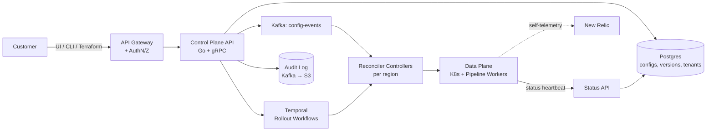
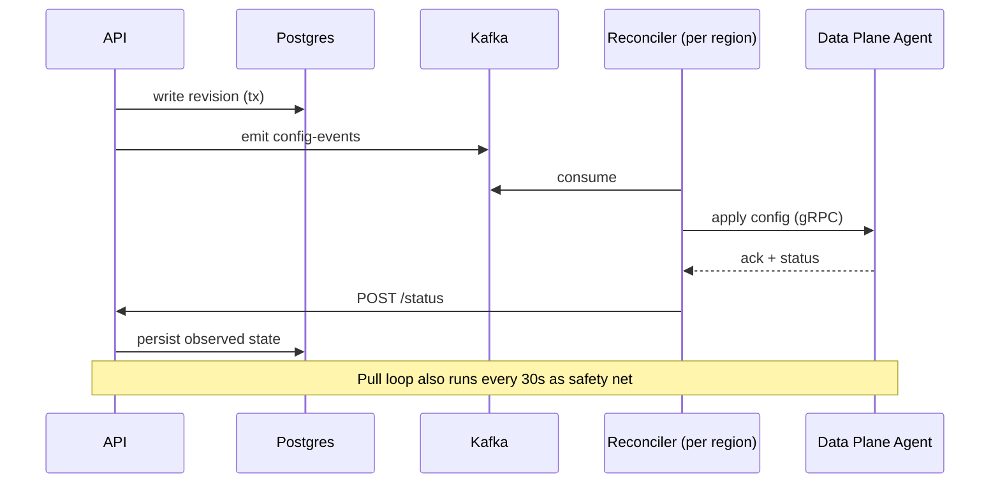

**The Killer Question (verbatim-style):**

> *"Design a system that lets thousands of customers configure observability data pipelines (sources → processors → sinks). Customers should be able to create, version, and roll out pipelines safely. Pipelines run on shared, multi-region infrastructure. We must support 10,000 tenants, 100K pipelines total, with config changes propagating in seconds and zero data loss during rollouts."*

I'll walk through this exactly how I'd do it on a whiteboard at New Relic — **45 minutes, end-to-end**.

---

## 1. Overview

A **control plane** manages the *desired state* of customer pipelines. A **data plane** runs the actual pipelines (Kafka consumers, transformers, Kafka producers, etc.). Our job: build the control plane.

**Mental model**: think Kubernetes. Customer writes a YAML/JSON spec → API stores it → controllers reconcile actual state to match desired state → data plane workers execute. We're building the API server + controllers + orchestration around it.


*Control plane = source of truth + orchestrator. Data plane = pure executor. They communicate via Kafka events + status heartbeats.*

---

## 2. Requirements (Always Start Here — Interviewers Watch This)

### Functional
- CRUD pipelines (`source → processor → sink` DAG)
- Version every change (immutable history)
- Validate configs before save (schema + semantic)
- Rollout: **draft → staging → canary % → full**
- Rollback to any prior version in <30s
- Multi-tenant: hard isolation between customers
- RBAC: org/team/role within a tenant
- Audit log of every change (compliance)

### Non-Functional
- **Scale**: 10K tenants, 100K pipelines, ~1K config changes/min peak
- **Latency**: API p99 < 200ms; config propagation < 10s globally
- **Availability**: 99.95% control plane (data plane has its own SLO)
- **Durability**: zero config loss; zero data-plane data loss during rollout
- **Multi-region**: active-active across 3+ regions

### Back-of-envelope
- 100K pipelines × ~5KB config = **500MB hot config data** → fits in memory easily, Postgres trivially
- 1K writes/min = ~17 writes/sec → Postgres handles this with eyes closed
- Reads are the volume: agents poll → if 100K pipelines poll every 30s, that's ~3.3K reads/sec → still fine, but we'll cache

> 💡 **Staff-level insight:** Most candidates over-engineer here. 17 writes/sec doesn't need sharding. Call this out: *"At this scale a single Postgres primary handles writes. We scale reads with replicas + cache. Sharding is a future problem at 100x growth."* This is exactly the trade-off thinking they want.

---

## 3. API Design

Use **gRPC internally, REST gateway externally** (grpc-gateway). Resource-oriented, like GCP/K8s.

```protobuf
service PipelineService {
  rpc CreatePipeline(CreatePipelineRequest) returns (Pipeline);
  rpc GetPipeline(GetPipelineRequest) returns (Pipeline);
  rpc UpdatePipeline(UpdatePipelineRequest) returns (Pipeline);
  rpc ListPipelines(ListPipelinesRequest) returns (ListPipelinesResponse);
  rpc DeletePipeline(DeletePipelineRequest) returns (google.protobuf.Empty);

  // Lifecycle
  rpc CreateRevision(CreateRevisionRequest) returns (Revision);
  rpc Rollout(RolloutRequest) returns (RolloutOperation); // returns long-running op
  rpc Rollback(RollbackRequest) returns (RolloutOperation);
  rpc GetRolloutStatus(GetRolloutStatusRequest) returns (RolloutStatus);
}

message Pipeline {
  string name = 1;              // tenants/{tenant}/pipelines/{pipeline}
  string display_name = 2;
  string current_revision = 3;  // points to a Revision
  map<string,string> labels = 4;
  google.protobuf.Timestamp create_time = 5;
  string etag = 6;              // for optimistic concurrency
}

message Revision {
  string name = 1;              // .../pipelines/{p}/revisions/{r}
  PipelineSpec spec = 2;        // immutable
  string created_by = 3;
  google.protobuf.Timestamp create_time = 4;
}
```

**Key design choices:**

| Choice                                   | Why                                           |
| ---------------------------------------- | --------------------------------------------- |
| Resource names like K8s/GCP              | Familiar; encodes tenant in path → easy authz |
| `etag` on Pipeline                       | Optimistic concurrency; prevents lost updates |
| Revisions are immutable                  | Audit, rollback, reproducibility              |
| Rollout is a long-running operation      | Backed by Temporal; client polls              |
| `CreateRevision` separate from `Rollout` | Decouples authoring from deployment           |

> 💡 **Staff-level insight:** Always include `etag` (or `resource_version`) on mutable resources. Skipping it is the #1 reason control planes corrupt state under concurrent edits.

---

## 4. Data Model (Postgres)

```sql
-- Tenants are the top-level isolation boundary
CREATE TABLE tenants (
  id          UUID PRIMARY KEY,
  slug        TEXT UNIQUE NOT NULL,
  region      TEXT NOT NULL,            -- home region for data residency
  created_at  TIMESTAMPTZ DEFAULT now()
);

-- Pipelines: the mutable "head" pointer
CREATE TABLE pipelines (
  id                UUID PRIMARY KEY,
  tenant_id         UUID NOT NULL REFERENCES tenants(id),
  name              TEXT NOT NULL,
  current_revision  UUID,               -- FK to revisions(id)
  etag              BIGINT NOT NULL DEFAULT 1,  -- bumped on every update
  deleted_at        TIMESTAMPTZ,        -- soft delete
  created_at        TIMESTAMPTZ DEFAULT now(),
  UNIQUE (tenant_id, name) WHERE deleted_at IS NULL
);
CREATE INDEX ON pipelines (tenant_id) WHERE deleted_at IS NULL;

-- Revisions: immutable history
CREATE TABLE revisions (
  id           UUID PRIMARY KEY,
  pipeline_id  UUID NOT NULL REFERENCES pipelines(id),
  spec         JSONB NOT NULL,          -- the actual pipeline DAG
  spec_hash    TEXT NOT NULL,           -- sha256, for dedup
  created_by   TEXT NOT NULL,
  created_at   TIMESTAMPTZ DEFAULT now()
);
CREATE INDEX ON revisions (pipeline_id, created_at DESC);

-- Rollouts: tracks an in-flight or completed deployment
CREATE TABLE rollouts (
  id              UUID PRIMARY KEY,
  pipeline_id     UUID NOT NULL REFERENCES pipelines(id),
  target_revision UUID NOT NULL REFERENCES revisions(id),
  strategy        JSONB NOT NULL,       -- {"type":"canary","steps":[10,50,100]}
  state           TEXT NOT NULL,        -- pending|running|succeeded|failed|rolled_back
  workflow_id     TEXT NOT NULL,        -- Temporal workflow ID
  created_at      TIMESTAMPTZ DEFAULT now()
);

-- Audit log: append-only, every API mutation
CREATE TABLE audit_log (
  id          BIGSERIAL PRIMARY KEY,
  tenant_id   UUID NOT NULL,
  actor       TEXT NOT NULL,
  action      TEXT NOT NULL,             -- pipeline.create, pipeline.update, ...
  resource    TEXT NOT NULL,
  before      JSONB,
  after       JSONB,
  request_id  UUID NOT NULL,
  created_at  TIMESTAMPTZ DEFAULT now()
) PARTITION BY RANGE (created_at);
-- Monthly partitions, drop after retention window
```

**Why Postgres over DynamoDB/Spanner here:**
- Relational integrity (revisions FK to pipelines) matters
- JSONB gives schema flexibility for `spec` without giving up SQL
- Transactions across pipelines + revisions + audit_log in one commit
- Scale is small enough that we don't need horizontal sharding
- We already operate Postgres → no new ops burden

**When we'd revisit:** if tenants grow 100x → shard by `tenant_id`, or move to Spanner/CockroachDB for global multi-region writes.

---

## 5. The Write Path (Critical Section)

A `CreateRevision` + `Rollout` request does this:

```go
func (s *Server) CreateRevision(ctx context.Context, req *pb.CreateRevisionRequest) (*pb.Revision, error) {
    tenantID := authz.TenantFromCtx(ctx)
    if err := authz.Require(ctx, "pipelines.write", req.PipelineName); err != nil {
        return nil, err
    }

    // 1. Validate spec (schema + semantic)
    if err := s.validator.Validate(req.Spec); err != nil {
        return nil, status.Errorf(codes.InvalidArgument, "invalid spec: %v", err)
    }

    // 2. Idempotency: if request_id seen before, return prior result
    if prior, ok := s.idem.Get(ctx, req.RequestId); ok {
        return prior.(*pb.Revision), nil
    }

    var rev *pb.Revision
    err := s.db.InTx(ctx, func(tx *sql.Tx) error {
        // 3. Lock pipeline row, check etag
        p, err := loadPipelineForUpdate(tx, tenantID, req.PipelineName)
        if err != nil { return err }
        if req.Etag != 0 && req.Etag != p.Etag {
            return status.Error(codes.Aborted, "etag mismatch; reload and retry")
        }

        // 4. Insert revision
        rev, err = insertRevision(tx, p.ID, req.Spec, authz.UserFromCtx(ctx))
        if err != nil { return err }

        // 5. Append audit log in same tx
        return insertAudit(tx, tenantID, "revision.create", rev)
    })
    if err != nil { return nil, err }

    // 6. Cache idempotency result
    s.idem.Put(ctx, req.RequestId, rev)
    return rev, nil
}
```

**What every line buys us:**
- `SELECT ... FOR UPDATE` on the pipeline row → no lost updates under concurrency
- Etag check → optimistic concurrency for clients that read-modify-write
- Audit in the same transaction → can't lose audit entries
- Idempotency key → safe retries from CLI/Terraform

> 💡 **Staff-level insight:** Validation must be *both* syntactic (schema) and *semantic* (does sink-X exist for this tenant? does this processor support that source?). Semantic validation catches 90% of bad configs before they ever reach the data plane.

---

## 6. Rollout Orchestration with Temporal

Rollouts are **long-running, multi-step, must survive process restarts, must be observable, must be safely cancellable**. This is the textbook Temporal use case.

```go
// Workflow runs in Temporal — durable, retryable, deterministic
func RolloutWorkflow(ctx workflow.Context, in RolloutInput) (RolloutResult, error) {
    log := workflow.GetLogger(ctx)
    ao := workflow.ActivityOptions{
        StartToCloseTimeout: 5 * time.Minute,
        RetryPolicy: &temporal.RetryPolicy{
            InitialInterval:    time.Second,
            BackoffCoefficient: 2.0,
            MaximumAttempts:    5,
        },
    }
    ctx = workflow.WithActivityOptions(ctx, ao)

    // 1. Pre-flight: dry-run validation against data plane
    if err := workflow.ExecuteActivity(ctx, PreflightCheck, in).Get(ctx, nil); err != nil {
        return RolloutResult{}, err
    }

    // 2. Canary steps: 10% → 50% → 100%
    for _, pct := range in.Strategy.Steps {
        if err := workflow.ExecuteActivity(ctx, ApplyToPercent, in, pct).Get(ctx, nil); err != nil {
            // Auto-rollback on failure
            _ = workflow.ExecuteActivity(ctx, Rollback, in).Get(ctx, nil)
            return RolloutResult{}, fmt.Errorf("rollout failed at %d%%: %w", pct, err)
        }

        // 3. Bake time: watch SLOs via signal or activity
        baked := workflow.NewSelector(ctx)
        timer := workflow.NewTimer(ctx, in.Strategy.BakeTime)
        cancelCh := workflow.GetSignalChannel(ctx, "cancel")

        var cancelled bool
        baked.AddFuture(timer, func(workflow.Future) {})
        baked.AddReceive(cancelCh, func(workflow.ReceiveChannel, bool) {
            cancelled = true
        })
        baked.Select(ctx)

        if cancelled {
            _ = workflow.ExecuteActivity(ctx, Rollback, in).Get(ctx, nil)
            return RolloutResult{State: "cancelled"}, nil
        }

        // 4. Health check before next step
        var healthy bool
        if err := workflow.ExecuteActivity(ctx, CheckHealth, in, pct).Get(ctx, &healthy); err != nil || !healthy {
            _ = workflow.ExecuteActivity(ctx, Rollback, in).Get(ctx, nil)
            return RolloutResult{}, errors.New("unhealthy after rollout")
        }
    }

    return RolloutResult{State: "succeeded"}, nil
}
```

**Why Temporal here vs DIY:**

| Concern                      | DIY State Machine           | Temporal                       |
| ---------------------------- | --------------------------- | ------------------------------ |
| Process crashes mid-rollout  | Lost state, manual recovery | Workflow resumes automatically |
| Retries with backoff         | You build it                | Built-in                       |
| Cancellation mid-bake        | You build it                | Signals                        |
| Audit of each step           | You build it                | Free (event history)           |
| Versioning the rollout logic | Painful                     | `workflow.GetVersion` API      |

**Trade-off cost:** Temporal cluster to operate, determinism rules to learn, vendor lock-in.

> 💡 **Staff-level insight:** When asked "why not just a cron job + status column in Postgres?", say: *"That works for ≤2 step workflows. The moment you add bake times, cancellation, and health gates, you're building a workflow engine — badly. Temporal is the right buy-vs-build call."*

---

## 7. Reconciliation to the Data Plane

The control plane never SSHes into pods. It publishes **desired state**; the data plane converges.

Two patterns; we use **both**:

1. **Push (Kafka)**: control plane emits `pipeline.revision.applied` events to a `config-events` Kafka topic, partitioned by `tenant_id`. Per-region reconcilers consume.
2. **Pull (Polling fallback)**: data plane agents poll `/v1/tenants/{t}/pipelines:list` every 30s with an `If-None-Match` etag. This catches any missed events.



**Why both push and pull?**
- Push gives us seconds-level propagation
- Pull guarantees eventual convergence even if Kafka has issues
- This is exactly the K8s controller pattern (watch + resync)

---

## 8. Multi-Region & Tenant Isolation

- **Control plane**: deployed per region, behind a global LB (latency-based routing)
- **Postgres**: per-region primary with **tenant home region** (data residency). Cross-region reads via read replicas for the global UI
- **Kafka**: per-region clusters; no cross-region pipeline configs
- **Tenant pinning**: `tenants.region` column → router enforces a tenant's writes go to their home region

**Noisy neighbor controls:**
- Per-tenant rate limits at API gateway (token bucket)
- Per-tenant quotas: max pipelines, max revisions/day
- Postgres: row-level security (RLS) on `tenant_id` as defense in depth
- Reconciler workers shard by `tenant_id` hash → one bad tenant doesn't starve others

---

## 9. Failure Modes & Mitigations

| Failure                           | Impact                       | Mitigation                                        |
| --------------------------------- | ---------------------------- | ------------------------------------------------- |
| Postgres primary down             | No writes                    | RDS Multi-AZ; reads continue from replicas        |
| Kafka unavailable                 | Slow propagation             | Pull fallback ensures convergence                 |
| Temporal cluster down             | Rollouts stall               | Existing pipelines keep running; alert + page     |
| Bad config rolled out             | Data loss / data plane crash | Canary catches it; auto-rollback                  |
| Concurrent edits                  | Last-writer-wins corruption  | Etag + `SELECT FOR UPDATE`                        |
| Replay attack on idempotency keys | Duplicate work               | TTL'd idempotency cache (Redis), 24h              |
| Tenant hot-spot                   | API saturation               | Per-tenant rate limit, fair queuing in reconciler |

---

## 10. Observability (New Relic Eats Its Own Dog Food)

**Metrics to expose (RED + USE):**
- `api_request_duration_seconds{method,status,tenant}` — p50/p95/p99
- `rollout_duration_seconds{strategy,outcome}`
- `reconcile_lag_seconds{region,tenant}` — desired vs observed time
- `pipeline_count{tenant}`, `revisions_per_day{tenant}`
- Postgres connection pool saturation, replication lag
- Temporal workflow success/failure rates

**Distributed tracing:** every API request → DB → Kafka → reconciler → data plane, single trace ID.

**Alerts (SLO-based, not threshold-based):**
- API error rate burn > 2% of monthly budget in 1h
- Reconcile lag p99 > 30s for 10 min
- Rollout failure rate > 5% in 1h

---

## 11. What I'd Build First (Iteration Plan — Shows Pragmatism)

If they ask "what would you ship in the first 90 days?":

1. **MVP (weeks 1–4)**: API + Postgres + simple "apply latest" reconciler. No canary, no Temporal. Single region. 10 design partner tenants.
2. **Hardening (5–8)**: Etag, audit log, idempotency, RBAC, rate limits.
3. **Safe rollouts (9–12)**: Introduce Temporal, canary strategy, auto-rollback.
4. **Scale (post-90)**: Multi-region, pull fallback, per-tenant quotas, public CLI/Terraform provider.

> 💡 **Staff-level insight:** Showing a phased plan signals you've actually shipped systems. Junior candidates design the final state; staff candidates design the *path* to it.

---

## 12. Things to Drop in to Sound Senior

- "I'd represent the spec as a DAG and validate it's acyclic at write time — cheap, prevents nasty runtime loops."
- "I'd make the Terraform provider a thin wrapper over the same gRPC API the UI uses — one API, multiple clients."
- "I'd add a `dry_run=true` flag on `Rollout` that runs Preflight + first canary step against a synthetic tenant — gives customers confidence before real rollouts."
- "Before sharding Postgres, I'd extract audit_log to its own DB — it's the fastest-growing table and has no FK dependencies."
- "I'd version the spec schema (v1, v2) and let revisions store schema_version → migrations are explicit, not implicit."

---

## 13. Common Mistakes Candidates Make on This Question

| Mistake                                  | What to do instead                                  |
| ---------------------------------------- | --------------------------------------------------- |
| Jumping to Kafka/sharding without sizing | Do back-of-envelope first; justify scale            |
| Skipping idempotency / etag              | Mention both within first 5 min of API design       |
| Treating rollout as a single API call    | Model it as a long-running operation                |
| Forgetting audit log / compliance        | Include from day 1 — it's a SaaS table-stake        |
| One mega-region design                   | Multi-region with tenant pinning is expected for NR |
| No mention of "you build it, you run it" | Bring up SLOs, on-call, alerts unprompted           |

---

## What to Practice

Whiteboard this design **3 times this week** — once at full pace (45 min), once focusing only on the Temporal workflow + rollback story, once focusing only on data model + concurrency. By the third pass, the diagram should flow without thinking.

---
