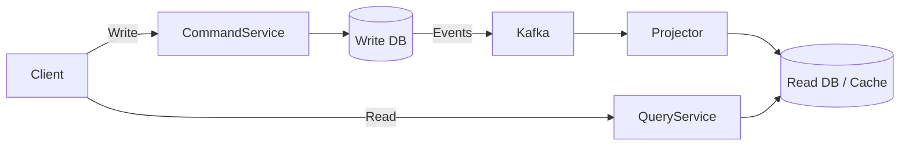
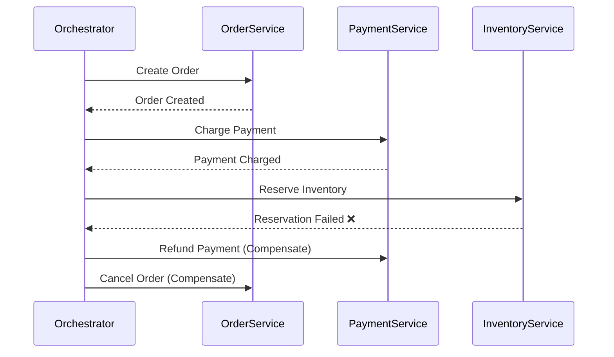
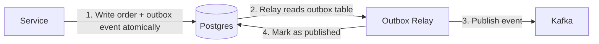

## Overview

Design patterns at staff level go **far beyond** the classic Gang of Four (GoF) book. You need three layers of pattern knowledge:

1. **Code-level patterns** — how objects and functions interact
2. **Architectural patterns** — how services and components are structured
3. **Distributed systems patterns** — how systems behave at scale across networks

The difference between a senior and a staff engineer? A senior knows *what* the pattern is. A staff engineer knows *when to use it, when NOT to use it, and what breaks at 1000x scale.*

---

## Core Concepts (Step-by-Step)

### Layer 1: Code-Level Patterns (Must Be Second Nature)

These are the GoF classics, but focus on the ones that **actually show up in production**:

| Pattern                        | What It Does                                       | Where You'll See It                                |
| ------------------------------ | -------------------------------------------------- | -------------------------------------------------- |
| **Strategy**                   | Swap algorithms at runtime                         | Payment processors, serialization formats          |
| **Observer/Pub-Sub**           | Decouple event producers from consumers            | Event buses, UI frameworks, Kafka consumers        |
| **Factory / Abstract Factory** | Create objects without specifying concrete classes | DB drivers, cloud provider abstractions            |
| **Singleton**                  | Single instance, global access                     | Config managers, connection pools (but be careful) |
| **Decorator**                  | Add behavior without modifying the original        | HTTP middleware, logging wrappers                  |
| **Adapter**                    | Make incompatible interfaces work together         | Legacy system integration, API versioning          |
| **Builder**                    | Construct complex objects step-by-step             | Query builders, config objects, protobuf messages  |
| **Iterator**                   | Traverse collections without exposing internals    | Go's `range`, streaming result sets                |

> 💡 **Staff-level insight:** In Go, many GoF patterns simplify dramatically because interfaces are implicit and functions are first-class. A "Strategy" in Go is often just a `func` parameter — no class hierarchy needed. Know when a pattern deserves a full struct vs. when a function does the job.

```go
// Strategy pattern in Go — just a function type
type RetryStrategy func(attempt int) time.Duration

func ExponentialBackoff(attempt int) time.Duration {
    return time.Duration(math.Pow(2, float64(attempt))) * time.Second
}

func LinearBackoff(attempt int) time.Duration {
    return time.Duration(attempt) * time.Second
}

func CallWithRetry(fn func() error, maxRetries int, strategy RetryStrategy) error {
    for i := 0; i < maxRetries; i++ {
        if err := fn(); err == nil {
            return nil
        }
        time.Sleep(strategy(i))
    }
    return fmt.Errorf("max retries exceeded")
}
```

---

### Layer 2: Architectural Patterns (Where Design Reviews Happen)

These are the patterns that show up in **system design docs and interviews**:

#### 1. CQRS (Command Query Responsibility Segregation)

Separate the read model from the write model.



*Write path optimized for consistency, read path optimized for speed.*

**Use when:** Read and write patterns are fundamentally different (e.g., write 1K TPS, read 100K TPS). Netflix uses this for their viewing history service.

**Don't use when:** Your read/write ratio is balanced and a single model works fine. CQRS adds significant complexity.

#### 2. Event Sourcing

Store **events** (facts that happened) instead of current state. Rebuild state by replaying events.

**Use when:** You need a complete audit trail, or you need to rebuild state at any point in time (financial systems, order management).

**Don't use when:** Simple CRUD. The operational complexity is massive — compaction, snapshots, schema evolution of events.

> 💡 **Staff-level insight:** Event Sourcing and CQRS are often mentioned together, but they're independent patterns. You can use CQRS without Event Sourcing (and you usually should start there).

#### 3. Saga Pattern

Manage distributed transactions across services without 2PC (two-phase commit).

Two flavors:

- **Choreography** — each service emits events, next service reacts. Simple but hard to debug.
- **Orchestration** — a central coordinator tells each service what to do. More control, single point of visibility.



*Orchestration saga with compensation on failure.*

**Use when:** You have multi-service transactions (e.g., order → payment → shipping). Uber uses orchestration sagas for ride booking.

#### 4. Strangler Fig

Incrementally replace a legacy system by routing traffic to the new system piece by piece.

**Use when:** Always, when migrating legacy systems. Never do a big-bang rewrite.

#### 5. Outbox Pattern

**This is the most commonly missed pattern in microservices guides, and it causes the most silent data loss bugs in production.**

The problem: You write to your database and then publish an event to Kafka. If your process crashes between those two operations, the write is committed but the event is never published. Downstream services never see the change. Data goes out of sync with no error anywhere.



*The outbox relay is the only component that publishes to Kafka — guaranteeing at-least-once delivery.*

```go
// Write to the domain table AND the outbox in a single transaction.
// Either both succeed or neither does — no partial state.
func CreateOrder(ctx context.Context, db *sql.DB, order Order) error {
    tx, err := db.BeginTx(ctx, nil)
    if err != nil {
        return err
    }
    defer tx.Rollback()

    // 1. Insert the domain object
    _, err = tx.ExecContext(ctx,
        "INSERT INTO orders (id, user_id, total) VALUES ($1, $2, $3)",
        order.ID, order.UserID, order.Total)
    if err != nil {
        return err
    }

    // 2. Insert the outbox event atomically in the same transaction
    payload, _ := json.Marshal(order)
    _, err = tx.ExecContext(ctx,
        `INSERT INTO outbox (id, aggregate_type, event_type, payload, published)
         VALUES ($1, 'order', 'order.created', $2, false)`,
        uuid.New(), payload)
    if err != nil {
        return err
    }

    return tx.Commit()
}

// A separate relay process polls the outbox and publishes unpublished events.
// This is typically a background goroutine or a dedicated microservice.
func RelayOutboxEvents(ctx context.Context, db *sql.DB, producer KafkaProducer) {
    ticker := time.NewTicker(100 * time.Millisecond)
    for range ticker.C {
        rows, _ := db.QueryContext(ctx,
            "SELECT id, event_type, payload FROM outbox WHERE published = false LIMIT 100")
        for rows.Next() {
            var id, eventType string
            var payload []byte
            rows.Scan(&id, &eventType, &payload)

            if err := producer.Publish(eventType, payload); err != nil {
                continue // retry next tick — at-least-once delivery
            }

            db.ExecContext(ctx, "UPDATE outbox SET published = true WHERE id = $1", id)
        }
    }
}
```

**Use when:** Any microservice that writes to a database AND publishes events to a message broker. This combination without the Outbox Pattern is a latent data loss bug.

**Don't use when:** You're using a database that supports transactional outbox natively (e.g., Debezium + Postgres CDC), which is a more operationally mature alternative.

> 💡 **Staff-level insight:** The Outbox Pattern gives you at-least-once delivery, not exactly-once. Your consumers still need to be idempotent. The pattern solves the *producer* side of the problem (don't lose events). Idempotency solves the *consumer* side (don't process duplicates). You need both.

#### 6. Sidecar / Ambassador

Deploy helper functionality alongside your main service (logging, proxies, service mesh).

**Use when:** Cross-cutting concerns in Kubernetes. This is how Istio, Dapr, and Envoy work. You deploy a sidecar container in the same pod.

---

### Layer 3: Distributed Systems Patterns (The Staff-Level Differentiator)

This is where staff engineers earn their title.

#### 1. Circuit Breaker

Stop calling a failing downstream service. Prevent cascade failures.

States: **Closed** (normal) → **Open** (failing, short-circuit) → **Half-Open** (test with limited traffic)

```go
// Simplified circuit breaker
type CircuitBreaker struct {
    mu            sync.Mutex
    failureCount  int
    threshold     int
    state         string // "closed", "open", "half-open"
    lastFailure   time.Time
    cooldown      time.Duration
}

func (cb *CircuitBreaker) Call(fn func() error) error {
    cb.mu.Lock()
    if cb.state == "open" {
        if time.Since(cb.lastFailure) > cb.cooldown {
            cb.state = "half-open"
        } else {
            cb.mu.Unlock()
            return fmt.Errorf("circuit open: service unavailable")
        }
    }
    cb.mu.Unlock()

    err := fn()

    cb.mu.Lock()
    defer cb.mu.Unlock()
    if err != nil {
        cb.failureCount++
        cb.lastFailure = time.Now()
        if cb.failureCount >= cb.threshold {
            cb.state = "open"
        }
        return err
    }
    cb.failureCount = 0
    cb.state = "closed"
    return nil
}
```

> 💡 **Staff-level insight:** Circuit Breaker timeouts must be aligned with your Kubernetes liveness probe configuration. If your circuit stays open for 60 seconds but your liveness probe fails after 30 seconds, K8s will restart your pod — thinking it's unhealthy — before the circuit can recover. Set your liveness probe `failureThreshold × periodSeconds` to be *longer* than your circuit breaker's cooldown window. Missing this is one of the most common causes of restart loops in production services.

#### 2. Bulkhead

Isolate resources so one failing component doesn't take down everything. Like watertight compartments in a ship — one flooded compartment doesn't sink the whole vessel.

**The problem without it:** All downstream dependencies share the same goroutine pool. Service A slows down → goroutines pile up waiting → pool exhausts → Service B calls also fail, even though Service B is fine. One slow dependency cascades into total outage.

```go
// Bulkhead: separate bounded worker pools per downstream dependency.
// If the payment service is slow, it only exhausts its own pool.
// The inventory service pool is unaffected.
type Bulkhead struct {
    sem chan struct{} // counting semaphore — limits concurrent calls
}

func NewBulkhead(maxConcurrent int) *Bulkhead {
    return &Bulkhead{sem: make(chan struct{}, maxConcurrent)}
}

func (b *Bulkhead) Do(ctx context.Context, fn func() error) error {
    select {
    case b.sem <- struct{}{}: // acquire slot
        defer func() { <-b.sem }() // release on return
        return fn()
    case <-ctx.Done():
        // Context expired before we got a slot — shed the load, don't wait
        return fmt.Errorf("bulkhead full: shedding request")
    }
}

// Usage — separate bulkheads per dependency
var (
    paymentBulkhead   = NewBulkhead(50)
    inventoryBulkhead = NewBulkhead(100)
)
```

**Trade-offs:**

| Aspect            | Impact                                                                |
| ----------------- | --------------------------------------------------------------------- |
| Isolation         | Excellent — one dependency can't starve another                       |
| Tuning complexity | High — pool sizes must be calibrated per dependency's SLA             |
| Memory overhead   | Minimal — semaphores are cheap                                        |
| Failure mode      | At capacity: requests are shed (fast fail) rather than queued forever |

**Use when:** Your service calls multiple downstream services and any one of them can experience latency spikes. This is table stakes for any service with 3+ dependencies.

#### 3. Backpressure

When a system is overwhelmed, signal upstream to slow down rather than silently dropping requests or queuing them forever.

**The problem without it:** Your service accepts work faster than it can process it. Queue grows unbounded → memory exhaustion → crash. Or worse, you process stale work for hours during an incident.

**Mechanisms in practice:**

- **Go channels with bounded buffers** — the channel itself is the backpressure signal. When it's full, the sender blocks or gets a `default` case to shed load.
- **HTTP 429 Too Many Requests** — tell clients to back off, include `Retry-After` header
- **Kafka consumer lag** — natural backpressure; consumers read at their own pace, producers never need to wait
- **gRPC flow control** — built-in window-based backpressure at the transport level

```go
// Bounded channel as a work queue with backpressure
workQueue := make(chan Job, 1000) // bounded — backpressure built in

// Producer: shed load if queue is full instead of blocking
func submit(job Job) error {
    select {
    case workQueue <- job:
        return nil
    default:
        // Queue full — apply backpressure to caller
        return fmt.Errorf("service overloaded: retry later") // maps to HTTP 429
    }
}
```

**Trade-offs:**

| Aspect            | Impact                                                          |
| ----------------- | --------------------------------------------------------------- |
| System stability  | High — prevents unbounded queue growth and memory exhaustion    |
| Client experience | Requires clients to handle 429 and implement retry with backoff |
| Complexity        | Low for channels; moderate for full flow control systems        |
| Kafka integration | Natural fit — no extra work needed, lag is the signal           |

#### 4. Leader Election

Ensure exactly one node executes a task at a time — critical for scheduled jobs, partition leaders, and any singleton workload. Without it, multiple nodes process the same job, producing duplicates or data corruption.

**How it works (etcd/ZooKeeper model):**

1. All candidates try to write to the same key with a TTL
2. Only one wins — it becomes the leader
3. Leader must renew its lease before TTL expires
4. If the leader crashes, TTL expires, a new election starts

```go
// Leader election using Postgres advisory locks — simple, no extra infra
func tryBecomeLeader(ctx context.Context, db *sql.DB, lockID int64) (bool, error) {
    // pg_try_advisory_lock is non-blocking — returns false if already held
    // Lock is released automatically when the session ends or on explicit unlock
    var acquired bool
    err := db.QueryRowContext(ctx,
        "SELECT pg_try_advisory_lock($1)", lockID).Scan(&acquired)
    return acquired, err
}

func runLeaderLoop(ctx context.Context, db *sql.DB) {
    const lockID = 12345 // unique per job type
    for {
        isLeader, err := tryBecomeLeader(ctx, db, lockID)
        if err != nil || !isLeader {
            time.Sleep(5 * time.Second) // not the leader, poll
            continue
        }
        // We are the leader — do the work
        doLeaderWork(ctx)
    }
}
```

**Trade-offs:**

| Aspect           | etcd/ZooKeeper              | Postgres Advisory Lock | Redis RedLock                 |
| ---------------- | --------------------------- | ---------------------- | ----------------------------- |
| Correctness      | Strong (Raft/ZAB consensus) | Strong (single DB)     | Controversial — see Kleppmann |
| Infra required   | Separate cluster            | Already have Postgres  | Redis cluster                 |
| Lease precision  | Milliseconds                | Session lifetime       | TTL-based                     |
| Failure handling | Automatic                   | Session close          | TTL expiry                    |

> 💡 **Staff-level insight:** The RedLock controversy is a real litmus test in interviews. Martin Kleppmann showed that Redis RedLock is unsafe under clock skew and GC pauses — a "leader" can think it holds the lock while another node wins it. If you need correctness, use etcd or a Postgres advisory lock. If you need "best effort" deduplication and can tolerate rare duplicates, RedLock is fine. Know which you need before choosing.

#### 5. Idempotency

Making an operation safe to retry. **This is the single most important pattern in distributed systems.**

```go
// Idempotent payment processing — atomic upsert avoids race conditions
func ProcessPayment(ctx context.Context, db *sql.DB, idempotencyKey string, amount int) error {
    // ON CONFLICT DO NOTHING makes the check+insert atomic at the DB level.
    // A separate SELECT + INSERT has a race: two concurrent requests with the same key
    // can both pass the SELECT before either executes the INSERT — producing a duplicate.
    result, err := db.ExecContext(ctx,
        `INSERT INTO payments (idempotency_key, amount, created_at)
         VALUES ($1, $2, NOW())
         ON CONFLICT (idempotency_key) DO NOTHING`,
        idempotencyKey, amount)
    if err != nil {
        return err
    }

    rowsAffected, _ := result.RowsAffected()
    if rowsAffected == 0 {
        // Key already existed — this is a retry, not an error
        return nil
    }

    // rowsAffected == 1: new payment, proceed with downstream processing
    return nil
}
```

> 💡 **Staff-level insight:** At scale, idempotency keys need TTLs and storage management. Stripe stores idempotency keys for 24 hours. At 10K TPS, that's 864 million rows per day — you need a background job deleting expired keys, and you need a partial index on `(idempotency_key) WHERE created_at > NOW() - INTERVAL '24 hours'` to keep the uniqueness check fast. Decide upfront: what happens if a client retries *after* the key expires? Most systems treat it as a new request. Document that in your API contract.

#### 6. Consistent Hashing

Distribute data across nodes so that adding/removing a node only moves a small fraction of data.

**Used by:** DynamoDB, Cassandra, Memcached, CDNs. Essential for any sharded system.

#### 7. Write-Ahead Log (WAL)

Write changes to a durable log before applying them. Guarantees durability and enables recovery.

**Used by:** PostgreSQL (literally its WAL), Kafka (commit log), etcd, every serious database.

---

## Monitoring & Observability

**You haven't implemented a pattern until you can observe it.** Here's what to instrument for the three hardest-to-debug distributed patterns.

### Circuit Breaker

| Metric                                                  | Type    | Alert Threshold                   |
| ------------------------------------------------------- | ------- | --------------------------------- |
| `circuit_breaker_state` (0=closed, 1=open, 2=half-open) | Gauge   | Alert if open > 60s               |
| `circuit_breaker_calls_total{result="success            | failure | rejected"}`                       | Counter | Alert if rejection rate > 5% over 1 min |
| `circuit_breaker_state_transitions_total{from, to}`     | Counter | Alert on any transition to "open" |

**OpenTelemetry hook:**

```go
// Wrap circuit breaker transitions with OTel spans so you can trace
// which downstream call triggered the open state
func (cb *CircuitBreaker) Call(ctx context.Context, fn func() error) error {
    _, span := tracer.Start(ctx, "circuit_breaker.call",
        trace.WithAttributes(
            attribute.String("cb.state", cb.state),
            attribute.String("cb.dependency", cb.name),
        ))
    defer span.End()

    err := cb.doCall(fn)
    if err != nil {
        span.SetStatus(codes.Error, err.Error())
        span.RecordError(err)
    }
    return err
}
```

**Debug at 2 AM:** Check `circuit_breaker_state_transitions_total` — the timestamp of the first "closed → open" transition tells you exactly when the downstream dependency started failing. Cross-correlate with that dependency's own error rate.

### Saga

| Metric                                           | Type        | Alert Threshold    |
| ------------------------------------------------ | ----------- | ------------------ |
| `saga_started_total{saga_type}`                  | Counter     | —                  |
| `saga_completed_total{saga_type, status="success | compensated | stuck"}`           | Counter | Alert if `compensated` rate > 1% |
| `saga_duration_seconds{saga_type}`               | Histogram   | Alert if p99 > SLA |
| `saga_step_failures_total{saga_type, step}`      | Counter     | Alert on any spike |

**Distributed tracing is non-negotiable for Sagas.** Every step must propagate the same trace ID:

```go
// Propagate trace context across saga steps — same TraceID ties the whole flow together
func (o *Orchestrator) executeStep(ctx context.Context, step SagaStep) error {
    ctx, span := tracer.Start(ctx, "saga.step",
        trace.WithAttributes(
            attribute.String("saga.id", sagaIDFromCtx(ctx)),
            attribute.String("saga.step", step.Name()),
        ))
    defer span.End()
    return step.Execute(ctx)
}
```

**Debug at 2 AM:** Search your tracing backend (Jaeger, Tempo) for `saga.id = <stuck_id>`. Every step will be a child span. The last completed span before the gap tells you exactly where it got stuck.

### Idempotency

| Metric                                  | Type         | Alert Threshold                         |
| --------------------------------------- | ------------ | --------------------------------------- |
| `idempotency_key_hits_total{result="new | duplicate"}` | Counter                                 | Alert if duplicate rate spikes unexpectedly |
| `idempotency_key_table_size_rows`       | Gauge        | Alert if > 500M rows (tune per DB)      |
| `idempotency_key_cleanup_lag_seconds`   | Gauge        | Alert if expired keys not being deleted |

**Debug at 2 AM:** A sudden spike in `duplicate` hits usually means a client is retrying too aggressively (misconfigured retry backoff) or a downstream acknowledgment is failing silently. Check client retry logs alongside the idempotency hit rate.

---

## Scale Analysis

How do these patterns behave when traffic grows 10x, 100x, 1000x?

### Saga Orchestrator

- **10x (1K → 10K sagas/sec):** Single orchestrator service handles this fine with horizontal scaling. Ensure your saga state store (usually a DB) has proper indexes on `saga_id` and `status`.
- **100x (10K → 100K sagas/sec):** The orchestrator itself becomes a bottleneck. Solution: **partition sagas by a shard key** (e.g., `user_id % N`). Each orchestrator instance owns a partition. Use Kafka partitions to route saga events to the right orchestrator shard.
- **1000x:** You're now running a system like Uber's Cadence or Netflix's Conductor. At this scale, you typically adopt a purpose-built workflow engine rather than a hand-rolled orchestrator.

### Idempotency Key Storage

- **10x:** A table with ~87M rows/day at 1K TPS. Fast with a proper index. No problem.
- **100x:** ~870M rows/day at 10K TPS. You need: (1) a TTL cleanup job running continuously, (2) table partitioning by `created_at` so you can drop old partitions in O(1) instead of deleting rows, (3) a partial index only on recent keys.
- **1000x:** A Postgres table won't scale here. Move idempotency keys to Redis with native TTL support — no cleanup job needed. Redis can handle millions of key lookups per second. Trade-off: Redis is not as durable as Postgres by default — configure `appendonly yes` and accept the replication lag.

### Consistent Hashing and Virtual Nodes

- **Why virtual nodes?** Without them, each physical node maps to one point on the hash ring. With N nodes, each handles 1/N of the keyspace. Adding a new node only moves 1/N of the data — that's the core win. But variance is high: some nodes end up with much more data than others.
- **Virtual nodes fix the variance:** Each physical node maps to V points on the ring (V = 150–200 is typical). Data distribution becomes much more uniform. The trade-off: more metadata to track.
- **At 1000x:** With thousands of nodes (like DynamoDB), the virtual node count per node is tuned to match node capacity. A node with 2x the disk gets 2x the virtual nodes — proportional load distribution.

> 💡 **Staff-level insight:** Consistent Hashing is not just about minimizing data movement on node changes. The *virtual node count* is the knob that controls load distribution uniformity vs. metadata overhead. In interviews, most candidates describe the basic ring — but the ones who get staff offers explain *why* virtual nodes are not optional at scale.

---

## Use Cases

| Pattern              | Real-World System                 | Problem It Solves                     |
| -------------------- | --------------------------------- | ------------------------------------- |
| CQRS                 | Netflix viewing history           | Read/write scale asymmetry            |
| Saga (Orchestration) | Uber ride booking                 | Multi-service transactions            |
| Circuit Breaker      | Netflix Hystrix                   | Cascade failure prevention            |
| Consistent Hashing   | DynamoDB, Cassandra               | Minimal data movement on node changes |
| Idempotency          | Stripe Payments API               | Safe retries without double-charging  |
| Event Sourcing       | Banking / order management        | Full audit trail, temporal replay     |
| Strangler Fig        | Any legacy migration              | Incremental replacement without risk  |
| Outbox Pattern       | Any microservice with DB + broker | Silent event loss prevention          |

---

## Gotchas

1. **Over-patterning** — Applying patterns where simple code works. A microservice with 3 endpoints doesn't need CQRS.
2. **Singleton in Go** — Use `sync.Once`, never `init()` for things that can fail. Singletons make testing painful.
3. **Circuit Breaker tuning** — Default thresholds are almost always wrong for your system. You need to tune based on actual failure rates and SLAs.
4. **Saga without observability** — If you can't trace a saga across all services, you'll spend days debugging why an order is stuck in a partial state.
5. **Idempotency check and insert not atomic** — A separate `SELECT EXISTS` + `INSERT` has a race under concurrent retries. Always use `INSERT ... ON CONFLICT DO NOTHING` or a transaction.
6. **Event Sourcing schema evolution** — Events are immutable. Changing an event's schema after the fact is extremely painful. Design event schemas carefully upfront.
7. **Outbox relay is a single point of failure** — If the relay crashes, events queue up in the outbox table. Size your outbox table accordingly and alert on relay lag (unpublished events older than N seconds).
8. **Backoff without jitter** — Retrying with exponential backoff but no jitter causes a *thundering herd*: all clients backed off for the same duration fire again simultaneously, recreating the overload. Always add `jitter = rand.Float64() * baseDelay`.

---

## Where to Use (and Where NOT to Use)

| Pattern            | Use When                                                                  | Avoid When                                            |
| ------------------ | ------------------------------------------------------------------------- | ----------------------------------------------------- |
| CQRS               | Read/write asymmetry > 10:1                                               | Simple CRUD apps                                      |
| Saga               | Multi-service transactions                                                | Single-database operations (just use DB transactions) |
| Circuit Breaker    | Calling unreliable external services                                      | In-process function calls                             |
| Event Sourcing     | Audit requirements, temporal queries                                      | Simple state management                               |
| Consistent Hashing | Stateful distributed systems                                              | Stateless services behind a load balancer             |
| Idempotency        | **Always** for anything involving money, state changes, or external calls | Pure reads                                            |
| Outbox Pattern     | Writing to DB + publishing to broker in the same operation                | Using CDC (Debezium) which handles this natively      |
| Bulkhead           | Calling 3+ downstream services with independent SLAs                      | Single downstream dependency                          |

---

## Versus (Key Comparisons)

### Choreography vs. Orchestration Saga

| Aspect      | Choreography                      | Orchestration                              |
| ----------- | --------------------------------- | ------------------------------------------ |
| Coupling    | Loose — services only know events | Tighter — orchestrator knows all steps     |
| Debugging   | Hard — distributed event trail    | Easier — central coordinator has full view |
| Scalability | Better — no single coordinator    | Coordinator can be bottleneck              |
| Complexity  | Grows fast with more services     | Linear with more steps                     |

**Choose Choreography when:** Few services (< 5), simple flows, team autonomy matters.  
**Choose Orchestration when:** Complex flows, need visibility, compensation logic is non-trivial.

### CQRS vs. Event Sourcing

| Aspect           | CQRS                    | Event Sourcing               |
| ---------------- | ----------------------- | ---------------------------- |
| Complexity       | Medium                  | High                         |
| Audit trail      | No (just current state) | Yes (full history)           |
| Temporal queries | No                      | Yes (replay to any point)    |
| Operational cost | Moderate                | High (compaction, snapshots) |

**Use CQRS without Event Sourcing** as your default. Add Event Sourcing only when you have a genuine audit or temporal replay requirement.

### Saga vs. Two-Phase Commit (2PC)

This comparison comes up directly in interviews — "why not just use a distributed transaction?"

| Aspect               | Saga                                                | 2PC (Two-Phase Commit)                                                                  |
| -------------------- | --------------------------------------------------- | --------------------------------------------------------------------------------------- |
| Consistency model    | Eventual — each step commits independently          | Strong — all-or-nothing across all participants                                         |
| Coordinator required | Yes (orchestration) or implicit (choreography)      | Yes — a transaction coordinator                                                         |
| Failure handling     | Compensating transactions (explicit rollback logic) | Coordinator can abort all participants                                                  |
| Availability         | High — each service can operate independently       | Low — all participants must be available to commit                                      |
| Latency              | Higher — multiple round trips across services       | High — two rounds of locking across all participants                                    |
| Blocking             | Non-blocking                                        | **Blocking** — participants hold locks waiting for phase 2                              |
| Practical at scale?  | Yes — used at Uber, Netflix, Stripe                 | **No** — lock contention and coordinator failure make 2PC impractical above ~5 services |

**Choose Saga when:** You're building microservices. Almost always.  
**Choose 2PC when:** You control all participants, they're co-located (low latency), and you need atomic commits — e.g., two tables in the same Postgres instance via a single transaction (which isn't even real 2PC — it's just a DB transaction).

> 💡 **Staff-level insight:** Pat Helland's 2007 paper "Life Beyond Distributed Transactions" argues that once you accept that distributed transactions don't scale, your entire design philosophy shifts toward idempotent operations and compensating logic. This is the mental model shift from senior to staff.

---

## A Note on SOLID Principles

SOLID is often confused with design patterns — it is not. SOLID is a set of **design principles**, not patterns.

|                   | Design Principles (SOLID)         | Design Patterns (GoF)                    |
| ----------------- | --------------------------------- | ---------------------------------------- |
| **What**          | Guidelines for writing good code  | Reusable solutions to recurring problems |
| **Level**         | How you structure classes/modules | How components collaborate               |
| **Prescriptive?** | "You should do this"              | "Here's a template for this problem"     |
| **Example**       | Single Responsibility Principle   | Observer Pattern                         |

SOLID principles tell you *there's a problem*; design patterns give you *the solution*. For example, if you're violating the Open/Closed principle (adding a switch statement every time you add a new type), the fix is often the **Strategy** or **Factory** pattern.

In Go, Interface Segregation is *extremely* idiomatic — small, focused interfaces like `io.Reader` and `io.Writer` are the gold standard.

---

## Interview Questions

**1. "Design an e-commerce checkout system. How do you handle the case where payment succeeds but inventory reservation fails?"**

- They want: Saga pattern with compensation. Idempotency. Eventual consistency.
- Common mistake: Saying "use distributed transactions" — that doesn't work at scale.
- What they're really testing: Do you understand that distributed systems cannot have ACID transactions across service boundaries?

**2. "How would you migrate a monolith to microservices?"**

- They want: Strangler Fig. Domain-driven decomposition. Not a big-bang rewrite.
- What they're really testing: Judgment and pragmatism. The wrong answer is "rewrite everything."

**3. "Your service is getting overwhelmed by a downstream dependency. What do you do?"**

- They want: Circuit breaker, bulkhead, backpressure, graceful degradation, timeout budgets.
- Staff-level answer: "I'd add a circuit breaker, but first I'd ask why we're hitting this dependency synchronously. Can we decouple with a queue?"

**4. "How do you ensure exactly-once processing in a distributed system?"**

- They want: "True exactly-once is impossible. We achieve effectively-once through idempotent consumers + at-least-once delivery."
- Common mistake: Claiming Kafka provides exactly-once (it does within Kafka, not end-to-end).

**5. "What's the difference between a Bulkhead and a Circuit Breaker?"**

- Circuit Breaker: Stops calling a failing service. Temporal isolation — you stop calling it *over time*.
- Bulkhead: Limits how many resources any one dependency can consume. Resource isolation — you limit *how much* it can consume concurrently.
- They work together — use both.

**6. "Design a distributed cache. How would you add a new node without re-distributing all data?"**

- They want: Consistent Hashing. Virtual nodes. Why 1/N data moves instead of all of it.
- Common mistake: Describing naive modulo hashing (`key % N`) — adding a node invalidates almost every key.
- What they're really testing: Do you know *why* virtual nodes exist, not just that consistent hashing exists?

**7. "How do you safely publish events to Kafka after writing to Postgres without risking data loss?"**

- They want: Outbox Pattern. Transactional write to both tables. Relay process for publishing.
- Common mistake: "I'll write to DB and publish to Kafka in sequence" — that's exactly the bug the Outbox Pattern fixes.
- What they're really testing: Have you actually shipped microservices in production or are you just describing the happy path?

---

## Staff-Level Preparation Tips

1. **Don't memorize patterns — internalize trade-offs.** In a design review, nobody asks "what pattern is this?" They ask "why this approach over alternatives?"

2. **Build a mental decision tree:**

   - Need to coordinate across services? → Saga
   - Need to handle downstream failures? → Circuit Breaker + Retry with Backoff
   - Need to scale reads independently? → CQRS
   - Need audit trail? → Event Sourcing
   - Need safe retries? → Idempotency
   - Need to migrate a legacy system? → Strangler Fig

3. **Add a Consistent Hashing question to your interview prep.** It's a near-universal staff-level topic. Know why virtual nodes exist (to handle heterogeneous node capacities and reduce hotspots), how many virtual nodes to configure (150–200 per physical node is common), and what happens when a node joins or leaves.

4. **Practice explaining patterns in 60 seconds.** In a staff interview, you don't have 10 minutes per pattern. Name it, explain it in one sentence, state when you'd use it, move on.

5. **Build something:** Implement a simple Circuit Breaker in Go from scratch. Deploy a Saga-based checkout flow. Add the Outbox Pattern to any side project that writes to a DB and publishes events. Reading is not enough — you need to feel the sharp edges yourself.

---

## References

### Books

- *Designing Data-Intensive Applications* by Martin Kleppmann — **the** book for distributed systems patterns
- *Enterprise Integration Patterns* by Hohpe & Woolf — messaging patterns bible
- *Release It!* by Michael Nygard — circuit breaker, bulkhead, and production resilience patterns
- *Microservices Patterns* by Chris Richardson — saga, CQRS, outbox, and event sourcing in depth

### Blogs & Documentation

- [Patterns of Distributed Systems](https://martinfowler.com/articles/patterns-of-distributed-systems/) by Unmesh Joshi (martinfowler.com)
- [Microsoft Cloud Design Patterns](https://learn.microsoft.com/en-us/azure/architecture/patterns/)
- [Chris Richardson's Microservices Patterns](https://microservices.io/patterns/)
- [Stripe's Idempotency Keys](https://stripe.com/docs/api/idempotent_requests)
- [Netflix Tech Blog — Resilience Engineering](https://netflixtechblog.com/)
- [Uber Engineering — Cadence/Temporal](https://eng.uber.com/)

### Seminal Papers

- [Life Beyond Distributed Transactions](https://queue.acm.org/detail.cfm?id=3025012) — Pat Helland (2007) — foundational paper arguing why distributed transactions don't scale and what to do instead
- [Dynamo: Amazon's Highly Available Key-Value Store](https://www.allthingsdistributed.com/files/amazon-dynamo-sosp2007.pdf) — consistent hashing and eventual consistency in practice

### Conference Talks

- [The Verification of a Distributed System](https://www.infoq.com/presentations/distributed-systems-verification/) — Caitie McCaffrey (Strange Loop 2015) — how to reason about correctness in distributed systems
- [Turning the Database Inside-Out](https://www.youtube.com/watch?v=fU9hR3kiOK0) — Martin Kleppmann (Strange Loop 2014) — event sourcing, CQRS, and the log as a universal data integration mechanism
- [Saga Pattern](https://www.youtube.com/watch?v=xDuwrtwYHu8) — Chris Richardson (QCon SF) — practical saga implementation with orchestration
