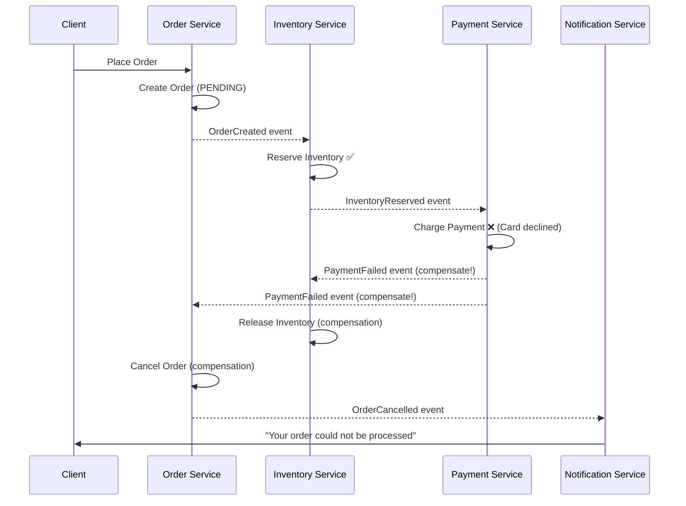
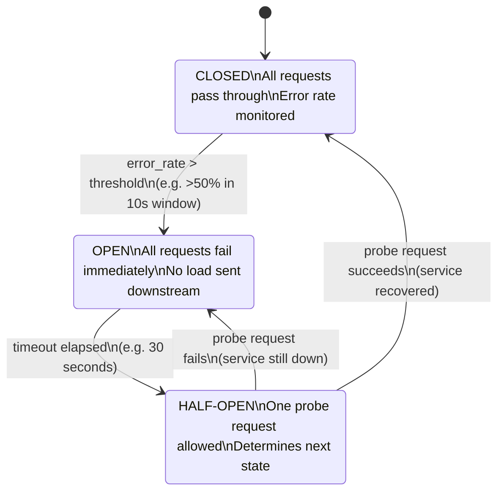

## 1. Overview

Every staff-level design review comes down to two things: **how you reason** and **how you communicate**.

Design Principles give you the reasoning framework. Design Patterns give you the vocabulary.

If you can't articulate why a design is wrong, you can't influence a team to change it. If you don't know the pattern vocabulary, you'll spend five minutes describing what your interviewer could have named in two words: "Circuit Breaker."

By the end of this guide you'll know:
- The difference between principles and patterns — and why that distinction matters
- Which ones are non-negotiable at staff level
- How to apply them at scale, monitor them in production, and defend them in interviews
- The failure modes that only come from running these at 100x and 1000x load

> Think of it this way: **Principles are the rules of the road. Patterns are proven routes to a destination.**

---

## 2. Core Concepts

### What Are Design Principles?

Principles are high-level guidelines that shape *how you reason* about code and systems. They don't give you code — they give you judgment. A principle answers: *"Am I thinking about this the right way?"*

### What Are Design Patterns?

Patterns are concrete, named, reusable solutions to recurring design problems. A pattern answers: *"I've seen this shape of problem before — here's how to solve it."*

The Gang of Four (GoF) formalized 23 of them in 1994. Since then, distributed systems have added a second layer of patterns that matter even more at staff level.

---

### Code-Level Principles (SOLID + Essentials)

| Principle                        | What It Says                                  | Why It Matters at Staff Level                                        |
| -------------------------------- | --------------------------------------------- | -------------------------------------------------------------------- |
| **S** — Single Responsibility    | A class/module does one thing                 | Reduces blast radius of change; smaller PRs, easier rollbacks        |
| **O** — Open/Closed              | Open for extension, closed for modification   | Avoids breaking existing consumers in shared libraries               |
| **L** — Liskov Substitution      | Subtypes must be substitutable for base types | Ensures polymorphism doesn't silently corrupt behavior               |
| **I** — Interface Segregation    | Many small interfaces > one fat interface     | Prevents coupling to unused behavior in Go specifically              |
| **D** — Dependency Inversion     | Depend on abstractions, not concretions       | Enables testing and extensibility without rewriting callers          |
| **DRY**                          | Don't Repeat Yourself                         | Single source of truth reduces drift across services                 |
| **KISS**                         | Keep It Simple                                | Complexity = ops burden at 2 AM                                      |
| **YAGNI**                        | You Aren't Gonna Need It                      | Don't build for imaginary future requirements                        |
| **Fail Fast**                    | Detect errors early, surface them loudly      | Shorter feedback loops, easier post-mortems                          |
| **Composition over Inheritance** | Favor `has-a` over `is-a`                     | Go has no class inheritance — this is how Go programs are structured |
| **High Cohesion / Low Coupling** | Things that change together, stay together    | The core language of good module boundary design                     |
| **Law of Demeter**               | Talk to friends, not strangers                | Prevents deep dependency chains that make testing impossible         |
| **Separation of Concerns**       | Keep concerns in separate layers              | Foundation of clean architecture and service decomposition           |

---

### Distributed Systems Principles (Staff-Critical)

| Principle                    | What It Says                                                   | When It Bites You                                          |
| ---------------------------- | -------------------------------------------------------------- | ---------------------------------------------------------- |
| **CAP Theorem**              | Consistency, Availability, Partition tolerance — pick 2        | Every database choice in a multi-region system             |
| **BASE**                     | Basically Available, Soft state, Eventually consistent         | Shopping carts, social feeds, recommendation systems       |
| **Idempotency**              | Same operation N times = same result as once                   | Retry logic, Kafka consumers, SQS delivery                 |
| **Backpressure**             | Slow consumers must signal slow producers                      | Kafka lag > 100k, gRPC streaming, HTTP/2 flow control      |
| **Bulkhead**                 | Isolate failures — one system's overload shouldn't sink others | Thread pools, connection pools, separate queues per tenant |
| **Design for Failure**       | Assume every network call will fail, every disk will corrupt   | Everything, always                                         |
| **Least Privilege**          | Services get only the permissions they need                    | IAM roles, Kubernetes RBAC, DB user permissions            |
| **Immutable Infrastructure** | Don't patch in-place — replace                                 | Blue/green deploys, Kubernetes rolling updates             |

---

### Design Patterns

#### Creational — *How objects are born*

| Pattern              | When to Use                                  | Cost                                                                |
| -------------------- | -------------------------------------------- | ------------------------------------------------------------------- |
| **Singleton**        | Shared resource (DB connection pool, config) | Global state = hidden coupling; race conditions in Go (see Gotchas) |
| **Factory Method**   | Defer object creation to subclasses          | Indirection adds complexity; use only when variation is real        |
| **Abstract Factory** | Create families of related objects           | Heavy abstraction; overkill for simple variation                    |
| **Builder**          | Complex objects with many optional fields    | More code upfront; use Go Functional Options idiom instead          |
| **Prototype**        | Clone expensive-to-create objects            | Deep copy semantics are subtle and error-prone                      |

#### Structural — *How objects are composed*

| Pattern       | When to Use                                                | Cost                                                                       |
| ------------- | ---------------------------------------------------------- | -------------------------------------------------------------------------- |
| **Adapter**   | Bridge incompatible interfaces (legacy system integration) | Adds an indirection layer; can hide performance problems                   |
| **Decorator** | Add behavior without modifying (middleware, logging, auth) | Wrapping N times creates N allocations per request at high QPS             |
| **Facade**    | Simplify complex subsystems behind a single interface      | Can become a "God object" if not disciplined                               |
| **Proxy**     | Control access (lazy loading, caching, auth checks)        | Hiding remote calls behind a proxy masks latency — always document it      |
| **Composite** | Tree structures (file system, UI components)               | Recursive traversal = stack overflow risk on deep trees                    |
| **Bridge**    | Decouple abstraction from implementation                   | Two abstraction hierarchies to maintain — justified only for large systems |

#### Behavioral — *How objects communicate*

| Pattern                     | When to Use                                              | Cost                                                                          |
| --------------------------- | -------------------------------------------------------- | ----------------------------------------------------------------------------- |
| **Observer**                | Event-driven systems, pub/sub (Kafka is this at scale)   | Ordering guarantees are your responsibility — observers can fire out of order |
| **Strategy**                | Swap algorithms at runtime (sorting, pricing, routing)   | Interface dispatch has a cost at very high call frequency                     |
| **Command**                 | Encapsulate requests as objects (undo, queuing, logging) | State accumulates; must implement cleanup or memory leaks                     |
| **Chain of Responsibility** | Middleware pipelines (HTTP handlers, auth chains)        | Long chains are hard to debug; each link is a potential silent swallow        |
| **Template Method**         | Define skeleton, let subclasses fill in steps            | Inheritance-based; prefer composition in Go                                   |
| **State**                   | Object behavior changes based on internal state          | Explicit state machines become hard to audit as states grow                   |
| **Iterator**                | Sequential access without exposing internals             | Go `range` handles most of this; explicit iterators rarely needed             |

#### Distributed / Modern Patterns (Staff-Critical)

| Pattern                | What It Solves                                          | Trade-off / Cost                                                                             |
| ---------------------- | ------------------------------------------------------- | -------------------------------------------------------------------------------------------- |
| **Saga**               | Distributed transactions across microservices           | Compensation logic is complex; partial failures are hard to test                             |
| **Outbox Pattern**     | Guarantee event publishing without 2PC                  | Adds DB polling latency; outbox table must be pruned or it grows forever                     |
| **CQRS**               | Separate read and write models for scale                | Eventual consistency means reads can return stale data; operational complexity doubles       |
| **Event Sourcing**     | Store state as sequence of events, not current snapshot | Replay time grows O(events); schema evolution of old events is relentlessly painful          |
| **Circuit Breaker**    | Stop cascading failures to downstream services          | Threshold tuning is non-trivial; wrong thresholds cause false opens under normal load spikes |
| **Bulkhead**           | Resource isolation between service paths                | More thread pools / connection pools = more memory and configuration overhead                |
| **Sidecar**            | Offload cross-cutting concerns (Envoy, Istio)           | Every sidecar is a network hop and a failure point; adds latency ~1ms per call               |
| **Strangler Fig**      | Migrate legacy systems incrementally                    | Routing layer adds complexity; dual-write period is a consistency risk                       |
| **Repository**         | Abstract data access from business logic                | Can encourage lazy loading and N+1 query patterns if not careful                             |
| **Retry with Backoff** | Handle transient failures gracefully                    | Exponential backoff without jitter causes thundering herd at recovery time                   |

---

## 3. Use Cases

### Saga — Uber's Trip Lifecycle

When a customer books a trip at Uber, 4+ services must agree: payment pre-authorization, driver assignment, routing, and notification. A single distributed transaction (2PC) would lock all 4 services for the duration of the request — catastrophic at millions of trips/hour.

Uber uses a Saga: each service performs its step and publishes an event. If any step fails, compensating transactions undo previous steps. Payment authorization is cancelled. The driver is un-assigned. The user is notified.

### Circuit Breaker — Netflix Hystrix

Netflix's services call hundreds of downstream APIs. In 2012, when an upstream service degraded, threads in the calling service piled up waiting for timeouts (30s default). Within seconds, the entire thread pool exhausted. The service appeared healthy to the load balancer but was serving no requests.

Hystrix wrapped every remote call in a Circuit Breaker. When failure rate exceeded a threshold, the circuit opened — calls failed immediately (fast failure), downstream got no more load, and the service stayed responsive.

### Outbox Pattern — Stripe Payment Events

Stripe must guarantee that every payment event (charge.succeeded, charge.failed) reaches their event bus. A naive approach: update DB, then publish to Kafka. If the process crashes between the two, the event is lost.

Stripe (and similar companies) use the Outbox Pattern: write the event to an `outbox` table in the same DB transaction as the payment record. A separate poller reads the outbox and publishes to Kafka. Delivery is guaranteed because the DB transaction is atomic.

### CQRS — LinkedIn Feed

LinkedIn's home feed is read millions of times per second but written far less often. A single model that handles both reads and writes would require the write path to maintain all the denormalized read projections on every update — prohibitively expensive.

CQRS separates the models: writes go to a normalized command store, reads come from a pre-computed projection store. The two are eventually consistent, which is acceptable for a social feed.

---

## 4. Gotchas

### Singleton in Go — Data Races

The most common Go mistake: initializing a Singleton without proper synchronization.

```go
// BAD: race condition — two goroutines can enter the if block simultaneously
var instance *DB

func GetDB() *DB {
    if instance == nil { // Not safe for concurrent access
        instance = &DB{}
    }
    return instance
}

// GOOD: sync.Once guarantees initialization happens exactly once,
// even under concurrent access. The runtime handles all memory barriers.
var (
    instance *DB
    once     sync.Once
)

func GetDB() *DB {
    once.Do(func() {
        // This runs exactly once, even if 1000 goroutines call GetDB() simultaneously
        instance = &DB{
            pool: newConnectionPool(),
        }
    })
    return instance
}
```

> Run `go test -race ./...` — the race detector will catch the first version immediately.

**Scale problem:** At 100k RPS, even a single mutex contention point on a Singleton becomes a bottleneck. Prefer passing dependencies explicitly (dependency injection) over global Singletons in hot paths.

### CQRS — Stale Read Bugs

The most common CQRS failure: a user creates a resource (write model updated) then immediately fetches it (read model NOT YET updated). The UI shows "404 not found." 

This happens because the projection worker has a lag — typically 100ms to seconds. Netflix saw this with profile updates; Stripe sees it with balance reads after transactions.

**Fix:** Return the created resource directly from the write path. Don't redirect the user to the read model for their own just-created resource. Or use a version number / read-your-writes consistency token.

### Event Sourcing — Schema Evolution

You store events as `{"type": "OrderPlaced", "version": 1, "items": [...]}`. Six months later, `items` gains a required field: `warehouse_id`. Now you must replay 50 million old events that don't have `warehouse_id`. 

Your options: embed a default, write a migration, or use upcasting (a function that transforms old event versions to new). All three are painful. The longer your event log, the more painful.

**At scale:** A system with 1 billion events and a 6-month-old schema change takes hours to replay. Design your event schemas with backwards compatibility from day one. Use Protobuf or Avro with a schema registry, not raw JSON.

### Circuit Breaker — Threshold Hell

A Circuit Breaker with a 50% error threshold and a 10-second window will open if 6 of 10 requests in 10 seconds fail. At 100 RPS this means 60 failures open the circuit. At 10,000 RPS, 500 failures in the same window. The sensitivity is completely different.

**Production trap:** A latency spike (not errors) won't trip a vanilla Circuit Breaker. You need a separate timeout Circuit Breaker. Netflix Hystrix tracks both error rate and latency percentiles. Most simple implementations only track errors.

**Alert:** `circuit_breaker_state{service="payment"}` transitioning to `open` at unexpected times is often the first signal of a cascading failure — set an alert on state changes, not just on the open state.

### Saga — Compensation Logic Rot

Compensation logic ("undo step 3") is written once and almost never tested in production. Six months later, the service it calls has changed its API. The compensation call fails silently. You now have a Saga stuck in a partial state with no automated recovery.

**Production lesson:** Treat compensation transactions as first-class code. Test them in your staging environment monthly. Build a dead-letter queue for failed compensations. Without this, partial fulfillment states accumulate silently — you discover them during a quarterly reconciliation audit.

---

## 5. Where to Use (and Where NOT to Use)

### Event Sourcing

**Use when:**
- Audit log is a first-class requirement (financial systems, healthcare, compliance)
- You need time-travel queries ("what was the account balance on March 15?")
- The domain is naturally event-centric (order lifecycle, payment lifecycle)

**Do NOT use when:**
- Your team has no prior experience with it — the operational complexity is severe
- The data model is simple CRUD — Event Sourcing adds zero value and enormous cost
- You need sub-millisecond read latency — replay-based projections can't always keep up

### CQRS

**Use when:**
- Read traffic is 10x+ write traffic and requires different indexing/shape
- Read and write scalability requirements are fundamentally different
- The domain already has separate read and write teams/services

**Do NOT use when:**
- Your app is a basic CRUD service — CQRS doubles your model count for zero benefit
- Your team is small — the operational overhead requires dedicated attention
- You need strong consistency — CQRS defaults to eventual consistency

### Circuit Breaker

**Use when:**
- Making any synchronous remote call to a service you don't control
- The downstream service has a history of latency spikes or partial outages
- You need graceful degradation (return cached/default data when circuit is open)

**Do NOT use when:**
- Calling local in-process functions — the overhead is not justified
- The operation is already idempotent and fast-failing naturally

### Saga

**Use when:**
- A business process spans 3+ microservices and requires rollback semantics
- You have accepted that eventual consistency is acceptable for the use case
- Your team can commit to maintaining compensation logic

**Do NOT use when:**
- A simple database transaction covers all the data — use ACID, not Saga
- The compensation logic cannot be defined — some operations are genuinely non-reversible (don't model them as Sagas)

---

## 6. Versus (Comparisons)

### Principles-First vs Patterns-First Design

| Dimension                     | Principles-First                                    | Patterns-First                                                     |
| ----------------------------- | --------------------------------------------------- | ------------------------------------------------------------------ |
| **Starting point**            | "Is this design correct?"                           | "Which pattern fits?"                                              |
| **Risk**                      | May produce non-standard, harder-to-onboard designs | Over-engineering; patterns applied where none was needed           |
| **Team communication**        | Requires explaining reasoning every time            | Pattern names provide instant shared vocabulary                    |
| **Refactoring**               | Easier — principles guide safe incremental changes  | Harder — swapping one pattern for another is a significant rewrite |
| **Interview performance**     | Shows depth and judgment                            | Shows knowledge breadth                                            |
| **Code review effectiveness** | "This violates SRP" is actionable                   | "This should be a Strategy" requires team alignment on patterns    |
| **When appropriate**          | Early design phase, novel problem spaces            | Implementation phase, well-understood problem shapes               |

> **Choose Principles-First when** you're in early design, the problem is novel, or the team is debating *what* to build.  
> **Choose Patterns-First when** you've agreed on the design and are implementing — patterns reduce communication overhead and give reviewers a shared mental model.

> 💡 **Staff-level insight:** The most common failure I see in staff-candidate design reviews is pattern-matching without principle reasoning. A candidate says "I'd use CQRS here" without being able to say *why* — what principle violation in the current design makes CQRS the right tool. Principles justify patterns. Not the other way around.

---

### Saga: Choreography vs Orchestration

| Dimension                   | Choreography                                     | Orchestration                                                   |
| --------------------------- | ------------------------------------------------ | --------------------------------------------------------------- |
| **Control**                 | Distributed — each service knows what to do next | Centralized — an orchestrator directs each step                 |
| **Coupling**                | Services are coupled via events                  | Services are decoupled from each other, coupled to orchestrator |
| **Observability**           | Hard — flow is implicit in event chains          | Easy — orchestrator has full state                              |
| **Failure handling**        | Each service must emit compensating events       | Orchestrator can retry, skip, or compensate                     |
| **Single point of failure** | None                                             | The orchestrator                                                |
| **Right for**               | Simple flows, < 4 steps                          | Complex flows, requires human approval steps                    |

> **Choose Choreography when** the flow is simple and teams want full autonomy.  
> **Choose Orchestration when** the flow is complex, debugging matters, and you can afford the orchestrator's operational overhead.

---

## 7. Diagrams

### Saga: Choreography with Step-3 Failure and Compensation


*Choreography Saga: step-3 payment failure triggers compensating events that unwind steps 1 and 2. Each service is responsible for its own compensation.*

---

### Circuit Breaker: State Transitions


*Circuit Breaker state machine: Closed is normal operation, Open is fast-fail, Half-Open is recovery probe. The half-open state prevents thundering herd when a service recovers.*

---

## 8. Code Examples

### Circuit Breaker — `sony/gobreaker`

```go
package main

import (
	"errors"
	"fmt"
	"net/http"
	"time"

	"github.com/sony/gobreaker"
)

// newPaymentBreaker creates a Circuit Breaker tuned for a payment service dependency.
// Settings are tuned for a 500 RPS service — adjust thresholds proportionally for your QPS.
func newPaymentBreaker() *gobreaker.CircuitBreaker {
	return gobreaker.NewCircuitBreaker(gobreaker.Settings{
		Name: "payment-service",

		// Minimum requests in the window before the circuit can open.
		// Too low = false opens on cold start. Too high = too slow to detect failures.
		MinimumNumberOfRequests: 10,

		// What fraction of requests must fail to open the circuit.
		// 0.6 = 60% error rate triggers open state.
		ReadyToTrip: func(counts gobreaker.Counts) bool {
			failureRatio := float64(counts.TotalFailures) / float64(counts.Requests)
			return counts.Requests >= 10 && failureRatio >= 0.6
		},

		// How long to stay Open before allowing a probe request (Half-Open).
		Timeout: 30 * time.Second,

		// Called on every state transition — use this to emit metrics.
		OnStateChange: func(name string, from, to gobreaker.State) {
			// In production: emit a metric here.
			// e.g., prometheus: circuit_breaker_state_transitions_total{name, from, to}
			fmt.Printf("Circuit Breaker [%s] %s → %s\n", name, from, to)
		},
	})
}

var paymentBreaker = newPaymentBreaker()

// ChargeCustomer wraps the payment HTTP call in the Circuit Breaker.
// If the circuit is open, this returns immediately without calling the downstream service.
func ChargeCustomer(customerID string, amount float64) error {
	_, err := paymentBreaker.Execute(func() (interface{}, error) {
		resp, err := http.Post(
			"https://payment-service/charge",
			"application/json",
			nil, // simplified — use a real request body
		)
		if err != nil {
			return nil, err
		}
		defer resp.Body.Close()

		if resp.StatusCode >= 500 {
			// 5xx from downstream counts as a failure for the circuit breaker
			return nil, errors.New("payment service returned 5xx")
		}
		return resp, nil
	})

	if errors.Is(err, gobreaker.ErrOpenState) {
		// Circuit is open — fail fast, don't wait for timeout
		// In production: return a graceful degraded response here
		return fmt.Errorf("payment service unavailable (circuit open): %w", err)
	}
	return err
}
```

> 💡 **Staff-level insight:** The `OnStateChange` callback is where most teams fail. They implement the Circuit Breaker but don't emit state transition metrics. You can't page on a Circuit Breaker you can't see. Wire `OnStateChange` to Prometheus and alert on any transition to `open` state.

---

### Strategy Pattern — Dynamic Pricing

```go
package pricing

import "context"

// PricingStrategy defines the interface all pricing algorithms must implement.
// Adding a new strategy (e.g., LoyaltyPricing) requires zero changes to existing code — Open/Closed principle.
type PricingStrategy interface {
	Calculate(ctx context.Context, basePrice float64, userID string) (float64, error)
}

// StandardPricing applies no adjustments — the default.
type StandardPricing struct{}

func (s *StandardPricing) Calculate(_ context.Context, basePrice float64, _ string) (float64, error) {
	return basePrice, nil
}

// SurgePricing multiplies price by a surge factor (e.g., Uber surge pricing).
type SurgePricing struct {
	Factor float64 // e.g., 1.5 = 50% surge
}

func (s *SurgePricing) Calculate(_ context.Context, basePrice float64, _ string) (float64, error) {
	return basePrice * s.Factor, nil
}

// PricingEngine selects the strategy at runtime — the caller doesn't need to know which.
type PricingEngine struct {
	strategy PricingStrategy
}

func NewPricingEngine(strategy PricingStrategy) *PricingEngine {
	return &PricingEngine{strategy: strategy}
}

// Swap replaces the strategy without restarting — useful for feature flag-driven pricing changes.
func (p *PricingEngine) Swap(strategy PricingStrategy) {
	p.strategy = strategy
}

func (p *PricingEngine) Price(ctx context.Context, basePrice float64, userID string) (float64, error) {
	return p.strategy.Calculate(ctx, basePrice, userID)
}
```

---

### Outbox Pattern — Postgres + Kafka

```go
package outbox

import (
	"context"
	"database/sql"
	"encoding/json"
	"time"
)

// OutboxEvent represents a row in the outbox table.
// The outbox table guarantees at-least-once delivery: if the process crashes
// between the DB write and the Kafka publish, the poller will retry from the DB.
type OutboxEvent struct {
	ID        int64
	Topic     string
	Payload   json.RawMessage
	CreatedAt time.Time
	Published bool
}

// SaveOrderWithEvent writes the order AND the outbox event in a single transaction.
// Atomicity guarantees: either both are written, or neither is. No partial state.
func SaveOrderWithEvent(ctx context.Context, db *sql.DB, order Order) error {
	tx, err := db.BeginTx(ctx, nil)
	if err != nil {
		return err
	}
	defer tx.Rollback() // no-op if tx.Commit() was called

	// Step 1: Write the order record
	_, err = tx.ExecContext(ctx,
		`INSERT INTO orders (id, user_id, amount, status) VALUES ($1, $2, $3, $4)`,
		order.ID, order.UserID, order.Amount, "pending",
	)
	if err != nil {
		return err
	}

	// Step 2: Write the outbox event IN THE SAME TRANSACTION
	payload, _ := json.Marshal(map[string]interface{}{
		"order_id": order.ID,
		"user_id":  order.UserID,
		"amount":   order.Amount,
	})
	_, err = tx.ExecContext(ctx,
		`INSERT INTO outbox (topic, payload, published, created_at) VALUES ($1, $2, false, NOW())`,
		"orders.created", payload,
	)
	if err != nil {
		return err
	}

	// Commit both writes atomically
	return tx.Commit()
}

// PollAndPublish reads unpublished outbox events and sends them to Kafka.
// This runs as a background goroutine. It provides at-least-once delivery —
// deduplicate on the consumer side using the event ID.
func PollAndPublish(ctx context.Context, db *sql.DB, producer KafkaProducer) {
	for {
		select {
		case <-ctx.Done():
			return
		case <-time.After(500 * time.Millisecond): // poll interval — tune based on latency SLA
			rows, err := db.QueryContext(ctx,
				`SELECT id, topic, payload FROM outbox WHERE published = false ORDER BY created_at LIMIT 100`,
			)
			if err != nil {
				continue
			}

			for rows.Next() {
				var id int64
				var topic string
				var payload json.RawMessage
				rows.Scan(&id, &topic, &payload)

				if err := producer.Publish(ctx, topic, payload); err != nil {
					continue // retry on next poll cycle
				}

				// Mark as published only after successful Kafka send
				db.ExecContext(ctx, `UPDATE outbox SET published = true WHERE id = $1`, id)
			}
			rows.Close()
		}
	}
}

// KafkaProducer is an interface so you can swap implementations in tests
type KafkaProducer interface {
	Publish(ctx context.Context, topic string, payload []byte) error
}

// Order is a simplified domain model
type Order struct {
	ID     string
	UserID string
	Amount float64
}
```

> 💡 **Staff-level insight:** The Outbox table must be pruned. A common production failure: the cleanup job is never written, the outbox table grows to 500 million rows, and the poll query becomes a full table scan. Add a cron or TTL-based cleanup from day one. Mark old published events for deletion, don't just mark them `published=true` forever.

---

## 9. Scale Discussion

### Decorator / Middleware — 1x vs 1000x

At 100 RPS, 5 middleware decorators cost roughly 5 heap allocations per request. At 100,000 RPS, that's 500,000 allocations/second — measurable GC pressure in Go.

**Fix:** For hot paths, use a pre-allocated middleware chain. Go's `net/http` middleware chain is allocation-heavy. Frameworks like `fasthttp` or hand-rolled chains using function pointers reduce this significantly.

### Circuit Breaker — Threshold Linearity

A Circuit Breaker with a 10-request minimum window is adequate at 50 RPS. At 10,000 RPS you're evaluating 10 requests out of 100,000 in-flight — statistically meaningless. 

**At 10,000 RPS:** Set minimum window to 1,000 requests. Use a sliding window, not a fixed-time window. Fixed windows have edge effects at window boundaries that cause false opens.

### Saga — Compensation Depth

At 10 transactions/second, a 5-step Saga with a 0.1% failure rate means 0.01 compensations/second — imperceptible. At 100,000 TPS, that's 100 compensations/second. Your compensation path must be load-tested separately — it is a distinct traffic pattern that spikes precisely when your system is under stress.

### CQRS — Projection Lag

At 100 writes/second, a Postgres-backed projection worker can typically keep up with sub-second lag. At 10,000 writes/second, the worker becomes the bottleneck. You need multiple parallel projection workers with partition-based assignment (similar to Kafka consumer groups). Ignoring this leads to minutes of read-model lag under write bursts — visible to users as stale data.

### Event Sourcing — Replay Cost

An event store with 1 million events and a 10ms average processing time takes ~3 hours to replay fully. At 1 billion events, that's 115 days. You need snapshotting: periodically persist a current-state snapshot so replay starts from the snapshot, not event 0. Most Event Sourcing frameworks support this. If yours doesn't, build it before you hit 10 million events.

---

## 10. Monitoring & Observability

### Circuit Breaker

| Metric                                              | Type                                  | Alert Threshold                   |
| --------------------------------------------------- | ------------------------------------- | --------------------------------- |
| `circuit_breaker_state{name, state}`                | Gauge (0=closed, 1=open, 2=half-open) | Alert if `state=open` for > 60s   |
| `circuit_breaker_requests_total{name, result}`      | Counter (success/failure/rejected)    | Alert if `rejected` > 1% of total |
| `circuit_breaker_transitions_total{name, from, to}` | Counter                               | Alert on any transition to `open` |

### Saga

| Metric                                    | Type      | Alert Threshold                                                      |
| ----------------------------------------- | --------- | -------------------------------------------------------------------- |
| `saga_steps_total{saga, step, status}`    | Counter   | —                                                                    |
| `saga_compensation_triggered_total{saga}` | Counter   | Alert if > 0.5% of sagas trigger compensation                        |
| `saga_duration_seconds{saga}`             | Histogram | Alert if p99 > your SLA                                              |
| `saga_stuck_count{saga}`                  | Gauge     | Alert immediately if > 0 (no Saga should stay in non-terminal state) |

### Outbox

| Metric                     | Type  | Alert Threshold                              |
| -------------------------- | ----- | -------------------------------------------- |
| `outbox_unpublished_count` | Gauge | Alert if > 1000 (poller is behind or broken) |
| `outbox_poll_lag_seconds`  | Gauge | Alert if > 5s (Kafka producer is failing)    |
| `outbox_table_size_rows`   | Gauge | Alert if > 10M rows (cleanup job is failing) |

### CQRS Projection

| Metric                    | Type    | Alert Threshold                              |
| ------------------------- | ------- | -------------------------------------------- |
| `projection_lag_events`   | Gauge   | Alert if > 10,000 (worker is falling behind) |
| `projection_lag_seconds`  | Gauge   | Alert if > 30s for user-visible projections  |
| `projection_errors_total` | Counter | Alert immediately on any processing error    |

---

## 11. What's Essential for Staff to Know

### Principles — Must Know Cold

```
SOLID (all 5) — interviewers probe these directly, especially I and D
DRY / KISS / YAGNI — you'll use these in code reviews daily
Composition over Inheritance — Go is architecturally built on this
High Cohesion / Low Coupling — the language of module boundary design reviews
CAP Theorem — mandatory for any distributed system discussion
Idempotency — critical for Kafka, SQS, retries, and payment systems
Backpressure — comes up in every streaming system design
Design for Failure — a mindset, not just a phrase
```

### Patterns — Must Know Cold

```
Structural: Decorator, Adapter, Facade, Proxy
Behavioral: Observer, Strategy, Chain of Responsibility, Command
Distributed: Circuit Breaker, Outbox, Saga, CQRS, Event Sourcing, Sidecar
Go-specific: Functional Options, sync.Once Singleton, Context propagation
```

---

## 12. Interview Questions (Staff Level)

**Q1: "How does the Open/Closed Principle apply to a payment processing system?"**
- Key points: Plugin-style architecture for payment providers, adding new ones without modifying existing router code
- Common mistake: Saying "just use interfaces" without showing the design that makes extension safe
- Interviewer wants: Evidence you've applied this in production, not just recited the definition

**Q2: "Your team's service has high coupling to 3 downstream services. How do you fix it?"**
- Key points: Dependency Inversion, event-driven decoupling via Kafka, anti-corruption layer
- Common mistake: Jumping to "rewrite it" — interviewers want incremental, safe approaches

**Q3: "Explain CAP theorem. When would you sacrifice consistency for availability?"**
- Key points: Partition is unavoidable; shopping cart = AP (OK to show stale), bank transfer = CP (must be correct); tunable consistency via quorum reads
- Common mistake: Treating it as strictly binary — modern systems (Cassandra, DynamoDB) let you tune

**Q4: "What is idempotency and why does it matter in a distributed system?"**
- Key points: At-least-once delivery in Kafka/SQS, how to design idempotency keys, deduplication strategies
- Interviewer wants: Evidence you've debugged double-processing bugs in production

**Q5: "Design a notification system for 10M users."**
- Key patterns: Observer, queue-based decoupling, retry with jitter, Circuit Breaker around email provider
- Common mistake: Not handling the failure case when the email/SMS provider goes down — what happens to those notifications?

**Q6: "How would you implement distributed transactions across 3 microservices?"**
- Key patterns: Saga (choreography vs. orchestration), Outbox Pattern for guaranteed event publishing
- Common mistake: Suggesting 2PC — critical to explain *why* 2PC doesn't scale (locks hold across network boundaries)
- Interviewer wants: Understanding of eventual consistency trade-offs and operational maturity

**Q7: "When would you use CQRS? What are the downsides?"**
- Key points: 10x+ read/write asymmetry, separate scaling paths; downsides: eventual consistency, two models to maintain, projection lag bugs
- Common mistake: Recommending CQRS for a CRUD app — knowing when NOT to use it is the staff-level answer

**Q8: "Your service calls 5 downstream APIs. One starts timing out. How do you prevent cascading failures?"**
- Key patterns: Circuit Breaker (error rate + latency threshold), Bulkhead (separate thread pools per downstream), Timeout + Retry with exponential backoff and jitter
- Interviewer wants: Specific numbers — what threshold? what timeout? what retry policy? Vague answers fail here

**Q9: "How would you migrate a monolith to microservices without downtime?"**
- Key pattern: Strangler Fig — wrap the monolith, route new traffic to new services incrementally, dual-write during transition
- Common mistake: Big bang rewrite — this is an immediate red flag. No experienced interviewer accepts this answer.

**Q10: "How do you know if your Circuit Breaker is actually working correctly in production?"**
- Key points: `circuit_breaker_state` metric, state transition alerts, synthetic traffic injection (chaos engineering), rate of `rejected` requests vs `failed` requests
- Common mistake: "I'd check the logs" — logs are insufficient; you need metrics and alerts
- Interviewer wants: Evidence of a monitoring-first mindset, not fire-and-forget implementation

**Q11: "Name a situation where applying a design pattern made the system worse. What would you do differently?"**
- This is the hardest question — it requires genuine production experience
- Key points: CQRS applied to a simple CRUD app (doubled complexity, zero benefit); Event Sourcing chosen for schema flexibility that was never needed; Singleton hiding a connection pool that caused silent connection leaks
- Common mistake: Saying "I haven't had that experience" — every staff engineer has applied a pattern wrong
- Interviewer wants: Intellectual honesty, ability to admit mistakes, and the judgment to know which principles the pattern violated

---

## 13. Staff-Level Preparation Tips

### What to Build

1. **Implement a Circuit Breaker from scratch in Go** — not using `gobreaker`. Implement the state machine with a sliding window. Then compare your implementation to `gobreaker` and explain the trade-offs. This forces you to understand the edge cases: what happens if the probe request in Half-Open state is very slow?

2. **Build a Saga in Go with Kafka** — a 3-step order placement saga (inventory reserve → payment charge → order confirm) with compensating transactions. Deliberately inject failures at each step and verify compensation fires correctly. This is the exercise that reveals how hard compensation logic is.

3. **Add the Outbox Pattern to a Postgres-backed service** — connect it to a real Kafka producer. Observe what happens to the outbox table if you kill the poller for 10 minutes. Add a cleanup job. This teaches you the operational realities of at-least-once delivery.

4. **Implement CQRS with a projection lag simulator** — write at 1,000/second to a command store, project to a read model, then observe lag under load. Build the monitoring dashboard for `projection_lag_seconds`. This is what you'll describe in a system design interview.

### What to Study Deeper

- **Event-driven architecture patterns**: understand the difference between Event Notification, Event-Carried State Transfer, and Event Sourcing — Martin Fowler's definitions are the canonical ones
- **Go concurrency patterns**: fan-out/fan-in, worker pools, context cancellation — these come up in every high-throughput Go service design
- **Database internals**: how Postgres MVCC enables the Outbox Pattern to be atomic; how WAL-based CDC is an alternative to Outbox

### How to Demonstrate Staff-Level Thinking in Design Reviews

- Never name a pattern without naming the principle it satisfies. "I'd use a Circuit Breaker here because this call violates fault isolation — a failure in the payment service should not propagate to the checkout service."
- Always surface the failure mode of your own recommendation. "CQRS solves our read scaling problem, but it introduces projection lag. Here's how we mitigate it."
- Link patterns to monitoring. Every distributed pattern you introduce should be accompanied by: "and here's how we'll know if it's working."

### How This Connects to Broader System Design

- **Patterns are vocabulary for system design interviews** — Circuit Breaker, Saga, CQRS, and Outbox will appear in almost every microservices system design prompt
- **Principles are the evaluation framework** for when to use patterns — you evaluate patterns against SRP (is this adding the right responsibility?), Open/Closed (can I add this without breaking consumers?), and Design for Failure (what happens when this pattern's assumption is violated?)
- **The Outbox Pattern + Saga + CQRS together** form the backbone of most modern event-driven microservices architectures — once you understand all three, you can design any order management, payment processing, or notification system at staff level

> 💡 **Staff-level insight:** Junior engineers learn patterns. Senior engineers know when to apply them. Staff engineers know when *not* to apply them — and can articulate *which principle* the pattern would violate in that specific context.

---

## 14. References

### Books (Read These)
- **"Designing Data-Intensive Applications"** — Martin Kleppmann. The single best book on distributed systems for engineers. Chapter 9 (Consistency and Consensus) is mandatory. [Buy on O'Reilly](https://www.oreilly.com/library/view/designing-data-intensive-applications/9781491903063/)
- **"Release It! Second Edition"** — Michael Nygard. The Circuit Breaker, Bulkhead, and Timeout patterns come from this book. [Buy on O'Reilly](https://www.oreilly.com/library/view/release-it-2nd/9781680504552/)
- **"Design Patterns: Elements of Reusable Object-Oriented Software"** — Gamma, Helm, Johnson, Vlissides (GoF). The original 23 patterns. Read it once. [Publisher](https://www.pearson.com/en-us/subject-catalog/p/design-patterns-elements-of-reusable-object-oriented-software/P200000009480)

### Engineering Blogs
- **Netflix Tech Blog — Fault Tolerance in a High Volume, Distributed System** (the Hystrix Circuit Breaker post): https://netflixtechblog.com/fault-tolerance-in-a-high-volume-distributed-system-91ab4faae74a
- **Martin Fowler — CQRS**: https://martinfowler.com/bliki/CQRS.html
- **Martin Fowler — Saga**: https://martinfowler.com/articles/microservices-grpc-saga.html
- **Martin Fowler — Event Sourcing**: https://martinfowler.com/eaaDev/EventSourcing.html
- **Martin Fowler — Transactional Outbox**: https://microservices.io/patterns/data/transactional-outbox.html
- **Uber Engineering — Saga Pattern in a Payments System**: https://www.uber.com/blog/microservice-architecture/
- **Cloudflare Blog — How we use Circuit Breakers**: https://blog.cloudflare.com

### Conference Talks
- **"SOLID Go Design"** — Dave Cheney, GopherCon 2016: https://dave.cheney.net/2016/08/20/solid-go-design
- **"Practical Go: Real World Advice"** — Dave Cheney: https://dave.cheney.net/practical-go/presentations/qcon-china.html
- **"Building Resilient Microservices"** — Strange Loop: https://www.youtube.com/c/StrangeLoopConf
- **"The Many Meanings of Event-Driven Architecture"** — Martin Fowler, GOTO 2017: https://www.youtube.com/watch?v=STKCRSUsyP0

### Official Docs
- **sony/gobreaker** (Go Circuit Breaker): https://github.com/sony/gobreaker
- **microservices.io patterns catalog** — Chris Richardson: https://microservices.io/patterns/index.html
- **Go sync package**: https://pkg.go.dev/sync
