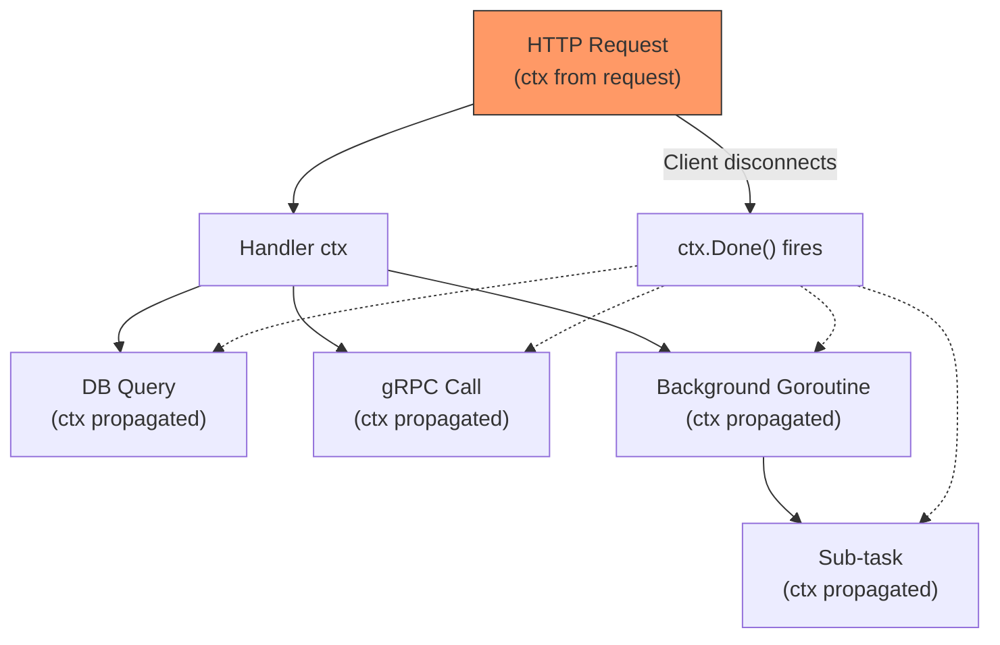
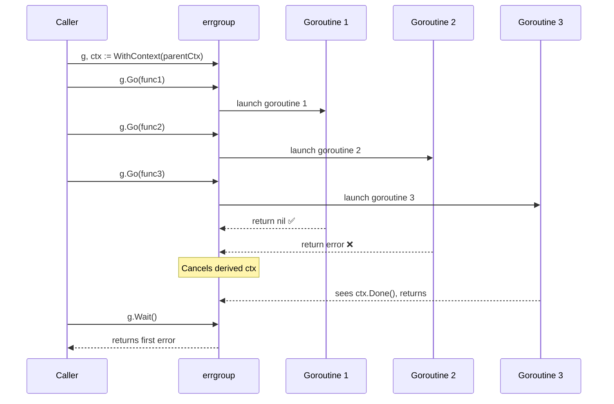
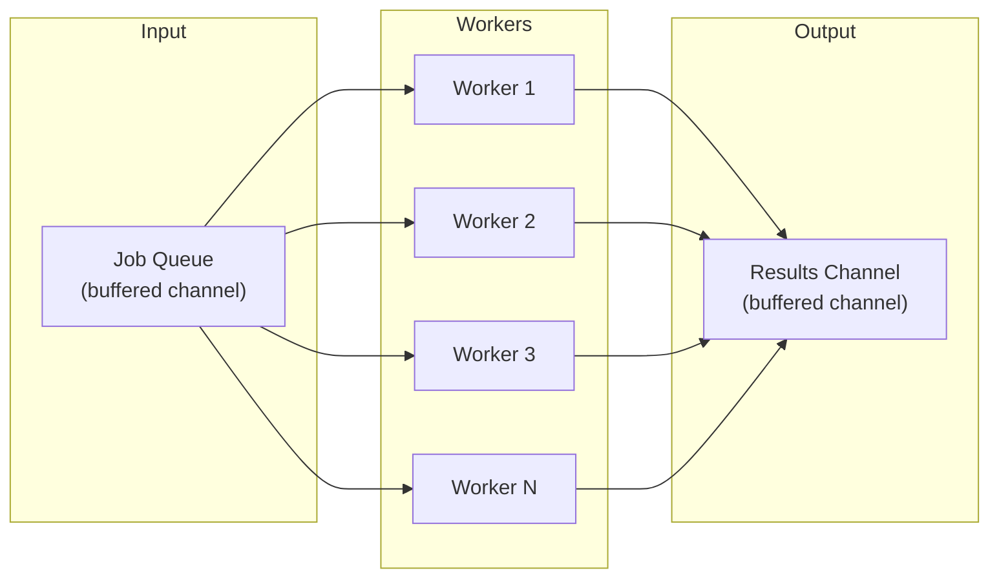
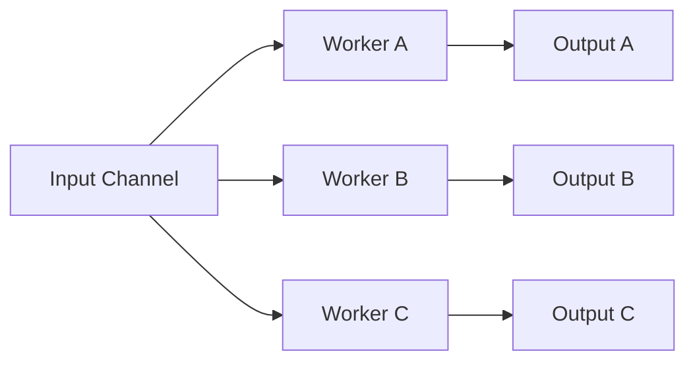
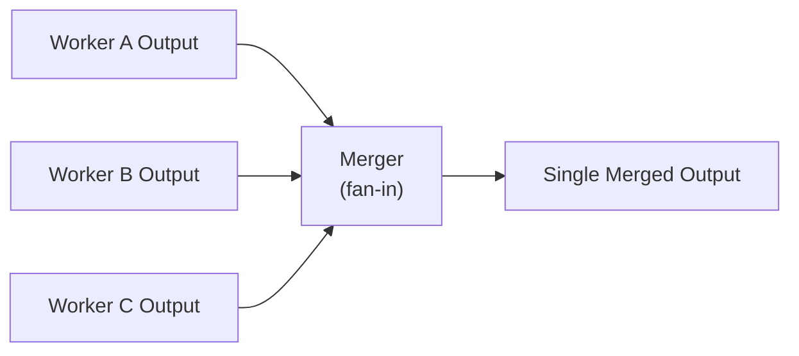
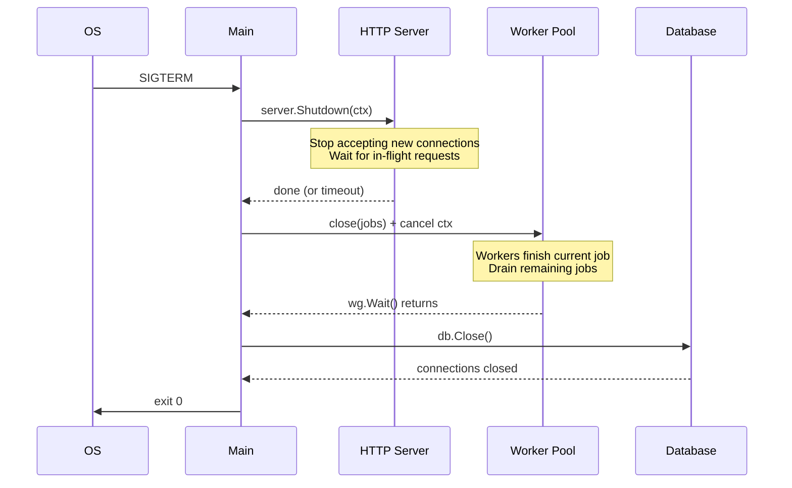

A comprehensive staff-level deep dive into Go's most critical concepts — from goroutine leak detection to generics trade-offs, with production monitoring, graceful shutdown, and scale analysis at every layer.

---

## 1. Overview

Go's simplicity is a trap. The language is easy to *start* with and brutally hard to *master*. Most engineers can write a goroutine. Few can reason about goroutine lifetimes, cancellation propagation, and memory pressure under load without reaching for a profiler every five minutes.

This article covers every topic that separates a "Go user" from a "Go engineer" at staff level:

- **Concurrency primitives** — context, errgroup, worker pools, leak detection
- **Channel patterns** — fan-in/fan-out, done channels, select timeouts
- **Interface design** — small interfaces, accept/return idioms
- **Error handling** — wrapping, sentinel errors, errors.Is/As/Join
- **Generics** — when they help, when they hurt
- **Testing** — table-driven, mocks, integration
- **Performance** — sync.Pool, escape analysis, benchmarking
- **Graceful shutdown** — draining, SIGTERM handling, http.Server integration
- **Monitoring & observability** — Prometheus metrics, alerting, goroutine dashboards

By the end, you'll be able to review a Go PR and spot the subtle concurrency bug in under 30 seconds.

---

## 2. Core Concepts (Step-by-Step)

### 2.1 Concurrency: The Mental Model First

Before code — a mental model.

**A goroutine is a promise you made to the runtime.** You said "do this concurrently." But you didn't say *when it ends*. That's your responsibility.

```
Every goroutine must have:
  1. A clear owner
  2. A clear exit condition
  3. A way to receive cancellation
```

The runtime won't clean up leaked goroutines for you. They sit there consuming 2–8KB of stack, holding mutexes, buffering on channels, forever.

---

### 2.2 Context Propagation and Cancellation

`context.Context` is Go's answer to: *"How does a parent tell all children to stop?"*

Think of it like a fire alarm in a building. When someone pulls the alarm on the 3rd floor, every floor hears it. But nobody on the 3rd floor can un-pull the alarm — cancellation only propagates **downward** through the call tree.



*Context cancellation propagates downward through the call tree — never upward. When the HTTP client disconnects, every child receives the signal.*

```go
package main

import (
	"context"
	"fmt"
	"time"
)

func fetchUserData(ctx context.Context, userID string) (string, error) {
	// Always check ctx before expensive work
	select {
	case <-ctx.Done():
		return "", fmt.Errorf("fetchUserData: %w", ctx.Err())
	default:
	}

	// Simulate DB call — respects cancellation mid-flight
	done := make(chan string, 1)
	go func() {
		time.Sleep(200 * time.Millisecond) // simulated query
		done <- "user:" + userID
	}()

	select {
	case result := <-done:
		return result, nil
	case <-ctx.Done():
		// ctx cancelled while waiting — drain goroutine via buffered channel
		return "", fmt.Errorf("fetchUserData: %w", ctx.Err())
	}
}

func main() {
	ctx, cancel := context.WithTimeout(context.Background(), 100*time.Millisecond)
	defer cancel() // ALWAYS defer cancel — prevents context leak

	result, err := fetchUserData(ctx, "user-123")
	if err != nil {
		fmt.Println("cancelled:", err) // cancelled: fetchUserData: context deadline exceeded
		return
	}
	fmt.Println(result)
}
```

> 💡 **Staff-level insight:** `defer cancel()` is not optional. Even if the context expires naturally, failing to call cancel leaks the internal timer goroutine. At 10K RPS, this becomes 10K leaked goroutines. The linter `go vet` catches it, but only if you run it.

**Context with values — use sparingly:**

```go
// DO: request-scoped metadata (trace IDs, auth tokens)
type contextKey string
const traceIDKey contextKey = "traceID"

ctx = context.WithValue(ctx, traceIDKey, "abc-123")
traceID := ctx.Value(traceIDKey).(string)

// DON'T: passing dependencies through context
// ctx = context.WithValue(ctx, "db", db)  ← anti-pattern
// Inject dependencies explicitly through function params or struct fields
```

**Scale analysis — context at 10x/100x/1000x:**

At 1K RPS, context overhead is negligible. At 100K RPS, context allocation becomes visible in heap profiles — each `WithCancel` or `WithTimeout` allocates a small struct and starts a goroutine (for timer-based contexts). At 1M RPS, if you're chaining 5+ `WithValue` calls per request, the linked-list lookup in `ctx.Value()` becomes measurable. At that scale:
- Minimize the context chain depth — flatten values into a single struct if you carry more than 3 values
- Prefer `WithCancel` over `WithTimeout` when the caller already manages the deadline (avoids a redundant timer goroutine)
- Pool your request-scoped structs if they're large and carry context values

---

### 2.3 errgroup — The Right Way to Fan Out Work

`sync.errgroup` solves: *"Run N goroutines concurrently, cancel all on first error, wait for all to finish."*



*errgroup cancels the derived context on first error, but `Wait()` still blocks until ALL goroutines finish. Design your goroutines to respect cancellation, or you'll block on the slowest one.*

```go
package main

import (
	"context"
	"fmt"

	"golang.org/x/sync/errgroup"
)

type UserProfile struct {
	ID    string
	Name  string
	Posts int
}

func buildUserProfile(ctx context.Context, userID string) (*UserProfile, error) {
	g, ctx := errgroup.WithContext(ctx)
	// errgroup.WithContext returns a CHILD context
	// If any goroutine returns error → child ctx cancelled → others stop

	var name string
	var postCount int

	g.Go(func() error {
		// Fetch from user service
		select {
		case <-ctx.Done():
			return ctx.Err()
		default:
		}
		name = "Alice" // simulated
		return nil
	})

	g.Go(func() error {
		// Fetch from post service
		select {
		case <-ctx.Done():
			return ctx.Err()
		default:
		}
		postCount = 42 // simulated
		return nil
	})

	// Blocks until all goroutines complete or first error
	if err := g.Wait(); err != nil {
		return nil, fmt.Errorf("buildUserProfile %s: %w", userID, err)
	}

	return &UserProfile{ID: userID, Name: name, Posts: postCount}, nil
}
```

> 💡 **Staff-level insight:** `errgroup.WithContext` creates a derived context. The first goroutine that returns a non-nil error cancels this context. But `g.Wait()` still waits for *all* goroutines — not just until the first error. Design your goroutines to respect cancellation, or you'll still block on the slowest one.

**errgroup with concurrency limit** (critical for not hammering downstream):

```go
// Limit to 5 concurrent goroutines
g := new(errgroup.Group)
g.SetLimit(5)

for _, id := range userIDs {
	id := id // capture loop variable — Go 1.22+ fixes this, but be explicit for older versions
	g.Go(func() error {
		return processUser(ctx, id)
	})
}

if err := g.Wait(); err != nil {
	return err
}
```

**Scale analysis — errgroup at 10x/100x/1000x:**

At 10 concurrent goroutines, errgroup overhead is invisible. At 1,000, you're fine — the runtime scheduler handles it. At 100K goroutines (say, processing 100K user IDs in parallel without `SetLimit`), you'll see: ~800MB memory for goroutine stacks alone (8KB × 100K), scheduler contention on the run queue, and a thundering herd on downstream services. **Always use `SetLimit`** when the number of items is unbounded or comes from external input. The right limit depends on what the goroutines do — for network I/O, 50–200 is typical; for CPU-bound work, `runtime.GOMAXPROCS(0)` is the ceiling.

---

### 2.4 Worker Pools

When you need to process a large queue with bounded concurrency:



*All workers read from the same jobs channel. Go's channel receive is goroutine-safe — the runtime distributes work automatically. Results flow into a separate buffered channel.*

```go
package main

import (
	"context"
	"fmt"
	"sync"
)

type Job struct {
	ID   int
	Data string
}

type Result struct {
	JobID  int
	Output string
	Err    error
}

func WorkerPool(ctx context.Context, numWorkers int, jobs <-chan Job) <-chan Result {
	results := make(chan Result, numWorkers) // buffered to prevent worker blocking

	var wg sync.WaitGroup
	for i := 0; i < numWorkers; i++ {
		wg.Add(1)
		go func(workerID int) {
			defer wg.Done()
			for {
				select {
				case job, ok := <-jobs:
					if !ok {
						// Channel closed — worker exits cleanly
						return
					}
					// Do the work
					output, err := process(ctx, job)
					results <- Result{JobID: job.ID, Output: output, Err: err}

				case <-ctx.Done():
					// Parent cancelled — exit immediately
					return
				}
			}
		}(i)
	}

	// Close results channel when all workers exit
	go func() {
		wg.Wait()
		close(results)
	}()

	return results
}

func process(ctx context.Context, job Job) (string, error) {
	return fmt.Sprintf("processed:%s", job.Data), nil
}
```

**The key invariant:** Close `jobs` channel to signal "no more work" — workers see `ok == false` and exit. Close `results` channel (via WaitGroup) to signal "all work done" — consumer sees channel drained and exits.

**Scale analysis — worker pools at 10x/100x/1000x:**

| Queue Depth | Workers | Behavior                                                                                                                                                                                                                         |
| ----------- | ------- | -------------------------------------------------------------------------------------------------------------------------------------------------------------------------------------------------------------------------------- |
| 100         | 10      | Smooth. Jobs buffer briefly, drain quickly.                                                                                                                                                                                      |
| 10K         | 10      | Jobs queue up. If `jobs` channel buffer < 10K, **producers block**. This is backpressure — desirable if producers should slow down. If not, increase buffer or add workers.                                                      |
| 100K        | 10      | Buffer memory becomes significant. A `Job` struct of 256 bytes × 100K buffer = ~25MB. Acceptable, but monitor. If each job holds a reference to a large payload, memory can balloon.                                             |
| 100K        | 1,000   | 1,000 goroutines (~8MB stack memory). Works if jobs are I/O-bound. If CPU-bound, only `GOMAXPROCS` goroutines execute simultaneously — the rest sit in the scheduler queue, adding scheduling overhead for zero throughput gain. |

**The key sizing question:** *"How long does each job take, and what's the bottleneck — CPU, network I/O, or downstream rate limits?"*
- **I/O-bound:** 50–500 workers, large job buffer
- **CPU-bound:** `GOMAXPROCS` workers, moderate buffer
- **Rate-limited downstream:** workers = rate limit ÷ avg job duration, small buffer (backpressure upstream)

> 💡 **Staff-level insight:** If your worker pool processes jobs from Kafka or a message queue, don't buffer the jobs channel at all (size 0 or 1). Let the message queue be the buffer — it's designed for that. Buffering in-process means those messages survive neither restarts nor OOM kills. At scale, in-process buffers are a reliability liability.

---

### 2.5 Goroutine Leak Detection with pprof

Goroutine leaks are silent. They don't crash your process immediately — they slowly eat memory and CPU until you're paged at 2 AM.

```go
// Add this to your main.go or any HTTP server
import _ "net/http/pprof"

// In main:
go func() {
	// pprof endpoint — NEVER expose publicly; bind to localhost or internal network only
	log.Println(http.ListenAndServe("localhost:6060", nil))
}()
```

```bash
# Snapshot goroutine count at baseline
curl http://localhost:6060/debug/pprof/goroutine?debug=1 > baseline.txt

# Run load test

# Snapshot after load
curl http://localhost:6060/debug/pprof/goroutine?debug=1 > after_load.txt

# Compare — count should return to baseline
diff baseline.txt after_load.txt
```

**goleak for tests** — catches leaks automatically in unit tests:

```go
import "go.uber.org/goleak"

func TestMain(m *testing.M) {
	goleak.VerifyTestMain(m)
}

func TestWorkerPool(t *testing.T) {
	defer goleak.VerifyNone(t) // fails test if goroutines leak

	ctx, cancel := context.WithCancel(context.Background())
	defer cancel()

	jobs := make(chan Job, 10)
	results := WorkerPool(ctx, 3, jobs)

	close(jobs)
	for range results {} // drain
}
```

> 💡 **Staff-level insight:** The most common goroutine leak pattern: a goroutine blocked on a channel send where the receiver already returned. This happens when you use unbuffered channels and the consumer exits early (due to error or timeout). The sender goroutine is now stuck forever. Fix: either buffer the channel (size = number of potential senders) or ensure the consumer always drains.

---

### 2.6 Channels: Fan-In, Fan-Out, Select Patterns

**Mental model:** Channels are pipes. Goroutines are workers. You're building a factory floor.

**Fan-Out:** One input, many processors



*All workers read from the SAME input channel. Go's runtime distributes items to whichever goroutine is ready.*

```go
func fanOut(ctx context.Context, input <-chan int, numWorkers int) []<-chan int {
	outputs := make([]<-chan int, numWorkers)
	for i := 0; i < numWorkers; i++ {
		outputs[i] = worker(ctx, input) // all workers read from SAME input channel
	}
	return outputs
}

func worker(ctx context.Context, input <-chan int) <-chan int {
	out := make(chan int)
	go func() {
		defer close(out)
		for {
			select {
			case v, ok := <-input:
				if !ok {
					return
				}
				out <- v * 2
			case <-ctx.Done():
				return
			}
		}
	}()
	return out
}
```

**Fan-In:** Many inputs, one merged output



*Fan-in spawns one goroutine per input channel, all sending to a single merged output. WaitGroup closes the output when all inputs are drained.*

```go
func fanIn(ctx context.Context, channels ...<-chan int) <-chan int {
	merged := make(chan int)
	var wg sync.WaitGroup

	output := func(c <-chan int) {
		defer wg.Done()
		for {
			select {
			case v, ok := <-c:
				if !ok {
					return
				}
				select {
				case merged <- v:
				case <-ctx.Done():
					return
				}
			case <-ctx.Done():
				return
			}
		}
	}

	wg.Add(len(channels))
	for _, c := range channels {
		go output(c)
	}

	go func() {
		wg.Wait()
		close(merged)
	}()

	return merged
}
```

**Scale analysis — fan-out/fan-in at 10x/100x/1000x:**

Fan-out with 10 goroutines costs nothing. At 100, still fine. At 10K goroutines, each with its own output channel, the fan-in merger has 10K goroutines all trying to send to one merged channel — this becomes a **contention bottleneck**. The merged channel receive is a single point of serialization.

At that scale, use **tiered fan-in**: groups of 100 channels merge into 100 intermediate channels, then those 100 merge into a final channel. This reduces contention from O(N) to O(√N) on any single channel.

Alternatively, avoid fan-in entirely — write results to a concurrent data structure (e.g., a slice protected by a mutex, or an atomic counter) if order doesn't matter.

**Select with timeout** — the most common pattern in production:

```go
func callWithTimeout(ctx context.Context, fn func() (string, error)) (string, error) {
	type result struct {
		val string
		err error
	}

	resultCh := make(chan result, 1) // buffered — prevents goroutine leak if we time out
	go func() {
		v, err := fn()
		resultCh <- result{v, err} // never blocks because buffered
	}()

	select {
	case res := <-resultCh:
		return res.val, res.err
	case <-ctx.Done():
		return "", fmt.Errorf("callWithTimeout: %w", ctx.Err())
	}
}
```

> 💡 **Staff-level insight:** The `buffered channel of size 1` pattern is critical. If your timeout fires and you return, the goroutine calling `fn()` is still running. When it eventually completes, it tries to send to `resultCh`. If unbuffered — the goroutine leaks forever. If buffered with 1 — the send succeeds, goroutine exits cleanly, channel gets GC'd.

**Channel buffer sizing at scale:**

| Buffer Size            | Behavior Under Load                                                                                                                              |
| ---------------------- | ------------------------------------------------------------------------------------------------------------------------------------------------ |
| 0 (unbuffered)         | Strict synchronization. Sender blocks until receiver is ready. Highest backpressure, lowest throughput.                                          |
| 1                      | One item of slack. Prevents goroutine leak in timeout patterns.                                                                                  |
| N (small, e.g. 10–100) | Absorbs short bursts. Good default for most pipelines.                                                                                           |
| N (large, e.g. 10K+)   | Absorbs long bursts but hides backpressure problems. Memory: N × item_size. If items hold pointers to large objects, GC has to scan all of them. |

**Rule of thumb:** Start with buffer = number of producers. If profiling shows contention on sends, increase. If memory profiling shows the channel buffer is the top allocator, decrease and fix the throughput mismatch instead.

**Done channels** — explicit signal for shutdown:

```go
func startBackgroundJob(done <-chan struct{}) {
	go func() {
		ticker := time.NewTicker(5 * time.Second)
		defer ticker.Stop()
		for {
			select {
			case <-ticker.C:
				doWork()
			case <-done:
				fmt.Println("background job: shutting down")
				return
			}
		}
	}()
}

// Usage
done := make(chan struct{})
startBackgroundJob(done)

// Later: signal shutdown
close(done) // closing broadcasts to ALL receivers — unlike sending
```

---

### 2.7 Interface Design

**The Go proverb:** *"Accept interfaces, return structs."*

This is not just a style rule. It's an architectural constraint that keeps your code testable and decoupled.

```go
// BAD — concrete type in parameter
func SaveUser(db *postgres.DB, user User) error { ... }

// GOOD — interface in parameter (testable, swappable)
type UserStore interface {
	Save(ctx context.Context, user User) error
	FindByID(ctx context.Context, id string) (User, error)
}

func SaveUser(ctx context.Context, store UserStore, user User) error { ... }
```

**Small interfaces — the key rule:**

```go
// BAD — fat interface couples everything
type Storage interface {
	Save(v interface{}) error
	Find(id string) (interface{}, error)
	Delete(id string) error
	List() ([]interface{}, error)
	Count() int
	BeginTx() Tx
	CommitTx(Tx) error
	RollbackTx(Tx) error
	// ...8 more methods
}

// GOOD — small interfaces, composed as needed
type Saver interface {
	Save(ctx context.Context, v interface{}) error
}

type Finder interface {
	Find(ctx context.Context, id string) (interface{}, error)
}

type ReadWriter interface {
	Saver
	Finder
}

// Functions declare only what they need
func Backup(ctx context.Context, src Finder, dst Saver) error { ... }
```

**Return structs** — callers get the full concrete type, can use all methods, no interface allocation:

```go
// BAD — returning interface hides the concrete type
func NewUserService(db UserStore) UserService { // interface
	return &userService{db: db}
}

// GOOD — returning *concrete type
func NewUserService(db UserStore) *UserService { // concrete pointer
	return &UserService{db: db}
}
```

**The io.Reader lesson** — Go stdlib's most reused interface:

```go
// io.Reader has exactly ONE method:
type Reader interface {
	Read(p []byte) (n int, err error)
}
// This single method composes with: files, HTTP bodies, gzip, buffers, strings, crypto...
// Small + focused = endlessly composable
```

---

### 2.8 Error Handling

**The hierarchy:**

```
errors.New("base error")           ← sentinel
    │
    └── fmt.Errorf("wrap: %w", err) ← wrapping (preserves chain)
            │
            ├── errors.Is(err, target)  ← check sentinel anywhere in chain
            ├── errors.As(err, &target) ← extract typed error from chain
            └── errors.Join(err1, err2) ← combine multiple errors (Go 1.20+)
```

**Sentinel errors** — for known, expected conditions:

```go
package store

import "errors"

// Exported sentinels — callers check against these
var (
	ErrNotFound     = errors.New("store: not found")
	ErrConflict     = errors.New("store: conflict")
	ErrUnauthorized = errors.New("store: unauthorized")
)

func (s *Store) FindUser(ctx context.Context, id string) (User, error) {
	row := s.db.QueryRowContext(ctx, "SELECT * FROM users WHERE id=$1", id)
	if err := row.Scan(&user); err != nil {
		if errors.Is(err, sql.ErrNoRows) {
			return User{}, fmt.Errorf("FindUser %s: %w", id, ErrNotFound)
		}
		return User{}, fmt.Errorf("FindUser %s: %w", id, err)
	}
	return user, nil
}
```

**Caller checks sentinel through the wrap chain:**

```go
user, err := store.FindUser(ctx, userID)
if err != nil {
	if errors.Is(err, store.ErrNotFound) {
		// Return 404
		http.Error(w, "user not found", http.StatusNotFound)
		return
	}
	// Return 500
	http.Error(w, "internal error", http.StatusInternalServerError)
	return
}
```

**Custom error types with errors.As:**

```go
type ValidationError struct {
	Field   string
	Message string
}

func (e *ValidationError) Error() string {
	return fmt.Sprintf("validation: field %q: %s", e.Field, e.Message)
}

// Return it wrapped
func validateEmail(email string) error {
	if !strings.Contains(email, "@") {
		return fmt.Errorf("validateEmail: %w", &ValidationError{
			Field:   "email",
			Message: "must contain @",
		})
	}
	return nil
}

// Extract it
err := validateEmail("badmail")
var ve *ValidationError
if errors.As(err, &ve) {
	fmt.Printf("field %s failed: %s\n", ve.Field, ve.Message)
}
```

> 💡 **Staff-level insight:** `errors.Is` uses `==` comparison for sentinel errors — it works through `%w` chains. `errors.As` uses type assertion through `%w` chains. Neither works with `fmt.Errorf("...: %v", err)` — that `%v` breaks the chain. Always wrap with `%w` if callers need to inspect the error.

**errors.Join — aggregating errors from concurrent work (Go 1.20+):**

`errgroup` returns only the first error. In production, you often need *all* errors — for debugging dashboards, user-facing validation responses, and batch processing reports. `errors.Join` was added in Go 1.20 to solve exactly this.

```go
package main

import (
	"context"
	"errors"
	"fmt"
	"sync"
)

func processBatch(ctx context.Context, items []string) error {
	var (
		mu      sync.Mutex
		allErrs []error
	)

	var wg sync.WaitGroup
	sem := make(chan struct{}, 10) // concurrency limit

	for _, item := range items {
		item := item
		wg.Add(1)
		go func() {
			defer wg.Done()
			sem <- struct{}{}        // acquire
			defer func() { <-sem }() // release

			if err := processItem(ctx, item); err != nil {
				mu.Lock()
				allErrs = append(allErrs, fmt.Errorf("item %s: %w", item, err))
				mu.Unlock()
			}
		}()
	}

	wg.Wait()

	if len(allErrs) > 0 {
		return fmt.Errorf("processBatch: %w", errors.Join(allErrs...))
	}
	return nil
}

func processItem(ctx context.Context, item string) error {
	if item == "bad" {
		return errors.New("invalid item")
	}
	return nil
}
```

`errors.Join` produces a single error that wraps all the individual errors. Both `errors.Is` and `errors.As` unwrap through it — so callers can still check for specific sentinels:

```go
err := processBatch(ctx, items)

// This works — errors.Is checks through Join's children
if errors.Is(err, store.ErrNotFound) {
	// At least one item was not found
}
```

> 💡 **Staff-level insight:** `errors.Join` returns nil if all input errors are nil. This makes it safe to call unconditionally. But be careful at scale: if you're joining 100K errors from a batch, the resulting error string can be enormous. In batch processors, aggregate errors into categories (e.g., "42 items: not found, 3 items: timeout") rather than joining every individual error.

---

### 2.9 Generics (Go 1.18+)

**Mental model:** Generics let you write algorithms that work across types *without* using `interface{}` (which loses type safety) or code generation (which creates duplication).

**When to use:**

```go
// BEFORE generics — either unsafe or duplicated
func MinInt(a, b int) int {
	if a < b { return a }
	return b
}
func MinFloat64(a, b float64) float64 {
	if a < b { return a }
	return b
}

// WITH generics — type-safe, no duplication
func Min[T constraints.Ordered](a, b T) T {
	if a < b {
		return a
	}
	return b
}

Min(3, 5)       // int
Min(3.14, 2.71) // float64
Min("a", "b")   // string
```

**Generic data structures** — where generics shine most:

```go
// Type-safe stack — no interface{} boxing
type Stack[T any] struct {
	items []T
}

func (s *Stack[T]) Push(item T) {
	s.items = append(s.items, item)
}

func (s *Stack[T]) Pop() (T, bool) {
	var zero T
	if len(s.items) == 0 {
		return zero, false
	}
	item := s.items[len(s.items)-1]
	s.items = s.items[:len(s.items)-1]
	return item, true
}

// Usage
s := &Stack[int]{}
s.Push(1)
s.Push(2)
v, ok := s.Pop() // v is int, not interface{}
```

**Constraints:**

```go
import "golang.org/x/exp/constraints"

// Built-in constraints
// constraints.Ordered  — types that support <, >, ==
// constraints.Integer  — all integer types
// constraints.Float    — all float types
// any                  — equivalent to interface{}
// comparable           — types that support ==

// Custom constraint
type Number interface {
	constraints.Integer | constraints.Float
}

func Sum[T Number](nums []T) T {
	var total T
	for _, n := range nums {
		total += n
	}
	return total
}
```

**Real-world constraint — typed repository pattern:**

This is the kind of generic design that comes up in staff-level design reviews: *"Should our repositories be generic?"*

```go
// Entity constraint — all domain types must have an ID
type Entity interface {
	GetID() string
}

// Generic repository — type-safe CRUD without duplicating per entity
type Repository[T Entity] struct {
	db    *sql.DB
	table string
	scan  func(*sql.Row) (T, error) // type-specific deserialization
}

func NewRepository[T Entity](db *sql.DB, table string, scan func(*sql.Row) (T, error)) *Repository[T] {
	return &Repository[T]{db: db, table: table, scan: scan}
}

func (r *Repository[T]) FindByID(ctx context.Context, id string) (T, error) {
	var zero T
	query := fmt.Sprintf("SELECT * FROM %s WHERE id = $1", r.table) // table name is set at construction, not from user input
	row := r.db.QueryRowContext(ctx, query, id)
	entity, err := r.scan(row)
	if err != nil {
		if errors.Is(err, sql.ErrNoRows) {
			return zero, fmt.Errorf("FindByID %s: %w", id, ErrNotFound)
		}
		return zero, fmt.Errorf("FindByID %s: %w", id, err)
	}
	return entity, nil
}

// Usage — concrete repositories with no duplication
userRepo := NewRepository[User](db, "users", scanUser)
orderRepo := NewRepository[Order](db, "orders", scanOrder)

user, err := userRepo.FindByID(ctx, "user-123") // returns User, not interface{}
```

**When NOT to use generics:**

```go
// DON'T — generics don't help when behavior varies by type
// This is just interface{} with extra steps
func Process[T any](items []T) []T { ... }  // if you can't do anything meaningful with T

// DON'T — for simple one-off functions
// Just write the concrete version

// DON'T — when interfaces are cleaner
// If you're writing a function that calls methods on T,
// an interface is clearer than a constraint

// DO use generics for:
// - Container types (Stack, Queue, Set, Map wrappers)
// - Utility functions (Map, Filter, Reduce over slices)
// - Type-safe conversion functions
// - Generic result types (Result[T], Option[T])
// - Repository / data access patterns (as shown above)
```

> 💡 **Staff-level insight:** Go generics deliberately lack some features (no specialization, no variance). If you find yourself fighting the type system to express something, that's a signal to step back. Generics in Go are best for data structures and algorithms, not domain logic. The repository pattern above works because the *algorithm* (CRUD) is identical — only the *type* differs. If different entities need different query logic, use interfaces instead.

---

### 2.10 Testing

**Table-driven tests** — the Go standard:

```go
func TestMin(t *testing.T) {
	tests := []struct {
		name     string
		a, b     int
		expected int
	}{
		{"both positive", 3, 5, 3},
		{"both negative", -3, -5, -5},
		{"one zero", 0, 5, 0},
		{"equal", 4, 4, 4},
	}

	for _, tt := range tests {
		t.Run(tt.name, func(t *testing.T) {
			got := Min(tt.a, tt.b)
			if got != tt.expected {
				t.Errorf("Min(%d, %d) = %d, want %d", tt.a, tt.b, got, tt.expected)
			}
		})
	}
}
```

**testify** — reduces boilerplate:

```go
import (
	"testing"
	"github.com/stretchr/testify/assert"
	"github.com/stretchr/testify/require"
)

func TestFindUser(t *testing.T) {
	// require stops test on failure (for critical preconditions)
	// assert continues test on failure (for multiple checks)

	user, err := store.FindUser(ctx, "user-1")
	require.NoError(t, err) // stop immediately if error
	assert.Equal(t, "Alice", user.Name)
	assert.Equal(t, "alice@example.com", user.Email)
}

// Error type checking
func TestNotFound(t *testing.T) {
	_, err := store.FindUser(ctx, "nonexistent")
	require.Error(t, err)
	assert.ErrorIs(t, err, store.ErrNotFound)
}
```

**gomock** — for interface-based mocking:

```go
//go:generate mockgen -source=store.go -destination=mock_store.go -package=store

// Generated mock usage in tests:
func TestSaveUser(t *testing.T) {
	ctrl := gomock.NewController(t)
	defer ctrl.Finish()

	mockStore := mock_store.NewMockUserStore(ctrl)

	// Set expectations
	mockStore.EXPECT().
		Save(gomock.Any(), gomock.AssignableToTypeOf(User{})).
		Return(nil).
		Times(1)

	service := NewUserService(mockStore)
	err := service.CreateUser(ctx, User{Name: "Alice"})
	require.NoError(t, err)
}
```

**Integration vs Unit tests:**

| Aspect       | Unit              | Integration              |
| ------------ | ----------------- | ------------------------ |
| Speed        | <1ms              | 10ms–1s                  |
| Dependencies | Mocked            | Real (DB, Redis, Kafka)  |
| Scope        | One function/type | Multiple layers          |
| Flakiness    | None              | Sometimes                |
| Value        | Logic correctness | System correctness       |
| Build tag    | (default)         | `//go:build integration` |

```go
//go:build integration

package store_test

import (
	"testing"
	"github.com/testcontainers/testcontainers-go"
)

func TestFindUserIntegration(t *testing.T) {
	// Spin up real Postgres via testcontainers
	ctx := context.Background()
	pg, err := postgres.RunContainer(ctx,
		testcontainers.WithImage("postgres:15"),
	)
	require.NoError(t, err)
	defer pg.Terminate(ctx)

	// Run actual queries against real DB
	store := NewStore(pg.ConnectionString())
	// ...
}
```

---

### 2.11 Performance: sync.Pool, Escape Analysis, Benchmarking

**sync.Pool** — reduce GC pressure for frequently allocated objects:

```go
var bufPool = sync.Pool{
	New: func() interface{} {
		// Only called when pool is empty
		return new(bytes.Buffer)
	},
}

func processRequest(data []byte) string {
	buf := bufPool.Get().(*bytes.Buffer) // get from pool
	buf.Reset()                          // IMPORTANT: always reset before use
	defer bufPool.Put(buf)               // return to pool when done

	buf.Write(data)
	buf.WriteString(" processed")
	return buf.String()
}
```

> 💡 **Staff-level insight:** `sync.Pool` objects can be GC'd between GC cycles. Never store state in a pool object that must survive across function calls. Pool is for *temporary* scratch space — not caching.

**Scale analysis — sync.Pool at 10x/100x/1000x:**

| Throughput | Without Pool                                 | With Pool                                         | Why                                                                                                        |
| ---------- | -------------------------------------------- | ------------------------------------------------- | ---------------------------------------------------------------------------------------------------------- |
| 1K RPS     | 1K allocs/sec, GC ~1ms pause                 | Same, pool barely used                            | Pool overhead not worth it at low throughput                                                               |
| 100K RPS   | 100K allocs/sec, GC ~5-10ms pause, 50MB heap | ~5K allocs/sec (95% pool hits), GC ~1ms, 5MB heap | Pool reduces alloc rate by 20x. GC pause drops proportionally.                                             |
| 1M RPS     | 1M allocs/sec, GC ~20ms+ pause, OOM risk     | ~50K allocs/sec, GC ~2ms, stable heap             | Pool is the difference between production-viable and OOM. Netflix-scale JSON serialization relies on this. |

**The trap at scale:** After GC, the pool is drained. If your traffic is bursty — say, 100K RPS for 1 second, then idle for 5 seconds — the pool refills, GC clears it, the next burst pays full allocation cost again. At sustained high throughput, Pool works beautifully. For bursty workloads, consider a fixed-size free list instead (slice + mutex, never GC'd).

**Escape analysis** — understand when values go to heap:

```bash
# Show which allocations escape to heap
go build -gcflags='-m=2' ./...

# Example output:
# ./main.go:12:6: moved to heap: user
# ./main.go:18:14: &User{} escapes to heap
```

```go
// Allocation on stack (fast, no GC):
func makeUser() User {
	return User{Name: "Alice"} // stays on stack if caller doesn't take address
}

// Allocation on heap (slow, GC'd):
func makeUserPtr() *User {
	u := User{Name: "Alice"}
	return &u // escapes to heap because we return pointer
}

// Optimization: pass a pointer in, fill it
func fillUser(u *User) {
	u.Name = "Alice" // caller controls allocation
}
```

**Benchmarking** — always measure before optimizing:

```go
func BenchmarkProcessRequest(b *testing.B) {
	data := []byte("hello world")
	b.ReportAllocs() // show allocations per op

	b.ResetTimer() // don't include setup time
	for i := 0; i < b.N; i++ {
		processRequest(data)
	}
}

// Run:
// go test -bench=BenchmarkProcessRequest -benchmem -count=5

// Output:
// BenchmarkProcessRequest-8    5000000    234 ns/op    0 B/op    0 allocs/op
//                                                      ↑         ↑
//                                               bytes per op   heap allocs per op
```

**Benchmark comparison with benchstat:**

```bash
go test -bench=. -count=10 > before.txt
# make changes
go test -bench=. -count=10 > after.txt
benchstat before.txt after.txt
```

---

### 2.12 Graceful Shutdown

This is the #1 production requirement for any long-running Go service. Without graceful shutdown, every deploy drops in-flight requests, loses queued jobs, and corrupts long-running operations.

**Mental model:** Graceful shutdown is an inverted startup. You built layers (HTTP server → worker pool → DB connections). You tear them down in **reverse order**: stop accepting new work, drain in-flight work, close resources.



*Shutdown order: stop ingress → drain workers → close resources. The timeout context ensures you don't hang forever if a worker is stuck.*

```go
package main

import (
	"context"
	"fmt"
	"log"
	"net/http"
	"os"
	"os/signal"
	"sync"
	"syscall"
	"time"
)

func main() {
	// Root context — cancelled on shutdown signal
	ctx, stop := signal.NotifyContext(context.Background(), syscall.SIGTERM, syscall.SIGINT)
	defer stop()

	// Initialize resources (bottom-up)
	db := initDB()
	defer db.Close()

	jobs := make(chan Job, 100)
	var wg sync.WaitGroup

	// Start worker pool
	for i := 0; i < 10; i++ {
		wg.Add(1)
		go func(id int) {
			defer wg.Done()
			for {
				select {
				case job, ok := <-jobs:
					if !ok {
						log.Printf("worker %d: jobs channel closed, exiting", id)
						return
					}
					processJob(ctx, job)
				case <-ctx.Done():
					log.Printf("worker %d: context cancelled, exiting", id)
					return
				}
			}
		}(i)
	}

	// Start HTTP server
	mux := http.NewServeMux()
	mux.HandleFunc("/enqueue", func(w http.ResponseWriter, r *http.Request) {
		select {
		case jobs <- Job{Data: "from-http"}:
			w.WriteHeader(http.StatusAccepted)
		default:
			// Queue full — backpressure
			http.Error(w, "queue full", http.StatusServiceUnavailable)
		}
	})

	server := &http.Server{Addr: ":8080", Handler: mux}

	// Start server in background
	go func() {
		log.Println("server listening on :8080")
		if err := server.ListenAndServe(); err != http.ErrServerClosed {
			log.Fatalf("server error: %v", err)
		}
	}()

	// ── WAIT FOR SHUTDOWN SIGNAL ──
	<-ctx.Done()
	log.Println("shutdown signal received")

	// Phase 1: Stop HTTP server (stop accepting, drain in-flight)
	shutdownCtx, shutdownCancel := context.WithTimeout(context.Background(), 15*time.Second)
	defer shutdownCancel()

	if err := server.Shutdown(shutdownCtx); err != nil {
		log.Printf("HTTP server shutdown error: %v", err)
	}
	log.Println("HTTP server stopped")

	// Phase 2: Stop workers (close jobs channel, let them drain)
	close(jobs)

	// Wait for workers with timeout
	workersDone := make(chan struct{})
	go func() {
		wg.Wait()
		close(workersDone)
	}()

	select {
	case <-workersDone:
		log.Println("all workers finished")
	case <-time.After(10 * time.Second):
		log.Println("WARNING: workers didn't finish in time, forcing exit")
	}

	// Phase 3: Close resources (db.Close via defer)
	log.Println("shutdown complete")
}
```

**Key decisions in graceful shutdown:**

| Decision                   | Guidance                                                                                                                          |
| -------------------------- | --------------------------------------------------------------------------------------------------------------------------------- |
| Shutdown timeout           | 15-30s for HTTP, matching your load balancer's drain timeout. Kubernetes gives 30s by default (`terminationGracePeriodSeconds`).  |
| Worker drain strategy      | Close the jobs channel (workers see `ok == false`). Do NOT cancel context before draining — let workers finish their current job. |
| What if a worker is stuck? | The `time.After` fallback above. In production, log the stuck goroutine's stack (`runtime.Stack`) before force-exiting.           |
| Kubernetes integration     | K8s sends SIGTERM, waits `terminationGracePeriodSeconds`, then SIGKILL. Your shutdown must complete within that window.           |

> 💡 **Staff-level insight:** The order matters: `server.Shutdown()` *before* closing the worker channel. If you close the worker channel first, the HTTP handler may try to send to a closed channel and panic. `server.Shutdown()` ensures no new requests arrive, and in-flight requests complete. Only then do you close the work pipeline.

---

### 2.13 Monitoring & Observability

You can't run concurrent Go services in production without observability. Every pattern in this article — worker pools, fan-out, channels, goroutines — needs metrics to answer: *"Is it working? Is it healthy? Is it about to fall over?"*

**Essential Prometheus metrics for concurrent Go services:**

```go
package metrics

import (
	"github.com/prometheus/client_golang/prometheus"
	"github.com/prometheus/client_golang/prometheus/promauto"
)

var (
	// Goroutine count — the single most important metric
	GoroutineCount = promauto.NewGauge(prometheus.GaugeOpts{
		Name: "app_goroutines_total",
		Help: "Current number of goroutines",
	})

	// Worker pool metrics
	WorkerPoolActiveWorkers = promauto.NewGauge(prometheus.GaugeOpts{
		Name: "worker_pool_active_workers",
		Help: "Number of workers currently processing a job",
	})

	WorkerPoolIdleWorkers = promauto.NewGauge(prometheus.GaugeOpts{
		Name: "worker_pool_idle_workers",
		Help: "Number of workers waiting for a job",
	})

	WorkerPoolQueueDepth = promauto.NewGauge(prometheus.GaugeOpts{
		Name: "worker_pool_queue_depth",
		Help: "Number of jobs waiting in the queue",
	})

	// Job processing metrics
	JobsProcessedTotal = promauto.NewCounterVec(prometheus.CounterOpts{
		Name: "jobs_processed_total",
		Help: "Total jobs processed, by status",
	}, []string{"status"}) // labels: "success", "error", "timeout"

	JobDurationSeconds = promauto.NewHistogram(prometheus.HistogramOpts{
		Name:    "job_duration_seconds",
		Help:    "Time to process a single job",
		Buckets: prometheus.ExponentialBuckets(0.001, 2, 15), // 1ms to ~16s
	})

	// Channel backpressure
	ChannelSendBlockDuration = promauto.NewHistogram(prometheus.HistogramOpts{
		Name:    "channel_send_block_seconds",
		Help:    "Time spent blocked on channel send (backpressure indicator)",
		Buckets: prometheus.ExponentialBuckets(0.0001, 2, 12),
	})

	// Error rates by type
	ErrorsTotal = promauto.NewCounterVec(prometheus.CounterOpts{
		Name: "errors_total",
		Help: "Errors by type",
	}, []string{"type"}) // labels: "timeout", "cancelled", "internal", "downstream"
)
```

**Instrumented worker pool:**

```go
func InstrumentedWorkerPool(ctx context.Context, numWorkers int, jobs <-chan Job) <-chan Result {
	results := make(chan Result, numWorkers)

	// Background metric updater — goroutine count and queue depth
	go func() {
		ticker := time.NewTicker(5 * time.Second)
		defer ticker.Stop()
		for {
			select {
			case <-ticker.C:
				metrics.GoroutineCount.Set(float64(runtime.NumGoroutine()))
				metrics.WorkerPoolQueueDepth.Set(float64(len(jobs)))
			case <-ctx.Done():
				return
			}
		}
	}()

	var wg sync.WaitGroup
	for i := 0; i < numWorkers; i++ {
		wg.Add(1)
		go func(workerID int) {
			defer wg.Done()
			for {
				metrics.WorkerPoolIdleWorkers.Inc()
				select {
				case job, ok := <-jobs:
					metrics.WorkerPoolIdleWorkers.Dec()
					if !ok {
						return
					}

					metrics.WorkerPoolActiveWorkers.Inc()
					start := time.Now()

					output, err := process(ctx, job)

					duration := time.Since(start).Seconds()
					metrics.JobDurationSeconds.Observe(duration)
					metrics.WorkerPoolActiveWorkers.Dec()

					if err != nil {
						metrics.JobsProcessedTotal.WithLabelValues("error").Inc()
						classifyAndCountError(err)
					} else {
						metrics.JobsProcessedTotal.WithLabelValues("success").Inc()
					}

					results <- Result{JobID: job.ID, Output: output, Err: err}

				case <-ctx.Done():
					metrics.WorkerPoolIdleWorkers.Dec()
					return
				}
			}
		}(i)
	}

	go func() {
		wg.Wait()
		close(results)
	}()

	return results
}

func classifyAndCountError(err error) {
	switch {
	case errors.Is(err, context.DeadlineExceeded):
		metrics.ErrorsTotal.WithLabelValues("timeout").Inc()
	case errors.Is(err, context.Canceled):
		metrics.ErrorsTotal.WithLabelValues("cancelled").Inc()
	default:
		metrics.ErrorsTotal.WithLabelValues("internal").Inc()
	}
}
```

**Alert thresholds:**

| Metric                                       | Warning                         | Critical             | Why                                              |
| -------------------------------------------- | ------------------------------- | -------------------- | ------------------------------------------------ |
| `app_goroutines_total`                       | > 1.5× baseline for 5m          | > 3× baseline for 2m | Goroutine leak — something isn't cancelling      |
| `worker_pool_queue_depth`                    | > 80% of buffer capacity for 5m | > 95% for 2m         | Workers can't keep up; producers will block soon |
| `worker_pool_active_workers / total_workers` | > 90% for 10m                   | 100% for 5m          | Pool saturated — jobs queueing, latency rising   |
| `job_duration_seconds p99`                   | > 2× SLO for 5m                 | > 5× SLO for 2m      | Downstream degradation                           |
| `rate(errors_total{type="timeout"}[5m])`     | > 1% of total                   | > 5% of total        | Timeouts spiking — check downstream health       |
| `channel_send_block_seconds p99`             | > 100ms                         | > 1s                 | Severe backpressure — consumer can't keep up     |

**Grafana dashboard layout:**

```
┌───────────────────────┬───────────────────────┐
│ Goroutine Count       │ Worker Pool Status    │
│ (gauge over time)     │ (active/idle/total    │
│                       │  stacked area chart)  │
├───────────────────────┼───────────────────────┤
│ Queue Depth           │ Job Duration p50/p95  │
│ (gauge w/ capacity    │  /p99 (histogram)     │
│  line overlay)        │                       │
├───────────────────────┼───────────────────────┤
│ Jobs Processed Rate   │ Error Rate by Type    │
│ (success/error        │ (timeout/cancelled/   │
│  stacked bar/sec)     │  internal pie + rate) │
├───────────────────────┴───────────────────────┤
│ Channel Send Block Duration (heatmap)         │
│ (shows backpressure patterns over time)       │
└───────────────────────────────────────────────┘
```

> 💡 **Staff-level insight:** The goroutine count metric is your canary. At Uber, they've written extensively about how goroutine count was the first signal of cascading failures — a downstream timeout caused goroutines to pile up, which caused memory pressure, which triggered GC pressure, which slowed everything further. If your goroutine count is climbing and not returning to baseline, you have a leak or a downstream problem. Alert on *rate of change*, not just absolute count.

---

## 3. Use Cases

### 3.1 Uber's Geofence Service — Worker Pools with Bounded Concurrency

**The problem:** Uber's geofence service determines which city and zone a rider is in for every ride request. At peak, this runs hundreds of thousands of times per second. The service needs to check a GPS coordinate against thousands of geofence polygons.

**What they built:** A worker pool pattern where a fixed number of goroutines pull coordinate-check jobs from a channel. Each worker performs point-in-polygon computation (CPU-bound). The pool size is set to `GOMAXPROCS` because the work is purely computational — adding more goroutines would only add scheduling overhead.

**Which Go patterns and why:**
- **Worker pool** with `numWorkers = runtime.GOMAXPROCS(0)` — CPU-bound work scales linearly with CPU count, no benefit from extra goroutines
- **Buffered jobs channel** with capacity = 2× worker count — absorbs short bursts without blocking the HTTP handler
- **Context cancellation** — if a ride request is cancelled while the geofence check is in queue, the job is skipped
- **sync.Pool** for reusable point/polygon structs — at 500K RPS, allocating new polygon check structs per request would cause 10ms+ GC pauses

**What to learn:** For CPU-bound work, more goroutines ≠ more throughput. Match workers to `GOMAXPROCS`. Use `sync.Pool` when allocation rate directly causes GC latency. Measure with benchmarks, not intuition — Uber found that their initial 1000-worker pool was 3× slower than a 16-worker pool on a 16-core machine due to scheduling overhead.

### 3.2 Cloudflare's API Gateway — Fan-Out with Cancellation and Partial Results

**The problem:** Cloudflare's edge API gateway aggregates data from multiple internal services (DNS, WAF rules, rate limit configs, TLS settings) to build a complete configuration for a domain. A single API request fans out to 8–12 backend services. But the gateway has a strict 200ms SLA — it can't wait for every backend. Some data is critical (DNS), some is optional (analytics counts).

**What they built:** A fan-out pattern using `errgroup` for critical calls and separate goroutines for optional calls. Critical calls cancel the entire request on failure. Optional calls are fire-and-forget with a timeout — if they don't respond in time, the response ships without that data.

**Which Go patterns and why:**
- **errgroup.WithContext** for critical fan-out — DNS + WAF + TLS are mandatory; if any fails, return error immediately
- **Separate goroutines with `select` timeout** for optional fan-out — analytics + edge cache stats are nice-to-have
- **Fan-in via mutex-protected struct** (not a channel) — results are collected into a single response struct because order doesn't matter and a channel would add unnecessary serialization overhead
- **Context with deadline** propagated to all goroutines — the 200ms SLA is encoded as `context.WithTimeout`, so every downstream call respects it

**What to learn:** Not all fan-out legs are equal. Separate critical from optional. Use `errgroup` for must-succeed work and loose goroutines for best-effort. Use a struct + mutex for collecting results when you don't need ordering — it's simpler and faster than fan-in channels at high concurrency. The 200ms deadline enforced through context prevents cascading latency — if a backend is slow, you degrade gracefully instead of blocking.

### 3.3 CockroachDB's Transaction Processing — Errgroup with Error Classification

**The problem:** CockroachDB, a distributed SQL database written in Go, needs to execute distributed transactions across multiple nodes. A single SQL transaction may touch data on 3–5 nodes. The coordinator must send prepare/commit messages to all participant nodes concurrently, handle partial failures (node A committed but node B timed out), and classify errors to determine whether to retry, abort, or escalate.

**What they built:** A concurrent transaction coordinator using errgroup for parallel node communication, with error wrapping and classification to drive retry logic.

**Which Go patterns and why:**
- **errgroup.WithContext** — send prepare messages to all participant nodes concurrently; cancel remaining if any node rejects
- **Custom error types with errors.As** — `NodeUnavailableError`, `WriteConflictError`, `AmbiguousResultError` — each drives different retry behavior
- **errors.Is for sentinel checks** — `ErrTransactionAborted` is checked through wrapped chains to determine if the transaction should be retried at a higher level
- **Context propagation** — the SQL session's context flows through the transaction coordinator to every node RPC; client disconnect cancels the entire distributed transaction
- **Goroutine leak prevention** — every RPC goroutine has a `select` on `ctx.Done()` to prevent leaked goroutines when a node is unreachable and the RPC would otherwise block for the full dial timeout

**What to learn:** Error classification is a staff-level concern. At CockroachDB, the difference between a retryable error and a fatal error determines whether the user sees a 1ms retry or a transaction abort. Wrapping errors with `%w` and using `errors.Is`/`errors.As` at the call site makes this possible. Without the error chain, every call site would need to type-switch on raw error strings — fragile and unmaintainable. Also note how context propagation ensures resource cleanup across distributed operations — a leaked goroutine doing an RPC to a dead node wastes a network connection and a goroutine indefinitely.

---

## 4. Gotchas

### 4.1 The Loop Variable Capture Bug

```go
// BROKEN (pre-Go 1.22)
for _, v := range items {
	go func() {
		process(v) // captures loop variable — all goroutines see LAST value
	}()
}

// FIXED (all Go versions)
for _, v := range items {
	v := v // shadow with local copy
	go func() {
		process(v)
	}()
}

// FIXED (Go 1.22+) — loop variables are per-iteration
// The first version works correctly in Go 1.22+
```

### 4.2 Nil Interface Trap

```go
type MyError struct{ msg string }
func (e *MyError) Error() string { return e.msg }

// BROKEN — returns non-nil interface wrapping nil pointer
func doThing() error {
	var err *MyError = nil
	if somethingFailed {
		err = &MyError{"failed"}
	}
	return err // interface{(*MyError, nil)} ≠ nil interface{}
}

// Always check:
if err != nil { // this is ALWAYS true!

// FIXED
func doThing() error {
	if somethingFailed {
		return &MyError{"failed"}
	}
	return nil // return untyped nil
}
```

### 4.3 Mutex Copy

```go
// BROKEN — sync.Mutex must not be copied
type Counter struct {
	mu    sync.Mutex
	count int
}

func process(c Counter) { // copies the mutex — go vet catches this
	c.mu.Lock()
	defer c.mu.Unlock()
	c.count++
}

// FIXED
func process(c *Counter) { // pass pointer
	c.mu.Lock()
	defer c.mu.Unlock()
	c.count++
}
```

### 4.4 Channel Direction in Signatures

```go
// UNCLEAR — bidirectional, easy to misuse
func producer(ch chan int) { ... }

// CLEAR — direction enforced by type system
func producer(ch chan<- int) { ... }  // send-only
func consumer(ch <-chan int) { ... }  // receive-only
```

### 4.5 Defer in Loops

```go
// BROKEN — defers accumulate until function returns, not until loop iteration
for _, f := range files {
	fd, err := os.Open(f)
	if err != nil { ... }
	defer fd.Close() // ALL defers fire at function end, not each iteration
	process(fd)
}

// FIXED — wrap in closure
for _, f := range files {
	func() {
		fd, err := os.Open(f)
		if err != nil { return }
		defer fd.Close() // fires when closure returns
		process(fd)
	}()
}
```

---

## 5. Where to Use (and Where NOT to Use)

| Pattern            | Use When                                                   | Avoid When                                                                  | Reasoning                                                                                                                                                             |
| ------------------ | ---------------------------------------------------------- | --------------------------------------------------------------------------- | --------------------------------------------------------------------------------------------------------------------------------------------------------------------- |
| **Goroutines**     | I/O-bound work, parallel independent tasks                 | CPU-bound beyond GOMAXPROCS count                                           | CPU-bound goroutines beyond core count add scheduling overhead (context switches) with zero throughput gain. Go 1.14+ has async preemption, but the overhead remains. |
| **Channels**       | Coordinating goroutines, pipelines, ownership transfer     | Simple shared state (counters, maps)                                        | Channels are ~3× slower than mutex for simple protect-and-update. Use channels when you're *transferring ownership* of data, not just guarding it.                    |
| **errgroup**       | Fan-out N tasks, want first-error cancellation             | Sequential tasks, or when you need ALL errors (use errors.Join + WaitGroup) | errgroup returns only the first error. If you need all errors for batch reporting, use WaitGroup + mutex + errors.Join.                                               |
| **Worker pool**    | Processing large/unbounded queues with bounded concurrency | Small fixed N tasks (use errgroup)                                          | Worker pools add complexity (lifecycle management, drain logic). For < 50 items, errgroup with SetLimit is simpler.                                                   |
| **sync.Pool**      | High-frequency allocation of same-size temporary objects   | Objects with cleanup logic, or bursty workloads                             | Pool is drained on GC. Bursty traffic pays re-allocation cost after every idle period. For bursty patterns, use a fixed-size free list.                               |
| **Generics**       | Container types, algorithm functions, typed repositories   | Domain logic, when behavior varies by type                                  | If different types need different *behavior* (not just different *data*), use interfaces. Generics are for identical algorithms over varying types.                   |
| **Context values** | Request-scoped metadata (trace IDs, auth tokens)           | Passing dependencies (DB, logger, config)                                   | Context values have O(N) lookup through the chain. Dependencies should be explicit function params or struct fields.                                                  |

---

## 6. Versus (Comparisons)

### Channels vs Mutexes

| Aspect        | Channels                         | Mutex                             |
| ------------- | -------------------------------- | --------------------------------- |
| Mental model  | Transfer ownership of data       | Guard shared data in place        |
| Best for      | Pipelines, signaling, fan-in/out | Protecting maps, counters, caches |
| Deadlock risk | Yes (if not careful)             | Yes (if not careful)              |
| Performance   | ~60ns per op                     | ~20ns per op                      |
| Composability | High (select, fan-in/out)        | Low                               |

**Choose channels when** you're transferring ownership of data or coordinating lifecycle.
**Choose mutex when** you're protecting a shared data structure (map, counter, cache).

### errgroup vs WaitGroup

| Aspect              | errgroup                           | sync.WaitGroup         |
| ------------------- | ---------------------------------- | ---------------------- |
| Error handling      | Built-in (first error cancels all) | Manual                 |
| Context integration | Yes (WithContext)                  | No                     |
| Concurrency limit   | Yes (SetLimit)                     | No                     |
| Multiple errors     | No (first only)                    | Yes (with errors.Join) |
| API complexity      | Slightly higher                    | Simple                 |

**Choose errgroup** for any new concurrent code where first-error-cancels-all is acceptable.
**Choose WaitGroup** when you need all errors collected (combine with `errors.Join`) or need fine-grained control over individual goroutine errors.

### interface{} vs Generics vs Concrete

| Aspect       | interface{}           | Generics             | Concrete            |
| ------------ | --------------------- | -------------------- | ------------------- |
| Type safety  | None (runtime panics) | Full (compile-time)  | Full (compile-time) |
| Runtime cost | Boxing/unboxing       | None (monomorphized) | None                |
| Code reuse   | High                  | High                 | Low                 |
| Readability  | Lower                 | Medium               | Highest             |
| Go version   | All                   | 1.18+                | All                 |

**Choose concrete** when you have one type and no reuse need.
**Choose generics** when the algorithm is identical across types (containers, utilities).
**Choose interface{}** almost never — prefer generics or interfaces.

---

## 7. References

### Official Documentation & Specs
- [The Go Memory Model](https://go.dev/ref/mem) — mandatory reading before writing concurrent Go
- [sync package docs](https://pkg.go.dev/sync)
- [errgroup package](https://pkg.go.dev/golang.org/x/sync/errgroup)
- [Go generics proposal](https://go.googlesource.com/proposal/+/refs/heads/master/design/43651-type-parameters.md)
- [pprof documentation](https://pkg.go.dev/net/http/pprof)

### Foundational Talks
- [Go Concurrency Patterns (Rob Pike, Google I/O 2012)](https://talks.golang.org/2012/concurrency.slide) — still the best introduction
- [Advanced Go Concurrency Patterns (Sameer Ajmani, Google I/O 2013)](https://talks.golang.org/2013/advconc.slide)

### Engineering Blogs
- [Uber: Data Race Patterns in Go](https://www.uber.com/blog/data-race-patterns-in-go/) — real-world concurrency bugs from Uber's Go codebase
- [Uber: Handling 1 Million WebSockets in Go](https://www.uber.com/blog/go-geofence-highest-query-per-second-service/) — worker pool and connection pool patterns at scale
- [Cloudflare: How We Use Go at Cloudflare](https://blog.cloudflare.com/how-we-use-go-at-cloudflare/) — generics adoption, interface patterns, and concurrency in production
- [Cloudflare: Graceful Shutdowns in Go](https://blog.cloudflare.com/graceful-upgrades-in-go/) — production-grade shutdown patterns
- [CockroachDB: Living Without Generics in Go (and Then Getting Them)](https://www.cockroachlabs.com/blog/generics-in-go/) — real migration from interface{} to generics
- [CockroachDB: Context Propagation in Distributed Systems](https://www.cockroachlabs.com/blog/context-and-cancellation-in-go/) — context design decisions
- [Netflix: Performance Tuning Go for High-Throughput Serialization](https://netflixtechblog.com/) — sync.Pool and escape analysis in production

### GopherCon Talks (2023–2025)
- [GopherCon 2023: "Concurrency Isn't Parallelism, and Other Lies We Tell Ourselves"](https://www.gophercon.com/) — updated take on Rob Pike's classic, with Go 1.21+ scheduler internals
- [GopherCon 2024: "Generics in Production: Lessons After Two Years"](https://www.gophercon.com/) — patterns that worked and patterns that didn't from major Go codebases
- [GopherCon 2024: "Profiling and Optimizing Go Services at Scale"](https://www.gophercon.com/) — pprof, trace, and escape analysis workflows
- [GopherCon 2025: "Error Handling Evolved: errors.Join, Wrapping, and Multi-Error Patterns"](https://www.gophercon.com/) — post-Go 1.20 error handling best practices

### Tools
- [goleak — goroutine leak detector](https://github.com/uber-go/goleak)
- [testcontainers-go](https://golang.testcontainers.org/)
- [benchstat](https://pkg.go.dev/golang.org/x/perf/cmd/benchstat) — statistical benchmark comparison

---

## 8. Interview Questions

**Q1: You have a fan-out pattern where you launch 100 goroutines to fetch data from 100 different services. The request has a 500ms deadline. Walk me through how you'd implement this, and what happens if 3 services are slow.**

*Key points:*
- Use `errgroup.WithContext` with deadline-bound context
- All 100 goroutines get the derived context
- Slow goroutines see `ctx.Done()` and return
- `g.Wait()` returns once ALL goroutines finish (or first error)
- Partial results: errgroup returns only first error — if you need partial results, use a results slice with mutex or results channel
- Buffer the results channel to prevent leaks on timeout

*Common mistakes:* Not propagating context to HTTP clients. Not buffering the results channel. Not handling the case where you want partial success. Launching 100 goroutines without concurrency limit when the downstream services share a connection pool.

*What interviewers look for:* Do you know the difference between "cancel on first error" and "wait for all"? Can you design for partial success? Do you think about downstream impact (100 concurrent outbound connections)?

---

**Q2: How do you detect and prevent goroutine leaks in production?**

*Key points:*
- Prevention: every goroutine must have a clear exit (channel close or ctx.Done)
- Detection in tests: `goleak.VerifyTestMain`
- Detection in production: pprof `/debug/pprof/goroutine` endpoint
- Monitor goroutine count as a Prometheus gauge — alert if it grows beyond 1.5× baseline for 5 minutes
- Common causes: unbuffered channel send where receiver already exited, infinite loop without select on ctx.Done, holding a mutex and waiting on a channel

*Common mistakes:* Only checking for leaks in tests but not in production. Not having a goroutine count metric. Not understanding that a "small" leak of 10 goroutines/sec becomes 864K goroutines/day.

*What interviewers look for:* Do you have a systematic approach (prevent + detect + monitor)? Can you walk through the debugging workflow: notice goroutine count climbing → pprof snapshot → find the blocked goroutine → read the stack trace → identify the root cause?

---

**Q3: What's the difference between errors.Is and errors.As? When does each fail?**

*Key points:*
- `errors.Is(err, target)` — checks if target appears anywhere in err's chain using `==`
- `errors.As(err, &target)` — extracts first error in chain assignable to target's type
- Both work through `%w` wrapping chains
- Both FAIL with `%v` (breaks the chain)
- `errors.Is` can be customized by implementing `Is(error) bool` on your error type
- `errors.As` requires the target to be a non-nil pointer to interface or concrete type
- `errors.Join` (Go 1.20+) produces multi-errors that both `Is` and `As` traverse

*Common mistakes:* Using `%v` instead of `%w` and wondering why `errors.Is` doesn't work. Comparing error strings instead of using sentinels. Not knowing that `errors.Join` exists for collecting concurrent errors.

*What interviewers look for:* Can you explain the wrap chain mechanism? Do you understand the design decision behind wrapping — enabling callers to inspect errors without coupling to implementation?

---

**Q4: When would you use generics vs interfaces?**

*Key points:*
- Generics: type-safe at compile time, no runtime boxing, best for containers/algorithms
- Interfaces: runtime polymorphism, best when *behavior* varies by type
- Use generics when: the function works on multiple types but behavior is the same (Min, Map, Filter, Stack, Repository[T])
- Use interfaces when: different types need different implementations (io.Reader — files, HTTP bodies, and buffers all read differently)
- Avoid generics when: behavior varies by type (that's what interfaces are for), or you need runtime type dispatch
- The readability/complexity trade-off: simple concrete is often better than generic

*Common mistakes:* Using generics to replace interfaces everywhere. Writing `Process[T any](items []T)` that doesn't do anything meaningful with T. Over-constraining with complex type parameter lists.

*What interviewers look for:* Do you understand that generics and interfaces solve different problems? Can you articulate when one is superior?

---

**Q5: Design a rate-limited, priority-aware job scheduler in Go. Walk through the goroutine lifecycle, cancellation, backpressure handling, graceful shutdown, and monitoring.**

This is the staff-level composition question. You're expected to combine multiple patterns under constraints.

*Key points to cover:*

**Data structures:**
- Priority queue (heap-based) for job ordering — `container/heap` with a Job struct containing priority, creation time, and payload
- Multiple input channels (one per priority level) or a single channel with priority field

**Concurrency architecture:**
- A dispatcher goroutine reads from input, inserts into priority queue, dispatches to workers
- Worker pool (fixed size) pulls from an internal dispatch channel
- Rate limiter (`golang.org/x/time/rate.Limiter`) gates job dispatch — not per worker, per total system throughput

**Cancellation:**
- Root context from `signal.NotifyContext(SIGTERM, SIGINT)`
- Derived context per job with TTL — stale jobs don't execute
- Workers check `ctx.Done()` before and during processing

**Backpressure:**
- If priority queue depth exceeds threshold, reject new low-priority jobs (shed load)
- If all workers are busy, dispatcher blocks on the dispatch channel (natural backpressure)
- Expose queue depth as a Prometheus gauge, alert at 80% capacity

**Graceful shutdown:**
- Stop accepting new jobs (close input channels)
- Drain remaining queue — process all high-priority jobs, drop low-priority below a threshold
- Wait for workers with timeout
- Log unprocessed jobs for replay from persistent store

**Monitoring:**
- `scheduler_queue_depth{priority="high|medium|low"}` — gauge
- `scheduler_jobs_dispatched_total{priority}` — counter
- `scheduler_jobs_rejected_total{reason="rate_limit|queue_full|expired"}` — counter
- `scheduler_worker_utilization` — active/total ratio gauge
- `scheduler_job_wait_seconds` — histogram (time from enqueue to dispatch)

*Common mistakes:*
- Not separating the rate limiter from worker concurrency (rate limit controls throughput, worker count controls parallelism — they're independent knobs)
- Using a single unbounded channel instead of a priority queue (FIFO when you need priority)
- Not handling stale jobs — jobs enqueued 5 minutes ago may no longer be relevant
- Forgetting graceful shutdown — on deploy, you lose every job in the in-process queue

*What interviewers look for:*
- Can you compose worker pool + priority queue + rate limiter + context cancellation + graceful shutdown into a coherent design?
- Do you think about failure modes unprompted? (Worker panics, rate limit exceeded, priority inversion)
- Do you include monitoring from the start, not as an afterthought?
- Can you reason about the trade-offs: in-memory queue (fast, lossy) vs. persistent queue (durable, slower)?

---

## 9. Staff-Level Preparation Tips

### What to build

1. **A concurrent job scheduler** (Q5 above) — input queue, worker pool, priority, rate limiting, cancellation, graceful shutdown, Prometheus metrics. This forces you to handle every edge case discussed in this article. Deploy it. Load test it. Watch it in Grafana.
2. **A type-safe in-memory cache with generics** — `Cache[K comparable, V any]` with TTL, LRU eviction, and concurrency safety (sharded mutexes). Benchmark it against `sync.Map` and a plain `map` + `sync.RWMutex`.
3. **A pipeline framework** — composable stages using channels, fan-in/fan-out, backpressure, context cancellation. Process a stream of events through: parse → validate → enrich → store. Measure throughput with different buffer sizes and worker counts.

### What to study deeper

- **Go memory model** — understand happens-before, why `sync.Mutex` creates happens-before edges, why channel operations are safe. Read the [spec](https://go.dev/ref/mem) at least twice.
- **Runtime scheduler** — GOMAXPROCS, work-stealing, goroutine states (running, runnable, waiting). Explains why CPU-bound goroutines don't preempt (pre-1.14) and how async preemption works (1.14+).
- **GC internals** — tri-color mark-sweep, why reducing allocations matters more than reducing CPU. Understand the GC pacer and how GOGC affects pause time vs. throughput.
- **Deadlock debugging** — send SIGQUIT to get a full goroutine dump. Read the stack traces. Find the two goroutines waiting on each other. Practice this on intentionally-deadlocked code until you can do it in under 5 minutes.

### How to demonstrate staff-level thinking

In a **design review**: when someone proposes a goroutine, ask *"What's its exit condition? What happens if the downstream is slow? Is the channel buffered? Why that size?"*

In a **code review**: check every `go func()` for context propagation and exit conditions. Check every `chan` for direction types. Check every `defer` inside a loop. Check every error wrap for `%w` vs `%v`.

In an **interview**: don't just answer the question — propose how you'd **monitor** it. *"I'd expose goroutine count as a Prometheus gauge and alert if it exceeds 1.5× baseline."* Then propose how you'd **debug** it at 2 AM. *"I'd pprof snapshot the goroutine stacks, look for goroutines blocked on channel operations, and trace back to the owner."* Then propose how you'd **scale** it. *"At 10× traffic, the worker pool is fine, but the fan-in channel becomes a bottleneck — I'd switch to tiered fan-in or direct struct writes."*

> 💡 **Staff-level insight:** The difference between senior and staff in Go is not knowing more patterns — it's understanding *why* the patterns exist. Every Go concurrency pattern exists to answer one of three questions: "Who owns this goroutine?", "How does it get cancelled?", "How do errors propagate?" If you can answer all three for every goroutine in a system, you're operating at staff level.
