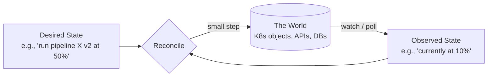
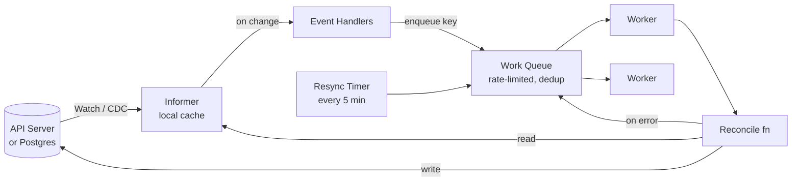

Goal: by the end of this, you can explain why K8s scales the way it does, write a controller's `Reconcile` loop on a whiteboard, and apply the same pattern to **your** systems (which is exactly what New Relic's control plane does — reconciling pipeline configs to running workers).

---

## 1. Overview

**The controller pattern is the heart of Kubernetes.** It's also the right pattern for almost any "make the world match a config" problem — pipeline rollouts, infra provisioning, multi-tenant SaaS configs, feature flags.

**One-line mental model:**
> *A controller is an infinite loop that compares **desired state** with **observed state** and takes one small step toward making them equal.*

That's it. Everything else — operators, CRDs, informers, work queues — is plumbing around that idea.


*Two inputs, one tiny corrective action, repeat forever.*

**Why this is staff-level material**: it's the dominant pattern for operating distributed systems at scale, and New Relic's "control plane for data pipelines" is *literally* this pattern. If you sound fluent here, you sound like you've built one.

---

## 2. Core Concepts (Layer by Layer)

### 2.1 Declarative > Imperative

**Imperative** (what most APIs are): "create pod A, then create pod B, then delete pod C."
**Declarative** (what K8s is): "I want 3 replicas of this pod." The system figures out the steps.

Why declarative wins at scale:
- **Idempotent**: re-applying the same spec is safe
- **Self-healing**: drifted state? Just reconcile.
- **Auditable**: spec is a versionable artifact (Git, Postgres row)
- **Decoupled**: writers don't need to know readers' state

> 💡 **Staff-level insight:** The phrase "level-triggered, not edge-triggered" describes this. Edge-triggered = react to *changes* (lose an event, lose state). Level-triggered = react to *current state* (always converges). K8s, your TV remote's volume up button, and good distributed systems are level-triggered.

### 2.2 The Reconcile Loop — The Sacred Function

Every controller has *one* function:

```go
func (r *Reconciler) Reconcile(ctx context.Context, req Request) (Result, error) {
    // 1. Fetch desired state (the spec)
    spec, err := r.fetchSpec(ctx, req.Name)
    if errors.Is(err, ErrNotFound) {
        return r.handleDelete(ctx, req.Name)
    }
    if err != nil {
        return Result{Requeue: true}, err  // retry with backoff
    }

    // 2. Fetch observed state (the world)
    observed, err := r.fetchObserved(ctx, req.Name)
    if err != nil {
        return Result{Requeue: true}, err
    }

    // 3. Compute the next step
    diff := r.diff(spec, observed)
    if diff.IsEmpty() {
        return Result{RequeueAfter: 5 * time.Minute}, nil  // healthy resync
    }

    // 4. Take ONE step toward desired state
    if err := r.apply(ctx, diff.NextAction()); err != nil {
        return Result{Requeue: true}, err
    }

    // 5. Update status (observed → API)
    if err := r.updateStatus(ctx, req.Name, observed); err != nil {
        return Result{Requeue: true}, err
    }

    // 6. Requeue: if not done yet, come back soon
    if !diff.IsTerminal() {
        return Result{RequeueAfter: 10 * time.Second}, nil
    }
    return Result{}, nil
}
```

**Six rules a real controller follows:**

| Rule                            | Why                                                                      |
| ------------------------------- | ------------------------------------------------------------------------ |
| **Idempotent**                  | Reconcile may run 1 time or 1000 times for the same state — must be safe |
| **One small step per call**     | Easier to reason about, debug, recover from failure                      |
| **Always update status**        | Status is how the rest of the system observes progress                   |
| **Requeue on transient errors** | Don't crash, don't loop tight — let the queue back off                   |
| **Never block forever**         | Use ctx, set deadlines, return early                                     |
| **Read before write**           | Always fetch fresh state; never trust cached spec for writes             |

> 💡 **Staff-level insight:** Junior engineers write reconcilers that try to "do everything in one pass." Staff engineers know that one-step-per-reconcile is *the* invariant — it's what makes failures recoverable. If your reconcile takes 5 actions and step 3 fails, you must be able to re-enter and resume from step 3 by *reading the world*, not by remembering where you were.

### 2.3 The Anatomy of a Real Controller


*Watch detects change → key goes in queue → worker pops → reconcile reads cache, writes API. Periodic resync catches missed events.*

| Component      | What it does                                                                                                      |
| -------------- | ----------------------------------------------------------------------------------------------------------------- |
| **Informer**   | Long-running watch on the API; populates a local in-memory cache; fires handlers on change                        |
| **Work Queue** | Per-resource-key queue with **dedup** (same key in twice = one entry) and **rate limiting** (exp backoff per key) |
| **Workers**    | N goroutines that pop keys and call `Reconcile`                                                                   |
| **Resync**     | Periodic full re-enqueue — your safety net for missed watch events                                                |

This is the Kubernetes `client-go` architecture. Your custom controller in Go uses the same building blocks via `controller-runtime`.

### 2.4 Watch + Resync = Reliability

A common interview question: *"Watches are eventually consistent and can drop events. How does the system stay correct?"*

**Two-layer defense:**
1. **Watch** for fast propagation (sub-second)
2. **Periodic resync** (e.g., every 5 min) re-enqueues *all* keys, forcing reconcile of everything → eventual convergence even if watches miss events

Plus the reconcile is level-triggered (reads current state), so a missed event just delays convergence — it doesn't break it.

> 💡 **Staff-level insight:** This is the same push+pull pattern from your control plane design. Kafka events are "watch"; the 30-second polling fallback is "resync." K8s built it into the controller framework. You're not inventing — you're applying a battle-tested pattern.

### 2.5 Owner References & Cascading Deletes

When a `Pipeline` owns a `Deployment`, you set the Pipeline as `ownerRef` on the Deployment. K8s handles GC: delete the Pipeline → child Deployment is deleted automatically.

In your own systems: enforce this with a `parent_id` FK + `ON DELETE CASCADE` in Postgres. Same idea, different layer.

### 2.6 Finalizers — Don't Skip This

A **finalizer** is a string on a resource that *blocks deletion* until your controller removes it.

Use case: you've provisioned external state (an S3 bucket, a Kafka topic) for a Pipeline. User deletes Pipeline → naive controller can't clean up because the resource is already gone.

Pattern:

```go
const finalizer = "pipelines.newrelic.com/cleanup"

func (r *Reconciler) Reconcile(ctx context.Context, req Request) (Result, error) {
    p, err := r.get(ctx, req.Name)
    if err != nil { return Result{}, err }

    // Deletion path
    if p.DeletionTimestamp != nil {
        if contains(p.Finalizers, finalizer) {
            if err := r.cleanupExternalState(ctx, p); err != nil {
                return Result{Requeue: true}, err  // keep retrying
            }
            p.Finalizers = remove(p.Finalizers, finalizer)
            return Result{}, r.update(ctx, p)
        }
        return Result{}, nil  // someone else's finalizer, ignore
    }

    // Normal path: ensure finalizer is present
    if !contains(p.Finalizers, finalizer) {
        p.Finalizers = append(p.Finalizers, finalizer)
        if err := r.update(ctx, p); err != nil { return Result{Requeue: true}, err }
    }

    // ... normal reconcile ...
}
```

This pattern is the "right way" to handle deletion in any control plane. New Relic's control plane needs it for the same reason — when you delete a pipeline, the data plane workers and Kafka topics need cleanup before the row vanishes.

---

## 3. Applying This to a Non-K8s Control Plane

This is the key insight that gets you the offer. **You don't need K8s to use this pattern.** Here's how to apply it to the New Relic pipeline control plane (no Kubernetes resources involved):

```go
type Reconciler struct {
    db        *sql.DB
    dataplane DataPlaneClient
    queue     workqueue.RateLimitingInterface
}

// Reconcile takes a pipeline ID, computes desired state from DB,
// observes the data plane, takes one step toward convergence.
func (r *Reconciler) Reconcile(ctx context.Context, pipelineID string) error {
    // 1. Fetch desired state (DB)
    pipeline, err := r.db.GetPipeline(ctx, pipelineID)
    if errors.Is(err, sql.ErrNoRows) {
        return r.handleDelete(ctx, pipelineID)
    }
    if err != nil { return err }

    // 2. Fetch observed state (data plane)
    observed, err := r.dataplane.GetStatus(ctx, pipelineID)
    if err != nil { return err }

    // 3. Compute action
    switch {
    case pipeline.TargetRevision == observed.AppliedRevision &&
         observed.Healthy:
        return r.markStatus(ctx, pipelineID, "Healthy")

    case pipeline.TargetRevision != observed.AppliedRevision:
        // Apply the next revision
        if err := r.dataplane.Apply(ctx, pipelineID, pipeline.TargetRevision); err != nil {
            return err
        }
        return r.markStatus(ctx, pipelineID, "Applying")

    case !observed.Healthy:
        // Roll back automatically
        return r.dataplane.Apply(ctx, pipelineID, pipeline.LastHealthyRevision)
    }
    return nil
}

// Watch loop: subscribe to Postgres CDC OR Kafka, enqueue pipeline IDs
func (r *Reconciler) Run(ctx context.Context, workers int) {
    go r.watchPostgresChanges(ctx)         // edge: react to changes
    go r.periodicResync(ctx, 5*time.Minute) // level: catch missed events

    for i := 0; i < workers; i++ {
        go r.worker(ctx)
    }
    <-ctx.Done()
}

func (r *Reconciler) worker(ctx context.Context) {
    for {
        key, shutdown := r.queue.Get()
        if shutdown { return }

        err := r.Reconcile(ctx, key.(string))
        if err != nil {
            r.queue.AddRateLimited(key)  // exp backoff
        } else {
            r.queue.Forget(key)          // reset backoff
        }
        r.queue.Done(key)
    }
}
```

**This is your "I get it" moment in the interview**: when they describe the control plane and ask "how would you build the reconciler?", you sketch this. It signals you understand the *pattern*, not just the K8s API.

---

## 4. Use Cases

| Use Case                             | Desired State                       | Observed State            | Action                       |
| ------------------------------------ | ----------------------------------- | ------------------------- | ---------------------------- |
| K8s Deployment controller            | "3 replicas v2"                     | "2 replicas v1, 1 v2"     | Create v2 pod, delete v1 pod |
| Cert-manager                         | "cert valid for X.com"              | "no cert / expiring soon" | Request from Let's Encrypt   |
| AWS provider (Crossplane)            | "S3 bucket Y exists"                | API call says no          | `CreateBucket`               |
| **New Relic pipeline control plane** | "pipeline X at rev v5, 50% rollout" | "rev v4, 100%"            | Apply v5 to 50% of workers   |
| Feature flag rollout                 | "flag F at 10%"                     | "F at 5%"                 | Bump rate at edge            |
| Database operator                    | "5-node Postgres cluster"           | "3 nodes, 1 unhealthy"    | Replace unhealthy, add 2     |
| Terraform                            | "resources match HCL"               | "drift"                   | `apply` next change          |

> 💡 **Staff-level insight:** Terraform is *also* a controller — you just trigger reconcile manually with `apply`. Crossplane is what you get when you make Terraform a continuous controller. Same pattern, different cadence.

---

## 5. Gotchas (The Production Scars)

### 5.1 The "Hot Loop" Bug
A controller that reconciles too aggressively can:
- Bump a `resourceVersion` field → trigger its own watch → reconcile again → infinite loop
- Costs API server CPU; in extreme cases, takes down the cluster

**Fix**: only update if the diff is real. Use `equality.Semantic.DeepEqual` (K8s) or your own diff before writing.

### 5.2 Status vs Spec — Never Mix
- **Spec** is desired state, written by users
- **Status** is observed state, written *only* by the controller
- Never write to spec from your controller. Never let users write status.

K8s enforces this with sub-resources. In Postgres, enforce it with column-level grants or an application-level rule.

### 5.3 Multiple Controllers, One Resource
Two controllers writing the same resource → race conditions, "fight" loops.

**Rule**: one controller is the **owner** of each field. Use field ownership (K8s server-side apply) or document ownership boundaries clearly.

### 5.4 Resync Storms
Resync at the same instant for 100K resources → API server CPU spike at minute 0, 5, 10...

**Fix**: jitter the resync. `RequeueAfter: 5*time.Minute + rand.Duration(jitter)`.

### 5.5 The "Stuck Finalizer" Outage
You added a finalizer. Your controller has a bug and never removes it. User deletes resource → it sits in `Terminating` forever. They can't recreate it (same name).

**Fix**: always have a manual escape hatch (`kubectl patch ... --type=json -p='[{"op": "remove", "path": "/metadata/finalizers"}]'`). Test finalizer removal in CI. Set a max age on finalizer holds with monitoring.

### 5.6 Cache Staleness
Informer cache is eventually consistent. If you read from cache, decide to act, then write → state may have changed in between.

**Fix**: For critical writes, use **optimistic concurrency** — read with `resourceVersion`, write with the same version, retry on conflict. This is exactly your `etag` pattern from the control plane design.

### 5.7 Backoff That Goes to the Moon
Rate-limited queue's exponential backoff caps at e.g. 16 minutes by default. A perpetually-failing key gets reconciled less and less. If the underlying issue resolves, recovery is slow.

**Fix**: tune `MaxBackoff`. Add metrics on per-key backoff age. Page if a key is backed off > 1 hour.

### 5.8 "I Need This to Run NOW"
Tempting to bypass the queue and reconcile inline on a request. **Don't.** That couples API latency to reconcile time, defeats rate limiting, and breaks dedup.

**Fix**: enqueue with high priority instead. Or expose a "force-reconcile" admin endpoint that bypasses normal flow but uses the same queue.

### 5.9 Cross-Resource Dependencies
Pipeline depends on Connector (a separate resource). Connector deleted → Pipeline reconcile keeps failing.

**Fix**: watch dependencies and re-enqueue dependents. In `controller-runtime`: `Watches(&Connector{}, handler.EnqueueRequestsFromMapFunc(mapConnectorToPipelines))`.

---

## 6. Where to Use (and NOT Use)

### Use the controller pattern when
- "Make the world match a config" describes the problem
- You have a clear desired state (versioned spec)
- Convergence is acceptable (seconds, not microseconds)
- You can detect/observe the world's state cheaply
- Multiple agents/replicas need to agree on a single source of truth

### Do NOT use it when
- The operation is one-shot, transactional, RPC-style (just call the API)
- You need synchronous user feedback at API time (controllers are async)
- The "world" is too expensive to observe (you'd thrash on observation)
- The state is too high-cardinality / high-frequency (think per-event — use streams instead)

---

## 7. Versus (Comparisons)

| Aspect                    | Controller Pattern       | Synchronous RPC               | Workflow Engine (Temporal)     | Stream Processor (Kafka Streams) |
| ------------------------- | ------------------------ | ----------------------------- | ------------------------------ | -------------------------------- |
| **Trigger model**         | Level (state)            | Imperative call               | Edge (workflow start)          | Edge (event)                     |
| **Convergence**           | Eventual, self-healing   | None — you retry              | Per-workflow, durable          | Per-message                      |
| **State**                 | External (DB / etcd)     | Caller's state                | Engine-managed                 | Topic / state store              |
| **Scale model**           | Horizontal: shard by key | Per-call                      | Worker pool                    | Partitions                       |
| **When to use**           | "Match config to world"  | "Do this now, tell me result" | "Multi-step business workflow" | "Transform stream of events"     |
| **Self-healing on drift** | ✅                        | ❌                             | ⚠️ Only via scheduled workflows | ❌                                |

**Combining them**: New Relic's control plane uses the **controller pattern** for steady-state reconcile of pipeline configs, and **Temporal** for the rollout *workflow* (canary → bake → 100%). Different jobs.

> 💡 **Staff-level insight:** Use Temporal for "this rollout" (one-shot, multi-step). Use a controller for "this pipeline should always be running v5 at 50%" (forever, self-healing). Knowing the boundary between them is staff-level distinction.

---

## 8. References

- **Kubebuilder book** (the canonical guide to building controllers): https://book.kubebuilder.io/
- **`controller-runtime`** (the Go library you actually use): https://github.com/kubernetes-sigs/controller-runtime
- **"Kubernetes the Hard Way"** — for understanding the API server's role
- **Operator pattern docs**: https://kubernetes.io/docs/concepts/extend-kubernetes/operator/
- **Brandon Phillips, "Kubernetes Controllers as a Foundation for Higher-Level Abstractions"** — talk
- **Lasse Højgaard, "Writing Kubernetes Controllers in Go"** — KubeCon talks (search YouTube)
- **Crossplane** — controllers as the foundation of an entire infra platform: https://crossplane.io
- **Tim Hockin** (K8s co-creator) talks on declarative APIs — best for the philosophy

---

## 9. Interview Questions to Expect

### Q1: "Explain the K8s controller pattern."
**Cover:** declarative spec + observed status + level-triggered reconcile loop + watch + periodic resync. Mention: idempotent, one-step-at-a-time, always read fresh.

### Q2: "What's the difference between level-triggered and edge-triggered? Why does K8s prefer level?"
**Cover:** edge = react to events (lossy, stateful); level = react to current state (lossy events OK, converges anyway). Resync timer is the safety net.

### Q3: "How would you design a control plane for [X] using this pattern?"
**Cover:** define spec/status, identify the watch source (DB CDC / Kafka), define the reconcile (read spec → read world → diff → one step), describe the queue (dedup, rate-limit, backoff), and the finalizer for cleanup.

### Q4: "Your reconciler is in a hot loop. How do you debug?"
**Cover:** check for status writes that bump resourceVersion → re-trigger watch. Add metrics: reconciles per resource per minute. Use a tracer to see the trigger chain. Fix: only write if real diff.

### Q5: "Why have both a watch AND periodic resync?"
**Cover:** watch is fast but lossy; resync is slow but exhaustive. Belt and suspenders. Plus level-triggered means resync alone could in theory work.

### Q6: "How do you handle deletes?"
**Cover:** finalizers. Walk through the dance: deletion timestamp set → controller cleans up external state → controller removes finalizer → API server deletes the resource.

### Q7 (curveball): "Two controllers manage the same resource. What goes wrong?"
**Cover:** fight loops, status flapping, race conditions on writes. Fix with field ownership boundaries (server-side apply or documented contract).

### Q8: "How is this different from Temporal?"
**Cover:** controller = level-triggered, runs forever, "always make state match config". Temporal = workflow with a defined start and end, durable execution of *steps*. Use both — different jobs (your control plane does this!).

---

## 10. Common Mistakes Candidates Make

| Mistake                                     | Fix                                                                         |
| ------------------------------------------- | --------------------------------------------------------------------------- |
| Describing it as event-driven only          | Emphasize **level-triggered** — that's the soul of the pattern              |
| Skipping resync                             | Bring it up unprompted; it's the reliability story                          |
| Mixing spec and status                      | State the rule explicitly: "users own spec, controller owns status"         |
| Forgetting finalizers                       | Mention proactively when discussing deletion                                |
| "I'd just put it all in one Reconcile call" | Emphasize one-step-per-reconcile + idempotent reads                         |
| Conflating with Operators                   | Operator = controller + CRDs + domain expertise. Pattern is the controller. |

---

## 11. Hands-On in 2 Hours

Build a tiny non-K8s reconciler this weekend:

1. Postgres table `pipelines(id, target_revision, observed_revision, status)`
2. A "data plane" that's just a map in memory
3. Reconciler:
   - LISTEN/NOTIFY on Postgres for change events (the "watch")
   - 30-second resync loop (the "resync")
   - Reconcile: if `target != observed`, "apply" to the map, update `observed`
4. Trigger writes from a small CLI; watch convergence

Then break it: kill the reconciler mid-apply, change two rows simultaneously, hold a transaction open. Notice that the level-triggered design recovers from all of it. **You'll never forget this pattern after that exercise.**

---

## 12. Staff-Level Tips

- When asked about the control plane in the interview, **draw the reconcile loop diagram** (Section 2.2) without prompting. It immediately positions you above the candidate who only describes APIs and DBs.
- Use the words **"level-triggered"**, **"convergence"**, **"finalizer"** at least once each — they signal real K8s controller experience.
- When discussing your past work, find a system you built that *was* (or *should have been*) a controller. Tell that story with this vocabulary.
- The killer phrase: *"This is conceptually a Kubernetes controller, even though we didn't run K8s. Spec in Postgres, observed via heartbeat API, level-triggered reconcile loop, finalizer for cleanup."* — that's how staff engineers talk.

---

## 13. The 30-Second Elevator Answer

> *"A controller is a level-triggered reconcile loop. You define spec and status separately — spec is desired state, status is observed. The loop watches changes for fast propagation and runs a periodic resync as a safety net for missed events. Each reconcile reads fresh world state, computes one corrective step, applies it, and updates status. It's idempotent, self-healing, and the foundation of how Kubernetes scales. The same pattern works without K8s — anywhere you need to converge a system to a versioned config."*

---
