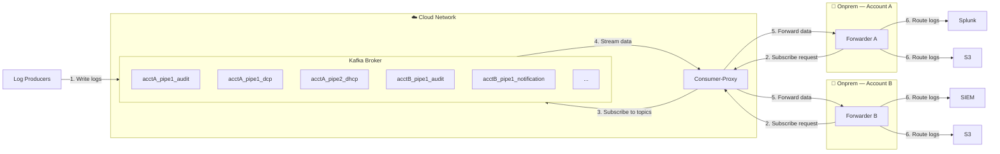

## System Design Diagram

## Flow Steps

| Step | From           | To             | Description                                                               |
| ---- | -------------- | -------------- | ------------------------------------------------------------------------- |
| 1    | Log Producers  | Kafka          | Producers write logs to topics (`<account_id>_<pipeline_id>_<log_type>`)  |
| 2    | Forwarder      | Consumer-Proxy | Forwarder sends subscribe request with its account's topic list           |
| 3    | Consumer-Proxy | Kafka          | Consumer-Proxy subscribes to the requested Kafka topics                   |
| 4    | Kafka          | Consumer-Proxy | Kafka streams log data to Consumer-Proxy                                  |
| 5    | Consumer-Proxy | Forwarder      | Consumer-Proxy forwards the data to the requesting Forwarder              |
| 6    | Forwarder      | Destinations   | Forwarder routes logs to configured destinations (Splunk, S3, SIEM, etc.) |

## Key Points

- **Topic naming**: `<account_id>_<pipeline_id>_<log_type>` — 10 log types (audit, notification, dcp, dhcp, etc.)
- **Consumer-Proxy**: Single shared cloud component that proxies Kafka subscriptions for all onprem Forwarders
- **Forwarder**: 1 per onprem VM — subscribes to all topics belonging to its account (all pipelines × all log types)
- **Network boundary**: Kafka and Consumer-Proxy run in the cloud network; Forwarders run on customer onprem VMs
