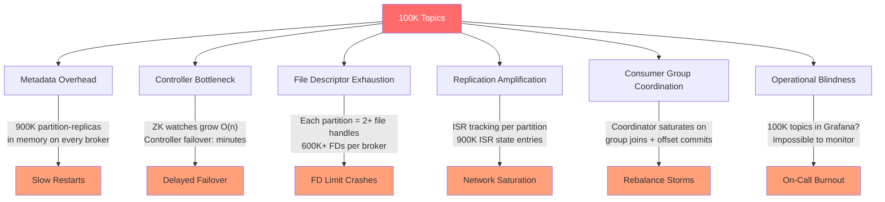
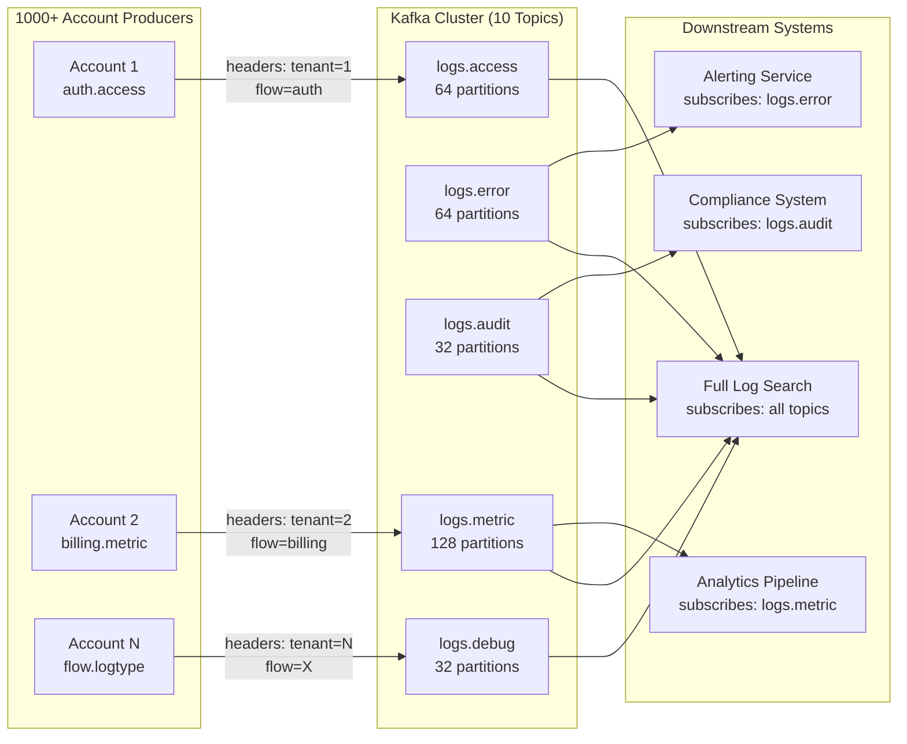
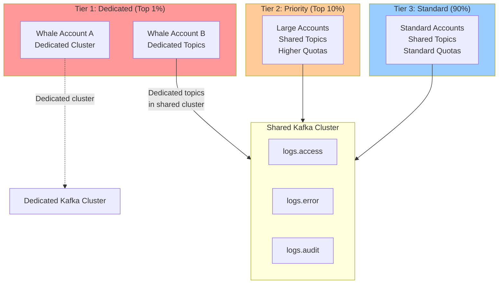
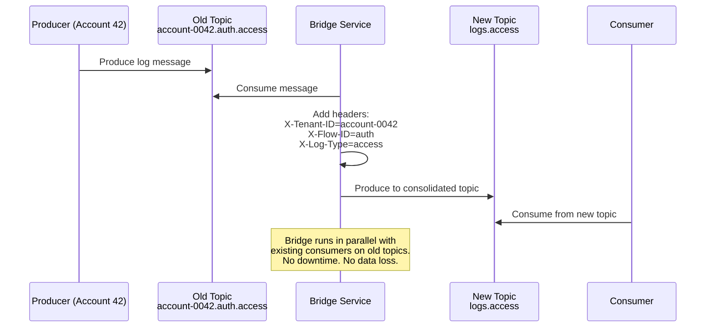
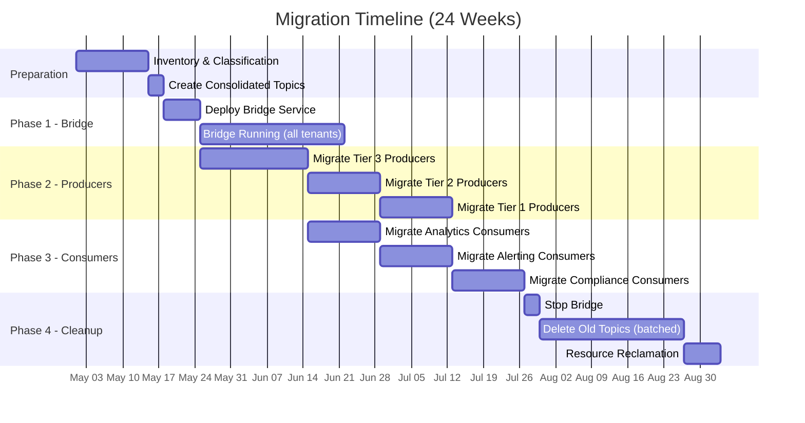

## Table of Contents

- [The Interview Question](#the-interview-question)
- [Scoring Rubric](#scoring-rubric)
- [1. Overview](#1-overview)
- [2. Core Concepts — Why Topic Explosion Kills Kafka](#2-core-concepts--why-topic-explosion-kills-kafka)
- [3. The Reference Answer — Ideal Staff-Level Design](#3-the-reference-answer--ideal-staff-level-design)
- [4. Use Cases](#4-use-cases)
- [5. Gotchas](#5-gotchas)
- [6. Where to Use (and Where NOT to Use)](#6-where-to-use-and-where-not-to-use)
- [7. Versus — Consolidation Approaches](#7-versus--consolidation-approaches)
- [8. Migration Plan — From 100K Topics to Consolidated Design](#8-migration-plan--from-100k-topics-to-consolidated-design)
- [9. Interviewer Guide](#9-interviewer-guide)
- [10. References](#10-references)
- [11. Interview Questions](#11-interview-questions)
- [12. Staff-Level Preparation Tips](#12-staff-level-preparation-tips)

---

## The Interview Question

> **Give this prompt to the candidate verbatim:**

You are the tech lead for a multi-tenant SaaS platform that processes log data. The platform currently serves **1,000 customer accounts**. Each account has **10 flows** (think: data pipelines), and each flow produces **10 distinct log types**.

The current Kafka architecture creates **one topic per account per log type**:

```
account-0001.flow-auth.log-access
account-0001.flow-auth.log-error
account-0001.flow-auth.log-audit
...
account-1000.flow-billing.log-metric
```

This gives us:

$$1{,}000 \times 10 \times 10 = 100{,}000 \text{ topics}$$

Each topic has **3 partitions** and a **replication factor of 3**.

**The problem**: The platform is growing. The sales team has signed contracts to onboard **10,000 accounts** by end of next year. At current design, that's **1 million topics**. The Kafka cluster is already showing strain:

- Broker restarts take **tens of minutes** (metadata reload — exact number depends on hardware, JVM tuning, and partition count per broker).
- Controller failover takes **minutes, not seconds** — unacceptable for an SLA-bound system.
- ZooKeeper is at **90% memory** from watch registrations.
- Operational costs are high — 30 brokers for metadata overhead alone.
- On-call engineers can't debug issues because there are too many topics to monitor.

**Your constraints:**

- Average message throughput: **50 msg/s per log type** (varies: some hot log types do 5,000 msg/s).
- Message size: **1–10 KB** average.
- Retention: **7 days** for most log types, **90 days** for audit logs.
- Consumers: Downstream analytics, alerting, and compliance systems — each account's data must be independently processable.
- SLA: **99.95% availability**, **< 500ms p99 end-to-end latency** from produce to consume.
- Cannot lose data. At-least-once delivery is acceptable if idempotent consumers are in place.

**Design a Kafka architecture that:**

1. Supports 10,000+ accounts without linear topic growth.
2. Maintains tenant isolation (one noisy customer shouldn't affect others).
3. Can be migrated to from the current 100K-topic system **without downtime**.
4. Is operationally manageable — your on-call team has 5 engineers.

---

## Scoring Rubric

Use this rubric to evaluate where a candidate lands. Staff-level answers aren't about getting everything "right" — they're about **demonstrating judgment under ambiguity**.

### Dimension 1: Problem Identification

| Level      | What They Say                                                                                                                                                                                                                                                                                                                                                                                                                                                              |
| ---------- | -------------------------------------------------------------------------------------------------------------------------------------------------------------------------------------------------------------------------------------------------------------------------------------------------------------------------------------------------------------------------------------------------------------------------------------------------------------------------- |
| **Junior** | "100K topics is a lot. We should reduce it." (No explanation of *why* it hurts.)                                                                                                                                                                                                                                                                                                                                                                                           |
| **Senior** | "More topics means more partitions, which means more metadata and slower controller failover. ZooKeeper has O(n) watches."                                                                                                                                                                                                                                                                                                                                                 |
| **Staff**  | Quantifies the impact: "100K topics × 3 partitions × 3 replicas = 900K partition-replicas. Each partition has 2+ open file handles — that's 600K+ file descriptors per broker. Controller needs to load all partition metadata on failover. ZooKeeper's watch list grows linearly with topic count. At 1M topics, this architecture is dead." Also identifies the **operational cost**: "You can't page through 100K topics in a Grafana dashboard. Monitoring is broken." |

### Dimension 2: Topic Consolidation Strategy

| Level      | What They Say                                                                                                                                                                                                                                                                                                                                                                                                                                                                                                                                                                              |
| ---------- | ------------------------------------------------------------------------------------------------------------------------------------------------------------------------------------------------------------------------------------------------------------------------------------------------------------------------------------------------------------------------------------------------------------------------------------------------------------------------------------------------------------------------------------------------------------------------------------------ |
| **Junior** | "Put everything in one topic." (Doesn't address isolation or routing.)                                                                                                                                                                                                                                                                                                                                                                                                                                                                                                                     |
| **Senior** | "Consolidate topics by flow type. Use message headers for tenant ID. Maybe 100 topics instead of 100K."                                                                                                                                                                                                                                                                                                                                                                                                                                                                                    |
| **Staff**  | Proposes a **tiered hierarchy**: consolidate by `logType` (10 topics) or by `flow` × `logType` (100 topics). Uses message headers (`X-Tenant-ID`, `X-Flow-ID`, `X-Log-Type`) for routing. Explains *why* headers over keys: "Keys determine partition assignment. If we key by tenantId, we get tenant-level ordering and co-location. But headers give per-message metadata without affecting partitioning — we can partition by tenantId AND filter by logType using headers." Addresses the trade-off between fewer topics (less metadata overhead) and more topics (better isolation). |

### Dimension 3: Tenant Isolation & Security

| Level      | What They Say                                                                                                                                                                                                                                                                                                                                                                                                                                                                                                                       |
| ---------- | ----------------------------------------------------------------------------------------------------------------------------------------------------------------------------------------------------------------------------------------------------------------------------------------------------------------------------------------------------------------------------------------------------------------------------------------------------------------------------------------------------------------------------------- |
| **Junior** | Doesn't mention isolation.                                                                                                                                                                                                                                                                                                                                                                                                                                                                                                          |
| **Senior** | "Use ACLs to restrict access per tenant."                                                                                                                                                                                                                                                                                                                                                                                                                                                                                           |
| **Staff**  | Designs **multiple isolation layers**: (1) Kafka quotas (`producer_byte_rate`, `consumer_byte_rate`) per client ID to prevent noisy neighbor. (2) Prefix-based ACLs on topics + consumer groups. (3) For top-tier tenants producing 100x the average, **dedicated topics or even dedicated clusters** (hybrid model). (4) Schema Registry with tenant-prefixed subjects to prevent schema conflicts. Acknowledges: "Full isolation = more topics = back to the original problem. The art is choosing the right isolation boundary." |

### Dimension 4: Migration from Current State

| Level      | What They Say                                                                                                                                                                                                                                                                                                                                                                                                                                                                                                                                                                                     |
| ---------- | ------------------------------------------------------------------------------------------------------------------------------------------------------------------------------------------------------------------------------------------------------------------------------------------------------------------------------------------------------------------------------------------------------------------------------------------------------------------------------------------------------------------------------------------------------------------------------------------------- |
| **Junior** | "Create new topics and switch over." (No migration plan.)                                                                                                                                                                                                                                                                                                                                                                                                                                                                                                                                         |
| **Senior** | "Dual-write to old and new topics during migration. Switch consumers over gradually."                                                                                                                                                                                                                                                                                                                                                                                                                                                                                                             |
| **Staff**  | Designs a **phased, zero-downtime migration**: Phase 1 — deploy a bridge service that reads from old topics and writes to new consolidated topics with proper headers. Phase 2 — migrate producers to write directly to new topics (feature flag per account). Phase 3 — migrate consumers one pipeline at a time, with rollback capability. Phase 4 — decommission old topics after validation. Addresses: "The migration is harder than the design. You need to handle duplicate messages during the overlap period — idempotent consumers are essential. Budget 3-6 months for 1000 accounts." |

### Dimension 5: Operational Readiness

| Level      | What They Say                                                                                                                                                                                                                                                                                                                                                                                                                                                                                                                                                                                                                             |
| ---------- | ----------------------------------------------------------------------------------------------------------------------------------------------------------------------------------------------------------------------------------------------------------------------------------------------------------------------------------------------------------------------------------------------------------------------------------------------------------------------------------------------------------------------------------------------------------------------------------------------------------------------------------------- |
| **Junior** | Doesn't discuss operations.                                                                                                                                                                                                                                                                                                                                                                                                                                                                                                                                                                                                               |
| **Senior** | "Monitor consumer lag per topic. Alert on under-replicated partitions."                                                                                                                                                                                                                                                                                                                                                                                                                                                                                                                                                                   |
| **Staff**  | Designs a full observability stack: (1) Per-tenant metrics via message headers — extract tenant ID in consumers and emit `messages_processed{tenant="X"}` counters. (2) Custom lag monitoring that breaks down lag by tenant within shared topics (not just per-partition). (3) Alerting on tenant-level SLA breaches, not just partition-level lag. (4) Runbooks for common failures: "Tenant X is producing 10x normal volume → apply quota → investigate." (5) Capacity planning model: "Each broker handles ~4K partitions on HDD. With 300 partitions (100 topics × 3), we need 1 broker for partitions + N brokers for throughput." |

> 💡 **Staff-level insight:** The scoring rubric isn't about checklists — it's about *how* they reason. A staff engineer who misses one dimension but reasons deeply about trade-offs in the others is stronger than someone who hits all five at surface level. Watch for: "I'd choose X over Y because..." vs "We should do X."

---

## 1. Overview

Every multi-tenant SaaS platform on Kafka eventually hits the same wall: **topic explosion**.

It starts innocently. You create a topic per customer. Then per customer per data type. Then per customer per data type per environment. Before you know it, you have 100K topics and your Kafka cluster spends more time managing metadata than actually delivering messages.

This isn't a hypothetical. **Confluent has seen this pattern across hundreds of enterprises.** Datadog, Wix, and Segment have all written publicly about fighting this exact problem. At Confluent, we saw customers regularly hit 50K-200K topics before things started breaking — and the symptoms are insidious. The cluster doesn't crash. It just gets **slow**. Restarts take longer. Failovers take longer. Monitoring dashboards become unusable. On-call engineers start dreading Kafka alerts.

This article dissects the problem, provides a reference staff-level answer, and gives you — the interviewer — a structured guide for evaluating candidates. If you're the candidate, this is your study guide.

**What you'll learn:**

- Why topic explosion is an architectural problem, not just an operational nuisance
- Three consolidation strategies and when to pick each one
- How to design tenant isolation without topic-per-tenant
- A zero-downtime migration plan from 100K topics to a consolidated architecture
- Go code examples for header-based routing with Sarama
- How to answer this in 45 minutes and demonstrate staff-level thinking

**Prerequisites:** You should be comfortable with Kafka fundamentals — topics, partitions, brokers, consumer groups, and replication. If not, read the [Kafka Complete Guide](kafka-complete-guide.md) first.

---

## 2. Core Concepts — Why Topic Explosion Kills Kafka

Let's quantify exactly what 100K topics does to a Kafka cluster. No hand-waving.

### 2.1 The Math

```
Topics:              100,000
Partitions per topic: 3
Replication factor:   3

Total partitions:     100,000 × 3 = 300,000
Partition-replicas:   300,000 × 3 = 900,000
```

That's **900,000 partition-replicas** the cluster must manage. At 1M topics (the 10K customer projection), you'd have **9 million partition-replicas**. For reference, Confluent's recommended upper bound for a ZooKeeper-based cluster is **~200K partition-replicas**. You're already at 4.5x the limit.

### 2.2 Where It Hurts — Six Pressure Points



*Six dimensions where topic explosion degrades your Kafka cluster.*

#### Pressure Point 1: Metadata Overhead

Every broker holds the **full cluster metadata** in memory — all topics, all partitions, all replicas, all ISR lists. With 900K partition-replicas, that's a significant memory footprint. More importantly, when a broker restarts, it must:

1. Load all metadata from ZooKeeper (or the KRaft controller).
2. Open log segment files for every partition it leads or follows.
3. Catch up on ISR state.

At 100K+ topics, this can take **tens of minutes** per broker depending on disk type (NVMe vs. HDD), JVM heap and GC tuning, and how many partitions the broker leads or follows. At 1M topics, broker restarts can stretch into **hours**, making rolling upgrades a multi-day affair. The specific number varies — what's consistent is that restart time grows roughly linearly with partition count per broker, which is why the metadata-per-broker dimension dominates operational cost long before throughput does.

#### Pressure Point 2: Controller Bottleneck

The Kafka controller is a single broker responsible for partition leadership, ISR changes, and topic management. In ZooKeeper mode:

- Every topic creates **znodes** in ZK (one per partition, one per replica assignment).
- The controller registers **watches** on these znodes.
- 100K topics × 3 partitions = 300K znodes with watches.

ZooKeeper's memory usage scales linearly with watch count. At 300K watches, you're already at 90% memory. At 3M watches (1M topics), ZooKeeper falls over.

> 💡 **Staff-level insight:** KRaft mode (KIP-500) eliminates ZooKeeper but doesn't magically solve topic explosion. The KRaft controller still maintains an in-memory metadata log. At millions of partitions, the controller's snapshot size and log replay time become the bottleneck — just a different bottleneck. [Confluent-reported KIP-500 benchmarks](https://www.confluent.io/blog/kafka-without-zookeeper-a-sneak-peek/) show **~2M partitions viable on a single KRaft cluster**, versus ~200K for ZooKeeper-mode clusters — a roughly 10x headroom jump. The ceiling moves; it doesn't disappear.

#### Pressure Point 3: File Descriptor Exhaustion

Each partition has at least:

- 1 active log segment file (`.log`)
- 1 index file (`.index`)
- 1 timeindex file (`.timeindex`)

That's **3 open file descriptors minimum per partition**, plus temporary files during log compaction and segment rolling. A broker leading 100K partitions needs:

```
100,000 partitions × 3 FDs = 300,000 file descriptors (minimum)
```

The default Linux `ulimit -n` is 1024. Production Kafka sets it to 100K-200K. At 300K partitions per broker, you're already beyond common limits. And this doesn't count network socket FDs.

#### Pressure Point 4: Replication Traffic Amplification

With `replication.factor=3`, every message written to a leader partition must be replicated to 2 followers. That's fine — Kafka is designed for this. But with 900K partition-replicas spread across 30 brokers, every broker is both leading and following thousands of partitions. The inter-broker replication traffic creates a mesh of connections:

```
30 brokers × 29 peers = 870 inter-broker connections
Each connection multiplexes thousands of partition fetch requests
```

At high topic counts, the fetch request overhead (per-partition metadata in each fetch) starts to dominate the actual data transfer.

#### Pressure Point 5: Consumer Group Coordination

Consumer groups themselves scale reasonably well — Confluent Cloud runs clusters with hundreds of thousands of active groups. The pressure point isn't the group count; it's what happens when every group commits offsets on **many partitions** and rebalances frequently.

If you go topic-per-tenant plus group-per-tenant, you can easily reach **10K–100K+ active consumer groups**, each committing offsets across multiple partitions. The `__consumer_offsets` topic (50 partitions by default) becomes a write hotspot: offset commit RPS scales with `groups × partitions_per_group × commits_per_second`. Worse, rebalance storms become likely — with that many groups, some group is always rebalancing, and the group coordinator broker saturates on join/sync/heartbeat handling.

> 💡 **Staff-level insight:** It's not "1,000 groups is too many" — it isn't. It's that group-per-tenant on topic-per-tenant multiplies coordinator load by two dimensions at once. One dimension (groups OR topics) scaling is fine; both scaling together is where coordinators fall over.

#### Pressure Point 6: Operational Blindness

This is the one engineers forget. With 100K topics:

- **Grafana dashboards** showing "consumer lag by topic" are useless — you can't display 100K time series.
- **Alerting rules** like "alert if lag > 1000 on any topic" fire constantly because some low-throughput topics naturally have bursty lag.
- **Debugging** "which tenant is causing high CPU?" requires grepping through 100K topic metrics.
- **Capacity planning** is impossible — you can't forecast growth per topic when you have 100K of them.

> 💡 **Staff-level insight:** Operational blindness is often the *real* reason teams re-architect. The cluster technically works. But no human can operate it. If you can't monitor it, you can't run it in production. This is the argument that wins buy-in from leadership for a re-architecture project: "We can't maintain our SLA because we can't see what's happening."

---

## 3. The Reference Answer — Ideal Staff-Level Design

Here's the architecture a staff engineer should converge on. Not the only valid answer — but a strong one that demonstrates depth.

### 3.1 Topic Consolidation Strategy

**Replace 100K topics with 10 shared topics — one per log type.**

```
BEFORE (100,000 topics):
  account-0001.flow-auth.log-access
  account-0001.flow-auth.log-error
  ...
  account-1000.flow-billing.log-metric

AFTER (10 topics):
  logs.access      (all accounts, all flows)
  logs.error       (all accounts, all flows)
  logs.audit       (all accounts, all flows)
  logs.metric      (all accounts, all flows)
  ...
  logs.debug       (all accounts, all flows)
```

**Why 10 topics (by log type) instead of 1 mega-topic or 100 topics (by flow)?**

| Strategy           | Topics | Pros                                                                                                                                                                                    | Cons                                                                                     |
| ------------------ | ------ | --------------------------------------------------------------------------------------------------------------------------------------------------------------------------------------- | ---------------------------------------------------------------------------------------- |
| 1 mega-topic       | 1      | Simplest. Minimum metadata.                                                                                                                                                             | No isolation. Can't set different retention per log type. Partition count must be huge.  |
| By log type        | 10     | Different retention per type (audit=90d, debug=7d). Manageable partition count. Matches downstream consumer patterns (alerting subscribes to `logs.error`, analytics to `logs.metric`). | Largest tenants share partitions with small tenants (noisy neighbor risk).               |
| By flow × log type | 100    | More granular. Can tune per flow.                                                                                                                                                       | Still manageable, but 10x more operational overhead than 10 topics for marginal benefit. |
| By flow            | 10     | Groups related log types together.                                                                                                                                                      | Can't set different retention per log type within one topic.                             |

**Recommendation: 10 topics by log type.** It's the sweet spot between operational simplicity and functional flexibility. Different log types genuinely have different retention, throughput, and consumer patterns.



*Consolidated architecture: 10 topics replace 100K. Headers carry tenant and flow metadata. Consumers subscribe to the log types they need.*

### 3.2 Message Design — Headers and Keys

Every message includes:

```
Key:     <tenantId>            (e.g., "account-0042")
Headers:
  X-Tenant-ID:  account-0042
  X-Flow-ID:    auth
  X-Log-Type:   access
  X-Timestamp:  1713436800000
Value:   <the actual log message, in Avro/Protobuf/JSON>
```

**Why `tenantId` as the key?**

- **Partition assignment**: Kafka hashes the key to determine the partition. All messages for `account-0042` land on the same partition. This gives you:
  - **Per-tenant ordering** within a partition (messages from the same account arrive in order).
  - **Data locality** — all of a tenant's data is co-located, making per-tenant consumer processing efficient.
- **Compaction-friendly**: If you ever enable log compaction (e.g., for a state topic), de-duplication is per-key.

**Why headers for flow and log type?**

- Headers don't affect partitioning. They're metadata attached to the message.
- Consumers can filter by header without deserializing the value — this saves **CPU** on deserialization.
- You can add new headers (e.g., `X-Environment: staging`) without changing the partitioning scheme.

> ⚠️ **Be honest about what header filtering does NOT save.** Stock Kafka has no server-side filtering. The consumer still **fetches the full message over the network** — bytes, value, and headers. Header filtering only lets you skip deserialization and downstream processing for messages you don't care about. You do not save network bandwidth, broker fetch I/O, or consumer heap allocation for the message bytes themselves. If a consumer cares about 1% of the traffic on a shared topic, it's still reading 100% of the bytes. For extreme skew, that's the argument for dedicated topics or Tier-1 whale isolation — not more aggressive header filtering.

> 💡 **Staff-level insight:** Key choice has a subtle but critical implication. If one tenant produces 100x more data than others (and they always will — power law distributions are universal in multi-tenant systems), their partition becomes a **hot partition**. The fix: use a **compound key** like `tenantId-shardN` where N is a random shard (0-7). This spreads large tenants across 8 partitions while keeping small tenants on 1. **The trade-off has two faces:** (1) you lose strict per-tenant ordering (usually fine for log data); and (2) **replay gets harder** — to replay a whale tenant's data (see Interview Question 2), your compliance job must seek across **all 8 shard partitions** for that tenant rather than 1. That's an 8x multiplier on replay cost and coordination complexity. The compound-key decision is therefore a deliberate trade: cheaper steady-state throughput in exchange for more expensive replay. If replay is hot-path for you (e.g., frequent compliance audits), mirror whale data to S3 at write time and serve replay from object storage instead.

### 3.3 Partitioning Strategy

For 10 topics serving 10,000 accounts:

```
logs.access:  64 partitions   (moderate throughput)
logs.error:   64 partitions   (moderate, bursty)
logs.audit:   32 partitions   (low throughput, long retention)
logs.metric:  128 partitions  (highest throughput)
logs.debug:   32 partitions   (low throughput, short retention)
...
```

**Total partitions**: ~500-700 (vs. 300,000 before). That's a **99.8% reduction**.

**Partition count formula:**

$$\text{partitions} = \max\left(\frac{\text{target throughput (MB/s)}}{\text{throughput per partition (MB/s)}}, \text{desired parallelism}\right)$$

A single partition can handle **10-50 MB/s** on modern hardware. Let's work the math for `logs.metric`:

**Step 1 — peak theoretical aggregate (all accounts active simultaneously):**

```
10,000 accounts × 10 flows × 50 msg/s × 5 KB
  = 25,000,000 KB/s
  ≈ 24 GB/s
```

**Step 2 — apply a concurrency factor.** In multi-tenant log systems, not all tenants produce simultaneously. Observed concurrency (the fraction of tenants actively producing within any given second) is typically **10-20%** for business-hours SaaS workloads. Use 15% as a midpoint:

```
24 GB/s × 15% = 3.6 GB/s realistic sustained throughput
```

The 10-20% range brackets it: **2.5 GB/s (10%) to 4.8 GB/s (20%)**.

**Step 3 — divide by per-partition throughput:**

```
3.6 GB/s ÷ 50 MB/s per partition = ~72 partitions
```

Round up for burst headroom and rebalance skew: **~100 partitions for `logs.metric`**. If you sized naively against the 24 GB/s peak, you'd provision ~480 partitions — 5x overkill, wasted metadata, wasted brokers. Concurrency factor is where capacity planning for multi-tenant systems either saves or wastes real money.

> 💡 **Staff-level insight:** Don't invent the concurrency factor — measure it. Before the migration, instrument your producer gateway to emit `active_tenants_per_second` (distinct tenant IDs that produced in the last 1s window). Plot p50/p95/p99 over a week. That's your real concurrency distribution. Size partitions against p95, not p50 (bursts) and not peak (wasteful).

### 3.4 Consumer Design

Two valid approaches. A staff engineer should articulate both and choose:

**Option A: Single consumer group per downstream system, filter by headers.**

```
Consumer Group: "alerting-service"
  Subscribes to: logs.error
  Processes ALL tenants
  Filters: Process messages where X-Log-Type = error
  Scale: 64 consumers (one per partition)
```

- **Pros**: Simple. One consumer group. No coordination overhead per tenant.
- **Cons**: Every consumer sees every tenant's messages. If a specific tenant needs custom alerting logic, you need conditional routing in your consumer code.

**Option B: Per-tenant consumer groups on shared topics.**

```
Consumer Group: "account-0042-alerting"
  Subscribes to: logs.error
  Processes ONLY account-0042's messages (filter by header)

Consumer Group: "account-0043-alerting"
  Subscribes to: logs.error
  Processes ONLY account-0043's messages
```

- **Pros**: Per-tenant isolation. Independent offset tracking. Can pause/restart one tenant without affecting others.
- **Cons**: 10,000 consumer groups on the same topic. Each group gets ALL partitions assigned. Each consumer reads ALL messages but discards most of them (only keeps messages matching its tenant ID). **Massive wasted read amplification.** The `__consumer_offsets` topic becomes a hotspot.

**Recommendation: Option A for most workloads.** Option B only when regulatory requirements demand per-tenant offset tracking (e.g., compliance auditing where you must prove "we processed all of account X's data").

> 💡 **Staff-level insight:** There's a hidden Option C that Confluent customers use: **Kafka consumer interceptors** combined with a tenant routing layer. The consumer group is shared, but an interceptor extracts the tenant header and routes the message to a tenant-specific handler. This gives you per-tenant processing semantics without per-tenant consumer groups. It's the production pattern at Wix and Datadog for multi-tenant Kafka.

### 3.5 Tenant Isolation — The Noisy Neighbor Problem

Consolidation creates a new problem: **noisy neighbors**. Tenant A suddenly producing 100x normal volume shouldn't impact Tenant B's latency.

**Layer 1: Kafka Quotas**

```properties
# Per-tenant produce quota: 10 MB/s
# Per-tenant consume quota: 20 MB/s
# Set via kafka-configs.sh or AdminClient API

# Dynamic quota for client.id=account-0042
kafka-configs.sh --alter --add-config 'producer_byte_rate=10485760,consumer_byte_rate=20971520' \
  --entity-type clients --entity-name account-0042 \
  --bootstrap-server kafka:9092
```

When a client exceeds its quota, Kafka **throttles** it — the broker delays the response, causing backpressure on the producer. Other tenants are unaffected.

**Layer 2: Rate Limiting at the Gateway**

Don't rely solely on Kafka quotas. Add a rate limiter in your producer gateway (the service that receives log data from customer agents and publishes to Kafka):

```go
// Per-tenant rate limiter using golang.org/x/time/rate
type TenantRateLimiter struct {
    limiters sync.Map // map[string]*rate.Limiter
    rate     rate.Limit
    burst    int
}

func (t *TenantRateLimiter) Allow(tenantID string) bool {
    limiter, _ := t.limiters.LoadOrStore(tenantID, rate.NewLimiter(t.rate, t.burst))
    return limiter.(*rate.Limiter).Allow()
}
```

**Layer 3: Dedicated Resources for Whale Tenants**

Some tenants will produce 1000x the average. The correct strategy is a **hybrid model**:

- **Tier 1 (Whale tenants, top 1%)**: Dedicated topics or dedicated Kafka clusters. Full isolation. Higher cost, but these are your highest-revenue customers.
- **Tier 2 (Large tenants, top 10%)**: Shared topics but with generous quotas and priority consumer processing.
- **Tier 3 (Long tail, 90%)**: Shared topics, standard quotas, standard processing.



*Hybrid tiered model: whale tenants get dedicated infrastructure. The 90% long tail shares consolidated topics.*

### 3.6 KRaft Mode

If you're designing this system today, **KRaft is non-negotiable**. Every new Kafka deployment should use KRaft (Kafka Raft — the built-in consensus protocol that replaces ZooKeeper).

The metadata benefits for high-topic environments:

| Aspect                             | ZooKeeper                         | KRaft                                 |
| ---------------------------------- | --------------------------------- | ------------------------------------- |
| Max partition-replicas (practical) | ~200K                             | ~2M (per Confluent KIP-500 benchmarks)|
| Controller failover                | Minutes at 100K+ topics           | Seconds (Raft leader election)        |
| Metadata storage                   | External system (ZK znodes)       | Internal (controller log)             |
| Watch overhead                     | O(n) watches, linear memory       | No watches — event-driven log tailing |
| Operational complexity             | 2 systems to operate (Kafka + ZK) | 1 system                              |

But KRaft is not a silver bullet. Even with KRaft, **~2M partitions is the realistic ceiling** per [Confluent's KIP-500 benchmark results](https://www.confluent.io/blog/kafka-without-zookeeper-a-sneak-peek/). At our consolidated design (700 partitions × 3 replicas = 2,100 partition-replicas), we're well within limits even at 10,000x growth.

### 3.7 Tiered Storage (KIP-405)

The audit log requirement (90-day retention) is expensive with local broker storage. A single `logs.audit` topic at moderate throughput:

```
32 partitions × 50 msg/s × 5 KB × 86,400 sec/day × 90 days ≈ 62 TB
```

**Tiered Storage** moves cold data (older segments) to object storage (S3, GCS, Azure Blob) while keeping hot data (recent segments) on broker local disk:

```
Hot tier:  Last 24 hours on broker NVMe/SSD
Cold tier: Days 2-90 on S3 ($0.023/GB/month vs $0.10/GB/month on EBS)
```

This cuts storage costs by **~75%** for long-retention topics and eliminates the need to scale broker disk for retention.

> 💡 **Staff-level insight:** Tiered storage has a latency cost. Reading cold data from S3 adds 50-200ms per fetch. For audit/compliance queries that need old data, this is acceptable. For real-time alerting, it's not. Design your retention tiers to match your access patterns: hot data = real-time consumers, cold data = batch compliance queries.

### 3.8 Schema Governance

With 10 shared topics serving 10,000 accounts, schema evolution becomes critical. If account A changes their log format, it shouldn't break account B's consumers.

**Strategy: Tenant-aware Schema Registry subjects.**

```
# Subject naming convention
TopicNameStrategy:          logs.access-value          (single schema for all tenants)
TopicRecordNameStrategy:    logs.access-com.acme.AccessLog  (per record type)
```

For multi-tenant topics, use **TopicRecordNameStrategy** or a custom strategy:

```
Subject: logs.access-tenant-0042-AccessLog
   → Schema for Account 42's access logs
Subject: logs.access-tenant-0043-AccessLog
   → Schema for Account 43's access logs
```

**Compatibility mode**: Set `BACKWARD` compatibility per subject. This ensures consumers can always read older and newer messages.

### 3.9 JMX Metrics and Alert Thresholds

You cannot run a consolidated multi-tenant Kafka cluster without proper JMX-based observability. The built-in Kafka MBeans are the authoritative source — emit them to Prometheus via the JMX exporter and build alerts on these exact beans:

| JMX Bean | What It Means | Suggested Alert Threshold |
|----------|---------------|---------------------------|
| `kafka.server:type=ReplicaManager,name=UnderReplicatedPartitions` | Partitions where ISR < replication factor. Non-zero = a broker is behind or down. | **Warn > 0 for 5 min, page > 0 for 15 min.** Sustained non-zero is always a real incident. |
| `kafka.controller:type=KafkaController,name=ActiveControllerCount` | Per broker: 1 if this broker is the controller, 0 otherwise. **Cluster-wide sum must equal 1.** | **Page if sum ≠ 1 for > 1 min.** Sum = 0 means no controller; sum > 1 means split brain. |
| `kafka.controller:type=KafkaController,name=OfflinePartitionsCount` | Partitions with no active leader. Offline = unavailable for produce and consume. | **Page > 0 immediately.** Customer impact is live. |
| `kafka.server:type=KafkaRequestHandlerPool,name=RequestHandlerAvgIdlePercent` | Fraction of time request handler threads are idle. Low = broker CPU-saturated. | **Warn < 0.3, page < 0.2 for 10 min.** Below 0.2 means request queueing; latency degrades. |
| `kafka.network:type=SocketServer,name=NetworkProcessorAvgIdlePercent` | Fraction of time network threads are idle. Low = network-bound. | **Warn < 0.3, page < 0.2 for 10 min.** Scale network threads (`num.network.threads`) or brokers. |
| `kafka.server:type=BrokerTopicMetrics,name=MessagesInPerSec` | Messages produced per second, per broker and per topic. | **No static threshold — alert on anomalies** (3σ over 1h trailing, or tenant-level via custom metric). Use for capacity trending. |

Additional beans worth tracking but typically not paged on directly: `BytesInPerSec`, `BytesOutPerSec`, `TotalProduceRequestsPerSec`, `LeaderElectionRateAndTimeMs` (spikes = unhealthy cluster), `UncleanLeaderElectionsPerSec` (should be 0 always — any non-zero = data loss risk).

> 💡 **Staff-level insight:** The single most predictive pre-incident signal is **`RequestHandlerAvgIdlePercent` trending downward over hours**. It's boiling-frog behavior: the cluster isn't broken, just saturating. By the time lag alerts fire, you're already behind. Alert on the idle-percent *trend*, not just the threshold, and you'll catch capacity issues before customers notice.

---

## 3.10 Go Code Examples

### Producer: Writing to Consolidated Topic with Tenant Headers

```go
package main

import (
	"fmt"
	"log"
	"os"
	"os/signal"
	"syscall"
	"time"

	"github.com/IBM/sarama"
)

func main() {
	config := sarama.NewConfig()
	config.Producer.RequiredAcks = sarama.WaitForAll // Wait for all ISR replicas
	config.Producer.Retry.Max = 5
	config.Producer.Return.Successes = true
	config.Producer.Idempotent = true               // Exactly-once per partition
	// With idempotence enabled, Sarama supports up to 5 in-flight requests per connection
	// (matching the Java client's max.in.flight.requests.per.connection <= 5).
	// Leave MaxOpenRequests at its default (5) for best throughput; setting it to 1 is
	// overly conservative and needlessly halves throughput.
	// config.Net.MaxOpenRequests = 5  // default

	producer, err := sarama.NewSyncProducer([]string{"kafka:9092"}, config)
	if err != nil {
		log.Fatalf("Failed to create producer: %v", err)
	}
	defer producer.Close()

	// Simulate producing access logs for a tenant
	tenantID := "account-0042"
	flowID := "auth"
	logType := "access"

	// Topic is determined by log type — NOT by tenant
	topic := fmt.Sprintf("logs.%s", logType)

	msg := &sarama.ProducerMessage{
		Topic: topic,
		// Key determines partition: all messages for this tenant go to the same partition
		Key: sarama.StringEncoder(tenantID),
		// Value is the actual log payload
		Value: sarama.StringEncoder(`{"user":"john","action":"login","ip":"10.0.0.1","ts":"2026-04-18T10:00:00Z"}`),
		// Headers carry routing metadata — no impact on partitioning
		Headers: []sarama.RecordHeader{
			{Key: []byte("X-Tenant-ID"), Value: []byte(tenantID)},
			{Key: []byte("X-Flow-ID"), Value: []byte(flowID)},
			{Key: []byte("X-Log-Type"), Value: []byte(logType)},
		},
		Timestamp: time.Now(),
	}

	partition, offset, err := producer.SendMessage(msg)
	if err != nil {
		log.Fatalf("Failed to send message: %v", err)
	}

	log.Printf("Message sent to topic=%s partition=%d offset=%d tenant=%s",
		topic, partition, offset, tenantID)

	// Graceful shutdown
	sigChan := make(chan os.Signal, 1)
	signal.Notify(sigChan, syscall.SIGINT, syscall.SIGTERM)
	<-sigChan
}
```

### Consumer: Filtering by Tenant Header on Shared Topic

```go
package main

import (
	"context"
	"fmt"
	"log"
	"os"
	"os/signal"
	"strings"
	"syscall"

	"github.com/IBM/sarama"
)

// TenantFilterConsumer processes messages for a specific tenant.
// In production, the target tenant is configured per consumer instance.
type TenantFilterConsumer struct {
	targetTenant string
	processed    int64
	skipped      int64
}

func (c *TenantFilterConsumer) Setup(session sarama.ConsumerGroupSession) error {
	log.Printf("Consumer assigned partitions: %v", session.Claims())
	return nil
}

func (c *TenantFilterConsumer) Cleanup(session sarama.ConsumerGroupSession) error {
	log.Printf("Consumer cleanup: processed=%d skipped=%d", c.processed, c.skipped)
	return nil
}

func (c *TenantFilterConsumer) ConsumeClaim(session sarama.ConsumerGroupSession, claim sarama.ConsumerGroupClaim) error {
	for msg := range claim.Messages() {
		tenantID := extractHeader(msg.Headers, "X-Tenant-ID")

		if tenantID != c.targetTenant {
			// Not our tenant — skip but still commit the offset
			c.skipped++
			session.MarkMessage(msg, "")
			continue
		}

		// Process the message for our tenant
		flowID := extractHeader(msg.Headers, "X-Flow-ID")
		log.Printf("Processing: tenant=%s flow=%s partition=%d offset=%d value=%s",
			tenantID, flowID, msg.Partition, msg.Offset, string(msg.Value))

		// TODO: Your tenant-specific processing logic here
		// - Write to tenant's data store
		// - Emit tenant-specific metrics
		// - Apply tenant-specific alerting rules

		c.processed++
		session.MarkMessage(msg, "")
	}
	return nil
}

func extractHeader(headers []*sarama.RecordHeader, key string) string {
	for _, h := range headers {
		if string(h.Key) == key {
			return string(h.Value)
		}
	}
	return ""
}

func main() {
	config := sarama.NewConfig()
	config.Consumer.Group.Rebalance.GroupStrategies = []sarama.BalanceStrategy{
		sarama.NewBalanceStrategySticky(), // Minimize partition movement on rebalance
	}
	config.Consumer.Offsets.Initial = sarama.OffsetOldest

	// Single consumer group for the alerting service
	// NOT per-tenant consumer groups — that doesn't scale
	groupID := "alerting-service"
	topics := []string{"logs.error"}

	group, err := sarama.NewConsumerGroup([]string{"kafka:9092"}, groupID, config)
	if err != nil {
		log.Fatalf("Failed to create consumer group: %v", err)
	}
	defer group.Close()

	consumer := &TenantFilterConsumer{
		targetTenant: "account-0042", // In production: from config/env var
	}

	ctx, cancel := context.WithCancel(context.Background())

	go func() {
		for {
			if err := group.Consume(ctx, topics, consumer); err != nil {
				log.Printf("Consumer error: %v", err)
			}
			if ctx.Err() != nil {
				return
			}
		}
	}()

	sigChan := make(chan os.Signal, 1)
	signal.Notify(sigChan, syscall.SIGINT, syscall.SIGTERM)
	<-sigChan
	fmt.Println("\nShutting down consumer...")
	cancel()
}
```

### Compound Key for Large Tenant Shard Spreading

```go
package main

import (
	"fmt"
	"hash/fnv"
	"math/rand"

	"github.com/IBM/sarama"
)

// ShardedKeyPartitioner spreads large tenants across multiple partitions
// while keeping small tenants on a single partition.
//
// Large tenant: key = "account-0042-shard-3" → hashes to different partitions
// Small tenant: key = "account-0999"         → always same partition
type ShardedKeyPartitioner struct {
	shardCount    int
	largeTenants  map[string]bool // Set of tenant IDs that need sharding
}

func NewShardedKeyPartitioner(shardCount int, largeTenants []string) *ShardedKeyPartitioner {
	lt := make(map[string]bool, len(largeTenants))
	for _, t := range largeTenants {
		lt[t] = true
	}
	return &ShardedKeyPartitioner{
		shardCount:   shardCount,
		largeTenants: lt,
	}
}

// BuildKey creates the appropriate key for a tenant.
// Large tenants get a shard suffix for partition spreading.
// Small tenants get a plain key for co-location.
func (p *ShardedKeyPartitioner) BuildKey(tenantID string) string {
	if p.largeTenants[tenantID] {
		shard := rand.Intn(p.shardCount)
		return fmt.Sprintf("%s-shard-%d", tenantID, shard)
	}
	return tenantID
}

func main() {
	// Top 1% tenants that need shard spreading
	largeTenants := []string{"account-0001", "account-0042", "account-0100"}

	partitioner := NewShardedKeyPartitioner(8, largeTenants)

	// Large tenant: spreads across 8 partitions
	for i := 0; i < 5; i++ {
		key := partitioner.BuildKey("account-0042")
		fmt.Printf("Large tenant key: %s (partition hash: %d)\n", key, hashKey(key))
	}

	// Small tenant: always same partition
	for i := 0; i < 5; i++ {
		key := partitioner.BuildKey("account-0999")
		fmt.Printf("Small tenant key: %s (partition hash: %d)\n", key, hashKey(key))
	}
}

func hashKey(key string) uint32 {
	h := fnv.New32a()
	h.Write([]byte(key))
	return h.Sum32()
}
```

---

## 3.11 Dollar Cost Model — Before vs. After

Staff engineers pitch re-architectures to VPs and CFOs, not just fellow engineers. Leadership does not care about partition-replicas; they care about AWS bills. Here is a defensible back-of-envelope for the 10K-accounts projection on AWS `us-east-1` (list prices, mid-2026, 3-year no-upfront RI discount applied):

**Before — 100K topics (projected to 1M at 10K accounts):**

| Component | Spec | Count | Monthly Cost |
|-----------|------|-------|--------------|
| Broker EC2 | `r6i.4xlarge` (16 vCPU, 128 GB) | 30 (scaled for metadata overhead, not throughput) | 30 × ~$550 = **$16,500** |
| Broker EBS | `gp3` 4 TB per broker | 30 | 30 × ~$320 = **$9,600** |
| ZooKeeper EC2 | `m6i.xlarge` | 5 | 5 × ~$90 = **$450** |
| Inter-AZ replication traffic | ~12 GB/s cross-AZ, $0.01/GB | — | **~$28,000** |
| **Total** | | | **~$54,500/month** |

**After — 10 consolidated topics, KRaft, tiered storage:**

| Component | Spec | Count | Monthly Cost |
|-----------|------|-------|--------------|
| Broker EC2 | `r6i.4xlarge` | 9 (sized for throughput, not metadata) | 9 × ~$550 = **$4,950** |
| Broker EBS | `gp3` 1 TB per broker (hot tier only) | 9 | 9 × ~$80 = **$720** |
| Tiered storage (S3) | 60 TB cold audit + long-retention | — | 60,000 × $0.023 = **$1,380** |
| KRaft controllers | Co-located on broker nodes | — | **$0** |
| Inter-AZ replication traffic | ~3.6 GB/s effective, $0.01/GB | — | **~$8,400** |
| **Total** | | | **~$15,450/month** |

**Savings: ~$39K/month, ~$470K/year.** The re-architecture also unlocks a **10x customer growth ceiling** without another re-architecture, so the effective 3-year value is closer to **$1.5M–2M** when you avoid a second migration. These are list prices; most enterprises negotiate 20–40% off EC2 RI and ~10% off S3, so actual savings scale but the ratio holds.

Numbers are order-of-magnitude. Always reproduce this table with **your** instance choice, **your** traffic mix, and **your** cross-AZ topology before presenting to leadership. Inter-AZ transfer is usually the biggest surprise line item — it was ~50% of the before-total here.

> 💡 **Staff-level insight:** Staff engineers bring a spreadsheet to the design review, not just a diagram. Leadership funds migrations that show dollars saved plus growth headroom unlocked. Always frame savings as both **run-rate** (monthly $) and **avoided future cost** (not having to re-architect again). The second number is usually larger than the first.

---

## 3.12 Cross-Region and Data Residency

Once your multi-tenant SaaS goes global, "consolidated topics" collides with data residency law (GDPR, India DPDP, Australian Privacy Act) and latency SLAs. Three options, each a different trade:

| Approach | How It Works | Latency | Data Residency | Operational Cost | When to Use |
|----------|--------------|---------|----------------|------------------|-------------|
| **Confluent Cluster Linking** | Native broker-level mirroring between Confluent clusters; preserves offsets. | Sub-second regional replication. | ✅ Per-cluster-per-region boundary. | Low — managed. | You're on Confluent Platform/Cloud and need real-time cross-region reads with offset preservation (e.g., active-active analytics). |
| **MirrorMaker 2** | Open-source consumer-producer mirroring between clusters. Renames topics with region prefix (`us-east.logs.error`). | Seconds (consumer lag + produce). | ✅ But offsets are translated, not preserved. | Medium — you operate the MM2 fleet. | You're on OSS Kafka and need cross-region DR or aggregation. Accept the offset-translation overhead. |
| **Per-region independent clusters** | One Kafka cluster per region. No cross-region replication; each region is self-contained. Tenants pinned to their home region. | Zero cross-region (by definition). | ✅ Strongest — data never leaves the region. | Highest — N clusters to operate, monitor, patch. | You have strict data residency requirements (EU data must stay in EU) **and** no business need for cross-region reads. This is the most common SaaS pattern at scale. |

**Recommendation for multi-tenant SaaS going global:**

- **Default to per-region independent clusters.** Residency-compliant by construction. A tenant's routing layer (usually DNS or tenant-to-region lookup at the API gateway) pins them to their home region. Simpler to reason about legally, even if more brokers to run.
- **Use Cluster Linking (or MM2 for OSS) only when business logic demands cross-region data** — e.g., a global analytics pipeline that needs all regions' `logs.metric`. Even then, replicate **only** the topics that need it, not the whole cluster.
- **Never mirror PII across regions without explicit legal sign-off.** Topic mirroring is a legal event, not a technical one. Route PII and non-PII to separate topics; mirror only non-PII.

> 💡 **Staff-level insight:** "We'll go multi-region later" is the most expensive sentence in a design doc. Retrofitting regional isolation onto a single-cluster design means re-doing the migration you just finished. If there's any chance the business will sell into the EU within 3 years, design the tenant-to-region pinning now — even if you only run one region on day one. The cost is nearly zero up front; the retrofit cost is another 6-month migration.

---

## 4. Use Cases

### When This Pattern Applies

1. **Multi-tenant SaaS log processing** — Datadog, Splunk, Sumo Logic. Each customer sends different log types. Without consolidation, topic count grows as O(tenants × log types).

2. **IoT telemetry platforms** — 100K+ devices, each publishing multiple sensor types. Wix uses topic consolidation for their serverless log platform serving 200M+ sites.

3. **Event-driven microservices at scale** — When your event taxonomy grows beyond a few hundred types across tenants (e.g., `user.created.tenant-X`, `order.placed.tenant-Y`).

4. **CDC (Change Data Capture) for multi-tenant databases** — Debezium creates one topic per table by default. With 1000 tenants × 50 tables = 50K topics. Consolidation into per-table shared topics with tenant headers is the standard pattern.

### What Problems It Solves

- **Metadata overhead**: 100K+ topics → 10-100 topics. 99%+ reduction in partition-replicas.
- **Operational complexity**: Manageable dashboards, meaningful alerts, debuggable systems.
- **Cost**: Fewer brokers needed for metadata management. Cheaper storage with tiered retention.
- **Scalability**: Linear topic growth → constant topic count. Supports 10x-1000x customer growth without re-architecture.

### Real-World Examples

- **Datadog** — consolidated from per-customer topics to shared topics with header-based routing when they hit 50K+ topics. Reduced broker count by 40%.
- **Wix** — processes 100B+ events/day across 200M+ sites. Uses shared topics with site ID as partition key. Wrote about this at QCon.
- **Segment** — rebuilt their Kafka architecture around shared topics when their per-workspace topic model couldn't scale past 10K workspaces.
- **Confluent Cloud** — internally uses multi-tenant Kafka clusters where thousands of customer clusters share physical infrastructure. Topic consolidation + quotas are the foundation.

---

## 5. Gotchas

### Gotcha 1: Hot Partitions from Power Law Distributions

**The problem**: If you key by `tenantId`, and tenant A produces 1000x more data than the average tenant, partition P (where tenant A's hash lands) becomes a hot partition. That partition's leader broker gets overwhelmed while other brokers sit idle.

**The fix**: Compound key sharding (see code in Section 3.10). Detect large tenants dynamically based on throughput metrics and add shard suffixes.

**The meta-lesson**: Power law distributions are universal in multi-tenant systems. Always assume your top 1% of tenants produce 50%+ of your traffic.

### Gotcha 2: Consumer Lag Explosion During Tenant Onboarding

**The problem**: You onboard 500 new accounts in a week (enterprise sales cycle). Suddenly, 500 new producers are flooding `logs.access`. Existing consumers fall behind because throughput doubled overnight.

**The fix**:

- **Auto-scaling consumers** triggered by lag thresholds (HPA in Kubernetes watching a custom `kafka_consumer_lag` metric).
- **Onboarding rate limiting**: Don't activate all 500 accounts simultaneously. Ramp up 50 accounts/day.
- **Pre-provision partitions**: If you know a big onboarding is coming, increase partition count *before* the load arrives. You can't decrease partitions later — this is irreversible.

### Gotcha 3: Schema Evolution Conflicts in Shared Topics

**The problem**: Account A wants to add a field `request_id` to their access logs. Account B doesn't want it. With shared topics, the schema applies to all tenants.

**The fix**:

- Use **optional fields** in Avro/Protobuf. New fields must have defaults.
- Use **TopicRecordNameStrategy** in Schema Registry to allow per-tenant schemas on the same topic.
- Never use JSON without schema validation in multi-tenant topics — you'll end up with an ungovernable mess.

### Gotcha 4: Rebalance Storms with High Consumer Group Count

**The problem**: If you went with "per-tenant consumer groups" (Option B from Section 3.4), 10,000 consumer groups subscribing to the same topic means 10,000 sets of partition assignments. When any consumer instance restarts, its group rebalances. With 10,000 groups, *some* group is always rebalancing — creating constant churn.

**The fix**: Don't use per-tenant consumer groups on shared topics. Use shared consumer groups with header filtering (Option A). If you must use per-tenant groups, use `CooperativeStickyAssignor` to minimize rebalance scope and set `session.timeout.ms` high enough to avoid false-positive rebalances.

### Gotcha 5: Offset Management Complexity

**The problem**: With shared topics and shared consumer groups, the offset tracks position in the shared partition — not per tenant. If you need to replay "all messages for tenant X from yesterday," you can't just seek to a tenant-specific offset. The offset is partition-global.

**The fix**:

- Store **tenant-specific offsets** in a side table (PostgreSQL or DynamoDB): `{tenant, partition, last_processed_offset}`.
- For replay, scan from the earliest relevant offset and filter by header. Accept that you'll read and discard other tenants' messages during replay.
- For critical compliance use cases, consider writing tenant-specific data to a secondary store (e.g., S3) indexed by tenant + timestamp.

### Gotcha 6: Monitoring Blind Spots After Consolidation

**The problem**: Before consolidation, you had per-topic metrics. "Consumer lag on `account-42.auth.access` is 5000" was actionable. After consolidation, "Consumer lag on `logs.access` is 50000" tells you nothing — which tenant is behind?

**The fix**: Instrument your consumers to emit **per-tenant metrics** from message headers:

```go
// In your consumer loop
tenantID := extractHeader(msg.Headers, "X-Tenant-ID")
metrics.Counter("messages.processed", map[string]string{
    "tenant": tenantID,
    "topic":  msg.Topic,
}).Inc()
```

Build dashboards on these custom metrics, not just Kafka's built-in per-partition lag.

> 💡 **Staff-level insight:** Gotcha 6 is the one that catches the most teams post-migration. They celebrate the 99% topic reduction, then realize their monitoring is blind. Budget 2-3 sprints for **observability re-architecture** as part of the migration plan. Staff engineers anticipate this; senior engineers discover it in production.

---

## 6. Where to Use (and Where NOT to Use)

### Use Topic Consolidation When

- **Topic count exceeds 10K** and is growing linearly with customers/entities.
- **Most topics have low throughput** (< 100 msg/s). You're paying for metadata overhead, not actual data.
- **Downstream consumers process data across tenants** (analytics, compliance, alerting that needs all tenants).
- **Operational complexity is the primary pain** — monitoring, debugging, and capacity planning are breaking down.
- **You're on ZooKeeper** and can't migrate to KRaft immediately. Consolidation buys time.

### Do NOT Use Topic Consolidation When

- **Strict tenant isolation is non-negotiable** (e.g., healthcare where HIPAA data for different hospitals must be physically separated). Use dedicated clusters instead.
- **Each topic has genuinely different configurations** — different retention, replication factors, partition counts, cleanup policies. Consolidation forces shared configuration.
- **Throughput per entity is high enough to justify its own topic** (> 10K msg/s per entity). At that point, the entity IS a valid topic.
- **Your topic count is manageable** (< 5K topics). Don't fix what isn't broken. Premature optimization here adds complexity without benefit.
- **Regulatory requirements demand per-tenant audit trails** with independent offsets. Shared offsets in consolidated topics make per-tenant auditing harder (see Gotcha 5).

---

## 7. Versus — Consolidation Approaches

### Approach Comparison

| Aspect                     | Topic-per-Tenant (Current)           | Fully Consolidated (10 topics)                       | Hybrid (Tiers)                      | Multi-Cluster                          |
| -------------------------- | ------------------------------------ | ---------------------------------------------------- | ----------------------------------- | -------------------------------------- |
| **Topic count**            | O(tenants × types) = 100K+           | O(log types) = ~10                                   | O(tiers × types) = ~30-50           | O(types per cluster) = ~10 per cluster |
| **Partition-replicas**     | 900K+                                | ~2,100                                               | ~5,000-15,000                       | ~2,100 per cluster                     |
| **Tenant isolation**       | Full (physical)                      | None (logical via headers)                           | Tiered (whales get physical)        | Full per cluster                       |
| **Noisy neighbor risk**    | None                                 | High (requires quotas)                               | Low for whales, moderate for shared | None                                   |
| **Operational complexity** | Very high (100K topics to monitor)   | Low (10 topics) but custom per-tenant metrics needed | Medium                              | High (multiple clusters to operate)    |
| **Cost**                   | Very high (30+ brokers for metadata) | Low (3-5 brokers for data)                           | Medium                              | High (clusters per tier)               |
| **Migration effort**       | None (current state)                 | High                                                 | High                                | Very high                              |
| **Monitoring**             | Per-topic (broken at scale)          | Custom per-tenant (must build)                       | Mixed                               | Per-cluster (manageable)               |
| **Schema flexibility**     | Per-tenant schemas                   | Shared schema (must be backward compatible)          | Per-tier schemas                    | Per-cluster schemas                    |
| **Retention flexibility**  | Per-topic                            | Per-topic (10 topics, 10 configs)                    | Per-tier-topic                      | Per-cluster                            |

### When to Choose Each

**Choose Topic-per-Tenant when:**

- You have < 1,000 tenants AND < 5K total topics.
- Strict physical isolation is required (regulated industries).
- Each tenant has genuinely unique throughput, retention, and schema requirements.

**Choose Fully Consolidated when:**

- You have 1,000-100,000+ tenants.
- Tenants have similar schemas and retention requirements.
- Downstream systems process data across all tenants.
- Operational simplicity is the priority.

**Choose Hybrid (Tiers) when:**

- You have a mix of whale and long-tail tenants.
- Top 1% revenue tenants demand isolation guarantees.
- You need to balance cost vs. isolation.
- This is the most common production pattern at scale.

**Choose Multi-Cluster when:**

- You have regulatory requirements for data residency (EU data stays in EU).
- You need geographic proximity (low-latency produce from regional data centers).
- Cluster-level blast radius isolation is required (one cluster's failure shouldn't affect others).
- You have the operational capacity to manage multiple Kafka clusters (use Confluent Cluster Linking or MirrorMaker 2 for cross-cluster data flow).

### Open-Source Kafka vs. Confluent Platform

| Feature                     | Open-Source Kafka                        | Confluent Platform                                            |
| --------------------------- | ---------------------------------------- | ------------------------------------------------------------- |
| **KRaft**                   | Yes (GA since 3.3)                       | Yes                                                           |
| **Tiered Storage**          | KIP-405 (in progress, varies by version) | GA (Confluent Tiered Storage)                                 |
| **Quotas**                  | Basic (bytes/sec per client ID)          | Advanced (custom quotas per tenant, cluster linking quotas)   |
| **Cluster Linking**         | No — use MirrorMaker 2                   | Yes — native real-time topic mirroring between clusters       |
| **Self-Balancing Clusters** | No — manual partition reassignment       | Yes — automatic partition rebalancing for even load           |
| **RBAC**                    | ACLs only                                | Full RBAC with Confluent RBAC                                 |
| **Schema Registry**         | Community edition                        | Confluent Schema Registry with schema linking across clusters |
| **Multi-tenancy features**  | DIY with quotas + ACLs                   | Confluent Cloud natively multi-tenant                         |

> 💡 **Staff-level insight:** In a system design interview, mention Confluent-specific features but clearly label them: "If we're using Confluent Platform, Cluster Linking gives us real-time topic mirroring without MirrorMaker overhead. If we're on open-source, we'd use MirrorMaker 2." This shows you know the ecosystem without assuming a specific vendor.

---

## 8. Migration Plan — From 100K Topics to Consolidated Design

This is the section that separates senior from staff answers. The design is straightforward. **The migration without downtime is the hard part.**

### Phase 0: Preparation (Week 1-2)

- **Inventory**: Catalog all 100K topics. For each: throughput, consumer groups, retention, schema.
- **Classify tenants**: Identify whale tenants (top 1%) for Tier 1 treatment.
- **Create consolidated topics**: `logs.access`, `logs.error`, etc. with appropriate partition counts.
- **Deploy Schema Registry** with tenant-aware subjects (if not already in place).
- **Build per-tenant metrics** in your consumer code — you need visibility before, during, and after migration.

### Phase 1: Bridge Service (Week 3-6)

Deploy a **bridge service** that reads from old per-tenant topics and writes to new consolidated topics with proper headers:



*The bridge service reads from old topics, enriches with headers, and writes to new topics. Zero downtime.*

**Critical details:**

- Bridge must be **idempotent** — if it crashes and restarts, it must not duplicate messages. Use Kafka transactions or idempotent producer + consumer-side deduplication.
- Bridge must **preserve ordering** — within a tenant, messages must arrive in the same order. Since we key by tenantId in the new topic, this is guaranteed as long as the bridge reads and writes serially per tenant.
- **Monitoring**: Track bridge lag (old topic offset - bridge consumer offset) and bridge-to-new-topic latency.

### Phase 2: Migrate Producers (Week 7-14)

Switch producers from writing to old topics to writing to new consolidated topics:

```go
// Feature flag: controlled per tenant via config service
func (p *LogProducer) Send(tenantID, flowID, logType string, payload []byte) error {
    if p.featureFlags.IsEnabled("consolidated-topics", tenantID) {
        // New path: write to consolidated topic with headers
        return p.sendConsolidated(tenantID, flowID, logType, payload)
    }
    // Old path: write to per-tenant topic
    return p.sendLegacy(tenantID, flowID, logType, payload)
}
```

- **Migrate tenant by tenant**, starting with lowest-risk accounts.
- **Validation**: For each migrated tenant, compare message counts between old and new topics for 24 hours.
- **Rollback**: Feature flag can instantly revert a tenant to old path.

### Phase 3: Migrate Consumers (Week 10-18)

Migrate downstream consumers to read from consolidated topics:

1. Deploy new consumer instances reading from consolidated topics.
2. Run old and new consumers **in parallel** for 1 week per batch.
3. Compare output (messages processed, latency, error rates).
4. Once validated, decommission old consumers.

**Overlap period**: During Phases 1-3, data flows through both old and new topics. This means:

- **Double the storage** temporarily.
- **Double the produce throughput** (bridge writes + direct writes).
- Budget for this in your capacity plan.

### Phase 4: Decommission Old Topics (Week 16-24)

- Stop the bridge service.
- Verify no producers are writing to old topics (check produce rate metrics).
- Verify no consumers are reading from old topics (check consumer group state).
- **Delete old topics in batches** — not all at once. Delete 1,000 topics/day and monitor cluster health.
- Reclaim broker resources (disk, memory, connections).



*24-week migration timeline. Note the deliberate overlap: the Bridge Service (Phase 1) runs **concurrently** with Phase 2 producer migration. Late-migrating tenants continue to write to old topics and are carried forward by the bridge while already-migrated tenants write directly to the new consolidated topics. The bridge only shuts down in Phase 4, after every producer has been flipped. Staff engineers present timelines, not just designs — this shows you understand the operational reality.*

> 💡 **Staff-level insight:** Most candidates in interviews describe the target architecture but skip the migration entirely. When an interviewer asks "how do you get there from the current state?", the staff-level answer includes: phased rollout, feature flags, parallel validation, rollback plan, timeline, and the team capacity needed. Migrations are where designs succeed or fail.

---

## 9. Interviewer Guide

### Structure (45-Minute Interview)

#### Minutes 0-5: Problem Statement

Read the interview question verbatim. Let the candidate ask clarifying questions. Good clarifying questions signal seniority:

**Senior-level clarifying questions:**

- "What's the p99 produce latency today?"
- "Which Kafka version? ZooKeeper or KRaft?"
- "Do all log types have the same schema?"

**Staff-level clarifying questions:**

- "What's the tenant distribution? Is it a uniform 50 msg/s or power-law?"
- "What's the team size for operating this? Can we support multiple clusters?"
- "Are there regulatory constraints on data co-location?"
- "What's the budget and timeline for migration?"

> If the candidate doesn't ask about power-law distribution, prompt them: "What if I told you the top 10 accounts produce 60% of all traffic?"

#### Minutes 5-20: Core Design

Let the candidate design the topic strategy. Listen for:

- ✅ Topic consolidation (by log type or flow)
- ✅ Header-based tenant routing
- ✅ Key-based partitioning strategy
- ✅ Consumer group design
- ⬆️ **Staff signal**: Trade-off analysis between approaches. "I considered X but chose Y because..."

**Follow-up questions:**

- "You've consolidated to 10 topics. How do you handle a tenant that produces 1000x average volume?"
- "What happens if one tenant's data corrupts the schema? How do you isolate?"
- "How do you guarantee per-tenant message ordering?"

#### Minutes 20-30: Scale and Operations

Push on operational readiness:

- "How do you monitor per-tenant lag in a consolidated topic?"
- "Your on-call gets paged at 2 AM. logs.metric lag is at 5 million. How do they debug?"
- "You need to add 5,000 new accounts next quarter. Walk me through the capacity planning."

**Red flags:**

- 🚩 "We'll just add more brokers." — Doesn't understand that topic explosion is a metadata problem, not a throughput problem.
- 🚩 "We'll monitor each topic individually." — Hasn't internalized that 100K topics can't be individually monitored.
- 🚩 No mention of quotas or rate limiting for noisy neighbor. — Doesn't understand multi-tenancy.

#### Minutes 30-40: Migration

This is the staff-level differentiator. Ask:

- "The system is live with 1000 customers. How do you migrate to your new design without downtime?"
- "What's your rollback plan if the migration goes wrong?"
- "How long does this migration take? What's the team shape?"

**Staff-level signals:**

- ✅ Phased migration (not big-bang).
- ✅ Parallel validation period.
- ✅ Feature flags for per-tenant rollout.
- ✅ Realistic timeline (months, not days).
- ✅ Acknowledges double-storage cost during migration.

**Senior-level answer (acceptable but not staff):**

- "Dual-write and switch over" — correct mechanism but missing: ordering guarantees, validation, rollback, timeline.

#### Minutes 40-45: Wrap-Up

Give the candidate 2 minutes for questions. Then:

- "If you could only do ONE thing to improve this system tomorrow — what would it be?"
- Staff answer: "Migrate to KRaft. It buys us 10x headroom immediately with minimal architectural change."
- Good senior answer: "Add monitoring to understand which tenants are actually causing problems."

---

## 10. References

### Official Documentation

- [Apache Kafka Documentation](https://kafka.apache.org/documentation/) — Authoritative source for configuration, protocol, and operations.
- [KIP-405: Tiered Storage](https://cwiki.apache.org/confluence/display/KAFKA/KIP-405%3A+Kafka+Tiered+Storage) — The design proposal for hot/cold data separation.
- [KIP-500: Replace ZooKeeper with Self-Managed Metadata Quorum (KRaft)](https://cwiki.apache.org/confluence/display/KAFKA/KIP-500%3A+Replace+ZooKeeper+with+a+Self-Managed+Metadata+Quorum) — KRaft design and motivation.
- [Confluent Tiered Storage Documentation](https://docs.confluent.io/platform/current/kafka/tiered-storage.html) — Production-ready tiered storage in Confluent Platform.
- [Confluent Cluster Linking](https://docs.confluent.io/platform/current/multi-dc-deployments/cluster-linking/index.html) — Real-time topic mirroring between clusters.
- [Kafka Quotas Documentation](https://kafka.apache.org/documentation/#design_quotas) — Producer and consumer byte-rate throttling per client ID.

### Engineering Blogs & Specific Posts

- [Datadog: Consolidating Kafka clusters](https://www.datadoghq.com/blog/engineering/introducing-architecture-for-running-kafka-at-datadog/) — How Datadog reduced their Kafka fleet via topic consolidation and multi-tenant operations.
- [Uber Engineering: Kafka Federation / Multi-Tenant Clusters](https://www.uber.com/blog/kafka-federation/) — Uber's federated multi-tenant Kafka architecture, with specific numbers on topic counts and consolidation strategies.
- [Confluent: Kafka Without ZooKeeper — KIP-500 Benchmarks](https://www.confluent.io/blog/kafka-without-zookeeper-a-sneak-peek/) — The authoritative source for the ~2M-partitions-on-KRaft figure.
- [LinkedIn Engineering: Running Kafka at Scale](https://engineering.linkedin.com/blog/2019/apache-kafka-trillion-messages) — 7 trillion messages/day, operational postmortems, restart-time data points.
- [Shopify Engineering: Kafka Post-Mortems & Operations](https://shopify.engineering/tags/kafka) — Real incidents and recovery timelines.

### Conference Talks

- **Natan Silnitsky (Wix), "Kafka Multi-Tenant at Wix" — QCon London 2023** — Production patterns for shared-topic multi-tenancy at 200M+ sites; header-based routing and per-tenant lag monitoring. ([recording on InfoQ](https://www.infoq.com/presentations/wix-event-driven-kafka/))
- **"Multi-Tenant Kafka at Uber" — Kafka Summit** — Uber's federation and isolation design.
- **"Running Kafka at Datadog Scale" — Kafka Summit** — Topic count reduction and the operational consolidation project.

### Related Articles in This Series

- [Kafka Complete Guide](kafka-complete-guide.md) — Comprehensive Kafka deep dive including Section 15 on Operating at Scale.
- [Kafka Consumer Groups](kafka-consumer-groups.md) — Deep dive on consumer group mechanics, rebalancing, and assignment strategies.
- [Kafka Mirroring](kafka-mirroring.md) — MirrorMaker 2 for cross-cluster replication and multi-region architectures.

---

## 11. Interview Questions

### Question 1: The Partition Count Dilemma

**Question:** You consolidate 100K topics into 10. How do you determine the right partition count for each consolidated topic? What happens if you get it wrong?

**Key Points:**

- Formula: `max(throughput / per-partition-throughput, desired_parallelism)`
- You can **add** partitions later, but you can **never remove** them.
- Adding partitions breaks key-based ordering guarantees (messages for a key may move to a different partition).
- Start conservative, monitor, add more. 64-128 is a good starting range for most workloads.

**Common Mistakes:**

- "Use 10,000 partitions to match tenant count." — Conflates tenants with partitions. Partitions are a throughput/parallelism knob, not a tenant isolation boundary.
- "We can always change it later." — Technically true for adding, but ignores the ordering breakage.

**What Interviewers Look For:** Understanding that partition count is an **irreversible** decision with ordering implications, and the ability to reason about throughput vs. parallelism trade-offs.

### Question 2: Tenant Replay Without Downtime

**Question:** A compliance team needs to replay all messages for a specific tenant from the last 30 days. The topic is shared with 9,999 other tenants. How do you do this without impacting live processing?

**Key Points:**

- You can't seek to "tenant X's messages" — offsets are partition-global.
- **Option 1**: Create a temporary consumer group, seek to 30 days ago (timestamp-based seeking via `OffsetsForTimes`), read all messages, filter by tenant header. Resource-intensive but works.
- **Option 2**: Maintain a secondary index (e.g., in PostgreSQL or DynamoDB) mapping `{tenant, timestamp} → {partition, offset}`. Seek directly to relevant offsets. More efficient but requires building and maintaining the index.
- **Option 3**: Write tenant data to S3 (partitioned by tenant/date) as a side effect of normal processing. Replay from S3, not Kafka. Best for repeated replay scenarios.

**Common Mistakes:**

- "Just reset the consumer group offset." — Replays ALL tenants, not just one. Massive waste.
- "Use separate topics per tenant for compliance tenants." — Defeats the purpose of consolidation.

**What Interviewers Look For:** Creative problem-solving under the constraint of shared topics. Bonus for mentioning the S3 sidecar pattern — it shows awareness that Kafka is not a long-term data store.

### Question 3: The 2 AM Debugging Scenario

**Question:** It's 2 AM. PagerDuty fires. Consumer lag on `logs.error` has spiked to 2 million. This is a consolidated topic with 10,000 tenants. Walk me through your debugging runbook.

**Key Points:**

1. **Check per-partition lag**: Is the lag concentrated on one partition or spread evenly?
   - One partition → likely a hot key (one tenant exploding).
   - Even spread → likely a consumer-side issue (slow processing, GC pauses, network).
2. **If hot partition**: Identify the tenant. Check the partition's produce rate. Look at recent messages on that partition.
   - Apply a quota to the offending tenant immediately: `kafka-configs.sh --alter --add-config 'producer_byte_rate=1048576' --entity-type clients --entity-name <tenant-client-id>`
   - Page the customer's account team in the morning.
3. **If consumer-side**: Check consumer instances. Are they healthy? GC pauses? Network issues?
   - Scale out consumers (add instances to the consumer group).
   - Check if a code deployment introduced a regression.
4. **Resolution**: Lag should start decreasing. Monitor hourly until caught up.
5. **Post-incident**: Add per-tenant throughput alerting to catch this earlier.

**Common Mistakes:**

- "Restart the consumers." — May work but doesn't diagnose. If the root cause is a hot tenant, restarting just delays the next page.
- "Add more partitions." — Doesn't help in real-time. Partition count changes require consumer group rebalance, which makes lag worse temporarily.

**What Interviewers Look For:** Structured debugging approach. Starts with diagnosis (partition vs. consumer), then targeted remediation. Staff engineers don't "restart and hope" — they **understand the failure mode** and apply the minimum effective fix.

### Question 4: Schema Evolution in a Shared Topic

**Question:** You run `logs.access` as a shared topic for 10,000 tenants. Tenant A wants to add a required field `request_id` to their access log schema. How do you evolve the schema without breaking the other 9,999 tenants?

**Key Points:**

- **Never add required fields to a shared schema.** New fields must be optional with defaults in Avro/Protobuf. This is a hard rule — a required field change is a binary-incompatible write that corrupts every consumer.
- Use **Schema Registry with `BACKWARD` compatibility** so new schemas can be read by old consumers (old consumers ignore the new optional field).
- For genuinely per-tenant schema needs, use **`TopicRecordNameStrategy`** — the subject name includes the record type, letting different tenants register different record types on the same topic. Consumers dispatch on the record type embedded in the message.
- If Tenant A truly needs a required field, they logically need a **separate record type**, not a modified shared one. Treat it as a new schema, not an evolution.
- Enforce schema governance at the producer gateway: reject any produce request whose schema doesn't resolve against the registered subject. Don't let a misconfigured tenant poison the topic.

**Common Mistakes:**

- "We'll just add the field — consumers can handle nulls." — Works in JSON, fails in Avro/Protobuf where the wire format depends on the schema. Old consumers will fail to decode.
- "Each tenant gets their own subject." — Conflates subject granularity with schema strategy. Per-tenant subjects with `TopicNameStrategy` on a shared topic don't work — you need `TopicRecordNameStrategy` or a custom strategy.
- "We can use JSON to avoid this." — Guarantees you'll hit the same problem in production six months later when no schema means anyone can write anything. Schema-less in multi-tenant is a ticking bomb.

**What Interviewers Look For:** Understanding that schema evolution is a **contract problem**, not a serialization problem. Bonus points for mentioning the producer-gateway validation layer — that's where you actually enforce the contract.

### Question 5: Designing Exactly-Once Semantics for the Bridge Service

**Question:** The bridge service from Phase 1 of your migration reads from old topics and writes to new consolidated topics. How do you guarantee exactly-once delivery end-to-end? What are the failure modes if you don't?

**Key Points:**

- **Use Kafka transactions.** The bridge must run in a **read-process-write** transaction: consume from old topic → produce to new topic → commit consumer offset — all atomically. In Java this is `initTransactions()` + `beginTransaction()` + `sendOffsetsToTransaction()` + `commitTransaction()`. In Sarama, use the transactional producer API (`BeginTxn`, `AddOffsetsToTxn`, `CommitTxn`).
- Set consumer `isolation.level=read_committed` on downstream consumers, otherwise they'll read uncommitted (aborted) messages.
- Set a **stable `transactional.id`** per bridge instance — if the instance restarts, Kafka fences out the old incarnation using the producer epoch and prevents zombie writes.
- Idempotent producer alone is **not enough** — it dedupes within a single producer session, but a crash-and-restart is a new session. Transactions span sessions via `transactional.id`.

**Failure modes if you skip transactions:**

- **At-least-once with duplicates**: bridge crashes after write but before offset commit → on restart, re-reads and re-writes the same messages. Downstream consumers see duplicates unless they're independently idempotent (by message-level dedup key).
- **At-most-once with loss**: bridge commits offset before write succeeds → on crash, the message is lost.
- **Zombie producers**: two bridge instances run simultaneously (split-brain during deployment) and both write the same messages without `transactional.id` fencing.

**Common Mistakes:**

- "Just use the idempotent producer." — Handles retries within a session, not cross-session. Incomplete.
- "Dedupe downstream." — Valid but pushes the complexity to every consumer and requires a stable message ID. Fine as a defense-in-depth layer; not a substitute for transactions at the bridge.
- Forgetting `isolation.level=read_committed` on consumers — downstream reads aborted messages and the whole exactly-once guarantee collapses silently.

**What Interviewers Look For:** The candidate names **Kafka transactions** and correctly identifies the three moving parts: `transactional.id`, `sendOffsetsToTransaction`, and `read_committed` downstream. Bonus for mentioning the ~3x throughput overhead of transactions and justifying it for migration (correctness dominates throughput during a one-time migration).

### Question 6: Capacity Planning for a 10x Onboarding Event

**Question:** Sales just signed a deal that onboards 5,000 new accounts in the next quarter — a 5x jump on top of your current 1,000. Walk me through the capacity planning. What do you change and when?

**Key Points:**

**Step 1 — project the load.** Scale every dimension that's tenant-linear: produce throughput, partition count, partition-replicas, replication traffic, consumer lag budget, inter-AZ transfer, S3 cold-storage growth.

**Step 2 — identify what's irreversible vs. reversible.**
- **Irreversible**: partition count (can only add, adding breaks key ordering), retention configuration for already-written data, tenant-to-region pinning.
- **Reversible**: broker count, instance size, consumer replica count, quotas.
- Front-load the irreversible decisions. Add partitions **before** the load arrives, not during.

**Step 3 — pre-provision with a concurrency factor.** Don't size for peak — size for p95 concurrent active tenants during the business hour. For 5,000 new accounts at 15% concurrency and the per-tenant throughput from Section 3.3, that's ~1.8 GB/s of additional sustained `logs.metric` throughput → ~36 additional partitions at 50 MB/s each. Round up, provision in advance.

**Step 4 — stagger the onboarding.** 5,000 accounts in a quarter = ~400/week, not a big-bang on day one. Coordinate with Sales and Onboarding to ramp. Budget a week per tranche: provision capacity → onboard tranche → monitor → repeat.

**Step 5 — broker scaling.** Throughput roughly linear in broker count if partitions are rebalanced. Plan for **(before-brokers × 2)** during the ramp as a safety margin, and run Cruise Control (or Confluent Self-Balancing Clusters) to rebalance partitions onto new brokers without manual reassignment.

**Step 6 — observability ahead of the load.** Per-tenant throughput dashboards, per-tenant quota alerts, and cluster capacity alerts (broker CPU, disk, network) must be live **before** onboarding starts. If you're instrumenting during the ramp, you're already late.

**Step 7 — runbook for "a large tenant goes live and misbehaves."** Pre-stage the `kafka-configs.sh` quota command with a per-tenant variable. Any on-call engineer should be able to throttle a misbehaving new tenant in under 60 seconds.

**Common Mistakes:**

- "Just add more brokers." — Brokers without partition rebalance help only future partitions; existing partitions stay on old brokers. You must plan rebalance.
- "We'll scale reactively when lag fires." — By the time lag alerts fire, consumers are already behind. For a planned onboarding, reactive is unprofessional.
- "We'll add partitions when needed." — Adding partitions is a rebalance event and breaks key-based ordering. Do it in advance, off-peak, not during the onboarding.
- Forgetting S3 / tiered storage growth in the cost model. 5x tenants means 5x retention bytes. Capacity planning includes storage, not just compute.

**What Interviewers Look For:** Structured thinking about capacity — separating reversible from irreversible decisions, applying a concurrency factor, staggering load, and pre-provisioning observability. Bonus for mentioning Cruise Control / Self-Balancing Clusters. Staff-level candidates treat capacity planning as a **cross-functional coordination problem** (Sales, Onboarding, SRE) — not just a spreadsheet.

---

## 12. Staff-Level Preparation Tips

### What to Study Deeper

1. **Kafka internals**: Read the Kafka protocol spec for Metadata, Produce, and Fetch requests. Understand exactly what data the controller stores. This knowledge lets you reason quantitatively about topic explosion.

2. **Multi-tenant systems in general**: This isn't a Kafka-specific problem. Every multi-tenant system (databases, caches, queues) faces the "shared vs. dedicated" spectrum. Study how DynamoDB partitions per tenant, how Kubernetes uses namespaces, how Confluent Cloud isolates tenants.

3. **KRaft internals**: Understand the KRaft controller's metadata log, snapshot mechanism, and failover protocol. This is the future of Kafka metadata management, and your interviewer likely cares about it.

4. **Tiered Storage (KIP-405)**: Read the KIP. Understand the RemoteStorageManager interface, the remote log segment lifecycle, and the latency implications of cold reads.

### What to Build

1. **Set up a 3-broker Kafka cluster and create 10K topics.** Measure broker restart time, controller failover time, and memory usage. Then consolidate to 10 topics and repeat. The before/after numbers are eye-opening.

2. **Write a multi-tenant producer/consumer** using the Sarama code from Section 3.10. Add per-tenant metrics. Build a Grafana dashboard showing per-tenant throughput and lag.

3. **Simulate a noisy neighbor** — have one "tenant" produce 100x normal volume. Watch the impact on shared consumers. Apply quotas and observe the throttling behavior.

4. **Practice the migration** — create 1,000 old-style topics, deploy a bridge service, migrate producers, validate, decommission. Do this on a weekend. The operational experience is invaluable.

### How to Demonstrate Staff-Level Thinking

In the interview:

1. **Quantify everything.** Don't say "a lot of topics." Say "100K topics × 3 partitions × 3 replicas = 900K partition-replicas. That exceeds the recommended ZooKeeper limit by 4.5x."

2. **Present trade-offs, not solutions.** "We could consolidate to 10 topics or 100 topics. 10 gives us minimum metadata overhead but weaker isolation. 100 gives us per-flow configurability at the cost of 10x more metadata. Given our SLA and team size, I'd choose 10 because..."

3. **Address the migration.** Every system design question implicitly asks: "How do you get there from here?" Volunteer the migration plan before being asked.

4. **Think about the team.** "This migration takes 6 months. We need 2 engineers full-time. The bridge service is the riskiest component — I'd have our most experienced Kafka engineer own it."

5. **Design for the next problem.** "After consolidation, our next bottleneck will be per-tenant monitoring. We should invest in custom metrics extraction from headers. The quarter after migration should be dedicated to observability."

### How This Connects to Broader System Design

Topic explosion is a specific instance of a **universal multi-tenancy scaling problem**:

- **Databases**: One table per tenant → shared tables with tenant_id column (same pattern).
- **Kubernetes**: One cluster per tenant → shared cluster with namespaces and ResourceQuotas.
- **S3**: One bucket per tenant → shared bucket with prefix-based IAM policies.
- **DynamoDB**: One table per tenant → shared table with tenant_id as partition key.

The pattern is always the same: **dedicated resources provide isolation but don't scale. Shared resources scale but require explicit isolation mechanisms (quotas, ACLs, prefixes, headers).** The art of staff-level design is knowing where to draw the line on the shared-vs-dedicated spectrum for your specific constraints.

Master this pattern once, and you can apply it to any multi-tenant system design question.
