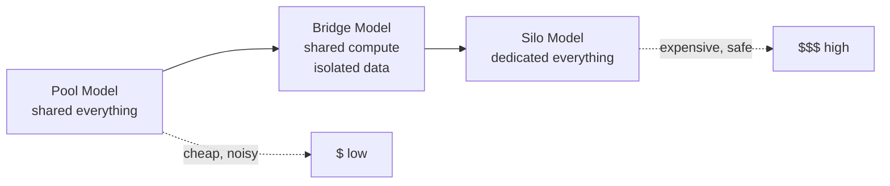
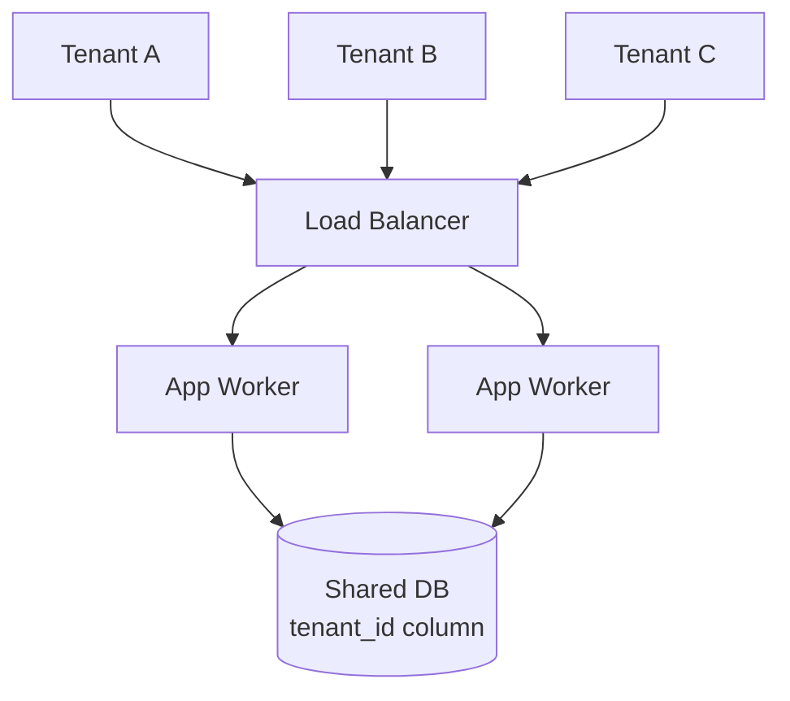
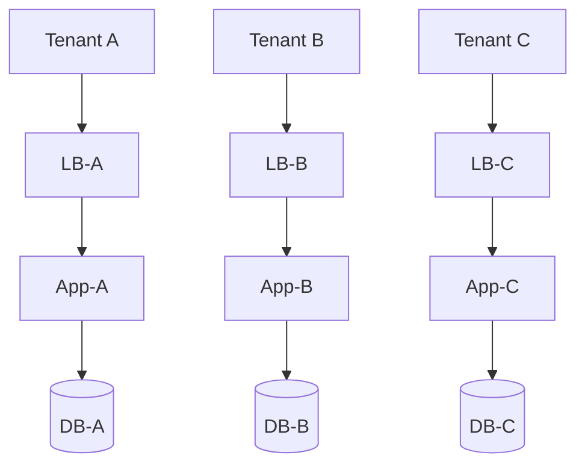
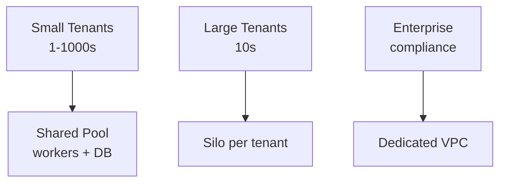
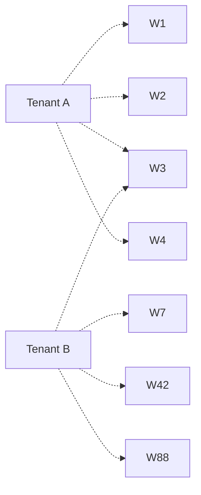
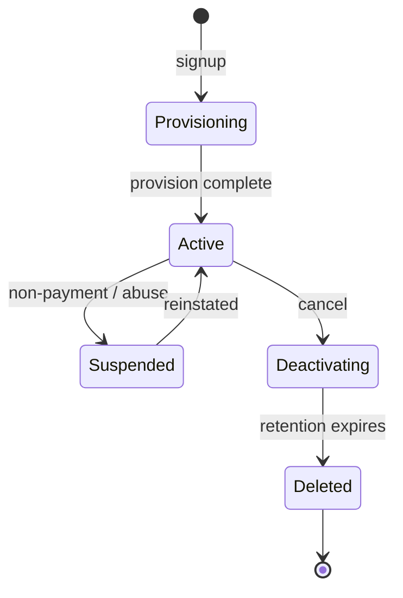

Goal: by the end of this, you can walk into a New Relic system design round, get asked *"how would you make this multi-tenant?"*, and answer with the vocabulary of someone who's run a multi-tenant control plane in production. This is one of the **most common staff-level system design probes** at observability companies — because every customer is a tenant, and every isolation failure is a P0 (data leak, noisy neighbor, billing bug).

---

## 1. Overview

Multi-tenancy is the practice of serving **many independent customers (tenants)** from **one shared system**, while making each tenant feel like they have their own dedicated environment.

The core trade-off:

> **More sharing → cheaper, easier to operate, harder to isolate.**
> **More isolation → safer, easier to reason about, more expensive.**

You will *always* be balancing these two. There is no "right" answer — only the right answer **for this workload, this customer profile, and this regulatory environment**.


*The three canonical isolation models. Most real systems are hybrids.*

> 💡 **Staff-level insight:** The interviewer is checking three things: (1) do you know the **isolation dimensions** (compute, storage, network, identity, blast radius), (2) can you reason about **trade-offs per dimension**, (3) do you know the **production gotchas** — noisy neighbors, tenant-of-doom, cross-tenant data leaks. Hit those three and you're at staff bar.

---

## 2. The Five Isolation Dimensions (The Mental Model)

Don't think "multi-tenant or not." Think **per-dimension**:

| Dimension        | What gets shared               | What can leak if you get it wrong                  |
| ---------------- | ------------------------------ | -------------------------------------------------- |
| **Compute**      | CPU, memory, goroutines        | Noisy neighbor, OOM kill takes everyone down       |
| **Storage**      | DB instance, table, S3 bucket  | Cross-tenant data exposure (the worst kind of bug) |
| **Network**      | Ingress, egress, internal mesh | Bandwidth hogging, side-channel attacks            |
| **Identity**     | Auth, authz, secrets           | Tenant A acts as Tenant B (auth bypass)            |
| **Blast radius** | Failure domain                 | One tenant's bad config crashes the whole fleet    |

A real system makes **separate decisions per dimension**. Example:

| Dimension    | Choice                                  | Reason                                        |
| ------------ | --------------------------------------- | --------------------------------------------- |
| Compute      | Shared workers                          | 1000s of small tenants — silo would cost 100x |
| Storage      | Per-tenant schema in shared Postgres    | Strong logical isolation, single ops surface  |
| Network      | Shared ingress, per-tenant rate limits  | Cost; rate limits handle noisy neighbor       |
| Identity     | Per-tenant API keys, JWT with tenant ID | Defense in depth                              |
| Blast radius | Tenant-aware circuit breakers           | One bad tenant can't take down the worker     |

> 💡 **Staff-level insight:** When asked *"how would you isolate tenants?"*, draw this 5-row table on the whiteboard. Fill it in for the system you're designing. That single move signals you've thought about this before.

---

## 3. The Three Canonical Models

### 3.1 Pool Model — Shared Everything


*Every tenant hits the same workers, same DB. Tenant ID on every row.*

**Use when:** thousands of small tenants, low per-tenant revenue, similar workloads (think: free tier, SMB SaaS).

**Pros:** cheapest by 10–100x. Single ops surface. Easy to add tenants (just an INSERT).
**Cons:** noisy neighbor risk. One DB schema change touches everyone. Compliance ceiling (no SOC 2 Type II for highly regulated tenants without a lot of work).

### 3.2 Silo Model — Dedicated Everything


*Every tenant gets their own stack — own DB, own workers, often own VPC.*

**Use when:** few large tenants, regulatory requirement (HIPAA, FedRAMP), tenant pays enough to justify (think: enterprise tier, on-prem deployment).

**Pros:** rock-solid isolation. Per-tenant tuning, version pinning, custom configs. Blast radius = 1.
**Cons:** expensive. N tenants = N stacks to deploy, monitor, upgrade. Operations cost grows linearly.

### 3.3 Bridge / Hybrid Model — The Real-World Default


*Most production systems run a pool for the long tail and silos for big/regulated tenants.*

**Use when:** you have a wide tenant size distribution. Most B2B SaaS at scale ends here.

> 💡 **Staff-level insight:** Snowflake, Databricks, New Relic all run hybrids. The **business model dictates the isolation model.** Free/Pro tier = pool. Enterprise = silo (or at least a "dedicated cluster" SKU). When asked, call this out — it shows you connect engineering to business.

---

## 4. Storage Isolation — The Most Important Decision

Storage is where data leaks happen. Get this wrong and you're on the front page of Hacker News.

### 4.1 The Four Storage Patterns

| Pattern                            | What it is                                       | Isolation                     | Cost           | When                         |
| ---------------------------------- | ------------------------------------------------ | ----------------------------- | -------------- | ---------------------------- |
| **Shared table, tenant_id column** | One table, every row tagged                      | Logical only — bug = leak     | Cheapest       | Pool, low risk               |
| **Shared DB, schema per tenant**   | One Postgres, `tenant_a.users`, `tenant_b.users` | Stronger (DB-enforced grants) | Cheap          | Pool with stronger isolation |
| **DB per tenant**                  | Separate Postgres instance per tenant            | Very strong                   | Expensive      | Silo                         |
| **Cluster per tenant**             | Whole cluster (PG + cache + workers)             | Maximum                       | Most expensive | Regulated / enterprise       |

### 4.2 The `tenant_id` Pattern — Done Right

The single most common pattern. Also the most commonly **broken**.

```sql
CREATE TABLE pipelines (
    id          UUID PRIMARY KEY,
    tenant_id   UUID NOT NULL,
    name        TEXT NOT NULL,
    config      JSONB NOT NULL,
    created_at  TIMESTAMPTZ NOT NULL DEFAULT now()
);

-- Index that includes tenant_id FIRST — every query filters by it
CREATE INDEX idx_pipelines_tenant_name ON pipelines(tenant_id, name);

-- Composite uniqueness scoped to tenant
CREATE UNIQUE INDEX uq_pipelines_tenant_name ON pipelines(tenant_id, name);
```

**The rules:**
1. **Every** tenant-scoped table has `tenant_id NOT NULL`.
2. **Every** index leads with `tenant_id` (queries always filter by it; this also helps partition pruning).
3. **Every** unique constraint includes `tenant_id` (otherwise tenant A can't have the same name as tenant B).
4. **Every** foreign key includes `tenant_id` (you cannot FK a child without verifying it belongs to the same tenant).
5. **Every** query goes through a layer that **automatically injects** `WHERE tenant_id = $1`.

> 💡 **Staff-level insight:** Rule 5 is the one teams forget. *"Engineers will remember to filter by tenant_id"* is **not a security model.** Build it into the framework. If your ORM or query builder can be called without tenant context, that's a CVE waiting to happen.

### 4.3 Defense in Depth — Postgres Row-Level Security (RLS)

```sql
ALTER TABLE pipelines ENABLE ROW LEVEL SECURITY;

CREATE POLICY tenant_isolation ON pipelines
    USING (tenant_id = current_setting('app.tenant_id')::uuid);

-- App sets this per request:
SET LOCAL app.tenant_id = '...';
SELECT * FROM pipelines;  -- automatically filtered by Postgres
```

**Pros:** Postgres enforces it — bug in app code can't bypass.
**Cons:** harder to debug ("where did my row go?"), small perf cost, trickier connection pooling (must `SET LOCAL` per transaction).

> 💡 **Staff-level insight:** Bring up RLS in interviews even if you don't use it — it shows you know **defense-in-depth thinking**. *"App-layer filter is line one; RLS is line two; backups segregated by tenant is line three. No single bug should leak data."*

### 4.4 Schema-per-Tenant in Postgres

```sql
CREATE SCHEMA tenant_acme;
CREATE TABLE tenant_acme.pipelines (...);

GRANT USAGE ON SCHEMA tenant_acme TO acme_user;
GRANT ALL ON ALL TABLES IN SCHEMA tenant_acme TO acme_user;
```

Stronger isolation, but:
- **Schema explosion**: 10K tenants = 10K schemas → `pg_class` bloat, slow `\d`, painful migrations.
- **Connection pooling pain**: connection-per-tenant doesn't scale; need pooler with `SET search_path` per query.
- **Migrations**: must run against every schema. Hours for large fleets.

Use this for **dozens to low hundreds** of tenants. Beyond that, the operational pain wins.

### 4.5 DB-per-Tenant

The silo. One Postgres per tenant.

**Operationally**: managed via control plane (Terraform / a controller — see Section 11 of the Kubernetes article above). Provision on signup. Destroy on cancel. Backups, patching, version pinning all per-tenant.

**Cost reality**: a small Postgres on AWS RDS is ~$15/mo minimum. 10K tenants = $150K/mo just for idle DBs. This is why pool exists.

---

## 5. Compute Isolation — The Noisy Neighbor Problem

### 5.1 The Tenant of Doom

A single tenant generates 1000x normal traffic (legitimate spike OR a bug). Your shared workers spend 100% of their time on that tenant. Every other tenant times out.

**You will see this question in every multi-tenancy interview.** "How do you prevent one tenant from taking down the system?"

### 5.2 The Three Defenses

#### (a) Per-Tenant Rate Limits

```go
type TenantLimiter struct {
    mu       sync.Mutex
    buckets  map[string]*rate.Limiter  // golang.org/x/time/rate
    perSec   rate.Limit
    burst    int
}

func (t *TenantLimiter) Allow(tenantID string) bool {
    t.mu.Lock()
    b, ok := t.buckets[tenantID]
    if !ok {
        b = rate.NewLimiter(t.perSec, t.burst)
        t.buckets[tenantID] = b
    }
    t.mu.Unlock()
    return b.Allow()
}
```

Per-tenant token bucket at the edge. Reject (429) before work hits the worker pool. Cheap and effective.

**Gotcha**: the map grows unboundedly. Add a TTL/LRU eviction. (Real implementations: `groupcache` patterns, or `github.com/hashicorp/golang-lru`.)

#### (b) Per-Tenant Concurrency Caps

Rate limits cap *requests per second*. They don't cap *in-flight cost*. A tenant doing 10 RPS of 30-second queries can still take 100 worker slots.

```go
type TenantSemaphore struct {
    mu   sync.Mutex
    sems map[string]chan struct{}
    cap  int
}

func (t *TenantSemaphore) Acquire(ctx context.Context, tenantID string) error {
    t.mu.Lock()
    s, ok := t.sems[tenantID]
    if !ok {
        s = make(chan struct{}, t.cap)
        t.sems[tenantID] = s
    }
    t.mu.Unlock()

    select {
    case s <- struct{}{}:
        return nil
    case <-ctx.Done():
        return ctx.Err()
    }
}
func (t *TenantSemaphore) Release(tenantID string) {
    <-t.sems[tenantID]
}
```

Cap *concurrent* work per tenant. Combined with rate limits, this is robust.

#### (c) Tenant-Aware Circuit Breakers

If tenant A's downstream consistently fails or times out, **break the circuit for tenant A only**. Other tenants keep flowing.

> 💡 **Staff-level insight:** A **shared** circuit breaker that opens on *any* failure is an outage waiting to happen — one bad tenant trips it for everyone. Always key circuit breakers by `(tenant_id, downstream)`.

### 5.3 Shuffle Sharding — The Elegant Defense

The Pool model has a problem: noisy tenant affects all workers. The Silo model is too expensive. **Shuffle sharding** is the middle path.

**The idea:** instead of all tenants hitting all workers, hash each tenant to a **subset** of workers (say, 4 of 100). Two random tenants probably overlap on 0–1 workers. A tenant of doom only takes down its 4 workers — not all 100.


*Tenant A goes to {W1,W2,W3,W4}; Tenant B to {W3,W7,W42,W88}. Overlap: just W3.*

**The math is beautiful**: with 100 workers and shards of 4, the probability that two tenants share *all* their workers is `1 / C(100, 4)` ≈ 1 in 4 million. Even in adversarial workloads, the blast radius is bounded.

This is how AWS Route 53, Lambda, and many AWS services isolate noisy customers without going full silo. **Mention it. It's a high-signal answer.**

> 💡 **Staff-level insight:** Read the AWS Builder's Library article *"Workload isolation using shuffle-sharding"* before the interview. It's 10 minutes and gives you a story to tell.

### 5.4 Kubernetes-Specific Compute Isolation

Since the JD mentions K8s, know these knobs:

| Mechanism                       | Isolates                                 | Use                                               |
| ------------------------------- | ---------------------------------------- | ------------------------------------------------- |
| **Namespaces + ResourceQuotas** | CPU, memory, count of objects per tenant | Per-tenant namespace, quota caps                  |
| **NetworkPolicies**             | Pod-to-pod traffic                       | Block tenant-A pods from talking to tenant-B pods |
| **PodSecurityAdmission**        | What pods can do                         | Prevent tenant pods from running privileged       |
| **Node taints + tolerations**   | Which nodes a pod runs on                | Dedicated node pools per tier                     |
| **PriorityClasses**             | Who gets evicted first                   | Free-tier pods evicted before paid-tier           |
| **LimitRanges**                 | Per-pod CPU/memory caps                  | Stop one pod from using all node resources        |

For real silo-grade isolation in K8s: **separate node pools** (or even separate clusters) per tenant tier. Pods are NOT a strong security boundary against a determined attacker — kernel CVEs cross them.

---

## 6. Identity & Authorization at Scale

### 6.1 The Three Layers

```
[Authentication]   "Who are you?"     → JWT / mTLS / API key
[Tenant Resolution] "Which tenant?"   → from JWT claim, subdomain, header
[Authorization]    "Can you do this?" → RBAC / ABAC, scoped to tenant
```

**Failure mode #1**: trusting client-supplied `tenant_id`. **Always derive it from the authenticated principal.** Never accept it from the request body or query string.

```go
// BAD: client sends tenant_id, server trusts it
func handler(w http.ResponseWriter, r *http.Request) {
    tenantID := r.URL.Query().Get("tenant_id")  // ❌ user can change this
    pipelines := db.Query(tenantID)
}

// GOOD: derive from JWT
func handler(w http.ResponseWriter, r *http.Request) {
    claims := r.Context().Value(claimsKey).(*Claims)
    tenantID := claims.TenantID  // ✅ signed by us, can't be tampered
    pipelines := db.Query(tenantID)
}
```

### 6.2 Cross-Tenant Operations (The Subtle Bug)

Sometimes one user has access to multiple tenants (consultancies, MSPs, internal admin). Two patterns:

1. **Tenant per session**: user "switches" tenant; session carries one tenant ID. Simple, hard to leak.
2. **Multi-tenant token**: JWT carries a list of tenant IDs and roles per tenant. Powerful, more code paths to audit.

> 💡 **Staff-level insight:** Internal admin tools are where data leaks happen most. The "view as customer" feature that bypasses normal authorization → the engineer who forgets to log it → the auditor who can't tell who saw what. **Every cross-tenant access must be logged and audited separately.**

### 6.3 Secret Isolation

Per-tenant credentials (e.g., the API key New Relic uses to push to a customer's Splunk) must be:
- **Encrypted at rest** with per-tenant keys (KMS envelope encryption)
- **Never logged** (redact in middleware, not at log site)
- **Scoped on rotation** — rotating tenant A's key cannot affect tenant B
- **Auditable** — who accessed which secret when

AWS KMS + per-tenant data keys is the standard pattern. In Go: `github.com/aws/aws-sdk-go-v2/service/kms`.

---

## 7. Tenant Lifecycle (Often Forgotten)

A multi-tenant system isn't just "serve traffic." It's a **lifecycle**:



Each transition is **its own engineering problem**:

| Transition             | What you must do                                                                              |
| ---------------------- | --------------------------------------------------------------------------------------------- |
| Signup → Provisioning  | Create tenant row, allocate resources (DB / schema / namespace), seed defaults, generate keys |
| Provisioning → Active  | Health check the new tenant; rollback on failure                                              |
| Active → Suspended     | Reject writes (or all traffic), keep data, send notification                                  |
| Active → Deactivating  | Stop ingress, drain in-flight, schedule data deletion per retention policy                    |
| Deactivating → Deleted | Hard-delete data across all stores (DB, S3, search, backups, replicas, caches)                |

**The hardest one is Deletion.** GDPR says you have 30 days. Your data is in: primary DB, read replica, daily backup × 90 days, S3 cold storage, search index, Kafka topic logs, downstream caches. **Every. Single. One.** must be deletable per tenant.

> 💡 **Staff-level insight:** Design for tenant deletion **on day one**. If you haven't, you have a $20M-per-incident GDPR risk. In an interview, mention this proactively when discussing tenant lifecycle. It immediately reads as someone who's been through the audit.

---

## 8. Observability in a Multi-Tenant World

Critical principle: **every metric, log, and trace must carry `tenant_id`**.

### 8.1 Metrics

```go
// BAD: aggregate across tenants — useless when one is misbehaving
requestsTotal := prometheus.NewCounter(...)

// GOOD: per-tenant label
requestsTotal := prometheus.NewCounterVec(
    prometheus.CounterOpts{Name: "requests_total"},
    []string{"tenant_id", "endpoint", "status"},
)
```

**Cardinality warning**: 100K tenants × 50 endpoints × 5 statuses = 25M time series. Prometheus will fall over. Solutions:
- **Aggregate small tenants** — bucket low-traffic tenants into a "small_tenants" label.
- **Top-N reporting** — track per-tenant only for the top 100; the rest in aggregate.
- **Per-tenant sampling** — sample traces at a tenant-scoped rate.
- **Use a system designed for this** — Mimir, VictoriaMetrics, M3, **New Relic** itself.

### 8.2 Logs and Traces

Every log line and trace span must include `tenant_id`. Build it into your context-propagation middleware:

```go
func TenantLogger(next http.Handler) http.Handler {
    return http.HandlerFunc(func(w http.ResponseWriter, r *http.Request) {
        tid := r.Context().Value(claimsKey).(*Claims).TenantID
        logger := slog.With("tenant_id", tid, "request_id", reqID(r))
        ctx := slog.NewContext(r.Context(), logger)
        next.ServeHTTP(w, r.WithContext(ctx))
    })
}
```

In incident response, the first question is *"which tenants are affected?"* If you can't answer in 30 seconds, your observability is broken.

### 8.3 Per-Tenant SLOs

Different tenants have different SLAs. Free-tier might get 99.5%; enterprise gets 99.99%. You need:
- Per-tenant SLO tracking (error budget per tenant)
- Per-tier alerting thresholds
- Reports that show *"tenant X has burned 80% of their monthly error budget"*

This is exactly **what New Relic sells**. Mention it in the interview. It's not flattery — it's understanding the product.

---

## 9. Gotchas — The Production Scars

### 9.1 The Forgotten `WHERE tenant_id`
The classic data-leak bug. Engineer writes `SELECT * FROM pipelines WHERE name = ?`, forgetting tenant filter. Tenant A sees Tenant B's data.
**Defense:** centralized query layer that **rejects any tenant-scoped query without tenant filter**. Lint rule, runtime check, RLS — all three.

### 9.2 The "Test in Production" Tenant
Engineer creates a tenant called "test" or "demo" with prod data for debugging. Six months later, a customer signs up named "Test Inc.", gets the wrong tenant ID due to a fuzzy lookup bug, and sees internal data.
**Defense:** strict tenant ID format (UUIDs, not names). Separate "internal" namespace for test tenants, never accessible from public auth.

### 9.3 Cache Poisoning Across Tenants
You cache `GET /api/pipelines/123` based on URL only. Tenant A and Tenant B both have a pipeline ID 123 (because IDs are scoped per tenant). Tenant A's data ends up in Tenant B's cache.
**Defense:** cache keys *must* include `tenant_id`. Same for HTTP cache headers, CDN, Redis, in-memory.

### 9.4 The Cross-Tenant Background Job
A nightly batch job runs `SELECT * FROM users` to compute aggregates. It has no tenant context — it's a "system" job. One day it's modified to send emails based on the result. Now tenant A's user gets an email about tenant B's data.
**Defense:** background jobs that touch tenant data must **iterate per tenant**, with the tenant context set explicitly.

### 9.5 Connection Pool Cross-Talk (RLS Pitfall)
With Postgres RLS, you `SET LOCAL app.tenant_id`. If your pooler uses transaction-level pooling, this works. If it uses session-level pooling and the connection is reused without resetting, the next request inherits the previous tenant's setting.
**Defense:** `SET LOCAL` (transaction-scoped) not `SET`. Use PgBouncer in transaction mode. Add a connection-checkout hook that resets `app.tenant_id` to NULL.

### 9.6 The Quota Math Bug
Per-tenant quota is "100 pipelines." Engineer adds soft delete. Now a tenant who hits the quota and deletes one can't create another (count includes soft-deleted).
**Defense:** distinguish "what counts toward quota" from "what exists in the table." Test quotas with the full lifecycle.

### 9.7 Backup Restore Across Tenants
Tenant A asks you to restore data from yesterday. You restore the entire DB → tenant B's data is also rolled back, losing 24 hours of their work.
**Defense:** per-tenant backup/restore. With shared DB, this means logical exports per tenant, not full DB snapshots, for restore operations.

### 9.8 Tenant Migrations Drift
You have 10K tenant schemas. A migration applies to 9,997. Three fail (locking, conflict, weird state). You don't notice. New code assumes the column exists. Three tenants get 500s for a week before someone figures it out.
**Defense:** migration runner with per-tenant status tracking, alerting on partial failures, dry-run mode, automatic retry.

### 9.9 The Per-Tenant Feature Flag Mess
Every customer wants something custom. You add per-tenant feature flags. Two years later: 200 flags × 10K tenants = combinatorial explosion. Every code path has to be tested under N configurations.
**Defense:** strict process for adding flags, sunset dates, regular cleanup. Tier-based defaults (free / pro / enterprise) over per-tenant flags wherever possible.

---

## 10. Where to Use (and Where NOT to Use) Each Model

| If your situation is...                                 | Pick                                                           |
| ------------------------------------------------------- | -------------------------------------------------------------- |
| Free / freemium SaaS, 10K+ tenants                      | **Pool** with strict per-tenant rate limits + shuffle sharding |
| B2B with mixed tier (free → enterprise)                 | **Hybrid**: pool for free/pro, silo for enterprise             |
| Regulated industry (HIPAA, PCI, FedRAMP) for that tier  | **Silo** for regulated tenants — non-negotiable                |
| Sub-millisecond latency required, very few tenants      | **Silo** — pool's extra hops kill latency                      |
| On-prem deployment                                      | **Silo** by definition (one customer, one install)             |
| Internal multi-team platform (e.g., infra-as-a-service) | **Pool** with namespace-level quotas                           |

**Don't:**
- Don't pool tenants whose blast radius would kill your business if they overlap (e.g., two customers in the same regulated vertical sharing infra without explicit consent).
- Don't silo tiny tenants — operations cost will kill you.
- Don't mix VERY different workload profiles in the same pool (one tenant with 100M events/sec next to a tenant with 10/sec — they have nothing in common; isolate).

---

## 11. Versus — Trade-Off Matrix

| Aspect                      | Pool             | Schema-per-tenant    | DB-per-tenant          | Cluster-per-tenant      |
| --------------------------- | ---------------- | -------------------- | ---------------------- | ----------------------- |
| **Cost / tenant**           | $                | $                    | $$                     | $$$$                    |
| **Isolation strength**      | Logical only     | DB-enforced          | Strong                 | Maximum                 |
| **Operational surface**     | 1 system         | 1 system, N schemas  | N systems              | N stacks                |
| **Migration complexity**    | Easy             | Hard (loop schemas)  | Hard (loop DBs)        | Hardest                 |
| **Compliance fit**          | Low              | Medium               | High                   | Highest                 |
| **Per-tenant tuning**       | None             | Some                 | Yes                    | Full                    |
| **Noisy neighbor risk**     | High             | Medium               | None                   | None                    |
| **Tenant onboarding speed** | Instant (INSERT) | Fast (CREATE SCHEMA) | Minutes (provision DB) | Hours (provision stack) |
| **Tenant deletion**         | DELETE rows      | DROP SCHEMA          | DROP DATABASE          | Destroy stack           |
| **Best for**                | Long tail        | Mid-tier B2B         | Enterprise             | Regulated / on-prem     |

**One-liner for the interview:** *"I'd start by mapping the tenant population. If 90% of tenants are small and 10% are large/regulated, I'd run a hybrid: pool with shuffle sharding for the long tail, dedicated cluster per enterprise tenant. The control plane reconciles both — pool is just one big 'cluster' from its perspective."*

---

## 12. Worked Example — Designing a Multi-Tenant Pipeline Service

Map this directly onto New Relic's likely architecture. Imagine the design round:

> *"Design the data plane that runs customer pipelines. Each customer can define many pipelines that ingest from sources and write to destinations. Make it multi-tenant. ~100K customers, top 1% sending 10K events/sec, bottom 90% sending <10/sec."*

**My answer would be:**

### Tier the tenants
- **Tier 1 (small, 90%)**: pool model. Shared workers, shared Kafka topic, shared Postgres for config.
- **Tier 2 (medium, 9%)**: pool but in a separate node pool with higher resource quotas.
- **Tier 3 (enterprise, 1%)**: dedicated worker fleet per tenant; dedicated Kafka topic; per-tenant config DB schema.

### Storage isolation
- Config DB (pipelines, sources, destinations): shared Postgres with `tenant_id` on every table, RLS enabled, schema-per-tenant for Tier 3.
- Event data flows through Kafka per tenant tier (shared topic with tenant header for Tiers 1–2, dedicated topic for Tier 3).
- Persistent state (e.g., DLQ data, checkpoint state): per-tenant S3 prefix with bucket-policy isolation.

### Compute isolation
- Workers run in K8s. Tier 1 in a shared deployment with **shuffle sharding** by `hash(tenant_id) % N` → tenant routes to a fixed subset of workers.
- Per-tenant **rate limit** at ingress (token bucket).
- Per-tenant **concurrency cap** (semaphore) on outbound destination calls.
- Tier 3 gets its own deployment per tenant.

### Network isolation
- Shared ingress for Tiers 1–2; dedicated ALB / VPC per Tier 3 tenant.
- NetworkPolicies prevent pod-to-pod cross-tenant traffic.
- Egress gateway logs per-tenant outbound for billing + audit.

### Identity
- JWT carries `tenant_id`, signed by control plane. Workers reject any request without a valid tenant claim.
- Per-tenant API keys for outbound destinations, stored in KMS-encrypted secret manager, never logged.

### Blast radius
- Per-tenant circuit breaker on each destination (so customer A's bad Splunk doesn't break customer B's pipelines).
- Per-tenant DLQ for failed events.
- Tier-based eviction priority — free-tier pods evicted first under node pressure.

### Lifecycle
- Tenant signup → control plane allocates schema (Tier 1/2) or provisions stack (Tier 3) via the Kubernetes-controller-pattern reconciler from earlier in this article.
- Tenant deletion → soft-delete config; 30-day retention; then hard-delete across DB, Kafka topics, S3, backups via per-tenant deletion job.

### Observability
- Every metric / log / trace tagged with `tenant_id`.
- Top-N tenant dashboards in real time; aggregate for the long tail.
- Per-tenant SLO tracking — burn rate alerts when a tenant is dropping events.

> 💡 **Staff-level insight:** Notice this answer pulls from **almost every other section** of this prep doc — the controller pattern (lifecycle), Temporal (rollouts), Kafka (event flow), Go concurrency (rate limits + semaphores), graceful shutdown (per-tenant drain). That cross-cutting integration **is** staff-level system design. Practice connecting them.

---

## 13. References

- **AWS Builder's Library — Workload isolation using shuffle-sharding**: https://aws.amazon.com/builders-library/workload-isolation-using-shuffle-sharding/
- **AWS SaaS Lens (Well-Architected)** — official SaaS multi-tenancy patterns: https://docs.aws.amazon.com/wellarchitected/latest/saas-lens/
- **"Multi-Tenant SaaS Patterns"** — Microsoft Azure architecture center: https://learn.microsoft.com/en-us/azure/architecture/guide/multitenant/
- **Postgres Row-Level Security docs**: https://www.postgresql.org/docs/current/ddl-rowsecurity.html
- **Stripe blog — "How we built our multi-tenant Postgres"** (search for the engineering posts on Citus + sharding)
- **Slack engineering — "Scaling Slack's Job Queue"** — multi-tenant fairness in shared workers
- **Figma engineering — "How Figma's databases team lived to tell the scale"** — sharding by tenant
- **Charity Majors on observability with high cardinality** — search "observability tenant id"

---

## 14. Interview Questions to Expect

### Q1: "Walk me through how you'd make this service multi-tenant."
**Cover:** the 5 isolation dimensions table, choose pool/silo/hybrid based on tenant profile, name the storage pattern, identify the noisy-neighbor defenses, mention lifecycle and deletion.

### Q2: "How do you stop one tenant from taking down the whole system?"
**Cover:** per-tenant rate limits (RPS), per-tenant concurrency caps (in-flight), per-tenant circuit breakers, **shuffle sharding** for compute, tier-based isolation as last resort. Bonus: priority + eviction policies.

### Q3: "How do you handle tenant data deletion for GDPR?"
**Cover:** all stores enumeration (primary, replica, backup, S3, search, cache, queue, downstream), per-tenant deletion jobs, audit log, SLA (30-day clock), test it regularly.

### Q4: "Two queries — one for tenant A, one for tenant B — share a connection pool. How do you stop them from leaking?"
**Cover:** never reuse connections across tenants without resetting. RLS with `SET LOCAL` in transaction-scoped pooling. App-layer rejection of any query missing `tenant_id`. Logging the tenant on every query.

### Q5: "How would you migrate 10K tenant schemas?"
**Cover:** migration runner with per-tenant tracking, parallelism control, retry on transient errors, **idempotent** migrations (re-runnable), dry-run + canary tenants, rollback plan, observability on partial failure.

### Q6: "When would you NOT make a system multi-tenant?"
**Cover:** regulated tenants requiring physical isolation, single-customer products, deployments where one tenant pays for >50% of infra anyway, latency profiles that can't tolerate any sharing.

### Q7: "How is `tenant_id` validated end-to-end?"
**Cover:** ingress middleware extracts from JWT (signed, can't be forged), propagated through `context.Context`, checked at DB layer, never accepted from request body. Audit logs include it. Cross-tenant access requires explicit role + audit entry.

### Q8: (curveball) "We have one tenant doing 100x normal traffic. How do you respond in real time?"
**Cover:** per-tenant rate limit kicks in (immediate), alert fires (within 1 min), tier them up to dedicated workers OR temporarily throttle harder, customer success contacts them. Long-term: tier upgrade or dedicated cluster.

---

## 15. Common Mistakes Lead Candidates Make

| Mistake                                          | Fix                                                        |
| ------------------------------------------------ | ---------------------------------------------------------- |
| "We'll just add tenant_id everywhere"            | Walk through the 5 dimensions; show you reason per-axis    |
| Forgetting noisy-neighbor problem                | Name shuffle sharding + per-tenant limits proactively      |
| Skipping the lifecycle                           | Explicitly cover provisioning AND deletion                 |
| Treating cache as tenant-safe by default         | Spell out "every cache key has tenant_id"                  |
| No mention of observability cardinality          | Discuss top-N + aggregation strategy                       |
| Picking one model and defending it everywhere    | Hybrid is the realistic answer for B2B SaaS                |
| Forgetting compliance / per-tenant audit         | Mention SOC 2 / HIPAA implications when relevant           |
| Hand-waving "we'll deal with that operationally" | Operational stories are your strongest material — use them |

---

## 16. Hands-On in 2 Hours

Build a tiny multi-tenant CRUD service this weekend:

1. Postgres with `tenant_id` on every table + RLS policies.
2. Go HTTP service with middleware that:
   - Extracts `tenant_id` from a fake JWT (header `X-Tenant`)
   - Sets it on `context.Context`
   - Sets it on the DB connection via `SET LOCAL app.tenant_id = $1` per transaction
   - Tags every log line with it (slog)
3. A per-tenant rate limiter (token bucket) middleware.
4. A per-tenant concurrency semaphore around the DB call.
5. Two test tenants with overlapping IDs in their data.

Then break it: try to read tenant A's data while authenticated as tenant B. Try to overflow the rate limit. Try to delete one tenant and verify nothing of the other is touched.

In 2 hours you'll have **felt** every concept here. That muscle memory wins interview rounds.

---

## 17. Staff-Level Tips

- **Always frame multi-tenancy as a per-dimension decision**, not a binary. That single move sets you apart.
- **Connect to business model**: pool = freemium, silo = enterprise. Engineering follows pricing.
- **Name shuffle sharding** even if not asked. It's a high-signal term.
- **Bring up tenant deletion / GDPR proactively**. Most candidates forget it; you don't.
- **Cite real systems**: Snowflake's multi-tenant architecture, Slack's job queue fairness, AWS shuffle sharding. Specificity reads as experience.
- **Tie to New Relic explicitly**: their product *is* a multi-tenant observability system. Show you've thought about how they handle it (per-account billing, per-account dashboards, per-account data residency).

---

## 18. The 30-Second Elevator Answer

> *"Multi-tenancy isn't one decision — it's five, one per dimension: compute, storage, network, identity, and blast radius. Pool model is cheapest, silo is safest, hybrid is what real B2B SaaS runs. The hard parts aren't the happy path — they're noisy neighbors, which I solve with per-tenant rate limits, concurrency caps, and shuffle sharding; tenant deletion, which I design for from day one because GDPR has teeth; and observability, where every metric, log, and trace must carry tenant_id without blowing up cardinality. Done right, the customer thinks they have their own dedicated system. Done wrong, you're on the front page of Hacker News."*

If you can deliver that fluently and back it with the worked example in Section 12, you've cleared the multi-tenancy bar at staff level.

---

## What's Next

Likely follow-ups (pick one):
- **B**: Postgres at scale — JSONB, advisory locks, partitioning, FOR UPDATE patterns
- **C**: Mock behavioral session — give me one of your real stories and I'll rewrite it at Lead level
- **D**: "Why New Relic" answer drafted from the JD
- **E**: Terraform provider design (the IaC angle from the JD)
- **F**: A consolidated 4-week study calendar with daily checkboxes
- **G**: Now that all 9 deep-dives are written, **split this article.md into separate per-topic files + a main README index** (per your earlier request)

