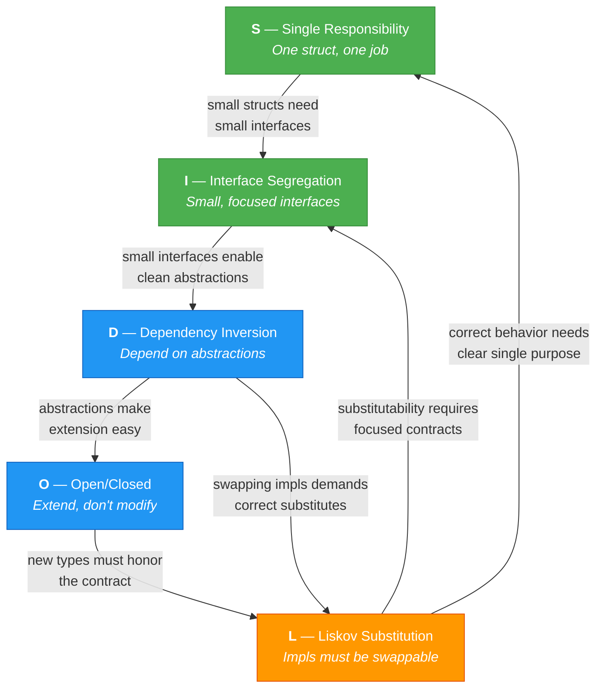

## What is SOLID?

**SOLID** is a set of **five design principles** introduced by Robert C. Martin (Uncle Bob) that guide developers to write code that is **easy to maintain, extend, and test**. Each letter stands for one principle. Together, they help you build software that doesn't turn into a tangled mess as it grows.

> In an interview, say: *"SOLID is a set of five design principles that help us write code with low coupling and high cohesion — making it easier to change, test, and scale over time."*

---

## 1. **S** — Single Responsibility Principle (SRP)

**Definition:** *A struct (or module) should have **one and only one reason to change** — meaning it should have only one job or responsibility.*

If a struct handles user data AND sends emails AND generates reports, a change in email logic could accidentally break reporting. SRP says: **split them apart**.

**Tip to remember:** *"One struct, one job."*

```go
// ❌ Bad: User struct does too much
type User struct{}

func (u *User) Save(db *sql.DB) error    { /* saves to DB */ }
func (u *User) SendEmail(msg string)      { /* sends email */ }
func (u *User) GenerateReport() string    { /* generates PDF */ }

// ✅ Good: Separate responsibilities
type User struct {
    Name  string
    Email string
}

type UserRepository struct{ DB *sql.DB }
func (r *UserRepository) Save(u User) error { /* saves to DB */ return nil }

type EmailService struct{}
func (e *EmailService) Send(to, msg string) error { /* sends email */ return nil }
```

**Why it matters:** When the email provider changes, you only touch `EmailService` — not the `User` struct.

---

## 2. **O** — Open/Closed Principle (OCP)

**Definition:** *Software entities (structs, functions, packages) should be **open for extension but closed for modification**. You should be able to add new behavior without changing existing, tested code.*

Think of it like a power strip — you **plug in** new devices without rewiring the strip itself.

**Tip to remember:** *"Add new behavior without editing old code."*

```go
// Define a behavior via interface
type Notifier interface {
    Notify(message string) error
}

// Extend by adding new types — no need to modify existing ones
type EmailNotifier struct{}
func (e EmailNotifier) Notify(msg string) error { fmt.Println("Email:", msg); return nil }

type SlackNotifier struct{}
func (s SlackNotifier) Notify(msg string) error { fmt.Println("Slack:", msg); return nil }

// This function NEVER changes when you add a new notifier
func AlertAll(notifiers []Notifier, msg string) {
    for _, n := range notifiers {
        n.Notify(msg)
    }
}
```

**Why it matters:** Adding SMS notification = create `SMSNotifier` struct. Zero changes to `AlertAll`.

---

## 3. **L** — Liskov Substitution Principle (LSP)

**Definition:** *If `S` is a subtype (or implementation) of `T`, then objects of type `T` should be **replaceable with objects of type `S` without breaking the program's correctness**. Every implementation of an interface must honor the contract the caller expects.*

In plain English: if your function accepts an interface, **any struct that implements it should work correctly** — no surprises, no panics, no wrong behavior.

**Tip to remember:** *"If it implements the interface, it must behave correctly — not just compile."*

```go
type Storage interface {
    Save(key string, data []byte) error
}

// Both are interchangeable — caller doesn't care which one
type DiskStorage struct{}
func (d DiskStorage) Save(key string, data []byte) error {
    return os.WriteFile(key, data, 0644)
}

type S3Storage struct{ Bucket string }
func (s S3Storage) Save(key string, data []byte) error {
    // upload to S3
    return nil
}

// Works with ANY Storage — no surprises
func Backup(s Storage, key string, data []byte) error {
    return s.Save(key, data)
}
```

**Why it matters:** You can swap `DiskStorage` for `S3Storage` in tests or prod without the caller knowing.

---

## 4. **I** — Interface Segregation Principle (ISP)

**Definition:** *A client should **not be forced to depend on methods it does not use**. Instead of one large interface, use several small, focused interfaces.*

If your `Animal` interface has `Walk()`, `Swim()`, and `Fly()`, a `Dog` is forced to implement `Fly()` — which makes no sense. ISP says: **break it into smaller interfaces**.

**Tip to remember:** *"Small interfaces > fat interfaces."* (Go already encourages this!)

```go
// ❌ Bad: Fat interface
type Animal interface {
    Walk()
    Swim()
    Fly()
}
// A Dog can't Fly() — forced to add a dummy method 😬

// ✅ Good: Small, focused interfaces
type Walker interface { Walk() }
type Swimmer interface { Swim() }
type Flyer interface { Fly() }

type Dog struct{}
func (d Dog) Walk() { fmt.Println("walking") }
func (d Dog) Swim() { fmt.Println("swimming") }
// Dog only implements what it can actually do

type Duck struct{}
func (d Duck) Walk() { fmt.Println("walking") }
func (d Duck) Swim() { fmt.Println("swimming") }
func (d Duck) Fly()  { fmt.Println("flying") }
```

> 💡 **Staff-level insight:** Go's standard library follows this perfectly. `io.Reader` has ONE method. `io.Writer` has ONE method. Need both? Use `io.ReadWriter`. This is ISP in action.

---

## 5. **D** — Dependency Inversion Principle (DIP)

**Definition:** *High-level modules should **not depend on low-level modules**. Both should depend on **abstractions** (interfaces). Additionally, abstractions should not depend on details — details should depend on abstractions.*

In plain English: your business logic (`OrderService`) should not directly know about MySQL or Postgres. It should talk to an **interface** — and the database layer implements that interface.

**Tip to remember:** *"Accept interfaces, return structs."*

```go
// ❌ Bad: Directly depends on concrete MySQL
type OrderService struct {
    db *sql.DB  // tightly coupled to SQL
}

// ✅ Good: Depends on an interface
type OrderRepository interface {
    FindByID(id string) (Order, error)
    Save(order Order) error
}

type OrderService struct {
    repo OrderRepository  // depends on abstraction
}

func NewOrderService(repo OrderRepository) *OrderService {
    return &OrderService{repo: repo}
}

// Now you can inject a mock for testing
type MockOrderRepo struct{}
func (m MockOrderRepo) FindByID(id string) (Order, error) { return Order{}, nil }
func (m MockOrderRepo) Save(order Order) error            { return nil }
```

**Why it matters:** Testing becomes trivial. Swapping Postgres for DynamoDB = implement the interface, change one line.

---

## Quick Cheat Sheet

| Principle                 | Definition (Interview Answer)                               | Go Idiom                                   |
| ------------------------- | ----------------------------------------------------------- | ------------------------------------------ |
| **S**ingle Responsibility | One reason to change — one job per struct                   | Split into focused packages/structs        |
| **O**pen/Closed           | Open for extension, closed for modification                 | Use interfaces to add behavior             |
| **L**iskov Substitution   | Subtypes must be substitutable without breaking correctness | Any impl must honor the interface contract |
| **I**nterface Segregation | Don't force unused methods on a client                      | Small interfaces: 1-2 methods max          |
| **D**ependency Inversion  | Depend on abstractions, not concretions                     | Accept interfaces, return structs          |

---

## The 30-Second Interview Answer

> *"SOLID is five design principles by Robert C. Martin that help build maintainable software. **S** means each module has one job. **O** means you extend behavior by adding new code, not modifying existing code. **L** means any implementation of an interface can replace another without breaking things. **I** means keep interfaces small so clients aren't forced to depend on methods they don't use. **D** means depend on abstractions like interfaces, not concrete types. In Go, these map naturally to small interfaces, composition, and constructor injection."*

---

## How SOLID Principles Connect (Relationship Map)



*Green = "Keep it small" theme (SRP, ISP) · Blue = "Use abstractions" theme (OCP, DIP) · Orange = LSP bridges both.*

| Theme                  | Principles         | Core Idea                                     |
| ---------------------- | ------------------ | --------------------------------------------- |
| **Keep It Small**      | SRP + ISP          | One job per struct, one purpose per interface |
| **Use Abstractions**   | OCP + DIP          | Depend on interfaces to extend and decouple   |
| **Honor the Contract** | LSP (bridges both) | Implementations must behave correctly         |

---

## Memory Trick for "SOLID"

> **S**mall structs, **O**pen interfaces, **L**egit substitutes, **I**solated contracts, **D**epend on abstractions.

Go is naturally aligned with SOLID because of its **implicit interface satisfaction** (no `implements` keyword) and **composition over inheritance** model. If you follow idiomatic Go — small interfaces, package-level separation, and constructor injection — you're already applying most of SOLID without even trying.
