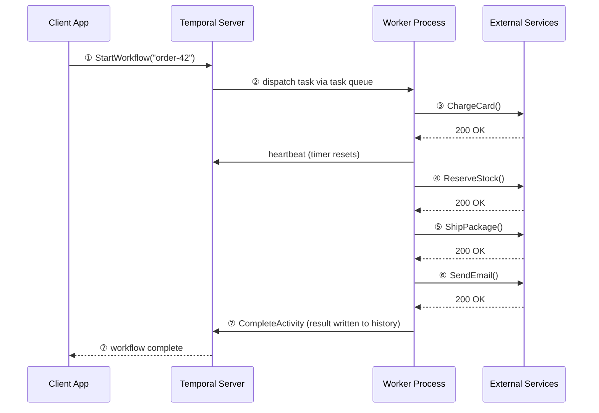
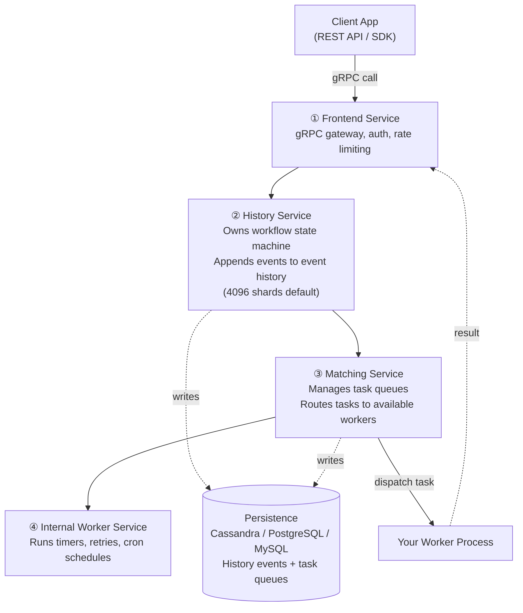
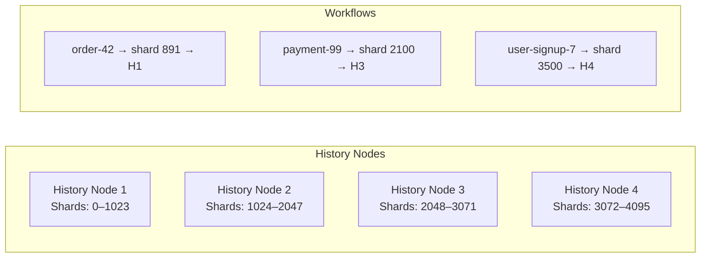
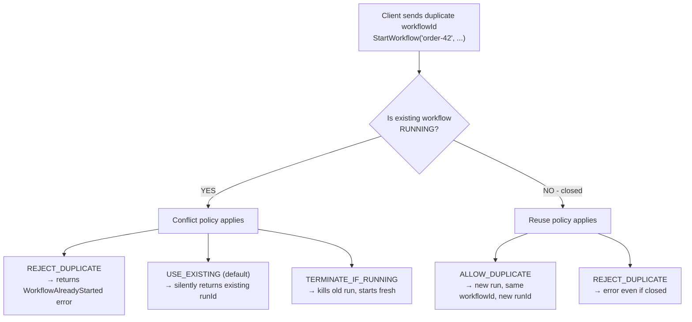
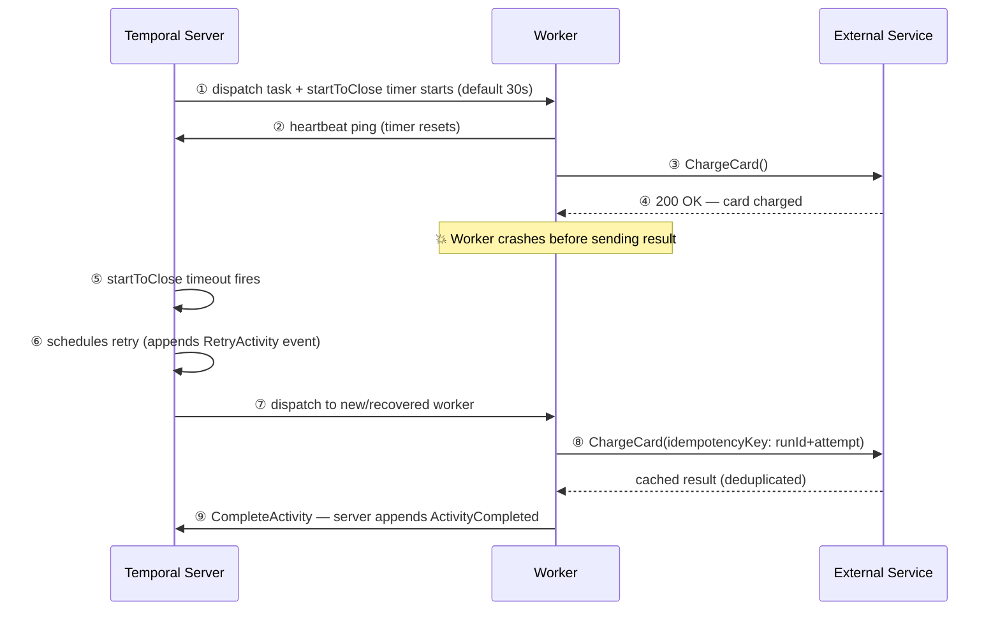
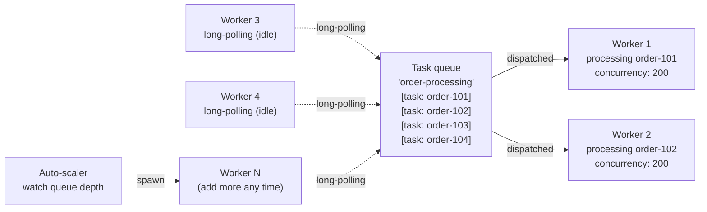
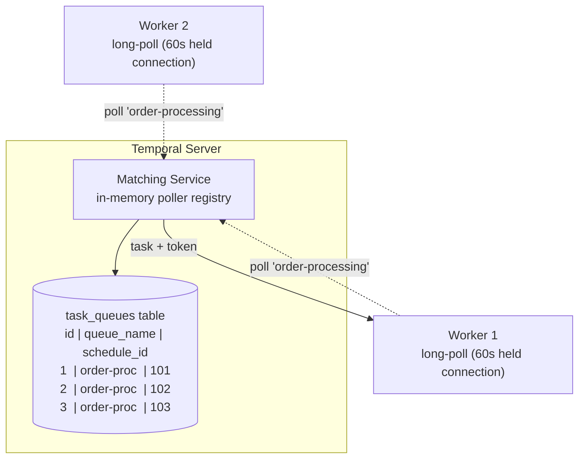
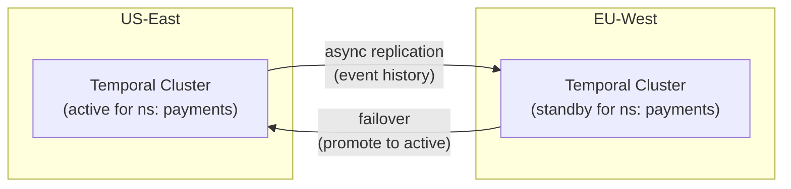
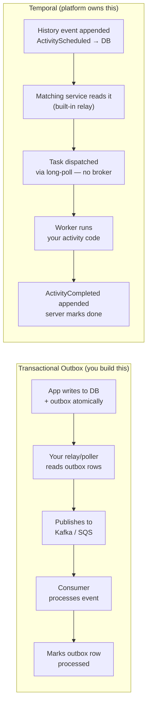

> *A senior architect's guide to Temporal — from workflow basics to internals, task queues, worker scaling, crash recovery, determinism gotchas, and how it compares to Step Functions, Airflow, and patterns you already know.*

---

## Table of Contents

1. [What is Temporal?](#what-is-temporal)
2. [A Simple Example: Order Fulfillment](#a-simple-example-order-fulfillment)
3. [Inside the Temporal Server](#inside-the-temporal-server)
4. [Workflow Determinism & Versioning](#workflow-determinism--versioning)
5. [Workflow ID Conflicts](#workflow-id-conflicts)
6. [Worker Completes the Job But Fails to Report Back](#worker-completes-but-fails-to-report)
7. [Worker Parallelism & Scaling](#worker-parallelism)
8. [What Queue Does Temporal Use?](#what-queue-does-temporal-use)
9. [How Temporal Tracks Workers via Task Tokens](#how-temporal-tracks-workers)
10. [Scale: 10x → 100x → 1000x](#scale)
11. [Monitoring & Observability](#monitoring--observability)
12. [Gotchas](#gotchas)
13. [Use Cases](#use-cases)
14. [Where to Use — and Where NOT to Use](#where-to-use--and-where-not-to-use)
15. [Versus: Temporal vs the Alternatives](#versus)
16. [Is This Just the Outbox Pattern?](#is-this-just-the-outbox-pattern)
17. [References](#references)
18. [Interview Questions](#interview-questions)
19. [Staff-Level Preparation Tips](#staff-level-preparation-tips)

---

## What is Temporal?

Temporal is a **durable execution platform**. It lets you write long-running business logic as plain code — and guarantees it will finish, even if servers crash, networks fail, or the process takes days or weeks.

The core idea is deceptively simple:

> **Your code is the workflow definition. Temporal handles all reliability concerns underneath.**

Without Temporal, building a reliable multi-step process means stitching together job queues, retry logic, state machines, timeout handlers, and idempotency keys — all by hand. With Temporal, you write a normal function and call each step. Temporal makes that function durable.

### An Honest Look at the Trade-offs

Temporal is not free magic. Adopting it means:

- **Latency overhead**: every activity dispatch adds ~5–20ms round-trip to the Temporal server. High-frequency, latency-sensitive paths (sub-millisecond hot loops) are not appropriate.
- **Operational cost**: self-hosting means running a stateful cluster (History service + Cassandra/Postgres). Temporal Cloud removes this but costs money at scale.
- **Learning curve**: workflow determinism rules, versioning with `GetVersion`, and replay semantics take weeks to internalize. Teams that skip this education hit non-determinism errors in production.
- **Debugging replay issues**: when a workflow fails replay (due to a non-deterministic code change), the error messages are cryptic. You're debugging event history diffs, not stack traces.
- **Vendor lock-in to workflow-as-code model**: migrating off Temporal means rewriting orchestration logic. There's no standard interchange format.

These are real costs. A staff engineer's adoption recommendation must weigh them against the alternative: building and operating your own retry/state-machine/queue infrastructure.

---

## A Simple Example: Order Fulfillment

Imagine placing an order on an e-commerce site. The process involves four steps:

1. Charge the card
2. Reserve inventory
3. Ship the package
4. Send a confirmation email

Without Temporal, a server crash between steps 2 and 3 leaves you with charged cards and no shipment — and no clean way to recover. With Temporal, the workflow resumes exactly where it left off.

Here is the workflow in Go:

```go
func OrderWorkflow(ctx workflow.Context, order Order) error {
    actOpts := workflow.ActivityOptions{
        StartToCloseTimeout: 30 * time.Second,
        RetryPolicy: &temporal.RetryPolicy{
            InitialInterval:    time.Second,
            BackoffCoefficient: 2.0,
            MaximumAttempts:    5,
        },
    }
    ctx = workflow.WithActivityOptions(ctx, actOpts)

    if err := workflow.ExecuteActivity(ctx, ChargeCard, order).Get(ctx, nil); err != nil {
        return err
    }
    if err := workflow.ExecuteActivity(ctx, ReserveStock, order).Get(ctx, nil); err != nil {
        return err
    }
    if err := workflow.ExecuteActivity(ctx, ShipPackage, order).Get(ctx, nil); err != nil {
        return err
    }
    if err := workflow.ExecuteActivity(ctx, SendEmail, order).Get(ctx, nil); err != nil {
        return err
    }
    return nil
}
```

It looks like normal sequential code. Under the hood, every `ExecuteActivity` call is a durable checkpoint.

### The Worker Bootstrap

```go
func main() {
    c, err := client.Dial(client.Options{
        HostPort: "temporal:7233",
    })
    if err != nil {
        log.Fatalln("unable to create Temporal client", err)
    }
    defer c.Close()

    w := worker.New(c, "order-processing", worker.Options{
        MaxConcurrentActivityExecutionSize:     200,
        MaxConcurrentWorkflowTaskExecutionSize: 100,
    })

    // Register workflow and activities
    w.RegisterWorkflow(OrderWorkflow)
    w.RegisterActivity(ChargeCard)
    w.RegisterActivity(ReserveStock)
    w.RegisterActivity(ShipPackage)
    w.RegisterActivity(SendEmail)

    if err := w.Run(worker.InterruptCh()); err != nil {
        log.Fatalln("unable to start worker", err)
    }
}
```

### The Flow



**① Client calls `StartWorkflow()`** — Your app tells Temporal to start an `OrderWorkflow`. It gets back a workflow ID immediately.

**② Server dispatches via task queue** — The Temporal server places a task on the queue. Your worker long-polls for tasks, picks it up, and begins executing.

**③–⑥ Activities execute sequentially** — Each `ExecuteActivity()` call is an **Activity**: a unit of work with configurable retries, timeouts, and heartbeating.

**⑦ Completion written to event history** — Every completed activity is appended to the durable event log before moving on. This is the key to crash recovery.

### Three Key Mental Models

| Concept           | What It Is                   | Analogy                              |
| ----------------- | ---------------------------- | ------------------------------------ |
| **Workflow**      | The orchestration logic      | A recipe — defines the steps         |
| **Activity**      | A single side-effecting step | One cooking action (chop, fry)       |
| **Event history** | Append-only durable log      | A kitchen notepad — survives crashes |

> 💡 **Staff-level insight:** The workflow function is replayed from event history on every workflow task. This means it must be **deterministic** — no `time.Now()`, no `rand`, no map iteration. All side effects must live in activities. This single constraint is the #1 source of bugs in Temporal adoption.

---

## Inside the Temporal Server

The Temporal server is often treated as a black box. It has **four distinct internal subsystems**, each with a clear responsibility.

> **The server never runs your business logic.** It only tracks what happened, what needs to happen next, and who should do it.



**① Frontend service** — the only public face of the server. Every call from your client app hits this first. It handles gRPC routing, authentication, rate limiting, and namespace isolation. Zero business logic — purely a smart proxy.

**② History service** — the brain. It owns a *workflow state machine* and appends an immutable event for every meaningful transition: `WorkflowStarted`, `ActivityScheduled`, `ActivityCompleted`, `TimerFired`. Current workflow state = replay of event history.

**③ Matching service** — the dispatcher. When History decides "activity A needs to run", it writes a task to Matching, which maintains the task queues your workers long-poll. Matching finds an available worker and delivers the task — completely decoupling execution scale from orchestration.

**④ Internal worker service** — runs Temporal's own housekeeping: timer firing (when a `workflow.Sleep(7 * 24 * time.Hour)` expires), retry scheduling, cron job dispatch, and workflow timeouts. Temporal's own workflows, running inside Temporal.

### History Service Sharding

The History service partitions all workflows across **shards** (default: 4096 shards). Each workflow is deterministically assigned to one shard via `hash(namespaceId + workflowId) % numShards`. Each shard is owned by exactly one History node at any time.



**Shard ownership and failover**: Temporal uses a **ring-based membership protocol** (via Hashicorp's memberlist/ringpop). When a History node dies, its shards are redistributed to surviving nodes within seconds. During failover, in-flight workflow tasks on those shards stall briefly (typically 5–15 seconds) until the new owner loads the shard's state.

**Hot shard problem**: If many workflows share a shard (e.g., all workflow IDs have similar hash values), that shard's owning node becomes a bottleneck. The fix is ensuring workflow IDs have good hash distribution — use UUIDs or well-distributed business IDs.

> 💡 **Staff-level insight:** Shard count is set at cluster creation and **cannot be changed without a migration**. If you start with 512 shards and later need 4096, you're looking at a data migration. Always start with the default 4096 for production clusters.

### The Persistence Layer

All four services are stateless compute. The real state lives in the database. Temporal supports Cassandra, PostgreSQL, and MySQL. Two things are persisted:

- The **event history log** — append-only, the source of truth for every workflow
- **Task queue state** — so tasks survive Matching service restarts

**Persistence choice at scale:**

| Scale                  | PostgreSQL           | Cassandra                 |
| ---------------------- | -------------------- | ------------------------- |
| < 100 workflows/sec    | ✅ Simple, familiar   | Overkill                  |
| 100–1000 workflows/sec | Possible with tuning | ✅ Better write throughput |
| > 1000 workflows/sec   | ❌ Write bottleneck   | ✅ Designed for this       |

---

## Workflow Determinism & Versioning

This is the **single most important concept** for teams adopting Temporal. It trips up every team at least once.

### Why Determinism Matters

When a workflow resumes after a crash (or when the sticky cache evicts it), Temporal **replays the entire event history** through your workflow function. It doesn't store your local variables — it reconstructs them by re-executing the function and matching each `ExecuteActivity` call against the recorded history.

If your code produces different decisions on replay than it did originally, Temporal throws a **non-determinism error** and the workflow is stuck.

### The Rules

**NEVER do these inside a workflow function:**

```go
// ❌ WRONG — non-deterministic in workflow code
t := time.Now()                    // different on replay
r := rand.Intn(100)               // different on replay
id := uuid.New()                   // different on replay

// ❌ WRONG — map iteration order is non-deterministic in Go
for k, v := range myMap {
    workflow.ExecuteActivity(ctx, Process, k, v)
}

// ❌ WRONG — goroutines without workflow.Go
go func() { doStuff() }()
```

**DO this instead:**

```go
// ✅ CORRECT — use Temporal's deterministic APIs
t := workflow.Now(ctx)                          // replays consistently
id := workflow.SideEffect(ctx, func(ctx workflow.Context) interface{} {
    return uuid.New().String()
})

// ✅ CORRECT — sort keys first for deterministic order
keys := make([]string, 0, len(myMap))
for k := range myMap {
    keys = append(keys, k)
}
sort.Strings(keys)
for _, k := range keys {
    workflow.ExecuteActivity(ctx, Process, k, myMap[k])
}

// ✅ CORRECT — use workflow.Go for concurrency
workflow.Go(ctx, func(gCtx workflow.Context) {
    // concurrent workflow logic here
})
```

### Versioning with `workflow.GetVersion`

When you need to change workflow logic while workflows are in flight, use `GetVersion`:

```go
func OrderWorkflow(ctx workflow.Context, order Order) error {
    // v1: original code path
    // v2: added fraud check before charging card
    v := workflow.GetVersion(ctx, "add-fraud-check", workflow.DefaultVersion, 1)

    if v == 1 {
        // New workflows: run fraud check first
        if err := workflow.ExecuteActivity(ctx, FraudCheck, order).Get(ctx, nil); err != nil {
            return err
        }
    }
    // Both v0 and v1 proceed to charge card
    if err := workflow.ExecuteActivity(ctx, ChargeCard, order).Get(ctx, nil); err != nil {
        return err
    }
    // ... rest of workflow
    return nil
}
```

`GetVersion` records the version in the event history on first execution. On replay, it reads the recorded version — so old workflows take the old path, new workflows take the new path. Both coexist safely.

> 💡 **Staff-level insight:** `GetVersion` calls accumulate forever in your workflow code. After all old workflows complete, you can remove the old branch — but only after verifying no in-flight workflows remain on that version. Use Temporal's visibility APIs to query running workflows before cleanup.

---

## Workflow ID Conflicts

When a client calls `StartWorkflow()` with an ID that already exists, Temporal's behaviour depends on the **`WorkflowIdConflictPolicy`** you configure.

### The Critical Distinction: Workflow ID vs Run ID

| Identifier   | Purpose                                                        |
| ------------ | -------------------------------------------------------------- |
| `workflowId` | Business identity you assign (`"order-42"`). Stable, reusable. |
| `runId`      | UUID Temporal generates per execution. Owns the event history. |

Events are **never appended by re-sending the same workflow ID**. Each run is isolated. History belongs to a `runId`, not the `workflowId`.

### Conflict Policies



**`REJECT_DUPLICATE`** — strict. Returns `WorkflowExecutionAlreadyStarted` error. Use for payment processing or anything that must never fire twice concurrently.

**`USE_EXISTING`** (SDK default) — idempotent-safe. If already running, silently return the existing run ID. Safe to call multiple times — perfect for "ensure this workflow is running" patterns.

**`TERMINATE_IF_RUNNING`** — the reset. Kill whatever is running and start fresh. Useful when a newer version of a task supersedes the old one.

```go
// Called 5 times — only 1 workflow ever runs
we, err := c.ExecuteWorkflow(ctx, client.StartWorkflowOptions{
    ID:        fmt.Sprintf("order-%s", orderId),
    TaskQueue: "order-processing",
    // USE_EXISTING is the default — fully idempotent
}, OrderWorkflow, order)
```

---

## Worker Completes the Job But Fails to Report Back

This is one of the most important reliability scenarios. Without Temporal, it's a nightmare: your worker did the work, but the update failed — now you don't know whether to retry (risking double-execution) or skip.

### What Temporal Does



Temporal's side is fully automatic. When a worker picks up a task, the server starts a `startToClose` timer. If the worker never sends completion within that timeout, Temporal assumes it's dead and schedules a retry — appending `ActivityTaskTimedOut` and a fresh `ActivityTaskScheduled` to the event history.

### The Real Problem: Your Activity Ran Twice

Temporal guarantees **at-least-once execution** for activities, not exactly-once. The work your worker did may get executed again on retry.

**The solution is idempotency keys on your activity side:**

```go
func ChargeCard(ctx context.Context, order Order) error {
    info := activity.GetInfo(ctx)
    idempotencyKey := fmt.Sprintf("%s-%s-%d",
        info.WorkflowExecution.ID,
        info.WorkflowExecution.RunID,
        info.Attempt,
    )

    _, err := stripeClient.Charges.New(&stripe.ChargeParams{
        Amount:         stripe.Int64(order.Total),
        IdempotencyKey: stripe.String(idempotencyKey),
    })
    return err
}
```

> 💡 **Staff-level insight:** Temporal gives you at-least-once activity execution. If your external service doesn't support idempotency keys natively (unlike Stripe), you must implement your own deduplication — typically via a `processed_operations` table with a unique constraint on the idempotency key. This is the same problem you'd solve without Temporal, but now it's scoped to individual activities instead of entire flows.

### The Three Timers

| Timer                    | Default                   | What It Guards                                                                  |
| ------------------------ | ------------------------- | ------------------------------------------------------------------------------- |
| `ScheduleToStartTimeout` | ∞ (no default)            | Time between Temporal dispatching and worker picking up. Guards stuck queues.   |
| `StartToCloseTimeout`    | **Required** (no default) | Time between worker starting and completing. Fires in the crash scenario above. |
| `ScheduleToCloseTimeout` | ∞ (no default)            | Total budget across all retry attempts.                                         |
| `HeartbeatTimeout`       | None                      | Max silence between heartbeats. Faster failure detection than StartToClose.     |

### Heartbeating for Long-Running Activities

```go
func ProcessVideo(ctx context.Context, file string) error {
    chunks := splitIntoChunks(file)
    for i, chunk := range chunks {
        if err := processChunk(chunk); err != nil {
            return err
        }
        // Heartbeat with progress — allows resume on retry
        activity.RecordHeartbeat(ctx, i)

        // Check if we've been cancelled
        if ctx.Err() != nil {
            return ctx.Err()
        }
    }
    return nil
}
```

Configure `HeartbeatTimeout` tightly (e.g., 30 seconds for a video job that processes one chunk per second). If the worker dies mid-loop, Temporal detects the missing heartbeat and retries — much faster than waiting for the full `StartToCloseTimeout`. The heartbeat payload (`i` above) is available to the new worker on retry via `activity.GetHeartbeatDetails()` for resuming mid-task.

---

## Worker Parallelism

There is **no fixed limit** on the number of workers. Temporal's pull model is what makes scaling clean.

### The Pull Model

Temporal uses **pull, not push**. Workers long-poll the server saying "I'm ready, give me a task." The Matching service only dispatches to a worker that has declared itself available. A busy worker simply stops polling until it has capacity. Zero risk of a worker being overwhelmed.

Each task is dispatched to **exactly one worker** — the Matching service guarantees no double-dispatch.



### Two Levels of Concurrency

**Level 1 — across workers (horizontal scale).** Run as many worker processes as you want on separate pods, VMs, or containers. All listen on the same task queue name.

**Level 2 — within a single worker (goroutine-level).** Each worker has configurable concurrency settings:

```go
w := worker.New(c, "order-processing", worker.Options{
    MaxConcurrentActivityExecutionSize:     200, // default: 1000
    MaxConcurrentWorkflowTaskExecutionSize: 100, // default: 1000
    WorkerActivitiesPerSecond:              500, // rate limit per worker
})
```

10 workers × 200 activity concurrency = **2,000 activities running in parallel**.

### Real Throughput Limits

| Bottleneck                     | What To Do                                                                         |
| ------------------------------ | ---------------------------------------------------------------------------------- |
| Task queue depth growing       | Add more workers or raise per-worker concurrency                                   |
| Database connections exhausted | Pool connections, reduce per-worker concurrency                                    |
| External API rate limits       | Use `WorkerActivitiesPerSecond` or `TaskQueueActivitiesPerSecond`                  |
| Temporal server itself         | Temporal Cloud scales automatically; self-hosted needs more History/Matching nodes |

### Auto-Scaling Pattern

```go
resp, err := c.DescribeTaskQueue(ctx, "order-processing", enums.TASK_QUEUE_TYPE_ACTIVITY)
if err != nil {
    log.Fatal(err)
}
// resp.Pollers tells you how many workers are active
// Combine with queue depth metrics for scaling decisions
```

Workers scale like stateless microservices. No coordination needed. The task queue absorbs bursts, workers drain at their own pace.

---

## What Queue Does Temporal Use?

**Temporal's task queue is not Kafka, not RabbitMQ, not Redis.** It is rows in the same database Temporal already uses for event history.



The row doesn't store the full task payload — it stores a **pointer** (a schedule event reference in the workflow's history). When a worker picks up the task, it fetches the actual task data from the History service. This keeps the queue table lean.

### How Long-Polling Works

Workers make a normal HTTP/2 gRPC request: "give me a task from queue `order-processing`". The server holds that connection open for up to 60 seconds. If a task arrives, it responds immediately. If nothing arrives in 60 seconds, it returns empty and the worker re-polls. Workers require **zero inbound networking** — only outbound connections to the Temporal server.

### Two Queue Types

**Activity task queue** — shared pool. Any available worker wins. The Matching service picks whichever worker's long-poll arrived first and sends the task to exactly that one.

**Workflow task queue (sticky queue)** — preferentially routed to the *same worker that last ran that workflow*, since it already has the event history replayed in memory (sticky cache). Falls back to the normal queue automatically if that worker is gone. Default sticky cache size: **2048 workflows** per worker.

### Temporal vs External Brokers

|                    | Temporal Task Queue    | Kafka / RabbitMQ      |
| ------------------ | ---------------------- | --------------------- |
| Storage            | Temporal's own DB      | Separate broker infra |
| Delivery           | Pull (long-poll)       | Push or pull          |
| Message payload    | Pointer to history     | Full message          |
| Ordering guarantee | Per-workflow (history) | Per-partition         |
| Deduplication      | Built-in (Matching)    | Manual                |
| Extra infra needed | **None**               | Yes                   |
| Replay             | Via event history      | Via offset (Kafka)    |

---

## How Temporal Tracks Workers via Task Tokens

The mechanism is the **task token** — not worker identity.

### Step 1: Poller Registration

All workers long-poll the Matching service. Matching maintains an **in-memory poller registry**:

```
worker-1  →  idle  →  conn#A  →  polled 2s ago
worker-2  →  idle  →  conn#B  →  polled 1s ago
worker-3  →  idle  →  conn#C  →  polled 3s ago
...
```

No task is assigned yet. The connections just wait.

### Step 2: Task Token Handshake

When a task arrives, Matching picks the first idle connection and generates a **task token** — a small opaque blob:

```
task token = workflowId + runId + scheduleId + attempt#
```

This token is handed to the worker along with the task. The worker holds it for the entire activity duration.

**Security note:** Task tokens are unforgeable (they're server-generated and validated) but they're not encrypted. If leaked, anyone with the token can complete the activity. Treat them like session tokens — don't log them or expose them to untrusted contexts.

### Step 3: In-Flight Tracking

The History service records every dispatched task in a **persisted table**:

```
task token  |  workflow ID  |  worker identity  |  startToClose deadline
tok_a8f2    |  order-101    |  worker-1          |  T+30s
tok_c3d9    |  order-102    |  worker-2          |  T+28s
tok_e1b7    |  order-103    |  worker-3          |  T+25s
tok_f9a4    |  order-104    |  worker-4          |  T+22s
```

This table survives server restarts. The timer fires if the deadline passes with no heartbeat or completion.

### Step 4: Completion by Token, Not Identity

```go
// Internally, the SDK calls this when the activity function returns:
// RespondActivityTaskCompleted(taskToken: tok_a8f2, result: {...})
```

The server looks up `tok_a8f2` → finds `order-101` → appends `ActivityCompleted` to event history → deletes the in-flight row → workflow state machine advances.

**Nothing is tracked by connection.** A worker can disconnect and reconnect mid-task — the token still works. This enables **async activity completion** — useful for human-in-the-loop or webhook-driven patterns:

```go
// Activity starts, saves token, and returns ErrResultPending
func WaitForPaymentWebhook(ctx context.Context, orderID string) error {
    info := activity.GetInfo(ctx)
    token := info.TaskToken

    // Store token externally — this activity is now "parked"
    err := redisClient.Set(ctx, fmt.Sprintf("token:%s", orderID), token, 72*time.Hour).Err()
    if err != nil {
        return err
    }
    // Signal that we're not done — don't complete the activity yet
    activity.ErrResultPending
    return activity.ErrResultPending
}

// Webhook handler — called days later when payment processor confirms
func HandlePaymentWebhook(orderID string, result PaymentResult) error {
    token, err := redisClient.Get(ctx, fmt.Sprintf("token:%s", orderID)).Bytes()
    if err != nil {
        return err
    }
    // Complete the activity externally using the saved token
    return temporalClient.CompleteActivity(ctx, token, result, nil)
}
```

The worker doesn't need to be alive when the task finishes. The token is all that matters.

---

## Scale: 10x → 100x → 1000x

### What a Single Cluster Handles

| Metric                       | Typical Capacity (self-hosted)                           |
| ---------------------------- | -------------------------------------------------------- |
| Workflows started/sec        | 1,000–5,000 (Postgres) / 10,000–50,000 (Cassandra)       |
| Concurrent running workflows | Millions (limited by DB storage)                         |
| History shards               | 4,096 (default, configurable at creation)                |
| Event history per workflow   | 50,000 events or 50MB (hard limit — workflow terminates) |
| Activity payload size        | Recommended < 2MB (hard limit varies by persistence)     |

### Behavior at Scale

**10x (1,000 workflows/sec):** PostgreSQL handles this comfortably with proper indexing and connection pooling. Single History/Matching deployment. 5–10 workers.

**100x (10,000 workflows/sec):** You need Cassandra. PostgreSQL's single-writer architecture becomes a bottleneck on history event writes. Scale History service to 4–8 nodes. Matching to 2–4 nodes. 50–100 workers.

**1000x (100,000 workflows/sec):** Multi-cluster with global namespaces. Cassandra cluster with dedicated write nodes. History service scaled to 16+ nodes. This is Temporal Cloud territory — operating this yourself requires a dedicated platform team.

### Multi-Cluster & Global Namespaces

For multi-region deployments, Temporal supports **namespace replication**:



- Active-passive per namespace (not per cluster)
- Replication lag: typically 1–5 seconds
- Failover: manual or automated, sub-minute
- Use case: disaster recovery, not active-active load balancing

### Self-Hosted vs Temporal Cloud

| Aspect                    | Self-Hosted                           | Temporal Cloud              |
| ------------------------- | ------------------------------------- | --------------------------- |
| Operational burden        | High — you run Cassandra + 4 services | Zero — fully managed        |
| Cost at low scale         | Lower (existing infra)                | Higher (per-action pricing) |
| Cost at high scale        | Requires dedicated team               | Predictable but expensive   |
| Multi-region              | You build replication                 | Built-in                    |
| Compliance/data residency | Full control                          | Limited regions             |
| Version upgrades          | Manual, risky                         | Automatic                   |

> 💡 **Staff-level insight:** The decision between self-hosted and Temporal Cloud is not purely technical — it's an **organizational capacity** question. If you don't have a team that can operate Cassandra at scale and handle Temporal version upgrades (which require careful shard migration), Temporal Cloud's cost is justified. I've seen teams spend 6 months building operational expertise that Temporal Cloud gives you day one.

---

## Monitoring & Observability

Operating Temporal without proper observability is flying blind. Here's what to watch.

### SDK Metrics (Worker-Side)

These are emitted by your worker process via the Temporal SDK's metrics handler (Prometheus-compatible):

| Metric                                                     | What It Tells You                                               | Alert When                                                        |
| ---------------------------------------------------------- | --------------------------------------------------------------- | ----------------------------------------------------------------- |
| `temporal_workflow_task_schedule_to_start_latency`         | Time tasks wait in queue before a worker picks them up          | > 5s sustained (workers can't keep up)                            |
| `temporal_activity_schedule_to_start_latency`              | Same but for activities                                         | > 10s sustained                                                   |
| `temporal_sticky_cache_hit` / `temporal_sticky_cache_miss` | Whether workflows replay from cache or need full history replay | Miss rate > 50% (cache too small or workers restarting too often) |
| `temporal_activity_execution_failed`                       | Activity failures (before retries exhaust)                      | Spike above baseline                                              |
| `temporal_workflow_completed` / `temporal_workflow_failed` | Workflow completion/failure rate                                | Failure rate > 1%                                                 |
| `temporal_activity_execution_latency`                      | How long activities take to execute                             | p99 exceeds StartToCloseTimeout                                   |

### Server Metrics (Temporal Cluster)

| Metric                        | What It Tells You                | Alert When                                    |
| ----------------------------- | -------------------------------- | --------------------------------------------- |
| `persistence_latency`         | DB read/write latency            | p99 > 100ms (DB under pressure)               |
| `shard_lock_latency`          | Time to acquire shard ownership  | > 1s (membership protocol issues)             |
| `history_size` (per workflow) | Event count approaching limits   | > 40,000 events (approaching 50K termination) |
| `task_queue_depth`            | Pending tasks not yet dispatched | Growing continuously (add workers)            |
| `frontend_request_rate`       | Total API calls to Temporal      | Approaching rate limits                       |

### Setting Up Metrics in Go

```go
import (
    "go.temporal.io/sdk/client"
    sdktally "go.temporal.io/sdk/contrib/tally"
    "github.com/uber-go/tally/v4"
    "github.com/uber-go/tally/v4/prometheus"
)

func newMetricsClient() client.Client {
    // Create Prometheus scope
    reporter := prometheus.NewReporter(prometheus.Options{})
    scope, closer := tally.NewRootScope(tally.ScopeOptions{
        CachedReporter: reporter,
        Separator:      prometheus.DefaultSeparator,
    }, time.Second)
    defer closer.Close()

    metricsHandler := sdktally.NewMetricsHandler(scope)

    c, _ := client.Dial(client.Options{
        HostPort:       "temporal:7233",
        MetricsHandler: metricsHandler,
    })
    return c
}
```

### Key Dashboards to Build

1. **Worker Health**: schedule-to-start latency, active pollers per task queue, activity concurrency utilization
2. **Workflow SLOs**: p50/p95/p99 end-to-end workflow duration, failure rate by workflow type
3. **Capacity Planning**: task queue depth trend, persistence latency trend, shard load distribution

---

## Gotchas

These are the things that bite you in production. Every one of these has caused incidents at companies running Temporal.

### 1. Workflow Determinism Violations

**The problem**: You deploy a code change that adds or reorders an `ExecuteActivity` call. In-flight workflows replay the new code against old history — and the recorded events don't match the new execution path.

**The symptom**: `Non-deterministic workflow error` in worker logs. Workflow is stuck.

**The fix**: Always use `workflow.GetVersion()` when changing workflow logic. Never modify the sequence of steps for in-flight workflows without a version gate.

### 2. Event History Size Limit

**The problem**: A workflow with a loop (polling, retries, periodic checks) accumulates events. At **50,000 events or 50MB**, Temporal forcefully terminates the workflow.

**The symptom**: `Workflow execution exceeds size limit` — workflow terminated with no clean error handling.

**The fix**: Use **Continue-As-New** to break long-running workflows into shorter runs:

```go
func PollingWorkflow(ctx workflow.Context, state PollingState) error {
    for i := 0; i < 100; i++ { // Process 100 iterations per run
        err := workflow.ExecuteActivity(ctx, PollExternalSystem, state).Get(ctx, &state)
        if err != nil {
            return err
        }
    }
    // Continue as a new workflow execution — resets event history
    return workflow.NewContinueAsNewError(ctx, PollingWorkflow, state)
}
```

### 3. Sticky Queue Cache Eviction Storms

**The problem**: When workers restart (deployment), all sticky cache entries are lost. Every in-flight workflow must replay its full event history from the database on the next workflow task.

**The symptom**: Spike in persistence reads, increased `schedule_to_start` latency, and elevated CPU on workers during deployments.

**The fix**: Rolling deployments (not all-at-once). Size your sticky cache (`StickyScheduleToStartTimeout` default: 5s, `WorkflowCacheSize` default: 2048) appropriately. Monitor `sticky_cache_miss` rate.

### 4. Large Payload Anti-Pattern

**The problem**: Passing large objects (files, images, big JSON blobs) as activity inputs/outputs. These are serialized into event history — forever.

**The symptom**: History bloat, slow replays, approaching the 50MB limit.

**The fix**: Store large data externally (S3, database) and pass only references (URLs, keys) through Temporal. Keep activity I/O under **2MB**. For truly large data, use Temporal's Data Converter with a custom codec that stores payloads externally.

### 5. Non-Deterministic Code Changes Breaking In-Flight Workflows

**The problem**: A developer renames an activity, changes its signature, or reorders two parallel activities — without a version gate.

**The symptom**: All in-flight workflows on the old code path throw non-determinism errors simultaneously.

**The fix**: Treat workflow code like a database schema — **migrations required**. Never change the shape of in-flight execution without `GetVersion`. In CI, run replay tests against recorded histories.

### 6. Missing Idempotency in Activities

**The problem**: Your activity charges a credit card but doesn't use an idempotency key. Worker crashes after charging. Temporal retries. Customer charged twice.

**The symptom**: Duplicate external side effects after retries.

**The fix**: Every activity that has external side effects **must** use an idempotency key derived from workflow ID + run ID + attempt number.

### 7. ScheduleToStart Timeout Misconfiguration

**The problem**: If no worker is available and `ScheduleToStartTimeout` is not set, a task can sit in the queue **forever** without alerting anyone.

**The symptom**: Silent workflow stalls. No timeout, no error — just a task waiting.

**The fix**: Always set `ScheduleToStartTimeout` as a safety net (e.g., 5 minutes). Alert on `schedule_to_start_latency` exceeding your SLO.

---

## Use Cases

### Real-World Deployments

**Stripe — Payment Orchestration**
Stripe uses Temporal (via its predecessor Cadence, then migrated) for long-running payment flows: multi-step charge → capture → refund workflows that span hours or days, with built-in retries and idempotent external calls. Durable execution eliminated an entire class of "payment stuck in limbo" bugs.

**Snap (Snapchat) — CI/CD Pipeline Orchestration**
Snap's infrastructure team uses Temporal to orchestrate multi-stage build and deployment pipelines. Each pipeline is a workflow: build → test → canary → full rollout — with automatic rollback if health checks fail. Previously a fragile chain of Jenkins jobs and custom state machines.

**Datadog — Data Pipeline Coordination**
Datadog runs Temporal for internal data pipeline orchestration — coordinating multi-step ETL processes that extract from various sources, transform, and load into their analytics platform. Temporal handles the "what happens when step 3 of 7 fails after running for 2 hours" problem.

**Coinbase — Blockchain Transaction Processing**
Coinbase uses Temporal/Cadence for cryptocurrency transaction workflows — multi-step processes involving wallet operations, compliance checks, and blockchain confirmations that can take minutes to hours.

**HashiCorp Cloud Platform (HCP) — Infrastructure Provisioning**
HashiCorp uses Temporal to orchestrate cluster provisioning workflows for HCP. Spinning up a Vault or Consul cluster involves 20+ steps across multiple cloud provider APIs. Each step can fail independently. Temporal ensures the provisioning either completes fully or rolls back cleanly.

**Netflix (Cosmos) — Media Encoding Pipeline**
Netflix's Cosmos platform (built on Cadence, Temporal's predecessor) orchestrates video encoding workflows — ingesting a master file, splitting into segments, encoding at multiple qualities, quality checks, and publishing. A single title can trigger thousands of child workflows.

### Pattern Categories

| Pattern                   | Example                              | Why Temporal Fits                                         |
| ------------------------- | ------------------------------------ | --------------------------------------------------------- |
| Long-running transactions | Payment processing, loan origination | Spans hours/days; needs crash recovery                    |
| Multi-step provisioning   | Cloud infra, account setup           | 10–50 steps; any can fail; needs rollback                 |
| Human-in-the-loop         | Approval workflows, KYC              | Blocks for days waiting for input; timer-based escalation |
| Scheduled + recurring     | Cron jobs with complex logic         | `workflow.Sleep` + Continue-As-New; survives restarts     |
| Saga / compensation       | Order fulfillment, booking           | Built-in compensation via error handling in workflow code |
| Async task orchestration  | CI/CD, data pipelines                | Fan-out/fan-in with child workflows; progress tracking    |

---

## Where to Use — and Where NOT to Use

### Use Temporal When:

- **Multi-step processes that must complete reliably** — ordering, provisioning, onboarding
- **Long-running operations** (minutes to weeks) — human approvals, payment settlements
- **Complex retry and compensation logic** — saga patterns where "undo step 3 if step 5 fails"
- **You're currently stitching together queues + state machines + cron** — Temporal replaces that stack
- **Visibility into in-flight work matters** — workflow state is queryable via Temporal APIs

### Do NOT Use Temporal When:

- **High-throughput, low-latency stateless transforms** — processing 100K events/sec through a simple map/filter. Use Kafka Streams or Flink. Temporal adds ~5–20ms per step; at 100K/sec that's a non-starter.
- **Simple fire-and-forget messaging** — if you just need pub/sub or fan-out, use Kafka or SNS/SQS. Temporal is not a message bus.
- **Sub-millisecond hot paths** — API request handlers that must respond in <10ms. Temporal's dispatch overhead makes this impossible.
- **Pure event streaming** — Temporal doesn't replace Kafka for event sourcing, log compaction, or stream processing. It's an orchestrator, not a stream processor.
- **Batch processing where each item is independent** — processing 10 million records where each is a simple, independent transform. Use Spark/Flink. Temporal's per-workflow overhead (history storage, scheduling) isn't designed for this volume of trivial tasks.
- **Teams that won't invest in learning determinism rules** — if the team will treat workflow code like regular application code (deploying breaking changes without versioning), Temporal will cause more incidents than it prevents.

### The Decision Framework

```
Is your process multi-step AND must complete reliably?
├── No → Use a simple queue (SQS, RabbitMQ) or event stream (Kafka)
└── Yes
    ├── Does it need to run for more than a few seconds?
    │   ├── No → Consider a simple retry library or queue with DLQ
    │   └── Yes → Temporal is a strong fit
    │       ├── Can your team invest in learning determinism + versioning?
    │       │   ├── No → Consider Step Functions (simpler, less powerful)
    │       │   └── Yes → Use Temporal
    │       └── Do you need sub-10ms latency per step?
    │           ├── Yes → Temporal is not appropriate
    │           └── No → Temporal is appropriate
    └── Is it stateless event processing at high volume?
        └── Yes → Use Kafka Streams / Flink
```

---

## Versus: Temporal vs the Alternatives

### Temporal vs AWS Step Functions

| Aspect                 | Temporal                                       | AWS Step Functions            |
| ---------------------- | ---------------------------------------------- | ----------------------------- |
| Workflow definition    | Code (Go, Java, TypeScript, Python)            | JSON/YAML (ASL)               |
| Complexity ceiling     | Unlimited — it's just code                     | Limited by state machine DSL  |
| Execution duration     | Unlimited (with Continue-As-New)               | 1 year max (Express: 5 min)   |
| Latency per transition | ~5–20ms                                        | ~50–100ms (Standard)          |
| Vendor lock-in         | Moderate (workflow-as-code paradigm)           | High (AWS-specific DSL)       |
| Self-host option       | Yes                                            | No                            |
| Debugging              | Replay + event history                         | CloudWatch Logs + X-Ray       |
| Testing                | Unit test workflow logic directly              | LocalStack or deploy-and-test |
| Cost model             | Infra cost (self-hosted) or per-action (Cloud) | Per transition ($0.025/1K)    |
| Learning curve         | Steep (determinism rules)                      | Moderate (DSL complexity)     |

**Choose Temporal when:** Complex workflows with branching, loops, versioning needs, or multi-cloud. When you want to unit test orchestration logic. When 1-year execution limits aren't enough.

**Choose Step Functions when:** AWS-native, simpler workflows (< 20 states). When your team doesn't want to operate infrastructure. When the DSL's constraints are acceptable.

### Temporal vs Apache Airflow

| Aspect             | Temporal                                       | Airflow                               |
| ------------------ | ---------------------------------------------- | ------------------------------------- |
| Primary use case   | Microservice orchestration, business workflows | Data pipelines, ETL, batch            |
| Execution model    | Event-sourced, durable                         | DAG-based, scheduled                  |
| Latency            | ms-level dispatch                              | Minutes (scheduler loop)              |
| Dynamic workflows  | First-class (code is the workflow)             | Limited (dynamic DAGs are hacky)      |
| Long-running tasks | Built-in (days/weeks)                          | Awkward (sensors, deferred operators) |
| State management   | Built-in (workflow context)                    | XComs (limited, fragile)              |
| Scaling            | Workers scale independently                    | Worker + scheduler + DB scaling       |
| UI                 | Workflow-level state + history                 | DAG-level Gantt charts + logs         |

**Choose Temporal when:** Real-time orchestration, sub-second dispatch, microservice coordination, long-running business processes, dynamic branching.

**Choose Airflow when:** Scheduled batch data pipelines (daily/hourly ETL), DAG visualization matters, Python-centric data team, tasks are independent with simple dependencies.

### Temporal vs Cadence

| Aspect         | Temporal                                      | Cadence                               |
| -------------- | --------------------------------------------- | ------------------------------------- |
| Origin         | Fork of Cadence (same creators)               | Original (Uber, 2017)                 |
| Governance     | Temporal Technologies (VC-backed startup)     | Uber (open-source, Uber-driven)       |
| SDK quality    | Superior — actively developed, multi-language | Good but development has slowed       |
| Cloud offering | Temporal Cloud (managed)                      | None (Uber internal only)             |
| API stability  | Stable, well-versioned                        | Less formal versioning                |
| Community      | Larger, more active                           | Smaller, mostly Uber ecosystem        |
| Feature parity | Superset of Cadence                           | Cadence has features Temporal doesn't |

**Choose Temporal when:** Starting a new project. You want managed cloud. Active community and support.

**Choose Cadence when:** You're already at Uber. You have existing Cadence deployments and migration cost is high.

### Temporal vs DIY (Kafka + Saga + State Machine)

| Aspect                | Temporal                                 | DIY Kafka + Saga                                                                                                        |
| --------------------- | ---------------------------------------- | ----------------------------------------------------------------------------------------------------------------------- |
| Development time      | Write workflow function + activities     | Build: queue consumer, state machine, retry logic, timeout handler, idempotency layer, dead letter handling, monitoring |
| Maintenance burden    | Operate Temporal cluster (or use Cloud)  | Maintain all custom components forever                                                                                  |
| Correctness guarantee | Platform-level (event sourced, replayed) | Only as good as your implementation                                                                                     |
| Flexibility           | Can do anything code can do              | Can do anything but you build it all                                                                                    |
| Observability         | Built-in UI + metrics                    | Whatever you build                                                                                                      |
| Time to production    | Days–weeks                               | Weeks–months                                                                                                            |
| Team expertise needed | Temporal-specific knowledge              | Distributed systems expertise                                                                                           |

**Choose Temporal when:** You want reliability guarantees without building them. Your team's time is more valuable than infrastructure costs. You need multi-step orchestration with complex failure handling.

**Choose DIY when:** You already have a mature saga framework in production. Your workflows are simple (2–3 steps). You have a strong platform team that enjoys building infrastructure. You need absolute control over every component.

> 💡 **Staff-level insight:** The real cost of DIY isn't building it — it's operating it at 3 AM when a saga is stuck in an inconsistent state and you're debugging across 4 different services' logs. Temporal centralizes that debugging into one event history. I've watched teams spend 6 months building a saga orchestrator that's worse than what Temporal gives you out of the box.

---

## Is This Just the Outbox Pattern?

**Yes — and no.** They share the same core instinct, but solve different problems at different layers.

### The Shared DNA

Both patterns rest on one insight:

> *If you write the intent to a durable store before doing the work, a crash can never cause you to silently lose a task.*

On recovery, scan the store, find unprocessed rows, retry. This is the outbox pattern. Temporal's event history does exactly this — `ActivityScheduled` is written before the worker ever receives the task.

### Side-by-Side Comparison



### Where They Diverge

|                         | Transactional Outbox         | Temporal                        |
| ----------------------- | ---------------------------- | ------------------------------- |
| **Relay**               | You write and operate it     | Matching service (built-in)     |
| **Broker**              | External (Kafka, SQS…)       | None — DB rows are the queue    |
| **Scope**               | One event, one step          | Entire multi-step workflow      |
| **Retries**             | You implement                | Built-in with backoff + timeout |
| **State between steps** | Stateless — must reconstruct | Full workflow state preserved   |
| **Observability**       | DIY                          | Built into Temporal UI          |

### The Key Difference: Statefulness

The outbox is inherently stateless between steps. After step 1 publishes and step 2 consumes, there's no shared memory — your consumer reconstructs context from the DB.

Temporal's workflow function is a **stateful code execution**. Variables persist across `ExecuteActivity` calls without explicit serialization. There's no reconstruction step, no state hydration — just code that picks up where it left off.

### What Temporal is NOT

This is important to state explicitly:

- **Temporal is not an event bus.** It doesn't do pub/sub or fan-out to multiple consumers. One workflow, one execution.
- **Temporal is not a stream processor.** It doesn't replace Kafka for high-throughput event streaming, log compaction, or CDC.
- **Temporal is not a general-purpose queue.** Using it to dispatch simple, independent tasks at high volume is using a formula car to deliver pizza.

Temporal is the outbox pattern, industrialised — generalised across an entire workflow, with the relay, broker, retry, timeout, and observability machinery built into the platform.

---

## References

### Official Documentation
- [Temporal Documentation](https://docs.temporal.io/) — comprehensive guides, concepts, SDK references
- [Temporal Go SDK](https://pkg.go.dev/go.temporal.io/sdk) — Go package documentation
- [Temporal Server GitHub](https://github.com/temporalio/temporal) — source code, issues, discussions

### Foundational Papers & Design
- [Cadence: A Reliable Workflow Orchestration Engine](https://cadenceworkflow.io/docs/concepts/workflows/) — original design from Uber (2017)
- [Durable Execution with Temporal](https://temporal.io/how-it-works) — official architecture overview
- [Temporal's Event Sourcing Model](https://docs.temporal.io/workflows#event-history) — how replay and determinism work

### Engineering Blogs (Companies in Production)
- [How Stripe Uses Workflow Engines](https://stripe.com/blog/idempotency) — idempotency and reliable payment processing
- [Coinbase: Orchestrating Cryptocurrency Transactions](https://www.coinbase.com/blog/cadence) — Cadence at Coinbase
- [Netflix Cosmos: Media Processing at Scale](https://netflixtechblog.com/the-netflix-cosmos-platform-35c14d9351ad) — workflow orchestration for encoding
- [Datadog: Building Reliable Pipelines](https://www.datadoghq.com/blog/engineering/) — infrastructure orchestration
- [HashiCorp: Provisioning Infrastructure Reliably](https://www.hashicorp.com/resources/how-hashicorp-cloud-platform-uses-temporal) — HCP's use of Temporal

### Conference Talks
- [Maxim Fateev — Designing a Workflow Engine from First Principles](https://www.youtube.com/watch?v=t524U9CixZ0) (QCon) — by Temporal's co-creator
- [Temporal Meetup Talks](https://temporal.io/community) — regular community presentations
- [Cadence at Uber — Fault-Tolerant Orchestration](https://www.uber.com/blog/cadence/) — original Uber engineering blog post

### Books & Deep Dives
- *Designing Data-Intensive Applications* (Martin Kleppmann) — Chapter 9 on consistency, Chapter 11 on stream processing; provides context for Temporal's event sourcing model
- [Temporal's Failure Handling Design](https://docs.temporal.io/activities#activity-execution) — retries, timeouts, heartbeats

---

## Interview Questions

### Question 1: Design a Payment System with Exactly-Once Semantics

**Question:** *"Design a system that processes 1 million order workflows per day. Each order involves charging a credit card, reserving inventory, and shipping. The system must guarantee that no customer is charged twice, even if servers crash mid-processing. How would you build this?"*

**Key points to cover:**
- Temporal as the orchestration layer — durable execution means crash recovery is automatic
- Activity-level idempotency keys (workflow ID + run ID + attempt) for external calls
- RetryPolicy configuration (MaxAttempts, backoff, non-retryable error types)
- Compensation logic (if shipment fails, reverse the charge — saga pattern in workflow code)
- Capacity planning: 1M/day ≈ 12 workflows/sec → PostgreSQL is sufficient, 3–5 workers

**Common mistakes:**
- Saying Temporal provides exactly-once — it provides at-least-once; you build idempotency
- Ignoring compensation (what happens when step 3 fails after steps 1–2 succeeded?)
- Not discussing how to handle poison-pill workflows (activities that always fail)

**What interviewers look for:** Understanding of at-least-once vs exactly-once semantics, practical idempotency implementation, and saga-style compensation.

---

### Question 2: Migrating Workflow Logic Without Downtime

**Question:** *"You have 50,000 in-flight order workflows running on Temporal. You need to add a fraud check step between 'charge card' and 'reserve inventory.' How do you deploy this change without breaking running workflows?"*

**Key points to cover:**
- `workflow.GetVersion()` — branch old vs new code paths based on recorded version
- Old workflows continue on the old path (no fraud check); new workflows take the new path
- Replay safety: the version marker is recorded in event history on first execution
- Cleanup strategy: after all old workflows complete, remove the version branch
- Verification: use Temporal's visibility APIs (`ListWorkflow` with status filter) to confirm no v0 workflows remain before cleanup

**Common mistakes:**
- Suggesting a "deploy and it'll be fine" approach (this breaks replay immediately)
- Not explaining what happens during replay when event history doesn't match new code
- Forgetting that `GetVersion` calls accumulate — discussing cleanup shows depth

**What interviewers look for:** Deep understanding of replay semantics and determinism constraints. This question separates "I've used Temporal" from "I've operated Temporal in production."

---

### Question 3: History Service Node Failure

**Question:** *"Walk me through what happens inside Temporal when a History service node crashes while it's processing workflow tasks for 500 workflows. What's the blast radius? How long until recovery?"*

**Key points to cover:**
- Workflows are sharded across History nodes (4096 shards, distributed across N nodes)
- Only workflows on shards owned by the dead node are affected
- Membership protocol (ringpop) detects the failure and redistributes shards (5–15 seconds)
- During redistribution: new workflow tasks for those shards queue up in Matching; existing in-progress activities on workers continue normally (they don't depend on History being available)
- After shard re-acquisition: new owner loads shard state from DB, resumes dispatching
- No data loss — everything is persisted to DB before acknowledgment
- Blast radius: ~(shards_on_dead_node / total_shards) × total_workflows

**Common mistakes:**
- Saying "all workflows stop" (only affected shards stall)
- Confusing History node failure with worker failure (very different consequences)
- Not mentioning that in-progress activities continue unaffected

**What interviewers look for:** Understanding of shard-based architecture, failure domains, and that stateless compute + durable storage means fast recovery.

---

### Question 4: Temporal vs Step Functions for Multi-Region Payments

**Question:** *"Your company processes payments in US and EU. Regulations require EU data to stay in EU. Compare Temporal vs AWS Step Functions for orchestrating a multi-region payment pipeline. Which would you recommend and why?"*

**Key points to cover:**
- Data residency: Temporal with namespace-per-region gives you isolated data planes; Step Functions are inherently single-region per state machine
- Cross-region coordination: Temporal's global namespaces provide async replication for DR; Step Functions require custom cross-region orchestration (EventBridge + Lambda)
- Latency: Temporal is faster per transition (~5–20ms vs ~50–100ms for Step Functions Standard)
- Operational cost: Step Functions = zero-ops but vendor-locked; Temporal = more ops but portable
- Testing: Temporal workflows are unit-testable in Go; Step Functions require deployment or LocalStack
- Recommendation framework: If AWS-only and simple flows → Step Functions. If multi-cloud, complex logic, or strong testing requirements → Temporal.

**Common mistakes:**
- Not addressing data residency as a first-class constraint
- Ignoring operational cost of self-hosting Temporal in multiple regions
- Saying "Temporal is always better" without acknowledging Step Functions' zero-ops advantage

**What interviewers look for:** Ability to reason about regulatory constraints, multi-region architecture trade-offs, and making an opinionated recommendation with clear reasoning.

---

### Question 5: Designing for Event History Limits

**Question:** *"You're building a workflow that monitors a customer's subscription — checking payment status daily for up to 3 years. A naive implementation would hit Temporal's 50,000 event limit within months. How do you design this?"*

**Key points to cover:**
- Continue-As-New pattern: workflow periodically completes and restarts with carried-over state
- Design the workflow loop: process N iterations (e.g., 30 days), then `ContinueAsNew` with accumulated state
- State that must be carried: current subscription status, last check result, iteration count
- Each "generation" of the workflow has a fresh event history — resets the 50K counter
- Trade-off: lose direct query to old history (but can aggregate results externally)
- Concrete math: daily check = 365×3 = 1095 events minimum (if nothing else happens) — safe, but add retries, timers, signals and you hit limits fast

**Common mistakes:**
- Not knowing the 50K event / 50MB limit exists
- Suggesting "just increase the limit" (it's a hard architectural limit)
- Carrying too much state through Continue-As-New (bloats first event of new run)

**What interviewers look for:** Awareness of platform limits and ability to design around them. This is a "have you actually operated this?" question.

---

### Question 6: Worker Scaling Under Load

**Question:** *"Black Friday. Your order processing system suddenly gets 50x normal traffic. Your Temporal workers are overwhelmed. Walk me through your scaling strategy — what metrics do you watch, what do you scale, and what are the failure modes?"*

**Key points to cover:**
- Primary signal: `schedule_to_start_latency` — if tasks wait in queue, workers can't keep up
- First response: scale workers horizontally (stateless, no coordination needed)
- Second check: per-worker concurrency limits — are they fully utilized?
- Third check: external dependencies (DB connections, API rate limits) — scaling workers past these limits causes cascading failures
- Temporal server side: History service can become bottlenecked on persistence writes at extreme scale
- Rate limiting: `WorkerActivitiesPerSecond` to protect downstream services
- Failure modes: OOM on workers (too much concurrency), DB connection exhaustion, Temporal persistence latency spike causing cascading timeouts

**Common mistakes:**
- Only thinking about worker scaling (ignoring Temporal server and persistence)
- Not mentioning rate limiting to protect downstream services
- Scaling workers aggressively without considering external system capacity

**What interviewers look for:** Systems thinking — understanding that scaling one component shifts bottlenecks to others. End-to-end reasoning about backpressure.

---

## Staff-Level Preparation Tips

### What to Study Deeper

1. **Event sourcing fundamentals** — Temporal is built on event sourcing. Understanding how CQRS and event-driven architectures work gives you the mental model to reason about replay, projections, and history size.

2. **Deterministic replay semantics** — Read the Temporal SDK source code for workflow replay. Understand *exactly* how the SDK matches recorded events to code execution. This is where bugs hide.

3. **Consensus and membership protocols** — Temporal uses ringpop (gossip-based membership) for shard ownership. Understanding how gossip protocols work explains failover behavior and split-brain scenarios.

4. **The CAP theorem applied to Temporal** — Temporal chooses CP (consistency + partition tolerance). During a network partition, workflows on affected shards stall rather than allowing inconsistent state. Understand why this is the right trade-off for a workflow engine.

### What to Build

1. **A multi-step saga with compensation** — Build an order system with 5 activities and proper compensation (undo) logic. Intentionally crash workers mid-workflow and observe replay.

2. **A long-running workflow with Continue-As-New** — Build a monitoring workflow that polls every minute for 30 days. Verify history stays bounded.

3. **Version migration** — Deploy v1 of a workflow, start 100 instances, deploy v2 with `GetVersion`, and verify both versions coexist.

4. **Load test with metrics** — Run 1000 workflows/sec through a local Temporal cluster. Monitor `schedule_to_start_latency`, `persistence_latency`, and worker concurrency utilization. Find the bottleneck.

### How to Demonstrate Staff-Level Thinking

In design reviews and interviews:

- **Start with failure modes**: "What happens when the Temporal cluster is unavailable? How does my system degrade?" — this shows production ownership.
- **Discuss operational cost alongside technical fit**: "Temporal is the right abstraction, but we need to budget for either Temporal Cloud ($X/month at our scale) or a platform team to operate it."
- **Bring up determinism proactively**: "The main risk of adoption is non-determinism errors during deployment. We need CI checks that replay recorded histories against new code."
- **Connect to broader architecture**: "Temporal replaces our saga coordinator, but we still need Kafka for event streaming to downstream consumers. They're complementary, not competing."

### How This Topic Connects to Broader System Design

- **Exactly-once processing**: Temporal + idempotency keys is the practical implementation of exactly-once semantics — connect this to Kafka's exactly-once and database transactions.
- **Saga pattern**: Temporal is the most production-ready implementation of the saga pattern — compare to manual saga orchestrators and choreography-based sagas.
- **Event sourcing**: Temporal's event history IS event sourcing — connect to CQRS, projections, and the trade-offs of immutable logs.
- **Service mesh and orchestration vs choreography**: Temporal is pure orchestration. Discuss when choreography (event-driven, decoupled) is better and when orchestration (centralized visibility, easier debugging) wins.

> 💡 **Staff-level insight:** In interviews, the strongest candidates don't just explain *how* Temporal works — they explain *when they'd argue against adopting it*. Saying "I'd use a simple queue here because the workflow is 2 steps and the team doesn't have Temporal expertise" demonstrates better judgment than defaulting to the most powerful tool.

---

## Summary

Temporal takes a set of distributed systems problems that engineers have been solving manually for years — durable execution, reliable retries, long-running processes, task routing, crash recovery — and collapses them into a single platform primitive: the **workflow function**.

The patterns underneath (event sourcing, outbox, task tokens, pull-based queues) are not new. What Temporal does is assemble them into a coherent, production-grade whole so you stop rebuilding the same infrastructure in every service.

The mental shift is straightforward: **stop thinking about queues and consumers and start thinking about functions that don't fail**.

But adopt it with eyes open: determinism rules will trip your team, event history limits will constrain your design, and operating the platform (or paying for Temporal Cloud) is a real cost. The trade-off is worth it when your alternative is building and maintaining your own saga orchestrator — which is most of the time.

---

*This article explores Temporal's architecture from the ground up — from the Matching service and event history to task tokens, worker scaling, determinism constraints, and the relationship to the transactional outbox pattern. All code examples use the Go SDK, Temporal's most production-deployed language.*